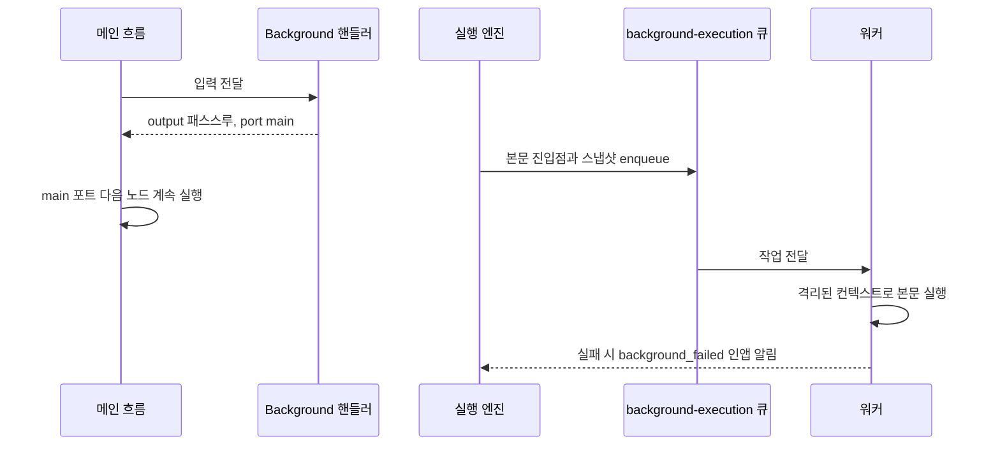

> 구현 상태: 구현됨 · 원문: `spec/4-nodes/1-logic/12-background.md`, `spec/4-nodes/_product-overview.md` (§4.12) · 용어: [용어 사전](../CLE-GLOSSARY.md)

## 개요

Background 노드(Background, `background`)는 `background` 출력 포트에 연결된 노드 묶음을 BullMQ 큐로 떼어 내 비동기로 실행하고 메인 흐름은 `main` 포트로 곧바로 넘기는 fire-and-forget 노드다. Background 본문(background body)의 결과와 실패는 메인 흐름에 영향을 주지 않는다(격리).

Background 노드는 컨테이너가 아니다. `containerId` 멤버십을 쓰지 않고 `background` 출력 포트의 연결선으로 이어진 노드를 본문 진입점으로 본다. 그 진입점에서 앞으로 도달할 수 있는 노드 전체가 Background 본문이다([Logic 노드 공통](CLE-NODE-LOGIC-COMMON.md#컨테이너-패턴)). 핸들러 자체는 단순한 패스스루다. 본문 enqueue 는 핸들러가 끝난 직후 `ExecutionEngineService.scheduleBackgroundBody()` 가 따로 하고 핸들러는 큐를 모른다.

**구현 상태**: 노드 정의·핸들러·BullMQ 큐(`background-execution`)·워커가 모두 `ExecutionEngineService` 에 들어가 있다. 핸들러 실행 직후 `scheduleBackgroundBody()` 가 컨텍스트 스냅샷과 함께 본문 진입점을 enqueue 하고 워커는 `executeBackgroundSubgraph()` 로 진입점에서 앞으로 도달할 수 있는 노드 묶음을 격리된 컨텍스트에서 실행한다.

이 문서는 Background 노드의 설정, 포트, 실행 로직, 격리 계약, 출력 구조, 에러, Background 본문 실행(background run, `backgroundRunId`) 모니터링 API 와 구독 채널을 정한다. 본문 실행 결과를 보여 주는 화면은 [에디터 실행과 디버깅](../CLE-EXEC/CLE-EXEC-RUN.md), 엔진의 큐·컨텍스트 키 격리는 [컨테이너 실행](../CLE-EXEC/CLE-EXEC-CONTAINER.md), 알림 속성은 [알림](../CLE-OBS/CLE-OBS-NOTIFY.md), WebSocket 이벤트 카탈로그는 [WebSocket 이벤트와 명령](../CLE-API/CLE-API-WS-EVENTS.md) 이 정한다.

## 요구사항

- REQ-BGRUN-001 WHEN Background 노드가 실행되면 THE SYSTEM SHALL Background 본문을 메인 흐름을 막지 않고 백그라운드에서 실행한다. (원본: ND-BG-01)
- REQ-BGRUN-002 WHEN Background 노드가 실행되면 THE SYSTEM SHALL 메인 흐름을 곧바로 `main` 포트의 다음 노드로 진행한다. (원본: ND-BG-02)
- REQ-BGRUN-003 IF Background 본문이 실패하고 `notifyOnFailure` 가 `true` 면 THE SYSTEM SHALL 워크스페이스 관리자에게 `background_failed` 인앱 알림을 보낸다. (원본: ND-BG-03)
- REQ-BGRUN-004 WHEN Background 본문 노드가 실행되면 THE SYSTEM SHALL 노드 실행 기록에 `parentNodeExecutionId` 로 Background 노드의 노드 실행 ID 를 남겨 타임라인에서 묶어 보이게 한다. (원본: ND-BG-04)
- REQ-BGRUN-005 WHEN Background 노드를 캔버스에 그리면 THE SYSTEM SHALL 컨테이너 박스로 감싸지 않고 일반 다중 출력 포트 노드로 그린다. (원본: ND-BG-05, 대안 구현)
- REQ-BGRUN-006 WHEN 핸들러가 실행되면 THE SYSTEM SHALL 입력을 바꾸지 않고 `output` 에 복사하고 `port: 'main'` 만 반환한다.
- REQ-BGRUN-007 WHEN 핸들러가 끝나면 THE SYSTEM SHALL 본문 진입점 ID, 컨텍스트 스냅샷, 메인 입력 스냅샷, `notifyOnFailure`, `maxDurationMs` 를 `background-execution` 큐에 넣는다.
- REQ-BGRUN-008 WHEN 워커가 작업을 꺼내면 THE SYSTEM SHALL 새 실행 컨텍스트를 스냅샷으로 채우고 진입점에서 앞으로 도달할 수 있는 노드만 실행한다.
- REQ-BGRUN-009 IF `maxDurationMs` 가 0보다 크고 본문이 그 시간을 넘으면 THE SYSTEM SHALL 본문 실행을 강제로 끝내고 실패로 처리한다.
- REQ-BGRUN-010 IF Background 본문 안의 블로킹 노드가 입력 대기로 멈추면 THE SYSTEM SHALL 본문을 그 지점에서 에러 없이 끝내고 실패로 세지 않으며 알림도 보내지 않는다.
- REQ-BGRUN-011 WHEN Background 본문이 실행되면 THE SYSTEM SHALL 메인의 변수·캐시 변경을 본문에 반영하지 않고 본문의 변경도 메인으로 돌려보내지 않는다.
- REQ-BGRUN-012 WHEN Background 본문 컨텍스트를 만들면 THE SYSTEM SHALL 메모리 안 실행 컨텍스트를 `bg:<executionId>:<backgroundRunId>` 키로 따로 등록하고 본문이 끝나면 자체 finally 에서 지운다.
- REQ-BGRUN-013 IF Background 본문이 실패하면 THE SYSTEM SHALL 메인 실행 상태를 바꾸지 않는다.
- REQ-BGRUN-014 WHEN 메인 흐름의 노드가 표현식을 평가하면 THE SYSTEM SHALL Background 본문 노드의 출력을 참조할 수 없게 한다.
- REQ-BGRUN-015 WHEN 핸들러가 실행되면 THE SYSTEM SHALL UUID v4 `meta.backgroundRunId` 와 분기 시각 `meta.forkedAt` 을 발급한다.
- REQ-BGRUN-016 IF `notes` 가 문자열이 아니거나 `notifyOnFailure` 가 불리언이 아니거나 `maxDurationMs` 가 음수·정수 아님이면 THE SYSTEM SHALL `handler.validate` 에서 거부한다.
- REQ-BGRUN-017 WHEN 사용자가 `GET /api/executions/:executionId/background-runs/:backgroundRunId` 를 호출하면 THE SYSTEM SHALL 본문 실행의 집계 상태, 시각, 노드 실행 기록 페이지 관련 알림을 반환한다.
- REQ-BGRUN-018 WHEN 모니터링 API 가 노드 실행 기록을 반환하면 THE SYSTEM SHALL `startedAt ASC, id ASC` 순서의 cursor 페이지네이션(기본 50, 최대 200)을 적용한다.
- REQ-BGRUN-019 WHEN 모니터링 API 가 노드 실행 기록을 반환하면 THE SYSTEM SHALL `error` · `outputData` · `inputData` 에 응답 값 마스킹을 적용한다.
- REQ-BGRUN-020 IF 호출자가 실행의 워크스페이스 멤버가 아니거나 `executionId` 가 없으면 THE SYSTEM SHALL 403 이 아니라 404 `EXECUTION_NOT_FOUND` 로 응답한다.
- REQ-BGRUN-021 IF `backgroundRunId` 가 그 실행 안에 없으면 THE SYSTEM SHALL 404 `BACKGROUND_RUN_NOT_FOUND` 로 응답한다.
- REQ-BGRUN-022 IF `cursor` 를 해석하지 못하거나 `limit` 이 1~200 밖이면 THE SYSTEM SHALL 400 `INVALID_CURSOR` / `INVALID_LIMIT` 로 응답한다.
- REQ-BGRUN-023 WHEN Background 본문 실행이 시작하거나 끝나면 THE SYSTEM SHALL `background:run:<backgroundRunId>` 구독 채널에 `execution.background_run.started` / `execution.background_run.completed` 이벤트를 보낸다.
- REQ-BGRUN-024 WHEN Background 본문 노드가 실행되면 THE SYSTEM SHALL 노드 이벤트를 메인 `execution:<id>` 구독 채널에 보낸다.
- REQ-BGRUN-025 WHEN 사용자가 `background:run:<id>` 채널을 구독하면 THE SYSTEM SHALL 모니터링 API 와 같은 권한 규칙으로 확인한다.
- REQ-BGRUN-026 WHEN AI 어시스턴트가 실행을 조회하면 THE SYSTEM SHALL `get_background_run` · `list_background_runs` 읽기 전용 도구로 Background 본문 실행을 조회할 수 있게 한다. (미구현)

## 설정

| 필드 | 타입 | 필수 | 기본값 | 설명 |
|------|------|------|--------|------|
| notes | String | | `""` | 본문 작업의 목적·주의 사항 메모. 동작에 영향이 없다(협업용 textarea) |
| notifyOnFailure | Boolean | | `false` | 본문이 실패하면 워크스페이스 관리자에게 인앱 알림을 보낸다(`type: background_failed`, 알림 유형 enum 값) |
| maxDurationMs | Integer | | `300000` | 본문 최대 실행 시간(ms). `0` 은 제한 없음. 기본 5분. `Promise.race` 로 시간 제한을 건다 |

표현식(`{{ }}`)은 쓰지 않는다. 모든 필드는 워크플로우를 정의할 때의 리터럴이다.

코드 기준: `codebase/backend/src/nodes/logic/background/background.schema.ts` (export `backgroundNodeConfigSchema`)

## 설정 화면

| 영역 | 위치 | 들어가는 요소 | 동작 |
|------|------|--------------|------|
| 메모 | 맨 위 | `Notes` 여러 줄 입력(예 "Fan out analytics event after user signup") | `notes` 를 편집한다 |
| 실패 알림 | 가운데 | `Notify on failure` 체크박스 | `notifyOnFailure` 를 켜고 끈다 |
| 최대 시간 | 맨 아래 | `Max duration (ms)` 입력(예 `300000`), 안내 "0 = 무제한" | `maxDurationMs` 를 편집한다 |

## 포트

| 방향 | id | label | type | dynamic | 설명 |
|------|------|-------|------|---------|------|
| 입력 | `in` | Input | data | false | 메인 흐름 데이터(1개 필수). 본문 enqueue 때 스냅샷으로 남긴다 |
| 출력 | `main` | Main | data | false | 입력을 그대로 넘긴다. 핸들러가 곧바로 활성화한다 |
| 출력 | `background` | Background | data | false | 본문 진입점. **핸들러가 활성화하지 않는다**. `ExecutionEngineService` 가 enqueue 한 뒤 별도 실행 컨텍스트에서 활성화한다 |

1. `background` 포트는 `main` 과 비대칭이다. 핸들러는 `port: 'main'` 만 반환하고 `background` 결과는 메인 흐름에 절대 합류하지 않는다(fire-and-forget).
2. 캔버스에서는 컨테이너 박스로 그리지 않고 일반 다중 출력 포트 노드로 그린다. 본문은 `background` 포트 연결선으로 명시적으로 이어지므로 시각적으로도 갈림이 분명하다. 본문이 메인과 같은 캔버스 그래프 안에 평평하게 있다는 뜻을 더 직접 드러낸다.

## 실행 로직

1. 핸들러는 입력을 바꾸지 않고 `output` 에 복사하고 `port: 'main'` 으로 반환한다([Logic 노드 공통](CLE-NODE-LOGIC-COMMON.md#패스스루-규약)).
2. 핸들러가 끝난 직후 `ExecutionEngineService.scheduleBackgroundBody()` 가 BullMQ `background-execution` 큐에 다음을 넣는다.
   - `background` 포트 연결선의 도착 노드 ID 배열(본문 진입점)
   - `context.variables`, `context.nodeOutputCache`, `context.expressionContext` 의 얕은 복사 스냅샷
   - 대화 스레드 스냅샷. `turns` 배열까지 새로 복사해 본문과 메인이 서로의 턴 목록을 건드리지 못하게 한다([대화 스레드](../CLE-IX/CLE-IX-THREAD.md))
   - 메인 입력(`input` 스냅샷)
   - `notifyOnFailure`, `maxDurationMs`
3. `BackgroundExecutionProcessor` 워커가 작업을 꺼내면 `executeBackgroundSubgraph(job)` 이 다음을 한다.
   - 새 `ExecutionContext` 를 만들고 스냅샷으로 채운다.
   - `executeInline(workflowId, input, { entryNodeIds, ... })` 으로 진입점에서 앞으로 도달할 수 있는 노드만 실행한다.
   - `maxDurationMs > 0` 이면 `Promise.race` 로 시간 제한을 건다.
   - 본문 안의 블로킹 노드(form / buttons / ai_conversation)가 입력 대기로 멈추면 `executeInline` 이 `ParkReleaseSignal` 을 던지고 `executeBackgroundSubgraph` 가 이를 잡아 본문을 그 지점에서 곧바로 조용히 끝낸다. fire-and-forget 이라 바깥에서 `continueExecution` 으로 재개할 경로가 없어 입력 대기를 유지할 뜻이 없다. 실패로 세지 않고 `notifyOnFailure` 알림도 보내지 않는다([에러](#에러)).
4. 본문 노드의 노드 실행 기록은 정상으로 만들고 `parentNodeExecutionId` 에 Background 노드 자신의 노드 실행 ID 를 넣는다. 타임라인에서 Background 묶음 아래에 모여 보인다.
5. 본문 실패는 메인 실행 상태에 영향이 없다. `notifyOnFailure: true` 면 관리자에게 인앱 알림을 보낸다.
6. 서버가 다시 시작되면 큐에 남은 작업은 BullMQ 기본 정책으로 큐 재시도한다. 컨텍스트가 사라진 상태라 본문이 실패할 수 있으므로 본문을 멱등하게 만들기를 권한다.



### 격리 계약

1. **변수·캐시 분리**: enqueue 뒤 메인이 `context.variables` 를 바꿔도 본문에는 반영되지 않는다(스냅샷 참조). 본문의 변수 변화도 메인으로 돌아오지 않는다.
2. **컨텍스트 Map 키 격리**: 본문은 노드 실행 묶음과 WebSocket 구독 채널에 쓰려고 메인과 같은 `executionId` 를 쓴다. 메모리 안 `ExecutionContext` 는 별도 키 `bg:<executionId>:<backgroundRunId>` 로 Map 에 등록해 메인 컨텍스트와 격리한다. `executeBackgroundSubgraph` 가 자체 finally 에서 그 키의 컨텍스트를 지우고 이는 메인 `runExecution` finally 의 `deleteContext(executionId)` 와 무관하다. 필드 분류 기준은 [실행 컨텍스트](../CLE-EXEC/CLE-EXEC-CONTEXT.md) 가 정한다.
3. **에러 격리**: 본문 실패는 메인 상태에 영향이 없다.
4. **결과를 돌려주지 않는다**: 본문 마지막 노드의 출력은 메인 흐름의 어떤 노드도 참조할 수 없다. 결과를 기다려야 하면 [Parallel 노드](CLE-NODE-PARALLEL.md) 를 쓴다.

## 출력 구조

Background 는 경로 선택 노드처럼 출력 포트가 두 개지만 핸들러는 `main` 만 반환한다. `background` 포트는 엔진이 별도 실행 컨텍스트에서 활성화하므로 메인 흐름의 `$node["X"]` 로 본문 진입점 결과를 볼 수 없다. JSON 예시는 `undefined` 필드를 생략했고 5필드 밖의 최상위 키는 쓰지 않는다.

### 메인 통과 (`port: 'main'`, 패스스루)

핸들러가 항상 반환하는 케이스다. 메인 흐름의 다음 노드로 입력을 그대로 넘긴다.

```json
{
  "config": {
    "notes": "Fan out analytics event after user signup",
    "notifyOnFailure": true,
    "maxDurationMs": 300000
  },
  "output": { "event": "user_signup", "userId": "u_1" },
  "meta": {
    "durationMs": 0,
    "backgroundRunId": "8f3c6b1a-0d2e-4a7e-9c1d-2f0e5a8b1234",
    "forkedAt": "2026-05-10T05:04:37.123Z"
  },
  "port": "main"
}
```

| 필드 | 타입 | 출처 | 설명 |
|------|------|------|------|
| `config.notes` | string | 설정 에코 | 메모. 핸들러가 `rawConfig.notes` 를 명시적으로 싣는다(spread 로 통째로 싣지 않는다) |
| `config.notifyOnFailure` | boolean | 설정 에코 | 본문 실패 알림 여부(기본 `false`) |
| `config.maxDurationMs` | number | 설정 에코 | 본문 최대 실행 시간 ms(기본 `300000`, `0` 은 제한 없음) |
| `output` | 입력 전체 | 런타임, 패스스루 | 입력 데이터 그대로(변형 없음) |
| `meta.durationMs` | number | 런타임, 핸들러 측정 | 핸들러 자체의 처리 시간(ms). fire-and-forget 이라 보통 0~수 ms. 본문 실행 시간이 아니다 |
| `meta.backgroundRunId` | string (UUID v4) | 런타임, 핸들러 발급 | 실행 안에서 Background 본문 실행을 구별하는 값. [모니터링 API](#모니터링-api) 의 조회 키 |
| `meta.forkedAt` | ISO8601 string | 런타임, 핸들러 측정 | 갈라진 시각(핸들러 진입 시각). enqueue 직후와 거의 같다 |
| `port` | `'main'` | 핸들러 반환 | 항상 `main` (핸들러는 `background` 포트를 활성화하지 않는다) |

`meta.jobId` (실제 BullMQ job ID)는 지금 핸들러 출력에 없다. 핸들러는 큐를 모르므로 발급하지 않는다. `ExecutionEngineService.scheduleBackgroundBody()` 가 큐에 넣은 뒤 노드 실행 기록의 `outputData` 에 기록하는 것은 앞으로 넓힐 지점이다.

표현식 접근 예:

- `$node["X"].output.event` → `"user_signup"` (패스스루)
- `$node["X"].port` → `"main"`
- `$node["X"].config.maxDurationMs` → `300000`
- `$node["X"].meta.backgroundRunId` → `"8f3c6b1a-..."` (모니터링 API 키)
- `$node["X"].meta.forkedAt` → `"2026-05-10T05:04:37.123Z"`
- `$node["X"].meta.durationMs` → `0` (핸들러 쪽 처리 시간)

### 본문 진입 (`background` 포트, fire-and-forget)

핸들러가 활성화하지 않는다. 엔진이 별도 실행 컨텍스트에서 `background` 포트 연결선을 따라 본문 진입점 노드를 활성화한다. 이 흐름은 메인 워크플로우의 `$node["X"]` 로 볼 수 없다. 메인 흐름에 `port: 'background'` 인 노드 출력은 없다.

본문 컨텍스트에서 진입점 노드의 입력은 다음과 같다.

```json
{
  "input": { "event": "user_signup", "userId": "u_1" }
}
```

| 항목 | 출처 | 설명 |
|------|------|------|
| 입력 데이터 | enqueue 시점 스냅샷 | Background 노드의 입력 그대로 |
| `context.variables` | enqueue 시점 스냅샷(얕은 복사) | 메인의 이후 변경은 반영되지 않는다 |
| `context.nodeOutputCache` | enqueue 시점 스냅샷 | 본문에서는 enqueue 시점까지의 메인 노드 출력을 참조할 수 있다 |
| `context.expressionContext` | enqueue 시점 스냅샷 | 표현식 평가용 |
| `context.conversationThread` | enqueue 시점 스냅샷(`turns` 배열까지 새로 복사) | 본문에서 쌓인 턴은 메인 스레드에 들어가지 않고 반대도 같다. 필드가 없는 옛 큐 작업은 빈 스레드로 시작한다([대화 스레드](../CLE-IX/CLE-IX-THREAD.md), [컨테이너 실행](../CLE-EXEC/CLE-EXEC-CONTAINER.md#background-본문-실행)) |
| `parentNodeExecutionId` | Background 노드의 노드 실행 ID | 본문 노드 실행 기록에 넣는다 |

메인 흐름에서는 본문 결과를 읽을 수 없다.

- `$node["X"].output` 은 `main` 케이스의 입력 패스스루다. 본문 마지막 노드의 결과가 아니다.
- `$node["<본문 노드>"].output` 은 메인 흐름 표현식에서 참조할 수 없다(별도 실행 컨텍스트).
- 메인의 뒤 노드에서 본문 상태를 보려면 `meta.backgroundRunId` 를 키로 [모니터링 API](#모니터링-api) 를 따로 부른다.

기다려야 하는 갈림에는 Parallel 을 쓴다. Background 는 fire-and-forget 전용이다. 결과를 메인 흐름에 합쳐야 하면 [Parallel 노드](CLE-NODE-PARALLEL.md) 의 `branches` 를 쓴다.

## 에러

Background 핸들러는 런타임 에러 포트가 없다. 설정 검증은 스키마가 모두 맡고(모든 필드에 zod 기본값이 있다) 사전 검증 에러 말고는 에러 케이스가 없다.

| 발생 조건 | 메시지 | 시점 |
|-----------|--------|------|
| `notes` 가 문자열 아님 | `notes must be a string` | `handler.validate` (`evaluateMetadataBlockingErrors`) |
| `notifyOnFailure` 가 불리언 아님 | `notifyOnFailure must be a boolean` | `handler.validate` |
| `maxDurationMs` 가 음수 | `maxDurationMs must be >= 0` | `handler.validate` |
| `maxDurationMs` 가 정수 아님 | `maxDurationMs must be an integer` | `handler.validate` |

Background 본문 실패는 메인의 에러 코드가 되지 않는다. 본문 노드 실행 기록(`parentNodeExecutionId` 표시)과 `notifyOnFailure: true` 의 관리자 인앱 알림으로만 드러난다.

| 본문 실패 유형 | 처리 |
|-------------------|------|
| 본문 노드가 에러를 던짐 | 해당 노드 실행 실패. `notifyOnFailure: true` 면 관리자 알림 |
| `maxDurationMs` 초과 | `Promise.race` 시간 제한으로 본문 실행 강제 종료. `notifyOnFailure: true` 면 알림 |
| 본문에 블로킹 노드(form / buttons / ai_conversation)가 있어 입력 대기 발생 | `ParkReleaseSignal` 로 본문을 곧바로 조용히 끝낸다. 실패가 아니라 `notifyOnFailure` 알림을 보내지 않는다. 바깥에서 `continueExecution` 으로 재개할 수 없다. 이 경우 위 `maxDurationMs` 행은 발동하지 않는다 |
| 서버 재시작 | BullMQ 기본 큐 재시도 적용. 컨텍스트가 사라지면 본문이 실패할 수 있어 본문 멱등성을 권한다 |

## 설정 요약

- 형식: `notifyOnFailure` / `maxDurationMs` 요약. 알림이 꺼져 있으면 시간만 표시한다.
- 예: `notify on fail · 5m`
- 현재 구현은 `background.schema.ts` 에 `summaryTemplate` 이 없어 캔버스에 이 요약을 표시하지 않는다. [Logic 노드 공통](CLE-NODE-LOGIC-COMMON.md#미결-사항) 참조.
- 옛 캔버스 문서는 알림 채널을 보이는 다른 형식(예 `notify: in_app, email`)을 적었다. 이 노드에는 알림 채널 설정이 없고 인앱 알림만 보낸다. 형식은 정의가 갈린다. [Logic 노드 공통 미결 사항](CLE-NODE-LOGIC-COMMON.md#미결-사항) 참조.

## 모니터링 API

핸들러가 [메인 통과](#메인-통과-port-main-패스스루) 케이스에서 발급한 `meta.backgroundRunId` 를 키로, 메인 흐름의 뒤 노드나 실행 결과 화면이 Background 본문 실행 상태를 조회한다. 격리 계약은 그대로 유지한다. 이 API 는 읽기 전용이고 본문 결과를 메인 흐름에 합류시키지 않는다.

### 엔드포인트

```
GET /api/executions/:executionId/background-runs/:backgroundRunId
```

| 파라미터 | 위치 | 타입 | 설명 |
|----------|------|------|------|
| `executionId` | path | UUID | 메인 워크플로우 실행 ID. 권한 확인의 1차 키(워크스페이스 소속 확인) |
| `backgroundRunId` | path | UUID v4 | `meta.backgroundRunId`. 그 실행 안에서 Background 노드의 본문 실행 식별자 |
| `cursor` | query | string | `nodeExecutions` 페이지네이션 cursor(불투명 값). 없으면 첫 페이지 |
| `limit` | query | int (1~200) | 페이지 크기(기본 50). `nodeExecutions` 만 페이지네이션 대상 |

URL 은 중첩 구조(`executions/:id/background-runs/:id`)를 쓴다. 이유는 [Rationale](#rationale) 에 있다.

### 응답

```json
{
  "backgroundRunId": "8f3c6b1a-0d2e-4a7e-9c1d-2f0e5a8b1234",
  "executionId": "5d8e7f2a-...",
  "parentNodeExecutionId": "a1b2c3d4-...",
  "status": "running",
  "startedAt": "2026-05-15T05:04:37.123Z",
  "completedAt": null,
  "durationMs": null,
  "nodeExecutions": {
    "data": [ /* NodeExecution[] */ ],
    "nextCursor": "eyJpZCI6IjEyMyJ9",
    "hasMore": true
  },
  "notifications": [ /* Notification[] */ ]
}
```

| 필드 | 타입 | 설명 |
|------|------|------|
| `backgroundRunId` | string (UUID v4) | 요청 값 |
| `executionId` | string (UUID) | 메인 실행 ID |
| `parentNodeExecutionId` | string (UUID) | Background 노드 자신의 `NodeExecution.id`. 본문 노드들이 이 ID 를 `parentNodeExecutionId` 로 받는다 |
| `status` | `'pending' \| 'running' \| 'completed' \| 'failed'` | 본문 집계 상태. `pending` 은 본문 노드가 아직 실행 전, `running` 은 일부 본문 노드가 진행 중이거나 기다리는 중, `completed` 는 모든 본문 노드가 completed / skipped, `failed` 는 하나 이상 failed (메인 상태와 무관). `cancelled` 상태는 내지 않는다. 원문은 메인 실행 취소가 본문 실행으로 전파되는 흐름이 없기 때문이라고 적지만 현재 구현은 다르다([미결 사항](#미결-사항)) |
| `startedAt` | ISO8601 | 본문 enqueue 시각(`meta.forkedAt` 과 같은 기준) |
| `completedAt` | ISO8601 \| null | 본문 종료 시각. `status` 가 `running` / `pending` 이면 null |
| `durationMs` | number \| null | `completedAt - startedAt` (서버 계산). 진행 중이면 null |
| `nodeExecutions.data` | NodeExecution[] | 본문 노드들의 노드 실행 기록. `parentNodeExecutionId = <Background 노드의 NodeExecution.id>` 로 거른다. 모양은 [에디터 실행과 디버깅](../CLE-EXEC/CLE-EXEC-RUN.md) 의 노드별 입출력 데이터와 같다. `error` · `outputData` · `inputData` 는 응답에서 값 패턴 마스킹을 거친다(자격 증명 모양 부분 문자열 → `***`, DB 에는 원문 보존). 실행 상세(`GET /api/executions/:id`)의 `nodeExecutions[]` 와 같은 관문이고 기준은 [응답 자격 증명 마스킹](../CLE-API/CLE-API-EGRESS.md) 이다. 여기서 `inputData` 도 마스킹 대상이다. 지금은 실행 수준과 노드 수준 모두 마스킹한다 |
| `nodeExecutions.nextCursor` | string \| null | 다음 페이지 cursor. `hasMore: false` 면 null |
| `nodeExecutions.hasMore` | boolean | 다음 페이지가 있는지 |
| `notifications` | Notification[] | 이 본문 실행과 관련된 알림. `type: background_failed` (`config.notifyOnFailure: true` 면 발행. 노드 실패와 `maxDurationMs` 시간 초과를 모두 포함). 관련 여부는 알림의 `background_run_id` 컬럼(본문 실행별 귀속 전용)으로 조회한다. 딥링크용 `resource_type` / `resource_id` (워크플로우)와 따로 둔다([알림](../CLE-OBS/CLE-OBS-NOTIFY.md)) |

### 페이지네이션

`nodeExecutions` 만 cursor 페이지네이션 대상이다. `notifications` 는 본문 실행마다 보통 0~몇 건이라 전부 반환한다.

1. 정렬 키는 `NodeExecution.startedAt ASC, id ASC` 다(안정 순서. 노드 실행 엔티티에 `createdAt` 컬럼이 없어 `startedAt` 을 쓴다).
2. cursor 는 불투명한 base64 값이다. 클라이언트는 해석하지 않고 응답의 `nextCursor` 를 다음 요청에 그대로 넘긴다.
3. `limit` 기본값은 50, 최대 200 이다.
4. 빈 페이지는 `data: [], nextCursor: null, hasMore: false` 다.

### 권한

1. `executionId` 가 가리키는 메인 실행의 워크스페이스 멤버만 조회할 수 있다.
2. 멤버가 아니거나 `executionId` 가 없으면 404 로 응답한다. 403 으로 응답하면 공격자가 ID 존재 여부를 추론할 수 있어 IDOR 차단을 위해 404 로 통일한다(`ExecutionsController.findOne` 과 같은 방식).
3. `backgroundRunId` 가 그 실행 안에 없으면 404 다.
4. 역할 기반 추가 제한(뷰어 차단 등)은 지금 두지 않는다. 기존 `ExecutionsController` 단건 조회도 워크스페이스 멤버면 허용하므로 맞춘다. 역할 기반 차단이 필요해지면 두 엔드포인트에 `RolesGuard` 를 함께 적용한다. 권한 매트릭스는 [워크스페이스와 멤버](../CLE-ACCT/CLE-ACCT-WS.md) 가 정한다.
5. [에디터 실행과 디버깅](../CLE-EXEC/CLE-EXEC-RUN.md#background-본문-결과) 의 Background 본문 결과 섹션도 이 권한 규칙을 따른다.

### 실시간 갱신 (WebSocket 구독 채널)

본문 진행을 실시간으로 받으려면 별도 구독 채널을 구독한다. 이벤트 카탈로그는 [WebSocket 이벤트와 명령](../CLE-API/CLE-API-WS-EVENTS.md) 에 있다.

| 구독 채널 | 이벤트 | payload |
|------|--------|---------|
| `background:run:<backgroundRunId>` | `execution.background_run.started` | `{ backgroundRunId, executionId, parentNodeExecutionId, startedAt }` |
| 같음 | `execution.background_run.completed` | `{ backgroundRunId, executionId, parentNodeExecutionId, status: 'completed' \| 'failed', completedAt, durationMs, errorMessage? }` |

1. 본문 안의 노드 이벤트(`execution.node.started` 등)는 기존 `execution:<id>` 구독 채널에 그대로 보낸다. 본문 노드의 `parentNodeExecutionId` 가 Background 노드의 `NodeExecution.id` 와 같으므로 클라이언트가 그 키로 걸러 본문 카드 안 타임라인을 갱신한다.
2. `background:run:<id>` 채널은 본문 실행 수명 주기 이벤트만 보낸다. 채널 책임을 좁혀 메인 채널과 데이터가 겹치지 않게 한다.
3. 이 채널은 기존 `execution:<id>` 와 격리된다. 메인 흐름 구독자에게 본문 실행 수준 이벤트가 가지 않고 반대도 같다(격리 계약의 사용자 가시 표현).
4. 구독 권한은 [권한](#권한) 과 같다. `backgroundRunId` 로 `executionId` 를 역조회해 워크스페이스를 확인한다.
5. 본문이 끝나면 채널은 더 이벤트를 보내지 않는다. 다시 구독해도 서버가 마지막 상태 스냅샷을 보내지 않으므로 REST GET 으로 조회한다.
6. `execution.background_run.completed` 의 `status` 는 `completed` 와 `failed` 두 값이다. `cancelled` 값은 보내지 않는다. 현재 구현(`background-execution.processor.ts`)은 본문 실행 함수가 정상 반환하면 `completed`, 예외로 끝나면 `failed` 를 보낸다. 입력 대기로 조용히 끝난 본문과 메인 실행 중지를 알아채고 멈춘 본문은 모두 `completed` 로 보낸다. 본문 취소를 어떻게 표시할지는 정의가 갈린다. [미결 사항](#미결-사항) 참조.

### AI 어시스턴트 도구 노출 (계획)

AI 어시스턴트의 읽기 전용 실행 조회 도구(`ED-AI-35~38`)가 이 API 로 Background 본문 실행도 조회하게 하는 계획(Planned)이다. 에디터 PRD 의 "직계 자식 실행(서브 워크플로우 1단계)" 정책을 Background 에 적용해, 어시스턴트가 "왜 background 가 실패했나" 같은 질문에 답할 수 있게 한다.

| 도구(가칭) | 대응 |
|-------------|------|
| `get_background_run(executionId, backgroundRunId)` | 위 GET 단건 조회. cursor 페이지네이션 옵션 |
| `list_background_runs(executionId)` | 실행의 모든 Background 노드 노드 실행 기록을 돌며 `meta.backgroundRunId` 목록 반환. `ED-AI-35` 직계 자식 확장 |

도구 상세는 [AI 어시스턴트 도구](../CLE-WF/CLE-WF-ASSIST-TOOLS.md) 가 정하기로 했지만 그 문서의 탐색 도구 목록과 에디터 요구사항 `ED-AI-35` 에 두 도구가 없고 현재 구현(`TOOL_KIND_BY_NAME`)에도 없다. 도입이 결정되기 전까지 이 절은 계획이다. [AI 어시스턴트 도구 미결 사항](../CLE-WF/CLE-WF-ASSIST-TOOLS.md#미결-사항) 참조.

### API 에러 코드

| HTTP | 코드 | 발생 조건 |
|------|------|-----------|
| 400 | `INVALID_CURSOR` | cursor 디코딩 실패 |
| 400 | `INVALID_LIMIT` | `limit` 이 1 미만 또는 200 초과 |
| 401 | (인증 미들웨어) | 토큰 없음 / 만료 |
| 404 | `EXECUTION_NOT_FOUND` | `executionId` 없음 또는 워크스페이스 불일치(IDOR 차단. 403 으로 새지 않는다) |
| 404 | `BACKGROUND_RUN_NOT_FOUND` | `backgroundRunId` 가 그 실행에 없음 |

이 API 는 외부 부수 효과가 없으므로 5xx 는 표준 NestJS 핸들러에 맡긴다(DB 장애 등).

## 미결 사항

- **AI 어시스턴트 조회 도구의 도입 여부** (warning): 이 문서는 `get_background_run` · `list_background_runs` 를 어시스턴트가 쓸 수 있고 상세는 어시스턴트 문서가 정한다고 적었다. [AI 어시스턴트 도구](../CLE-WF/CLE-WF-ASSIST-TOOLS.md) 와 [워크플로우 AI 어시스턴트](../CLE-WF/CLE-WF-ASSIST.md) 의 탐색 도구 목록에는 두 도구가 없고 에디터 PRD `ED-AI-35` 는 도구 2종만 정의한다. 현재 구현(`TOOL_KIND_BY_NAME`)에도 없다. 결정 전까지 이 문서는 해당 절을 계획으로 둔다. 결정은 [AI 어시스턴트 도구 미결 사항](../CLE-WF/CLE-WF-ASSIST-TOOLS.md#미결-사항) 에서 한다.
- **본문 취소를 종결 상태로 표시할지** (warning): 이 문서의 원문은 본문 실행 종결 상태를 `completed` · `failed` 로만 정하고, 메인 실행 취소가 본문으로 전파되지 않아 `cancelled` 를 보내지 않는다고 적는다. 에디터 실행 원문은 `execution.background_run.completed` 를 받으면 카드 배지를 `completed` · `failed` · `cancelled` 가운데 최종 상태로 바꾼다고 적었다. [에디터 실행과 디버깅](../CLE-EXEC/CLE-EXEC-RUN.md#background-본문-결과) 은 이 문서의 이벤트 정의를 따르도록 값 나열을 지웠다. 현재 구현은 원문과 달리 메인 실행 중지를 본문도 알아챈다. 본문이 메인과 같은 `executionId` 를 쓰므로 [노드 취소 §DB 관측 취소 가드](../CLE-EXEC/CLE-EXEC-CANCEL.md#db-관측-취소-가드) 가 본문 안에서도 중지를 관측하고 `ExecutionCancelledError` 로 본문을 멈춘다. `executeBackgroundSubgraph` 는 이 에러를 입력 대기 종료처럼 조용히 삼킨다. 그래서 이벤트는 `completed` 로 가고 실패 알림과 큐 재시도는 없다(`execution-engine.service.ts`). REST 응답 타입(`BackgroundRunStatus`)에도 `cancelled` 가 없다. 중지로 멈춘 본문을 `completed` 로 둘지, REST `status` 와 이벤트 `status` 에 `cancelled` 를 더할지 결정 필요.

## 구현 위치

- `codebase/backend/src/nodes/logic/background/background.*.ts`
- `codebase/backend/src/modules/executions/background-runs/**` (모니터링 API)
- `codebase/backend/src/modules/execution-engine/**` (`scheduleBackgroundBody`, `executeBackgroundSubgraph`, `BackgroundExecutionProcessor`)
- `codebase/frontend/src/lib/websocket/use-background-run.ts` (구독 채널 클라이언트)
- `codebase/backend/src/shared/utils/redact-stored-error.ts` (응답 `error` 마스킹)

## Rationale

### 실행 컨텍스트 Map 키를 나눈다

Background 본문은 BullMQ 워커에서 fire-and-forget 으로 비동기 실행된다. 예전에는 부모와 같은 `executionId` 를 메모리 안 컨텍스트 Map 키로 함께 썼다. 부모 실행이 (보통 본문보다 먼저) 끝나며 `deleteContext(executionId)` 를 부르면 본문이 쓰던 컨텍스트가 같은 키로 지워졌고 뒤이은 `setNodeOutput` 이 "Execution context not found" 로 실패했다.

해결: 본문은 별도 Map 키 `bg:<executionId>:<backgroundRunId>` 를 쓰고 `executeBackgroundSubgraph` 의 자체 finally 로 정리한다. `executionId` 는 노드 실행 묶음·WebSocket 구독 채널(`execution:<id>`)·권한의 1차 키라서 그대로 두고 메모리 안 Map 키만 나눴다. 기존 격리 계약(변수·캐시 스냅샷 격리)을 키 수준으로 넓힌 것이다. 필드 분류와 `_contextKey` 결정의 기준은 [실행 컨텍스트](../CLE-EXEC/CLE-EXEC-CONTEXT.md) 에 있다.

### URL 을 중첩 구조로 둔다

`GET /api/executions/:executionId/background-runs/:backgroundRunId` 로 중첩한 이유는 다음과 같다.

- `backgroundRunId` 는 UUID v4 라 전역에서 유일하므로 `GET /api/background-runs/:backgroundRunId` 같은 평평한 URL 도 기술적으로는 가능하다.
- 그러나 `meta.backgroundRunId` 는 별도 컬럼이 아니라 `NodeExecution.outputData` JSONB 안에 있다. 평평한 URL 로 따로 조회하면 JSONB 전체 스캔 위험이 있다. `executionId` 범위 안에서 조회해 검색 범위를 좁힌다.
- 권한 확인이 단순해진다. `executionId` 1차 키로 워크스페이스를 확인한 뒤 `backgroundRunId` 를 확인한다. 평평한 URL 은 backgroundRunId → NodeExecution → executionId → 워크스페이스 사슬이 필요하다.
- REST 의미로도 본문 실행은 실행에 딸린 자원이다.

조회 성능은 `NodeExecution.outputData` JSONB 의 `meta.backgroundRunId` 경로에 대한 부분 식 B-tree 인덱스(`output_data #>> '{meta,backgroundRunId}'`, `WHERE ... IS NOT NULL`)로 보강한다. Background 노드의 노드 실행 행만 색인해 크기를 줄인다(`migrations/V047__node_execution_background_run_id_index.sql`). 조회는 `executionId` 범위와 이 식 인덱스를 함께 쓴다.

### 페이지네이션을 처음부터 둔다

`nodeExecutions` 에 처음부터 cursor 페이지네이션을 넣었다.

- 본문이 수십 노드 이하면 단순 응답으로도 충분하다. 그러나 본문에 Loop · ForEach 가 있으면 노드 실행 기록이 수백 건으로 늘 수 있다.
- 나중에 `?limit=` 만 더하는 것은 호환을 깨지 않는다. 하지만 클라이언트가 `data: [...]` 단순 배열을 가정하면 응답 모양을 바꿀 때 호환이 깨진다. 그래서 처음부터 `{ data, nextCursor, hasMore }` 로 고정했다.
- 정렬 키 `(startedAt ASC, id ASC)` 는 안정 순서라 같은 시각에 시작한 노드의 순서가 흔들리지 않는다.

### 본문 실행 수명 주기 이벤트를 별도 구독 채널로 나눈다

`background:run:<id>` 채널을 `execution:<id>` 와 따로 운영한다.

- 본문 실행 수준 이벤트(시작·종료)를 메인 흐름 구독자에게 보내면 클라이언트의 이벤트 라우팅과 카운터가 오염된다. 격리 계약의 사용자 가시 표현이다. 본문 노드 이벤트는 `parentNodeExecutionId` 로 거를 수 있어 메인 채널에 그대로 둔다.
- 메인 실행이 끝나도 Background 구독이 살아 있을 수 있다(메인 뒤 노드가 `backgroundRunId` 만 받고 실시간 관찰을 시작하는 경우). 본문이 끝나면 채널은 더 이벤트를 보내지 않는다.
- 사용자가 `backgroundRunId` 를 알아야 구독할 수 있다. 메인 실행자만 알 수 있는 키라서 권한이 더 드러날 위험이 없다.

### AI 어시스턴트에 읽기 전용 도구로만 노출한다 (계획)

이 절은 도구를 도입할 때의 설계 방향이다. 도입 여부는 [AI 어시스턴트 도구 미결 사항](../CLE-WF/CLE-WF-ASSIST-TOOLS.md#미결-사항) 에서 정한다. 에디터 PRD 의 "직계 자식 실행(서브 워크플로우 1단계)" 정책을 Background 본문 실행에 적용한다.

- Background 는 fire-and-forget 이지만 사용자에게는 "메인 실행의 비동기 자식" 이다. 어시스턴트가 "왜 background 가 실패했나" 에 답하려면 본문 노드 실행 기록을 읽어야 한다.
- 읽기 전용 도구로만 노출한다. 어시스턴트가 Background 재실행이나 취소 같은 부수 효과를 일으킬 수 없다.
- 깊이 1로 제한한다. Background 본문 안의 서브 워크플로우까지는 노출하지 않는다(토큰·권한 폭증 차단).

### 본문의 블로킹 노드가 입력 대기로 멈추면 곧바로 조용히 끝낸다

예전에는 본문 안의 블로킹 노드(form / buttons / ai_conversation)가 입력 대기로 멈추면 `pendingContinuations` 에 등록된 채 `maxDurationMs` 까지 매달려 있다가 시간 초과 실패로 끝났다(`notifyOnFailure` 알림이 갈 수 있었다). 입력 대기를 DB 에 보존하는 방식(durable park)을 도입한 뒤로는 `executeInline` 이 멈추는 순간 `ParkReleaseSignal` 을 던지고 `executeBackgroundSubgraph` 가 이를 잡아 본문을 곧바로 조용히 끝낸다. Background 는 fire-and-forget 이라 바깥에서 `continueExecution` 으로 재개할 경로가 없어 입력 대기를 보존할 뜻이 없기 때문이다.

사용자에게 보이는 동작이 바뀌었다. 전에는 시간 초과 실패로 보였지만 지금은 에러 없이 그 지점에서 조용히 끝난다(실패로 세지 않고 알림도 보내지 않는다). 본문에 블로킹 노드를 두는 구성 자체를 권하지 않는다. 사용자 입력을 기다려야 하면 메인 흐름에 둔다.
