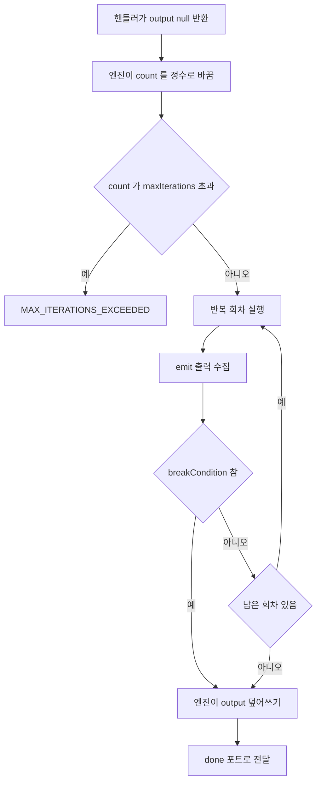

> 구현 상태: 구현됨 · 원문: `spec/4-nodes/1-logic/3-loop.md`, `spec/4-nodes/_product-overview.md` (§4.3) · 용어: [용어 사전](../CLE-GLOSSARY.md)

## 개요

Loop 노드(Loop, `loop`)는 정한 횟수만큼 컨테이너 본문을 반복 실행하는 컨테이너다. 핸들러는 `output: null` 을 반환하고 모든 반복 회차가 끝나면 엔진이 `output` 을 `{ iterations, count }` 로 덮어쓴다.

이 문서는 Loop 노드의 설정, 포트, 실행 로직, 반복 컨텍스트 변수(`$loop`), 출력 구조, 에러를 정한다. 컨테이너 패턴(포트 구성, emit 규칙, 본문 제약)과 엔진 덮어쓰기 계약은 [Logic 노드 공통](CLE-NODE-LOGIC-COMMON.md) 이 정한다. 엔진이 본문을 도는 방식과 중첩 컨테이너 스코프는 [컨테이너 실행](../CLE-EXEC/CLE-EXEC-CONTAINER.md) 이, `$loop` 같은 표현식 변수의 전체 목록은 [표현식 언어](../CLE-WF/CLE-WF-EXPR.md) 가 정한다. 캔버스에서 컨테이너를 그리는 방식은 [워크플로우 에디터와 캔버스](../CLE-WF/CLE-WF-EDITOR.md) 가 정한다.

## 요구사항

- REQ-LOOP-001 WHEN Loop 노드가 실행되면 THE SYSTEM SHALL 정한 횟수만큼 컨테이너 본문을 차례로 반복 실행한다. (원본: ND-LP-01)
- REQ-LOOP-002 WHEN 사용자가 반복 횟수를 설정하면 THE SYSTEM SHALL 정수 리터럴, 숫자 문자열, 표현식을 모두 받는다. (원본: ND-LP-02)
- REQ-LOOP-003 WHILE 컨테이너 본문이 실행되는 동안 THE SYSTEM SHALL 본문 노드가 `$loop.index` 로 현재 반복 인덱스를 읽을 수 있게 한다. (원본: ND-LP-03)
- REQ-LOOP-004 WHEN `breakCondition` 이 설정돼 있으면 THE SYSTEM SHALL 반복 회차마다 본문 실행 직후 그 식을 평가하고 참이면 즉시 반복을 끝낸다. (원본: ND-LP-04)
- REQ-LOOP-005 WHEN 사용자가 `maxIterations` 를 설정하면 THE SYSTEM SHALL 그 값을 반복 상한으로 써서 무한 반복을 막는다. (원본: ND-LP-05)
- REQ-LOOP-006 WHEN Loop 노드를 캔버스에 그리면 THE SYSTEM SHALL 자식 노드를 감싸는 그룹 박스 없이 일반 노드와 같은 크기의 컨테이너로 그린다. (원본: ND-LP-06)
- REQ-LOOP-007 IF `count` 가 `maxIterations` 보다 크면 THE SYSTEM SHALL `MAX_ITERATIONS_EXCEEDED` 에러를 던진다.
- REQ-LOOP-008 IF 반복 인덱스가 `maxIterations` 에 이르면 THE SYSTEM SHALL `MAX_ITERATIONS_EXCEEDED` 에러를 던진다.
- REQ-LOOP-009 IF `breakCondition` 평가가 실패하면 THE SYSTEM SHALL 에러를 던지지 않고 거짓으로 보고 반복을 계속한다.
- REQ-LOOP-010 WHEN 두 번째 이후 반복 회차를 시작하면 THE SYSTEM SHALL 직전 회차의 emit 출력을 본문 입력으로 넘기고 첫 회차 입력은 `undefined` 로 둔다.
- REQ-LOOP-011 WHILE 컨테이너 본문이 실행되는 동안 THE SYSTEM SHALL `$loop` 표현식 변수로 `index`, `iteration`, `isFirst`, `isLast` 네 키를 노출한다.
- REQ-LOOP-012 WHEN 모든 반복 회차가 끝나면 THE SYSTEM SHALL 노드 `output` 을 `{ iterations, count }` 로 덮어쓰고 `done` 포트로 보낸다.
- REQ-LOOP-013 WHEN 반복이 끝나면 THE SYSTEM SHALL 실제 반복 수와 종료 이유를 `meta.iterations`, `meta.maxIterationsReached`, `meta.exitReason` 에 싣는다.
- REQ-LOOP-014 WHEN 핸들러가 시작 시점 출력을 반환하면 THE SYSTEM SHALL `output: null` 을 반환해 엔진 덮어쓰기를 알린다.
- REQ-LOOP-015 IF `count` 가 숫자로 해석되지 않거나 0 이하이거나 `maxIterations` 가 숫자로 해석되지 않으면 THE SYSTEM SHALL 사전 검증 에러로 실행을 실패시킨다.
- REQ-LOOP-016 IF `count` 와 `maxIterations` 가 모두 숫자 리터럴이고 `count > maxIterations` 면 THE SYSTEM SHALL `handler.validate` 에서 거부한다.
- REQ-LOOP-017 IF `emit` 포트에 본문 노드가 없거나 2개 이상이거나 본문 노드가 아니면 THE SYSTEM SHALL 엔진 사전 검증에서 실행을 실패시킨다.
- REQ-LOOP-018 IF 스키마를 거치지 않은 설정으로 `count` 가 0·빈 문자열·`null` 로 들어오면 THE SYSTEM SHALL 엔진에서 `INVALID_CONTAINER_PARAM` 에러를 던진다.
- REQ-LOOP-019 WHEN 새 Loop 노드를 만들면 THE SYSTEM SHALL `count` 기본값을 `'1'` 로 채운다.
- REQ-LOOP-020 WHILE Loop 노드가 실행 중인 동안 THE SYSTEM SHALL 컨테이너 헤더에 현재 진행 인덱스(예 `Iteration 3/10`)를 표시한다.

## 설정

| 필드 | 타입 | 필수 | 기본값 | 설명 |
|------|------|------|--------|------|
| count | Expression \| Integer | ✓ | `'1'` | 반복 횟수. 정수 리터럴(`10`), 숫자 문자열(`"10"`), 표현식(`{{ $input.count }}`)을 받는다. 표현식은 엔진이 평가할 때 정수로 해석돼야 한다. 기본 `'1'` 은 "최소 1회 반복" 정책이다([Rationale](#rationale)) |
| maxIterations | Integer | | `1000` | 최대 반복 횟수(안전 상한). [Logic 노드 공통](CLE-NODE-LOGIC-COMMON.md#리소스-제한). `count` 가 이 값을 넘으면 `MAX_ITERATIONS_EXCEEDED` |
| breakCondition | Expression? | | `undefined` | 불리언 표현식(선택). 반복 회차가 끝날 때마다 평가하고 참이면 일찍 끝낸다(`meta.exitReason='break'`). `$loop.index`, `$var.*`, `$node[...].output` 등을 참조할 수 있다. 평가가 실패하면 거짓으로 보고 계속한다(`execution-engine.service.ts` 의 `buildLoopBreakConditionEvaluator` 가 `evaluate()` 호출을 try/catch 로 감싼다) |

코드 기준: `codebase/backend/src/nodes/logic/loop/loop.schema.ts` (export `loopNodeConfigSchema`, `validateLoopConfig`)

## 설정 화면

| 영역 | 위치 | 들어가는 요소 | 동작 |
|------|------|--------------|------|
| 반복 횟수 | 맨 위 | `Count` 입력(정수 또는 `{{ ... }}`) | `count` 를 편집한다 |
| 최대 반복 | 가운데 | `Max Iterations` 입력(예 `1000`) | `maxIterations` 를 편집한다 |
| Break 조건 | 맨 아래 | `Break Condition (optional)` 표현식 입력(예 `{{ $loop.index >= 5 }}`) | `breakCondition` 을 편집한다 |

## 포트

| 방향 | id | label | type | dynamic | 설명 |
|------|------|-------|------|---------|------|
| 입력 | `in` | Input | data | false | 외부에서 컨테이너로 들어오는 데이터. Loop 는 `count` 로 도는 컨테이너라서 이 입력을 첫 회차 본문 입력으로 쓰지 않는다 |
| 입력 | `emit` | Emit | data | false | 컨테이너 본문에서 결과를 모으는 지점. 본문 노드가 정확히 1개 연결돼야 한다(`CONTAINER_MISSING_EMIT` / `CONTAINER_MULTIPLE_EMIT`) |
| 출력 | `body` | Body | data | false | 컨테이너 본문 진입점. 반복 회차마다 첫 노드로 데이터를 넘긴다(직전 회차 결과가 다음 회차 입력) |
| 출력 | `done` | Done | data | false | 모든 반복 회차가 끝난 뒤 모은 결과를 넘긴다. 다음 노드는 [완료 시점](#완료-시점-done-포트) 형태를 본다 |

Loop 는 동적 포트가 없다.

## 실행 로직

1. **시작 시점(핸들러 실행)**: `LoopHandler.execute` 가 `{ config: { count, maxIterations }, output: null }` 을 반환한다. 엔진은 `output: null` 을 보고 엔진 덮어쓰기 계약을 활성화한다.
2. **count 평가**: 엔진이 `engineResolvedConfig.count` 를 정수로 바꾼다(`coerceContainerNumber`). `count > maxIterations` 면 곧바로 `MAX_ITERATIONS_EXCEEDED` 를 던진다.
3. **반복 실행**: `LoopExecutor.execute` 가 인덱스 0 부터 `count - 1` 까지 컨테이너 본문을 차례로 실행한다. 반복 회차마다 `context.loopContext = { index, count, isFirst, isLast }` 를 묶는다.
4. **emit 수집**: 반복 회차마다 `emit` 포트에 연결된 본문 노드의 출력을 `LoopIterationResult { index, output }` 으로 모은다.
5. **회차 사이 입력 전달**: i 번째 회차의 본문 입력은 (i-1) 번째 회차의 emit 출력이다. 첫 회차(i=0)의 입력은 `undefined` 다.
6. **breakCondition 확인**: 반복 회차가 끝날 때마다(본문 실행 직후) 엔진이 `config.breakCondition` 을 새로 만든 `expressionContext` 로 평가한다. 이 컨텍스트에는 현재 `$loop.*`, `$var.*`, 본문 노드들의 최신 `$node[...].output` 이 들어 있다. 참이면 곧바로 끝내고 `meta.exitReason='break'` 를 남긴다. 평가 에러는 거짓으로 본다.
7. **maxIterations 확인**: 반복 인덱스 i 가 `maxIterations` 에 이르면 `MAX_ITERATIONS_EXCEEDED` 를 던진다.
8. **완료 시점(엔진 덮어쓰기)**: `collected.iterations.map(r => r.output)` 으로 `iterations` 배열을 만들고 엔진이 `output` 을 `{ iterations, count: iterations.length }` 로 덮어쓴다. 그다음 `done` 포트로 보낸다. 실제 반복 수는 `output.count`, `output.iterations.length`, `meta.iterations` 어느 것으로 읽어도 같다. 사용자 설정값 `config.count` 와는 다른 값이다.



### 반복 컨텍스트 변수

컨테이너 본문 안에서 다음 변수를 읽을 수 있다.

| 변수 | 타입 | 설명 |
|------|------|------|
| `$loop.index` | number | 현재 반복 인덱스(0부터) |
| `$loop.iteration` | number | 1부터 센 반복 횟수(`index + 1`) |
| `$loop.isFirst` | boolean | 첫 회차 여부(`index === 0`) |
| `$loop.isLast` | boolean | 마지막 회차 여부(`index === count - 1`) |

1. 반복 컨텍스트(`$loop`) 표현식 뷰는 위 4개 키만 노출한다. 반복 변수의 표현식 표면은 [표현식 언어 §`$loop` 속성](../CLE-WF/CLE-WF-EXPR.md#loop-속성) 이 정한다. 현재 구현도 같다(`expression-resolver.service.ts` 의 `$loop` 매핑).
2. `$loop.count` 는 표현식에 없다. 엔진 내부 `loopContext` 에는 `count` 가 있지만(`loop-executor.ts`) 표현식 컨텍스트로 넘기지 않는다. 그래서 본문에서 `$loop.count` 는 `undefined` 다.
3. 총 반복 횟수가 필요하면 `$node["Loop"].config.count` (설정값)나 완료 뒤의 `$node["Loop"].output.iterations.length` 를 쓴다.
4. Loop 가 중첩되면 `$loop` 은 가장 가까운 Loop 의 컨텍스트를 가리킨다. 바깥 컨테이너 컨텍스트를 읽는 규칙은 [컨테이너 실행 §중첩 컨테이너 스코프](../CLE-EXEC/CLE-EXEC-CONTAINER.md#중첩-컨테이너-스코프) 가 정한다.
5. 한 단계 바깥 컨테이너를 가리키는 `$parent` 변수는 없다. 경위는 [Rationale](#loop-는-네-키만-두고-parent-를-두지-않는다) 에 적었다.

## 출력 구조

Loop 는 컨테이너라서 핸들러가 반환하는 출력과 엔진 덮어쓰기 뒤 다음 노드가 보는 출력이 다르다. JSON 예시는 `undefined` 필드를 생략했고 5필드 밖의 최상위 키는 쓰지 않는다.

### 시작 시점 (핸들러 반환, 본문 진입 직전)

```json
{
  "config": {
    "count": "10",
    "maxIterations": 1000
  },
  "output": null
}
```

| 필드 | 타입 | 출처 | 설명 |
|------|------|------|------|
| `config.count` | number \| string | 설정 에코 | 사용자가 입력한 원래 값. 표현식 `{{ }}` 과 숫자 문자열을 그대로 남긴다 |
| `config.maxIterations` | number | 설정 에코 | 원래 값 또는 기본값 `1000` |
| `output` | `null` | 핸들러 반환 | 엔진 덮어쓰기 신호. 엔진이 완료 시점 형태로 덮어쓴다 |

- 핸들러는 `breakCondition` 을 설정 에코에 싣지 않는다. 엔진이 컨테이너 실행 계약의 일부로 직접 평가하고 다음 노드가 원래 표현식을 받아 다시 평가할 일이 없어서다. 이 예외는 [노드 출력 규약](../CLE-NODE/CLE-NODE-OUTPUT.md) 의 설정 에코 규칙과 정의가 갈린다. [미결 사항](#미결-사항) 참조.
- Loop 는 입력을 나눠 주지 않고 횟수로 도는 컨테이너다. 그래서 이 시점의 본문 입력은 `undefined` (첫 회차)이거나 직전 회차의 emit 출력이다.

### 완료 시점 (`done` 포트)

```json
{
  "config": {
    "count": "10",
    "maxIterations": 1000
  },
  "output": {
    "iterations": [
      "body emit result 0",
      "body emit result 1",
      "body emit result 2"
    ],
    "count": 3
  },
  "meta": {
    "iterations": 3,
    "maxIterationsReached": false,
    "exitReason": "completed"
  }
}
```

| 필드 | 타입 | 출처 | 설명 |
|------|------|------|------|
| `config.*` | 시작 시점과 같음 | 설정 에코 | 핸들러가 반환한 원래 설정이 남는다. 엔진 덮어쓰기는 `output` 만 바꾼다 |
| `output.iterations` | unknown[] | 엔진 덮어쓰기 | 반복 회차마다의 emit 노드 출력을 인덱스 순서로 모은 배열. 길이는 실제 반복 수 |
| `output.count` | number | 엔진 덮어쓰기 | 실제 반복 수(`iterations.length`). 컨테이너 출력 규칙이 `{ iterations, count }` 를 정하므로 엔진이 항상 싣는다(`execution-engine.service.ts`). `meta.iterations` 와 같은 값 |
| `meta.iterations` | number | 엔진 주입 | 실제 반복 수. 정상 완료면 `config.count` 와 같고 `breakCondition` 으로 일찍 끝나면 작아진다. `output` 은 결과 배열, `meta` 는 메트릭으로 축을 나눴다 |
| `meta.maxIterationsReached` | boolean | 엔진 주입 | `meta.exitReason === 'maxIterations'` 일 때만 `true`. 한도를 넘는 순간은 `MAX_ITERATIONS_EXCEEDED` 에러로 끝나므로 이 값은 "break 없이 한도까지 정상 완료" 만 가리킨다 |
| `meta.exitReason` | `'completed' \| 'break' \| 'maxIterations'` | 엔진 주입 | 종료 이유. `'break'` 는 `breakCondition` 이 참이 되어 일찍 끝난 경우, `'maxIterations'` 는 `config.count === config.maxIterations` 로 한도까지 정상 완료한 경우, 나머지는 `'completed'` |
| `meta.durationMs` | number | 엔진 주입 | 컨테이너 전체 소요 시간(ms) |

`output.count` 는 실제 반복 수이고 `config.count` 는 사용자 설정값이다. `break` 로 일찍 끝나면 `output.count < config.count` 가 될 수 있다. 하나는 설정, 하나는 실행 결과 메트릭이라 서로 겹치지 않는다.

표현식 접근 예(현재 엔진 동작 기준):

- `$node["Loop"].output.iterations[0]` → `"body emit result 0"`
- `$node["Loop"].output.iterations.length` → `3`
- `$node["Loop"].output.count` → `3` (실제 반복 수)
- `$node["Loop"].config.count` → `"10"` (원래 설정값)

### 엔진 덮어쓰기 계약

| 시점 | 주체 | `output` 내용 | 비고 |
|------|------|---------------|------|
| 시작 | `LoopHandler` | `null` | 엔진에 덮어쓰기 의도를 알린다 |
| 반복 중 | `LoopExecutor` | 본문 노드들이 각자 출력을 가진다 | `$node["Loop"].output` 은 아직 `null`. 다음 노드는 `done` 뒤에만 의미 있는 값을 본다 |
| 완료 | 엔진 | `{ iterations: [...], count }` | 컬렉션 키는 `iterations`, 실행 횟수는 `count` (`iterations.length`) |

- [노드 출력 규약](../CLE-NODE/CLE-NODE-OUTPUT.md) 은 핸들러가 `null` 이 아닌 값을 반환하면 엔진이 덮어쓰지 않는다고 적는다. Loop 핸들러는 항상 `null` 을 반환하므로 이 분기에 들어가지 않는다. 이 규칙이 ForEach · Map 과 갈리는 문제는 [Logic 노드 공통](CLE-NODE-LOGIC-COMMON.md#미결-사항) 에 적었다.
- `config` 는 핸들러가 반환한 그대로 남는다.

## 에러

Loop 는 런타임 에러 포트가 없다. 검증 실패는 설정 검증이나 컨테이너 구조 검증 단계에서 던지는 사전 검증 에러다.

| 발생 조건 | 메시지 | 시점 |
|-----------|--------|------|
| `count` 가 표현식이 아니고 숫자로 파싱되지 않음 | `count must be a number or expression` | `handler.validate` (`validateLoopConfig`) |
| `count` 가 0 이하 정수 | `count must be greater than 0` | `handler.validate` |
| `maxIterations` 가 표현식이 아니고 숫자로 파싱되지 않음 | `maxIterations must be a number` | `handler.validate` |
| `count > maxIterations` (둘 다 리터럴) | `count must be less than or equal to maxIterations (N)` | `handler.validate` |
| `count > maxIterations` (런타임 평가) | `MAX_ITERATIONS_EXCEEDED: Loop count <count> exceeds maximum <maxIterations>` | 엔진 `LoopExecutor.execute` (런타임) |
| 반복 i 가 `maxIterations` 에 이름 | `MAX_ITERATIONS_EXCEEDED: Loop iteration <i> exceeds maximum <maxIterations>` | 엔진 `LoopExecutor.execute` |
| `emit` 포트에 본문 노드 없음 | `CONTAINER_MISSING_EMIT: Container "<label>" has no body node wired to its "emit" port. ...` | 엔진 사전 검증 |
| `emit` 포트에 본문 노드 2개 이상 | `CONTAINER_MULTIPLE_EMIT: Container "<label>" has <N> nodes wired to its "emit" port. Only one emit source is allowed.` | 엔진 사전 검증 |
| `emit` 의 출발 노드가 본문 노드가 아님 | `CONTAINER_MISSING_EMIT: ... that node isn't a body child of this container. ...` | 엔진 사전 검증 |
| `count` 가 0 · `''` · `null` 같은 비정상 값으로 엔진에 들어옴 | `INVALID_CONTAINER_PARAM` | 엔진 `coerceContainerNumber` |

Loop 에는 노드 경고 규칙이 없다(`warningRules: []`). 이유는 [Rationale](#rationale) 에 있다.

## 설정 요약

- 형식: `{count}x`. `breakCondition` 이 있으면 `· break condition` 을 붙인다.
- 예: `10x · break condition`
- 현재 구현은 `loop.schema.ts` 에 `summaryTemplate` 이 없어 캔버스에 이 요약을 표시하지 않는다. [Logic 노드 공통](CLE-NODE-LOGIC-COMMON.md#미결-사항) 참조.
- 실행 중 컨테이너 헤더에는 현재 진행 인덱스를 표시한다(예: `Iteration 3/10`). 이 표시의 구현 여부도 [Logic 노드 공통](CLE-NODE-LOGIC-COMMON.md#미결-사항) 에 적었다.

## 미결 사항

- **`breakCondition` 을 설정 에코에 싣지 않는다** (warning): [노드 출력 규약](../CLE-NODE/CLE-NODE-OUTPUT.md) 의 설정 에코 규칙은 모든 비민감 스키마 필드를 `undefined` 까지 항상 싣고 빠뜨린 노드는 보강하라고 정한다. 이 문서는 `breakCondition` 을 의도적으로 싣지 않는다. 규약에 예외 목록을 둘지 Loop 도 싣게 할지 결정 필요. (관련: [ForEach 노드](CLE-NODE-FOREACH.md) 의 같은 항목)

## 구현 위치

- `codebase/backend/src/nodes/logic/loop/loop.*.ts`
- `codebase/backend/src/modules/execution-engine/containers/loop-executor.ts`
- `codebase/backend/src/modules/execution-engine/expression/expression-resolver.service.ts` (`$loop` 매핑)

## Rationale

### 최소 1회 반복 정책 (`count` 기본값 `'1'`)

`count` 의 zod 스키마는 `default('1')` 이고 화면 설정은 `ui.required: true` 다. 두 층이 함께 있어서 "count 가 빈 값" 상태가 생기지 않는다. 사용자가 폼에서 비워도 저장 층(zod 파싱)이 `'1'` 로 채운다.

`'1'` 은 "한 번 반복" 이라는 뜻 있는 기본값이라 유지한다. `default('')` 로 두면 새 노드를 추가할 때 빈 입력이 보여 쓸 만한 기본 동작이 없고 발화하지 않는 `loop:no-count` 경고 규칙도 남는다. 그래서 `default('1')` 을 두고 경고 규칙을 없애고 이 근거를 적어 기준을 단순하게 했다.

층마다의 동작은 다음과 같다.

- **화면**: `ui.required: true` 가 필수 표시를 붙인다(`visibility.ts isFieldRequired`).
- **저장(zod)**: `default('1')` 이 `undefined` 를 채운다. 빈 문자열 `''` 은 그대로 통과하지만 일반 폼 흐름에서 사용자가 빈 값으로 저장할 경로는 거의 없다.
- **런타임(엔진)**: `coerceContainerNumber` 가 0 · `''` · `null` 같은 비정상 값에 `INVALID_CONTAINER_PARAM` 을 던진다. 레거시 데이터나 저장소 직접 쓰기로 스키마를 건너뛴 경로의 안전망이다.
- **백엔드 `handler.validate`**: `validateLoopConfig` 는 명시적인 0 · 음수 · 숫자 아닌 값만 거부한다. 빈 설정은 zod 기본값이 채울 수 있으므로 통과한다.

`loop:no-count` (`when: '!count'`) 규칙은 `default('1')` 때문에 발화할 경로가 없다. 그래서 `warningRules: []` 로 두고 코드 주석에 "intentionally empty" 라고 적어, 나중에 이 규칙을 되살리지 않게 했다.

### `validateLoopConfig` 의 교차 검증은 숫자일 때만 한다

`validateLoopConfig` 의 `count > maxIterations` 교차 비교는 `typeof count === 'number'` 일 때만 실행한다. 사용자 입력이 숫자 문자열(`'200'`)이면 스키마 단계의 교차 검증을 일부러 건너뛴다.

- 핸들러는 사용자 입력 원래 문자열을 설정 에코로 싣는다. 표현식 `{{ ... }}` 을 지키려고 스키마 단계에서 문자열과 숫자를 억지로 바꾸지 않는다.
- 문자열을 숫자로 바꾸는 일은 엔진의 `coerceContainerNumber` (`runContainerInner`)가 한다. 그 단계에서 `MAX_ITERATIONS_EXCEEDED` 가 교차 위반을 잡는다.
- 스키마 단계에서 문자열을 미리 파싱하면 "원래 문자열" 과 "엔진 평가값" 두 기준이 생긴다. 원래 문자열을 지키는 쪽이 단일 기준에 더 가깝다.

그래서 `validateLoopConfig({ count: '200', maxIterations: 100 })` 는 스키마 단계를 통과하고 런타임에 `MAX_ITERATIONS_EXCEEDED` 로 막힌다. 두 단계 모두 안전망이지만 책임이 나뉘어 있다.

### 캔버스에서 그룹 박스로 그리지 않는다

노드 요구사항 ND-LP-06 은 Loop 를 "자식 노드를 배치할 수 있는 확장 가능 그룹 박스" 로 그린다고 적었다. 캔버스는 시각 containment 를 쓰지 않기로 정했다. 컨테이너는 일반 노드와 같은 크기로 그리고 자식 노드는 캔버스 어디에나 놓는다. 자식 노드의 소속은 `containerId` 와 자식 헤더 아래 `in <컨테이너 레이블>` 배지로만 나타낸다([워크플로우 에디터와 캔버스 §시각 표현](../CLE-WF/CLE-WF-EDITOR.md#시각-표현)). REQ-LOOP-006 은 이 결정에 맞춰 적었다.

### `$loop` 는 네 키만 두고 `$parent` 를 두지 않는다

엔진 원문만 `$loop.count` 와 `$parent.loop` 를 적었고 이 문서의 원문, [표현식 언어](../CLE-WF/CLE-WF-EXPR.md), 현재 구현은 모두 "`$loop` 는 네 키, `$parent` 없음" 이었다. [컨테이너 실행](../CLE-EXEC/CLE-EXEC-CONTAINER.md#반복-변수-표면은-표현식-언어를-따른다) 이 소유 문서인 표현식 언어 기준으로 정리했으므로 이 문서도 그 기준을 현재 규칙으로 쓰고 미결을 닫았다.
