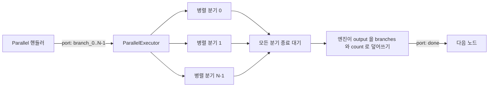

> 구현 상태: 구현됨 · 원문: `spec/4-nodes/1-logic/10-parallel.md`, `spec/4-nodes/_product-overview.md` (§4.10) · 용어: [용어 사전](../CLE-GLOSSARY.md)

## 개요

Parallel 노드(Parallel, `parallel`)는 같은 입력을 받는 병렬 분기(branch) N개를 동시에 실행하는 노드다(`executionMetadata.kind = 'parallel'`). 컨테이너는 아니지만 엔진 덮어쓰기를 받는 노드다. 핸들러는 `branch_0` ~ `branch_{N-1}` 동적 출력 포트를 한꺼번에 활성화하고 모든 병렬 분기가 끝나면 엔진이 `done` 포트로 `{ branches, count }` 결과를 내보낸다. `branches[i]` 는 `Promise.allSettled` 모델을 따른다. 성공이면 `{ status: 'fulfilled', value }`, 실패면 `{ status: 'rejected', error: { code, message } }` 다.

**구현 상태**: `ParallelExecutor` 가 `p-limit` 과 `Promise.allSettled` 로 병렬 분기를 동시에 실행한다. 기본으로 켜져 있다(`PARALLEL_ENGINE=v1` 이 기본값). `PARALLEL_ENGINE=off` 로 명시하면 엔진이 위상 순서로 차례로 실행하는 되돌림 경로를 쓴다. 이 환경 변수는 모듈을 불러올 때 한 번 읽으므로 바꾸면 인스턴스를 다시 시작해야 반영된다. `branchCount` 2~16, `maxConcurrency` 0(제한 없음)·1~16 을 지원한다. 병렬 분기 안에 블로킹 노드와 되돌아가는 연결선은 둘 수 없다. 중첩 Parallel 은 깊이 2까지 허용하고 바깥 × 안쪽 동시 실행 수 곱이 32를 넘으면 조용히 줄인다. `waitAll` 은 항상 `true` 로 동작하고 `false` 는 지원하지 않는다. fire-and-forget 이 필요하면 [Background 노드](CLE-NODE-BACKGROUND.md) 를 쓴다.

이 문서는 Parallel 노드의 설정, 포트, 실행 로직, 병렬 분기 격리, 출력 구조, 에러, 중첩 Parallel 제한을 정한다. 항목 에러 정책의 값 비교와 엔진 덮어쓰기 계약은 [Logic 노드 공통](CLE-NODE-LOGIC-COMMON.md) 이 정한다. 엔진 덮어쓰기의 실행 흐름은 [컨테이너 실행](../CLE-EXEC/CLE-EXEC-CONTAINER.md), `abortSignal` 전파 규칙은 [노드 취소](../CLE-EXEC/CLE-EXEC-CANCEL.md), 실행 컨텍스트 필드 분류는 [실행 컨텍스트](../CLE-EXEC/CLE-EXEC-CONTEXT.md), 저장·캔버스 단계의 중첩 경고 규칙은 [그래프 경고 규칙](../CLE-WF/CLE-WF-WARN.md) 이 정한다.

## 요구사항

- REQ-PARALLEL-001 WHEN Parallel 노드가 실행되면 THE SYSTEM SHALL 여러 병렬 분기를 동시에 실행한다. (원본: ND-PL-01)
- REQ-PARALLEL-002 WHEN 사용자가 `branchCount` 를 바꾸면 THE SYSTEM SHALL 병렬 분기 출력 포트(`branch_<index>`)를 그 수만큼 동적으로 만들거나 없앤다. (원본: ND-PL-02)
- REQ-PARALLEL-003 WHEN 모든 병렬 분기가 끝나면 THE SYSTEM SHALL `done` 포트로 `{ branches, count }` 결과를 한 번에 합쳐 보낸다. (원본: ND-PL-03, Merge `wait_all` 로 우회하는 구성은 선택 사항)
- REQ-PARALLEL-004 WHEN 사용자가 `maxConcurrency` 를 설정하면 THE SYSTEM SHALL 동시에 실행하는 병렬 분기 수를 그 값으로 제한한다. (원본: ND-PL-04)
- REQ-PARALLEL-005 WHEN `maxConcurrency` 가 `0` 이면 THE SYSTEM SHALL 동시 실행 수를 `branchCount` 와 같게 둔다.
- REQ-PARALLEL-006 WHEN 핸들러가 시작 시점 출력을 반환하면 THE SYSTEM SHALL `output: null` 과 `port: string[]` (`branch_0` ~ `branch_{N-1}`)을 반환해 모든 병렬 분기를 활성화한다.
- REQ-PARALLEL-007 WHEN 병렬 분기를 시작하면 THE SYSTEM SHALL 모든 병렬 분기에 같은 입력을 복제해 넘긴다.
- REQ-PARALLEL-008 WHEN 병렬 분기 컨텍스트를 만들면 THE SYSTEM SHALL `ExecutionContext` 를 얕게 복사하고 `variables` 는 `structuredClone` 으로 깊게 복사한다.
- REQ-PARALLEL-009 WHEN 병렬 분기 컨텍스트를 만들면 THE SYSTEM SHALL `nodeOutputCache` · `structuredOutputCache` 를 얕게 복사하고 `itemContext` · `loopContext` 를 비운다.
- REQ-PARALLEL-010 WHILE 실행 환경이 `development` 나 `test` 인 동안 THE SYSTEM SHALL 병렬 분기 복제 직후 공유 캐시 값 객체를 깊게 얼려 값 내부 변경을 `TypeError` 로 드러낸다.
- REQ-PARALLEL-011 IF 항목 에러 정책이 `stop` 이고 병렬 분기가 처음 실패하면 THE SYSTEM SHALL 곧바로 에러를 던져 Parallel 노드를 실패로 전이한다.
- REQ-PARALLEL-012 IF 항목 에러 정책이 `continue` 고 병렬 분기가 실패하면 THE SYSTEM SHALL 모든 병렬 분기가 끝나기를 기다린 뒤 실패한 병렬 분기를 `status: 'rejected'` 결과로 모은다.
- REQ-PARALLEL-013 IF 항목 에러 정책이 `cancel-others-on-fail` 이고 병렬 분기가 처음 실패하면 THE SYSTEM SHALL 자기 그룹의 `AbortController` 를 abort 해 다른 병렬 분기의 외부 I/O 를 중단하고 모든 병렬 분기가 끝난 뒤 첫 원인 에러를 Parallel 노드의 에러로 던진다.
- REQ-PARALLEL-014 WHEN `cancel-others-on-fail` 로 원인 에러를 고르면 THE SYSTEM SHALL `AbortError` 가 아닌 첫 실패를 원인으로 쓰고 `AbortError` 는 사용자에게 드러내지 않는다.
- REQ-PARALLEL-015 WHEN 상위 `context.abortSignal` 이 abort 되면 THE SYSTEM SHALL 그 abort 를 Parallel 그룹의 병렬 분기에도 전파한다.
- REQ-PARALLEL-016 IF `config.errorPolicy` 가 설정되지 않았으면 THE SYSTEM SHALL 공통 `errorHandling.policy` 가 `skip_node` / `use_default_output` / `route_to_error_port` 일 때 `continue`, 그 밖이면 `stop` 을 쓴다.
- REQ-PARALLEL-017 WHEN 모든 병렬 분기가 끝나면 THE SYSTEM SHALL 노드 `output` 을 `{ branches, count }` 로 덮어쓰고 `port: 'done'` 을 싣는다.
- REQ-PARALLEL-018 IF `waitAll` 이 `false` 면 THE SYSTEM SHALL `handler.validate` 에서 거부하고 Background 노드를 쓰라고 안내한다.
- REQ-PARALLEL-019 IF `branchCount` 가 정수가 아니거나 2~16 밖이면 THE SYSTEM SHALL 캔버스에 경고 배지를 표시하고 `handler.validate` 에서 거부한다.
- REQ-PARALLEL-020 IF `maxConcurrency` 가 숫자가 아니거나 정수가 아니거나 0~16 밖이면 THE SYSTEM SHALL `handler.validate` 에서 거부한다.
- REQ-PARALLEL-021 IF 검증을 거치지 않은 `branchCount` 가 2~16 밖이면 THE SYSTEM SHALL 핸들러와 실행기 양쪽에서 그 범위로 줄여 방어한다.
- REQ-PARALLEL-022 IF 병렬 분기 안에 블로킹 노드가 있으면 THE SYSTEM SHALL 엔진 그래프 검증에서 `PARALLEL_INVALID_CHILD` 로 실행을 실패시킨다.
- REQ-PARALLEL-023 IF 병렬 분기 안에 되돌아가는 연결선이 있으면 THE SYSTEM SHALL 엔진 그래프 검증에서 `PARALLEL_BACK_EDGE` 로 실행을 실패시킨다.
- REQ-PARALLEL-024 IF 중첩 Parallel 깊이가 2를 넘으면 THE SYSTEM SHALL 엔진 그래프 검증에서 `PARALLEL_NESTED_DEPTH_EXCEEDED` 로 실행을 실패시킨다.
- REQ-PARALLEL-025 IF 중첩 Parallel 의 바깥 × 안쪽 동시 실행 수 곱이 32를 넘으면 THE SYSTEM SHALL 안쪽 동시 실행 수를 `max(1, floor(32 / parentEffective))` 로 줄이고 `meta.clampedConcurrency` 에 기록한다.
- REQ-PARALLEL-026 WHEN 워크플로우를 저장하거나 캔버스를 편집하면 THE SYSTEM SHALL 중첩 깊이 위반은 저장을 거부하고 동시 실행 수 곱 초과는 경고 배지로 먼저 알린다.
- REQ-PARALLEL-027 WHEN `PARALLEL_ENGINE=off` 로 설정하면 THE SYSTEM SHALL 병렬 분기를 위상 순서로 차례로 실행한다.
- REQ-PARALLEL-028 WHEN Parallel 노드를 정의하면 THE SYSTEM SHALL 런타임 에러 포트를 두지 않는다.

## 설정

| 필드 | 타입 | 필수 | 기본값 | 설명 |
|------|------|------|--------|------|
| branchCount | Integer | ✓ | `2` | 병렬 분기 수(출력 포트 수). `2` ~ `16`. 정상 경로에서는 `handler.validate` 가 범위 밖 값을 거부한다. 핸들러와 실행기의 범위 맞추기(2 미만·16 초과를 줄임)는 검증을 거치지 않은 값에 대한 방어다 |
| maxConcurrency | Integer | | `0` | 동시 실행 수. `0` 은 `branchCount` 와 같다(제한 없음). `1`~`16` 은 동시 실행 슬롯 수. [Logic 노드 공통](CLE-NODE-LOGIC-COMMON.md#리소스-제한) |
| errorPolicy | `stop` / `continue` / `cancel-others-on-fail` | | `stop` | 병렬 분기의 항목 에러 정책. [Logic 노드 공통](CLE-NODE-LOGIC-COMMON.md#항목-에러-정책). `stop` 은 첫 실패에서 곧바로 에러를 던진다. `continue` 는 모든 병렬 분기가 끝나기를 기다린 뒤 실패 정보를 모은다. `cancel-others-on-fail` 은 첫 실패에서 자기 그룹의 `ExecutionContext.abortSignal` 을 abort 해 다른 병렬 분기의 외부 I/O 를 곧바로 중단하고(signal 을 받는 노드의 best-effort 정리), 원인 에러를 Parallel 노드의 에러로 다시 던진다. 취소 규칙은 [노드 취소](../CLE-EXEC/CLE-EXEC-CANCEL.md) |

코드 기준: `codebase/backend/src/nodes/logic/parallel/parallel.schema.ts` (export `parallelNodeConfigSchema`)

1. `errorPolicy` 는 `parallelNodeConfigSchema` 에 직접 드러난 Parallel 전용 필드다. 공통 에러 처리 정책(`errorHandling.policy`)과 별개다.
2. 엔진은 `config.errorPolicy` 가 있으면 그 값을 그대로 쓴다. 없으면 공통 `errorHandling.policy` 를 대응시켜 쓴다. `skip_node` / `use_default_output` / `route_to_error_port` 는 `continue`, 그 밖은 `stop` 이다(옛 동선 호환).
3. `waitAll: false` 는 지원하지 않는다. `validateParallelConfig` 가 `waitAll === false` 를 거부한다. Parallel 은 항상 모든 병렬 분기가 끝난 뒤 `done` 포트로 결과를 합쳐 보낸다. 병렬 분기가 끝나는 대로 다음 노드로 나아가는 fire-and-forget 이 필요하면 [Background 노드](CLE-NODE-BACKGROUND.md) 를 쓴다. 옛 워크플로우의 `config.waitAll: false` 는 스키마 검증에서 거부되므로 사용자가 워크플로우 에디터에서 고쳐야 한다. 근거는 [Rationale](#rationale).

## 설정 화면

| 영역 | 위치 | 들어가는 요소 | 동작 |
|------|------|--------------|------|
| 병렬 분기 수 | 맨 위 | `Branch Count` 입력(예 `3`), 안내 "병렬 실행할 분기 수 (2~16)" | `branchCount` 를 편집한다 |
| 동시 실행 수 | 가운데 | `Max Concurrency` 입력(예 `0`), 안내 "0 = 제한 없음 (branchCount 와 동일)" | `maxConcurrency` 를 편집한다 |
| 에러 정책 | 맨 아래 | `Error Policy` 드롭다운(`stop` / `continue` / `cancel-others-on-fail`) | `errorPolicy` 를 바꾼다 |

## 포트

| 방향 | id | label | type | dynamic | 설명 |
|------|------|-------|------|---------|------|
| 입력 | `in` | Input | data | false | 외부 데이터 진입. 모든 병렬 분기에 같은 입력을 복제해 넘긴다 |
| 출력 | `branch_0` ~ `branch_{N-1}` | Branch i | data | true | `branchCount` 에 따라 동적으로 만든다(`dynamicPorts.kind = 'parallel-branches'`). 병렬 분기마다의 진입점 |
| 출력 | `done` | Done | data | false | 모든 병렬 분기가 끝난 뒤 `{ branches, count }` 를 넘긴다(`branches[i]` 는 allSettled 모양) |

동적 포트 ID 는 `branch_<index>` 형식이다([노드 출력 규약](../CLE-NODE/CLE-NODE-OUTPUT.md) 의 `<prefix>_<index>` 규칙). 동적 포트도 [Logic 노드 공통](CLE-NODE-LOGIC-COMMON.md#동적-포트-id-불변성) 의 ID 불변성을 따른다. `branchCount` 를 바꿔 포트를 다시 구성해도 기존 인덱스의 포트 ID 는 유지된다.

## 실행 로직

1. `branchCount` 를 정수로 바꾸고 `[2, 16]` 범위로 맞춘다(핸들러와 실행기 양쪽에서 방어).
2. 핸들러는 `branch_0` ~ `branch_{N-1}` 포트를 모두 활성화하는 [시작 시점](#시작-시점-핸들러-반환) 형태를 반환한다(`port: string[]`, [노드 출력 규약](../CLE-NODE/CLE-NODE-OUTPUT.md) 의 fan-out 형태).
3. 엔진의 `ParallelExecutor` 가 `p-limit(effectiveConcurrency)` 로 동시 실행 슬롯을 제한하면서 `Promise.allSettled` 로 모든 병렬 분기를 동시에 실행한다. `effectiveConcurrency` 는 `maxConcurrency > 0 ? maxConcurrency : branchCount` 다. `PARALLEL_ENGINE=off` 면 엔진이 위상 순서로 차례로 실행한다(되돌림 경로).
4. 병렬 분기마다 `ExecutionContext` 의 얕은 복사본을 받는다. `variables` 는 `structuredClone` 으로 깊게 복사하고 `itemContext` / `loopContext` 는 병렬 분기에 들어갈 때 `undefined` 로 비운다(중첩 ForEach · Loop 상태가 새지 않게).
5. 항목 에러 정책을 적용한다.
   - `stop` (기본): 첫 병렬 분기가 실패하면 곧바로 에러를 던지고 Parallel 노드가 실패로 전이한다.
   - `continue`: 모든 병렬 분기가 끝나기를 기다린 뒤 실패한 병렬 분기 정보를 모아 [완료 시점](#완료-시점-done-포트) 결과에 넣는다.
   - `cancel-others-on-fail`: 자기 그룹용 `AbortController` 를 만들어 병렬 분기 컨텍스트의 `abortSignal` 에 넣는다. 첫 병렬 분기가 실패하면 `controller.abort()` 를 부른다. 다른 병렬 분기의 외부 I/O 노드 가운데 취소 규칙을 따르는 노드(HTTP · DB · AI · Cafe24 · MakeShop)가 best-effort 로 정리한다. Email 은 보내기 전 abort 확인만 하고 이미 진행 중인 SMTP 전송은 끊지 않는다. 모든 병렬 분기가 끝나면 원인 에러를 Parallel 노드의 에러로 다시 던진다(Parallel 노드 실패). 상위 `context.abortSignal` 이 있으면 그 abort 도 이어서 전파한다. 노드별 신호 처리 규칙은 [노드 취소 §노드 핸들러 의무](../CLE-EXEC/CLE-EXEC-CANCEL.md#노드-핸들러-의무) 가 정한다.
6. 모든 병렬 분기가 끝나면 엔진이 `output` 을 `{ branches: [...], count }` 로 덮어쓰고 `done` 포트(`port: 'done'`, 단일 문자열)로 보낸다. `branches[i]` 는 `Promise.allSettled` 모델(`{ status: 'fulfilled', value }` 또는 `{ status: 'rejected', error: { code, message } }`)이다.



## 출력 구조

Parallel 은 엔진 덮어쓰기 대상 노드라서 시작 시점(병렬 분기 N개 fan-out)과 완료 시점(`done` 포트) 두 형태로 나눈다. JSON 예시는 `undefined` 필드를 생략했고 5필드 밖의 최상위 키는 쓰지 않는다.

### 시작 시점 (핸들러 반환)

```json
{
  "config": { "branchCount": 3, "maxConcurrency": 0 },
  "output": null,
  "port": ["branch_0", "branch_1", "branch_2"]
}
```

| 필드 | 타입 | 출처 | 설명 |
|------|------|------|------|
| `config.branchCount` | Integer (원래 값) | 설정 에코 | 사용자가 설정한 원래 값(범위 맞추기 전). 핸들러의 출력 포트 수는 맞춘 뒤 길이지만 설정 에코는 원래 값을 지킨다 |
| `config.maxConcurrency` | Integer (원래 값) | 설정 에코 | 사용자 설정 원래 값. 음수·16 초과 같은 잘못된 값도 그대로 싣고 실제 동작은 실행기가 맞춘다 |
| `output` | `null` | 핸들러 반환 | 엔진 덮어쓰기 대상 노드의 핸들러 계약(Loop · ForEach · Map 과 같은 계열). 밖의 표현식에 드러나지 않는 중간 형태다. 다음 노드가 `$node["X"].output.*` 로 보는 값은 완료 시점 형태다 |
| `port` | `string[]` | 핸들러 반환 | `branch_0` ~ `branch_{N-1}` 을 모두 활성화한다(fan-out). 병렬 분기 진입점을 여는 신호 |

### 완료 시점 (`done` 포트)

```json
{
  "config": { "branchCount": 3, "maxConcurrency": 0 },
  "output": {
    "branches": [
      { "status": "fulfilled", "value": { "userId": "u-1", "step": "validate", "ok": true } },
      { "status": "fulfilled", "value": { "userId": "u-1", "step": "enrich", "ok": true } },
      { "status": "rejected",  "error": { "code": "Error", "message": "notify failed" } }
    ],
    "count": 3
  },
  "port": "done"
}
```

| 필드 | 타입 | 출처 | 설명 |
|------|------|------|------|
| `config.branchCount` | Integer (원래 값) | 설정 에코 | 시작 시점과 같음 |
| `config.maxConcurrency` | Integer (원래 값) | 설정 에코 | 시작 시점과 같음 |
| `output.branches` | `Array<BranchResult>` | 엔진 덮어쓰기 | 병렬 분기마다의 결과(`Promise.allSettled` 모델). `branches[i]` 는 `branch_i` 병렬 분기의 결과. 컬렉션 키는 `branches` ([Logic 노드 공통](CLE-NODE-LOGIC-COMMON.md#반복-결과-출력-구조)) |
| `output.branches[i].status` | `'fulfilled' \| 'rejected'` | 엔진 | 병렬 분기 종료 상태 |
| `output.branches[i].value` | unknown | 엔진 | (`status: 'fulfilled'` 일 때) 병렬 분기의 마지막 노드 출력 |
| `output.branches[i].error` | `{ code, message }` | 엔진 | (`status: 'rejected'` 일 때) `errorPolicy='continue'` 에서 실패한 병렬 분기의 에러 정보. `code` 는 `error.name` (없으면 `'UNKNOWN_ERROR'`), `message` 는 `error.message` |
| `output.count` | Integer | 엔진 덮어쓰기 | 끝난 병렬 분기 수(`branches.length`). 컬렉션 키와 `count` 를 함께 내는 공통 규칙을 따른다 |
| `port` | `'done'` | 엔진 | 단일 문자열. 모든 병렬 분기 완료 경로 |

`errorPolicy='stop'` 에서는 첫 실패에 곧바로 에러를 던져 `done` 포트를 거치지 않으므로 `branches[i]` 는 모두 `fulfilled` 다(Parallel 노드는 실패로 전이). `rejected` 항목은 `errorPolicy='continue'` 에서만 보인다.

표현식 접근 예:

- `$node["Parallel"].output.branches[0].value` → `branch_0` 병렬 분기의 마지막 출력(성공 시)
- `$node["Parallel"].output.branches[2].error.message` → `branch_2` 의 에러 메시지(실패 시)
- `$node["Parallel"].output.branches.length` → 병렬 분기 수(`output.count` 와 같은 값)
- `$node["Parallel"].output.count` → 끝난 병렬 분기 수
- `$node["Parallel"].port` → `"done"`

### 엔진 덮어쓰기 계약

| 시점 | `output` 형태 | `port` | 출처 |
|------|-------------|------|------|
| 시작(병렬 분기 fan-out 직전) | `output: null` | `string[]` (`branch_0` ~ `branch_{N-1}`) | 핸들러 반환. 병렬 분기 포트를 여는 용도 |
| 완료(모든 병렬 분기 종료 뒤) | `output: { branches: Array<{ status, value? \| error? }>, count }` | `'done'` (단일 문자열) | **엔진 덮어쓰기** |

1. 다음 노드가 `$node["Parallel"].output.*` 로 보는 값은 항상 완료 시점 형태다.
2. 핸들러가 시작 시점에 반환한 `output: null` 은 밖의 표현식에 드러나지 않는다(Loop · ForEach · Map 과 같은 방식).
3. `port` 는 시작 시점에 `string[]` (fan-out)이고 완료 시점에 `'done'` 문자열(단일 포트)이다. 엔진 덮어쓰기 대상 노드 가운데 노드 출력에 `port` 를 직접 싣는 것은 Parallel 뿐이다.
4. 병렬 분기 입력은 `ParallelExecutor` 가 `ExecutionContext` 얕은 복사본(`variables` 는 깊은 복사)으로 나눠 준다. 핸들러의 시작 시점 `output` 에 기대지 않는다.

## 에러

Parallel 은 런타임 에러 포트가 없다. 설정 검증 실패는 사전 검증 에러로 던지고 병렬 분기 실행 중의 에러는 항목 에러 정책으로 처리한다. 메시지는 영문 원문이 기준이고 캔버스는 프론트엔드 i18n 으로 한국어를 렌더링한다.

| 발생 조건 | 메시지 / 코드 | 시점 |
|-----------|--------------|------|
| `branchCount` 가 2 미만 또는 16 초과 | `branchCount must be 2 to 16.` | 노드 경고 규칙(캔버스 배지) |
| `branchCount` 가 정수 아님 | `branchCount must be an integer.` | `handler.validate` |
| `branchCount` 가 `[2, 16]` 밖 | `branchCount must be a value between 2 and 16.` | `handler.validate` |
| `maxConcurrency` 가 숫자 아님 | `maxConcurrency must be a number.` | `handler.validate` |
| `maxConcurrency` 가 정수 아님 | `maxConcurrency must be an integer.` | `handler.validate` |
| `maxConcurrency` 가 `[0, 16]` 밖 | `maxConcurrency must be a value between 0 and 16 (0 = unlimited).` | `handler.validate` |
| `waitAll` 이 불리언 아님 | `waitAll must be a boolean.` | `handler.validate` |
| `waitAll === false` | `waitAll=false is not supported. Use waitAll=true (default) or the Background node for fire-and-forget semantics.` | `handler.validate` |
| 병렬 분기 에러(`errorPolicy=stop`) | 첫 실패한 병렬 분기의 에러를 던짐. Parallel 노드 실패 | 엔진 런타임([Logic 노드 공통](CLE-NODE-LOGIC-COMMON.md#항목-에러-정책)) |
| 병렬 분기 에러(`errorPolicy=continue`) | 실패 정보를 모아 노드 실행 기록에 남김(모든 병렬 분기 종료 대기) | 엔진 런타임 |
| 병렬 분기 에러(`errorPolicy=cancel-others-on-fail`) | 자기 그룹 `AbortController.abort()` → 다른 병렬 분기 외부 I/O 중단 + 원인 에러를 던짐 → Parallel 실패. 규칙: [노드 취소](../CLE-EXEC/CLE-EXEC-CANCEL.md) | 런타임(`ParallelExecutor`) |
| 병렬 분기 안에 블로킹 노드(form / buttons / ai_conversation) | `PARALLEL_INVALID_CHILD` | 엔진 그래프 검증 |
| 병렬 분기 안에 되돌아가는 연결선 | `PARALLEL_BACK_EDGE` | 엔진 그래프 검증(`planParallelBody`) |
| 중첩 Parallel 깊이 > 2 (깊이 2 의 병렬 분기에 또 Parallel) | `PARALLEL_NESTED_DEPTH_EXCEEDED` | 엔진 그래프 검증(`planParallelBody`) |
| 중첩 Parallel 동시 실행 수 곱이 32 초과 | (조용히 줄임 + `meta.clampedConcurrency` 기록 + debug 로그) | 런타임(`ParallelExecutor`) |

## 설정 요약

- 형식: `{N} branches`
- 예: `3 branches`
- 구현: `parallel.schema.ts` 의 `summaryTemplate` (`'{{branchCount}} branches'`).

## 구현 위치

- `codebase/backend/src/nodes/logic/parallel/parallel.*.ts`
- `codebase/backend/src/modules/execution-engine/containers/parallel-executor.ts` (`ParallelExecutor`, `ParallelBranchContext`)
- `codebase/backend/src/modules/execution-engine/execution-engine.service.ts` (완료 시점 덮어쓰기)

## Rationale

### 병렬 분기 캐시 격리: 얕은 복사와 개발·테스트 환경 동결 (2026-06-10)

병렬 분기는 `ExecutionContext` 의 얕은 복사본을 받고 `variables` 만 `structuredClone` 으로 깊게 복사한다. `nodeOutputCache` / `structuredOutputCache` 는 얕은 복사로 격리한다. 병렬 분기가 자기 결과를 `cache[nodeId] = ...` 로 더하는 것(최상위 키)은 병렬 분기 안에만 남지만 값 객체는 부모와 공유한다(깊은 복사 비용을 피한다). 지금 규칙에서 병렬 분기는 서로 겹치지 않는 노드 집합(다른 nodeId)을 가지므로(`CONTAINER_INVALID_CHILD` 검증) 같은 키가 부딪히지 않는다.

이 설계의 불변식은 "병렬 분기는 공유 캐시 값 객체의 안쪽을 바꾸지 않는다" 이다. 얕은 복사 결정을 대신하지 않는 보조 강제 장치로, 개발·테스트 환경(`NODE_ENV ∈ {development, test}`)에서는 병렬 분기 복제 직후 공유 값 객체를 깊게 `Object.freeze` 한다. 불변식을 어기면(값 안쪽을 바꾸면) 곧바로 `TypeError` 로 드러난다. 운영 환경에는 적용하지 않는다(동결 비용을 피하고 동작을 바꾸지 않는다). 그래서 운영 동작은 얕은 복사 격리 그대로다.

### `done` 출력에 `count` 를 싣는다 (2026-06-03 결정 B)

한때 이 문서에 "`count` 필드는 제거됨(`branches.length` 가 단일 기준)" 이라는 서술이 있었다. 이는 컨테이너 공통 출력 규칙과 실제 엔진 구현에 어긋나는 서술이었다. 공통 규칙은 엔진 덮어쓰기 대상 노드가 모두 `{ <컬렉션 키>, count }` 를 낸다고 정하고 `ExecutionEngineService` 의 Parallel `done` 덮어쓰기도 `{ branches, count: branchResults.length }` 를 싣는다.

어긋남을 풀 때 두 방향을 검토했다.

- **(A) 공통 규칙과 코드에서 Parallel 만 `count` 예외로 둔다**: Parallel 은 포트로 나뉘는 병렬 분기라 `count` 의 뜻이 약하다는 논거였다. 그러나 공통 규칙 세 곳, 코드, 다른 엔진 덮어쓰기 대상 노드 셋을 모두 바꿔야 하고 `output.count` 를 쓰는 워크플로우가 깨진다.
- **(B) 이 문서에 `count` 를 되살린다** (채택): 코드·공통 규칙·다른 노드와 곧바로 맞고 변경이 이 문서에 그친다. `branches.length` 와 겹치지만 출력의 균일성(`{ <컬렉션 키>, count }`)을 겹침 제거보다 앞에 둔다. 다음 노드는 노드 종류와 상관없이 `output.count` 로 항목 수를 읽을 수 있다.

### `waitAll=false` 를 지원하지 않는다 (2026-05-30 결정 K)

`waitAll: false` 는 처음에 스키마에 드러나 있었지만 엔진이 무시하는 죽은 필드였다. 다음 단계에서 활성화와 제거를 검토했고 지원하지 않기로 했다.

**`waitAll=false` 가 뜻하려던 동작**: 병렬 분기(`branch_i`)가 끝나는 즉시 그 병렬 분기의 바깥 다음 노드를 시작한다. 예를 들어 branch 0 이 1초, branch 1 이 5초 걸리면 branch 0 의 다음 노드가 1초 시점에 시작한다.

**기각 근거는 엔진 구조다**: 현재 `ExecutionEngineService` 는 Node.js 단일 스레드 메인 루프로 노드를 dispatch 한다. `runParallel` 은 메인 루프가 `await` 로 기다리는 함수이고 메인 루프는 `runParallel` 이 반환된 뒤에야 다음 노드로 나아간다. 그래서 병렬 분기 완료 콜백 안에서 `propagateReachability` 를 불러도 바깥 노드는 모든 병렬 분기가 끝난 뒤에야 dispatch 된다.

이 동작을 살리려면 병렬 분기가 끝날 때마다 바깥 다음 노드를 별도 하위 루프로 dispatch 해야 한다. 그러면 다음 위험이 따른다.

- 메인 dispatch 루프와 별도 하위 루프가 동시에 돈다. 경쟁 상태와 `executedNodes` 집합 동시 변경이 생긴다.
- Loop · ForEach · Map 같은 컨테이너의 fan-out 경로(`runContainer`)와 서로 영향을 준다.
- 병렬 분기 안에 ForEach · Loop · Map 이 들어가는 시나리오가 회귀할 수 있다.

**대안은 Background 노드다**: fire-and-forget 은 [Background 노드](CLE-NODE-BACKGROUND.md) 가 명시적으로 지원한다. BullMQ enqueue 모델로 워커 단에서 이미 분리돼 있어 더 안전하다.

**결정**: Parallel 은 항상 `waitAll=true` (기본)로 동작한다. 모든 병렬 분기가 끝난 뒤 `done` 포트로 결과를 합쳐 보낸다. `waitAll=false` 를 명시한 워크플로우는 스키마 검증에서 거부한다([에러](#에러) 표).

**옛 워크플로우 호환: 데이터 마이그레이션은 하지 않는다 (2026-07-16 확정)**. DB 에 `config.waitAll: false` 가 저장된 경우 실행 시점에 스키마 검증이 거부하고 사용자가 워크플로우 에디터에서 고친다. 이것이 완결된 처리 경로이고 저장된 값을 한꺼번에 고치는 데이터 마이그레이션은 하지 않는다.

- 근거: 결정 K 는 `waitAll=false` 를 스키마에는 남기고 검증에서 거부하는 형태로 정했다. 잘못된 값이 다른 뜻으로 조용히 실행되지 않고 명확한 에러 메시지로 바로 드러나며 그 메시지가 대안(Background 노드)까지 안내한다.
- 데이터 마이그레이션이 더 얻는 것은 "에디터에서 한 번 고치는 수고" 를 없애는 것뿐이다. 그 대가로 사용자 워크플로우 설정을 소급해 고치는 쓰기 마이그레이션을 치러야 한다. `false` 를 `true` 로 바꾸면 뜻이 달라지고 Background 노드로 옮기는 것은 그래프 구조 변경이라 자동화할 수 없다.
- 뜻이 바뀌는 자동 변환은 사용자 의도를 대신 정하는 일이라 거부하고 안내하는 쪽이 더 안전하다.
- 이력: 이 처리는 한때 별도 후속 작업으로 넘긴다고 적혀 있었다. 그 후속 항목이 작업 계획을 나누는 과정에서 사라져 아무도 추적하지 않는 상태가 됐고 2026-07-16 정리에서 이를 확인해 위와 같이 확정했다.

### 중첩 Parallel 을 제한적으로 허용한다 (깊이 2, 동시 실행 수 곱 상한 32, 2026-05-30 결정 #3 · G · D)

처음 단계에서는 `PARALLEL_NESTED_NOT_SUPPORTED` 로 모든 중첩을 거부했다. 다음 단계에서 아래 결정으로 제한적 중첩 허용으로 바꿨다.

**깊이 2 까지만**: 바깥 Parallel 의 병렬 분기 안에 안쪽 Parallel 한 단계만 허용하고 3중부터(`PARALLEL_NESTED_DEPTH_EXCEEDED`) 거부한다. 워크플로우를 나누기 어려운 경우가 있어 부분 허용은 가치가 있다. 하지만 깊이를 제한하지 않으면 동시 워커 수가 폭발하고 그래프 구조가 사용자가 머릿속에 그릴 수 있는 범위를 넘는다. 두 단계면 "분기 안에서 또 분기" 라는 가장 흔한 요구를 담는다.

**동시 실행 수 곱 상한 32**: 바깥 `maxConcurrency` 16 × 안쪽 16 이면 최대 256 워커가 동시에 돌 수 있다. 운영 환경에서 메모리 부족이나 이벤트 루프 지연 위험이 있다. 32 는 바깥 4 × 안쪽 8, 바깥 8 × 안쪽 4, 바깥 16 × 안쪽 2 같은 합리적 조합을 모두 허용하면서 워커 수 상한을 보수적으로 지킨다.

**거부하지 않고 조용히 줄인다**: 상한을 넘으면 거부하지 않고 `effectiveConcurrency = max(1, floor(32 / parentEffective))` 로 자동으로 줄인다. `max(1, …)` 하한은 `parentEffective > 32` 인 경계에서 `floor` 가 0 이 돼 슬롯이 0 이 되고 모든 병렬 분기가 실행되지 않는 교착을 막는다(최소 1개 병렬 분기는 항상 실행한다). 워크플로우 작성자가 바깥·안쪽 `maxConcurrency` 곱을 늘 정확히 계산하기를 기대하기 어렵다. 의도와 실제의 차이는 두 경로로 보인다.

1. **런타임**: `ParallelExecutor` 가 값을 줄이면 결과에 `clampedConcurrency` 를 넣고 엔진이 그 값을 Parallel 노드의 `meta.clampedConcurrency = { intended, actual, parentEffective, cap }` 에 기록한다. 다음 노드는 `$node["Parallel"].meta.clampedConcurrency` 로 볼 수 있고 사용자는 실행 결과 타임라인에서 바로 확인한다. 운영 로그에는 `Logger.debug` 로 남긴다.
2. **저장·캔버스 사전 경고**: 그래프 경고 규칙 `parallel:nested-concurrency-cap` (warning)이 곱이 32를 넘으면 캔버스 배지로 먼저 알린다. 저장은 통과한다(런타임 줄이기가 안전망). 규칙 정의는 [그래프 경고 규칙 §등록된 규칙](../CLE-WF/CLE-WF-WARN.md#등록된-규칙) 이 정한다.

**3중 가드 (결정 E)**: 깊이 검증은 세 곳에서 한다. 런타임 `planParallelBody` 가 거부하고 워크플로우 저장이 그래프 경고 규칙 `parallel:nested-depth-exceeded` (error)로 거부(400 `GRAPH_VALIDATION_FAILED`)하고 캔버스가 같은 규칙을 로컬에서 평가해 먼저 알린다. 저장·캔버스 가드는 구현돼 있고 [그래프 경고 규칙 §평가 시점과 3중 가드](../CLE-WF/CLE-WF-WARN.md#평가-시점과-3중-가드) 가 정한다.

**전파 방식 (결정 G)**: `parentParallelConcurrency: number` 필드를 `ParallelBranchContext extends ExecutionContext` 에 둔다. 바깥 Parallel 의 `ParallelExecutor` 가 병렬 분기 컨텍스트를 복제할 때 자기 `effectiveConcurrency` 를 이 필드에 넣는다. 안쪽 Parallel 은 자기 `effectiveConcurrency` 를 계산할 때 이 값을 읽어 상한을 적용한다. 깊이 2 가드 아래에서 한 단계만 쌓인다. 값이 없으면(가장 바깥 Parallel) 줄이지 않고 자기 값을 그대로 쓴다.

초안 결정 G 는 이 필드를 `ExecutionContext` 의 선택 필드(`parentParallelConcurrency?`)로 바로 넣었다. 그러나 `ExecutionContext` 가 모든 것을 떠안는 객체가 된다는 우려에 따라 Parallel 전용 필드를 `ParallelBranchContext` 로 떼어 내도록 바꿨다(2026-05-31). 분류 근거와 결정 규칙은 [실행 컨텍스트](../CLE-EXEC/CLE-EXEC-CONTEXT.md) 가 정한다.

### `cancel-others-on-fail` 항목 에러 정책 (2026-05-30, 결정 A · H)

**뜻**: 첫 병렬 분기가 실패하면 다른 병렬 분기의 긴 외부 I/O (HTTP · DB · AI 등)를 곧바로 중단해 워커 자원 낭비를 막는다. `stop` 의 뜻(Parallel 실패로 전이)은 유지하면서 실패 뒤 다른 병렬 분기를 `continue` 처럼 끝까지 기다리지 않고 abort 한다.

**기각한 대안**: `errorPolicy=stop` 의 동작을 바꿔 항상 abort 하게 하는 방안. 옛 워크플로우의 뜻을 깨므로 별도 옵션으로 나눴다.

**방식**: 자기 그룹용 `AbortController` 를 만들어 병렬 분기 컨텍스트의 `abortSignal` 에 넣는다. 첫 실패한 병렬 분기의 `runBranch` 가 거부된 직후 `controller.abort()` 를 부르고 다른 병렬 분기의 외부 I/O 노드가 그 signal 을 받아 정리한다. 상위 `context.abortSignal` 이 있으면 상위 취소도 이 그룹에 전파한다.

**best-effort 계약** ([노드 취소](../CLE-EXEC/CLE-EXEC-CANCEL.md)): signal 을 지원하지 않는 노드(CPU 작업, 곧바로 끝나는 노드)는 자기 작업을 끝낼 때까지 계속한다. 2026-07-26 기준 signal 을 받는 노드는 HTTP · DB · AI · 이커머스 통합 Cafe24 · MakeShop 이다. Email 은 보내기 전 abort 확인만 하고 이미 보내는 중인 SMTP 는 일부러 중단하지 않는다. 채팅 채널은 노드가 아니라 `webhook` 트리거의 발신 어댑터라서 처음부터 대상이 아니다. 그래서 `cancel-others-on-fail` 의 효과는 노드별로 차츰 강해진다.

**에러 분류**: 모든 병렬 분기가 끝나면 원인 에러(`error.name !== 'AbortError'` 인 첫 실패)를 Parallel 노드의 에러로 다시 던진다. `AbortError` 는 뒤따른 병렬 분기 정리의 결과라서 사용자 메시지의 신호 대 잡음비를 위해 드러내지 않는다.
