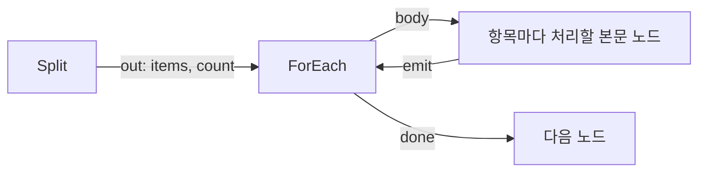

> 구현 상태: 구현됨 · 원문: `spec/4-nodes/1-logic/6-split.md`, `spec/4-nodes/_product-overview.md` (§4.6) · 용어: [용어 사전](../CLE-GLOSSARY.md)

## 개요

Split 노드(Split, `split`)는 배열 데이터를 `{ index, value }` 항목으로 정규화해 단일 출력 포트(`out`)로 한 번에 내보내는 데이터 노드다. 경로 선택 노드도 아니고 컨테이너도 아니므로 `port` 와 엔진 덮어쓰기 계약을 쓰지 않는다. 항목마다 따로 처리해야 하면 [ForEach 노드](CLE-NODE-FOREACH.md) 와 함께 쓴다.

이 문서는 Split 노드의 설정, 포트, 실행 로직, 출력 구조, 에러, ForEach 와 함께 쓰는 방법을 정한다. 노드 출력 5필드의 일반 규칙과 빈 입력 대체 원칙은 [노드 출력 규약](../CLE-NODE/CLE-NODE-OUTPUT.md) 이, Logic 노드끼리 다른 입력 처리 방식의 비교는 [Logic 노드 공통](CLE-NODE-LOGIC-COMMON.md) 이 정한다.

## 요구사항

- REQ-SPLIT-001 WHEN Split 노드가 실행되면 THE SYSTEM SHALL 배열의 각 항목을 `{ index, value }` 로 감싸 단일 `out` 포트로 한 번에 내보낸다. (원본: ND-SP-01)
- REQ-SPLIT-002 WHEN 사용자가 분리 기준을 설정하면 THE SYSTEM SHALL `fieldPath` 에 dot-path 문자열이나 inline 표현식을 받는다. (원본: ND-SP-02)
- REQ-SPLIT-003 WHEN `fieldPath` 가 dot-path 문자열이면 THE SYSTEM SHALL 입력(`$input`)에 그 경로를 적용해 중첩 값을 읽는다.
- REQ-SPLIT-004 WHEN `fieldPath` 가 inline 표현식이면 THE SYSTEM SHALL 표현식 resolver 가 평가한 값을 그대로 쓴다.
- REQ-SPLIT-005 IF `fieldPath` 로 읽은 값이 배열이 아니면 THE SYSTEM SHALL 에러를 던지지 않고 빈 배열로 처리하고 `meta.fellBackToEmpty` 를 `true` 로 둔다.
- REQ-SPLIT-006 WHEN 항목을 감싸면 THE SYSTEM SHALL 객체 항목과 원시값 항목을 똑같이 `{ index, value }` 로 감싼다.
- REQ-SPLIT-007 WHEN 결과를 내보내면 THE SYSTEM SHALL `output` 을 `{ items, count }` 로 두고 `count` 를 `items.length` 와 같게 한다.
- REQ-SPLIT-008 WHEN 결과를 내보내면 THE SYSTEM SHALL 입력의 다른 필드를 `output` 에 싣지 않는다.
- REQ-SPLIT-009 WHEN 결과를 내보내면 THE SYSTEM SHALL 처리한 항목 수를 `meta.itemCount` 에 싣는다.
- REQ-SPLIT-010 WHEN 노드 출력을 만들면 THE SYSTEM SHALL `config.fieldPath` 를 `context.rawConfig` 의 원래 형태로 싣는다.
- REQ-SPLIT-011 IF `fieldPath` 가 없거나 빈 문자열이면 THE SYSTEM SHALL 캔버스에 경고 배지를 표시하고 `handler.validate` 에서 거부한다.
- REQ-SPLIT-012 WHEN Split 노드를 정의하면 THE SYSTEM SHALL 런타임 에러 포트와 동적 포트를 두지 않는다.

## 설정

| 필드 | 타입 | 필수 | 기본값 | 설명 |
|------|------|------|--------|------|
| fieldPath | Expression | ✓ | `''` | 나눌 배열 필드 경로. dot-path 문자열(`"items"`, `"order.items"`)이면 `$input` 에 적용하고 inline 표현식(`{{ $var.a }}`)이면 표현식 resolver 가 평가한 값을 그대로 쓴다 |

코드 기준: `codebase/backend/src/nodes/logic/split/split.schema.ts` (export `splitNodeConfigSchema`)

## 설정 화면

| 영역 | 위치 | 들어가는 요소 | 동작 |
|------|------|--------------|------|
| 필드 경로 | 맨 위 | `Field Path` 입력(예 `$input.items`) | `fieldPath` 를 편집한다 |
| 도움말 | 입력 아래 | "Dot-path or inline expression returning an array" 안내 문구 | 입력 형식을 알려 준다 |

## 포트

| 방향 | id | label | type | dynamic | 설명 |
|------|------|-------|------|---------|------|
| 입력 | `in` | Input | data | false | 나눌 대상 객체(1개 필수) |
| 출력 | `out` | Output | data | false | 정규화한 항목 배열을 한 번에 내보낸다 |

Split 은 단일 출력 포트만 있다. 경로 선택 노드가 아니고 동적 포트도 없다.

## 실행 로직

1. `context.rawConfig.fieldPath` 를 `config` 에 싣는다(설정 에코. `{{ }}` 템플릿을 남긴다).
2. 평가한 `config.fieldPath` 를 `resolveFieldValue(input, fieldPath)` (`nested-value.util.ts`)로 해석한다.
   - dot-path 문자열이면 입력에 적용해 중첩 값을 읽는다.
   - inline 표현식 결과(이미 배열 값)면 그 값을 그대로 쓴다.
3. 결과가 배열이 아니면 빈 배열로 처리하고 `meta.fellBackToEmpty = true` 로 표시한다. 이 처리는 [노드 출력 규약](../CLE-NODE/CLE-NODE-OUTPUT.md) 의 빈 입력 절과 정의가 갈린다. [미결 사항](#미결-사항) 참조.
4. 배열의 각 항목을 `{ index: number, value: unknown }` 으로 감싼다.
5. `output: { items: [...], count: N }` 형태로 반환한다. 컨테이너 출력 규칙과 대칭이 되도록 ForEach 의 `items` 와 같은 키를 쓴다.

## 출력 구조

Split 은 단일 출력 데이터 노드라서 정상 케이스 하나뿐이다(경로 선택·에러 포트 없음). 배열이 아닌 입력은 에러가 아니라 `{ items: [], count: 0 }` 빈 배열로 처리하고 `meta.fellBackToEmpty` 로 알 수 있다. JSON 예시는 `undefined` 필드를 생략했고 5필드 밖의 최상위 키는 쓰지 않는다.

### 정상 (단일 출력 `out`)

```json
{
  "config": { "fieldPath": "{{ $input.order.items }}" },
  "output": {
    "items": [
      { "index": 0, "value": { "sku": "X1" } },
      { "index": 1, "value": { "sku": "X2" } }
    ],
    "count": 2
  },
  "meta": {
    "durationMs": 1,
    "itemCount": 2,
    "fellBackToEmpty": false
  }
}
```

| 필드 | 타입 | 출처 | 설명 |
|------|------|------|------|
| `config.fieldPath` | Expression | 설정 에코 | 사용자가 입력한 원래 경로. 표현식 `{{ }}` 을 남긴다 |
| `output.items` | `Array<{ index: number, value: unknown }>` | 핸들러 반환 | 정규화한 항목 배열. `index` 는 0부터, `value` 는 원래 항목(객체와 원시값을 똑같이 감싼다) |
| `output.count` | number | 핸들러 반환 | `items.length` 와 같다. O(1) 접근용 |
| `meta.durationMs` | number | 엔진 주입 | 실행 시간(ms) |
| `meta.itemCount` | number | 핸들러 반환 | 처리한 항목 수(실행 메트릭). `output.count` 와 같은 값이지만 `meta` 는 메트릭 축이라 따로 싣는다 |
| `meta.fellBackToEmpty` | boolean | 핸들러 반환 | 입력이 배열이 아니어서 빈 배열로 대체했는지. 진단용 |

표현식 접근 예:

- `$node["S"].output.items[0].value` → `{ "sku": "X1" }`
- `$node["S"].output.items[0].index` → `0`
- `$node["S"].output.count` → `2`
- `$node["S"].meta.fellBackToEmpty` → `false`

**원시값 항목**: `items: ['a', 'b', 'c']` 를 넣으면 `output.items` 는 `[{ index: 0, value: 'a' }, { index: 1, value: 'b' }, { index: 2, value: 'c' }]` 가 된다.

**원래 입력의 다른 필드는 싣지 않는다**: 입력에 `id` 같은 다른 필드가 있어도 `output` 에는 나눈 배열만 담는다. 뒤 노드에서 다른 필드가 필요하면 `$node["이전 노드"].output.<필드>` 로 직접 참조한다.

## 에러

Split 은 런타임 에러 포트가 없다. 검증 실패는 설정 검증 단계의 사전 검증 에러다. 메시지는 영문 원문이 기준이고 캔버스는 프론트엔드 i18n 으로 한국어를 렌더링한다.

| 발생 조건 | 메시지 | 시점 |
|-----------|--------|------|
| `fieldPath` 없음 / 빈 문자열 | `Field path must be entered.` | 노드 경고 규칙 `split:no-field-path` (캔버스 배지) + `handler.validate` |

배열이 아닌 입력은 에러가 아니다. `{ items: [], count: 0 }` 과 `meta.fellBackToEmpty: true` 로 처리한다.

## 설정 요약

- 형식: 대상 필드 경로
- 예: `$input.items`
- 구현: `split.schema.ts` 의 `summaryTemplate` (`'{{fieldPath}}'`). `fieldPath` 가 없으면 `summaryTemplate.warnWhen` (`!fieldPath`, 메시지 `Field path not set`)으로 배지를 표시한다. 새 경고 규칙의 기준은 `warningRules` 이고 `warnWhen` 은 하위 호환으로 남긴 것이다.

## ForEach 와 함께 쓰기

Split 은 배열을 한 번에 내보내므로 항목마다 따로 처리하려면 ForEach 노드에 잇는다.



예: 주문 항목을 하나씩 처리하기

1. Split: `$input.order.items` 를 나눠 `{ items: [{ index: 0, value: <item0> }, ...], count: N }` 을 내보낸다.
2. ForEach: `arrayField` 를 `$node["Split"].output.items` 로 지정한다. 본문 안에서 `$item.value` 로 실제 항목을, `$item.index` 로 순번을 읽는다.
3. `done`: 항목마다의 처리 결과를 `{ items, count }` 형태로 모은다([Logic 노드 공통](CLE-NODE-LOGIC-COMMON.md#반복-결과-출력-구조)).

## 미결 사항

- **배열 아닌 입력의 처리가 노드 출력 규약과 갈린다** (critical): 이 문서는 배열이 아닌 입력을 원시값까지 모두 빈 배열로 처리한다. [노드 출력 규약](../CLE-NODE/CLE-NODE-OUTPUT.md) 의 빈 입력 절은 `null` / `undefined` 만 `[]` 로 대체하고 숫자·문자열은 에러를 던지라고 정한다. 원문은 이 처리를 그 절의 대체 규칙이라고 인용했다. 문자열이 들어오면 규약대로는 실패하고 이 문서대로는 빈 결과로 조용히 지나간다. 노드별 비교와 결정 항목은 [Logic 노드 공통](CLE-NODE-LOGIC-COMMON.md#미결-사항) 에 모았다.

## 구현 위치

- `codebase/backend/src/nodes/logic/split/split.*.ts`
- `codebase/backend/src/nodes/core/nested-value.util.ts` (`resolveFieldValue`)

## Rationale

### 항목마다 보내지 않고 한 번에 내보낸다

Split 은 나눈 배열을 한 포트로 한 번에 내보낸다. 항목마다의 반복 실행이 필요하면 ForEach 와 함께 쓴다. 옛 PRD 에 있던 "원본 데이터의 다른 필드를 각 항목에 병합" 옵션은 현행 Split 에 없다. 다른 필드가 필요하면 앞 노드 출력을 직접 참조한다.
