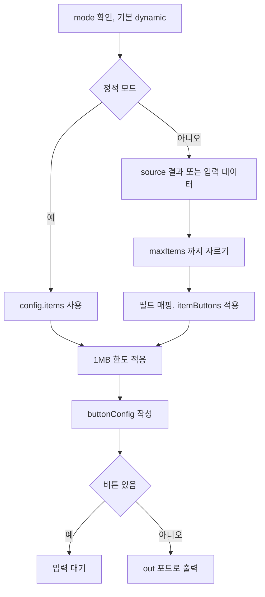

> 구현 상태: 구현됨 · 원문: `spec/4-nodes/6-presentation/1-carousel.md`, `spec/4-nodes/_product-overview.md` (§9.1) · 용어: [용어 사전](../CLE-GLOSSARY.md)

## 개요

Carousel 노드(Carousel, `carousel`)는 데이터를 슬라이드 목록으로 구조화해 카드 여러 장을 넘겨 보는 형태로 보여 주는 노드다. 버튼이 있으면 사용자 입력을 기다리는 블로킹 노드가 된다.

데이터 소스 방식(`mode`)은 두 가지다. 정적 모드(`static`)는 슬라이드를 설정에 직접 적는다. 동적 모드(`dynamic`)는 `source` 표현식이 돌려준 배열을 `titleField`·`descriptionField`·`imageField` 로 매핑해 실행할 때 슬라이드를 만든다. 전역 버튼이나 항목 버튼이 하나라도 있으면 블로킹 모드로 들어간다.

범위 밖:

- 버튼 정의·버튼 편집기·포트 구성·블로킹 모드 흐름·출력 크기 한도·재개 출력 규격: [Presentation 노드 공통](CLE-NODE-PRES-COMMON.md)
- 실행 결과 드로어의 Carousel 표시: [Presentation 노드 공통](CLE-NODE-PRES-COMMON.md#실행-결과-드로어-표시)
- 표시 도구 `render_carousel`: [Presentation 노드 공통](CLE-NODE-PRES-COMMON.md#표시-도구-모드)
- 노드 출력 다섯 필드의 일반 규칙: [노드 출력 규약](../CLE-NODE/CLE-NODE-OUTPUT.md)

## 요구사항

- REQ-CAROUSEL-001 WHEN 노드가 실행되면 THE SYSTEM SHALL 입력 배열 데이터를 캐러셀 슬라이드 목록으로 구조화한다. (원본: ND-CL-01)
- REQ-CAROUSEL-002 WHEN 동적 모드로 슬라이드를 만들면 THE SYSTEM SHALL 각 항목의 `titleField`·`descriptionField`·`imageField` 값을 슬라이드의 제목·설명·이미지로 매핑한다. (원본: ND-CL-02)
- REQ-CAROUSEL-003 WHEN 사용자가 레이아웃을 설정하면 THE SYSTEM SHALL `card`·`image`·`minimal` 가운데 하나를 받고 기본값은 `card` 로 한다. (원본: ND-CL-03)
- REQ-CAROUSEL-004 WHEN 동적 모드에서 원본 배열이 `maxItems` 보다 길면 THE SYSTEM SHALL 앞에서부터 `maxItems` 개(1~100, 기본 10)까지만 슬라이드로 만든다. (원본: ND-CL-04)
- REQ-CAROUSEL-005 WHEN 노드가 결과를 내면 THE SYSTEM SHALL 슬라이드 데이터를 구조화된 출력 값으로 내고 HTML 스냅샷은 만들지 않는다. (원본: ND-CL-05)
- REQ-CAROUSEL-006 WHEN 사용자가 전역 버튼을 설정하면 THE SYSTEM SHALL 링크 버튼과 포트 버튼을 노드당 최대 5개까지 라벨·스타일·URL(링크 버튼)과 함께 받는다. (원본: ND-CL-06)
- REQ-CAROUSEL-007 WHEN 전역 버튼이나 항목 버튼이 하나라도 있으면 THE SYSTEM SHALL 실행을 입력 대기로 멈추고 사용자가 누른 버튼의 포트로 실행을 재개한다. (원본: ND-CL-07)
- REQ-CAROUSEL-008 WHEN 정적 모드에서 항목 버튼을 설정하면 THE SYSTEM SHALL 항목마다 최대 5개의 버튼을 따로 받고 포트 버튼마다 고유 포트를 만든다. (원본: ND-CL-08)
- REQ-CAROUSEL-009 WHEN 동적 모드에서 `itemButtons` 를 설정하면 THE SYSTEM SHALL 공통 버튼 정의(최대 5개)를 모든 항목에 적용하고 버튼 정의 단위로 포트를 만든다. (원본: ND-CL-08)
- REQ-CAROUSEL-010 WHEN 사용자가 항목 포트 버튼을 누르면 THE SYSTEM SHALL 그 항목 데이터를 `selectedItem` 에 담아 다운스트림에 전달한다. (원본: ND-CL-09)
- REQ-CAROUSEL-011 WHEN 동적 모드에서 `source` 표현식이 설정되어 있으면 THE SYSTEM SHALL 엔진이 해석한 표현식 결과 배열을 데이터 소스로 쓴다. (원본: ND-CL-10)
- REQ-CAROUSEL-012 IF 동적 모드에서 `source` 가 없으면 THE SYSTEM SHALL 입력 포트 데이터를 쓰되 배열이 아니면 `[input]` 으로 감싸고 null 이면 `[]` 로 쓴다.
- REQ-CAROUSEL-013 WHEN `mode` 가 설정되어 있지 않으면 THE SYSTEM SHALL 동적 모드로 처리한다.
- REQ-CAROUSEL-014 IF 정적 모드에서 `items` 가 비었거나 없으면 THE SYSTEM SHALL 빈 배열로 처리한다.
- REQ-CAROUSEL-015 IF 항목에 매핑 필드가 없으면 THE SYSTEM SHALL 그 슬라이드 값을 빈 문자열로 채운다.
- REQ-CAROUSEL-016 IF 이미지 URL 이 `javascript:` 스킴이면 THE SYSTEM SHALL 그 값을 sanitize 한다.
- REQ-CAROUSEL-017 WHEN 직렬화한 슬라이드 배열이 1MB 를 넘으면 THE SYSTEM SHALL 뒤에서부터 원소 단위로 잘라 내고 `output.itemsTruncated`·`output.itemsTotalCount` 를 싣는다.
- REQ-CAROUSEL-018 WHEN 정적 모드로 결과를 내면 THE SYSTEM SHALL 출력 값을 `{}` 로 두고 슬라이드는 `config.items` 에서 읽게 한다.
- REQ-CAROUSEL-019 WHEN 동적 모드로 결과를 내면 THE SYSTEM SHALL 매핑 결과를 `output.items` 에 싣는다.
- REQ-CAROUSEL-020 WHEN 항목 버튼이 있으면 THE SYSTEM SHALL 런타임 ID `<btn.id>__item_<idx>` 를 만들고 한도 적용 후 인덱스를 `buttonConfig.buttonItemMap` 에 기록한다.
- REQ-CAROUSEL-021 WHEN 항목 버튼이 눌리면 THE SYSTEM SHALL 런타임 ID 에서 `__item_\d+$` 를 떼어 원래 버튼 ID 포트로 라우팅한다.
- REQ-CAROUSEL-022 IF 사용자가 정의한 버튼 ID 에 `__item_` 이 들어 있으면 THE SYSTEM SHALL 설정 검증에서 거부한다.
- REQ-CAROUSEL-023 WHEN 웹채팅 같은 인터랙티브 채널이 캐러셀을 그리면 THE SYSTEM SHALL `layout` 에 따라 시각 레이아웃을 바꾸고 한 번에 한 슬라이드와 이전·다음 이동을 보여 준다.
- REQ-CAROUSEL-024 WHEN 실행 내역이나 실행 결과 드로어가 캐러셀을 그리면 THE SYSTEM SHALL 시각 레이아웃 대신 텍스트 위주 데이터 뷰로 그리고 `layout` 값을 배지로 보여 준다.
- REQ-CAROUSEL-025 WHEN 사용자가 동적 모드에서 필드 경로를 입력하면 THE SYSTEM SHALL 이전 노드 출력 스키마로 자동완성을 제공한다.
- REQ-CAROUSEL-026 IF 설정 검증에 실패하면 THE SYSTEM SHALL 실행 전 검증 단계에서 에러를 던지고 런타임 에러 포트는 쓰지 않는다.

입력 대기 기한(타임아웃)은 정의가 갈린다. [미결 사항](#미결-사항) 참조.

제품 요구사항 원문(ND-CL-01~10)의 우선순위는 모두 필수다.

## 설정

| 필드 | 타입 | 필수 | 기본값 | 설명 |
|------|------|------|--------|------|
| `mode` | `static` / `dynamic` | ✗ | `dynamic` | 데이터 소스 방식. 없으면 `dynamic`(하위 호환) |
| `items` | ItemDef[] | 정적 모드일 때 ✓ | `[]` | 정적 슬라이드 정의(정적 모드 전용). 출력 크기 한도를 적용한다 |
| `source` | Expression | ✗ | 없음 | 배열을 돌려주는 표현식(`{{ $node["X"].output.items }}` 등). 없으면 입력 포트 데이터를 그대로 쓴다(동적 모드 전용, 하위 호환) |
| `titleField` | String | 동적 모드일 때 ✓ | 없음 | 슬라이드 제목 필드 경로(동적 모드 전용) |
| `descriptionField` | String | ✗ | 없음 | 슬라이드 설명 필드 경로(동적 모드 전용) |
| `imageField` | String | ✗ | 없음 | 이미지 URL 필드 경로(동적 모드 전용) |
| `maxItems` | Number | ✗ | `10` | 최대 슬라이드 수 1~100(동적 모드 전용) |
| `itemButtons` | ButtonDef[] | ✗ | `[]` | 동적 모드 항목 공통 버튼. 최대 5개. 실행할 때 `<itemButton.id>__item_<idx>` ID 를 만들고 라우팅할 때 원래 ID 로 잇는다 |
| `layout` | `card` / `image` / `minimal` | ✗ | `card` | 카드 레이아웃. 설정 에코에 싣는다. 쓰임은 [렌더 표면](#렌더-표면) 참조 |
| `buttons` | ButtonDef[] | ✗ | `[]` | 전역 버튼 정의. 최대 5개. 비어 있지 않으면 블로킹 모드. 구조는 [Presentation 노드 공통](CLE-NODE-PRES-COMMON.md#버튼-정의) |

**ItemDef(정적 모드 슬라이드 정의):**

| 필드 | 타입 | 필수 | 설명 |
|------|------|------|------|
| `title` | String | ✓ | 슬라이드 제목. 표현식을 쓸 수 있다 |
| `description` | String | ✗ | 슬라이드 설명. 표현식을 쓸 수 있다 |
| `image` | String | ✗ | 이미지 URL. 표현식을 쓸 수 있다. `javascript:` 스킴은 sanitize 한다 |
| `buttons` | ButtonDef[] | ✗ | 항목 버튼. 최대 5개. 포트 버튼과 링크 버튼을 모두 쓸 수 있다. 포트 버튼을 누르면 `selectedItem` 이 사용자 입력 기록에 들어간다 |

스키마 단일 기준은 `codebase/backend/src/nodes/presentation/carousel/carousel.schema.ts` 의 `carouselNodeConfigSchema` 다.

## 설정 화면

| 영역 | 위치 | 들어가는 요소 | 동작 |
|------|------|---------------|------|
| 모드 선택 | 맨 위 | Mode 드롭다운("Static Items" / "Dynamic (from input)") | 고른 모드에 맞는 입력란을 보여 준다 |
| 항목 목록(정적 모드) | 모드 아래 | 항목 카드마다 Title, Description, Image URL, 접이식 Item Buttons(개수 표시), 삭제 `[X]` | `[+ Add Item]` 으로 항목을 더한다. 각 입력란에 표현식으로 변수를 참조할 수 있다. Item Buttons 를 펼치면 항목 버튼 카드를 편집한다 |
| 매핑 입력(동적 모드) | 모드 아래 | Source, Title Field, Description Field, Image Field, 접이식 Item Buttons, Max Items | 필드 경로를 입력하면 이전 노드 출력 스키마로 자동완성한다 |
| 레이아웃 | 입력란 아래 | Layout 드롭다운(`card` / `image` / `minimal`) | 레이아웃을 고른다 |
| Buttons 섹션 | 맨 아래 | 전역 버튼 편집기 | [Presentation 노드 공통](CLE-NODE-PRES-COMMON.md#버튼-편집기) 의 버튼 편집기를 쓴다 |

## 포트

포트 구성의 공통 규칙은 [Presentation 노드 공통](CLE-NODE-PRES-COMMON.md#포트-구성) 이 정한다. Carousel 은 전역 `buttons` 뿐 아니라 항목 버튼(정적 `items[].buttons`, 동적 `itemButtons`)도 블로킹 모드로 들어가는 조건이 된다.

**입력 포트:**

| id | label | type | dynamic | 설명 |
|------|-------|------|---------|------|
| `in` | Input | data | false | 입력 데이터. 동적 모드에서 `source` 가 없을 때 데이터 소스로 쓴다 |

**출력 포트(버튼이 없을 때):**

| id | label | type | dynamic | 설명 |
|------|-------|------|---------|------|
| `out` | Output | data | false | 노드 결과 출력 |

**출력 포트(버튼이 있을 때):**

| id | label | type | dynamic | 설명 |
|------|-------|------|---------|------|
| `<button.id>` | 전역 버튼 라벨 | data | true | 전역 포트 버튼마다 동적으로 만든다 |
| `<itemButton.id>` | 항목 버튼 라벨 | data | true | 항목 포트 버튼의 원래 포트. 실행할 때 ID 는 `<itemButton.id>__item_<idx>` 가 되고 엔진이 `__item_\d+$` 를 떼어 원래 ID 로 라우팅한다 |
| `continue` | Continue | data | true | 링크 버튼만 있을 때 자동으로 만든다 |

버튼이 있으면 `out` 은 없어진다. 항목 포트 이름 규칙은 [Presentation 노드 공통](CLE-NODE-PRES-COMMON.md#동적-포트-id-규칙) 이 정한다.

## 실행 로직



1. `mode` 를 확인한다. 기본값은 `dynamic` 이다.
2. **정적 모드**: `config.items` 를 그대로 쓴다. 표현식은 엔진이 미리 해석한다. 비었거나 없으면 `[]` 로 쓴다.
3. **동적 모드**:
   1. `source` 표현식이 있으면 해석한 결과를 배열로 쓴다. 없으면 입력 포트 데이터(`input`)를 쓴다. 배열이 아니면 `[input]` 으로 감싸고 null 이면 `[]` 로 쓴다.
   2. `maxItems` 까지 슬라이드를 줄인다.
   3. 각 항목에 `titleField`·`descriptionField`·`imageField` 를 매핑한다. 없는 필드는 빈 문자열로 두고 이미지의 `javascript:` 는 sanitize 한다.
   4. `itemButtons` 가 있으면 모든 항목에 같은 버튼을 붙인다. 런타임 ID 는 `<btn.id>__item_<idx>` 다.
4. 출력 크기 한도를 적용한다. `truncateArrayForOutput` 으로 뒤에서부터 원소 단위로 자르고 배열 형태는 유지한다. 한도가 걸리면 `output.itemsTruncated`·`output.itemsTotalCount` 를 싣는다.
5. 전역 버튼과 항목 버튼을 합쳐 `buttonConfig.buttons` 를 만든다. 항목 버튼 런타임 ID 에서 항목 인덱스로 가는 매핑을 `buttonConfig.buttonItemMap` 에 기록한다. 인덱스는 한도를 적용한 뒤 기준이다.
6. 출력 값을 모드별로 나눈다.
   - **정적 모드**: `output: {}`. 한도가 걸리면 `{ itemsTruncated, itemsTotalCount }`. 슬라이드는 `config.items` 를 본다.
   - **동적 모드**: `output: { items }`. 한도가 걸리면 `itemsTruncated`·`itemsTotalCount` 를 함께 싣는다.
7. **블로킹 모드**(전역 버튼이나 항목 버튼이 하나라도 있음): [Presentation 노드 공통](CLE-NODE-PRES-COMMON.md#블로킹-모드-실행-흐름) 흐름을 따른다. `status: 'waiting_for_input'`, `meta.interactionType: 'buttons'`, `buttonConfig` 를 남긴다.
8. **표시 전용**(버튼이 전혀 없음): `out` 포트로 출력하고 `status` 는 두지 않는다.

## 렌더 표면

프런트엔드는 `config`(mode, layout, items 등)와 동적 모드의 `output.items` 를 합쳐 슬라이드를 다시 만든다. 핸들러는 HTML 스냅샷을 만들지 않는다. 렌더 표면은 두 곳이고 목적이 달라 표현이 다르다.

| 표면 | 목적 | 표현 |
|------|------|------|
| 인터랙티브 채널(웹채팅 위젯 등) | 최종 사용자가 슬라이드를 넘기고 버튼을 누른다 | `layout` 에 따라 **시각 레이아웃**을 다시 만든다. `image` 는 이미지 위주로 그리고 설명을 뺀다. `minimal` 은 이미지를 빼고 텍스트만 쓴다. `card` 는 이미지·제목·설명을 모두 쓴다. 한 번에 한 슬라이드를 보여 주고 이전·다음으로 이동한다. 구현은 `codebase/channel-web-chat/src/widget/components/presentations.tsx` 의 `CarouselView` 다 |
| 실행 내역·실행 결과 드로어 미리보기(`CarouselContent`) | 이미 끝난 실행의 스냅샷을 확인한다. 조작할 수 없다 | 픽셀 단위 시각 재현 대신 **텍스트 위주 데이터 뷰**로 그린다. 슬라이드마다 제목·설명·버튼 라벨을 늘어놓고 `layout` 값을 배지로 보여 준다. 이미지는 **lazy 로딩 썸네일**로 보여 주고 URL 도 확인할 수 있다. 데이터·이미지 매핑 확인에 맞춘다. 여러 이미지를 한꺼번에 불러오지 않는다 |

채팅 채널의 캐러셀 표현은 [채팅 채널 어댑터 규약](../CLE-CHAT/CLE-CHAT-ADAPTER.md) 이 정한다. 카드 이미지 필드 이름이 어긋나는 문제는 [미결 사항](#미결-사항) 참조.

## 출력 구조

JSON 예시는 `undefined` 필드를 생략한다. 노드 출력의 다섯 필드(`config`·`output`·`meta?`·`port?`·`status?`) 밖의 최상위 키는 쓰지 않는다. 경우는 표시 전용, 입력 대기(정적·동적 모드), 재개(전역 버튼·항목 버튼·Continue)로 나뉜다. 설정 검증 실패는 실행 전 검증에서 던진다.

### 표시 전용(버튼 없음)

```json
{
  "config": {
    "mode": "dynamic",
    "layout": "card",
    "source": "{{ $input.items }}",
    "titleField": "name",
    "descriptionField": "summary",
    "imageField": "thumb",
    "maxItems": 10
  },
  "output": {
    "items": [
      { "title": "Alpha", "description": "First", "image": "http://a.png" },
      { "title": "Beta",  "description": "Second", "image": "http://b.png" }
    ]
  }
}
```

표시 전용 핸들러는 `{ config, output }` 만 돌려준다(`carousel.handler.ts`). `meta.durationMs` 는 핸들러가 아니라 엔진이 넣는다.

| 필드 | 타입 | 출처 | 설명 |
|------|------|------|------|
| `config.mode` | `'static'` / `'dynamic'` | 설정 에코 | 사용자가 정한 모드. 없으면 `'dynamic'` |
| `config.layout` | `'card'` / `'image'` / `'minimal'` | 설정 에코 | 카드 레이아웃(기본 `card`) |
| `config.source` | String(원문) | 설정 에코 | 동적 모드 표현식. `{{ }}` 원문을 보존한다 |
| `config.titleField` / `descriptionField` / `imageField` | String | 설정 에코 | 매핑 필드 경로(동적 모드 전용) |
| `config.items` | ItemDef[] | 설정 에코 | 정적 모드 슬라이드 정의 |
| `output.items` | Array | 런타임(`source` 해석 + 필드 매핑, 동적 모드 전용) | 동적 모드 매핑 결과. 출력 크기 한도를 적용한다. **정적 모드는 이 필드를 싣지 않는다.** 슬라이드는 `config.items` 를 본다 |
| `meta.durationMs` | number | 엔진 주입 | 실행 시간(ms) |
| `port` | `undefined` | 없음 | 단일 출력(`out`). `port` 를 두지 않는다 |

정적 모드의 표시 전용 출력 값은 `{}` 다. 한도가 걸리면 `{ itemsTruncated, itemsTotalCount }` 다.

표현식 접근 예(동적 모드):

- `$node["C"].output.items[0].title` → `"Alpha"`
- `$node["C"].config.layout` → `"card"`(리터럴 설정)

### 입력 대기

블로킹 모드에 들어가면 `status: 'waiting_for_input'` 과 `meta.interactionType: 'buttons'` 를 싣는다. 출력 값은 모드별로 다르다.

**정적 모드:**

```json
{
  "config": {
    "mode": "static",
    "layout": "card",
    "items": [
      {
        "title": "Item A",
        "description": "Desc A",
        "image": "http://a.png",
        "buttons": [ { "id": "act", "label": "Select", "type": "port", "style": "primary" } ]
      },
      { "title": "Item B", "description": "Desc B", "image": "http://b.png" }
    ],
    "buttons": [
      { "id": "approve", "label": "Approve", "type": "port", "style": "primary" },
      { "id": "reject",  "label": "Reject",  "type": "port", "style": "danger"  }
    ],
    "buttonConfig": {
      "buttons": [
        { "id": "approve", "label": "Approve", "type": "port", "style": "primary" },
        { "id": "reject",  "label": "Reject",  "type": "port", "style": "danger" },
        { "id": "act__item_0", "label": "Select", "type": "port", "style": "primary" }
      ],
      "buttonItemMap": { "act__item_0": 0 }
    }
  },
  "output": {},
  "meta": { "durationMs": 0, "interactionType": "buttons" },
  "status": "waiting_for_input"
}
```

| 필드 | 타입 | 출처 | 설명 |
|------|------|------|------|
| `config.items` | ItemDef[] | 설정 에코 | 사용자가 정의한 정적 슬라이드. 다음 노드는 `$node["C"].config.items` 로 읽는다 |
| `config.buttons` | ButtonDef[] | 설정 에코 | 전역 버튼 정의 원문. `label`·`url` 의 `{{ }}` 를 보존한다 |
| `config.buttonConfig.buttons` | ButtonDef[] | 런타임(전역 + 항목 합산) | 핸들러가 만든 통합 버튼 목록. 항목 버튼은 `<btn.id>__item_<idx>` 런타임 ID 다 |
| `config.buttonConfig.buttonItemMap` | `Record<string, number>?` | 런타임 | 항목 버튼 런타임 ID → 한도 적용 후 `items` 인덱스. 비어 있으면 생략한다 |
| `output` | `{}` | 없음 | 정적 모드는 런타임 계산값이 없다. 슬라이드는 `config.items` 를 본다 |
| `meta.durationMs` | number | 엔진 주입 | |
| `meta.interactionType` | `'buttons'` | 핸들러 반환 | 대기 표면 |
| `status` | `'waiting_for_input'` | 핸들러 반환 | 블로킹 모드 진입 |

**동적 모드:**

```json
{
  "config": {
    "mode": "dynamic",
    "layout": "card",
    "source": "{{ $node[\"Fetch\"].output.response.items }}",
    "titleField": "name",
    "descriptionField": "desc",
    "imageField": "img",
    "maxItems": 10,
    "itemButtons": [ { "id": "act", "label": "Select", "type": "port" } ],
    "buttons": [ { "id": "approve", "label": "Approve", "type": "port" } ],
    "buttonConfig": {
      "buttons": [
        { "id": "approve", "label": "Approve", "type": "port" },
        { "id": "act__item_0", "label": "Select", "type": "port" },
        { "id": "act__item_1", "label": "Select", "type": "port" }
      ],
      "buttonItemMap": { "act__item_0": 0, "act__item_1": 1 }
    }
  },
  "output": {
    "items": [
      { "title": "Alpha", "description": "First",  "image": "http://a.png" },
      { "title": "Beta",  "description": "Second", "image": "http://b.png" }
    ]
  },
  "meta": { "durationMs": 42, "interactionType": "buttons" },
  "status": "waiting_for_input"
}
```

| 필드 | 타입 | 출처 | 설명 |
|------|------|------|------|
| `config.source` / `titleField` / `descriptionField` / `imageField` / `itemButtons` | 설정 표 참조 | 설정 에코 | 동적 모드 설정 원문 |
| `config.buttonConfig` | object | 런타임 | 정적 모드와 같다. 전역 버튼과 항목 버튼을 합치고 매핑한다 |
| `output.items` | Array | 런타임(`source` 해석 + 필드 매핑 + `maxItems`·한도 적용) | 동적 모드 런타임 값. `config.items` 와 독립이다 |
| `output.itemsTruncated` | `true?` | 런타임 | 한도로 뒤쪽 원소를 잘랐을 때만 싣는다 |
| `output.itemsTotalCount` | number? | 런타임 | 한도 적용 전 원소 수 |
| `meta.durationMs` / `meta.interactionType` | 정적 모드와 같다 | | |
| `status` | `'waiting_for_input'` | | |

표현식 접근 예(동적 모드, 입력 대기):

- `$node["C"].output.items[0].title` → `"Alpha"`(런타임 매핑 결과)
- `$node["C"].config.layout` → `"card"`(리터럴 설정)
- `$node["C"].status` → `"waiting_for_input"`

### 재개

입력 대기 시점의 출력 값을 바꾸지 않는 스냅샷으로 두고 `output.interaction` 을 더한다. `status: 'resumed'` 이고 `port` 는 누른 버튼의 원래 ID(항목 버튼은 접미사를 뗀 값)나 `'continue'` 다.

**전역 포트 버튼 클릭:**

```json
{
  "config": {
    "mode": "static",
    "layout": "card",
    "items": [ /* 입력 대기와 같다 */ ],
    "buttons": [ { "id": "approve", "label": "Approve", "type": "port" } ],
    "buttonConfig": { /* 입력 대기와 같다 */ }
  },
  "output": {
    "interaction": {
      "type": "button_click",
      "data": {
        "buttonId": "approve",
        "buttonLabel": "Approve"
      },
      "receivedAt": "2026-04-19T12:34:56.000Z"
    }
  },
  "meta": { "durationMs": 12340, "interactionType": "buttons" },
  "port": "approve",
  "status": "resumed"
}
```

| 필드 | 타입 | 출처 | 설명 |
|------|------|------|------|
| `output.interaction.type` | `'button_click'` | 엔진 주입(재개) | 사용자 행동 종류 |
| `output.interaction.data.buttonId` | String | 엔진 | 누른 버튼의 원래 ID(항목 버튼은 접미사를 뗀 값) |
| `output.interaction.data.buttonLabel` | String | 엔진 | 표현식을 해석한 버튼 라벨 |
| `output.interaction.receivedAt` | ISO8601 | 엔진 | 클릭 시각 |
| `port` | String | 엔진 | 누른 버튼의 원래 ID(`interaction.data.buttonId` 와 같다) |
| `status` | `'resumed'` | 엔진 | 재개 상태 |

동적 모드에서 전역 버튼을 누르면 입력 대기의 `output.items` 가 그대로 남고 `interaction` 만 더해진다.

**항목 포트 버튼 클릭:**

```json
{
  "output": {
    "items": [
      { "title": "Alpha", "description": "First",  "image": "http://a.png" },
      { "title": "Beta",  "description": "Second", "image": "http://b.png" }
    ],
    "interaction": {
      "type": "button_click",
      "data": {
        "buttonId": "act",
        "buttonLabel": "Select",
        "selectedItem": { "title": "Alpha", "description": "First", "image": "http://a.png" }
      },
      "receivedAt": "2026-04-19T12:34:56.000Z"
    }
  },
  "meta": { "durationMs": 9876, "interactionType": "buttons" },
  "port": "act",
  "status": "resumed"
}
```

| 필드 | 타입 | 출처 | 설명 |
|------|------|------|------|
| `output.items` | Array(동적 모드) | 입력 대기 스냅샷 | 동적 모드일 때만 싣는다. 정적 모드는 `output: { interaction }` 만 있고 슬라이드는 `config.items` 를 본다 |
| `output.interaction.data.selectedItem` | object | 엔진 | 누른 항목의 슬라이드 데이터. 동적 모드는 `output.items[idx]`, 정적 모드는 `config.items[idx]` 와 같다 |
| `port` | String | 엔진 | 항목 버튼의 **원래 ID**. 런타임 `<btn.id>__item_<idx>` 에서 접미사를 뗀다 |
| 그 밖 | 전역 버튼 클릭과 같다 | | |

엔진은 `__item_\d+$` 를 떼어 워크플로우 연결선의 출발 포트인 원래 ID(`act`)로 라우팅한다. 사용자가 정의한 `button.id` 에 `__item_` 이 있으면 스키마 검증(`validateCarouselItemButtons`)에서 거부한다.

**링크 버튼만 있을 때 Continue 클릭:**

링크 버튼만 있으면 자동으로 만든 계속 포트(`continue`)가 켜진다.

```json
{
  "output": {
    "interaction": {
      "type": "button_continue",
      "data": {
        "buttonId": "more",
        "buttonLabel": "More Info",
        "url": "https://docs.example.com/more"
      },
      "receivedAt": "2026-04-19T12:34:56.000Z"
    }
  },
  "meta": { "durationMs": 5432, "interactionType": "buttons" },
  "port": "continue",
  "status": "resumed"
}
```

| 필드 | 타입 | 출처 | 설명 |
|------|------|------|------|
| `output.interaction.type` | `'button_continue'` | 엔진 | 링크 버튼만 있을 때 Continue 클릭 |
| `output.interaction.data.url` | String | 엔진 | 해석한 외부 URL |
| `port` | `'continue'` | 엔진 | 링크 버튼 전용 자동 포트 |

표현식 접근 예:

- `$node["C"].port` → `"approve"` / `"act"` / `"continue"`
- `$node["C"].output.interaction.type` → `"button_click"` / `"button_continue"`
- `$node["C"].output.interaction.data.selectedItem.title` → 항목 버튼을 눌렀을 때 슬라이드 제목
- `$node["C"].config.items[0].title` → 정적 슬라이드 제목(입력 대기 때와 같다)

## 에러 코드

Carousel 은 **런타임 에러 포트가 없다**. 모든 검증 실패는 실행 전 설정 검증 단계에서 던진다. 메시지는 노드 경고 규칙(`warningRules`, `carousel.schema.ts` 의 `carouselNodeMetadata.warningRules`)의 영문 원문이다.

| 발생 조건 | 메시지 | 시점 |
|-----------|--------|------|
| 동적 모드인데 `titleField` 가 없음 | `In Dynamic mode, a Title field must be entered.` | 노드 경고 규칙(캔버스 배지) + `handler.validate` |
| 정적 모드인데 `items` 가 빈 배열 | `In Static mode, at least one slide must be added.` | 노드 경고 규칙 |
| `mode` 가 `static`·`dynamic` 밖의 값 | `Mode must be either static or dynamic.` | 노드 경고 규칙 |
| 정적 모드 `items` 가 배열이 아님 | `items must be an array in static mode` | `handler.validate` |
| 동적 모드 `titleField` 가 문자열이 아님 | `titleField is required and must be a string` | `handler.validate` |
| 정적 `items[i].title` 이 없음 | `items[i].title is required and must be a string` | `validateConfig` |
| 항목 버튼이 6개 이상 | `items[i]: maximum 5 buttons per item`(정적) / `itemButtons: maximum 5 buttons per item`(동적) | `validateConfig` |
| 항목 `button.id` 에 `__item_` 포함 | `items[i].buttons[j].id must not contain reserved separator "__item_"` | `validateConfig` |
| 항목 `button.id` 중복 | `items[i].buttons[j].id must be unique (duplicate: …)` | `validateConfig` |
| 포트 버튼에 `url` 설정 | `…buttons[j].url is not allowed for port type buttons` | `validateConfig` |
| 링크 버튼 `url` 누락 또는 위험 스킴 | `…buttons[j].url is required for link type buttons` / `…contains a disallowed URL scheme` | `validateConfig` |
| 전역 `buttons` 위반 | [Presentation 노드 공통](CLE-NODE-PRES-COMMON.md#유효성-검증) 규칙 | `validateButtons`(공유) |

## 설정 요약

| 경우 | 설정 요약 포맷 | 예시 |
|------|----------------|------|
| 버튼 없음 | `{layout} · {titleField}` | `card · name` |
| 버튼 있음 | `{layout} · {N} buttons` | `card · 3 buttons` |

위 포맷은 목표 포맷이다. 현재 구현은 Carousel 스키마에 `summaryTemplate` 이 없어 캔버스에 요약 줄이 보이지 않는다(미구현, [Presentation 노드 공통](CLE-NODE-PRES-COMMON.md#설정-요약)).

## 미결 사항

- **입력 대기 기한(타임아웃)**: 요구사항 원문(ND-CL-07)은 "선택적 타임아웃 지원(무제한 가능)" 을 적고 이 노드 원문은 외부 취소나 종료 전까지 기한 없이 기다린다고 적는다. 설정에 타임아웃 필드는 없다. 결정은 [Presentation 노드 공통](CLE-NODE-PRES-COMMON.md#미결-사항) 에서 함께 한다.
- **채팅 채널 렌더러의 이미지 필드 이름**: 채팅 채널 어댑터 문서와 렌더러는 캐러셀 카드 이미지를 `imageUrl` 로 찾지만 이 노드는 `items[].image` 로 낸다(동적 모드 `output.items`, 정적 모드 `config.items`). 매트릭스와 렌더러를 고칠지, 렌더러 앞에 변환 층을 둘지는 [채팅 채널 어댑터 규약 미결 사항](../CLE-CHAT/CLE-CHAT-ADAPTER.md#미결-사항) 에서 정한다.

## 구현 위치

- `codebase/backend/src/nodes/presentation/carousel/carousel.component.ts`
- `codebase/backend/src/nodes/presentation/carousel/carousel.handler.ts`
- `codebase/backend/src/nodes/presentation/carousel/carousel.schema.ts` (`carouselNodeConfigSchema`, `validateCarouselItemButtons`)
- `codebase/frontend/src/components/editor/run-results/renderers/presentation-renderers.tsx` (`CarouselContent`)
- `codebase/channel-web-chat/src/widget/components/presentations.tsx` (`CarouselView`)

## Rationale

### 레이아웃 렌더 표면을 둘로 나눈다 (2026-07-07)

`layout`(card / image / minimal)을 그리는 곳은 두 군데이고 목적이 달라 표현을 나눈다.

- **인터랙티브 채널(웹채팅 위젯)**: 최종 사용자가 슬라이드를 넘기고 버튼을 누르는 실사용 화면이다. 여기서는 `layout` 에 따라 시각 레이아웃을 다시 만든다. 이미 구현돼 있다(`channel-web-chat` 의 `CarouselView`).
- **실행 내역·실행 결과 드로어 미리보기(`CarouselContent`)**: 이미 끝난 실행의 스냅샷이라 **조작할 수 없다**. 세 CSS 레이아웃을 픽셀 단위로 재현해도 얻는 것이 적고 여러 이미지를 한꺼번에 불러오는 비용만 든다. 그래서 텍스트 위주 데이터 뷰(제목·설명·버튼 라벨 + `layout` 배지 + lazy 썸네일과 URL)로 그려 데이터·이미지 매핑 확인에 맞춘다.

**기각한 대안**:

- 미리보기에 세 시각 레이아웃을 옮기는 안: 조작할 수 없는 디버그 화면에 시각 충실도를 들일 이유가 적다. 시각 표현은 이미 웹채팅에 있으므로 제품이 약속한 것을 잃지 않는다.
- `image`·`minimal` 을 낮추거나 없애는 안: `layout` 은 웹채팅에서 실제로 쓰고 있어 없애면 인터랙티브 렌더가 깨진다.

이전 명세는 미리보기에 좌우 화살표 슬라이드 이동·인디케이터·시각 레이아웃 재구성을 적었지만 실제 코드(가로 스크롤)와 달랐다. 이 결정으로 명세를 실제 동작(텍스트 위주 뷰)에 맞춘다.
