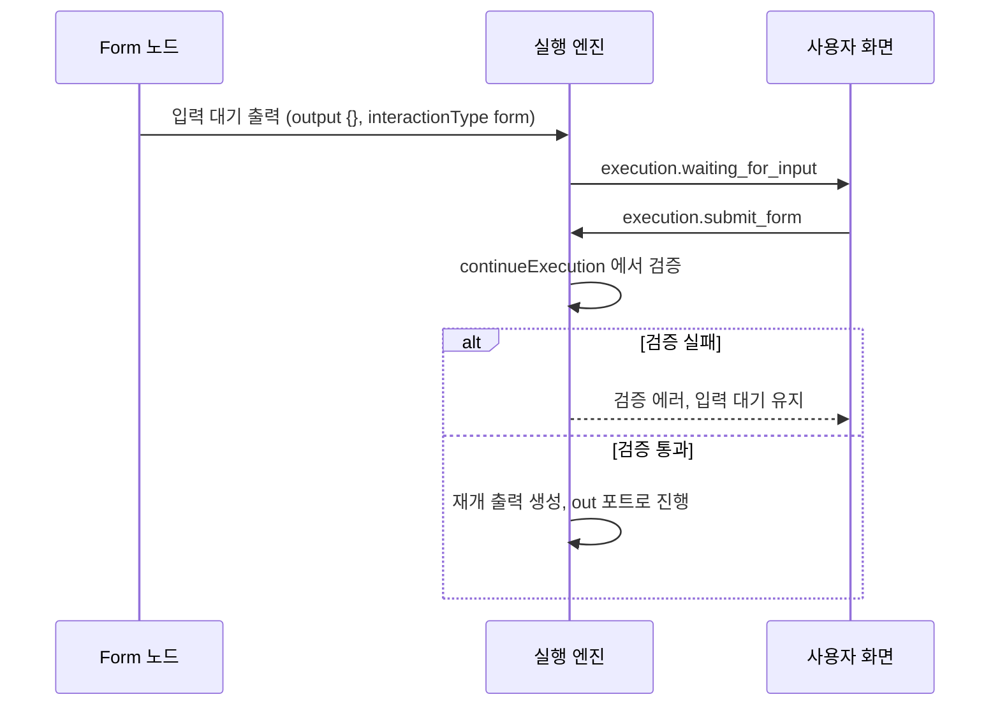

> 구현 상태: 구현됨 (검증 preset 카탈로그와 캔버스 설정 요약은 미구현) · 원문: `spec/4-nodes/6-presentation/4-form.md`, `spec/4-nodes/_product-overview.md` (§9.4) · 용어: [용어 사전](../CLE-GLOSSARY.md)

## 개요

Form 노드(Form, `form`)는 워크플로우 실행 도중 사용자에게 입력 폼을 보여 주고 제출을 기다리는 노드다. 실행을 입력 대기로 멈추고 폼으로 사용자 입력을 모은 뒤 실행을 재개한다. 항상 블로킹 노드이고 표시 전용 경우가 없다.

Form 노드는 버튼 정의(`ButtonDef`)를 쓰지 않고 자체 폼 필드(`FormField`) 구조를 쓴다. 폼 필드는 이름, 아홉 가지 유형, 검증 규칙, 파일 제약을 담는다.

범위 밖:

- 입력 대기 출력·재개 출력의 공통 규격, 대화 스레드 opt-out: [Presentation 노드 공통](CLE-NODE-PRES-COMMON.md)
- 실행 결과 드로어의 Form 표시: [Presentation 노드 공통](CLE-NODE-PRES-COMMON.md#실행-결과-드로어-표시)
- AI 에이전트의 `render_form` 도구와 옵션 값 채우기: [Presentation 노드 공통](CLE-NODE-PRES-COMMON.md#표시-도구-모드)
- park 와 재개 메커니즘: [실행 상태 머신과 대기·재개](../CLE-EXEC/CLE-EXEC-STATE.md)
- 채팅 채널 어댑터의 폼 매핑: [채팅 채널 어댑터 규약](../CLE-CHAT/CLE-CHAT-ADAPTER.md)

## 요구사항

- REQ-FORM-001 WHEN 실행이 Form 노드에 도달하면 THE SYSTEM SHALL 사용자 입력을 받으려고 실행을 입력 대기로 멈춘다. (원본: ND-FM-01)
- REQ-FORM-002 WHEN 사용자가 필드를 정의하면 THE SYSTEM SHALL `text`·`number`·`email`·`textarea`·`select`·`checkbox`·`radio`·`date`·`file` 유형을 받는다. (원본: ND-FM-02)
- REQ-FORM-003 WHEN 사용자가 필드 검증 규칙을 설정하면 THE SYSTEM SHALL 필수·최소/최대 길이·최솟값/최댓값·정규식 패턴 규칙을 받는다. (원본: ND-FM-03)
- REQ-FORM-004 WHEN 사용자가 폼을 제출하고 검증을 통과하면 THE SYSTEM SHALL 실행을 재개하고 제출 값을 `output.interaction.data` 로 다운스트림에 전달한다. (원본: ND-FM-04)
- REQ-FORM-005 WHEN Form 노드가 입력 대기에 들어가면 THE SYSTEM SHALL WebSocket 이벤트 `execution.waiting_for_input` 을 `interactionType: 'form'` 으로 보낸다. (원본: ND-FM-06)
- REQ-FORM-006 WHEN 사용자가 폼 제목·설명·제출 버튼 텍스트를 설정하면 THE SYSTEM SHALL 그 값으로 폼을 그리고 제출 버튼 기본값은 `'Submit'` 으로 한다. (원본: ND-FM-07)
- REQ-FORM-007 WHEN 입력 대기 출력을 내면 THE SYSTEM SHALL 출력 값을 빈 객체 `{}` 로 두고 폼 정의는 설정 에코에서 읽게 한다.
- REQ-FORM-008 IF 제출 값이 검증에 실패하면 THE SYSTEM SHALL 입력 대기를 유지하고 에러를 돌려주며 재제출을 받는다.
- REQ-FORM-009 WHEN 제출을 검증하면 THE SYSTEM SHALL publisher 쪽 `continueExecution` 한 곳에서 필드 정의 순서대로 한 번 훑어 첫 번째 위반만 돌려준다.
- REQ-FORM-010 WHEN 한 필드를 검증하면 THE SYSTEM SHALL 일반 필드는 필수 → 유형(email·number) → 길이 → 숫자 범위 → 정규식 → 선택지 순서로, 파일 필드는 필수 → MIME → 단일 크기 → 합계 크기 → 개수 순서로 검사한다.
- REQ-FORM-011 WHEN EIA REST 로 제출이 검증에 실패하면 THE SYSTEM SHALL `400 VALIDATION_ERROR` 와 `details[]` 로 응답한다.
- REQ-FORM-012 WHEN WebSocket 으로 제출이 검증에 실패하면 THE SYSTEM SHALL `VALIDATION_ERROR` ack 로 응답한다.
- REQ-FORM-013 IF `type: 'file'` 필드에 파일 제약이 없으면 THE SYSTEM SHALL 기본값(MIME 14종, 파일당 10MB, 합계 50MB, 5개)을 적용한다.
- REQ-FORM-014 WHEN 사용자가 파일을 고르면 THE SYSTEM SHALL 클라이언트에서 제약을 먼저 검사하고 위반이면 선택을 거부하고 필드 아래에 에러를 보여 준다.
- REQ-FORM-015 WHEN 파일 필드를 제출하면 THE SYSTEM SHALL 파일 내용 대신 `{name, size, type, lastModified}` 메타데이터 배열을 보내고 파일이 하나여도 배열로 보낸다.
- REQ-FORM-016 IF 필수 파일 필드가 빈 배열이면 THE SYSTEM SHALL 필수 필드 미입력으로 검증에 실패시킨다.
- REQ-FORM-017 WHILE 실행이 입력 대기인 동안 THE SYSTEM SHALL 같은 폼의 재제출을 받는다.
- REQ-FORM-018 IF 실행이 외부 취소로 취소됨 상태이면 THE SYSTEM SHALL 재제출을 받지 않는다.
- REQ-FORM-019 IF `fields` 가 빈 배열이면 THE SYSTEM SHALL 노드 경고 규칙으로 캔버스에 알리고 설정 검증에서 거부한다.
- REQ-FORM-020 IF 제출 검증이 실패하면 THE SYSTEM SHALL `output.error` 나 새 노드 실행 결과를 만들지 않는다.
- REQ-FORM-021 WHEN 재개 출력을 만들면 THE SYSTEM SHALL `previousOutput` 을 넣지 않는다.
- REQ-FORM-022 WHEN 검증 규칙에 `preset` 이 있으면 THE SYSTEM SHALL 미리 정의한 검증을 적용하고 `pattern` 보다 먼저 쓴다. (미구현)
- REQ-FORM-023 WHEN 검증 규칙이 `preset: 'phone'` 이면 THE SYSTEM SHALL 서버에서 `^\+?[\d\s\-()]+$` 로 검증하고 채널 어댑터가 UI 힌트를 뽑게 한다. (미구현)

입력 대기 기한(타임아웃)은 정의가 갈린다. [미결 사항](#미결-사항) 참조.

제품 요구사항 원문(ND-FM-01~07)의 우선순위는 모두 필수다.

## 설정

| 필드 | 타입 | 필수 | 기본값 | 설명 |
|------|------|------|--------|------|
| `fields` | FormField[] | ✓ | `[]` | 폼 필드 정의 배열. 1개 이상이어야 한다 |
| `title` | String | ✓ | `''` | 폼 제목 |
| `description` | String? | | 없음 | 폼 설명. Markdown 을 쓸 수 있다 |
| `submitLabel` | String | | `'Submit'` | 제출 버튼 텍스트 |

설정에 타임아웃 필드는 없다. 대기 기한은 [미결 사항](#미결-사항) 참조.

**FormField 구조:**

| 필드 | 타입 | 필수 | 설명 |
|------|------|------|------|
| `name` | String | ✓ | 필드 식별자. 제출 데이터(`output.interaction.data`)의 키 |
| `type` | Enum | ✓ | `text` / `number` / `email` / `textarea` / `select` / `checkbox` / `radio` / `date` / `file` |
| `label` | String | ✓ | 필드 라벨 |
| `required` | Boolean? | | 폼 **사용자** 입력을 강제할지(기본 `false`). `config.fields` 자체를 "1개 이상 정의" 해야 하는 설정 필수성과는 다른 층이다. 앞의 것은 폼 제출 검증이고 뒤의 것은 노드 설정 패널의 별표(`config.fields.ui.required`)다 |
| `options` | Option[]? | | `select`·`radio`·`checkbox` 선택지(`{ label, value }`). `value` 가 빈 문자열·`null`·`undefined` 이면 표시 도구 `render_form` 에 한해 백엔드가 결정적 값 `opt-{fieldIdx}-{optIdx}` 로 채운다([Presentation 노드 공통](CLE-NODE-PRES-COMMON.md#스키마-위반-처리와-정규화)). 사용자가 직접 설정한 빈 value 는 프런트엔드가 입력할 때 막으므로 이 단계와 무관하다 |
| `defaultValue` | Any? | | 기본값. 표현식을 쓸 수 있다 |
| `validation` | ValidationRule? | | 유효성 검증 규칙 |
| `allowedMimeTypes` | String[]? | | `type: 'file'` 전용. 허용 MIME 목록. 없으면 기본 14종 |
| `maxFileSize` | Number? | | `type: 'file'` 전용. 파일 하나의 최대 크기(MB). 없으면 10 |
| `maxTotalSize` | Number? | | `type: 'file'` 전용. 필드 안 전체 파일 합계 최대 크기(MB). 없으면 50 |
| `maxFiles` | Number? | | `type: 'file'` 전용. 필드당 최대 파일 수. 없으면 5 |

파일 옵션 네 개는 `formFieldSchema`(`form.schema.ts:71-74`)에서 모두 `optional()` 이고 zod 기본값이 없다. 파일이 아닌 필드의 설정 에코가 이 값으로 오염되지 않게 하려는 것이다. 대신 **`type: 'file'` 필드에만** 정규화 단계(`form-mode.ts` 의 `extractFormFields`)가 비어 있는 옵션에 공유 기본값(MIME 14종, 10MB, 50MB, 5개)을 넣는다. 서버 검증(`validateFileField`)과 클라이언트 가드(`DynamicFormUI`)가 이 값을 강제한다. MB 비교는 `1024×1024` 바이트 기준이다. 기본값 상수의 단일 기준은 백엔드 `form-mode.ts` 의 `DEFAULT_FILE_*` 이고 프런트엔드 `dynamic-form-ui.tsx` 가 같은 값을 따라 쓴다.

**ValidationRule 구조:**

| 필드 | 타입 | 설명 |
|------|------|------|
| `minLength` | Number? | 최소 길이(`text`, `textarea`) |
| `maxLength` | Number? | 최대 길이(`text`, `textarea`) |
| `min` | Number? | 최솟값(`number`) |
| `max` | Number? | 최댓값(`number`) |
| `pattern` | String? | 정규식 패턴 |
| `preset` | ValidationPreset? | **미구현.** 미리 정의한 검증 카탈로그. `pattern` 보다 먼저 쓴다. 채팅 채널 같은 외부 어댑터가 UI 힌트를 뽑는 데 쓴다 |
| `message` | String? | 검증 실패 에러 메시지 |

`preset` 은 지금 `validationRuleSchema`(`form.schema.ts:20-29`)에 **없다**. 스키마에는 `minLength`·`maxLength`·`min`·`max`·`pattern`·`message` 만 있다. ValidationPreset 카탈로그, 서버 정규식, 어댑터 UI 힌트 코드도 모두 없다. 아래 카탈로그는 **계획**이다.

**ValidationPreset 카탈로그(미구현):**

정규식을 직접 적는 대신 이름만 봐도 뜻을 알 수 있는 preset 으로 의도를 적는다. Form 노드 사용자는 정규식을 쓰지 않아도 되고 외부 어댑터(예: [Telegram 어댑터](../CLE-CHAT/CLE-CHAT-TELEGRAM.md))는 preset 이름으로 UI 힌트(연락처 공유 키보드 등)를 뽑을 수 있다.

| preset | 적용 유형 | 의도 | 서버 검증 정규식 | 어댑터 UI 힌트 |
|---|---|---|---|---|
| `phone` | `text` | 전화번호. 국제 형식 허용(`+`, 숫자, 공백, `-`, `()`) | `^\+?[\d\s\-()]+$`(1자 이상) | Telegram: `request_contact: true`(연락처 공유 버튼). Slack·Discord: 텍스트 입력과 어댑터 형식 검증(연락처 공유 없음). 지원하지 않는 provider: 일반 텍스트 입력 |

계획상 v1 카탈로그는 1종이다. URL·datetime 같은 다음 preset 은 쓰임이 생기면 더한다. 계획상 `preset` 과 `pattern` 이 함께 있으면 `preset` 을 먼저 쓴다. `message` 가 없으면 preset 별 기본 메시지를 쓴다(`phone` → "전화번호 형식이 올바르지 않습니다.").

채널 어댑터의 `phone` 힌트는 preset 을 도입할 때 함께 구현할 대상이다. 지금은 세 어댑터 모두 preset 이 없어 일반 `text` 필드로 묻는다([Telegram 어댑터](../CLE-CHAT/CLE-CHAT-TELEGRAM.md), [Slack 어댑터](../CLE-CHAT/CLE-CHAT-SLACK.md), [Discord 어댑터](../CLE-CHAT/CLE-CHAT-DISCORD.md)).

URL 검증 preset 도 없다. Discord 채널은 v1 에서 파일 업로드를 받지 못하고 우회로는 외부 저장소 URL 을 `text` 필드로 받는 방식이다. 이 입력은 URL preset 없는 일반 `text` 필드 입력이다([Discord 어댑터](../CLE-CHAT/CLE-CHAT-DISCORD.md)).

**`type: 'file'` 의 `allowedMimeTypes` 기본값**(문서와 이미지만 허용):

```json
[
  "image/jpeg", "image/png", "image/gif", "image/webp", "image/svg+xml",
  "application/pdf",
  "application/msword",
  "application/vnd.openxmlformats-officedocument.wordprocessingml.document",
  "application/vnd.ms-excel",
  "application/vnd.openxmlformats-officedocument.spreadsheetml.sheet",
  "application/vnd.ms-powerpoint",
  "application/vnd.openxmlformats-officedocument.presentationml.presentation",
  "text/plain", "text/csv"
]
```

실행 파일(`.exe`, `.sh`), 스크립트(`.js`, `.py`), 압축 파일(`.zip`, `.tar.gz`)은 기본 허용 목록에 없다. 필요하면 `allowedMimeTypes` 를 직접 넓힌다.

스키마 단일 기준은 `codebase/backend/src/nodes/presentation/form/form.schema.ts` 의 `formNodeConfigSchema` 다.

## 파일 필드 동작

`type: 'file'` 필드의 프런트엔드 렌더와 제출 payload 형식이다.

**UI 렌더**(`DynamicFormUI` 의 `renderFileField`·`validateFilesClient`):

- 입력 요소는 `<input type="file" accept={(allowedMimeTypes ?? []).join(",") || undefined} multiple={(maxFiles ?? 1) > 1}>` 다(`dynamic-form-ui.tsx`).
  - `maxFiles` 가 1이거나 없으면 파일 하나만 고른다. 1보다 크면 여러 개를 고른다. 없을 때는 안전하게 하나로 본다.
  - `accept` 는 사용자가 적은 `allowedMimeTypes` 를 쉼표로 이어 붙인다. 없으면 `accept` 를 두지 않는다. 다만 아래 클라이언트 가드는 없는 필드에 기본 MIME 목록을 적용한다.
- **제출 전 클라이언트 가드**: `onChange` 는 `FileList` 를 필드 상태에 넣기 **전에** `validateFilesClient` 로 검사하고 위반이면 선택을 거부한다. 검사 순서는 서버 `validateFileField` 와 같고 필드에 적지 않은 제약은 기본값을 쓴다.
  - `allowedMimeTypes`(없으면 기본 14종)와 맞지 않으면 바로 거부하고 "허용되지 않은 파일 형식입니다." 를 보여 준다.
  - 파일 하나가 `maxFileSize`(MB)보다 크면 거부하고 "파일 크기는 {N}MB 이하여야 합니다." 를 보여 준다.
  - 합계가 `maxTotalSize`(MB)보다 크면 거부하고 "전체 파일 크기는 {N}MB 이하여야 합니다." 를 보여 준다.
  - 고른 개수가 `maxFiles` 보다 많으면 거부하고 "최대 {N}개까지 업로드할 수 있습니다." 를 보여 준다.
- 검증에 실패하면 선택 자체를 거부한다. 고른 파일은 필드 상태에 들어가지 않고 파일 입력도 비운다. 에러 문구는 필드 아래에 보여 주고 제출 버튼은 켜진 채로 둔다.

메시지는 서버와 클라이언트가 함께 쓰는 **기본 메시지**다. `validation.message` 로 바꾸는 기능은 v1 에서 파일 필드에 적용하지 않는다. 일반 필드 검증도 지금은 기본 메시지를 쓴다. 메시지 바꾸기는 일반·파일 필드 공통의 다음 과제다.

**제출 payload(메타데이터만):**

폼을 제출하면 프런트엔드는 파일 필드의 `FileList` 를 **메타데이터 객체 배열**로 바꿔 `execution.submit_form` 본문의 `formData[<fieldName>]` 에 넣는다.

```json
{
  "<fieldName>": [
    { "name": "report.pdf", "size": 524288, "type": "application/pdf", "lastModified": 1716470400000 },
    { "name": "image.png", "size": 102400, "type": "image/png", "lastModified": 1716470500000 }
  ]
}
```

| 필드 | 출처 | 설명 |
|------|------|------|
| `name` | `File.name` | 파일 이름(확장자 포함) |
| `size` | `File.size` | 바이트 크기 |
| `type` | `File.type` | MIME 타입. `allowedMimeTypes` 검증을 통과한 값 |
| `lastModified` | `File.lastModified` | UNIX epoch 밀리초 |

파일 **내용(바이너리)** 은 LLM 에 넘기지 않는다. 멀티모달을 지원하지 않는 모델과의 호환, 1MB 출력 크기 한도 보호, 별도 바이너리 업로드 채널이 정해질 때까지의 보류가 이유다([Presentation 노드 공통](CLE-NODE-PRES-COMMON.md#파일-필드는-메타데이터만-보낸다)).

`maxFiles == 1` 이어도 프런트엔드는 객체 하나가 아니라 **길이 1 배열**로 보낸다. 백엔드와 LLM 쪽에서 `formData[fieldName]` 은 늘 배열이다. 아무것도 고르지 않으면 `[]` 다. `required: true` 인 필드가 빈 배열이면 "필수 필드 미입력" 검증 실패다.

**어댑터마다 다른 파일 payload 모양**: 위 `{name, size, type, lastModified}` 는 워크스페이스 UI(`DynamicFormUI`) 경로의 형식이다. 채팅 채널 어댑터를 거친 파일 입력은 provider 마다 다른 모양으로 같은 자리(`formData[fieldName]` → `output.interaction.data.<fieldName>`)에 들어온다. 예를 들어 Slack 은 `{ fileId, filename, mimeType, urlPrivate }` 다([Slack 어댑터](../CLE-CHAT/CLE-CHAT-SLACK.md)). 파일 필드는 네이티브 모달에 넣지 않으므로(`isFieldModalCompatible` 에서 제외, [채팅 채널 어댑터 규약](../CLE-CHAT/CLE-CHAT-ADAPTER.md)) 서버 파일 검증(`validateFileField`)은 이 메타데이터 경로(`size`·`type`)를 대상으로 한다. `size`·`type` 이 없는 다른 모양(Slack 등)은 그 검사를 건너뛴다.

**재개 출력의 `output.interaction.data.<fieldName>`**: 위 메타데이터 배열이 그대로 `output.interaction.data.<fieldName>` 에 들어간다. [노드 출력 규약](../CLE-NODE/CLE-NODE-OUTPUT.md) 의 `form_submitted` payload 는 value 자리에 어떤 값이든 받는다. AI 에이전트 `render_form` 의 도구 결과 content(`{ok:true, type:'form_submitted', data:{…}, message:'<재호출 금지 안내문>'}`)에도 같은 메타데이터 배열이 `data` 안에 직렬화되어 LLM 에 돌아간다([AI 에이전트 노드](../CLE-NODE-AI/CLE-NODE-AGENT.md)).

## 재제출 정책

| 상태 | 재제출 |
|------|--------|
| `waiting_for_input` | 가능. 최종 제출 전까지 폼을 다시 제출하고 고칠 수 있다 |
| `cancelled`(외부 취소로 바뀐 뒤) | 불가. 새 실행을 시작해야 한다 |

## 설정 화면

| 영역 | 위치 | 들어가는 요소 | 동작 |
|------|------|---------------|------|
| 폼 정보 | 맨 위 | Title, Description, Submit Label | 폼 제목·설명·제출 버튼 텍스트를 적는다 |
| Fields | 가운데 | 필드 카드마다 유형 드롭다운, Name, Label, Required 체크, 삭제 `[✕]`, 순서 `[↕]`, `[+ Add Field]` | 필드를 카드로 보여 준다. 드래그로 순서를 바꾸고 `[✕]` 로 지운다. 유형을 바꾸면 그 유형 전용 옵션이 나온다(select·radio 는 선택지 편집기, file 은 MIME·크기 제한 편집기) |
| Form Preview | 아래쪽 | 제목, 설명, 필드, 제출 버튼 | 설정한 필드 구성으로 실제 폼을 미리 보여 준다 |

## 포트

**입력 포트:**

| id | label | type | dynamic | 설명 |
|------|-------|------|---------|------|
| `in` | Input | data | false | 입력 데이터. 폼 기본값(`defaultValue`) 표현식에 쓸 수 있다 |

**출력 포트:**

| id | label | type | dynamic | 설명 |
|------|-------|------|---------|------|
| `out` | Output | data | false | 사용자가 제출한 폼 데이터(재개 후) |

Form 은 동적 포트가 없는 **단일 출력 블로킹 노드**다. 필드가 1개 이상 있어야 하므로 늘 폼 입력을 기다리고 표시 전용 모드가 없다([Presentation 노드 공통](CLE-NODE-PRES-COMMON.md#출력-구조-색인)).

## 실행 로직



1. 실행이 Form 노드에 오면 핸들러가 `output: {}`(빈 객체), `status: 'waiting_for_input'`, `meta: { interactionType: 'form', durationMs: 0 }` 을 돌려준다. 엔진은 실행을 멈춘다.
2. WebSocket 이벤트 `execution.waiting_for_input` 을 보낸다(`interactionType: 'form'`).
3. 클라이언트는 `config.title`·`config.description`·`config.fields`·`config.submitLabel` 을 직접 읽어 폼 UI 를 그린다. 이 값은 출력 값에 되풀이하지 않는다.
4. 사용자가 폼을 제출하면 `execution.submit_form` WebSocket 명령을 보낸다.
5. 서버는 publisher 쪽 `continueExecution` 에서 제출 값을 검증한다(필수, 유형, `validation`, 파일 MIME·크기·개수, [에러 코드](#에러-코드) 참조).
   - 검증에 실패하면 에러 응답을 돌려주고 폼을 다시 보여 준다. `waiting_for_input` 을 유지하고 재제출을 받는다.
   - 검증을 통과하면 재개 경로(`FormInteractionService` 의 `processFormResumeTurn`)가 재개 출력을 만든다. `status: 'resumed'`, `port: 'out'` 이다. `waitForFormSubmission()` 은 park 진입만 맡는다([실행 상태 머신과 대기·재개](../CLE-EXEC/CLE-EXEC-STATE.md)).
6. 다음 노드는 `$node["F"].output.interaction.data.<fieldName>` 으로 제출 값을 읽는다.

## 출력 구조

JSON 예시는 `undefined` 필드를 생략한다. 노드 출력의 다섯 필드 밖의 최상위 키는 쓰지 않는다. Form 은 필드 정의가 필수인 블로킹 노드라 입력 대기와 재개 **두 경우만** 있다. 표시 전용 단일 출력은 없고 따로 런타임 에러 경우도 없다. 설정 검증 실패는 실행 전에 던진다. 폼 입력 검증 실패는 폼을 다시 보여 준다. 두 경우 모두 새 출력을 만들지 않는다.

### 입력 대기

```json
{
  "config": {
    "title": "Approval Request",
    "submitLabel": "Submit",
    "description": "Please review the proposal and respond.",
    "fields": [
      { "name": "approval", "type": "select", "label": "승인 여부", "required": true,
        "options": [{ "label": "Approve", "value": "approved" }, { "label": "Reject", "value": "rejected" }] },
      { "name": "comment", "type": "textarea", "label": "코멘트" }
    ]
  },
  "output": {},
  "meta": { "interactionType": "form", "durationMs": 0 },
  "status": "waiting_for_input"
}
```

| 필드 | 타입 | 출처 | 설명 |
|------|------|------|------|
| `config.title` | String | 설정 에코 | 폼 제목 원문. 화면이 직접 읽는다 |
| `config.description` | String? | 설정 에코 | Markdown 설명 원문 |
| `config.submitLabel` | String | 설정 에코 | 제출 버튼 라벨 원문 |
| `config.fields` | FormField[] | 설정 에코 | 필드 정의 원문. `defaultValue` 등에 표현식 `{{ }}` 이 있을 수 있다 |
| `output` | `{}` | 핸들러 반환 | **빈 객체.** 입력 대기 시점에 계산한 런타임 값이 없다 |
| `meta.interactionType` | `'form'` | 핸들러 반환 | 대기 표면. 화면이 폼 입력임을 알아본다(하위 호환 필드) |
| `meta.durationMs` | number | 핸들러 반환 | 늘 `0`. 입력 대기 핸들러는 바로 끝난다 |
| `status` | `'waiting_for_input'` | 핸들러 반환 | 엔진이 실행을 멈춘다 |

**쓰지 않는 필드**: `output.type: 'form'` 판별자, `output.view`, `output.submittedData`, `output.previousOutput`, `output.fields`·`output.title`·`output.submitLabel` 같은 설정 리터럴. 노드 유형은 워크플로우 정의로 알 수 있고 폼 정의는 모두 `config.*` 에서 읽는다.

[노드 출력 규약](../CLE-NODE/CLE-NODE-OUTPUT.md) 이 `previousOutput` 에 두는 과도기 예외는 **Form 에 해당하지 않는다**. 그 예외는 버튼 재개 경로(`ButtonInteractionService`, Carousel·Chart·Table·Template) 전용이다. Form 은 `config.buttons` 가 없어 그 경로를 타지 않고 재개 출력은 `FormInteractionService` 가 만들며 `previousOutput` 을 **넣지 않는다**. 그래서 Form 에서는 위 목록대로 **완전히 금지된 필드**다.

표현식 접근 예(입력 대기):

- `$node["F"].config.title` → `"Approval Request"`
- `$node["F"].config.fields` → 필드 정의 배열(원문)
- `$node["F"].status` → `"waiting_for_input"`
- `$node["F"].output` → `{}`(빈 객체). `output === null` 로 분기하지 말고 필요하면 `status` 를 비교한다

### 재개

```json
{
  "config": {
    "title": "Approval Request",
    "submitLabel": "Submit",
    "description": "Please review the proposal and respond.",
    "fields": [
      { "name": "approval", "type": "select", "label": "승인 여부", "required": true,
        "options": [{ "label": "Approve", "value": "approved" }, { "label": "Reject", "value": "rejected" }] },
      { "name": "comment", "type": "textarea", "label": "코멘트" }
    ]
  },
  "output": {
    "interaction": {
      "type": "form_submitted",
      "data": { "approval": "approved", "comment": "Looks good" },
      "receivedAt": "2026-03-29T10:30:00.000Z"
    }
  },
  "meta": { "interactionType": "form", "durationMs": 12340 },
  "port": "out",
  "status": "resumed"
}
```

| 필드 | 타입 | 출처 | 설명 |
|------|------|------|------|
| `config.*` | 입력 대기와 같다 | 설정 에코 | 입력 대기 때와 같게 유지한다 |
| `output.interaction.type` | `'form_submitted'` | 엔진 주입 | 사용자 행동 종류. Form 은 늘 `'form_submitted'` |
| `output.interaction.data` | Record<fieldName, value> | 엔진 주입 | 사용자가 제출한 필드 값 맵. 키는 `config.fields[i].name`, 값은 검증을 통과한 정규화 입력 |
| `output.interaction.receivedAt` | String(ISO 8601) | 엔진 주입 | 제출 수신 시각 |
| `meta.interactionType` | `'form'` | 엔진 | 입력 대기 때와 같다 |
| `meta.durationMs` | number | 엔진 주입 | 입력 대기 시작부터 재개까지 걸린 시간(ms) |
| `port` | `'out'` | 엔진 | 단일 출력 포트 |
| `status` | `'resumed'` | 엔진 | 재개 상태 |

옛 형식의 `status: 'submitted'`(→ `'resumed'`), `output.submittedData`(→ `output.interaction.data`), `output.type: 'form'`(판별자), `output.view`(래퍼)는 쓰지 않는다.

표현식 접근 예(재개):

- `$node["F"].output.interaction.data.approval` → `"approved"`
- `$node["F"].output.interaction.data.comment` → `"Looks good"`
- `$node["F"].output.interaction.type` → `"form_submitted"`
- `$node["F"].output.interaction.receivedAt` → `"2026-03-29T10:30:00.000Z"`
- `$node["F"].port` → `"out"`
- `$node["F"].status` → `"resumed"`

## 에러 코드

Form 은 **런타임 에러 포트가 없다**. 모든 검증 실패는 다음 두 단계 가운데 하나로 처리한다.

**설정 검증(실행 전에 던진다. 새 실행 자체가 실패한다):**

| 발생 조건 | 메시지 | 시점 |
|-----------|--------|------|
| `fields` 가 빈 배열 | `At least one field must be defined.`(화면 한국어: "최소 1개 이상의 필드를 정의해야 합니다.") | 노드 경고 규칙(캔버스 배지) + `handler.validate` |
| `fields` 가 배열이 아님 | `fields must be an array` | `handler.validate`(zod 를 거치지 않는 호출자 방어) |

**폼 입력 검증 실패(재제출 가능, 새 출력 없음):**

| 발생 조건 | 처리 |
|-----------|------|
| 필수 필드 미입력 | 클라이언트에 에러 응답, 폼을 다시 보여 준다(`status` 유지) |
| `type` 별 형식 불일치(`email` 형식, `number` 형식) | 같다 |
| `validation.minLength`·`maxLength` 위반 | 같다. 기본 메시지를 쓴다(`validation.message` 로 바꾸기는 다음 과제) |
| `validation.min`·`max`(숫자 범위) 위반 | 같다. `type: 'number'` 에만 적용하고 형식 검증을 통과한 뒤 범위를 비교한다 |
| `validation.pattern`(정규식) 위반 | 같다. 잘못된 정규식은 안전하게 통과시킨다 |
| `select`·`radio` 에 정의하지 않은 선택지 | 같다 |
| `type: 'file'` MIME, 크기(하나·합계), 개수 초과 | 같다. `validateFileField` 가 메타데이터 `size`·`type` 과 개수를 검사한다 |

**검증 위치**: 위 필드 검증(필수, 유형, 길이, 숫자 범위, 정규식, 선택지, 파일 MIME·크기·개수)은 실행 엔진 publisher 쪽 `continueExecution` 의 `assertFormSubmissionValid` 에서 노드 설정의 필드 정의로 **필드 정의 순서대로 한 번 훑어** 한다. 일반 필드는 `validateScalarField`, `type:'file'` 은 원래 메타데이터 배열로 `validateFileField` 를 쓴다. 워크스페이스 UI(WebSocket), 외부 WebSocket, EIA REST `submit_form` 세 경로가 같은 검증을 함께 쓴다. 검증 실패는 타입이 있는 `FormValidationError` 로 나온다. EIA 는 `400 VALIDATION_ERROR` 와 `details[]`([EIA 수신 API와 SSE](../CLE-IX/CLE-EIA-INBOUND.md)), WebSocket 은 `VALIDATION_ERROR` ack([WebSocket 이벤트와 명령](../CLE-API/CLE-API-WS-EVENTS.md))로 바꾼다. 파일 검증 대상은 워크스페이스 UI 의 메타데이터 payload(`size`·`type`)이고 채팅 채널 어댑터의 다른 파일 모양은 건너뛴다.

폼 입력 검증은 `output.error` 를 만들지 않는다. 사용자가 같은 폼을 다시 제출하면 정상 재개 출력만 생긴다. 재제출 루프이므로 새 노드 실행 결과가 만들어지지 않는다.

## 설정 요약

| 설정 요약 포맷 | 예시 |
|----------------|------|
| `{N} fields · "{title}"`(필드 수 + 폼 제목) | `3 fields · "Approval"` |

위 포맷은 목표 포맷이다. 현재 구현은 Form 스키마에 `summaryTemplate` 이 없어 캔버스에 요약 줄이 보이지 않는다(미구현, [Presentation 노드 공통](CLE-NODE-PRES-COMMON.md#설정-요약)).

## 미결 사항

- **입력 대기 기한(타임아웃)**: 요구사항 원문(ND-FM-05)은 "대기 타임아웃 설정(초 단위, 미지정 시 무제한)" 을 구현됨으로 적었다. 이 노드 원문은 폼 제출 전까지 기한 없이 기다리고 외부 취소나 종료 말고는 타임아웃이 없다고 적는다. 설정에도 타임아웃 필드가 없다. 옛 실행 엔진·EIA 원문은 없는 설정 필드 `formConfig.timeout` 을 근거로 들었다. 새 문서는 이 서술을 옮기지 않았다. 결정은 [Presentation 노드 공통](CLE-NODE-PRES-COMMON.md#미결-사항) 에서 함께 한다.
- **채팅 채널 프롬프트가 쓰는 필드 설명(`description`)**: Telegram·Discord 등 어댑터 문서([Telegram 어댑터](../CLE-CHAT/CLE-CHAT-TELEGRAM.md), [Discord 어댑터](../CLE-CHAT/CLE-CHAT-DISCORD.md))는 필드별 `description` 을 프롬프트 둘째 줄이나 모달 placeholder 로 쓴다. 이 문서의 FormField 표와 `formFieldSchema` 에는 `description` 이 없다. 현재 구현은 스키마 `passthrough` 로만 값을 통과시키고 `form-mode.ts` 가 읽는다. 설정 UI 에서 입력할 방법도 없다. FormField 에 `description` 을 정식 필드로 더할지, 어댑터 문서에서 뺄지 결정 필요. 같은 항목이 [채팅 채널 어댑터 규약 미결 사항](../CLE-CHAT/CLE-CHAT-ADAPTER.md#미결-사항) 에 있고 결정은 한 번에 한다.

## 구현 위치

- `codebase/backend/src/nodes/presentation/form/form.component.ts`
- `codebase/backend/src/nodes/presentation/form/form.handler.ts`
- `codebase/backend/src/nodes/presentation/form/form.schema.ts` (`formNodeConfigSchema`, `formFieldSchema`, `validationRuleSchema`)
- `codebase/backend/src/modules/execution-engine/execution-engine.service.ts` (`continueExecution`, `assertFormSubmissionValid`)
- `codebase/backend/src/modules/chat-channel/shared/form-mode.ts` (`extractFormFields`, `DEFAULT_FILE_*`, `validateFileField`)
- `codebase/backend/src/modules/chat-channel/types.ts`
- `codebase/frontend/src/components/editor/run-results/dynamic-form-ui.tsx` (`DynamicFormUI`, `renderFileField`, `validateFilesClient`)

## Rationale

### 필드 검증은 첫 번째 에러만 돌려준다

폼 입력 필드 검증은 필드 정의 순서대로 검사하다가 **첫 번째 위반에서 바로 실패**를 돌려준다. 모든 필드의 위반을 한 번에 모으지 않는다. publisher `continueExecution` 은 빠르게 거부하는 관문이기 때문이다. 입력 대기 재제출 루프 안에서 사용자는 에러를 하나씩 고치면 되고 첫 위반에서 던지는 편이 검증 비용과 코드 단순성에서 낫다.

한 필드 안의 규칙 순서도 고정이다. 일반 필드는 **필수 → `type`(email·number) → `minLength`·`maxLength` → `min`·`max`(숫자 범위) → `pattern`(정규식) → select·radio 선택지**, `type:'file'` 은 **필수 → MIME → 파일 하나 크기 → 합계 크기 → 개수** 다. 첫 위반에서 던지므로 예를 들어 숫자 형식 에러가 범위 에러보다, 파일 MIME 에러가 크기 에러보다 먼저 나온다. 파일과 일반 필드가 섞여 있어도 **필드 정의 순서**로 한 번만 훑으므로 유형을 넘나드는 첫 에러 순서가 지켜진다.

그래서 EIA `400 VALIDATION_ERROR` 의 `error.details[]` 는 **계약상 여러 개를 담을 수 있는 배열**이지만 **지금 구현은 늘 길이 1** 이다. 두 층은 다르다. 계약이 여러 항목을 허용하므로 나중에 모두 모으는 방식으로 바꿔도 `details[]` 응답 모양은 바꿀 필요가 없다. 여러 개를 모으는 방식으로 바꿀지는 아직 정하지 않았고 필요해지면 따로 논의한다.

### 검증 위치는 publisher 쪽 `continueExecution` 한 곳이다

필수·유형·길이·숫자 범위·정규식·선택지 검증을 EIA REST·외부 WebSocket·워크스페이스 WebSocket 진입점마다 **따로 구현하지 않고** `continueExecution` 한 곳에서 한다. 세 경로가 같은 규칙을 따로 구현하면 어긋날 위험이 있다. 그래서 publisher 한 곳에서 공유 validator 를 다시 쓰고 타입이 있는 `FormValidationError` 를 한 번 던진 뒤, 각 표면(EIA `400`, WebSocket `VALIDATION_ERROR` ack)으로 바꾼다.

핵심은 publish **전에** 던진다는 점이다. 검증에 실패하면 실행은 입력 대기를 유지하고(재제출 가능) 새 노드 실행 출력을 만들지 않는다.

### 파일 검증은 묶음으로 따로 구현했다

숫자 범위와 정규식 검증은 공유 일반 필드 validator 를 넓히는 것만으로 세 경로에 자동으로 적용돼 파일과 독립적으로 먼저 구현됐다. `type: 'file'` 검증은 따로 **묶음**으로 뒤따랐다. 함수 하나가 아니라 공유 기본값 상수(MIME 14종, 10MB·50MB, 개수 5), 서버 검사(`validateFileField`), 프런트엔드 거부, 재대기 흐름이 함께 와야 의미가 있기 때문이다. 파일은 메타데이터만 보내므로(바이너리를 보내지 않음) 검증 대상도 메타데이터 필드(`size`·`type`)와 개수로 한정된다.

파일 검증은 일반 필드 묶음 검증(`validateFormSubmission`)이 아니라 `assertFormSubmissionValid` 의 한 번 훑기 안에서 `validateFileField` 로 한다. 일반 필드 검증과 달리 **채팅 채널 모달 경로에는 적용하지 않는다**. 파일 필드는 네이티브 모달에 넣지 않아(`isFieldModalCompatible` 에서 제외) 모달 검증(`hooks.service` 의 `validateFormSubmission`)에 닿지 않기 때문이다. 그래서 파일 검증의 단일 기준 지점은 publisher `assertFormSubmissionValid` 이고 대상은 워크스페이스 UI 의 메타데이터 payload 다. 채팅 채널 어댑터(Slack 등)의 다른 파일 모양은 `size`·`type` 이 없어 건너뛴다.

일반·파일 필드를 한 번에 훑게 되면서 EIA·WebSocket 의 타입 있는 값을 한꺼번에 문자열로 바꾸던 `coerceFormSubmission` 은 없애고 필드별 `coerceFormValue`(일반 필드 전용)로 바꿨다. 파일은 원래 메타데이터 배열을 그대로 `validateFileField` 에 넘겨야 하므로 한꺼번에 문자열로 바꾸는 방식이 더는 단일 진입점이 될 수 없다.
