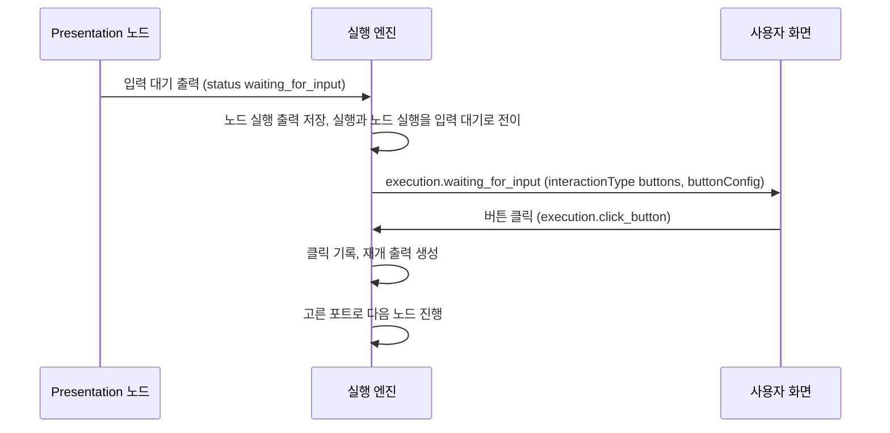
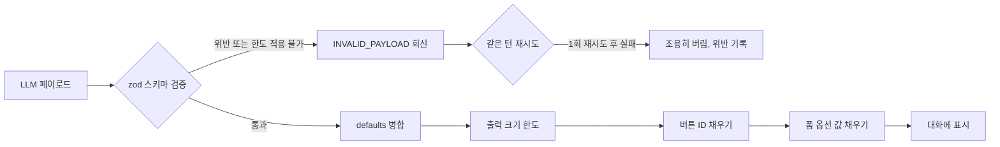

> 구현 상태: 구현됨 (대화 스레드 opt-out 필드의 스키마 선언·설정 UI 노출은 미구현) · 원문: `spec/4-nodes/6-presentation/0-common.md`, `spec/4-nodes/_product-overview.md` (§9 머리글) · 용어: [용어 사전](../CLE-GLOSSARY.md)

## 개요

이 문서는 Presentation 노드(presentation nodes) 다섯 종이 함께 따르는 규약을 정한다. 다섯 종은 [Carousel 노드](CLE-NODE-CAROUSEL.md), [Table 노드](CLE-NODE-TABLE.md), [Chart 노드](CLE-NODE-CHART.md), [Form 노드](CLE-NODE-FORM.md), [Template 노드](CLE-NODE-TEMPLATE.md) 다. 노드별 설정·실행 로직·출력 예시는 각 노드 문서가 정한다.

Presentation 노드는 두 가지 목적으로 쓴다. 하나는 다운스트림 노드에 구조화된 결과를 넘기는 것이다. 다른 하나는 실행 결과 화면에서 사람이 결과를 확인하는 것이다. 버튼이나 폼이 있으면 노드는 실행을 멈추고 사용자 입력을 기다린다.

이 문서가 다루는 것은 다음과 같다.

- 버튼 정의(`ButtonDef`)와 버튼 편집기
- 버튼 유무에 따른 포트 구성과 블로킹 모드(Blocking Mode) 실행 흐름
- 출력 포맷, 출력 크기 한도(output size cap), 입력 대기 출력과 재개 출력
- 대화 스레드(ConversationThread) opt-out
- 실행 결과 드로어(Run Results drawer)의 노드별 표시 규칙
- AI 에이전트 노드가 쓰는 표시 도구(presentation tools, `render_*`) 모드. 이 부분은 이 문서가 단일 기준이고 [AI 에이전트 노드](../CLE-NODE-AI/CLE-NODE-AGENT.md)는 이 문서를 링크한다.

범위 밖은 다음 문서가 정한다.

- 노드 출력(`NodeHandlerOutput`) 다섯 필드의 의미, 사용자 입력 기록(`output.interaction`) 규격, 폐기 필드: [노드 출력 규약](../CLE-NODE/CLE-NODE-OUTPUT.md)
- 입력 대기 진입, park, 재개(resume) 메커니즘: [실행 상태 머신과 대기·재개](../CLE-EXEC/CLE-EXEC-STATE.md)
- 재개 큐와 publisher 사전 검증: [장애 복구와 안전 종료](../CLE-EXEC/CLE-EXEC-RECOVERY.md)
- 동적 포트 ID 의 형식 검증: [노드 시스템 구조와 카탈로그](../CLE-NODE/CLE-NODE-ARCH.md)
- 실행 결과 드로어의 레이아웃·탭 구성: [에디터 실행과 디버깅](../CLE-EXEC/CLE-EXEC-RUN.md)
- 표시 도구를 부르는 AI 쪽 동작(도구 등록, 호출 횟수 회계, 대화 턴 종료 시맨틱): [AI 에이전트 노드](../CLE-NODE-AI/CLE-NODE-AGENT.md). 표시물 페이로드(`PresentationPayload`) 형식: [AI 에이전트 노드 출력과 디버그](../CLE-NODE-AI/CLE-NODE-AGENT-OUTPUT.md)
- 버튼 없는 노드 결과를 웹채팅에 알리는 표시 메시지 이벤트(`execution.message`): [EIA 수신 API와 SSE](../CLE-IX/CLE-EIA-INBOUND.md). 채팅 채널이 노드 결과를 메시지로 바꾸는 규칙: [채팅 채널 어댑터 규약](../CLE-CHAT/CLE-CHAT-ADAPTER.md)

## 규칙

1. 버튼 정의는 Carousel·Table·Chart·Template 이 쓴다. Form 노드는 버튼 대신 폼 필드(`FormField`)를 쓴다.
2. 전역 버튼(global button)은 노드당 5개까지 둔다. Carousel 항목 버튼(item button)도 항목마다 5개까지 둔다.
3. 버튼이 하나라도 있으면 노드는 블로킹 모드로 들어가 입력 대기(`waiting_for_input`)로 멈춘다. 버튼이 없으면 표시 전용(display-only)으로 `out` 포트에 결과를 낸다.
4. 버튼이 있으면 `out` 포트를 없앤다. 포트 버튼마다 동적 포트를 만들고 링크 버튼만 있으면 계속 포트(`continue`)를 만든다.
5. 출력 값(`output`)에는 런타임에 만든 값만 담는다. 리터럴 설정값은 설정 에코(config echo, `config` 필드)에만 둔다. 노드를 가리는 `type` 판별자는 쓰지 않는다.
6. Carousel `output.items` 와 Table `output.rows` 가 직렬화 후 1MB 를 넘으면 뒤에서부터 원소 단위로 잘라 낸다. 잘렸다는 사실은 `*Truncated`·`*TotalCount` 로 알린다.
7. 재개 출력(resumed output)은 입력 대기 시점의 출력 값을 그대로 두고 사용자 입력 기록을 더한다.
8. 사용자 입력은 대화 스레드에 자동으로 쌓는다. `excludeFromConversationThread: true` 인 노드의 입력은 쌓지 않는다.
9. 표시 도구 모드는 다섯 노드의 설정 스키마(zod)를 LLM 도구 파라미터의 단일 기준으로 다시 쓴다. 표시 도구의 버튼은 그래프 포트로 라우팅하지 않고 다음 LLM 대화 턴의 사용자 메시지가 된다.
10. 입력 대기 기한(타임아웃)은 정의가 갈린다. [미결 사항](#미결-사항) 참조.

## 버튼 정의

Carousel·Table·Chart·Template 노드가 함께 쓰는 버튼 정의(`ButtonDef`) 구조다. 포트로 보내는 포트 버튼(`port`)과 URL 을 여는 링크 버튼(`link`)이 있다.

| 필드 | 타입 | 필수 | 설명 |
|------|------|------|------|
| `id` | String | 자동 생성 | 바뀌지 않는 버튼 식별자. 포트 버튼이면 동적 출력 포트 ID 로 쓴다. 에디터는 버튼을 추가할 때 UUID v4 를 발급한다. 포트 ID 는 slug 정규식(`^[a-zA-Z0-9_-]{1,64}$`)을 만족하면 생성 방식을 가리지 않으므로 출력 예시의 `approve` 같은 slug 도 유효하다. 형식 검증은 [노드 시스템 구조와 카탈로그](../CLE-NODE/CLE-NODE-ARCH.md) 가 정한다 |
| `label` | String | ✓ | 버튼 텍스트. 표현식(`{{ }}`)을 쓸 수 있다 |
| `type` | Enum | ✓ | `link`(외부 URL) / `port`(노드 포트 연결) |
| `url` | String | `type=link` 일 때 ✓ | 외부 URL. 표현식을 쓸 수 있다 |
| `style` | Enum | ✗ | `primary` / `secondary` / `outline` / `danger`. 기본값 `secondary` |
| `userMessage` | String | ✗ | 포트 버튼을 눌렀을 때 대화에 보낼 사용자 메시지. 표시 도구 모드에서 LLM 이 직접 적을 수 있다. 없으면 클라이언트가 합성한다. 항목 버튼은 `"{item.title} → {label}"`, 전역 버튼은 `"{label}"` 이다([버튼 클릭 사용자 메시지 합성](#버튼-클릭-사용자-메시지-합성)). 그래프 노드 자체의 포트 분기와 링크 버튼에서는 무시한다. 링크 버튼은 외부 URL 이동이 우선이다 |

### 유효성 검증

| 규칙 | 설명 |
|------|------|
| 버튼 라벨 필수 | 각 버튼의 `label` 은 비어 있을 수 없다 |
| 링크 URL 필수 | `type: "link"` 는 `url` 이 있어야 한다 |
| 포트 버튼 URL 금지 | `type: "port"` 에는 `url` 을 둘 수 없다 |
| 최대 버튼 수 | 노드당 전역 버튼(`buttons`) **5개**. Carousel 항목 버튼(`itemButtons`, `items[].buttons`)도 항목마다 5개. 한 항목 화면에는 전역 5 + 항목 5 = 최대 10개가 보인다([Rationale](#버튼-수-한도)) |
| 버튼 ID 고유 | 노드 안의 모든 버튼 ID 는 서로 달라야 한다 |
| 연결 안 된 포트 버튼 | 포트 버튼의 동적 포트에 연결선이 없으면 경고한다. 에러는 아니다 |
| `userMessage` 는 포트 버튼 전용 | 링크 버튼에 `userMessage` 를 넣으면 클릭 동작은 바뀌지 않고 값은 무시한다. 이때 `validateButtons` 가 저장을 막지 않는 안내 메시지 `"buttons[i].userMessage is ignored for link type buttons …"` 를 함께 낸다. LLM 이 만든 페이로드의 어긋남을 캔버스 사용자에게 알리려는 것이다 |

### 버튼 편집기

Carousel·Table·Chart·Template 의 설정 패널은 같은 버튼 편집기를 쓴다.

| 영역 | 위치 | 들어가는 요소 | 동작 |
|------|------|---------------|------|
| Buttons 섹션 | 설정 패널 아래쪽, 접이식 | 버튼 카드 목록, `[+ Add Button]` | 펼쳐서 버튼을 추가하고 편집한다 |
| 버튼 카드 | Buttons 섹션 안 | Label, Type(`port` / `link`), URL(링크 버튼일 때만), Style, 삭제 `[✕]`, 순서 `[↕]` | 드래그로 순서를 바꾸고 `[✕]` 로 지운다 |

- Type 을 `link` 로 고르면 URL 입력란이 보이고 `port` 로 고르면 숨는다.
- 버튼을 추가하면 UUID v4 ID 를 발급한다. ID 는 이후 바뀌지 않는다.
- 전역 버튼은 5개까지 추가할 수 있다. Carousel 항목 버튼은 정적 모드에서 항목마다 5개, 동적 모드 `itemButtons` 는 5개까지다.

## 포트 구성

버튼 정의를 쓰는 노드는 `buttons` 배열의 유무에 따라 포트 구성이 달라진다. Form 노드의 포트는 [Form 노드](CLE-NODE-FORM.md) 가 정한다.

**버튼이 없을 때(표시 전용, 기본):**

| 포트 | 방향 | 식별자 | 설명 |
|------|------|--------|------|
| Input | 입력 | `in` | 입력 데이터 |
| Output | 출력 | `out` | 노드 결과 출력 |

**버튼이 있을 때(블로킹 모드):**

| 포트 | 방향 | 식별자 | 설명 |
|------|------|--------|------|
| Input | 입력 | `in` | 입력 데이터 |
| 전역 버튼 포트 | 출력 | `{button.id}` | 전역 포트 버튼마다 동적으로 만든다 |
| 항목 버튼 포트(정적 모드) | 출력 | `{button.id}` | Carousel 정적 모드에서 각 항목의 포트 버튼마다 포트를 따로 만든다. 포트 라벨은 `"아이템 제목 › 버튼 라벨"` |
| 항목 버튼 포트(동적 모드) | 출력 | `{itemButton.id}` | Carousel 동적 모드에서 `itemButtons` 의 포트 버튼마다 포트를 만든다. 런타임에는 항목별 ID `{id}__item_{idx}` 가 생기지만 포트 라우팅은 원래 정의 ID 로 한다 |
| 계속 포트 | 출력 | `continue` | 링크 버튼만 있을 때 자동으로 만든다 |

버튼이 있으면 `out` 포트를 없앤다. 포트 버튼의 동적 포트가 `out` 을 대신하고 링크 버튼만 있으면 계속 포트가 `out` 을 대신한다.

## 블로킹 모드 실행 흐름

버튼 정의를 쓰는 노드는 `buttons` 나 Carousel 항목 버튼이 하나라도 있으면 블로킹 모드로 들어간다. 노드가 입력 대기 출력을 돌려주면 엔진이 실행을 멈추고 화면에 버튼을 보낸다. 사용자가 버튼을 누르면 엔진이 재개 출력을 만들고 고른 포트로 다음 노드를 진행한다.



1. 전역 버튼과 모든 항목 버튼을 합쳐 `buttonConfig.buttons` 에 넣는다.
2. Carousel 동적 모드는 항목 버튼 ID 에서 항목 인덱스로 가는 매핑을 `buttonConfig.buttonItemMap` 에 저장한다.
3. 출력을 `NodeExecution.output_data` 에 저장한다.
4. 노드 실행(`NodeExecution`)과 실행(`Execution`)의 상태를 모두 `waiting_for_input` 으로 바꾼다.
5. WebSocket 이벤트 `execution.waiting_for_input` 을 보낸다. 대기 표면은 `interactionType: "buttons"` 이고 `buttonConfig` 를 함께 싣는다.
6. 사용자 입력을 기다린다. 대기 기한은 정의가 갈린다([미결 사항](#미결-사항)).
   - **전역 포트 버튼 클릭**: 그 버튼의 동적 포트(`{button.id}`)로 데이터를 보낸다.
   - **항목 포트 버튼 클릭**: 그 포트로 데이터를 보내고 `selectedItem` 에 항목 데이터를 넣는다. 동적 모드는 런타임 ID(`{id}__item_{idx}`)에서 원래 정의 ID 를 뽑아 포트 라우팅에 쓴다.
   - **Continue 클릭**(링크 버튼만 있을 때): 계속 포트(`continue`)로 출력을 보낸다.
7. 클릭 정보를 `NodeExecution.interaction_data` 에 기록한다.
8. `buttonConfig` 는 실행 결과에 남긴다. 실행 내역 화면이 모든 버튼을 다시 보여 줄 수 있게 하려는 것이다.

**포트 라우팅 메타데이터**: 버튼을 누르면 출력에 `_selectedPort` 가 붙고 엔진은 이 값으로 연결선 기반 라우팅을 한다. 이 값은 다운스트림 노드 입력으로 넘길 때 자동으로 지운다. 그래서 변수 수정 노드 같은 패스스루 노드를 거쳐도 뒤 노드가 잘못 건너뛰어지지 않는다.

**버튼 대기 중에 다른 재개 명령이 오면**: 버튼 대기 표면은 `click_button` 만 받는다. 버튼 대기 중인 실행에 `submit_form`·`submit_message`·`end_conversation` 이 오면 publisher 사전 검증이 publish 전에 상태 불일치 에러(`INVALID_EXECUTION_STATE`, EIA 는 409 `STATE_MISMATCH`)로 거부한다. 폼 대기 중인 실행에 다른 종류의 명령이 와도 똑같이 거부한다. `resolveButtonInteraction` 의 `continue` 대체 분기는 대기 표면을 판정할 수 없는 옛 행에만 남아 있다. 표면 매트릭스는 [장애 복구와 안전 종료](../CLE-EXEC/CLE-EXEC-RECOVERY.md) 가 정한다.

## 출력 포맷

Presentation 노드 출력은 [노드 출력 규약](../CLE-NODE/CLE-NODE-OUTPUT.md) 을 따르고 다음 규칙을 더한다.

- 출력 값에는 런타임에 만든 값(`items`, `rows`, `data`, `rendered` 등)만 담는다. `layout`·`mode`·`titleField`·`pageSize`·`chartType` 같은 리터럴 설정값은 출력 값에 되풀이하지 않는다. 다음 노드와 화면은 `$node["X"].config.*` 에서 읽는다.
- 노드를 가리는 `type: 'carousel' | 'table' | 'chart' | 'form' | 'template'` 판별자는 쓰지 않는다.
- Carousel·Table·Chart 는 백엔드에서 HTML·SVG 스냅샷을 만들지 않는다. 화면은 출력 값과 설정 에코로 직접 그린다. 백엔드가 만든 문자열을 출력 값에 싣는 노드는 Template(`rendered`)뿐이다.
- `output.type`, `output.submittedData`, `output.format`, `output.content` 같은 옛 필드는 쓰지 않는다.

### 출력 크기 한도

- 한도는 `PRESENTATION_MAX_BYTES = 1024 × 1024`(1MB)다.
- Carousel `output.items` 와 Table `output.rows` 는 각각 직렬화해서 1MB 를 넘으면 **뒤에서부터 원소 단위로** 잘라 낸다.
- 잘라 내면 `output.itemsTruncated` 또는 `output.rowsTruncated` 를 `true` 로 싣고 잘리기 전 원소 수를 `output.itemsTotalCount` 또는 `output.rowsTotalCount` 로 함께 싣는다.
- 잘린 결과도 **배열 형태를 유지**한다. 다운스트림의 ForEach·Map·`output.items[i]` 접근은 그대로 동작하고 `length` 만 짧아진다.
- 통합 노드의 256KB 한도(`truncateBodyForOutput`)보다 4배 크다. Presentation 출력은 사용자가 보는 결과라 정상 사용에서도 커질 수 있다. 1MB 를 넘는 것은 폭주 데이터 신호로 본다.
- Table 은 한도 적용 전 크기를 `totalRows` 로도 싣는다. 두 신호의 관계는 [Table 노드](CLE-NODE-TABLE.md) 가 정한다.

### 입력 대기 출력

`status: 'waiting_for_input'` 을 돌려주고 위 출력 값은 그대로 둔다. Form 노드의 출력 값은 빈 객체(`{}`)다.

### 재개 출력

사용자가 버튼을 누르거나 폼을 제출하면 엔진이 재개 출력을 만든다. 입력 대기 시점의 출력 값을 그대로 두고 사용자 입력 기록(`output.interaction`)을 더한다. 규격은 [노드 출력 규약](../CLE-NODE/CLE-NODE-OUTPUT.md) 이 정한다.

```json
{
  "output": {
    "interaction": {
      "type": "button_click",
      "data": { "buttonId": "approve", "buttonLabel": "Approve" },
      "receivedAt": "2026-04-06T10:30:00Z"
    }
  },
  "status": "resumed",
  "port": "approve"
}
```

위 예시는 사용자 입력 기록만 보인다. 실제 재개 출력에는 입력 대기 시점의 런타임 필드가 함께 있다.

| `interaction.type` | 트리거 | `data` 예시 |
|---------------------|--------|-------------|
| `button_click` | 포트 버튼 클릭 | `{ buttonId, buttonLabel, selectedItem? }` |
| `button_continue` | 링크 버튼만 있을 때 Continue 클릭 | `{ buttonId, buttonLabel, url?, selectedItem? }`. `url` 은 링크 버튼 URL 이 있을 때, `selectedItem` 은 Carousel 항목 버튼이 있을 때 싣는다 |
| `form_submitted` | Form 제출 | `{ <field>: <value>, ... }` |

`interaction.type` 과 `data` 형태의 기준은 [노드 출력 규약 §4.5](../CLE-NODE/CLE-NODE-OUTPUT.md#45-interactiondata-형태) 다. 그 표는 `message_received` 를 더해 네 값을 정의한다. Presentation 노드가 쓰는 값은 위 세 가지(`form_submitted`·`button_click`·`button_continue`)이고 `message_received` 는 멀티턴 AI 노드가 쓴다.

`selectedItem` 은 항목 버튼을 눌렀을 때만 `data` 에 들어간다. 엔진은 항목 버튼 ID 를 `${buttonId}__item_${index}` 형태로 만들고 라우팅할 때 접미사를 떼어 원래 포트(`buttonId`)로 잇는다.

### previousOutput 과도기 예외

`previousOutput` 은 폐기 예정이지만 아직 지우지 않았다. 버튼 재개 경로(`ButtonInteractionService`)가 재개 출력에 지금도 넣는다. 이 예외의 정의는 [노드 출력 규약](../CLE-NODE/CLE-NODE-OUTPUT.md) 이 소유한다.

- **새로 읽지 않는다.** 이전 값이 필요하면 출력 값의 최상위 런타임 필드를 직접 읽는다. 입력 대기 시점의 출력 값은 재개 출력에서도 그대로 남으므로 `previousOutput` 없이 충분하다.
- **적용 범위는 `config.buttons` 가 있는 네 노드(Carousel·Chart·Table·Template)다.** Form 노드는 해당하지 않는다. Form 은 버튼이 없어 `ButtonInteractionService` 를 거치지 않는다. 재개 출력은 `FormInteractionService` 가 만들고 `previousOutput` 을 넣지 않는다. Form 에서는 완전히 금지된 필드다.
- 과도기 정리 단계에서 코드와 스펙에서 함께 지운다.

## 노드 출력 필드 사용 패턴

Presentation 노드는 모두 [노드 출력 규약](../CLE-NODE/CLE-NODE-OUTPUT.md) 의 다섯 필드 `{ config, output, meta?, port?, status? }` 를 따른다. 카테고리 특유의 사용 방식은 다음과 같다.

| 필드 | Presentation 노드에서의 사용 |
|------|------------------------------|
| `config` | 사용자 입력을 그대로 되돌리는 설정 에코. `title`·`layout`·`chartType`·`columns[*].field`·`format` 같은 리터럴 설정값은 모두 `config` 에만 둔다 |
| `output` | 런타임에 만든 값만 담는다. Carousel `items`(동적 모드), Table `rows`, Chart `data`, Template `rendered`, Form `{}`. 출력 크기 한도를 적용한다 |
| `meta` | 실행 메트릭만 담는다. `meta.durationMs` 는 공통이다. Carousel·Table 의 잘림 정보(`itemsTruncated`·`rowsTruncated`)는 다운스트림이 볼 수 있게 `output` 에 둔다 |
| `port` | 표시 전용이면 `undefined` 또는 `'out'`. 블로킹 모드면 `<button.id>`(전역 버튼), `<button.id>__item_<idx>`(Carousel 항목 버튼), `'continue'`(링크 버튼만 있을 때) |
| `status` | 표시 전용이면 `undefined`. 블로킹 모드면 `'waiting_for_input'`(입력 대기), `'resumed'`(재개) |

### 동적 포트 ID 규칙

| 노드 | 포트 ID 형태 | 매핑 |
|------|--------------|------|
| Carousel·Table·Chart·Template(전역 버튼) | `<button.id>`(에디터가 발급한 UUID v4 또는 slug) | `config.buttons[i].id` 그대로 |
| Carousel(항목 버튼) | `<itemButton.id>__item_<idx>`(런타임) | 라우팅할 때 접미사를 떼어 원래 `itemButton.id` 포트로 잇는다 |
| 링크 버튼만 있을 때 | `'continue'` | 자동 생성 |

## 출력 구조 색인

| 노드 | 입력 대기 출력 값 | 재개 출력 값 | 표시 전용 |
|------|-------------------|--------------|-----------|
| [Carousel](CLE-NODE-CAROUSEL.md) | 정적 모드 `{}`, 동적 모드 `{ items }` | 입력 대기 값 + `interaction` | 있음 |
| [Table](CLE-NODE-TABLE.md) | `{ rows, totalRows, columns }` | 입력 대기 값 + `interaction` | 있음 |
| [Chart](CLE-NODE-CHART.md) | `{ data }` | 입력 대기 값 + `interaction` | 있음 |
| [Form](CLE-NODE-FORM.md) | `{}` | `{ interaction }` | 없음. 항상 입력 대기 |
| [Template](CLE-NODE-TEMPLATE.md) | `{ rendered }` | 입력 대기 값 + `interaction` | 있음 |

Carousel·Table 은 출력 크기 한도가 걸리면 `*Truncated`·`*TotalCount` 를 더 싣는다. 버튼이 없는 표시 전용 출력은 `out` 포트 하나로 나간다. 각 노드 문서에 표시 전용 경우가 있는지 적는다.

## 대화 스레드 opt-out

Presentation 노드 다섯 종의 사용자 입력은 `output.interaction` 이 생길 때 [대화 스레드](../CLE-IX/CLE-IX-THREAD.md) 에 **자동으로 쌓인다**. `excludeFromConversationThread` 는 노드 단위로 이 적재를 끄는 opt-out 이다.

| 필드 | 타입 | 기본값 | 설명 |
|------|------|--------|------|
| `excludeFromConversationThread` | Boolean | `false` | `true` 면 이 노드의 사용자 입력(폼 제출, 버튼 클릭, Continue)을 대화 스레드에 쌓지 않는다. 디버그용 폼이나 수집 전용 버튼처럼 대화 기록을 어지럽히는 입력을 뺄 때 쓴다 |

두 층의 상태가 다르므로 구분해서 읽는다.

| 층 | 상태 | 근거 |
|---|---|---|
| 런타임 opt-out 동작 | **구현됨(모든 노드 공통)** | `ConversationThreadService.appendInternal` 이 모든 `append*` 의 단일 진입점이고 첫 줄이 `node.config.excludeFromConversationThread === true` 검사다([대화 스레드](../CLE-IX/CLE-IX-THREAD.md)). 노드 종류를 가리지 않으므로 Presentation 입력 적재에도 똑같이 적용된다 |
| 스키마 선언·설정 UI 노출 | **미구현** | Presentation 다섯 노드의 스키마는 이 필드를 선언하지 않는다. 그래서 설정 UI 에 나타나지 않는다. 스키마가 `passthrough` 라 수동이나 API 로 설정에 넣으면 위 검사가 그대로 존중한다. UI 노출이 필요해지면 AI 카테고리처럼 공유 fragment 로 선언을 더한다. 그때 그룹 이름을 AI 쪽 상수와 공유할지 정한다 |

AI 카테고리 노드는 이 필드를 설정 항목으로 선언한다. 그 선언의 단일 기준은 세 노드가 공유하는 `shared/conversation-context-schema.ts` 다([AI 노드 공통](../CLE-NODE-AI/CLE-NODE-AI-COMMON.md)). 선언이 AI 세 노드에 한정된 것과 런타임 검사가 모든 노드에 공통인 것은 별개다. 스키마에 없으면 값이 없으므로 기본값 `false` 로 동작하고 기존 워크플로우에는 영향이 없다.

## 설정 요약

각 노드가 캔버스에 보여 주는 설정 요약(configuration summary, `summaryTemplate`) 포맷은 노드 문서가 정한다. [Carousel](CLE-NODE-CAROUSEL.md), [Table](CLE-NODE-TABLE.md), [Chart](CLE-NODE-CHART.md), [Form](CLE-NODE-FORM.md), [Template](CLE-NODE-TEMPLATE.md) 문서의 "설정 요약" 절을 본다. 표시 위치와 길이 규칙은 [워크플로우 에디터와 캔버스](../CLE-WF/CLE-WF-EDITOR.md#설정-요약) 가 정한다.

현재 구현은 다섯 노드 가운데 Template 스키마에만 `summaryTemplate` 이 있다(`template.schema.ts`). Carousel·Table·Chart·Form 스키마에는 `summaryTemplate` 이 없어 캔버스에 요약 줄이 보이지 않는다(미구현). 이 네 노드 문서의 포맷은 목표 포맷이다.

## 실행 결과 드로어 표시

실행이 끝난 Presentation 노드는 실행 결과 드로어에 **채팅형 기록 항목**으로 쌓인다. 항목은 실행 순서대로 쌓이고 하나씩 접고 펼 수 있다. 드로어 자체의 레이아웃과 탭은 [에디터 실행과 디버깅](../CLE-EXEC/CLE-EXEC-RUN.md) 이 정한다. 이 절은 노드별로 무엇을 어떻게 보여 주는지 정한다.

### Carousel

| 항목 | 설명 |
|------|------|
| 렌더링 | **텍스트 위주 데이터 뷰**. `output.items`(동적 모드) 또는 `config.items`(정적 모드)를 가로 스크롤 목록으로 늘어놓고 슬라이드마다 제목·설명·버튼 라벨을 보여 준다. `config.layout`(card / image / minimal)은 **배지**로 보여 준다. 시각 레이아웃 재구성은 인터랙티브 채널이 맡는다([Carousel 노드](CLE-NODE-CAROUSEL.md)). 드로어는 이미 끝난 실행의 스냅샷이라 조작할 수 없으므로 시각 재현보다 데이터·이미지 매핑 확인에 맞춘다 |
| 이미지 | `imageField` 나 `image` 가 있으면 **lazy 로딩 썸네일**로 보여 주고 URL 도 확인할 수 있게 한다. 불러오지 못하면 placeholder 를 보여 준다. 여러 이미지를 한꺼번에 불러오지 않는다 |
| 빈 데이터 | "No items" 메시지와 `mode` 힌트 |
| 버튼 대기 중(`waiting_for_input`) | 카드 목록 아래에 **버튼 바**를 보여 준다. 포트 버튼을 누르면 `execution.click_button` WebSocket 명령을 보내고 그 포트로 실행이 재개된다. 링크 버튼을 누르면 새 탭에서 URL 을 열고 실행 상태는 바뀌지 않는다. 링크 버튼만 있으면 `[Continue →]` 버튼을 함께 보여 주고 누르면 `__continue__` ID 로 명령을 보낸다. 대기 기한은 [미결 사항](#미결-사항) 참조 |
| 버튼 클릭 후 | "Button clicked: {label}" 과 클릭 시각, 클릭한 사람 정보 |

### Table

| 항목 | 설명 |
|------|------|
| 렌더링 | `output.columns` 와 `output.rows` 를 표로 보여 준다 |
| 인터랙션 | `sortable` 컬럼 헤더를 누르면 오름차순·내림차순을 바꾼다. 페이지네이션 컨트롤 |
| 포맷 | `format` 이 있는 컬럼은 날짜·숫자 포맷을 적용한다 |
| 빈 데이터 | 컬럼 헤더와 "No data" 행 |
| 대량 데이터 | 한 번에 보여 줄 행 수는 정의가 갈린다. [미결 사항](#미결-사항) 참조 |
| 버튼 대기 중(`waiting_for_input`) | 표 아래에 버튼 바를 보여 준다. 동작은 Carousel 과 같다 |
| 버튼 클릭 후 | Carousel 과 같다 |

### Chart

| 항목 | 설명 |
|------|------|
| 렌더링 | 프런트엔드가 recharts 로 `output.data` 와 `config.{chartType, title, xAxis, yAxis, colors}` 를 받아 차트를 직접 그린다. 백엔드는 SVG 를 만들지 않는다([Chart 노드](CLE-NODE-CHART.md)) |
| 인터랙션 | 데이터 포인트에 마우스를 올리면 값 툴팁. 범례와 축 라벨 |
| 차트 유형 | bar·line·area 는 X-Y 축 차트, pie·donut 은 라벨-값 차트 |
| 빈 데이터 | 축만 있는 빈 차트와 "No data" 메시지 |
| 크기 변경 | 드로어 크기가 바뀌면 차트도 따라 바뀐다 |
| 버튼 대기 중(`waiting_for_input`) | 차트 아래에 버튼 바를 보여 준다. 동작은 Carousel 과 같다 |
| 버튼 클릭 후 | Carousel 과 같다 |

### Form

| 항목 | 설명 |
|------|------|
| 대기 중(`waiting_for_input`) | 실제 폼 UI 를 그린다. 제목, 설명(Markdown), 필드 목록, 제출 버튼. 필드 유효성 검증을 입력하는 동안 적용한다 |
| 파일 업로드 | `type: file` 필드는 드래그앤드롭과 파일 선택 UI 를 쓴다. MIME·크기 제한을 바로 검증한다 |
| 제출 | 제출 버튼을 누르면 `execution.submit_form` WebSocket 명령을 보낸다. 검증에 실패하면 에러를 보여 주고 성공하면 실행이 재개된다 |
| 제출 후 | 제출한 데이터를 키-값 표로 보여 준다. 제출 시각과 제출한 사람 정보를 함께 보여 준다 |
| 대기 기한 | [미결 사항](#미결-사항) 참조 |

### Template

| 항목 | 설명 |
|------|------|
| HTML 출력 | 샌드박스 iframe 안에서 그린다. 외부 스크립트 실행을 막는다 |
| Markdown 출력 | Markdown 을 HTML 로 바꿔 그린다 |
| Text 출력 | 코드 블록(`<pre>`)으로 보여 준다 |
| 빈 결과 | "Empty output" 메시지 |
| 버튼 대기 중(`waiting_for_input`) | 렌더링한 내용 아래에 버튼 바를 보여 준다. 동작은 Carousel 과 같다 |
| 버튼 클릭 후 | Carousel 과 같다 |

## 웹채팅·채팅 채널 전달

버튼 없는 표시 전용 노드(Carousel·Table·Chart·Template)의 결과를 외부로 보내는 경로는 두 가지다. 같은 결과를 두 경로로 중복해서 보내지 않는다.

- 웹채팅: SSE 표시 메시지 이벤트 `execution.message` 로 받는다([EIA 수신 API와 SSE](../CLE-IX/CLE-EIA-INBOUND.md#표시-메시지-이벤트), [웹채팅 위젯](../CLE-WEBCHAT/CLE-WEBCHAT-WIDGET.md#표시물-렌더)).
- 채팅 채널: 서버 안 listener 가 `execution.node.completed` 를 받아 채널 메시지로 바꾼다([채팅 채널](../CLE-CHAT/CLE-CHAT-CORE.md#노드와-채널-ui-매핑)). 렌더러 입력 모양은 [미결 사항](#미결-사항) 참조.

버튼이 있는 노드와 Form 은 `execution.waiting_for_input` 입력 대기 흐름으로 전달한다. 웹채팅 위젯은 v1 에서 첨부를 꺼 두므로 Form 파일 필드로 파일을 받지 못한다([웹채팅 위젯](../CLE-WEBCHAT/CLE-WEBCHAT-WIDGET.md#패널)).

## 표시 도구 모드

AI 에이전트 노드의 `presentationTools[]` 설정을 켜면 LLM 이 이 카테고리 다섯 노드의 렌더링 페이로드를 **도구 호출로 직접 만든다**. 워크플로우 그래프의 다른 노드로 잇는 방식이 아니다. AI 세션 안의 도구로 동작하고 다섯 노드의 입력 스키마(zod)를 LLM 도구 파라미터 JSON Schema 의 단일 기준으로 다시 쓴다.

이 절은 다섯 노드의 스키마, 렌더 정책, 출력 크기 한도를 표시 도구 모드에 그대로 적용하는 규약이다. 도구 등록, 호출 횟수 회계, 대화 턴 종료 시맨틱, 멀티턴 대기 흐름은 [AI 에이전트 노드](../CLE-NODE-AI/CLE-NODE-AGENT.md) 가 정한다.

### 스키마 단일 기준

| 도구 이름 | 대상 노드 | 파라미터 JSON Schema 출처 |
|---|---|---|
| `render_table` | [Table](CLE-NODE-TABLE.md) | `tableNodeConfigSchema`(zod) → JSON Schema |
| `render_chart` | [Chart](CLE-NODE-CHART.md) | `chartConfigSchema`(zod) → JSON Schema |
| `render_carousel` | [Carousel](CLE-NODE-CAROUSEL.md) | `carouselNodeConfigSchema`(zod) → JSON Schema. 동적 모드 스키마 우선 |
| `render_template` | [Template](CLE-NODE-TEMPLATE.md) | `templateNodeConfigSchema`(zod) → JSON Schema |
| `render_form` | [Form](CLE-NODE-FORM.md) | `formNodeConfigSchema`(zod) → JSON Schema |

zod 를 JSON Schema 로 바꾸는 일은 단일 유틸(`zodToToolParams`)이 맡는다. 다섯 노드 스키마를 고치면 LLM 도구 정의에 자동으로 반영되므로 구조적으로 어긋날 수 없다. 백엔드 `_shared/button.types.ts` 의 `MAX_BUTTONS_PER_NODE` 같은 이 문서의 상수도 같은 변환에 자동으로 반영된다.

### 도구 카탈로그

| 도구 이름 | 모드 | 기본 description(바꿀 수 있음) |
|---|---|---|
| `render_table` | 표시 전용 | "표 형태로 정형 데이터를 표시. rows/columns 정의 필요. 비교·집계 결과 공유에 적합." |
| `render_chart` | 표시 전용 | "차트 (bar/line/area/pie/donut) 로 데이터를 시각화. 시계열·분포·비율 표현에 적합." |
| `render_carousel` | 표시 전용 | "카드·이미지·미니멀 레이아웃의 슬라이드 모음. 추천 항목 목록·상품 카드 등 시각 카탈로그에 적합." |
| `render_template` | 표시 전용 | "사용자 정의 HTML/Markdown/Text 템플릿 렌더링. 정형화된 안내문·요약 카드 작성에 적합." |
| `render_form` | **입력 대기(interactive)** | "사용자에게 입력 폼을 표시하고 제출을 대기. 추가 정보 수집·승인 요청 등 사용자 응답이 필요한 경우." |

사용자가 `PresentationToolDef.description` 에 값을 넣으면 위 기본 문구 대신 그 값을 LLM 에 보여 준다. 워크플로우 도메인(예: "전자상거래 상품 카드 표시")에 맞춘 안내를 줄 수 있다.

`render_chart` 기본 문구는 차트 유형 다섯 가지를 적는다. Chart 노드 실행도 같은 다섯 유형(`bar`·`line`·`area`·`pie`·`donut`)을 받는다([Chart 노드](CLE-NODE-CHART.md#차트-유형은-다섯-가지가-정본이고-실행-검증이-스키마-목록을-그대로-쓴다)).

### defaults 덮어쓰기 규칙

`PresentationToolDef.defaults?: Partial<Config>` 는 해당 노드 설정 일부를 미리 고정하는 브랜드·스타일 값이다. LLM 페이로드와 깊은 병합(deep merge)할 때 **defaults 가 LLM 입력을 덮어쓴다**(defaults 를 나중에 병합). 사용자가 정한 브랜드 톤·버튼 라벨·레이아웃이 LLM 의 임의 변경에 흔들리지 않게 하려는 것이다.

| 병합 대상 | 동작 |
|---|---|
| Object | 깊은 병합. 같은 키면 defaults 가 이긴다 |
| Array | defaults 가 비어 있지 않으면 defaults 로 **통째로 바꾼다**. 이어 붙이지 않는다. LLM 이 브랜드 밖 버튼을 임의로 더하지 못하게 하려는 것이다 |
| Primitive | defaults 에 값이 있으면 defaults 가 이긴다 |

예를 들어 `presentationTools: [{ type: 'table', defaults: { columns: [...brand columns], pagination: { enabled: true, pageSize: 20 } } }]` 로 두면 LLM 은 `rows` 만 채우면 되고 columns 와 pagination 은 늘 사용자 정의가 적용된다.

### 도구 모드의 출력 크기 한도

[출력 크기 한도](#출력-크기-한도)의 `PRESENTATION_MAX_BYTES = 1024 × 1024` 를 똑같이 적용한다. LLM 이 한도를 넘는 페이로드를 내면 [스키마 위반 처리와 정규화](#스키마-위반-처리와-정규화) 흐름을 따른다. Carousel·Table 의 뒤에서부터 잘라 내는 정책도 **그대로 적용**한다. 잘린 결과는 `output.{itemsTruncated|rowsTruncated}: true`, `output.{itemsTotalCount|rowsTotalCount}` 와 같은 메타를 대화 기록 항목(`ConversationTurn`)의 최상위 `presentations[i].truncation` 에 싣는다. `data?` 와는 별개 필드다.

### 스키마 위반 처리와 정규화

LLM 페이로드는 검증, defaults 병합, 출력 크기 한도, 값 채우기 순서로 처리한다.



1. LLM 페이로드를 해당 노드의 zod 스키마로 검증한다.
2. 필수 필드 누락, 타입 불일치, 정합성 위배처럼 스키마를 어기거나 1MB 한도를 넘으면 도구 결과로 `{error: 'INVALID_PAYLOAD', issues: [...]}` 를 돌려준다. 한도 초과는 Carousel·Table 을 뒤에서 잘라도 원소가 하나도 들어가지 않는 경우처럼 한도를 적용할 수 없는 때를 말한다.
3. **`button.id` UUID v4 채우기**: defaults 병합과 출력 크기 한도를 적용한 뒤 남은 버튼 가운데 `id` 가 없는 것에만 UUID v4 를 채운다. 대상은 carousel `buttons`·`itemButtons`·`items[].buttons` 와 table·chart·template `buttons` 다. `id` 가 있는 버튼은 그대로 둔다. [버튼 정의](#버튼-정의)의 "id 는 자동 생성하고 바꾸지 않는다" 원칙을 표시 도구 모드에도 적용한다. 워크플로우 에디터가 `crypto.randomUUID()` 로 id 를 넣는 것과 같은 의미를 백엔드 `render-tool-provider` 가 보장한다. 한도 적용 뒤에 하므로 잘려 나간 원소 안의 버튼은 처리하지 않는다. 프런트엔드에 닿지 않는 버튼이라 의도한 최적화다. 이 단계의 함수는 `backfillButtonUuids` 처럼 알아볼 수 있는 이름을 쓴다. 그래프 노드용 `normalizeNodeButtonIds`(label 을 slug 로 바꿈)와 섞이지 않게 하려는 것이다.
4. **폼 `option.value` 결정적 채우기**: `render_form` 에만 적용한다. defaults 병합과 출력 크기 한도를 적용한 뒤 `fields[].options[]` 가운데 `value` 가 빈 문자열 `""`·`null`·`undefined` 인 항목에 결정적 값 `opt-{fieldIdx}-{optIdx}` 를 채운다. 형식은 인덱스 하나뿐이다. label 로 slug 를 만드는 방식은 한글 같은 다국어 label 에서 빈 slug 가 나와 다시 충돌하므로 쓰지 않는다. LLM 이 옵션의 `value` 를 빠뜨리면 zod 기본값이 모든 옵션 value 를 똑같이 `""` 로 만든다. 그러면 프런트엔드 `<select>` 의 placeholder(`value=""`)와 모든 옵션이 DOM 에서 같아져 골라도 placeholder 가 남는다. 3단계 버튼 ID 채우기와 같은 문제이므로 같은 층에서 푼다. UUID 대신 결정적 값을 쓰는 이유는 [Rationale](#폼-옵션-값-채우기) 에 적는다. 한도 적용 뒤에 하므로 잘려 나간 옵션은 처리하지 않는다. 이 단계의 함수는 3단계와 나란히 `backfillFormOptionValues` 처럼 이름 붙인다.
5. LLM 은 같은 턴 안에서 다시 시도할 수 있다. 한 번 다시 시도해도 실패하면 조용히 버리고 `meta.presentationSchemaViolations[]` 에 쌓는다([AI 에이전트 노드](../CLE-NODE-AI/CLE-NODE-AGENT.md)).
6. AI 에이전트 노드의 `error` 포트는 내보내지 않는다. 표시 방법을 넓히는 기능이므로 텍스트 응답으로 대신한다.

### 입력 대기 여부

| 도구 | 입력 대기 | 흐름 |
|---|---|---|
| `render_table` / `render_chart` / `render_carousel` / `render_template` | 표시 전용 | 도구 결과 스텁 `{ok:true}` 를 바로 돌려준다. LLM 은 같은 턴 안에서 텍스트, 다른 도구 호출, 종료 가운데 하나를 고른다. 페이로드는 대화 기록 항목의 **최상위 `presentations[]`** 에 넣는다 |
| `render_form` | **입력 대기** | AI 에이전트 멀티턴의 `waiting_for_input` 흐름으로 들어가고 대기 표면은 `meta.interactionType: 'ai_form_render'` 다. `'ai_conversation'` 과 다른 값이고 클라이언트는 이 값으로 `execution.submit_form` 명령을 고른다([WebSocket 이벤트와 명령](../CLE-API/CLE-API-WS-EVENTS.md)). `_resumeState.pendingFormToolCall: { toolCallId, formConfig }` 를 기록한다. 사용자가 폼을 제출(`execution.submit_form`)하면 대화 스레드에 `presentation_user` 출처 항목을 쌓는다. 이 항목에는 `data.via: 'ai_render'` 표시가 붙는다([노드 출력 규약](../CLE-NODE/CLE-NODE-OUTPUT.md)). 제출 데이터는 도구 결과 content 에 직렬화한 뒤 LLM 을 다시 부른다 |

**입력 중인 폼은 어시스턴트 턴 타임라인 안에 그린다.** `render_form` 이 입력을 기다리는 동안 폼 입력 UI 는 MessageInput 아래 같은 별도 영역에 두지 않는다. 어시스턴트 턴의 `presentations[*]` 가운데 `type: 'form'` 페이로드 자리에 **인라인으로** 그린다. 프런트엔드 `AssistantPresentationsBlock` 의 `"form"` 분기는 다음 조건으로 나뉜다.

- `waitingConversationConfig.pendingFormToolCall.toolCallId === payload.toolCallId` 이면 입력 가능한 `DynamicFormUI` 를 그린다.
- 그 밖(이미 제출됐거나 다른 도구 호출)이면 표시 전용 `FormSubmittedContent` 를 그린다.

캐러셀·차트·표가 타임라인 안에 인라인으로 들어가는 방식과 같다([Rationale](#입력-중인-폼의-타임라인-인라인-표시)).

**폼 입력 중 사용자가 일반 텍스트를 보내면**: 백엔드 처리는 [AI 에이전트 노드](../CLE-NODE-AI/CLE-NODE-AGENT.md) 가 정한다. 프런트엔드 MessageInput 은 `ai_form_render` 대기 중에도 늘 켜 둔다. 사용자는 폼 대신 텍스트로 답할 수 있다.

`render_form` 은 AI 에이전트가 단일 턴(`single_turn`)이면 의미가 없다. 단일 턴은 사용자 입력을 기다리지 않으므로 스키마 위반과 똑같이 조용히 버린다([AI 에이전트 노드](../CLE-NODE-AI/CLE-NODE-AGENT.md)).

[블로킹 모드 실행 흐름](#블로킹-모드-실행-흐름)의 버튼 기반 대기와 이 절의 도구 모드 대기는 다른 층이다. 앞의 것은 그래프의 노드로 실행될 때다. 뒤의 것은 AI 에이전트의 도구로 불릴 때다. 사용자가 연결한 Form 노드와 AI 에이전트의 `render_form` 이 함께 있어도 그래프 실행 순서대로 처리되므로 충돌하지 않는다.

### 대화 스레드 운반

`render_*` 호출이 성공한 턴의 페이로드는 `source: 'ai_assistant'` 대화 기록 항목의 **최상위 `presentations[]`** 한 곳에 저장한다([대화 스레드](../CLE-IX/CLE-IX-THREAD.md)). `data?` 안에 넣지 않는다. `data?` 는 `output.interaction.data` 스냅샷의 단일 기준이라 다른 의미의 데이터를 넣지 않는다. 그래프의 Presentation 노드가 내는 `output.interaction`([재개 출력](#재개-출력))과도 구분한다. `output.interaction` 은 그래프 노드가 사용자 클릭이나 제출을 받았을 때 생기고 `turn.presentations[]` 는 AI 에이전트가 LLM 도구 호출 결과로 채운다.

`render_form` 을 사용자가 제출하면 `source: 'presentation_user'` 항목을 쌓는다. 모양은 [재개 출력](#재개-출력)의 `interaction.type='form_submitted'` 와 같고 **`data.via: 'ai_render'` 표시**가 더 붙는다. 그래프 Form 노드에서 온 항목은 `data.via` 가 없으므로 UI 와 LLM 페이로드 빌더가 두 출처를 가를 수 있다. UI 는 두 경우를 다른 카드 제목으로 그린다.

- 그래프 Form 노드 출처: `<form 노드 레이블> · form submitted`
- AI `render_form` 출처: `<AI Agent 레이블> · form via AI render`

이 표시의 단일 정의는 [AI 에이전트 노드](../CLE-NODE-AI/CLE-NODE-AGENT.md) 와 [노드 출력 규약](../CLE-NODE/CLE-NODE-OUTPUT.md) 에 있다.

### 버튼 클릭 사용자 메시지 합성

표시 도구가 만든 표·차트·캐러셀·템플릿 안의 버튼에는 그래프 포트 라우팅이 없다. 버튼 클릭은 다음 LLM 턴의 사용자 메시지로 들어간다([AI 에이전트 노드](../CLE-NODE-AI/CLE-NODE-AGENT.md)). 이 절은 그 사용자 메시지를 어떻게 만드는지의 단일 기준이다. 그래프 노드 자체의 포트 분기와는 완전히 다른 층이다. 그래프 노드는 [블로킹 모드 실행 흐름](#블로킹-모드-실행-흐름)의 `buttonConfig` 와 WebSocket 재개 흐름을 따른다.

**합성 우선순위**(포트 버튼만 해당한다. 링크 버튼은 외부 URL 로 이동하고 사용자 메시지를 보내지 않는다):

| 순위 | 출처 | 합성 결과 |
|---|---|---|
| 1 | `button.userMessage`(LLM 이 [버튼 정의](#버튼-정의)의 선택 필드로 적은 값) | 그 문자열 그대로 |
| 2 | 항목 버튼(carousel `items[].buttons` 또는 동적 `itemButtons` 의 런타임 ID `{btn.id}__item_{idx}`) + `userMessage` 없음 | `"{item.title} → {button.label}"`. 구분자 ` → ` 는 U+2192 화살표 그대로이고 로캘과 무관하다 |
| 3 | 전역 버튼(carousel `buttons`, table·chart·template `buttons`) + `userMessage` 없음 | `"{button.label}"` |
| 4 | 매칭 실패(id 를 못 찾음, 회귀 방어용) | `buttonId` 그대로 |

**경로**: 프런트엔드 `AssistantPresentationsBlock.handlePortButtonClick` 이 위 우선순위로 사용자 메시지를 만들어 채팅 입력의 `onSendMessage` 로 넘긴다. 이 값은 백엔드 `ai-agent.handler.processMultiTurnMessage(userMessage)` 의 `userMessage` 인자로 들어가 `ai_user` 메시지로 다음 LLM 턴에 쓰인다. 이 경로는 [대화 스레드](../CLE-IX/CLE-IX-THREAD.md) 의 `[user-input]…[/user-input]` 보안 마커로 **감싸지 않는다**. 마커는 그래프 노드에서 온 `presentation_user` 출처에만 쓴다. 표시 도구 클릭은 채팅 입력과 같은 `ai_user` 출처이고 `ai_user` 에는 마커를 쓰지 않는다.

**라우팅하지 않는다**: 표시 도구의 버튼 클릭은 AI 에이전트의 출력 포트 분기에 영향을 주지 않는다. 그래프 분기는 조건 도구(`cond_*`)가 맡는다. 이 합성 규칙은 그래프 노드 자체에는 적용하지 않는다.

### 폼 제출 wire format

`render_form` 과 그래프 Form 노드의 사용자 제출은 다음 네 층을 지난다. 이 절은 **엔진 내부 재개 큐 payload 층**의 wire format 단일 기준이다. 바깥 표면(WebSocket wire, 사용자 입력 기록, LLM 도구 결과 content, DB enum)은 이 층과 독립이고 각자의 기준을 유지한다.

네 층 모두에 문자열 `'form_submitted'` 가 나오지만 뜻은 서로 독립이다.

| 층 | 위치 | 모양 | 기준 |
|---|---|---|---|
| (1) 외부 WebSocket wire | 클라이언트 → 서버 | `execution.submit_form` payload `{ executionId, formData }`. `nodeId`·`toolCallId` 는 클라이언트가 보내는 필드가 아니다. 대기 노드는 서버가 찾고 `toolCallId` 는 서버가 보관한 `pendingFormToolCall` 로 맞춘다 | [WebSocket 이벤트와 명령](../CLE-API/CLE-API-WS-EVENTS.md) |
| (2) **내부 재개 큐 payload(이 절이 기준)** | 서버 내부 재개 큐(`execution-continuation`, BullMQ)의 `'continue'` 메시지 안 payload. 옛 Redis pub/sub `execution:continuation` 채널은 폐기했다([장애 복구와 안전 종료](../CLE-EXEC/CLE-EXEC-RECOVERY.md)) | `{ type: 'form_submitted', formData }` 로 감싼 표시 값(sentinel) | 이 절 |
| (3) 사용자 입력 기록 | 노드 출력의 `output.interaction.type` | enum 값 `'form_submitted'`. Presentation 노드는 `button_click`·`button_continue`·`form_submitted` 세 값을 쓴다 | [노드 출력 규약 §4.5](../CLE-NODE/CLE-NODE-OUTPUT.md#45-interactiondata-형태) |
| (4) LLM 도구 결과 content | AI 에이전트 `render_form` 의 도구 결과 content(`render_form` 만 해당) | `{ ok: true, type: 'form_submitted', data: { …formData }, message: '<재호출 금지 안내문>' }` JSON. `ok`·`message` 는 LLM 이 같은 폼을 다시 부르지 않게 막는 가드 필드다. `data` 가 10KB 한도(`FORM_SUBMITTED_MAX_BYTES`)를 넘으면 선택 메타 `formDataTruncation: {originalBytes, bytesAfterCap, truncatedFields[]}` 를 함께 붙여 LLM 이 잘림을 추론에 반영하게 한다 | [AI 에이전트 노드](../CLE-NODE-AI/CLE-NODE-AGENT.md) |

**(2) 내부 payload 를 표시 값으로 감싼다**: `continueExecution(executionId, formData)` 는 `formData` 를 그대로 넣지 않는다. `{ type: 'form_submitted', formData }` 로 감싼 뒤 재개 큐에 넣는다. 호출 모양은 `bus.add({ type: 'continue', executionId, nodeExecutionId, payload: { type: 'form_submitted', formData } }, { jobId, attempts })` 다. consumer 는 감싼 payload 를 풀지 않고 그대로 `applyContinuation → rehydrateAndResume` 로 넘긴다. 처리기 dispatcher 가 표시 값으로 분기한다.

재개 큐 메시지 종류 여섯 가지(`continue` / `cancel` / `button_click` / `ai_message` / `ai_end_conversation` / `retry_last_turn`)는 **바뀌지 않는다**. 이 규약이 더하는 것은 `'continue'` 메시지 **payload 안의 `action.type` 표시 값** 한 가지다. 메시지 종류에 `'form_submitted'` 가 추가되지 않는다. 메시지 종류와 payload `action.type` 은 다른 층이다.

`retry_last_turn` 은 이 절의 Presentation 재개 분기 **범위 밖**이다. AI 에이전트 멀티턴 재진입(WebSocket `execution.retry_last_turn`) 전용이고 대상 행이 입력 대기가 아니라 새로 만든 실행 중 행이다([비동기 큐와 Redis 키 목록](../CLE-PLAT/CLE-PLAT-QUEUE.md)). 여섯 종은 재개 큐 전체 목록이고 Presentation 이 쓰는 것은 `continue` 와 `button_click` 이다.

**`processAiResumeTurn` 분기 네 경우를 명시적으로 맞춘다**

AI 에이전트 멀티턴은 턴마다 rehydration 으로 단발 처리기 `processAiResumeTurn` 을 부른다. 오래 도는 루프가 아니다. 턴이 올 때마다 새로 띄우고 처리한 뒤 다시 park 해 세그먼트를 끝낸다. 처리기는 consumer 가 넘긴 action 의 `action.type` 으로 명시적으로 분기한다.

| `action.type` | 분기 | 처리 |
|---|---|---|
| `'ai_end_conversation'` | 종료 | `user_ended` 포트로 라우팅 |
| `'ai_message'` | AI 메시지 턴 | `handleAiMessageTurn(executionId, node, action.message, ...)` |
| `'form_submitted'` | 폼 제출 턴 | `handleAiMessageTurn(executionId, node, JSON.stringify(action.formData), ...)`. 핸들러 `processMultiTurnMessage` 의 폼 분기가 도구 결과 content `{ok:true, type:'form_submitted', data:{…}, message:'<재호출 금지 안내문>'}` JSON 을 채워 LLM 을 다시 부른다([AI 에이전트 노드](../CLE-NODE-AI/CLE-NODE-AGENT.md)) |
| `'button_click'` | 버튼 클릭 | 다른 경로([블로킹 모드 실행 흐름](#블로킹-모드-실행-흐름)). AI 대화 대기 중에는 도달하지 않는다(아래) |
| 그 밖(`!type` 또는 매칭 실패) | **경고 로그 + 이번 턴 처리 없이 다시 park** | 조용히 건너뛰지 않는다. `logger.warn('[processAiResumeTurn] unknown action.type', { executionId, action })` 를 남기고 다음 재개를 기다린다. 턴 누적 방어는 `maxTurns` 한도가 다른 층에서 맡는다 |

`!('type' in action)` 으로 추측하는 매칭은 **폐기**했다. 폼 필드 이름이 `type` 이면 조용히 버려지는 원인이었다.

**`'form_submitted'` 의 `action.formData ?? {}` 대체값**: 처리기는 `handleAiMessageTurn(executionId, node, JSON.stringify(action.formData ?? {}), ...)` 로 부른다. `action.formData` 가 `null`·`undefined` 이면(예: `continueExecution(executionId, undefined)` 로 빈 폼 제출) 빈 객체 `{}` 로 대신한다. 외부 wire `execution.submit_form` 의 `formData` 는 늘 값이 있지만 내부 API 호출 경로가 깨지지 않게 하려는 것이다.

**AI 대화 대기 중에는 `'button_click'` 이 오지 않는다**: `processAiResumeTurn` 은 위 표의 네 경우 가운데 실제로는 `ai_end_conversation`·`ai_message`·`form_submitted` 세 경우만 받도록 설계됐다. `button_click` 은 `continueButtonClick → bus.publish({type:'button_click'})` 경로로 재개 큐의 별도 메시지 종류로 온다. `'continue'` 메시지의 payload 표시 값이 아니다. 지금 UI 는 AI 대화 대기 중(`interactionType: 'ai_conversation' | 'ai_form_render'`)에 그래프 노드의 버튼을 보여 주거나 라우팅하지 않는다. 그래서 이 경로로 `'button_click'` 이 오지 않는다. 표에 `'button_click'` 을 적은 것은 enum 을 빠짐없이 적기 위해서다. 나중에 UI 가 바뀌어 도달하면 그 밖 분기(경고 로그 + 다시 park)가 동작한다.

**재개 모델**: 단발 폼·버튼과 멀티턴 AI 모두 park 할 때 코루틴을 바로 풀고(park 는 세그먼트 종료) 재개는 rehydration 한 경로로 모은다. 메모리 안 resolver Map(`pendingContinuations`·`resolvePending`)은 제거했다. 모든 재개는 영속 rehydration(`applyContinuation → rehydrateAndResume`)으로 처리기를 새로 부른다. 위 그 밖 분기의 동작도 이 모델 기준이다([실행 엔진 개요와 그래프 순회](../CLE-EXEC/CLE-EXEC-ENGINE.md)).

**외부 wire (1)은 그대로다**: WebSocket `execution.submit_form` payload `{ executionId, formData }` 는 바뀌지 않았다. 표시 값으로 감싸는 일은 백엔드 내부 경계(`continueExecution` → 재개 큐 → `applyContinuation → rehydrateAndResume`) 안에서만 한다. 프런트엔드와 외부 API 소비자에는 영향이 없다. [대화 스레드 운반](#대화-스레드-운반)의 "바깥 표면과 내부 층 분리" 원칙과 같은 모양이다.

## 미결 사항

- **입력 대기 기한(타임아웃)이 있는가**: 제품 요구사항 표(ND-CL-07, ND-TB-07, ND-CH-07, ND-TP-06)는 버튼 대기에 "선택적 타임아웃 지원(무제한 가능)" 을, ND-FM-05 는 "대기 타임아웃 설정(초 단위, 미지정 시 무제한)" 을 구현됨으로 적었다. 실행 결과 드로어 문서([에디터 실행과 디버깅](../CLE-EXEC/CLE-EXEC-RUN.md))도 "타임아웃 설정 시 잔여 시간 카운트다운" 을 적는다. 반면 이 문서와 다섯 노드 문서는 설정에 타임아웃 필드가 없고 외부 취소나 종료 전까지 기한 없이 기다린다고 적는다. 실행 엔진·EIA·데이터 흐름의 옛 원문은 park 중에도 노드별 `formConfig.timeout` 이 따로 적용된다고 적었지만 그런 설정 필드는 없다. 새 문서는 이 서술을 옮기지 않았다. [실행 상태 머신과 대기·재개](../CLE-EXEC/CLE-EXEC-STATE.md) 와 [큐 워커와 동시 실행 제한](../CLE-EXEC/CLE-EXEC-WORKER.md) 은 노드별 입력 대기 타임아웃이 현재 없다고 적고 이 항목을 가리킨다. 현재 구현은 다섯 노드 스키마에 타임아웃 필드가 없고 옛 `buttonTimeout` 입력은 무시한다. 노드 문서의 무기한 대기를 현행 계약으로 삼고 요구사항·드로어 카운트다운 서술을 정리할지, 타임아웃을 새 기능으로 둘지 결정 필요. 드로어 쪽 같은 충돌은 [에디터 실행과 디버깅 미결 사항](../CLE-EXEC/CLE-EXEC-RUN.md#미결-사항) 의 "버튼 대기 타임아웃 카운트다운" 항목이다.
- **채팅 채널 렌더러가 기대하는 입력 형태가 노드 출력과 다르다**: 채팅 채널 렌더러([Telegram 어댑터](../CLE-CHAT/CLE-CHAT-TELEGRAM.md), [Slack 어댑터](../CLE-CHAT/CLE-CHAT-SLACK.md), [Discord 어댑터](../CLE-CHAT/CLE-CHAT-DISCORD.md))는 차트 입력을 `output.payload.{title, series, labels}`, 캐러셀 카드 이미지를 `imageUrl` 로 찾는다. 노드 출력의 기준인 [Chart 노드](CLE-NODE-CHART.md)는 `output.data` 를, [Carousel 노드](CLE-NODE-CAROUSEL.md)는 `items[].image` 를 낸다. 매트릭스와 렌더러를 노드 출력에 맞출지, 렌더러 앞에 변환 층을 둘지는 [채팅 채널 어댑터 규약 미결 사항](../CLE-CHAT/CLE-CHAT-ADAPTER.md#미결-사항) 에서 정한다.
- **실행 결과 드로어의 Table 표시 행 수와 조작**: 이 문서의 원문은 드로어 Table 에 "페이지네이션 강제(최대 200행/페이지)" 와 정렬 토글·페이지네이션 컨트롤·포맷 적용을 적었다. [에디터 실행과 디버깅](../CLE-EXEC/CLE-EXEC-RUN.md)은 "최대 50행 표시" 로 적는다. 현재 구현(`presentation-renderers.tsx` 의 `TableContent`)은 앞 50행만 보여 주고 정렬 토글·페이지네이션 컨트롤·포맷 적용이 없다. 어느 쪽을 표시 계약으로 할지 결정 필요. 같은 충돌이 [에디터 실행과 디버깅 미결 사항](../CLE-EXEC/CLE-EXEC-RUN.md#미결-사항) 의 "Table 최대 표시 행 수" 항목에 있다. Table 노드의 `pagination` 플래그 문제([Table 노드](CLE-NODE-TABLE.md) 미결 사항)와 함께 정한다.

## 구현 위치

- `codebase/backend/src/nodes/presentation/_shared/**` (버튼 정의, `MAX_BUTTONS_PER_NODE = 5`, `validateButtons`, 출력 크기 한도)
- `codebase/backend/src/modules/execution-engine/execution-engine.service.ts` (`continueExecution` 의 표시 값 감싸기)
- `codebase/backend/src/nodes/ai/ai-agent/tool-providers/render-tool-provider.ts` (표시 도구 zod 검증, `userMessage: z.string().optional()`, `backfillButtonUuids`, `backfillFormOptionValues`)
- `codebase/backend/src/shared/conversation-thread/**` (`appendInternal` 의 opt-out 검사)
- `codebase/frontend/src/components/editor/run-results/**` (드로어 렌더러, `presentation-renderers.tsx`, `dynamic-form-ui.tsx`)
- 버튼 수 한도: 백엔드 `validateButtons`(전역)와 carousel `validateCarouselItemButtons`(항목)가 모두 6개 이상을 거부한다. 프런트엔드 `ButtonListEditor` 기본값 `maxButtons = 5`.
- 버튼 ID 채우기 방어: 프런트엔드 `presentation-renderers.tsx` 의 `isSelected = selectedButtonId != null && selectedButtonId === btn.id`.
- 사용자 메시지 합성: 프런트엔드 `AssistantPresentationsBlock.handlePortButtonClick` 이 `findButtonContext` 로 `{button, item?}` 를 찾아 `userMessage ?? 항목 대체값 ?? 전역 대체값 ?? buttonId` 순으로 보낸다. 백엔드 zod 의 `userMessage` 는 carousel `buttons`·`itemButtons`·`items[].buttons`, table·chart·template `buttons` 모두에 있다.
- 폼 옵션 값 방어: 프런트엔드 `dynamic-form-ui.tsx` 가 placeholder `<option value="">` 와 옵션 value 를 `String(value) === String(opt.value)` 로 비교한다.
- 파일 필드: 백엔드 `formNodeConfigSchema` 의 `formFieldSchema.type` enum 과 파일 네 필드, 프런트엔드 `dynamic-form-ui.tsx` 의 `<input type="file" multiple={maxFiles > 1} accept={allowedMimeTypes.join(",")}>` 와 제출 때 `FileList` 를 메타데이터 배열로 바꾸는 코드.
- 폼 제출 경로: `continueExecution`(감싸기) → `ContinuationExecutionProcessor` → `ExecutionEngineService.applyContinuation → rehydrateAndResume`(전달) → `AiTurnOrchestrator.processAiResumeTurn`(네 경우 분기, `ai-turn-orchestrator.service.ts`, 엔진의 `EngineDriver` 위임) → `ai-agent.handler.processMultiTurnMessage`(`pendingFormToolCall` 매칭과 누락 시 대체 처리).

## Rationale

### 버튼 수 한도

**노드당 5개 + Carousel 항목당 5개**로 맞춘다. 사용자가 보는 모델을 "한 단위(노드 또는 캐러셀 항목)에 버튼 5개" 로 단순하게 만든다. 캐러셀 한 항목 화면에는 전역 5 + 항목 5 = **최대 10개**가 보인다. 이는 사용자가 뜻한 "노드 5 + 항목 5" 덧셈 모델과 같다. 노드와 항목에서 한도를 다르게 두면(예: 프런트엔드 10, 백엔드 `itemButtons` 4) 사용자가 설정한 버튼이 스키마 거부로 일부만 저장되거나 조용히 사라진다. 그래서 한 값 5 로 맞춘다.

### 버튼 ID 채우기

[스키마 위반 처리와 정규화](#스키마-위반-처리와-정규화) 3단계에 `button.id` UUID v4 채우기를 둔다.

**배경**: 프런트엔드 `presentation-renderers.tsx` 의 `selectedButtonId === btn.id` 비교는 두 값이 모두 `undefined` 이면 `isSelected = true` 가 되어 `if (isSelected) return;` 에서 onClick 이 바로 끝났다. zod `buttonDefSchema.id` 가 선택 필드라 LLM 은 거의 늘 id 없이 버튼을 만들었다. 이것이 `render_carousel` 페이로드 안 버튼이 눌리지 않던 회귀의 원인이었다.

**결정**: "id 는 자동 생성하고 바꾸지 않는다" 원칙은 워크플로우 에디터 UI 에서만 지켜지고 있었다. 이를 표시 도구 모드까지 넓힌다. 백엔드 `render-tool-provider.execute()` 가 zod 검증 → defaults 병합 → 출력 크기 한도 뒤에 빠진 id 를 UUID v4 로 채운다. 백엔드 채우기와 프런트엔드 방어(`selectedButtonId != null` 비교)를 함께 둬 LLM 의 자유를 지키면서 기준을 일관되게 하고 회귀를 바로 막는다. zod 스키마의 id 를 필수 + 기본값으로 바꾸는 안은 쓰지 않았다. 스키마 위반 → 재시도 1회 → 조용히 버림 흐름이 LLM 의 자연스러운 출력을 막아 UX 가 나빠진다.

**한도 뒤에 채우는 이유**: 한도 전에 채우면 잘려 나갈 원소 안 버튼에 헛일을 한다. 한도 뒤에 채우면 프런트엔드에 닿는 버튼만 처리한다. defaults 병합 전에 채우면 사용자가 `defaults.buttons[].id` 로 뜻한 값이 흐려진다. 그래서 **검증 → 병합 → 한도 → 채우기** 순서만 맞는다.

**함수 이름을 가른다**: 이 단계의 함수는 `backfillButtonUuids` 처럼 이름 붙인다. 그래프 노드용 `normalizeNodeButtonIds()`(label 을 slug 로 바꿈)와 뜻이 다르므로 구현자가 엉뚱한 함수를 다시 쓰지 않게 한다.

### 사용자 메시지 하이브리드 합성

[버튼 정의](#버튼-정의)에 선택 필드 `userMessage` 를 두고 [버튼 클릭 사용자 메시지 합성](#버튼-클릭-사용자-메시지-합성)에 합성 우선순위를 정한다.

**배경**: `render_carousel` 항목 버튼("샘플상품 1 / 문의하기")을 눌렀을 때 대화로 가는 사용자 메시지가 `btn.label`("문의하기")뿐이면 LLM 은 어느 항목을 누른 것인지 알 수 없다. 사용자는 "1번 상품 문의" 를 뜻했는데 LLM 은 항목 맥락 없이 일반 답을 한다.

**하이브리드 합성**: LLM 이 `button.userMessage` 를 적었으면 그 값을 그대로 보낸다. 없으면 프런트엔드가 만든다. 항목 버튼은 `"{item.title} → {button.label}"`, 전역 버튼은 `"{button.label}"` 이다. LLM 우선 + 프런트엔드 대체 방식은 도메인별 말투(예: "전자상거래 상품 문의", "예약 변경 요청")를 LLM 에게 맡기면서 항목 맥락이 빠지는 것은 프런트엔드가 막는다. `userMessage` 를 필수로 두는 안은 스키마 위반 → 재시도 1회 → 조용히 버림(5단계) 흐름이 자연스러운 응답을 막는다. AI 에이전트의 "스키마 위반은 조용히 대신한다" 결정과도 맞지 않아 쓰지 않았다. 앞의 버튼 ID 채우기와 같은 방향이다. 스키마 층에서 LLM 출력의 자유를 지키고 프런트엔드가 회귀를 막는다.

**구분자로 ` → `(U+2192)를 쓰는 이유**: 로캘과 무관하다. `:`, ` - `, ` › ` 는 영문과 한국어에서 읽히는 흐름이 일관되지 않다. U+2192 화살표는 "항목 → 행동" 인과 흐름이 눈에 분명하다. 이 문자열은 채팅 입력을 거쳐 `ai_user` 메시지 본문에 평문으로 들어가므로 다국어 처리 대상이 아니다. 화면 라벨이 아니다.

**포트 버튼에만 적용하는 이유**: 링크 버튼은 외부 URL 이동이 우선이다. `LinkButtonClick` 흐름은 `window.open` 으로 새 탭을 열 뿐 대화로 메시지를 보내지 않는다. `userMessage` 를 넣어도 보낼 일이 없으니 무시한다. 다만 `validateButtons` 가 저장을 막지 않는 안내 메시지(`"… ignored for link type buttons"`)를 내 LLM 페이로드의 어긋남을 캔버스에 드러낸다. 그래프 노드 자체도 무시한다. 그래프 노드는 `output.interaction.{type, data}` 가 기준이고 사용자 메시지 표현은 백엔드 `renderInteractionText` 가 `clicked: <buttonLabel>` 텍스트로 따로 만든다([대화 스레드](../CLE-IX/CLE-IX-THREAD.md)).

**선택 필드이고 채우기 대상이 아닌 이유**: `userMessage` 가 없는 것이 정상이다. 프런트엔드 대체값이 합리적 기본값이기 때문이다. `id` 와 달리 임의 값을 채우면 LLM 의 뜻(예: 일부러 빈 문자열을 낸 경우)이 흐려진다. 그래서 3단계 `backfillButtonUuids` 의 대상이 아니고 스키마 검증에서 선택 값 그대로 통과한다.

### 폼 옵션 값 채우기

[스키마 위반 처리와 정규화](#스키마-위반-처리와-정규화) 4단계에 `render_form` 전용 `option.value` 결정적 채우기를 둔다.

**배경**: 백엔드 `presentation/form/form.schema.ts` 는 `optionSchema.value: z.unknown().default('')` 다. LLM 이 옵션의 `value` 를 빠뜨리면 zod 기본값이 **모든 옵션 value 를 같은 빈 문자열 `""`** 로 만든다. 그러면 프런트엔드 `<option value="">Select...</option>` placeholder 와 모든 옵션의 DOM value 가 같아져 골라도 placeholder 가 남는다. 버튼 ID 채우기와 같은 문제다. 표시 도구 모드의 zod 기본값이 조용한 충돌을 만드는 형태가 폼 옵션에도 있었다.

**결정**: 3단계와 같은 층에서 `render_form` 분기에 `backfillFormOptionValues` 를 둔다. `render-tool-provider.execute()` 는 zod 검증 → defaults 병합 → 출력 크기 한도 → `backfillButtonUuids` → (폼 분기) `backfillFormOptionValues` 순서로 부른다. 백엔드 채우기와 프런트엔드 방어(`String(v) === String(opt.value)` 비교)를 함께 둔다. 이렇게 LLM 의 자유를 지키고 기준을 일관되게 하며 회귀를 막고 뒤 턴에서 LLM 이 제출 값의 뜻을 알아보게 한다. zod `optionSchema.value` 를 필수로 두는 안은 스키마 위반 → 재시도 1회 → 조용히 버림 흐름이 자연스러운 응답을 막아 쓰지 않았다.

**UUID v4 대신 결정적 값을 쓰는 이유**:

- `button.id` 는 워크플로우 에디터 UI 가 `crypto.randomUUID()` 로 넣는 값이 기준이라 UUID 가 맞다.
- `option.value` 는 사용자가 폼을 제출한 뒤 LLM 이 다음 턴에서 `output.interaction.data.<fieldName>` 의 제출 값을 뜻으로 알아봐야 한다. UUID(`550e8400-e29b-...`)는 뜻이 없어 LLM 이 "Approve" 인지 "Reject" 인지 가릴 수 없다.
- 결정적 인덱스 형식 `opt-{fieldIdx}-{optIdx}` 는 제출 값이 LLM 페이로드 안에서 옵션 label 과 함께 돌아오므로 최소한의 맥락을 남긴다. label 은 LLM 도구 페이로드의 `options[].label` 에 이미 있으므로 `value` 는 키만 되살리면 된다.
- label 로 slug 를 만드는 방식(`opt-{fieldIdx}-{slug(label)}`)은 쓰지 않는다. 한글처럼 ASCII 밖 문자가 든 label 은 slug 가 빈 문자열이 되어 결국 인덱스 대체값과 같아진다. slug 경로와 빈 slug 경로 두 갈래를 둘 이유 없이 결정성·테스트·유지보수 부담만 커지므로 인덱스 한 경로로 모은다.

**한도 뒤에 채우는 이유**: 한도 전에 채우면 잘려 나갈 옵션에 헛일을 한다. 다만 폼 옵션 배열은 Carousel·Table 의 원소 단위 자르기 대상이 아니다. 옵션이 1MB 를 넘는 극단적인 경우는 2단계 한도 초과 `INVALID_PAYLOAD` 에서 막힌다. 그래서 폼은 사실상 늘 모든 옵션이 채우기 대상이다. 병합 전에 채우면 사용자 `defaults.fields[].options[].value` 의 뜻이 흐려진다. 그래서 버튼 ID 와 같은 **검증 → 병합 → 한도 → 채우기** 순서를 쓴다. 그래프 Form 노드에는 원래 채우기 단계가 없으므로 충돌하지 않는다.

### 파일 필드는 메타데이터만 보낸다

[Form 노드](CLE-NODE-FORM.md) 에 `type: 'file'` 필드의 화면 동작과 제출 payload 형식을 정한다.

**배경**: 스펙의 `formFieldSchema.type` enum 에 `'file'` 이 있고 파일 관련 네 필드(`allowedMimeTypes`·`maxFileSize`·`maxTotalSize`·`maxFiles`)도 적혀 있었다. 그런데 프런트엔드 `DynamicFormUI.renderField` 에 file 분기가 없어 텍스트 입력으로 대신 그려졌다. 화면 동작 없이 백엔드 네 필드만 스펙에 있어 기준이 어긋났다.

**제출 payload 는 메타데이터만 보낸다**: 파일 제출 payload 는 `{name, size, type, lastModified}` 객체 배열이다. base64 로 인코딩해 LLM 에 직접 넣는 안은 쓰지 않았다. 멀티모달을 지원하지 않는 모델에서는 쓸모가 없고 base64 가 1MB 한도의 대부분을 차지한다. 클라이언트에서 file 유형을 막는 안도 쓰지 않았다. 스펙 enum 에 있는 값을 UI 만 막으면 기준이 더 어긋난다.

**채택 근거**:

- 멀티모달을 지원하지 않는 모델(텍스트 전용 LLM, 이미지 전용 멀티모달 등)에서도 파일 필드는 화면에 보이고 사용자가 제출할 수 있다. LLM 은 메타데이터만 받아 "사용자가 X.pdf 를 첨부했다" 정도를 알고 텍스트로 답할 수 있다.
- 파일 본문을 LLM 에 넘겨야 하면(예: PDF 에서 뽑은 텍스트) 별도 업로드 경로나 파일 추출 노드로 다른 턴의 입력에 넣는 워크플로우 패턴으로 처리한다. 이 결정과 독립이다.
- "LLM 페이로드는 작게 둔다" 는 1MB 한도 방향과 맞는다. 파일 본문은 그것만으로 한도를 거의 다 차지할 수 있다.

[노드 출력 규약](../CLE-NODE/CLE-NODE-OUTPUT.md) 의 `form_submitted` payload `{ [fieldName]: value }` 는 value 자리에 어떤 타입이든 받으므로 파일 메타데이터 배열도 들어간다. 스키마를 바꿀 필요가 없다.

### 폼 제출을 표시 값으로 감싼다

[폼 제출 wire format](#폼-제출-wire-format) 에서 `continueExecution` 의 내부 재개 큐 payload 를 `{ type: 'form_submitted', formData }` 로 감싼다.

**배경**: 이전에는 `continueExecution(executionId, formData)` 가 `formData` 를 그대로 `payload` 에 넣어 publish 했다. `'continue'` listener 가 그 payload 를 그대로 action 으로 넘기면 `processAiResumeTurn` 은 `!('type' in action)` 으로 "type 키가 없으면 폼 제출" 이라고 추측했다. 사용자가 정의한 폼 필드 이름이 우연히 `type` 이면(예: `{type: '주문 문의', contact: '...'}`) `'type' in action === true` 인데 `'ai_end_conversation'`·`'ai_message'` 어느 분기에도 맞지 않아 **조용히 버려졌다**. 이때 listener 는 메모리 안 resolver `resolvePending(executionId, msg.payload)` 로 action 을 넘겼다. 그 resolver 는 지금은 없다.

**결정**: 추측을 없애고 `{type:'form_submitted', formData}` 로 감싼다. 분기 네 경우(`ai_end_conversation`·`ai_message`·`form_submitted`·`button_click`)를 명시적으로 맞추고 맞지 않으면 경고 로그 + 처리 없이 다시 park 한다. 조용히 건너뛰지 않는다. `formData` 를 그대로 publish 하고 분기 순서만 바꾸는 안은 쓰지 않았다. 본질이 추측이라 폼 필드 이름이 `message` 같은 다른 경우에 다시 터진다. 감싸기는 분기가 명시적이고 검사 비용이 같으며 외부 wire 와 호환되고 같은 모양의 `ai_message`·`button_click`·`ai_end_conversation` 과 일관된다.

`option.value` 채우기, `button.id` 채우기와 원인이 같다. LLM 이나 사용자가 자유롭게 만든 데이터에 분기·비교·매칭 추측을 쓰면 조용한 실패가 생긴다. 해결도 같다. 표시 값이나 채우기로 명시하고 백엔드 기준 가드와 프런트엔드 방어를 함께 둔다.

**내부 재개 큐 층에만 적용하는 이유**:

- 외부 WebSocket wire(`execution.submit_form` payload `{executionId, formData}`)는 프런트엔드·외부 API 소비자와 맞물린 호환 표면이다. 바꾸면 클라이언트 SDK·사용자 가이드·외부 통합이 모두 흔들린다. 그래서 외부 wire 는 그대로 둔다.
- DB 의 사용자 행동 기록(`interaction_data.interactionType`, [인터랙션 타입 레지스트리](../CLE-IX/CLE-IX-TYPES.md))과 노드 출력의 `output.interaction.type` 도 바깥에서 보이는 표면이다. 바꿀 필요가 없다. 표시 값은 엔진 내부 분기 층에만 쓴다.
- LLM 도구 결과 content(`{ok:true, type:'form_submitted', data:{…}, message:'<...>'}`)는 LLM 쪽 층이다. 기존 `{type, data}` 기준을 유지하고 재호출 가드 필드 `ok`·`message` 를 함께 직렬화한다([AI 에이전트 노드](../CLE-NODE-AI/CLE-NODE-AGENT.md)). 가드 필드는 LLM 쪽 층에만 있고 (1)(2)(3) 층 형식은 바꾸지 않는다.
- [대화 스레드 운반](#대화-스레드-운반)의 "바깥 표면과 내부 층 분리" 원칙과 같은 모양이다.

**맞지 않는 action 의 처리**: `action.type` 이 네 값 어디에도 없거나 `'type'` 키가 없으면 조용히 건너뛰지 않고 **경고 로그 + 처리 없이 다시 park** 한다. AI 에이전트의 "지식 저장소·MCP 는 우아하게 성능을 낮춘다" 패턴(한 서버나 지식 저장소 실패를 격리해 진단 메타로 알리고 대화는 이어 감)과 같은 모양이다. 사용자 화면은 끊기지 않고 운영자는 로그에서 분기 회귀를 바로 찾을 수 있다.

**`pendingFormToolCall` 이 없을 때**: 분기가 `'form_submitted'` 로 `handleAiMessageTurn` 을 부르면 핸들러 `processMultiTurnMessage` 가 `state.pendingFormToolCall` 이 맞는지 확인한다. 없으면(예: `render_form` 호출이 없는 턴에 사용자가 `execution.submit_form` 을 직접 보냄, 또는 경쟁 상태) 대체 규약은 [AI 에이전트 노드](../CLE-NODE-AI/CLE-NODE-AGENT.md) 가 정한다. 폼 JSON 을 평문 사용자 메시지로 대화 스레드에 쌓고 경고 로그를 남긴다. "`interactionType: 'ai_form_render'` 와 `pendingFormToolCall` 설정은 1:1" 불변식의 예외 처리다([AI 에이전트 노드 출력과 디버그](../CLE-NODE-AI/CLE-NODE-AGENT-OUTPUT.md)).

### 입력 중인 폼의 타임라인 인라인 표시

[입력 대기 여부](#입력-대기-여부)에서 `render_form` 입력 단계의 UI 를 별도 영역이 아니라 **어시스턴트 턴의 `presentations[*].form` 페이로드 자리에 인라인으로** 그린다.

**배경**: 입력 중인 폼의 UI 가 타임라인 메시지가 아니라 별도 영역에 있을 때 제출 뒤 타임라인 깜빡임, 폼 잔존, MessageInput 아래 쌓임 같은 UX 회귀가 났다. 세 문제의 공통 원인은 입력 중인 폼이 타임라인 메시지가 아니라 별도 영역이었다는 점이다.

**결정 근거**: 결정의 단일 기준은 [AI 에이전트 노드](../CLE-NODE-AI/CLE-NODE-AGENT.md) 에 있다. 본질이 AI 에이전트 멀티턴의 화면 통합이고 그래프 Form 노드의 단독 동작은 바뀌지 않는다.

**`pendingFormToolCall.toolCallId` 매칭 조건 하나로 가른다**: `AssistantPresentationsBlock` 의 `"form"` 분기가 조건 하나로 입력 중과 제출됨을 가른다. store selector 로 `waitingConversationConfig.pendingFormToolCall.toolCallId` 를 가져와 `payload.toolCallId` 와 비교한다. 두 화면(SummaryView, SelectedItemDetail)이 같은 selector 를 쓴다. 두 화면이 한 결정 함수의 결과를 쓰는 대화 미리보기 불변식과 같은 모양이다([대화 미리보기](../CLE-EXEC/CLE-EXEC-PREVIEW.md)).

**MessageInput 은 늘 켜 둔다**: 폼 입력 중에도 MessageInput 을 끄거나 숨기지 않는다. 폼을 건너뛴 입력의 백엔드 처리는 [AI 에이전트 노드](../CLE-NODE-AI/CLE-NODE-AGENT.md) 가 정한다. 취소된 도구 결과로 대신해 LLM 이 다음 추론을 자유롭게 할 수 있게 한다.
