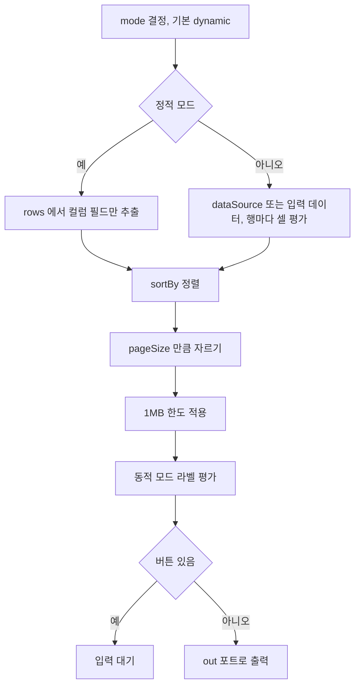

> 구현 상태: 구현됨 · 원문: `spec/4-nodes/6-presentation/2-table.md`, `spec/4-nodes/_product-overview.md` (§9.2) · 용어: [용어 사전](../CLE-GLOSSARY.md)

## 개요

Table 노드(Table, `table`)는 데이터를 표로 구조화해 보여 주는 Presentation 노드다. 데이터 소스 방식(`mode`)은 두 가지다. 정적 모드(`static`)는 `rows` 를 직접 적고 셀 값에 표현식을 쓸 수 있다. 동적 모드(`dynamic`)는 `dataSource` 배열의 각 항목에서 `columns[*].field` 를 매핑해 행을 만든다.

정렬, 페이지 크기 자르기, 컬럼 라벨 표현식, 출력 크기 한도를 지원한다. 전역 `buttons` 가 하나라도 있으면 블로킹 모드로 들어간다. 행마다 붙는 버튼은 없다.

범위 밖:

- 버튼 정의·버튼 편집기·포트 구성·블로킹 모드 흐름·출력 크기 한도·재개 출력 규격: [Presentation 노드 공통](CLE-NODE-PRES-COMMON.md)
- 실행 결과 드로어의 Table 표시: [Presentation 노드 공통](CLE-NODE-PRES-COMMON.md#실행-결과-드로어-표시)
- 표시 도구 `render_table`: [Presentation 노드 공통](CLE-NODE-PRES-COMMON.md#표시-도구-모드)
- 표현식 문법과 표현식 제외 키: [표현식 언어](../CLE-WF/CLE-WF-EXPR.md)

## 요구사항

- REQ-TABLE-001 WHEN 노드가 실행되면 THE SYSTEM SHALL 입력 배열 데이터를 표 행으로 구조화한다. (원본: ND-TB-01)
- REQ-TABLE-002 WHEN 사용자가 컬럼을 정의하면 THE SYSTEM SHALL 필드 경로·라벨·너비·정렬 가능 여부·포맷을 받는다. (원본: ND-TB-02)
- REQ-TABLE-003 WHEN `pageSize`(1~200, 기본 20)가 설정되어 있으면 THE SYSTEM SHALL 정렬한 뒤 앞에서부터 `pageSize` 행만 출력 값에 담는다. (원본: ND-TB-03)
- REQ-TABLE-004 WHEN `sortBy` 가 지정되면 THE SYSTEM SHALL `sortOrder`(기본 `asc`) 방향으로 행을 정렬한다. (원본: ND-TB-04)
- REQ-TABLE-005 WHEN 정렬 값에 null 이 있으면 THE SYSTEM SHALL `asc` 에서는 null 을 뒤로, `desc` 에서는 null 을 앞으로 보낸다.
- REQ-TABLE-006 IF `sortBy` 가 `columns[*].field` 가운데 하나가 아니면 THE SYSTEM SHALL 설정 검증에서 거부한다.
- REQ-TABLE-007 WHEN 노드가 결과를 내면 THE SYSTEM SHALL 행과 컬럼을 구조화된 출력 값으로 내고 HTML 스냅샷은 만들지 않는다. (원본: ND-TB-05)
- REQ-TABLE-008 WHEN 사용자가 버튼을 설정하면 THE SYSTEM SHALL 링크 버튼과 포트 버튼을 노드당 최대 5개까지 라벨·스타일·URL(링크 버튼)과 함께 받는다. (원본: ND-TB-06)
- REQ-TABLE-009 WHEN 버튼이 하나라도 있으면 THE SYSTEM SHALL 실행을 입력 대기로 멈추고 사용자가 누른 버튼의 포트로 실행을 재개한다. (원본: ND-TB-07)
- REQ-TABLE-010 WHEN `mode` 가 설정되어 있지 않으면 THE SYSTEM SHALL 동적 모드로 처리한다.
- REQ-TABLE-011 WHEN 정적 모드로 행을 만들면 THE SYSTEM SHALL `config.rows` 가운데 일반 객체만 골라 각 행에서 `columns[*].field` 값만 뽑고 `undefined` 는 `null` 로 둔다.
- REQ-TABLE-012 WHEN 동적 모드로 행을 만들면 THE SYSTEM SHALL `dataSource` 가 있으면 그 값을, 없으면 입력 포트 데이터를 쓰고 배열이 아니면 `[obj]` 로 감싼다.
- REQ-TABLE-013 WHEN 동적 모드에서 셀 값을 계산하면 THE SYSTEM SHALL `$dataSource`·`$sourceItem`·`$sourceItemIndex` 를 표현식 컨텍스트에 더해 표현식 컬럼은 평가하고 일반 컬럼은 dot-path 로 읽는다.
- REQ-TABLE-014 IF 셀 표현식 평가가 실패하면 THE SYSTEM SHALL 그 셀을 `null` 로 두고 에러를 던지지 않는다.
- REQ-TABLE-015 WHEN 동적 모드에서 컬럼 라벨에 `{{` 가 있으면 THE SYSTEM SHALL `$dataSource` 컨텍스트로 한 번 평가해 `output.columns` 에 싣는다.
- REQ-TABLE-016 WHEN 직렬화한 행 배열이 1MB 를 넘으면 THE SYSTEM SHALL 뒤에서부터 원소 단위로 잘라 내고 `output.rowsTruncated`·`output.rowsTotalCount` 를 싣는다.
- REQ-TABLE-017 WHEN 노드가 결과를 내면 THE SYSTEM SHALL 한도 적용 전 행 수를 `output.totalRows` 에 싣는다.
- REQ-TABLE-018 WHEN 노드가 설정 에코를 만들면 THE SYSTEM SHALL 민감하지 않은 스키마 필드(`mode`·`dataSource`·`columns`·`rows`·`pagination`·`pageSize`·`sortBy`·`sortOrder`)를 모두 싣는다.
- REQ-TABLE-019 IF `columns` 가 비었거나 없으면 THE SYSTEM SHALL 노드 경고 규칙 `table:no-columns` 로 캔버스에 알리고 설정 검증에서 거부한다.
- REQ-TABLE-020 IF 설정 검증에 실패하면 THE SYSTEM SHALL 실행 전 검증 단계에서 에러를 던지고 런타임 에러 포트는 쓰지 않는다.

입력 대기 기한(타임아웃)과 `pagination` 플래그의 역할은 정의가 갈린다. [미결 사항](#미결-사항) 참조.

제품 요구사항 원문(ND-TB-01~07)의 우선순위는 모두 필수다.

## 설정

| 필드 | 타입 | 필수 | 기본값 | 설명 |
|------|------|------|--------|------|
| `mode` | `static` / `dynamic` | ✗ | `dynamic` | 행 생성 방식. 없으면 `dynamic`(하위 호환) |
| `dataSource` | String? | ✗ | 없음 | 배열 데이터 소스. 표현식을 쓸 수 있다(동적 모드 전용). 없으면 입력 포트 데이터를 쓴다 |
| `columns` | ColumnDef[] | ✓ | `[]` | 컬럼 정의 배열. 비어 있으면 노드 경고 규칙 `table:no-columns` |
| `rows` | RowDef[] | 정적 모드일 때 ✓ | `[]` | 정적 행 데이터(`Record<string, string>`). 셀 값에 표현식을 쓸 수 있다 |
| `pagination` | Boolean | ✗ | `true` | 페이지네이션 사용. 역할은 [미결 사항](#미결-사항) 참조 |
| `pageSize` | Number(1~200) | ✗ | `20` | 페이지당 행 수 |
| `sortBy` | String? | ✗ | 없음 | 기본 정렬 컬럼 필드 이름. `columns[*].field` 가운데 하나여야 한다(`validateConfig` 교차 검사) |
| `sortOrder` | `asc` / `desc` | ✗ | `asc` | 정렬 방향 |
| `buttons` | ButtonDef[] | ✗ | `[]` | 전역 버튼 정의. 비어 있지 않으면 블로킹 모드. 구조는 [Presentation 노드 공통](CLE-NODE-PRES-COMMON.md#버튼-정의) |

**ColumnDef 구조:**

| 필드 | 타입 | 필수 | 설명 |
|------|------|------|------|
| `field` | String | ✓ | 데이터 필드 경로(dot-path, 예: `address.city`) 또는 항목별 표현식(예: `{{ $sourceItem.first + " " + $sourceItem.last }}`) |
| `label` | String | ✓ | 컬럼 헤더 이름. 표현식을 쓸 수 있다. 동적 모드에서는 핸들러가 `$dataSource` 컨텍스트로 평가한다 |
| `width` | String? | ✗ | 컬럼 너비(예: `200px`, `30%`) |
| `sortable` | Boolean? | ✗ | 정렬 가능 여부 |
| `format` | String? | ✗ | 날짜·숫자 포맷 문자열 |

**항목별 표현식 변수**: 컬럼 표현식을 평가할 때 아래 변수를 더 넣는다. 넣는 범위가 **셀**(`columns[*].field`, 행마다 평가)과 **라벨**(`columns[*].label`, 동적 모드에서 한 번 평가)에서 다르다.

| 변수 | 타입 | 쓸 수 있는 곳 | 설명 |
|------|------|---------------|------|
| `$dataSource` | `unknown[]` | 셀·라벨 | 정규화한 데이터 소스 배열 전체 |
| `$sourceItem` | `unknown` | 셀만 | 지금 도는 배열 항목. 라벨은 행 단위가 아니라서 넣지 않는다 |
| `$sourceItemIndex` | `number` | 셀만 | 지금 항목의 0부터 시작하는 인덱스. 라벨에는 넣지 않는다 |

`$input`, `$var`, `$node`, `$execution` 같은 기존 변수도 함께 쓸 수 있다. `columns` 는 표현식 제외 키(`EXPRESSION_EXCLUSIONS`)에 등록되어 있어 엔진이 미리 평가하지 않고 핸들러가 행 단위 컨텍스트로 평가한다([표현식 언어](../CLE-WF/CLE-WF-EXPR.md)).

스키마 단일 기준은 `codebase/backend/src/nodes/presentation/table/table.schema.ts` 의 `tableNodeConfigSchema` 다.

## 설정 화면

| 영역 | 위치 | 들어가는 요소 | 동작 |
|------|------|---------------|------|
| 모드 선택 | 맨 위 | Mode 드롭다운("Dynamic (from data)" / "Static (manual)") | 고른 모드에 맞는 입력란을 보여 준다 |
| Data Source(동적 모드) | 모드 아래 | 표현식 입력란과 힌트 "배열 데이터 소스 (미지정 시 이전 노드 출력)" | 배열을 돌려주는 표현식을 적는다 |
| Columns | 가운데 | 컬럼 카드마다 Field, Label, 삭제 `[×]`, `[+ Add Column]` | 동적 모드는 Field 에 dot-path 나 항목별 표현식을, Label 에도 표현식을 쓸 수 있다. 드래그로 순서를 바꾼다 |
| Rows(정적 모드) | Columns 아래 | 행 카드마다 컬럼별 셀 입력란, 삭제 `[×]`, `[+ Add Row]` | 셀 값에 표현식을 쓸 수 있고 엔진이 미리 평가한다. 드래그로 순서를 바꾼다 |
| 표시 옵션 | 아래쪽 | "Enable Pagination" 체크, Page Size, Sort By(동적 모드), Sort Order | 정렬과 페이지 크기를 정한다 |
| Buttons 섹션 | 맨 아래 | 전역 버튼 편집기 | [Presentation 노드 공통](CLE-NODE-PRES-COMMON.md#버튼-편집기) 의 버튼 편집기를 쓴다 |

## 포트

**입력 포트:**

| id | label | type | dynamic | 설명 |
|------|-------|------|---------|------|
| `in` | Input | data | false | 동적 모드에서 `dataSource` 가 없을 때 데이터 소스로 쓴다 |

**출력 포트:**

| 모드 | id | label | dynamic | 설명 |
|------|------|-------|---------|------|
| 표시 전용(`buttons: []`) | `out` | Output | false | 노드 결과 출력 |
| 블로킹, 포트 버튼 | `<button.id>` | 버튼 라벨 | true | 포트 버튼마다 동적으로 만든다([Presentation 노드 공통](CLE-NODE-PRES-COMMON.md#동적-포트-id-규칙)) |
| 블로킹, 링크 버튼만 | `continue` | Continue | true | 모든 버튼이 링크 버튼일 때 자동으로 만든다 |

Table 은 행마다 붙는 버튼이 없고 전역 `buttons` 만 쓴다. Carousel 의 `__item_<idx>` 접미사 규칙은 적용하지 않는다. 포트 구성과 블로킹 모드 흐름은 [Presentation 노드 공통](CLE-NODE-PRES-COMMON.md#포트-구성) 이 정한다.

## 실행 로직



1. `mode` 를 정한다. 기본값은 `dynamic` 이다.
2. **정적 모드**: `config.rows` 가운데 일반 객체만 고른다. 각 행에서 `columns[*].field` 값만 뽑아 `dataRows` 를 만든다. `undefined` 는 `null` 로 둔다.
3. **동적 모드**:
   1. `config.dataSource` 가 있으면 그 값을, 없으면 입력 포트 데이터를 쓴다. 배열이 아니면 `[obj]` 로 감싼다.
   2. 컬럼을 표현식 컬럼(`{{` 포함)과 일반 필드 컬럼으로 미리 나눈다.
   3. 각 항목마다 `{ $dataSource, $sourceItem, $sourceItemIndex }` 를 표현식 컨텍스트에 더해 셀 값을 계산한다. 표현식 컬럼은 `evaluate()` 로 평가하고 일반 컬럼은 `getNestedValue` 로 dot-path 를 읽는다. 평가에 실패하면 그 셀은 `null` 이다.
4. `sortBy` 가 있으면 `sortOrder` 에 따라 `dataRows` 를 정렬한다. null 비교는 "null 아닌 값 먼저" 규칙(`aVal != null && bVal != null && aVal < bVal ? -1 : 1`)을 쓴 뒤 `desc` 면 부호를 뒤집는다. 그래서 **`asc` 에서는 null 이 뒤로, `desc` 에서는 null 이 앞으로** 간다. 두 방향 모두 끝으로 모으지는 않는다(`table.handler.ts:118-126`).
5. `pageSize` 가 참 같은 값이면 `dataRows = dataRows.slice(0, pageSize)` 로 자른다.
6. 출력 크기 한도를 적용한다. `truncateArrayForOutput(dataRows, PRESENTATION_MAX_BYTES)` 가 직렬화 후 1MB 를 넘으면 뒤에서부터 원소 단위로 자른다([Presentation 노드 공통](CLE-NODE-PRES-COMMON.md#출력-크기-한도)).
7. **컬럼 라벨 평가**(동적 모드만): 라벨에 `{{` 가 있는 컬럼만 `$dataSource` 컨텍스트로 평가해 `resolvedColumns` 를 만든다. `$sourceItem`·`$sourceItemIndex` 는 넣지 않는다. 결과는 `output.columns` 에 싣는다.
8. **출력 구성**: `output.rows` 에 한도를 적용한 행을, `output.columns` 에 `resolvedColumns` 를 싣는다. 백엔드는 HTML 을 만들지 않고 프런트엔드 `TableContent` 가 `rows` 와 `columns` 로 직접 그린다. 한도로 잘린 행은 `rows` 에 없으므로 새어 나가지 않는다(`table.handler.ts:21-24,148-158`).
9. **버튼 분기**: `buttons.length > 0` 이면 입력 대기 출력을 내고 엔진이 사용자 입력을 받으면 재개 출력을 만든다. 버튼이 없으면 표시 전용 출력을 낸다.

핸들러는 `codebase/backend/src/nodes/presentation/table/table.handler.ts` 다. 설정 에코는 `context.rawConfig` 를 먼저 쓴다([노드 출력 규약](../CLE-NODE/CLE-NODE-OUTPUT.md)).

## 출력 구조

JSON 예시는 `undefined` 필드를 생략한다. 노드 출력의 다섯 필드 밖의 최상위 키는 쓰지 않는다. 경우는 표시 전용, 입력 대기, 재개다. 따로 에러 경우는 없고 설정 검증 실패는 실행 전에 던진다.

### 표시 전용(`buttons: []`)

```json
{
  "config": {
    "mode": "dynamic",
    "columns": [
      { "field": "name", "label": "Name" },
      { "field": "email", "label": "{{ $var.locale === \"ko\" ? \"이메일\" : \"Email\" }}" }
    ],
    "pageSize": 20,
    "sortBy": "name",
    "sortOrder": "asc"
  },
  "output": {
    "rows": [
      { "name": "Alice", "email": "alice@test.com" },
      { "name": "Bob", "email": "bob@test.com" }
    ],
    "totalRows": 2,
    "columns": [
      { "field": "name", "label": "Name" },
      { "field": "email", "label": "Email" }
    ]
  }
}
```

**설정 에코는 모든 키를 싣는다**: 핸들러는 민감하지 않은 스키마 필드 `mode`·`dataSource`·`columns`·`rows`·`pagination`·`pageSize`·`sortBy`·`sortOrder` 를 모두 되돌린다. 원문 값이 없으면 `undefined` 키로 남고 JSON 직렬화에서 빠진다. 위 예시는 `undefined` 필드를 생략했을 뿐 실제 에코 객체에는 모든 키가 있다(`table.handler.ts:166-177`, `configEcho`).

| 필드 | 타입 | 출처 | 설명 |
|------|------|------|------|
| `config.mode` | `'static'` / `'dynamic'` | 설정 에코 | 행 생성 방식. `rawConfig.mode ?? mode`(정규화 기본값으로 대체) |
| `config.dataSource` | string? | 설정 에코 | 배열 데이터 소스 표현식 원문. 없으면 `undefined` |
| `config.columns` | ColumnDef[] | 설정 에코 | **원문** 컬럼 정의. `label` 의 `{{ }}` 를 보존한다(`rawConfig.columns ?? columns`) |
| `config.rows` | RowDef[]? | 설정 에코 | 정적 모드 행 데이터 원문. 동적 모드이거나 없으면 `undefined` |
| `config.pagination` | boolean? | 설정 에코 | 페이지네이션 플래그 원문 |
| `config.pageSize` | number? | 설정 에코 | `rawConfig.pageSize ?? pageSize` |
| `config.sortBy` / `config.sortOrder` | string? / enum? | 설정 에코 | 정렬 설정(`rawConfig.* ?? 런타임 값`) |
| `output.rows` | `Record<string, unknown>[]` | 런타임 | 정적 모드는 `columns[*].field` 기준으로 고른 행, 동적 모드는 `dataSource` 항목별로 평가한 셀. 한도로 잘렸을 수 있다 |
| `output.totalRows` | number | 런타임 | **한도 적용 전** 행 수(정렬과 `pageSize` 적용 후). `rows.length !== totalRows` 만으로도 잘림을 알 수 있다 |
| `output.columns` | ColumnDef[] | 런타임 | `label` 표현식을 평가한 컬럼(동적 모드만). 설정의 원문 label 과 따로 둔다 |
| `output.rowsTruncated?` | `true` | 런타임, 한도가 걸렸을 때만 | 1MB 한도로 뒤쪽을 잘랐다는 표시 |
| `output.rowsTotalCount?` | number | 런타임, 한도가 걸렸을 때만 | 한도 적용 전 원소 수 |

**잘림 신호**: `output.totalRows` 는 한도 전 크기, `output.rows.length` 는 한도 후 길이다. 둘이 다르면 잘린 것이다. 한도가 걸리면 `rowsTruncated: true` 와 `rowsTotalCount` 도 함께 실어 다운스트림이 어느 쪽으로든 알 수 있다.

표현식 접근 예:

- `$node["T"].output.rows[0].name` → `"Alice"`
- `$node["T"].output.totalRows` → `2`
- `$node["T"].output.columns[0].label` → 평가한 라벨(예: `"Email"`)
- `$node["T"].config.columns[0].label` → 원문 템플릿(예: `"{{ $var.locale === \"ko\" ? \"이메일\" : \"Email\" }}"`)

### 입력 대기(`buttons.length > 0`)

```json
{
  "config": {
    "mode": "dynamic",
    "columns": [
      { "field": "name", "label": "Name" },
      { "field": "email", "label": "Email" }
    ],
    "pageSize": 20,
    "buttons": [
      { "id": "approve", "label": "Approve", "type": "port", "style": "primary" },
      { "id": "reject", "label": "Reject", "type": "port", "style": "danger" }
    ],
    "buttonConfig": {
      "buttons": [
        { "id": "approve", "label": "Approve", "type": "port", "style": "primary" },
        { "id": "reject", "label": "Reject", "type": "port", "style": "danger" }
      ]
    }
  },
  "output": {
    "rows": [
      { "name": "Alice", "email": "alice@test.com" },
      { "name": "Bob", "email": "bob@test.com" }
    ],
    "totalRows": 2,
    "columns": [
      { "field": "name", "label": "Name" },
      { "field": "email", "label": "Email" }
    ]
  },
  "meta": {
    "interactionType": "buttons",
    "durationMs": 0
  },
  "status": "waiting_for_input"
}
```

| 필드 | 타입 | 출처 | 설명 |
|------|------|------|------|
| `config.*` | 표시 전용과 같음 + 추가 | 설정 에코 | 표시 전용의 모든 필드 + `buttons`(원문 ButtonDef[]) + `buttonConfig.buttons`(엔진 입력 페이로드) |
| `output.rows` / `output.totalRows` / `output.columns` | 표시 전용과 같다 | 런타임 | 입력 대기 시점의 바뀌지 않는 스냅샷 |
| `output.rowsTruncated?` / `output.rowsTotalCount?` | 표시 전용과 같다 | 런타임, 한도가 걸렸을 때 | |
| `meta.interactionType` | `'buttons'` | 핸들러 반환 | 대기 표면. 화면이 어떤 입력 UI 를 그릴지 정한다 |
| `meta.durationMs` | number | 핸들러 반환(엔진이 덮어씀) | 핸들러는 `0` 을 넣고 엔진이 실제 측정값으로 바꾼다 |
| `status` | `'waiting_for_input'` | 핸들러 반환 | 블로킹 모드 진입. 엔진은 WebSocket `execution.waiting_for_input` 을 보낸다 |

Table 은 행마다 붙는 버튼이 없으므로 `buttonConfig.buttonItemMap` 을 싣지 않는다. 이 필드는 Carousel 전용이다.

### 재개

엔진이 사용자 입력을 받아 입력 대기 출력 값에 `interaction` 을 더하고 `port`·`status` 를 바꾼다. 입력 대기 시점의 `rows`·`totalRows`·`columns` 는 바뀌지 않는 스냅샷으로 남는다.

**포트 버튼 클릭:**

```json
{
  "config": { "mode": "dynamic", "columns": [ /* … */ ], "buttons": [ /* … */ ], "buttonConfig": { /* … */ } },
  "output": {
    "rows": [
      { "name": "Alice", "email": "alice@test.com" },
      { "name": "Bob", "email": "bob@test.com" }
    ],
    "totalRows": 2,
    "columns": [ /* 입력 대기 스냅샷 유지 */ ],
    "interaction": {
      "type": "button_click",
      "data": {
        "buttonId": "approve",
        "buttonLabel": "Approve"
      },
      "receivedAt": "2026-04-19T12:34:56.789Z"
    }
  },
  "meta": { "interactionType": "buttons", "durationMs": 9800 },
  "port": "approve",
  "status": "resumed"
}
```

| 필드 | 타입 | 출처 | 설명 |
|------|------|------|------|
| `output.<입력 대기 필드>` | 입력 대기와 같다 | 바뀌지 않는 스냅샷 | 입력 대기 시점 그대로 |
| `output.interaction.type` | `'button_click'` | 엔진 주입 | 포트 버튼 클릭 |
| `output.interaction.data.buttonId` | string | 엔진 주입 | 누른 버튼의 `config.buttons[i].id` |
| `output.interaction.data.buttonLabel` | string | 엔진 주입 | 누른 버튼의 평가한 라벨 |
| `output.interaction.receivedAt` | ISO8601 | 엔진 주입 | 클릭 수신 시각 |
| `port` | `<button.id>` | 엔진 라우팅 | 누른 포트 버튼의 동적 포트 ID |
| `status` | `'resumed'` | 엔진 | 모든 사용자 행동에 공통인 재개 상태 |

Table 은 행 버튼이 없으므로 `interaction.data.selectedItem` 을 쓰지 않는다. 이 필드는 Carousel 전용이다.

**링크 버튼만 있을 때 Continue 클릭:**

모든 버튼이 링크 버튼이면 계속 포트(`continue`)가 자동으로 생기고 사용자가 `[Continue →]` 를 누르면 다음처럼 재개한다.

```json
{
  "output": {
    "rows": [ /* 입력 대기 스냅샷 */ ],
    "totalRows": 2,
    "columns": [ /* 입력 대기 스냅샷 */ ],
    "interaction": {
      "type": "button_continue",
      "data": {
        "buttonId": "more",
        "buttonLabel": "More",
        "url": "https://docs.example.com/table"
      },
      "receivedAt": "2026-04-19T12:34:56.789Z"
    }
  },
  "meta": { "interactionType": "buttons", "durationMs": 9800 },
  "port": "continue",
  "status": "resumed"
}
```

| 필드 | 바뀌는 점 |
|------|-----------|
| `output.interaction.type` | `'button_continue'` |
| `output.interaction.data.url` | 링크 버튼의 평가한 URL |
| `port` | `'continue'` |

표현식 접근 예:

- `$node["T"].port === "approve"` → 포트 버튼 클릭 분기 판별
- `$node["T"].output.interaction.data.buttonId` → 누른 버튼 식별
- `$node["T"].status === "resumed" && $node["T"].output.interaction.type === "button_continue"` → Continue 분기

## 에러 코드

Table 은 **런타임 에러 포트가 없다**. 모든 검증 실패는 실행 전 검증 단계에서 던진다.

| 발생 조건 | 메시지 | 시점 | 출처 |
|-----------|--------|------|------|
| `columns` 가 빈 배열이거나 없음 | `At least one column must be defined.`(화면 한국어: "컬럼을 1개 이상 정의해야 합니다.") | 노드 경고 규칙(캔버스 배지) + `handler.validate` | `warningRules.table:no-columns` |
| `mode` 가 `static`·`dynamic` 밖의 값 | `Mode must be either static or dynamic.`(화면 한국어: "Mode 는 static 또는 dynamic 이어야 합니다.") | 노드 경고 규칙 + `handler.validate` | `warningRules.table:invalid-mode` |
| `columns` 가 배열이 아님 | `columns must be an array` | `handler.validate` | `validateTableConfig` |
| 정적 모드에서 `rows` 가 배열이 아님 | `rows must be an array in static mode` | `handler.validate` | `validateTableConfig` |
| `sortBy` 가 `columns[*].field` 와 맞지 않음 | `sortBy "<value>" must match one of the defined column fields` | `handler.validate` | `validateTableConfig` |
| 버튼 라벨 누락, 링크 URL 누락, 포트 버튼 URL, 버튼 ID 중복, 5개 초과 | [Presentation 노드 공통](CLE-NODE-PRES-COMMON.md#유효성-검증) 메시지 | `handler.validate` | `validateButtons` |

행 단위 표현식 평가 실패는 던지지 않고 그 셀을 `null` 로 둔다(`safeEvaluate`). 예상할 수 있는 비즈니스 실패로 본다.

## 설정 요약

| 경우 | 설정 요약 포맷 | 예시 |
|------|----------------|------|
| 버튼 없음 | `{N} columns`. pagination 을 켜면 `· pagination` 을 붙인다 | `3 columns · pagination` |
| 버튼 있음 | `{N} columns · {N} buttons` | `3 columns · 2 buttons` |

위 포맷은 목표 포맷이다. 현재 구현은 Table 스키마(`table.schema.ts`)에 `summaryTemplate` 이 없어 캔버스에 요약 줄이 보이지 않는다(미구현, [Presentation 노드 공통](CLE-NODE-PRES-COMMON.md#설정-요약)).

## 미결 사항

- **`pagination` 플래그가 출력 자르기를 제어하는가**: 설정 표는 `pagination`(기본 `true`)을 "페이지네이션 활성화" 로 적는다. 그런데 실행 로직 5단계는 플래그와 상관없이 `pageSize` 가 참 같은 값이면 앞 `pageSize` 행만 출력 값에 담는다. 현재 구현(`table.handler.ts:128`)도 플래그를 보지 않는다. 그래서 다운스트림과 드로어가 받는 행은 늘 한 페이지이고 드로어 페이지네이션 컨트롤이 넘길 페이지가 없다. `pagination` 이 출력 자르기를 제어하는지, 화면 표시 전용인지 결정 필요. 드로어 표시 행 수 문제([Presentation 노드 공통](CLE-NODE-PRES-COMMON.md#미결-사항))와 함께 정한다.
- **입력 대기 기한(타임아웃)**: 요구사항 원문(ND-TB-07)은 "선택적 타임아웃 지원(무제한 가능)" 을 적고 이 노드 원문은 외부 취소나 종료 전까지 기한 없이 기다린다고 적는다. 결정은 [Presentation 노드 공통](CLE-NODE-PRES-COMMON.md#미결-사항) 에서 함께 한다.

## 구현 위치

- `codebase/backend/src/nodes/presentation/table/table.component.ts`
- `codebase/backend/src/nodes/presentation/table/table.handler.ts` (`configEcho`, `resolveColumnLabels`, `safeEvaluate`)
- `codebase/backend/src/nodes/presentation/table/table.schema.ts` (`tableNodeConfigSchema`, `validateTableConfig`)
- `codebase/frontend/src/components/editor/run-results/renderers/presentation-renderers.tsx` (`TableContent`)

## Rationale

### 백엔드 HTML 스냅샷을 만들지 않는다 (2026-05-17)

백엔드는 `output.rendered` HTML 을 만들지 않는다. 다운스트림과 화면은 `output.rows` 와 `output.columns` 로 직접 그린다. Carousel·Chart 와 같은 방식이고 escape 책임은 표시 계층(React JSX 자동 escape)으로 옮겼다. 한도로 잘린 행이 HTML 에 섞여 나갈 일도 없다. 옛 워크플로우가 `$node["T"].output.rendered` 를 참조하면 깨지므로 `rows`·`columns` 참조로 바꿔야 한다.

같은 날 설정 에코는 민감하지 않은 스키마 필드를 모두 싣도록 정했다. 값이 없으면 `undefined` 키로 남아 직렬화에서 빠진다.

### 라벨에는 항목 변수를 넣지 않는다

셀(`columns[*].field`)에는 `$dataSource`·`$sourceItem`·`$sourceItemIndex` 세 변수를 넣고 라벨(`columns[*].label`)에는 `$dataSource` 만 넣는다. 라벨은 동적 모드에서 한 번만 평가하고 행 단위가 아니므로 `$sourceItem`·`$sourceItemIndex` 는 뜻이 없다(`table.handler.ts` 의 `resolveColumnLabels`).

이전 명세는 셀과 라벨 모두에 세 변수를 준다고 적었다. 이것은 의도한 설계가 아니라 실행 로직과 코드에 처음부터 맞지 않던 부정확한 서술이었다. 그래서 이 구분은 결정을 뒤집은 것이 아니라 처음으로 확정한 것이다. [표현식 언어](../CLE-WF/CLE-WF-EXPR.md) 의 같은 서술도 함께 맞췄다.
