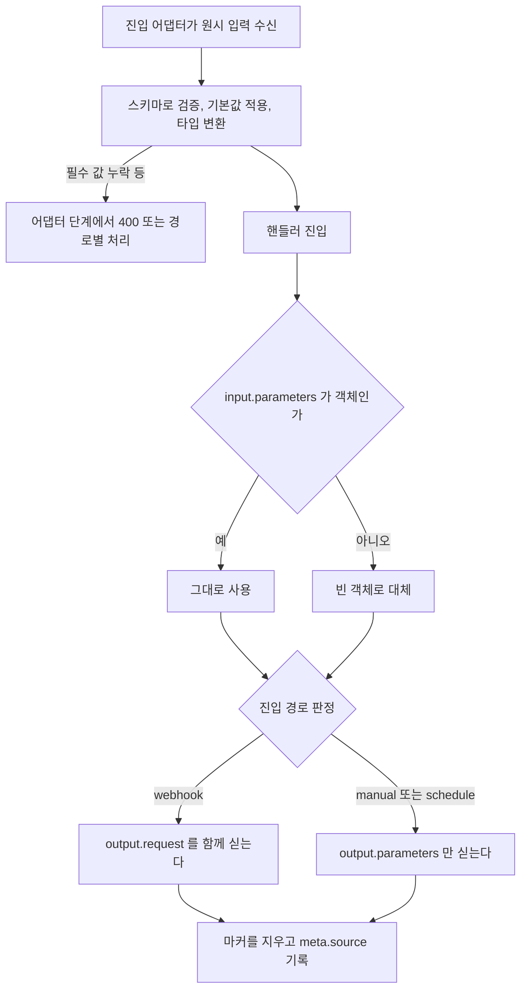

> 구현 상태: 구현됨(설정 요약은 미구현) · 원문: `spec/4-nodes/7-trigger/1-manual-trigger.md`, `spec/4-nodes/_product-overview.md` (§3) · 용어: [용어 사전](../CLE-GLOSSARY.md)

## 개요

수동 트리거 노드(Manual Trigger, `manual_trigger`)는 워크플로우의 진입점이다. 캔버스 표시 이름은 "Manual Trigger" 다. 워크플로우마다 정확히 하나 있고, 워크플로우를 만들 때 자동으로 생기며 지울 수 없다. 입력 포트가 없고, 입력을 기다리지 않고 바로 끝난다.

이름과 달리 수동 실행만 받지 않는다. 수동·웹훅·스케줄 실행이 모두 이 노드에서 시작한다. 노드는 사용자가 정의한 트리거 파라미터 스키마(`config.parameters`)로 진입 어댑터가 넘긴 원시 입력을 해석·검증하고, 그 결과를 `output.parameters` 로 내보낸다.

이 문서는 노드 설정, 설정 화면, 포트, 실행 로직, 출력 형태, 파라미터 검증과 에러, 설정 요약을 정한다. 세 진입 경로가 공유하는 파라미터 계약과 스키마 정의는 [트리거 노드 공통](CLE-NODE-TRIG-COMMON.md), 노드 출력 필드 규칙은 [노드 출력 규약](../CLE-NODE/CLE-NODE-OUTPUT.md)이 정한다. 캔버스에서 이 노드를 자동으로 만들고 지울 수 없게 하는 편집 제약은 [워크플로우 에디터와 캔버스](../CLE-WF/CLE-WF-EDITOR.md)가 다룬다.

## 요구사항

- REQ-MANUAL-001 WHEN 사용자가 실행 버튼이나 API 로 워크플로우를 수동 실행하면 THE SYSTEM SHALL 수동 트리거 노드에서 실행을 시작한다. (원본: ND-MT-01)
- REQ-MANUAL-002 WHILE 워크플로우에 수동 트리거 노드가 있는 동안 THE SYSTEM SHALL 그 노드에 입력 포트 없이 출력 포트 `out` 하나만 둔다. (원본: ND-MT-02)
- REQ-MANUAL-003 WHEN 진입 어댑터가 입력을 넘기면 THE SYSTEM SHALL `config.parameters` 스키마로 해석한 값을 `output.parameters` 로 내보낸다. (원본: ND-MT-03)
- REQ-MANUAL-004 WHEN 사용자가 워크플로우를 만들면 THE SYSTEM SHALL 수동 트리거 노드를 자동으로 배치한다. (원본: ND-MT-04)
- REQ-MANUAL-005 IF 사용자가 수동 트리거 노드를 지우려 하면 THE SYSTEM SHALL 삭제를 막는다. (원본: ND-MT-04)
- REQ-MANUAL-006 IF 사용자가 워크플로우에 수동 트리거 노드를 하나 더 두려 하면 THE SYSTEM SHALL 이를 막는다. (원본: ND-MT-05)
- REQ-MANUAL-007 WHEN 사용자가 수동 트리거 노드의 설정 패널을 열면 THE SYSTEM SHALL Label, Notes, Parameters 만 편집하게 한다.
- REQ-MANUAL-008 WHEN 핸들러가 실행되면 THE SYSTEM SHALL `input.parameters` 가 객체면 그대로 쓰고, 아니면 `{}` 로 대체한다.
- REQ-MANUAL-009 WHEN 핸들러가 출력을 만들면 THE SYSTEM SHALL `context.rawConfig?.parameters ?? []` 를 `config.parameters` 로 싣는다.
- REQ-MANUAL-010 WHEN 핸들러가 진입 경로를 정하면 THE SYSTEM SHALL `input.__triggerSource` 마커를 먼저 쓰고, 마커가 없으면 `body`·`headers`·`query`·`method` 가운데 하나라도 있을 때 `webhook`, 아니면 `manual` 로 정한다.
- REQ-MANUAL-011 WHEN 진입 경로가 웹훅이면 THE SYSTEM SHALL `output.request: { method, headers, query, body }` 를 싣는다.
- REQ-MANUAL-012 WHILE 진입 경로가 수동이나 스케줄인 동안 THE SYSTEM SHALL `output.request` 를 싣지 않는다.
- REQ-MANUAL-013 WHEN 핸들러가 출력을 돌려주면 THE SYSTEM SHALL `__triggerSource` 마커를 출력에서 지우고 `meta.source` 에 진입 경로를 싣는다.
- REQ-MANUAL-014 WHEN 핸들러가 출력을 돌려주면 THE SYSTEM SHALL `port`·`status` 를 비워 두어 엔진이 기본 포트 `out` 으로 보내게 한다.
- REQ-MANUAL-015 IF 워크플로우를 저장할 때 파라미터 스키마가 구조 규칙(이름 형식, 이름 중복, 배열 여부, type enum)을 어기면 THE SYSTEM SHALL 저장을 거부하고 `400 INVALID_TRIGGER_PARAMETERS` 로 응답한다.
- REQ-MANUAL-016 WHEN 사용자가 과거 버전을 복원하면(`restoreVersion`) THE SYSTEM SHALL 파라미터 스키마 저장 검증을 건너뛴다.
- REQ-MANUAL-017 IF 수동 실행에서 필수 파라미터 값이 없거나 선언한 타입으로 바꿀 수 없으면 THE SYSTEM SHALL 실행을 만들지 않고 `400 INVALID_TRIGGER_PARAMETERS` 로 응답한다.
- REQ-MANUAL-018 IF 수동 재실행(`inputOverride`)에서 필수 파라미터 값이 없거나 선언한 타입으로 바꿀 수 없으면 THE SYSTEM SHALL 실행을 만들지 않고 `400 INVALID_TRIGGER_PARAMETERS` 로 응답한다.
- REQ-MANUAL-019 IF 웹훅 실행에서 필수 파라미터 값이 없으면 THE SYSTEM SHALL 실행을 만들지 않고 `400 INVALID_WEBHOOK_PAYLOAD` 로 응답한다.
- REQ-MANUAL-020 IF 스케줄 실행에서 필수 파라미터 값이 없으면 THE SYSTEM SHALL 실행을 막지 않고 `warn` 로그를 남긴 뒤 스키마 없이 가능한 기본값을 채워 진행한다.
- REQ-MANUAL-021 IF 수동 실행이나 수동 재실행에서 값의 끝 값(leaf)이 마스킹 표시(`***`, `[REDACTED]`, `[REDACTED_DEPTH]`)와 정확히 같으면 THE SYSTEM SHALL `masked_value_resubmitted` 사유로 거부한다.
- REQ-MANUAL-022 WHEN 마스킹 표시 재제출을 검사하면 THE SYSTEM SHALL 타입 변환 전 원본 값을 먼저 검사하고 해석한 뒤 한 번 더 검사하며, 두 검사 모두 원본 기준 키만 대상으로 삼는다.
- REQ-MANUAL-023 WHILE 웹훅·스케줄 진입 경로인 동안 THE SYSTEM SHALL 마스킹 표시 재제출 검사를 하지 않는다.
- REQ-MANUAL-024 WHEN 파라미터 검증 실패로 400 을 응답하면 THE SYSTEM SHALL `{ error: { code, message, requestId, details } }` 에러 응답 봉투로 보내고 내부 사유를 `details[]` 의 `UPPER_SNAKE_CASE` 필드 코드로 바꿔 싣는다.
- REQ-MANUAL-025 WHEN 캔버스에 수동 트리거 노드를 그리면 THE SYSTEM SHALL 파라미터 개수를 `Parameters: N` 또는 `(none)` 으로 요약해 보인다. (미구현)

## 설정

| 필드 | 타입 | 필수 | 기본값 | 설명 |
| --- | --- | --- | --- | --- |
| `parameters` | `TriggerParameterDefinition[]` | | `[]` | 입력 파라미터 스키마 배열. 정의는 [트리거 노드 공통](CLE-NODE-TRIG-COMMON.md#2-트리거-파라미터-스키마)에 있다. |

`parameters[i]` 는 `{ name, type, required?, defaultValue?, description? }` 형태의 스키마 정의다. 값이 아니다. 배열이 비어 있으면 파라미터 기능을 끈다.

`config.parameters` 와 `output.parameters` 는 이름은 같지만 형태가 다르다. 서로 다시 싣는 관계가 아니다([노드 출력 규약 Principle 1.1](../CLE-NODE/CLE-NODE-OUTPUT.md#principle-11-설정과-출력-값은-겹치지-않는다)).

- `config.parameters` 는 `Array<{name, type, ...}>` 다. 화면이나 스키마로 정의한 스키마이고 실행하지 않아도 있다.
- `output.parameters` 는 `Record<string, unknown>` 이다. 어댑터 입력과 `defaultValue` 를 합쳐 해석한 런타임 값이고 실행할 때만 있다.

설정 스키마의 기준은 `codebase/backend/src/nodes/trigger/manual-trigger/manual-trigger.schema.ts` 의 `manualTriggerConfigSchema` 다.

## 설정 화면

설정 패널에서는 Label, Notes, Parameters 만 편집할 수 있다. 워크플로우당 하나, 삭제 불가라는 제약은 캔버스 컨텍스트 메뉴에서 강제한다.

| 영역 | 위치 | 들어가는 요소 | 동작 |
| --- | --- | --- | --- |
| 파라미터 카드 | Parameters 절 안, 파라미터마다 하나 | Name 입력(예: `orderId`), Type 드롭다운(`string`·`number`·`boolean`·`object`·`array`), Required 체크박스, Default 입력과 지우기(×) 버튼 | 파라미터 정의 하나를 편집한다. 예: `orderId`(string, 필수, 기본 `""`), `count`(number, 선택, 기본 `0`) |
| 파라미터 추가 | 카드 목록 아래 | "+ Add Parameter" 버튼 | 빈 파라미터 카드를 하나 더한다. |

## 포트

입력 포트는 없다(`inputs: []`). 워크플로우 진입점이기 때문이다([트리거 노드 공통](CLE-NODE-TRIG-COMMON.md#31-입력-포트가-없다)).

`execute(input, config, context)` 에 들어오는 `input` 은 진입 어댑터가 넘기는 외부 진입 데이터다. 수동은 `{ parameters }`, 웹훅은 `{ parameters, body, headers, query, method }`, 스케줄은 `{ parameters }` 이고, 어댑터가 `__triggerSource: 'manual' | 'webhook' | 'schedule'` 마커를 함께 넣는다. 핸들러는 이 마커로 `meta.source` 를 채우고 출력 전에 지운다.

출력 포트는 다음과 같다.

| id | label | type | dynamic | 설명 |
| --- | --- | --- | --- | --- |
| `out` | Output | data | false | 해석한 파라미터 값. 다음 노드로 들어간다. |

동적 포트는 없다.

## 실행 로직



1. 어댑터 단계에서 미리 해석한다. 엔진의 진입 어댑터(`resolveTriggerParameters`)가 경로별 원시 값을 `config.parameters` 스키마로 검증하고, 기본값을 적용하고, 타입을 강제로 바꿔 `input.parameters` 로 넘긴다. 필수 값이 빠지면 이 단계에서 400 또는 경로별 처리로 끝난다([검증과 에러](#검증과-에러)). 어댑터는 `input.__triggerSource` 마커도 함께 넣는다.
2. 핸들러에 들어온다. `input.parameters` 가 객체면 그대로 쓰고, 아니면 `{}` 로 대체한다([노드 출력 규약 Principle 10](../CLE-NODE/CLE-NODE-OUTPUT.md#principle-10-비었거나-null-인-입력의-대체-값)).
3. 설정을 다시 싣는다. `context.rawConfig?.parameters ?? []` 를 `config.parameters` 에 싣는다. `defaultValue` 의 `{{ }}` 템플릿은 그대로 둔다([노드 출력 규약 Principle 7](../CLE-NODE/CLE-NODE-OUTPUT.md#principle-7-설정-에코-원칙)).
4. 진입 경로를 정한다. `input.__triggerSource` 마커를 먼저 쓴다. 마커가 없으면 `body`·`headers`·`query`·`method` 가운데 하나라도 있을 때 `webhook`, 아니면 `manual` 로 정한다.
5. 출력 값을 만든다. `output.parameters = resolvedParameters` 다. 웹훅 경로일 때만 `output.request: { method, headers, query, body }` 로 전송 정보를 묶어 싣는다. 수동·스케줄 경로에서는 `output.request` 자체를 빼고, 마커(`__triggerSource`)가 출력으로 새지 않도록 지운다.
6. `meta.source: 'manual' | 'webhook' | 'schedule'` 을 채운다([노드 출력 규약 Principle 2](../CLE-NODE/CLE-NODE-OUTPUT.md#principle-2-실행-메트릭에는-관측-값만-둔다)). `port`·`status` 는 비워 둔다. 엔진이 기본 포트 `out` 으로 보낸다.

## 출력 구조

[노드 출력 규약 Principle 11](../CLE-NODE/CLE-NODE-OUTPUT.md#principle-11-출력-예시-작성-규칙) 형식을 따른다. JSON 예시에서 `undefined` 필드는 빼고, 다섯 필드 밖 최상위 키는 쓰지 않는다.

수동 트리거 노드는 입력을 기다리지 않고 바로 끝난다. 핸들러 단계에는 에러 포트가 없다. 검증 실패는 어댑터 단계의 사전 검증에서 끝난다. 정상 출력은 진입 경로에 따라 두 형태다. 수동·스케줄은 `output: { parameters }`, 웹훅은 여기에 `output.request` 가 더해진다. 두 경우 모두 `meta.source` 로 진입 경로를 알 수 있다.

### 수동·스케줄 경로 (port `out`)

```json
{
  "config": {
    "parameters": [
      { "name": "orderId", "type": "string", "required": true },
      { "name": "count", "type": "number", "defaultValue": 0 }
    ]
  },
  "output": {
    "parameters": { "orderId": "abc-123", "count": 3 }
  },
  "meta": { "source": "manual" }
}
```

| 필드 | 타입 | 출처 | 설명 |
| --- | --- | --- | --- |
| `config.parameters` | `TriggerParameterDefinition[]` | 설정 에코 | 사용자가 화면에서 정의한 원본 스키마. `defaultValue` 의 `{{ }}` 템플릿을 그대로 둔다. |
| `output.parameters` | `Record<string, unknown>` | 런타임, 어댑터가 해석 | 어댑터가 입력과 `defaultValue` 를 합쳐 해석한 값. `config.parameters` 를 다시 실은 것이 아니다. |
| `meta.source` | `'manual'` / `'webhook'` / `'schedule'` | 런타임, 어댑터 마커 | 어떤 경로로 실행됐는지. 스케줄 경로는 `"schedule"` 이다. |

### 웹훅 경로 (port `out`)

웹훅 어댑터가 `{ __triggerSource: 'webhook', parameters, body, headers, query, method }` 를 넘기면 핸들러는 전송 정보 네 필드를 `output.request` 아래로 묶고 `meta.source: 'webhook'` 을 붙인다.

```json
{
  "config": {
    "parameters": [
      { "name": "orderId", "type": "string", "required": true }
    ]
  },
  "output": {
    "parameters": { "orderId": "abc-123" },
    "request": {
      "method":  "POST",
      "headers": { "x-source": "github" },
      "query":   { "q": "1" },
      "body":    { "raw": true }
    }
  },
  "meta": { "source": "webhook" }
}
```

| 필드 | 타입 | 출처 | 설명 |
| --- | --- | --- | --- |
| `output.request` | object | 런타임, 웹훅 어댑터 | 웹훅 전송 정보 묶음. 수동·스케줄 경로에서는 `output.request` 자체가 없다. |
| `output.request.method` | string | 런타임, 웹훅 어댑터 | HTTP method |
| `output.request.headers` | object | 런타임, 웹훅 어댑터 | HTTP 헤더(소문자 키). 민감 헤더 값은 `[REDACTED]` 로 가려져 있다. 웹훅 어댑터가 수신할 때 가린 `inputData.headers` 를 그대로 싣기 때문이고, 핸들러에는 따로 마스킹 로직이 없다([웹훅](../CLE-TRIG/CLE-TRIG-WEBHOOK.md)의 민감 헤더 마스킹). |
| `output.request.query` | object | 런타임, 웹훅 어댑터 | 파싱한 URL 쿼리 문자열 |
| `output.request.body` | unknown | 런타임, 웹훅 어댑터 | HTTP 본문. content-type 에 따라 object, string, Buffer 다. |

`request` 는 웹훅 경로에만 있으므로 다음 노드의 표현식은 `$node["Manual Trigger"].output.request?.method` 처럼 없을 수 있음을 고려한다. 진입 경로 분기는 `meta.source` 로 한다.

표현식 접근 예는 다음과 같다.

- `$node["Manual Trigger"].output.parameters.orderId` → `"abc-123"`
- `$input.parameters.orderId` → `"abc-123"`(축약, 바로 다음 노드에서만)
- `$params.orderId` → `"abc-123"`(축약, `$input.parameters` 별칭)
- `$node["Manual Trigger"].config.parameters[0].name` → `"orderId"`(스키마 정의)
- `$node["Manual Trigger"].output.request.method` → `"POST"`(웹훅 경로만)
- `$node["Manual Trigger"].meta.source` → `"manual"`, `"webhook"`, `"schedule"`

## 검증과 에러

수동 트리거 노드 핸들러에는 런타임 에러 포트가 없다. 모든 검증 실패는 핸들러에 들어오기 전, 어댑터나 설정 검증의 사전 검증 단계에서 처리한다([노드 출력 규약 Principle 3](../CLE-NODE/CLE-NODE-OUTPUT.md#principle-3-에러-계약)).

### 검증 사유 코드

검증 실패 사유는 `validateTriggerParameterSchema`·`resolveTriggerParameters` 가 enum 코드 하나로 낸다. 저장 검증은 이를 `parameters.<field>: <reason>` 형태로 평평하게 펼친다. 사람이 읽는 긴 문장이 아니라 안정적인 기계용 사유 코드다. 기준은 `codebase/backend/src/modules/execution-engine/utils/resolve-trigger-parameters.ts` 다.

| 조건 | 사유 코드 | 시점 |
| --- | --- | --- |
| `parameters[i].name` 이 빈 문자열이거나 식별자 규칙(`^[A-Za-z_][A-Za-z0-9_]*$`)을 어김 | `invalid_schema` | 저장할 때 |
| `parameters` 안에서 `name` 이 겹침 | `invalid_schema` | 저장할 때 |
| `parameters` 가 배열이 아님(`field` 는 `(root)`) | `invalid_schema` | 저장할 때 |
| `parameters[i].type` 이 enum(`string`, `number`, `boolean`, `object`, `array`)에 없음 | `invalid_schema` | 저장할 때 |
| 필수 파라미터 값이 없음(실행 때, 모든 진입 경로) | `missing_required` | 어댑터 `resolveTriggerParameters` |
| 값을 선언 타입(number, object, array)으로 바꿀 수 없음 | `coerce_failed` | 어댑터 `resolveTriggerParameters` |
| 값의 끝 값이 응답 마스킹 표시(`***`, `[REDACTED]`, `[REDACTED_DEPTH]`)와 정확히 같음 | `masked_value_resubmitted` | 어댑터 단계 앞뒤 두 번. 타입 변환 전 원본을 먼저 보고, 해석한 뒤 한 번 더 본다. 수동 실행 경로와 수동 재실행에만 적용한다. 웹훅·스케줄은 외부 시스템이 만든 페이로드라 대상이 아니다([응답 자격 증명 마스킹 §4.3 서버 재제출 거부의 범위](../CLE-API/CLE-API-EGRESS.md#43-서버-재제출-거부의-범위)). |

저장할 때 나는 구조 위반 네 가지는 모두 `invalid_schema` 하나로 낸다. 사람이 읽기 좋은 메시지로 따로 나누지 않는다.

### 저장할 때의 검증

"저장할 때" 는 노드 핸들러의 `validate()` 가 아니다. 캔버스 저장 엔드포인트 `POST /api/workflows/:id/save`(`WorkflowsService.saveCanvas` → private `validateManualTrigger`)가 `validateTriggerParameterSchema` 를 직접 부른다. 구조 위반이면 `400 INVALID_TRIGGER_PARAMETERS`(`details[]` 포함)를 내서 잘못된 파라미터가 조용히 저장되지 않게 한다.

과거 버전 복원(`restoreVersion`)은 예외다. `restoreVersion` 은 `skipLegacyDataGates=true` 로 `saveCanvas` 를 불러 이 검증을 건너뛴다. 이유는 [Rationale](#rationale)에 있다.

### 실행할 때의 검증

실행할 때 필수 값이 빠지면(`missing_required`) 진입 경로마다 응답이 다르다.

| 진입 경로 | 응답(실행을 만들지 않음) | 처리 위치 |
| --- | --- | --- |
| 수동(기본 실행 경로) | `400 Bad Request`, code `INVALID_TRIGGER_PARAMETERS` | `workflows.controller.ts` |
| 수동 재실행(`inputOverride`) | `400 Bad Request`, code `INVALID_TRIGGER_PARAMETERS` | `executions.service.ts` |
| 웹훅 | `400 Bad Request`, code `INVALID_WEBHOOK_PAYLOAD` | `hooks.service.ts` |
| 스케줄 | 실행을 막지 않는다. `warn` 로그를 남기고 스키마 없이 가능한 기본값을 채워 진행한다. | `schedule-runner.service.ts` |

수동·웹훅·수동 재실행 경로의 컨트롤러·서비스는 `BadRequestException({ code, message, details })` 를 던진다. 전역 `GlobalExceptionFilter` 가 이를 공식 에러 응답 봉투([HTTP API 규약](../CLE-API/CLE-API-CONV.md))로 바꿔 `{ error: { code, message, requestId, details } }` 로 응답한다. 내부 사유 문자열은 공용 헬퍼 `toTriggerParameterErrorDetails` 가 `error.details[]` 의 `UPPER_SNAKE_CASE` 필드 코드로 바꾼다.

| 내부 사유 | `details[]` 필드 코드 |
| --- | --- |
| `missing_required` | `MISSING_REQUIRED_FIELD` |
| `coerce_failed` | `TYPE_COERCION_FAILED` |
| `invalid_schema` | `INVALID_SCHEMA` |
| `masked_value_resubmitted` | `MASKED_VALUE_RESUBMITTED` |

웹훅 400 응답 형식은 [웹훅](../CLE-TRIG/CLE-TRIG-WEBHOOK.md), 코드 카탈로그는 [에러 코드 규약과 카탈로그](../CLE-API/CLE-API-ERRCODES.md)에 있다.

### 마스킹 표시 재제출 거부

1. 수동 두 경로(`POST /workflows/:id/execute`, `POST /executions/:id/re-run`)는 `resolveTriggerParameters`(base)를 직접 부르지 않는다. `execution-engine/utils/reject-masked-resubmission.ts` 의 `resolveTriggerParametersRejectingMasked`(wrapper)를 부른다.
2. wrapper 가 원본 단계에서 `masked_value_resubmitted` 검사를 먼저 하고 base 에 넘긴다.
3. base 에는 이 검사를 넣지 않는다. base 는 웹훅·스케줄 어댑터도 함께 쓰는데, 그 경로는 응답 마스킹 표시를 돌려받는 곳이 아니다.
4. CI 가드(`repo-guards/__tests__/masked-reject-callers-guard.ts`)가 이 규칙을 강제한다. 수동 경로가 base 를 직접 부르면 실패한다.
5. 마스킹 표시의 정의와 재제출 거부 규칙은 [응답 자격 증명 마스킹 §4. 다시 쓰이는 값과 재제출 거부](../CLE-API/CLE-API-EGRESS.md#4-다시-쓰이는-값과-재제출-거부) 가 정한다.

## 설정 요약

수동 트리거 노드의 설정 요약은 미구현이다. `manualTriggerMetadata`(`manual-trigger.schema.ts`)에 `summaryTemplate` 이 없어서 요약이 생기지 않는다. 계획한 형식은 파라미터 개수다.

| 노드 | 요약 형식(계획) | 예시 |
| --- | --- | --- |
| 수동 트리거 노드 | 파라미터 개수 | `Parameters: 2` 또는 `(none)` |

## 구현 위치

- `codebase/backend/src/nodes/trigger/manual-trigger/manual-trigger.handler.ts`: 핸들러
- `codebase/backend/src/nodes/trigger/manual-trigger/manual-trigger.schema.ts`: 설정 스키마, 메타데이터
- `codebase/backend/src/modules/execution-engine/utils/resolve-trigger-parameters.ts`: 파라미터 해석과 사유 코드
- `codebase/backend/src/modules/execution-engine/utils/reject-masked-resubmission.ts`: 마스킹 표시 재제출 거부 wrapper
- `codebase/backend/src/modules/workflows/workflows.service.ts`: 저장할 때의 스키마 검증
- `codebase/backend/src/modules/executions/executions.service.ts`: 수동 재실행 경로
- `codebase/frontend/src/components/editor/settings-panel/node-configs/trigger-configs.tsx`: 설정 화면

## Rationale

### 마스킹 표시 검사를 원본에서 먼저, 해석한 뒤 한 번 더 한다 (2026-08-21)

한 시점에서만 검사하면 두 방향 모두 뚫린다.

| 한 시점에서만 볼 때 | 새는 것 |
| --- | --- |
| 해석한 직후만 | `coerceToType('***', 'boolean')` 은 `Boolean('***')` → `true` 라서 검사할 때 원본 문자열이 이미 없다. boolean 파라미터가 통째로 빠져나간다. number 는 `coerce_failed` 가 먼저 나서 사용자가 "타입 오류" 를 본다. 안내가 틀린다. `defaultValue` 가 마스킹 표시면 손대지 않은 필드까지 실행할 때마다 거부된다. |
| 원본만 | object·array 파라미터를 JSON 문자열(`'{"apiKey":"***"}'`)로 보내면 그 문자열은 마스킹 표시와 정확히 같지 않다. 마스킹 표시는 파싱한 뒤에야 끝 값으로 드러난다. |

그래서 문자열이 살아 있는 원본을 먼저 보고, 해석한 뒤 한 번 더 본다. 두 검사 모두 대상 키를 원본 기준으로 잡는다. 그래야 `defaultValue` 로 채운 값을 막지 않는다.

이 규칙을 "해석한 직후" 한 시점으로 되돌리지 않는다. 첫 구현이 그랬고, boolean 우회를 리뷰어 셋이 따로따로 잡아야 했다. 눈에 잘 띄지 않는 종류의 결함이다.

두 단계를 합쳐 한 번에 던지지 않는 이유도 같다. 원본 단계에서 걸린 뒤에도 해석을 계속하면 `coerce_failed` 가 섞여 안내가 다시 흐려진다.

### 수동 재실행을 에러 응답 봉투 설명에 넣은 경위 (2026-08-20)

2026-08-20 전까지 `executions.service.ts` 는 내부 사유를 `errors` 키로 던졌다. `GlobalExceptionFilter` 는 `details` 만 읽기 때문에 필드별 내역이 응답에 실리지 않았다. 당시 문서가 에러 응답 봉투 설명에 수동·웹훅만 적은 것은 그 사실을 정확히 반영한 것이었다. `masked_value_resubmitted` 를 더하면서 그 연결을 함께 바로잡았다.

### 과거 버전 복원은 저장 검증을 건너뛴다

사용자 편집 저장(`POST /:id/save`)은 파라미터 스키마 위반을 `400 INVALID_TRIGGER_PARAMETERS` 로 바로 거부한다. 과거 버전 복원(`restoreVersion` → `saveCanvas(skipLegacyDataGates=true)`)은 이 검증을 건너뛴다. 근거는 다음과 같다.

1. 복원 대상은 과거에 유효했던 스냅샷이다. 파라미터 스키마 검증은 나중에 생겼을 수 있다. 검증 이전에 저장한 정상 스냅샷을 복원할 때 거부하면 사용자가 과거 상태로 돌아갈 길이 막힌다("저장할 때 유효했으면 유효" 원칙).
2. 복원은 새 위반을 만드는 일이 아니라 이미 있던 상태를 다시 만드는 일이다. 위반이 있으면 그 스냅샷을 고쳐 다시 저장하는 순간 일반 저장 검증이 다시 잡는다.
3. 같은 이유로 `restoreVersion` 은 예약 변수 이름(`variables.__*`) 검증도 함께 건너뛴다(`skipLegacyDataGates` 공통).

이 비대칭은 "저장은 새 데이터 작성이라 엄격하게, 복원은 과거 데이터 재현이라 완화" 라는 명시 정책이고 우회가 아니다. 같은 완화 방식이 적용되는 예약 변수 이름 검증의 설계 근거는 [실행 컨텍스트](../CLE-EXEC/CLE-EXEC-CONTEXT.md)가 정한다.

### 수동 트리거 노드를 패스스루로 보지 않는 이유

예전 제품 요구(ND-MT-03)와 일부 문서는 이 노드를 "워크플로우 입력 데이터를 그대로 출력 포트로 넘기는 패스스루" 로 적었다. 실제 노드는 `config.parameters` 스키마로 입력을 검증·기본값 적용·타입 변환한 `output.parameters` 를 내고, 웹훅 경로에서는 `output.request` 로 전송 정보를 다시 묶으며, 엔진 마커를 지운다. 그래서 요구와 카탈로그 설명을 이 문서 기준으로 맞췄다.
