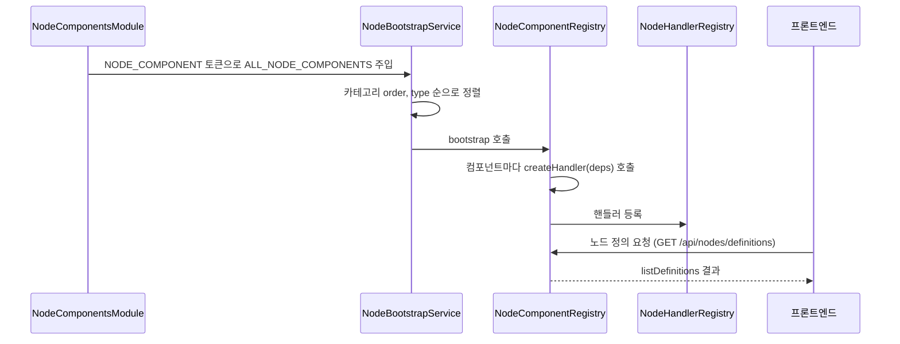

> 구현 상태: 부분 구현(플러그인·마켓플레이스와 파일 시스템 샌드박스 정책은 미구현) · 원문: `spec/4-nodes/0-overview.md`, `spec/4-nodes/_product-overview.md` (§1, §2, §10) · 용어: [용어 사전](../CLE-GLOSSARY.md)

## 개요

노드(node)는 워크플로우의 기본 구성 단위다. 노드마다 한 가지 기능을 맡고, 입력 포트로 데이터를 받아 처리한 뒤 출력 포트로 결과를 넘긴다. 노드는 일곱 노드 카테고리(node category)로 나뉜다. 트리거·Logic·Flow·AI·통합·Data·Presentation 이다.

이 문서는 노드 시스템의 뼈대를 정한다. 백엔드에서 노드 컴포넌트를 두는 구조와 부팅 때 등록하는 흐름, 프론트엔드에 노드 정의를 내려 주는 메타데이터 API, 노드 정의(node definition)와 포트 정의(`PortDef`) 속성, 캔버스 설정 요약 템플릿 문법, 전체 노드 카탈로그, 카테고리 색 구분, 계획 중인 커스텀 노드 인터페이스, 노드 실행 샌드박스를 다룬다.

이 문서가 다루지 않는 것은 다음과 같다.

- 핸들러가 돌려주는 노드 출력의 필드 규칙: [노드 출력 규약](CLE-NODE-OUTPUT.md)
- 노드가 실패했을 때의 정책: [노드 에러 처리 정책](CLE-NODE-ERROR.md)
- 엔진이 핸들러를 부르는 계약(검증 → 실행 → 출력 정규화, 레지스트리, 재시도): [노드 핸들러 계약](../CLE-EXEC/CLE-EXEC-HANDLER.md)
- 포트 색·설정 패널·자동 폼: [노드 포트와 설정 패널](../CLE-WF/CLE-WF-NODEPANEL.md)
- 캔버스에 요약과 경고를 그리는 방식: [워크플로우 에디터와 캔버스](../CLE-WF/CLE-WF-EDITOR.md)
- 마켓플레이스 화면 구상: [마켓플레이스 (구상)](../CLE-UI/CLE-UI-MARKET.md)
- 노드별 설정·포트·출력: 아래 [전체 노드 카탈로그](#전체-노드-카탈로그)에서 링크한 각 노드 문서

## 노드 공통 동작

모든 노드가 따르는 제품 요구는 다음과 같다.

| 원본 ID | 내용 | 우선순위 | 상태 |
| --- | --- | --- | --- |
| ND-CM-01 | 모든 노드는 입력 포트와 출력 포트를 하나 이상 둔다. 트리거 카테고리 노드는 입력 포트가 없고 워크플로우의 진입점이 된다. | 필수 | ✅ |
| ND-CM-02 | 사용자가 노드 이름(레이블)을 정할 수 있다. | 필수 | ✅ |
| ND-CM-03 | 노드를 활성·비활성으로 바꿀 수 있다. 비활성 노드는 실행에서 건너뛴다. | 필수 | ✅ |
| ND-CM-04 | 노드를 실행할 때 입력과 출력 데이터를 기록한다(디버깅용). | 필수 | ✅ |
| ND-CM-05 | 노드에서 에러가 나면 에러 처리 정책을 고를 수 있다(중단·건너뛰기·기본값·에러 포트 라우팅). 재시도를 포함한 다섯 정책은 [노드 에러 처리 정책](CLE-NODE-ERROR.md)이 정한다. | 필수 | ✅ |
| ND-CM-06 | 노드 설명·메모 필드가 있다. 저장 위치는 노드 메모(`config.notes`)다. | 권장 | ✅ |
| ND-CM-07 | 노드마다 고유 아이콘과 카테고리 색으로 구분한다. | 필수 | ✅ |

## 백엔드 노드 컴포넌트 구조

노드는 `codebase/backend/src/nodes/<category>/<type>/` 폴더에 컴포넌트 단위로 둔다. 한 노드의 구조 정의와 실행 로직을 한 폴더에 모은다.

### 폴더와 파일

`nodes/core/` 의 주요 파일은 다음과 같다.

| 파일 | 내용 |
| --- | --- |
| `node-component.interface.ts` | `NodeComponent` 타입, `Ports` 타입, `HandlerDependencies` |
| `node-component.registry.ts` | 모든 컴포넌트 부트스트랩, 메타데이터·JSON Schema 조회 |
| `node-handler.interface.ts` | `NodeHandler`, `ExecutionContext`, `NodeHandlerOutput` 등 실행 계약 |
| `node-handler.registry.ts` | 노드 유형 → 핸들러 인스턴스 매핑 저장소 |
| `workflow-executor.interface.ts` | 서브 워크플로우 실행을 위한 엔진과 노드 사이 계약 |
| `nested-value.util.ts` | 여러 노드가 함께 쓰는 경로 기반 getter·setter |
| `zod-validator.ts` | Zod 스키마를 `ValidationResult` 로 바꾸는 어댑터 |
| `index.ts` | core 공개 API 재수출 |

`core/` 에는 이 밖에도 `categories.ts`(카테고리 메타데이터 단일 기준, [카테고리](#카테고리)), `port-id.util.ts`(동적 포트 slug 검증·해석, [포트 정의 (PortDef)](#포트-정의-portdef)), `button-slug.util.ts`, `node-type-metadata.ts`, `node-types.constants.ts`, `metadata-validation.ts`, `truncate-output.util.ts`, `condition-evaluator.util.ts`, `dry-run.util.ts`, `error-codes.ts`, `graph-warning-rule.ts` 가 있다.

노드 한 개의 폴더(`nodes/<category>/<type>/`)는 다음 파일로 이뤄진다.

| 파일 | 내용 |
| --- | --- |
| `<type>.schema.ts` | 노드 구조(입력·출력·설정)를 Zod 로 선언한다. `NodeComponentMetadata`, `NodePorts`, `defaultConfig` 도 이 파일에서 내보낸다. Zod 스키마는 런타임 검증과 JSON Schema 직렬화의 단일 기준이다. |
| `<type>.component.ts` | 스키마·메타데이터와 핸들러 팩토리를 묶은 `NodeComponent` 객체. `createHandler(deps)` 가 LLM·RAG·통합·`WorkflowExecutor` 같은 의존성을 받아 `NodeHandler` 인스턴스를 만든다. |
| `<type>.handler.ts` | 노드 실행 로직(`NodeHandler.execute`) |
| `<type>.handler.spec.ts` | 핸들러 테스트 |
| `index.ts` | 노드 공개 API |

그 밖의 규칙은 다음과 같다.

1. 카테고리 폴더마다 `index.ts` 가 `<CATEGORY>_COMPONENTS` 배열을 내보낸다. 노드를 추가하는 단위는 카테고리 안에서 끝난다.
2. `nodes/node-components.module.ts` 가 `NODE_COMPONENT` DI 토큰에 빌트인 카탈로그를 묶는다. 부팅 등록의 진입점이다.
3. `nodes/index.ts` 는 카테고리 배열을 펼쳐 `ALL_NODE_COMPONENTS`·`ALL_NODE_TYPES` 를 만든다. 정적으로 소비하는 곳이 쓴다.
4. 카테고리 안에서만 쓰는 유틸·베이스 클래스는 `<category>/_shared/`, `<category>/_base/`, `<category>/shared/` 에 둔다. 예: `integration/_base/integration-handler-base.ts`, `logic/_shared/condition-eval.util.ts`, `presentation/_shared/button.types.ts`, `ai/shared/system-context-prefix.ts`. 폴더 이름 앞의 `_` 유무는 카테고리마다 섞여 있다.
5. `execution-engine` 모듈은 오케스트레이션(그래프 탐색, 표현식 해석, 상태 머신, 큐)만 맡는다. 개별 노드의 실행 로직은 넣지 않는다.

### 부팅 등록

서버가 뜰 때 노드 카탈로그를 등록하는 순서는 다음과 같다.



1. `NodeBootstrapService.onModuleInit` 이 DI 로 받은 빌트인 노드 카탈로그(`NodeComponentsModule` 이 `NODE_COMPONENT` 토큰에 묶은 `ALL_NODE_COMPONENTS`)를 `(카테고리 order, type)` 순으로 정렬한다. 정렬은 결정적이다.
2. 정렬한 목록으로 `NodeComponentRegistry.bootstrap(...)` 을 부른다.
3. `NodeComponentRegistry` 는 컴포넌트마다 `createHandler(deps)` 를 불러 `NodeHandlerRegistry` 에 등록한다.
4. `NodeComponentRegistry` 는 `listDefinitions()` 로 메타데이터·포트·JSON Schema 를 프론트엔드에 내려 준다.
5. 런타임 플러그인·마켓플레이스 로딩 경로는 없다([커스텀 노드 인터페이스](#커스텀-노드-인터페이스-미구현)).

### 메타데이터 API

`GET /api/nodes/definitions` 는 `{ definitions, categories }` 객체를 돌려준다. 프론트엔드는 이 응답으로 노드 팔레트, 설정 폼, 포트 카탈로그를 만든다.

1. `definitions` 는 등록된 모든 노드의 `{ metadata, ports, configSchema, defaultConfig, inputSchema?, outputSchema?, extras? }` 배열이다.
2. 스키마는 Zod v4 의 `z.toJSONSchema()` 로 직렬화한 JSON Schema 다.
3. `extras?` 는 컴포넌트별 부가 데이터다. 지금은 Cafe24 노드와 MakeShop 노드가 노드 에디터 드롭다운용 operation 카탈로그를 내려 주는 데 쓴다. 형식은 [Cafe24 operation 메타데이터](CLE-C24-META)와 [MakeShop operation 메타데이터](CLE-MKS-META)가 정한다.
4. `metadata` 를 직렬화할 때 백엔드 전용 `validateConfig` 함수는 뺀다. 프론트엔드는 캔버스 경고 배지용 선언형 `warningRules` 만 받는다.
5. `categories` 는 `{ id, label, icon, color, order }[]` 형태의 카테고리 메타데이터 배열이다. 팔레트 섹션 머리(레이블, 점 색, 아이콘)를 그리는 단일 기준이다.

## 노드 정의

### 노드 구성

모든 노드는 아래 세 부분으로 이뤄진다.

| 부분 | 들어가는 것 |
| --- | --- |
| 노드 정의(Definition) | `type`, `category`(`trigger`·`logic`·`flow`·`ai`·`integration`·`data`·`presentation`), `icon`, `color`, `inputPorts: PortDef[]`, `outputPorts: PortDef[]`, `configSchema: JSONSchema` |
| 노드 설정(Config, JSONB) | 노드 유형별 설정 데이터 |
| 실행 로직 | `execute(input) → output`, `validate(config) → errors`. 실제 계약은 [실행 인터페이스](#실행-인터페이스)에 있다. |

### 노드 정의 속성

| 속성 | 타입 | 설명 |
| --- | --- | --- |
| `type` | String | 고유 식별자(예: `if_else`, `ai_agent`). 노드 유형이라고 부른다. |
| `category` | Enum | `trigger` / `logic` / `flow` / `ai` / `integration` / `data` / `presentation` |
| `displayName` | String | 화면 표시 이름 |
| `description` | String | 노드 설명 |
| `icon` | String | 아이콘 식별자 |
| `color` | String | 카테고리 색 코드 |
| `inputPorts` | PortDef[] | 입력 포트 정의 |
| `outputPorts` | PortDef[] | 출력 포트 정의(동적 여부 포함) |
| `configSchema` | JSONSchema | 설정 폼 스키마 |
| `defaultConfig` | Object | 설정 기본값 |
| `summaryTemplate` | String | 캔버스에 보이는 설정 요약 한 줄을 만드는 규칙. [캔버스 설정 요약](#캔버스-설정-요약-summarytemplate) 참조 |

### 포트 정의 (PortDef)

| 속성 | 타입 | 설명 |
| --- | --- | --- |
| `id` | String | 포트 ID(예: `in`, `true`, `approve`) |
| `label` | String | 화면 표시 이름 |
| `type` | Enum | `data` / `control` / `error`. 이름이 문서마다 갈린다. [미결 사항](#미결-사항) 참조. |
| `dynamic` | Boolean | 동적으로 추가·제거할 수 있는지 |
| `required` | Boolean | 연결이 필수인지 |

포트 ID 규칙은 다음과 같다.

1. 정적 포트는 노드 정의에 고정 문자열로 둔다(`in`, `out`, `true`, `false`, `body`, `done` 등).
2. 동적 포트는 설정 항목(Switch 케이스, 분류 카테고리, AI 에이전트 조건, Presentation 버튼 등)이 가진 고정 ID 를 포트 ID 로 쓴다. 형식은 `^[a-zA-Z0-9_-]{1,64}$` 다.
3. 형식을 벗어나면 인덱스 기반 fallback(`case_0`, `branch_1` 등)으로 떨어진다.
4. 포트 이름을 바꾸거나, 순서를 바꾸거나, 다른 포트를 지워도 기존 ID 는 바뀌지 않는다. 그래서 포트에 이어진 연결선이 편집 뒤에도 남는다.
5. 검증과 해석의 단일 기준은 백엔드 `nodes/core/port-id.util.ts`(`resolveStablePortId`)와 프론트엔드 `lib/node-definitions/resolve-dynamic-ports.ts` 다. 둘은 함께 바꾼다.
6. ID 를 만드는 곳은 노드마다 다르다. Switch 케이스는 사용자가 입력한 의미 있는 slug(`approve`)를 쓴다. AI 에이전트 조건(`ConditionDef`)과 Presentation 버튼(`ButtonDef`)은 프론트엔드 `crypto.randomUUID()` 가 발급한 UUID v4 를 쓴다. UUID v4 도 위 형식을 통과하므로 유효한 포트 ID 다. Parallel 노드의 병렬 분기 포트는 설정 항목의 ID 대신 인덱스 ID(`branch_<index>`)를 쓴다. `branchCount` 를 바꿔도 기존 인덱스의 포트 ID 는 그대로다([Parallel 노드](../CLE-NODE-LOGIC/CLE-NODE-PARALLEL.md)).
7. 포트 ID 는 형식만 맞으면 만든 곳(의미 있는 slug, UUID v4)을 가리지 않는다. 근거는 [Rationale](#rationale)에 있다.

노드별 포트 구성의 기준은 각 노드 문서의 포트 절이다. 포트 색과 연결 규칙은 [노드 포트와 설정 패널](../CLE-WF/CLE-WF-NODEPANEL.md)과 [연결선](../CLE-WF/CLE-WF-EDGE.md)이 정한다.

### 캔버스 설정 요약 (summaryTemplate)

캔버스에서 노드 설정 내용을 한 줄로 보여 주는 규칙이다. 노드 유형마다 `summaryTemplate` 을 정의한다. 노드별 요약 형식은 각 노드 문서의 설정 요약 절이 정한다.

| 항목 | 규칙 |
| --- | --- |
| 표시 위치 | 노드 본체 세 번째 줄(아이콘·유형 이름, 사용자 레이블 아래). 컨테이너는 머리 막대 오른쪽 |
| 최대 길이 | 렌더링한 한 줄 전체가 40자를 넘으면 말줄임표로 자른다. 마우스를 올리면 전체를 툴팁으로 보인다. |
| 줌 | 줌 50% 미만에서 숨긴다. |
| 미설정 표시 | 필수 설정이 비었을 때의 경고는 [워크플로우 에디터와 캔버스](../CLE-WF/CLE-WF-EDITOR.md)가 정한 방식(머리의 경고 아이콘과 툴팁의 구체 누락 항목)으로 보인다. |
| 갱신 | 노드 설정이 store 에 반영되면 바로 갱신한다. 자세한 시점은 [워크플로우 에디터와 캔버스](../CLE-WF/CLE-WF-EDITOR.md)에 있다. |

#### 템플릿 문법

`summaryTemplate` 은 설정 경로 보간과 파이프 필터를 지원한다. 문법은 `{{ path | filter:arg | filter2 }}` 다. 해석의 단일 기준은 `codebase/packages/node-summary/src/evaluator.ts`(`renderSummaryTemplate`)다.

1. 경로는 설정 기준 상대 경로다. `config` 자체가 해석 루트이므로 `{{ mode }}` 로 쓴다. `{{ config.mode }}` 로 쓰면 값이 없어 빈 문자열이 나온다.
2. 필터는 왼쪽부터 차례로 적용한다.
   - `upper`: 대문자로 바꾼다. 예: `{{ method | upper }}`
   - `lower`: 소문자로 바꾼다. 예: `{{ method | lower }}`
   - `default:LIT`: 값이 비어 있으면 리터럴 문자열을 낸다. 예: `{{ mode | default:sync }}`
   - `fallback:path`: 값이 비어 있으면 다른 설정 경로의 값을 쓴다. 예: `{{ workflowName | fallback:workflowId }}`
3. `default:` 는 리터럴 문자열을, `fallback:` 은 다른 설정 경로를 인수로 받는다.
4. 길이(글자 수, 항목 수)는 파이프 필터가 아니라 경로 끝의 `.length` 로 나타낸다. 배열이나 문자열 위에서 `{{ to.length }}` 처럼 쓰면 길이 숫자가 나온다. 예: `{{ to.length }} recipients · {{ subject }}`

## 전체 노드 카탈로그

입출력 포트 구성, 설정 필드, 출력 형태의 기준은 각 노드 문서다. 표의 "캔버스 표시 이름" 은 팔레트와 캔버스에 보이는 이름이다.

### 트리거 (1종)

카테고리 공통 규약: [트리거 노드 공통](../CLE-NODE-TRIG/CLE-NODE-TRIG-COMMON.md)

| 유형 | 캔버스 표시 이름 | 아이콘 | 문서 | 주요 설정 |
| --- | --- | --- | --- | --- |
| `manual_trigger` | Manual Trigger | ⚡ | [수동 트리거 노드](../CLE-NODE-TRIG/CLE-NODE-MANUAL.md) | `parameters`(트리거 파라미터 스키마) |

### Logic (12종)

카테고리 공통 규약: [Logic 노드 공통](../CLE-NODE-LOGIC/CLE-NODE-LOGIC-COMMON.md)

| 유형 | 캔버스 표시 이름 | 아이콘 | 문서 | 주요 설정 | 비고 |
| --- | --- | --- | --- | --- | --- |
| `if_else` | If/Else | 🔀 | [If/Else 노드](../CLE-NODE-LOGIC/CLE-NODE-IFELSE.md) | 조건식 | |
| `switch` | Switch | 🔀 | [Switch 노드](../CLE-NODE-LOGIC/CLE-NODE-SWITCH.md) | 케이스 목록 | 동적 출력 포트 |
| `loop` | Loop | 🔄 | [Loop 노드](../CLE-NODE-LOGIC/CLE-NODE-LOOP.md) | 반복 횟수, Break 조건 | 컨테이너 |
| `variable_declaration` | Variable | 📝 | [변수 선언 노드](../CLE-NODE-LOGIC/CLE-NODE-VARDECL.md) | 변수 이름, 타입, 초기값 | |
| `variable_modification` | Set Variable | ✏️ | [변수 수정 노드](../CLE-NODE-LOGIC/CLE-NODE-VARSET.md) | 대상 변수, 새 값 | |
| `split` | Split | ✂️ | [Split 노드](../CLE-NODE-LOGIC/CLE-NODE-SPLIT.md) | 나눌 대상 필드 | |
| `map` | Map | 🗺️ | [Map 노드](../CLE-NODE-LOGIC/CLE-NODE-MAP.md) | 변환 대상 배열, 항목 에러 정책 | 컨테이너 |
| `filter` | Filter | 🔽 | [Filter 노드](../CLE-NODE-LOGIC/CLE-NODE-FILTER.md) | 대상 배열, 필터 조건 | |
| `foreach` | ForEach | 🔁 | [ForEach 노드](../CLE-NODE-LOGIC/CLE-NODE-FOREACH.md) | 대상 배열, 항목 에러 정책 | 컨테이너 |
| `parallel` | Parallel | ⚡ | [Parallel 노드](../CLE-NODE-LOGIC/CLE-NODE-PARALLEL.md) | 분기 수 | 엔진 덮어쓰기 대상, 동적 분기 포트 |
| `merge` | Merge | 🔗 | [Merge 노드](../CLE-NODE-LOGIC/CLE-NODE-MERGE.md) | 병합 전략 | |
| `background` | Background | 🌙 | [Background 노드](../CLE-NODE-LOGIC/CLE-NODE-BACKGROUND.md) | 알림 설정 | 컨테이너가 아니다. 본문을 `background` 포트 연결선으로 식별한다. |

### Flow (1종)

카테고리 공통 규약: [Flow 노드 공통](../CLE-NODE-FLOW/CLE-NODE-FLOW-COMMON.md)

| 유형 | 캔버스 표시 이름 | 아이콘 | 문서 | 주요 설정 |
| --- | --- | --- | --- | --- |
| `workflow` | Workflow | 📂 | [워크플로우 호출 노드](../CLE-NODE-FLOW/CLE-NODE-SUBWF.md) | 대상 워크플로우, 입력 매핑, 동기·비동기 |

### AI (3종)

카테고리 공통 규약: [AI 노드 공통](../CLE-NODE-AI/CLE-NODE-AI-COMMON.md)

| 유형 | 캔버스 표시 이름 | 아이콘 | 문서 | 주요 설정 |
| --- | --- | --- | --- | --- |
| `ai_agent` | AI Agent | 🤖 | [AI 에이전트 노드](../CLE-NODE-AI/CLE-NODE-AGENT.md) | 모드, 프롬프트, 모델, 지식 저장소, MCP 서버, 조건 |
| `text_classifier` | Text Classifier | 🏷️ | [텍스트 분류기 노드](../CLE-NODE-AI/CLE-NODE-CLASSIFIER.md) | 카테고리 목록, 모델 |
| `information_extractor` | Info Extractor | 🔍 | [정보 추출기 노드](../CLE-NODE-AI/CLE-NODE-EXTRACTOR.md) | 출력 스키마, 모델 |

### 통합 (5종)

카테고리 공통 규약: [통합 노드 공통](../CLE-NODE-INT/CLE-NODE-INT-COMMON.md)

| 유형 | 캔버스 표시 이름 | 아이콘 | 문서 | 주요 설정 |
| --- | --- | --- | --- | --- |
| `http_request` | HTTP Request | 🌐 | [HTTP Request 노드](../CLE-NODE-INT/CLE-NODE-HTTP.md) | method, url, headers, body, responseType |
| `database_query` | Database Query | 🗄️ | [Database Query 노드](../CLE-NODE-INT/CLE-NODE-DBQUERY.md) | integrationId, query, parameters, queryType |
| `send_email` | Send Email | 📧 | [Send Email 노드](../CLE-NODE-INT/CLE-NODE-EMAIL.md) | integrationId, to, subject, body, bodyType |
| `cafe24` | Cafe24 | 🛍️ | [Cafe24 노드](../CLE-NODE-INT/CLE-NODE-CAFE24.md) | integrationId, resource, operation, fields, pagination |
| `makeshop` | MakeShop | 🛒 | [MakeShop 노드](../CLE-NODE-INT/CLE-NODE-MAKESHOP.md) | integrationId, resource, operation, fields, pagination |

### Data (2종)

카테고리 공통 규약: [Data 노드 공통](../CLE-NODE-DATA/CLE-NODE-DATA-COMMON.md)

| 유형 | 캔버스 표시 이름 | 아이콘 | 문서 | 주요 설정 |
| --- | --- | --- | --- | --- |
| `transform` | Transform | 🔄 | [Transform 노드](../CLE-NODE-DATA/CLE-NODE-TRANSFORM.md) | operations(변환 연산 체인) |
| `code` | Code | 💻 | [Code 노드](../CLE-NODE-DATA/CLE-NODE-CODE.md) | language, code |

### Presentation (5종)

카테고리 공통 규약: [Presentation 노드 공통](../CLE-NODE-PRES/CLE-NODE-PRES-COMMON.md)

| 유형 | 캔버스 표시 이름 | 아이콘 | 문서 | 주요 설정 |
| --- | --- | --- | --- | --- |
| `carousel` | Carousel | 🎠 | [Carousel 노드](../CLE-NODE-PRES/CLE-NODE-CAROUSEL.md) | titleField, descriptionField, imageField, layout, buttons |
| `table` | Table | 📋 | [Table 노드](../CLE-NODE-PRES/CLE-NODE-TABLE.md) | columns, pagination, pageSize, sortBy, buttons |
| `chart` | Chart | 📊 | [Chart 노드](../CLE-NODE-PRES/CLE-NODE-CHART.md) | chartType, dataField, xAxis, yAxis, groupBy, buttons |
| `form` | Form | 📝 | [Form 노드](../CLE-NODE-PRES/CLE-NODE-FORM.md) | fields, title, submitLabel |
| `template` | Template | 📄 | [Template 노드](../CLE-NODE-PRES/CLE-NODE-TEMPLATE.md) | template, outputFormat, helpers, buttons |

## 카테고리

| 카테고리 | 색 | 용도 |
| --- | --- | --- |
| 트리거(`trigger`) | `#F59E0B`(앰버) | 워크플로우 시작점 |
| Logic(`logic`) | `#3B82F6`(파랑) | 데이터 흐름 제어, 변수 관리 |
| Flow(`flow`) | `#8B5CF6`(보라) | 워크플로우 사이 연결 |
| AI(`ai`) | `#10B981`(초록) | AI·LLM 기반 처리 |
| 통합(`integration`) | `#F97316`(주황) | 외부 서비스 연결 |
| Data(`data`) | `#06B6D4`(시안) | 데이터 변환, 코드 실행 |
| Presentation(`presentation`) | `#EC4899`(분홍) | 시각 콘텐츠 생성, 사용자 입력 |

1. 구현된 `NodeCategory` enum 은 위 일곱 값뿐이다.
2. 같은 메타데이터(label, color, icon, order)는 `nodes/core/categories.ts` 의 `NODE_CATEGORIES` 가 단일 기준으로 가진다.
3. 마켓플레이스로 설치하는 노드의 `custom` 카테고리는 미구현이다. enum 에 없다.

## 커스텀 노드 인터페이스 (미구현)

마켓플레이스로 커스텀 노드를 개발하게 하려는 표준 인터페이스 계획이다. 플러그인 패키지, `manifest.json`, 동적 노드 로딩은 아직 구현하지 않았다. 지금 노드는 모두 빌트인이고, `NodeComponentsModule` 이 `NODE_COMPONENT` DI 토큰에 묶은 카탈로그(`nodes/<category>/index.ts` 의 카테고리 배열 합성)를 부팅 때 등록한다. 런타임 플러그인·마켓플레이스 로딩 경로는 없다. 워크스페이스별 동적 노드 등록도 미구현이다. 다만 [실행 인터페이스](#실행-인터페이스)는 빌트인 노드에 이미 적용한 현행 계약이다.

| 원본 ID | 요구 | 우선순위 | 상태 |
| --- | --- | --- | --- |
| ND-EX-01 | 마켓플레이스로 커스텀 노드를 설치한다. | 필수 | `3`(원문 표기), 미구현 |
| ND-EX-02 | 커스텀 노드(플러그인) 표준 인터페이스를 정의한다. | 필수 | `3`(원문 표기), 미구현 |
| ND-EX-03 | 개발자가 커스텀 노드를 만들고 게시할 수 있는 SDK 나 가이드를 제공한다. | 필수 | `3`(원문 표기), 미구현 |

### 플러그인 패키지 구조 (계획)

| 파일 | 내용 |
| --- | --- |
| `manifest.json` | 노드 메타데이터 |
| `config-schema.json` | 설정 폼 JSON Schema |
| `icon.svg` | 노드 아이콘 |
| `executor.js` | 서버 쪽 실행 로직 |
| `settings-ui.js` | 커스텀 설정 UI(선택) |

`manifest.json` 예시는 다음과 같다.

```json
{
  "type": "my_custom_node",
  "category": "custom",
  "displayName": "My Custom Node",
  "description": "Does something custom",
  "version": "1.0.0",
  "author": "developer@example.com",
  "inputPorts": [{ "id": "in", "label": "Input" }],
  "outputPorts": [{ "id": "out", "label": "Output" }],
  "dependencies": []
}
```

### 실행 인터페이스

빌트인 노드와 커스텀 노드는 같은 핸들러 인터페이스를 쓴다. 검증 → 실행 → 출력 정규화 순서, 레지스트리, 재시도 같은 상세 계약은 [노드 핸들러 계약](../CLE-EXEC/CLE-EXEC-HANDLER.md)이 정한다.

```
execute(input, config, context) → NodeHandlerOutput
```

| 파라미터 | 설명 |
| --- | --- |
| `input` | 앞 노드에서 받은 입력 데이터 |
| `config` | 노드 설정 패널에서 정한 설정 값. 표현식을 평가한 뒤의 값이다. |
| `context` | 실행 컨텍스트. 변수, 실행 ID, 통합 접근, 원본 설정(`rawConfig`, 설정 에코용) 등을 담는다. 자세한 구조는 [실행 컨텍스트](../CLE-EXEC/CLE-EXEC-CONTEXT.md)에 있다. |
| 반환값 | 노드 출력(`NodeHandlerOutput`). 다섯 필드 규칙은 [노드 출력 규약](CLE-NODE-OUTPUT.md)이 정한다. |

## 노드 실행 샌드박스

샌드박스는 지금 Code 노드(임의 JavaScript 실행)에만 적용한다. 다른 노드는 프로세스 안 핸들러로 실행하고 메모리·파일 시스템 격리를 따로 두지 않는다. Code 노드의 격리 방식, 제한 값, 허용·차단 API 목록은 [Code 노드](../CLE-NODE-DATA/CLE-NODE-CODE.md)가 정한다.

| 항목 | 내용 | 구현 상태 |
| --- | --- | --- |
| 실행 격리 | Code 노드는 `isolated-vm`(V8 Isolate)의 별도 realm 에서 호스트와 분리해 실행한다. 호스트 전역(`process`, `require`, `Buffer` 등)이 isolate 안에 없어서 prototype 체인 탈출을 구조적으로 막는다. 위험한 내장은 부트스트랩에서 지운다. | 구현됨(Code 노드) |
| 타임아웃 | Code 노드 실행 시간 제한(기본 30초, 설정 가능). 서브 워크플로우 호출은 따로 기본 300초 타임아웃이 있다(`execution-engine.service.ts`). | 구현됨(Code 노드, 서브 워크플로우) |
| 네트워크 접근 | Code 노드 샌드박스에는 `fetch`, `http` 같은 네트워크 API 를 두지 않는다. 외부 호출은 통합 노드로만 한다. | 구현됨(Code 노드) |
| 메모리 제한 | Code 노드는 isolate `memoryLimit` 하드 리밋을 건다(기본 128MB, `CODE_NODE_MEMORY_LIMIT_MB` 로 조정, 안전 상한 512MB). 넘으면 isolate 가 실행을 멈추고 `CODE_MEMORY_LIMIT` 로 `error` 포트에 보낸다. 다른 노드에는 노드별 메모리 제한이 없다. | 구현됨(Code 노드) |
| 파일 시스템 | 읽기 전용(임시 디렉터리만 쓰기 가능). Code 샌드박스는 `fs`, `require` 를 두지 않지만 명시적인 파일 시스템 정책은 없다. | 미구현 |

## 미결 사항

- **포트 종류 이름 `control` 과 `system`**: 이 문서의 `PortDef.type` 은 `data`·`control`·`error` 이고 백엔드 `NodePortKind` 도 `control` 을 쓴다. [노드 포트와 설정 패널](../CLE-WF/CLE-WF-NODEPANEL.md)과 [연결선](../CLE-WF/CLE-WF-EDGE.md)은 같은 포트를 "시스템 포트" 로 부르고, 프론트엔드 동적 포트(`resolve-dynamic-ports.ts`)와 색 처리(`custom-node.tsx`)는 `system` 을 쓴다. 프론트엔드 타입은 `system` 과 `control` 을 모두 허용한다. [정보 추출기 노드](../CLE-NODE-AI/CLE-NODE-EXTRACTOR.md) 포트 표는 `system` 을, [AI 에이전트 노드](../CLE-NODE-AI/CLE-NODE-AGENT.md) 포트 표는 같은 시스템 포트와 에러 포트를 `data` 로 적는다. [텍스트 분류기 노드](../CLE-NODE-AI/CLE-NODE-CLASSIFIER.md)는 에러 포트를 `error` 로 적는다. [Code 노드](../CLE-NODE-DATA/CLE-NODE-CODE.md)는 `error` 포트를 스펙과 스키마(`code.schema.ts`) 모두 `data` 로 선언한다. 같은 결정이 [노드 포트와 설정 패널 미결 사항](../CLE-WF/CLE-WF-NODEPANEL.md#미결-사항)에도 올라 있다. 결정 필요: 이름을 하나로 정하고 enum 과 노드 문서 포트 표를 맞출지. 결정이 나면 이 문서의 `PortDef.type` 표가 기준이 된다.

## 구현 위치

- `codebase/backend/src/nodes/core/**`: 노드 컴포넌트·핸들러 계약, 레지스트리, 카테고리, 포트 ID 유틸
- `codebase/backend/src/nodes/index.ts`: `ALL_NODE_COMPONENTS`, `ALL_NODE_TYPES`
- `codebase/frontend/src/lib/api/node-definitions.ts`: 노드 정의 API 클라이언트
- `codebase/frontend/src/lib/stores/node-definitions-store.ts`: 노드 정의 store

## Rationale

### 동적 포트 ID 모델: 형식 검증 하나, 생성 방식 여럿

동적 포트 ID 는 `^[a-zA-Z0-9_-]{1,64}$` 형식을 만족하는 고정 문자열이다. 검증과 해석은 한 곳(`port-id.util.ts` 의 `resolveStablePortId`)에서 한다. 형식이 맞으면 그대로 쓰고, 아니면 인덱스 fallback(`case_0`)을 쓴다. 생성 방식은 노드마다 다르다. Switch 케이스는 사용자가 고칠 수 있는 의미 있는 ID(`approve`)이고 스키마가 `^[a-zA-Z0-9_-]+$` 를 강제한다. AI 에이전트 조건과 Presentation 버튼은 프론트엔드 `crypto.randomUUID()` 로 자동 발급한다. UUID v4 문자열도 형식을 통과하므로 별도 모델이 아니라 같은 ID 공간의 다른 생성 방식이다.

이렇게 한 이유는 세 가지다.

1. 연결선 보존. ID 가 설정 항목과 1:1 로 묶이고 바뀌지 않아서 포트 이름 변경·순서 변경·삭제 뒤에도 연결선이 남는다.
2. 검증 통일. 생성 방식과 관계없이 형식 검증 하나로 라우팅 키 주입을 막는다.
3. 직렬화 안정성. 워크플로우 JSON 내보내기·가져오기와 다시 불러오기의 결과가 결정적이다.

2026-06-20 에 옛 서술 "UUID v4 는 사용하지 않는다" 를 바로잡았다. UUID v4 는 조건과 버튼의 현행 생성 방식이고 형식 검증도 통과한다. 옛 서술은 같은 절에서 Presentation 버튼을 slug 예시로 들면서 UUID 라고도 적어 스스로 모순이었다. 이때 노드 문서 여러 곳의 서술을 이 모델 하나로 맞췄다. AI 에이전트의 LLM 도구 이름(`cond_` 접두사와 정리한 UUID)과 `meta.backgroundRunId`(실행 식별자)는 포트 ID 가 아니라서 이 규칙과 관계없다. 이 모순은 노드 등록 DI 리팩터링(M-5) 중 사전 검토가 찾아낸 문서 문제였고, 코드는 이미 이 모델대로였다.

### 노드 카탈로그를 DI 토큰으로 주입받는다

노드 카탈로그를 정적 `import` 가 아니라 `NODE_COMPONENT` DI 토큰으로 받는 것은 구현 재량이다. 노드를 추가할 때 중앙 파일을 고치지 않게 하고, 나중에 동적 등록을 끼울 자리를 열어 두려는 것이다. 런타임 플러그인·마켓플레이스 로딩 경로는 여전히 없다.
