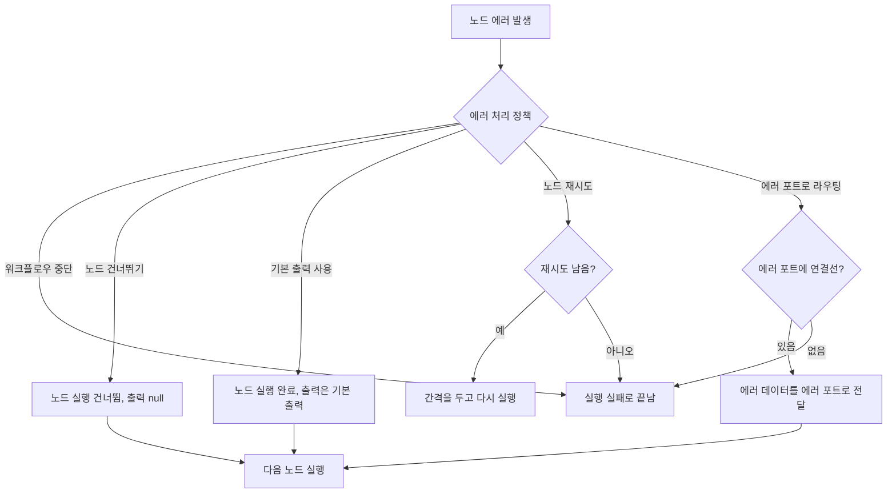

> 구현 상태: 부분 구현(재시도 간격 상한·워크플로우 수준 자동 재시도는 미구현) · 원문: `spec/5-system/3-error-handling.md` (§3, §4) · 용어: [용어 사전](../CLE-GLOSSARY.md)

## 개요

이 문서는 노드가 실패했을 때 엔진이 어떻게 동작하는지 정한다. 노드마다 고르는 에러 처리 정책(Error Handling, `config.errorHandling.policy`) 다섯 가지의 실행 동작, 에러 포트로 보내는 출력 형태, 노드 재시도(`retryConfig`) 설정, 그리고 워크플로우 수준 자동 재시도를 다룬다.

설정 이름이 비슷한 두 층을 구분한다.

| 설정 | 키 | 쓰는 노드 | 다루는 것 |
| --- | --- | --- | --- |
| 에러 처리 정책 | `config.errorHandling = { policy, retryConfig?, defaultOutput? }` | 모든 노드 | 노드 자체가 실패했을 때의 동작. 이 문서가 정한다. |
| 항목 에러 정책(item error policy) | `config.errorPolicy` | ForEach·Map(`stop`, `skip`, `continue`), Parallel(`stop`, `continue`, `cancel-others-on-fail`) | 반복 항목이나 병렬 분기 하나가 실패했을 때의 동작. [Logic 노드 공통](../CLE-NODE-LOGIC/CLE-NODE-LOGIC-COMMON.md)이 정한다. |

두 설정은 서로 다른 층이다. 한 노드에서 두 키를 같은 뜻으로 섞어 쓰지 않는다. ForEach·Map·Parallel 에는 두 키가 함께 있을 수 있다. Logic 노드 일반에 에러 처리 정책을 허용할지는 [Logic 노드 공통의 미결 사항](../CLE-NODE-LOGIC/CLE-NODE-LOGIC-COMMON.md#미결-사항)이 정한다. 아래는 현재 구현의 동작이다.

1. ForEach·Map·Parallel 노드의 `config.errorHandling` 은 그 노드의 핸들러 호출이 실패할 때 적용한다.
2. 본문 노드나 병렬 분기 안의 노드가 실패하면 그 노드 자신의 `config.errorHandling` 을 먼저 적용한다.
3. 그 결과 반복 항목이나 병렬 분기 하나가 실패하면 ForEach·Map·Parallel 노드의 `config.errorPolicy` 를 적용한다.
4. 반복 회차나 병렬 분기를 실행하는 단계에서 ForEach·Map·Parallel 노드 자신이 실패해도 그 노드의 `config.errorHandling` 은 적용하지 않는다. `config.errorPolicy` 가 `stop` 이라 노드가 실패한 경우와 `CONTAINER_MISSING_EMIT` 으로 실패한 경우가 여기에 든다.
5. Parallel 은 `config.errorPolicy` 가 비었을 때만 `config.errorHandling.policy` 를 읽어 항목 에러 정책 값으로 바꿔 쓴다. 대응 규칙은 [Parallel 노드](../CLE-NODE-LOGIC/CLE-NODE-PARALLEL.md)가 정한다. 이 예외를 둔 이유는 [두 키가 함께 있는 이유](#두-키가-함께-있는-이유)에 있다.

레거시 평면 키 `config.errorPolicy` 의 단축값(`stop`, `skip`, `default_output`, `retry`, `error_port`)은 ForEach·Map·Parallel 이 아닌 노드에서만 에러 처리 정책으로 옮긴다. 설정 패널은 `config.errorHandling.policy` 가 없는 노드를 불러올 때 이 값을 대응하는 `policy`(`stop_workflow`, `skip_node`, `use_default_output`, `retry`, `route_to_error_port`)로 읽는다. 저장할 때는 `config.errorPolicy` 를 지운다. ForEach·Map·Parallel 에서는 이 키가 현행 항목 에러 정책이다. 그래서 설정 패널은 이 세 노드의 `config.errorPolicy` 를 에러 처리 정책으로 옮기지 않고 저장할 때 지우지도 않는다. 결정 근거는 [레거시 평면 키 이전 범위를 좁힌 이유](#레거시-평면-키-이전-범위를-좁힌-이유)에 있다.

이 문서가 다루지 않는 것은 다음과 같다.

- 설정 패널의 정책 선택 화면, 기본 출력 입력 UI, 저장 형태: [노드 포트와 설정 패널](../CLE-WF/CLE-WF-NODEPANEL.md)
- 노드 출력 안의 `output.error` 표준 형태, 사전 검증 에러와 런타임 에러의 분류, 고정 에러 포트가 있는 노드 목록: [노드 출력 규약 Principle 3](CLE-NODE-OUTPUT.md#principle-3-에러-계약)
- 에러 코드 전체 카탈로그와 명명 규칙: [에러 코드 규약과 카탈로그](../CLE-API/CLE-API-ERRCODES.md)
- 노드 실행 실패를 REST 로 감싸는 실행 에러 응답 형식: [에러 응답과 클라이언트 처리](../CLE-API/CLE-API-ERROR.md)
- 엔진이 핸들러를 부르고 재시도하는 구현 계약: [노드 핸들러 계약](../CLE-EXEC/CLE-EXEC-HANDLER.md)
- 노드 취소(`AbortError`, `ExecutionCancelledError`)의 기록과 전파: [노드 취소](../CLE-EXEC/CLE-EXEC-CANCEL.md)

## 규칙

### 1. 에러 처리 정책 다섯 가지

노드 설정에서 아래 다섯 정책 가운데 하나를 고른다. 화면 라벨은 "오류 처리" 다.

| enum | 화면 라벨 | 본문 표기 |
| --- | --- | --- |
| `stop_workflow` | 워크플로우 중단 | 워크플로우 중단(기본) |
| `skip_node` | 노드 건너뛰기 | 노드 건너뛰기 |
| `use_default_output` | 기본 출력 사용 | 기본 출력 사용 |
| `retry` | 재시도 | 노드 재시도 |
| `route_to_error_port` | 에러 포트로 라우팅 | 에러 포트로 라우팅 |

노드에서 에러가 나면 엔진은 정책에 따라 다르게 진행한다.



1. 워크플로우 중단(`stop_workflow`)이 기본이다.
   - 실행 상태(`Execution.status`)를 `failed` 로 바꾼다.
   - 에러가 난 노드를 캔버스에 강조한다.
   - 뒤의 노드는 실행하지 않는다.
2. 노드 건너뛰기(`skip_node`)
   - 노드 실행 상태(`NodeExecution.status`)를 `skipped` 로 둔다.
   - 에러 정보는 `NodeExecution.error = { message: "..." }` 에 남긴다.
   - 출력은 `null` 이다. 다음 노드는 `null` 입력으로 실행한다.
3. 기본 출력 사용(`use_default_output`)
   - 노드 실행 상태를 `completed` 로 둔다. 경고를 함께 남긴다.
   - 출력은 미리 설정한 기본 출력(`config.errorHandling.defaultOutput`)이다. 다음 노드는 이 값으로 실행한다.
   - 기본 출력을 비워 두면 `null` 을 낸다(`defaultOutput ?? null`). 기본 출력 입력 UI, 원래 에러 기록, 캔버스 경고 표시는 [노드 포트와 설정 패널](../CLE-WF/CLE-WF-NODEPANEL.md)이 정한다.
4. 노드 재시도(`retry`)
   - `maxRetries`, `retryInterval` 에 따라 다시 실행한다. 설정 값은 [3. 노드 재시도 설정](#3-노드-재시도-설정)에 있다.
   - 모든 재시도가 실패하면 워크플로우 중단으로 끝난다.
5. 에러 포트로 라우팅(`route_to_error_port`)
   - 에러 데이터를 `error` 포트로 보낸다. 연결된 다음 노드가 에러 데이터를 입력으로 받아 실행한다.
   - `error` 포트에 연결선이 없으면 워크플로우 중단으로 대신 처리한다.
   - 자세한 규칙은 [2. 에러 포트로 라우팅](#2-에러-포트로-라우팅)에 있다.

노드 취소에는 에러 처리 정책을 적용하지 않는다. 엔진은 `AbortError` 와 `ExecutionCancelledError` 를 실패로 보지 않는다. 노드 실행 상태를 `cancelled` 로 기록하고 에러를 다시 던진다(`execution-engine.service.ts` 의 `executeNode`). 노드 재시도도 이 두 에러는 다시 실행하지 않는다. 취소 흐름은 [노드 취소](../CLE-EXEC/CLE-EXEC-CANCEL.md)가 정한다.

정책은 `config.errorHandling = { policy, retryConfig?, defaultOutput? }` 에 저장한다. `policy` enum 은 엔진의 `error-policy.handler.ts` 와 같다.

### 2. 에러 포트로 라우팅

에러 포트는 두 가지다.

- 고정 에러 포트: 노드 정의에 원래 있는 `error` 포트. 어떤 노드에 있는지는 [노드 출력 규약 Principle 3](CLE-NODE-OUTPUT.md#principle-3-에러-계약)의 3.3 이 정한다.
- 동적 에러 포트: 에러 처리 정책을 "에러 포트로 라우팅" 으로 고를 때 노드에 생기는 `error` 포트. 설정 패널 동작은 [노드 포트와 설정 패널](../CLE-WF/CLE-WF-NODEPANEL.md)이 정한다.

노드 핸들러가 런타임 실패를 `port: 'error'` 로 보낼 때 노드 출력은 아래 형태다([노드 출력 규약 Principle 3](CLE-NODE-OUTPUT.md#principle-3-에러-계약)의 3.2 와 같다).

```json
{
  "config": { /* 원본 설정 에코. 자격 증명은 싣지 않는다 */ },
  "output": {
    "error": {
      "code": "HTTP_5XX",
      "message": "HTTP 502 Bad Gateway",
      "details": { "statusCode": 502, "url": "https://api.example.com/data", "method": "GET" }
    }
  },
  "meta": { "durationMs": 812, "statusCode": 502 },
  "port": "error"
}
```

`output.error` 의 필드(`code`, `message`, `details`)는 [노드 출력 규약 3.2](CLE-NODE-OUTPUT.md#32-outputerror-표준-형태)가 정한다. `details` 의 공통 표준 필드는 [노드 출력 규약 3.2.1](CLE-NODE-OUTPUT.md#321-details-의-공통-표준-필드), 노드별 선택 스키마는 [노드 출력 규약 3.2.2](CLE-NODE-OUTPUT.md#322-details-의-노드별-선택-스키마)가 정한다.

동작 규칙은 다음과 같다.

1. 사전 검증 에러(설정 오류)는 이 형태로 감싸지 않는다. 그대로 throw 해서 실행 전체를 `failed` 로 바꾼다.
2. `error` 포트에 연결선이 있으면 `output.error` 를 포함한 `output` 전체를 그 연결선으로 보내고 다음 노드를 실행한다.
3. `error` 포트에 연결선이 없으면 `ERROR_PORT_FALLBACK` 에러를 로그에 남기고 워크플로우 중단으로 대신 처리한다.
4. 에러 포트로 보낸 노드의 노드 실행 상태는 `failed` 로 기록한다. 실행은 계속 진행한다.
5. 다음 노드는 `$node["X"].output.error?.code` 로 분기하거나 `$node["X"].port === 'error'` 로 판단한다.
6. 멀티턴 AI 노드가 `max_retries` 같은 사유로 에러 종료하면 `output.error` 와 `output.result` 가 함께 있을 수 있다. 에러 여부는 `output.error` 가 있는지로 판단하고 부분 수집한 결과는 `output.result` 에서 읽는다.

노드 카테고리별 대표 에러 코드는 아래와 같다. 전체 목록은 [에러 코드 규약과 카탈로그](../CLE-API/CLE-API-ERRCODES.md)에 있다.

| 노드 카테고리 | 코드 |
| --- | --- |
| HTTP | `HTTP_TRANSPORT_FAILED`, `HTTP_4XX`, `HTTP_5XX`, `HTTP_TIMEOUT`(발행하지 않음), `HTTP_BLOCKED` |
| Database | `DB_QUERY_FAILED`, `DB_CONNECTION_ERROR`, `DB_CONSTRAINT_VIOLATION`, `DB_PERMISSION_DENIED`, `DB_HOST_BLOCKED` |
| Email | `EMAIL_SEND_FAILED`, `EMAIL_HOST_BLOCKED` |
| LLM | `LLM_CALL_FAILED`, `LLM_RATE_LIMIT`, `LLM_RESPONSE_INVALID`, `LLM_TIMEOUT`(발행하지 않음), `MAX_COLLECTION_RETRIES_EXCEEDED` |
| Code | `CODE_EXECUTION_FAILED`, `CODE_TIMEOUT`, `CODE_MEMORY_LIMIT` |
| 서브 워크플로우 | `SUB_WORKFLOW_FAILED`, `SUB_WORKFLOW_NOT_FOUND`, `SUB_WORKFLOW_TIMEOUT`, `SUB_WORKFLOW_QUEUE_FAILED`, `WORKFLOW_FORBIDDEN_WORKSPACE`. 어떤 실패가 어떤 코드인지는 [워크플로우 호출 노드](../CLE-NODE-FLOW/CLE-NODE-SUBWF.md)가 정한다. |

### 3. 노드 재시도 설정

| 필드 | 타입 | 기본값 | 설명 |
| --- | --- | --- | --- |
| `maxRetries` | Integer | 3 | 최대 재시도 횟수 |
| `retryInterval` | Integer | 1000 | 재시도 간격(ms) |
| `backoffMultiplier` | Float | 2.0 | 지수 백오프 배수 |
| `maxInterval` | Integer | 30000 | 최대 재시도 간격(ms). 미구현. 현재 `RetryConfig`(`execution-engine/error/error-policy.handler.ts`)에는 이 필드가 없고 간격에 상한이 없다. |

1. 설정은 `config.errorHandling.retryConfig.*` 에 저장한다.
2. 기본 정책은 워크플로우 중단이다. 노드 재시도는 사용자가 정책으로 고를 때만 적용한다.
3. 노드 카테고리마다 기본 재시도를 따로 두는지는 정의가 갈린다. [미결 사항](#미결-사항) 참조. 현재 구현은 카테고리별 기본값 없이 `maxRetries` 기본값 3 하나만 둔다(`error-policy.handler.ts`).
4. 재시도 간격은 `interval = retryInterval × backoffMultiplier^attempt` 로 계산한다. 현재 구현은 상한 없이 늘어난다. `error-policy.handler.ts` 와 `execution-engine.service.ts` 의 재시도 경로가 모두 그렇다.
5. `maxInterval` 로 간격을 자르는 것(`min(..., maxInterval)`)은 계획이다(미구현).

### 4. 워크플로우 수준 자동 재시도

트리거나 스케줄로 자동 실행한 워크플로우가 실패하면 워크플로우 전체를 다시 실행한다.

| 항목 | 설명 |
| --- | --- |
| 적용 대상 | 트리거·스케줄로 시작한 자동 실행만. 수동 실행은 제외한다. |
| 재시도 횟수 | 워크플로우 설정에서 정한다. 기본 0, 최대 5. |
| 재시도 간격 | 고정 또는 지수 백오프 |
| 재시도 대상 에러 | 시스템 에러, 통합 에러, 타임아웃만 재시도한다. 유효성 에러는 재시도하지 않는다. |

이 기능의 구현 여부는 확인이 필요하다. [미결 사항](#미결-사항) 참조.

## 미결 사항

- **워크플로우 수준 자동 재시도의 구현 상태**: 이 문서 4절은 트리거·스케줄 자동 실행에 워크플로우 설정 재시도(기본 0, 최대 5)를 약속하고, [비기능 요구사항](../CLE-PLAT/CLE-PLAT-NFR.md)의 자동 재시도 요구는 구현 완료로 표시돼 있다. 반면 워크플로우 설정(`Workflow.settings`)에는 재시도 키가 없고([워크플로우 데이터와 저장 흐름](../CLE-WF/CLE-WF-DATA.md)), 시작 큐(`execution-run`)는 `attempts:1` 로 애플리케이션 재시도를 하지 않는다([큐 워커와 동시 실행 제한](../CLE-EXEC/CLE-EXEC-WORKER.md)). 코드에서 워크플로우 수준 재시도 구현을 찾지 못했다. 결정 필요: 4절을 미구현으로 표시하고 비기능 요구사항을 노드 재시도 기준으로 다시 쓸지, 기능을 구현할지.
- **노드 카테고리별 기본 재시도**: 엔진 원문 §5.7 은 카테고리마다 기본 재시도를 둔다(통합 최대 3회·AI 최대 2회는 지수 백오프, Flow 최대 1회, Logic·Data·Presentation 은 없음). 이 문서 3절과 [노드 포트와 설정 패널](../CLE-WF/CLE-WF-NODEPANEL.md)은 모든 노드의 기본 정책을 워크플로우 중단으로 두고, 재시도는 사용자가 고를 때만 `maxRetries` 기본값 3 으로 적용한다. 현재 구현(`error-policy.handler.ts`)에도 카테고리별 기본값은 없다. [노드 핸들러 계약](../CLE-EXEC/CLE-EXEC-HANDLER.md#노드-카테고리별-기본-재시도-표를-옮기지-않는다)은 이 문서를 따라 카테고리 표를 옮기지 않았고 그 절에 원문 표의 내용과 옮기지 않은 이유를 적었다. 결정 필요: 카테고리별 기본값을 둘지, Logic 노드에서 재시도를 막을지. 결정이 나면 이 문서 3절이 기준이다.

## 구현 위치

- `codebase/backend/src/modules/execution-engine/error/error-policy.handler.ts`: 에러 처리 정책과 재시도
- `codebase/backend/src/nodes/core/error-codes.ts`: `ErrorCode` enum
- `codebase/backend/src/modules/execution-engine/execution-engine.service.ts`: 재시도 경로, 노드 핸들러 호출 실패에 에러 처리 정책 적용(`executeNode`)
- `codebase/frontend/src/components/editor/settings-panel/node-settings-panel.tsx`: 에러 처리 정책 저장과 레거시 평면 키 이전(`LEGACY_POLICY_MAP`, 이전에서 뺄 노드 유형 `ITEM_ERROR_POLICY_NODE_TYPES`)

코드 식별자 `*ErrorPolicy*` 는 두 계열이다. `error-policy.handler.ts` 의 `ErrorPolicy` · `ErrorPolicyConfig` · `ErrorPolicyHandler` 는 에러 처리 정책(`config.errorHandling`)이다. `ContainerErrorPolicy`(`execution-engine/utils/coerce-container-param.ts`) · `ForEachErrorPolicy`(`execution-engine/containers/foreach-executor.ts`) · `ParallelErrorPolicy`(`execution-engine/containers/parallel-executor.ts`)와 설정 키 `config.errorPolicy` 는 항목 에러 정책이다.

## Rationale

### 설정 이름을 "에러 처리 정책" 과 "항목 에러 정책" 으로 나눈 이유

컨테이너와 Parallel 에는 이미 `config.errorPolicy` 라는 항목 단위 정책이 있다. 노드 전체에 거는 정책을 사용자 가이드 용어집처럼 "에러 정책" 으로 부르면 이 키와 이름이 부딪힌다. 그래서 노드 정책은 "에러 처리 정책", 컨테이너 정책은 "항목 에러 정책" 으로 부른다. 결정 경위는 [용어 사전](../CLE-GLOSSARY.md)의 Rationale 에 있다.

### 런타임 에러만 에러 포트로 보내는 이유

통합 노드의 사설망 차단과 자격 증명 해석 실패를 런타임 에러 포트로 보내기로 한 결정(D4)의 근거는 [노드 출력 규약](CLE-NODE-OUTPUT.md#rationale)에 있다. 사용자가 `error` 포트로 분기해 복구할 수 있게 하려는 결정이다.

### 두 키가 함께 있는 이유

`config.errorHandling` 과 `config.errorPolicy` 는 서로 다른 단계의 실패를 다룬다. `config.errorHandling` 은 노드 핸들러 호출이 실패할 때의 동작이다. `config.errorPolicy` 는 반복 회차나 병렬 분기를 실행하는 단계의 실패에 적용하는 동작이다. 두 키가 맡는 단계가 다르므로 한 노드의 한 실패에 두 키가 함께 적용되지 않는다. 그래서 ForEach·Map·Parallel 에 두 키를 함께 둔다.

Parallel 이 `config.errorPolicy` 가 비었을 때 `config.errorHandling.policy` 를 읽는 규칙([Parallel 노드](../CLE-NODE-LOGIC/CLE-NODE-PARALLEL.md)의 REQ-PARALLEL-016)은 이 구분의 예외다. 예전 설정과 호환하려고 남긴 규칙이다(`execution-engine.service.ts` 의 Parallel 항목 에러 정책 결정).

### 레거시 평면 키 이전 범위를 좁힌 이유

`config.errorPolicy` 는 두 뜻으로 적혀 있었다. [Logic 노드 공통](../CLE-NODE-LOGIC/CLE-NODE-LOGIC-COMMON.md)과 ForEach·Map·Parallel 문서는 이 키를 현행 항목 에러 정책으로 썼다. [노드 포트와 설정 패널](../CLE-WF/CLE-WF-NODEPANEL.md)은 같은 키를 `config.errorHandling.policy` 로 옮길 레거시 평면 키로 보고 노드 유형을 가리지 않고 옮긴다고 적었다. 설정 패널(`node-settings-panel.tsx`)도 노드 유형을 가리지 않고 옮겼다. 그래서 세 노드에서 고른 항목 에러 정책이 설정 패널에서 저장할 때 사라졌다. 이 문서의 이전 판은 이전 범위의 정의가 갈린다고만 적고 결정을 미결 사항으로 남겼다.

2026-10-10 에 레거시 키 이전과 삭제를 ForEach·Map·Parallel 이 아닌 노드로 한정하기로 정했다(NERV Task `CLE-T-V0JAG1`). 세 노드에서 이 키는 레거시 키가 아니고 현행 설정이다. 이 안은 설정 패널 한 곳만 고치면 된다. 저장된 워크플로우와 승인된 문서의 키 이름은 그대로 둔다.

기각한 대안은 항목 에러 정책 키를 `itemErrorPolicy` 같은 새 이름으로 바꾸고 저장된 워크플로우를 마이그레이션하는 안이다. 기각한 이유는 세 가지다.

- 승인된 문서 여러 개가 쓰는 키를 바꿔야 한다. [ForEach 노드](../CLE-NODE-LOGIC/CLE-NODE-FOREACH.md), [Map 노드](../CLE-NODE-LOGIC/CLE-NODE-MAP.md), [Parallel 노드](../CLE-NODE-LOGIC/CLE-NODE-PARALLEL.md), [컨테이너 실행](../CLE-EXEC/CLE-EXEC-CONTAINER.md), [노드 취소](../CLE-EXEC/CLE-EXEC-CANCEL.md), [용어 사전](../CLE-GLOSSARY.md)이 이 키를 쓴다.
- [용어 사전 — 노드](../CLE-GLOSSARY-NODE.md)의 「항목 에러 정책」 행과 [용어 사전 — 결정이 필요한 표기](../CLE-GLOSSARY-OPEN.md)의 「에러·오류와 에러 처리 정책 이름이 갈린다」 항목(D09)이 가리키는 키 표기를 함께 고쳐야 한다.
- 저장된 워크플로우의 노드 설정을 옮기는 데이터 마이그레이션이 필요하다.
