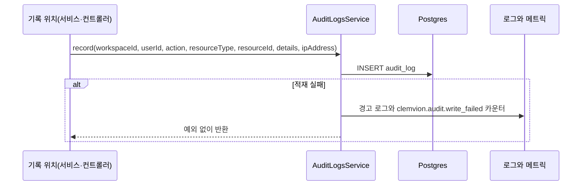
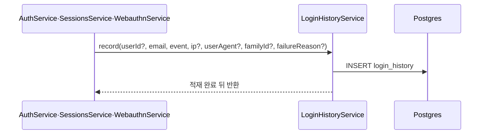

> 구현 상태: 부분 구현 · 원문: `spec/5-system/1-auth.md` (§4, Rationale 4.1.B), `spec/data-flow/1-audit.md`, `spec/1-data-model.md` (§2.18), `spec/conventions/audit-actions.md` (§3 레지스트리의 구현 상태와 기록 규칙) · 용어: [용어 사전](../CLE-GLOSSARY.md)

## 개요

이 문서는 두 가지 기록을 정한다.

- **감사 로그(Audit Log, `AuditLog`)**: 워크스페이스 안에서 일어난 변경을 한 행씩 남긴다. 테이블은 `audit_log` 다. 관리자 이상만 조회한다.
- **로그인 이력(Login History, `LoginHistory`)**: 로그인 성공·실패, 로그아웃 같은 인증 이벤트를 사용자별로 시간순으로 남긴다. 테이블은 `login_history` 다. 본인만 조회하고 180일 보존한다.

두 테이블은 일부러 나눠 두었다. 감사 로그는 워크스페이스가 정해진 동작을 기록하고 로그인 이력은 워크스페이스 없이도 일어나는 인증 이벤트를 기록한다([두 테이블로 나눈다](#두-테이블로-나눈다)).

이 문서가 정하는 것:

- 감사 액션(`AuditLog.action`) 카탈로그. 구현된 것과 예정인 것을 한 표로 둔다.
- 감사 로그 기록 계약, 워크스페이스 귀속, 조회 API, 조회 응답을 읽는 쪽의 계약, 보존 정책
- 로그인 이력 이벤트, 기록 계약, 조회 API, 보존 배치

범위 밖:

- 감사 액션 이름 규칙(`<resource>.<verb>`, 시제 세 갈래): [감사 action 명명](CLE-OBS-AUDITNAME.md)
- `login_history` 컬럼과 CHECK 제약, 인증 흐름의 테이블 쓰기 순서: [계정과 워크스페이스 데이터 흐름](../CLE-ACCT/CLE-ACCT-DATA.md)
- 활성 세션과 로그인 이력 탭 화면: [세션과 토큰](../CLE-ACCT/CLE-ACCT-SESSION.md)
- 역할별 권한 매트릭스: [워크스페이스와 멤버](../CLE-ACCT/CLE-ACCT-WS.md)
- 감사 적재 실패 메트릭(`clemvion.audit.write_failed`)의 정의와 부수 기록 실패 흡수 방식: [로깅과 헬스 체크](CLE-OBS-LOGGING.md)
- 재실행 감사 행의 필드 대응: [재실행](../CLE-EXEC/CLE-EXEC-RERUN.md)

## 요구사항

- REQ-AUDIT-001 WHEN 워크스페이스 안에서 카탈로그에 있는 변경이 완료되면 THE SYSTEM SHALL `audit_log` 에 워크스페이스·행위자·감사 액션·리소스 종류·리소스 ID·상세·요청 IP·발생 시각을 한 행 남긴다. (원본: 1-auth §4.1)
- REQ-AUDIT-002 WHEN 코드가 감사 로그를 남기면 THE SYSTEM SHALL `AUDIT_ACTIONS` union 에 있는 감사 액션만 받는다. (원본: 1-auth §4.1)
- REQ-AUDIT-003 IF 감사 로그 적재가 실패하면 THE SYSTEM SHALL 예외를 흡수해 주 동작을 계속한다. (원본: data-flow/1-audit Overview)
- REQ-AUDIT-004 IF 감사 로그 적재가 실패하면 THE SYSTEM SHALL 경고 로그에 유실된 행의 `action`·`resourceType`·`resourceId`·`workspaceId` 를 싣고 `clemvion.audit.write_failed{resource_type}` 카운터를 올린다. (원본: data-flow/1-audit Overview)
- REQ-AUDIT-005 WHEN 로그인한 세션에서 비밀번호 변경·2단계 인증 켜기·2단계 인증 끄기·이메일 변경이 일어나면 THE SYSTEM SHALL 그 감사 행을 행위자의 현재 워크스페이스에 귀속한다. (원본: 1-auth §4.1)
- REQ-AUDIT-006 IF 비밀번호 재설정이 로그인 없이 토큰으로 완료되면 THE SYSTEM SHALL `user.password_changed` 감사 행을 남기지 않는다. (원본: 1-auth §4.1)
- REQ-AUDIT-007 WHEN WebAuthn 인증 수단을 추가로 등록하면 THE SYSTEM SHALL `user.2fa_enabled` 로 남기고 `details.firstCredential` 로 첫 등록인지 구분한다. (원본: 1-auth Rationale 4.1.B)
- REQ-AUDIT-008 WHEN 감사 로그를 남기는 인증 설정·사용자 보안 동작이 일어나면 THE SYSTEM SHALL 요청 IP 를 함께 남긴다. (원본: data-flow/1-audit §1.1)
- REQ-AUDIT-009 WHEN 트리거를 켜거나 끄면 THE SYSTEM SHALL `trigger.updated` 로 남긴다. (원본: 1-auth §4.1)
- REQ-AUDIT-010 WHEN 트리거와 스케줄처럼 서로의 행을 바꾸는 짝 리소스가 함께 바뀌면 THE SYSTEM SHALL 호출된 엔드포인트의 리소스 감사 액션만 남긴다. (원본: audit-actions §3)
- REQ-AUDIT-011 WHEN 트리거의 알림 서명 시크릿 교체·봇 토큰 재발급·트리거 단위 토큰 재발급이 일어나면 THE SYSTEM SHALL 대상별 감사 액션으로 남긴다. (원본: 1-auth §4.1)
- REQ-AUDIT-012 WHEN 워크스페이스를 삭제하면 THE SYSTEM SHALL 삭제 감사 행을 남기지 않는다. (원본: 1-auth §4.1)
- REQ-AUDIT-013 WHEN 워크플로우가 실행되면 THE SYSTEM SHALL `workflow.executed` 감사 행을 남긴다. (원본: 1-auth §4.1 Planned) (미구현)
- REQ-AUDIT-014 WHEN 관리자 이상이 감사 로그를 조회하면 THE SYSTEM SHALL 현재 워크스페이스의 행만 돌려준다. (원본: 1-auth §4.2)
- REQ-AUDIT-015 IF 관리자 미만이거나 그 워크스페이스의 멤버가 아닌 사용자가 감사 로그를 조회하면 THE SYSTEM SHALL 거부한다. (원본: 1-auth §4.2)
- REQ-AUDIT-016 WHEN 감사 로그를 조회하면 THE SYSTEM SHALL 기간·행위자·감사 액션·리소스 종류 필터와 offset 페이지네이션을 제공한다. (원본: 1-auth §4.2)
- REQ-AUDIT-017 WHEN 감사 로그 조회 응답을 만들면 THE SYSTEM SHALL 과거 행의 레거시 감사 액션 값을 바꾸지 않고 그대로 싣는다. (원본: 1-auth §4.1)
- REQ-AUDIT-018 WHILE 감사 로그 보존 정책이 정해지지 않은 동안 THE SYSTEM SHALL 감사 로그 행을 지우지 않는다. (원본: 1-auth §4.2)
- REQ-AUDIT-019 WHEN 감사 로그 행이 보관 기간(기본 90일, 설정 가능)을 넘으면 THE SYSTEM SHALL 그 행을 지운다. (원본: 1-auth §4.2) (미구현)
- REQ-AUDIT-020 WHEN 로그인 성공·로그인 실패·TOTP 실패·WebAuthn 실패·로그아웃·세션 강제 종료·refresh token 재사용 감지가 일어나면 THE SYSTEM SHALL `login_history` 에 한 행 남긴다. (원본: 1-auth §4.3)
- REQ-AUDIT-021 WHEN 비밀번호 변경이나 이메일 변경이 확정되면 THE SYSTEM SHALL `session_revoked` 로그인 이력 한 행을 `familyId=null`(일괄)로 남긴다. (원본: 1-auth §4.3)
- REQ-AUDIT-022 WHEN 로그인 이력을 남기면 THE SYSTEM SHALL User-Agent 에서 기기 라벨을 만들어 함께 저장한다. (원본: data-flow/1-audit §1.2)
- REQ-AUDIT-023 WHEN 인증 코드가 로그인 이력을 남기면 THE SYSTEM SHALL 적재가 끝난 뒤에 다음 단계로 넘어간다. (원본: data-flow/1-audit §1.2)
- REQ-AUDIT-024 IF 로그인 이력 적재가 실패하면 THE SYSTEM SHALL 예외를 흡수하고 에러 로그를 남긴다. (원본: data-flow/1-audit Overview)
- REQ-AUDIT-025 WHEN 사용자가 로그인 이력을 조회하면 THE SYSTEM SHALL 본인 이력만 커서 페이지네이션으로 돌려준다. (원본: 1-auth §4.3)
- REQ-AUDIT-026 WHEN 로그인 이력을 조회하면 THE SYSTEM SHALL 워크스페이스 관리자를 포함해 본인이 아닌 사용자에게 그 이력을 보여 주지 않는다. (원본: 1-auth §4.3)
- REQ-AUDIT-027 IF 로그인 이력 조회 커서가 손상돼 있으면 THE SYSTEM SHALL 커서를 무시하고 첫 페이지를 돌려준다. (원본: data-flow/1-audit §2.2)
- REQ-AUDIT-028 WHEN 매일 03:00(Asia/Seoul)이 되면 THE SYSTEM SHALL 180일이 지난 로그인 이력 행을 지운다. (원본: 1-auth §4.3)
- REQ-AUDIT-029 WHEN 로그인 이력 보존 배치가 한 번 돌면 THE SYSTEM SHALL 1000행씩 최대 50번까지만 지우고 나머지는 다음 실행에 넘긴다. (원본: data-flow/1-audit §3)
- REQ-AUDIT-030 WHILE 서버 인스턴스가 여럿인 동안 THE SYSTEM SHALL 로그인 이력 보존 배치를 전역에서 한 번만 실행한다. (원본: data-flow/1-audit §3)
- REQ-AUDIT-031 IF 로그인 이력 보존 배치의 삭제가 실패하면 THE SYSTEM SHALL 예외를 흡수하고 로그만 남긴다. (원본: data-flow/1-audit §3)

## 감사 로그 기록

### 기록 계약

도메인 서비스와 컨트롤러가 `AuditLogsService.record` 를 불러 한 행을 남긴다.

- 인자는 `{ workspaceId, userId, action, resourceType, resourceId, details?, ipAddress? }` 다.
- `action` 은 `AuditAction` union(`audit-logs/audit-action.const.ts` 의 `AUDIT_ACTIONS`)으로 타입이 좁혀져 있다. union 에 없는 문자열은 컴파일되지 않는다(cross-audit G-01).
- 적재가 실패해도 예외를 흡수한다. 감사 기록이 실패했다고 리소스 변경이 실패하면 안 된다는 계약이다. 호출부가 `await` 해도 예외가 올라오지 않는다.
- 흡수한 실패는 경고 로그와 카운터 `clemvion.audit.write_failed{resource_type}` 로 드러난다. 로그만으로는 비율·추세로 경보를 걸 수 없어 카운터를 둔다. 로그 메시지에는 무엇이 유실됐는지(`action`·`resourceType`·`resourceId`·`workspaceId`)를 싣는다. 유실 사실만 알고 대상을 모르면 조사도 복구도 시작할 수 없다. 관측 호출 자체의 실패도 흡수한다. 메트릭 정의는 [로깅과 헬스 체크](CLE-OBS-LOGGING.md) 에 있다.
- 기록 위치는 12곳이다. 9개 서비스 모듈과 3개 컨트롤러(`users`·`auth`·`webauthn`)다(2026-09-01 실측). 12는 파일 수다. `resource_type` 의 서로 다른 값은 10종(`user`·`trigger`·`workflow`·`schedule`·`member`·`workspace`·`integration`·`model_config`·`auth_config`·`execution`)이라 두 수치가 다르다.
- 인증 설정 계열과 `user.*` 계열 감사 액션은 모두 `ipAddress` 를 함께 넘긴다. 포렌식과 사후 감사 목적이다. IP 는 `extractClientIp`(`auth/utils/client-ip.ts`)로 뽑는다. `CF-Connecting-IP` 신뢰 정책(`TRUST_CF_CONNECTING_IP`)은 [세션과 토큰](../CLE-ACCT/CLE-ACCT-SESSION.md) 이 정한다. 뽑을 수 없으면 `undefined` 로 빼고 남긴다.

### 워크스페이스 귀속

`audit_log.workspace_id` 는 NULL 을 허용하지 않는다. 감사 로그에는 현재 워크스페이스가 정해진 동작만 남는다.

- 워크스페이스 리소스(통합·워크플로우·트리거·스케줄·인증 설정·모델 설정·실행·워크스페이스·멤버)의 변경은 그 리소스가 속한 워크스페이스에 귀속한다.
- 로그인한 세션에서 일어나는 사용자 보안 동작(`user.password_changed`, `user.2fa_enabled`, `user.2fa_disabled`, `user.email_changed`)은 **행위자의 현재 워크스페이스**(인증 요청 JWT 의 워크스페이스)에 귀속한다. 이 동작들은 모두 로그인한 세션에서만 일어난다(`POST /users/me/change-password`, TOTP `verifyAndEnable`·`disable`, WebAuthn 등록·삭제, 이메일 변경 확인). 그래서 항상 현재 워크스페이스가 있고 스키마를 바꾸지 않아도 NOT NULL 제약을 채운다. `resourceType` 은 `'user'`, `resourceId` 는 사용자 ID 다. 기록은 현재 워크스페이스를 알 수 있는 컨트롤러 경계(`users.controller`·`auth.controller`·`webauthn.controller`)에서 한다.
- 워크스페이스 없이 일어나는 인증 이벤트(로그인, 로그아웃, 로그인 실패 등)는 감사 로그가 아니라 [로그인 이력](#로그인-이력) 에 남는다.
- 로그인 없이 토큰으로 하는 비밀번호 재설정(`POST /auth/reset-password`)은 현재 워크스페이스가 없어 `user.password_changed` 감사 대상이 아니다. 재설정 완료를 따로 남길지는 로그인 이력 이벤트 신설과 `chk_login_history_event` CHECK 마이그레이션이 따르는 별개 결정이며 이 문서 범위 밖이다.
- 비밀번호 변경은 모든 로그인 세션 무효화와 현재 기기 재발급을 함께 한다([세션과 토큰](../CLE-ACCT/CLE-ACCT-SESSION.md)). 그래서 감사 행 `user.password_changed` 와 함께 로그인 이력 `session_revoked`(일괄, `familyId=null`) 한 행이 남는다. 이메일 변경 확인도 같다.

### 감사 액션 카탈로그

아래 표가 감사 액션의 단일 목록이다. 구현의 기준은 코드의 `AUDIT_ACTIONS` union 이다. 이 표는 그 union 과 기록 위치를 함께 적는다. 새 감사 액션을 더하면 union 과 이 표를 같이 고친다. 이름 규칙은 [감사 action 명명](CLE-OBS-AUDITNAME.md) 을 따른다.

| 감사 액션 | `resource_type` | 기록 위치 | 기록하는 동작과 `details` | 상태 |
| --- | --- | --- | --- | --- |
| `integration.created` | integration | `integrations/integrations.service.ts` | 통합 생성 | 구현됨 |
| `integration.updated` | integration | 〃 | 통합 수정 | 구현됨 |
| `integration.deleted` | integration | 〃 | 통합 삭제 | 구현됨 |
| `integration.rotated` | integration | 〃 | 자격 증명 교체 | 구현됨 |
| `integration.scope_changed` | integration | 〃 | 공개 범위(`Integration.scope`) 전환. personal ↔ organization. `details.from`·`to` | 구현됨 |
| `integration.reauthorized` | integration | 〃 | 통합 재인증. OAuth 제공자가 없는 통합의 reset 경로에서만 남는다(`details.mode='reset'`). OAuth 통합 재인증은 `oauth/begin` 에 위임하므로 시작과 콜백 어디에서도 남지 않는다(커버리지 갭, [통합 관리](../CLE-INT/CLE-INT-MANAGE.md)) | 부분 구현 |
| `workspace.transfer_ownership` | workspace | `workspaces/workspaces.service.ts` | 소유자 이양 | 구현됨 |
| `workspace.created` | workspace | 〃 | 팀 워크스페이스 생성(`createTeam`) | 구현됨 |
| `workspace.updated` | workspace | 〃 | 이름·설정 변경(`renameWorkspace`, `updateWorkspaceSettings`). `details.field` | 구현됨 |
| `member.invited` | member | 〃 | 이메일로 직접 추가(`addMemberByEmail`). `details.mode='direct_add'` | 구현됨 |
| `member.invited` | member | `workspaces/workspace-invitations.service.ts` | 초대 발급(`invite`). `details.mode='invitation'`. 이메일 주소는 개인정보라 저장하지 않는다 | 구현됨 |
| `member.role_changed` | member | `workspaces/workspaces.service.ts` | 역할 변경(`updateMemberRole`). `details.from`·`to` | 구현됨 |
| `member.removed` | member | 〃 | 멤버 제거와 스스로 나가기(`removeMember`, `leaveWorkspace`). `details.mode='removed'` 또는 `'left'` | 구현됨 |
| `execution.re_run` | execution | `executions/executions.service.ts` | 재실행. `details` 에 `originalExecutionId`·`chainId`·`dryRun`·`inputModified`([재실행](../CLE-EXEC/CLE-EXEC-RERUN.md)) | 구현됨 |
| `auth_config.create` | auth_config | `auth-configs/auth-configs.service.ts` | 인증 설정 생성 | 구현됨 |
| `auth_config.update` | auth_config | 〃 | 인증 설정 수정 | 구현됨 |
| `auth_config.delete` | auth_config | 〃 | 인증 설정 삭제 | 구현됨 |
| `auth_config.regenerate` | auth_config | 〃 | 키·토큰 재발급 | 구현됨 |
| `auth_config.reveal` | auth_config | 〃 | 평문 보기. 비밀번호 재확인 뒤에만 된다([외부 호출 인증 설정](../CLE-TRIG/CLE-TRIG-AUTHCFG.md)) | 구현됨 |
| `user.password_changed` | user | `users/users.controller.ts` | 로그인한 세션의 비밀번호 변경(`POST /users/me/change-password`) | 구현됨 |
| `user.email_changed` | user | 〃 | 이메일 변경 확인(`POST /users/me/email-change/verify`). `details` 에 이메일 주소를 싣지 않는다([가입과 로그인](../CLE-ACCT/CLE-ACCT-SIGNIN.md)) | 구현됨 |
| `user.2fa_enabled` | user | `auth/auth.controller.ts` | TOTP 켜기(`POST /auth/2fa/verify`). `details.method='totp'` | 구현됨 |
| `user.2fa_disabled` | user | 〃 | TOTP 끄기(`POST /auth/2fa/disable`). `details.method='totp'` | 구현됨 |
| `user.2fa_enabled` | user | `auth/webauthn/webauthn.controller.ts` | WebAuthn 등록(`POST …/webauthn/register/verify`). `details.method='webauthn'`·`credentialId`·`firstCredential` | 구현됨 |
| `user.2fa_disabled` | user | 〃 | WebAuthn 삭제(`DELETE …/webauthn/credentials/:id`). `details.method='webauthn'`·`credentialId`·`remainingCredentials` | 구현됨 |
| `workflow.created` | workflow | `workflows/workflows.service.ts` | 워크플로우 생성 | 구현됨 |
| `workflow.updated` | workflow | 〃 | 워크플로우 수정 | 구현됨 |
| `workflow.deleted` | workflow | 〃 | 워크플로우 삭제 | 구현됨 |
| `workflow.executed` | workflow | 없음 | 워크플로우 실행. 보존 정책 결정 뒤로 미룬다(아래 Rationale) | 미구현 |
| `trigger.created` | trigger | `triggers/triggers.service.ts` | 트리거 생성 | 구현됨 |
| `trigger.updated` | trigger | 〃 | 트리거 수정. 켜기·끄기도 이 감사 액션이다(토글 전용 동사가 없다) | 구현됨 |
| `trigger.deleted` | trigger | 〃 | 트리거 삭제 | 구현됨 |
| `trigger.notification_secret_rotated` | trigger | 〃 | 알림 서명 시크릿 교체. 24시간 유예(`notificationSecretV2`). 새 시크릿을 응답에 한 번 평문으로 싣는다([EIA 알림 웹훅](../CLE-IX/CLE-EIA-NOTIFY.md)) | 구현됨 |
| `trigger.chat_channel_bot_token_rotated` | trigger | 〃 | 봇 토큰 재발급. 24시간 유예(`chatChannelTokenV2`). 새 토큰은 호출자가 입력하므로 응답에 싣지 않는다([채팅 채널](../CLE-CHAT/CLE-CHAT-CORE.md)) | 구현됨 |
| `trigger.interaction_token_revoked` | trigger | 〃 | 트리거 단위 토큰 재발급. 이전 토큰을 곧바로 무효로 한다(유예 없음). 새 토큰을 응답에 한 번 평문으로 싣는다([트리거 관리](../CLE-TRIG/CLE-TRIG-MANAGE.md)) | 구현됨 |
| `schedule.created` | schedule | `schedules/schedules.service.ts` | 스케줄 생성 | 구현됨 |
| `schedule.updated` | schedule | 〃 | 스케줄 수정 | 구현됨 |
| `schedule.deleted` | schedule | 〃 | 스케줄 삭제 | 구현됨 |
| `model_config.create` | model_config | `model-config/model-config.service.ts` | 모델 설정 생성 | 구현됨 |
| `model_config.update` | model_config | 〃 | 모델 설정 수정 | 구현됨 |
| `model_config.delete` | model_config | 〃 | 모델 설정 삭제 | 구현됨 |
| `model_config.set_default` | model_config | 〃 | 워크스페이스 기본 모델 지정 | 구현됨 |

카탈로그에 딸린 규칙과 사실:

- 워크스페이스·멤버 감사 액션은 결정4(B, 2026-07-07)로 구현됐다. 워크플로우·트리거·스케줄·모델 설정 CRUD 는 2026-08-01, 트리거 시크릿·토큰 세 감사 액션은 2026-08-11 에 구현됐다.
- **`workspace.deleted` 는 남기지 않는다.** 결정4 는 워크스페이스 CRUD 전체의 감사를 의도했다. 그런데 `audit_log.workspace_id` 가 `REFERENCES workspace(id) ON DELETE CASCADE`(V001)다. 삭제 전에 남기면 삭제와 함께 cascade 로 지워지고 삭제 뒤에 남기면 FK 위반이 난다. 그래서 `AUDIT_ACTIONS` 에 두지 않는다. 삭제 이력을 남기려면 워크스페이스에 묶이지 않은 별도 저장소가 필요하고 이는 범위 밖이다. 근거 원본은 [계정과 워크스페이스 데이터 흐름](../CLE-ACCT/CLE-ACCT-DATA.md) 의 Rationale 이다.
- **짝 리소스는 호출된 엔드포인트 쪽만 남긴다.** 트리거의 켜기·끄기와 스케줄의 활성 상태는 서로를 동기화한다. `SchedulesService` 가 짝 트리거를 만들고 지운다. `TriggersService` 의 `syncScheduleActivation` 이 짝 스케줄의 `isActive` 를 바꾼다. 이때 상대 리소스의 감사 액션은 남기지 않는다. 사용자가 한 행위는 하나(스케줄 생성, 트리거 끄기)인데 양쪽을 다 남기면 같은 조작이 두 행으로 보여 "누가 트리거를 따로 건드렸나" 를 되묻게 된다. 짝 행의 변화는 호출된 감사 액션의 부수 효과로 읽는다.
- **트리거 시크릿·토큰 교체는 CRUD 와 다른 축이다.** 편집자 이상이 부를 수 있는 특권 작업이고 실행하면 기존 자격 증명이 무효가 된다. 무효가 되는 대상은 감사 액션마다 다르다. 계정 탈취 뒤의 조용한 교체를 `audit_log` 만으로 재구성할 수 있어야 해서 기록한다. 세 감사 액션으로 나눈 근거는 [감사 action 명명](CLE-OBS-AUDITNAME.md) 에 있다.
- **모델 설정 레거시 행**: 모델 설정 통합(2026-08-01) 전에 `llm_config.*`·`rerank_config.*` 로 남은 행은 append-only 로 보존하고 다시 쓰지 않는다. 모델 설정 감사를 조회할 때는 두 집합(`model_config.*` 또는 `llm_config.*`·`rerank_config.*`)을 OR 로 묶는다.
- **남은 커버리지 갭**: `workflow.executed` 외에 알림 규칙 CRUD 를 맡는 `alerts` 모듈이 감사 로그를 남기지 않는다(`AuditLogsService` 를 가져다 쓰지 않는다). 알림 규칙 평가가 알림을 보낼 때도 감사 행은 없다([알림](CLE-OBS-NOTIFY.md)).

## 감사 로그 조회

`GET /api/audit-logs`(`audit-logs.controller.ts` → `AuditLogsService.findAll`)가 감사 로그를 돌려준다.

| 항목 | 규칙 |
| --- | --- |
| 권한 | `@Roles('admin')`. 전역 `RolesGuard` 가 워크스페이스 멤버십과 역할을 함께 검사한다. 관리자 이상만 조회한다. 멤버가 아닌 사용자가 `X-Workspace-Id` 를 바꿔 넣어 다른 워크스페이스를 보는 것도 막는다 |
| 범위 | `@WorkspaceId()` 로 정해진 현재 워크스페이스의 행만 |
| 필터 | `action`(완전 일치), `resourceType`, `userId`(행위자), `startDate`·`endDate`(`created_at` 범위) |
| 페이지네이션 | offset 방식. `page` 기본 1, `limit` 기본 20 |
| 정렬 | 허용 목록 `created_at`·`action`·`resource_type`. 기본 `created_at DESC` |
| 응답 | 행위자 `user` 를 join 해 싣는다 |

**읽는 쪽 계약: `action` 은 닫힌 enum 이 아니다.** 쓰는 쪽은 `AUDIT_ACTIONS` union 으로 막지만 `AuditLog.action` 컬럼 자체는 DB 에서 자유 문자열이다. 감사 기록은 바꾸지 않는다는 원칙에 따라 과거 행에는 지금 union 밖의 레거시 값이 남아 있을 수 있다. 예를 들어 cross-audit G-02 전에 남은 `execution.re_run` 의 옛 표기 `re_run_initiated` 행은 그대로 있다. 그래서 조회 응답(`AuditLogDto.action`)을 쓰는 쪽은 `action` 을 닫힌 enum 으로 단정하지 말고 모르는 값도 처리해야 한다. `AuditLogDto.action` 의 OpenAPI 설명에도 같은 계약을 적는다.

## 로그인 이력

### 이벤트

`event` 는 7종이다. 코드의 `LoginHistoryEvent` union(`auth/entities/login-history.entity.ts`)과 DB CHECK 제약 `chk_login_history_event` 가 함께 이 목록을 강제한다.

| 이벤트 | 기록 위치 | 뜻 |
| --- | --- | --- |
| `login_success` | `auth/auth.service.ts` | 비밀번호 또는 OAuth 로그인 성공 |
| `login_failed` | 〃 | 비밀번호 불일치·계정 잠금·이메일 미인증 같은 로그인 실패 |
| `totp_failed` | 〃 | 2단계 인증 TOTP 코드 검증 실패 |
| `webauthn_failed` | `auth/webauthn/webauthn.service.ts` | 2단계 인증 WebAuthn 검증 실패. `failure_reason` 으로 `WEBAUTHN_INVALID`·`WEBAUTHN_COUNTER_REGRESSION` 을 구분한다 |
| `logout` | `auth/auth.service.ts` | 사용자가 `/auth/logout` 을 부름. 부른 기기의 로그인 세션 전체를 무효로 한다 |
| `session_revoked` | `auth/sessions.service.ts` | 활성 세션 목록에서 다른 로그인 세션을 하나씩 강제 종료, `revoke-others` 일괄 종료, 비밀번호 변경·이메일 변경 확정 때의 전체 무효화(일괄, `familyId=null`). 모두 `SessionsService` 를 거친다. 기존 enum 값을 다시 써서 CHECK 제약과 마이그레이션이 필요 없다 |
| `token_reuse_detected` | `auth/auth.service.ts` | 무효가 된 refresh token 의 재사용을 감지함. 그 로그인 세션 전체를 무효로 한다 |

`webauthn_failed` 는 V058 에서 CHECK 제약을 지웠다가 다시 만드는 방식으로 더했다. 컬럼 정의는 [계정과 워크스페이스 데이터 흐름](../CLE-ACCT/CLE-ACCT-DATA.md) 에 있다.

### 기록 계약

- 기록하는 쪽은 인증 도메인의 세 서비스(`AuthService`·`SessionsService`·`WebauthnService`)뿐이다.
- 기기 라벨(`deviceLabel`)은 인자로 받지 않는다. 서비스 안에서 `userAgent` 로 만든다(`deriveDeviceLabel`, `auth/utils/device-label.ts`). 외부 라이브러리 없이 정규식만 쓴다. 알아보지 못하면 UA 원문을 64자로 줄여 쓴다.
- 호출하는 쪽은 반드시 `await` 한다. `void` 로 던져 두면 바로 뒤의 HTTP 요청(예: 로그인 이력 조회)의 SELECT 가 INSERT 보다 먼저 실행되는 읽기 경쟁이 생긴다. 커넥션 풀이 읽기와 쓰기를 다른 커넥션에 실을 때 일어난다. `login-history.service.ts` 의 `record` 주석에 적힌 계약이고 현재 호출부는 모두 `await` 한다.
- 적재가 실패하면 예외를 흡수하고 `Logger.error` 만 남긴다. 감사 로그와 달리 카운터가 없다. 이 차이는 [Rationale](#적재-실패-관측이-감사-로그와-로그인-이력에서-다르다) 에 있다.

### 조회 API

`GET /api/users/me/login-history`(`auth/sessions.controller.ts` → `LoginHistoryService.findForUser`)가 로그인 이력을 돌려준다.

| 항목 | 규칙 |
| --- | --- |
| 범위 | JWT 의 본인 `userId` 행만. 워크스페이스 관리자에게도 다른 사용자의 이력은 보이지 않는다 |
| 페이지네이션 | 커서 방식. 커서는 `<iso>\|<id>` 로 인코딩한다. `created_at` 이 같은 밀리초인 행을 가르려고 `id` 를 함께 묶는다 |
| 손상된 커서 | 무시하고 첫 페이지부터 돌려준다 |
| 페이지 크기 | `limit` 기본 50, 상한 100. `limit + 1` 행을 읽어 `hasMore` 를 판정하고 `nextCursor` 를 돌려준다 |

화면(활성 세션 화면의 로그인 이력 탭)은 [세션과 토큰](../CLE-ACCT/CLE-ACCT-SESSION.md) 이 정한다.

## 보존

| 테이블 | 보존 | 정리 |
| --- | --- | --- |
| `audit_log` | 정책 미정. 지금은 무제한 | 정리 배치 없음. "최근 90일 보관(설정 가능)" 은 예정이고 미구현이다 |
| `login_history` | 180일(`RETENTION_DAYS`) | 매일 배치로 자동 삭제(아래) |

로그인 이력 보존 배치(`auth/jobs/login-history-pruner.service.ts`):

- BullMQ 반복 작업이다. 큐는 `login-history-pruner`, cron 은 `0 3 * * *` 이고 시간대를 Asia/Seoul 로 명시한다. 서버 로컬 시간대가 바뀌어도 실행 시각이 흔들리지 않는다.
- 서버 인스턴스가 여럿이어도 전역에서 한 번만 돈다. `upsertJobScheduler` 는 멱등이라 Redis 중앙 스케줄에 항목 하나만 남긴다. 워커는 Redis 락을 잡은 쪽만 작업을 가져간다.
- 삭제는 `LoginHistoryService.pruneOlderThanRetention` 이 배치 루프로 한다. 한 번 호출에 `PRUNE_BATCH`(1000행) × 최대 `PRUNE_MAX_BATCHES`(50) 까지만 지운다. 잠금 경합과 WAL 팽창을 줄이려는 것이고 남은 행은 다음 실행에 넘긴다.
- 삭제 실패도 예외를 흡수하고 로그만 남긴다.
- 배치는 `created_at < cutoff` 로 훑는다. 이 스캔 전용 인덱스 `(created_at)` 을 V040 에서 만들었다.

## 데이터

### AuditLog

| 필드 | 타입 | 설명 |
| --- | --- | --- |
| id | UUID | PK |
| workspace_id | UUID | FK → Workspace (CASCADE) |
| user_id | UUID | FK → User (NO ACTION). 행위자 |
| action | String | 감사 액션(`VARCHAR(100) NOT NULL`). DB CHECK 가 없다 |
| resource_type | String | 대상 리소스 종류 |
| resource_id | UUID | 대상 리소스 ID |
| details | JSONB | 변경 상세. 감사 액션마다 형식이 다르다 |
| ip_address | String? | 요청 IP. IP 를 알 수 없거나 시스템 내부 동작이면 없다 |
| created_at | Timestamp | 발생 시각 |

- 테이블은 V001 에서 만들었다. 인덱스는 V002 의 `idx_audit_log_workspace_created (workspace_id, created_at DESC)` 다.
- 두 테이블 모두 외부 시스템으로 내보내지 않는다. 알림 규칙 평가(`alerts-evaluator.service.ts`)도 두 테이블을 읽지 않는다.
- `AuditLog.details` 는 에러 응답의 `details` 와 이름만 같은 다른 필드다([에러 응답과 클라이언트 처리](../CLE-API/CLE-API-ERROR.md)).

### 외부 의존

| 의존 | 방향 | 내용 |
| --- | --- | --- |
| 9개 도메인 서비스(integrations·workspaces·workspace-invitations·executions·auth-configs·workflows·triggers·schedules·model-config)와 3개 컨트롤러(users·auth·webauthn) | 상류 | `audit_log` 를 쓰는 곳 전부. 목록은 [감사 액션 카탈로그](#감사-액션-카탈로그) |
| 인증 도메인(`AuthService`·`SessionsService`·`WebauthnService`) | 상류 | `login_history` 를 쓰는 유일한 곳 |
| BullMQ(Redis) | 기반 | `login-history-pruner` 반복 작업 |

## 구현 위치

- `codebase/backend/src/modules/audit-logs/audit-logs.service.ts` (`record`, `findAll`)
- `codebase/backend/src/modules/audit-logs/audit-action.const.ts` (`AUDIT_ACTIONS`)
- `codebase/backend/src/modules/audit-logs/audit-logs.controller.ts`
- `codebase/backend/src/modules/auth/login-history.service.ts` (`record`, `findForUser`, `pruneOlderThanRetention`)
- `codebase/backend/src/modules/auth/jobs/login-history-pruner.service.ts`
- `codebase/backend/src/modules/auth/sessions.controller.ts` (로그인 이력 조회)

## Rationale

### 두 테이블로 나눈다

- `audit_log` 는 워크스페이스 단위 역할 권한과 바로 이어지는 변경 기록이다. 규정 준수와 분쟁 해결에 쓰고 워크스페이스 관리자와 감사 담당자가 본다.
- `login_history` 는 사용자가 자기 계정 보안을 확인하는 용도다(의심스러운 로그인 찾기). 워크스페이스 없이도 일어난다. 로그인 실패는 어느 워크스페이스에도 속하지 않는다.

목적과 조회자가 달라서 한 테이블로 합치면 권한 분리와 쿼리 형태가 모두 복잡해진다. 조회 방식도 다르다. 감사 로그는 워크스페이스 범위의 offset 페이지네이션이고 로그인 이력은 본인 전용 커서 페이지네이션이다.

### 사용자 보안 감사 액션을 현재 워크스페이스에 귀속한다

`user.password_changed`·`user.2fa_enabled`·`user.2fa_disabled` 를 NOT NULL 인 `audit_log.workspaceId` 에 어떻게 귀속할지 정해야 했다(refactor 04 후속). 행위자의 현재 워크스페이스(인증 요청 JWT 의 워크스페이스)로 정했다.

이 동작들은 모두 로그인한 세션에서만 일어난다(`POST /users/me/change-password`, TOTP, WebAuthn 모두 JwtAuthGuard 뒤에 있다). 인증 요청은 항상 JWT 로 워크스페이스를 싣고 오므로 그 워크스페이스에 귀속하면 스키마를 바꾸지 않고 제약을 채운다. 이는 카탈로그의 "인증(현재 워크스페이스가 있는 동작)" 분류를 구체화한 것이다. 로그인·로그아웃·로그인 실패(워크스페이스 없음)는 로그인 이력으로 간다는 규칙은 그대로다.

- **WebAuthn 추가 등록도 `user.2fa_enabled` 다.** 이미 2단계 인증이 켜진 상태에서 두 번째 이후 인증기를 등록하는 것은 "2단계 인증 활성화" 사건은 아니다. 하지만 계정 보안 속성(인증 수단)을 더하는 일이라 추적한다. 새 감사 액션을 만들기보다 `details.firstCredential=false` 로 구분하는 편이 조회·집계에 단순하다. `webauthn.controller` 는 복구 코드를 발급했는지로 `firstCredential` 을 판정한다.
- **OAuth 로만 가입한 사용자의 마지막 2단계 인증 끄기는 별개 결정이다.** 비밀번호가 없는 계정이 유일한 2단계 인증 수단을 끌 때 계정 잠김 위험을 어떻게 막을지는 감사 귀속과 무관하다. 2단계 인증 강제 정책·계정 복구 흐름과 함께 다룰 일이며 지금은 막는 로직이 없다.

기각한 대안:

- **`audit_log.workspaceId` 를 NULL 허용으로 바꾸기**(사용자 단위 이벤트는 NULL): 스키마 마이그레이션이 필요하다. 워크스페이스로 거르는 모든 쿼리·인덱스·조회 권한(`@WorkspaceId()` 범위)이 NULL 을 따로 처리해야 해 영향이 크다. 인증 이벤트는 항상 현재 워크스페이스가 있으므로 NULL 이 필요 없다.
- **사용자·개인 단위 감사 범위를 따로 만들기**: `audit_log` 는 본래 워크스페이스 범위의 팀 기능이고 사용자 단위 인증 이벤트는 이미 `login_history` 가 맡는다. 저장소를 둘로 만들 이유가 없다.

### 감사 액션은 애플리케이션 union 으로 막고 로그인 이력 이벤트는 DB CHECK 로 고정한다

`audit_log.action` 은 DB 에서 자유 문자열(`VARCHAR(100) NOT NULL`, V001)이다. 새 감사 액션을 더할 때 마이그레이션이 필요 없다. 그 대가는 제각각인 표기가 DB 에 들어갈 위험인데, 이는 애플리케이션의 타입으로 막는다. `AuditLogsService.record({ action })` 의 `action` 이 `AuditAction` union 이라 const 에 더하지 않은 감사 액션은 호출 자체가 컴파일되지 않는다(cross-audit G-01). DB CHECK 대신 union 을 고른 이유는 감사 액션이 도메인이 늘 때마다 자주 추가되기 때문이다.

반대로 `login_history.event` 는 DB CHECK 제약(`chk_login_history_event`, V040)으로 값을 고정한다. 이벤트 종류를 더하려면 마이그레이션이 필요하다. 예를 들어 `webauthn_failed` 는 V058 에서 CHECK 제약을 DROP 한 뒤 ADD 해 더했다. 엔티티의 `LoginHistoryEvent` union 과 DB CHECK 가 함께 정합성을 지킨다.

### 기록 실패는 흡수하고 호출은 기다린다

감사 기록은 부수 기록이다. INSERT 가 실패했다고 리소스 변경이나 로그인이 실패하면 안 된다. 그래서 두 `record` 모두 예외를 흡수한다. 그래도 `await` 를 요구하는 이유는 에러 전파가 아니라 순서 보장이다. 바로 뒤의 조회와 읽기 경쟁이 나지 않게 한다. 흡수하되 기다리는 조합은 의도한 설계다.

### 적재 실패 관측이 감사 로그와 로그인 이력에서 다르다

감사 로그는 흡수한 실패를 경고 로그와 카운터로 드러내고 로그인 이력은 에러 로그만 남긴다. 이 차이는 일부러 드러내 둔다. 하나로 묶어 적으면 어느 쪽으로 읽어도 틀리고 로그인 이력 쪽의 빈틈이 보이지 않는다. 로그인 이력에 카운터를 도입할지는 별도 작업으로 추적한다.

### `workflow.executed` 를 보존 정책 결정 뒤로 미룬다

`workflow.executed` 는 다른 감사 액션과 빈도가 다르다. CRUD 는 드물지만 `executed` 는 트리거와 웹훅이 발동할 때마다 쌓인다. 그런데 `audit_log` 은 보존 정책이 정해지지 않았고 정리 배치도 없다([보존](#보존)). 로그인 이력에 보존 배치가 있는 것과 대비된다. 무제한 테이블에 고빈도 감사 액션을 넣는 일은 보존 정책 결정과 묶어야 해서 따로 떼어 미뤘다.

이 유예 원칙의 축은 특권성이 아니라 "빈도 × 보존 정책 미정" 이다. 그래서 트리거 시크릿·토큰 교체에는 적용하지 않는다. 교체와 재발급은 드문 특권 작업이고 같은 이유로 `integration.rotated`·`auth_config.regenerate` 가 이미 구현돼 있다.

### 감사 액션 카탈로그를 한 표로 합친다

예전에는 세 문서가 감사 액션 목록을 따로 들고 각자 기준이라고 적었다. 인증 명세의 감사 절은 카탈로그(구현됨·예정 목록)를, 감사 데이터 흐름 문서는 현재 기록되는 감사 액션과 기록 위치를, 명명 규약 문서는 resource 별 분류와 구현 상태를 들고 있었다. 감사 액션을 하나 더할 때마다 세 곳을 고쳐야 했고 실제로 어긋났다. 데이터 흐름 문서의 외부 의존 표와 시퀀스 그림은 2026-08-01 CRUD 확장 전의 4개 서비스만 적고 "그 외 도메인은 감사 기록 없음" 이라 했다. 이제 목록은 이 문서의 카탈로그 한 곳에만 두고 명명 규약은 [감사 action 명명](CLE-OBS-AUDITNAME.md) 이 맡는다. 구현의 기준은 여전히 코드의 `AUDIT_ACTIONS` union 이다.

기록 위치도 한정해서 적는다. 예전에는 감사 로그를 "모든 도메인 서비스가 부르는 공통 관심사" 로 적었다. 실제로 기록하는 곳은 카탈로그에 적은 서비스와 컨트롤러뿐이라 그 서술은 버렸다.

### 레거시 감사 액션 행은 고치지 않는다

예전 `re_run_initiated` 는 resource 접두 없이 적재돼 과거분사형 통합 감사 액션과 섞였다. cross-audit G-02 에서 `execution.re_run` 으로 고쳤지만 새 행부터 적용했고 기존 행은 감사 기록 불변 원칙에 따라 그대로 둔다. 모델 설정 통합 전의 `llm_config.*`·`rerank_config.*` 행도 같다. 이 때문에 조회 응답의 `action` 은 닫힌 enum 이 아니다.
