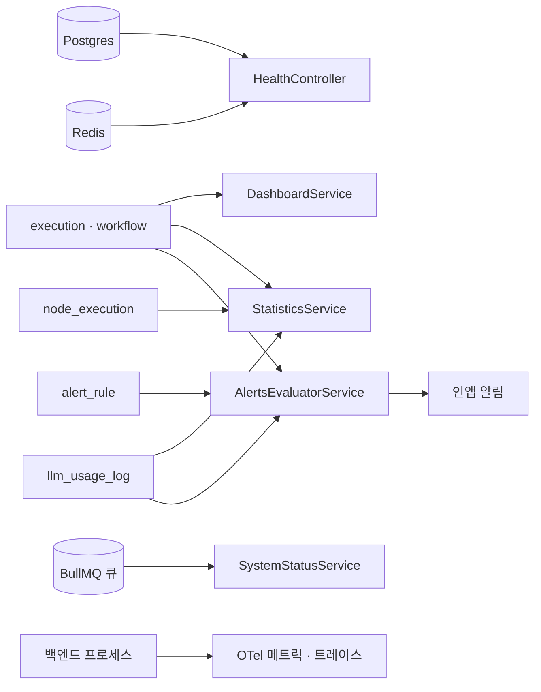
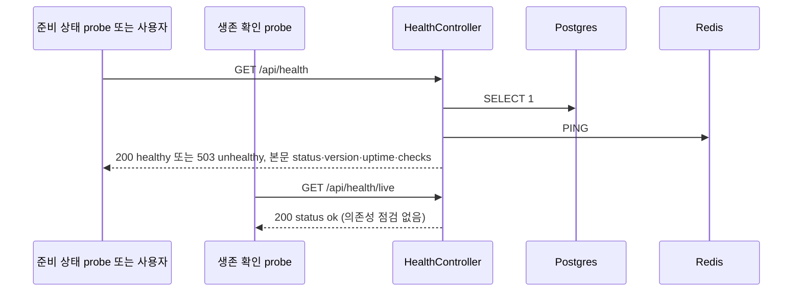

> 구현 상태: 부분 구현 · 원문: `spec/5-system/3-error-handling.md` (§6 로깅 정책, §7 헬스 체크, Rationale 의 `Error.cause` 항목), `spec/data-flow/9-observability.md`, `spec/5-system/_product-overview.md` (§5 관측성) · 용어: [용어 사전](../CLE-GLOSSARY.md)

## 개요

이 문서는 서버가 운영 상태를 드러내는 방법을 정한다. 다루는 것은 다음과 같다.

- 서버 로그의 레벨·형식·마스킹, 에러를 감쌀 때 `Error.cause` 를 붙이는 기준
- 부수 기록(감사 로그, 로그인 이력, 알림 이메일 등)이 실패했을 때 주 동작을 막지 않는 방식
- 헬스 체크(health check): 준비 상태 API `/api/health` 와 생존 확인 API `/api/health/live`
- OTel 메트릭·트레이싱 수집, 비즈니스 메트릭(`clemvion.*`) 카탈로그와 라벨 규칙
- 관측 영역 전체의 데이터 흐름(헬스 체크, 대시보드, 통계, 알림 규칙 평가, 시스템 상태)

범위 밖:

- 관측성 요구사항 목록(NF-OB-01~07, NF-AV-04): [비기능 요구사항](../CLE-PLAT/CLE-PLAT-NFR.md)
- 에러 응답 봉투와 클라이언트 처리: [에러 응답과 클라이언트 처리](../CLE-API/CLE-API-ERROR.md)
- 에러 코드 카탈로그: [에러 코드 규약과 카탈로그](../CLE-API/CLE-API-ERRCODES.md)
- 응답 데이터 안의 자격 증명 마스킹: [응답 자격 증명 마스킹](../CLE-API/CLE-API-EGRESS.md)
- 큐 적체 상태 화면과 API: [시스템 상태](CLE-OBS-STATUS.md)
- 대시보드와 통계 화면: [대시보드](CLE-OBS-DASHBOARD.md), [통계](CLE-OBS-STATS.md)
- 알림 규칙과 그 평가: [알림](CLE-OBS-NOTIFY.md)
- 감사 로그와 로그인 이력의 적재: [감사 로그](CLE-OBS-AUDIT.md)

## 관측 영역의 데이터 흐름

관측 영역은 모두 읽기 위주다. 새 행을 만드는 쪽은 다른 도메인이고 관측 영역은 그 행을 집계·평가·노출한다. 헬스 체크와 시스템 상태는 테이블을 쓰지 않는다. 알림 규칙 평가만 알림 행과 `alert_rule.last_triggered_at` 을 쓴다.



| 구성 요소 | 하는 일 | 기준 문서 |
| --- | --- | --- |
| 헬스 체크 | 의존성(DB·Redis) 점검. 준비 상태 API 와 생존 확인 API 를 나눈다 | 이 문서 [헬스 체크](#헬스-체크) |
| 대시보드 | 워크스페이스 첫 화면의 요약 지표(`dashboard.service.ts`) | [대시보드](CLE-OBS-DASHBOARD.md) |
| 통계 | 기간·워크플로우 필터 집계 API(`statistics.controller.ts`) | [통계](CLE-OBS-STATS.md) |
| 알림 규칙 평가 | `alert_rule` 을 5분마다 평가해 인앱 알림을 보낸다(`alerts-evaluator.service.ts`) | [알림](CLE-OBS-NOTIFY.md) |
| 시스템 상태 | BullMQ 큐 적체 집계 | [시스템 상태](CLE-OBS-STATUS.md) |
| OTel 메트릭·트레이스 | Prometheus 수집 엔드포인트와 OTLP 트레이스 | 이 문서 [메트릭과 트레이싱](#메트릭과-트레이싱) |

## 로그 레벨

| 레벨 | 용도 |
| --- | --- |
| ERROR | 시스템 에러, 처리되지 않은 예외 |
| WARN | 비정상이지만 복구할 수 있는 상황(재시도, 대체 동작) |
| INFO | 주요 비즈니스 이벤트(실행 시작·완료, 로그인) |
| DEBUG | 상세 디버깅(요청·응답 데이터, 쿼리) |

## 로그 형식

서버 로그는 JSON 으로 구조화해 남긴다(NF-OB-01).

```json
{
  "timestamp": "2026-03-26T12:00:00.000Z",
  "level": "ERROR",
  "service": "execution-engine",
  "message": "Node execution failed",
  "requestId": "f3b6d2e0-9d4a-4b77-9d19-7a0f8f4c1e2b",
  "userId": "uuid",
  "workspaceId": "uuid",
  "context": {
    "workflowId": "uuid",
    "executionId": "uuid",
    "nodeId": "uuid",
    "error": "Connection timeout"
  }
}
```

`requestId` 는 에러 응답의 요청 ID 와 같은 값이라 에러 응답과 서버 로그를 잇는다([에러 응답과 클라이언트 처리](../CLE-API/CLE-API-ERROR.md)).

## 로그 마스킹

로그에 다음 정보가 남지 않도록 자동으로 가린다.

- API Key, Bearer Token, 비밀번호
- OAuth 토큰
- 개인 식별 정보. 이메일은 일부만 가린다(`g***@example.com`)

## 에러를 감쌀 때 `Error.cause` 를 붙이는 기준

이 절은 로그가 아니라 **에러 객체 자체의 구성**을 다룬다. 노드 에러는 Activity API 로 사용자에게 보이므로 "서버에만 남으니 안전하다" 가 성립하지 않는다(근거는 아래 Rationale). 여기서 `cause` 는 JS `Error` 의 `cause` 프로퍼티다. 근본 원인(root cause)이라는 일반 표현과 관계없다.

REST 표준 응답 경로에서는 이 절보다 [에러 응답과 클라이언트 처리](../CLE-API/CLE-API-ERROR.md) 의 에러 응답 형식 규칙을 먼저 본다. 그쪽은 내부 구현 원문을 응답에 그대로 싣는 것을 조건 없이 금지한다. 아래 기준은 "원문을 이미 담은 message" 를 전제로 하므로 REST 경로에서는 그 전제 자체가 규칙 위반이다. 이 절은 그 적법성을 판정하지 않는다.

`catch` 한 에러를 새 에러로 감쌀 때 `{ cause: err }` 를 붙일지는 아래 **두 조건을 모두** 만족하는지로 정한다. 하나라도 어긋나면 붙이지 않는다.

| # | 조건 | 이유 |
| --- | --- | --- |
| C1 | 감싼 `message` 가 원본 `err.message` 를 **이미 담고 있다** | 담고 있다면 `cause` 가 message 쪽에서 새 정보를 더하지 않는다. 담고 있지 않다면 그 비노출이 **의도**이므로 `cause` 를 붙이면 그 의도가 깨진다 |
| C2 | `err` 가 message·name 밖의 민감 정보를 속성으로 들고 있지 않다 | `cause` 는 문자열이 아니라 **객체 전체**를 붙인다. pg 드라이버의 `detail`·`hint`·`where`, HTTP 응답 헤더, 커넥션 문자열 같은 것이 따라오면 C1 이 참이어도 새 정보가 샌다 |

붙이지 않을 때는 `eslint-disable-next-line preserve-caught-error -- <사유>` 로 규칙을 끄고 **무엇을 왜 감추는지** 주석에 남긴다. 원본 상세는 `logger` 로만 남겨 운영 가시성을 지킨다. 이 방식의 기준 사례가 `SecretResolverService.resolve` 다. 복호화에 실패하면 `ref` 와 `workspaceId` 만 기록하고 평문과 암호화 상세는 기록하지 않는다. 근거는 [시크릿 저장소](../CLE-INT/CLE-INT-SECRET.md) 의 SS-SE-05 다.

## 부수 기록 실패 흡수

부수 기록 실패 흡수(best-effort)는 주 동작에 딸린 기록이 실패해도 주 동작을 막지 않는 방식이다. 기록 쪽에서 예외를 흡수하고 로그나 메트릭으로만 드러낸다.

| 기록 | 실패할 때 | 드러나는 방법 | 기준 문서 |
| --- | --- | --- | --- |
| 감사 로그 적재 | 예외를 흡수하고 주 동작을 계속한다 | 경고 로그(유실된 행의 식별자 포함)와 `clemvion.audit.write_failed` 카운터 | [감사 로그](CLE-OBS-AUDIT.md) |
| 로그인 이력 적재 | 예외를 흡수한다 | 에러 로그만. 카운터가 없다 | [감사 로그](CLE-OBS-AUDIT.md) |
| 로그인 이력 보존 배치 | 예외를 흡수한다 | 로그 | [감사 로그](CLE-OBS-AUDIT.md) |
| 알림 이메일 발송 | 재시도하지 않는다 | 경고 로그. `email_sent_at` 이 NULL 로 남는다 | [알림](CLE-OBS-NOTIFY.md) |
| 알림 WebSocket 전송 | 실패해도 알림 저장은 유지된다 | 없음 | [알림](CLE-OBS-NOTIFY.md) |
| EIA 멱등 캐시의 Redis 조회·저장 | 요청을 살리고 캐시 없이 진행한다(fail-open) | `clemvion.redis.fail_open` 카운터 | [External Interaction API](../CLE-IX/CLE-EIA.md) |

- 관측 호출(로그·메트릭) 자체가 실패해도 흡수한다. 관측이 새 실패 경로가 되면 흡수 계약을 거스르게 된다.
- 흡수해도 호출은 기다릴 수 있다. 로그인 이력처럼 바로 뒤 조회와의 읽기 경쟁을 막아야 하면 `await` 한다. 흡수는 에러 전파를 막을 뿐 순서 보장과 별개다.
- 로그만으로는 비율과 추세로 경보를 걸 수 없다. 그래서 신뢰에 직접 걸린 기록(감사 로그, Redis fail-open)에는 카운터를 둔다.

## 헬스 체크

### 엔드포인트

| 경로 | 용도 | 점검 | HTTP 상태 |
| --- | --- | --- | --- |
| `GET /api/health` | 준비 상태(readiness) probe 전용. 사용자가 직접 불러도 된다 | `database`(SELECT 1), `redis`(PING) | 전체 `status` 가 `healthy` 면 200, 그 밖(`unhealthy`, Redis 미설정 `unconfigured` 포함)은 503 |
| `GET /api/health/live` | 생존 확인(liveness) probe 전용 | 없음. 프로세스가 살아 있는지만 본다 | 항상 200, 본문 `{ "status": "ok" }` |



헬스 체크는 DB 에 아무것도 쓰지 않는다. 호출마다 독립적이다.

### `/api/health` 응답

```json
{
  "status": "healthy",
  "version": "1.0.0",
  "uptime": 86400,
  "checks": {
    "database": { "status": "healthy", "latency": 5 },
    "redis": { "status": "healthy", "latency": 2 }
  }
}
```

현재 구현(`health.service.ts` 의 `HealthService.check()`)은 `database` 와 `redis` 두 항목만 점검한다. 전체 `status` 는 두 값(`healthy`·`unhealthy`) 중 하나다.

| 전체 상태 | 조건 |
| --- | --- |
| `healthy` | `database`·`redis` 가 모두 `healthy` |
| `unhealthy` | `database` 나 `redis` 가 비정상. Redis 설정이 없으면 `redis` 는 `unconfigured` 로 표시하고 전체는 `unhealthy` 로 내린다. 외부 모니터가 미설정 상태를 알아채게 하려는 것이다 |

- 준비 상태 probe(httpGet)는 2xx 만 성공으로 본다. 의존성 장애 때 503 을 받으면 Pod 가 Service endpoint 에서 빠지고 의존성이 돌아오면 200 으로 다시 들어간다.
- 503 응답 본문도 정상일 때와 같은 `{ status, version, uptime, checks }` 구조다. 예외를 던지지 않고 응답 상태 코드만 바꾸므로 전역 예외 필터의 에러 응답 봉투(`{ error: { code, message, requestId } }`)로 바뀌지 않는다. 본문 `status` 어휘는 두 값 그대로다.

### `/api/health/live`

의존성(DB·Redis)을 점검하지 않고 프로세스가 살아 있는지만 확인한다. 항상 200 과 `{ "status": "ok" }` 를 돌려준다. 생존 확인이 외부 의존성을 보면 안 되는 이유는 [Rationale](#준비-상태와-생존-확인-probe-를-나눈다) 에 있다.

### 로그 게이팅

probe 는 자주 불린다(준비 상태 10초, 생존 확인 30초). 성공 로그가 많이 쌓이므로 `LoggingInterceptor` 는 헬스 체크 경로(`/api/health`, `/api/health/live`)만 따로 다룬다.

| 경우 | 로그 |
| --- | --- |
| 성공(HTTP < 400) | `HEALTH_CHECK_LOG === true` 일 때만 INFO 로 남긴다 |
| 실패(HTTP ≥ 400, 준비 상태 503) | 항상 WARN 으로 남긴다 |
| 헬스 체크가 아닌 경로 | 기존대로 항상 INFO |

`HEALTH_CHECK_LOG` 기본값은 `false` 다. 기본은 실패만 남겨 소음을 줄이고 켜면 성공과 실패를 모두 남긴다. 헬스 체크 대상은 백엔드뿐이다. 프런트엔드 헬스 체크는 외부 의존성을 점검하지 않아 나눌 필요가 없다.

### 예정 항목

아래는 아직 구현하지 않았다.

| 항목 | 내용 |
| --- | --- |
| 파일 저장소(S3) ping | 추가한다면 준비 상태 API(`/api/health`)에 넣는다. 생존 확인 API 는 의존성을 점검하지 않는다. 외부 네트워크 의존이 커서 헬스 체크가 느려질 수 있으므로 짧은 timeout 을 권한다 |
| `vectorDb` 점검 항목 | 벡터 DB 점검 |
| `degraded` 세 번째 상태 | 필수가 아닌 점검 일부가 실패했을 때의 상태. 지금은 필수 점검(`database`·`redis`)만 보는 두 값 판정이다 |

### 헬스 어휘

"건강도(health)" 값 집합은 표면마다 다르다. 섞어 쓰지 않는다.

| 표면 | 값 | 용어 | 기준 문서 |
| --- | --- | --- | --- |
| 헬스 체크 `status` | `healthy`, `unhealthy`(Redis 미설정 `unconfigured` 포함) | 헬스 체크 | 이 문서 |
| 큐 건강도 `health` | `healthy`, `degraded`, `down` | 큐 건강도 | [시스템 상태](CLE-OBS-STATUS.md) |
| EIA 알림 웹훅·채팅 채널 발송 건강도 | `unknown`, `healthy`, `degraded` | 발송 건강도, 채널 건강도 | [EIA 알림 웹훅](../CLE-IX/CLE-EIA-NOTIFY.md), [채팅 채널](../CLE-CHAT/CLE-CHAT-CORE.md) |

큐 건강도가 `unhealthy` 를 `degraded`·`down` 두 단계로 나눈 이유는 [시스템 상태](CLE-OBS-STATUS.md) 에 있다.

## 메트릭과 트레이싱

### 수집

- `OTEL_ENABLED=true` 일 때 켜진다(NF-OB-02).
- OTel MeterProvider 와 `@opentelemetry/exporter-prometheus`(`instrumentation.ts`)가 Prometheus 수집 서버의 `/metrics` 로 내보낸다. 주소는 `OTEL_PROMETHEUS_HOST`·`OTEL_PROMETHEUS_PORT` 이고 기본값은 `127.0.0.1:9464` 다.
- 자동 수집: auto-instrumentation 의 HTTP 서버 메트릭과 `instrumentation-runtime-node` 의 런타임 메트릭(event loop, GC, heap).
- 도메인·비즈니스 메트릭은 아래 카탈로그다(NF-OB-07).

### 트레이싱

`OTEL_ENABLED=true` 일 때 분산 트레이싱이 켜진다(NF-OB-03). OTLP HTTP exporter 의 기본 엔드포인트는 `/v1/traces` 다.

### 비즈니스 메트릭 카탈로그

`OTEL_ENABLED=true` 일 때 `BusinessMetricsService` 가 `metrics.getMeter('clemvion.business')` 로 계측한다(`business-metrics.service.ts`). OTel instrument 이름은 점 표기(`clemvion.*`)이고 Prometheus exporter 가 `clemvion_*` 로 바꾼다. 모든 라벨은 값의 가짓수가 제한돼야 한다(enum, 등록된 모델 수, 노드 타입, 표준 에러 코드).

라벨을 닫는 방법은 둘이다.

1. 소스에 코드 리터럴 유니온이 있으면 그 유니온으로 **타입에서** 닫는다(`clemvion.redis.fail_open` 의 `component`·`reason`).
2. 소스 시그니처가 이미 `string` 이라 컴파일러가 닫힘을 증명하지 못하는 라벨(`error_code`, `resource_type`)은 값 길이를 64자로 **잘라** 방어한다. 증명되지 않은 닫힘을 타입으로 주장하지 않고 실제로 지켜지는 방어를 적는다.

| 메트릭 | 종류 | 라벨 | 뜻 |
| --- | --- | --- | --- |
| `clemvion.execution.total` | Counter | `status`(`completed`·`failed`·`cancelled`) | 워크플로우 실행이 종료 상태로 바뀐 수. 에러율 = `rate(...{status="failed"}) / rate(...)` |
| `clemvion.execution.errors` | Counter | `error_code` | 실패 종료를 에러 코드별로 나눈다. `status` 라벨만으로는 원인을 나눌 수 없어서 둔다 |
| `clemvion.queue.depth` | ObservableGauge | `queue`, `state`(`waiting`·`active`·`delayed`·`failed`) | BullMQ 큐 깊이. 주기적인 observable callback 이 `getJobCounts` 로 관측한다 |
| `clemvion.llm.tokens` | Counter | `model`, `type`(`input`·`output`·`thinking`) | LLM 토큰 사용량. 모든 `LlmService.chat`·`chatStream` 이 거치는 `LlmUsageLogService.record` 한 곳에서 계측한다([LLM 사용량 기록](../CLE-AI/CLE-AI-USAGE.md)) |
| `clemvion.node.duration` | Histogram(ms) | `node_type`, `status` | 노드 실행 지연. 실행이 끝날 때 그 실행의 `node_execution.duration_ms` 로 기록한다 |
| `clemvion.redis.fail_open` | Counter | `component`(`idempotency`), `reason`(`get_failed`·`set_failed`·`serialize_failed`·`entry_corrupt`·`payload_corrupt`) | Redis 에 기대는 기능이 fail-open 으로 물러난 횟수. fail-open 은 "요청을 살린다" 와 "장애를 보이게 한다" 가 한 쌍인데 예전에는 뒤쪽이 경고 로그뿐이라 비율·추세로 경보를 걸 수 없었다. 경보 예: `rate(clemvion_redis_fail_open[5m]) > 0` |
| `clemvion.audit.write_failed` | Counter | `resource_type`(감사 대상 리소스 종류. 코드가 정하는 값이고 실측으로 서로 다른 값 10종: `user`·`trigger`·`workflow`·`schedule`·`member`·`workspace`·`integration`·`model_config`·`auth_config`·`execution`. 감사 기록 위치 파일 수 12 와 다른 수치다. 소스 시그니처가 `string` 이라 64자로 잘라 방어한다) | 감사 로그 적재가 실패해 흡수된 횟수. `AuditLogsService.record()` 는 감사 실패가 본 요청(교체·삭제 같은 특권 작업)을 깨지 않도록 예외를 흡수한다. 예전에는 그 뒤가 경고 로그뿐이라 "작업은 200 으로 성공했는데 감사 행만 조용히 비어 있음" 이 보이지 않았다. 감사 로그는 "계정 탈취 뒤 조용한 시크릿 교체를 재구성한다" 는 신뢰를 지탱하고 그 신뢰는 적재가 실제로 됐을 때만 성립한다. 경보 예: `rate(clemvion_audit_write_failed[5m]) > 0` |

### 통계 API 와 역할을 나눈다

실행 수와 LLM 사용량은 DB 집계 기반 [통계](CLE-OBS-STATS.md) API 에서도 볼 수 있다. 둘은 서로 보완하고 역할이 다르다.

- OTel·Prometheus 는 실시간 운영 감시와 경보(Grafana 대시보드, Prometheus 경보 규칙)에 쓰는 rate·gauge 지표다.
- 통계 API 는 제품 분석과 과거 추세의 기준이다. 워크스페이스 단위 정확 집계, 기간 필터, 차트를 준다.

OTel 메트릭은 운영 관측을 돕는 보조 노출이며 제품 데이터의 기준이 아니다.

## 구현 위치

- `codebase/backend/src/modules/health/health.service.ts`
- `codebase/backend/src/instrumentation.ts`
- `codebase/backend/src/modules/metrics/business-metrics.service.ts`

## Rationale

### 준비 상태와 생존 확인 probe 를 나눈다

처음에는 `/api/health` 하나를 생존 확인 probe 로 썼다. k8s manifest 의 readinessProbe 와 livenessProbe 가 모두 이 경로를 불렀다.

문제가 둘 있었다. `/api/health` 는 의존성 장애 때도 HTTP 200 을 돌려주고 본문 `status` 로만 `unhealthy` 를 알렸다. 그래서 준비 상태 probe 가 무력했다(Pod 가 Service 에서 빠지지 않았다). 같은 경로가 생존 확인에도 쓰였으므로 의존성 장애 때 503 을 돌려주게 바꾸면 DB 장애 한 번에 모든 replica 의 생존 확인이 동시에 실패한다. 그러면 kubelet 이 모든 Pod 를 동시에 재시작하는 크래시 루프가 생길 위험이 있었다.

그래서 이렇게 바꿨다.

- `/api/health` 는 준비 상태 probe 전용이다. 의존성 점검 결과를 HTTP 상태 코드로 알린다(`healthy` 200, `unhealthy`·`unconfigured` 503). 503 은 "이 Pod 는 지금 트래픽을 받을 준비가 안 됐다" 는 뜻이고 의존성이 돌아오면 저절로 200 으로 돌아온다.
- `/api/health/live` 는 생존 확인 probe 전용이다. 의존성을 점검하지 않고 프로세스 생존만 본다(항상 200). 생존 확인은 "프로세스가 살아 응답하는가" 만 답해야 한다. 외부 의존성을 보면 외부 장애가 Pod 재시작으로 번져 상황이 더 나빠진다. 재시작으로 외부 DB 를 고칠 수 없으므로 이를 구조적으로 막는다.
- 본문 구조는 예외를 던지지 않고 응답 상태 코드만 바꿔 지킨다. 본문 `status` 어휘는 두 값 그대로다.
- 대상은 백엔드뿐이다. 프런트엔드 헬스 체크는 외부 의존성을 점검하지 않아 나눌 필요가 없다.

### 파일 저장소 ping 은 아직 넣지 않았다

S3 ping 은 외부 네트워크에 크게 기대 헬스 체크가 느려질 수 있다. 위 분리에 따라 넣는다면 준비 상태 probe(`/api/health`) 단계가 맞다. 생존 확인 `/api/health/live` 는 의존성을 점검하지 않는다. 넣을 때는 짧은 timeout 을 권한다. 현재 구현(`health.service.ts`)은 여전히 `database` 와 `redis` 만 점검한다.

### `Error.cause` 부착 기준을 에러 객체의 성질에 건다

`#1219`(eslint 10 상향)가 켠 `preserve-caught-error` 규칙에 대응하면서 같은 규칙에 두 가지 처분이 갈렸다. `expression-resolver`·`code.handler` 는 `cause` 를 붙였고 `SecretResolverService.resolve` 는 붙이지 않았다. 그 기준을 정리한 것이 위의 `Error.cause` 부착 기준 절이다(2026-08-29).

기준 후보는 둘이었다. 기각한 쪽은 "지금 `.cause` 가 클라이언트로 직렬화되는가" 다. 실측으로는 그때 직렬화하는 경로가 0곳이었다(`GlobalExceptionFilter` 등. 로그 전용으로 풀어 보는 `describeFetchError` 는 별개다). 그래서 어느 쪽을 골라도 당장은 안전했다. 하지만 그 기준은 소비하는 쪽이 바뀌면 무너진다. 나중에 누가 `.cause` 를 응답 봉투에 실으면 과거의 모든 부착이 한꺼번에 노출이 된다. `#814`(SSRF 에러 메시지 일반화)가 바로 그 함정이었다. "서버 로그니까 안전하다" 는 전제가 Activity API 노출로 반증됐다. 그래서 기준을 에러 객체 자신의 성질(C1 message 포함 여부, C2 부가 속성 유무)에 걸었다. 소비하는 쪽과 상관없이 변하지 않는다.

C2 는 나중에 더했다. 초안은 C1 만 두었는데 검토에서 "`cause` 는 message 문자열이 아니라 `err` 객체 전체를 붙인다" 는 지적이 나왔다. pg 의 `detail`·`hint`·`where` 처럼 message 밖 속성이 따라오면 C1 이 참이어도 새 정보가 샌다. `#814` 가 세운 "필드가 아니라 원문 내용이 판단 기준" 을 message 텍스트 하나로 어림한 것이 초안의 결함이었다.

### `clemvion.redis.fail_open` 의 `component` 는 실제로 연결한 값만 둔다

Redis fail-open 을 하는 서비스는 여럿이다(rate limiter, quota, 대화 등). 그런데 이 카운터에 실제로 연결된 것은 EIA 멱등 캐시(`idempotency`) 하나뿐이다. 나머지를 미리 적고 싶어지지만 그러면 문서가 구현보다 넓어진다. 경보를 거는 사람이 영원히 오르지 않는 시계열을 감시하게 되고 "이 값이 0 이다" 가 정상인지 계측이 없는 것인지 구분되지 않는다.

그래서 라벨 값 집합은 코드의 리터럴 유니온(`RedisFailOpenComponent`·`RedisFailOpenReason`)이 정하는 닫힌 집합과 1:1 로 맞춘다. 새 소비자를 연결할 때는 유니온과 메트릭 카탈로그 표를 **함께** 넓힌다. 라벨을 `string` 으로 열어 두지 않는 이유도 같다. 외부 문자열이 라벨에 실리면 Prometheus 시계열 가짓수가 폭발한다.

이 원칙은 코드 유니온이 있는 라벨에 적용한다. 소스 시그니처가 이미 `string` 인 라벨은 컴파일러가 닫힘을 증명하지 못한다. 그래서 유니온을 주장하지 않고 값 길이를 64자로 잘라 같은 목적(가짓수 방어)을 이룬다. `clemvion.execution.errors` 의 `error_code`, `clemvion.audit.write_failed` 의 `resource_type` 이 그 경우다. 증명되지 않은 닫힘을 타입으로 적으면 다음 사람이 그것을 믿고 길이 제한을 지운다.
