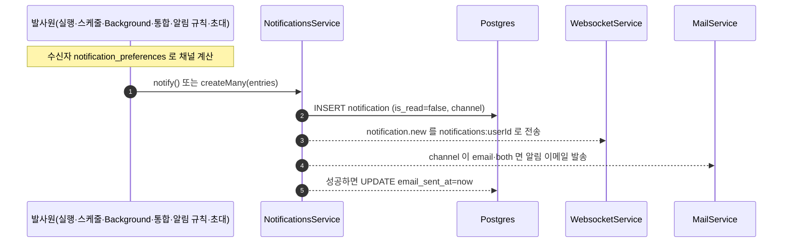
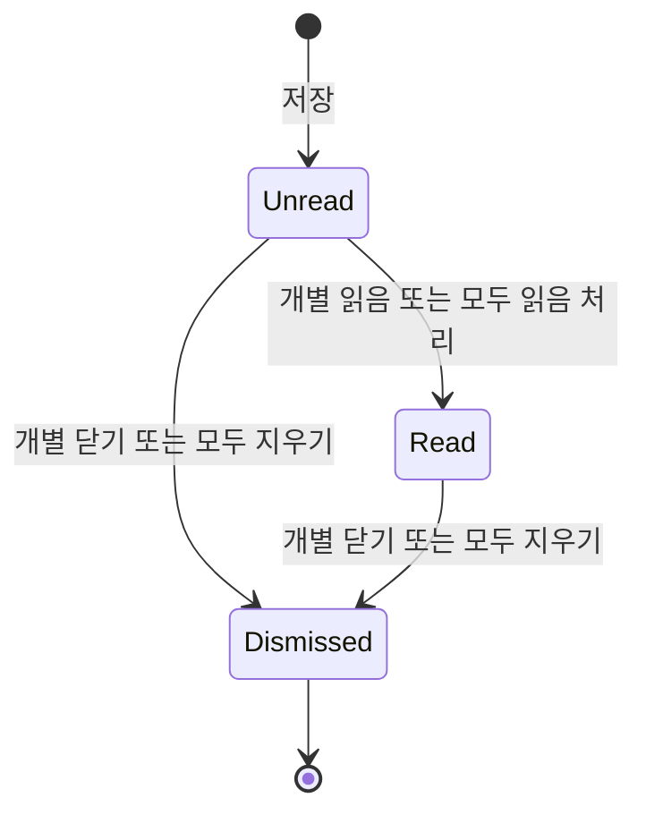
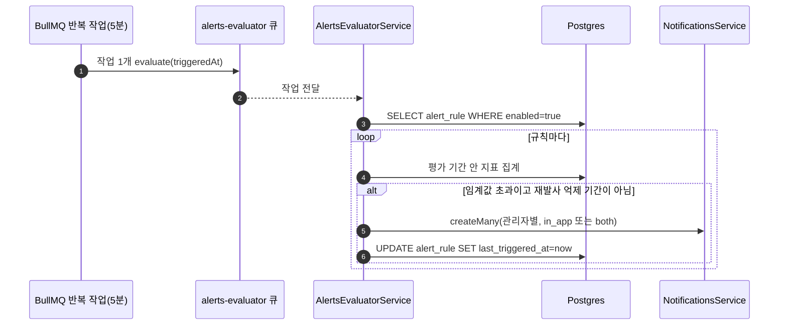

> 구현 상태: 부분 구현 · 원문: `spec/data-flow/8-notifications.md`, `spec/2-navigation/9-user-profile.md` (§5 알림 설정, §6.2 알림 API, §6.3 알림 규칙 API), `spec/2-navigation/_layout.md` (§3.1 알림 벨, §3.2 알림 설정 항목), `spec/data-flow/9-observability.md` (§1.3·§2.1·§3 알림 규칙 평가와 관련 Rationale), `spec/1-data-model.md` (§2.19, §2.25, Rationale "alert_rule 을 §2.25 로 등재") · 용어: [용어 사전](../CLE-GLOSSARY.md)

## 개요

인앱 알림(Notification, `notification`)은 사용자에게 비동기 사건을 알리는 기록이다. 발사원은 실행 실패, 통합 만료, 통합 조치 필요, Background 본문 실패, 알림 규칙 위반, 팀 초대처럼 다양하다. 하지만 모두 `notification` 행 하나를 저장하는 것으로 합쳐진다. 저장한 알림은 사이드바 알림 벨, 이메일, WebSocket 으로 전달된다. 이 문서에서 "알림" 은 인앱 알림을 뜻한다.

이 문서가 정하는 것:

- 알림 유형(`Notification.type`) 목록과 유형별 발사원·수신자·알림 채널(`Notification.channel`)·딥링크 대상
- 저장과 전달 흐름, 채널 계산 책임, 중복 방지 헬퍼
- 알림 벨과 팝오버, 딥링크, 읽음과 알림 닫기(dismiss, `dismissed_at`)
- 알림 설정(notification preferences, `notification_preferences`): 알림 유형별 이메일 수신 여부
- 알림 규칙(Alert Rule, `AlertRule`): 화면, API, 엔티티, 평가
- 알림 API 와 데이터

범위 밖:

- 통합 만료 알림(`integration_expired`)과 조치 필요 알림(`integration_action_required`)의 발사 조건·제목·문구·수신자·임계별 중복 방지: [통합 상태와 만료 알림](../CLE-INT/CLE-INT-STATUS.md)
- Background 본문 실패 알림을 보내는 쪽과 본문 모니터링 API: [Background 노드](../CLE-NODE-LOGIC/CLE-NODE-BACKGROUND.md)
- 팀 초대 흐름과 초대 링크 이메일: [워크스페이스와 멤버](../CLE-ACCT/CLE-ACCT-WS.md)
- WebSocket 이벤트 `notification.new` 의 정의: [WebSocket 이벤트와 명령](../CLE-API/CLE-API-WS-EVENTS.md)
- 외부 URL 로 실행 이벤트를 보내는 EIA 알림 웹훅은 이름만 비슷한 다른 기능이다: [EIA 알림 웹훅](../CLE-IX/CLE-EIA-NOTIFY.md)
- `User.notification_preferences` 컬럼: [계정과 워크스페이스 데이터 흐름](../CLE-ACCT/CLE-ACCT-DATA.md)
- 사이드바 사용자 영역과 아바타 팝업 메뉴: [내 프로필](../CLE-ACCT/CLE-ACCT-PROFILE.md)
- 알림 규칙 평가 큐의 등록 정보: [비동기 큐와 Redis 키 목록](../CLE-PLAT/CLE-PLAT-QUEUE.md)

## 요구사항

- REQ-NOTIFY-001 WHEN 발사원이 알림을 보내면 THE SYSTEM SHALL `notification` 행을 `is_read=false` 와 발사원이 정한 알림 채널로 저장한다. (원본: data-flow/8 §1)
- REQ-NOTIFY-002 WHEN 알림 행을 저장하면 THE SYSTEM SHALL 수신자의 `notifications:<userId>` 구독 채널로 `notification.new` 이벤트를 보낸다. (원본: data-flow/8 §2.2)
- REQ-NOTIFY-003 WHEN 알림 채널이 `email` 이나 `both` 인 알림을 저장하면 THE SYSTEM SHALL 단일 범용 템플릿으로 알림 이메일을 보내고 성공하면 `email_sent_at` 을 채운다. (원본: data-flow/8 §2.2)
- REQ-NOTIFY-004 IF 알림 이메일 발송이 실패하면 THE SYSTEM SHALL 재시도하지 않고 경고 로그를 남기며 `email_sent_at` 을 NULL 로 둔다. (원본: data-flow/8 §3)
- REQ-NOTIFY-005 WHEN 발사원이 알림을 보내면 THE SYSTEM SHALL 수신자의 알림 설정을 발사원 쪽에서 읽어 알림 채널을 계산한다. (원본: data-flow/8 §1)
- REQ-NOTIFY-006 WHEN 최상위 실행이 실패로 끝나면 THE SYSTEM SHALL 워크플로우 소유자와 실행자에게 `execution_failed` 알림을 보낸다. (원본: data-flow/8 §1.1)
- REQ-NOTIFY-007 IF 실패한 실행이 Background 본문이나 서브 워크플로우 같은 하위 실행이면 THE SYSTEM SHALL `execution_failed` 알림을 보내지 않는다. (원본: data-flow/8 §1.1)
- REQ-NOTIFY-008 WHEN 스케줄이 실행을 시작하지 못하면 THE SYSTEM SHALL 워크플로우 소유자에게 `schedule_failed` 알림을 보낸다(예외: REQ-NOTIFY-009 · 052). (원본: data-flow/8 §1.1)
- REQ-NOTIFY-009 IF 스케줄 대상 워크플로우에 소유자(`createdBy`)가 없으면 THE SYSTEM SHALL `schedule_failed` 알림을 건너뛴다. (원본: data-flow/8 §1.1)
- REQ-NOTIFY-010 WHEN `notifyOnFailure` 가 켜진 Background 본문이 실패하면 THE SYSTEM SHALL 워크스페이스 관리자 전원에게 `background_failed` 알림을 보낸다. (원본: data-flow/8 §1.1)
- REQ-NOTIFY-011 WHEN 이미 가입한 비멤버를 워크스페이스에 초대하면 THE SYSTEM SHALL 그 사용자에게 인앱 채널로만 `team_invite` 알림을 보낸다. (원본: data-flow/8 §1.1)
- REQ-NOTIFY-012 WHEN 설치한 마켓플레이스 템플릿이나 에이전트에 새 버전이 나오면 THE SYSTEM SHALL `marketplace_update` 알림을 보낸다. (원본: data-flow/8 §1.1) (미구현)
- REQ-NOTIFY-013 WHEN 실행 실패·스케줄 실패·Background 본문 실패 알림을 저장하면 THE SYSTEM SHALL `resource_type='workflow'` 와 워크플로우 ID 를 `resource_id` 로 채운다. (원본: data-flow/8 §1.1)
- REQ-NOTIFY-014 WHEN `background_failed` 알림을 저장하면 THE SYSTEM SHALL 본문 실행 ID 를 `background_run_id` 에 담고 REST 응답에는 싣지 않는다. (원본: 1-data-model §2.19)
- REQ-NOTIFY-015 WHEN 발사원이 `hasRecentByResource` 로 최근 발사를 검사하면 THE SYSTEM SHALL 닫힌 알림과 읽은 알림도 센다. (원본: data-flow/8 §4.4)
- REQ-NOTIFY-016 WHEN 사이드바를 보이면 THE SYSTEM SHALL 알림 벨에 읽지 않았고 닫지 않은 알림 수를 배지로 보인다. (원본: _layout §3.1)
- REQ-NOTIFY-017 IF 읽지 않은 알림 수가 99 를 넘으면 THE SYSTEM SHALL 배지를 "99+" 로 보인다. (원본: 9-user-profile §5.2)
- REQ-NOTIFY-018 WHEN 사용자가 알림 벨을 누르면 THE SYSTEM SHALL 최근 알림 목록 팝오버를 연다. (원본: _layout §3.1)
- REQ-NOTIFY-019 WHEN 사용자가 팝오버의 필터 칩을 고르면 THE SYSTEM SHALL 전체·일반·통합 액션 필요 기준으로 목록을 거른다. (원본: _layout §3.1)
- REQ-NOTIFY-020 WHEN 사용자가 알림 항목 본문을 누르면 THE SYSTEM SHALL 그 알림을 읽음으로 바꾸고 알림 유형별 경로로 이동한다. (원본: _layout §3.1)
- REQ-NOTIFY-021 IF 딥링크에 쓸 `resource_id` 가 없거나 허용 패턴에 맞지 않으면 THE SYSTEM SHALL 그 유형의 목록 경로로 이동한다. (원본: _layout §3.1)
- REQ-NOTIFY-022 IF 알림 유형이 딥링크 매핑에 없거나 비어 있으면 THE SYSTEM SHALL 알림을 눌러도 이동하지 않는다. (원본: _layout §3.1)
- REQ-NOTIFY-023 WHEN 사용자가 팝오버 항목에 마우스를 올리면 THE SYSTEM SHALL 개별 읽음(✓)과 개별 닫기(✕) 버튼을 보인다. (원본: _layout §3.1)
- REQ-NOTIFY-024 WHEN 사용자가 "모두 읽음 처리" 를 고르면 THE SYSTEM SHALL 본인 알림을 모두 읽음으로 바꾼다. (원본: _layout §3.1)
- REQ-NOTIFY-025 WHEN 사용자가 "모두 지우기" 를 고르면 THE SYSTEM SHALL 현재 워크스페이스의 본인 알림을 모두 닫는다. (원본: data-flow/8 §4.2)
- REQ-NOTIFY-026 WHEN 사용자가 전체 알림 보기 링크를 누르면 THE SYSTEM SHALL 유형·읽음 필터와 페이지네이션이 있는 전체 알림 페이지를 연다. (원본: 9-user-profile §5.2) (미구현)
- REQ-NOTIFY-027 WHEN 사용자가 알림을 닫으면 THE SYSTEM SHALL 행을 지우지 않고 `dismissed_at` 을 채운다. (원본: data-flow/8 §4)
- REQ-NOTIFY-028 WHEN 사용자가 알림을 닫으면 THE SYSTEM SHALL 그 알림의 읽음 상태를 바꾸지 않는다. (원본: data-flow/8 §3)
- REQ-NOTIFY-029 WHEN 알림 목록이나 읽지 않은 알림 수를 조회하면 THE SYSTEM SHALL 닫힌 알림을 뺀다. (원본: data-flow/8 §4.3)
- REQ-NOTIFY-030 WHEN 이미 닫힌 본인 알림을 다시 닫으면 THE SYSTEM SHALL 기존 `dismissedAt` 을 돌려주며 성공으로 처리한다. (원본: data-flow/8 §4.2)
- REQ-NOTIFY-031 IF 다른 사용자의 알림 ID 로 닫기를 요청하면 THE SYSTEM SHALL 404 로 거부한다. (원본: data-flow/8 §4.2)
- REQ-NOTIFY-032 WHEN 사용자가 알림 설정을 조회하면 THE SYSTEM SHALL 저장값이 없는 키에 기본값을 채워 돌려준다. (원본: 9-user-profile §6.2)
- REQ-NOTIFY-033 WHEN 사용자가 알림 설정을 수정하면 THE SYSTEM SHALL 보낸 키만 기존 설정에 합친다. (원본: 9-user-profile §6.2)
- REQ-NOTIFY-034 IF 수신자가 실행 실패나 스케줄 실패 이메일 키를 껐으면 THE SYSTEM SHALL 그 알림을 인앱 채널로만 보낸다. (원본: 9-user-profile §5.1)
- REQ-NOTIFY-035 WHEN 사용자가 알림 유형의 인앱 채널을 끄면 THE SYSTEM SHALL 그 유형의 알림을 벨에 보이지 않는다. (원본: 9-user-profile §5.1) (미구현)
- REQ-NOTIFY-036 WHEN 사용자가 알림 설정 화면을 열면 THE SYSTEM SHALL 알림 유형별 이메일 수신 토글을 보인다. (원본: 9-user-profile §5.1) (미구현)
- REQ-NOTIFY-037 WHEN 하루가 끝나면 THE SYSTEM SHALL 그날의 실패 요약 이메일을 보낸다. (원본: 9-user-profile §5.3) (미구현)
- REQ-NOTIFY-038 WHEN 알림 이메일을 보내면 THE SYSTEM SHALL 이메일 하단에 수신 거부 링크를 넣는다. (원본: 9-user-profile §5.3) (미구현)
- REQ-NOTIFY-039 WHEN 사용자가 알림 규칙 화면(`/profile/alerts`)을 열면 THE SYSTEM SHALL 현재 워크스페이스의 모든 알림 규칙을 멤버 누구에게나 보인다. (원본: 9-user-profile §5.4)
- REQ-NOTIFY-040 WHEN 관리자 미만이 알림 규칙 화면을 보면 THE SYSTEM SHALL 생성 폼과 활성 토글·삭제 버튼을 숨기고 활성 상태를 읽기 전용 배지로 보인다. (원본: 9-user-profile §5.4)
- REQ-NOTIFY-041 IF 관리자 미만이 알림 규칙을 만들거나 고치거나 지우려 하면 THE SYSTEM SHALL 거부한다. (원본: 9-user-profile §6.3)
- REQ-NOTIFY-042 IF 수정·삭제할 알림 규칙이 현재 워크스페이스에 없으면 THE SYSTEM SHALL 404 `ALERT_RULE_NOT_FOUND` 로 거부한다. (원본: 9-user-profile §6.3)
- REQ-NOTIFY-043 WHEN 알림 규칙에 워크플로우를 지정하지 않으면 THE SYSTEM SHALL 워크스페이스 전체를 감시한다. (원본: 9-user-profile §6.3)
- REQ-NOTIFY-044 WHEN 5분 주기가 돌아오면 THE SYSTEM SHALL 켜진 알림 규칙 전체를 한 번에 평가한다. (원본: NF-OB-05, data-flow/9 §1.3)
- REQ-NOTIFY-045 WHILE 서버 인스턴스가 여럿인 동안 THE SYSTEM SHALL 알림 규칙 평가 반복 작업을 하나만 등록해 전역에서 한 번 실행한다. (원본: data-flow/9 §1.3)
- REQ-NOTIFY-046 WHEN 규칙의 관측값이 임계값보다 크면 THE SYSTEM SHALL 워크스페이스 관리자에게 `alert_<type>` 알림을 보내고 `last_triggered_at` 을 갱신한다. (원본: data-flow/9 §1.3)
- REQ-NOTIFY-047 IF 관측값이 임계값과 같거나 작으면 THE SYSTEM SHALL 알림을 보내지 않는다. (원본: data-flow/9 §1.3)
- REQ-NOTIFY-048 WHILE 규칙이 마지막 발사 뒤 평가 기간 안에 있는 동안 THE SYSTEM SHALL 그 규칙의 알림을 다시 보내지 않는다. (원본: data-flow/9 §3)
- REQ-NOTIFY-049 IF `failure_rate` 규칙의 평가 기간 안 실행이 5건 미만이면 THE SYSTEM SHALL 그 규칙의 평가를 건너뛴다. (원본: data-flow/9 §1.3)
- REQ-NOTIFY-050 IF 규칙의 평가 기간 문자열을 해석할 수 없으면 THE SYSTEM SHALL 1시간(`PT1H`)으로 평가한다. (원본: data-flow/9 §1.3)
- REQ-NOTIFY-051 WHEN 알림 채널이 `email` 인 규칙이 발사하면 THE SYSTEM SHALL 알림을 채널 `both` 로 저장한다. (원본: data-flow/9 §1.3)
- REQ-NOTIFY-052 IF 스케줄의 연결 트리거가 가리키는 워크플로우가 스케줄의 워크스페이스에 없어 Cron 발사를 건너뛰면 THE SYSTEM SHALL REQ-NOTIFY-008 의 `schedule_failed` 알림을 보내지 않는다.

## 알림 유형

`Notification.type` 은 아래 열 가지 값이다. DB CHECK 제약은 V052 에서 만들었고 V070 이 `alert_*` 세 값을 넣어 열 개로 다시 정의했다. 상태 "구현됨" 은 코드가 실제로 그 유형의 행을 저장한다는 뜻이다. "미구현" 은 CHECK 제약에는 있지만 아직 어떤 코드도 저장하지 않는 유형이다.

| 유형 | 상태 | 발사원 | 발사 조건 | 수신자 | 알림 채널 | 딥링크 대상 |
| --- | --- | --- | --- | --- | --- | --- |
| `execution_failed` | 구현됨 | `ExecutionEngineService.dispatchExecutionFailedNotification` | 최상위 실행(`!parentExecutionId`)이 `failed` 로 끝남. 초기 세그먼트(`runExecution` 의 catch)와 재개 세그먼트(`finalizeResumedExecutionOutcome`) 양쪽에서 보낸다. 대부분의 실행은 재개 세그먼트에서 끝나므로 두 경로 모두 보내야 빠지지 않는다. Background 본문·서브 워크플로우 같은 하위 실행은 `background_failed` 와 겹치지 않게 뺀다 | 워크플로우 소유자와 실행자(`executedBy`). 겹치면 한 번만 | 기본 `both`. 수신자의 `executionFailedEmail === false` 면 `in_app` | `workflow` / 워크플로우 ID. 실행 단위 딥링크는 없다 |
| `schedule_failed` | 구현됨 | `ScheduleRunnerService.dispatchScheduleFailedNotification` | 스케줄이 실행을 **시작하지 못함**(파라미터 해석·큐 등록 실패). 시작된 실행의 이후 실패는 `execution_failed` 가 맡는다. 워크플로우가 스케줄의 워크스페이스에 없어 건너뛴 발사는 보내지 않는다(REQ-NOTIFY-052). 수신자인 워크플로우 소유자가 다른 워크스페이스 사람이기 때문이다([스케줄 「다른 워크스페이스의 워크플로우」](../CLE-TRIG/CLE-TRIG-SCHEDULE.md#다른-워크스페이스의-워크플로우)) | 워크플로우 소유자(`createdBy`). 없으면 건너뛴다 | 기본 `both`. `scheduleFailedEmail === false` 면 `in_app` | `workflow` / 워크플로우 ID |
| `background_failed` | 구현됨 | `BackgroundExecutionProcessor`(`background-execution.processor.ts`) | `config.notifyOnFailure=true` 인 Background 본문 실패([Background 노드](../CLE-NODE-LOGIC/CLE-NODE-BACKGROUND.md)) | 워크스페이스 관리자 전원(`findAdminUserIds`) | `in_app` | `workflow` / 워크플로우 ID. 본문 실행 귀속은 `background_run_id` 에 따로 담는다 |
| `integration_expired` | 구현됨 | `IntegrationExpiryScanner`(`integration-expiry-scanner.service.ts`) | refresh token 이 없는 통합의 토큰 만료 7일·3일·당일 임계. 조건과 문구는 [통합 상태와 만료 알림](../CLE-INT/CLE-INT-STATUS.md) | [통합 상태와 만료 알림](../CLE-INT/CLE-INT-STATUS.md) | `integrationExpiryEmail` 이 켜져 있으면 `both`, 아니면 `in_app` | `integration` / 통합 ID |
| `integration_action_required` | 구현됨 | `IntegrationActionRequiredNotifierService.notify`(`integration-action-required-notifier.service.ts`) | 토큰 갱신 실패(`auth_failed`), transport 3회 연속 실패(`network`), 권한 범위 부족(`insufficient_scope`). 조건과 문구는 [통합 상태와 만료 알림](../CLE-INT/CLE-INT-STATUS.md) | [통합 상태와 만료 알림](../CLE-INT/CLE-INT-STATUS.md) | 같은 `integrationExpiryEmail` 토글로 계산(전용 토글 없음) | `integration` / 통합 ID |
| `alert_failure_rate`, `alert_duration`, `alert_llm_cost` | 구현됨 | `AlertsEvaluatorService.dispatchBreach` | 알림 규칙 위반. 유형 값은 `alert_` + `AlertRule.type` 이다(`` `alert_${rule.type}` ``) | 워크스페이스 관리자 | 규칙 채널이 `email` 이면 `both`, 아니면 `in_app` | `resource_type='alert_rule'`. 딥링크 매핑이 없어 누르면 이동하지 않는다 |
| `team_invite` | 구현됨 | `WorkspaceInvitationsService.dispatchTeamInviteNotification` | 초대 대상 이메일이 이미 가입한 비멤버일 때 | 초대받은 사용자 | `in_app`. 이메일은 초대 링크 이메일이 맡는다([Rationale](#팀-초대-알림은-인앱-채널로만-보낸다)) | `resource_id` 는 초대 ID. 누르면 `/profile` 로 이동 |
| `marketplace_update` | 미구현 | (도입하면) 마켓플레이스 모듈 | 설치한 템플릿·에이전트의 새 버전([마켓플레이스 (구상)](../CLE-UI/CLE-UI-MARKET.md)) | — | 기본 인앱. 이메일은 도입할 때 opt-in 으로 둔다 | — |

통합 알림 두 유형은 성격으로 나눈다. `integration_expired` 는 토큰 만료가 다가오거나 닥쳤음을 알리는 수동적 안내다. `integration_action_required` 는 운영 중 생긴 장애라 사용자가 바로 손봐야 하는 능동적 경보다. 설치 대기가 만료되는 `install_timeout` 에는 알림을 보내지 않는다. 자세한 기준은 [통합 상태와 만료 알림](../CLE-INT/CLE-INT-STATUS.md) 에 있다.

## 저장과 전달

발사원이 수신자의 알림 설정을 읽어 알림 채널을 계산하고 `NotificationsService` 로 저장한다. 서비스는 이어서 WebSocket 이벤트를 보내고 채널이 `email`·`both` 면 이메일을 보낸다.

- 저장 진입점은 둘이다. 한 건을 저장하는 `notify()` 와 여러 수신자에게 한꺼번에 저장하는 `createMany(entries[])` 다. 둘 다 저장 뒤에 WebSocket 전송과 이메일 발송을 한다.
- **알림 채널은 발사원이 계산한다.** `notify()`·`createMany` 저장 경로는 알림 설정을 보지 않는다. 통합 노티파이어는 안에서 직접 계산하고 실행 실패·스케줄 실패는 `NotificationsService.resolveOptOutEmailChannels` 헬퍼로 계산한다. 이 헬퍼는 조회만 하고 저장 경로에 끼어들지 않는다.
- **WebSocket**: `emitNew` 가 `WebsocketService.emitNotificationEvent(userId, { id, type, title, message, resourceType, resourceId })` 를 부른다. 모든 알림에 대해 바로 보내며 실패해도 저장은 유지된다. 구독 채널은 `notifications:<userId>` 이고 `WebsocketGateway.VALID_CHANNEL_PREFIXES` 에 `notifications:` 접두가 등록돼 있다. 이벤트 정의의 기준은 [WebSocket 이벤트와 명령](../CLE-API/CLE-API-WS-EVENTS.md) 이다.
- **이메일**: `dispatchEmails` 가 `MailService.sendNotificationEmail` 로 보낸다. 제목은 알림 `title`, 본문은 `message` 와 버튼 링크(CTA)다. 유형별 시각 템플릿 대신 범용 템플릿 하나만 쓴다. 성공하면 `email_sent_at` 을 채운다. 실패하면 재시도 없이 경고 로그만 남기고 `email_sent_at` 을 NULL 로 둔다. 부수 기록 실패를 다루는 공통 방식은 [로깅과 헬스 체크](CLE-OBS-LOGGING.md) 에 있다.

## 중복 방지

- `hasRecentByResource(workspaceId, type, resourceId, title, withinMs)` 는 같은 (워크스페이스, 유형, 리소스 ID, 제목) 알림이 최근 `withinMs` 안에 있는지 본다. 있으면 발사원이 보내지 않는다.
- 이 헬퍼는 닫힌 알림(`dismissed_at` 채워짐)과 읽은 알림도 센다. 표시 상태(`is_read`, `dismissed_at`)는 다시 보내는 빈도에 영향을 주지 않는다([Rationale](#중복-방지에-닫힌-알림도-센다)).
- 창이 지나면 같은 알림이 다시 나간다. 장애가 풀리지 않았으면 주기적인 재알림이 되는 셈이다.
- `integration_action_required` 는 현재 구현이 24시간 창을 쓴다. 이 유형의 중복 방지 규칙은 정의가 갈린다. [통합 상태와 만료 알림 §미결 사항](../CLE-INT/CLE-INT-STATUS.md#미결-사항) 참조.
- `integration_expired` 는 이 헬퍼가 아니라 임계별 선점 테이블 `integration_expiry_dispatch` 로 중복을 막는다([통합 상태와 만료 알림](../CLE-INT/CLE-INT-STATUS.md)).
- 알림 규칙은 규칙별 재발사 억제(`last_triggered_at`)를 쓴다([알림 규칙 평가](#알림-규칙-평가)).

## 알림 벨과 팝오버

### 알림 벨

- 사이드바 하단 사용자 영역 옆이나 사이드바 하단에 둔다.
- 배지에는 보이는 알림 가운데 읽지 않은 수(`is_read=false AND dismissed_at IS NULL`)를 보인다. 99 를 넘으면 "99+" 다.
- 벨을 누르면 팝오버가 열린다.

### 팝오버

| 영역 | 들어가는 요소 | 동작 |
| --- | --- | --- |
| 머리 | 제목, 오른쪽 메뉴의 "모두 읽음 처리"·"모두 지우기" | "모두 읽음 처리" 는 `POST /api/notifications/mark-all-read`, "모두 지우기" 는 `POST /api/notifications/dismiss-all`. 두 동작은 서로 독립이며 한쪽이 다른 쪽을 포함하지 않는다 |
| 필터 칩 | `all`(전체), `general`(일반), `integration-action-required`(통합 액션 필요) | 칩을 고르면 목록을 거른다 |
| 알림 목록 | 알림마다 제목과 상대 시간 | 마우스를 올리면 오른쪽에 ✓(개별 읽음)·✕(개별 닫기). 본문을 누르면 읽음 처리 뒤 딥링크로 이동 |
| 전체 보기 링크 | "View all notifications →" | 전체 알림 페이지로 이동. 미구현이며 정의가 갈린다. [미결 사항](#미결-사항) 참조 |

- `general` 은 `integration_action_required` 를 뺀 모든 알림이다. 만료 7일 전 안내 같은 수동적 알림인 `integration_expired` 와 유형이 비어 있는 옛 행도 `general` 로 분류한다(`codebase/frontend/src/lib/notifications/filter.ts`).
- 현재 구현은 팝오버가 최근 알림 10건(`GET /api/notifications?limit=10`)을 불러오고 칩 필터를 그 10건 안에서 적용한다.
- 읽음·닫기 상태와 DTO 는 [읽음과 닫기](#읽음과-닫기) 를 따른다.

### 딥링크

알림을 누르면 유형별로 아래 경로로 이동한다(`codebase/frontend/src/lib/notifications/href.ts`). `resource_id` 는 허용 패턴 `/^[a-zA-Z0-9_-]{1,128}$/` 을 통과해야 한다. 경로 조작과 URL 삽입을 막기 위해서다. 맞지 않거나 없으면 목록 경로로 대신 간다.

| 알림 유형 | 이동 경로 | `resource_id` 가 없거나 맞지 않을 때 |
| --- | --- | --- |
| `integration_action_required`, `integration_expired` | `/integrations/<resource_id>` | `/integrations` |
| `execution_failed`, `background_failed`, `schedule_failed` | `/workflows/<resource_id>`(워크플로우 ID) | `/workflows` |
| `team_invite` | `/profile`(ID 불필요) | — |
| 그 밖, 유형 없음 | 이동하지 않음 | — |

`href.ts` 가 돌려주는 경로는 워크스페이스 슬러그가 없는 형태다. 누르면 옛 경로 흡수 라우트(`(main)/[...rest]`)가 현재 워크스페이스의 `/w/<slug>/…` 로 바꾼다. `/workflows/<id>` 도 슬러그 라우팅 2단계에서 에디터가 들어온 경로 `/w/<slug>/workflows/<id>` 로 바뀐다. 알림은 늘 발사 시점의 워크스페이스 범위라 이 변환이 안전하다([레이아웃과 내비게이션](../CLE-UI/CLE-UI-LAYOUT.md)).

## 읽음과 닫기

읽음(`is_read`)과 닫기(`dismissed_at`)는 서로 다른 두 축이다.

그림은 읽음 축만 단순하게 그렸다. `Dismissed` 는 `dismissed_at IS NOT NULL` 인 상태를 통틀어 부른다. 닫을 때의 `is_read` 값은 그대로 남는다. 닫기가 읽음을 뜻하지 않는다.

| 축 | 컬럼 | 뜻 | 목록 표시 | 읽지 않은 수 |
| --- | --- | --- | --- | --- |
| 읽음 | `is_read` | 사용자가 내용을 알았다 | 영향 없음(보이는 동안 표시) | 빠진다 |
| 닫기 | `dismissed_at` | 사용자가 더는 보고 싶지 않다(NULL 은 보임, 값이 있으면 닫힘) | 닫히면 빠진다 | 닫히면 빠진다 |

두 축을 합치면 네 상태가 된다(`visible` 은 `dismissed_at IS NULL`).

- (읽지 않음, 보임): 방금 만든 알림. 목록에 보이고 수에 든다.
- (읽음, 보임): 읽음 표시만 한 알림. 목록에 보이고 수에 들지 않는다.
- (읽지 않음, 닫힘): 읽지 않고 닫은 알림. 목록과 수 모두에서 빠진다.
- (읽음, 닫힘): 읽고 닫은 알림. 목록과 수 모두에서 빠진다. 가장 흔한 끝 상태다.

닫기 축의 활성 상태는 `visible` 로 부른다. "active" 는 `Workflow.is_active` 같은 켜짐·꺼짐 뜻으로 이미 쓰이고 있어서다([Rationale](#보임과-닫힘이라는-어휘)).

### 닫기 엔드포인트

| 엔드포인트 | 동작 | 권한 |
| --- | --- | --- |
| `POST /api/notifications/:id/dismiss` | 한 건 닫기. `UPDATE notification SET dismissed_at=now() WHERE id=:id AND user_id=:uid AND dismissed_at IS NULL`. 멱등이다. 본인 알림이면 이미 닫혀 있어도 성공한다 | 본인 알림만. 다른 사용자의 ID 는 404 |
| `POST /api/notifications/dismiss-all` | 모두 닫기. `UPDATE notification SET dismissed_at=now() WHERE workspace_id=:ws AND user_id=:uid AND dismissed_at IS NULL`. 응답 `{ data: { affected: number } }` | 본인 알림 가운데 현재 워크스페이스 것만 |

응답 형식은 [OpenAPI 문서화](../CLE-API/CLE-API-SWAGGER.md) 의 응답 DTO 규약을 따른다.

- 한 건: `200 OK`, `ApiOkWrappedResponse(DismissNotificationResponseDto)`. 형태는 `{ id: string; dismissedAt: string }` 이다. `dismissedAt` 은 늘 채워진다. 멱등 호출이면 기존 값을 돌려준다. 클라이언트가 낙관적 갱신을 고치지 않고 그대로 반영할 수 있다.
- 모두: `200 OK`, `ApiOkWrappedResponse(DismissAllNotificationsResponseDto)`. 형태는 `{ affected: number }` 로 `POST /api/notifications/mark-all-read` 의 `MarkAllReadResultDto` 와 같다. 모양이 같아도 뜻이 달라 클래스를 따로 둔다.
- DTO 파일: `codebase/backend/src/modules/notifications/dto/responses/dismiss-notification-response.dto.ts`, `dismiss-all-notifications-response.dto.ts`.

### 목록과 수에 미치는 영향

`GET /api/notifications` 와 `GET /api/notifications/unread-count` 는 **항상** `dismissed_at IS NULL` 로 거른다. 벨 배지도 같은 정의를 따른다(`is_read=false AND dismissed_at IS NULL`). 닫힌 알림을 보고 싶다는 요구는 아직 없어 조회 옵션을 두지 않는다. 필요해지면 그때 `?includeDismissed=true` 를 더한다.

### 보존

닫힌 알림 행은 바로 지우지 않는다. 닫힌 뒤 N일이 지난 행을 지우는 배치나 분석용 닫기 이벤트 집계는 나중에 들일 수 있지만 지금 범위 밖이다. 지금은 행이 그대로 쌓이며 정리가 필요해지면 따로 계획한다.

### 기기 사이 동기화

지금은 같은 기기의 React Query 캐시를 무효화해 팝오버가 바로 바뀐다. 같은 사용자의 다른 기기·탭 사이에서 읽음과 닫기를 맞추는 기능(한 탭에서 닫은 알림이 다른 탭에서도 바로 사라짐)은 아직 없다. `notification.read`, `notification.dismissed` 이벤트를 새로 만들면 가능하며 후속 단계에서 검토한다. 이벤트 이름은 기존 `notification.new` 접두와 맞춘다.

## 알림 설정

### 이메일 수신 토글

사용자는 알림 유형별로 이메일을 받을지 정한다. 저장 위치는 `User.notification_preferences` JSONB(V010)다. API 는 구현됐다(`GET`·`PATCH /api/notifications/settings`). 설정 화면의 구현 여부는 정의가 갈린다. [미결 사항](#미결-사항) 참조.

| 알림 유형 | 기본 채널 | 사용자 변경 | 설정 키와 기본값 |
| --- | --- | --- | --- |
| 워크플로우 실행 실패 | 인앱 + 이메일 | 가능. 이메일을 끄는 방식(opt-out) | `executionFailedEmail`, 기본 켜짐 |
| 스케줄 실행 실패 | 인앱 + 이메일 | 가능. 이메일을 끄는 방식(opt-out) | `scheduleFailedEmail`, 기본 켜짐 |
| 통합 만료·조치 필요 | 인앱. 이메일은 켜야 받는다 | 가능. 이메일을 켜는 방식(opt-in) | `integrationExpiryEmail`, 기본 꺼짐 |
| 마켓플레이스 업데이트 | 인앱 | 아직 보내지 않는다. 도입하면 이메일을 켜는 방식(opt-in) | 없음 |
| 팀 초대 | 인앱 + 이메일 | 불가(항상 보낸다) | 없음 |

- 조회(`GET`)는 저장값이 없는 키에 기본값을 채워 돌려준다. 현재 구현은 `integrationExpiryEmail` 이 없으면 `false`, `executionFailedEmail`·`scheduleFailedEmail` 이 없으면 `true` 로 채운다. 수정(`PATCH`)은 보낸 키만 합친다.
- 통합 알림 노티파이어는 `notification_preferences.integrationExpiryEmail === true` 일 때만 이메일을 붙인다. 표의 "인앱" 은 기본 상태이고 "이메일은 켜야 받는다" 는 켠 뒤에 닿는 채널이다. 통합 알림의 채널 규칙은 [통합 상태와 만료 알림](../CLE-INT/CLE-INT-STATUS.md) 과 같다.
- 실행 실패·스케줄 실패는 발사원이 `resolveOptOutEmailChannels` 로 수신자의 토글을 반영한다.
- **팀 초대의 이메일은 초대 링크 이메일이다.** 기존 가입자(비멤버)를 초대하면 이메일은 수락 토큰을 담은 초대 링크 이메일(`MailService.sendWorkspaceInvitationEmail`)이 보낸다. `team_invite` 알림 행은 `in_app`(벨)으로만 저장한다. 알림 행을 `both` 로 두면 토큰 없는 범용 알림 이메일이 초대 링크 이메일과 겹치기 때문이다. 그래서 이 행의 "인앱 + 이메일" 은 제품 수준에서 맞다(벨 알림과 초대 링크 이메일이 둘 다 닿는다). 이메일을 보내는 주체가 알림 파이프라인이 아니라 초대 흐름일 뿐이다([Rationale](#팀-초대-알림은-인앱-채널로만-보낸다)).

범위와 빈칸:

- 인앱 채널 끄기는 미구현이다. 인앱 알림은 늘 벨에 보인다.
- 마켓플레이스 업데이트는 아직 보내지 않아 토글 대상이 아니다. 도입할 때 opt-in 으로 둔다.
- 이메일 일일 요약은 미구현이다(아래).
- `/profile/alerts` 는 알림 설정 화면이 아니라 [알림 규칙](#알림-규칙) 화면이다.

### 이메일 알림

| 항목 | 설명 |
| --- | --- |
| 즉시 발송 | 실행 실패, 통합 만료, 팀 초대 |
| 일일 요약 | 하루 동안의 실패 요약. 미구현. 설정 저장소(`notification_preferences`)는 있지만 요약을 모아 보내는 작업과 전용 토글이 없어 아직 동작하지 않는다 |
| 수신 거부 | 이메일 하단의 수신 거부(unsubscribe) 링크. 정의가 갈린다. [미결 사항](#미결-사항) 참조 |

## 알림 규칙

알림 규칙은 워크스페이스 단위 규칙이다. 실패율·평균 실행 시간·LLM 비용이 임계값을 넘으면 인앱 알림을 보낸다. [알림 설정](#알림-설정) 의 이메일 토글과는 별개다(NF-OB-05).

### 화면 (`/profile/alerts`)

| 항목 | 내용 |
| --- | --- |
| 규칙 목록 | 현재 워크스페이스의 모든 규칙. 유형(실패율·실행 시간·LLM 비용), 임계값, 평가 기간, 활성 상태 열. 멤버 누구나 볼 수 있다 |
| 생성 폼 | 관리자 이상에게만 보인다(`useHasRole("admin")`). 유형 선택, 임계값 숫자 입력, 평가 기간(ISO 8601 기간, 폼 기본값 `PT1H`) |
| 활성 토글·삭제 | 관리자 이상 전용 행 동작. 관리자 미만에게는 활성 상태를 읽기 전용 배지로만 보인다 |

### API

`codebase/backend/src/modules/alerts/` 가 제공한다.

| 메서드 | 경로 | 권한 | 설명 |
| --- | --- | --- | --- |
| GET | `/api/alerts` | 멤버 | 현재 워크스페이스의 알림 규칙 목록 |
| POST | `/api/alerts` | 관리자 이상 | 규칙 생성. 본문: `type`(`failure_rate` 실패율 %, `duration` 평균 실행 시간 ms, `llm_cost` 누적 LLM 비용 USD), `threshold`(number, 0 이상, 단위는 유형별), `window?`(ISO 8601 기간, 예 `PT1H`. 없으면 모듈 기본값), `channel?`(`in_app` 또는 `email`, 기본 `in_app`), `workflowId?`(UUID. 없으면 워크스페이스 전체 감시), `enabled?`(기본 `true`). `workflowId` 가 같은 워크스페이스의 워크플로우가 아니면 400 `VALIDATION_ERROR`(`details[].field='workflowId'`)다([참조의 소속](../CLE-PLAT/CLE-PLAT-DATA.md#참조의-소속)) |
| PATCH | `/api/alerts/:id` | 관리자 이상 | 부분 수정(`threshold`·`window`·`channel`·`enabled`). 현재 워크스페이스에 없으면 404 `ALERT_RULE_NOT_FOUND` |
| DELETE | `/api/alerts/:id` | 관리자 이상 | 영구 삭제(204 No Content). 현재 워크스페이스에 없으면 404 `ALERT_RULE_NOT_FOUND` |

- `ALERT_RULE_NOT_FOUND` 는 `where: { id, workspaceId }` 로 찾으므로 다른 워크스페이스의 규칙에 접근해도 같은 404 다([에러 코드 규약과 카탈로그](../CLE-API/CLE-API-ERRCODES.md)).
- DTO 의 `window` 는 `@IsString` 만 검사한다. 그래서 아무 문자열이나 저장될 수 있다. 그때는 평가의 1시간 대체값이 실제 동작을 정한다(아래).
- 응답의 `threshold` 는 문자열이다. 쓰기는 `number` 로 받는다([데이터](#데이터)).

### 알림 규칙 평가

- `onModuleInit` 이 `queue.upsertJobScheduler` 로 반복 작업 **하나**를 등록한다. 이름은 `'alerts-evaluator-5min'`, 작업 이름은 `'evaluate'`, payload 는 `{ triggeredAt }` 이다. 주기는 `*/5 * * * *`(UTC)다. 규칙마다 큐에 넣지 않는다. 처리기의 `run()` 이 `enabled=true` 규칙 전체를 직접 읽어 차례로 평가한다(`alerts-evaluator.service.ts`). 큐 등록 정보는 [비동기 큐와 Redis 키 목록](../CLE-PLAT/CLE-PLAT-QUEUE.md) 에 있다.
- 지표는 `execution`(실패율, 평균 실행 시간)과 `llm_usage_log`(LLM 비용)에서 집계한다. 수신자인 워크스페이스 관리자는 워크스페이스 멤버에서 찾는다.
- 발사하면 알림 저장(`notificationsService.createMany`)과 `last_triggered_at` 갱신만 한다. 감사 로그는 남기지 않는다(`dispatchBreach`).

평가와 발사의 세부 규칙:

- **최소 표본**: `failure_rate` 는 평가 기간 안 전체 실행이 **5건 미만**이면 평가하지 않는다(`computeFailureRate` 에서 `total < 5` 면 `null`). 1건 중 1건 실패가 50% 규칙을 울리지 않게 한다. 사용자에게는 "알림이 안 온다" 로 보일 수 있다.
- **초과 판정은 엄격하다**: `observed <= threshold` 면 보내지 않는다(`evaluateRule`). 임계값과 정확히 같은 관측값은 알림을 보내지 않는다.
- **평가 기간 해석**: `rule.window` 는 자체 최소 정규식 파서(`parseIso8601Duration`)로 해석한다. `P?D` 와 `PT?H?M?S` 조합을 지원한다. 해석할 수 없는 문자열이면 알리지 않고 1시간(`PT1H`)으로 평가한다.
- **채널 매핑**: 규칙의 `channel='email'` 은 발사 때 알림 채널 `both`(인앱 + 이메일)가 된다. 이메일만 보내는 경로는 없다.
- **재발사 억제**: 규칙의 `last_triggered_at` 이 평가 기간 안이면 다시 보내지 않는다(`isInCooldown`). 규칙에 상태 머신은 없고 `enabled` 토글만 있다.

## 알림 API

모든 경로는 로그인한 본인의 알림만 다룬다.

| 메서드 | 경로 | 설명 |
| --- | --- | --- |
| GET | `/api/notifications` | 알림 목록. 쿼리 `type`, `is_read`, `page`, `limit`. 닫힌 알림은 빠진다 |
| GET | `/api/notifications/unread-count` | 읽지 않은 알림 수. 닫힌 알림은 빠진다 |
| PATCH | `/api/notifications/:id/read` | 알림 한 건 읽음 처리 |
| POST | `/api/notifications/mark-all-read` | 모두 읽음 처리 |
| POST | `/api/notifications/dismiss-all` | 모두 닫기. `mark-all-read` 와 독립이다 |
| POST | `/api/notifications/:id/dismiss` | 알림 한 건 닫기. 멱등이다 |
| GET | `/api/notifications/settings` | 알림 이메일 토글 조회. 없는 키는 기본값으로 채운다 |
| PATCH | `/api/notifications/settings` | 알림 이메일 토글 부분 수정. 보낸 키만 합친다 |

알림 규칙 API 는 [알림 규칙](#알림-규칙) 에 있다.

## 데이터

### Notification

| 필드 | 타입 | 설명 |
| --- | --- | --- |
| id | UUID | PK |
| workspace_id | UUID | FK → Workspace (CASCADE) |
| user_id | UUID | FK → User (NO ACTION). 수신자 |
| type | Enum | 알림 유형. 값은 [알림 유형](#알림-유형) 의 열 가지 |
| title | String | 알림 제목 |
| message | String | 알림 내용 |
| resource_type | String? | 관련 리소스 종류. 딥링크 라우팅 키(`workflow`, `integration`, `workspace_invitation` 등) |
| resource_id | UUID? | 관련 리소스 ID. 딥링크 대상. 실패류 알림은 워크플로우 ID |
| background_run_id | UUID? | `background_failed` 알림의 본문 실행 귀속 전용 키(V107). 딥링크(`resource_type`·`resource_id`=워크플로우)와 분리했다. Background 본문 모니터링 API 만 읽는다. REST 에 싣지 않는다(`select: false`) |
| is_read | Boolean | 읽음 여부. 기본 false |
| channel | Enum | 알림 채널. `in_app` / `email` / `both` |
| email_sent_at | Timestamp? | 이메일 발송 시각. NULL 이면 보내지 않았거나 실패 |
| dismissed_at | Timestamp? | 사용자가 닫은 시각. NULL 이면 보임. 목록과 읽지 않은 수에서 빠진다 |
| created_at | Timestamp | 생성 시각 |

- 테이블은 V001, `dismissed_at` 은 V055, 부분 인덱스 전환은 V056, `background_run_id` 는 V107 에서 더했다.
- 인덱스:
  - `(user_id, is_read, created_at DESC) WHERE dismissed_at IS NULL`: 사용자별 읽지 않은 알림 조회(벨 배지, 팝오버). 보이는 알림만 보므로 부분 인덱스다.
  - `(workspace_id, created_at DESC)`: 워크스페이스 단위 조회. 앞으로 관리자·감사 조회가 닫힌 알림까지 볼 여지를 두려고 부분 인덱스로 바꾸지 않았다.
  - `background_run_id WHERE background_run_id IS NOT NULL`(V107): 본문 실행 귀속 조회(`NotificationsService.findByBackgroundRun`, `created_at ASC`). Background 본문 모니터링 API(`background-runs.service.ts`)가 관련 `background_failed` 알림을 자기 응답에 함께 싣는 데 쓴다.
- 쓰기:
  - 저장: `INSERT workspace_id, user_id, type, title, message, resource_type?, resource_id?, background_run_id?, is_read=false, channel, email_sent_at?, dismissed_at=NULL`
  - 읽음: `UPDATE is_read=true`
  - 한 건 닫기: `UPDATE dismissed_at=now() WHERE id=? AND user_id=? AND dismissed_at IS NULL`
  - 모두 닫기: `UPDATE dismissed_at=now() WHERE workspace_id=? AND user_id=? AND dismissed_at IS NULL`
  - 알림 규칙 발사: `createMany` 로 `type=alert_<type>`, `resource_type='alert_rule'` 행 저장

### AlertRule

워크스페이스 단위 알림 규칙이다(V016).

| 필드 | 타입 | 설명 |
| --- | --- | --- |
| id | UUID | PK |
| workspace_id | UUID | FK → Workspace (CASCADE) |
| workflow_id | UUID? | FK → Workflow (CASCADE, 같은 워크스페이스). **NULL 이면 워크스페이스 전체 규칙**. 값이 있으면 같은 워크스페이스의 워크플로우만 가리킨다([데이터 모델 개요 §참조의 소속](../CLE-PLAT/CLE-PLAT-DATA.md#참조의-소속)) |
| type | Enum | `failure_rate` / `duration` / `llm_cost` |
| threshold | Numeric(12,4) | 임계값. **응답에는 문자열로 실린다.** 엔티티를 그대로 내보내는 경로라 TypeORM 의 numeric 표현이 그대로 나간다([OpenAPI 문서화](../CLE-API/CLE-API-SWAGGER.md)). 쓰기는 `number` 를 받는다 |
| window_iso | String | 평가 기간(window, ISO 8601 기간). 기본 `PT1H` |
| channel | Enum | `in_app` / `email`. 기본 `in_app`. **`Notification.channel` 과 값 범위가 다르다.** 그쪽은 `both` 를 포함한 세 값이라 그대로 대응하지 않는다 |
| enabled | Boolean | 평가 대상 여부. 기본 true |
| last_triggered_at | Timestamp? | 마지막 발사 시각. 재발사 억제에 쓴다 |
| created_by | UUID? | FK → User (**SET NULL**). 만든 사람이 지워져도 규칙은 남는다 |
| created_at | Timestamp | 생성 시각 |
| updated_at | Timestamp | 수정 시각 |

- 인덱스: `idx_alert_rule_workspace (workspace_id)`, `idx_alert_rule_enabled (enabled) WHERE enabled = true`. 평가가 켜진 규칙만 전부 읽으므로 부분 인덱스가 그 조회를 바로 받는다.
- 발사한 알림의 유형은 `alert_` + 이 표의 `type` 이다.

### 알림 설정 저장

알림 설정은 `User.notification_preferences` JSONB(V010, 기본 `{}`)에 둔다. 컬럼 정의는 [계정과 워크스페이스 데이터 흐름](../CLE-ACCT/CLE-ACCT-DATA.md) 에 있고 키와 기본값은 [알림 설정](#알림-설정) 이 정한다.

### 외부 의존

| 의존 | 방향 | 내용 |
| --- | --- | --- |
| WebSocket | 내부 전송 | `WebsocketService` 하나로 보낸다 |
| SMTP | 내부에서 외부로 | `MailService` |
| 사용자 설정 | 발사원이 읽음 | `user.notification_preferences` |
| 실행·LLM 사용량 | 알림 규칙 평가가 읽음 | `execution`, `llm_usage_log` |
| 워크스페이스 | 알림 규칙 평가가 읽음 | 수신자(관리자) 조회 |

## 미결 사항

- **알림 설정 화면의 구현 여부**: 원문 알림 설정 절(9-user-profile §5.1)은 이메일 채널 켜고 끄기가 구현됐고 사용자가 바꿀 수 있다고 적는다. 원문 레이아웃(§3.2)은 알림 기본 설정 화면이 아직 없다(Planned)고 적는다. 요구사항 NAV-UP-02 는 사용자 메뉴의 "알림 설정" 을 구현 완료로 적는다. 현재 구현은 백엔드 API(`GET`·`PATCH /api/notifications/settings`)만 있고 프런트엔드에는 이 API 를 부르는 곳이 없다. 설정 화면을 만들지, API 만 있는 상태로 요구사항을 고칠지 결정이 필요하다(관련: [내 프로필](../CLE-ACCT/CLE-ACCT-PROFILE.md)).
- **이메일 수신 거부 링크**: 원문 이메일 알림 절(9-user-profile §5.3)은 이메일 하단에 수신 거부 링크를 둔다고 적고 미구현 표시가 없다. 원문 데이터 흐름은 알림 이메일을 제목·본문·버튼 링크로 된 범용 템플릿 하나로만 적는다. 현재 구현의 메일·알림 모듈에는 수신 거부 처리가 없다. 수신 거부 링크를 구현할지, 요구에서 뺄지 결정이 필요하다.
- **이메일 설정 키의 기본 방향**: 원문 알림 설정 절과 현재 구현은 키마다 방향이 다르다. `integrationExpiryEmail` 은 켜야 받는 opt-in(기본 꺼짐)이고 `executionFailedEmail`·`scheduleFailedEmail` 은 꺼야 안 받는 opt-out(기본 켜짐)이다. 원문 데이터 흐름의 Rationale 은 "`integrationExpiryEmail` 키만 쓰며 이메일 opt-in 의 기본은 false" 라고 적어 키 하나·opt-in 하나만 있는 것처럼 읽힌다. 새 키를 더할 때 기본 방향을 무엇으로 정할지(유형마다 정할지, 공통 규칙을 둘지) 규칙이 없다. 결정이 필요하다.
- **전체 알림 페이지와 팝오버 구성**: 원문 알림 센터 절(9-user-profile §5.2)은 벨 드롭다운에 최근 알림 최대 10개와 "View all" 링크를 두고 유형·읽음 필터와 페이지네이션이 있는 전체 알림 페이지를 둔다고 적는다. 원문 레이아웃(§3.1)은 필터 칩·개별 읽음과 닫기·딥링크가 있는 팝오버만 정의하고 전체 알림 페이지를 말하지 않는다. 현재 구현은 팝오버가 최근 10건을 불러오고 전체 알림 페이지 라우트가 없다. 전체 알림 페이지를 만들지, 요구에서 뺄지 결정이 필요하다.

## 구현 위치

- `codebase/backend/src/modules/notifications/notifications.service.ts` (`notify`, `createMany`, `emitNew`, `dispatchEmails`, `hasRecentByResource`, `findByBackgroundRun`, `resolveOptOutEmailChannels`)
- `codebase/backend/src/modules/notifications/notifications.controller.ts`
- `codebase/backend/src/modules/mail/mail.service.ts` (`sendNotificationEmail`)
- `codebase/backend/src/modules/websocket/websocket.service.ts` (`emitNotificationEvent`)
- `codebase/backend/src/modules/alerts/alerts.service.ts` (알림 규칙 CRUD)
- `codebase/backend/src/modules/alerts/alerts-evaluator.service.ts` (알림 규칙 평가)
- `codebase/frontend/src/components/layout/sidebar.tsx` (알림 벨과 팝오버)
- `codebase/frontend/src/lib/notifications/*.ts` (필터와 딥링크)
- `codebase/frontend/src/app/(main)/w/[slug]/profile/alerts/**` (알림 규칙 화면)

## Rationale

### 알림 설정을 JSONB 로 둔다

알림 유형이 늘 때마다 `user` 테이블에 컬럼을 더하지 않으려고 JSONB 로 둔다(V010). 키가 없을 때의 해석은 키마다 다르며 [알림 설정](#알림-설정) 이 정한다. 통합 알림의 두 발사원(`IntegrationExpiryScanner`, `IntegrationActionRequiredNotifierService`)은 `prefs.integrationExpiryEmail === true` 로 엄격하게 비교한다. 키가 없으면 false 라 이메일을 붙이지 않는다(`channel='in_app'`).

### 이메일 실패는 경고만 남기고 재시도하지 않는다

SMTP 실패는 대개 일시적이다. 하지만 알림 도메인이 자체 재시도 큐를 운영하면 복잡해진다. 발송 실패가 잦아지면 외부 SMTP 서비스(예: SES)를 들이면서 큐를 더하는 방향으로 계획한다. 그 전까지는 `email_sent_at` 이 NULL 인 행으로 운영자가 살핀다.

### 딥링크와 본문 실행 귀속을 다른 컬럼에 둔다 (V107)

`background_failed` 알림은 소비처 두 곳이 서로 다른 리소스 키를 요구한다.

1. **팝오버 딥링크**(`href.ts`)는 `background_failed` 를 `/workflows/<resource_id>` 로 보내므로 `resource_id` 가 **워크플로우 ID** 여야 한다(`execution_failed`·`schedule_failed` 와 같은 계약).
2. **Background 본문 모니터링 API**(`background-runs.service.findByBackgroundRun`)는 특정 본문 실행에 관련된 알림만 정확히 골라야 하므로 **본문 실행 단위** 키(`backgroundRunId`)가 필요하다. 워크플로우 ID 로는 같은 워크플로우의 여러 본문 실행을 가를 수 없다.

(`resource_type`, `resource_id`) 한 쌍으로 두 요구를 함께 채울 수 없다. 그래서 딥링크는 `resource_type`·`resource_id`(워크플로우)가 맡고 귀속은 새 NULL 허용 컬럼 `background_run_id`(V107, 부분 인덱스, REST 에 싣지 않음)가 맡도록 나눴다.

"`href.ts` 가 본문 실행으로 라우팅하게 바꾸기" 는 기각했다. 본문 실행은 (`executionId`, `backgroundRunId`) 쌍으로만 주소를 정할 수 있다. `href.ts` 는 `resource_id` 하나만 갖고 있어 `backgroundRunId` 만으로는 URL 을 만들 수 없다. 딥링크 계약 자체를 바꿔야 해 더 무겁다. 예전의 `resource_type='background_run'`·`resource_id=backgroundRunId`(옛 NodeExecution 은 `execution`·`executionId`)는 누르면 404 가 나던 결함이었고 이 분리로 해소됐다. 배포 전에 저장된 `background_failed` 행은 소급해 채우지 않는다. 지난 알림은 이미 소비됐고 소급 표시의 가치가 낮아 의도적으로 감수한다.

컬럼 이름 `background_run_id` 는 V047 의 `node_execution` JSONB 경로 인덱스(`idx_node_execution_background_run_id`, `meta.backgroundRunId`)와 비슷해 보이지만 테이블도 목적도 전혀 다르다.

### 닫기는 행을 지우지 않고 `dismissed_at` 을 채운다

팝오버에 "닫기(✕)" 를 넣으면서 행 삭제 대신 `dismissed_at TIMESTAMPTZ NULL` 컬럼을 채우는 방식을 골랐다.

1. **추적 기록 보존**: 어떤 알림이 사용자에게 닿았고 사용자가 어떻게 처리했는지는 장애 뒤 조사에 쓸모가 있다. 예를 들어 `integration_action_required` 를 사용자가 실제로 보고 조치했는지, 닫고 넘겼는지 알 수 있다.
2. **분석 데이터**: 유형별 읽음 비율과 닫기 비율은 나중에 어떤 유형을 이메일로 올릴지, 어떤 임계를 바꿀지 정하는 근거가 된다.
3. **되살리기 여지**: 실수로 닫은 알림을 복구하는 기능을 나중에 넣을 수 있다. 행을 지우면 불가능하다.
4. **중복 방지 유지**: `hasRecentByResource` 는 닫힌 행도 세야 과도한 알림을 막는다. 행을 지우면 닫는 순간 24시간 가드가 풀려 같은 장애 알림이 되풀이될 수 있다.

`is_deleted BOOLEAN` 대신 `dismissed_at` 을 고른 이유는 시각도 함께 남아 정보가 더 많고 "닫힌 뒤 N일" 같은 보존·분석 정책에도 시각 컬럼이 자연스러워서다. 별도 `notification_dismissals` 테이블은 두지 않는다. `is_read` 와 같은 행을 한 트랜잭션에서 고치는 일관성 이점이 사라지고 JOIN 비용이 생긴다. 닫기는 행마다 0~1번 일어나는 1:1 관계라 테이블을 따로 둘 가치가 없다.

`(user_id, is_read, created_at DESC)` 인덱스는 부분 인덱스(`WHERE dismissed_at IS NULL`)로 바꿔 목록과 읽지 않은 수 조회에 그대로 쓴다. 보이는 알림이 닫힌 알림보다 대개 훨씬 적어 인덱스가 작아지는 이점도 있다. V056 은 `executeInTransaction=false` 로 `CREATE INDEX CONCURRENTLY ... WHERE dismissed_at IS NULL` 을 먼저 만들고 옛 인덱스를 `DROP INDEX CONCURRENTLY` 로 지웠다. 이 순서는 V056 당시의 것이다. 이후 옛 인덱스를 먼저 지우는 순서가 규약이 됐다. `CREATE INDEX CONCURRENTLY IF NOT EXISTS` 는 이름만 보고 `indisvalid` 를 보지 않아 빌드가 실패한 뒤 다시 돌리면 쓸 수 있는 인덱스가 0개가 될 수 있기 때문이다. 새로 쓰는 인덱스 교체는 [DB 마이그레이션 규약](../CLE-ENG/CLE-ENG-MIGRATION.md) 을 따른다. V056 자체는 append-only 라 고치지 않는다.

### 중복 방지에 닫힌 알림도 센다

`hasRecentByResource` 는 `dismissed_at IS NULL` 필터를 **걸지 않는다**. 닫힌 행을 빼면 사용자가 알림을 닫을 때마다 24시간 가드가 풀린다. 그러면 같은 장애(`integration_action_required` 등)에 대해 닫을 때마다 알림이 다시 나가 지나치게 시끄러워진다.

- 닫기는 **표시에 관한 결정**(이 사용자가 더는 팝오버에서 보고 싶지 않다)이다. 중복 방지는 **발사원에 관한 결정**(같은 사건을 짧은 간격으로 다시 보내지 않는다)이다. 의도가 다르므로 한 컬럼이 두 결정에 함께 영향을 주면 안 된다.
- 운영 중 장애(`auth_failed`, `network`)가 24시간 안에 저절로 풀리지 않으면 사용자에게는 여전히 조치가 필요하다. 그래도 같은 행이 창 안에 살아 있는 동안에는(사용자가 닫았더라도) 새 알림이 나가지 않는다. 24시간이 지나 그 행의 `created_at` 이 기준을 넘으면 새 알림이 나간다. 자연스러운 주기적 재알림이다.

헬퍼가 `is_read` 를 무시하는 것과 같은 원리로 두 표시 축(`is_read`, `dismissed_at`) 모두 중복 방지에 영향을 주지 않는다. 앞으로 별도 옵션으로 나누지 않는다.

### 보임과 닫힘이라는 어휘

`dismissed_at IS NULL` 상태를 부를 이름으로 `active`, `live`, `visible`, `undismissed` 가 후보였다. `active` 는 `Workflow.is_active`·`Trigger.is_active`·`Schedule.is_active` 의 켜짐·꺼짐 뜻으로 이미 쓰여 명세를 검색할 때 헷갈린다. `live` 는 실시간 스트림 뜻과 섞인다. `undismissed` 는 부정형이라 읽기 어렵다.

`visible` 을 골랐다. 팝오버에서 사용자에게 보이는 상태라는 사용자 관점의 말이고 DB 컬럼 `dismissed_at` 과 반대 뜻이 바로 읽힌다. DB 컬럼 이름은 `dismissed_at` 그대로 두고 명세 본문·API 문서·화면 표시에서만 `visible` 을 쓴다. 화면에서도 `Active`·`Inactive` 배지 표현은 일부러 쓰지 않는다.

### 닫기 엔드포인트는 `POST /:id/dismiss` 로 둔다

`DELETE /notifications/:id`·`DELETE /notifications` 도 후보였다. 기존 `POST /notifications/mark-all-read` 와 짝이 맞는 `POST` 동작 엔드포인트를 골랐다.

1. **코드베이스 관례상 `DELETE` 는 행 삭제다.** 행을 지우지 않는 `dismissed_at` 갱신에 같은 동사를 쓰면 API 를 쓰는 쪽이 "알림이 사라졌다 = 행이 사라졌다" 로 오해할 수 있다.
2. **`DELETE` 응답 본문 호환성**: 일부 HTTP 클라이언트와 API 게이트웨이는 `DELETE` 응답 본문을 무시하거나 없앤다. 닫기 응답에는 `dismissedAt` 이나 `affected` 가 있어야 클라이언트가 낙관적 갱신을 고치지 않고 반영할 수 있다.
3. **API 계약 정합성**: 단건 상태 변경을 `PATCH` 로 통일할지가 아직 정해지지 않았다. 이때 새 엔드포인트에 `DELETE` 를 들이면 알림 모듈의 동사 정책이 다른 모듈의 결정과 어긋날 수 있다. `POST` 동작 엔드포인트는 어느 쪽으로 정해지든 맞는 보수적 선택이다. `PATCH` 로 정해지더라도 닫기는 별개 동작이라 영향이 없다(`mark-all-read` 가 `POST` 인 것과 같은 이유).
4. **`mark-all-read` 와 동사를 맞춘다**: 모두 읽음이 이미 `POST /notifications/mark-all-read` 이므로 모두 닫기도 `POST /notifications/dismiss-all` 로 맞추면 클라이언트 SDK 가 두 동작을 같은 방식으로 부른다.

`PATCH /notifications/:id` + 본문 `{ dismissed: true }` 도 쓰지 않는다. 읽음 처리(`PATCH /:id/read`)와 차원이 다른 동작을 한 엔드포인트에 묶어 의도가 흐려지고 본문의 부분 수정 뜻과 동작 뜻이 섞인다.

### 모두 읽음은 `POST /notifications/mark-all-read` 다

모두 읽음은 `POST /notifications/mark-all-read`(`NotificationsController.markAllRead`, `@Post('mark-all-read')`)다. 여러 건을 읽음으로 바꾸는 멱등 상태 변경이라 `PATCH`·`POST` 모두 가능했다. 일관된 `POST /동작-동사` 형태가 NestJS 컨트롤러 구현 관례와 잘 맞아 골랐다. 닫기 엔드포인트의 `POST` 도 이 형태를 따른다.

### WebSocket 이벤트는 `notification.new` 와 `notifications:<userId>` 로 적는다

1. **프로토콜 기준**: 알림 이벤트의 정식 정의는 [WebSocket 이벤트와 명령](../CLE-API/CLE-API-WS-EVENTS.md) 이다. 거기서 구독 채널은 `notifications:{userId}`, 이벤트는 점 표기 `notification.new` 다. 다른 WebSocket 이벤트(`execution.started`, `execution.node.completed`, `auth.token_expired` 등)도 점 표기를 쓴다.
2. **게이트웨이 코드와 맞춘다**: `WebsocketGateway.VALID_CHANNEL_PREFIXES` 에 등록된 접두는 `user:` 가 아니라 `notifications:` 다.
3. **후속 이벤트와 맞춘다**: 기기 사이 동기화 후속으로 계획한 `notification.read`·`notification.dismissed` 도 점 표기다.

### 팀 초대 알림은 인앱 채널로만 보낸다

기존 가입자(비멤버)를 팀에 초대하면 `WorkspaceInvitationsService.invite()` 가 이메일을 보낼 수 있는 발송 두 가지를 차례로 한다.

1. `dispatchEmail` → `MailService.sendWorkspaceInvitationEmail`: **수락 토큰을 담은 초대 링크 이메일**. 제목은 `Clemvion - "<ws>" 워크스페이스 초대`, 버튼은 "초대 수락하기" 로 초대 가입 경로(`invitationToken` 쿼리 포함)를 가리킨다. 기존 가입자도 이 링크로 로그인하면 이메일 일치가 확인돼 수락 흐름으로 간다. 원문은 이 링크를 `/auth/register?invitationToken=…` 으로 적는다. 실제 가입 경로(`/register`)와 어긋나는 이 문제는 [워크스페이스와 멤버 §미결 사항](../CLE-ACCT/CLE-ACCT-WS.md#미결-사항) 의 초대 메일 링크 경로 항목에서 정한다.
2. `dispatchTeamInviteNotification` → `team_invite` 알림 행: 벨(`in_app`)과, 채널이 `email`·`both` 면 `MailService.sendNotificationEmail`. 뒤쪽은 **토큰 없는 범용 알림 템플릿**이다. 제목은 알림 제목(`워크스페이스 초대`), 버튼은 "알림 보기" 로 `/dashboard` 를 가리킨다.

초기 구현은 알림 설정 표의 "팀 초대 = 인앱 + 이메일" 을 글자 그대로 읽어 알림 행을 `both` 로 보냈다. 그 결과 기존 가입자는 **제목이 비슷한 이메일 2통**을 받았다. 하필 두 번째(알림 이메일)는 수락 토큰이 없어 `/dashboard` 로만 안내하는 **기능이 더 약한** 쪽이었다. 사용자가 그 이메일을 먼저 열면 수락 경로를 찾지 못해 헷갈린다.

**결정: 알림 행을 `in_app` 으로 낮춘다.** 채널별 책임을 나눈다.

- **이메일 채널**은 초대 링크 이메일(위 1)이 혼자 맡는다. 수락 토큰을 담은 유일한 이메일이고 기능적으로 맞는 발송이다. 알림 설정 표가 팀 초대에 요구하는 "이메일" 은 이 이메일로 채워진다.
- **인앱(벨) 채널**은 `team_invite` 알림 행이 맡는다. 로그인한 기존 가입자가 앱 안에서 초대를 알아보도록 벨 알림을 남긴다.

검토한 대안:

- **(a) 그대로 두기(`both`, 2통)**: 표를 글자 그대로 지키고 코드 변경이 없다. 하지만 중복과 혼란이 남고 약한 이메일이 겹쳐 채택하지 않았다.
- **(b) 기존 가입자에게 초대 링크 이메일을 보내지 않기**: 이메일은 1통이 된다. 하지만 빠지는 것이 **수락 토큰을 담은 유일한 이메일**이다. 남는 알림 이메일에는 토큰이 없다. 인앱 알림 행도 `resource_id` 로 초대 ID 만 갖고 토큰이 없으며 딥링크도 `workspace_invitation` 을 매핑하지 않는다. 이메일로 수락할 길이 사라지는 기능 후퇴라 기각했다.
- **(c) `in_app` 으로 낮추기**: 채택. 중복 이메일을 없애면서 기능적으로 맞는 초대 링크 이메일과 벨 알림을 모두 지키고 (b) 와 달리 수락 경로를 깨지 않는다. 코드 변경은 `channel: 'both'` 를 `'in_app'` 으로 바꾼 것뿐이다.

표의 "팀 초대 | 인앱 + 이메일" 은 **제품 수준에서 맞다**(사용자는 여전히 벨 알림과 이메일을 모두 받는다). 다만 그 이메일이 알림 행의 이메일 채널이 아니라 초대 링크 이메일임을 표 아래에 적어 두었다. 나중에 알림 설정의 채널 켜고 끄기가 구현돼 사용자가 팀 초대 이메일을 끄는 기능이 필요해지면 초대 링크 이메일을 그 설정과 묶을지는 그때 따로 정한다.

### 알림 규칙 컬럼 정의를 한 곳에 둔다 (2026-08-31)

V016 이 만든 `alert_rule` 이 데이터 모델 문서에 없었다. 컬럼 정의는 관측성 데이터 흐름 문서에만 있었는데 그 문서 머리는 정의가 데이터 모델 문서에 있다고 가리키고 있었다. 읽는 사람은 정의가 있다고 믿게 된다. "컬럼이 어딘가에는 적혀 있다" 는 것은 기준이 아니다. 링크만 지우는 것도 문제를 숨길 뿐이다. 그래서 엔티티 정의를 한 곳에 등재했다. 지금은 이 문서의 [데이터](#데이터) 가 그 자리다.

같은 편집에서 `Notification.type` 의 닫힌 목록도 고쳤다. 평가가 실제로 넣는 `alert_failure_rate`·`alert_duration`·`alert_llm_cost` 세 값이 빠져 있어 "이 목록이 전부다" 라는 서술이 거짓이었다.

### 평가 기간을 ISO 8601 기간으로 둔다

`PT1H`, `PT15M`, `P1D` 처럼 직관적이고 시간대의 영향을 받지 않는다. 나중에 더 복잡한 기간(예: 업무 시간)이 필요해지면 표준 위에서 넓힐 수 있다. 다만 현재 구현은 외부 라이브러리가 아니라 자체 최소 정규식 파서(`parseIso8601Duration`)로 일·시·분·초 조합만 해석한다. 해석에 실패하면 `PT1H` 로 대신한다. 입력 DTO 에서 ISO 8601 형식을 검사할지는 따로 계획한다.

### `failure_rate` 에 최소 표본 5건을 둔다

평가 기간 안 실행이 아주 적으면 비율 지표는 흔들림이 크다. 1건 중 1건 실패(100%)가 50% 규칙을 울리면 알림을 믿을 수 없게 된다. 표본이 5건 미만이면 평가하지 않아 이런 흔들림을 누른다. 대가로 실행이 드문 워크플로우의 실패는 비율 규칙으로 잡히지 않을 수 있다.

### 교차 행 스케줄의 건너뛴 발사에는 `schedule_failed` 를 보내지 않는다 (2026-10-05)

스케줄의 연결 트리거가 다른 워크스페이스의 워크플로우를 가리키면(저장 경계 이전의 교차 행) Cron 발사를 건너뛴다([데이터 모델 개요 「저장된 교차 행 점검」](../CLE-PLAT/CLE-PLAT-DATA.md#저장된-교차-행-점검)). 이때 `schedule_failed` 의 수신자인 워크플로우 소유자는 다른 워크스페이스 사람이다. 보내면 그 사람이 남의 스케줄 실패를 받고 알림의 `workspaceId` 는 스케줄의 워크스페이스라 맞지 않는다. 재시도해도 결과가 같아 발사마다 같은 알림이 쌓인다.

스케줄 워크스페이스의 관리자 전원에게 보내는 안(REQ-NOTIFY-010 의 `background_failed` 수신자 방식)도 있다. 택하지 않았다. 교차 행은 저장 경계 이전에 남은 일회성 데이터라 운영 점검으로 찾아 정리하는 것이 맞다. 새 수신자 규칙을 두면 그 행이 사라진 뒤에도 규칙이 남는다. 그래서 «연결된 워크플로우가 없음» 과 같이 서버 에러 로그만 남긴다(NERV Task `CLE-T-XYR067`).
