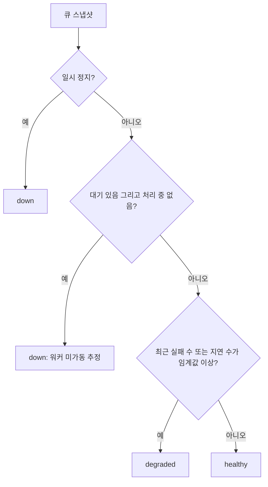
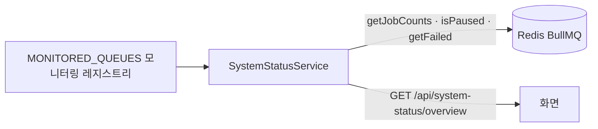

> 구현 상태: 부분 구현(`agent-memory-extraction` 모니터링 미등재, 환경 변수 음수 보정) · 원문: `spec/2-navigation/15-system-status.md`, `spec/5-system/16-system-status-api.md`, `spec/2-navigation/_product-overview.md` (§3.9), `spec/data-flow/9-observability.md` (§1.4) · 용어: [용어 사전](../CLE-GLOSSARY.md)

## 개요

시스템 상태(System Status)는 전체 시스템이 정상으로 돌고 있는지 BullMQ 큐의 집계 지표로 보여 주는 읽기 전용 화면과 API 다. 화면 경로는 `/system-status` 이고 실제 URL 은 `/w/<slug>/system-status` 다([레이아웃과 내비게이션](../CLE-UI/CLE-UI-LAYOUT.md)). API 는 `GET /api/system-status/overview` 다.

시스템 상태는 워크스페이스나 사용자 기준이 아니라 **시스템 전역** 상태다. 개별 job 과 payload 는 보여 주지 않고 큐별 카운트와 큐 건강도(queue health, `healthy`·`degraded`·`down`)만 보여 준다.

범위 밖:

- 큐 목록(카탈로그)과 각 큐가 하는 일: [비동기 큐와 Redis 키 목록](../CLE-PLAT/CLE-PLAT-QUEUE.md)
- 의존성 점검 API(`/api/health`, `/api/health/live`)와 그 어휘: [로깅과 헬스 체크](CLE-OBS-LOGGING.md)
- 실행 통계: [통계](CLE-OBS-STATS.md)
- 역할별 권한 매트릭스: [워크스페이스와 멤버](../CLE-ACCT/CLE-ACCT-WS.md)
- 워크스페이스 스코핑과 시스템 전역 API 예외 규약: [HTTP API 규약](../CLE-API/CLE-API-CONV.md)

## 요구사항

- REQ-SYSSTAT-001 WHEN 사용자가 시스템 상태 화면을 열면 THE SYSTEM SHALL 전체 시스템(큐)의 상태를 집계 카운트로 보여 준다. (원본: NAV-SS-01)
- REQ-SYSSTAT-002 WHEN 시스템 상태 화면을 보이면 THE SYSTEM SHALL 큐별 큐 건강도 신호등과 종합 상태를 보인다. (원본: NAV-SS-02)
- REQ-SYSSTAT-003 WHEN 시스템 상태 화면을 보이면 THE SYSTEM SHALL 특정 워크스페이스나 사용자 기준이 아니라는 안내 배너를 항상 보인다. (원본: NAV-SS-03)
- REQ-SYSSTAT-004 WHEN 시스템 상태를 돌려주면 THE SYSTEM SHALL 개별 job 과 payload 없이 집계 카운트만 싣는다. (원본: NAV-SS-04)
- REQ-SYSSTAT-005 WHILE 시스템 상태 화면이 열려 있는 동안 THE SYSTEM SHALL 5초마다 상태를 다시 불러온다. (원본: NAV-SS-05)
- REQ-SYSSTAT-006 WHEN 사용자가 새로고침 버튼을 누르면 THE SYSTEM SHALL 상태를 바로 다시 불러온다. (원본: NAV-SS-05)
- REQ-SYSSTAT-007 WHEN 사용자가 로그인하면 THE SYSTEM SHALL 역할과 상관없이 사이드바에 시스템 상태 메뉴를 보인다. (원본: NAV-SS-06)
- REQ-SYSSTAT-008 WHEN 실패 지표를 보이면 THE SYSTEM SHALL 최근 윈도우(기본 60분) 실패를 주 지표로, 누적 보관 실패를 부 지표로 함께 보인다. (원본: NAV-SS-07)
- REQ-SYSSTAT-009 WHEN 최근 실패 라벨을 보이면 THE SYSTEM SHALL 응답의 윈도우 길이를 "최근 N분 실패" 처럼 라벨에 넣는다. (원본: NAV-SS-08)
- REQ-SYSSTAT-010 WHEN 큐 건강도를 판정하면 THE SYSTEM SHALL `degraded` 판정에 최근 윈도우 실패 수를 쓴다. (원본: NAV-SS-08)
- REQ-SYSSTAT-011 IF 최근 윈도우 실패 수가 스캔 상한에 걸려 하한값이면 THE SYSTEM SHALL 그 값을 "N+" 로 보인다. (원본: 15-system-status §2.3)
- REQ-SYSSTAT-012 WHEN 사용자가 큐 카드를 누르면 THE SYSTEM SHALL 상세 화면으로 이동하지 않는다. (원본: 15-system-status §2.4)
- REQ-SYSSTAT-013 WHEN 로그인한 사용자가 시스템 상태 API 를 부르면 THE SYSTEM SHALL 관리자 역할 검사 없이 응답한다. (원본: 16-system-status-api §2)
- REQ-SYSSTAT-014 WHEN 시스템 상태 API 요청에 `X-Workspace-Id` 가 있으면 THE SYSTEM SHALL 헤더를 무시하고 모든 워크스페이스를 합산한 값을 돌려준다. (원본: 16-system-status-api §2)
- REQ-SYSSTAT-015 IF 한 큐의 조회가 Redis 오류로 실패하면 THE SYSTEM SHALL 그 큐만 `down` 과 카운트 0 으로 표시하고 나머지 큐는 정상으로 돌려준다. (원본: 16-system-status-api §2)
- REQ-SYSSTAT-016 WHEN 큐가 일시 정지돼 있으면 THE SYSTEM SHALL 그 큐의 건강도를 `down` 으로 판정한다. (원본: 16-system-status-api §3)
- REQ-SYSSTAT-017 WHEN 대기 job 이 있는데 처리 중 job 이 없으면 THE SYSTEM SHALL 그 큐의 건강도를 `down` 으로 판정한다. (원본: 16-system-status-api §3)
- REQ-SYSSTAT-018 WHEN 최근 윈도우 실패 수나 지연 job 수가 임계값 이상이면 THE SYSTEM SHALL 그 큐의 건강도를 `degraded` 로 판정한다. (원본: 16-system-status-api §3)
- REQ-SYSSTAT-019 WHEN 큐별 건강도가 정해지면 THE SYSTEM SHALL 가장 나쁜 값(`down` > `degraded` > `healthy`)을 종합 상태로 삼는다. (원본: 16-system-status-api §3)
- REQ-SYSSTAT-020 WHEN 최근 윈도우 실패 수를 셀 때 THE SYSTEM SHALL 큐마다 최신 실패부터 거꾸로 훑다가 윈도우를 벗어나거나 스캔 상한에 닿으면 멈춘다. (원본: 16-system-status-api §2)
- REQ-SYSSTAT-021 IF 시스템 상태 환경변수에 음수, 0, 숫자가 아닌 값이 들어오면 THE SYSTEM SHALL 안전한 기본값으로 대신한다. (원본: 16-system-status-api §3) (부분 구현)
- REQ-SYSSTAT-022 WHEN 시스템 상태를 불러오는 중이면 THE SYSTEM SHALL 스켈레톤을 보인다. (원본: 15-system-status §2.5)
- REQ-SYSSTAT-023 IF 시스템 상태를 불러오지 못하면 THE SYSTEM SHALL 에러 안내와 재시도 버튼을 보인다. (원본: 15-system-status §2.5)
- REQ-SYSSTAT-024 WHEN 큐 건강도 신호등을 보이면 THE SYSTEM SHALL 색과 텍스트 라벨을 함께 보인다. (원본: 15-system-status §3)
- REQ-SYSSTAT-025 WHEN `system` 그룹의 정기 작업 큐 카드를 보이면 THE SYSTEM SHALL "정기 작업" 라벨을 함께 보이고 일시 정지 여부를 먼저 강조한다. (원본: 15-system-status §2.3)

## 화면

| 영역 | 위치 | 들어가는 요소 | 동작 |
| --- | --- | --- | --- |
| 머리 | 맨 위 | 제목 "시스템 상태", 오른쪽 [↻ 새로고침] 버튼 | 버튼을 누르면 바로 다시 불러온다 |
| 안내 배너 | 머리 아래 | 시스템 전역 상태이고 특정 워크스페이스나 사용자 기준이 아니라는 안내(`systemStatus.systemWideBanner`, 정보 톤) | 항상 보인다 |
| 종합 상태 헤더 | 배너 아래 | 종합 신호등과 텍스트, 주 배지 "최근 N분 실패", 부 배지 "누적 보관" | 읽기 전용. N 은 응답의 `failedWindowMinutes`(기본 60) |
| 큐 그룹 섹션 | 헤더 아래 | 실행, 지식 저장소, 알림·통합, 스케줄·시스템 네 그룹. 그룹마다 큐 카드를 나열한다 | 읽기 전용 |
| 큐 카드 | 그룹 섹션 안 | 큐 이름, 건강도 표시(pill), 대기·처리 중·지연 카운트, 실패(최근)와 누적 보관, 포화도 게이지 | 누르지 않는다(상세 없음) |

"알림·통합" 그룹의 알림은 인앱 알림이 아니라 EIA 알림 웹훅 큐다.

### 종합 상태 헤더

- `overall` 을 신호등과 텍스트로 보인다. `healthy` 는 🟢 "시스템 정상", `degraded` 는 🟡 "일부 지연", `down` 은 🔴 "점검 필요" 다. `down` 라벨의 뉘앙스는 정의가 갈린다. [미결 사항](#미결-사항) 참조.
- 실패 배지는 둘을 함께 보인다. `totalRecentFailed`(최근 윈도우 실패 합계)가 주 배지이고 0 보다 크면 강조한다. `totalFailed`(누적 보관)가 부 배지다. 주 배지 라벨에는 응답의 `failedWindowMinutes` 를 넣는다("최근 N분 실패").
- 집계 `recentFailedCapped` 가 참이면 `totalRecentFailed` 를 "N+" 로 보인다.

### 큐 카드

- 네 그룹(실행 / 지식 저장소 / 알림·통합 / 스케줄·시스템) 섹션으로 묶는다.
- 카드마다 건강도 표시, 카운트(대기·처리 중·지연), 실패 두 수치, 포화도 게이지(`utilization`)를 보인다.
- 실패 표기: "실패(최근)" 는 `recentFailed` 를 주 수치로 보이고 0 보다 크면 강조한다. "누적 보관" 은 `counts.failed` 를 부 수치로 보인다. 그 큐의 `recentFailedCapped` 가 참이면 `recentFailed` 를 "N+"(하한값)로 보인다.
- `system` 그룹의 정기 작업 큐는 카운트가 보통 0 이다. 그래서 "정기 작업" 라벨을 함께 보이고 일시 정지 여부를 먼저 강조한다.

### 갱신

- React Query `useQuery({ queryKey: ['system-status', 'overview'], refetchInterval: 5000 })` 로 5초마다 불러온다. 수동 "새로고침" 버튼도 있다.
- 읽기 전용이다. 카드를 눌러도 상세 화면이 없다. 개별 job 을 보여 주지 않기 때문이다.

### 로딩과 에러

로딩 중에는 스켈레톤을 보인다. 에러가 나면 에러 안내(`systemStatus.loadFailed`)와 재시도 버튼(`systemStatus.retry`)을 보인다. 에러 안내와 재시도 버튼은 이 화면이 정하고 스켈레톤만 [레이아웃과 내비게이션](../CLE-UI/CLE-UI-LAYOUT.md) 의 공통 로딩 규칙을 따른다.

### 접근성과 다국어

- 신호등은 색과 텍스트 라벨을 함께 보인다. 색만으로 뜻을 전하지 않는다(WCAG 2.1).
- 화면 문구 사전(ko·en)에 사이드바 메뉴 라벨(`sidebar.systemStatus`)과 페이지 문자열을 둔다([다국어와 화면 문구](../CLE-UI/CLE-UI-I18N.md)).
- 실패를 함께 보이는 데 쓰는 라벨 키를 따로 둔다. 큐 카드는 `systemStatus.counts.recentFailed`(최근 윈도우)와 `systemStatus.counts.retainedFailed`(누적 보관), 종합 상태 헤더는 `systemStatus.totalRecentFailed`(주 배지)와 `systemStatus.totalRetainedFailed`(부 배지)를 쓴다.
- 화면 문구 키는 API 필드(`counts.failed`, `totalRecentFailed` 등)와 다른 층이다. 이름이 같아도 서로 묶이지 않는다.

## 모니터링 대상 큐

`SystemStatusModule` 은 모니터링 레지스트리 `MONITORED_QUEUES`(`system-status.constants.ts`) 하나로 모니터링할 큐를 나열한다. 항목마다 `{ name, group, concurrency }` 를 둔다. 레지스트리는 각 큐를 정의한 모듈의 큐 이름 상수를 다시 써서 문자열을 중복하지 않는다.

큐 목록의 단일 기준은 [비동기 큐와 Redis 키 목록](../CLE-PLAT/CLE-PLAT-QUEUE.md) 이다. 아래 표는 모니터링 그룹과 동시 처리 수 관점의 정리다. 큐를 더하거나 지우면 카탈로그를 먼저 고치고 이 표와 코드 상수를 맞춘다.

| 큐 | 그룹 | 동시 처리 수 | 모니터링 메모 |
| --- | --- | --- | --- |
| `execution-run` | execution | 1 (env `EXECUTION_RUN_WORKER_CONCURRENCY`) | 시작 큐. 몰려 들어올 때 `waiting>0 && active===0` 로 잠깐 `down` 오탐이 날 수 있다 |
| `background-execution` | execution | 1 | Background 본문 실행 |
| `execution-continuation` | execution | 1 (env `CONTINUATION_WORKER_CONCURRENCY`) | 사용자 입력 뒤 이어서 실행 |
| `document-embedding` | knowledge-base | 3 | 문서 임베딩 |
| `graph-extraction` | knowledge-base | 2 | 그래프 추출 |
| `agent-memory-extraction` | knowledge-base | 2 | 메모리 추출. **미구현**: 모니터링 대상으로 정했지만 코드 레지스트리에 없어 응답에 나오지 않는다 |
| `notification-webhook` | integration | 1 | EIA 알림 웹훅 발송 |
| `cafe24-token-refresh` | integration | 1 | Cafe24 토큰 갱신 |
| `makeshop-token-refresh` | integration | 1 | MakeShop 토큰 갱신(미리 갱신과 401 뒤 갱신) |
| `schedule-execution` | system | 1 | 스케줄 트리거 실행 |
| `login-history-pruner` | system | 1 | 정기 작업 |
| `workspace-invitations-pruner` | system | 1 | 정기 작업(매일 `0 4 * * *` Asia/Seoul) |
| `notification-secret-rotator` | system | 1 | 정기 작업 |
| `terminal-revoke-reconcile` | system | 1 | 정기 작업(1분). 외부 통합 호출이 아니라 내부 정합을 맞추는 작업이라 `system` 그룹이다 |
| `webchat-idle-reaper` | system | 1 | 정기 작업(1분). 버려진 위젯 세션을 거두는 마지막 안전장치라 `system` 그룹이다 |
| `chat-channel-token-rotator` | system | 1 | 정기 작업 |
| `integration-expiry-scanner` | system | 1 | 정기 작업. 반복 작업 4종이다: 매일 `0 0 * * *` UTC 3종(`connected-expiry`·`pending-install-ttl`·`usage-log-prune`)과 6시간마다 `0 */6 * * *` UTC 1종(`cafe24-background-refresh`). 각 작업이 하는 일은 [통합 상태와 만료 알림](../CLE-INT/CLE-INT-STATUS.md) 이 정한다 |
| `alerts-evaluator` | system | 1 | 정기 작업(5분). 알림 규칙 평가([알림](CLE-OBS-NOTIFY.md)) |

- 코드의 worker 옵션에 동시 처리 수가 없는 큐는 BullMQ 기본값 1 로 본다.
- `agent-memory-extraction` 미등재는 2026-06-10 감사(지적 번호 V-15. 산출물 경로는 git 이력에서 찾지 못했다)에서 찾은 갭이다. 2026-10-08 에 코드를 다시 확인했을 때도 레지스트리에 없었다. 그래서 지금 응답의 큐는 위 표보다 하나 적고 머리 줄의 구현 상태를 «부분 구현» 으로 둔다. `makeshop-token-refresh`·`terminal-revoke-reconcile` 은 등재돼 있다.

## API

### `GET /api/system-status/overview`

- 인증: JWT(`@ApiBearerAuth('access-token')`). **관리자 역할 가드가 없다.** 집계 카운트만 돌려주므로 워크스페이스와 사용자를 알아낼 수 없다([보안](#보안)).
- 워크스페이스 스코핑 예외: 시스템 전역 상태를 돌려주므로 `X-Workspace-Id` 스코핑을 적용하지 않는다. 헤더가 와도 무시한다. 응답은 모든 워크스페이스를 가로지른 합산값이다([HTTP API 규약](../CLE-API/CLE-API-CONV.md)).
  - 이 예외는 컨트롤러와 핸들러에 `@Roles()` · `@WorkspaceId()` · `@WorkspaceParam()` 을 하나도 붙이지 않는다는 전제에 기댄다. 가드가 어떤 라우트에서 헤더를 검사하는지는 [워크스페이스와 멤버](../CLE-ACCT/CLE-ACCT-WS.md#멤버십-검증은-가드가-무조건-한다) 가 정한다.
  - 셋 중 하나라도 붙이면 프런트엔드가 모든 요청에 붙이는 `X-Workspace-Id` 때문에 시스템 전역 상태가 워크스페이스 멤버십과 헤더 형식에 묶여 이 화면이 실패할 수 있다. 그래서 이 컨트롤러에는 셋 다 붙이지 않는다.
- 응답: `{ data: SystemStatusOverviewDto }`. 전역 `TransformInterceptor` 의 응답 봉투를 따른다.

```ts
SystemStatusOverviewDto {
  generatedAt: string;                      // ISO8601, 응답 생성 시각
  overall: "healthy" | "degraded" | "down"; // 큐 건강도의 가장 나쁜 값
  totalFailed: number;                      // 모든 큐의 failed(보관 중) 합산
  totalRecentFailed: number;                // 모든 큐의 recentFailed(최근 윈도우) 합산
  recentFailedCapped: boolean;              // 큐 하나라도 스캔 상한에 걸려 하한값이면 true (OR 집계)
  failedWindowMinutes: number;              // recentFailed 윈도우(분). env SYSTEM_STATUS_FAILED_WINDOW_MINUTES, 기본 60
  queues: QueueStatusDto[];
}

QueueStatusDto {
  name: string;
  group: "execution" | "knowledge-base" | "integration" | "system";
  counts: { waiting: number; active: number; delayed: number; failed: number; paused: number; };
  recentFailed: number;                     // 최근 윈도우 안 finishedOn 기준 실패 수 (스캔 상한에 닿으면 하한값)
  recentFailedCapped: boolean;              // 이 큐의 recentFailed 가 스캔 상한에 걸려 하한값인지
  concurrency: number;
  utilization: number;                      // active / concurrency, 소수 둘째 자리. concurrency=0 이면 0
  isPaused: boolean;
  health: "healthy" | "degraded" | "down";
}
```

- **`waiting` 과 `paused` 의 뜻**: 큐가 일시 정지돼 있으면(`isPaused`) 처리를 기다리는 job 수를 `paused` 로 보이고 `waiting` 은 0 이다. 일시 정지되지 않은 큐는 그 수를 `waiting` 으로 보이고 `paused` 는 0 이다. BullMQ 6 에는 paused job 상태가 없어 서비스가 이 값을 합성한다([BullMQ 6 에서 `paused` 를 합성한다](#bullmq-6-에서-paused-를-합성한다)).
- **`failed`(와 `totalFailed`)의 뜻**: 전체 기간 누적이 아니다. 각 큐의 `removeOnFail` 보관 기간 안에 지금 남아 있는 실패 job 수다. 보관 정책은 큐마다 다르다. `execution-run` 과 `execution-continuation` 은 `removeOnFail: false` 라 끝없이 보관하고 다른 큐는 100건·5분·7일·30일 등이다. 시작 큐와 재개 큐의 무한 보관은 [큐 워커와 동시 실행 제한](../CLE-EXEC/CLE-EXEC-WORKER.md) 이 정하고 다른 큐는 각 큐를 다루는 문서와 코드의 `removeOnFail` 설정을 따른다. 그래서 화면은 이 값을 "누적 보관" 으로 부른다.
- **`recentFailed` 의 뜻**: `queue.getFailed()` 로 가져온 실패 job 가운데 `finishedOn >= now - failedWindowMinutes*60_000` 인 수다. "지금 정상인가" 에 답하는 주 지표다.
- **집계 방법과 비용**:
  - `waiting`·`active`·`delayed`·`failed` 는 큐마다 `queue.getJobCounts(...)` 로 세고 일시 정지 여부는 `queue.isPaused()` 로 본다. `paused` 는 따로 세지 않는다. 일시 정지된 큐의 대기 job 수를 `paused` 로 옮기고 `waiting` 을 0 으로 둔다. 큐 하나에 드는 비용이 일정하다.
  - `recentFailed` 는 큐마다 `queue.getFailed()` 를 최신부터 거꾸로 훑고 `finishedOn` 이 윈도우를 벗어나면 멈춘다. 이 추가 비용은 일정하지 않고 윈도우 안 실패 수와 스캔 상한에 비례한다.
  - 큐당 스캔 상한은 env `SYSTEM_STATUS_FAILED_SCAN_CAP`(기본 1000)다. 상한을 다 써서 스캔이 끝나면(윈도우 경계나 실패 목록 끝이 아니라) `recentFailed` 는 하한값이고 `recentFailedCapped=true` 가 된다. 윈도우 경계나 목록 끝에서 자연히 끝나면 `recentFailedCapped=false`(정확값)다. 클라이언트는 이 값이 참이면 "N+" 로 그린다. `SystemStatusOverviewDto.recentFailedCapped` 는 큐별 값의 OR 다.
  - 윈도우는 보관 기간보다 짧게 운영한다고 전제한다(기본 60분은 대부분 큐의 보관 기간보다 훨씬 짧다). 보관 기간이 윈도우보다 짧은 큐(`cafe24-token-refresh`·`makeshop-token-refresh`, 5분)는 `recentFailed` 가 보관분으로 제한될 수 있다.
- 큐 하나가 Redis 오류로 조회에 실패해도 전체 응답은 실패하지 않는다. 그 큐는 `health: "down"` 과 카운트 0(`recentFailed` 0)으로 표시하고 나머지는 정상으로 돌려준다.

### 큐 건강도 판정

큐별 `health` 는 아래 순서로 판정한다(휴리스틱).



1. `isPaused === true` 면 `down`.
2. `waiting > 0 && active === 0` 이면 `down`. 워커가 돌지 않는다고 추정한다. 스냅샷 한 장으로 판단하는 휴리스틱이라 동시 처리 수가 1인 큐가 잠깐 쉬는 순간에 오탐할 수 있다([워커 미가동 판정의 한계](#워커-미가동-판정의-한계)).
3. `recentFailed >= getFailedDegradedThreshold()` 이거나 `delayed >= getDelayedDegradedThreshold()` 면 `degraded`.
4. 그 밖은 `healthy`.

- 2번의 워커 미가동 판정은 `recentFailed` 와 따로 동작한다.
- `overall` 은 큐 건강도의 가장 나쁜 값이다(`down` > `degraded` > `healthy`).
- 임계값은 모듈을 불러올 때의 상수가 아니라 getter 로 그때그때 읽는다. 모듈 로드 순서와 테스트 격리에 흔들리지 않게 하려는 것이다.

| 환경변수 | 기본값 | 쓰는 곳 |
| --- | --- | --- |
| `SYSTEM_STATUS_FAILED_THRESHOLD` | 1 | `getFailedDegradedThreshold()`. `recentFailed` 와 비교한다 |
| `SYSTEM_STATUS_DELAYED_THRESHOLD` | 50 | `getDelayedDegradedThreshold()`. `delayed` 와 비교한다 |
| `SYSTEM_STATUS_FAILED_WINDOW_MINUTES` | 60 | `recentFailed` 윈도우(분) |
| `SYSTEM_STATUS_FAILED_SCAN_CAP` | 1000 | 큐당 `getFailed()` 스캔 상한 |

- 네 값 모두 음수, 0, 숫자가 아닌 값이 들어오면 위 표의 기본값으로 대신한다. 기본값은 운영 경험에 따라 다시 맞출 수 있다. 지금 코드는 임계값 음수를 그대로 쓰고 윈도우 · 스캔 상한 음수를 1 로 올려 이와 다르다(REQ-SYSSTAT-021 부분 구현).
- `SYSTEM_STATUS_FAILED_THRESHOLD` 는 예전에 누적 보관 실패(`failed`)와 비교했고 지금은 최근 윈도우 `recentFailed` 와 비교한다. 예전 설정값을 그대로 두면 `degraded` 판정이 달라질 수 있으므로 운영자는 설정값을 다시 확인한다.

### 헬스 어휘

큐 건강도는 `healthy`·`degraded`·`down` 세 값이다. 의존성 점검 API(`/api/health`)의 `healthy`·`unhealthy`, EIA 알림 웹훅의 발송 건강도와 채팅 채널의 채널 건강도가 쓰는 `unknown`·`healthy`·`degraded` 와 다른 어휘다. 세 어휘의 비교는 [로깅과 헬스 체크](CLE-OBS-LOGGING.md) 에 있다.

## 보안

- 응답에는 전역 합산 정수 카운트만 들어간다. job id, payload, 워크플로우·실행·워크스페이스 식별자가 전혀 없다. 그래서 특정 워크스페이스나 사용자의 데이터를 알아낼 수 없다.
- 그래서 모든 로그인 사용자에게 보여도 정보가 새지 않는다. 사용자 가이드(`NAV-UG-05`)가 모두에게 보이는 것과 같은 노출 모델이다. 권한 매트릭스에서도 모든 역할이 읽기만 한다([워크스페이스와 멤버](../CLE-ACCT/CLE-ACCT-WS.md)).

## 데이터 흐름



`SystemStatusService` 는 자기 테이블도 job payload 도 읽지 않는다. 레지스트리의 큐마다 상태별 카운트(`getJobCounts`)와 일시 정지 여부(`isPaused`)를 모으고 `paused` 를 합성한다. 여기에 `getFailed()` 를 거꾸로 훑어 최근 윈도우 실패 수 `recentFailed` 를 계산하고 셋을 함께 건강도 판정(`deriveHealth`)에 쓴다(`system-status.service.ts`). 윈도우·상한·임계값은 env 로 바꿀 수 있다(`system-status.constants.ts`).

## 미결 사항

- **`down` 라벨의 추정 뉘앙스**: API 원문은 워커 미가동 휴리스틱(판정 2번)이 오탐할 수 있으므로 화면이 "점검 필요(추정)" 뉘앙스로 표기하고 단정하지 않는다고 적는다. 화면 원문과 현재 화면 문구 사전(`systemStatus.ts` 의 `down: "점검 필요"`)은 "점검 필요" 로 단정한다. 라벨에 "(추정)" 을 붙일지, 지금 라벨을 유지할지 결정이 필요하다.

## 구현 위치

- `codebase/frontend/src/app/(main)/w/[slug]/system-status/page.tsx`
- `codebase/backend/src/modules/system-status/**`

## Rationale

### 통계 화면과 공유하는 것과 다른 것

레이아웃 골격, JWT 인증, 응답 봉투 `{data}` 를 꺼내는 유틸, shadcn/ui 컴포넌트, React Query 사용은 [통계](CLE-OBS-STATS.md) 화면을 그대로 따른다. 다른 것은 둘이다. 첫째는 갱신 방식이다. 통계는 수동이나 필터 변경으로 다시 불러온다. 이 화면은 "지금 정상인가" 를 보여 주는 상태 화면이라 `refetchInterval` 자동 폴링(5초)을 따로 둔다. 둘째는 로딩과 에러 처리다. 예전 본문은 통계 화면의 로딩 · 에러 처리 방식을 다시 쓴다고 적었지만 [통계](CLE-OBS-STATS.md) 에는 따로 정한 규칙이 없었다. 그래서 스켈레톤만 레이아웃 공통 규칙을 따르고 에러 안내와 재시도는 이 화면이 정한다(NERV Task `CLE-T-9DBM7V`).

### 개별 job 을 보여 주지 않는다

BullMQ 큐는 워크스페이스 경계가 없는 전역 인프라다. job payload 에는 실행 입력과 대화 내용 같은 여러 워크스페이스의 민감 정보가 들어 있다. 개별 job 을 보여 주면 워크스페이스 귀속, payload 마스킹, 권한 가드가 모두 필요해진다. 집계 카운트만 보여 주면 이 문제들이 구조적으로 사라진다. "정상 운영 여부" 라는 목적에는 카운트와 건강도로 충분해 최소 노출을 골랐다. 카드를 눌러 들어가는 상세 화면을 두지 않는 것도 같은 이유다. 개별 job 조회는 v1 범위에서 일부러 뺐다.

### 처리량 시계열을 v1 에서 뺀다

순간 카운트, 포화도, 건강도로 "지금 정상인지" 는 답할 수 있다. 처리량 추이를 보려면 BullMQ `metrics`(job 처리 경로에 job 마다 부담이 붙는다)나 샘플링 cron(별도 저장소와 구성 요소)이 필요하다. 부하 추이가 실제로 필요해지면 샘플링 cron 을 먼저 검토한다. job 경로를 건드리지 않고 비용이 일정하며 큐 깊이 추이까지 얻을 수 있다. `recentFailed` 는 시계열이 아니라 윈도우 하나의 스냅샷이다. 별도 저장소 없이 이미 보관 중인 실패 목록을 거를 뿐이라 이 결정과 어긋나지 않는다.

### 워커 미가동 판정의 한계

`waiting>0 && active===0` 는 스냅샷 한 장으로 판단하는 휴리스틱이다. 동시 처리 수가 1인 큐가 마침 쉬는 순간에 오탐할 수 있다. 그래서 API 원문은 화면이 "점검 필요(추정)" 뉘앙스로 보여야 한다고 적는다. 정확한 워커 생존 여부는 별도 heartbeat 가 필요하고 v1 범위 밖이다.

### 큐 건강도 어휘를 `healthy`·`degraded`·`down` 으로 둔다

의존성 점검 API(`/api/health`)는 `healthy`·`unhealthy` 두 값이다(`health.service.ts`). 큐 상태는 "밀려 있지만 처리 중(`degraded`)" 과 "처리 자체가 멈춤(`down`)" 을 나눌 가치가 있어 `unhealthy` 를 심각도 두 단계로 나눴다. 정상 상태는 기존 어휘 `healthy` 를 그대로 써서 일관성을 지켰다.

여기서 두 값이라는 것은 `/api/health` 응답 본문의 `status` 어휘 기준이다. `/api/health` 는 이와 별개로 HTTP 상태 코드 200(`healthy`)·503(`unhealthy`)으로 준비 상태 신호를 더 전한다. 생존 확인은 `/api/health/live` 로 따로 뺐다. probe 역할과 상태 코드 분리의 기준은 [로깅과 헬스 체크](CLE-OBS-LOGGING.md) 다.

### 실패 지표를 최근 윈도우와 누적 보관으로 나눈다

- **문제**: 스냅샷 지표(대기·처리 중·지연·일시 정지·포화도)는 이미 현재 상태를 보여 준다. `failed` 만 보관 정책에 따라 쌓여 "전체 기간 누적" 처럼 읽혔다. "지금 정상인가" 라는 목적과 맞지 않았다.
- **누적 보관이 진짜 전체 기간 합계가 아닌 이유**: `getJobCounts('failed')` 는 BullMQ `removeOnFail` 보관 목록의 크기다. 큐마다 보관 정책이 달라(무한에서 5분까지) 전체 기간 합계가 아니다. 그래서 주 지표를 최근 윈도우 `recentFailed` 로 두고 누적은 "보관 중" 임을 분명히 적어 참고값으로만 함께 보인다.
- **화면도 같은 구분을 따른다**: 대기·처리 중·지연·포화도는 이미 현재 상태다. 최근 윈도우 실패를 주 지표로 앞에 두고 디버깅 참고용 누적 보관을 부 지표로 함께 보인다.
- **큐당 일정 비용 전제를 버린다**: 예전 API 명세의 "큐 수에 비례하는 일정 비용" 이라는 문장은 설계 원칙이 아니었다. `getJobCounts` 만 쓰던 때의 구현 관찰이었다. 그 문장을 지우고 바꿨다. `recentFailed` 는 `getFailed()` 스캔이 필요해 비용이 일정하지 않다. 대신 현재 상태 반영을 앞세우고 스캔 상한으로 비용의 상한을 지킨다.
- **처리량 시계열 제외와 어긋나지 않는다**: 처리량 추이는 별도 샘플링 cron 과 저장소가 필요하다. `recentFailed` 는 윈도우 하나의 스냅샷이라 별도 저장소가 필요 없다.
- **건강도 판정을 윈도우 기준으로 옮긴다**: `degraded` 가 "지금" 문제인지 보이도록 판정 3번의 비교 대상을 `recentFailed` 로 바꿨다. 예전에는 보관 중인 실패가 1건만 있어도 계속 `degraded` 로 남는 오탐이 있었다. 윈도우 기준이면 최근 실패가 사라질 때 저절로 `healthy` 로 돌아온다. 대가로 보관 중인 실패가 윈도우 밖으로 나가면 `degraded` 신호도 저절로 사라질 수 있다. 이를 알고 디버깅용 누적 보관을 부 지표로 계속 함께 보이는 것으로 보완한다.
- **`recentFailedCapped` 를 따로 둔다**: `recentFailed === scanCap` 비교만으로는 "정확히 상한과 같은 정상 경우" 와 "상한에 잘린 경우" 를 가릴 수 없다. 서버가 스캔이 끝난 이유(윈도우 경계·목록 끝인지, 상한 소진인지)를 직접 알려 정확한 하한값 신호를 준다. 종합 값은 보수적인 OR 로 둔다. 큐 하나라도 잘렸으면 시스템 전체 수치도 하한값일 수 있어서다. 하한값을 정확값처럼 보이면 사용자가 실패를 과소평가하므로 이 신호에 맞춰 "N+" 로 보인다.

### BullMQ 6 에서 `paused` 를 합성한다

BullMQ 6.0.0 은 paused job 상태를 없앴다. 큐를 일시 정지해도 job 은 `wait` 목록에 그대로 있고 `getJobCounts()` 는 그 수를 `waiting` 으로 센다. 일시 정지는 job 상태가 아니라 큐 메타데이터의 플래그가 됐다.

응답의 `counts.paused` 는 BullMQ 5 에서 라이브러리가 세던 값이다. 라이브러리 버전에 따라 API 계약이 바뀌지 않도록 서비스가 `isPaused()` 로 같은 값을 합성한다. 일시 정지된 큐는 대기 job 수를 `paused` 로 옮기고 `waiting` 을 0 으로 둔다. 그래서 응답 값과 건강도 판정(일시 정지 → `down`)이 BullMQ 5 때와 같다. `paused` 를 늘 0 으로 두는 최소 수정은 bullmq 6 상향의 2차 코드 리뷰가 견준 대안이다(finding 01a119de-3fa0-7769-8f9b-4621019d40a7 · NERV Task `CLE-T-HPZCK2`). 타입 오류는 막지만 일시 정지된 큐의 대기 job 이 `waiting` 칸으로 옮겨 가 API 응답 값이 바뀌므로 택하지 않았다.

대가가 하나 있다. BullMQ 5 는 두 수를 Lua 호출 한 번으로 셌고 지금은 `getJobCounts` 와 `isPaused` 두 조회다. 두 조회 사이에 정지나 재개가 일어나면 한 응답에서 대기 job 이 반대쪽 칸에 잡힐 수 있다. 정지는 플래그만 바꾸므로 대기 job 수 자체는 변하지 않는다. `counts`·`isPaused`·`health` 를 같은 `isPaused` 값으로 만들어 한 응답 안에서는 모순이 없고 다음 폴링에서 맞춰진다.

이 합성은 이 API 응답에만 건다. 큐 깊이 지표 `clemvion.queue.depth` 는 라이브러리가 센 값을 그대로 관측하므로 BullMQ 6 부터 일시 정지된 큐의 대기 job 이 `state=waiting` 에 들어간다([로깅과 헬스 체크](CLE-OBS-LOGGING.md)). 지표에는 `paused` 라벨이 없고 큐 정지는 이 API 의 `isPaused` 와 건강도 `down` 이 따로 알린다. 지표까지 합성하지 않은 것은 코드에서 큐를 일시 정지하는 곳이 지식 저장소 큐의 정리 스크립트 하나뿐이라 지표가 보는 실행 큐와 겹치지 않기 때문이다. 지표 대상에 일시 정지될 수 있는 큐를 더하면 이 결정을 다시 본다.

BullMQ 5 에서 일시 정지된 채 올라온 큐는 job 이 옛 `paused` 목록에 남는다. BullMQ 6 은 그 목록을 세지 않아 `resume()` 으로 `wait` 에 옮기기 전까지 `waiting`·`paused` 어느 쪽에도 나타나지 않는다. 업그레이드 절차의 문제라 응답 규칙은 이 경우를 따로 다루지 않는다.

### 잘못된 환경 변수는 기본값으로 대신한다

임계값 · 윈도우 · 스캔 상한 환경 변수에 음수, 0, 숫자가 아닌 값이 들어오면 표의 기본값을 쓴다. 2026-10-08 에 확인한 코드는 이와 달랐다. 임계값 둘은 음수를 그대로 써서 음수 임계값이면 모든 큐가 `degraded` 가 됐고, 윈도우와 스캔 상한은 음수를 1 로 올렸다. 스펙을 코드에 맞춰 «최소 1» 로 고치는 안과 코드를 이 문장에 맞추는 안 가운데 사람이 뒤의 것을 골랐다(NERV Task `CLE-T-9DBM7V`). 앞의 안은 잘못된 설정에 기본값 대신 1 을 쓰게 된다. 코드를 맞추기 전까지 REQ-SYSSTAT-021 은 부분 구현이다.
