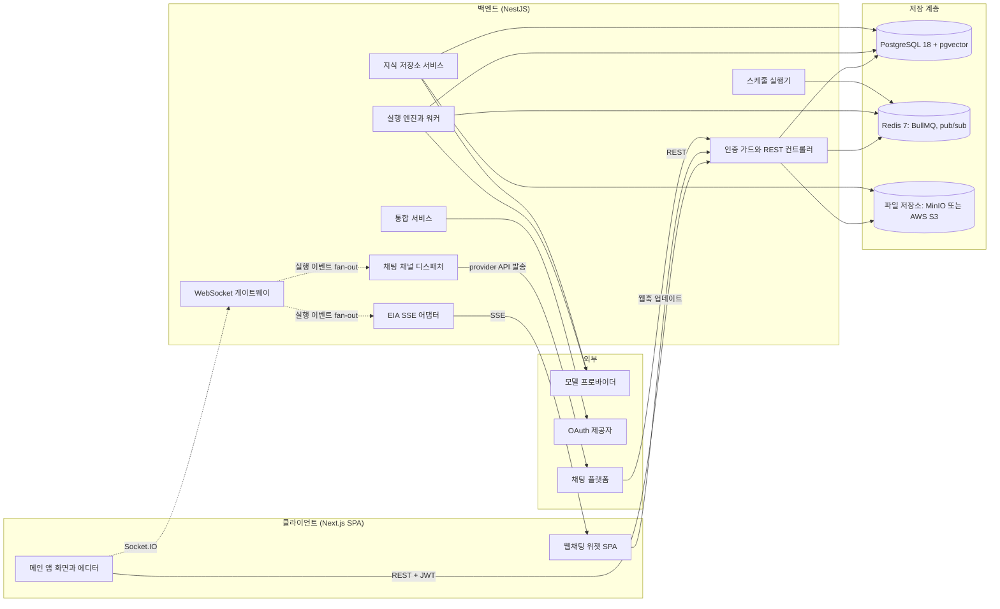

> 구현 상태: 구현됨 · 원문: `spec/0-overview.md` (§1 시스템 구성 개요, §2.1~§2.6 주요 컴포넌트, §5 배포 환경 분리, Rationale «실행 엔진: Redis 큐 + 분산 워커 풀»), `spec/data-flow/0-overview.md` (Overview, §1 시스템 수준 데이터 흐름, §2 도메인 인덱스, §3 공통 규약, §5 다중 인스턴스·동시성 모델, Rationale) · 용어: [용어 사전](../CLE-GLOSSARY.md)

## 개요

이 문서는 Clemvion 서버와 클라이언트가 어떤 컴포넌트로 이루어지고, 데이터가 어느 저장소를 거쳐 흐르는지를 한곳에서 정한다. 새 기능이 어디에 닿는지 가늠해야 하는 기획자·개발자, 운영 중 데이터 정합성과 성능 문제를 추적하는 운영자, 코드 리뷰에서 부수 효과를 보는 리뷰어가 대상 독자다.

다루는 것은 다음과 같다.

- 컴포넌트 구성과 각 컴포넌트의 역할
- 데이터 계층(PostgreSQL·Redis·파일 저장소)의 쓰임
- 시스템 수준 데이터 흐름과 영역별 데이터 문서의 구성 규칙
- 다중 인스턴스(multi-instance)·동시성 모델
- SaaS 와 셀프 호스팅의 배포 환경 차이

다루지 않는 것은 각 문서가 정한다. BullMQ 큐 전체 목록과 Redis 키 목록은 [비동기 큐와 Redis 키 목록](CLE-PLAT-QUEUE.md), 엔티티 관계와 인덱스 전략은 [데이터 모델 개요](CLE-PLAT-DATA.md), 파일 저장소의 키 규칙과 수명주기는 [파일 저장소](CLE-PLAT-STORAGE.md), 성능·보안 같은 품질 목표는 [비기능 요구사항](CLE-PLAT-NFR.md) 이 소유한다. 실행 엔진 내부 동작은 [실행 엔진 개요와 그래프 순회](../CLE-EXEC/CLE-EXEC-ENGINE.md) 와 [큐 워커와 동시 실행 제한](../CLE-EXEC/CLE-EXEC-WORKER.md) 이 정한다.

이 문서에는 `## 구현 위치` 절을 두지 않는다. [스펙과 구현 근거 규약](../CLE-ENG/CLE-ENG-SPECEVIDENCE.md) 규칙 19 가 구성 개요 문서를 예외로 둔다. 컴포넌트마다 그 표면을 정한 문서가 구현 경로를 적는다. 큐와 Redis 는 [비동기 큐와 Redis 키 목록](CLE-PLAT-QUEUE.md), 엔티티와 마이그레이션은 [데이터 모델 개요](CLE-PLAT-DATA.md), 파일 저장소는 [파일 저장소](CLE-PLAT-STORAGE.md), 실행 엔진은 [실행 엔진 개요와 그래프 순회](../CLE-EXEC/CLE-EXEC-ENGINE.md) 와 [큐 워커와 동시 실행 제한](../CLE-EXEC/CLE-EXEC-WORKER.md), 웹채팅 위젯은 [웹채팅 구조](../CLE-WEBCHAT/CLE-WEBCHAT-ARCH.md) 가 맡는다. API 진입 계층과 핵심 API 서비스는 [API 공통 규약](../CLE-API/CLE-API.md) 영역, 통합 서비스는 [통합](../CLE-INT/CLE-INT.md) 영역, 앱 클라이언트는 [앱 셸과 공통 화면](../CLE-UI/CLE-UI.md) 영역의 문서가 맡는다. 이유는 Rationale 「구현 위치 절을 두지 않은 이유」 에 있다.

## 컴포넌트 구성

아래 그림은 주요 컴포넌트와 그 사이의 호출 방향이다. 클라이언트는 REST 와 WebSocket 으로 백엔드를 부르고, 백엔드는 PostgreSQL·Redis·파일 저장소와 외부 서비스에 닿는다.

그림에 모두 담지 못한 호출은 다음과 같다. 실행 엔진은 MCP 서버를 HTTP·SDK 로 부르고, 통합 서비스를 거쳐 외부 API 를 부른다. 백엔드는 SMTP 로 메일을 보낸다. 에이전트 메모리 추출 처리기(`AgentMemoryExtractionProcessor`)는 BullMQ 작업을 받아 모델 프로바이더로 추출을 요청하고 결과를 pgvector 에 쓴다. 웹훅 호출자는 `POST /api/hooks/:endpointPath` 로 들어온다.

### 클라이언트

- 기술: Next.js(React 기반) SPA. 메인 앱(`codebase/frontend`)과 임베드형 웹채팅 위젯 SPA(`codebase/channel-web-chat`)가 있다.
- 역할: 내비게이션 화면, 워크플로우 에디터(캔버스), 설정 화면을 그린다. 화면 틀은 [레이아웃과 내비게이션](../CLE-UI/CLE-UI-LAYOUT.md) 이 정한다.
- 통신: 목록·저장 같은 조회와 변경은 REST API, 실행 상태 같은 실시간 갱신은 WebSocket(Socket.IO) 을 쓴다. 웹채팅 위젯은 REST 로 명령을 보내고 SSE 로 이벤트를 받는다([웹채팅 구조](../CLE-WEBCHAT/CLE-WEBCHAT-ARCH.md)).

### API 진입 계층

별도 게이트웨이 서버를 두지 않는다. 백엔드(NestJS) 안의 공통 계층이 다음을 맡는다.

- 인증과 인가 검증: `JwtAuthGuard` 와 역할 가드. 규칙은 [세션과 토큰](../CLE-ACCT/CLE-ACCT-SESSION.md) 과 [워크스페이스와 멤버](../CLE-ACCT/CLE-ACCT-WS.md) 가 정한다.
- 요청 빈도 제한(rate limit): `@nestjs/throttler` 를 storage 설정 없이 쓴다. 카운터가 프로세스 메모리에 있어 인스턴스마다 따로 센다. 한도와 응답은 [HTTP API 규약](../CLE-API/CLE-API-CONV.md) 이 정한다.
- 요청 라우팅과 CORS 관리.

### 핵심 API 서비스

- 워크플로우·노드·트리거·스케줄 같은 리소스의 생성·조회·수정·삭제
- 검색과 목록 조회
- 버전 관리([버전 기록](../CLE-WF/CLE-WF-VERSION.md))
- 팀과 워크스페이스 관리([워크스페이스와 멤버](../CLE-ACCT/CLE-ACCT-WS.md))

### 실행 엔진

- 워크플로우 실행을 조율하고 노드 그래프를 순회한다([실행 엔진 개요와 그래프 순회](../CLE-EXEC/CLE-EXEC-ENGINE.md)).
- 스케줄러: cron 기반 트리거를 BullMQ 반복 작업으로 발사한다([스케줄](../CLE-TRIG/CLE-TRIG-SCHEDULE.md)).
- 시작 큐(`execution-run`): `execute()` 가 실행 시작을 큐에 넣고, 워커가 실행 1건의 세그먼트(시작부터 첫 입력 대기나 종료까지)를 통째로 처리한다. 세그먼트 안의 노드는 같은 프로세스에서 차례로 부른다. 노드 단위 작업 큐는 없다.
- 재개 큐(`execution-continuation`): 재개 세그먼트를 운반한다. 입력 대기(`waiting_for_input`)는 큐 없이 DB 에만 남는 park 다.
- 워커 풀: 인스턴스 N 개가 두 큐를 work-stealing 방식으로 나눠 소비하며 수평으로 늘어난다.
- 장애 복구: 세그먼트 도중 워커가 죽으면 BullMQ stalled 재배달로 이어 가고, 입력 대기 실행은 기한 없이 보존한다([장애 복구와 안전 종료](../CLE-EXEC/CLE-EXEC-RECOVERY.md)).
- 실행 시간 한도: 입력 대기 시간을 뺀 세그먼트 누적 시간의 상한은 기본 30분(`EXECUTION_MAX_ACTIVE_RUNNING_MS`)이다. 한도와 동시 실행 제한의 세부는 [큐 워커와 동시 실행 제한](../CLE-EXEC/CLE-EXEC-WORKER.md) 이 정한다.

### 통합 서비스

- OAuth 연결 흐름 관리([OAuth 연결과 토큰 갱신](../CLE-INT/CLE-INT-OAUTH.md))
- 외부 API 커넥터
- 웹훅 수신([웹훅](../CLE-TRIG/CLE-TRIG-WEBHOOK.md))과 발신([EIA 알림 웹훅](../CLE-IX/CLE-EIA-NOTIFY.md)) 관리
- 통합 상태 모니터링([통합 상태와 만료 알림](../CLE-INT/CLE-INT-STATUS.md))

### 외부 의존

| 외부 | 쓰는 곳 |
| --- | --- |
| 모델 프로바이더 | OpenAI · Anthropic · Google · Azure OpenAI · Ollama · vLLM(채팅·임베딩), TEI · Cohere(리랭커). 목록의 기준은 [LLM 클라이언트](../CLE-AI/CLE-AI-LLM.md) 다 |
| OAuth 제공자 | Google · GitHub 등. 소셜 로그인과 통합 연결 |
| SMTP | 인증 메일과 알림 메일, Send Email 노드 |
| MCP 서버 | AI 에이전트 노드의 외부 도구([MCP 클라이언트](../CLE-INT/CLE-INT-MCP.md)) |
| 채팅 플랫폼 | Telegram · Slack · Discord([채팅 채널](../CLE-CHAT/CLE-CHAT-CORE.md)) |
| 웹훅 호출자 | 트리거 수신 URL `POST /api/hooks/:endpointPath` |

## 데이터 계층

| 저장소 | 쓰임 |
| --- | --- |
| PostgreSQL | 주 데이터베이스. 워크플로우·사용자·설정·실행 기록 등 모든 영속 데이터를 둔다. 기본 이미지는 `pgvector/pgvector:pg18`(`docker-compose.yml`)이고 TypeORM 으로 매핑한다. 스키마는 Flyway SQL 마이그레이션(`codebase/backend/migrations/V*.sql`)이 만든다([DB 마이그레이션 규약](../CLE-ENG/CLE-ENG-MIGRATION.md)). k8s 로컬 오버레이(`k8s/overlays/local/infra-postgres.yaml`)는 아직 `pg16` 을 쓴다. **최소 버전은 15** 다. 범위 참조의 복합 FK(V141~V146)가 PostgreSQL 15 문법 `ON DELETE SET NULL (컬럼 목록)` 을 쓰고, 15 미만이면 V134 가 스키마를 바꾸기 전에 멈춘다([데이터 모델 개요](CLE-PLAT-DATA.md#참조의-소속)) |
| pgvector | 지식 저장소 청크와 에이전트 메모리의 임베딩을 PostgreSQL 안에 저장하고 검색한다. 별도 벡터 DB 는 두지 않는다. 차원별 부분 인덱스 정책은 [데이터 모델 개요](CLE-PLAT-DATA.md) 가 정한다 |
| Redis 7 | BullMQ 큐 백엔드(시작 큐·재개 큐·Background 큐 등), 운영 잠금(`exec:recover:lock`), pub/sub 채널(`integration:cache:invalidate`), 각 모듈의 요청 빈도 제한·멱등 키. 목록은 [비동기 큐와 Redis 키 목록](CLE-PLAT-QUEUE.md) 에 있다 |
| 파일 저장소 | S3 호환 저장소. 개발·셀프 호스팅은 MinIO, SaaS 는 AWS S3. 지식 저장소 원본 문서와 프로필 이미지를 둔다([파일 저장소](CLE-PLAT-STORAGE.md)) |

다음 두 가지는 Redis 에 두지 않는다.

- 로그인 세션: PostgreSQL 의 `refresh_token` 테이블이 기준이다([세션과 토큰](../CLE-ACCT/CLE-ACCT-SESSION.md)).
- WebSocket 연결 상태: 소켓이 한 프로세스에 고정되므로 프로세스 메모리가 기준이다([WebSocket 연결과 채널 구독](../CLE-API/CLE-API-WS.md)).

## 시스템 수준 데이터 흐름

### 핵심 사실

| 항목 | 사실 |
| --- | --- |
| 큐 | Redis 7 + BullMQ. 현재 등록된 큐는 18개다. 목록은 [비동기 큐와 Redis 키 목록](CLE-PLAT-QUEUE.md) 이 단일 기준이다 |
| 파일 저장소 | 지식 저장소 원본 문서(`kb/{kbId}/{documentId}/{sanitizedFilename}`)와 프로필 이미지(`avatars/{userId}/{uuid}.{ext}`)를 쓴다. Form 첨부 키는 정의만 있고 구현하지 않았다 |
| WebSocket | Socket.IO. 실행 상태·노드 이벤트·지식 저장소 진행률·Background 실행 이벤트를 보낸다. 보내는 곳은 `WebsocketService` 하나다. 같은 서비스의 `executionEvents$` 스트림을 EIA SSE 어댑터(`SseAdapter`)·채팅 채널 디스패처(`ChatChannelDispatcher`)·EIA 알림 발송기(`NotificationDispatcher`)가 구독한다 |
| SSE | `text/event-stream` 을 두 곳에서 쓴다. ① 워크플로우 AI 어시스턴트 스트리밍(WebSocket 을 거치지 않고 컨트롤러가 직접 쓴다, [AI 어시스턴트 스트리밍과 세션 API](../CLE-WF/CLE-WF-ASSIST-PROTO.md)) ② External Interaction API 이벤트 스트림([EIA 수신 API와 SSE](../CLE-IX/CLE-EIA-INBOUND.md)) |
| 인증 | JWT 액세스 토큰 + 회전하는 리프레시 토큰(`refresh_token` 테이블). Bearer 헤더 또는 쿠키로 받는다 |
| 시크릿 | 시크릿 저장소(`secret_store` 테이블)가 도메인을 가로지르는 비밀의 공통 저장소다. 트리거 설정 JSONB 의 참조 슬롯에는 평문 대신 시크릿 참조(`secret://…`)를 둔다. 값은 `ENCRYPTION_KEY` 기반 AES-256-GCM 으로 암호화한다. 이 참조 슬롯을 읽고 쓰는 곳은 `SecretResolver` 하나다. 모든 비밀이 이 저장소를 거치지는 않는다. 저장소 밖에 두는 필드(인증 설정 자격 증명, 트리거 단위 인터랙션 토큰, 알림 서명 시크릿의 유예 값)는 [시크릿 저장소 §저장소 예외 필드](../CLE-INT/CLE-INT-SECRET.md#저장소-예외-필드) 가 정한다. 통합 자격 증명도 이 저장소를 쓰지 않고 통합 엔티티 컬럼에서 따로 암호화한다([통합 데이터와 흐름](../CLE-INT/CLE-INT-DATA.md)) |

### 영역별 데이터 문서

엔티티를 흐름의 관점에서 다시 묶은 문서들이다. "이 API 가 들어오면 어느 테이블의 어느 컬럼이 어떤 순서로 바뀌는가", "이 비동기 작업은 어느 큐를 거쳐 어느 저장소에 닿는가" 를 답한다.

| 영역 | 문서 | 다루는 흐름 |
| --- | --- | --- |
| 인증·워크스페이스 | [계정과 워크스페이스 데이터 흐름](../CLE-ACCT/CLE-ACCT-DATA.md) | 가입·로그인·OAuth·리프레시 토큰 회전·세션 종료, 워크스페이스·멤버·초대 토큰·역할 |
| 워크플로우 | [워크플로우 데이터와 저장 흐름](../CLE-WF/CLE-WF-DATA.md) | 워크플로우·노드·연결선 저장, 버전 스냅샷 |
| AI 어시스턴트 | [AI 어시스턴트 스트리밍과 세션 API](../CLE-WF/CLE-WF-ASSIST-PROTO.md) | 어시스턴트 세션과 메시지 |
| 실행 | [실행 데이터와 흐름](../CLE-EXEC/CLE-EXEC-DATA.md) | 실행 엔진·BullMQ 큐·노드 실행 기록 |
| 지식 저장소 | [지식 저장소 데이터와 흐름](../CLE-KB/CLE-KB-DATA.md) | 문서 업로드·임베딩·Graph RAG·검색·리랭킹 |
| 통합 | [통합 데이터와 흐름](../CLE-INT/CLE-INT-DATA.md) | 자격 증명 암호화 저장·만료 스캔·활동 로그 |
| 트리거 | [트리거 데이터와 흐름](../CLE-TRIG/CLE-TRIG-DATA.md) | 웹훅·스케줄·수동 트리거 진입과 실행 연결 |
| LLM 사용량 | [LLM 사용량 기록](../CLE-AI/CLE-AI-USAGE.md) | 모델 설정 해석·LLM 호출·사용량 적재 |
| 파일 저장소 | [파일 저장소](CLE-PLAT-STORAGE.md) | 버킷 구조·파일 수명주기·실제 사용처 |
| 인앱 알림 | [알림](../CLE-OBS/CLE-OBS-NOTIFY.md) | 알림 행·이메일·WebSocket 발송 |
| 감사 | [감사 로그](../CLE-OBS/CLE-OBS-AUDIT.md) | 감사 로그와 로그인 이력 적재 |
| 관측 | [로깅과 헬스 체크](../CLE-OBS/CLE-OBS-LOGGING.md) | 헬스 체크·대시보드·통계·알림 규칙 평가 |
| 에이전트 메모리 | [에이전트 메모리](../CLE-AI/CLE-AI-MEMORY.md) | 턴 경계 추출 큐·메모리 적재·회수 주입 |
| 채팅 채널 | [채팅 채널 데이터와 흐름](../CLE-CHAT/CLE-CHAT-DATA.md) | 외부 채팅 수신·대화 상태·실행 연결·발송·봇 토큰 재발급 |
| 외부 상호작용 | [EIA 데이터와 흐름](../CLE-IX/CLE-EIA-DATA.md) | 인터랙션 토큰·재개와 취소·SSE·EIA 알림 웹훅 발송 |

### 영역별 데이터 문서의 구성

영역별 데이터 문서는 다음 다섯 요소를 갖춘다.

1. **역할**: 그 영역이 시스템 안에서 맡는 일을 한 문단으로 쓴다. 비즈니스 목적·시작 계기·동작 책임을 담는다.
2. **흐름 그림**: mermaid `sequenceDiagram` 또는 `flowchart` 로 요청자 → API → 서비스 → 저장소의 흐름을 그린다. 가능하면 호출 경로의 핵심 파일과 메서드를 함께 적는다.
3. **저장소 매핑 표**: 데이터 객체마다 `저장소 | 테이블 또는 키 | 갱신 컬럼 또는 패턴 | 인덱스·제약` 표를 둔다. PostgreSQL 은 테이블·컬럼·PK·FK·기본값·인덱스를, Redis 는 BullMQ 큐 이름·반복 작업 키·캐시 키 패턴을, 파일 저장소는 버킷·접두·키 패턴을 적는다. 그 흐름에서 실제로 읽고 쓰는 컬럼만 발췌하고, 전체 정의는 엔티티를 소유한 문서를 링크한다. 컬럼 이름·타입·제약은 엔티티 파일(`codebase/backend/src/modules/<domain>/entities/*.entity.ts`)이나 마이그레이션(`codebase/backend/migrations/V*.sql`)에서 직접 옮긴다. 둘이 다르면 마이그레이션이 기준이다.
4. **상태 전이**: 엔티티에 상태 enum 이 있으면 mermaid `stateDiagram-v2` 로 전이를 그린다. 단계형 흐름이면 표나 번호 목록으로 나눈다.
5. **외부 의존**: 외부 API(모델 프로바이더·OAuth 제공자·SMTP·MCP 서버 등), 다른 BullMQ 큐(영역을 넘는 작업 등록), 다른 영역 문서로의 링크를 적는다.

역할별 권한 경계가 있는 영역은 권한 요약 절을 선택으로 둘 수 있다. 상태 전이 절 아래가 아니라 독립 절로 만든다. 정식 권한 매트릭스는 [워크스페이스와 멤버](../CLE-ACCT/CLE-ACCT-WS.md) 하나에만 두고, 영역 문서의 표는 그 요약이다. 요약과 정식 매트릭스가 어긋나면 정식 매트릭스를 따른다. 요약표 아래에는 정식 매트릭스 링크를 반드시 단다.

## 다중 인스턴스와 동시성 모델

- **상태 없는 백엔드**: 모든 컨트롤러와 서비스는 상태를 갖지 않는다. 인스턴스 사이의 작업 조정은 Redis(BullMQ 영속 큐와 보조 pub/sub)가 맡는다.
- **재개 전달**: 폼 제출·버튼 클릭 같은 비동기 재개 신호는 재개 큐(`execution-continuation`, `ContinuationBusService`)로 전달한다. 어느 인스턴스가 사용자 입력을 받아도 다른 인스턴스의 BullMQ 워커가 받아 재개할 수 있다. 재개는 rehydration 한 경로로만 한다. park 가 늘 코루틴을 놓아 주므로 메모리에서 깨울 대기자가 없다([실행 상태 머신과 대기·재개](../CLE-EXEC/CLE-EXEC-STATE.md)).
- **인스턴스 사이 직렬화**: Redis 큐 말고도 PostgreSQL advisory lock 을 쓴다. 트리거 설정 쓰기(`trigger-config:<triggerId>`)와 워크스페이스 단위 동시 실행 제한(`exec-cap:<workspaceId>`)이 그 예다. 잠금 키 공간 규칙은 [Redis 키 명명 규약](../CLE-ENG/CLE-ENG-REDIS.md) 이 정한다.
- **인스턴스 로컬 캐시 무효화**: 통합 자격 증명을 교체하거나 삭제하면 pub/sub 채널 `integration:cache:invalidate` 로 모든 인스턴스의 로컬 캐시(예: Database Query 노드 연결 풀)를 비운다([Database Query 노드](../CLE-NODE-INT/CLE-NODE-DBQUERY.md)).
- **재시도와 멱등**: BullMQ 의 `attempts` 와 서비스 단의 재시도(`retryWithBackoff`) 두 층이 있다. 두 층의 동작은 영역 데이터 문서의 상태 전이에 함께 적는다.
- **벡터 인덱스**: pgvector 인덱스는 차원별 부분 인덱스라 차원이 다른 행이 각자의 인덱스를 쓴다. 목록은 [데이터 모델 개요](CLE-PLAT-DATA.md) 에 있다.

## 배포 환경 분리

SaaS 와 셀프 호스팅은 같은 코드를 쓰고 설정으로 갈린다. 배포 방식의 제품 정의는 [Clemvion 제품 개요](../CLE-VISION.md) 에 있다.

| 항목 | SaaS | 셀프 호스팅 |
| --- | --- | --- |
| 인증 | 자체 인증 + OAuth 소셜 로그인 | 자체 인증 + LDAP/SAML 옵션(미구현, [가입과 로그인](../CLE-ACCT/CLE-ACCT-SIGNIN.md)) |
| 데이터 격리 | 멀티 테넌트(논리적 격리) | 단일 테넌트(물리적 격리) |
| 스케일링 | 자동 수평 확장 | 수동 구성(Docker Compose / K8s) |
| 업데이트 | 자동 롤링 업데이트 | 수동 버전 업그레이드 |
| 마켓플레이스 | 중앙 마켓플레이스 접근 | 프록시 또는 오프라인 패키지([마켓플레이스 (구상)](../CLE-UI/CLE-UI-MARKET.md)) |
| 모니터링 | 내장 대시보드 + 관리형 알림 | Prometheus/Grafana 연동 가이드 |

이 표는 목표 구성이다. LDAP/SAML 은 아직 구현하지 않았다. Docker Compose 셀프 호스팅 배포, Helm Chart, 셀프 호스팅 설치·운영 문서도 미구현이다([비기능 요구사항](CLE-PLAT-NFR.md)의 NF-DP-02·03·06). 자동 롤링 업데이트와 Prometheus/Grafana 연동 가이드는 구현 여부를 적은 근거 문서가 없다.

## Rationale

### 구현 위치 절을 두지 않은 이유 (2026-10-03)

이 문서는 컴포넌트를 나열하는 구성 개요다. 컴포넌트마다 그 표면을 정한 문서가 있고 그 문서의 `## 구현 위치` 가 경로를 적는다. 여기에 같은 경로를 다시 적으면 두 곳을 함께 고쳐야 한다. [스펙과 구현 근거 규약](../CLE-ENG/CLE-ENG-SPECEVIDENCE.md) 규칙 19 는 구성 개요 문서를 이 절의 예외로 둔다. 그 규약 R-16 「약해지는 곳」 이 머리 줄이 구현됨인데 절이 없는 잎 문서 5편을 짚었다. 후속 Task `CLE-T-RGZBCQ` 가 그중 이 문서는 절 없이 두기로 정했다.

### 실행 엔진: Redis 큐 + 분산 워커 풀

- **배경**: 워크플로우 실행에는 (a) 노드별 외부 API 호출로 인한 가변 지연, (b) Background·Parallel 같은 동시 실행, (c) Form 같은 사람 개입 노드의 긴 대기, (d) 셀프 호스팅 단일 노드부터 SaaS 다중 노드까지의 수평 확장이 함께 필요하다.
- **채택**: Redis 기반 BullMQ 큐와 워커 인스턴스 N 개. 작업 단위는 실행 수준의 세그먼트다. 워커는 실행 1건을 시작이나 재개부터 다음 입력 대기나 종료까지 통째로 처리하고, 세그먼트 안의 노드는 같은 프로세스에서 부른다. 큐는 `execution-run`(시작), `execution-continuation`(재개), `background-execution`(Background·서브 워크플로우) 셋으로 나눈다. 노드 단위 작업 큐를 채택하지 않은 근거는 [실행 엔진 개요와 그래프 순회](../CLE-EXEC/CLE-EXEC-ENGINE.md) 의 Rationale 에 있다.
- **기각한 대안**: 단일 프로세스 안 실행은 SaaS 수평 확장이 안 되고 긴 대기가 프로세스를 붙잡는다. PostgreSQL `LISTEN/NOTIFY` 로 큐를 직접 만들면 재시도·DLQ·요청 빈도 제한·인스턴스 사이 직렬화를 다시 만들어야 한다.
- **trade-off**: Redis 가 의존성으로 더해져 셀프 호스팅 설치 부담이 늘었다(Docker Compose 에 포함). 그러나 재개 큐·Background 큐·BullMQ 기반 cron·Cafe24 토큰 갱신 직렬화 같은 다른 기능도 같은 Redis 를 써서 순 부담은 낮다. 큐 작업 직렬화에 따른 스냅샷 격리 같은 trade-off 는 [컨테이너 실행](../CLE-EXEC/CLE-EXEC-CONTAINER.md) 과 [대화 스레드](../CLE-IX/CLE-IX-THREAD.md) 가 다룬다.

### 데이터 흐름 문서를 엔티티 정의와 나눈 이유

엔티티 정의 문서는 컬럼의 단일 기준으로 잘 동작한다. 그런데 새 기능을 검토하거나 운영 문제를 추적할 때 필요한 것은 "어느 API 가 어느 큐를 거쳐 어느 컬럼을 바꾸는가" 라는 흐름이다. 이것은 테이블 정의만으로는 빨리 재구성하기 어렵다. 흐름이 실행 엔진·인증·통합·지식 저장소 문서에 흩어져 있어, 전체 흐름을 한눈에 보려는 사람은 문서 7~8개를 이어 붙여야 했다. 영역별 데이터 문서가 그 이어 붙이기를 대신한다.

### 저장소 매핑 표가 전체 컬럼을 복사하지 않는 이유

영역 데이터 문서의 저장소 매핑 표는 그 흐름에서 실제로 읽고 쓰는 컬럼만 발췌하고, 전체 정의는 엔티티 소유 문서를 링크한다. 이렇게 하면 엔티티 정의가 바뀌어도 흐름 관점의 표는 그대로 유효하다.

### 권한 요약을 선택 요소로 둔 이유 (2026-07-31)

상태 전이 절은 엔티티 상태 enum 의 전이를 그리는 자리다. 권한 매트릭스는 전이가 아니라 역할별 접근 경계라서 그 아래 두면 뜻이 어긋난다. 워크스페이스 데이터 문서가 실제로 그랬다. 권한 요약표가 상태 전이 절 아래에 있었고, 15개 데이터 흐름 문서 가운데 유일하게 틀을 벗어나 있었다. 2026-07-31 에 독립 절로 올리면서 이 규칙을 정했다.

필수가 아니라 선택으로 둔 이유: 대부분의 영역은 자체 권한 경계 없이 정식 매트릭스를 그대로 따른다. 필수로 만들면 대부분의 문서가 정식 매트릭스를 베낀 표를 갖게 되고, 그 사본이 어긋나는 것이 바로 이때 고친 결함이었다. 절 수가 영역마다 달라지는 것은 문제가 아니다.

### Redis 에 세션과 요청 빈도 카운터를 두지 않은 현재 구성

옛 구성도는 별도 API 게이트웨이가 요청 빈도를 제한하고 Redis 가 세션을 관리하는 것처럼 그렸다. 실제로는 요청 빈도 제한이 앱 안의 메모리 카운터이고, 로그인 세션은 PostgreSQL 이 기준이며, WebSocket 연결 상태는 프로세스 로컬이다. 이 문서는 실제 구성을 기준으로 쓴다. 요청 빈도 카운터를 여러 인스턴스가 나눠 쓰는 분산 저장소는 후속 과제로 남아 있다. 지금은 메모리 카운터이고, 분산 저장소가 들어오면 Redis 키로 다시 등재하고 이 구성을 재검토한다([비동기 큐와 Redis 키 목록](CLE-PLAT-QUEUE.md)).
