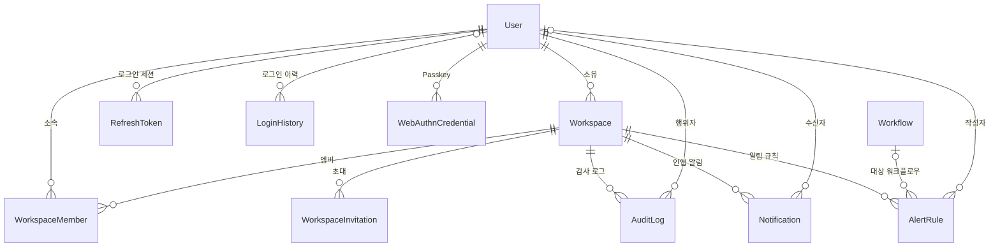
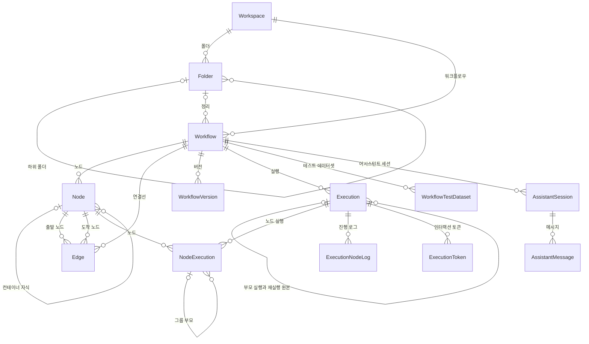
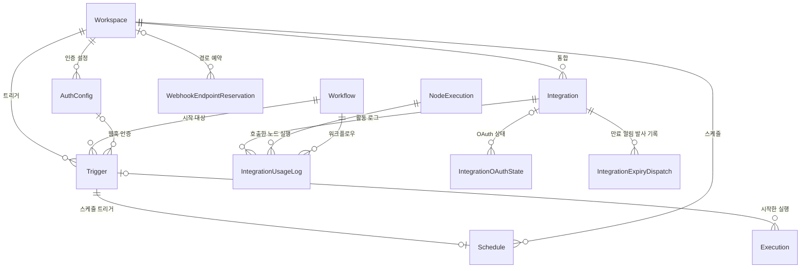
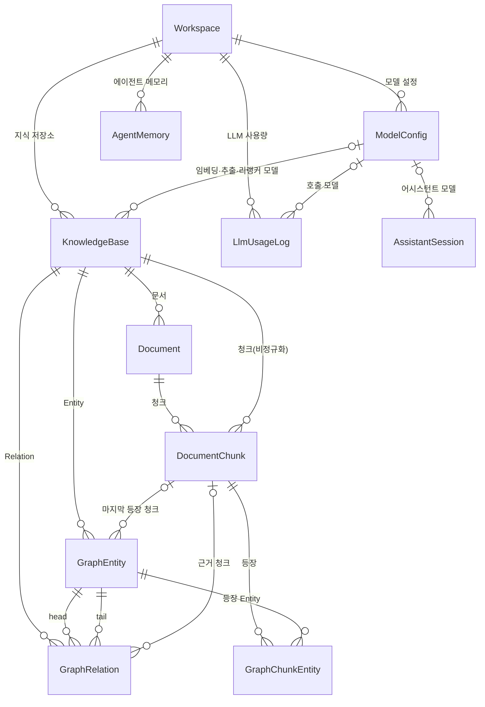

> 구현 상태: 구현됨 · 원문: `spec/1-data-model.md` (§1 엔티티 관계 개요, §1.1 참조의 소속, §2 FK 표기, §3 인덱스 전략, Rationale «`code:` 에 전용 e2e 가드 셋» · «§2 FK 삭제 동작 · 빠진 컬럼» · «쓸 인덱스가 없는 FK 서른하나의 처분»), `spec/data-flow/0-overview.md` (§3.3, §5 벡터 인덱스), `spec/data-flow/12-workspace.md` (Rationale «본문 참조 id 도 저장 전에 소속을 본다») · 용어: [용어 사전](../CLE-GLOSSARY.md)

## 개요

이 문서는 Clemvion 데이터베이스의 전체 지도다. 엔티티 사이의 관계, 모든 엔티티에 공통인 컬럼 규칙, 요청 본문이 보내는 참조 id 의 소속 규칙과 이미 저장된 교차 행이 실행에 닿을 때의 동작, 조회 조건의 null · undefined 규칙, 외래 키(FK)의 삭제 동작, 인덱스 전략을 한곳에서 정한다.

엔티티마다의 컬럼 상세는 이 문서가 아니라 그 엔티티를 소유한 영역 데이터 문서가 정한다. 어느 문서가 어느 엔티티를 소유하는지는 [엔티티와 소유 문서](#엔티티와-소유-문서) 표에 있다. 데이터가 어느 API·큐를 거쳐 흐르는지는 [시스템 아키텍처](CLE-PLAT-ARCH.md) 와 각 영역 데이터 문서가 다룬다. 스키마를 바꾸는 절차는 [DB 마이그레이션 규약](../CLE-ENG/CLE-ENG-MIGRATION.md) 이 정한다.

## 엔티티 관계 지도

관계가 많아 네 그림으로 나눈다. 모든 그림의 뿌리는 사용자와 워크스페이스(Workspace, `workspace`)다. 한 그림에 없는 엔티티와의 관계는 다른 그림에서 다시 나온다. 선의 `|o` 는 부모가 없을 수 있는(nullable) FK 다.

### 계정·워크스페이스·관측

사용자는 워크스페이스를 소유하고 멤버로 여러 워크스페이스에 속한다. 로그인 세션·로그인 이력·Passkey 는 사용자에게, 감사 로그·인앱 알림·알림 규칙은 워크스페이스에 속한다.

### 워크플로우·실행·AI 어시스턴트

워크플로우는 노드와 연결선(Edge)으로 이루어지고, 실행(Execution)과 노드 실행(NodeExecution)을 남긴다. 노드·실행·노드 실행에는 자기 참조가 있다(컨테이너 자식, 서브 워크플로우 부모와 재실행 원본, 그룹 부모).

### 트리거·통합

트리거는 워크플로우를 시작시키는 진입점이고, 스케줄 트리거는 스케줄과 1:1 로 묶인다. 통합은 워크스페이스에 속하고 노드 실행마다 활동 로그를 남긴다.

### 지식 저장소·AI

지식 저장소(Knowledge Base, `KnowledgeBase`)는 문서와 청크를 갖고, Graph RAG 모드면 Entity 와 Relation 을 더 갖는다. 모델 설정(`ModelConfig`)은 지식 저장소·어시스턴트 세션·LLM 사용량 기록이 가리킨다.

그림에 없는 관계: LLM 사용량 기록은 워크플로우·실행·노드 실행을 nullable FK 로 가리킨다. 시크릿 저장소(`SecretStore`)는 `workspace_id` 를 갖지만 FK 가 없다. 소셜 로그인 상태(`auth_oauth_state`)와 OAuth 미리보기(`integration_oauth_preview`)는 10분 만료 일시 행이다.

## 엔티티와 소유 문서

컬럼 정의·제약·응답 노출 규칙은 "소유 문서" 열의 문서가 정한다.

| 엔티티 | 한 줄 설명 | 소유 문서 |
| --- | --- | --- |
| User | 로그인 계정 한 명 | [계정과 워크스페이스 데이터 흐름](../CLE-ACCT/CLE-ACCT-DATA.md) |
| Workspace | 리소스를 격리하는 단위(개인·팀) | [계정과 워크스페이스 데이터 흐름](../CLE-ACCT/CLE-ACCT-DATA.md) |
| WorkspaceMember | 워크스페이스 소속과 역할 | [계정과 워크스페이스 데이터 흐름](../CLE-ACCT/CLE-ACCT-DATA.md) |
| WorkspaceInvitation (`workspace_invitation`) | 팀 워크스페이스 초대 | [계정과 워크스페이스 데이터 흐름](../CLE-ACCT/CLE-ACCT-DATA.md) |
| RefreshToken | 리프레시 토큰. 같은 `family_id` 가 한 로그인 세션 | [계정과 워크스페이스 데이터 흐름](../CLE-ACCT/CLE-ACCT-DATA.md) |
| LoginHistory | 인증 이벤트의 사용자별 기록 | [계정과 워크스페이스 데이터 흐름](../CLE-ACCT/CLE-ACCT-DATA.md) |
| WebAuthnCredential | 등록한 Passkey·보안 키 | [계정과 워크스페이스 데이터 흐름](../CLE-ACCT/CLE-ACCT-DATA.md) |
| `auth_oauth_state` | 소셜 로그인 OAuth `state` 일시 행 | [계정과 워크스페이스 데이터 흐름](../CLE-ACCT/CLE-ACCT-DATA.md) |
| Workflow | 노드와 연결선으로 만든 자동화 단위. `folder_id` 의 소속은 [참조의 소속](#참조의-소속) | [워크플로우 데이터와 저장 흐름](../CLE-WF/CLE-WF-DATA.md) |
| Folder | 워크플로우를 묶는 계층 폴더. `parent_id` 의 소속은 [참조의 소속](#참조의-소속) | [워크플로우 데이터와 저장 흐름](../CLE-WF/CLE-WF-DATA.md) |
| Node | 워크플로우의 노드. `container_id`·`tool_owner_id`·새 노드 `id` 의 소속은 [참조의 소속](#참조의-소속) | [워크플로우 데이터와 저장 흐름](../CLE-WF/CLE-WF-DATA.md) |
| Edge | 두 노드 포트를 잇는 연결선. 끝점의 소속은 [참조의 소속](#참조의-소속) | [워크플로우 데이터와 저장 흐름](../CLE-WF/CLE-WF-DATA.md) |
| WorkflowVersion | 워크플로우 버전 스냅샷 | [워크플로우 데이터와 저장 흐름](../CLE-WF/CLE-WF-DATA.md) |
| Trigger | 워크플로우 시작 진입점(웹훅·스케줄·수동). `workflow_id`·`auth_config_id` 의 소속은 [참조의 소속](#참조의-소속) | [트리거 데이터와 흐름](../CLE-TRIG/CLE-TRIG-DATA.md) |
| WebhookEndpointReservation | 웹훅 경로의 영구 예약 | [트리거 데이터와 흐름](../CLE-TRIG/CLE-TRIG-DATA.md) |
| Schedule | Cron 스케줄. 스케줄 트리거와 1:1. 생성 요청 `workflowId` 의 소속은 [참조의 소속](#참조의-소속) | [트리거 데이터와 흐름](../CLE-TRIG/CLE-TRIG-DATA.md) |
| AuthConfig | 외부 호출용 인증 설정 | [트리거 데이터와 흐름](../CLE-TRIG/CLE-TRIG-DATA.md) |
| Integration | 외부 서비스 통합과 자격 증명 | [통합 데이터와 흐름](../CLE-INT/CLE-INT-DATA.md) |
| IntegrationUsageLog | 통합 활동 로그 | [통합 데이터와 흐름](../CLE-INT/CLE-INT-DATA.md) |
| `integration_oauth_state` | 통합 OAuth 시작·설치 상태 일시 행 | [통합 데이터와 흐름](../CLE-INT/CLE-INT-DATA.md) |
| `integration_oauth_preview` | OAuth 콜백 뒤 통합 생성 전 미리보기 일시 행 | [통합 데이터와 흐름](../CLE-INT/CLE-INT-DATA.md) |
| `integration_expiry_dispatch` | 만료 임계 알림의 1회 발사 기록 | [통합 데이터와 흐름](../CLE-INT/CLE-INT-DATA.md) |
| SecretStore | 비밀의 암호화 보관소(`secret://` 참조) | [통합 데이터와 흐름](../CLE-INT/CLE-INT-DATA.md) |
| KnowledgeBase | 지식 저장소. 모델 설정 참조 넷의 소속은 [참조의 소속](#참조의-소속) | [지식 저장소 데이터와 흐름](../CLE-KB/CLE-KB-DATA.md) |
| Document | 지식 저장소에 올린 문서 | [지식 저장소 데이터와 흐름](../CLE-KB/CLE-KB-DATA.md) |
| DocumentChunk | 문서 청크와 임베딩 | [지식 저장소 데이터와 흐름](../CLE-KB/CLE-KB-DATA.md) |
| Entity (`GraphEntity`) | Graph RAG Entity | [지식 저장소 데이터와 흐름](../CLE-KB/CLE-KB-DATA.md) |
| Relation (`GraphRelation`) | Graph RAG Entity 사이 Relation | [지식 저장소 데이터와 흐름](../CLE-KB/CLE-KB-DATA.md) |
| ChunkEntity (`GraphChunkEntity`) | 청크-Entity 매핑 | [지식 저장소 데이터와 흐름](../CLE-KB/CLE-KB-DATA.md) |
| Execution | 워크플로우 실행 1회 | [실행 데이터와 흐름](../CLE-EXEC/CLE-EXEC-DATA.md) |
| ExecutionNodeLog | 한 실행의 노드 진행 순서 | [실행 데이터와 흐름](../CLE-EXEC/CLE-EXEC-DATA.md) |
| WorkflowTestDataset | 에디터 테스트 입력 데이터셋. `workflow_id` 의 소속은 [참조의 소속](#참조의-소속) 의 DB 제약 | [실행 데이터와 흐름](../CLE-EXEC/CLE-EXEC-DATA.md) |
| NodeExecution | 노드 실행 1회 | [실행 데이터와 흐름](../CLE-EXEC/CLE-EXEC-DATA.md) |
| ExecutionToken (`execution_token`) | EIA 실행 단위 토큰의 jti 추적 | [EIA 데이터와 흐름](../CLE-IX/CLE-EIA-DATA.md) |
| ModelConfig | 채팅·임베딩·리랭크 모델 설정 | [LLM 사용량 기록](../CLE-AI/CLE-AI-USAGE.md) |
| LlmUsageLog | LLM 호출의 토큰 사용량 | [LLM 사용량 기록](../CLE-AI/CLE-AI-USAGE.md) |
| AgentMemory | 에이전트 메모리 | [에이전트 메모리](../CLE-AI/CLE-AI-MEMORY.md) |
| AuditLog | 감사 로그 | [감사 로그](../CLE-OBS/CLE-OBS-AUDIT.md) |
| Notification | 인앱 알림 | [알림](../CLE-OBS/CLE-OBS-NOTIFY.md) |
| AlertRule | 알림 규칙. `workflow_id` 의 소속은 [참조의 소속](#참조의-소속) | [알림](../CLE-OBS/CLE-OBS-NOTIFY.md) |
| AssistantSession (`workflow_assistant_session`) | AI 어시스턴트 대화 세션. `workflow_id` · `llm_config_id` 의 소속은 [참조의 소속](#참조의-소속) | [AI 어시스턴트 스트리밍과 세션 API](../CLE-WF/CLE-WF-ASSIST-PROTO.md) |
| AssistantMessage (`workflow_assistant_message`) | AI 어시스턴트 메시지 | [AI 어시스턴트 스트리밍과 세션 API](../CLE-WF/CLE-WF-ASSIST-PROTO.md) |

트리거의 일부 컬럼은 다른 문서가 정한다. 채팅 채널 컬럼(`chat_channel_*`, `config.chatChannel`)은 [채팅 채널 데이터와 흐름](../CLE-CHAT/CLE-CHAT-DATA.md), EIA 컬럼(`notification_*`, `config.notification`·`config.interaction`)은 [EIA 데이터와 흐름](../CLE-IX/CLE-EIA-DATA.md) 이 정한다.

## 공통 컬럼 규칙

1. **기본 키**: 엔티티는 대개 `id`(UUID)를 PK 로 둔다. 예외는 여섯이다.
   - ExecutionNodeLog: `id` 가 BIGSERIAL 이다. PostgreSQL sequence 가 부여한 순서가 곧 노드 실행 순서이고, 다중 인스턴스에서도 안전하다.
   - ExecutionToken: JWT `jti`(TEXT)가 PK 다.
   - SecretStore: `ref`(TEXT, `secret://<scope>/<resourceId>/<name>`)가 PK 다.
   - WebhookEndpointReservation: `endpoint_path` 가 PK 다. 예약하는 대상이 곧 경로라 별도 id 가 할 일이 없다.
   - ChunkEntity: `(chunk_id, entity_id)` 복합 PK 다.
   - 통합 OAuth 미리보기 토큰(`integration_oauth_preview`): `preview_token`(VARCHAR(64), `'tmp_'` + hex 32자)이 PK 다([통합 데이터와 흐름](../CLE-INT/CLE-INT-DATA.md)).
2. **시각 컬럼**: 생성 시각 `created_at` 과 수정 시각 `updated_at` 을 둔다. `updated_at` 은 DB 트리거 `update_updated_at_column`(V001)이 갱신한다.
3. **nullable 표기**: 컬럼 타입 뒤의 `?`(예: `String?`, `UUID?`)는 NULL 을 허용한다는 뜻이다.
4. **FK 표기**: FK 컬럼은 `FK → 부모 (삭제 동작)` 으로 적는다. 모든 FK 행에 삭제 동작을 적는다. 동작 목록은 [FK 삭제 동작](#fk-삭제-동작) 에 있다. 범위 참조(「참조의 소속」 의 DB 제약)는 괄호에 범위를 덧붙인다. 예: `FK → Workflow (CASCADE, 같은 워크스페이스)`, `FK → Node (SET NULL, 같은 워크플로우)`. 이 표기의 SET NULL 은 참조 컬럼만 비운다.
5. **워크스페이스 소속**: 워크스페이스 리소스는 `workspace_id` 로 워크스페이스에 속하고, 워크스페이스를 지우면 CASCADE 로 함께 지워진다. 시크릿 저장소만 `workspace_id` 에 FK 가 없고 앱이 트리거 단위로 정리한다([시크릿 저장소](../CLE-INT/CLE-INT-SECRET.md)).
6. **비정규화 컬럼**: 조회를 빠르게 하려고 부모의 부모를 함께 적는 컬럼이 있다. 활동 로그의 `workflow_id`, 청크의 `knowledge_base_id`, 테스트 데이터셋의 `workspace_id` 가 그 예다. 테스트 데이터셋의 `workspace_id` 는 복합 외래 키(composite foreign key, 복합 FK)가 워크플로우의 워크스페이스와 같게 지킨다([참조의 소속](#참조의-소속)).
7. **스키마의 기준**: 스키마는 Flyway SQL 마이그레이션이 만들고 ORM(TypeORM)이 만들지 않는다(`synchronize: false`). 엔티티 파일(`*.entity.ts`)과 마이그레이션이 다르면 마이그레이션이 기준이다. 둘 사이의 drift 는 e2e 가드 `entity-schema-declarations` 가 잡는다. 인덱스와 제약은 선언에서 DB 한 방향으로, 컬럼 정의는 양방향으로 대조한다. 관계 FK 는 선언한 컬럼 그대로이거나, 선언한 단일 컬럼 뒤에 같은 범위 컬럼(`workspace_id` · `workflow_id`)을 자식 · 부모에 하나씩 덧붙인 복합 FK 면 같다고 본다. 그런 복합 FK 의 SET NULL 은 참조 컬럼만 비워야 한다([Rationale](#워크스페이스-범위-참조를-복합-fk-로도-막는다-2026-10-05)).
8. **응답 노출**: 해시·토큰 같은 민감 컬럼을 API 응답에서 빼는 규칙은 엔티티 소유 문서가 정한다. 예: 사용자 민감 컬럼 7개는 [계정과 워크스페이스 데이터 흐름](../CLE-ACCT/CLE-ACCT-DATA.md).

## 참조의 소속

참조의 소속(reference ownership)은 요청 본문이 가리키는 행의 범위를 정하는 공통 규칙이다. 클라이언트가 요청 본문으로 보내 컬럼에 저장되는 참조 id 는 요청자의 워크스페이스에 있는 행만 가리킨다. 워크플로우 안의 구조 참조는 같은 워크플로우의 행만 가리킨다. 구조 참조는 노드의 `container_id`·`tool_owner_id`, 연결선 끝점, 캔버스 저장이 새 노드로 싣는 노드 `id` 다.

서버는 이 규칙을 어긴 요청을 저장 전에 거부한다. 실행 경로나 조회 경로가 워크스페이스로 거르는지에 기대지 않는다. 저장이 첫 방어선이다. 그 뒤에 DB 의 복합 FK 가 아래 「DB 제약」 의 열일곱 참조를 한 번 더 막는다. 실행 엔진은 진입(`execute()`) 한 곳에서 워크플로우가 실행을 시작하는 워크스페이스에 있는지 대조한다. 저장 경계 이전에 남은 트리거 · 스케줄 행을 위해 둔 방어선이고 DB 제약 뒤에도 남긴다. 엔진 안의 다른 읽기(재개, 실행 구동 등)는 여전히 워크플로우를 id 로 읽는다([저장된 교차 행 점검](#저장된-교차-행-점검)).

| 요청 본문 필드 | 가리키는 행 | 범위 |
| --- | --- | --- |
| 트리거 생성 `workflowId` · 스케줄 생성 `workflowId`(연결 트리거의 `workflow_id` 가 된다) · 알림 규칙 생성 `workflowId` | Workflow | 워크스페이스 |
| 어시스턴트 세션 생성 `workflowId` | Workflow | 워크스페이스. 응답은 아래 예외 3 |
| 워크플로우 생성·수정 `folderId` · 폴더 생성·수정 `parentId` | Folder | 워크스페이스 |
| 트리거 생성·수정 `authConfigId` | AuthConfig | 워크스페이스 |
| 어시스턴트 세션 생성·수정 `llmConfigId` · 지식 저장소 생성·수정 `embeddingModelConfigId`·`extractionLlmConfigId`·`rerankConfigId`·`rerankLlmConfigId` | ModelConfig(필드마다 정한 `kind`) | 워크스페이스 |
| 노드 생성·수정 `containerId`·`toolOwnerId` · 연결선 생성 `sourceNodeId`·`targetNodeId` | Node | 같은 워크플로우 |
| 캔버스 저장 `nodes[].containerId`·`nodes[].toolOwnerId`·`edges[].sourceNodeId`·`edges[].targetNodeId` | Node | **이번 페이로드의 노드**. 저장 뒤 워크플로우의 노드가 정확히 그 집합이다 |
| 캔버스 저장 `nodes[].id` 가운데 이 워크플로우에 없는 것 | — | 어느 행도 쓰지 않는 id(새 노드)여야 한다. 다른 행이 쓰는 id 면 거부하고 그 행을 덮어쓰지 않는다 |

거부 응답은 다음과 같다.

- 400 `VALIDATION_ERROR` 와 `details: [{ field, message, code: 'INVALID_FIELD' }]` 를 돌려준다. `details` 는 **배열**이다. 여러 항목이 각각 실패할 수 있을 때 쓰는 형태다([에러 응답과 클라이언트 처리 §`details` 의 형태](../CLE-API/CLE-API-ERROR.md#24-details-의-형태)).
- 캔버스 저장과 연결선 생성은 틀린 필드를 **전부** 싣는다. `field` 는 중첩 경로 표기(`nodes[1].id`)를 쓴다.
- 예외 1: 모델 설정 참조는 기존 검증기(`findEntity(id, workspaceId, kind)`)를 그대로 써서 404 `MODEL_CONFIG_NOT_FOUND` 다.
- 예외 2: 트리거 `authConfigId` 는 400 `AUTH_CONFIG_NOT_FOUND` 다([에러 코드 규약과 카탈로그 §트리거 인증 설정 연결](../CLE-API/CLE-API-ERRCODES.md#614-트리거-인증-설정-연결-도메인-문서-참조)).
- 예외 3: 어시스턴트 세션 생성 `workflowId` 는 404 `WORKFLOW_NOT_FOUND` 다([에러 코드 규약과 카탈로그 §AI 어시스턴트 세션 API](../CLE-API/CLE-API-ERRCODES.md#619-ai-어시스턴트-세션-api-도메인-문서-참조)). 이 코드는 어시스턴트 세션 API 에서만 쓴다. 같은 API 의 조회 파라미터 검사는 [AI 어시스턴트 스트리밍과 세션 API 「세션 REST API」](../CLE-WF/CLE-WF-ASSIST-PROTO.md#세션-rest-api) 가 정한다.
- 없는 id 와 다른 워크스페이스의 id 를 구분하지 않는다.

**DB 제약**: 저장 시점 검사 뒤에 DB 가 범위 참조 열일곱을 복합 FK 로 한 번 더 막는다. 자식의 `(참조, 범위 컬럼)` 이 부모의 `(id, 범위 컬럼)` 을 가리킨다. 범위 컬럼은 워크스페이스 범위가 `workspace_id`, 같은 워크플로우 범위가 `workflow_id` 다. 위반(SQLSTATE 23503)은 저장 시점 검사가 먼저 막지 못한 서버 결함이라 500 `INTERNAL_ERROR` 로 응답하고 서버 로그에 제약 이름을 남긴다. 새 에러 코드는 없다. 삭제 동작은 [FK 삭제 동작](#fk-삭제-동작) 그대로다. SET NULL 은 `ON DELETE SET NULL (참조 컬럼)` 으로 참조 컬럼만 비운다(PostgreSQL 15 이상).

| 자식 · 참조 컬럼 | 부모 | 범위 컬럼 | 삭제 동작 | 제약 |
| --- | --- | --- | --- | --- |
| Trigger `workflow_id` | Workflow | `workspace_id` | CASCADE | `fk_trigger_workflow_id` |
| Trigger `auth_config_id` | AuthConfig | `workspace_id` | SET NULL | `fk_trigger_auth_config_id` |
| Schedule `trigger_id` | Trigger | `workspace_id` | CASCADE | `fk_schedule_trigger_id` |
| AlertRule `workflow_id` | Workflow | `workspace_id` | CASCADE | `fk_alert_rule_workflow_id` |
| Workflow `folder_id` | Folder | `workspace_id` | SET NULL | `fk_workflow_folder_id` |
| Folder `parent_id` | Folder | `workspace_id` | CASCADE | `fk_folder_parent_id` |
| AssistantSession `workflow_id` | Workflow | `workspace_id` | CASCADE | `fk_workflow_assistant_session_workflow_id` |
| AssistantSession `llm_config_id` | ModelConfig | `workspace_id` | SET NULL | `fk_workflow_assistant_session_llm_config_id` |
| KnowledgeBase `embedding_model_config_id` | ModelConfig | `workspace_id` | SET NULL | `fk_knowledge_base_embedding_model_config_id` |
| KnowledgeBase `extraction_llm_config_id` | ModelConfig | `workspace_id` | SET NULL | `fk_knowledge_base_extraction_llm_config_id` |
| KnowledgeBase `rerank_config_id` | ModelConfig | `workspace_id` | SET NULL | `fk_knowledge_base_rerank_config_id` |
| KnowledgeBase `rerank_llm_config_id` | ModelConfig | `workspace_id` | SET NULL | `fk_knowledge_base_rerank_llm_config_id` |
| WorkflowTestDataset `workflow_id` | Workflow | `workspace_id` | CASCADE | `fk_workflow_test_dataset_workflow_id` |
| Node `container_id` | Node | `workflow_id` | SET NULL | `fk_node_container_id` |
| Node `tool_owner_id` | Node | `workflow_id` | SET NULL | `fk_node_tool_owner_id` |
| Edge `source_node_id` | Node | `workflow_id` | CASCADE | `fk_edge_source_node_id` |
| Edge `target_node_id` | Node | `workflow_id` | CASCADE | `fk_edge_target_node_id` |

부모 여섯에는 `(id, 범위 컬럼)` UNIQUE 가 있다(「인덱스 목록」). 이 열일곱과 여섯의 제약 이름은 FK 가 `fk_<자식 테이블>_<참조 컬럼>`, UNIQUE 가 `uq_<부모 테이블>_id_<범위 컬럼>` 이다. DB 제약이 보지 않는 것은 저장 시점 검사만 본다. 모델 설정의 `kind`, 캔버스 저장의 «이번 페이로드의 노드», 같은 워크플로우의 다른 노드를 가리키는 구조 참조가 그렇다. 표의 열일곱 가운데 스케줄 `trigger_id` 는 서버가 채우고 테스트 데이터셋 `workflow_id` 는 경로 파라미터로 정해져 위 요청 본문 표에 없다. 테스트 데이터셋 서비스는 그 워크플로우가 요청의 워크스페이스에 없으면 404 `RESOURCE_NOT_FOUND` 를 낸다. 결정의 근거는 [Rationale](#워크스페이스-범위-참조를-복합-fk-로도-막는다-2026-10-05) 에 있다.

현재 구현은 버전 복원 경로(`skipLegacyDataGates`)에서도 캔버스 저장의 참조 검사를 건너뛰지 않는다. 이 검사는 옛 데이터 호환 게이트가 아니라 워크스페이스 경계이기 때문이다(`workflows.service.ts`). 결정의 근거와 이 규칙 밖에 남긴 것은 [Rationale](#본문-참조-id-도-저장-전에-소속을-본다-2026-09-27) 에 있다.

## 저장된 교차 행 점검

[참조의 소속](#참조의-소속) 의 저장 경계(2026-09-27) 이전에 저장된 행은 다른 워크스페이스의 행을 가리킬 수 있었다. 이 절은 그런 행이 실행에 닿을 때의 동작을 정한다. 2026-10-05 의 복합 FK 검증(V147) 뒤로는 「DB 제약」 의 열일곱 참조에 그런 행이 남지 않는다. FK 트리거를 끄는 복제 모드의 쓰기는 예외다. 이 절의 «교차 행» 은 id 참조가 다른 워크스페이스의 행을 가리키는 행이다. 노드 구조 참조와 연결선 끝점은 다른 워크플로우의 행을 가리키는 행이다. 트리거 `config` 안의 비밀 참조는 이 절 밖이다. 그쪽은 [시크릿 저장소 「교차 행 점검과 정리」](../CLE-INT/CLE-INT-SECRET.md#교차-행-점검과-정리) 가 다룬다.

2026-10-05 운영 DB 점검에서 교차 행은 0 행이었고 점검 SQL 은 걷었다. 노드 구조 참조와 연결선 끝점은 그 점검이 다 보지 못했다. 경위와 한계는 [Rationale](#저장된-교차-행은-실행-때-한-번-더-막고-운영-점검으로-찾는다-2026-10-05) 에 있다.

**실행 시점 방어선**: 트리거의 `workflow_id`(스케줄은 연결 트리거를 거친다)가 다른 워크스페이스의 워크플로우를 가리키면 실행하지 않는다. 실행 엔진이 실행을 시작하는 워크스페이스로 워크플로우를 대조하고 다르면 없는 워크플로우와 같게 거부한다([실행 컨텍스트 「트리거 입력 파라미터 싣기」](../CLE-EXEC/CLE-EXEC-CONTEXT.md#트리거-입력-파라미터-싣기)). 트리거 파라미터 스키마도 그 워크스페이스 안에서만 읽는다. 진입 경로마다의 응답은 아래 기준 문서가 정하고 표는 요약이다. 어느 경로도 없는 워크플로우와 다른 워크스페이스의 워크플로우를 구분하지 않는다.

| 진입 경로 | 응답 요약 | 기준 |
| --- | --- | --- |
| 웹훅 | 404 `TRIGGER_NOT_FOUND` | [웹훅](../CLE-TRIG/CLE-TRIG-WEBHOOK.md) REQ-WEBHOOK-047 |
| 채팅 채널 인바운드 | 202 ignored 와 `degraded` | [채팅 채널](../CLE-CHAT/CLE-CHAT-CORE.md) REQ-CHAT-059 |
| 스케줄 Cron 자동 발사 | 건너뛴다 | [스케줄](../CLE-TRIG/CLE-TRIG-SCHEDULE.md) REQ-SCHED-034 |
| 스케줄 «지금 실행» | 400 | [스케줄](../CLE-TRIG/CLE-TRIG-SCHEDULE.md) REQ-SCHED-035 |
| 수동 실행 · 단일 노드 실행 · 재실행 | 컨트롤러 · 서비스가 요청의 워크스페이스에서 워크플로우나 원본 실행을 먼저 찾아 막는다. 엔진 대조는 그 뒤의 방어선이다 | — |

트리거 `auth_config_id` 는 웹훅 인증이 인증 설정을 트리거의 워크스페이스 안에서 찾으므로 교차 행이면 401 로 거부된다. 나머지 참조(폴더, 모델 설정, 노드 구조 참조, 연결선 끝점, 알림 규칙과 어시스턴트 세션의 워크플로우)에는 실행 시점 방어선을 두지 않았다. 그 참조를 읽는 자리가 워크스페이스로 거르는지는 전수로 재지 않았다. 새 교차 행은 저장 경계가 막고, 저장 검사를 빠뜨린 쓰기 경로가 만들려는 행은 DB 의 복합 FK 가 막는다([참조의 소속](#참조의-소속) 의 DB 제약).

**방어선이 닫지 않는 것**: 엔진은 새 실행을 시작할 때만 대조한다. 교차 행이 남아 있는 동안 트리거 · 스케줄의 목록과 상세 응답은 다른 워크스페이스 워크플로우의 이름을 싣는다. 채팅 채널에서 이미 시작된 실행에 인터랙션을 전달하는 경로는 `execute()` 를 거치지 않는다. 스케줄의 `trigger_id` 가 다른 워크스페이스의 트리거를 가리키고 그 트리거의 워크플로우가 스케줄의 워크스페이스에 있으면 엔진 대조를 지나 실행된다. 그 실행의 `trigger_id` 는 다른 워크스페이스의 트리거를 가리킨다. EIA 알림 웹훅 발송의 `NotificationFanout` 은 실행의 트리거를 id 로만 읽어 그 트리거의 EIA 알림 웹훅으로 이벤트를 보낸다. 이 경우는 두 교차 행이 겹쳐야 생긴다. 복합 FK 뒤로는 저장 검사와 DB 제약을 함께 지나친 행(FK 트리거를 끄는 복제 모드의 쓰기 등)에서만 생긴다. 셋 모두 교차 행이 없으면 생기지 않는다. 2026-10-05 점검에서 교차 행은 0 행이었고 복합 FK 뒤로는 FK 를 우회한 쓰기가 아니면 새로 생기지 않는다.

## 조회 조건의 null · undefined

TypeORM 의 find 계열(`find` · `findOne` · `findBy` · `findOneBy` · `exists` · `count` 등)과 `update` · `delete` 의 where 조건에 값이 null 이나 undefined 인 키를 넣으면 예외(`TypeORMError`)다. 조건을 빼고 조회하지 않는다. 설정은 앱 루트와 eval CLI 의 DataSource 가 명시한다(`invalidWhereValuesBehavior`, `codebase/backend/src/database/typeorm-options.ts` 의 `INVALID_WHERE_VALUES_BEHAVIOR`). 그 밖의 DataSource(일회성 스크립트, e2e)는 명시하지 않고 같은 값인 라이브러리 기본값을 따른다.

- SQL 의 NULL 비교는 `IsNull()` 로 쓴다. 예: 수락되지 않은 초대는 `acceptedAt: IsNull()` 이다.
- QueryBuilder 의 `.where()` · `.andWhere()`(객체형 조건 포함)와 raw SQL 은 이 설정의 대상이 아니다. 그쪽은 파라미터 바인딩으로 값을 넘긴다. raw SQL 결과 읽기는 [raw SQL 결과 읽기 규약](../CLE-ENG/CLE-ENG-RAWQUERY.md) 이 정한다.
- 리터럴 `null` · `undefined` 를 `never` · `any` · `unknown` 으로 단언하는 캐스트(`null as never` 등)는 백엔드 프로덕션 소스(`codebase/backend/src` 의 비-spec `.ts`)에 두지 않는다. 그 캐스트는 where 의 null 을 타입 검사에서 숨긴다. 가드 `nullable-type-lie-cast` 가 이 형태 하나를 막는다. 식 전체를 단언하는 형태(`(x ?? null) as never`, `{ … } as FindOptionsWhere<…>`)는 가드가 보지 않는다.
- 영속 데이터에서 꺼낸 id 처럼 타입이 보장하지 않는 값은 실패를 분류해야 하는 자리에서 조회 전에 확인한다. 확인하지 않은 자리는 위 예외가 마지막 방어선이다. 지금 확인하는 곳은 호출 스택(`resume_call_stack`)의 frame 하나다. `workflowId` · `invokerNodeId` 가 비면 조회하지 않고 `RESUME_CHECKPOINT_MISSING` 으로 마감한다([장애 복구와 안전 종료](../CLE-EXEC/CLE-EXEC-RECOVERY.md)).

근거는 [Rationale](#where-의-null--undefined-를-예외로-막는다-2026-10-04) 에 있다.

## FK 삭제 동작

부모 행을 지울 때 자식 행이 어떻게 되는지를 부모별로 모은다. CASCADE 는 함께 지워지고, SET NULL 은 FK 만 비워지고, NO ACTION 은 참조하는 행이 있으면 부모 삭제를 거부한다.

| 부모 | CASCADE | SET NULL | NO ACTION |
| --- | --- | --- | --- |
| User | Workspace.`owner_id` · WorkspaceMember.`user_id` · WorkflowTestDataset.`owner_id` · RefreshToken.`user_id` · LoginHistory.`user_id` · AssistantSession.`user_id` · WebAuthnCredential.`user_id` | AlertRule.`created_by` · WorkspaceInvitation.`invited_by` · WorkspaceInvitation.`accepted_by` | Workflow.`created_by` · Integration.`created_by` · Execution.`executed_by` · WorkflowVersion.`created_by` · AuditLog.`user_id` · Notification.`user_id` |
| Workspace | WorkspaceMember · Workflow · Folder · Trigger · Schedule · Integration · KnowledgeBase · WorkflowTestDataset · ModelConfig · AuthConfig · AuditLog · Notification · AssistantSession · AgentMemory · LlmUsageLog · AlertRule · WorkspaceInvitation (모두 `workspace_id`) | WebhookEndpointReservation.`workspace_id` | — |
| Folder | Folder.`parent_id` | Workflow.`folder_id` | — |
| Workflow | Node · Edge · Trigger · WorkflowVersion · Execution · WorkflowTestDataset · AssistantSession · IntegrationUsageLog · AlertRule (모두 `workflow_id`) | LlmUsageLog.`workflow_id` | — |
| Node | Edge.`source_node_id` · Edge.`target_node_id` · NodeExecution.`node_id` | Node.`container_id` · Node.`tool_owner_id` | — |
| Trigger | Schedule.`trigger_id` | Execution.`trigger_id` | — |
| AuthConfig | — | Trigger.`auth_config_id` | — |
| Integration | IntegrationUsageLog.`integration_id` · `integration_oauth_state.integration_id` · `integration_expiry_dispatch.integration_id` | — | — |
| KnowledgeBase | Document · DocumentChunk · Entity · Relation (모두 `knowledge_base_id`) | — | — |
| Document | DocumentChunk.`document_id` | — | — |
| DocumentChunk | ChunkEntity.`chunk_id` | Entity.`last_seen_chunk_id` · Relation.`evidence_chunk_id` | — |
| Entity | Relation.`head_entity_id` · Relation.`tail_entity_id` · ChunkEntity.`entity_id` | — | — |
| Execution | NodeExecution.`execution_id` · ExecutionNodeLog.`execution_id` · ExecutionToken.`execution_id` | Execution.`parent_execution_id` · Execution.`re_run_of` · LlmUsageLog.`execution_id` | — |
| NodeExecution | IntegrationUsageLog.`node_execution_id` | NodeExecution.`parent_node_execution_id` · LlmUsageLog.`node_execution_id` | — |
| ModelConfig | — | KnowledgeBase.`embedding_model_config_id` · `extraction_llm_config_id` · `rerank_config_id` · `rerank_llm_config_id` · AssistantSession.`llm_config_id` · LlmUsageLog.`llm_config_id` | — |
| AssistantSession | AssistantMessage.`session_id` | — | — |

다음 사실을 함께 본다.

- **NO ACTION 여섯은 모두 사용자를 가리킨다.** 앱에는 사용자를 지우는 경로가 없다. "탈퇴" 는 워크스페이스 멤버십(`workspace_member` 행) 삭제다. 참조 행이 있는 사용자의 삭제는 지금 스키마가 거부한다. 사용자 삭제를 더하는 변경은 사용자를 가리키는 FK 전체의 처분부터 다시 정해야 한다.
- **범위 참조 열일곱은 복합 FK 다.** 삭제 동작은 위 표 그대로다. SET NULL 은 참조 컬럼만 비운다(`ON DELETE SET NULL (참조 컬럼)`). 목록과 제약 이름은 [참조의 소속](#참조의-소속) 의 DB 제약 표에 있다.
- **시크릿 저장소의 `workspace_id` 에는 FK 가 없다.** 이 컬럼을 조건으로 지우는 경로는 없고, 정리는 트리거 단위 접두 삭제로 한다([트리거 관리](../CLE-TRIG/CLE-TRIG-MANAGE.md)).
- **워크스페이스 초대(`workspace_invitation`)** 는 코드 엔티티에 관계가 선언되지 않아 워크스페이스 삭제 트랜잭션이 멤버와 함께 명시적으로 지운다. DB 에는 `workspace_id` FK(CASCADE, V017)도 있다([계정과 워크스페이스 데이터 흐름](../CLE-ACCT/CLE-ACCT-DATA.md)).
- 통합 OAuth 일시 행 두 테이블의 FK 는 [통합 데이터와 흐름](../CLE-INT/CLE-INT-DATA.md) 이 정한다. 위 표의 `integration_oauth_state`·`integration_expiry_dispatch` 행은 그 문서의 매핑 표에서 옮겼다.

## 인덱스 전략

### 원칙

1. PostgreSQL 은 FK 에 인덱스를 자동으로 만들지 않는다. FK 마다 삭제 연쇄와 조회 경로를 보고 인덱스를 둘지 정한다.
2. 복합 인덱스는 선두 컬럼이 조회 조건과 맞아야 쓰인다. 선두가 다른 기존 인덱스가 있어도 그 컬럼으로 찾는 조회나 FK 삭제는 인덱스 전체를 훑거나 테이블을 훑는다.
3. FK 삭제가 부모 행마다 부르는 조회(`$1 = col`)가 쓸 수 있는 부분 인덱스는 조건이 `col IS NOT NULL` 인 것뿐이다. 다른 조건이 붙은 부분 인덱스만 있으면 인덱스가 없는 것과 같다.
4. nullable FK 컬럼의 인덱스는 `WHERE col IS NOT NULL` 부분 인덱스로 둔다. NULL 행을 빼서 인덱스를 가볍게 한다.
5. 인덱스를 둘지는 "자식 테이블 크기 × 연쇄로 지워지는 부모 행 수" 가운데 어느 쪽이 사용자 데이터로 자라는지로 가른다. 호출당 ms 문턱 하나로 자르면 규모가 바뀔 때마다 결론이 바뀐다. 기준 세부는 [Rationale](#쓸-인덱스가-없는-fk-서른하나의-처분-2026-09-18) 에 있다.
6. 운영 테이블에 인덱스를 더할 때는 `CREATE INDEX CONCURRENTLY` 를 쓴다. `CONCURRENTLY` 와 `ALTER` 는 한 마이그레이션에 함께 둘 수 없어 파일을 나눈다([DB 마이그레이션 규약](../CLE-ENG/CLE-ENG-MIGRATION.md)).

### 벡터 인덱스

pgvector 인덱스는 차원별로 나눈 부분 인덱스다. 임베딩 차원이 다른 행은 각자의 인덱스에 맞춰진다. 두 벡터 테이블이 같은 방식을 쓴다.

| 테이블 | 인덱스 | 마이그레이션 |
| --- | --- | --- |
| DocumentChunk (지식 저장소 검색) | 차원별 부분 HNSW — 768(V022)·3072 halfvec(V023)·384(V030)·1536(V031)·512(V032)·1024(V033) | V022·V023·V030~V033 |
| AgentMemory (에이전트 메모리 회수) | 차원별 부분 HNSW — 384(V074)·512(V075)·768(V076)·1024(V077)·1536(V078)·3072 halfvec(V079) | V074~V079 |

IVFFlat 인덱스는 두 테이블 모두 쓰지 않는다. 인덱스 정의 상세는 [지식 저장소 데이터와 흐름](../CLE-KB/CLE-KB-DATA.md) 과 [에이전트 메모리](../CLE-AI/CLE-AI-MEMORY.md) 에 있다. 차원과 임베딩 모델의 관계는 [문서 임베딩](../CLE-KB/CLE-KB-EMBED.md) 과 [에이전트 메모리](../CLE-AI/CLE-AI-MEMORY.md) 가 정한다.

### 인덱스 목록

영역별로 나눈다. "근거" 열의 CONCURRENTLY 는 운영 중 무중단 생성이고, 뒤의 번호는 그 인덱스를 만든 마이그레이션이다.

**계정과 워크스페이스**

| 테이블 | 인덱스 | 목적과 근거 |
| --- | --- | --- |
| Workspace | `(owner_id)` UNIQUE WHERE `type = 'personal'` | 개인 워크스페이스는 소유자당 1개다. DB 가 강제하고 앱(find-or-create)이 이중으로 막는다. 팀 워크스페이스는 한 사용자가 여럿 가질 수 있어 부분 UNIQUE 다([계정과 워크스페이스 데이터 흐름](../CLE-ACCT/CLE-ACCT-DATA.md)). CONCURRENTLY, V109 |
| WorkspaceMember | `(user_id)` | 사용자별 워크스페이스 목록(`GET /workspaces`). UNIQUE `(workspace_id, user_id)` 는 선두가 달라 테이블을 훑었다. FK `ON DELETE CASCADE` 도 이 인덱스를 쓴다. CONCURRENTLY, V129 |
| RefreshToken | `(user_id, family_id)` WHERE `is_revoked = false` | 사용자별 활성 로그인 세션 조회 |
| LoginHistory | `(user_id, created_at DESC)` | 사용자별 로그인 이력 조회. V040 |
| LoginHistory | `(email, created_at DESC)` | 가입하지 않은 이메일의 로그인 시도 추적. V040 |
| LoginHistory | `(created_at)` | 보존 배치의 `created_at < cutoff` 스캔 전용. V040 |
| WebAuthnCredential | `(user_id)` | 사용자별 등록 인증기 목록 |
| WebAuthnCredential | `(credential_id)` UNIQUE | 인증할 때 `credential_id` 로 행을 찾는다(WebAuthn 표준 요구) |

**워크플로우**

| 테이블 | 인덱스 | 목적과 근거 |
| --- | --- | --- |
| Workflow | `(workspace_id, is_active)` | 워크스페이스별 활성 워크플로우 조회 |
| Workflow | `(workspace_id, name)` | 이름 검색 |
| Workflow | `(folder_id)` WHERE `folder_id IS NOT NULL` | FK `ON DELETE SET NULL`. 폴더 삭제에서 지워지는 하위 폴더마다 찾는다. 폴더 밖 워크플로우(NULL)는 뺀다. CONCURRENTLY, V123 |
| Folder | `(workspace_id, parent_id)` | 워크스페이스별 폴더 조회 |
| Folder | `(parent_id)` WHERE `parent_id IS NOT NULL` | FK `ON DELETE CASCADE`. 폴더 삭제의 하위 폴더마다 찾는다. `(workspace_id, parent_id)` 는 선두가 달라 인덱스 전체를 훑었다. 루트 폴더(NULL)는 뺀다. CONCURRENTLY, V124 |
| Node | `(workflow_id)` | 워크플로우별 노드 조회 |
| Node | `(container_id)` | 컨테이너별 자식 노드 조회 |
| Node | `(tool_owner_id)` | AI 에이전트별 도구 영역 노드 조회. 도구 영역(Tool Area)은 제거된 기능이다([워크플로우 데이터와 저장 흐름](../CLE-WF/CLE-WF-DATA.md)) |
| Edge | `(workflow_id)` | 워크플로우별 연결선 조회 |
| Edge | `(workflow_id, type)` | 워크플로우별 연결선 유형 조회 |
| Edge | `(source_node_id)` | 노드별 나가는 연결선 |
| Edge | `(target_node_id)` | FK `ON DELETE CASCADE`. 캔버스 저장이나 워크플로우 삭제로 노드가 지워질 때마다 찾는다. UNIQUE `(source_node_id, source_port, target_node_id, target_port)` 는 선두가 달라 쓰이지 않는다. CONCURRENTLY, V121 |
| Workflow | `(id, workspace_id)` UNIQUE | 복합 FK 의 참조 대상(트리거 · 알림 규칙 · 어시스턴트 세션 · 테스트 데이터셋). `id` 가 PK 라 유일성은 이미 참이다. `uq_workflow_id_workspace_id`, CONCURRENTLY, V135 |
| Folder | `(id, workspace_id)` UNIQUE | 복합 FK 의 참조 대상(워크플로우 `folder_id` · 폴더 `parent_id`). `uq_folder_id_workspace_id`, CONCURRENTLY, V137 |
| Node | `(id, workflow_id)` UNIQUE | 복합 FK 의 참조 대상(노드 구조 참조 · 연결선 끝점). 캔버스 저장마다 갱신한다. `uq_node_id_workflow_id`, CONCURRENTLY, V140 |

**실행**

| 테이블 | 인덱스 | 목적과 근거 |
| --- | --- | --- |
| Execution | `(workflow_id, started_at DESC)` | 워크플로우별 실행 내역 |
| Execution | `(status)` | 상태별 실행 조회 |
| Execution | `(re_run_of)` | 재실행의 직계 부모 조회(체인 배지의 부모 표시) |
| Execution | `(chain_id, started_at)` | 재실행 체인 전체 조회(`GET /api/executions/:id/chain`, [재실행](../CLE-EXEC/CLE-EXEC-RERUN.md)) |
| Execution | `(trigger_id, started_at DESC)` WHERE `trigger_id IS NOT NULL` | 인증 설정 사용 내역(`GET /api/auth-configs/:id/usage`, [외부 호출 인증 설정](../CLE-TRIG/CLE-TRIG-AUTHCFG.md))의 `trigger_id IN (...)` + `started_at` 집계(totalCalls·periodCounts·recentCalls) 가속. 인덱스 이름 `idx_execution_trigger_started`. 스케줄·수동 실행(`trigger_id` NULL)을 빼서 가볍게 한다. V096 |
| NodeExecution | `(execution_id)` | 실행별 노드 실행 조회 |
| NodeExecution | `(execution_id, status)` WHERE `status IN ('waiting_for_input','running')` | 끝나지 않은 노드 실행의 조회와 전이. rehydration `resolveWaitingNodeExecutionId` 와 running 조회·UPDATE 가 핫 경로다. 끝난 행은 아래 `(execution_id, node_id, started_at DESC)` 가 덮으므로 활성 행만 인덱싱해 크기와 쓰기 증폭을 줄인다. CONCURRENTLY, V095 |
| NodeExecution | `(execution_id, node_id, started_at DESC)` | 실행·노드별 최신 노드 실행 조회(rehydration `DISTINCT ON`, `findOne ... ORDER BY started_at DESC`). CONCURRENTLY, V034 |
| NodeExecution | `(parent_node_execution_id)` WHERE `parent_node_execution_id IS NOT NULL` | 부모 노드 실행별 자식 조회(서브 워크플로우·Background·Parallel 노드의 자식). V012 |
| NodeExecution | `(parent_node_execution_id, started_at, id)` WHERE `parent_node_execution_id IS NOT NULL` | 부모별 자식 시간순 조회(`ORDER BY started_at ASC, id ASC`). CONCURRENTLY, V048 |
| NodeExecution | `((output_data #>> '{meta,backgroundRunId}'))` WHERE … IS NOT NULL | Background 노드 모니터링 API 의 `backgroundRunId` 단일 행 조회(부분 식 인덱스). CONCURRENTLY, V047 |
| NodeExecution | `(node_id)` | FK `ON DELETE CASCADE` 의 자식 조회. 캔버스 저장이 노드를 뺄 때(저장마다)와 워크플로우 삭제에서 쓴다. 기존 `(execution_id, node_id, started_at DESC)` 는 선두가 달라 쓰이지 않는다. CONCURRENTLY, V112 |
| ExecutionNodeLog | `(execution_id, id)` | 한 실행의 노드 진행 순서 조회 |

실행 영역 FK 인덱스를 둔 근거는 [실행 데이터와 흐름](../CLE-EXEC/CLE-EXEC-DATA.md) 의 Rationale 에 있다.

**트리거와 인증 설정**

| 테이블 | 인덱스 | 목적과 근거 |
| --- | --- | --- |
| Trigger | `(workspace_id, type)` | 유형별 트리거 조회 |
| Trigger | `(endpoint_path)` UNIQUE WHERE `endpoint_path IS NOT NULL` | 웹훅 URL 라우팅. 라우팅 키(`/api/hooks/:endpointPath`)가 워크스페이스와 무관한 전역 키라 유일성도 전역이다. 수신·공개 가드·웹채팅 embed-config 가 이 컬럼 하나로 찾는다. V002 의 `(workspace_id, endpoint_path)` UNIQUE 를 교체했다(V131 중복 정리, V132 CONCURRENTLY). 근거는 [트리거 데이터와 흐름](../CLE-TRIG/CLE-TRIG-DATA.md) |
| Trigger | `(workflow_id)` | 워크플로우 삭제 경로. 트리거 자원 정리의 열거 두 번(`WHERE workflow_id = ?`, 하나는 `workflow` 행 잠금 안)과 FK `ON DELETE CASCADE` 가 쓴다. 이 셋 말고 `workflow_id` 로 트리거를 찾는 곳은 없다. CONCURRENTLY, V111 |
| Trigger | `(notification_health)` WHERE `notification_health = 'degraded'` | EIA 알림 웹훅 발송이 degraded 인 트리거를 대시보드와 운영 알림에서 전체 스캔 없이 찾는다(부분 인덱스). V061 |
| Trigger | `(auth_config_id)` WHERE `auth_config_id IS NOT NULL` | 인증 설정 사용처(`GET /api/auth-configs/:id/usage`)가 이 컬럼 하나로 트리거를 찾는다. 이어서 위 Execution `(trigger_id, started_at DESC)` 를 쓴다. FK `ON DELETE SET NULL`(인증 설정 삭제)도 이 인덱스를 쓴다. CONCURRENTLY, V126 |
| Trigger | `(id, workspace_id)` UNIQUE | 복합 FK 의 참조 대상(스케줄 `trigger_id`). `uq_trigger_id_workspace_id`, CONCURRENTLY, V139 |
| AuthConfig | `(id, workspace_id)` UNIQUE | 복합 FK 의 참조 대상(트리거 `auth_config_id`). `uq_auth_config_id_workspace_id`, CONCURRENTLY, V136 |
| WebhookEndpointReservation | `(endpoint_path)` PK | 웹훅 경로 예약. 같은 새 경로를 동시에 잡는 두 요청을 가르고, 예약 트리거가 주인을 찾는다. V133 |
| WebhookEndpointReservation | `(workspace_id)` WHERE `workspace_id IS NOT NULL` | FK `ON DELETE SET NULL`. 워크스페이스 삭제가 예약을 훑지 않게 한다. 주인 없는 예약은 다시 찾을 일이 없어 부분 인덱스다. V133 |
| AuthConfig | `(workspace_id)` | 워크스페이스별 인증 설정 목록과 트리거 편집의 선택 상자. FK `ON DELETE CASCADE` 도 쓴다. CONCURRENTLY, V127 |
| Schedule | `(workspace_id, next_run_at)` | 스케줄 목록 조회. `WHERE workspace_id = ?` 진입과 `ORDER BY next_run_at` 정렬을 한 인덱스가 함께 준다. 선두가 `workspace_id` 라 다른 정렬 컬럼에서도 진입을 준다. 발사 경로가 아니다. 발사는 BullMQ 반복 작업이 한다([트리거 데이터와 흐름](../CLE-TRIG/CLE-TRIG-DATA.md)). 종전 `(next_run_at, is_active) WHERE is_active` 를 대체했다. CONCURRENTLY, V110 |
| Schedule | `(trigger_id)` | 트리거 목록의 Cron 표현식 · 다음 실행 배치 조회(`WHERE trigger_id IN (...)`). CONCURRENTLY, V106 |

**통합**

| 테이블 | 인덱스 | 목적과 근거 |
| --- | --- | --- |
| Integration | `(workspace_id, service_type)` | 서비스별 통합 조회 |
| Integration | `(workspace_id, name)` UNIQUE | 워크스페이스 안 별칭 유일성 |
| Integration | `(workspace_id, status)` | 만료·에러 상태 배지 수 세기, `pending_install` TTL 스캐너 조회, 중복 방지 조회 겸용([통합 상태와 만료 알림](../CLE-INT/CLE-INT-STATUS.md)) |
| Integration | `(install_token)` UNIQUE WHERE `install_token IS NOT NULL` | Cafe24 Private App URL(`/3rd-party/cafe24/install/:installToken`)과 MakeShop ShopStore 설치 우선 App URL 의 단일 행 식별. `pending_install` 상태에서 쓴다. NULL 을 저장하지 않는 부분 인덱스로 크기를 줄인다. V043 |
| Integration | `(workspace_id, service_type, mall_id)` UNIQUE WHERE `mall_id IS NOT NULL` | 상점 식별자 중복 방지(`idx_integration_workspace_service_mall`). 서비스 종류와 무관해 새 통합은 인덱스를 더할 필요가 없다. 한 워크스페이스 안에서 같은 `(service_type, mall_id)` 통합은 최대 1행이다(Cafe24 는 `mall_id`, MakeShop 은 `shop_uid` 투영, Public 과 Private 동시 보유 불가). 서비스가 다르면 같은 `mall_id` 값이어도 정상이다. 옛 서비스별 UNIQUE(V046 Cafe24, V071 MakeShop)를 합쳤다. V072(V045 컬럼 추가와 분리. `CONCURRENTLY` 와 `ALTER` 는 한 마이그레이션에 둘 수 없다) |
| Integration | `(service_type, mall_id)` WHERE `mall_id IS NOT NULL` | `mall_id` 조회(`idx_integration_service_mall`). Cafe24 `tryRecoverByMallId` 같은 회복 검색을 모든 서비스로 넓혔다. 옛 Cafe24 전용 조회 인덱스(V051 `idx_integration_cafe24_mall_id_partial`)를 합쳤다. 서비스 종류와 무관해 새 통합은 인덱스를 더할 필요가 없다. V072 |
| Integration | `(token_expires_at)` | 만료 스캐너 배치 조회 |
| IntegrationUsageLog | `(integration_id, at DESC)` | 통합별 최근 호출 내역 |
| IntegrationUsageLog | `(at)` | 보존 기간이 지난 행을 지우는 배치 |
| IntegrationUsageLog | `(node_execution_id)` | FK `ON DELETE CASCADE`. 노드 실행 행이 지워질 때마다(캔버스 노드 삭제, 워크플로우 삭제) 찾는다. CONCURRENTLY, V113 |
| IntegrationUsageLog | `(workflow_id)` | FK `ON DELETE CASCADE`. 워크플로우 삭제. CONCURRENTLY, V114 |

**지식 저장소**

| 테이블 | 인덱스 | 목적과 근거 |
| --- | --- | --- |
| KnowledgeBase | `(workspace_id)` | 워크스페이스별 지식 저장소 목록·선택 상자·어시스턴트 도구 `list_knowledge_bases`. FK `ON DELETE CASCADE` 도 쓴다. CONCURRENTLY, V128 |
| Entity | `(last_seen_chunk_id)` WHERE `last_seen_chunk_id IS NOT NULL` | FK `ON DELETE SET NULL`. 청크가 지워질 때마다(재임베딩, 문서 삭제, 지식 저장소 삭제) 찾는다. 다른 인덱스는 모두 `knowledge_base_id` 가 선두라 쓰이지 않는다. CONCURRENTLY, V117 |
| Relation | `(evidence_chunk_id)` WHERE `evidence_chunk_id IS NOT NULL` | 위와 같다. CONCURRENTLY, V118 |
| Relation | `(head_entity_id)` | FK `ON DELETE CASCADE`. Entity 가 지워질 때마다(Entity 삭제, 지식 저장소 삭제) 찾는다. `(knowledge_base_id, head_entity_id)` 는 PostgreSQL 18 skip scan 으로 쓰이지만 비용이 지식 저장소 수에 비례한다. CONCURRENTLY, V119 |
| Relation | `(tail_entity_id)` | 위와 같다(tail). CONCURRENTLY, V120 |

지식 저장소 삭제 연쇄 인덱스의 근거는 [지식 저장소 데이터와 흐름](../CLE-KB/CLE-KB-DATA.md) 에 있다.

**AI 모델·메모리·어시스턴트**

| 테이블 | 인덱스 | 목적과 근거 |
| --- | --- | --- |
| ModelConfig | `(workspace_id, kind)` | 워크스페이스·종류별 모델 설정 목록과 모델 선택 상자. `(workspace_id, kind) WHERE is_default = true` UNIQUE(V089)는 부분 인덱스라 `is_default` 조건 없는 목록 조회와 FK `ON DELETE CASCADE` 가 쓰지 못했다. CONCURRENTLY, V130 |
| ModelConfig | `(id, workspace_id)` UNIQUE | 복합 FK 의 참조 대상(어시스턴트 세션 · 지식 저장소의 모델 설정 참조). `uq_model_config_id_workspace_id`, CONCURRENTLY, V138 |
| LlmUsageLog | `(workspace_id, created_at DESC)` | 워크스페이스별 LLM 사용량 조회. V014 |
| LlmUsageLog | `(provider, model, created_at DESC)` | 프로바이더×모델별 집계(통계 요약). V014 |
| LlmUsageLog | `(workflow_id, created_at DESC)` WHERE `workflow_id IS NOT NULL` | 워크플로우별 비용 집계. 노드 밖·워크플로우 밖 호출(NULL)을 뺀다. V014 |
| LlmUsageLog | `(node_execution_id)` WHERE `node_execution_id IS NOT NULL` | FK `ON DELETE SET NULL`. 노드 실행 행이 지워질 때마다 찾는다. 노드 밖 호출(NULL)을 뺀다. CONCURRENTLY, V115 |
| LlmUsageLog | `(execution_id)` WHERE `execution_id IS NOT NULL` | FK `ON DELETE SET NULL`. 실행 행이 지워질 때마다(워크플로우 삭제) 찾는다. CONCURRENTLY, V116 |
| LlmUsageLog | `(llm_config_id)` WHERE `llm_config_id IS NOT NULL` | FK `ON DELETE SET NULL`. 모델 설정 삭제. 설정 없이 부른 호출(NULL)을 뺀다. CONCURRENTLY, V122 |
| AgentMemory | `(workspace_id, scope_key, created_at)` | 메모리 범위별 회수와 FIFO/LRU 정리 조회. `created_at` 을 넣어 정리 정렬까지 인덱스가 덮는다. 워크스페이스 격리를 강제한다. V073 |
| AgentMemory | `(workspace_id, scope_key, updated_at)` | 관리 화면 범위 목록(`GET /agent-memories/scopes`)의 `MAX(updated_at)` 정렬을 index-only 로 덮는다. `created_at` 인덱스와 직교한다. CONCURRENTLY, V086 |
| AgentMemory | 차원별 부분 HNSW `(embedding)` | pgvector 유사도 회수. DocumentChunk 와 같은 차원별 부분 인덱스 정책이다([에이전트 메모리](../CLE-AI/CLE-AI-MEMORY.md)) |
| AgentMemory | 부분 `(expires_at)` WHERE `expires_at IS NOT NULL` | TTL 만료 정리 스캔 가속. 만료 없는(NULL) 행을 빼서 가볍게 한다. V080 |
| AssistantSession | `(workflow_id, user_id, status, last_interaction_at DESC)` | 워크플로우별 최근 활성 세션 조회 |
| AssistantSession | `(workspace_id, user_id, updated_at DESC)` | 사용자별 세션 목록 |
| AssistantSession | `(llm_config_id)` WHERE `llm_config_id IS NOT NULL` | FK `ON DELETE SET NULL`. 모델 설정 삭제. 세션은 대화마다 생기고 자동 정리가 없어 사용량으로 자란다. CONCURRENTLY, V125 |
| AssistantMessage | `(session_id, created_at ASC)` | 세션 안 메시지 시간순 페이지 조회 |

**관측**

| 테이블 | 인덱스 | 목적과 근거 |
| --- | --- | --- |
| AuditLog | `(workspace_id, created_at DESC)` | 감사 로그 조회 |
| Notification | `(user_id, is_read, created_at DESC)` WHERE `dismissed_at IS NULL` | 사용자별 보이는 안 읽은 알림 조회(벨 배지와 팝오버). 닫은 알림을 인덱스에서 빼서 크기를 작게 유지한다. 수명주기는 [알림](../CLE-OBS/CLE-OBS-NOTIFY.md) |
| Notification | `(workspace_id, created_at DESC)` | 워크스페이스별 알림 조회. 부분 인덱스로 두지 않았다. 나중에 관리·감사 조회가 닫은 알림까지 볼 여지가 있다 |

## 구현 위치

- `codebase/backend/src/modules/**/entities/*.entity.ts`
- `codebase/backend/migrations/V*.sql`
- `codebase/backend/src/database/typeorm-options.ts`, `codebase/backend/src/modules/knowledge-base/eval/eval-cli.module.ts` (조회 조건의 null · undefined 를 예외로)
- 이 문서의 사실을 지키는 전용 e2e:
  - `codebase/backend/test/deletion-cascade-indexes.e2e-spec.ts` (FK 인덱스)
  - `codebase/backend/test/trigger-endpoint-path-dedupe.e2e-spec.ts` (웹훅 경로 중복 정리 V131)
  - `codebase/backend/test/entity-schema-declarations.e2e-spec.ts` (엔티티 선언과 DB 대조)
  - `codebase/backend/test/webhook-endpoint-reservation.e2e-spec.ts` (웹훅 경로 예약 V133)
  - `codebase/backend/test/stored-cross-workspace-workflow-refs.e2e-spec.ts` (저장된 교차 행의 실행 시점 방어선)
  - `codebase/backend/test/composite-fk-scope.e2e-spec.ts` (범위 참조의 복합 FK V134~V147)
- 조회 조건 규칙을 지키는 가드: `codebase/backend/src/repo-guards/__tests__/nullable-type-lie-cast*.ts`, `codebase/backend/src/common/__test-utils__/source-scan.ts` (`countNullishEscapeCasts`, nullish 를 타입 밖으로 빼는 캐스트)

## Rationale

### 워크스페이스 범위 참조를 복합 FK 로도 막는다 (2026-10-05)

[본문 참조 id 도 저장 전에 소속을 본다](#본문-참조-id-도-저장-전에-소속을-본다-2026-09-27) 는 새 쓰기 경로가 검사를 빠뜨리는 것을 막는 정적 가드가 없다고 적었다. 운영 점검은 저장 경계 이전의 행을 찾으려고 둔 것이지만 어떤 경로로 생긴 교차 행이든 결과에 나왔다. 그 점검을 [아래 결정](#저장된-교차-행은-실행-때-한-번-더-막고-운영-점검으로-찾는다-2026-10-05) 에서 걷었으므로 검사를 빠뜨린 경로가 만든 교차 행은 이제 찾을 수단이 없다. 이 공백 가운데 걷은 점검이 보던 열여섯 참조를 DB 가 막도록 복합 외래 키(복합 FK)를 더하기로 했다(사람 결정, NERV Task `CLE-T-N0RHDZ`). 2026-10-05 에 마이그레이션 V134~V147 로 구현했다(NERV Task `CLE-T-QTRRE6`). 구현 착수 때 대상을 열일곱으로 넓혔다(아래 «대상»).

- **대상**: 걷은 점검 SQL 의 `check_name` 열여섯과 같은 참조 컬럼이다. [참조의 소속](#참조의-소속) 표에 있는 참조 컬럼 열넷과 표 밖의 둘이다. 표 밖의 둘 가운데 스케줄 `trigger_id` 는 서버가 채운다(구현 때 세션 `workflowId` 를 표에 올려 지금 표의 참조 컬럼은 열다섯이다). 어시스턴트 세션 `workflow_id` 는 세션 생성 본문의 `workflowId` 이고 서비스가 워크스페이스로 대조해 404 `WORKFLOW_NOT_FOUND` 를 낸다. 구현 때 이 필드를 표에 올리고 404 를 예외 3 으로 적었다(사람 결정). 이미 나가던 응답이라 클라이언트의 분기를 바꾸지 않는다. 워크스페이스 범위 열둘은 트리거 `workflow_id` · `auth_config_id`, 스케줄 `trigger_id`, 알림 규칙 `workflow_id`, 워크플로우 `folder_id`, 폴더 `parent_id`, 어시스턴트 세션 `workflow_id` · `llm_config_id`, 지식 저장소 모델 설정 넷이다. 같은 워크플로우 범위 넷은 노드 `container_id` · `tool_owner_id` 와 연결선 끝점 둘이다. 부모 여섯(워크플로우, 인증 설정, 폴더, 모델 설정, 트리거, 노드)에 `UNIQUE (id, workspace_id)` 나 `UNIQUE (id, workflow_id)` 를 둔다. 구현 착수 때 워크플로우 테스트 데이터셋 `workflow_id` 를 더해 **열일곱**이 됐다(사람 결정). 이 테이블은 `workspace_id` 를 비정규화해 두므로(공통 컬럼 규칙 6) 두 값이 맞는지가 곧 이 불변식이다. 부모 `workflow` 의 UNIQUE 는 어차피 생기므로 더해지는 비용은 FK 교체 하나다. LLM 사용량 기록(`LlmUsageLog`)의 `workflow_id` · `llm_config_id` 는 넣지 않았다. 서버만 쓰는 기록이라는 이유를 적은 선택지를 사람이 골랐다. 공통 컬럼 규칙 6 의 다른 비정규화 컬럼 가운데 활동 로그의 `workflow_id` 는 부모(노드 실행)에 같은 범위 컬럼이 없어 복합 FK 를 만들 수 없다. 청크의 `knowledge_base_id` 는 문서 `(id, knowledge_base_id)` 로 만들 수 있지만 지식 저장소 범위라 이 결정(워크스페이스 · 워크플로우 범위)에 넣지 않았다. 테스트 데이터셋은 2026-10-05 운영 점검 밖이라 V134 가 처음 본다.
- **견준 안**: 사람에게 세 안을 물었다. (a) 열여섯 모두 바꾼다. (b) 워크스페이스 범위 열둘만 바꾸고 쓰기가 잦은 노드 테이블에 UNIQUE 를 더하지 않는다. (c) 채택하지 않고 공백을 받아들인다. (a) 를 골랐다. (b) 는 2026-09-27 사고가 난 노드 · 연결선 참조를 저장 시점 검사에만 맡기고, (c) 는 탐지 수단도 없는 공백을 남긴다. 앱 불변식을 DB 로 한 번 더 막은 선례는 [계정과 워크스페이스 데이터 흐름](../CLE-ACCT/CLE-ACCT-DATA.md) 의 개인 워크스페이스 부분 유니크 인덱스(V109)다.
- **기존 단일 FK 를 바꾼다**: 같은 참조에 FK 를 둘 두지 않는다. 삭제 동작은 지금과 같다. SET NULL 참조는 `ON DELETE SET NULL (참조 컬럼)` 으로 참조 컬럼만 비운다. 자식의 `workspace_id` · `workflow_id` 가 NOT NULL 이기 때문이다. 이 문법은 PostgreSQL 15 부터 있다. 운영 DB 는 16 이상이고(사람 확인, 2026-10-05) 개발 · e2e 기본 이미지는 pg18 이다. 최소 15 는 [시스템 아키텍처](CLE-PLAT-ARCH.md) 와 저장소 README · `.env.example` · `migrations/README.md` 에 적었다. V134 가 스키마를 바꾸기 전에 서버 버전을 보고 15 미만이면 멈춘다. 코드 리뷰가 그 확인 없이는 부모 인덱스 여섯을 만든 뒤에 FK 파일이 실패한다고 짚었다(finding 01a10aaa-1a9b-7167-bdc5-80ca7535e329). 제약 이름은 FK 가 `fk_<자식 테이블>_<참조 컬럼>`, UNIQUE 가 `uq_<부모 테이블>_id_<범위 컬럼>` 이다. 옛 이름에는 시스템 생성 `_fkey` 와 줄인 `fk_kb_*` 가 섞여 있어 이 열일곱과 여섯은 한 규칙으로 다시 지었다. 다른 FK 의 이름은 그대로다. 옛 이름과의 대응은 V141~V146 머리 주석에 있다. 소유 문서의 FK 표기에 범위를 덧붙이는 방식은 「모든 FK 행에 삭제 동작을 적는 이유」 의 표기를 넓힌 것이다.
- **추가 방식**: 부모 UNIQUE 는 「인덱스 전략」 원칙 6 과 [DB 마이그레이션 규약](../CLE-ENG/CLE-ENG-MIGRATION.md) 규칙 13 을 따라 `CREATE UNIQUE INDEX CONCURRENTLY` 로 만든 뒤 제약에 붙인다. 복합 FK 는 `NOT VALID` 로 더한 뒤 `VALIDATE` 한다. FK 교체는 부모마다 한 파일(V141~V146)이다. 파일 하나가 그 부모의 UNIQUE 를 붙이고 그 부모를 가리키는 FK 를 바꾼다. UNIQUE 를 붙이면 부모가, 옛 FK 를 지우면 자식과 부모가 ACCESS EXCLUSIVE 로 잠기고 그 잠금은 파일이 커밋할 때까지 남는다. 처음에는 한 트랜잭션에서 열일곱을 모두 바꿨다. 코드 리뷰가 워크플로우 · 노드 · 트리거 같은 핵심 테이블이 함께 잠긴 채 다른 테이블의 잠금을 기다릴 수 있다고 짚어 나눴다(finding 01a10aa9-e744-7520-afd0-b692107b9630 · 01a10aaa-09cc-77dc-9ee9-0e9d14df1c4c). 기존 행을 읽지 않아 노드 · 연결선 10만 행에서 파일마다 2~3 ms, 여섯 합계 약 14 ms 잠갔다(2026-10-05 실측). 행을 넣은 직후의 첫 회는 V146 이 416 ms 였다. `SET LOCAL lock_timeout = '3s'` 는 잠금 하나를 기다리는 한도라서 파일 전체의 시간을 묶지 못하고, 잠그는 순서가 엇갈린 요청과 드물게 교착할 수 있다. 그래서 트래픽이 적을 때 배포한다. 한도를 넘기면 그 파일만 바뀌는 것 없이 실패하고 다시 돌리면 그 파일부터 이어진다. 그 사이 아직 바꾸지 않은 참조는 옛 단일 FK 가 막는다.
- **바꿀 수 있는 이유**: 정상 경로에는 부모나 자식의 `workspace_id` · `workflow_id` 를 바꾸는 쓰기가 없다. 복제 · 가져오기 · 버전 복원은 새 행을 만들거나 캔버스 저장을 그대로 부른다. 2026-09-27 에 재현된 노드 행 이동(캔버스 저장이 다른 워크플로우의 노드 id 로 `save` 해 그 행의 `workflow_id` 를 바꿨다)은 새 노드 id 검사가 막는다. 캔버스 저장은 한 워크플로우의 노드만 다루므로 복합 FK 가 지금의 단일 FK 보다 더 막는 정상 요청이 없다.
- **역할 분담**: 저장 시점 검사가 첫 방어선이고 그 응답(400 `VALIDATION_ERROR`, 예외 404 · 400)은 그대로다. DB 제약은 검사를 빠뜨린 경로에서 닿는다. 사용자가 고칠 수 없는 서버 결함이므로 위반(SQLSTATE 23503)은 500 `INTERNAL_ERROR` 이고 서버 로그에 제약 이름이 남는다(사람 결정). 검사 뒤에 부모가 동시에 지워지는 경합도 23503 을 내는데, 이 경합은 단일 FK 때도 같은 500 이었고 이번에 바꾸지 않았다. 클라이언트가 분기할 조건이 아니라서 [에러 코드 규약과 카탈로그](../CLE-API/CLE-API-ERRCODES.md) 규칙 6(새 조건이 생기면 새 코드를 만든다)에 따른 새 코드를 만들지 않는다. 상태 코드를 누가 고칠 수 있는가로 고르는 기준은 [시크릿 저장소](../CLE-INT/CLE-INT-SECRET.md#r10-저장된-참조는-읽는-쪽도-다시-만들고-rotate-는-다른-워크스페이스의-행을-덮어쓰지-않는다-2026-10-04) 의 「저장된 참조는 읽는 쪽도 다시 만들고 rotate 는 다른 워크스페이스의 행을 덮어쓰지 않는다」 와 같다.
- **막지 않는 것**: 모델 설정 참조의 `kind` 는 복합 FK 가 보지 않는다. 저장 시점 검증기(`findEntity(id, workspaceId, kind)`)만 본다. 노드 행이 다른 워크플로우로 옮겨지는 것은 그 노드를 가리키는 연결선 · 구조 참조가 있을 때만 막힌다(ON UPDATE NO ACTION). 가리키는 행이 없는 노드의 이동은 새 노드 id 검사만 막는다. 캔버스 저장의 «이번 페이로드의 노드» 규칙(저장 뒤 노드 집합이 페이로드와 같다)도 복합 FK 가 보지 않는다. 같은 워크플로우의 다른 노드를 가리키는 것은 막지 않기 때문이다. 트리거 `config` 안의 비밀 참조는 컬럼이 아니라서 FK 대상이 아니다. 비밀 저장소 행에도 FK 를 두지 않는다([시크릿 저장소](../CLE-INT/CLE-INT-SECRET.md#r4-fk-를-두지-않는다) 의 「FK 를 두지 않는다」).
- **사전 점검은 마이그레이션이 한다**: 위반 행이 있으면 마이그레이션이 참조마다 행 수와 행 id 를 알리고 멈춘다. `NOT VALID` 로 더한 FK 는 위반 행이 있어도 만들어지지만 이어지는 `VALIDATE` 가 실패해 NOT VALID 제약이 남은 반쯤 적용된 상태가 되고, 첫 위반의 키 하나만 알린다. V134 는 스키마를 바꾸기 전에 위반을 참조마다 모두 알리고 멈춘다. 걷은 점검 SQL 이 하던 일을 마이그레이션 앞의 가드가 맡는다. 선례는 [계정과 워크스페이스 데이터 흐름](../CLE-ACCT/CLE-ACCT-DATA.md) 의 V108 사전 검증 가드다. 이 가드는 옮겨진 노드를 가리키던 연결선 · 구조 참조도 위반으로 잡는다. 정리 SQL 은 두지 않고 처분은 사람이 결과를 보고 정한다(아래 «정리 SQL 을 두지 않는다»). [시크릿 저장소](../CLE-INT/CLE-INT-SECRET.md#r10-저장된-참조는-읽는-쪽도-다시-만들고-rotate-는-다른-워크스페이스의-행을-덮어쓰지-않는다-2026-10-04) 의 「저장된 참조는 읽는 쪽도 다시 만들고 rotate 는 다른 워크스페이스의 행을 덮어쓰지 않는다」 가 마이그레이션을 멈추는 안을 택하지 않은 것은 덮어써진 비밀을 SQL 로 되살릴 수 없어 멈춰도 소유자의 재발급이 필요했기 때문이다. 여기서는 위반 행이 남은 채로는 `VALIDATE` 를 마칠 수 없으므로 멈춘다. 2026-10-05 점검은 0 행이었지만 옮겨진 노드를 가리키던 행처럼 그 점검이 다 보지 못한 부류는 가드에서 처음 나올 수 있다.
- **멈춘 뒤의 처분**: 운영자가 행마다 정하고 다시 배포한다(V108 과 같다). 걷기 전 본문의 처분 지침을 따른다. 트리거 `workflow_id` 는 그 워크스페이스 관리자와 상의해 트리거를 지우고 같은 워크스페이스의 워크플로우로 새로 만든다. NULL 을 허용하는 참조는 끊거나 같은 워크스페이스의 행으로 바꾼다. 연결선 끝점은 그 워크플로우를 다시 저장하고 어시스턴트 세션 `workflow_id` 는 세션을 지운다. 스케줄 `trigger_id` 는 정상 경로로 생기지 않으므로 경위부터 확인한다.
- **엔티티 선언은 단일 컬럼으로 둔다**: 엔티티에 복합 `@JoinColumn` 을 선언하면 TypeORM 이 관계 값으로 `workspace_id` 를 쓴다. 프로브로 확인했다(2026-10-05, TypeORM 1). `workspaceId` 를 A 로 두고 B 의 부모를 관계에 걸자 `workspace_id` 가 B 로 저장됐고, 관계를 비우자 `workspace_id` 까지 NULL 로 보내 23502 가 났다. 그래서 `@ManyToOne` 선언은 그대로 두고 `entity-schema-declarations` e2e 가 그 선언을 복합 FK 로도 인정하게 고쳤다. 인정하는 것은 선두 컬럼 · 참조 테이블 · 삭제 동작이 같고 둘째 컬럼이 자식 · 부모 모두 같은 `workspace_id` 나 `workflow_id` 인 복합 FK 뿐이다. 그 대신 그런 복합 FK 의 SET NULL 이 참조 컬럼만 비우는지도 본다. 판별력 대조군이 DB 를 읽지 않는 고정 입력으로 이 경계를 지킨다.
- **비용**: 부모 테이블마다 인덱스가 하나 늘고 노드는 캔버스 저장마다 그 인덱스를 갱신한다. 「쓸 인덱스가 없는 FK 서른하나의 처분」 과 같은 방식(10만 행 INSERT 5회 중앙값, FK 컬럼을 채운 최악, «있음 → 없음 → 있음» 세 묶음, 묶음마다 VACUUM)으로 쟀다(2026-10-05, pg18). 노드 INSERT 는 행당 9.08 µs 에서 11.05 · 10.36 µs(+1.3~2.0), 연결선 INSERT 는 11.95 µs 에서 13.53 · 12.19 µs(+0.2~1.6)였다. 그 절의 +0.8~2.6 µs 와 같은 범위라 받아들였다.
- **실행 시점 방어선은 남긴다**: V147 뒤로는 트리거 · 스케줄의 교차 행이 DB 에 생기지 않는다. 엔진 대조는 저장 검사와 DB 제약을 함께 지나친 행(FK 트리거를 끄는 복제 모드의 쓰기 등)을 막는 방어선으로 남긴다. e2e `stored-cross-workspace-workflow-refs` 는 그 행을 복제 모드로 만들어 잰다.
- **V134 와 V147 사이**: 인덱스를 만드는 동안 검사를 빠뜨린 쓰기가 끼어들면 V147 의 `VALIDATE` 가 첫 위반의 키를 알리며 실패한다. V141~V146 의 NOT VALID 제약이 이미 새 쓰기를 막으므로 행을 고친 뒤 `repair` → `migrate` 로 다시 돈다.

### 저장된 교차 행은 실행 때 한 번 더 막고 운영 점검으로 찾는다 (2026-10-05)

[본문 참조 id 도 저장 전에 소속을 본다](#본문-참조-id-도-저장-전에-소속을-본다-2026-09-27) 는 새 교차 행을 막았지만 그 전에 저장된 행은 남겼다. 그 절의 «남긴 것» 이 실행 시점 방어선과 운영 점검을 NERV Task `CLE-T-XYR067` 로 넘겼다. 고치기 전 e2e 가 두 결함을 재현했다. 저장된 웹훅 트리거의 `workflow_id` 를 다른 워크스페이스의 워크플로우로 바꾸고 웹훅을 부르면 그 워크플로우의 실행 행이 생겼다. 스케줄 «지금 실행» 도 같았다. 그 워크플로우에 필수 파라미터가 있으면 엔진에 닿기 전에 400 으로 그 파라미터 이름을 응답에 실었다.

- **워크플로우 참조의 두 번째 방어선은 엔진 한 곳에 둔다**: 실행 엔진 진입 API 에 실행을 시작하는 워크스페이스를 필수 옵션으로 더했다. 비밀 참조의 두 번째 방어선은 [시크릿 저장소](../CLE-INT/CLE-INT-SECRET.md#r10-저장된-참조는-읽는-쪽도-다시-만들고-rotate-는-다른-워크스페이스의-행을-덮어쓰지-않는다-2026-10-04) 의 「저장된 참조는 읽는 쪽도 다시 만들고 rotate 는 다른 워크스페이스의 행을 덮어쓰지 않는다」 가 정한 읽기 관문이다. 대안과 근거는 [실행 컨텍스트](../CLE-EXEC/CLE-EXEC-CONTEXT.md#실행을-시작하는-워크스페이스를-진입-api-의-필수-옵션으로-둔다-2026-10-05) 에 있다. 저장 시점 검사가 첫 방어선이라는 [본문 참조 id 도 저장 전에 소속을 본다](#본문-참조-id-도-저장-전에-소속을-본다-2026-09-27) 의 결정은 그대로다. 엔진의 대조는 그 결정 이전 데이터와 검사를 빠뜨린 쓰기 경로를 위한 것이다.
- **파라미터 스키마도 같은 워크스페이스에서 읽는다**: 엔진만 대조하면 스키마 검증이 먼저 돌아 다른 워크스페이스 워크플로우의 파라미터 이름이 400 응답에 실린다. 그래서 스키마 조회 조건에 워크스페이스를 넣었다.
- **진입 경로마다 응답이 다르다**: 기준은 각 진입 문서다. 웹훅은 엔드포인트가 없을 때와 같은 404 다. 활성 확인과 인증을 통과한 호출자에게도 그 워크플로우가 다른 워크스페이스에 있다는 것을 드러내지 않는다. 채팅 채널은 [채팅 채널](../CLE-CHAT/CLE-CHAT-CORE.md#r-cc-12-인바운드-응답은-202-로-고정하고-401404-만-예외로-둔다) 의 「인바운드 응답은 202 로 고정하고 401·404 만 예외로 둔다」 를 따라 202 ignored 로 답한다. 근거는 같은 문서의 「워크플로우가 다른 워크스페이스에 있으면 202 ignored 와 degraded 로 답한다」 에 있다. Cron 자동 발사는 재시도해도 결과가 같아 건너뛴다. 알림을 보내지 않는 이유는 [알림](../CLE-OBS/CLE-OBS-NOTIFY.md) 이 정한다. 스케줄에는 상태 컬럼이 없어 서버 에러 로그와 운영 점검으로 찾는다. «지금 실행» 은 연결된 워크플로우가 없을 때와 같은 400 이다. 상태 코드는 누가 고칠 수 있는가로 골랐다([채팅 채널](../CLE-CHAT/CLE-CHAT-CORE.md#r-cc-23-setupchannel-실패는-전송-방식이-아니라-원인으로-분류한다) 의 「setupChannel 실패는 전송 방식이 아니라 원인으로 분류한다」 의 기준). 그 워크스페이스의 관리자가 스케줄을 지우고 다시 만들어 고칠 수 있다. 같은 메서드가 연결된 워크플로우가 없을 때 이미 400 을 내므로 둘을 구분하지 않으려면 같은 400 이어야 한다. [시크릿 저장소](../CLE-INT/CLE-INT-SECRET.md#r10-저장된-참조는-읽는-쪽도-다시-만들고-rotate-는-다른-워크스페이스의-행을-덮어쓰지-않는다-2026-10-04) 의 「저장된 참조는 읽는 쪽도 다시 만들고 rotate 는 다른 워크스페이스의 행을 덮어쓰지 않는다」 에서 `rotate` 거부가 5xx 인 것은 고칠 수 있는 쪽이 운영자이기 때문이다.
- **나머지 참조는 점검으로만 찾는다**: `execute()` 호출부 일곱 곳을 열거해 확인한 범위에서 다른 워크스페이스의 워크플로우를 실행하는 경로는 트리거의 `workflow_id`(스케줄은 연결 트리거를 거친다)다. 호출부를 열거한 범위라는 한정은 2026-10-05 에 밝혔다(NERV Task `CLE-T-K9S0TE`). 나머지 참조를 읽는 자리가 워크스페이스로 거르는지는 전수로 재지 않았다. 재지 않은 자리에 방어선을 더하는 대신 운영 점검으로 행 자체를 찾는다.
- **정리 SQL 을 두지 않는다**: 교차 행마다 어느 쪽이 맞는지 데이터만으로 정할 수 없다. 운영 데이터를 바꾸는 일은 사람이 결과를 보고 정한다. [시크릿 저장소](../CLE-INT/CLE-INT-SECRET.md) 「교차 행 점검과 정리」 는 정리 SQL 을 두었다. 그쪽은 처분이 하나로 정해진다. 다른 워크스페이스가 덮어쓴 비밀 행은 지우고 어긋난 참조는 트리거 id 로 만든 값으로 맞춘다. 여기서는 트리거를 다른 워크플로우로 바꿀지 지울지부터 행마다 다르다.
- **점검을 걷었다 (2026-10-05)**: PR #1493~#1495 를 배포한 뒤 운영 DB 에서 이 절의 점검 SQL 과 [시크릿 저장소](../CLE-INT/CLE-INT-SECRET.md) 의 비밀 참조 점검 SQL 을 돌렸고 둘 다 0 행이었다(사람 보고). 운영 환경은 운영 DB 한 곳이다(사람 확인). 셀프 호스팅 배포는 아직 구현하지 않았고([시스템 아키텍처](CLE-PLAT-ARCH.md)) 앞으로의 설치에는 저장 경계 이전의 행이 없다. 승인본(v5) 본문이 정한 걷는 조건(모든 운영 환경에서 결과가 비면 걷는다)이 채워져 점검 문단과 SQL, 그 SQL 을 돌리던 e2e 케이스를 걷었다(NERV Task `CLE-T-N0RHDZ`). 실행 시점 방어선은 남겼다. 점검은 캔버스 저장이 다른 워크플로우의 노드 행을 옮긴 경우를 다 찾지 못했다. 옮겨진 노드 행은 이쪽 워크플로우 소속으로 보이기 때문이다. 그래서 0 행이 그 부류가 없다는 증거는 아니다. 다시 점검해야 하면 `codebase/backend/scripts/ops/2026-10-05-cross-workspace-id-ref-audit.sql` 을 쓴다. 저장소에는 없고 커밋 `d5cb730ec` 에서 꺼낸다. 위 «스케줄은 서버 에러 로그와 운영 점검으로 찾는다» 와 «나머지 참조는 점검으로만 찾는다» 는 그때의 결정이다. 지금 스케줄의 교차 행은 서버 에러 로그로만 보인다. 나머지 참조는 [복합 FK 결정](#워크스페이스-범위-참조를-복합-fk-로도-막는다-2026-10-05) 의 대상에 들어 DB 가 막는다(2026-10-05 구현). [실행 컨텍스트](../CLE-EXEC/CLE-EXEC-CONTEXT.md) 와 [알림](../CLE-OBS/CLE-OBS-NOTIFY.md) 의 Rationale 이 운영 점검을 근거로 든 문장도 그때의 서술이다. 다른 문서가 이 절 제목으로 링크하므로 본문 절 이름 「저장된 교차 행 점검」 은 그대로 두었다.

근거·실측: e2e `codebase/backend/test/stored-cross-workspace-workflow-refs.e2e-spec.ts`. 고치기 전 코드에서 웹훅과 «지금 실행» 두 케이스가 피해자 워크플로우의 실행 행을 만들었다. 파라미터 스키마 조회에서 워크스페이스 조건을 빼면 필수 파라미터 케이스가 파라미터 이름을 실은 400 으로 실패한다.

### where 의 null · undefined 를 예외로 막는다 (2026-10-04)

TypeORM 0.3 은 where 의 null · undefined 키를 조용히 빼고 조회했다. 그래서 `{ id, workspaceId }` 의 `workspaceId` 가 undefined 면 워크스페이스 조건 없이 조회돼 범위가 넓어졌다. [참조의 소속](#참조의-소속) 이 저장 때 막는 것과 같은 종류의 경계 침범이 조회 조건에서도 값 하나로 생기는 구조다. 이것은 조회 조건 하나하나를 방어선으로 삼는다는 뜻이 아니다. 경계는 여전히 저장 때 지키고, 조회 조건은 그 경계를 넓히지 않아야 한다는 뜻이다. 트리거 · 스케줄의 워크플로우 참조에 대한 두 번째 방어선은 실행 엔진 진입 한 곳에 둔다(2026-10-05 보완, [저장된 교차 행 점검](#저장된-교차-행-점검)). TypeORM 1 은 이 경우를 예외로 막는 것이 기본값이고, 1.x 상향(NERV Task `CLE-T-91JNWW`)에서 그 기본값을 따르기로 했다(사람 결정). 앱 루트와 eval CLI 에는 같은 값을 명시해 라이브러리 기본값이 바뀌어도 동작이 그대로이게 했다.

0.3 동작(조건을 빼고 조회)으로 되돌리지 않은 이유는 그 동작이 실제 결함을 숨기고 있었기 때문이다. 상향하며 where 를 전수 감사했는데 초대 서비스 세 곳이 `acceptedAt: null as never` 로 "수락되지 않은 초대" 를 고르고 있었다. 0.3 은 그 조건을 빼서 수락된 초대까지 다뤘고 타입 검사는 캐스트 때문에 몰랐다. e2e 에서 초대가 500 으로 실패하며 드러났다. 세 곳은 `IsNull()` 로 고쳤고 형태는 가드가 막는다.

타입이 `string` 이어도 런타임에 비는 값(영속 데이터에서 꺼낸 id 등)은 정적으로 가려낼 수 없다. DataSource 옵션 파일과 단위 가드를 구현 위치에 넣은 것은 그 둘이 이 규칙의 시행 지점이라서다. 풀 설정 변경도 이 문서와 대조되는 비용은 받아들인다. 그런 자리에서 예외는 조회 범위가 넓어지는 대신 실패로 드러나는 쪽이다. 실행 재개의 call-stack frame 은 일반 예외 대신 체크포인트 결손으로 분류하도록 조회 전에 확인한다(NERV Task `CLE-T-BV4YXZ`).

### 본문 참조 id 도 저장 전에 소속을 본다 (2026-09-27)

워크스페이스 가드(헤더·토큰·경로 파라미터)는 요청이 어느 워크스페이스에서 도는지를 본다([워크스페이스와 멤버 §API 인가](../CLE-ACCT/CLE-ACCT-WS.md#api-인가)). 요청 본문이 다른 행을 가리키는 id 는 가드가 보지 않는다. 그 id 는 서비스가 저장할 때 봐야 한다. 2026-09-27 에 쓰기 요청 본문의 참조 id 를 전수 조사했다(소스 판독). 그 결과 10개 묶음(요청·필드)이 그 id 를 그대로 저장했다. 이미 검사하던 대조군은 트리거 `authConfigId`, 폴더 수정 `parentId`, 지식 저장소 `embeddingModelConfigId` 등 8자리였다. 규칙은 [참조의 소속](#참조의-소속) 이 정한다.

고치기 전 e2e 가 두 결함을 재현했다. A 는 요청자, B 는 다른 워크스페이스다.

- A 가 B 의 워크플로우로 웹훅 트리거를 만들면 201 이었다. 그 웹훅을 부르면 202 로 **B 의 워크플로우가 실행**됐다. 당시 실행 엔진은 워크플로우를 id 로만 읽었으므로 실행의 워크스페이스와 자격 증명이 그 워크플로우 쪽 것이었다. A 의 트리거 목록에도 B 의 워크플로우가 실렸다.
- A 가 캔버스 저장에 B 의 노드 id 를 실으면 200 이었고 **B 의 노드 행이 A 로 옮겨졌다**. 저장은 자기 워크플로우에 없는 id 를 새 노드로 보고 `save` 한다. TypeORM `save` 는 id 로만 행을 찾아 행이 있으면 UPDATE 한다.

나머지는 끊긴 참조로 남았다. 소스 판독으로 본 부수 영향은 둘이고 둘 다 재지 않았다. 하나는 FK `ON DELETE` 때문에 상대가 행을 지우면 이쪽 행이 비워지는 것이다. 폴더 `parent_id` 는 CASCADE 라서 이쪽 폴더가 함께 지워진다. 다른 하나는 연결선 UNIQUE 에 `workflow_id` 가 없어 남의 연결 튜플을 선점할 수 있는 것이다.

- **왜 저장 시점인가**: 모델 설정 `findEntity(id, workspaceId, kind)` 처럼 읽는 쪽이 거르는 자리도 있다. 그러나 당시 실행 엔진은 거르지 않았다. 읽는 자리마다 필터를 기대하는 것은 [워크스페이스와 멤버](../CLE-ACCT/CLE-ACCT-WS.md#멤버십-검증은-가드-한-곳에서-roles-와-상관없이-한다) 의 "멤버십 검증은 가드 한 곳에서" 결정이 "74번째 라우트" 문제로 기각한 모양 그대로다. 저장이 입구 하나다. 현재 구현은 서비스마다 검사 헬퍼(`assertReferenceInScope` 등)를 부른다. 새 쓰기 경로가 검사를 빠뜨리는 것을 막는 정적 가드는 없다. 걷은 점검이 보던 열여섯 참조와 테스트 데이터셋 참조는 2026-10-05 에 DB 의 복합 FK 로 막았다([워크스페이스 범위 참조를 복합 FK 로도 막는다](#워크스페이스-범위-참조를-복합-fk-로도-막는다-2026-10-05)). 2026-10-05 에 엔진 진입(`execute()`) 한 곳에 워크스페이스 대조를 더했다. 이것은 읽는 자리마다 거는 필터가 아니라 트리거 · 스케줄의 워크플로우 참조에 대한 두 번째 방어선이고 저장이 첫 방어선이라는 이 결정은 그대로다([저장된 교차 행은 실행 때 한 번 더 막고 운영 점검으로 찾는다](#저장된-교차-행은-실행-때-한-번-더-막고-운영-점검으로-찾는다-2026-10-05)).
- **에러**: 400 `VALIDATION_ERROR` 와 `details[]` 배열이다. 파이프가 내는 `VALIDATION_ERROR` 와 같은 모양이다. 캔버스 저장처럼 한 요청에서 여러 항목이 틀릴 수 있어 배열로 싣는다. 본문의 교차 참조는 리소스 부재가 아니라 입력값 유효성 문제로 본다. [에러 코드 규약과 카탈로그 §트리거 인증 설정 연결](../CLE-API/CLE-API-ERRCODES.md#614-트리거-인증-설정-연결-도메인-문서-참조) 의 판단을 따른 것이다. 그 절의 `AUTH_CONFIG_NOT_FOUND` 는 top-level 이 도메인 코드인 **예외**다. `details[].code` 를 싣는 다른 자리는 대부분 `VALIDATION_ERROR` 라서 새 자리는 다수를 따른다. 없는 id 와 다른 워크스페이스의 id 를 구분하지 않는다. 2026-10-05 에 세션 생성 `workflowId` 를 표에 올리며 예외가 셋이 됐다. 목록은 본문 [참조의 소속](#참조의-소속) 의 예외 1~3 이다.
- **모델 설정 참조와 세션 `workflowId` 만 404**: 지식 저장소 `embeddingModelConfigId` 는 이미 `findEntity` 로 404 `MODEL_CONFIG_NOT_FOUND` 를 낸다. 같은 요청의 `rerankConfigId` 등이 400 이면 한 본문 안에서 필드마다 코드가 갈린다. 그래서 같은 검증기를 다시 쓴다. 어시스턴트 세션 생성 `workflowId` 는 2026-10-05 에 표에 올렸다. 서비스가 이미 404 `WORKFLOW_NOT_FOUND` 를 내고 같은 본문의 `llmConfigId` 도 404 라서 그 응답을 그대로 적었다(사람 결정). 400 으로 바꾸면 이미 나가던 응답이 바뀐다.
- **캔버스 저장의 노드 id 는 존재 신호를 준다**: 새 id 는 통과하고 이미 쓰이는 id 는 거부하므로 "있다·없다" 가 갈린다. 이 신호는 그 UUID 를 이미 가진 사람에게만 뜻이 있다. v4 UUID 라 추측할 수 없다. 대안이었던 "충돌한 id 를 서버가 조용히 새로 발급" 은 택하지 않았다. 같은 페이로드의 `containerId`·연결선이 가리키는 id 와 클라이언트가 가진 id 가 어긋나기 때문이다.
- **실행 시점 격리와는 다른 층이다**: 서브 워크플로우 호출의 `WORKFLOW_FORBIDDEN_WORKSPACE`([워크플로우 호출 노드](../CLE-NODE-FLOW/CLE-NODE-SUBWF.md))는 **실행 중** 노드 설정이 가리키는 워크플로우를 막는다. 이 규칙은 **저장 시점**의 요청 본문을 본다. 2026-10-05 에 더한 엔진 진입 대조는 또 다른 층이다. 트리거 · 스케줄이 실행을 시작할 때 그 워크플로우가 시작하는 쪽의 워크스페이스에 있는지 본다([저장된 교차 행 점검](#저장된-교차-행-점검)).
- **남긴 것**: 트리거 `config` JSONB 안의 비밀 참조(`secret://…`, id 가 아닌 문자열)는 이 결정 밖이다. 저장 경계는 [시크릿 저장소](../CLE-INT/CLE-INT-SECRET.md) 규칙 23 이 정한다(2026-10-04). 요청 본문이 그 참조를 싣지 못한다. 그 거부 응답은 단일 object 로 이 절의 배열 규칙과 다르다([트리거 관리 「PATCH 본문 계약」](../CLE-TRIG/CLE-TRIG-MANAGE.md#patch-본문-계약)). 이미 저장된 행의 비밀 참조는 [시크릿 저장소](../CLE-INT/CLE-INT-SECRET.md) 규칙 24 · 25 와 「교차 행 점검과 정리」 가 다룬다(2026-10-04, 점검 · 정리 SQL 은 2026-10-05 에 걷었다). 이미 저장된 교차 행의 id 참조(트리거 · 스케줄의 워크플로우 등)에 대한 실행 시점 방어선과 그 운영 데이터 점검은 이 결정 밖이었다. 2026-10-05 에 [저장된 교차 행 점검](#저장된-교차-행-점검) 이 정했다(NERV Task `CLE-T-XYR067`, 운영 점검은 같은 날 걷었다).

근거·실측: 옛 plan `cross-workspace-refs.md`(git 이력), e2e `codebase/backend/test/cross-workspace-references.e2e-spec.ts`(고치기 전 코드에서 거부를 기대한 18케이스가 모두 실패했다).

### 전용 e2e 가드를 구현 위치에 나열한 이유 (2026-09-19)

이 문서의 사실을 기계적으로 지키는 e2e 를 구현 위치에 넣었다(사용자 결정). `deletion-cascade-indexes` 는 FK 인덱스를, `trigger-endpoint-path-dedupe` 는 웹훅 경로 중복 정리(V131)를, `entity-schema-declarations` 는 엔티티 선언과 DB 를 지킨다. 인덱스와 제약은 선언에서 DB 한 방향으로, 컬럼 정의는 양방향으로 본다. `webhook-endpoint-reservation` 은 웹훅 경로 예약(V133 백필과 DB 트리거)을 지킨다([트리거 데이터와 흐름](../CLE-TRIG/CLE-TRIG-DATA.md) «지우거나 바꾼 웹훅 경로를 영구 예약하는 결정»). `composite-fk-scope` 는 범위 참조의 복합 FK 와 V134 사전 점검을 지킨다(2026-10-05). 구현 위치에 넣은 목적은 이 파일을 고치는 변경도 이 문서와 대조하는 것이다. 가드를 약하게 고치는 변경이 코드 리뷰만 거치고 지나가지 않게 하려는 것이다.

2026-10-03 에 대조 경로를 고쳐 적었다. 처음에는 push 리뷰 가드가 이 대조를 강제했다(구현 위치에 걸린 파일을 고치면 구현 완료 검토를 요구했다). 그 가드는 NERV 정본 전환 단계 2(NERV Task `CLE-T-4ABTG7`)에서 없어졌다. 지금은 일관성 검토의 `--impl-done` 을 돌리면 구현 위치가 바뀐 파일을 덮는 문서가 검토 대상에 든다(NERV Task `CLE-T-VP5KDJ`). 이 실행을 강제하는 것은 없다. NERV done 게이트는 Task 에 묶인 consistency 라운드가 있고 통과했는지만 보고 그 라운드가 이 문서를 대상으로 했는지는 보지 않는다.

- **넣지 않은 것**: 자기 기능의 인덱스나 컬럼을 곁들여 확인하는 기능 e2e(`background-monitoring`, `notifications-dismiss`, `terminal-duration-sql`, `webhook-trigger`). 넣으면 그 기능 e2e 를 고친 모든 작업의 구현 완료 검토가 이 문서를 대상으로 끌어들여, 이 문서가 무관한 기능 변경의 관문이 된다. 당시 백엔드 e2e 58개 가운데 어떤 스펙의 구현 위치에 걸린 것은 7개라, 기능 e2e 를 넣지 않는 쪽이 이 저장소의 정상이다.
- **glob 이 아니라 나열한 이유**: 이 가드들은 이름으로 묶을 공통 접두가 없고, 새 전용 가드는 드물게 생긴다. 그 가드를 만드는 변경이 여기에 더한다.

근거: 옛 plan `spec-draft-code-guards-and-change-summary.md`(git 이력).

### 모든 FK 행에 삭제 동작을 적는 이유 (2026-09-19)

엔티티 표의 FK 행은 삭제 동작을 적기도 하고 안 적기도 했다. 실제 DB(V001~V132)와 전수 대조하니 FK 75행 중 틀린 곳은 0, 적은 곳 26, 안 적은 곳 49 였다. 49행 모두에 적었다. 적은 행과 안 적은 행의 구분은 우연이었고, 한 행만 채우면 그 구분에 뜻이 있는 것처럼 읽힌다.

- **표기**: 적은 26행의 다수형인 짧은 형 `(CASCADE)` 를 따른다. 이미 괄호가 있으면 괄호 맨 앞에 동작을 넣는다. 이미 다른 표기로 적은 행(`(ON DELETE CASCADE)`, `(cascade 삭제)` 등)은 사실이 맞아 그대로 두었다.
- **같은 대조가 찾은 것**: 엔티티 표에 없던 컬럼 여섯(FK 둘 포함, DB 컬럼 424개 중), FK 표기의 테이블명 오류 하나(`re_run_of`), `parent_node_execution_id` 인덱스 목적 서술의 오류(Loop 는 이 값을 찍지 않는다). 엔티티 표가 DB 에 없는 컬럼을 적은 곳은 0 이었다.
- **대조하지 않은 것**: 엔티티 표 밖(데이터 흐름 문서 등)의 FK 서술, 엔티티 표의 값 목록(enum·마커) 전체.

NO ACTION 여섯이 모두 사용자를 가리킨다는 사실은 아래 절이 적은 사용자 참조 FK 의 처분과 같다.

근거·실측: 옛 plan `spec-draft-data-model-fk-actions.md`(git 이력).

### 쓸 인덱스가 없는 FK 서른하나의 처분 (2026-09-18)

앞선 두 조사([실행 데이터와 흐름](../CLE-EXEC/CLE-EXEC-DATA.md) 의 «삭제 연쇄의 FK 인덱스 다섯», [지식 저장소 데이터와 흐름](../CLE-KB/CLE-KB-DATA.md) 의 «그래프 RAG 삭제 연쇄의 FK 인덱스 넷»)가 닫고 남긴 FK 28개와 그 셈이 놓친 셋을 모두 처분했다. 인덱스 열은 V121~V130 으로 만들고, 스물하나는 대상에서 뺐다.

**셈법 보정.** 앞선 조사의 «37개» 는 `pg_index.indkey[0]` 만 대조해 부분 인덱스도 «있음» 으로 셌다. FK 트리거 조회(`$1 = col`)가 쓸 수 있는 부분 인덱스는 조건이 `col IS NOT NULL` 인 것뿐이다. 그래서 다른 조건이 붙은 부분 인덱스만 가진 셋(`model_config.workspace_id` 의 `WHERE is_default = true`, `workspace.owner_id` 의 `WHERE type = 'personal'`, `notification.user_id` 의 `WHERE dismissed_at IS NULL`)은 «없음» 과 같다. 보정한 전수는 40, 남은 것은 31 이었다.

| 부모 | 앱의 삭제 경로 | 빈도 |
| --- | --- | --- |
| `node` | 캔버스 저장이 제출 목록에 없는 노드를 지운다. 워크플로우·워크스페이스 삭제의 연쇄 | 캔버스 저장마다 |
| `folder` | 폴더 삭제. 하위 폴더는 `parent_id` CASCADE 로 연쇄 | 관리 동작 |
| `workflow` · `auth_config` · `model_config` · `integration` | 각자의 삭제 | 관리 동작 |
| `workspace` | 워크스페이스 삭제 | 워크스페이스당 한 번 |
| `user` | 없다. «탈퇴» 는 워크스페이스 멤버십 삭제다 | — |

실측(PostgreSQL 18, V001~V120. 워크스페이스 W 개마다 워크플로우 10(노드 10·연결선 9·트리거 1)·폴더 10·인증 설정 5·모델 설정 3·지식 저장소 5·LLM 로그 200·어시스턴트 세션 10. 새로 만든 데이터, 워밍 뒤 1회):

| 경로 | W=2,500 | W=10,000 | W=10,000 + V121~V129 |
| --- | --- | --- | --- |
| 캔버스 저장이 노드 하나를 뺀다 | 8.2 ms | 29.1 ms | **0.15 ms** |
| 워크플로우 삭제 | 79.5 ms | 306.8 ms | **1.8 ms** |
| 폴더 삭제(하위 5개) | 5.9 ms | 19.5 ms | 0.53 ms |
| 모델 설정 삭제 | 21 ms | 64~74 ms | 12~13 ms |
| 워크스페이스 삭제 | 856 ms | 3,161 ms | **49.6 ms** |

가장 큰 것은 `edge.target_node_id` 였다. 노드 하나에 28.8 ms(연결선 90만 행 순차 스캔. UNIQUE `(source_node_id, …)` 는 선두가 다르다)이고, 워크플로우 삭제에 10회, 워크스페이스 삭제에 100회 불린다. 다음이 `llm_usage_log.llm_config_id`(모델 설정 삭제 1회 50~58 ms, LLM 로그 200만 행)와 `workflow.folder_id`(폴더 삭제에서 하위 폴더마다)였다. `folder.parent_id` 는 `(workspace_id, parent_id)` 를 쓰지만 인덱스 전체를 훑었다(`Index Searches: 1`).

조회 경로도 함께 보았다. FK 기준으로는 아래 «라»·«바» 에 들지만, 그 컬럼으로 목록을 찾는 조회가 인덱스 없이 요청마다 돌던 다섯이 있었다(W=10,000, 전 → 후): `workspace_member.user_id`(`GET /workspaces`, 0.22 → 0.012 ms), `auth_config.workspace_id`(인증 설정 목록·선택 상자, 0.99 → 0.038 ms), `knowledge_base.workspace_id`(지식 저장소 목록·선택 상자, 1.53 → 0.033 ms), `trigger.auth_config_id`(`GET /api/auth-configs/:id/usage`, 2.97 → 0.006 ms), `model_config.workspace_id`(모델 설정 목록 `workspace_id = ? AND kind = ?`, 부분 UNIQUE 를 못 쓴다, 1.55 → 0.022 ms). FK 비대상으로만 적고 닫으면 이 컬럼들에 «인덱스가 필요 없다» 는 틀린 결론이 남는다.

처분 기준은 곱 «자식 테이블 크기 × 연쇄로 지워지는 부모 행 수» 의 어느 쪽이 사용자 데이터로 자라는가다.

- **둔다**
  - **가.** 한 동작의 호출 수가 사용자 데이터로 는다: `edge.target_node_id`, `workflow.folder_id`, `folder.parent_id`.
  - **나.** 자식이 설정 수가 아니라 사용량으로 자란다: `llm_usage_log.llm_config_id`(보존 정리 없음), `workflow_assistant_session.llm_config_id`(자동 정리 없음).
  - **다.** 위 조회 경로 다섯.
- **두지 않는다**
  - **라.** 부모를 지우는 앱 경로가 없다: `user` 를 가리키는 FK(당시 13개). 그중 NO ACTION 여섯은 참조 행이 있는 사용자의 삭제를 거부한다. 사용자 삭제는 지금 스키마가 받아 주지 않는 동작이고, 사용자 삭제를 더하는 변경은 이 FK 들의 처분부터 다시 정해야 한다.
  - **마.** 10분 만료 일시 행: `integration_oauth_state`·`integration_oauth_preview` 의 FK 셋(호출당 0.1 ms 미만).
  - **바.** 설정 테이블을 한 동작에서 한 번 훑고 조회 경로가 없다: `knowledge_base` 의 모델 설정 FK 넷(각 2.2~3.5 ms), `alert_rule.workflow_id`(1.2~1.3 ms).
- 워크스페이스 삭제는 «가» 의 곱에서 뺀다. 모든 행을 지우는 한 번뿐인 동작이라 연쇄가 전부 곱해지는 것이 정상이다. 합은 3,161 → 49.6 ms 이고 남은 것의 대부분이 «바» 다.

쓰기 비용(10만 행 INSERT 5회 median, FK 컬럼을 모두 채운 최악, «있음 → 없음 → 있음» 세 묶음, 묶음마다 VACUUM)은 행당 +0.8~2.6 µs 였다(`workflow` 는 잡음 수준). 가장 자주 쓰는 둘인 `edge`(+1.7~2.2 µs, 캔버스 저장이 연결선을 한꺼번에 넣는다)와 `llm_usage_log`(+1.8~2.1 µs, LLM 호출 한 번에 1행)도 무시할 만하고, 나머지 여덟은 사람이 설정을 만들 때만 쓰인다. `llm_usage_log`·`workflow_assistant_session` 의 `llm_config_id`, `workflow.folder_id`, `folder.parent_id`, `trigger.auth_config_id` 다섯은 nullable 이라 부분 인덱스다(V115~V118 과 같은 이유). `model_config` 만 `(workspace_id, kind)` 두 컬럼인 것은 목록 조회가 늘 `kind` 를 함께 걸기 때문이다.

28개 밖에서 같은 모양으로 찾은 웹훅 트리거 조회(`endpoint_path` 로만 찾는데 인덱스는 `(workspace_id, endpoint_path)`)는 유일성 범위 결정이 걸려 따로 다뤘다. 같은 날 전역 유일로 정했다. 다시 보니 성능보다 워크스페이스를 넘는 가로채기가 먼저였다([트리거 데이터와 흐름](../CLE-TRIG/CLE-TRIG-DATA.md)).

근거·실측: 옛 plan `spec-draft-fk-remaining-dispositions.md`(git 이력), 구현은 V121~V130.

### 엔티티 정의를 소유 문서로 나눈 이유

옛 데이터 모델 문서는 모든 엔티티의 컬럼을 한 문서에 두었다. 그런데 그 문서에 없는 테이블 다섯(`workspace_invitation`, `auth_oauth_state`, `integration_oauth_state`, `integration_oauth_preview`, `integration_expiry_dispatch`)은 데이터 흐름 문서에만 컬럼이 있었다. 데이터 흐름 문서는 엔티티 정의가 데이터 모델 문서에 있다고 선언하면서도 실제로는 일부 정의를 스스로 들고 있었다. 이 문서는 엔티티 목록과 소유 문서만 두고, 컬럼 정의는 흐름과 함께 읽히는 영역 데이터 문서가 온전히 갖는다. 다섯 테이블도 각자의 소유 문서가 컬럼을 정한다.
