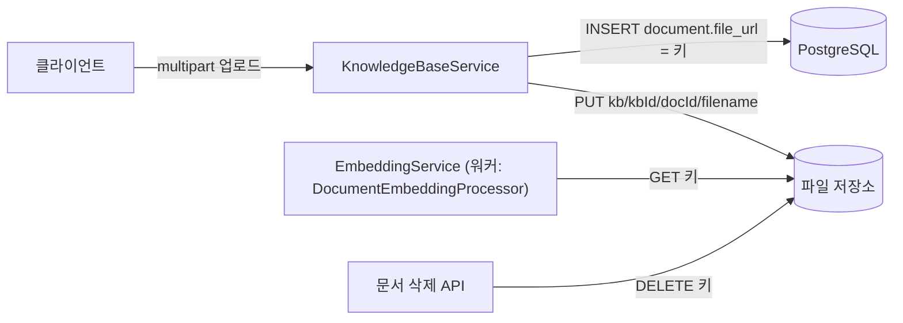

> 구현 상태: 부분 구현 · 원문: `spec/0-overview.md` (§2.7 Object Storage, Rationale «S3 객체 키 prefix 설계»), `spec/data-flow/4-file-storage.md` (전체), `spec/data-flow/0-overview.md` (Rationale «KB 원본 문서 S3 key 구조») · 용어: [용어 사전](../CLE-GLOSSARY.md)

## 개요

파일 저장소(file storage, S3)는 바이너리와 텍스트 원본 파일을 두는 단일 저장소다. 이 문서는 저장소 구성, 버킷 안의 키 규칙, 사용처별 흐름, 파일 수명주기를 정한다.

지금 쓰는 곳은 둘이다. 지식 저장소 원본 문서와 프로필 이미지(아바타)다. Form 노드 첨부 파일의 키는 정의만 있고 구현하지 않았다.

범위 밖: 지식 저장소 문서의 파싱·임베딩은 [문서 임베딩](../CLE-KB/CLE-KB-EMBED.md), 아바타 업로드 API 계약은 [내 프로필](../CLE-ACCT/CLE-ACCT-PROFILE.md), 업로드 요청의 공통 검증 층은 [HTTP API 규약](../CLE-API/CLE-API-CONV.md) 이 정한다.

## 저장소 구성

| 항목 | 내용 |
| --- | --- |
| 호환성 | AWS S3 API 호환(AWS S3, MinIO 등). 두 환경의 코드는 같다 |
| SaaS | AWS S3 |
| 셀프 호스팅·개발 | MinIO. Docker Compose 에 포함한다 |
| 기본 버킷 | 환경 변수 `S3_BUCKET` 으로 정한다. 기본값은 `workflow-storage`(`codebase/backend/.env.example`)다. 개발·e2e 환경에서는 docker-compose(`docker-compose.yml`, `docker-compose.e2e.yml`)의 `createbuckets` mc 작업이 기본 버킷을 자동으로 만든다(`mc mb --ignore-existing`). "두 환경의 코드가 같다" 는 전제가 이 작업에 기대고 있다 |

코드 진입점은 `codebase/backend/src/common/services/s3.service.ts` 다.

| 메서드 | 쓰임 |
| --- | --- |
| `upload(key, body, contentType)` | 객체 올리기 |
| `download(key)` | 객체 받기 |
| `delete(key)` | 객체 하나 지우기 |
| `deleteMany(keys)` | `DeleteObjects` 배치 삭제. 지식 저장소 삭제 정리 전용 |

### 설정 키

| ConfigService 키 | 환경 변수 | 뜻 |
| --- | --- | --- |
| `s3.bucket` | `S3_BUCKET` | 버킷 이름 |
| `s3.endpoint` | `S3_ENDPOINT` | MinIO 는 `http://minio:9000`, AWS 는 `https://s3.<region>.amazonaws.com` |
| `s3.region` | `S3_REGION` | 기본값 `us-east-1` |
| `s3.accessKey`, `s3.secretKey` | `S3_ACCESS_KEY`, `S3_SECRET_KEY` | IAM 자격 증명 또는 MinIO 사용자 |
| `s3.publicBaseUrl` | `S3_PUBLIC_BASE_URL` | 공개 객체(아바타)를 브라우저가 가져갈 기준 URL. `s3.endpoint` 는 백엔드가 SDK 로 쓰는 내부 주소라 브라우저가 닿지 못한다. 설정하지 않으면 `S3_ENDPOINT`, 그다음 `http://localhost:9000` 순으로 쓴다(`resolvePublicBaseUrl`) |

`s3.publicBaseUrl` 은 파일 저장소 전용이다. 웹훅 `callbackUrl` 을 조립할 때 쓰면 안 되는 `app.publicBaseUrl`·`publicBaseUrl` 과 무관하다. 후자는 실제 장애(Telegram 웹훅 거부)를 낸 적이 있어 회귀 테스트(`triggers.service.spec.ts`)가 사용을 막는다. 기준 키는 `app.url` 이다. 끝 이름이 같으므로 코드를 검색할 때는 네임스페이스를 함께 본다.

## 버킷 구조와 키 규칙

버킷 안의 접두는 셋이다. 지식 저장소 원본 문서와 아바타 키는 `workspaceId` 로 시작하지 않는다. 두 예외의 근거는 서로 다르다([Rationale](#객체-키에서-workspaceid-를-뺀-두-영역)).

| 영역 | 키 패턴 | 상태 | 코드 |
| --- | --- | --- | --- |
| 지식 저장소 원본 문서 | `kb/{kbId}/{documentId}/{sanitizedFilename}` | 구현됨 | `codebase/backend/src/modules/knowledge-base/knowledge-base.service.ts` 의 `uploadDocument` 가 `s3Key` 를 만든다 |
| 프로필 이미지(아바타) | `avatars/{userId}/{uuid}.{ext}` | 구현됨(공개 읽기) | `codebase/backend/src/modules/users/users.service.ts` (`avatarKeyPrefix`) |
| Form 노드 첨부 | `{workspaceId}/forms/{executionId}/{fileId}_{originalName}` | 계획(코드 미구현) | — |

- **공개 읽기는 아바타 키만이다.** 버킷 정책은 `avatars/` 접두에 익명 `GetObject` 만 허용하고 `ListBucket` 은 허용하지 않는다. 정책 파일과 실측은 `scripts/minio/avatars-public-read.json`, `scripts/minio/README.md` 에 있다.
- **파일 이름 정리**: 지식 저장소 원본 문서의 파일 이름은 `path.basename` 으로 경로 이동(traversal)을 막는다.

## 사용처별 흐름

### 지식 저장소 문서

사용자가 올린 문서를 파일 저장소에 두고, 워커가 그 파일을 다시 읽어 임베딩한다.

코드 위치는 `knowledge-base.service.ts`(`uploadDocument`, `removeDocument`)와 `embedding/embedding.service.ts`(`s3Service.download`)다. 파일 저장소 GET 은 `EmbeddingService` 가 하고, 그것을 부르는 워커는 `DocumentEmbeddingProcessor`(`queues/document-embedding.processor.ts`)다. 같은 계열의 `GraphExtractionProcessor` 는 파일 저장소를 직접 읽지 않는다.

| 동작 | 키 | 호출 |
| --- | --- | --- |
| 업로드 | `kb/<kbId>/<docId>/<sanitizedFilename>` | `s3Service.upload(s3Key, file.buffer, contentType)` |
| 파싱(워커) | 같은 키로 GET | `s3Service.download(doc.fileUrl)` |
| 문서 삭제 | 같은 키 DELETE | `s3Service.delete(doc.fileUrl)`. 실패해도 경고만 남기고 DB 행 삭제는 진행한다 |

`uploadDocument` 는 파일 저장소에 올리기 전에 다음 검증을 차례로 한다. 무엇이 파일 저장소에 들어갈 수 있는지를 이 단계가 정한다.

1. `decodeMulterFilename`: multer 가 latin1 로 디코딩한 `originalname` 을 UTF-8 로 다시 해석하고 NFC 로 정규화한다(한글 같은 멀티바이트 파일 이름 복원). `path.basename` 정리는 이 디코딩 뒤에 한다.
2. 확장자 허용 목록 `ALLOWED_FILE_TYPES`(`txt`·`md`·`pdf`·`csv`): 맞지 않으면 `INVALID_FILE_TYPE` 400 으로 거부한다. 제품 요구사항은 [지식 저장소 관리](../CLE-KB/CLE-KB-MANAGE.md) 의 KB-DC-02 다.
3. `CONTENT_TYPE_MAP` 으로 확장자별 Content-Type 을 정한다. 등록되지 않은 확장자는 `application/octet-stream` 이다. 정한 값을 `s3Service.upload` 에 넘긴다.

### 아바타

진입점은 `POST /api/users/me/avatar` 다([내 프로필](../CLE-ACCT/CLE-ACCT-PROFILE.md)). `multipart/form-data` 의 `file` 필드로 받고 multer `limits.fileSize` 는 2MB 다.

1. 확장자 허용 목록은 `png`·`jpg`·`jpeg`·`webp`·`gif` 다. 맞지 않으면 `INVALID_FILE_TYPE` 400, 파일이 없거나 비었으면 `FILE_REQUIRED` 400 이다. SVG 는 일부러 뺀다. 스크립트를 품을 수 있는 유일한 이미지 형식이라 공개 URL 로 서빙하면 저장형 XSS 표면이 된다.
2. Content-Type 은 확장자에서 정한다. 클라이언트가 보낸 `mimetype` 을 믿고 쓰면 `text/html` 이 저장돼 같은 오리진에서 실행될 수 있다.
3. 키는 `avatars/{userId}/{uuid}.{ext}` 다. 응답의 `avatarUrl` 은 `s3.publicBaseUrl` 기준의 공개 URL 이다. 브라우저가 버킷에서 직접 익명 `GetObject` 로 가져간다.
4. 아바타를 바꾸면 옛 객체는 DB 저장 뒤에 가능한 범위에서 지운다. 순서를 뒤집으면 저장이 실패했을 때 이미 지워진 아바타를 가리키는 URL 이 남는다. 이것은 고아 객체보다 나쁘다.

**배포 선행 조건**: 버킷에 아바타 공개 읽기 정책(`avatars/` 접두의 익명 `GetObject`)이 적용돼 있어야 한다. 정책이 없어도 업로드는 성공하고 이미지 표시만 403 이 된다. 그래서 증상이 업로드가 아니라 표시에서 난다. 브라우저가 닿는 `S3_PUBLIC_BASE_URL`([설정 키](#설정-키))도 필요하다. 설정하지 않으면 백엔드 내부 주소로 폴백해 브라우저가 이미지를 가져가지 못할 수 있다. 개발·e2e 에서는 docker-compose 의 `createbuckets` 작업이 `scripts/minio/avatars-public-read.json` 을 `mc anonymous set-json` 으로 적용하고, k8s 로컬 오버레이는 `k8s/overlays/local/infra-minio.yaml` 의 Job 이 같은 정책의 사본을 적용한다. 사용자 쪽 계약은 [내 프로필 §아바타](../CLE-ACCT/CLE-ACCT-PROFILE.md#아바타) 에 있다.

`PATCH /api/users/me` 의 `avatarUrl` 로 외부 URL 을 넣는 경로도 함께 유지한다. 두 경로가 같은 컬럼을 쓴다.

### Form 첨부(미구현)

위 키 패턴(`{workspaceId}/forms/{executionId}/{fileId}_{originalName}`)은 정의만 있다. 지금 `codebase/backend/` 에는 이 키로 `s3Service.upload` 를 부르는 경로가 없다. Form 노드에 파일 업로드가 들어오면 이 문서를 고친다.

## PostgreSQL 참조 컬럼

| 테이블 | 컬럼 | 뜻 |
| --- | --- | --- |
| `document` | `file_url VARCHAR(500)` | 파일 저장소 키. URL 이 아니라 키 원문이다 |
| `user` | `avatar_url VARCHAR(500)` | 외부 URL(OAuth 제공자 사진 등) 또는 직접 올린 아바타의 공개 URL. 두 경로가 같은 컬럼을 쓰고, 직접 올린 것인지는 `avatars/{userId}/` 접두가 들어 있는지로 가린다 |

## 수명주기

### 지식 저장소

| 이벤트 | 파일 저장소 | PostgreSQL |
| --- | --- | --- |
| 문서 업로드 | PUT 키 | INSERT `document.file_url = 키` |
| 문서 재임베딩 | 키는 그대로. 다시 GET 만 한다 | UPDATE `embedding_status`, `chunk_*` |
| 문서 삭제 | DELETE 키(실패해도 진행) | DELETE document(청크 CASCADE) |
| 지식 저장소 삭제 | 소속 문서를 모두 조회한 뒤 `DeleteObjects` 로 배치 삭제(요청당 1000키씩 나눠 보낸다. 가능한 범위에서 지우고 부분 실패는 경고만 남긴다) | DELETE knowledge_base(문서 CASCADE) |

지식 저장소 삭제 때의 정리는 `remove(id, workspaceId)` 가 소속 문서를 조회해 `s3Service.deleteMany(keys)` 를 부른다(`DeleteObjectsCommand`, 요청당 1000키). 부분 실패는 응답 `Errors[].Key` 를 한꺼번에 경고로 남기고, 명령 단위 실패(네트워크 등)도 경고 뒤 지식 저장소 행 삭제를 진행한다. 경고로 넘어가 남은 고아 객체는 정기 GC 배치로 정리할 계획이다(미구현).

### 아바타

교체 때 옛 객체를 DB 저장 뒤에 지운다([아바타](#아바타) 4번).

### 외부 의존

| 의존 | 방향 |
| --- | --- |
| AWS S3 / MinIO | 내부 → 외부 (PUT·GET·DELETE) |

## 구현 위치

- `codebase/backend/src/common/services/s3.service.ts` (저장소 접근: 올리기 · 받기 · 지우기 · 일괄 삭제)
- `codebase/backend/src/common/config/s3.config.ts` (설정 키와 기본값, 공개 주소 계산)
- `codebase/backend/src/modules/knowledge-base/knowledge-base.service.ts` (지식 저장소 원본 문서의 키 규칙 · 올리기 · 삭제)
- `codebase/backend/src/modules/knowledge-base/embedding/embedding.service.ts`, `codebase/backend/src/modules/knowledge-base/queues/document-embedding.processor.ts` (파싱 단계의 원본 받기)
- `codebase/backend/src/modules/users/users.service.ts`, `codebase/backend/src/modules/users/users.controller.ts` (프로필 이미지 키 · 크기 한도 · 교체 때 옛 객체 삭제)
- `scripts/minio/*` (공개 읽기 정책과 배포 선행 조건)

## Rationale

### 객체 키에서 workspaceId 를 뺀 두 영역

- **배경**: 멀티 테넌트 환경에서는 객체 키를 `{workspaceId}/...` 로 시작하게 해 논리적으로 격리하고 버킷 정책 단위로 권한을 제어하는 것이 흔한 방식이다. Form 영역은 이 방식을 따른다.
- **채택**: 두 영역이 workspaceId 접두에서 빠진다. 근거가 서로 달라 나눠 적는다.
  - **지식 저장소 원본 문서** `kb/{kbId}/{documentId}/...`: `{workspaceId}/kb/...` 로 하면 키가 길어지고 지식 저장소 목록·삭제의 접두 스캔 비용이 는다. 비용 근거다.
  - **아바타** `avatars/{userId}/{uuid}.{ext}`: 사용자는 워크스페이스에 매이지 않는 리소스다. 한 사용자가 여러 워크스페이스에 속하므로 키를 워크스페이스로 나누면 같은 사람의 아바타가 워크스페이스마다 갈라지고, 워크스페이스를 더할 때마다 다시 올려야 한다. 비용 최적화가 아니라 리소스가 누구에게 속하는지의 문제다.
- **아바타 파일 이름이 `{userId}.{ext}` 가 아니라 `{uuid}.{ext}` 인 이유**: 아바타는 공개 버킷에서 서빙하므로 키가 곧 접근 통제다. `{userId}.{ext}` 는 예측할 수 있어, 워크스페이스 멤버 목록을 아는 사람이 다른 사용자의 아바타를 열거하고 볼 수 있다. UUID 는 장식이 아니라 통제 수단이고, 그래서 `ListBucket` 차단과 짝이다. 둘 중 하나만으로는 통제가 성립하지 않는다.
- **trade-off**: `kbId` 가 지식 저장소 메타데이터의 FK 로 워크스페이스에 매여 있으므로, 지식 저장소 쪽 워크스페이스 격리는 애플리케이션이 보장한다(`kbId → workspaceId` 조회 뒤 권한 확인). 아바타는 격리 대상이 아니다. 공개 읽기가 제품 결정이다(2026-08-31 사용자 결정, [내 프로필](../CLE-ACCT/CLE-ACCT-PROFILE.md)). 나중에 버킷 정책만으로 워크스페이스 격리를 강제해야 하는 요구가 생기면 지식 저장소 쪽 접두를 다시 설계해야 한다. 지금은 그 요구가 없다.
- **정책 조건만으로는 격리하지 않는다**: 워크스페이스 접두가 없으므로 파일 저장소 정책(`s3:GetObject` IAM 조건)의 키 접두만으로는 워크스페이스 단위 격리를 강제하지 않는다. 지식 저장소 원본 문서는 격리가 필요하지만 키 접두가 아니라 DB 권한 확인으로 보장한다. 아바타는 격리할 것이 없고, 접근 통제는 키의 UUID 추측 불가능성과 `ListBucket` 차단이 함께 맡는다.
- **옛 제안의 정리**: 한때 지식 저장소 키로 `{workspaceId}/knowledge-base/{kbId}/...` 를 적은 문서가 있어 코드와 어긋났다. 코드 기준인 `kb/{kbId}/{documentId}/...` 로 하나로 맞췄다.

### 다운로드 엔드포인트와 presigned URL 이 없는 이유

지금 코드에는 클라이언트용 다운로드 엔드포인트도, presigned URL(`getSignedUrl`·presigner) 사용처도 없다. 인증이 필요한 객체의 GET 은 워커 임베딩 단계의 서버 쪽 `s3Service.download` 뿐이다. 아바타는 예외다. 공개 버킷 정책으로 브라우저가 직접 익명 `GetObject` 하므로 presigned URL 도 다운로드 엔드포인트도 필요 없다. 인증 객체를 클라이언트가 presigned URL 로 직접 받는 기능은 미구현(Planned)이다. 도입하면 워크스페이스 격리를 DB 권한 확인과 묶어 보강한다.

### 파일 삭제 실패를 경고로 처리하는 이유

문서 행이 DB 에서 사라진 뒤 파일만 남는 것은 저장 비용 누수일 뿐 데이터 정합성이 깨진 것은 아니다. 반대로 파일은 사라졌는데 DB 행이 남아 워커가 404 로 실패하는 것이 훨씬 큰 사용성 문제다. 그래서 파일 삭제는 가능한 범위에서만 한다. 문서 삭제(`removeDocument`)와 지식 저장소 삭제(`remove`)가 같은 정책을 쓴다. 단건 경로는 try/catch 로 경고를 남기고, 배치 경로(`deleteMany`)는 응답 `Errors[].Key` 를 한꺼번에 경고로 남긴다. 없는 키는 S3 의 멱등 의미상 `Deleted` 로 돌아오므로 경고 대상이 아니다. 경고로 넘어가 쌓인 고아 객체는 정기 GC 배치로 정리할 계획이다.
