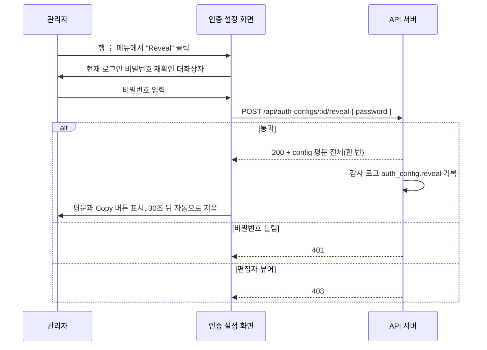

> 구현 상태: 구현됨 · 원문: `spec/2-navigation/6-config.md` (Overview, Part A, §3 Authentication API, Rationale R-2·R-6), `spec/2-navigation/_product-overview.md` (§3.6 Authentication), `spec/1-data-model.md` (§2.17.2 마스킹·노출 정책) · 용어: [용어 사전](../CLE-GLOSSARY.md)

## 개요

인증 설정(AuthConfig, `auth_config`)은 외부 시스템이 이 제품의 트리거를 부를 때 쓰는 워크스페이스 단위 인증 자격 증명이다. 워크플로우를 편집할 때마다 자격 증명을 입력하는 대신, 여기서 한 번 만든 인증 설정을 여러 웹훅 트리거가 연결해 쓴다. 현재 인증 설정이 연결되는 곳은 웹훅 수신 인증이다. 로그인 인증이나 통합 자격 증명과는 다른 개념이다.

인증 설정 화면은 사이드바 최상위 메뉴 "Authentication"(경로 `/authentication`)이다. 옛 원문은 이 화면과 모델 설정 화면을 "설정(Config)" 으로 묶어 적었지만 그 묶음은 분류용이고 실제 메뉴는 둘 다 최상위에 있다. 두 메뉴를 나중에 Config 그룹으로 다시 묶을 수는 있다.

이 문서는 인증 설정 목록 화면, 인증 방식(인증 설정 유형, `AuthConfig.type`)별 입력 항목, 편집, 사용 내역(usage), 필드 마스킹(`***<last4>`)과 평문 보기(Reveal), 권한, 인증 설정 API 를 정한다.

범위 밖 주제는 다음 문서가 정한다.

- 엔티티 컬럼, 유형별 `config` JSONB 스키마, 자동 발급 값의 접두사: [트리거 데이터와 흐름](CLE-TRIG-DATA.md)
- 웹훅 요청을 인증 설정으로 검증하는 방식: [웹훅](CLE-TRIG-WEBHOOK.md)
- 트리거에 인증 설정을 연결하는 화면과 API: [트리거 관리](CLE-TRIG-MANAGE.md)
- 역할별 권한 매트릭스: [워크스페이스와 멤버](../CLE-ACCT/CLE-ACCT-WS.md). 감사 action: [감사 로그](../CLE-OBS/CLE-OBS-AUDIT.md)
- 같은 원문에 있던 모델 설정(Chat·Embedding·Rerank) 화면과 API: [모델 설정](../CLE-AI/CLE-AI-MODELS.md)

## 요구사항

- REQ-AUTHCFG-001 WHEN 관리자 이상이 인증 설정을 만들면 THE SYSTEM SHALL 외부 호출자가 트리거를 부를 때 쓸 인증 방식(API Key·Bearer Token·Basic Auth·HMAC)을 저장한다. (원본: NAV-CA-01)
- REQ-AUTHCFG-002 WHEN API Key 유형을 만들면 THE SYSTEM SHALL `wfk_<hex24>` 키를 자동으로 발급한다. (원본: NAV-CA-02)
- REQ-AUTHCFG-003 WHEN Bearer Token 유형을 만들면 THE SYSTEM SHALL `wft_<hex32>` 토큰을 자동으로 발급하고 사용자가 입력한 토큰은 받지 않는다. (원본: NAV-CA-03)
- REQ-AUTHCFG-004 WHEN Basic Auth 유형을 만들면 THE SYSTEM SHALL 사용자 이름과 비밀번호를 사용자 입력으로 받는다. (원본: NAV-CA-04)
- REQ-AUTHCFG-005 WHEN HMAC 유형을 만들면 THE SYSTEM SHALL `whs_<hex32>` 시크릿을 자동으로 발급하고 서명 헤더 이름과 알고리즘(`sha256`·`sha512`)을 받는다.
- REQ-AUTHCFG-006 WHEN 사용자가 IP Whitelist 를 입력하면 THE SYSTEM SHALL 모든 유형에서 한 줄에 IP 나 CIDR 하나씩 받아 저장한다. (원본: NAV-CA-05)
- REQ-AUTHCFG-007 IF IP Whitelist 항목이 단일 IP 나 CIDR(IPv4·IPv6) 형식이 아니면 THE SYSTEM SHALL 생성·수정을 400 으로 거부한다.
- REQ-AUTHCFG-008 WHEN 사용자가 인증 설정 행을 누르면 THE SYSTEM SHALL 최근 호출 시각·총 호출 수·기간별 호출 수·최근 20건 호출 이력을 사용 내역으로 보여 준다. (원본: NAV-CA-06)
- REQ-AUTHCFG-009 WHEN 기간별 호출 수를 계산하면 THE SYSTEM SHALL 최근 24시간·7일·30일 롤링 윈도로 세고 막대 차트로 표시한다.
- REQ-AUTHCFG-010 WHEN 사용 내역의 호출 이력을 그리면 THE SYSTEM SHALL 소스 IP 가 없으면 `—` 를, 응답 코드가 없으면 실행 상태 값을 대신 표시한다.
- REQ-AUTHCFG-011 WHEN 인증 설정을 응답하면 THE SYSTEM SHALL `config.key`·`config.token`·`config.secret`·`config.password` 를 `***<last4>` 로 가리고 `username`·`header`·`headerName`·`algorithm` 은 평문으로 싣는다.
- REQ-AUTHCFG-012 IF 가릴 값이 네 글자보다 짧으면 THE SYSTEM SHALL `***` 만 싣는다.
- REQ-AUTHCFG-013 WHEN 인증 설정을 만들거나 재생성하면 THE SYSTEM SHALL 발급한 평문을 그 응답에 한 번만 싣는다.
- REQ-AUTHCFG-014 WHEN 관리자 이상이 평문 보기를 요청하면 THE SYSTEM SHALL 현재 로그인 비밀번호를 다시 확인한 뒤 평문 config 전체를 한 번 응답하고 감사 로그에 `auth_config.reveal` 을 남긴다.
- REQ-AUTHCFG-015 IF 평문 보기 요청의 비밀번호가 틀리면 THE SYSTEM SHALL 401 로 거부한다.
- REQ-AUTHCFG-016 WHEN 화면이 생성·재생성·평문 보기로 받은 평문을 표시하면 THE SYSTEM SHALL 30초 뒤 자동으로 지우고 컴포넌트가 사라질 때 타이머를 정리한다.
- REQ-AUTHCFG-017 WHEN 사용자가 키·토큰 복사 버튼을 누르면 THE SYSTEM SHALL 마스킹된 문자열을 복사한다.
- REQ-AUTHCFG-018 WHEN 관리자 이상이 편집 폼을 저장하면 THE SYSTEM SHALL 이름·IP Whitelist·비밀이 아닌 config(`headerName`·`header`·`algorithm`·`username`)만 바꾼다.
- REQ-AUTHCFG-019 WHEN 편집 PATCH 가 config 를 받으면 THE SYSTEM SHALL 기존 config 에 shallow-merge 하고 되돌아온 마스킹 값(`***<last4>`)은 무시해 저장된 비밀을 지킨다.
- REQ-AUTHCFG-020 IF 편집 폼에서 유형이나 비밀 값을 바꾸려 하면 THE SYSTEM SHALL 허용하지 않는다.
- REQ-AUTHCFG-021 WHEN 관리자 이상이 재생성을 확인하면 THE SYSTEM SHALL 기존 키·토큰·시크릿을 폐기하고 새 값을 발급한다.
- REQ-AUTHCFG-022 IF 편집자나 뷰어가 인증 설정 생성·수정·활성 토글·재생성·평문 보기·삭제 API 를 부르면 THE SYSTEM SHALL 403 `ADMIN_REQUIRED` 로 거부한다.
- REQ-AUTHCFG-023 WHILE 사용자가 편집자나 뷰어인 동안 THE SYSTEM SHALL 변경 액션 버튼(Add Config·활성 토글·Reveal·Edit·Regenerate·Delete)을 노출하지 않는다.
- REQ-AUTHCFG-024 WHEN 뷰어 이상이 목록·상세·사용 내역을 조회하면 THE SYSTEM SHALL 비밀 값을 가린 채 응답한다.
- REQ-AUTHCFG-025 WHEN `GET /api/auth-configs/:id/usage` 가 호출되면 THE SYSTEM SHALL `totalCalls`·`lastUsedAt`·`periodCounts`·`recentCalls`(최근 20건)를 돌려준다.

## 화면 구조

인증 설정 화면은 헤더와 인증 설정 목록으로 이루어진다. 행을 누르면 사용 내역 드로어가 열린다.

| 영역 | 위치 | 들어가는 요소 | 동작 |
|------|------|---------------|------|
| 헤더 | 맨 위 | 제목 "Authentication", "+ Add Auth Method" 버튼 | 버튼은 관리자 이상에게만 보인다. 누르면 생성 폼이 열린다 |
| 인증 설정 목록 | 본문 | 행마다 이름, 유형, 활성 상태, 최근 사용 시각, 더보기(⋮) | 행을 누르면 [사용 내역](#사용-내역) 드로어가 열린다(모든 역할). ⋮ 메뉴의 변경 액션은 관리자 이상에게만 보인다 |

목록 행 예시는 다음과 같다.

| 이름 | 유형 | 상태 | 둘째 줄 |
|------|------|------|---------|
| 🔑 Production API Key | API Key | Active | Last used: 2 hours ago |
| 🔑 Staging Token | Bearer | Active | Last used: 1 day ago |
| 🔑 Legacy Basic Auth | Basic Auth | Inactive | Last used: 30 days ago |

## 인증 방식별 입력 항목

유형별 `config` 스키마와 자동 발급 규칙의 단일 기준은 [트리거 데이터와 흐름](CLE-TRIG-DATA.md) 이다. IP Whitelist 는 모든 유형에 공통인 선택 필드다. 생성 폼은 IP Whitelist 입력(한 줄에 IP 나 CIDR 하나)과 유형별 추가 입력을 모두 보여 준다.

### API Key

| 필드 | 설명 |
|------|------|
| 이름 | 인증 설정 이름 |
| API Key | 자동 생성(`wfk_<hex24>`), 표시는 마스킹. 복사 버튼은 마스킹 문자열을 복사한다. 평문은 생성 직후 한 번 또는 평문 보기로만 복사한다 |
| Header 이름 | 검증에 쓸 헤더 이름(기본 `X-API-Key`) |
| Key 재생성 | 기존 키를 폐기하고 새 키를 만든다(확인 필요) |
| IP Whitelist | 허용 IP 목록(선택) |

### Bearer Token

| 필드 | 설명 |
|------|------|
| 이름 | 인증 설정 이름 |
| Token | 자동 생성(`wft_<hex32>`), 표시는 마스킹. 사용자 입력은 받지 않는다 |
| Token 재생성 | 기존 토큰을 폐기하고 새 토큰을 만든다(확인 필요) |
| IP Whitelist | 허용 IP 목록(선택) |

### Basic Auth

| 필드 | 설명 |
|------|------|
| 이름 | 인증 설정 이름 |
| Username | 사용자 이름(사용자 입력). 식별을 돕는 값이라 응답에 평문으로 나간다 |
| Password | 비밀번호(사용자 입력, 가린 입력창). 저장 뒤 응답은 `***<last4>` 로 가린다. 평문 재확인은 평문 보기로만 한다 |
| IP Whitelist | 허용 IP 목록(선택) |

### HMAC

| 필드 | 설명 |
|------|------|
| 이름 | 인증 설정 이름 |
| Secret | 자동 생성(`whs_<hex32>`), 표시는 마스킹, 재생성 가능 |
| Header | 서명을 담는 헤더 이름(기본 `X-Hub-Signature-256`). 외부 provider 에 맞춘다(GitHub `X-Hub-Signature-256`, Stripe `Stripe-Signature` 등) |
| Algorithm | 선택: `sha256` / `sha512`. 다른 값은 보안상 지원하지 않는다 |
| IP Whitelist | 허용 IP 목록(선택) |

### IP Whitelist

각 항목은 단일 IP 나 CIDR 이다(예: `10.0.0.0/8`, `2001:db8::/32`). 단일 IP 는 `/32`·`/128` 호스트로 취급한다. 생성·수정 때 항목마다 형식을 검증하고 단일 IP·CIDR(IPv4·IPv6)이 아니면 400 으로 거부한다. 웹훅 수신 때 이 목록을 시행하는 규칙은 [웹훅](CLE-TRIG-WEBHOOK.md) 이 정한다.

## 편집

같은 화면에서 행별 편집 버튼을 누르면 `PATCH /api/auth-configs/:id` 로 다음 값을 고친다.

- 이름
- IP Whitelist
- 비밀이 아닌 config: API Key 의 `headerName`, HMAC 의 `header`·`algorithm`, Basic Auth 의 `username`

유형과 비밀 값은 편집할 수 없다. 비밀을 바꾸는 것은 재생성 하나로 모은다. 편집 PATCH 는 config 를 통째로 바꾸지 않고 shallow-merge 해 암호화된 비밀 값을 보존한다. 마스킹 값(`***<last4>`)이 되돌아와도 무시한다.

## 사용 내역

인증 설정 행을 누르면 그 인증 설정을 쓴 호출의 사용 내역을 보여 준다. 트리거 화면의 호출 이력과는 다른 화면이다([트리거 관리](CLE-TRIG-MANAGE.md)).

| 항목 | 설명 |
|------|------|
| 최근 호출 시각 | 마지막 사용 시각(`lastUsedAt`). 웹훅 인증이 성공하면 갱신한다 |
| 총 호출 수 | 이 인증 설정에 연결된 트리거의 누적 실행 수(`totalCalls`) |
| 기간별 호출 수 | 최근 24시간·7일·30일 롤링 윈도 기준 호출 수(`periodCounts { last24h, last7d, last30d }`). `Execution.started_at` 을 한 쿼리 안에서 조건부 집계(`COUNT(*) FILTER`)한다. 화면은 막대 차트(recharts BarChart)로 그린다. 일·주·월 경계로 나누는 캘린더 버킷이 아니라 호출 시점 기준 롤링 윈도다 |
| 호출 이력 테이블 | 최근 20건. 대상 트리거 이름, 상태, 소스 IP, 응답 코드, 시각(`recentCalls` 의 `triggerName` / `status` / `sourceIp` / `responseCode` / `startedAt`). 소스 IP 가 없는(HTTP 가 아닌 트리거) 행은 `—` 로, 응답 코드가 없는 행은 워크플로우 실행 `status` 값으로 대신 표시한다 |

소스 IP(`Execution.source_ip`)와 응답 코드(`Execution.response_code`)를 어떻게 잡아 저장하는지는 [실행 데이터와 흐름](../CLE-EXEC/CLE-EXEC-DATA.md) 이 정한다. 집계는 `Execution.trigger_id → Trigger.auth_config_id` 조인으로 한다.

## 필드 마스킹과 평문 보기

### 마스킹 규칙

이 절이 인증 설정 마스킹 정책의 단일 기준이다.

- API 응답에서 `config.key` / `config.token` / `config.secret` / `config.password` 는 항상 `***<last4>` 형태로 가린다(예: `wft_***c8a1`). 끝 네 글자가 모자라면 `***` 다.
- `config.username` / `config.header` / `config.headerName` / `config.algorithm` 은 평문으로 싣는다. 식별과 검증을 돕는 메타이고 비밀이 아니다.
- 평문은 다음 세 경로에서만 나간다.
  - `POST /api/auth-configs`(생성): 자동 발급한 값을 한 번 응답한다.
  - `POST /api/auth-configs/:id/regenerate`: 새 값을 한 번 응답한다.
  - `POST /api/auth-configs/:id/reveal`: 현재 로그인 비밀번호를 다시 확인한 뒤 평문을 한 번 응답한다(관리자 이상, 감사 로그 `auth_config.reveal`).

채팅 채널 봇 토큰처럼 평문 보기로 읽을 수 없는 입력 전용 필드에는 이 마스킹 규칙을 쓰지 않는다([트리거 관리](CLE-TRIG-MANAGE.md)).

### 평문 보기 흐름

1. 행의 ⋮ 메뉴에서 "Reveal" 을 누른다. 이 항목은 관리자 이상에게만 보인다.
2. 현재 로그인 비밀번호를 다시 확인하는 대화상자가 뜬다.
3. `POST /api/auth-configs/:id/reveal { password }` 를 보낸다. 통과하면 200 과 config 평문 전체를 한 번 받는다. 비밀번호가 틀리면 401, 편집자·뷰어는 403 이다.
4. 화면은 평문과 "Copy" 버튼을 보이고 30초 뒤 자동으로 숨긴다.
5. 감사 로그에 `action='auth_config.reveal'` 을 남긴다.

평문 자동 숨김은 생성·재생성 직후의 한 번 노출에도 똑같이 적용한다. 생성·재생성 직후 표시된 평문도 30초 뒤 자동으로 비운다. 컴포넌트가 사라질 때 타이머를 정리한다.

## 권한

목록의 모든 변경 액션 버튼(헤더의 Add Config, 활성 토글(Activate/Deactivate), Reveal, Edit, Regenerate, Delete)은 관리자 이상에게만 보인다. 편집자와 뷰어는 마스킹된 목록·상세·사용 내역(읽기)만 본다. 목록 행 클릭(사용 내역 드로어 = 읽기)은 모든 역할에게 허용해 가드하지 않는다.

편집자나 뷰어가 변경 API 를 직접 부르면 403 `ADMIN_REQUIRED` 다(`RolesGuard` 의 `@Roles('admin')`). 근거는 [워크스페이스와 멤버](../CLE-ACCT/CLE-ACCT-WS.md) 의 권한 매트릭스다(인증 설정: 소유자·관리자 = CRUD, 편집자·뷰어 = 읽기). 화면 가드는 일관성과 403 혼란 방지용이고 실제 인가는 백엔드 `@Roles('admin')` 가 fail-closed 로 강제한다(이중 방어). `useHasRole("admin")` 은 `ROLE_LEVEL` 이상 비교라 소유자도 포함한다.

## API

변경(POST / PATCH / DELETE / regenerate / reveal)은 관리자 이상, 조회(GET 목록·상세·usage)는 뷰어 이상이다. 목록 응답 형식은 [HTTP API 규약](../CLE-API/CLE-API-CONV.md) 의 목록 응답 규칙을 따른다.

| 메서드 | 경로 | 설명 |
|--------|------|------|
| GET | `/api/auth-configs` | 인증 설정 목록. 쿼리: `page`, `limit`, `sort`, `order`, `search` |
| POST | `/api/auth-configs` | 인증 설정 생성(관리자 이상). 자동 발급한 값을 한 번 평문으로 응답한다 |
| GET | `/api/auth-configs/:id` | 상세 |
| PATCH | `/api/auth-configs/:id` | 수정: 이름·IP Whitelist·비밀이 아닌 config·활성 토글(관리자 이상) |
| POST | `/api/auth-configs/:id/regenerate` | 키·토큰·시크릿 재생성. 새 값을 한 번 평문으로 응답한다(관리자 이상) |
| POST | `/api/auth-configs/:id/reveal` | 평문 config 한 번 노출. `:id` 는 UUID, 본문 `{ password }`. 관리자 이상. 감사 로그 기록 |
| DELETE | `/api/auth-configs/:id` | 삭제(관리자 이상) |
| GET | `/api/auth-configs/:id/usage` | 사용 내역. 응답 `data`: `{ totalCalls, lastUsedAt, periodCounts: { last24h, last7d, last30d }, recentCalls: [{ id, triggerName, status, sourceIp, responseCode, startedAt }] }`(최근 20건) |

인증 설정을 지우면 연결된 트리거의 `auth_config_id` 는 FK SET NULL 로 끊긴다([트리거 데이터와 흐름](CLE-TRIG-DATA.md)).

## 구현 위치

- `codebase/frontend/src/app/(main)/w/[slug]/authentication/**`
- `codebase/backend/src/modules/auth-configs/**`

## Rationale

### 인증 설정을 웹훅 수신 인증에 연결한 결정

인증 메뉴의 인증 설정은 웹훅 수신 인증에 연결된다. 트리거 인라인 인증 경로를 없애고 인증 설정 하나로 모은 근거는 [웹훅](CLE-TRIG-WEBHOOK.md) 의 "인라인 인증 경로 폐지" 결정에 있다. 이 결정에 딸린 인증 설정 쪽 결정은 다음과 같다.

- HMAC 유형: API Key·Bearer·Basic Auth 에 더해 `hmac` 을 지원한다. 웹훅 HMAC 서명 검증을 트리거 인라인 `config.secret` 대신 인증 설정이 맡는다.
- Bearer Token 만료 필드를 v1 에서 뺐다: 토큰 만료와 자동 회전을 다루지 않는다. JSONB 스키마 `{ token }` 과 맞춘 것이다. 만료나 회전이 필요해지면 후속 결정으로 다시 들인다.
- 항상 마스킹하고 평문 보기 엔드포인트를 둔다: API 응답에서 비밀 값은 늘 `***<last4>` 다. 평문은 생성·재생성·평문 보기 세 경로에서만 나간다. 평문 보기는 관리자 이상, 비밀번호 재확인, 감사 기록을 요구한다.

### Bearer Token 을 자동 발급만 허용하는 이유

예전에는 Bearer Token 을 "자동 생성 또는 사용자 입력" 으로 받았다. 사용자 입력을 없애고 자동 발급(`wft_<hex32>`)만 허용한다. 외부 호출자에게 발급하는 토큰은 제품이 충분한 엔트로피로 만드는 편이 일관되고 사용자 입력 토큰의 형식·엔트로피를 검증할 부담도 사라진다.

### 평문 30초 자동 숨김을 세 경로에 똑같이 적용하는 이유

평문이 드러나는 세 경로(생성·재생성·평문 보기)는 같은 보안 자산이므로 노출 시간 제한 정책을 하나로 맞춘다. 전에는 평문 보기만 자동으로 숨기고 생성·재생성 표시는 사용자가 닫을 때까지 남았다. 이 비대칭을 없애 화면을 방치했을 때 어깨너머 보기나 세션 탈취로 평문이 노출되는 창을 30초로 줄인다. 클라이언트 타이머는 `useEffect` cleanup 으로 컴포넌트가 사라지거나 다시 표시될 때 정리해 누수와 늦은 지우기를 막는다.

### 편집 폼에서 비밀을 다시 입력받지 않는 이유

편집(`PATCH`)은 이름·IP·비밀이 아닌 config 만 바꾸고 비밀 값을 다시 입력받지 않는다. 비밀 변경은 재생성 하나로 모은다. 백엔드 `update` 는 `config` 를 통째로 바꾸지 않고 shallow-merge 하며 마스킹된 비밀 값(`***<last4>`)이 되돌아와도 무시해 실제 비밀이 망가지지 않게 한다. 유형 변경도 편집 폼에서 막는다. 유형을 바꾸면 비밀을 다시 발급해야 하므로 지우고 다시 만든다.

### 변경 액션 버튼을 모두 관리자 이상으로 가드하는 이유

전에는 Reveal 만 관리자 이상으로 가드했다. 이 비대칭을 없애 Add Config·활성 토글·Edit·Regenerate·Delete 까지 모든 변경 버튼을 관리자 이상에게만 보인다. 권한 매트릭스가 인증 설정을 소유자·관리자 = CRUD, 편집자·뷰어 = 읽기로 정하므로 활성 토글도 수정에 해당해 관리자 이상이다. "활성/비활성 전환은 단순 상태라 편집자도 된다" 로 새지 않게 적어 둔다. 실제 인가는 백엔드 `@Roles('admin')` 가 fail-closed 로 강제한다. 화면 가드는 권한 상승 방지가 아니라, 관리자가 아닌 사용자에게 403 이 날 버튼을 감춰 혼란을 없애는 일관성 장치다. `useHasRole("admin")` 의 `ROLE_LEVEL` 이상 비교로 소유자도 자동으로 포함된다.

### 사용 내역을 실행 행에 저장하는 이유

사용 내역의 소스 IP·응답 코드·기간별 호출 수는 다음 결정으로 구현했다.

- 저장 위치는 실행(`Execution`) 행에 컬럼을 더하는 것이고(V096) 전용 호출 로그 엔티티는 두지 않는다. 인증 설정 사용 집계는 이미 `Execution.trigger_id → Trigger.auth_config_id` 조인으로 `totalCalls`/`recentCalls` 를 냈다. 같은 행에 `source_ip VARCHAR(45)`·`response_code VARCHAR(10)`(둘 다 nullable)을 더하면 조인 한 번으로 끝나 가장 단순하다. 통합은 전용 `IntegrationUsageLog` 를 두지만 인증 설정은 호출이 곧 워크플로우 실행이라 실행 행을 단일 기준으로 다시 쓴다. 별도 로그를 두면 이중 기록과 정합 부담이 생긴다.
- 응답 코드는 두 가지를 함께 쓴다. 웹훅(과 채팅 채널 inbound)은 호출이 받은 실제 HTTP 코드를 저장한다. 실행 생성에 성공한 경로는 늘 `202 Accepted` 다. 인증 401·검증 400·비활성 410 은 `execute` 전에 던져져 실행 행이 생기지 않는다. 스케줄 같은 HTTP 가 아닌 트리거는 HTTP 코드가 없어 `response_code` 가 NULL 이고 `getUsage` 가 워크플로우 실행 `status` 값으로 대신 표시한다. 이렇게 WH-MG-05 의 "응답 코드 확인" 을 이행한다. 이 요구를 어느 화면이 이행하는지는 [웹훅](CLE-TRIG-WEBHOOK.md) 의 미결 사항에 적는다.
- 기간별 호출 수는 롤링 윈도(24h·7d·30d)와 막대 차트로 한다. 사용 내역 화면의 목적은 최근 활동량 파악이고 캘린더 버킷의 경계 정렬(시간대, 주 시작 요일) 모호성도 피한다. `Execution.started_at` 을 한 쿼리에서 조건부 집계(`COUNT(*) FILTER (WHERE started_at >= now()-window)`)해 왕복 한 번으로 세 값을 구한다.
- 소스 IP 는 `hooks.service` 가 웹훅 진입 때 `extractClientIpFromHeaders` 로 뽑은 값을 인증 IP whitelist 검증과 호출 기록에 함께 쓴다. `CF-Connecting-IP` 를 신뢰하도록 설정했으면 그 값, 아니면 `X-Forwarded-For` 첫 IP 를 쓰고 헤더 기반이라 `req.ip` 폴백은 없다([세션과 토큰](../CLE-ACCT/CLE-ACCT-SESSION.md) 의 클라이언트 IP 항목). 뽑지 못하면 NULL 이다.
