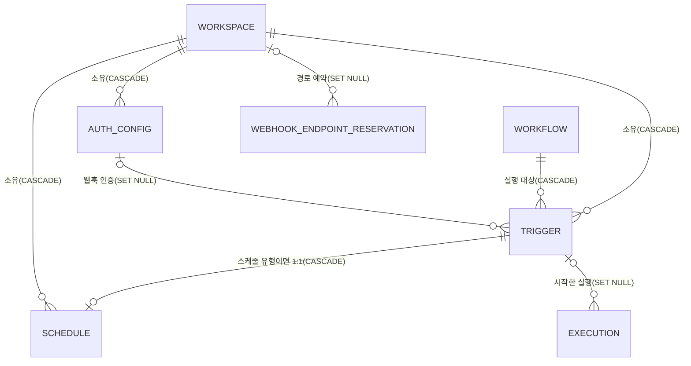
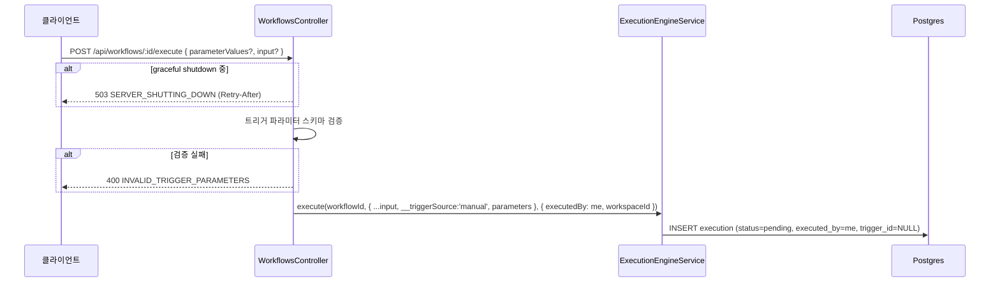
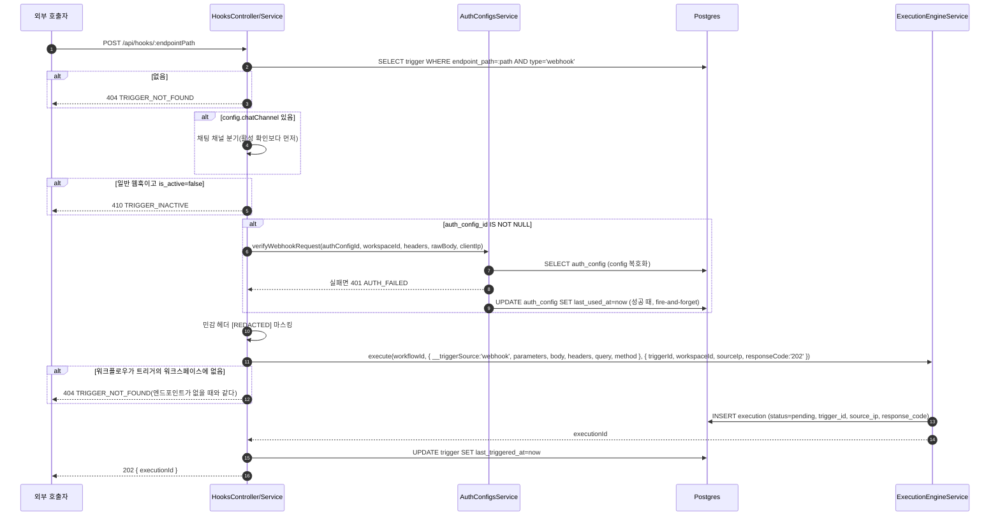
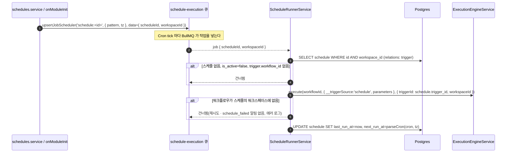
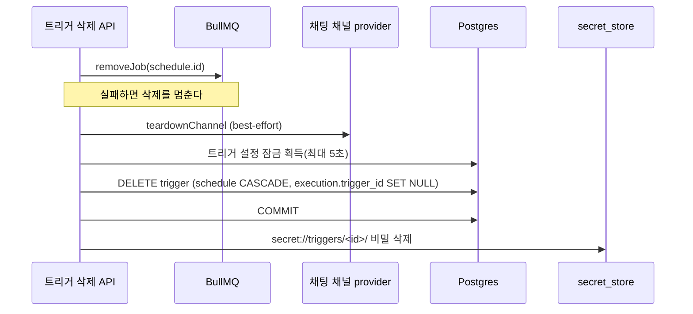
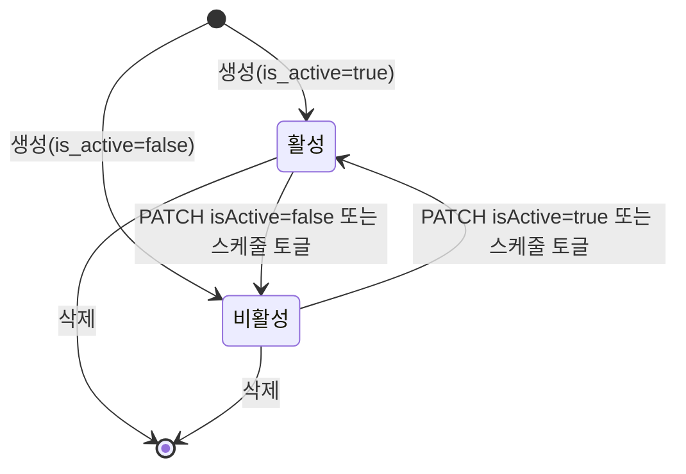

> 구현 상태: 구현됨 · 원문: `spec/data-flow/10-triggers.md`, `spec/1-data-model.md` (§2.8 Trigger, §2.8.1 WebhookEndpointReservation, §2.9 Schedule, §2.9.1 동기화 규칙, §2.17 AuthConfig, Rationale 네 절), `spec/2-navigation/2-trigger-list.md` (§4.3 자원 정리의 순서) · 용어: [용어 사전](../CLE-GLOSSARY.md)

## 개요

이 문서는 트리거 영역의 엔티티 네 개(트리거 `Trigger`, 엔드포인트 경로 예약 `WebhookEndpointReservation`, 스케줄 `Schedule`, 인증 설정 `AuthConfig`)의 컬럼과 제약, 그리고 트리거가 워크플로우 실행을 시작하기까지의 데이터 흐름을 정한다.

워크플로우 실행을 시작하는 진입점은 세 가지다.

- 수동: 사용자가 화면의 Run 버튼으로 바로 실행한다(`POST /api/workflows/:id/execute`).
- 웹훅: 외부 HTTP 호출이 `/api/hooks/:endpointPath` 로 들어온다. 일반 웹훅과 채팅 채널 inbound(Telegram·Slack·Discord) 두 갈래로 나뉜다.
- 스케줄: BullMQ repeatable job(job scheduler)이 Cron 표현식에 따라 직접 발사한다. DB polling 이나 sweep 은 없다.

세 진입점은 모두 `ExecutionEngineService.execute(workflowId, inputData, options)` 로 모인다. 세 번째 인자는 `ExecuteOptions` 객체다. 트리거 경로는 `{ triggerId }`(웹훅은 `sourceIp`·`responseCode` 를 더한다), 수동 실행은 `{ executedBy }` 를 넘기고 호출부가 `triggerType` 을 함께 넘긴다. 모든 경로가 실행을 시작하는 워크스페이스 `workspaceId` 도 넘긴다([실행 컨텍스트](../CLE-EXEC/CLE-EXEC-CONTEXT.md#트리거-입력-파라미터-싣기)). `execute()` 는 실행 행을 `status=pending` 으로 INSERT 한 뒤 BullMQ `execution-run` intake 큐에 작업을 발행하고 곧바로 `executionId` 를 돌려준다. 트리거 유형이 작업 우선순위를 정한다([큐 워커와 동시 실행 제한](../CLE-EXEC/CLE-EXEC-WORKER.md)).

범위 밖 주제는 다음 문서가 정한다.

- 트리거 화면·API·삭제 정책·동시 쓰기 직렬화: [트리거 관리](CLE-TRIG-MANAGE.md)
- 스케줄 화면·API: [스케줄](CLE-TRIG-SCHEDULE.md)
- 웹훅 수신 단계 순서·인증 검증·남용 방어: [웹훅](CLE-TRIG-WEBHOOK.md)
- 인증 설정 화면·필드 마스킹·평문 보기: [외부 호출 인증 설정](CLE-TRIG-AUTHCFG.md)
- 실행 엔티티와 실행 데이터 흐름: [실행 데이터와 흐름](../CLE-EXEC/CLE-EXEC-DATA.md)
- 트리거의 EIA 컬럼: [EIA 데이터와 흐름](../CLE-IX/CLE-EIA-DATA.md). 트리거의 채팅 채널 컬럼: [채팅 채널 데이터와 흐름](../CLE-CHAT/CLE-CHAT-DATA.md)
- `secret://` 비밀 저장: [시크릿 저장소](../CLE-INT/CLE-INT-SECRET.md)
- 전체 엔티티 지도와 FK 규칙: [데이터 모델 개요](../CLE-PLAT/CLE-PLAT-DATA.md)

## 엔티티 관계

트리거는 워크스페이스와 워크플로우에 속하고 둘 중 하나가 지워지면 함께 지워진다. 웹훅 트리거는 인증 설정을 하나 연결할 수 있다. 스케줄 유형 트리거에는 스케줄 행이 정확히 하나 붙는다. 엔드포인트 경로 예약은 트리거가 아니라 워크스페이스를 가리키므로 트리거가 지워져도 남는다. 실행은 트리거를 가리키고 트리거가 지워지면 그 칸만 NULL 이 된다.

## Trigger

| 필드 | 타입 | 설명 |
|------|------|------|
| id | UUID | PK |
| workspace_id | UUID | FK → Workspace (CASCADE) |
| workflow_id | UUID | FK → Workflow (CASCADE). 같은 워크스페이스의 워크플로우만 가리킨다([데이터 모델 개요 §참조의 소속](../CLE-PLAT/CLE-PLAT-DATA.md#참조의-소속)) |
| type | Enum | `webhook` / `schedule` / `manual`. 채팅 채널은 별도 유형이 아니라 `webhook` 트리거의 `config.chatChannel` 변형이다([채팅 채널](../CLE-CHAT/CLE-CHAT-CORE.md)) |
| name | String | 트리거 이름. 스케줄 유형이면 스케줄 이름도 이 값이다 |
| is_active | Boolean | 활성 상태 |
| config | JSONB | 트리거별 설정([config 서브 필드](#config-서브-필드)) |
| endpoint_path | String? | 웹훅 URL 경로(`type=webhook`). 라우팅 키가 전역이라 전역에서 유일하다(V132). 한 번 쓴 경로는 그 워크스페이스 소유로 영구 예약된다([WebhookEndpointReservation](#webhookendpointreservation)) |
| auth_config_id | UUID? | FK → AuthConfig (SET NULL). 웹훅 인증. NULL 이면 인증 없음 |
| last_triggered_at | Timestamp? | 마지막 실행 시각 |
| notification_health | Enum | `unknown` / `healthy` / `degraded`. EIA 알림 웹훅 발송 상태. 기본 `unknown`(EIA-NX-07) |
| notification_last_error | Text? | EIA 알림 웹훅 발송이 마지막으로 실패했을 때의 에러 메시지(잘릴 수 있음) |
| notification_secret_v2 | Text? | EIA 알림 웹훅 HMAC 시크릿 교체 grace(24h) 동안 쓰는 새 시크릿. NOT NULL 이면 primary 시크릿(`config.notification.signing.secretRef` 가 가리키는 값)과 둘 다 검증한다. 저장 형태는 `secret://` ref 가 아니라 컬럼에 담긴 평문이고 승격하면 컬럼을 `null` 로 비운다. 이 예외의 조건과 근거는 [시크릿 저장소](../CLE-INT/CLE-INT-SECRET.md) 의 비대상 등재가 정한다. 교체 흐름은 [EIA 데이터와 흐름](../CLE-IX/CLE-EIA-DATA.md) |
| notification_rotated_at | Timestamp? | 시크릿 교체 시작 시각(grace 종료 판정용) |
| chat_channel_health | Enum | `unknown` / `healthy` / `degraded`. 채팅 채널 상태. 외부 채널 호출 실패, 분당 한도 초과, 트리거의 워크플로우가 다른 워크스페이스에 있을 때 `degraded` 다([채팅 채널](../CLE-CHAT/CLE-CHAT-CORE.md)). 기본 `unknown`(CCH-SE-01). `notification_health` 와 값 집합이 같아 공용 DB 타입으로 합칠지 검토 대상이다 |
| chat_channel_last_error | Text? | 채팅 채널이 마지막으로 `degraded` 가 된 이유(잘릴 수 있음). 외부 호출 실패면 그 에러 메시지이고 분당 한도 초과와 교차 행은 서버가 만든 문구다 |
| chat_channel_setup_at | Timestamp? | `setupChannel()` 성공 시각. setup 을 하지 않았으면 NULL |
| chat_channel_token_v2 | Text? | 봇 토큰 재발급 grace(24h) 동안 **옛** 봇 토큰을 백업한 시크릿 참조(`secret://triggers/{id}/bot-token.v2`). 토큰이 아니라 참조만 둔다. primary 로 올리는 단계는 없고 유예가 끝나면 지운다(CCH-SE-04-C). `notification_secret_v2` 와 이름 패턴은 같지만 등급(평문 대 참조)과 뜻(새 값 대 옛 값)이 다르다. 기준은 [채팅 채널 데이터와 흐름](../CLE-CHAT/CLE-CHAT-DATA.md) |
| chat_channel_rotated_at | Timestamp? | 봇 토큰 재발급 시작 시각(grace 종료 판정용) |
| created_at | Timestamp | 생성 시각 |
| updated_at | Timestamp | 수정 시각 |

EIA 컬럼의 동작은 [EIA 데이터와 흐름](../CLE-IX/CLE-EIA-DATA.md), 채팅 채널 컬럼의 동작은 [채팅 채널 데이터와 흐름](../CLE-CHAT/CLE-CHAT-DATA.md) 이 정한다.

### config 서브 필드

| 서브 필드 | 내용 | 기준 문서 |
|-----------|------|----------|
| `notification` | EIA 알림 웹훅 설정 | [EIA 데이터와 흐름](../CLE-IX/CLE-EIA-DATA.md) |
| `interaction` | 외부 인터랙션 설정 | [EIA 데이터와 흐름](../CLE-IX/CLE-EIA-DATA.md) |
| `chatChannel` | 외부 채팅 플랫폼 어댑터 설정 | [채팅 채널 데이터와 흐름](../CLE-CHAT/CLE-CHAT-DATA.md) |

- 응답 DTO 전용 파생 필드 `hasBotToken: boolean` 은 `botTokenRef IS NOT NULL` 이면 `true` 다. DB 컬럼이 아니다. 기준은 [채팅 채널](../CLE-CHAT/CLE-CHAT-CORE.md) 이다.
- 웹훅 인증 키는 `config` 에 두지 않는다. 인증은 `auth_config_id` 로만 한다([웹훅](CLE-TRIG-WEBHOOK.md)).
- `config` 를 다시 쓰는 경로는 트리거 설정 잠금(`trigger-config:<id>` advisory lock)을 잡고 다시 읽은 뒤 병합한다. 이 규칙은 [트리거 관리](CLE-TRIG-MANAGE.md) 가 정한다.

### 제약과 인덱스

- `type` CHECK 제약: `CHECK (type IN ('webhook','schedule','manual'))`(V001).
- `(workspace_id, type)` 인덱스(V002).
- `(endpoint_path)` UNIQUE, 전역, `WHERE endpoint_path IS NOT NULL`(V132). V002 의 `(workspace_id, endpoint_path)` UNIQUE 를 바꿨다. 그 전에 V131 이 기존 중복을 정리했다.
- `(workflow_id)` 인덱스(V111). 워크플로우 삭제 경로(트리거 자원 정리의 열거, FK CASCADE)용이다.
- `(auth_config_id)` 부분 인덱스(V126). 인증 설정 사용처 조회와 FK SET NULL 용이다.
- BEFORE 트리거 `trg_trigger_reserve_endpoint_path` 가 엔드포인트 경로 예약을 강제한다([WebhookEndpointReservation](#webhookendpointreservation)).

## WebhookEndpointReservation

웹훅 경로의 소유 기록이다. 트리거에 어떤 `endpoint_path` 가 처음 들어가는 순간(생성, 경로 변경) 그 경로를 트리거의 워크스페이스 소유로 예약한다. 예약은 지우지 않는다. 트리거를 지우거나 경로를 바꿔도 옛 경로는 그 워크스페이스 소유로 남는다.

| 필드 | 타입 | 설명 |
|------|------|------|
| endpoint_path | String | PK. 예약한 경로 |
| workspace_id | UUID? | FK → Workspace (SET NULL). 워크스페이스가 지워지면 NULL(주인 없는 예약) |
| reserved_at | Timestamp | 예약 시각 |

PK 가 UUID 대리키가 아니라 `endpoint_path` 인 이유는 예약 대상이 곧 경로라 별도 id 가 할 일이 없기 때문이다. 동시 예약 경합도 이 PK 하나가 가른다.

- 다른 워크스페이스가 예약한 경로(주인 없는 예약 포함)로 트리거를 만들거나 경로를 바꾸면 거부한다. 살아 있는 트리거와 겹칠 때와 같은 응답이다(409 `RESOURCE_CONFLICT`, `details.code=TRIGGER_ENDPOINT_PATH_CONFLICT`, `details.field='endpoint_path'`). 경로가 한때 쓰였는지를 응답으로 알리지 않는다.
- 같은 워크스페이스는 자기가 예약한 경로를 다시 쓸 수 있다. 지운 트리거를 같은 URL 로 다시 만들거나 바꿨던 경로로 되돌리는 경우다.
- 워크스페이스를 지우면 예약은 주인 없는 상태로 남아 누구도 그 경로를 쓸 수 없다. 워크스페이스가 사라진 뒤에도 외부 서비스와 사이트의 위젯은 옛 URL 로 요청을 보내기 때문이다. 남는 것은 경로(UUID)와 시각뿐이다.
- 강제는 DB 가 한다. `trigger` 의 `BEFORE INSERT OR UPDATE OF endpoint_path, workspace_id` 트리거 `trg_trigger_reserve_endpoint_path` 가 예약을 시도하고(`INSERT … ON CONFLICT DO NOTHING`) 주인이 다르면 `unique_violation` 을 낸다. 붙이는 이름 `webhook_endpoint_reservation_owner` 는 실재 제약이 아니라 트리거가 붙이는 라벨이다. 서비스는 이 라벨과 `idx_trigger_endpoint_path` 위반을 모두 위의 409 로 바꾼다. 살아 있는 트리거와 겹칠 때도 먼저 걸리는 쪽은 이 트리거다(BEFORE). 서비스와 수동 SQL 등 모든 쓰기 경로를 덮고 트리거 행을 지우는 경로는 건드리지 않는다.
- 수신(`/api/hooks/:endpointPath`)은 바뀌지 않는다. 예약만 있고 트리거가 없는 경로는 404 다.
- 기존 데이터: V133 이 그때 살아 있던 트리거의 경로를 각자의 워크스페이스로 예약했다. 그 전에 지워진 경로는 기록이 없어 예약되지 않았다.

인덱스: PK `(endpoint_path)`, `(workspace_id) WHERE workspace_id IS NOT NULL`(V133, 워크스페이스 삭제의 FK SET NULL 용).

## Schedule

| 필드 | 타입 | 설명 |
|------|------|------|
| id | UUID | PK |
| workspace_id | UUID | FK → Workspace (CASCADE) |
| trigger_id | UUID | FK → Trigger (CASCADE). NOT NULL, 1:1 |
| cron_expression | String | Cron 표현식 |
| timezone | String | 시간대(IANA). 지정하지 않았을 때의 폴백은 [스케줄](CLE-TRIG-SCHEDULE.md) 이 정한다 |
| is_active | Boolean | 활성 상태. 발사 여부는 이 값으로 판정한다 |
| next_run_at | Timestamp? | 다음 실행 예정 시각. 화면 표시용 정보성 값이다. Cron 파싱이 실패하면 NULL 이고 발사는 BullMQ job scheduler 가 하므로 NULL 이어도 실행에 영향이 없다([다음 실행 계산](#다음-실행-계산)) |
| last_run_at | Timestamp? | 마지막 실행 시각 |
| parameter_values | JSONB | 워크플로우 수동 트리거 노드 스키마에 대응하는 파라미터 값 맵. 값 문자열에 `{{ $now }}`, `{{ $schedule.* }}` 같은 제한 표현식을 쓸 수 있다. 기본값 `{}`(V011) |
| created_at | Timestamp | 생성 시각 |
| updated_at | Timestamp | 수정 시각 |

스케줄 테이블에는 이름 컬럼이 없다. 스케줄 이름은 연결된 트리거의 `name` 에 있다.

스케줄 생성 요청의 `workflowId` 는 연결 트리거의 `workflow_id` 가 된다. 그래서 Trigger 의 `workflow_id` 와 같은 제약을 받는다([참조의 소속](../CLE-PLAT/CLE-PLAT-DATA.md#참조의-소속)).

인덱스: `(workspace_id, next_run_at)`(V110). 목록 조회가 `workspace_id` 등치로 들어와 `next_run_at` 으로 정렬하는 모양에 맞춘다. 발사 뒤 UPDATE 가 쓰는 `next_run_at` 이 이 인덱스의 뒤 컬럼이다. 근거는 [Rationale](#rationale) "스케줄 인덱스".

### 트리거와 스케줄 동기화

스케줄은 트리거의 1:1 종속 서브타입이다. 두 행의 라이프사이클과 상태는 동기화된다.

| 이벤트 | 스케줄 쪽 | 트리거 쪽 |
|--------|----------|----------|
| 스케줄 생성(`POST /api/schedules`) | 트리거를 저장한 뒤 스케줄을 저장한다. 순차이고 한 트랜잭션이 아니라 중간에 실패하면 고아 트리거가 남을 수 있다. 활성이면 `registerJob` 으로 BullMQ 에 등록한다 | 먼저 만든다(`type='schedule'`, 같은 이름·워크플로우·활성 상태) |
| 스케줄 이름 변경 | 스케줄 행에는 이름이 없다 | 스케줄 수정 API 가 `trigger.name` 을 바꾼다 |
| 스케줄 활성 토글 | `schedule.is_active` 를 바꾸고 활성이면 `registerJob`, 비활성이면 `removeJob` | `trigger.is_active` 를 같은 값으로 바꾼다 |
| 트리거 활성 토글(`PATCH /api/triggers/:id { isActive }`) | `syncScheduleActivation()` 이 `schedule.is_active` 를 같은 값으로 저장하고 `registerJob`/`removeJob` 을 부른다 | 트리거 행을 먼저 바꾼다 |
| 스케줄 Cron·시간대 변경 | 스케줄을 바꾸고 `next_run_at` 을 다시 계산한 뒤 `registerJob` 으로 job scheduler 를 upsert 한다 | 없음 |
| 스케줄 삭제 | `removeJob` 으로 BullMQ 작업을 해제하고 연결된 트리거를 함께 지운다 | 행 삭제 커밋 뒤 그 트리거의 `secret_store` 비밀을 정리한다 |
| 트리거(`type='schedule'`) 직접 생성 | 없음 | 금지(API 가 거부) |
| 트리거(`type='schedule'`) 직접 삭제(`DELETE /api/triggers/:id`) | FK CASCADE 로 스케줄 행이 함께 지워진다 | 지우기 전에 `removeJob(schedule.id)` 로 BullMQ job scheduler 엔트리(`schedule:<id>`)를 해제한다(`triggers.service.ts` `remove()`). 비밀 정리는 행 삭제 커밋 뒤 |
| 워크플로우·워크스페이스 삭제(FK CASCADE) | FK CASCADE 로 트리거에 이어 스케줄 행이 지워진다 | 지우기 전에 스케줄 유형 트리거마다 `removeJob(schedule.id)` 를 부른다. 트리거 직접 삭제와 같은 해제다 |

- 제약: `Schedule.trigger_id` 는 NOT NULL 이고 트리거와 1:1 이다. 스케줄 유형 트리거에는 스케줄이 정확히 하나 있다.
- 트리거 쪽 활성 토글로 `schedule.is_active` 가 함께 바뀌므로 트리거 쪽 비활성화로도 발사가 멈춘다. 생성 두 단계 중간 실패로 스케줄 행이 없는 고아 트리거는 경고 로그를 남기고 건너뛴다.
- 스케줄 유형 트리거 PATCH 가 `name`·`isActive` 만 받는 것은 이 동기화를 지키기 위해서다([트리거 관리](CLE-TRIG-MANAGE.md)).

## AuthConfig

| 필드 | 타입 | 설명 |
|------|------|------|
| id | UUID | PK |
| workspace_id | UUID | FK → Workspace (CASCADE) |
| name | String | 인증 설정 이름 |
| type | Enum | `api_key` / `bearer_token` / `basic_auth` / `hmac` |
| config | JSONB(암호화) | 인증 설정 상세. AES-256-GCM 으로 암호화한다. 유형별 스키마는 아래 표, 응답 마스킹은 [외부 호출 인증 설정](CLE-TRIG-AUTHCFG.md) |
| ip_whitelist | String[]? | 허용 IP 목록. 각 항목은 단일 IP 또는 CIDR(예: `10.0.0.0/8`, `2001:db8::/32`; 단일 IP 는 `/32`·`/128` 호스트로 취급). 저장(create/update) 때 항목마다 형식을 검증하고 단일 IP·CIDR(IPv4·IPv6)이 아니면 400 으로 거부한다. 런타임 평가와 같은 수용 기준이다. 웹훅 수신 때 `auth_config_id` 가 연결된 트리거에만 시행한다([웹훅](CLE-TRIG-WEBHOOK.md)) |
| is_active | Boolean | 활성 상태. `false` 면 연결된 웹훅 호출은 401 `AUTH_FAILED` |
| last_used_at | Timestamp? | 마지막 사용 시각. 웹훅 인증 성공 때 fire-and-forget 으로 갱신한다 |
| created_at | Timestamp | 생성 시각 |
| updated_at | Timestamp | 수정 시각 |

`auth_config.workspace_id` 에는 조회 경로 때문에 인덱스를 뒀다([데이터 모델 개요](../CLE-PLAT/CLE-PLAT-DATA.md)).

### config JSONB 스키마

`config` 는 `type` 에 따라 모양이 다르다. 자동 발급하는 비밀 값은 제품이 만들고 접두사로 출처를 알린다.

| type | config 스키마 | 자동 발급 |
|------|--------------|-----------|
| `api_key` | `{ key: string, headerName?: string = "X-API-Key" }` | `key` = `wfk_<hex24>` |
| `bearer_token` | `{ token: string }` | `token` = `wft_<hex32>` |
| `basic_auth` | `{ username: string, password: string }` | 없음(사용자 입력) |
| `hmac` | `{ secret: string, header: string = "X-Hub-Signature-256", algorithm: "sha256" \| "sha512" }` | `secret` = `whs_<hex32>` |

비밀 값 접두사는 `wfk_`(API 키), `wft_`(Bearer 토큰), `whs_`(HMAC 시크릿)다. 로그와 디버깅에서 접두사로 자격 증명 종류를 알아보되 평문 자체는 가린다. 인증 설정 밖의 비밀·토큰 접두사(`wsk_` EIA 알림 웹훅 HMAC 시크릿, `iext_` 실행 단위 인터랙션 JWT, `itk_` 트리거 단위 토큰)는 [External Interaction API](../CLE-IX/CLE-EIA.md) 가 정한다.

`config` 는 통합 `credentials` 와 같은 AES-256-GCM transformer 를 쓴다. `secret://` URI 체계는 트리거 ref 슬롯 전용이라 인증 설정은 쓰지 않는다. transformer 가 읽는 키 환경 변수 이름은 정의가 갈린다([미결 사항](#미결-사항)).

## 진입 흐름

### 수동 실행

컨트롤러는 `WorkflowsController`(`@Post(':id/execute')`)다. 웹훅과 같이 `__triggerSource:'manual'` 마커와 검증한 `parameters` 를 입력에 찍는다. SIGTERM 을 받은 뒤의 503 은 [장애 복구와 안전 종료](../CLE-EXEC/CLE-EXEC-RECOVERY.md) 가 정한다. 같은 `INVALID_TRIGGER_PARAMETERS` 검증을 저장 경로(`POST /:id/save`, `WorkflowsService.validateManualTrigger` → `validateTriggerParameterSchema`)도 같은 헬퍼로 해 잘못된 파라미터 스키마를 저장 때 미리 막는다. 복원 경로 `restoreVersion` 은 예외다([수동 트리거 노드](../CLE-NODE-TRIG/CLE-NODE-MANUAL.md)).

### 웹훅 진입

웹훅 수신의 단계 순서와 각 단계의 규칙은 [웹훅](CLE-TRIG-WEBHOOK.md) 이 정한다. 아래 그림은 그 흐름에서 저장소를 읽고 쓰는 지점만 보여 준다.

202 응답 본문은 현재 구현 기준으로 `{ executionId }` 와 EIA 인터랙션 블록이다. 옛 `message` 필드가 남는지는 [EIA](../CLE-IX/CLE-EIA.md#미결-사항) 의 미결 사항이다.

진입 앞단에서 `PublicWebhookThrottleGuard` 가 공개 트리거에 IP 단위 rate limit 과 본문 32KB 제한을 먼저 적용한다. 카운터는 Redis fixed-window 다([저장소 매핑](#저장소-매핑)). 같은 라우트의 두 번째 공개 엔드포인트 `GET /api/hooks/:endpointPath/embed-config`(웹채팅 위젯 임베드 설정 조회, [웹채팅 보안](../CLE-WEBCHAT/CLE-WEBCHAT-SECURITY.md))는 실행을 시작하지 않는다.

### 스케줄 발사

스케줄은 BullMQ repeatable job(job scheduler)으로 발사한다. DB polling 이나 sweep 은 없다. 스케줄 생성·수정 때와 서버 부팅 때 `queue.upsertJobScheduler('schedule:<id>', { pattern: cron, tz: timezone })` 로 등록하고 BullMQ 가 Cron tick 마다 작업을 직접 넣는다.

- 큐 payload 는 `{ scheduleId, workspaceId }` 이고 processor 는 두 키로 스케줄을 조회한다.
- `next_run_at` 은 발사를 일으키지 않는다. 발사는 BullMQ job scheduler 가 전부 맡고 `next_run_at` 은 processor 가 실행을 마친 뒤 화면 표시용으로 다시 계산해 저장하는 정보성 컬럼이다.
- processor 는 `trigger.is_active` 를 직접 보지 않고 `schedule.is_active` 만 확인한다. 양방향 동기화가 트리거 쪽 토글도 `schedule.is_active` 에 반영하므로 어느 화면에서 토글해도 발사가 일관되게 제어된다.
- `trigger_id` 를 넘겨야 실행 내역 화면이 출처를 `schedule` 로 분류한다([스케줄](CLE-TRIG-SCHEDULE.md)).

### 채팅 채널 분기

`trigger.config.chatChannel` 이 있으면 웹훅 진입은 `handleChatChannelWebhook` 로 가서 일반 흐름의 `is_active` 410 관문, 인증 설정 인증, 트리거 파라미터 스키마 검증을 거치지 않는다. 대신 provider 별 inbound 서명으로 검증한다(Telegram `X-Telegram-Bot-Api-Secret-Token`, Slack `X-Slack-Signature`, Discord `X-Signature-Ed25519`). 비활성 트리거도 서명 검증을 먼저 하고(실패하면 401), 통과하면 `202` 와 `{ executionId: 'ignored' }` 로 조용히 무시한다.

| 단계 | 처리(`hooks.service.ts` `handleChatChannelWebhook`) |
|------|----------------------------------------------------|
| provider 어댑터 조회 | `channelAdapterRegistry.get(config.provider)`. 지원하지 않으면 400 |
| inbound 인증 | `chatChannelInboundAuthenticator.verify(trigger.id, config, headers, rawBody)`(provider 별 서명) |
| handshake | Slack `url_verification` 은 challenge 응답, Discord PING(type=1)은 `{ type: 1 }` 응답. 둘 다 실행 없이 바로 돌려준다 |
| `parseUpdate` 가 null | 그룹·봇·지원하지 않는 update. `maybeNotifyIgnored` 로 안내한 뒤 무시(`{ executionId: 'ignored' }`) |
| 진행 중인 실행 + 인터랙션 | `interactionService.interact` 로 같은 프로세스 안에서 전달(`text_message` → submit_message, `button_callback` → click_button) |
| native modal | `open_form_modal` / `form_submission` 이면 어댑터가 modal 응답 JSON 을 돌려준다(`interactionHttpResponse`, 컨트롤러가 `res.json`) |
| 새 대화 | `execute(workflowId, { __triggerSource:'webhook', chatChannel:{ provider, conversationKey, channelUserKey }, ... }, { triggerId, workspaceId, ... })` 와 `ChannelConversation` upsert. 워크플로우가 트리거의 워크스페이스에 없으면 실행 없이 `{ executionId: 'ignored' }` 와 `degraded`(REQ-CHAT-059) |

이 경로의 응답 JSON·서명 검증·form modal 세부는 [채팅 채널](../CLE-CHAT/CLE-CHAT-CORE.md) 과 [채팅 채널 어댑터 규약](../CLE-CHAT/CLE-CHAT-ADAPTER.md) 이 정한다. 이 문서는 웹훅 진입이 `chatChannel` 유무로 두 갈래로 나뉜다는 라우팅 사실만 정한다.

## 트리거 삭제와 자원 해제

트리거 행을 없애는 모든 경로(트리거 화면 삭제, 스케줄 화면 삭제, 워크플로우 삭제, 워크스페이스 삭제)는 그 트리거의 자원을 정리한다. 무엇을 정리하고 실패하면 어떻게 하는지는 [트리거 관리](CLE-TRIG-MANAGE.md) 가 정한다. 이 절은 정리 순서와 그 이유를 정한다.

| 자원 | 시점 | 이유 |
|------|------|------|
| 외부 자원: 스케줄 BullMQ 작업, 채팅 채널 provider 등록(해제는 best-effort), listener registry | 행 삭제 전, DB 트랜잭션 밖 | 채팅 채널 해제는 `secret_store` 의 봇 토큰을 읽는다(Telegram·Discord). 외부 호출은 트리거 설정 잠금 안에 두지 않는다 |
| `secret_store` 의 `secret://triggers/<id>/` 비밀 | 행 삭제가 커밋된 뒤 | 삭제와 겹친 쓰기가 비밀을 고아로 남기지 않게 한다. 쓰기 쪽의 "쓰지 못했으면 되돌린다" 보상과 짝이다 |

트리거 화면에서 스케줄 유형 트리거를 지우는 순서는 다음과 같다.

워크플로우·워크스페이스 삭제는 비밀을 지울 트리거를 부모 행을 잠근 뒤 같은 트랜잭션 안에서 열거한다. 잠근 뒤에는 그 부모를 참조하는 트리거 INSERT 가 FK 검사에서 막히므로 열거에서 빠지는 트리거가 없다.

정리가 닿지 않는 창은 외부 자원 쪽에 남는다.

- 외부 해제용 열거 뒤에 새로 생긴 트리거.
- 해제한 뒤 행을 지우기 전에 동시 요청이 다시 만든 provider 등록이나 스케줄 작업.
- 워크스페이스 삭제의 권한 선검사와 잠금 안 재검사 사이에 역할이 바뀌어 재검사가 거부한 경우. 워크스페이스는 남지만 외부 해제는 이미 끝났다. 서버 error 로그로 드러난다.
- 행 삭제 커밋과 비밀 정리 사이에 프로세스가 죽으면 비밀이 남는다.

## 저장소 매핑

### Postgres

| 테이블 | 흐름 | 읽고 쓰는 컬럼 | 인덱스·제약 |
|--------|------|---------------|-------------|
| `trigger` | 생성 | INSERT `workspace_id, workflow_id, type, name, is_active, config, endpoint_path?, auth_config_id?` | [Trigger 제약과 인덱스](#제약과-인덱스) |
| `webhook_endpoint_reservation` | 트리거 생성·경로 변경(DB 트리거) | INSERT `endpoint_path, workspace_id` … `ON CONFLICT DO NOTHING`. 지우지 않는다 | PK `(endpoint_path)`. 주인이 다르면 `unique_violation`(라벨 `webhook_endpoint_reservation_owner`) → 409. `(workspace_id)` 부분 인덱스(V133) |
| `trigger` | 발사 | UPDATE `last_triggered_at` | 없음 |
| `schedule` | 생성 | INSERT `workspace_id, trigger_id, cron_expression, timezone, is_active, next_run_at, parameter_values={}` | FK CASCADE on `trigger_id` |
| `schedule` | 발사 뒤 | UPDATE `last_run_at, next_run_at`(정보성 재계산, 발사를 일으키지 않음) | `(workspace_id, next_run_at)`(V110) |
| `auth_config` | 웹훅 인증(읽기) | SELECT `type, config(복호화), ip_whitelist, is_active` | FK from `trigger.auth_config_id` |
| `auth_config` | 인증 성공(쓰기) | UPDATE `last_used_at`(fire-and-forget, 트랜잭션 밖) | 없음 |
| `execution` | 진입 | INSERT([실행 데이터와 흐름](../CLE-EXEC/CLE-EXEC-DATA.md)) | `trigger_id` FK SET NULL(트리거를 지워도 실행 기록 보존) |

### Redis

| 큐·키 | 생산자 | 소비자 | payload |
|-------|--------|--------|---------|
| BullMQ `schedule-execution` | BullMQ job scheduler(`upsertJobScheduler`, Cron pattern 과 tz). 서버 sweep 이 아니다 | `ScheduleRunnerService`(`@Processor`) | `{ scheduleId, workspaceId }` |
| BullMQ `execution-run` | `ExecutionEngineService.execute()`. 세 트리거 모두 pending 행을 INSERT 한 뒤 발행한다. 트리거 유형이 작업 우선순위를 정한다(manual=1 > webhook=2 > schedule=3). 호출부가 `ExecuteOptions.triggerType`(`Trigger.type`)을 넘기고 `execute()` 는 `executedBy` 를 먼저 판정하며 넘기지 않은 트리거는 webhook 으로 간주한다 | `execution-run` 워커(work-stealing) | `{ executionId, input }`(jobId=executionId 로 중복 제거). 기준은 [큐 워커와 동시 실행 제한](../CLE-EXEC/CLE-EXEC-WORKER.md) |
| 공개 웹훅 IP 카운터 `wh:rl:min:<ip>`·`wh:rl:hour:<ip>` | `PublicWebhookQuotaService`(INCR+EXPIRE pipeline) | 같은 서비스 | fixed-window 카운터. 키 정의는 [웹훅](CLE-TRIG-WEBHOOK.md) |

큐와 키의 전체 목록은 [비동기 큐와 Redis 키 목록](../CLE-PLAT/CLE-PLAT-QUEUE.md) 에 있다.

### 외부

| 대상 | 흐름 |
|------|------|
| HTTP 호출자 | 웹훅 진입 |
| 채팅 채널 provider | 트리거 삭제 때 등록 해제(best-effort) |

## 상태 전이

### 트리거 활성 상태

| 상태 | 뜻 |
|------|----|
| `true` | 웹훅 라우팅이 켜져 있다. 스케줄은 BullMQ repeatable job 이 등록돼 있다 |
| `false` | 일반 웹훅 호출은 `410 Gone`(`TRIGGER_INACTIVE`)이다. 없는 트리거의 404 와 구분된다. 채팅 채널 트리거는 410 이 아니라 inbound 서명 검증 뒤 `202` 와 `{ executionId: 'ignored' }` 다. 스케줄은 스케줄 API 나 트리거 API 로 토글하면 `removeJob` 으로 BullMQ 작업을 해제한다 |

스케줄과의 활성 상태 동기화는 양방향이다([트리거와 스케줄 동기화](#트리거와-스케줄-동기화)). 워크플로우 활성 상태(`workflow.is_active`)가 이 판정에 끼는지는 [미결 사항](#미결-사항)에 적는다.

### 다음 실행 계산

`cron-parser`(`CronExpressionParser.parse`)로 `cron_expression + timezone` 을 해석한다. 실제 발사 시각은 BullMQ job scheduler 가 정하고 `next_run_at` 은 화면 표시용 정보성 컬럼이다. 스케줄 생성·수정 때(`computeNextRuns`)와 processor 가 실행을 마친 직후(`now` 기준 다음 Cron tick)에 다시 계산해 저장한다.

Cron 파싱이 실패하면 `next_run_at` 은 NULL 이다. 실행 직후 재계산에서 파서가 던지거나(`schedule-runner`), Cron·시간대 수정 때 다음 발생 시각을 구하지 못하면(`computeNextRuns` 가 빈 결과) NULL 로 저장한다. 정보성 컬럼이므로 NULL 이어도 발사에는 영향이 없다. 발사는 BullMQ job scheduler 가 하고 이 컬럼을 읽지 않는다.

## 외부 의존

| 의존 | 방향 | 내용 |
|------|------|------|
| 실행 도메인 | 교차 참조 | 모든 트리거가 마지막에 들어가는 곳([실행 데이터와 흐름](../CLE-EXEC/CLE-EXEC-DATA.md)) |
| 인증 설정 | 웹훅 인증 | API Key / Bearer / Basic / HMAC. 자격 증명은 AES-256-GCM 암호화. 인증 성공 때 `last_used_at` 갱신 |
| 시크릿 저장소 | 트리거 비밀 | `secret://triggers/<id>/` 아래 채팅 채널 비밀. 트리거 삭제 커밋 뒤 정리([시크릿 저장소](../CLE-INT/CLE-INT-SECRET.md)) |

## 미결 사항

- **워크플로우 비활성 상태가 트리거 발사를 막는지**: [워크플로우 데이터와 저장 흐름](../CLE-WF/CLE-WF-DATA.md) 의 `workflow.is_active` 절, [워크플로우 목록과 폴더](../CLE-WF/CLE-WF-LIST.md), [대시보드](../CLE-OBS/CLE-OBS-DASHBOARD.md) 는 워크플로우를 비활성화하면 웹훅·스케줄 트리거가 멈춘다고 적는다. 이 문서의 원문 흐름은 웹훅은 `trigger.is_active`, 스케줄은 `schedule.is_active` 만 검사한다. 현재 구현도 `hooks.service.ts` 와 `schedule-runner` 가 트리거·스케줄 플래그만 보고 `workflow.isActive` 관문은 없다(코드 grep 기준). 워크플로우 활성 상태를 발사 관문으로 둘지(그러면 구현과 이 문서를 고친다), 표시용으로 둘지(그러면 워크플로우 쪽 문서의 약속을 고친다) 결정해야 한다.
- **인증 설정 암호화 키 환경 변수 이름**: 원문 데이터 모델과 [시크릿 저장소](../CLE-INT/CLE-INT-SECRET.md) 의 비대상 콜아웃은 인증 설정과 통합 `credentials` 가 `ENCRYPTION_KEY` 를 쓴다고 적는다. 시크릿 저장소의 다른 절은 `INTEGRATION_ENCRYPTION_KEY` 를 적는다. 현재 구현(`auth-config.entity.ts`, `credentials-transformer.ts`)은 `INTEGRATION_ENCRYPTION_KEY` 를 읽고 키가 없으면 평문으로 저장하며 경고를 남긴다. 운영자가 설정할 이름이 문서마다 달라 키 회전·백업 범위 판단이 흔들린다. 이름을 코드에 맞출지, 두 키를 하나로 합칠지 결정해야 한다. 두 키의 현재 사용처 전체는 [시크릿 저장소](../CLE-INT/CLE-INT-SECRET.md#미결-사항) 의 같은 미결에 있고, 결정은 그 문서와 함께 한다.

## 구현 위치

- `codebase/backend/src/modules/triggers/triggers.service.ts` (트리거 CRUD, `syncScheduleActivation()`, 삭제 전 `removeJob`)
- `codebase/backend/src/modules/schedules/schedules.service.ts` (스케줄 CRUD)
- `codebase/backend/src/modules/schedules/schedule-runner.service.ts` (`SCHEDULE_QUEUE = 'schedule-execution'` 생산자와 processor)
- `codebase/backend/src/modules/hooks/hooks.controller.ts` (`/api/hooks/:endpointPath` 진입)
- `codebase/backend/src/modules/**/entities/*.entity.ts`, `codebase/backend/migrations/V*.sql` (엔티티와 스키마. V001·V002·V011·V066·V110·V111·V126·V131·V132·V133)
- `codebase/backend/test/trigger-endpoint-path-dedupe.e2e-spec.ts` (V131 중복 정리)
- `codebase/backend/test/webhook-endpoint-reservation.e2e-spec.ts` (V133 을 임시 스키마에서 파일 그대로 돌려 백필과 DB 트리거를 확인)
- `codebase/backend/test/trigger-deletion-releases-resources.e2e-spec.ts` (삭제 경로별 자원 정리와 보상 합성)

## Rationale

### 스케줄을 트리거의 서브타입으로 둔 이유

웹훅·수동과 같은 "실행 시작점" 모델로 통일하려는 것이다. `execution.trigger_id` 한 컬럼으로 모든 진입 경로를 추적할 수 있고 실행 내역에서 `trigger.type` 만 보면 진입 경로를 알 수 있다. 스케줄의 Cron 메타데이터는 별도 행에 두어 스케줄 화면이 직접 다룬다.

### 엔드포인트 경로를 전역 유일로 바꾼 결정 (2026-09-18)

웹훅 수신 URL `/api/hooks/:endpointPath` 는 워크스페이스와 무관한 전역 라우팅 키인데, 유일성은 `(workspace_id, endpoint_path)` 로 워크스페이스 단위뿐이었다(V002). `endpoint_path` 는 클라이언트가 만들어 보내고(서버는 v4 형식만 강제) 나중에 바꿀 수 있는데 다른 워크스페이스의 경로와 겹치는지는 아무도 검사하지 않았다. 수신 조회 셋(수신, 공개 가드, 웹채팅 embed-config)은 모두 워크스페이스 없이, 정렬 없이 `endpoint_path` 와 `type` 으로만 한 행을 고른다. 그래서 경로를 아는 사람(그 워크스페이스의 뷰어, 멤버 전원, URL 을 받은 외부 서비스)이 자기 워크스페이스에 같은 경로로 트리거를 만들면 수신 웹훅이 둘 중 하나로 갔다. 옛 문서는 "고엔트로피가 squatting·enumeration 을 막는다" 는 전제만 적었는데 고엔트로피는 추측을 막을 뿐 복사를 막지 못한다.

재현(PostgreSQL 18, 옛 스키마): 워크스페이스 id 가 더 작은 워크스페이스가 피해자의 경로를 나중에 복사하자, 수신 조회와 같은 쿼리가 복사한 쪽을 골랐다. 반대 순서면 원래 주인을 고른다. 이기는 쪽을 워크스페이스 id 순서가 정한다.

결정(2026-09-18 사용자):

- 유일성을 전역으로 바꾼다. `(endpoint_path) UNIQUE WHERE endpoint_path IS NOT NULL` 이 V002 의 UNIQUE 를 바꾼다(V132). 기각한 대안: 비유일 보조 인덱스 + 앱 수준 중복 검사 + 가장 오래된 행 선택. 마이그레이션 위험은 없지만 동시 요청 경합을 DB 가 막지 못한다.
- 기존 중복은 나중 것에 새 UUID 를 준다(V131). 경로가 같은 묶음마다 가장 먼저 만든 트리거(`created_at`, 같으면 `id`)만 경로를 유지하고 나머지는 `gen_random_uuid()` 로 새 경로를 받는다. 복사는 원본보다 나중에만 생길 수 있어서다. 바뀐 트리거는 id·워크스페이스 id·채팅 채널 여부만 NOTICE 로 남긴다(경로는 비밀 키라 로그에 남기지 않는다). 정상 경로로는 워크스페이스 사이 중복이 생기지 않으므로(복제·가져오기는 트리거를 옮기지 않는다, [워크플로우 데이터와 저장 흐름](../CLE-WF/CLE-WF-DATA.md)) 중복이 있다면 복사 등록의 흔적이다. 기각한 대안: 중복이 있으면 마이그레이션을 실패시키는 것. 데이터를 몰래 바꾸지 않지만 배포가 막힌다.
- 새 경로를 받은 트리거가 채팅 채널이면 provider 에 등록된 URL 은 옛 경로 그대로다. SQL 은 provider API 를 부를 수 없다. [채팅 채널](../CLE-CHAT/CLE-CHAT-CORE.md) R-CC-21 이 기각한 "재등록 없는 경로 변경" 을 흉내 내지 않고 NOTICE 에 `chat_channel=true` 를 남겨 배포 운영자가 그 소유자에게 채널 설정을 다시 저장하게 한다. 재등록은 정상 경로(다시 저장 → `setupChannel`, CCH-AD-02 멱등)로 일어난다(V132 헤더의 운영 절차). 채팅 채널 상태 컬럼은 쓰지 않는다. `degraded` 는 "외부 API 호출 실패" 신호라 뜻이 닫혀 있다(R-CC-19). 2026-10-05 에 트리거의 워크플로우가 다른 워크스페이스에 있는 경우가 원인으로 더해졌다([채팅 채널](../CLE-CHAT/CLE-CHAT-CORE.md#r-cc-25-워크플로우가-다른-워크스페이스에-있으면-202-ignored-와-degraded-로-답한다) 의 「워크플로우가 다른 워크스페이스에 있으면 202 ignored 와 degraded 로 답한다」). 경로 변경을 `degraded` 로 알리지 않는 이 판단은 그대로다. 그 사이 옛 경로로 오는 provider 요청은 먼저 만든 쪽이 받는다. 그쪽이 채팅 채널이면 그 트리거의 비밀로 서명을 검증해 401 로 거부되고(R-CC-12(d)), 공개 웹훅이면 경로를 아는 누구든 직접 POST 할 수 있는 URL 이라 새로 열리는 표면이 아니다. 마이그레이션 전에도 이 묶음은 조회가 한 행만 골라 한쪽만 받고 있었다.

정리(`DO` 블록)는 트랜잭션 문장이고 교체는 `CONCURRENTLY` 라 한 파일에 둘 수 없다([DB 마이그레이션 규약](../CLE-ENG/CLE-ENG-MIGRATION.md)). V131 과 V132 사이에 복사가 끼어들면 V132 가 중복 키로 실패하고 새 인덱스가 invalid 로 남는다. 그래도 옛 인덱스는 valid 그대로라 보호가 줄지 않는다. V131 본문을 수동으로 다시 돌린 뒤 V132 를 다시 실행하면 첫 DROP 이 잔재를 치우고 성공한다(실측). 그 절차는 V132 헤더에 있다.

성능은 부수 효과다. 옛 인덱스는 `workspace_id` 가 선두라 워크스페이스를 모르는 수신 조회가 인덱스 전체를 훑었다(웹훅 트리거 1.25만 개 0.049 ms, 5만 개 0.200 ms, 선형). 전역 UNIQUE 로는 0.014~0.025 ms 다. 인덱스를 교체하므로 인덱스 수는 그대로다.

라우팅 키는 처음부터 `endpoint_path` 하나였다. `HooksController` 가 워크스페이스 필터 없이 `findOne({ endpointPath, type: 'webhook' })` 로 조회한다(외부 호출이라 워크스페이스 문맥이 없다). 이 결정으로 유일성 범위가 라우팅 키 범위와 같아졌다.

이 결정 뒤에도 주인이 트리거를 지우면 그 경로가 비는 틈이 남았고 바로 다음 결정이 그 틈을 막았다.

### 지우거나 바꾼 웹훅 경로를 영구 예약하는 결정 (2026-09-19)

전역 UNIQUE(V132)는 동시에 존재하는 중복만 막는다. 주인이 트리거를 지우거나 경로를 바꾸면 옛 경로가 비고 그 경로를 아는 누구든 자기 워크스페이스에 다시 등록해 옛 URL 로 오는 요청을 받는다. 경로를 아는 사람은 넓다. 공개 웹훅은 URL 을 받은 외부 서비스·뷰어·멤버 전원이 안다. 웹채팅은 더 넓다. `endpointPath` 가 외부 사이트 설치 스크립트에 박히는 공개 UUID 라([웹채팅 운영 콘솔](../CLE-WEBCHAT/CLE-WEBCHAT-CONSOLE.md)) 그 사이트를 연 누구나 안다. 웹채팅 인스턴스를 지워도 사이트에 남은 위젯은 옛 경로로 계속 요청한다.

결정(2026-09-19 사용자): 영구 예약한다. 지우거나 바꾼 경로는 다른 워크스페이스가 영원히 쓸 수 없고 같은 워크스페이스는 다시 쓸 수 있다. 저장 비용은 경로 하나당 한 행이다. 기각한 대안: 기간 한정 묘비는 외부 서비스가 그 기간보다 오래 옛 URL 로 보내면 여전히 위험하다. 막지 않는 안은 경로가 추측할 수 없어도 위처럼 아는 사람이 넓다.

- 삭제 시점 묘비가 아니라 사용 시점 예약인 이유: 결과는 같다. 삭제 시점에 쓰면 트리거 행을 없애는 경로 넷과 경로 변경에 모두 손대야 하고 "삭제와 다른 워크스페이스의 등록이 겹치는" 경합을 따로 막아야 한다. 사용 시점에 쓰면 쓰기 지점이 둘(생성, 경로 변경)뿐이고 예약은 삭제 전부터 있으므로 그 경합이 생기지 않는다. 새 경로를 동시에 잡는 두 요청은 PK 가 한쪽만 통과시킨다.
- DB 트리거인 이유: V132 가 비유일 보조 인덱스와 앱 수준 검사를 기각한 이유(동시 요청 경합을 DB 가 막지 못한다)와 같다. 이 저장소는 이미 `updated_at` 갱신에 DB 트리거를 쓴다(V001 `update_updated_at_column`). 서비스가 아닌 쓰기 경로(수동 SQL, 앞으로 생길 경로)도 덮는다.
- 응답을 구분하지 않는 이유: "예약됨" 을 따로 알리면 그 경로가 한때 쓰였다는 사실이 새어 나간다. 그래서 살아 있는 트리거와 겹칠 때와 같은 409, 같은 세부 코드다([에러 코드 규약과 카탈로그](../CLE-API/CLE-API-ERRCODES.md)).
- 기존 데이터의 한계: 마이그레이션은 그때 살아 있던 트리거의 경로만 예약한다(V132 로 이미 전역 유일이라 충돌이 없다). 이미 지워진 경로는 기록이 없어 보호는 배포 시점부터다. 감사 로그에서 경로를 되살리지 않는다(경로는 비밀 키다).
- 하지 않은 것: 예약을 풀어 주는 운영 기능(관리자가 특정 경로 해제)은 필요가 생기면 따로 한다. 화면 고지(삭제 확인, 경로 변경 경고)도 더하지 않았다. 소유자의 워크스페이스 안에서는 달라지는 것이 없고(옛 URL 이 404 인 것도, 다시 쓸 수 있는 것도 그대로다), 같은 URL 을 다른 워크스페이스로 옮기려는 경우는 그 자리의 409 가 알린다.
- 전용 e2e: `webhook-endpoint-reservation` 이 V133 을 파일 그대로 임시 스키마에서 돌려 백필과 DB 트리거를 본다. Flyway 는 CI·e2e 의 빈 테이블에 적용해 백필이 한 행도 옮기지 않는데 운영 DB 에는 한 번만 적용되기 때문이다.

프로토타입(일회용 DB, V001~V132 와 이 설계)에서 시나리오 열한 개를 pg 드라이버로 돌려 드라이버가 받는 `code`·`constraint` 까지 확인했다. 살아 있는 트리거와 겹칠 때도 먼저 걸리는 쪽이 예약 트리거라는 것이, 서비스가 두 이름을 모두 409 로 바꿔야 하는 이유다.

### 역방향 동기화를 TriggersService 의 private 메서드로 둔 이유 (2026-06-10)

트리거 → 스케줄 방향의 `is_active` 동기화를 `TriggersService.update()` 안에서 할지, 별도 도메인 이벤트(`TriggerStateChangedEvent`)로 할지 중 앞의 것을 골랐다. 이벤트 방식은 발행·구독 인프라를 더하는 데 비해 소비자가 `SchedulesService` 하나뿐이라 과하다. 그리고 동기 호출이어야 PATCH 응답 시점에 BullMQ 반영이 보장된다. `syncScheduleActivation()` 을 private 메서드로 뺀 것은 `update()` 본문이 커지는 것을 막기 위해서다. 모듈 의존은 `TriggersModule → SchedulesModule` 한 방향 import(`ScheduleRunnerService` export)로 풀었다. `ExecutionEngineModule` 이 `TriggersModule` 을 참조하지 않아 순환이 없다.

### 트리거 `(workflow_id)` 인덱스 (2026-09-18)

워크플로우 삭제 한 번이 `trigger` 를 세 번 찾는다. 트리거 자원 정리의 외부 해제용 열거(트랜잭션 밖), 비밀 정리 대상 열거(`workflow` 행 잠금 안), FK `ON DELETE CASCADE` 다. 앞의 둘은 트리거 삭제 자원 정리(2026-09-17)가 더했고 그 전에는 CASCADE 한 번이었다. `workflow_id` 가 선두인 인덱스가 없어 세 번 다 전체 테이블을 훑었다. 이 셋 말고 `workflow_id` 로 트리거를 찾는 곳은 없다(grep 전수).

실측(PostgreSQL 18, V001~V110 적용, 워크스페이스당 워크플로우 5개, 워크플로우당 트리거 4개, 워밍 뒤 1회):

| 트리거 수 | 열거 `SELECT id … WHERE workflow_id = ?` | CASCADE `trigger_workflow_id_fkey` | `DELETE FROM workflow` 전체 |
|---|---|---|---|
| 20,000 | Seq Scan, 0.63 ms | 0.67 ms | 2.33 ms |
| 80,000 | Seq Scan, 2.26 ms | 2.19 ms | 3.68 ms |
| 320,000 | Parallel Seq Scan, 7.52 ms | 11.05 ms | 12.64 ms |
| 320,000 + `(workflow_id)` | Bitmap Index Scan, 0.04 ms | 0.05 ms | 1.26 ms |

테이블 크기에 비례하던 비용이 사라진다. 인덱스 크기는 320,000행에서 4.5 MB(테이블 41 MB)다. `workflow_id` 는 v1 에서 바뀌지 않으므로([트리거 관리](CLE-TRIG-MANAGE.md)) 쓰기 비용은 INSERT 때뿐이다. 단일 컬럼인 이유는 세 쿼리가 모두 `workflow_id` 등치 하나뿐이라 복합 인덱스가 줄 것이 없기 때문이다(아래 스케줄 인덱스 결정의 "선두는 술어 컬럼").

같은 부류 전수: `workflow`·`workspace` 를 참조하는 FK 29개를 카탈로그로 대조하면 선두 인덱스가 없는 것이 `trigger.workflow_id` 포함 7개다. 트리거만 삭제 경로의 조회가 세 배가 된 자리이고 나머지 여섯은 CASCADE 한 번뿐이라 이 결정에 넣지 않았다. 그 여섯의 처분은 [데이터 모델 개요](../CLE-PLAT/CLE-PLAT-DATA.md) 가 정한다.

### 스케줄 인덱스 `(next_run_at, is_active)` → `(workspace_id, next_run_at)` (2026-09-04)

스케줄의 옛 부분 인덱스 `(next_run_at, is_active) WHERE is_active` 는 어떤 쿼리도 쓰지 않았다. 목록 조회는 `WHERE workspace_id = ?` 로 들어오고 `is_active` 를 걸지 않아, Postgres 가 부분 인덱스를 쓰는 조건(쿼리 술어가 인덱스 술어를 함의)을 만족하지 못한다.

네 후보를 실측으로 비교했다(PostgreSQL 18.4, 200,000행, 5회 중앙값, 목록 쿼리 기준).

| 후보 | 계획 | 시간 |
|---|---|---|
| 옛 `(next_run_at, is_active) WHERE is_active` | Parallel Seq Scan | 5.99 ms |
| DROP(인덱스 없음) | Parallel Seq Scan | 5.92 ms |
| `(next_run_at)`, 부분 조건만 제거 | Index Scan Backward | 12.77 ms |
| `(workspace_id, next_run_at)` | Index Scan Backward | 0.30 ms |

- 기각한 대안, 부분 조건만 제거(`(next_run_at)`): 직관적이지만 실측이 반증했다. 정렬 컬럼이 선두라 플래너가 인덱스를 잡은 뒤 `next_run_at` 순으로 훑으며 `workspace_id` 로 거른다. 20행을 채우려고 39,797 엔트리를 버려 인덱스가 없을 때보다 2.2배 느리다. 이 쿼리의 술어는 `workspace_id` 등치이고 `next_run_at` 은 정렬일 뿐이라 선두는 `workspace_id` 여야 한다.
- 기각한 대안, `(workspace_id)` 단독: 크기는 작지만(1.02 ms) 정렬을 인덱스가 주지 못해 워크스페이스의 모든 행을 읽고 top-N 정렬을 한다. 워크스페이스당 행이 늘수록 차이가 벌어진다.
- 기각한 대안, 단순 DROP: 쓰이지 않는 것을 치우는 데서 멈추면 진짜 빈틈이 남는다. 스케줄에는 `workspace_id` 인덱스가 아예 없어 목록 조회가 매번 전체 테이블을 훑고 있었다. 부분 인덱스는 그 사실을 가리는 장식이었다.

교체 비용은 부분 인덱스에서 전체 인덱스로 바뀌며 늘어나는 2.6 MB(200,000행 기준)다. 구현은 V110 이다.

### 인증 설정 도메인 결정

- `hmac` 유형: 웹훅 HMAC 서명 검증을 트리거 인라인 `config.secret` 대신 인증 설정으로 흡수했다. 발급·회전(재생성)·통계·권한·마스킹을 다른 인증 유형과 같은 라이프사이클로 모은다. 근거는 [웹훅](CLE-TRIG-WEBHOOK.md) 의 "인라인 인증 경로 폐지" 결정이다.
- `none` 을 넣지 않는다: 인증 설정 유형에는 `none` 이 없다. 인증 없음은 `Trigger.auth_config_id IS NULL` 로 나타내고 `type='none'` 인 인증 설정 행은 의미가 없다. 통합의 `auth_type='none'`(통합은 있지만 자격 증명이 필요 없는 공용 MCP 서버 등)과는 다른 개념이다. 인증 설정은 "행 없음 = 인증 없음", 통합은 "행 있음 + auth_type=none" 이다. 두 도메인이 같은 단어를 다른 뜻으로 쓰지 않도록 인증 설정에는 `none` 을 두지 않는다.
- Bearer 토큰 자동 발급만 허용하는 근거는 [외부 호출 인증 설정](CLE-TRIG-AUTHCFG.md) 에 있다.
- TypeScript 타입 이름을 나눈다: 인증 설정 유형(`api_key`/`bearer_token`/`basic_auth`/`hmac`)과 통합 `auth_type`(`oauth2`/`api_key`/`bearer_token`/`basic`/…)은 일부 문자열(`api_key`/`bearer_token`)이 겹치지만 별개 도메인이다. 코드에서는 `AuthConfigType` 과 `IntegrationAuthType` 유니온을 따로 정의해 섞이지 않게 한다. 특히 Basic 인증은 인증 설정이 `basic_auth`(inbound 웹훅용), 통합이 `basic`(외부 서비스 연결용)으로 일부러 다르게 쓴다. 두 도메인의 자원 성격이 다르다.
- transformer 를 함께 쓴다: 인증 설정 `config` 는 통합 `credentials` 와 같은 AES-256-GCM transformer 를 쓴다. `secret://` URI 체계는 트리거 ref 슬롯 전용이고 인증 설정은 자기 테이블 컬럼 transformer 라 이 체계를 쓰지 않는다.
- `ip_whitelist` 를 저장 때 검증한다: 잘못된 IP·CIDR 이 DB 에 들어가면 런타임 평가에서 조용히 fail-closed 불일치로만 드러나, 설정한 사람이 의도와 다른 차단을 디버깅하기 어렵다. 그래서 저장 때 형식을 검증해 400 으로 일찍 돌려준다. 검증 기준은 런타임 `AuthConfigsService.parseIp` 와 같은 `ip-address`(`Address4`/`Address6.isValid`)를 다시 쓴다. DTO 가 통과시킨 값은 런타임이 늘 파싱할 수 있어 저장과 평가의 수용 범위가 어긋나지 않는다. class-validator 의 `@IsIP` 는 CIDR 를 거부하므로 단일 IP 와 CIDR 를 함께 받는 커스텀 `@IsIpOrCidr` 를 쓴다.
