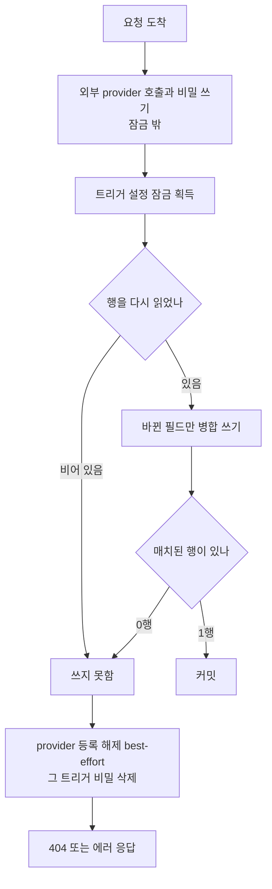

> 구현 상태: 부분 구현 · 원문: `spec/2-navigation/2-trigger-list.md`, `spec/2-navigation/_product-overview.md` (§3.2 Trigger List) · 용어: [용어 사전](../CLE-GLOSSARY.md)

## 개요

트리거(Trigger, `trigger`)는 워크플로우를 시작시키는 진입점이다. 트리거 유형(`Trigger.type`)은 웹훅(`webhook`)·스케줄(`schedule`)·수동(`manual`) 세 가지이고 만든 뒤에는 바꿀 수 없다. 채팅 채널과 웹채팅은 새 유형이 아니라 웹훅 트리거의 설정 변형이다.

이 문서는 트리거 화면(사이드바 "Trigger List", 경로 `/triggers`)의 목록·필터·상세 패널·생성 흐름과 트리거 API(`/api/triggers`) 계약을 정한다. 트리거를 지울 때의 권한·확인 절차·연쇄 삭제·자원 정리 정책도 이 문서가 정한다.

트리거 `config` 를 다시 쓰는 모든 경로가 따르는 동시 쓰기 직렬화 규칙도 여기에 둔다. 이 규칙을 쓰는 곳이 채팅 채널·EIA·스케줄에 흩어져 있다. 그래서 트리거 PATCH·DELETE 계약을 정하는 이 문서가 기준이 된다.

범위 밖 주제는 다음 문서가 정한다.

- 웹훅 수신 엔드포인트·인증 검증·입력 구조·남용 방어: [웹훅](CLE-TRIG-WEBHOOK.md)
- 스케줄 화면·Cron 표현식·스케줄 API: [스케줄](CLE-TRIG-SCHEDULE.md)
- 인증 설정 발급·필드 마스킹·평문 보기: [외부 호출 인증 설정](CLE-TRIG-AUTHCFG.md)
- 엔티티 컬럼, 트리거와 스케줄의 동기화 표, 삭제 때 자원 해제 순서의 데이터 흐름: [트리거 데이터와 흐름](CLE-TRIG-DATA.md)
- 채팅 채널 설정(`config.chatChannel`) 필드의 정책: [채팅 채널](../CLE-CHAT/CLE-CHAT-CORE.md)
- EIA 알림 웹훅(`notification`)·인터랙션(`interaction`) 설정: [External Interaction API](../CLE-IX/CLE-EIA.md)
- 역할별 권한 매트릭스: [워크스페이스와 멤버](../CLE-ACCT/CLE-ACCT-WS.md)

## 요구사항

- REQ-TRIG-001 WHEN 사용자가 트리거 화면을 열면 THE SYSTEM SHALL 워크스페이스의 트리거를 목록으로 표시한다. (원본: NAV-TR-01)
- REQ-TRIG-002 WHEN 목록 행을 그리면 THE SYSTEM SHALL 트리거 유형(웹훅·스케줄·수동)을 뱃지로 구분해 표시한다. (원본: NAV-TR-02)
- REQ-TRIG-003 WHEN 목록 행을 그리면 THE SYSTEM SHALL 연결된 워크플로우 이름을 표시하고 누르면 그 워크플로우 에디터로 이동한다. (원본: NAV-TR-03)
- REQ-TRIG-004 WHEN 사용자가 웹훅 트리거 행의 URL 복사 버튼을 누르면 THE SYSTEM SHALL 전체 웹훅 URL 을 클립보드에 복사한다. (원본: NAV-TR-04, WH-MG-03)
- REQ-TRIG-005 WHEN 편집자 이상이 행의 더보기(⋮) 메뉴에서 활성/비활성 토글을 고르면 THE SYSTEM SHALL `PATCH /api/triggers/:id` 에 현재 값을 뒤집은 `{ isActive }` 를 보내 상태를 바꾼다. (원본: NAV-TR-05)
- REQ-TRIG-006 WHEN 사용자가 더보기(⋮) 메뉴에서 호출 이력을 고르면 THE SYSTEM SHALL 최근 호출만 담은 별도 대화상자를 열고 각 항목을 실행 상세 화면 링크로 표시한다. (원본: NAV-TR-06)
- REQ-TRIG-007 WHEN 스케줄 유형 트리거 행을 그리면 THE SYSTEM SHALL `[Schedule]` 태그와 Cron 표현식과 다음 실행 시각을 표시한다. (원본: NAV-TR-07)
- REQ-TRIG-008 IF 트리거 화면이나 `POST /api/triggers` 로 스케줄 유형 트리거를 만들려 하면 THE SYSTEM SHALL 거부한다. (원본: NAV-TR-08)
- REQ-TRIG-009 WHEN 사용자가 더보기(⋮) 메뉴를 열면 THE SYSTEM SHALL 상세 보기·호출 이력 항목은 모든 역할에게 노출하고 활성/비활성 토글·삭제 항목은 편집자 이상에게만 노출한다. (원본: NAV-TR-09)
- REQ-TRIG-010 WHEN 스케줄 유형 트리거의 더보기(⋮) 메뉴를 열면 THE SYSTEM SHALL "스케줄 관리에서 편집" 항목을 더해 `/schedules?triggerId=…` 로 이동하게 한다.
- REQ-TRIG-011 WHEN 편집자 이상이 상세 패널 카드의 편집 토글을 켜면 THE SYSTEM SHALL 이름·엔드포인트 경로·인증 설정 연결을 화면에서 수정하게 한다. (원본: NAV-TR-10)
- REQ-TRIG-012 WHILE 스케줄 유형 트리거의 상세 패널을 보는 동안 THE SYSTEM SHALL Cron 표현식과 시간대를 읽기 전용으로 두고 "스케줄 관리에서 편집" 링크만 표시한다. (원본: NAV-TR-10)
- REQ-TRIG-013 WHEN 목록 행을 그리면 THE SYSTEM SHALL 연결된 인증 설정의 유형 뱃지(HMAC·Bearer·API Key·Basic Auth)를 표시한다. (원본: NAV-TR-11)
- REQ-TRIG-014 IF 웹훅 트리거에 인증 설정이 연결되지 않았으면 THE SYSTEM SHALL 경고 아이콘(⚠)과 "인증 없음" 을 표시하되 호출을 막지는 않는다. (원본: NAV-TR-11)
- REQ-TRIG-015 WHEN 스케줄·수동 트리거의 인증 칸을 그리면 THE SYSTEM SHALL 경고 없이 `-` 를 표시한다.
- REQ-TRIG-016 WHEN 사용자가 필터를 고르면 THE SYSTEM SHALL 유형(전체·웹훅·스케줄·수동)과 상태(전체·활성·비활성)로 목록을 좁힌다.
- REQ-TRIG-017 WHEN 트리거 화면이 `?triggerId=` 딥링크로 열리면 THE SYSTEM SHALL 그 트리거의 상세 패널을 자동으로 열고 URL 파라미터는 마운트 때 한 번만 소비한다.
- REQ-TRIG-018 WHILE 상세 패널이 열려 있는 동안 THE SYSTEM SHALL 호출 이력을 패널에 싣지 않는다.
- REQ-TRIG-019 IF 사용자 역할이 편집자 미만이면 THE SYSTEM SHALL 상세 패널의 편집 토글을 노출하지 않는다.
- REQ-TRIG-020 WHEN 인증 설정 셀렉터를 그리면 THE SYSTEM SHALL "+ 새 인증 설정 만들기" 항목을 관리자 이상에게만 노출한다.
- REQ-TRIG-021 WHEN 편집자 이상이 "Add Webhook" 버튼을 누르면 THE SYSTEM SHALL 모달에서 이름·워크플로우·인증 설정·채팅 채널 입력을 받아 `POST /api/triggers` 로 웹훅 트리거를 만든다.
- REQ-TRIG-022 WHEN 클라이언트가 웹훅 트리거를 만들면 THE SYSTEM SHALL 엔드포인트 경로를 `crypto.randomUUID()` 로 만들어 보낸다.
- REQ-TRIG-023 WHEN 생성 모달이 Slack·Discord 채팅 채널의 `inboundSigningPlaintext` 를 보내기 전이면 THE SYSTEM SHALL `@workflow/chat-channel-validation` 패키지의 정규식으로 hex 형식을 검사한다.
- REQ-TRIG-024 WHEN `GET /api/triggers` 가 `interactionEnabled` 를 받으면 THE SYSTEM SHALL `config.interaction.enabled` 값이 일치하는 트리거만 반환한다.
- REQ-TRIG-025 WHEN `GET /api/triggers` 가 `sort`·`order` 를 받으면 THE SYSTEM SHALL 그 기준으로 정렬한다. (미구현)
- REQ-TRIG-026 WHEN `PATCH /api/triggers/:id` 가 `isActive` 를 받으면 THE SYSTEM SHALL 그 값으로 활성 상태를 바꾸고 별도 `/toggle` 경로는 두지 않는다.
- REQ-TRIG-027 IF `authConfigId` 가 호출자 워크스페이스의 인증 설정이 아니면 THE SYSTEM SHALL 400 `AUTH_CONFIG_NOT_FOUND`(`details.field='authConfigId'`)로 거부한다.
- REQ-TRIG-028 WHEN PATCH 본문에 `notification`·`interaction`·`chatChannel` 이 오면 THE SYSTEM SHALL 각 객체를 `config` 안의 같은 이름 키에 통째로 교체해 넣는다.
- REQ-TRIG-029 IF PATCH 본문이 채팅 채널의 봇 토큰이나 inbound signing 값을 바꾸려 하면 THE SYSTEM SHALL 400 `VALIDATION_ERROR` 로 거부한다.
- REQ-TRIG-030 IF 채팅 채널이 없는 트리거에 PATCH 로 `chatChannel` 을 붙이려 하면 THE SYSTEM SHALL 400 `VALIDATION_ERROR`(`details.field='chatChannel'`)로 거부한다.
- REQ-TRIG-031 IF PATCH 가 채팅 채널 `provider` 를 바꾸려 하면 THE SYSTEM SHALL 400 `VALIDATION_ERROR`(`details.field='provider'`)로 거부한다.
- REQ-TRIG-032 IF 스케줄 유형 트리거 PATCH 에 `name`·`isActive` 밖의 키가 오면 THE SYSTEM SHALL 400 `VALIDATION_ERROR`(`details.field='type'`)로 거부한다.
- REQ-TRIG-033 IF 엔드포인트 경로가 다른 트리거와 겹치거나 다른 워크스페이스가 예약한 경로면 THE SYSTEM SHALL 두 경우를 구분하지 않고 409 `RESOURCE_CONFLICT`(`details.code=TRIGGER_ENDPOINT_PATH_CONFLICT`)로 거부한다.
- REQ-TRIG-034 WHEN 트리거를 응답하면 THE SYSTEM SHALL 웹훅 인증 자격 증명과 채팅 채널 내부 ref 를 싣지 않고 봇 토큰은 `hasBotToken` 으로만 알린다.
- REQ-TRIG-035 WHEN 어떤 경로가 트리거 `config` 를 다시 쓰면 THE SYSTEM SHALL 트리거 단위 advisory lock 을 잡은 뒤 행을 다시 읽고 그 위에 병합한다.
- REQ-TRIG-036 WHILE 트리거 설정 잠금을 잡고 있는 동안 THE SYSTEM SHALL 외부 provider 를 호출하지 않는다.
- REQ-TRIG-037 IF 잠금 안에서 다시 읽은 트리거가 없거나 병합 쓰기가 0행에 매치되면 THE SYSTEM SHALL 쓰지 못한 것으로 처리하고 `rotate-bot-token`·`interaction/revoke-token` 은 404 로 응답한다.
- REQ-TRIG-038 IF 잠금 밖에서 비밀을 쓰거나 provider 에 등록한 요청이 트리거 행을 쓰지 못하면 THE SYSTEM SHALL provider 등록을 best-effort 로 해제한 뒤 그 트리거의 비밀(`secret://triggers/<id>/`)을 지운다.
- REQ-TRIG-039 WHEN PATCH 가 트리거를 저장하면 THE SYSTEM SHALL 그 요청이 바꾸는 필드만 저장한다.
- REQ-TRIG-040 WHEN 트리거 목록·상세·수정 응답을 보내면 THE SYSTEM SHALL `workflow` 참조(`id`, `name`)를 채운다.
- REQ-TRIG-041 WHEN `POST /api/triggers/:id/interaction/revoke-token` 이 호출되면 THE SYSTEM SHALL 기존 트리거 단위 토큰(`itk_*`)을 곧바로 무효로 하고 새 토큰을 평문으로 한 번 응답한다.
- REQ-TRIG-042 IF 뷰어가 트리거를 지우려 하면 THE SYSTEM SHALL 삭제 항목을 노출하지 않고 API 도 거부한다.
- REQ-TRIG-043 WHEN 사용자가 삭제를 고르면 THE SYSTEM SHALL 트리거 유형별 안내 문구가 담긴 확인 대화상자를 띄우고 트리거 이름을 정확히 입력해야 삭제 버튼을 활성화한다.
- REQ-TRIG-044 WHEN 트리거를 지우면 THE SYSTEM SHALL 연결된 스케줄을 함께 지우고 실행의 `trigger_id` 는 NULL 로 바꿔 실행 기록을 보존한다.
- REQ-TRIG-045 WHEN 트리거 행을 없애는 경로가 실행되면 THE SYSTEM SHALL 경로와 상관없이 그 트리거의 외부 자원과 비밀을 정리한다.
- REQ-TRIG-046 IF 스케줄 BullMQ 작업 해제가 실패하면 THE SYSTEM SHALL 삭제를 멈춘다.
- REQ-TRIG-047 IF 채팅 채널 provider 등록 해제가 실패하면 THE SYSTEM SHALL 삭제를 계속한다.
- REQ-TRIG-048 IF 삭제가 트리거 설정 잠금을 5초 안에 잡지 못하면 THE SYSTEM SHALL 기다리지 않고 에러로 끝내며 외부 등록만 해제된 상태를 서버 로그에 남긴다.
- REQ-TRIG-049 WHEN 삭제가 성공하면 THE SYSTEM SHALL 본문 없이 `204 No Content` 로 응답한다.
- REQ-TRIG-050 IF 같은 트리거를 두 요청이 동시에 지우면 THE SYSTEM SHALL 두 번째 요청에 `404 RESOURCE_NOT_FOUND` 로 응답한다.
- REQ-TRIG-051 WHEN 트리거를 지우거나 활성 상태를 바꾸면 THE SYSTEM SHALL 감사 로그에 각각 `trigger.deleted`·`trigger.updated` 를 남긴다.
- REQ-TRIG-052 WHILE v1 인 동안 THE SYSTEM SHALL 트리거의 `type`·`workflowId`·`httpMethod`(POST)·`contentType`(`application/json`)을 바꾸지 못하게 한다.
- REQ-TRIG-053 IF 생성(`POST /api/triggers`)이나 수정(`PATCH /api/triggers/:id`) 본문의 `config` 키 아래에 `chatChannel` 의 차단 필드나 `notification.signing.secretRef` 가 있으면 THE SYSTEM SHALL 값과 상관없이 400 `VALIDATION_ERROR`(`details: { field: 'config.<경로>', code: 'INVALID_FIELD' }`)로 거부한다.

## 화면 구조

트리거 화면은 헤더, 검색·필터 줄, 트리거 목록으로 이루어진다. 행을 누르면 오른쪽에서 상세 패널이 열린다.

| 영역 | 위치 | 들어가는 요소 | 동작 |
|------|------|---------------|------|
| 헤더 | 맨 위 | 제목 "Triggers", "Add Webhook" 버튼 | 버튼은 편집자 이상에게만 보인다(`RoleGate minRole="editor"`). 누르면 [트리거 생성](#트리거-생성) 모달이 열린다 |
| 검색·필터 줄 | 헤더 아래 | 검색 입력, 유형 필터(`Type: All ▼`), 상태 필터 | [필터](#필터) |
| 트리거 목록 | 본문 | 트리거마다 두 줄짜리 행 | 행을 누르면 [상세 패널](#상세-패널)이 열린다 |
| 상세 패널 | 오른쪽 슬라이드 | 카드별 상세 정보와 편집 토글 | 카드별로 읽기 모드와 편집 모드를 오간다 |

목록 행 예시는 다음과 같다.

| 상태 | 이름 | 유형 | 둘째 줄 |
|------|------|------|---------|
| ● 활성 | order-webhook | Webhook | → Order Processing · `POST /api/hooks/3f2b…-4c1d` · 📋 · ⋮ |
| ● 활성 | daily-report `[Schedule]` | Schedule | → Daily Report Gen · `0 9 * * *` · Next: 09:00 · ⋮ |
| ○ 비활성 | manual-test | Manual | → Test Workflow · ⋮ |

### 목록 항목

| 요소 | 설명 |
|------|------|
| 상태 아이콘 | 활성(●) / 비활성(○) |
| 트리거 이름 | 사용자가 정한 이름 |
| 유형 뱃지 | Webhook / Schedule / Manual |
| 인증 | 연결된 인증 설정의 유형 뱃지(HMAC / Bearer / API Key / Basic Auth). 목록 응답의 `authConfigId` 와 미리 불러온 워크스페이스 인증 설정 목록(`GET /api/auth-configs`)의 `id → type` 매핑으로 그린다. `authConfigId == null` 인 웹훅 트리거는 외부에 열린 HTTP 진입점인데 인증이 없으므로 경고 아이콘(⚠)과 "인증 없음" 을 표시한다. 스케줄·수동 트리거는 inbound HTTP 인증이 해당하지 않아 `-` 로 표시하고 경고하지 않는다. 이 칸은 상세 패널 "인증 설정" 카드와 같은 자원을 요약해 보여 준다 |
| 연결된 워크플로우 | "→ 워크플로우 이름". 누르면 그 워크플로우 에디터로 이동한다. 목록 응답의 `workflow.name` 을 쓴다 |
| 상세 정보 | 웹훅: HTTP 메서드와 경로. 스케줄: Cron 표현식 |
| 스케줄 태그 | 스케줄 유형 트리거에 `[Schedule]` 태그, Cron 표현식, 다음 실행 시각 |
| 채팅 채널 칩과 상태 배지 | `config.chatChannel` 이 설정된 웹훅 트리거 행에만 표시한다. provider 칩(`Telegram` 등, provider 별 브랜드 색)과 `chatChannelHealth` 배지(healthy / degraded / unknown)를 `notificationHealth` 배지와 같은 영역·같은 형식으로 나란히 둔다. `degraded` 여도 트리거를 자동으로 비활성화하지 않는다(CCH-SE-01) |
| URL 복사 버튼(📋) | 웹훅 트리거에만 표시한다. 전체 URL 을 클립보드에 복사한다 |
| 더보기(⋮) | 네 항목의 드롭다운. ① 상세 보기: 상세 패널을 연다(모든 역할). ② 활성/비활성 토글(편집자 이상). ③ 호출 이력: 최근 호출만 담은 별도 대화상자를 연다(모든 역할). ④ 삭제(편집자 이상, [삭제 정책](#삭제-정책)). 스케줄 유형은 "스케줄 관리에서 편집" 항목을 더 보여 `/schedules?triggerId=…` 로 보낸다. 트리거 "수정" 은 따로 항목이 없고 상세 패널 안 카드별 편집 토글로 한다 |

호출 이력 대화상자의 각 항목은 시작 시각·상태를 보여 주고 항목 전체가 `/workflows/:workflowId/executions/:executionId` 실행 상세로 가는 링크다. 대화상자는 메타·인증·EIA·스케줄 카드를 보여 주지 않는다. 대화상자 안의 "전체 상세 보기" 버튼으로 상세 패널로 옮겨 갈 수 있다.

### 필터

| 필터 | 옵션 |
|------|------|
| 유형 | 전체 / Webhook / Schedule / Manual |
| 상태 | 전체 / Active / Inactive |

### 상세 패널

상세 패널은 오른쪽에서 밀려 나오는 슬라이드 패널이다. 목록 행 클릭과 더보기(⋮) "상세 보기" 로 연다. `?triggerId=` 딥링크로 들어와도(예: [스케줄](CLE-TRIG-SCHEDULE.md) 목록의 "트리거에서 보기") 그 트리거의 상세 패널이 도착하자마자 열린다. URL 파라미터는 마운트 때 한 번만 소비한다. 그다음부터 사용자가 여닫는 동작은 URL 과 상관없다.

| 카드 | 내용 |
|------|------|
| 기본 정보 | 이름, 유형, 상태, 연결된 워크플로우 |
| 웹훅 설정 | 전체 URL, HTTP 메서드, 인증 방식, Content-Type |
| 스케줄 설정 | Cron 표현식(읽기 전용), 시간대, 다음 실행 예정 시각. "스케줄 관리에서 편집" 링크로 스케줄 화면에 간다 |
| 채팅 채널 | `config.chatChannel` 이 설정된 트리거에만 보인다. provider, 봇 username(`botIdentity.username`), 봇 토큰 등록 여부(`hasBotToken`)와 재발급 액션, `uiMapping`(formMode / visualNode / buttonLayout), `rateLimitPerMinute`, `languageHints`, 상태(`chatChannelHealth`·`chatChannelLastError`·`chatChannelSetupAt`·`chatChannelRotatedAt`). 웹훅 설정 카드와 나란한 별도 카드다 |
| 인증 설정 | 연결된 인증 설정 정보 |
| External Interaction | EIA 알림 웹훅과 인터랙션 설정 |

호출 이력은 상세 패널에 싣지 않는다. 더보기(⋮) "호출 이력" 대화상자가 같은 데이터를 더 가벼운 모달로 보여 준다.

### 필드 권한 매트릭스

상세 패널은 카드별 "편집" 토글로 읽기 모드와 편집 모드를 오간다. 편집 토글은 편집자 이상에게만 보인다. 뷰어에게는 모든 카드가 읽기 모드로 보인다. 관리자와 소유자도 동작은 같고 감사 로그의 행위자만 다르다.

| 카드 | 필드 | 모드 | 규칙 |
|------|------|------|------|
| 기본 정보 | `name` | 편집 | `PATCH /api/triggers/:id { name }`. 길이 상한과 워크스페이스 안 유일성은 정의가 갈린다([미결 사항](#미결-사항)) |
| 기본 정보 | `type` | 읽기 전용 | 만든 뒤 바꿀 수 없다. 바꾸려면 지우고 다시 만든다 |
| 기본 정보 | `isActive` | 읽기 전용(배지) | 패널 안에는 토글이 없다. 전환은 목록 ⋮ 메뉴 "활성/비활성 토글" 로만 한다. API 경로는 `PATCH /api/triggers/:id { isActive }` 하나다 |
| 기본 정보 | `workflowId` | 읽기 전용(v1) | [Rationale](#rationale) "워크플로우 연결을 v1 에서 잠근 이유" |
| 웹훅 설정 | `endpointPath` | 편집 | `PATCH /api/triggers/:id { endpointPath }`. 서버는 v4 UUID 형식만 받는다(`@IsUUID('4')`, [웹훅](CLE-TRIG-WEBHOOK.md) WH-MG-02). 바꾸면 옛 URL 은 곧바로 404 가 되므로 대화상자로 경고한 뒤 진행한다. 다른 트리거와 겹치거나(전역 유일) 다른 워크스페이스가 예약한 경로면 409 `RESOURCE_CONFLICT`(`details.code=TRIGGER_ENDPOINT_PATH_CONFLICT`). 예약 규칙은 [트리거 데이터와 흐름](CLE-TRIG-DATA.md) |
| 웹훅 설정 | `httpMethod` | 읽기 전용 | v1 은 POST 고정 |
| 웹훅 설정 | `contentType` | 읽기 전용 | v1 은 `application/json` 고정 |
| 웹훅 설정 | 전체 URL | 읽기 전용(자동 계산) | 엔드포인트 경로를 바꾸면 따라 바뀐다. 직접 입력할 수 없다 |
| 스케줄 설정 | `cronExpression` | 읽기 전용 | 편집은 [스케줄](CLE-TRIG-SCHEDULE.md) 화면에서만 한다. 이 카드는 "스케줄 관리에서 편집" 링크만 보여 준다 |
| 스케줄 설정 | `timezone` | 읽기 전용 | 위와 같다 |
| 스케줄 설정 | `nextRunAt` | 읽기 전용(시스템 계산) | 스케줄 생성·수정 때와 실행이 끝난 직후 다시 계산한다. Cron 파싱이 실패하면 비어 있을 수 있다(`-` 표시). 발사와 상관없는 정보성 값이다 |
| External Interaction (알림) | `url` / `events` / `signing` / `retry` | 편집 | 필드 정의는 [External Interaction API](../CLE-IX/CLE-EIA.md) |
| External Interaction (알림) | `notificationHealth` / `notificationLastError` | 읽기 전용(시스템 계산) | `notificationHealth` 는 트리거 상세에 배지로 보인다([웹훅](CLE-TRIG-WEBHOOK.md) 의 상세 화면 요구사항). `notificationLastError` 는 API 응답에만 실리고 화면에 그리지 않는다. 자격 증명 모양은 가려 내보낸다([응답 자격 증명 마스킹](../CLE-API/CLE-API-EGRESS.md#310-트리거-응답의-마지막-오류-2026-10-05)) |
| External Interaction (인터랙션) | `enabled` / `tokenStrategy` | 편집 | 위와 같다 |
| 인증 설정 | `authConfigId` | 편집 | 인증 메뉴(`/authentication`)에서 만든 인증 설정을 셀렉터로 트리거에 연결한다. `PATCH /api/triggers/:id { authConfigId }`. `null` 은 인증 없음이다. 비밀 값의 편집·평문 보기·재생성은 인증 메뉴에서만 한다([외부 호출 인증 설정](CLE-TRIG-AUTHCFG.md)). 셀렉터는 워크스페이스 인증 설정 목록, "인증 없음", "+ 새 인증 설정 만들기"(→ `/authentication`)로 이루어진다. "+ 새 인증 설정 만들기" 는 관리자 이상에게만 보인다. 연결 자체는 편집자 이상이 할 수 있다 |
| 채팅 채널 | `provider` | 읽기 전용 | v1 은 `telegram` / `slack` / `discord`([채팅 채널](../CLE-CHAT/CLE-CHAT-CORE.md) provider 목록). 바꾸려면 트리거를 지우고 다시 만든다. PATCH 로 바꾸면 400 |
| 채팅 채널 | `inboundSigning` | 생성 때만 입력 | Slack·Discord 만 쓴다. 사용자가 외부 포털(Slack 앱 Basic Information, Discord Developer Portal General Information)에서 받은 값을 입력한다. 응답에서는 빼고 내부 `inboundSigningRef` 만 보관한다. Telegram 은 서버가 발급하므로 이 필드를 쓰지 않는다. 회전은 v1 에 정의되지 않았다. PATCH 로 바꾸면 400 `VALIDATION_ERROR` |
| 채팅 채널 | `botToken` | 입력 전용과 재발급 액션 | 응답에는 `hasBotToken: boolean` 만 싣는다. 마스킹 값도 끝 네 글자도 싣지 않는다. 인증 설정의 필드 마스킹(`***<last4>`)은 평문 보기로 읽을 수 있는 자격 증명용이라 입력 전용 필드에는 쓰지 않는다([시크릿 저장소](../CLE-INT/CLE-INT-SECRET.md)). 입력창 placeholder(`123456789:ABCdef...`)는 형식 예시다. 서버는 형식을 검사하지 않는다. 잘못된 토큰은 `setupChannel` 이 실패할 때 400 `BOT_TOKEN_INVALID` 로 드러난다. Telegram BotFather 형식 정규식은 입력 안내이고 Telegram 전용이다. 이 정규식은 사용자 가이드와 화면 문구에만 있고 코드에는 없다. 바꿀 때는 `POST /api/triggers/:id/chat-channel/rotate-bot-token`(24h grace)만 쓴다. PATCH 로 `botTokenRef` 를 바꾸면 400 `VALIDATION_ERROR` |
| 채팅 채널 | `botIdentity.username` | 읽기 전용 | `setupChannel()` 이 `getMe` 로 받아 캐시한 값이다. 트리거를 다시 활성화할 때 갱신되는지는 정의가 갈린다([채팅 채널](../CLE-CHAT/CLE-CHAT-CORE.md#미결-사항) 의 미결 사항) |
| 채팅 채널 | `uiMapping.formMode` | 편집 | `multi_step` / `native_modal` / `auto`, 기본 `auto`. `auto` 는 provider 가 지원하고 모든 필드를 modal 로 받을 수 있으며 필드가 5개 이하면 native modal, 아니면 다단계다. `native_modal` 은 modal 을 우선하고 조건이 맞지 않으면 다단계로 돌아간다. `multi_step` 은 다단계를 강제한다. 상세는 [채팅 채널 어댑터 규약](../CLE-CHAT/CLE-CHAT-ADAPTER.md) |
| 채팅 채널 | `uiMapping.visualNode` | 편집 | `text` / `photo` / `auto`, 기본 `auto`. Carousel·Chart·Table 의 시각 렌더 방식이다 |
| 채팅 채널 | `uiMapping.buttonLayout` | 편집 | `auto` / `vertical` / `horizontal`, 기본 `auto` |
| 채팅 채널 | `rateLimitPerMinute` | 편집 | 정수 override, 기본 60(CCH-NF-03). Telegram 그룹 한도에 맞춘다 |
| 채팅 채널 | `languageHints` | 편집 | `Record<string, string>`. `groupChatRefusal`·`executionStarted`·`executionCompleted`·`executionStillRunning`·`help` 같은 봇 안내 문구 |
| 채팅 채널 | `languageLocale` | 편집 | `ko` / `en`, 기본 `ko`. `languageHints` 에 없는 키의 기본 문구 언어다. 문구를 찾는 순서와 기본 문구는 [채팅 채널 데이터와 흐름](../CLE-CHAT/CLE-CHAT-DATA.md) 이 정한다 |
| 채팅 채널 | `chatChannelHealth` / `chatChannelLastError` / `chatChannelSetupAt` / `chatChannelRotatedAt` | 읽기 전용(시스템 계산) | 응답은 camelCase, DB 컬럼은 snake_case(`chat_channel_health` 등). `degraded` 여도 트리거를 자동으로 비활성화하지 않는다(CCH-SE-01, WH-MG-09). `chatChannelLastError` 는 자격 증명 모양을 가려 내보낸다([응답 자격 증명 마스킹](../CLE-API/CLE-API-EGRESS.md#310-트리거-응답의-마지막-오류-2026-10-05)) |

내부 ref(`botTokenRef`, `inboundSigningRef`)는 사용자에게 보이지 않는다. 응답에는 `hasBotToken: boolean` 만 들어가고 화면도 "등록됨 / 등록 안 됨" 만 표시한다. 이것은 CCH-SE-03 을 화면에 적용한 것이다. `config.chatChannel` 필드 정의 전체는 [채팅 채널 데이터와 흐름](../CLE-CHAT/CLE-CHAT-DATA.md) 이 정한다.

### 트리거 생성

헤더의 "Add Webhook" 버튼이 모달을 열어 웹훅 유형 트리거를 만든다. 제출하면 `POST /api/triggers` 를 부른다.

| 필드 | 입력 | 규칙 |
|------|------|------|
| 이름(`name`) | 필수 텍스트 | |
| 연결 워크플로우(`workflowId`) | 필수 셀렉트 | 워크스페이스 워크플로우 목록 |
| 인증(`authConfigId`) | 선택(인증 설정 셀렉터) | `null` 은 인증 없음이며 목록에서 경고 대상이다. 인라인 인증 입력 필드는 없다 |
| 채팅 채널(토글) | 선택 | 켜면 `provider`(telegram / slack / discord), `botToken`(입력 전용), Slack·Discord 는 `inboundSigningPlaintext` 를 받는다. 요청 본문의 top-level `chatChannel` 필드로 보내며 서버가 `setupChannel()` 을 자동으로 부른다. `uiMapping` 은 `{ formMode: "auto", visualNode: "auto", buttonLayout: "auto" }` 로 만든다 |

- 엔드포인트 경로(`endpointPath`)는 클라이언트가 `crypto.randomUUID()` 로 만들어 보낸다. 인증 없는 웹훅에서는 이 UUID 가 사실상 호출 권한을 주는 비밀 역할을 한다([웹훅](CLE-TRIG-WEBHOOK.md)). 다만 웹채팅(공개 설치 스크립트) 트리거는 설치 스크립트에 경로가 들어가 공개된다. 이 예외 관계를 어디에 둘지는 [웹채팅 세션](../CLE-WEBCHAT/CLE-WEBCHAT-SESSION.md#미결-사항) 의 미결 사항이다.
- 웹채팅 인스턴스는 별도 자원이 아니라 인터랙션이 켜진 웹훅 트리거를 [웹채팅 운영 콘솔](../CLE-WEBCHAT/CLE-WEBCHAT-CONSOLE.md) 에서 보여 주는 다른 표현이다.
- `httpMethod`·`contentType` 은 v1 고정값(POST / `application/json`)이라 모달에 입력 칸이 없다.
- Slack·Discord 의 `inboundSigningPlaintext` 는 보내기 전에 클라이언트에서 hex 형식을 검사한다. 정규식의 단일 기준은 `@workflow/chat-channel-validation` 패키지이고 백엔드 `assertInboundSigningPlaintextByProvider` 도 같은 export 를 쓴다.
- 스케줄 유형은 이 모달에서도 `POST /api/triggers` 에서도 만들 수 없다. 스케줄 화면에서 스케줄을 만들면 트리거가 자동으로 생긴다([스케줄](CLE-TRIG-SCHEDULE.md)).
- 워크플로우 에디터에서도 같은 `POST /api/triggers` 로 트리거를 만들 수 있다. 트리거 화면은 웹훅 트리거 생성과 모든 트리거의 조회·수정·삭제를 맡는다.
- 요청 본문의 `config` 키 아래에는 시크릿 참조 · 평문 필드를 실을 수 없다. 규칙은 [PATCH 본문 계약](#patch-본문-계약) 과 같다.

### 웹훅 URL

웹훅 URL 은 `{base_url}/api/hooks/{endpoint_path}` 형식이다. `base_url` 은 SaaS 면 서비스 도메인이고 셀프 호스팅이면 설정한 도메인이다. 웹훅은 백엔드가 받으므로 `base_url` 은 백엔드 origin 이다. 프런트엔드가 표시·복사용 base 를 고르는 순서(`NEXT_PUBLIC_WEBHOOK_BASE_URL` → `NEXT_PUBLIC_API_URL` 에서 끝의 `/api` 제거 → `window.location.origin`)와 정본 형식은 [웹훅](CLE-TRIG-WEBHOOK.md) WH-EP-02 가 정한다. 구현은 `codebase/frontend/src/lib/utils/webhook-url.ts` 다.

## API

권한은 [워크스페이스와 멤버](../CLE-ACCT/CLE-ACCT-WS.md) 의 트리거 행을 따른다. 목록 응답 형식은 [HTTP API 규약](../CLE-API/CLE-API-CONV.md) 의 목록 응답 규칙을 따른다.

| 메서드 | 경로 | 설명 |
|--------|------|------|
| POST | `/api/triggers` | 트리거 생성(편집자 이상). `webhook`·`manual` 유형만 받는다. `schedule` 은 스케줄 API 가 자동으로 만들므로 받지 않는다. 트리거 화면 "Add Webhook" 모달이 이 경로로 웹훅 트리거를 만든다. 본문 `workflowId` 가 같은 워크스페이스의 워크플로우가 아니면 400 `VALIDATION_ERROR`(`details[].field='workflowId'`)다([데이터 모델 개요 §참조의 소속](../CLE-PLAT/CLE-PLAT-DATA.md#참조의-소속)) |
| GET | `/api/triggers` | 목록. 쿼리: `type`, `status`, `search`, `page`, `limit`, `sort`, `order`, `interactionEnabled`. `interactionEnabled`(boolean, 선택)는 `config.interaction.enabled` 가 일치하는 트리거만 돌려주는 JSONB 필터로, [웹채팅 운영 콘솔](../CLE-WEBCHAT/CLE-WEBCHAT-CONSOLE.md) 목록이 쓴다. `sort`·`order` 는 `PaginationQueryDto` 로 받지만 `findAll` 이 무시하고 `created_at DESC` 로 고정 정렬한다(반영은 미구현) |
| GET | `/api/triggers/:id` | 상세 |
| PATCH | `/api/triggers/:id` | 수정. 활성/비활성 토글도 이 경로로 한다(`{ isActive: boolean }`). 별도 `/toggle` 경로는 없다 |
| GET | `/api/triggers/:id/history` | 호출 이력 |
| DELETE | `/api/triggers/:id` | 삭제. 권한·연쇄 삭제·확인 절차는 [삭제 정책](#삭제-정책) |
| POST | `/api/triggers/:id/chat-channel/rotate-bot-token` | 채팅 채널 봇 토큰 재발급(24h grace). 이 경로가 봇 토큰을 바꾸는 유일한 경로다. 응답 계약은 [채팅 채널](../CLE-CHAT/CLE-CHAT-CORE.md). 감사: `trigger.chat_channel_bot_token_rotated` |
| POST | `/api/triggers/:id/notification/rotate-secret` | EIA 알림 웹훅 HMAC 시크릿 교체. 응답 `{ secret, rotatedAt }`. 기준은 [EIA 데이터와 흐름](../CLE-IX/CLE-EIA-DATA.md). 감사: `trigger.notification_secret_rotated` |
| POST | `/api/triggers/:id/interaction/revoke-token` | 트리거 단위 토큰(`itk_*`) 재발급. 기존 토큰을 곧바로 무효로 하고 새 토큰을 평문으로 한 번 응답한다. 엔드포인트 이름과 달리 폐기만 하지 않는다. 기준은 [EIA 데이터와 흐름](../CLE-IX/CLE-EIA-DATA.md). 감사: `trigger.interaction_token_revoked` |

감사 action 의 정의는 [감사 로그](../CLE-OBS/CLE-OBS-AUDIT.md) 가 정한다.

웹훅 인증 자격 증명의 회전은 트리거가 아니라 인증 설정이 맡는다. `POST /api/auth-configs/:id/regenerate`([외부 호출 인증 설정](CLE-TRIG-AUTHCFG.md))로 한곳에서 한다.

### PATCH 본문 계약

`PATCH /api/triggers/:id` 본문은 다음 부분 갱신 키를 모두 선택으로 top-level 에서 받는다.

| 키 | 규칙 |
|----|------|
| `name` | 트리거 이름 |
| `isActive` | 활성 상태 |
| `endpointPath` | 엔드포인트 경로. v4 UUID |
| `authConfigId` | 인증 설정 연결. `null` 을 받는다. 소속 검증은 백엔드 `triggers.service` 가 `authConfigsService.findById(id, workspaceId)` 로 한다. 호출자 워크스페이스의 인증 설정이 아니면(없거나 다른 워크스페이스 소속이면 둘을 구분하지 않음) 400 `AUTH_CONFIG_NOT_FOUND`, `details: { field: 'authConfigId', code: 'INVALID_FIELD' }`. 코드 카탈로그는 [에러 코드 규약과 카탈로그](../CLE-API/CLE-API-ERRCODES.md) |
| `config` | 그 밖의 JSONB 키 부분 갱신. 시크릿 참조 · 평문 필드는 받지 않는다(아래) |
| `notification` / `interaction` / `chatChannel` | EIA·채팅 채널 설정. `config.*` 아래가 아니라 별도 top-level 키로 받는다. 백엔드 `triggers.service`(`mergeExternalConfig`)가 `config` JSONB 안의 같은 이름 키로 합친다. 키를 보내면 그 객체를 통째로 교체한다. 부분 병합이 아니므로 전체 객체를 다시 보내야 한다. 기준은 `update-trigger.dto.ts` 와 `triggers.service.ts mergeExternalConfig` 다 |

- 인라인 인증 키(`config.authType` / `hmacHeader` / `hmacSecret` / `bearerToken`)는 없다. 웹훅 인증은 `authConfigId` 연결로만 받는다.
- 채팅 채널의 비밀은 PATCH 로 바꿀 수 없다. `chatChannel.botTokenRef`(ref), `chatChannel.botToken`(평문), `chatChannel.inboundSigning`, `inboundSigningPlaintext` 를 바꾸려 하면 400 `VALIDATION_ERROR` 다. 봇 토큰은 재발급 API(`POST /api/triggers/:id/chat-channel/rotate-bot-token`)로만 바꾼다. 거부 응답의 모양과 이 규칙의 기준은 [채팅 채널 §봇 토큰 변경 단일 경로](../CLE-CHAT/CLE-CHAT-CORE.md#봇-토큰-변경-단일-경로) 다. Slack signing secret·Discord public key 회전 API 는 v1 에 정의되지 않았다.
- `chatChannel` 이 실린 PATCH 는 사용자가 보낸 비밀을 받지도 쓰지도 않는다. `botToken` 과 Slack·Discord 의 `inboundSigningPlaintext` 는 요청 전후로 같다. `botTokenRef` 는 "통째로 교체" 규칙과 상관없이 사라지지 않는다(트리거 id 에서 다시 유도한다). Telegram 의 서버 발급 inbound signing 은 예외다. `setupChannel()` 을 다시 부를 때마다 새로 발급·저장되며 이것이 정상이다.
- 요청 본문의 `config` 키 아래(이 문서에서 «원시 `config`». top-level `chatChannel` · `notification` 과 다른 위치)에는 [채팅 채널 「봇 토큰 변경 단일 경로」](../CLE-CHAT/CLE-CHAT-CORE.md#봇-토큰-변경-단일-경로) 의 차단 필드와 `notification.signing.secretRef` 를 실을 수 없다. 있으면 값과 상관없이(자기 트리거의 시크릿 참조여도) 400 `VALIDATION_ERROR` 다. 응답은 원시 `config` 경로를 담은 단일 object 다(예: `details: { field: 'config.chatChannel.botTokenRef', code: 'INVALID_FIELD' }`). 생성도 같다. 스케줄 유형 트리거는 `config` 를 받지 않으므로 그 거부(`details.field='type'`)가 먼저 난다. `interaction.triggerToken` 같은 다른 서버 발급 값은 이 규칙이 막지 않는다([미결 사항](#미결-사항)). 원시 `config` 에는 `setupChannel()` 과 평문 제거가 돌지 않아 평문이 JSONB 에 남는다. 시크릿 참조는 다른 트리거의 비밀을 가리킬 수 있다. 시크릿 저장소의 `resolve` 는 참조만 보고 `rotate` 는 같은 워크스페이스 안의 다른 트리거 행을 가리지 못한다. 그래서 그대로 두면 봇 토큰 재발급이 그 트리거의 비밀을 덮어쓴다([시크릿 저장소](../CLE-INT/CLE-INT-SECRET.md) 규칙 23). 이미 저장된 행은 읽는 쪽이 참조를 트리거 id 로 다시 만들고([시크릿 저장소](../CLE-INT/CLE-INT-SECRET.md) 규칙 24) `rotate` 는 다른 워크스페이스의 행을 거부한다(같은 문서 규칙 25).
- 채팅 채널이 없는 트리거에 PATCH 로 채널을 나중에 붙이면 400(`details.field='chatChannel'`, `details.code='INVALID_FIELD'`)이다. 최초 설정은 생성 요청에서만 한다.
- 채팅 채널 `provider` 를 바꾸면 400(`details.field='provider'`, `details.code='INVALID_FIELD'`)이다. 허용하면 다른 provider 의 토큰을 새 어댑터에 넘기게 된다.
- 스케줄 유형 트리거 PATCH 는 `name`, `isActive` 만 받는다. `endpointPath` / `config` / `authConfigId` 등을 바꾸려 하면 400 `VALIDATION_ERROR`(`details.field='type'`, `details.code='INVALID_FIELD'`)다. 트리거와 스케줄의 동기화를 지키기 위해서다([트리거 데이터와 흐름](CLE-TRIG-DATA.md)).
- 엔드포인트 경로가 전역 UNIQUE 를 어기거나 다른 워크스페이스가 예약한 경로(지웠거나 바꾼 경로)면 409 `RESOURCE_CONFLICT`(`details.code=TRIGGER_ENDPOINT_PATH_CONFLICT`, `details.field='endpoint_path'`)다. 길이·이름 검증 실패는 400 `VALIDATION_ERROR` 다.
- 웹훅 인증 자격 증명(secret / token / password)은 트리거 응답에 나가지 않는다. 인증 설정 응답은 필드 마스킹(`***<last4>`)을 한다([외부 호출 인증 설정](CLE-TRIG-AUTHCFG.md)).

### 동시 쓰기 직렬화

트리거 `config` 는 트리거 단위 잠금 안에서 다시 읽고 쓴다. `config` JSONB 를 다시 쓰는 경로는 PATCH, 채팅 채널 setup, 봇 토큰 재발급, 알림 시크릿 정규화·승격, 트리거 단위 토큰 재발급이다. 이 경로들은 Postgres advisory lock `pg_advisory_xact_lock(hashtext('trigger-config:<triggerId>'))` 을 잡은 뒤 행을 다시 읽고 그 위에 병합한다. 요청 시작 시점의 스냅샷으로 통째로 되쓰면 그사이 커밋된 키가 되돌아간다. 되돌아가는 키가 `chatChannel.inboundSigningRef` 면 inbound 서명 검증이 fail-open 된다.

- 외부 provider 호출은 잠금 밖에서 한다. 잠금 안에서는 다시 읽기와 쓰기만 한다. Cafe24 토큰 갱신이 같은 잠금을 기각한 이유(잠금을 쥔 채 HTTP 요청을 하면 DB 커넥션 점유가 길어진다)가 이 설계의 제약이다([통합 관리](../CLE-INT/CLE-INT-MANAGE.md) 의 `cafe24-token-refresh` 큐 절).
- 잠금 대기 상한은 삭제에만 있다(5초, [결과와 에러](#결과와-에러)).
- `config` 를 건드리지 않는 컬럼 한정 갱신은 이 잠금을 잡지 않는다. 예: 웹훅 수신의 `lastTriggeredAt`, 스케줄 편집의 `name`·`isActive` 동기화.
- 잠금으로 막을 수 없는 삭제 경로가 있다. 워크플로우·워크스페이스 삭제의 FK CASCADE 다. 그래서 잠금 안에서도 행이 있는지 판정한다. 다시 읽은 결과가 비면 쓰지 않는다. 병합 쓰기가 0행에 매치되면 쓰지 못한 것으로 본다. `rotate-bot-token`·`interaction/revoke-token` 은 이때 404 로 응답한다.
- 쓰지 못했으면 잠금 밖에서 만든 것을 되돌린다. 잠금 밖에서 `secret_store` 에 비밀을 쓰거나 provider 에 등록한 뒤 위 판정으로 쓰지 못한 요청은, provider 등록을 해제(best-effort)한 뒤 그 트리거의 비밀(`secret://triggers/<id>/`)을 지운다. 삭제 쪽이 행을 지운 뒤에 비밀을 지우는 것과 짝을 이뤄, 삭제와 겹친 쓰기가 비밀을 고아로 남기지 않는다.

PATCH 는 그 요청이 바꾸는 필드만 저장한다. 엔티티를 통째로 저장하면 다시 읽은 뒤 잠금 밖에서 커밋된 컬럼(회전 중인 `notificationSecretV2`, 웹훅 수신의 `lastTriggeredAt` 등)이 다시 읽은 시점 값으로 되써진다. "컬럼 한정 갱신은 잠금을 잡지 않는다" 가 성립하려면 PATCH 가 그 컬럼을 싣지 않아야 한다.

PATCH 에서 트리거가 사라지는 경우는 두 창으로 갈린다.

- 잠금 안에서 다시 읽은 결과가 비면 404 다.
- 다시 읽은 뒤 저장 직전에 FK CASCADE 가 끼어들면 저장이 실패하고 롤백된다. 트리거는 되살아나지 않는다. 이 경우는 전용 에러 코드가 없어 일반 500 `INTERNAL_ERROR` 로 나간다.

두 동작(부분 저장의 보존, CASCADE 창의 롤백)은 실제 Postgres·TypeORM 에서 재현해 테스트로 고정했다. 워크플로우 삭제로 쟀고 워크스페이스 삭제는 FK 구조가 같아 같을 것으로 보지만 따로 재지 않았다.

### 응답 형태

`TriggerDto.workflow` 는 키 생략형이다([HTTP API 규약](../CLE-API/CLE-API-CONV.md) 의 부재 표현 기준 (b)). (b) 로 판정한 근거는 소비자가 부재를 정상 경로로 다룬다는 점이다. 상세 매핑은 `workflow?.name ?? workflowName ?? ""` 로 읽는다(`lib/api/triggers.ts`).

- 이 필드가 빠지는 응답은 생성 응답뿐이다. 목록·상세·수정 응답에는 채워진다(`update()` 는 `findById` 로 시작한다).
- PATCH 는 일반 경로와 `chatChannel` 이 실린 경로 모두 `workflow` 를 채운다. `chatChannel` 재조회는 `workflow` 관계를 함께 싣는다.
- e2e 가 네 반환 경로를 다섯 케이스(양성 4, 생성 음성 1)로 고정한다. PATCH 는 일반과 `chatChannel` 두 케이스다. 스케줄 쪽 자매 참조도 같은 방식으로 고정한다([스케줄](CLE-TRIG-SCHEDULE.md)).
- 이 캐너리가 고정하는 것은 계약이 아니라 현재 구현이다. 규약은 이 필드를 키 생략형으로 선언하라고만 요구하고 어느 경로에서 빠지는지는 정하지 않는다. 생성 응답도 `workflow` 를 싣도록 바꾸는 것은 계약 위반이 아니라 추가 개선이다. 다만 지금은 캐너리의 음성 케이스가 그 변경을 RED 로 막는다. 이것은 의도한 프로세스 게이트다(이 절을 함께 고치지 않고는 동작을 바꿀 수 없다).
- 이 참조는 `id` 와 `name` 을 담는다. 스케줄 응답의 자매 참조는 `name` 하나만 담는다. 이 차이는 의도한 것이다(스케줄 화면은 이름만 표시한다). 한쪽을 다른 쪽으로 바꾸지 않는다.

## 삭제 정책

### 권한

| 역할 | 트리거 삭제 |
|------|------------|
| 뷰어 | 불가. ⋮ 메뉴에 삭제 항목이 없다 |
| 편집자 | 가능(자기 워크스페이스 안) |
| 관리자 / 소유자 | 가능 |

API 는 [워크스페이스와 멤버](../CLE-ACCT/CLE-ACCT-WS.md) 권한 매트릭스의 트리거 CRUD 권한으로 막는다. 삭제는 감사 로그에 `trigger.deleted` 로 남는다([감사 로그](../CLE-OBS/CLE-OBS-AUDIT.md)).

### 확인 대화상자

삭제를 누르면 모달이 뜬다. 본문 문구는 트리거 유형에 따라 다르다(i18n 키 `triggers.delete.confirm.*`).

| `Trigger.type` | 본문 문구 |
|---------------|-----------|
| `webhook` | "이 트리거를 삭제하면 `{{url}}` 로 들어오는 모든 호출이 즉시 404 가 됩니다." |
| `schedule` | "이 트리거를 삭제하면 연결된 스케줄도 함께 삭제됩니다 (cron `{{cron}}`). 다음 실행 예정 시각: `{{nextRunAt}}`." |
| `manual` | "이 트리거에 연결된 워크플로 (`{{workflowName}}`) 는 보존되며, 트리거를 통한 외부 실행 진입점만 사라집니다." |

오삭제를 막기 위해 사용자가 트리거 이름을 정확히 입력해야 "삭제" 버튼이 켜진다. 이 패턴은 트리거 화면이 처음 도입했다. 공통 UI 규약([레이아웃과 내비게이션](../CLE-UI/CLE-UI-LAYOUT.md))으로 올리는 일은 후속 과제다.

### 연쇄 영향

이 표는 트리거 삭제의 하류 영향과, 트리거를 지우게 만드는 상류 원인을 함께 담는다. 첫 행이 상류다.

| 연관 엔티티 | 동작 |
|------------|------|
| 상류: 워크플로우·워크스페이스 삭제 | 트리거도 FK CASCADE 로 함께 지워진다(`trigger.workflow_id`·`trigger.workspace_id` 모두 `ON DELETE CASCADE`). 스케줄 유형이면 아래 `schedule` 행까지 2차로 지워진다. DB 수준 삭제라 [동시 쓰기 직렬화](#동시-쓰기-직렬화)의 트리거 단위 잠금을 거치지 않는다 |
| `schedule` | 스케줄 유형 트리거면 CASCADE 로 지워진다(`schedule.trigger_id` FK CASCADE) |
| `execution.trigger_id` | SET NULL. 실행 기록은 남는다. 트리거를 지워도 과거 실행 통계와 감사 추적이 끊기지 않게 하려는 것이다 |
| `auth_config_id` | 트리거 쪽 FK 만 끊긴다. 인증 설정 행은 지워지지 않는다(다른 트리거가 함께 쓸 수 있다) |
| EIA 알림 웹훅(`notification.*`) | 트리거에 딸린 것이라 다음 발송 시도부터 멈춘다. `notificationHealth` 는 행이 없어지므로 따로 정리할 필요가 없다([EIA 데이터와 흐름](../CLE-IX/CLE-EIA-DATA.md)) |
| 트리거 단위 인터랙션 토큰 | 트리거를 지우면 곧바로 무효가 된다. 따로 재발급을 부를 필요가 없다 |

### 자원 정리

트리거 행을 없애는 모든 경로는 그 트리거의 자원을 정리한다(2026-09-17 결정). 경로는 트리거 화면 삭제, 스케줄 화면 삭제, 워크플로우 삭제, 워크스페이스 삭제다.

| 자원 | 정리 시점 |
|------|----------|
| 외부 자원: 스케줄 BullMQ 작업, 채팅 채널 provider 등록(해제는 best-effort), listener registry | 행 삭제 전, DB 트랜잭션 밖 |
| `secret_store` 의 `secret://triggers/<id>/` 비밀 | 행 삭제가 커밋된 뒤 |

외부 자원 해제가 실패했을 때의 정책은 다음과 같다.

- 채팅 채널 provider 등록 해제는 best-effort 라 실패해도 삭제를 계속한다.
- 스케줄 작업 해제가 실패하면 삭제를 멈춘다.
- 여러 작업을 해제하는 워크플로우·워크스페이스 삭제는 전부 시도한 뒤, 이미 해제한 활성 작업을 다시 등록하고 멈춘다. 스케줄은 활성인데 발사하지 않는 상태를 남기지 않으려는 것이다.

자원별 정리 순서, 부모 삭제 때 대상 트리거를 고르는 방법, 정리가 닿지 않는 남은 창은 [트리거 데이터와 흐름](CLE-TRIG-DATA.md) 이 정한다.

### 결과와 에러

- 성공: `204 No Content`(본문 없음). 클라이언트는 목록·상세 query 를 무효화한다.
- 동시 삭제: 두 클라이언트가 같은 트리거를 동시에 지우면 두 번째는 `404 RESOURCE_NOT_FOUND` 다. 클라이언트는 무시해도 되고 사용자에게 토스트를 한 번 보인다.
- 스케줄 유형을 트리거 화면에서 지우는 경우: 연쇄 영향 표대로 스케줄도 함께 지워진다. 지우기 전에 `removeJob` 으로 BullMQ job scheduler 엔트리를 해제한다. 스케줄 화면에서 지워도 결과는 같다. 양방향 동기화 규칙은 [트리거 데이터와 흐름](CLE-TRIG-DATA.md) 이 정한다.
- 잠금 대기 상한 5초: 삭제는 [동시 쓰기 직렬화](#동시-쓰기-직렬화)의 트리거 단위 잠금을 잡기 전에 되돌릴 수 없는 외부 자원 해제를 먼저 끝낸다. 트리거 화면 삭제는 스케줄 유형이면 BullMQ 작업 해제 다음에 채팅 채널 해제를 하고 스케줄 화면 삭제는 BullMQ 작업을 해제한다. 그래서 잠금을 5초 안에 못 잡으면 기다리지 않고 에러로 끝낸다. 이때 그 트리거가 "외부 등록은 해제됐는데 행은 남은" 상태라는 사실을 서버 로그에 남긴다. 비밀은 행 삭제가 커밋된 뒤에 지우므로 이때는 지워지지 않는다.
- 워크플로우·워크스페이스 삭제도 외부 해제를 먼저 끝내므로 그 트랜잭션의 모든 잠금 대기(부모 행, 멤버십, CASCADE 되는 트리거 행)에 같은 5초 상한을 건다. 넘기면 에러로 끝내고 "외부 해제는 이미 끝났다" 를 서버 로그에 남긴다.

## 미결 사항

- **원시 `config` 의 계약**: PATCH 본문 계약 표의 `config` 행은 «부분 갱신» 이라고 적지만 구현은 요청이 `config` 를 보내면 저장된 `config` 를 통째로 교체한다. 원시 `config` 의 `chatChannel` · `notification` · `interaction` 키는 타입 필드 검사를 거치지 않아 채널을 나중에 붙이거나 `provider` 를 바꾸거나 등록 시점 알림 URL 검사를 건너뛸 수 있다(위 PATCH 본문 계약의 두 거부를 우회한다). `interaction.triggerToken` 도 클라이언트가 값을 정할 수 있다. 원시 `config` 거부는 시크릿 참조 · 평문 필드만 막는다. 그 거부 대상도 사람이 더하는 목록이라 새 참조 슬롯을 자동으로 잡지 못한다(`secret://` 값을 직접 거르는 안이 후보다). 나머지는 NERV Task `CLE-T-EA7B5M` 이 정한다.
- **트리거 이름의 길이 상한과 유일성**: 트리거 목록 원문은 이름을 1~120자로 제한하고 워크스페이스 안에서 유일해야 하며 충돌하면 409 라고 적는다. 데이터 모델에는 유일성 제약이 없다. 현재 구현은 DTO `MaxLength(255)`·DB `varchar(255)` 이고 이름 충돌 409 경로가 없다(409 는 엔드포인트 경로 충돌뿐이다). 스케줄 이름도 `trigger.name` 이라 유일성을 넣으면 스케줄에도 영향이 있다([스케줄](CLE-TRIG-SCHEDULE.md)). 구현에 맞춰 원문을 고칠지, 유일성을 새로 구현할지 결정해야 한다.
- **트리거 활성화·비활성화 때 채팅 채널 setup/teardown 호출 여부**: 트리거 목록 원문은 `botIdentity.username` 이 트리거 활성화 때 자동 갱신된다고 적는다. 이 서술이 맞는지는 활성화 때 `setupChannel` 을 부르는지에 달렸고, 그 결정은 [채팅 채널](../CLE-CHAT/CLE-CHAT-CORE.md#미결-사항) 의 같은 미결 사항에서 한다. 현재 구현(`TriggersService.update`)은 본문에 `chatChannel` 이 있을 때만 setup 을 부르므로 활성 토글만으로는 `botIdentity.username` 이 갱신되지 않는다. 결정이 나면 필드 권한 매트릭스의 `botIdentity.username` 행을 함께 고친다.

## 구현 위치

- `codebase/frontend/src/app/(main)/w/[slug]/triggers/page.tsx`
- `codebase/frontend/src/components/triggers/*.tsx`
- `codebase/frontend/src/lib/utils/webhook-url.ts`
- `codebase/backend/src/modules/triggers/triggers.controller.ts`
- `codebase/backend/src/modules/triggers/triggers.service.ts`
- `codebase/backend/src/modules/triggers/triggers.module.ts`
- `codebase/backend/src/modules/triggers/trigger-config-lock.ts` (동시 쓰기 직렬화의 트리거 단위 advisory lock)
- `codebase/backend/src/modules/triggers/trigger-resource-release.ts` (자원 정리의 순서·실패 정책. 네 삭제 경로와 쓰기 보상이 모두 지나는 순수 함수)
- `codebase/backend/src/modules/triggers/trigger-resource-releaser.service.ts` (위 순수 함수의 배선. 스케줄 삭제는 모듈 순환 때문에 서비스를 거치지 않고 순수 함수를 직접 부른다)
- `codebase/backend/src/modules/triggers/trigger-config-internal-fields.ts` (원시 `config` 의 시크릿 참조 · 평문 필드 거부)
- `codebase/backend/src/modules/triggers/dto/**`
- `codebase/packages/chat-channel-validation/src/index.ts`
- `codebase/backend/src/repo-guards/__tests__/endpoint-path-conflict-wrap*.ts` (409 계약을 AST 로 강제한다. `endpointPath` 를 쓰는 `save()` 는 래핑돼야 한다)
- `codebase/backend/src/repo-guards/__tests__/fixtures/endpoint-path-save*.ts` (위 가드가 잡아야 하는 미래핑 형태의 대조군)
- `codebase/backend/test/trigger-workflow-ref.e2e-spec.ts` (응답 형태의 다섯 케이스)
- `codebase/backend/test/schedule-trigger.e2e-spec.ts` (스케줄 유형에 대한 `TriggerDto.workflow` 계약. 목록·PATCH)
- `codebase/backend/src/shared/testing/trigger-workflow-ref*.ts` (단언의 정본: 키셋 `['id','name']`·비밀 컬럼 목록)
- `codebase/backend/test/trigger-update-save-window.e2e-spec.ts` (PATCH 부분 저장과 CASCADE 창 롤백의 특성 테스트)
- `codebase/backend/test/trigger-config-internal-fields.e2e-spec.ts` (원시 `config` 에 다른 트리거의 봇 토큰 참조를 심고 재발급해도 그 트리거의 비밀이 그대로인지)
- `codebase/backend/test/trigger-deletion-releases-resources.e2e-spec.ts` (네 삭제 경로의 비밀 정리, 부모 삭제의 스케줄 작업 해제, 권한 없는 워크스페이스 삭제는 아무것도 정리하지 않음, 보상 합성)

## Rationale

### 워크플로우 연결을 v1 에서 잠근 이유

필드 권한 매트릭스에서 `workflowId` 변경을 v1 에서 막는 이유는 셋이다.

1. 실행 기록은 `execution.trigger_id` FK 로 트리거를 가리킨다. 트리거의 워크플로우가 바뀌면 같은 `trigger_id` 의 기록이 둘 이상의 워크플로우에 걸쳐 통계와 필터가 의미를 잃는다.
2. 새 워크플로우의 수동 트리거 노드 입력 스키마가 다르면 `schedule.parameter_values` 가 맞지 않게 될 수 있다([트리거 데이터와 흐름](CLE-TRIG-DATA.md)).
3. 트리거를 다른 워크플로우로 옮기려는 요구는 드물고 기존 트리거를 비활성화하고 새로 만들면 된다.

v1.1 이후 이 영향을 풀 마이그레이션 계획이 생기면 이 제한을 푼다.

### 인라인 HMAC 시크릿 입력과 회전 분리 설계를 폐기한 이유

한때 트리거 설정에 HMAC 시크릿(`config.hmacSecret`)을 직접 입력하고(v1), 나중에 `POST /api/triggers/:id/auth/rotate-secret` 로 grace 가 있는 회전을 더하는(v1.1) 설계가 있었다. 웹훅 인증을 인증 설정 연결로만 받기로 하면서(아래 결정) 인라인 입력이 사라졌고 예고한 회전 경로는 만들지 않은 채 폐기했다. 웹훅 자격 증명 회전은 `POST /api/auth-configs/:id/regenerate` 로 모였다. 그래서 그 설계의 미정 항목(응답 형태, grace 기간, 경로 세그먼트)도 결정할 대상이 사라졌다.

이 결정 기록을 남기는 이유는 [채팅 채널](../CLE-CHAT/CLE-CHAT-CORE.md) 의 봇 토큰 단일 경로 결정(R-CC-10)이 "우리 서버가 보관하는 시크릿" 과 "외부 provider 에 등록된 토큰" 의 대조군으로 이 설계를 인용하기 때문이다. 이 대조는 자원 성격의 대조라 설계가 폐기돼도 유효하다.

### 삭제 확인 문구를 유형별로 나눈 이유

사용자는 트리거 삭제의 부수 효과를 유형마다 다르게 알아야 한다.

- 웹훅: 외부 호출자가 곧바로 404 를 받는다. 사용자에게 보이는 영향이다.
- 스케줄: 스케줄도 연쇄로 사라진다. 동기화 규칙이 정한 동작을 화면에 드러낸다.
- 수동: 워크플로우는 살아남고 트리거 진입점만 사라진다. 사용자를 안심시킨다.

세 경우를 한 문구로 묶으면 스케줄 연쇄 삭제 같은 중요한 사실이 묻힌다.

### 활성 상태 편집 경로를 PATCH 하나로 둔 이유

활성/비활성 전환은 `PATCH /api/triggers/:id` 에 `{ isActive: boolean }` 을 실어 하는 단일 경로다. 초기 검토에서 별도 `PATCH /api/triggers/:id/toggle` 을 두는 안이 있었으나 채택하지 않았다.

- 단일 경로 우선: 같은 결과(부울 전환)에 엔드포인트를 둘 두면 권한·감사·테스트 표면이 두 배가 된다. 행 액션도 다른 필드 편집도 모두 한 경로를 쓴다.
- 현재 상태를 모르는 문제가 없다: 행 토글은 목록이 이미 그린 현재 `isActive` 를 알고 있으므로 그 반대 값을 보낸다. 본문 없는 멱등 토글이 필요할 만큼 클라이언트가 상태를 모르는 경우는 v1 화면에 없다.
- 감사: 활성 전환도 `trigger.updated` 로 남긴다. 별도 `trigger.toggle` 동사는 없다.

상세 패널의 표현은 별개 축이다(아래 "패널 안 활성 상태를 배지로만 둔 이유").

### 스케줄 삭제 문구의 보간 변수로 `{{cron}}` 을 쓴 이유

- Cron 표현식(`0 9 * * *` 등)을 보면 어떤 스케줄인지 바로 안다.
- 스케줄 id 는 내부 UUID 라 사용자에게 의미가 없다.
- 둘 다 같은 스케줄 행을 가리키지만 확인 문구의 목적은 "무엇을 지우는지" 알아보게 하는 것이라 사람이 읽기 쉬운 쪽을 고른다.

### 호출 이력을 별도 대화상자로 뺀 이유

더보기(⋮) 메뉴의 "상세 보기" 와 "호출 이력" 은 서로 다른 창을 연다.

- 상세 보기: 메타·웹훅 인증·External Interaction·스케줄 카드를 한 화면에 모은 상세 패널(`SlideDrawer`, 오른쪽 슬라이드)이다. 편집, Cron 확인, EIA 설정이 목적이다.
- 호출 이력: 최근 호출만 빠르게 보고 닫는 가벼운 모달(`Dialog`, 가운데 정렬)이다. 다른 정보가 시야에서 빠져 "이 트리거가 최근에 잘 불리고 있는가" 만 확인하는 상황에 맞다. 모달 안의 "전체 상세 보기" 버튼으로 상세 패널로 옮겨 갈 수 있다.

### 상세 패널에서 최근 호출 카드를 뺀 이유

- ⋮ 메뉴가 이미 상세 보기와 호출 이력을 따로 노출하므로 사용자가 원하는 쪽을 고를 수 있다. 패널이 호출 이력을 또 보여 줄 가치가 적다.
- 패널이 `GET /api/triggers/:id/history` 를 부르지 않아 패널을 열 때 왕복이 한 번 줄어든다.
- 패널은 편집할 수 있는 메타에 집중한다.

### 채팅 채널을 별도 카드로 나눈 이유

상세 패널에서 `config.chatChannel` 설정은 웹훅 설정 카드에 넣지 않고 별도 "Chat Channel" 카드로 나눈다. 웹훅 설정 카드의 주제는 엔드포인트 URL·인증·HTTP 메서드 같은 외부 호출 인터페이스다. 채팅 채널 카드의 주제는 봇 정보·UI 매핑·언어 힌트·상태 같은 어댑터 동작과 외부 provider 연결이다. 둘을 나눠야 어디서 무엇을 편집하는지 분명하다.

내부 ref(`botTokenRef`, `inboundSigningRef`)를 화면에 보이지 않는 정책은 CCH-SE-03 을 화면에 적용한 것이다. 시크릿 저장소 ref 는 백엔드 내부 식별자라 사용자에게 보일 가치가 없다.

목록 행의 칩과 상태 배지는 WH-MG-09 의 "같은 영역" 요구를 목록 행 위치로 해석한 것이다. 카드 분리와는 독립이라 행과 카드 두 곳 모두 표시한다.

### 채팅 채널 provider·inboundSigning 필드 정책

`provider` 는 v1 에서 `telegram` / `slack` / `discord` 를 지원한다. 바꾸려면 트리거를 지우고 다시 만든다. 이 불변성은 2026-09-11 부터 실제로 강제한다. `provider` 를 바꾸는 PATCH 는 400 이다. `botTokenRef` 는 트리거 id 에서만 다시 유도되므로 전환을 허용하면 다른 provider 의 토큰을 새 어댑터에 넘기게 된다.

`inboundSigning` 은 Slack·Discord 에서 사용자 입력(provider 가 발급한 평문)으로 받는다. Telegram 은 서버가 발급하므로 이 필드를 쓰지 않는다. 회전은 v1 에 정의되지 않았고 PATCH 로 막는다(`botTokenRef` 차단과 같은 자리). Slack·Discord 의 inbound signing 은 provider 가 발급하고 서버에 저장하는 자원이다. 외부 provider 에 등록된 토큰(단일 경로 재발급의 근거, R-CC-10)과 성격이 달라, 앞으로 회전 API 를 들일 때 따로 결정한다.

### 호출 이력 항목 전체를 실행 상세 링크로 만든 이유

- 각 항목을 `<Link href="/workflows/:workflowId/executions/:executionId">` 로 감싼다. `workflowId` 는 트리거 행이 이미 알고 있으므로 대화상자의 부모(`TriggersPage`)가 `historyTarget.workflowId` 로 함께 넘긴다.
- 시작 시각을 주 텍스트로 보여 어떤 항목을 누르는지 강조한다. 오른쪽 `ChevronRight` 아이콘으로 이동할 수 있음을 알린다.
- 항목을 누르면 `onClose()` 를 불러 페이지 이동과 함께 대화상자가 닫힌다.
- `workflowId` 가 빈 예외 상황(응답의 `workflow_id` 가 null 등)에서는 행을 읽기 전용 `
` 로 그리고 링크를 만들지 않는다.

항목 전체를 링크로 만든 이유는 시각·상태 영역 전체가 클릭 대상이라 누르기 쉽고 별도 "보기" 버튼이 늘지 않아 모달의 가벼움을 지키기 때문이다. `workflowId` 는 클라이언트가 이미 알고 있어 백엔드가 링크 URL 을 함께 보낼 필요가 없다.

### 웹훅 인증을 인증 설정 연결로만 받는 이유

웹훅 수신 인증은 인증 메뉴(`/authentication`)의 인증 설정을 연결하는 단일 경로(`authConfigId`)로 동작한다.

- 인라인 인증 필드가 없다. `authType` / `hmacHeader` / `hmacSecret` / `bearerToken` 행을 두지 않고 `authConfigId` 한 행만 둔다. 인라인 `authType` enum(`none`/`hmac`/`bearer`)은 인증 설정 유형 네 값(`api_key`/`bearer_token`/`basic_auth`/`hmac`)으로 바뀌었다. 인증 없음은 `authConfigId IS NULL` 로 나타낸다.
- 자격 증명 회전은 `POST /api/auth-configs/:id/regenerate` 로 모은다. 웹훅 수신 인증과 EIA 알림 웹훅 HMAC 은 엔드포인트도 시크릿도 따로라 EIA 알림 시크릿 교체와 독립이다.

인증 설정 도메인이 이미 발급·회전·권한·통계·마스킹을 맡고 있으므로 인증의 단일 기준을 `authConfigId` 로 두는 편이 일관된다. 자세한 근거는 [웹훅](CLE-TRIG-WEBHOOK.md) 의 "인라인 인증 경로 폐지" 결정에 있다.

### 무인증 웹훅에 경고를 표시하는 이유

목록의 인증 칸은 `authConfigId == null` 인 웹훅 트리거에 경고 아이콘을 보인다. 강제 차단이 아니라 눈에 보이는 위험 신호다.

- 웹훅은 외부에 공개된 HTTP 진입점이다. 인증 설정이 연결되지 않으면 URL 을 아는 누구나 워크플로우를 실행할 수 있어 무단 실행·자원 남용·데이터 주입에 노출된다.
- 스케줄·수동 트리거는 외부 HTTP 진입점이 아니다(스케줄은 내부 반복 실행, 수동은 인증된 화면·API 호출). 인증이 없어도 외부 노출 위험이 없으므로 경고하지 않고 `-` 로 표시한다.
- 경고는 차단이 아니다. [웹훅](CLE-TRIG-WEBHOOK.md) WH-SC-01 은 "인증 없음" 을 지원하는 공개 옵션으로 두고 엔드포인트 경로 UUID 가 사실상 호출 권한 토큰 역할을 한다고 정의한다. 이 경고는 그 결정을 바꾸지 않고 사용자가 무인증을 일부러 골랐는지 확인하게 돕는다.

### 패널 안 활성 상태를 배지로만 둔 이유

상세 패널은 `isActive` 를 읽기 전용 배지로만 표시하고 전환 컨트롤은 목록 ⋮ 행 액션 한곳에만 둔다.

- 편집 경로가 하나다: 행 액션이 `PATCH /api/triggers/:id { isActive }` 를 부른다.
- ⋮ 행 액션이 같은 API 로 같은 기능을 주므로 패널에 토글이 없어도 전환 수단을 잃지 않는다. 편집 진입점을 한곳에 모아 어디서 켜고 끄는지가 분명해진다.
- "활성 상태 편집 경로를 PATCH 하나로 둔 이유" 는 API 편집 경로에 대한 결정이고 이 결정은 패널 UI 표현에 대한 결정이다. 두 축은 독립이다.

### 응답 형태 캐너리가 고정하는 것은 구현이다

[응답 형태](#응답-형태)의 e2e 캐너리(`trigger-workflow-ref.e2e-spec.ts`)는 `TriggerDto.workflow` 가 생성 응답에서만 빠진다는 것을 양성 4, 음성 1 로 고정한다. 그 음성 단언이 고정하는 것은 계약이 아니라 현재 구현이다.

규약은 이 필드를 키 생략형으로 선언하라고만 요구한다(`@ApiPropertyOptional()` + `field?: T`). 어느 응답 경로에서 빠지는지는 정하지 않는다. 그래서 생성 응답도 `workflow` 를 싣게 바꾸는 것은 계약 위반이 아니라 추가 개선이다. 선택으로 선언한 필드가 늘 실려도 선언은 여전히 참이다.

기각한 대안은 음성 케이스를 지우는 것이다. 음성 케이스가 없으면 "부재는 생성 응답에만 있다" 는 경계 주장 자체가 근거를 잃는다. 양성 4건은 "채워진다" 만 말하고 "어디서는 안 채워진다" 는 말하지 않는다. 고칠 대상은 캐너리가 아니라 문서가 그 사실을 계약처럼 읽히게 두는 것이다.

`chatChannel` 이 실린 PATCH 에서 관계가 빠졌던 회귀를 막는 것은 음성 케이스가 아니라 양성 케이스(`chatChannel` 포함 PATCH)다. 음성 케이스를 지워도 그 방어는 남는다. 두 축을 섞어 "음성 케이스가 없으면 그 회귀가 다시 샌다" 로 적지 않는다.

재검토 신호가 있다. 목록·상세를 기다리지 않고 생성 응답을 optimistic update 로 화면에 그대로 쓰기 시작하면 `workflow.name` 이 필요해진다. 그때 캐너리의 음성 케이스가 RED 가 되는데 맞는 판단은 "테스트가 막으니 못 한다" 가 아니라 "응답 형태 절과 이 결정을 함께 고친다" 이다. 스케줄 쪽 자매 참조도 같은 신호를 [스케줄](CLE-TRIG-SCHEDULE.md) 에 적어 두었다.
