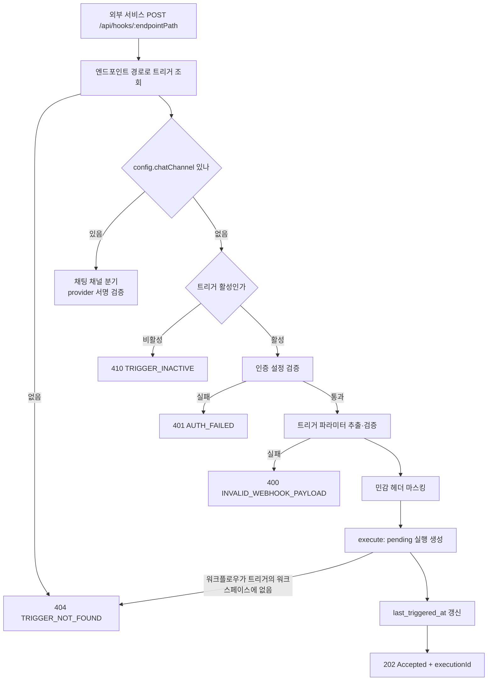

> 구현 상태: 구현됨 · 원문: `spec/5-system/12-webhook.md` · 용어: [용어 사전](../CLE-GLOSSARY.md)

## 개요

웹훅(Webhook)은 외부 서비스(GitHub, Stripe 등)나 사용자 시스템이 HTTP 요청을 보내 워크플로우를 실행하는 트리거다. 이벤트 기반 자동화의 핵심 진입점으로, 외부 이벤트가 생기면 바로 워크플로우를 시작한다.

이 문서는 웹훅 수신 엔드포인트(`POST /api/hooks/:endpointPath`)와 웹훅 URL 형식, 엔드포인트 경로(endpoint path, `endpointPath`)의 비밀성, 인증 검증 방식, 워크플로우에 넘기는 입력 구조, 공개 웹훅(public webhook, `auth_config_id IS NULL`)의 남용 방어, 수신 처리 흐름을 정한다. 이 문서는 "외부에서 워크플로우를 시작하는" 트리거 진입점에 한정한다.

| 사용 시나리오 | 설명 |
|---------------|------|
| GitHub PR 이벤트 | PR 생성·머지 때 코드 리뷰 워크플로우 실행 |
| 이메일 수신 | 특정 메일을 받으면 AI 에이전트 워크플로우 실행 |
| Stripe 결제 이벤트 | 결제 완료·실패 때 알림 워크플로우 실행 |
| 폼 제출 | 외부 웹 폼 제출 때 데이터 처리 워크플로우 실행 |
| IoT 데이터 수신 | 센서 데이터가 도착하면 분석 워크플로우 실행 |

범위 밖 주제는 다음 문서가 정한다.

- 트리거 목록·생성·수정·삭제와 트리거 API: [트리거 관리](CLE-TRIG-MANAGE.md)
- 인증 설정(AuthConfig, `auth_config`) 발급·필드 마스킹·평문 보기: [외부 호출 인증 설정](CLE-TRIG-AUTHCFG.md)
- 트리거·인증 설정 엔티티 컬럼, 엔드포인트 경로의 전역 유일과 영구 예약: [트리거 데이터와 흐름](CLE-TRIG-DATA.md)
- 채팅 채널 분기 뒤의 처리(update 파싱, 대화 조회, 인터랙션 전달, provider 응답 계약): [채팅 채널](../CLE-CHAT/CLE-CHAT-CORE.md)
- 웹훅 응답의 인터랙션 확장, 트리거의 `notification`·`interaction` 설정: [External Interaction API](../CLE-IX/CLE-EIA.md)
- 트리거 파라미터 공통 계약: [트리거 노드 공통](../CLE-NODE-TRIG/CLE-NODE-TRIG-COMMON.md). 수동 트리거 노드의 출력 모양: [수동 트리거 노드](../CLE-NODE-TRIG/CLE-NODE-MANUAL.md)
- 전역 rate limit 수치와 응답 봉투: [HTTP API 규약](../CLE-API/CLE-API-CONV.md). 에러 코드 카탈로그: [에러 코드 규약과 카탈로그](../CLE-API/CLE-API-ERRCODES.md)

## 요구사항

- REQ-WEBHOOK-001 WHEN 웹훅 트리거를 만들면 THE SYSTEM SHALL 트리거마다 고유한 웹훅 URL 을 준다. (원본: WH-EP-01)
- REQ-WEBHOOK-002 WHEN 웹훅 URL 을 표시하면 THE SYSTEM SHALL `{base_url}/api/hooks/{endpoint_path}` 형식을 쓰고 `base_url` 은 웹훅을 받는 백엔드 origin 으로 한다. (원본: WH-EP-02)
- REQ-WEBHOOK-003 IF 웹훅 엔드포인트에 POST 가 아닌 메서드가 오면 THE SYSTEM SHALL `405 Method Not Allowed` 로 응답한다. (원본: WH-EP-03)
- REQ-WEBHOOK-004 WHEN 웹훅 요청이 오면 THE SYSTEM SHALL JSON 과 form-urlencoded 본문을 받는다. (원본: WH-EP-04)
- REQ-WEBHOOK-005 WHEN 웹훅이 실행을 시작하면 THE SYSTEM SHALL 요청 본문 전체를 워크플로우 입력의 `body` 로 넘긴다. (원본: WH-EP-05)
- REQ-WEBHOOK-006 WHEN 수동 트리거 노드가 `parameters` 스키마를 선언했으면 THE SYSTEM SHALL body 에서 파라미터를 추출·검증해 `$input.parameters`·`$params` 로 제공한다. (원본: WH-EP-05-1)
- REQ-WEBHOOK-007 IF required 파라미터가 없거나 타입 강제 변환이 실패하면 THE SYSTEM SHALL 실행을 만들지 않고 `400 INVALID_WEBHOOK_PAYLOAD` 로 응답하며 필드별 사유를 `error.details[]` 에 싣는다. (원본: WH-EP-05-2)
- REQ-WEBHOOK-008 WHEN 웹훅이 실행을 시작하면 THE SYSTEM SHALL `headers`·`method`·`query` 를 메타데이터로 넘기고 민감 헤더 값은 저장 전에 `[REDACTED]` 로 가린다. (원본: WH-EP-06)
- REQ-WEBHOOK-009 IF 비활성 트리거로 요청이 오면 THE SYSTEM SHALL `410 Gone`(`TRIGGER_INACTIVE`)으로 응답한다. (원본: WH-EP-07)
- REQ-WEBHOOK-010 IF 채팅 채널이 설정된 트리거가 비활성이면 THE SYSTEM SHALL provider inbound 서명 검증을 먼저 하고 통과하면 `202 Accepted` 와 `{ executionId: 'ignored' }` 로 응답한다. (원본: WH-EP-07)
- REQ-WEBHOOK-011 WHEN 트리거에 인증 설정이 연결되지 않았으면 THE SYSTEM SHALL 인증 없이 요청을 받는다. (원본: WH-SC-01)
- REQ-WEBHOOK-012 WHEN 클라이언트가 엔드포인트 경로를 만들면 THE SYSTEM SHALL CSPRNG 로 발급한 v4 UUID(`crypto.randomUUID()`)를 쓰고 약한 난수나 고정값을 쓰지 않는다. (원본: WH-SC-01)
- REQ-WEBHOOK-013 IF 다른 트리거가 이미 쓰는 엔드포인트 경로로 등록하려 하면 THE SYSTEM SHALL 워크스페이스와 상관없이 409 로 거부한다. (원본: WH-SC-01)
- REQ-WEBHOOK-014 WHEN 인증 설정 유형이 `hmac` 이면 THE SYSTEM SHALL `config.header`(기본 `X-Hub-Signature-256`) 헤더의 서명을 `config.secret` 으로 계산한 HMAC 과 비교한다. (원본: WH-SC-02)
- REQ-WEBHOOK-015 IF HMAC `config.algorithm` 이 `sha256`·`sha512` 가 아니면 THE SYSTEM SHALL 인증 실패로 처리한다.
- REQ-WEBHOOK-016 WHEN 인증 설정 유형이 `bearer_token` 이면 THE SYSTEM SHALL `Authorization: Bearer <token>` 값을 `config.token` 과 비교한다. (원본: WH-SC-03)
- REQ-WEBHOOK-017 IF 인증이 실패하면 THE SYSTEM SHALL 유형과 사유를 가리지 않고 `401 AUTH_FAILED` 하나로 응답하고 진단은 서버 로그에만 남긴다. (원본: WH-SC-04)
- REQ-WEBHOOK-018 WHEN 웹훅 요청이 오면 THE SYSTEM SHALL 전역 throttler 로 분당 100건을 넘는 요청을 막는다. (원본: WH-SC-05)
- REQ-WEBHOOK-019 WHEN 공개 웹훅에 요청이 오면 THE SYSTEM SHALL 클라이언트 IP 단위로 분당 시작 10건과 시간당 누적 신규 20건(기본값)을 넘는 요청을 429 로 막는다. (원본: WH-SC-05)
- REQ-WEBHOOK-020 IF 공개 웹훅 요청의 클라이언트 IP 를 헤더에서 알 수 없으면 THE SYSTEM SHALL 그런 요청을 하나의 공유 버킷으로 묶어 같은 한도를 건다. (원본: WH-SC-05)
- REQ-WEBHOOK-021 WHEN 인증 설정 유형이 `api_key` 이면 THE SYSTEM SHALL `config.headerName`(기본 `X-API-Key`) 헤더 값을 `config.key` 와 비교한다. (원본: WH-SC-06)
- REQ-WEBHOOK-022 WHEN 인증 설정 유형이 `basic_auth` 이면 THE SYSTEM SHALL `Authorization: Basic` 을 디코드한 사용자 이름과 비밀번호를 `config.username`·`config.password` 와 비교한다. (원본: WH-SC-07)
- REQ-WEBHOOK-023 WHEN 인증 자료를 비교하면 THE SYSTEM SHALL `crypto.timingSafeEqual` 기반 상수 시간 비교를 쓴다.
- REQ-WEBHOOK-024 WHEN 인증이 성공하면 THE SYSTEM SHALL 트랜잭션 밖에서 `AuthConfig.last_used_at` 을 fire-and-forget 으로 갱신하고 실패하면 갱신하지 않는다. (원본: WH-SC-08)
- REQ-WEBHOOK-025 IF 인증 설정에 `ip_whitelist` 가 있는데 클라이언트 IP 가 목록에 없거나 IP 를 알 수 없으면 THE SYSTEM SHALL `401 AUTH_FAILED` 로 거부한다. (원본: WH-SC-09)
- REQ-WEBHOOK-026 IF 연결된 인증 설정이 비활성(`is_active=false`)이면 THE SYSTEM SHALL 곧바로 `401 AUTH_FAILED` 로 거부한다.
- REQ-WEBHOOK-027 WHEN 웹훅 요청이 실행을 시작하면 THE SYSTEM SHALL 실행을 기다리지 않고 `202 Accepted` 와 `executionId` 를 응답한다. (원본: WH-RS-01)
- REQ-WEBHOOK-028 IF 엔드포인트 경로에 맞는 웹훅 트리거가 없으면 THE SYSTEM SHALL `404 TRIGGER_NOT_FOUND` 로 응답한다. (원본: WH-RS-02)
- REQ-WEBHOOK-029 IF 요청 본문 파싱이 실패하면 THE SYSTEM SHALL `400 Bad Request` 로 응답한다. (원본: WH-RS-03)
- REQ-WEBHOOK-030 WHEN 트리거가 `interaction.enabled=true` 이고 `tokenStrategy="per_execution"` 이면 THE SYSTEM SHALL 202 응답에 `status: "pending"` 과 `interaction.token`·`interaction.expiresAt`·`interaction.endpoints` 를 함께 싣는다. (원본: WH-RS-04)
- REQ-WEBHOOK-031 WHEN 사용자가 웹훅 트리거를 만들면 THE SYSTEM SHALL 워크플로우 에디터와 트리거 화면 두 곳에서 같은 `POST /api/triggers` 로 만들게 한다. (원본: WH-MG-01)
- REQ-WEBHOOK-032 WHEN 웹훅 트리거를 만들거나 경로를 바꾸면 THE SYSTEM SHALL 생성·수정 DTO 에서 v4 UUID 형식(`@IsUUID('4')`)의 엔드포인트 경로만 받는다. (원본: WH-MG-02)
- REQ-WEBHOOK-033 WHILE 사용자가 트리거를 비활성으로 둔 동안 THE SYSTEM SHALL 웹훅 수신으로 실행을 시작하지 않는다. (원본: WH-MG-04)
- REQ-WEBHOOK-034 IF EIA 알림 웹훅이나 채팅 채널의 상태가 `degraded` 가 되면 THE SYSTEM SHALL 트리거를 자동으로 비활성화하지 않는다. (원본: WH-MG-04, WH-MG-07, WH-MG-09)
- REQ-WEBHOOK-035 WHEN 사용자가 호출 이력을 보면 THE SYSTEM SHALL 요청 시각·상태·응답 코드를 보여 준다. (부분 구현) (원본: WH-MG-05)
- REQ-WEBHOOK-036 WHEN 트리거 생성·수정 요청이 `notification`·`interaction` 을 담으면 THE SYSTEM SHALL EIA 알림 웹훅과 외부 인터랙션 설정으로 저장한다. (원본: WH-MG-06)
- REQ-WEBHOOK-037 WHEN 트리거 상세 화면을 그리면 THE SYSTEM SHALL `notificationHealth`(unknown / healthy / degraded)를 표시한다. (원본: WH-MG-07)
- REQ-WEBHOOK-038 WHEN 트리거 생성 요청이 `chatChannel` 을 담으면 THE SYSTEM SHALL 외부 채팅 플랫폼 어댑터를 연결하고 없으면 일반 웹훅 트리거로 동작한다. (원본: WH-MG-08)
- REQ-WEBHOOK-039 WHEN 트리거 상세 화면을 그리면 THE SYSTEM SHALL `chatChannelHealth` 를 `notificationHealth` 배지와 같은 영역·같은 형식으로 나란히 표시한다. (원본: WH-MG-09)
- REQ-WEBHOOK-040 WHEN 웹훅 요청을 받으면 THE SYSTEM SHALL 200ms 안에 응답하고 실행은 비동기로 한다. (원본: WH-NF-01)
- REQ-WEBHOOK-041 IF 공개 웹훅 요청 본문이 32KB 를 넘으면 THE SYSTEM SHALL `413 PUBLIC_WEBHOOK_BODY_TOO_LARGE` 로 응답한다. (원본: WH-NF-02)
- REQ-WEBHOOK-042 IF 인증 웹훅 요청 본문이 1MB(기본값)를 넘으면 THE SYSTEM SHALL `413 PAYLOAD_TOO_LARGE` 로 응답한다. (원본: WH-NF-02)
- REQ-WEBHOOK-043 WHEN 웹훅 요청이 동시에 여러 건 오면 THE SYSTEM SHALL 요청마다 독립된 실행을 만들어 병렬로 처리한다. (원본: WH-NF-03)
- REQ-WEBHOOK-044 IF 공개 웹훅 가드가 트리거 조회에 실패하거나 Redis 를 쓸 수 없으면 THE SYSTEM SHALL 요청을 통과시키고 조회 실패는 `error` 레벨로 로그를 남긴다.
- REQ-WEBHOOK-045 WHEN 요청이 `/api/hooks/*` 로 오면 THE SYSTEM SHALL JWT 인증을 요구하지 않는다.
- REQ-WEBHOOK-046 WHEN 웹훅이 실행을 시작하면 THE SYSTEM SHALL 실행에 `trigger_id`·`source_ip`·`response_code('202')` 를 기록하고 트리거의 `last_triggered_at` 을 갱신한다.
- REQ-WEBHOOK-047 IF 채팅 채널이 아닌 웹훅 트리거의 워크플로우가 트리거의 워크스페이스에 없으면 THE SYSTEM SHALL 실행을 만들지 않고 엔드포인트 경로에 맞는 트리거가 없을 때와 같은 `404 TRIGGER_NOT_FOUND` 로 응답한다.

## 처리 구조

일반 웹훅 요청은 트리거 조회, 활성 확인, 인증, 파라미터 검증, 헤더 마스킹, 실행 생성 순서로 처리된다. `execute()` 는 실행 행을 `pending` 으로 만들고 곧바로 `executionId` 를 돌려준다. 202 응답은 그 `executionId` 를 담아 보낸다. 워크플로우 실행 자체는 큐 워커가 비동기로 한다.



채팅 채널 트리거는 활성 확인보다 채팅 채널 분기가 먼저다. 이 분기는 인증 설정이 아니라 provider 별 inbound 서명으로 인증한다. 자세한 순서는 [처리 흐름](#처리-흐름)에 적는다.

## 트리거 필드와 config

웹훅 트리거는 트리거 엔티티를 그대로 쓰고 새 테이블은 없다. 컬럼 정의는 [트리거 데이터와 흐름](CLE-TRIG-DATA.md) 이 정한다.

| 필드 | 웹훅에서의 쓰임 |
|------|----------------|
| `type` | `'webhook'` |
| `endpointPath` | URL 경로. 전역에서 유일하다(`(endpoint_path)` UNIQUE). UUID 로 만든다 |
| `isActive` | 수신 활성/비활성 |
| `authConfigId` | 웹훅 인증 검증의 단일 진입점(FK → 인증 설정). `NULL` 이면 인증 없음이다. 인증 자료와 `ip_whitelist` 는 모두 인증 설정에 있다 |
| `config` | 추가 설정(JSONB). 인증 관련 키는 없다 |
| `workflowId` | 실행할 워크플로우 |
| `lastTriggeredAt` | 마지막 호출 시각 |

`config` 는 다음 세 서브 객체를 담을 수 있다. 셋 다 없어도 된다. 없으면 해당 외부 인터랙션 채널이나 채팅 채널 어댑터가 비활성으로 간주된다.

```json
{
  "notification": { },
  "interaction":  { },
  "chatChannel":  { }
}
```

| 키 | 내용 | 기준 문서 |
|----|------|----------|
| `notification` | EIA 알림 웹훅 설정(outbound 이벤트) | [External Interaction API](../CLE-IX/CLE-EIA.md) |
| `interaction` | 외부 인터랙션 채널(inbound) 설정 | [External Interaction API](../CLE-IX/CLE-EIA.md) |
| `chatChannel` | 채팅 채널 어댑터 설정(Telegram 등) | [채팅 채널 데이터와 흐름](../CLE-CHAT/CLE-CHAT-DATA.md) |

상태·시크릿 회전 추적처럼 별도 컬럼이 필요한 필드는 [EIA 데이터와 흐름](../CLE-IX/CLE-EIA-DATA.md) 과 [채팅 채널 데이터와 흐름](../CLE-CHAT/CLE-CHAT-DATA.md) 이 정한다.

인증 키는 `config` 에 두지 않는다. 웹훅 인증은 `trigger.auth_config_id` 가 가리키는 인증 설정 유형(`AuthConfig.type`)으로 정해진다. 옛 인라인 키(`authType` / `secret` / `bearerToken` / `hmacHeader` / `hmacAlgorithm`)는 `V066__trigger_config_strip_inline_auth.sql` 로 지웠고 남은 행에 키가 있어도 코드는 무시한다. 인증 설정 `config` 의 `header` / `algorithm` 은 옛 `config.hmacHeader` / `hmacAlgorithm` 과 위치와 주인이 다르다. 트리거가 아니라 자격 증명의 메타데이터다.

## 엔드포인트 경로

### URL 형식

웹훅 URL 은 `{base_url}/api/hooks/{endpoint_path}` 한 가지 형식이다. `/api/webhooks` 경로나 워크스페이스 slug 세그먼트는 없다.

`base_url` 은 웹훅을 받는 백엔드 origin 이다. 프런트엔드(트리거 화면)는 표시·복사용 URL 의 base 를 다음 순서로 고른다(구현 `codebase/frontend/src/lib/utils/webhook-url.ts`).

1. `NEXT_PUBLIC_WEBHOOK_BASE_URL`(명시 override)
2. `NEXT_PUBLIC_API_URL` 에서 끝의 `/api` 를 뗀 값
3. `window.location.origin`

### 비밀성

인증 없는 웹훅에서는 엔드포인트 경로 UUID 가 사실상 비밀 키다. 그래서 경로는 반드시 CSPRNG 로 발급한 v4 UUID(`crypto.randomUUID()`)여야 한다. 서버는 생성·수정 DTO 에서 v4 형식을 강제하지만(`@IsUUID('4')`) 엔트로피 품질까지는 검증할 수 없다. 그래서 클라이언트는 약한 난수나 고정값을 쓰지 않는다. 형식 강제는 예측할 수 있는 비-UUID 경로를 직접 지정하는 것(squatting·enumeration)을 막는다.

비밀성(추측할 수 없음)과 유일성(복사할 수 없음)은 다른 보장이다. 경로는 전역에서 유일하다(`(endpoint_path)` UNIQUE, V132). 경로를 아는 다른 워크스페이스가 같은 경로를 등록하면 409 로 거부된다. 한 번 쓴 경로는 지우거나 바꾼 뒤에도 그 워크스페이스 소유로 영구 예약된다. 유일성과 예약의 규칙과 근거는 [트리거 데이터와 흐름](CLE-TRIG-DATA.md) 이 정한다.

웹채팅 트리거는 모두 공개 웹훅이다. 웹채팅 인스턴스의 엔드포인트 경로는 외부 사이트의 설치 스크립트에 박히므로 그 사이트를 연 누구나 알 수 있다. 이 경우 경로의 비밀성은 성립하지 않는다. 대신 [요청 제한과 남용 방어](#요청-제한과-남용-방어)가 모든 공개 웹훅에 똑같이 걸리고 웹채팅 쪽 보호는 [웹채팅 보안](../CLE-WEBCHAT/CLE-WEBCHAT-SECURITY.md) 이 정한다. 경로를 누구에게 보여도 되는지(뷰어 노출 등)가 일반 웹훅에도 적용되는지는 [미결 사항](#미결-사항)에 적는다.

### 경로 변경

웹훅 트리거의 엔드포인트 경로는 의도적으로 바꿀 수 있다. 스케줄 유형 트리거의 경로만 바꿀 수 없다. 근거는 [Rationale](#rationale) "엔드포인트 경로 가변성".

## 수신 API

```
POST /api/hooks/:endpointPath
```

| 항목 | 설명 |
|------|------|
| 인증 | `trigger.auth_config_id` 가 가리키는 인증 설정 유형에 따른다. 연결 없음(`auth_config_id IS NULL`, 공개) / `api_key` / `bearer_token` / `basic_auth` / `hmac`. `is_active=false` 인 인증 설정은 곧바로 401 `AUTH_FAILED`. 인증 설정에 `ip_whitelist` 가 있으면 함께 시행한다 |
| Content-Type | `application/json`, `application/x-www-form-urlencoded` |
| 요청 본문 최대 크기 | 공개 웹훅 32KB, 인증 웹훅 1MB(기본). [본문 크기](#본문-크기) |
| JWT | `/api/hooks/*` 는 JWT guard 대상이 아니다(외부 서비스가 부르므로) |
| CORS | 웹훅 엔드포인트에는 CORS 제한이 없다 |

성공 응답은 `202 Accepted` 다. 핸들러가 돌려준 값은 전역 `TransformInterceptor` 가 `{ "data": { ... } }` 로 감싸 보낸다([HTTP API 규약](../CLE-API/CLE-API-CONV.md) 응답 형식).

```json
{
  "data": {
    "executionId": "uuid",
    "message": "Webhook received, workflow execution started"
  }
}
```

트리거에 `interaction.enabled=true` 와 `tokenStrategy="per_execution"` 이 설정돼 있으면 `data` 에 `status: "pending"` 과 `interaction: { token, expiresAt, endpoints }` 가 더 들어간다. 자세한 모양은 [External Interaction API](../CLE-IX/CLE-EIA.md) 의 웹훅 호출 응답 확장이 정한다.

에러 응답은 다음과 같다. 코드 카탈로그는 [에러 코드 규약과 카탈로그](../CLE-API/CLE-API-ERRCODES.md) 에 등재한다.

| 상태 | 코드 | 조건 |
|------|------|------|
| `400 Bad Request` | | 요청 본문 파싱 실패 |
| `400 Bad Request` | `INVALID_WEBHOOK_PAYLOAD` | required 트리거 파라미터 누락, 타입 강제 변환 실패([400 응답 형식](#400-응답-형식)) |
| `401 Unauthorized` | `AUTH_FAILED` | 인증 실패. 비활성 인증 설정, 트리거의 워크스페이스에 없는 인증 설정, 서명·토큰 불일치, `ip_whitelist` 불일치 모두 같은 코드다 |
| `404 Not Found` | `TRIGGER_NOT_FOUND` | 엔드포인트 경로에 맞는 웹훅 트리거가 없다. 예약만 있고 트리거가 없는 경로도 404 다. 트리거의 워크플로우가 트리거의 워크스페이스에 없을 때도 같은 본문이다(REQ-WEBHOOK-047). 채팅 채널 트리거는 예외로 `202 Accepted` 와 `{ executionId: 'ignored' }` 를 돌려준다(REQ-CHAT-059) |
| `405 Method Not Allowed` | | POST 가 아닌 메서드([HTTP API 규약](../CLE-API/CLE-API-CONV.md)) |
| `410 Gone` | `TRIGGER_INACTIVE` | 트리거가 비활성이다. 채팅 채널 트리거는 예외로 `202 Accepted` 와 `{ executionId: 'ignored' }` 를 돌려준다 |
| `413 Payload Too Large` | `PUBLIC_WEBHOOK_BODY_TOO_LARGE` | 공개 웹훅 본문이 32KB 초과 |
| `413 Payload Too Large` | `PAYLOAD_TOO_LARGE` | 인증 웹훅 본문이 라우트 한도(기본 1MB) 초과 |
| `429 Too Many Requests` | `PUBLIC_WEBHOOK_RATE_LIMIT` | 공개 웹훅 IP 단위 분당 시작 한도 초과 |
| `429 Too Many Requests` | `PUBLIC_WEBHOOK_HOURLY_LIMIT` | 공개 웹훅 IP 단위 시간당 누적 신규 상한 초과 |

트리거 CRUD 는 기존 `/api/triggers` 를 그대로 쓴다([트리거 관리](CLE-TRIG-MANAGE.md)).

## 인증

모든 인증 자료는 `trigger.auth_config_id` 가 가리키는 인증 설정의 `config` 에서 복호화해 비교한다. `config` 스키마는 [트리거 데이터와 흐름](CLE-TRIG-DATA.md) 이 정한다.

- 비교는 `crypto.timingSafeEqual` 기반 상수 시간 비교로 해 타이밍 공격을 막는다.
- 인증 실패는 유형과 상관없이 `401 AUTH_FAILED` 하나로 응답한다. 어떤 유형인지, 왜 실패했는지 클라이언트에 알리지 않는다(enumeration·정보 노출 차단). 진단은 서버 로그에만 남긴다.
- 인증 검증, `ip_whitelist` 시행, `last_used_at` 갱신은 모두 `AuthConfigsService.verifyWebhookRequest` 가 맡는다. `HooksService` 는 호출만 한다.
- `ip_whitelist` 는 인증 설정에 딸려 있어 `auth_config_id IS NOT NULL` 일 때만 평가한다. 각 항목은 단일 IP 또는 CIDR 이고 IPv4-mapped IPv6 클라이언트는 IPv4 로 바꿔 비교한다. 클라이언트 IP 를 알 수 없으면 거부한다(fail-closed). 클라이언트 IP 추출 규칙은 [세션과 토큰](../CLE-ACCT/CLE-ACCT-SESSION.md) 의 클라이언트 IP 항목을 따른다.
- 인증이 성공하면 `AuthConfig.last_used_at = NOW()` 를 트랜잭션 밖에서 fire-and-forget 으로 갱신한다. 경합하면 마지막 쓰기가 이기고 실패하면 갱신하지 않는다.

| 유형 | 요청 헤더 | 검증 방식 |
|------|----------|----------|
| 인증 없음(공개) | 없음 | `auth_config_id IS NULL`. 누구나 부를 수 있고 엔드포인트 경로 UUID 가 사실상 비밀 키 역할을 한다 |
| `hmac` | `{config.header}: {config.algorithm}=<hex-digest>`(기본 헤더 `X-Hub-Signature-256`) | `HMAC-{config.algorithm}(config.secret, rawBody)` 가 헤더 값과 같은지. GitHub 웹훅과 같은 방식이다. `config.algorithm` 은 `sha256`·`sha512` 만 허용하고 다른 값은 인증 실패다. 파싱 전 원본 바이트가 필요하므로 NestJS 부트스트랩에서 `rawBody: true` 를 켜야 한다 |
| `bearer_token` | `Authorization: Bearer <token>` | `token === config.token` |
| `api_key` | `{config.headerName}: <key>`(기본 헤더 `X-API-Key`) | 헤더 값 `=== config.key` |
| `basic_auth` | `Authorization: Basic base64(username:password)` | 디코드한 사용자 이름·비밀번호가 `config.username` / `config.password` 와 같은지 |

## 워크플로우 입력 구조

웹훅으로 받은 데이터는 다음 구조로 워크플로우에 넘긴다.

```json
{
  "parameters": { "orderId": "abc", "amount": 1000 },
  "body": { "orderId": "abc", "amount": "1000", "extra": "..." },
  "headers": {
    "content-type": "application/json",
    "x-event-type": "order.created"
  },
  "query": { "key": "value" },
  "method": "POST"
}
```

| 키 | 설명 |
|----|------|
| `parameters` | 수동 트리거 노드의 `config.parameters` 에 따라 body 의 같은 이름 최상위 키에서 꺼내 타입을 맞춘 결과. 다운스트림에서 `$params.<name>` 이나 `$input.parameters.<name>` 으로 읽는다 |
| `body` | 파싱한 요청 본문(JSON 또는 form data, 원본 유지) |
| `headers` | 요청 헤더(소문자 키). 민감 헤더 값은 저장 전에 `[REDACTED]` 로 가린다([수신 헤더 마스킹](#수신-헤더-마스킹)). 위 예시의 `content-type`·`x-event-type` 같은 비민감 헤더는 그대로 둔다 |
| `query` | URL 쿼리 파라미터 |
| `method` | HTTP 메서드 |

이 구조는 어댑터가 워크플로우에 넘기는 입력이다. 수동 트리거 노드가 이 입력을 노드 `output` 으로 내보내는 모양(웹훅 출처의 `output.request.*`)과 다운스트림 표현식 경로(`$node["Manual Trigger"].output.request.method` 등)는 [수동 트리거 노드](../CLE-NODE-TRIG/CLE-NODE-MANUAL.md) 가 정한다. `HooksService` 는 입력에 진입 경로 마커 `__triggerSource:'webhook'` 을 붙여 넘긴다([실행 컨텍스트](../CLE-EXEC/CLE-EXEC-CONTEXT.md)).

### 파라미터 추출 규칙

1. 워크플로우의 수동 트리거 노드에서 `config.parameters` 스키마를 읽는다.
2. 스키마가 없거나 빈 배열이면 `parameters = {}` 다.
3. 스키마가 있으면 파라미터마다 다음을 적용한다.
   - `body` 가 객체면 그 `name` 의 최상위 키 값을 가져온다.
   - `body` 가 객체가 아니면 모든 값을 지정되지 않은 것으로 본다.
   - 값이 없고 `required=true` 면 누락으로 보고 400 을 응답한다(누락 필드 목록 포함).
   - 값이 없고 `required=false` 면 `defaultValue` 를 쓴다(없으면 `null`).
   - 타입이 맞지 않으면 `coerceToType` 으로 강제 변환하고 실패하면 400 이다.

채팅 채널 경로는 이 추출을 거치지 않는다. 이 경로의 파라미터 정책은 [미결 사항](#미결-사항)에 적는다.

### 400 응답 형식

required 파라미터 누락이나 타입 강제 변환 실패가 나면 `hooks.service` 가 `BadRequestException({ code, message, details })` 를 던지고 전역 `GlobalExceptionFilter` 가 공식 에러 응답 봉투(`{ error: { code, message, requestId, details? } }`)로 바꿔 응답한다([에러 응답과 클라이언트 처리](../CLE-API/CLE-API-ERROR.md)). 두 경우 모두 실행 행은 만들지 않는다.

```json
{
  "error": {
    "code": "INVALID_WEBHOOK_PAYLOAD",
    "message": "Invalid webhook payload",
    "requestId": "f3b6d2e0-9d4a-4b77-9d19-7a0f8f4c1e2b",
    "details": [
      { "field": "orderId", "code": "MISSING_REQUIRED_FIELD", "message": "Required parameter is missing" },
      { "field": "amount",  "code": "TYPE_COERCION_FAILED",   "message": "Value could not be coerced to the declared type" }
    ]
  }
}
```

- `error.code`: 도메인 특화 400 override 인 `INVALID_WEBHOOK_PAYLOAD` 다. API 규약의 400 기본값 `VALIDATION_ERROR` 대신 쓴다. EIA 가 같은 방식의 선례다.
- `error.details[]`: 필드별 사유. `field` 는 파라미터 이름, `code` 는 `UPPER_SNAKE_CASE` 필드 코드다. `MISSING_REQUIRED_FIELD` 는 required 누락, `TYPE_COERCION_FAILED` 는 선언 타입으로 변환할 수 없음이다. 헬퍼는 `INVALID_SCHEMA`(스키마 구조 위반)와 `MASKED_VALUE_RESUBMITTED`(마스킹된 값 재제출)도 매핑하지만 웹훅 런타임 경로에서는 둘 다 나오지 않는다. 앞의 것은 저장 시점 검증 코드이고 뒤의 것은 수동 실행 경로 전용이다. 판정 기준이 값의 출처가 아니라 페이로드를 누가 썼는지이고 웹훅 body 는 외부 시스템이 쓴다([응답 자격 증명 마스킹](../CLE-API/CLE-API-EGRESS.md)).
- 구현: 내부 분류 문자열(`missing_required` / `coerce_failed` / `invalid_schema` / `masked_value_resubmitted`)을 `toTriggerParameterErrorDetails` 가 위 공개 필드 코드로 바꾼다. 수동 실행·저장·재실행 세 경로의 `INVALID_TRIGGER_PARAMETERS` 도 같은 헬퍼를 쓴다([수동 트리거 노드](../CLE-NODE-TRIG/CLE-NODE-MANUAL.md)). 명명 규약과 카탈로그는 [에러 코드 규약과 카탈로그](../CLE-API/CLE-API-ERRCODES.md) 가 정한다.

### 수신 헤더 마스킹

웹훅 요청의 인증·시크릿성 헤더 값(`Authorization`·`Cookie`·`X-Api-Key`·`X-Auth-Token` 등)은 `Execution.inputData` 로 저장하기 전, 인증 검증 직후에 `[REDACTED]` 로 가린다. `hooks.service` 의 두 `execute` 진입점(일반 경로, 채팅 채널 경로) 모두 이렇게 한다.

- 가릴 헤더 목록은 통합 노드도 쓰는 `sanitizeResponseHeaders` 를 단일 기준으로 쓴다. 정확히 일치하는 이름(`authorization`·`cookie`·`x-auth-token` 등)과 부분 문자열(`auth`·`token`·`secret`·`cookie`·`credential`·`password`·`api-key`·`signature`)로 판정한다. 키는 남기고 값만 가린다.
- 부분 문자열 `signature` 는 `X-Hub-Signature-256`(웹훅 HMAC)·`X-Slack-Signature`·`X-Signature-Ed25519`(Discord) 같은 서명 헤더까지 덮는다. `content-type`·`x-event-type` 같은 비민감 커스텀 헤더는 그대로 둔다.
- 효과: `Execution.inputData.headers`, 수동 트리거 노드 `output.request.headers`, 표현식 `$trigger.headers`([표현식 언어](../CLE-WF/CLE-WF-EXPR.md)) 세 표면이 모두 가린 값을 본다. 실행 상세·재실행 모달·Background 실행 상세처럼 `inputData`/`output_data` 를 보여 주는 모든 읽기 경로가 자동으로 가려진다.
- 인증에는 영향이 없다. HMAC 서명 검증·IP whitelist·토큰 비교는 가리기 전 원본 헤더로 한다. `sourceIp` 와 인증 설정 사용 내역도 원본으로 기록한다.
- 이 층은 알려진 민감 헤더 키에만 걸린다. body·params 의 자유 텍스트에 박힌 자격 증명(`Bearer …`, 자격 증명을 담은 URI 등)은 이 층이 잡지 못한다. 그 빈틈은 응답 마스킹이 덮는다. `inputData` 도 `outputData`·`error` 처럼 나가는 값 패턴 마스킹의 대상이다([응답 자격 증명 마스킹](../CLE-API/CLE-API-EGRESS.md)). 즉 저장 때 키 기준 마스킹과 응답 때 값 패턴 마스킹의 이중 방어다.
- 그래도 이 층은 대체되지 않는다. 표현식 `$trigger.headers` 는 실행 런타임에 주입돼 응답 마스킹을 거치지 않으므로 그 표면을 가리는 것은 이 저장 시점 층뿐이다.
- 정당화: 실행 상세 읽기는 워크스페이스 소유권(`verifyOwnership(workspaceId)`)만 확인하므로 마스킹이 없으면 워크스페이스 멤버 전원이 원본 인증 헤더를 볼 수 있다. `output.request.headers` 를 원본으로 쓰는 다운스트림 노드는 없고(인증은 이미 끝났다) 비민감 헤더는 남으므로 정상 사용에는 영향이 없다.

## 요청 제한과 남용 방어

공개 웹훅은 무차별 대입과 DoS 의 표면이라 인증 웹훅보다 제한을 더 건다. 이 절의 한도는 웹채팅을 포함한 모든 공개 웹훅에 똑같이 적용된다. 이 절은 설정 키, 에러 코드, Redis 키, 구현 위치를 적는다. 같은 방어를 공개 챗봇 관점에서 설명하는 절이 [웹채팅 보안 §공개 웹훅 남용 방어](../CLE-WEBCHAT/CLE-WEBCHAT-SECURITY.md#공개-웹훅-남용-방어) 에 있다. 두 문서 가운데 어느 쪽이 정책 수치의 기준인지는 [웹채팅 보안](../CLE-WEBCHAT/CLE-WEBCHAT-SECURITY.md#미결-사항) 의 미결 사항에서 정한다. 그때까지 두 문서의 값(분당 10·시간당 20·32KB·공유 버킷)은 같게 유지한다.

### 본문 크기

본문 크기 한도는 공개 웹훅과 인증 웹훅을 나눈다(분리 임계).

- 인증 웹훅: `/api/hooks/*`(`HOOKS_ROUTE_PREFIX` 상수) 라우트 전용 body-parser(`createHooksBodyParsers`, `src/bootstrap/hooks-body-parser.ts`)가 본문을 1MB(기본)까지 받는다. `HOOKS_MAX_BODY_BYTES` 로 바꿀 수 있고 과도한 설정으로 인한 메모리 부족을 막으려고 상한 `HOOKS_MAX_BODY_BYTES_CEILING`(16MiB)으로 자른다. 넘으면 body-parser 가 413 을 던지고 `GlobalExceptionFilter` 가 표준 봉투 `PAYLOAD_TOO_LARGE` 로 바꾼다.
- 공개 웹훅: 그 위에서 `PublicWebhookThrottleGuard` 가 32KB(`DEFAULT_MAX_BODY_BYTES`, config `publicWebhook.maxBodyBytes`)를 넘으면 `413 PUBLIC_WEBHOOK_BODY_TOO_LARGE` 로 더 막는다.
- 그 밖의 라우트: 전역 100KB(`createGlobalBodyParsers`)를 명시로 등록해 웹훅이 아닌 라우트의 방어선을 지킨다.
- 파서 등록 순서: `main.ts` 는 `NestFactory.create(AppModule, { bodyParser: false })` 로 Nest 기본 파서를 끄고 hooks 파서(1MB)를 먼저, 전역 파서(100KB)를 다음에 직접 등록한다. hooks 파서가 먼저 파싱해 `req._body` 를 세우면 뒤의 전역 파서는 hooks 요청을 다시 파싱하지 않는다. 두 파서는 공통 `verify` 로 rawBody 를 보존해 HMAC 검증과 맞는다.

### 호출 빈도 제한

- 전역: 글로벌 throttler 분당 100건. 수치의 기준은 [HTTP API 규약](../CLE-API/CLE-API-CONV.md) 의 rate limiting 이다.
- 공개 웹훅 추가 한도: `PublicWebhookThrottleGuard` 가 `auth_config_id IS NULL` 트리거에만 IP 단위 시작 한도(기본 분당 10, config `publicWebhook.startupPerMinute`)와 시간당 누적 신규 상한(기본 20, `publicWebhook.hourlyNewMax`)을 건다. 넘으면 `429 PUBLIC_WEBHOOK_RATE_LIMIT` 또는 `429 PUBLIC_WEBHOOK_HOURLY_LIMIT` 이다.
- 가드는 트리거를 조회한 뒤 가장 먼저 한도를 적용한다. 인증 웹훅은 이 가드를 제한 없이 통과한다(본문 크기는 위 라우트 파서가 따로 막는다).
- IP 를 알 수 없는 요청: 공격자가 `X-Forwarded-For`·`CF-Connecting-IP` 헤더를 지우는 등으로 헤더에서 클라이언트 IP 를 알 수 없으면 그런 요청을 모두 하나의 공유 버킷(`UNIDENTIFIED_IP_BUCKET`)으로 묶어 같은 한도를 건다. 무제한 우회가 아니라 유한한 완화 한도다. `req.ip`·`req.socket.remoteAddress` 폴백은 쓰지 않는다. 공유 버킷을 고른 근거와 인프라 권고는 [웹채팅 보안](../CLE-WEBCHAT/CLE-WEBCHAT-SECURITY.md) 의 Rationale «공개 웹훅에서 IP 를 알 수 없으면 공유 버킷 하나로 완화 한도를 건다» 에 있다.
- 인증 웹훅의 `ip_whitelist` 는 반대로 IP 를 알 수 없으면 거부한다. rate limit 은 가용성 보호이고 whitelist 는 인증 관문이라 성격이 다르다.
- 가드의 fail-open: Redis 를 쓸 수 없으면 통과시킨다. 가드의 트리거 조회가 실패해도 통과시키되, 공개 웹훅 보호가 잠시 꺼지는 것이므로 `error` 레벨로 로그를 남겨 긴 DB 장애 동안 보호가 빠진 것을 모니터링이 일찍 잡게 한다.

### Redis 키

공개 웹훅 한도는 Redis 버킷 두 개를 쓴다. Redis 키 인벤토리([비동기 큐와 Redis 키 목록](../CLE-PLAT/CLE-PLAT-QUEUE.md))는 이 절을 상세 기준으로 가리킨다.

| 버킷 | 키 | 윈도 |
|------|----|------|
| IP 단위 시작 한도(기본 분당 10) | `wh:rl:min:<ip>` | 60초 fixed-window |
| IP 단위 시간당 누적 신규 상한(기본 20) | `wh:rl:hour:<ip>` | 3600초 fixed-window |

IP 를 알 수 없는 요청은 `<ip>` 자리에 sentinel(`__no_client_ip__`, `UNIDENTIFIED_IP_BUCKET`)이 들어가 하나의 공유 버킷으로 묶인다. 로그와 메트릭에서 IP 처럼 보이지만 의도한 집계 키다. 두 키 모두 `INCR` 뒤 첫 증가 때 `EXPIRE` 를 건다(`PublicWebhookQuotaService`, pipeline).

## 처리 흐름

1. `POST /api/hooks/:endpointPath` 를 받는다. 앞단에서 `PublicWebhookThrottleGuard` 가 공개 웹훅의 본문 크기와 IP 한도를 먼저 적용한다.
2. `HooksService.handleWebhook(endpointPath, body, headers, query)` 가 처리를 시작한다.
3. `TriggersService.findByEndpointPath()` 로 웹훅 트리거를 찾는다. 조회는 워크스페이스 없이 `endpoint_path` 와 `type='webhook'` 으로 한다.
4. 트리거가 없으면 `404 TRIGGER_NOT_FOUND` 다.
5. `config.chatChannel` 이 있으면 채팅 채널 분기로 간다(아래 "채팅 채널 분기"). 이 분기는 활성 확인보다 먼저다.
6. 트리거가 비활성이면 `410 Gone`(`TRIGGER_INACTIVE`)이다.
7. 인증을 검증한다(`AuthConfigsService.verifyWebhookRequest`).
   1. `trigger.auth_config_id IS NULL` 이면 통과한다. `ip_whitelist` 도 인증 설정에 딸려 있어 평가하지 않는다.
   2. 인증 설정을 트리거의 워크스페이스 안에서 찾는다. 없으면 `401 AUTH_FAILED` 다. 다른 워크스페이스의 인증 설정을 가리키는 저장된 행도 여기서 막힌다([데이터 모델 개요 「저장된 교차 행 점검」](../CLE-PLAT/CLE-PLAT-DATA.md#저장된-교차-행-점검)).
   3. 인증 설정이 비활성이면 `401 AUTH_FAILED`.
   4. `ip_whitelist` 가 있으면 클라이언트 IP 를 검사한다. 맞지 않으면 401.
   5. 유형별(`bearer_token` / `api_key` / `basic_auth` / `hmac`)로 상수 시간 비교를 한다.
   6. 성공하면 `last_used_at` 을 fire-and-forget 으로 갱신한다.
   7. 실패하면 `401 AUTH_FAILED` 이고 갱신하지 않는다.
8. `resolveTriggerParameters(workflow, body)` 로 파라미터를 추출·검증한다. 파라미터 스키마는 트리거의 워크스페이스 안에서만 읽는다. 워크플로우가 그 워크스페이스에 없으면 스키마가 없는 것으로 보고 10 에서 404 가 된다. required 누락이나 변환 실패면 `400 INVALID_WEBHOOK_PAYLOAD` 이고 실행을 만들지 않는다.
9. 민감 헤더를 `[REDACTED]` 로 가린다.
10. `ExecutionEngineService.execute(trigger.workflowId, { __triggerSource:'webhook', parameters, body, headers, query, method }, { triggerId: trigger.id, workspaceId: trigger.workspaceId, sourceIp, responseCode: '202' })` 를 부른다.
    - 엔진은 워크플로우가 트리거의 워크스페이스에 없으면 거부한다. 이때 4 와 같은 `404 TRIGGER_NOT_FOUND`(같은 본문)로 응답하고 실행 행과 `last_triggered_at` 을 남기지 않는다(REQ-WEBHOOK-047). 저장 경계 이전에 남은 교차 행을 위한 동작이다([데이터 모델 개요 「저장된 교차 행 점검」](../CLE-PLAT/CLE-PLAT-DATA.md#저장된-교차-행-점검)).
    - 세 번째 인자로 `triggerId` 를 넘겨야 실행 행의 `trigger_id` 가 채워지고 실행 내역 화면에서 출처가 `webhook` 으로 분류된다.
    - `sourceIp`(`extractClientIpFromHeaders` 결과, 인증 IP whitelist 검증과 같은 값)와 `responseCode`(성공 경로의 실제 HTTP 코드 `202`)도 넘긴다. 둘은 실행 행의 `source_ip`/`response_code` 컬럼에 저장돼 인증 설정 사용 내역의 소스 IP·응답 코드를 채운다([외부 호출 인증 설정](CLE-TRIG-AUTHCFG.md)).
    - 스케줄·수동 트리거는 두 인자를 넘기지 않아 컬럼이 NULL 이다. `ExecuteOptions` 의 `triggerId` variant 에서 `sourceIp?`/`responseCode?` 는 선택이라 기존 호출자와 호환된다.
    - `execute()` 는 실행 행을 `pending` 으로 만들고 곧바로 `executionId` 를 돌려준다.
11. `Trigger.lastTriggeredAt` 을 현재 시각으로 갱신한다.
12. `202 Accepted` 와 `{ data: { executionId, message } }` 를 응답한다. `message` 필드가 실제로 남는지는 [EIA](../CLE-IX/CLE-EIA.md#미결-사항) 의 미결 사항이다.

### 채팅 채널 분기

`config.chatChannel` 이 있는 트리거는 5단계에서 채팅 채널 분기(`handleChatChannelWebhook`)로 간다. 이 분기는 일반 흐름의 활성 확인(410), 인증 설정 인증, 트리거 파라미터 검증을 거치지 않는다.

- 인증은 인증 설정이 아니라 provider 별 inbound 서명 검증(`chatChannelInboundAuthenticator.verify`)으로 한다. Telegram 은 `X-Telegram-Bot-Api-Secret-Token`, Slack 은 `X-Slack-Signature`, Discord 는 `X-Signature-Ed25519` 를 쓴다. 검증에 실패하면 401 이다.
- 트리거가 비활성이어도 서명 검증은 먼저 한다. 통과하면 update 를 무시하고 `202 Accepted` 와 `{ executionId: 'ignored' }` 로 응답한다. 비활성인데 410 이 아니라 202 인 이유는 Telegram 같은 provider 가 2xx 가 아닌 응답을 받으면 웹훅을 자동으로 끄거나 재시도를 쏟아내기 때문이다. 비활성이어도 인증을 하는 이유는 인증에 실패한 요청에 조용한 202 를 주면 공격자가 트리거 활성 여부를 추측할 수 있고 운영자는 인증 실패를 401 로 봐야 디버깅할 수 있기 때문이다.
- 새 대화면 일반 경로와 같이 `execute(workflowId, input, { triggerId, workspaceId, sourceIp, responseCode: '202' })` 로 실행을 시작한다. 입력은 provider update 를 바꾼 값이다. 워크플로우가 트리거의 워크스페이스에 없으면 404 대신 `202 Accepted` 와 `{ executionId: 'ignored' }` 로 답하고 `chat_channel_health` 를 `degraded` 로 남긴다([채팅 채널 §인바운드 HTTP 응답 계약](../CLE-CHAT/CLE-CHAT-CORE.md#인바운드-http-응답-계약)).
- 일부 provider 의 handshake·interactivity 응답(Slack `url_verification`·Interactivity, Discord PING·Interactivity, native modal)은 `200 OK` 와 감싸지 않은 JSON 으로 직접 응답한다(`TransformInterceptor` 우회).
- update 파싱, 무시 대상 판정, 진행 중인 실행에 인터랙션 전달, 대화 기록은 [채팅 채널](../CLE-CHAT/CLE-CHAT-CORE.md) 이 정한다. 비활성 `202` 와 서명 실패 `401` 을 포함한 응답 계약의 기준은 [채팅 채널 §인바운드 HTTP 응답 계약](../CLE-CHAT/CLE-CHAT-CORE.md#인바운드-http-응답-계약) 이다. 사용자에게 메시지를 보내는 outbound 응답은 이 수신 흐름 안에서 일어나지 않고 채팅 채널 쪽 비동기 경로로 처리된다.

## 보안 고려사항

| 항목 | 대책 |
|------|------|
| 엔드포인트 추측 방지 | UUID 기반 랜덤 경로(무차별 대입 불가) |
| 비밀 키 저장 | 웹훅 인증 자료는 모두 `auth_config.config` JSONB 에 AES-256-GCM 으로 암호화 저장한다. API 응답에서는 항상 가리고 평문은 생성·재생성·평문 보기 세 경로에서만 나간다([외부 호출 인증 설정](CLE-TRIG-AUTHCFG.md)) |
| 요청 민감 헤더 노출 | 인증·시크릿성 헤더는 저장 전에 `[REDACTED]` 로 가린다. 실행 상세·`$trigger`·`output.request` 어디로도 원본이 새지 않는다. 인증은 가리기 전 원본으로 해 영향이 없다 |
| `last_used_at` 갱신 | 인증 성공 직후 fire-and-forget UPDATE. 트랜잭션 밖이라 경합하면 마지막 쓰기가 이기고 실패하면 갱신하지 않는다(활성 가시성만 잃는다) |
| 본문 크기 제한 | 공개 웹훅 32KB, 인증 웹훅 1MB, 그 밖의 라우트 100KB. 공개 진입점은 DoS·남용 표면이라 32KB 보수 한도를 유지한다 |
| Rate limiting | 전역 throttler 분당 100건 + 공개 웹훅 IP 단위 한도(분당 10·시간당 20 기본). IP 를 알 수 없으면 공유 버킷에 완화 한도 |
| JWT 제외 | `/api/hooks/*` 는 JWT guard 대상이 아니다 |
| CORS | 웹훅 엔드포인트는 CORS 제한이 없다 |

## 에러 처리

| 상황 | 처리 |
|------|------|
| 워크플로우가 지워짐 | 트리거의 `workflow_id` FK CASCADE 로 트리거도 지워져 404 가 된다 |
| 트리거의 워크플로우가 다른 워크스페이스에 있음 | 저장 경계 이전에 남은 행이다. 엔드포인트가 없을 때와 같은 `404 TRIGGER_NOT_FOUND` 이고 실행을 만들지 않는다(REQ-WEBHOOK-047). 활성 확인과 인증을 통과한 뒤의 응답이다. 채팅 채널 트리거는 `202` ignored 다(REQ-CHAT-059) |
| 실행 엔진 에러 | 500 Internal Server Error 를 응답하고 에러를 로그에 남긴다 |
| 동시 다발 요청 | 요청마다 독립된 실행을 만들어 병렬로 실행한다 |

## 화면 연동

웹훅 정보는 트리거 화면(`/triggers`)이 보여 준다([트리거 관리](CLE-TRIG-MANAGE.md)).

- 목록 행: URL 복사 버튼(📋), HTTP 메서드와 경로
- 상세 패널: 전체 URL, HTTP 메서드, 인증 방식, Content-Type. 호출 이력은 상세 패널에 없고 목록 더보기(⋮) "호출 이력" 대화상자에서 본다
- External Interaction 을 켜면 상세 패널에 `notification` 영역(URL, 구독 이벤트, 시크릿 교체 버튼, `notificationHealth` 배지)과 `interaction` 영역(enabled 토글, `tokenStrategy` 표시, `per_trigger` 면 트리거 단위 토큰 재발급 버튼)이 생긴다

## 미결 사항

- **WH-MG-05 가 말하는 호출 이력 화면**: WH-MG-05 는 호출 이력에서 요청 시각·상태·응답 코드를 본다고 요구한다. 트리거 화면의 호출 이력 대화상자는 시각과 상태만 보여 준다([트리거 관리](CLE-TRIG-MANAGE.md)). 응답 코드는 인증 설정 사용 내역에만 있다([외부 호출 인증 설정](CLE-TRIG-AUTHCFG.md)). 그래서 공개 웹훅(인증 설정 없음)은 응답 코드를 볼 화면이 없다. 인증 실패(401)·검증 실패(400)·비활성(410)처럼 실행 전에 끝난 호출은 실행 행이 생기지 않아 어느 화면에도 남지 않는다. WH-MG-05 를 이행할 화면과 실패 호출 기록이 필요한지 결정해야 한다.
- **채팅 채널 경로의 트리거 파라미터 처리**: [트리거 노드 공통](../CLE-NODE-TRIG/CLE-NODE-TRIG-COMMON.md) 은 웹훅이면 body 에서 파라미터를 추출·검증하고 누락되면 400 이라고 정한다. 현재 채팅 채널 분기는 `resolveTriggerParameters` 를 거치지 않고 `parameters: {}` 와 `chatChannel` 키를 넣어 실행한다. 그래서 required 파라미터가 있는 워크플로우도 채널 경로에서는 검증 없이 빈 값으로 시작한다. 채널 경로의 파라미터 정책(무시, 기본값 적용, 거부)을 정해 트리거 공통 계약에 적어야 한다.
- **웹채팅 경로 공개와 경로 노출 정책**: 이 문서는 인증 없는 일반 웹훅의 엔드포인트 경로를 사실상 비밀 키로 본다. 웹채팅 문서([웹채팅 SDK](../CLE-WEBCHAT/CLE-WEBCHAT-SDK.md), [웹채팅 운영 콘솔](../CLE-WEBCHAT/CLE-WEBCHAT-CONSOLE.md))는 같은 값을 "비밀 아님" 으로 보고 그 근거로 뷰어에게 설치 스크립트 전체를 보여 준다. 웹채팅 트리거의 경로가 공개된다는 사실은 [비밀성](#비밀성)에 적었다. WH-SC-01(REQ-WEBHOOK-011·012)에 «웹채팅(공개 설치 스크립트) 트리거의 경로는 공개된다» 는 예외를 명시할지, 뷰어에게 경로를 보여 주는 정책이 일반 웹훅에도 번지는지 결정해야 한다. 같은 미결이 [웹채팅 세션](../CLE-WEBCHAT/CLE-WEBCHAT-SESSION.md#미결-사항) 에 있어 함께 정한다.
- **공개 웹훅 남용 방어의 기준 문서**: 이 문서와 [웹채팅 보안](../CLE-WEBCHAT/CLE-WEBCHAT-SECURITY.md) 이 서로를 정책 수치의 기준으로 가리켰다. 결정은 [웹채팅 보안](../CLE-WEBCHAT/CLE-WEBCHAT-SECURITY.md#미결-사항) 의 같은 미결에서 하고, 이 문서는 [요청 제한과 남용 방어](#요청-제한과-남용-방어) 절의 안내를 그 결과에 맞춘다.
- **워크플로우 비활성 상태가 웹훅 수신을 막는지**: 정의가 갈린다. 두 입장과 현재 구현은 [트리거 데이터와 흐름](CLE-TRIG-DATA.md) 의 미결 사항에 적는다.

## 구현 위치

- `codebase/backend/src/modules/hooks/hooks.controller.ts` (`POST /api/hooks/:endpointPath`)
- `codebase/backend/src/modules/hooks/hooks.service.ts` (트리거 조회, 인증 검증 호출, 파라미터 추출, 실행 시작)
- `codebase/backend/src/modules/hooks/hooks.module.ts`
- `codebase/backend/src/modules/hooks/dto/responses/webhook-response.dto.ts`
- `codebase/backend/src/modules/hooks/public-webhook-throttle.guard.ts` (공개 웹훅 본문 32KB 제한과 IP 단위 rate limit. 인증 웹훅은 통과)
- `codebase/backend/src/modules/hooks/public-webhook-quota.service.ts` (Redis fixed-window 카운터, 분당·시간당 상한)
- `codebase/backend/src/bootstrap/hooks-body-parser.ts`
- `codebase/backend/src/modules/auth-configs/auth-configs.service.ts`
- `codebase/backend/src/modules/triggers/triggers.service.ts` (`findByEndpointPath()` 재사용)

## Rationale

### 수신 헤더 마스킹을 저장 시점에 하는 이유 (2026-07-07)

민감 헤더는 저장(ingestion) 시점에 가린다. 대안인 응답(display) 시점 마스킹, 즉 원본을 `Execution.inputData` 에 저장하고 실행·Background 실행 응답 DTO 에서만 가리는 방식은 기각했다.

- 채택 근거: (a) 시크릿이 저장소에 남지 않는다. DB 와 감사 기록에도 원본 인증 헤더가 없다. (b) `inputData`·`output.request.headers`·`$trigger.headers` 와 앞으로 생길 읽기 경로까지 하나의 기준으로 덮어, 표면마다 마스킹을 붙이는 두더지 잡기를 막는다. (c) 인증(HMAC·IP·토큰)은 가리기 전 원본으로 하고 사용 내역도 원본으로 남으므로 인증·감사 기능이 줄지 않는다. (d) `output.request.headers` 를 원본으로 쓰는 다운스트림 노드가 없어(조사 확인) 정상 사용이 깨지지 않는다.
- 기각한 대안(응답 시점): 원본 시크릿이 DB 에 남아 유출 표면(DB 접근·백업·새 엔드포인트)이 남고 모든 읽기 경로를 따로 가려야 한다. 실행 읽기는 `verifyOwnership(workspaceId)` 만 확인하므로 워크스페이스 멤버 전원에게 노출될 위험이 있어, 저장 자체를 없애는 편이 안전하다.
- `$trigger.headers` 의 `buildTriggerView` 뷰 마스킹은 지우지 않고 멱등한 심층 방어로 둔다. 웹훅이 아닌 경로가 triggerData 에 원본을 넣더라도 표현식에 새지 않게 한다.

### 웹훅 URL base 결정과 이 문서를 웹훅 기준으로 정한 결정

프런트엔드 base 결정 순서(`NEXT_PUBLIC_WEBHOOK_BASE_URL` → `NEXT_PUBLIC_API_URL` 의 `/api` 제거 → `window.location.origin`)를 요구사항 WH-EP-02 에 명문화했다. 웹훅 엔드포인트는 백엔드가 받으므로 base 는 백엔드 origin 이다.

이 문서를 웹훅 도메인의 기준으로 정하면서 다음을 확정했다. ① 응답은 전역 `TransformInterceptor` 가 `{data: ...}` 로 감싼다. ② rate limit 은 전역 throttler 분당 100건이다. ③ POST 전용이다(GET·PUT 과 `?wait` 동기 모드는 지원하지 않는다). ④ URL 정본은 `/api/hooks/:endpointPath` 이고 `/api/webhooks` 나 워크스페이스 slug 세그먼트는 없다. 웹훅 라우트는 `HooksController` 하나다.

③의 POST 전용은 트리거 진입 엔드포인트(`/api/hooks/:endpointPath`)에만 적용한다. 그 아래 서브경로는 각 영역 문서가 따로 메서드와 정책을 정할 수 있다. 예를 들어 웹채팅의 `GET /api/hooks/:endpointPath/embed-config`(공개·무인증 조회, [웹채팅 보안](../CLE-WEBCHAT/CLE-WEBCHAT-SECURITY.md))는 POST 전용 규칙의 예외가 아니라 이 문서의 범위 밖이다. 이 엔드포인트는 실행을 시작하지 않는다.

### 본문 크기를 공개와 인증으로 나눈 이유

요청 본문 최대 크기는 공개 웹훅과 인증 웹훅에 따로 둔다(공개 32KB, 인증 1MB).

- 기각한 대안 A(전역 1MB 통일): `app.use(json({ limit: '1mb' }))` 로 전역을 1MB 로 올리면 웹훅이 아닌 라우트(로그인 같은 미인증 표면 포함)까지 1MB 본문을 버퍼링해 DoS 표면이 32배 커진다. 전역 100KB 방어선이 약해진다.
- 기각한 대안 B(32KB/100KB 유지): 인증 웹훅의 100KB 는 설계 결정이 아니라 express 기본값이었고 큰 PR·결제 이벤트 같은 정당한 인증 페이로드를 막는다. 비표준 `PayloadTooLargeError` 로 끊기는 불일치도 남는다.
- 채택(분리 임계): 미인증 공개 진입점은 무차별 대입·DoS 표면이라 32KB 보수 한도를 유지하고 신원이 검증된 인증 웹훅만 `/api/hooks/*` 라우트 전용 1MB 파서로 넓힌다. 위험도에 비례한 한도다.
- 구현 결정(`bodyParser: false` 와 명시 등록 순서): Nest 기본 파서를 켠 채 `app.use(json())` 같은 수동 파서를 더하면 Nest 가 자기 전역 파서 등록을 건너뛰어 hooks 가 아닌 본문이 파싱되지 않는(`req.body=undefined`) 함정이 있다. 그래서 기본 파서를 끄고 hooks 파서(1MB, 먼저)와 전역 파서(100KB)를 직접 등록한다.
- 메모리 상한: `HOOKS_MAX_BODY_BYTES` override 는 16MiB 로 잘라 운영 실수로 메모리 표면이 커지는 것을 막는다.
- 표준 413: 초과하면 body-parser 의 413 을 `GlobalExceptionFilter` 가 표준 봉투 `PAYLOAD_TOO_LARGE` 로 바꾼다.

### 공개 웹훅 가드는 조회 실패 때 통과시키고 error 로그를 남긴다

`PublicWebhookThrottleGuard` 는 트리거를 DB 에서 조회해 공개 웹훅인지 판정하고 IP rate limit 을 건다. 조회가 실패하면(DB 일시 장애, Redis 미가용 등) 요청을 통과시킨다(fail-open).

- 채택(fail-open): 이 가드의 책임은 가용성 보호인 rate limit 이지 인증·인가가 아니다. 인증은 인증 설정 경로가, 페이로드 검증은 `hooks.service` 가 맡는다. 보조 층이 자기 인프라 장애로 정상 트래픽 전체를 막으면(fail-closed) 가용성 사고가 인증 사고보다 크다. 그래서 조회 실패 때는 통과시키고 남용 보호는 뒤의 층(전역 throttler, 페이로드 검증)에 맡긴다.
- 기각(fail-closed): 조회 실패 때 전부 거부하면 DB·Redis 순간 장애가 곧바로 공개 웹훅 전면 중단으로 이어진다. rate limit 의 부수적 역할에 비해 영향 범위가 지나치다.
- 보완(`error` 레벨 로그): fail-open 은 보안 강도가 잠시 떨어지는 구간이라 catch 블록은 `logger.warn` 대신 `logger.error` 로 남긴다. 장애가 길어지면 운영이 보호가 빠진 구간을 알아차릴 수 있다. 알림 폭주는 모니터링 시스템의 rate limit·flapping 정책으로 억제한다.

### 외부 인터랙션 채널을 별도 문서로 나눈 이유

이 문서는 외부에서 워크플로우를 시작하는 트리거 진입점만 맡는다. 트리거가 시작한 워크플로우가 중간에 `waiting_for_input` 으로 멈추거나 끝날 때 외부 시스템과 턴을 주고받는 채널은 [External Interaction API](../CLE-IX/CLE-EIA.md) 가 단일 기준으로 다룬다. 이 문서는 그쪽으로 링크만 둔다.

### 채팅 채널 어댑터를 별도 문서로 나눈 이유

채팅 채널은 웹훅 트리거의 `config.chatChannel` 한 갈래로 동작하지만 어댑터 설계와 provider 별 정의가 따로 떨어지는 별도 층이라 [채팅 채널](../CLE-CHAT/CLE-CHAT-CORE.md) 로 나눴다. 이 문서는 `chatChannel` config 의 위치, WH-MG-08/09 관리 요구사항, 처리 흐름의 분기점만 정한다. 어댑터 인터페이스, provider 별 정의, EIA 와의 관계는 모두 채팅 채널 문서가 정한다. 트리거 유형 목록(수동·웹훅·스케줄 세 가지)은 그대로다.

### 인라인 인증 경로 폐지

`auth_config_id` 가 웹훅 인증의 단일 진입점이고 트리거 인라인 인증 경로(`trigger.config.authType` 등)는 쓰지 않는다.

1. 자격 증명 보관소 중복을 피한다. 인증 설정 도메인(인증 메뉴)이 발급·회전(재생성)·통계(`last_used_at`)·권한·마스킹을 이미 맡는다. 인라인은 같은 책임의 축소판이라 두 경로가 함께 있으면 일관성이 깨진다.
2. 회전 수단이 없었다. 인라인 시크릿은 `PATCH /api/triggers/:id` 부분 갱신으로만 바꿀 수 있었고 grace·즉시 무효화·감사가 없었다. 인증 설정은 `regenerate` 하나로 모았다.
3. `last_used_at` 을 갱신하지 못했다. 인라인은 사용 통계가 트리거 단위로 묶여 어떤 자격 증명이 마지막으로 쓰였는지 추적할 수 없었다.
4. `ip_whitelist` 가 우회됐다. 인증 설정의 `ip_whitelist` 가 인라인 경로에서는 시행되지 않았다.
5. 권한 모델을 우회했다. 인증 설정은 소유자·관리자만 CRUD 이고 편집자·뷰어는 읽기인데, 인라인은 트리거 CRUD 권한(편집자 이상)으로 자격 증명까지 고칠 수 있었다([워크스페이스와 멤버](../CLE-ACCT/CLE-ACCT-WS.md)).
6. 평문 시크릿이 JSONB 에 남았다. 평문 `bearerToken`/`secret` 이 `trigger.config` 에 드러나 백업·로그·재현 때 유출 위험이 있었다. `V066__trigger_config_strip_inline_auth.sql` 로 지웠다.

`auth_config_id IS NULL` 인 트리거는 인증 없음으로 동작한다.

### 엔드포인트 경로 가변성

웹훅 트리거의 엔드포인트 경로는 의도적으로 바꿀 수 있다. URL 이 노출됐을 때 회전하거나 정리하려고 경로를 바꾸는 것은 정당한 운영 동작이다.

- `UpdateTriggerDto` 가 `endpointPath` 를 받고 `TriggersService.update()` 는 웹훅 트리거에 그대로 반영한다.
- 프런트엔드(`codebase/frontend/src/components/triggers/cards/webhook-config-card.tsx`)는 경로 편집 필드와 확인 경고(`triggers.detail.endpointPathChangeWarning`, "변경 시 기존 URL 은 404")를 제공한다.
- 바꾼 값도 비밀 키 역할을 하므로 UUID 수준의 높은 엔트로피를 유지해 squatting·enumeration 을 막는다는 전제다.
- 높은 엔트로피는 추측을 막을 뿐 복사를 막지 못한다. 경로를 아는 사람(뷰어, 멤버 전원, URL 을 받은 외부 서비스)이 다른 워크스페이스에 같은 경로를 등록하는 것은 전역 UNIQUE(V132)가 막는다. 지우거나 바꾼 옛 경로도 그 워크스페이스 소유로 영구 예약돼 다른 워크스페이스가 쓸 수 없고 같은 워크스페이스는 다시 쓸 수 있다([트리거 데이터와 흐름](CLE-TRIG-DATA.md)).

변경을 거부하는 것은 스케줄 유형 트리거뿐이다. `TriggersService.update()` 의 거부 블록(`endpointPath` / `authConfigId` / `config` / `notification` / `interaction` / `chatChannel`)은 모두 `if (trigger.type === 'schedule')` 가드 안에 있다. 스케줄은 Cron·시간대 같은 메타를 별도 스케줄 행과 BullMQ job scheduler 에 맞춰야 하므로 진입 경로·인증·config 를 트리거 PATCH 로 흔들지 못하게 막고 메타 편집은 스케줄 화면으로 모은다.

그래서 "`UpdateTriggerDto` 가 `endpointPath` 를 받는데 서비스가 거부하니 leaky abstraction 이다" 는 오판이다. 서비스는 웹훅 트리거의 경로 변경을 받아들이고 거부는 스케줄 유형에 한정된다. `UpdateTriggerDto` 는 세 트리거 유형이 함께 쓰는 단일 DTO 이므로 편집할 수 있는 필드의 합집합을 노출하는 것이 정상이다. 유형별 허용·거부는 서비스 층이 맡는 의도한 설계다. 코드 리뷰가 이 지점을 여러 번 잘못 지적했다.
