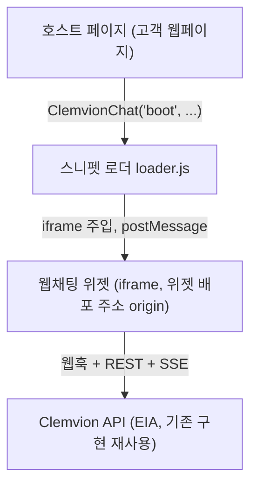

> 구현 상태: 구현됨 · 원문: `spec/7-channel-web-chat/0-architecture.md`, `spec/7-channel-web-chat/5-admin-console.md` (R4·R6 의 배포 결정 부분) · 용어: [용어 사전](../CLE-GLOSSARY.md)

## 개요

이 문서는 [웹채팅](CLE-WEBCHAT.md)의 시스템 구조를 정한다. 호스트 페이지(host page)와 스니펫 로더(`loader.js`), iframe 안의 [웹채팅 위젯](CLE-WEBCHAT-WIDGET.md), Clemvion API 의 [External Interaction API](../CLE-IX/CLE-EIA.md)(EIA)로 이어지는 네 레이어를 나누고 iframe 격리 방식과 위젯이 쓰는 EIA 표면의 매핑을 둔다.

배포 쪽으로는 위젯 배포 주소(widget CDN base)와 API 기준 주소(`apiBase`)를 배포 설정으로 주입하는 방식, 동봉 배포(co-deploy)와 버전 잠금, 두 사용 모드(Hosted iframe, BYO-UI)를 다룬다.

범위 밖 주제는 각 문서가 정한다. 제품 정의와 목표는 [웹채팅](CLE-WEBCHAT.md), 위젯 화면과 대화 상태는 [웹채팅 위젯](CLE-WEBCHAT-WIDGET.md), 설치 스크립트와 postMessage 프로토콜은 [웹채팅 SDK](CLE-WEBCHAT-SDK.md), 토큰과 위젯 세션은 [웹채팅 인증과 세션](CLE-WEBCHAT-SESSION.md), CORS·임베드 검증·남용 방어는 [웹채팅 보안](CLE-WEBCHAT-SECURITY.md), 운영자 화면은 [웹채팅 운영 콘솔](CLE-WEBCHAT-CONSOLE.md)이 맡는다. EIA 의 토큰·SSE·명령 계약은 [External Interaction API](../CLE-IX/CLE-EIA.md)와 [EIA 수신 API와 SSE](../CLE-IX/CLE-EIA-INBOUND.md)가 소유하며 여기서는 되풀이하지 않는다.

## 레이어 구조

호스트 페이지는 SDK 의 `boot` 만 부른다. 스니펫 로더가 iframe 을 주입하고 런처와 패널은 iframe 안 위젯이 그린다. 위젯은 웹훅·REST·SSE 로 EIA 를 직접 부른다.

설치 스크립트의 `<script src>` 는 `https://<widget-cdn-base>/web-chat/v1/loader.js` 이고 부팅 설정에는 `triggerEndpointPath`·`profile` 등이 들어간다([웹채팅 SDK](CLE-WEBCHAT-SDK.md)).

| 레이어 | 책임 | 격리 경계 |
|---|---|---|
| 호스트 페이지 | 고객 사이트. SDK `boot` 호출만 한다 | 호스트 origin |
| 스니펫 로더·SDK API | iframe 주입(런처는 iframe 안에서 그린다), iframe 생애주기, 호스트 페이지↔iframe 메시지 전달, 공개 JS API | 호스트 DOM 에 남기는 흔적을 최소로 |
| 웹채팅 위젯(iframe) | 채팅 UI, EIA 클라이언트(웹훅·SSE·REST), 대화 상태 머신 | 위젯 배포 주소 origin. CSS·JS·storage 격리 |
| Clemvion API | EIA 표면(기존) | API origin |

## iframe 격리

- 위젯은 호스트 전역 CSS·JS 와 완전히 격리된다. 스타일과 전역 변수가 섞이지 않는다.
- 인터랙션 토큰과 대화 내용을 호스트 스크립트에서 격리한다. 이것이 보안 경계다.
- `iframe sandbox` 와 CSP 로 권한을 줄인다. sandbox 속성 값과 `allow-same-origin` 트레이드오프는 [웹채팅 보안](CLE-WEBCHAT-SECURITY.md)이 정한다. Shadow DOM 을 기각한 이유는 [Rationale](#rationale)에 있다.

### iframe 문서는 정적 자산이다

- 로더가 iframe 을 만들지만 `src` 는 정적이고 바뀌지 않는 CDN 파일(`output:'export'` 산출물)이다. CDN 캐시가 맞으면 클라이언트가 늘어도 서버에 요청마다 부담이 생기지 않는다. 동적 렌더링이 아니다.
- `srcdoc`·`about:blank` 로 문서를 직접 만드는 방식은 기각한다. 그런 iframe 은 호스트 origin 을 물려받아 cross-origin 격리가 깨진다. 격리하려면 iframe 은 반드시 다른 origin 의 실제 `src` 여야 한다.
- 예외: [웹채팅 운영 콘솔](CLE-WEBCHAT-CONSOLE.md)의 라이브 미리보기는 cross-origin 격리가 목적이 아니다. 그래서 same-origin 동봉 위젯을 실제 `src` iframe 으로 불러온다. 여기서도 `srcdoc` 로 문서를 만드는 것은 금지다.
- 워크스페이스·트리거·외형은 문서를 워크스페이스별로 렌더링해서 넣지 않는다. 쿼리 파라미터, postMessage, 캐시할 수 있는 워크스페이스별 JSON 으로 넣는다.

## 위젯이 쓰는 EIA 표면

위젯은 중간 계층(facade)을 두지 않는 순수 외부 HTTP 소비자다. EIA 의 단일 이벤트 출구(single sink) 정책에 영향이 없다. 아래 표는 위젯 동작과 EIA 표면의 매핑만 적는다. 요청·응답·에러의 계약은 오른쪽 문서가 정한다.

| 위젯 동작 | EIA 표면 | 계약 문서 |
|---|---|---|
| 대화 시작 | `POST /api/hooks/:endpointPath` → `202`. 응답은 응답 봉투로 감싸져 `{ data: { executionId, status, interaction: { token, expiresAt, endpoints } } }` 로 온다. 위젯은 `data` 를 벗겨 읽는다([웹채팅 인증과 세션](CLE-WEBCHAT-SESSION.md)) | [External Interaction API](../CLE-IX/CLE-EIA.md) (웹훅 호출 응답 확장) |
| 실시간 이벤트 | `GET /api/external/executions/:id/stream` (SSE, `?token=`) | [EIA 수신 API와 SSE](../CLE-IX/CLE-EIA-INBOUND.md) |
| AI 메시지 | SSE `execution.ai_message` (+ `presentations[]`) | [EIA 알림 웹훅](../CLE-IX/CLE-EIA-NOTIFY.md) (페이로드) |
| 표시 메시지(버튼 없이 넘어가는 Presentation 노드) | SSE 표시 메시지 이벤트(`execution.message`, + `presentations[]`). 표시 전용 Presentation 노드가 버튼 없이 자동으로 완료할 때 나온다. AI 가 만든 텍스트가 아니라 노드가 그린 정적 표시물이며 노드 출력 형태(`{config, output}`)로 온다. 렌더 규칙은 [웹채팅 위젯](CLE-WEBCHAT-WIDGET.md) | [EIA 수신 API와 SSE](../CLE-IX/CLE-EIA-INBOUND.md), [External Interaction API](../CLE-IX/CLE-EIA.md) (도입 결정) |
| 입력 대기 진입 | SSE `execution.waiting_for_input`. EIA 밖으로 나가는 `interactionType` 은 `form`·`buttons`·`ai_conversation` 세 값이다. `render_form` 블로킹은 `ai_conversation` 으로 합쳐 나간다 | [EIA 알림 웹훅](../CLE-IX/CLE-EIA-NOTIFY.md) (페이로드), [인터랙션 타입 레지스트리](../CLE-IX/CLE-IX-TYPES.md) |
| AI 폼 렌더(`render_form` 블로킹) | `ai_conversation` 페이로드의 `conversationConfig.pendingFormToolCall.formConfig` 를 그리고 `submit_form` 으로 제출한다. 위젯은 `ai_conversation` 과 같은 경로로 처리한다. 내부 대기 표면 `ai_form_render` 와의 매핑은 [인터랙션 타입 레지스트리](../CLE-IX/CLE-IX-TYPES.md) | [AI 에이전트 노드](../CLE-NODE-AI/CLE-NODE-AGENT.md) |
| 사용자 메시지 | `POST .../interact { command: "submit_message" }` | [EIA 수신 API와 SSE](../CLE-IX/CLE-EIA-INBOUND.md) |
| 버튼 탭 | `POST .../interact { command: "click_button" }` | [EIA 수신 API와 SSE](../CLE-IX/CLE-EIA-INBOUND.md) |
| Form 제출 | `POST .../interact { command: "submit_form" }` | [EIA 수신 API와 SSE](../CLE-IX/CLE-EIA-INBOUND.md) |
| 대화 종료(AI 대화 대기 중) | `POST .../interact { command: "end_conversation" }` | [EIA 수신 API와 SSE](../CLE-IX/CLE-EIA-INBOUND.md) |
| 대화 종료(그 밖)·새 대화 전 이전 실행 정리 | `POST .../cancel`. 어느 경우에 보내는지는 [웹채팅 위젯](CLE-WEBCHAT-WIDGET.md) | [EIA 수신 API와 SSE](../CLE-IX/CLE-EIA-INBOUND.md) |
| 재연결 복구 | SSE `Last-Event-Id` (SSE 재전송 버퍼 5분) / `GET .../:id` | [EIA 수신 API와 SSE](../CLE-IX/CLE-EIA-INBOUND.md) |
| 토큰 갱신 | `POST .../refresh-token` (실행 단위 토큰) | [EIA 수신 API와 SSE](../CLE-IX/CLE-EIA-INBOUND.md) |

- 위젯은 EIA 인바운드 인터랙션(REST+SSE)만 쓴다. [EIA 알림 웹훅](../CLE-IX/CLE-EIA-NOTIFY.md)은 쓰지 않고 SSE 를 항상 연다.
- 마지막 턴 재시도(`retry_last_turn`)는 지원하지 않는다. EIA 외부 표면에 노출되지 않는 내부 UI 전용 명령이다(원본: EIA-IN-02). 위젯 v1 의 AI 턴 재시도 버튼은 비목표다.
- **SSE wire 필드 이름**: SSE 스트림은 내부 fanout 이벤트 봉투를 그대로 보낸다. 프론트엔드 WebSocket store 와 같은 형식이다. 그래서 `waiting_for_input` 은 `node.id`·`context.*` 가 아니라 다음 필드로 도착한다.
  - 대기 노드 ID(`waitingNodeId`). `submit_message` 의 `nodeId` 로 그대로 쓴다.
  - 최상위 `interactionType`.
  - `nodeOutput.conversationConfig`(`ai_conversation`), `buttonConfig`(`buttons`), `nodeOutput.formConfig`(`form`, 없으면 `nodeOutput` 자체).
  - 최상위 `conversationThread`.
  - `ai_message` 의 어시스턴트 텍스트 필드는 `text` 가 아니라 `message` 다.
  - 위젯 파서의 단일 기준은 `codebase/channel-web-chat/src/lib/eia-events.ts` 다. EIA 알림 웹훅 문서는 추상 표기를, [WebSocket 이벤트와 명령](../CLE-API/CLE-API-WS-EVENTS.md)은 논리 구조 표기를 쓰며 두 문서 모두 실제 wire 필드와 다르다는 점을 적어 둔다.

## 서버 쪽 구성 요소

위젯은 새 백엔드 트리거 유형이나 중간 계층을 추가하지 않는다. 다만 웹채팅을 위해 백엔드에 다음 구성 요소가 있다. 각 규칙은 링크한 문서가 정한다. 웹채팅 서버 쪽 구성 요소의 목록은 이 표가 기준이고, [채팅 채널 데이터와 흐름](../CLE-CHAT/CLE-CHAT-DATA.md) 같은 다른 문서는 이 표를 가리킨다. 웹채팅은 채팅 채널 모듈을 거치지 않는다.

| 구성 요소 | 하는 일 | 규칙 |
|---|---|---|
| 임베드 설정 조회(`GET /api/hooks/:endpointPath/embed-config`, `EmbedConfigService`) | 임베드 허용 도메인과 강제 여부를 공개로 돌려준다 | [웹채팅 보안](CLE-WEBCHAT-SECURITY.md) |
| 경로별 CORS 처리(`webChatCorsDelegate`, `web-chat-cors.ts`) | `/api/hooks/*` 와 `/api/external/*` 에 다른 CORS 정책을 적용한다 | [웹채팅 보안](CLE-WEBCHAT-SECURITY.md) |
| 공개 웹훅 가드(`PublicWebhookThrottleGuard`) | 공개 웹훅의 IP 호출 수와 본문 크기를 제한한다. 웹채팅만이 아니라 모든 공개 웹훅에 걸린다 | [웹채팅 보안](CLE-WEBCHAT-SECURITY.md), [웹훅](../CLE-TRIG/CLE-TRIG-WEBHOOK.md) |
| 유휴 실행 회수(`WebChatIdleReaperService`) | 버려진 공개 위젯 실행을 토큰이 모두 만료된 뒤 취소한다. 이 경로만 실행 상태를 바꾼다 | [External Interaction API](../CLE-IX/CLE-EIA.md), [웹채팅 인증과 세션](CLE-WEBCHAT-SESSION.md) |

## 배포와 도메인 설정

Clemvion 은 SaaS 와 셀프호스팅을 함께 한다. 그래서 이 문서의 도메인은 고정값이 아니라 배포 환경 설정이다. `<widget-cdn-base>`·`<api-base>` 는 자리 표시자이고 실제 값은 배포(env·config)로 주입한다.

| 자리 표시자 | 뜻 | 주입 방식 |
|---|---|---|
| `<api-base>` | EIA 를 서빙하는 API 의 기준 주소. 경로 포함 여부는 정의가 갈린다. [웹채팅 SDK 미결 사항](CLE-WEBCHAT-SDK.md#미결-사항) 참조 | SDK `boot.apiBase` 로 런타임에 주입한다. 클라이언트가 빌드 없이 지정한다 |
| `<widget-cdn-base>` | 위젯 배포 주소. 위젯과 `loader.js` 를 서빙하는 origin 이며 설치 스크립트의 `<script src>` 와 iframe `src` 의 기준이다 | 기본값은 배포 자신의 origin 이다(동봉 배포). 셀프호스트는 추가 인프라 없이 same-origin 이 된다. SaaS 나 별도 엣지 CDN 을 쓸 때만 `NEXT_PUBLIC_WIDGET_CDN_BASE` 로 바꾼다. 바꿔도 같은 릴리스 버전 번들을 쓴다 |

위젯 배포 주소를 받는 env 키는 둘이다. 각 앱이 같은 위젯 origin 을 주입한다.

| env 키 | 앱 | 신규·기존 | 용도 |
|---|---|---|---|
| `NEXT_PUBLIC_WIDGET_CDN_BASE` | 프론트엔드(`codebase/frontend`) | 신규(선택) | 운영 콘솔이 설치 스크립트의 `loader.js` `src` 와 라이브 미리보기 iframe 기준 주소로 쓴다. 설정하지 않으면 배포 자신의 origin 을 쓴다([웹채팅 운영 콘솔](CLE-WEBCHAT-CONSOLE.md)) |
| `WEB_CHAT_WIDGET_ORIGINS` | 백엔드(`codebase/backend`) | 기존(`main.ts`·`web-chat-cors.ts`) | `/api/external/*` CORS 에서 항상 허용하는 위젯 origin 목록. 위젯 iframe origin 의 EIA 호출을 허용한다([웹채팅 보안](CLE-WEBCHAT-SECURITY.md)) |

> **두 값이 맞지 않을 때**: 위젯 iframe origin 이 `WEB_CHAT_WIDGET_ORIGINS` 에 없으면 위젯의 `/api/external/*` 호출이 CORS 에서 거부된다. 화면에 에러가 드러나지 않는 실패다. 두 경우에 이 목록을 채워야 한다. 하나는 `NEXT_PUBLIC_WIDGET_CDN_BASE` 로 엣지 CDN 을 쓸 때이고 다른 하나는 동봉 배포라도 프론트엔드와 API 를 다른 도메인으로 나눠 배포할 때다. 프론트엔드와 API 가 한 origin 이면 CORS 설정이 필요 없다. 두 값을 맞추는 것은 배포 운영자의 책임이고 검증은 배포 설정(런타임 config)에서 한다. 자세한 CORS 동작은 [웹채팅 보안](CLE-WEBCHAT-SECURITY.md)이 정한다.

### 동봉 배포와 버전 잠금

- **버전 전략**: `loader.js` 와 위젯은 `/web-chat/v1/` major 버전 경로에 고정한 불변 자산이다. 마이너·패치는 떠다니는 "latest" 가 아니라 제품과 같은 릴리스로 동봉 배포돼 배포 단위로 잠긴다. 그래서 셀프호스트의 위젯 버전은 그 배포의 백엔드·EIA 버전과 항상 같다.
- **동봉 방식**: 프론트엔드의 `build:widget`(`copy-widget.mjs`)이 `channel-web-chat`(`NEXT_PUBLIC_BASE_PATH=/_widget/web-chat/v1/app`)과 `@workflow/web-chat` 로더를 빌드해 `codebase/frontend/public/_widget/web-chat/v1/` 로 복사한다. 배포 origin 에서 same-origin 으로 서빙된다.
- **`build:widget` 실행 위치**: 프론트엔드 Dockerfile 의 builder 스테이지에서 이미지 안에서 끝낸다. builder 가 두 위젯 패키지의 소스와 의존성을 COPY·설치하고 `next build` 직전에 `build:widget` 을 돌려 `public/_widget` 을 만든다. standalone runner 의 `COPY .../public` 이 그것을 이미지에 싣는다. 외부 CI(Jenkins 등)는 `docker build` 만 하면 된다. 호스트에서 `build:widget` 을 먼저 돌릴 필요가 없고 빌드 노드에 pnpm 이 없어도 된다. 이 단계가 빠지면 위젯 번들이 없어 미리보기와 설치 스크립트가 404 가 된다.
- 그래서 위젯 배포 주소의 기본값이 배포 자신의 origin 이 되고 외부 위젯 CDN 호스팅은 선행 조건이 아니다. SaaS 엣지 CDN 은 선택 최적화다.
- 운영 콘솔 라이브 미리보기는 이 동봉 위젯을 same-origin iframe 으로 불러온다. 버전이 일치하고 외부 의존이 없다.
- **프론트엔드 라우팅 전제(필수)**: 위젯을 프론트엔드(Next) `public/_widget/...` 에서 same-origin 으로 서빙할 때 아래 두 처리가 없으면 미리보기와 설치 스크립트가 깨진다.
  1. 인증 미들웨어(`proxy.ts`) 예외. `/_widget/**` 는 공개 정적 번들이므로 prefix 로 인증 리다이렉트에서 뺀다. 위젯 진입 경로 `…/app/` 는 점이 없는 디렉터리 경로라 `includes(".")` 정적 예외에 걸리지 않고 `/login` 으로 튕긴다.
  2. 디렉터리→`index.html` rewrite. Next `public/` 서빙은 디렉터리 index 로 자동 폴백하지 않는다. 그래서 위젯 진입 `…/web-chat/v1/app[/]` 를 `…/app/index.html` 로 `next.config rewrites` 한다. 없으면 404 다. 외부 위젯 CDN(`NEXT_PUBLIC_WIDGET_CDN_BASE`)을 쓰면 CDN 의 디렉터리 index 폴백이 처리하므로 해당하지 않는다.
- npm 패키지 이름은 `@workflow/web-chat` 이다. `@workflow/sdk` 와 같은 scope 다([웹채팅 SDK](CLE-WEBCHAT-SDK.md)).
- [웹채팅 보안](CLE-WEBCHAT-SECURITY.md)의 "위젯 배포 주소 항상 허용" 도 이 위젯 배포 주소를 가리키는 배포 설정값이다. 로더와 위젯은 빌드 때 env 로 origin 상수를 받고 백엔드는 워크스페이스와 무관한 고정값을 런타임 config 로 받는다. 백엔드 런타임 허용 목록의 env 키·파싱·`.env.example` 같은 구현 세부는 [웹채팅 보안](CLE-WEBCHAT-SECURITY.md)이 정한다.

## 사용 모드

같은 SDK 라도 EIA 호출 코드가 어디서 도는지(요청 `Origin`)에 따라 사용 모드(Hosted iframe, BYO-UI)가 나뉜다. 모드에 따라 CORS 설계가 달라진다. 원문은 두 모드를 M1·M2 로 불렀다.

| 모드 | 설명 | API 호출 Origin | 격리 책임 |
|---|---|---|---|
| Hosted iframe (주력) | `boot()` 가 위젯을 iframe 으로 불러온다. EIA 호출은 iframe 안(위젯 배포 주소 origin)에서 일어난다 | 위젯 배포 주소(워크스페이스와 무관한 고정값) | Clemvion (iframe 격리) |
| BYO-UI (headless) | 개발자가 EIA 를 부르는 클라이언트로 자체 UI 를 만들어 자기 도메인에서 서빙한다 | 고객 도메인(워크스페이스마다 다름) | 개발자 |

두 모드 모두 같은 EIA 표면과 실행 단위 토큰([웹채팅 인증과 세션](CLE-WEBCHAT-SESSION.md))을 쓴다. 차이는 렌더링 위치와 요청 Origin 뿐이다.

### Hosted iframe 모드

`boot()` 는 호스트 body 에 iframe 하나만 넣고 그 안에 정적 위젯 문서를 불러온다. 런처(접힌 상태)와 패널은 모두 iframe 안 위젯이 그린다. iframe 크기를 바꿔 두 상태를 오간다. EIA 웹훅·SSE·REST 호출은 iframe 안(위젯 배포 주소 origin)에서 일어나므로 호출 Origin 은 워크스페이스와 무관한 하나의 고정값이다. v1 의 주력 산출물이다.

### 모드와 CORS

Hosted iframe 모드는 위젯 배포 주소 하나(항상 허용)만 쓰고 BYO-UI 모드는 고객 도메인이라 워크스페이스 단위 임베드 허용 도메인(`interactionAllowedOrigins`)이 필요하다. 자세한 규칙은 [웹채팅 보안](CLE-WEBCHAT-SECURITY.md)에 있다.

### BYO-UI 모드

개발자는 위젯 대신 EIA 클라이언트로 완전한 맞춤 채팅 UI 를 만들고 자기 도메인에서 서빙한다. 호출 Origin 이 고객 도메인이므로 워크스페이스 단위 동적 CORS 가 필요하다. UI 와 격리 책임은 개발자에게 있다. 인증·토큰(실행 단위)·EIA 표면은 Hosted iframe 모드와 같다. v1 의 주력은 Hosted iframe 모드다.

이 모드의 클라이언트를 어느 패키지가 제공하는지는 정의가 갈린다. 원문 한쪽은 웹채팅 SDK 가 headless client 를 노출해 이 모드를 가능하게 한다고 하고 다른 쪽은 EIA 클라이언트 SDK(`@workflow/sdk`)를 직접 쓰는 경로로 이미 충족된다고 한다. [웹채팅 SDK 미결 사항](CLE-WEBCHAT-SDK.md#미결-사항) 참조.

## 구현 위치

- `codebase/channel-web-chat/**` (웹채팅 위젯)
- `codebase/packages/web-chat-sdk/**` (웹채팅 SDK·스니펫 로더)

## Rationale

### iframe 격리를 쓴다 (Shadow DOM 인라인 마운트 기각)

iframe 은 CSS·JS·전역 변수·storage·쿠키를 완전히 나누고 토큰과 대화를 호스트 스크립트에서 격리한다. Shadow DOM 은 스타일만 격리하고 JS 전역과 서드파티 스크립트 보호가 약하다. Next.js 정적 SPA 를 호스트 DOM 에 직접 마운트하면 스타일·polyfill·React 버전이 충돌할 위험이 크다. postMessage 브리지와 초기 로드라는 비용은 좁은 프로토콜로 감당한다. 널리 쓰이는 임베드형 위젯도 iframe 을 쓴다.

### 클라이언트 소비자로만 둔다 (EIA 변경·새 트리거 유형·중간 계층 없음)

위젯은 외부 브라우저에서 순수 HTTP 로만 EIA 를 부르는 클라이언트다. EIA 사용 시나리오 가운데 "외부 SaaS 가 내장 채팅 위젯 호스팅(인바운드 전용)" 이 이 경우다. 서버 쪽 어댑터로 내부 호출을 쓰는 [채팅 채널](../CLE-CHAT/CLE-CHAT-CORE.md)과 대칭이다. 백엔드 변경은 CORS 와 남용 방어([웹채팅 보안](CLE-WEBCHAT-SECURITY.md))로 줄이고 EIA 핵심 표면(웹훅·REST·SSE·토큰)은 바꾸지 않는다. EIA 의 단일 이벤트 출구와 중간 계층에 새 listener 를 붙이지 않는다.

### 런처와 패널을 한 iframe 에 둔다 (v1)

- (A) 단일 iframe(크기 전환): 문서·브리지·상태가 하나라 구현과 동기화가 단순하고 호스트 흔적이 가장 작다. 대신 페이지를 열 때마다 위젯을 불러온다(패널 안에서 lazy 로 줄인다). 접힌 상태에서는 iframe 을 런처 크기로 정확히 줄여야 호스트 클릭을 가로채지 않는다.
- (B) 이중 iframe(런처 따로): 런처만 가벼워 패널을 처음 열 때 불러올 수 있어 초기 로드가 가장 좋고 pointer-event 경계가 깔끔하다. 대신 런처와 패널의 상태를 맞춰야 해서 복잡하다.

v1 은 구현 단순성을 먼저 봐 (A)를 쓴다. 초기 로드 무게가 측정에서 병목으로 드러나면 (B)로 바꾼다. [웹채팅 SDK](CLE-WEBCHAT-SDK.md)의 브리지는 양쪽과 호환되게 설계했다.

### iframe 문서는 정적 cross-origin 자산이고 임베드 제어는 부팅 때 한다

"클라이언트가 많아지면 워크스페이스별 문서를 서버에서 주는 부담이 크다" 는 우려는 맞다. 그래서 동적 문서 렌더링은 쓰지 않는다. 위젯은 `output:'export'` 정적 산출물이라 CDN 정적 파일로 나가고 요청마다 서버 렌더링이 없다. `srcdoc`·`about:blank` 로 문서를 만들면 iframe 이 호스트 origin 을 물려받아 격리가 무너지므로 기각한다. "로더가 클라이언트에서 iframe 을 만들고 문서는 정적 cross-origin 자산" 으로 두면 동적 서버 렌더링을 피하면서 격리도 지킨다. 임베드 제어는 문서 CSP 가 아니라 부팅 때 호스트 origin 을 비교하는 임베드 검증으로 옮겼다([웹채팅 보안](CLE-WEBCHAT-SECURITY.md)). CORS 도 워크스페이스별 동적 처리가 필요 없는 경계로 둔다. Hosted iframe 모드는 위젯 배포 주소 하나이고 BYO-UI 모드만 워크스페이스 허용 목록을 쓴다.

**예외: 운영 콘솔 미리보기의 same-origin iframe.** 위 기각은 고객 사이트 임베드(외부 origin 에서 위젯을 호스트와 격리)에 대한 것이다. 운영 콘솔의 라이브 미리보기는 사정이 다르다. 우리 앱이 우리 위젯을 미리 보는 것이라 cross-origin 격리가 목적이 아니다. 셀프호스팅과 여러 버전이 섞이는 환경에서 버전을 맞추고 외부 의존을 없애는 것이 목적이다. 그래서 미리보기는 동봉 위젯을 same-origin 실제 `src` iframe 으로 불러온다(`srcdoc` 아님). 위젯 CSS·JS 격리는 iframe 으로 유지하고 외부 CDN 요청은 없으며 그 배포 버전과 항상 맞는다. 고객 임베드 경로(로더 + cross-origin iframe)는 그대로다. 미리보기 쪽 결정은 [웹채팅 운영 콘솔](CLE-WEBCHAT-CONSOLE.md)에 있다.

### 위젯을 제품과 동봉 배포한다 (외부 CDN fetch 기각, 결정 2026-06-23)

셀프호스팅이 가능하고 배포마다 버전이 다르다. 위젯을 외부(SaaS) CDN 에서 받아 오면 그 배포의 백엔드·EIA 버전과 어긋나고 셀프호스터가 따로 CDN 을 운영해야 한다. 그래서 위젯을 제품과 같은 릴리스로 동봉 배포해(프론트엔드 workspace 의존 + `/_widget/web-chat/v1/` 서빙) 버전을 배포 단위로 잠근다. 동봉하면 위젯 배포 주소의 기본값이 배포 자신의 origin 이 되어 외부 호스팅이 선행 조건에서 빠지고 고객 설치 스크립트도 셀프호스터 자신의 버전을 가리킨다. 외부 CDN fetch 는 버전 불일치와 셀프호스트 CDN 운영 부담 때문에 기각했다.

### 위젯 배포 주소 env 를 API 주소와 따로 둔다

기존 `NEXT_PUBLIC_API_URL`·`NEXT_PUBLIC_WEBHOOK_BASE_URL` 은 API·웹훅 origin 을 가리킨다. 위젯 자산은 다른 origin 에서 서빙될 수 있으므로 키를 따로 둔다. 한 변수로 합치면 두 origin 이 다른 배포에서 깨진다. 동봉 배포로 기본값이 배포 자신의 origin 이 되었으므로 `NEXT_PUBLIC_WIDGET_CDN_BASE` 는 선택 키(SaaS 엣지 CDN 용)다. 백엔드 CORS 키 `WEB_CHAT_WIDGET_ORIGINS` 는 기존 키이며 위젯 origin 이 배포 origin 과 달라질 때 그 origin 을 넣는다.
