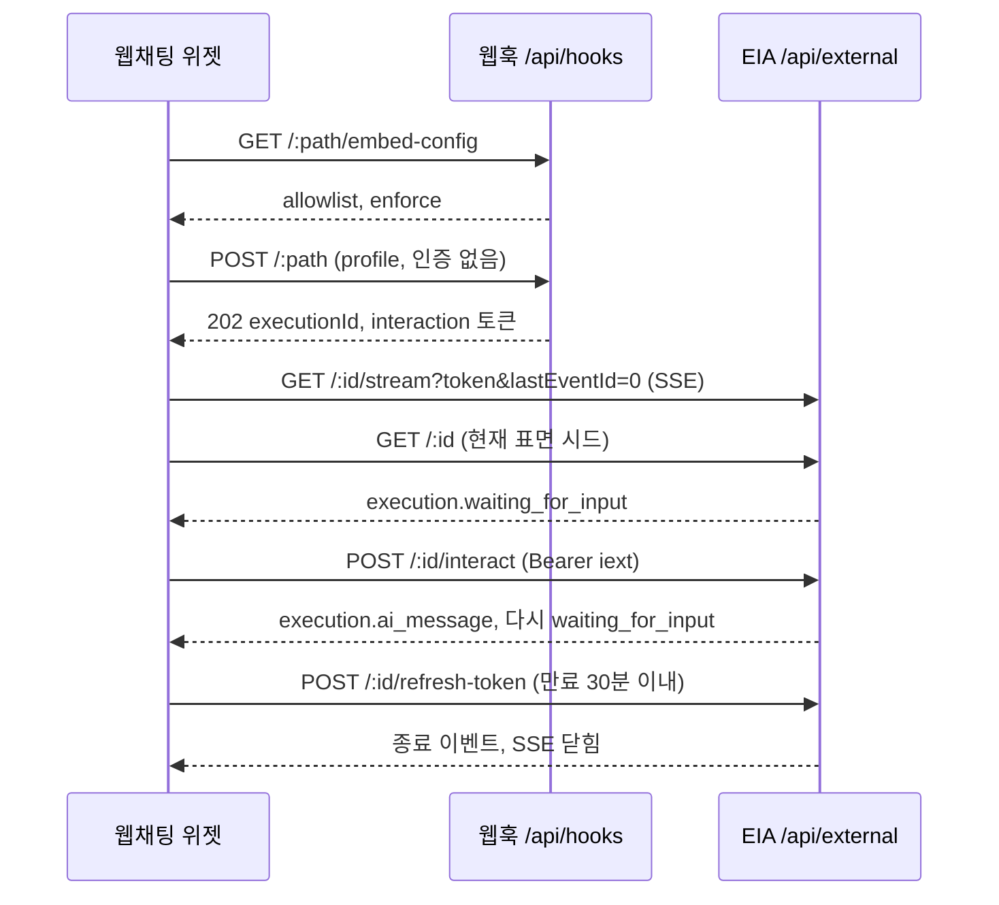

> 구현 상태: 구현됨 · 원문: `spec/7-channel-web-chat/3-auth-session.md`, `spec/7-channel-web-chat/5-admin-console.md` (§6 첫 노드 race 보정) · 용어: [용어 사전](../CLE-GLOSSARY.md)

## 개요

이 문서는 공개 임베드 위젯의 인증과 세션 모델을 정한다. 위젯이 붙는 트리거는 인증 없는 공개 웹훅(public webhook, `auth_config_id IS NULL`)이다. 대화는 웹훅 `202` 응답에 함께 오는 실행 단위 토큰(per_execution token, `iext_*`)으로만 진행하고 클라이언트에 오래 사는 비밀을 두지 않는다.

다루는 것은 세션 시퀀스(부팅 → 시작 → SSE → 명령 → 갱신 → 종료), 첫 노드를 놓치지 않는 시작 보정, 위젯 세션(widget session)을 sessionStorage 에 두고 새로고침 때 복원하는 절차, 버려진 실행의 유휴 실행 회수다. 토큰 저장소 선택, 실행 단위 토큰 채택, 재로드 `401` 처리, 표면 되감기 방어, 위젯 세션의 발급 주소 바인딩의 근거는 Rationale 에 있다.

토큰 발급·검증·갱신·폐기의 서버 규칙은 [External Interaction API](../CLE-IX/CLE-EIA.md), 명령·SSE·상태 조회·토큰 갱신 엔드포인트 계약은 [EIA 수신 API와 SSE](../CLE-IX/CLE-EIA-INBOUND.md)가 정한다. 이 문서는 위젯이 그 계약을 어떤 순서로 쓰는지만 정한다. 위젯 대화 상태와 대화 종료·새 대화는 [웹채팅 위젯](CLE-WEBCHAT-WIDGET.md), 임베드 검증과 남용 방어는 [웹채팅 보안](CLE-WEBCHAT-SECURITY.md)에 있다.

## 요구사항

- REQ-WCSESS-001 WHEN 웹채팅 위젯이 붙는 트리거를 두면 THE SYSTEM SHALL 웹훅 인증을 두지 않는다(`auth_config_id IS NULL`).
- REQ-WCSESS-002 WHEN 위젯이 대화를 진행하면 THE SYSTEM SHALL 실행 단위 토큰(`iext_*`)만 쓴다.
- REQ-WCSESS-003 WHEN 위젯 인증 방식을 정하면 THE SYSTEM SHALL 트리거 단위 토큰(`itk_*`)을 지원하지 않는다.
- REQ-WCSESS-004 WHEN 위젯이 부팅되면 THE SYSTEM SHALL 대화를 시작하기 전에 `GET /api/hooks/:path/embed-config` 로 임베드 검증을 한다.
- REQ-WCSESS-005 WHEN 패널이 열리면 THE SYSTEM SHALL `POST /api/hooks/:path { profile }` 를 인증 없이 보낸다.
- REQ-WCSESS-006 WHEN 웹훅 시작·상태 조회·토큰 갱신 응답을 받으면 THE SYSTEM SHALL 응답 봉투의 `data` 를 벗겨 읽는다.
- REQ-WCSESS-007 IF REST 응답에 `data` 키가 없으면 THE SYSTEM SHALL 본문을 그대로 쓴다.
- REQ-WCSESS-008 WHEN 웹훅이 `202` 로 실행 ID 와 토큰을 주면 THE SYSTEM SHALL `GET .../:id/stream?token=iext_*` 로 SSE 를 연다.
- REQ-WCSESS-009 WHEN 시작 직후 처음 SSE 를 열면 THE SYSTEM SHALL `lastEventId=0` 으로 열어 SSE 재전송 버퍼의 seq 1 이상 이벤트를 모두 다시 받는다.
- REQ-WCSESS-010 WHEN 시작이나 복원 직후면 THE SYSTEM SHALL `GET /api/external/executions/:id` 로 현재 표면을 시드한다.
- REQ-WCSESS-011 WHEN 사용자가 입력하거나 선택하면 THE SYSTEM SHALL `Authorization: Bearer iext_*` 헤더로 `POST .../:id/interact` 를 보낸다.
- REQ-WCSESS-012 WHILE 대화가 살아 있고 토큰 만료가 30분 이내인 동안 THE SYSTEM SHALL `POST .../:id/refresh-token` 으로 토큰을 갱신한다.
- REQ-WCSESS-013 IF 주기 토큰 갱신이 실패하면 THE SYSTEM SHALL 지수 백오프로 다시 시도한다.
- REQ-WCSESS-014 WHEN 실행이 끝나면 THE SYSTEM SHALL SSE 를 닫고 `[ended]` 로 바꾼다.
- REQ-WCSESS-015 WHEN 실행 ID 와 토큰을 받으면 THE SYSTEM SHALL `{executionId, token, expiresAt, endpoints, apiBase}` 를 iframe origin 의 sessionStorage 에 위젯 세션으로 저장한다.
- REQ-WCSESS-016 WHEN 위젯이 다시 로드되면 THE SYSTEM SHALL sessionStorage 의 위젯 세션을 읽고 없으면 새로 시작(`collapsed`)한다.
- REQ-WCSESS-017 IF 저장된 위젯 세션의 `apiBase` 가 현재 `apiBase` 와 다르거나 기록돼 있지 않으면 THE SYSTEM SHALL 그 세션을 버리고 새로 시작한다.
- REQ-WCSESS-018 WHEN 위젯 세션의 `apiBase` 를 비교하면 THE SYSTEM SHALL 끝의 슬래시만 정규화하고 경로는 보존한다.
- REQ-WCSESS-019 WHEN 재로드 상태 조회가 `200` 과 진행 중 상태를 돌려주면 THE SYSTEM SHALL SSE 를 `Last-Event-Id` 로 다시 연결해 복원한다.
- REQ-WCSESS-020 WHEN 재로드 상태 조회 결과가 `waiting_for_input` 이면 THE SYSTEM SHALL `context` 로 현재 표면을, `context.conversationThread` 로 과거 대화 전체를 시드한다.
- REQ-WCSESS-021 WHEN 재로드 상태 조회가 `200` 과 종료 상태(`completed`·`failed`·`cancelled`)를 돌려주면 THE SYSTEM SHALL 위젯 세션을 지우고 `[ended]` 로 바꾸며 호스트에 `conversationEnded` 를 알린다.
- REQ-WCSESS-022 IF 재로드 상태 조회로 종료가 확정되면 THE SYSTEM SHALL SSE 를 다시 열지 않고 토큰 갱신도 예약하지 않는다.
- REQ-WCSESS-023 WHEN 재로드 상태 조회가 `404 EXECUTION_NOT_FOUND` 면 THE SYSTEM SHALL 위젯 세션을 지우고 `[ended]` 로 바꾼다.
- REQ-WCSESS-024 WHEN 재로드 상태 조회가 `401` 이면 THE SYSTEM SHALL `POST .../refresh-token` 을 한 번 시도한다.
- REQ-WCSESS-025 WHEN 그 한 번의 갱신이 성공하면 THE SYSTEM SHALL SSE 를 다시 연결해 복원한다.
- REQ-WCSESS-026 IF 그 한 번의 갱신이 다시 `401` 이나 `410` 이면 THE SYSTEM SHALL 종료로 확정하고 위젯 세션을 지운다.
- REQ-WCSESS-027 IF 그 한 번의 갱신이 네트워크 오류나 5xx 로 실패하면 THE SYSTEM SHALL 위젯 세션을 유지하고 SSE 는 열지 않는다.
- REQ-WCSESS-028 WHILE SSE 를 미뤄 둔 동안 THE SYSTEM SHALL 주기 토큰 갱신이 성공하는 때에 SSE 를 연다.
- REQ-WCSESS-029 IF 재로드 상태 조회가 그 밖의 상태나 에러로 끝나면 THE SYSTEM SHALL 경고만 남기고 SSE 로 진행한다.
- REQ-WCSESS-030 WHEN 명령 응답이 `410 Gone` 이면 THE SYSTEM SHALL 위젯 세션을 바로 지운다.
- REQ-WCSESS-031 WHEN SSE 가 이미 열린 뒤에 상태 조회 스냅샷이 도착하면 THE SYSTEM SHALL 스냅샷으로 표면을 되감지 않는다.
- REQ-WCSESS-032 IF 대체된 부팅 시도가 종료를 발견하면 THE SYSTEM SHALL 그 종료를 버리지 않고 확정한다.
- REQ-WCSESS-033 WHEN 스트림을 열려 하면 THE SYSTEM SHALL 이미 열린 스트림이 있는지 다시 확인하고 있으면 새 연결을 만들지 않는다.
- REQ-WCSESS-034 WHEN 버퍼 만료로 자기 스트림의 표면을 다시 맞추면 THE SYSTEM SHALL 스트림이 열려 있어도 표면을 다시 그린다.

## 공개 웹훅

위젯이 붙는 트리거는 누구나 부를 수 있는 공개 챗봇이다. 그래서 `POST /api/hooks/:endpointPath` 트리거를 인증 없음(`auth_config_id IS NULL`)으로 둔다([웹훅](../CLE-TRIG/CLE-TRIG-WEBHOOK.md)). 인증은 인증 설정(AuthConfig) FK 모델로 정하며 예전의 inline `authType` 필드는 없다.

웹채팅 트리거의 경로(UUID)는 설치 스크립트에 그대로 들어가 호스트 페이지에 공개된다. 경로 값 자체는 추측할 수 없는 CSPRNG v4 UUID 로 만든다([웹훅](../CLE-TRIG/CLE-TRIG-WEBHOOK.md)). 이 공개가 일반 공개 웹훅에서 경로를 비밀 키로 다루는 규칙과 어떤 관계인지는 정의가 갈린다. [미결 사항](#미결-사항) 참조.

남용 방어는 인증이 아니라 호출 수 제한, origin 검증, 워크플로우 쪽 가드로 한다([웹채팅 보안](CLE-WEBCHAT-SECURITY.md)).

## 토큰 전략

- 위젯은 실행 단위 토큰만 쓴다. 웹훅 `202` 응답이 단명 `iext_*` 토큰을 함께 주므로([External Interaction API](../CLE-IX/CLE-EIA.md)) 위젯은 공개 경로만 알면 되고 클라이언트에 오래 사는 비밀을 넣지 않는다. 대화가 끝나면 토큰이 자동으로 무효가 된다.
- 트리거 단위 토큰(`itk_*`, 영구)은 지원하지 않는다. 영구 토큰을 설치 스크립트나 번들에 드러내지 않기 위해서다. 부팅 설정에 인증 토큰 필드를 두지 않는다([웹채팅 SDK](CLE-WEBCHAT-SDK.md)).
- (향후) 사용자별 여러 대화 목록: 실행 단위 토큰은 "대화 하나 = 실행 하나" 모델이라 여러 대화를 목록으로 보이려면 따로 설계해야 한다. 사용자 식별과 사용자별 실행·대화 목록 조회 API 가 먼저 있어야 하는데 지금 EIA 에는 없다. v1 비목표다.

## 세션 시퀀스

위젯이 EIA 를 쓰는 순서다. 표면별 매핑은 [웹채팅 구조](CLE-WEBCHAT-ARCH.md)에 있다.

0. (부팅) 위젯이 `GET /api/hooks/:path/embed-config` 로 `{ data: { allowlist, enforce } }` 를 조회하고 `data` 를 벗겨 호스트 origin 을 비교한다. 맞지 않으면 위젯은 `[blocked]` 가 되고 시작하지 않는다. 허용 목록이 비었거나 `enforce=false` 면 통과한다(fail-open). 자세한 규칙은 [웹채팅 보안](CLE-WEBCHAT-SECURITY.md).
1. 패널이 열리면(런처 클릭) 위젯이 `POST /api/hooks/:path { profile }` 를 보낸다. 인증이 없고 `firstMessage` 를 싣지 않는다([웹채팅 위젯](CLE-WEBCHAT-WIDGET.md)).
2. API 가 `202 { data: { executionId, status: "pending", interaction: { token: iext_*, expiresAt, endpoints } } }` 로 응답한다. 전역 `TransformInterceptor` 가 모든 성공 응답을 `{ data }` 응답 봉투로 감싸므로 위젯은 `data` 를 벗겨 읽는다.
3. 위젯이 `GET .../:id/stream?token=iext_*` 로 SSE 를 연다. 이어서 아래 [첫 노드 보정](#첫-노드-보정)을 한다.
4. SSE `execution.waiting_for_input` 이 오면 `interactionType` 별로 첫 표면을 그린다. `ai_conversation` 이면 입력창, `buttons`·carousel 이면 선택지, `form` 이면 폼이다.
5. 사용자가 입력하거나 선택하면 `POST .../:id/interact { command: submit_message|click_button|submit_form, ... }` 를 `Authorization: Bearer iext_*` 로 보낸다.
6. SSE `execution.ai_message`(+ `presentations`)가 오면 말풍선을 그리고 다시 `waiting_for_input` 을 기다린다.
7. 만료가 30분 이내이고 대화가 살아 있으면 `POST .../:id/refresh-token` 으로 토큰을 갱신한다. 갱신이 실패하면 지수 백오프로 다시 시도한다.
8. 종료나 `completed` 가 오면 SSE 를 닫는다. 토큰은 무효가 되고 위젯은 `[ended]` 가 된다.

새로고침 뒤에도 대화를 잇도록 실행 ID 와 단명 토큰을 iframe origin 의 sessionStorage 에 둔다. 같은 탭의 새로고침은 유지되고 탭을 닫으면 자동으로 지워진다. 절차는 [재로드 복원](#재로드-복원)에 있다. v1 사용자는 익명이다.

### 첫 노드 보정

시작(`POST /api/hooks`, `202` 뒤 비동기 실행) 직후 빠른 첫 노드(buttons·carousel)의 `waiting_for_input` 이 위젯의 SSE 구독보다 먼저 나올 수 있다. 첫 노드가 바로 도달하면 거의 항상 그렇다. 위젯은 두 가지로 보정한다.

1. 처음 여는 스트림을 `lastEventId=0` 으로 열어 SSE 재전송 버퍼(5분)에서 놓친 이벤트(seq 1 이상)를 모두 다시 받는다([EIA 수신 API와 SSE](../CLE-IX/CLE-EIA-INBOUND.md)).
2. 시작이나 복원 직후 `GET /api/external/executions/:id` 로 현재 표면을 시드한다. 상태 조회의 `context` 는 SSE wire 형식과 같아서 위젯이 `parseWaitingForInput` 을 그대로 쓴다.

보정하지 않으면 SSE 가 heartbeat 만 받아 첫 노드(캐러셀 버튼)가 그려지지 않는다. 운영 콘솔 미리보기에서 찾은 문제지만 모든 고객 임베드에 적용되는 위젯 동작이다.

## 재로드 복원

현재 위젯(`use-widget.ts` `seedWaitingFromStatus`)은 상태 조회 응답이 `waiting_for_input` 이면 그 표면과 `context.conversationThread`(영속 스냅샷) 전체 기록을 시드한 뒤 SSE 를 연다. 상태 조회가 영속된 `Execution.conversation_thread` 를 함께 주므로 새로고침 복원은 SSE 재전송 버퍼(5분)나 서버 재시작과 상관없이 과거 대화를 되살린다([EIA 수신 API와 SSE](../CLE-IX/CLE-EIA-INBOUND.md)). 대화 기록 항목을 말풍선 역할로 바꾸는 규칙은 [웹채팅 위젯](CLE-WEBCHAT-WIDGET.md)에 있다. 아래 분기는 모두 구현됐다.

1. iframe origin 의 sessionStorage 에서 `{executionId, token, expiresAt, endpoints, apiBase}` 를 찾는다. 없으면 새로 시작한다(`collapsed`).
   - 위젯 세션은 발급된 `apiBase` 에 묶인다. 현재 `apiBase` 와 다르거나 `apiBase` 가 기록돼 있지 않으면 버리고 새로 시작한다. 재전송([웹채팅 SDK](CLE-WEBCHAT-SDK.md))이 `apiBase` 를 바꿀 때 옛 주소에서 발급된 단명 토큰이 새 주소로 가는 것을 막는다. 세션과 엔드포인트의 축을 나누는 것이다.
   - 비교할 때는 끝의 슬래시만 정규화하고 경로는 보존한다. `apiBase` 에 경로를 넣을 수 있는지는 정의가 갈린다. [웹채팅 SDK 미결 사항](CLE-WEBCHAT-SDK.md#미결-사항) 참조.
2. `GET /api/external/executions/:id` 로 현재 상태를 확인한다. 종료된 실행도 `200 OK` 와 `status` 로 응답한다([EIA 수신 API와 SSE](../CLE-IX/CLE-EIA-INBOUND.md)). 종료된 실행에 대한 명령의 `410 Gone`(원본: EIA-IN-12)은 명령에만 나오고 상태 조회에는 나오지 않는다. 결과에 따라 아래 표대로 나눈다.
3. **위젯 세션 정리 책임**: 종료(`completed`·`failed`·`cancelled`)를 받았을 때, 복원 중 `200`+종료 상태·`404`·복구 불가 `401`·`410` 을 확인했을 때, 명령 응답 `410 Gone`(원본: EIA-IN-12)을 받았을 때 위젯은 바로 sessionStorage 항목을 지운다. 낡은 토큰을 남기지 않는다. 명령 응답 `401 TOKEN_REVOKED` 를 받았을 때 위젯 세션을 지울지는 아직 정하지 않았다([미결 사항](#미결-사항)).

| 상태 조회 결과 | 위젯 처리 |
|---|---|
| `200` + 진행 중(`running`·`waiting_for_input` 등) | SSE 를 다시 연결해(`Last-Event-Id` 절차는 [웹채팅 위젯](CLE-WEBCHAT-WIDGET.md)) 복원한다. `waiting_for_input` 이면 그 `context` 로 현재 표면을, `context.conversationThread` 로 과거 대화 전체를 시드한다 |
| `200` + 종료(`completed`·`failed`·`cancelled`) | 위젯 세션을 지우고 `[ended]` 로 바꾸며 호스트에 `conversationEnded` 를 알린다. SSE 를 다시 열지 않고 토큰 갱신도 예약하지 않는다. 버퍼(5분) 안이면 SSE 종료 이벤트 재전송으로도 같은 결과에 닿는다. 버퍼가 만료된 공백 동안 끝났다면 그 종료 이벤트도 버퍼와 함께 사라지므로 이 분기가 종료에 닿는 유일한 경로다. 없으면 위젯이 `streaming` 에 계속 멈춘다 |
| `404 EXECUTION_NOT_FOUND`(purge·없음) | 위젯 세션을 지우고 `[ended]` |
| `401` | `POST .../refresh-token` 을 한 번 시도한다. 성공하면 SSE 를 다시 연결해 복원한다. 다시 `401` 이나 `410` 이면 종료로 확정한다. 네트워크 오류나 5xx 면 종료가 아니다. 위젯 세션은 유지하되 SSE 는 열지 않는다(스트림 유예). 서버가 방금 거부한 토큰으로 스트림을 열면 아무것도 오지 않아 멈추기 때문이다. 복구는 주기 토큰 갱신(시퀀스 7단계)에 맡기고 그 갱신이 성공하면 그때 SSE 를 연다. 갱신 실패는 지수 백오프로 다시 시도한다. EIA 규칙상 이 `401` 은 만료(`TOKEN_EXPIRED`)나 폐기(`TOKEN_REVOKED`)이고 둘 다 갱신으로 복구되지 않는다. 한 번의 갱신 시도를 유지할지는 [미결 사항](#미결-사항) 참조 |
| 그 밖의 상태·에러 | `catch` 로 경고만 남기고(soft-fail) SSE 로 진행한다. 일시 장애가 대화를 끝내지 않게 하려는 의도된 경계이며 회귀 테스트가 이 경계를 고정한다 |

`/refresh-token` 이 내는 `410`(`EXECUTION_TERMINATED`)은 복구할 수 없다. 그 시점엔 옛 토큰이 회전으로 이미 무효가 됐고 종료된 실행의 토큰은 모두 폐기되므로 다시 시도할 여지가 없다([EIA 수신 API와 SSE](../CLE-IX/CLE-EIA-INBOUND.md)).

## 유휴 실행 회수

유휴 실행 회수(`WEBCHAT_IDLE_TIMEOUT`)는 버려진 공개 위젯 실행을 서버가 거두는 장치다. 사용자가 명시 종료 없이 떠나면(탭 닫기, "닫기") 그 실행은 입력 대기로 남는다. 위젯의 새 대화 전 `cancel`([웹채팅 위젯](CLE-WEBCHAT-WIDGET.md))은 정상 경로만 즉시 닫으므로 놓친 경로에 남은 실행을 서버가 거둔다.

- 대상: 공개 웹훅(`auth_config_id IS NULL`) 트리거가 시작하고 실행 단위 토큰으로만 접근하는 입력 대기 실행.
- 판정: 발급한 모든 인터랙션 토큰이 만료되고(`execution_token.exp_at` 이 모두 `< now`) 유예 시간(env `WEBCHAT_IDLE_REAP_GRACE_MS`, 기본 1시간)이 지남.
- 결과: `cancelled`(`cancelledBy='timeout'`, `error.code='WEBCHAT_IDLE_TIMEOUT'`). hard-delete 가 아니라 취소 전이와 토큰 일괄 폐기이며 기록과 상태 조회는 남는다.
- 구현: `WebChatIdleReaperService`, BullMQ repeatable 분 단위(구현됨).

판정 신호·메커니즘·기각 대안은 [External Interaction API](../CLE-IX/CLE-EIA.md)가 정한다(원본: EIA-RL-07). 위의 클라이언트 토큰 만료는 클라이언트 쪽 잔존만 정리하고 서버의 입력 대기 실행 행은 이 회수가 거둔다.

## 미결 사항

- **재로드 `401` 뒤 한 번의 갱신 시도를 유지할지**: EIA 규칙상 재로드 `401`(만료·폐기)은 갱신으로 복구되지 않으므로 REQ-WCSESS-024~026 의 한 번 시도는 대개 다시 `401` 로 끝난다([재로드 `401` 은 한 번 갱신을 시도한 뒤 결과를 세 갈래로 나눈다](#재로드-401-은-한-번-갱신을-시도한-뒤-결과를-세-갈래로-나눈다)). 이 시도가 실제로 살리는 경우(예: 회전 경합, 네트워크 에러 뒤 만료 전 토큰)가 있는지, 없으면 `TOKEN_EXPIRED`·`TOKEN_REVOKED` 코드로 바로 종료를 확정할지 결정 필요. 결과(`[ended]`)는 같아 급하지 않다.
- **종료된 실행에 대한 명령 응답 코드**: 이 문서는 명령 응답 `410 Gone`(원본: EIA-IN-12)만 종료 신호로 다루고 [웹채팅 SDK](CLE-WEBCHAT-SDK.md)의 `conversationEnded.reason` 에도 `gone` = 410 만 있다. EIA 는 실행이 끝나면 토큰을 바로 폐기하고(원본: EIA-AU-04) Guard 가 폐기된 토큰을 핸들러 전에 `401 TOKEN_REVOKED` 로 거부한다. 그러면 정상 경로에서 종료된 실행에 대한 명령은 `410` 이 아니라 `401` 을 받고 `410` 은 폐기가 빠졌을 때만 나온다. EIA 안에서도 EIA-IN-12 와 토큰 폐기+Guard 가 다른 코드를 예고한다. 명령 `401 TOKEN_REVOKED` 를 받았을 때 위젯 세션을 지울지 정해져 있지 않고 위젯 코드의 실제 처리도 확인되지 않았다. EIA 쪽에서 정상 응답 코드를 하나로 정한 뒤 이 문서에 명령 `401` 처리 규칙을 더해야 한다. 결정 필요([EIA 수신 API와 SSE](../CLE-IX/CLE-EIA-INBOUND.md)).
- **웹채팅 트리거 경로의 비밀성**: [웹훅](../CLE-TRIG/CLE-TRIG-WEBHOOK.md)과 [트리거 관리](../CLE-TRIG/CLE-TRIG-MANAGE.md)는 인증 없는 웹훅의 `endpointPath` UUID 를 사실상 비밀 키(capability token)로 보고 CSPRNG 발급을 요구한다. [웹채팅 SDK](CLE-WEBCHAT-SDK.md)와 [웹채팅 운영 콘솔](CLE-WEBCHAT-CONSOLE.md)은 웹채팅 트리거의 경로를 "비밀 아님" 으로 보고 이를 근거로 뷰어에게 설치 스크립트 전체를 보인다. 이 문서의 원문은 "사실상 비밀 키이며 스니펫에 노출돼도 무방" 이라고 둘을 함께 적는다. 웹채팅 트리거는 설치 스크립트로 경로가 공개되므로 실제로 비밀이 아니지만 일반 웹훅 규칙과의 예외 관계가 어디에도 적혀 있지 않다. 웹훅 문서에 "웹채팅(공개 설치 스크립트) 트리거의 경로는 공개된다" 는 예외를 둘지, 뷰어 공개 정책이 일반 웹훅에도 번지는지 확인 필요.

## 구현 위치

- `codebase/channel-web-chat/src/lib/session-store.ts` (위젯 세션 저장·발급 주소 바인딩)
- `codebase/channel-web-chat/src/lib/api-base.ts` (`apiBase` 정규화)
- `codebase/channel-web-chat/src/lib/eia-client.ts` (EIA 호출, 응답 봉투 벗기기)
- `codebase/channel-web-chat/src/widget/use-widget.ts` (시퀀스·재로드 복원 소비처)
- `codebase/channel-web-chat/src/widget/use-session-generations.ts` 재로드 복원 중 새 부팅 시도가 들어오면 앞선 시도의 결과를 적용하지 않는 `isAttemptStale` 판정의 정본
- `codebase/channel-web-chat/src/widget/use-token-refresh.ts` (주기 토큰 갱신)

## Rationale

### 실행 단위 토큰만 쓴다 (트리거 단위 토큰 기각)

"새 자격 증명을 들이지 않고 기존 토큰을 재사용 + 웹훅 인증 없음" 이라는 요건을 실행 단위 토큰이 모두 채운다. 기존 EIA 토큰 메커니즘이라 새 자격 증명이 없고 웹훅 `202` 가 단명 토큰을 발급하므로 위젯은 공개 경로만 알면 된다. 트리거 단위 토큰(영구 `itk_*`)은 공개 사이트의 설치 스크립트나 번들에 영구 토큰이 박혀 드러나고 origin 허용 목록으로만 막아야 하므로 뺐다. 실행 단위 토큰은 클라이언트에 오래 사는 비밀이 없고 끝나면 자동으로 무효가 되며 범위가 실행 하나로 좁다. 공개 위젯에는 분명히 낫다.

새로고침 사이의 연속성은 토큰 재사용이 아니라 실행 ID 와 단명 토큰을 클라이언트에 저장했다가 복원하는 방식으로 푼다. 노출 면을 늘리지 않는다. EIA 의 "기본값은 실행 단위(안전)" 원칙과 맞는다. EIA 는 트리거 단위 토큰을 "사용자가 변환층을 직접 구현하는 고급 봇" 에만 두는데 공개 브라우저 위젯은 그 조건이 아니므로 노출하지 않는 것이 EIA 의도와 맞다.

### 재로드 `401` 은 한 번 갱신을 시도한 뒤 결과를 세 갈래로 나눈다

원문은 이 결정의 근거를 이렇게 적었다. 재로드 시점에 위젯은 `401` 의 원인(단순 만료인지, 종료 뒤 jti 블랙리스트인지)을 미리 가릴 수 없으니 낙관적으로 `refresh-token` 을 한 번 시도해 만료면 복구하고 다시 실패(`401`·`410`)하면 종료로 확정한다는 것이다. 한 번의 시도는 종료 시 토큰 무효화 불변식 안에서 안전하다.

그러나 토큰 규칙의 기준인 [External Interaction API](../CLE-IX/CLE-EIA.md) 는 만료된 JWT 를 `InteractionGuard` 가 갱신 핸들러에 닿기 전에 `401` 로 막는다고 정한다(현재 구현도 갱신 경로에 같은 가드를 건다). 가드는 만료와 폐기를 `TOKEN_EXPIRED`·`TOKEN_REVOKED` 로 나눠 낸다. 그래서 "단순 만료면 복구된다" 와 "원인을 가릴 수 없다" 는 두 전제는 맞지 않고, 이 문서는 원인 설명을 EIA 쪽으로 맞췄다. 결과(`[ended]`)는 같다. 한 번의 갱신 시도가 실제로 살리는 경우가 있는지는 [미결 사항](#미결-사항) 이다.

**"다시 실패" 는 `401`·`410` 만 뜻한다.** 네트워크 에러나 5xx 까지 종료로 보면 일시 장애가 살아 있는 대화를 끝낸다. 이 영역이 실제로 겪은 사고다. 그렇다고 그대로 진행할 수도 없다. 서버가 방금 거부한 토큰으로 SSE 를 열면 이벤트가 하나도 오지 않아 위젯이 스피너에서 멈춘다. 두 실패의 부작용이 반대 방향이라 결과를 복원·종료·스트림 유예의 세 갈래로 나눈다. 유예는 "위젯 세션은 살아 있고 스트림만 나중" 이라는 뜻이며 그 "나중" 을 맡는 것은 주기 토큰 갱신이다. 갱신이 성공하면 그때 SSE 를 열고 실패하면 지수 백오프로 다시 시도한다. 유예가 성립하려면 갱신 주기가 실제로 복구까지 이어져야 한다. 갱신 성공이 스트림을 열지 않거나 갱신 실패가 다시 예약 없이 끝나면 이 갈래는 "종료 안 함" 이라는 이름의 영구 정지일 뿐이다.

### REST 응답 봉투를 벗기고 없으면 그대로 쓴다

백엔드의 모든 REST 성공 응답은 전역 `TransformInterceptor` 가 `{ data }` 응답 봉투로 감싼다([웹훅](../CLE-TRIG/CLE-TRIG-WEBHOOK.md)과 [HTTP API 규약](../CLE-API/CLE-API-CONV.md)이 정하는 횡단 규약이라 이 영역이 바꿀 수 없다). 그래서 위젯 `eia-client` 는 웹훅 시작·상태 조회·토큰 갱신 응답에서 `res.data` 를 벗겨 읽는다. SSE 프레임은 인터셉터를 거치지 않아 봉투가 없으므로 벗기지 않는다.

벗기는 헬퍼는 `data` 키가 없으면 본문을 그대로 돌려준다. (a) 단위 테스트가 봉투 없는 fixture 로 메서드 로직을 따로 검증할 수 있고 (b) 인터셉터를 거치지 않는 경로(향후 감싸지 않는 응답)를 막아 준다. 운영 서버는 늘 `{ data }` 를 돌려주므로 정상 흐름에서는 이 분기가 쓰이지 않는다. 모든 표면에서 봉투가 보장되면 지워도 되는 이행 코드다.

`interact` 는 EIA 에서 `InteractAckDto`(`{ executionId, accepted, currentStatus }`)를 `{ data }` 봉투에 담아 `202` 로 돌려준다([EIA 수신 API와 SSE](../CLE-IX/CLE-EIA-INBOUND.md)). 하지만 위젯 `eia-client` 는 그 ack 본문을 쓰지 않고 뒤 상태를 SSE 로 받으므로 벗길 대상이 아니다. 봉투를 벗기지 않아 `interaction` 을 못 읽고 SSE 가 열리지 않던 회귀를 고친 것이 이 규칙의 배경이다.

### 위젯 세션은 sessionStorage 에 둔다 (localStorage 기각)

- **다층 방어**: 실행 단위 토큰은 실행 하나로 범위가 좁은 단명 자격이라 원래 위험이 낮다. sessionStorage 는 탭을 닫으면 자동으로 지워져 비밀이 클라이언트에 남는 시간을 줄인다. localStorage 는 탭과 브라우저를 닫은 뒤에도 남아 XSS 등으로 빼앗길 수 있는 시간이 더 길다. 단명 토큰이라 영향은 작지만 비용이 거의 없는 방어다.
- **재로드 복원은 유지된다**: sessionStorage 는 같은 탭의 새로고침과 같은 문서 안 이동에서 남는다. 호스트 새로고침 → iframe 재로드 경로(같은 최상위 세션)에서 항목이 그대로 남아 복원이 정상으로 된다. 탭을 닫거나 새 탭으로 열 때만 비워진다.
- **트레이드오프: 탭끼리 대화를 나누지 않는다.** sessionStorage 는 탭(브라우징 컨텍스트) 단위라 같은 호스트 페이지를 새 탭에서 열면 대화가 공유되지 않고 따로 시작한다. 공개·익명 위젯에는 받아들일 수 있고 오히려 탭마다 따로 대화하는 것이 자연스럽다. 실행 단위 토큰·v1 익명 모델과도 맞는다. 여러 탭의 대화 공유가 필요해지면 그때 다시 본다.
- **위젯 세션 정리 책임은 그대로다.** 종료나 복구 불가를 받으면 바로 항목을 지우는 정책은 저장소 종류와 상관없이 유지한다.
- **예전 localStorage 항목**: 이전 버전이 localStorage 에 남긴 `clemvion-web-chat:session:*` 키는 읽기·쓰기 경로가 모두 sessionStorage 로 바뀌었으므로 무시한다. 별도 이전이나 일회성 정리는 하지 않는다. 단명 토큰이라 남은 항목은 만료로 저절로 무효가 되고 복원에 쓰이지 않아 보안·기능 영향이 없다.
- **서버 실행 회수는 별도 장치다**: 클라이언트 토큰 만료는 클라이언트 쪽 잔존만 정리한다. 이탈로 버려진 서버의 입력 대기 실행 행은 [유휴 실행 회수](#유휴-실행-회수)가 거둔다. 토큰만 죽고 실행은 남던 공백을 메운다.

### 표면 되감기 방어는 "스트림이 열렸는가" 로 한다 (부팅 세대 비교 기각)

재로드 복원은 상태 조회 스냅샷으로 화면을 시드한 뒤 SSE 를 연다. 그 사이 더 새로운 시도가 이미 스트림을 열었다면 늦게 온 스냅샷이 SSE 가 진행시킨 화면을 옛 노드로 되돌릴 수 있다. 이 되감기를 막는 가드의 기준은 부팅 시도의 세대 비교가 아니라 "스트림이 실제로 열렸는가" 다.

한 함수 안에 staleness 정책이 둘 있고 합치면 안 된다.

| 분기 | 가드 | 이유 |
|---|---|---|
| 종료 확정 | 세계의 사실만 본다 | 종료는 시도가 소유하지 않는다. 대체된 시도가 찾은 진짜 종료를 버리면 아무도 확정하지 않을 수 있다. 살아 있는 시도는 스트림이 열려 자기 상태 조회를 건너뛸 수 있고 버퍼 만료 구간에서는 SSE 종료 이벤트도 다시 오지 않는다 |
| 표면 갱신 | 세션 확립 여부 | 스트림이 열린 순간부터 SSE 가 표면의 단일 기준이다 |

**부팅 세대 비교를 쓰지 않는 이유**: 세대 비교는 "다른 시도가 이미 열었는가" 의 대리 신호였고 두 번 구멍이 났다. (1) 호출부 checkpoint 는 함수가 반환한 뒤만 보는데 표면 갱신은 함수 안쪽이라 닿지 않았다. (2) 진입 때 세대를 잡으면 아무것도 복원하지 않는 재전송이 세대만 올려 자기 자신을 낡았다고 판정해 스피너에 멈췄다. 두 구멍 모두 "스트림이 실제로 열렸는가" 라는 직접 신호로 사라진다. 열렸으면(누가 열었든) SSE 가 맡으므로 건너뛰고 안 열렸으면 이 시도가 그린다.

**이 가드는 표면 되감기만 막는다. 이중 스트림은 스트림 열기 자체가 막는다.** 시드와 스트림 열기 사이에 microtask 경계가 있어, 겹친 두 시드가 같은 flush 에서 끝나면 둘 다 시드 시점에 "안 열림" 을 보고 통과한 뒤 각자 스트림을 열려 한다. 그래서 스트림 열기 진입에서 소유권을 다시 확인하고 이미 열려 있으면 아무것도 하지 않고 "다른 시도가 소유 중" 을 돌려준다. 최종 상태는 어차피 스트림 하나로 모이지만 이 가드가 낭비되는 두 번째 연결 자체를 없앤다. 이 재확인은 호출부마다 손으로 넣지 않고 스트림 열기 진입에 두어 구조적으로 강제한다. 호출부가 늘어나도 빠뜨릴 수 없다. 호출부는 결과를 부정 비교로 거른다. 앞으로 "중단해야 하는" 결과가 늘어도 기본값이 중단이다(fail-closed).

예외는 버퍼 만료 재동기화다. 자기 스트림의 표면을 다시 맞추는 경우만 스트림이 열려 있어도 표면을 다시 그린다. 다른 시도가 가로챈 것이 아니라 스스로 다시 그려야 하는 경우다.

이 불변식은 되감기 수정을 세 번 거쳐 나왔다. 스트림 열기 재확인은 "시드 반환 직후 동기로 실행되니 원천 차단된다" 는 처음 판단이 microtask 경계를 놓친 오판임이 재현으로 드러나 더해졌다. 대안(부팅 세대 비교)이 두 번 실패했으므로 되살리려면 위 두 구멍을 먼저 반증해야 한다.

### 위젯 세션은 발급 `apiBase` 에 묶는다 (재전송이 주소를 바꾸면 버린다)

호스트는 부팅 설정을 여러 번 다시 보낼 수 있다(운영 콘솔 라이브 미리보기는 폼이 바뀔 때마다 디바운스 없이 보낸다). 재전송이 `apiBase` 를 바꿨다면 저장된 위젯 세션은 옛 주소가 발급한 토큰이다. 복원 조회에 현재 `apiBase` 를 함께 넘겨 발급 주소가 같은 세션만 복원하고 다르면 버리고 새로 시작한다. 옛 토큰을 새 주소로 보내지 않는다.

- **fail-closed**: 판정할 수 없으면 버린다. 복원 실패의 비용은 "대화를 새로 시작" 이지만 잘못 보내면 A 주소의 자격이 B 주소에 드러난다. 비용이 다르다.
- **예전 세션을 봐주지 않는다**: 바인딩 정보가 없는 옛 항목을 "일단 복원" 으로 살려 주면 바로 그 경로가 남는다. 옛 항목은 복원하지 않고 저절로 만료된다. 단명 토큰이라 남아 있는 비용이 낮다.
- **정규화는 끝의 슬래시로만 한정한다.** 원문은 `apiBase` 에 `/api` 같은 경로가 들어가는 것이 정상이라고 보고 경로까지 지우고 비교하면 `https://h/api` 와 `https://h` 를 같다고 보게 되어 토큰이 잘못 간다고 적는다. `apiBase` 정의 자체는 [웹채팅 SDK 미결 사항](CLE-WEBCHAT-SDK.md#미결-사항)을 본다.

> **같은 이름의 함수에 주의한다.** 데모 설정에는 끝의 `/api` 까지 지우는 반대 계약의 같은 이름 정규화 함수가 있다(입력 편의용). 두 함수를 같은 것으로 합치면 이 가드가 무력해진다.

관련 위협 축은 [웹채팅 보안](CLE-WEBCHAT-SECURITY.md)의 "위젯 세션의 발급 주소 바인딩" 행이다.
