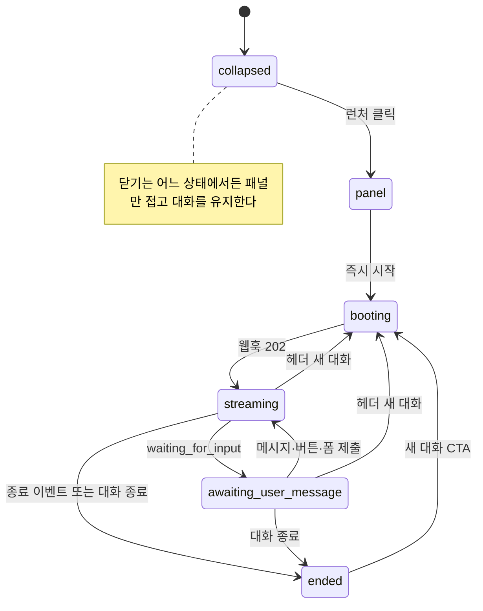

> 구현 상태: 구현됨 · 원문: `spec/7-channel-web-chat/1-widget-app.md` · 용어: [용어 사전](../CLE-GLOSSARY.md)

## 개요

이 문서는 iframe 안에서 도는 웹채팅 위젯(web chat widget)을 정한다. 위젯은 `codebase/channel-web-chat` 의 Next.js 앱이며 CSR 전용 정적 export 로 빌드한다. 다루는 것은 런처·패널(launcher, panel) 화면, 위젯 대화 상태(widget state) 전이, 대화 종료·새 대화·새로고침 복원, 닫힌 동안 도착한 메시지의 안 읽음 처리, 즉시 시작(eager start)과 런처 버블 큐 게이팅, 위젯 고유 문구(widget chrome)의 다국어 처리다.

범위 밖 주제는 링크로 대신한다. 위젯이 쓰는 EIA 표면 매핑은 [웹채팅 구조](CLE-WEBCHAT-ARCH.md), 토큰과 위젯 세션·재로드 분기는 [웹채팅 인증과 세션](CLE-WEBCHAT-SESSION.md), 호스트 명령과 부팅 설정은 [웹채팅 SDK](CLE-WEBCHAT-SDK.md), 임베드 검증과 sanitize 는 [웹채팅 보안](CLE-WEBCHAT-SECURITY.md)이 정한다.

## 요구사항

- REQ-WCWIDGET-001 WHEN 위젯을 빌드하면 THE SYSTEM SHALL `output: 'export'` 정적 번들로 내보내 Node 서버 런타임 없이 CDN 에서 서빙한다.
- REQ-WCWIDGET-002 WHEN 위젯 UI 컴포넌트를 만들면 THE SYSTEM SHALL 모든 컴포넌트를 Client Component(`'use client'`)로 두고 Server Component 데이터 페칭·Server Actions·Route Handlers 를 쓰지 않는다.
- REQ-WCWIDGET-003 WHEN 채팅 화면을 불러오면 THE SYSTEM SHALL `next/dynamic` 과 `ssr: false` 로 불러와 prerender 단계에서도 SSR 을 뺀다.
- REQ-WCWIDGET-004 WHEN 사용자가 런처의 추천 질문 버블을 누르면 THE SYSTEM SHALL 패널을 열고 그 텍스트를 큐에 담는다.
- REQ-WCWIDGET-005 WHEN 첫 `awaiting_user_message` 의 표면이 `ai_conversation` 이면 THE SYSTEM SHALL 큐에 담긴 텍스트를 `submit_message` 로 보낸다.
- REQ-WCWIDGET-006 IF 첫 대기 표면이 `buttons` 또는 `form` 이면 THE SYSTEM SHALL 큐에 담긴 텍스트를 보내지 않고 버린다.
- REQ-WCWIDGET-007 WHEN 패널이 처음 열리면 THE SYSTEM SHALL 환영 메시지와 추천 질문을 바로 그리고 동시에 `POST /api/hooks/:path { profile }` 로 실행을 시작한다.
- REQ-WCWIDGET-008 WHEN 첫 `execution.waiting_for_input` 이 도착하면 THE SYSTEM SHALL `interactionType` 에 맞는 첫 표면(입력창·선택지·폼)을 바로 그린다.
- REQ-WCWIDGET-009 WHEN 실행을 시작하면 THE SYSTEM SHALL 웹훅 페이로드에 `profile` 만 싣고 `firstMessage` 를 싣지 않는다.
- REQ-WCWIDGET-010 WHEN 닫은 패널을 다시 열면 THE SYSTEM SHALL 새 실행을 시작하지 않고 위젯 세션을 복원해 기존 대화를 잇는다.
- REQ-WCWIDGET-011 WHILE 위젯 대화 상태가 `streaming` 또는 `awaiting_user_message` 인 동안 THE SYSTEM SHALL 헤더에 "새 대화"·"대화 종료" 컨트롤을 표시한다.
- REQ-WCWIDGET-012 WHILE 위젯 대화 상태가 `collapsed`·`panel`·`booting`·`ended` 인 동안 THE SYSTEM SHALL 헤더의 "새 대화"·"대화 종료" 컨트롤을 표시하지 않는다.
- REQ-WCWIDGET-013 WHEN 사용자가 헤더의 "새 대화" 또는 "대화 종료" 를 누르면 THE SYSTEM SHALL 인라인 2단계 확인을 받은 뒤 실행한다.
- REQ-WCWIDGET-014 WHEN 사용자가 닫기를 누르면 THE SYSTEM SHALL 패널만 접고 실행의 입력 대기와 SSE 연결을 유지한다.
- REQ-WCWIDGET-015 WHILE 패널이 접혀 있는 동안 THE SYSTEM SHALL 도착한 메시지를 버퍼에 담고 안 읽음 배지를 표시한다.
- REQ-WCWIDGET-016 WHEN 접힌 패널을 다시 열면 THE SYSTEM SHALL 버퍼에 담긴 메시지를 그린다.
- REQ-WCWIDGET-017 WHEN 사용자가 AI 대화 대기(`awaiting_user_message` + `ai_conversation` + 대기 노드 ID 확정) 중에 대화 종료를 확인하면 THE SYSTEM SHALL `end_conversation` 을 보낸다.
- REQ-WCWIDGET-018 WHEN 사용자가 그 밖의 상태(응답을 기다리는 `streaming`, `buttons`·`form` 대기, 대기 노드 ID 미확정)에서 대화 종료를 확인하면 THE SYSTEM SHALL `cancel` 을 보낸다.
- REQ-WCWIDGET-019 WHEN 대화를 종료하면 THE SYSTEM SHALL SSE 를 먼저 닫고 위젯 세션을 정리해 `[ended]` 로 바꾼 뒤 종료 명령을 best-effort 로 보낸다.
- REQ-WCWIDGET-020 IF 종료 명령이 실패하거나 거부되면(`410 Gone`·`409 STATE_MISMATCH`·네트워크) THE SYSTEM SHALL 로컬 종료 상태를 되돌리지 않는다.
- REQ-WCWIDGET-021 WHEN 새 대화를 시작하면 THE SYSTEM SHALL 위젯 세션과 스트림을 정리한 뒤 새 `POST /api/hooks/:path` 로 새 실행 ID 와 토큰을 받는다.
- REQ-WCWIDGET-022 WHEN 확립된 대화(`streaming`·`awaiting_user_message`)에서 새 대화를 시작하면 THE SYSTEM SHALL 새 시작 전에 이전 실행에 best-effort `cancel` 을 보낸다.
- REQ-WCWIDGET-023 IF 새 대화 전의 `cancel` 이 실패하거나 거부되면 THE SYSTEM SHALL 로컬 재시작을 되돌리지 않는다.
- REQ-WCWIDGET-024 WHEN 어느 진입점(패널 열기 즉시 시작·`[ended]` CTA·헤더 "새 대화"·호스트 `resetSession`)에서든 실행을 시작하면 THE SYSTEM SHALL 진행 중인 웹훅 시작 요청을 최대 1개, 살아 있는 실행을 최대 1개로 제한한다.
- REQ-WCWIDGET-025 WHILE 위젯 대화 상태가 `booting` 인 동안 THE SYSTEM SHALL 새로 들어온 호스트 `resetSession` 을 진행 중인 시작에 합치고 두 번째 웹훅 요청과 두 번째 실행을 만들지 않는다.
- REQ-WCWIDGET-026 IF 재로드 복원이 토큰 만료나 복구 불가 응답으로 끝나면 THE SYSTEM SHALL `[ended]` 와 "대화 종료, 새로 시작" 안내를 표시한다.
- REQ-WCWIDGET-027 WHEN 호스트 페이지가 새로고침되면 THE SYSTEM SHALL sessionStorage 의 위젯 세션으로 상태를 조회하고 SSE 를 다시 연결해 대화를 복원한다.
- REQ-WCWIDGET-028 WHEN SSE 가 끊겼다가 다시 연결하면 THE SYSTEM SHALL 마지막으로 받은 이벤트의 `Last-Event-Id` 로 연결한다.
- REQ-WCWIDGET-029 WHEN `execution.replay_unavailable` 을 받으면 THE SYSTEM SHALL 상태 조회 스냅샷으로 현재 표면을 다시 맞추고 스트림과 위젯 세션은 유지한다.
- REQ-WCWIDGET-030 IF 재동기화 스냅샷의 상태가 종료(`completed`·`failed`·`cancelled`)면 THE SYSTEM SHALL 위젯 세션을 정리하고 `[ended]` 로 바꾸며 호스트에 `conversationEnded` 를 알린다.
- REQ-WCWIDGET-031 IF 세션을 복원할 때 스냅샷이 이미 종료 상태면 THE SYSTEM SHALL SSE 를 다시 열지 않고 토큰 갱신도 예약하지 않는다.
- REQ-WCWIDGET-032 WHEN 메시지 리스트를 그리면 THE SYSTEM SHALL `waiting_for_input.conversationThread.turns` 스냅샷과 로컬 라이브 이벤트를 소스로 쓰고 `ai_message.messages[]` 원본을 직접 보이지 않는다.
- REQ-WCWIDGET-033 WHEN 대화 기록 항목을 말풍선으로 그리면 THE SYSTEM SHALL `presentation_user`·`ai_user` 를 user 로, `ai_assistant`·`ai_tool`·`system` 을 assistant 로 그린다.
- REQ-WCWIDGET-034 WHEN 대화 기록 항목의 텍스트를 그리면 THE SYSTEM SHALL `[user-input]…[/user-input]` 마커를 지운다.
- REQ-WCWIDGET-035 WHEN 표시물을 그리면 THE SYSTEM SHALL 노드 출력 형태(`{config, output}`)와 표시물 페이로드(`PresentationPayload`)를 모두 받아들여 같은 렌더러로 그린다.
- REQ-WCWIDGET-036 WHEN 표시물이 잘렸으면(`truncation` 또는 `output.rowsTruncated`·`output.itemsTruncated`) THE SYSTEM SHALL 잘림 배너를 표시하고 총 개수가 있으면 "총 N개 중 일부만 표시돼요." 로 알린다.
- REQ-WCWIDGET-037 IF 잘림 총 개수가 유한한 비음수 정수가 아니면 THE SYSTEM SHALL 개수 없는 문구(table "일부 행만 표시돼요.", carousel "일부 항목만 표시돼요.")로 대신한다.
- REQ-WCWIDGET-038 WHILE `awaiting_user_message` 이고 표면이 텍스트 표면(`ai_conversation` 또는 `pending=null`)인 동안 THE SYSTEM SHALL 자유 텍스트 입력창을 활성화한다.
- REQ-WCWIDGET-039 WHILE `booting`·`streaming` 이거나 표면이 `buttons`·`form` 인 동안 THE SYSTEM SHALL 자유 텍스트 입력창을 비활성화한다.
- REQ-WCWIDGET-040 WHILE `booting`·`streaming` 인 동안 THE SYSTEM SHALL 전송 버튼에 스피너와 `aria-busy=true`, `aria-label="AI 응답 중"` 을 표시한다.
- REQ-WCWIDGET-041 IF Form 제출이 검증에 실패하면 THE SYSTEM SHALL `error.details[{field,message,code}]` 를 표시하고 다시 제출할 수 있게 한다.
- REQ-WCWIDGET-042 WHEN 패널을 그리면 THE SYSTEM SHALL 첨부와 이모지 기능을 비활성화하거나 숨긴다.
- REQ-WCWIDGET-043 WHEN 호스트가 `hide` 를 보내면 THE SYSTEM SHALL 런처와 패널을 모두 그리지 않고 대화와 SSE 는 유지한다.
- REQ-WCWIDGET-044 IF 숨김 상태에서 `open` 이 오면 THE SYSTEM SHALL 패널을 보이지 않는다.
- REQ-WCWIDGET-045 IF 임베드 검증으로 `blocked` 가 되면 THE SYSTEM SHALL 호스트 `show` 로도 풀리지 않는 차단 상태를 유지한다.
- REQ-WCWIDGET-046 WHEN 호스트가 `updateProfile` 을 보내면 THE SYSTEM SHALL 부팅 `profile` 에 얕게 합쳐 다음 실행 시작의 웹훅 페이로드에 반영한다.
- REQ-WCWIDGET-047 IF 진행 중인 실행이 있을 때 `updateProfile` 이 오면 THE SYSTEM SHALL 이미 보낸 `profile` 을 소급해 바꾸지 않는다.
- REQ-WCWIDGET-048 WHEN 위젯이 부팅되면 THE SYSTEM SHALL `locale` 을 명시값 → `navigator.language` → `ko` 순서로 한 번 정해 위젯 전체에 고정한다.
- REQ-WCWIDGET-049 WHEN 위젯 고유 문구를 그리면 THE SYSTEM SHALL 위젯 로컬 catalog 의 `t(key, params?)` 로 ko·en 문구를 고르고 `{{name}}` 보간을 쓴다.
- REQ-WCWIDGET-050 IF ko 와 en catalog 의 leaf key 집합이 다르면 THE SYSTEM SHALL 위젯 로컬 parity 테스트를 실패시킨다.
- REQ-WCWIDGET-051 WHEN 운영자 콘텐츠·백엔드 페이로드 라벨·AI 본문을 그리면 THE SYSTEM SHALL 번역하지 않고 입력 언어 그대로 그린다.

## Next.js CSR 전용 구성

- `next.config.js` 는 `output: 'export'` 다. 정적 export 라 Node 서버 런타임이 없고 CDN 에서 서빙한다.
- 모든 UI 컴포넌트는 Client Component(`'use client'`)다. 데이터 페칭과 상태는 모두 브라우저 런타임에서 처리한다.
- Server Component 데이터 페칭·Server Actions·Route Handlers 는 쓰지 않는다.
- 채팅 화면은 `next/dynamic(() => import(...), { ssr: false })` 로 불러와 prerender 단계에서도 SSR 을 뺀다.
- (권장) `export const dynamic = 'force-static'`. 런타임 외부 입력은 URL 쿼리와 postMessage 로만 받는다.
- 산출물은 `out/` 정적 번들이며 위젯 배포 주소로 나간다. 근거와 대안은 [Rationale](#rationale)에 있다.

## 화면 구조

### 런처

접힌 상태(`collapsed`)에서는 오른쪽 아래 떠 있는 런처 버튼과 추천 질문 버블 N개(`launcher.suggestions`)를 그린다.

- 버블을 누르면 패널이 열린다. 텍스트는 워크플로우가 첫 `awaiting_user_message` 에 이르렀을 때 `submit_message` 로 보낸다. 패널을 연 직후는 `booting` 이라 위젯이 텍스트를 큐에 담아 두었다가 보낸다.
- 첫 표면이 `buttons`·`form` 이면 자유 텍스트를 제출할 수 없는 표면이므로 큐의 텍스트를 보내지 않고 버린다.
- 첫 메시지 페이로드(`firstMessage`)는 쓰지 않는다.
- 런처(위젯) 자체를 보이거나 숨기는 것은 호스트의 `show`·`hide` 로 정한다(아래 [가시성·profile 갱신·차단](#가시성profile-갱신차단)).

### 패널

| UI 요소 | 데이터 출처 | 동작 |
|---|---|---|
| 헤더(봇 이름, 대화 컨트롤, 닫기) | 부팅 설정 `headerTitle`. 아바타·뒤로 버튼은 다음 단계 | "새 대화"·"대화 종료"·닫기(✕)를 그린다. 닫기는 패널을 접고 대화를 유지한다. "새 대화"·"대화 종료" 는 인라인 2단계 확인 뒤에 실행해 진행 중 대화와 기록을 잃는 실수를 막는다. 이 두 컨트롤은 대화가 확립된 뒤(`streaming`·`awaiting_user_message`)에만 표시한다. `booting`(웹훅 요청 진행 중, 위젯 세션 저장 전), 시작 전(`collapsed`·`panel`), `[ended]` 에서는 숨긴다. 이유는 [Rationale](#rationale) |
| 환영 메시지 | 부팅 설정 `welcome`(정적) | 패널을 열면 바로 표시한다. 워크플로우 시작 전에 클라이언트가 그린다 |
| 퀵 액션 버튼 | `waiting_for_input.buttonConfig` | 누르면 `click_button` |
| 추천 질문 | 부팅 설정 `welcome.suggestions`·`launcher.suggestions`(정적) | 누르면 `submit_message` |
| 메시지 리스트 | 1차 소스는 `waiting_for_input.conversationThread.turns` 스냅샷([WebSocket 이벤트와 명령](../CLE-API/CLE-API-WS-EVENTS.md))과 로컬 라이브 이벤트다. `ai_message.messages[]` 원본은 직접 보이지 않는다 | 대화 기록 항목의 항목 출처(`ConversationTurnSource`, 백엔드 다섯 값, [대화 스레드](../CLE-IX/CLE-IX-THREAD.md))를 말풍선 역할 둘로 줄여 그린다. `presentation_user`·`ai_user` 는 user, `ai_assistant`·`ai_tool`·`system` 은 assistant 다. 사용자 입력 마커 `[user-input]…[/user-input]` 은 지운다([대화 미리보기](../CLE-EXEC/CLE-EXEC-PREVIEW.md)). 새로고침 복원 뒤에도 이 매핑으로 과거 user·assistant 를 구분한다. 복원 대화 스레드는 EIA 상태 조회가 영속 스냅샷으로 돌려준다 |
| Form (여러 필드) | `waiting_for_input` 의 `nodeOutput.formConfig`(없으면 `nodeOutput` 자체) | 필드를 그리고 검증한 뒤 `submit_form`. 실패하면 `error.details[{field,message,code}]` 를 표시하고 다시 제출하게 한다 |
| 표시물(carousel·table·chart·template) | `ai_message.presentations[]`, 표시 메시지 이벤트(`execution.message`), 복원 대화 스레드의 `turn.presentations[]` | 아래 [표시물 렌더](#표시물-렌더) |
| 입력창 | 없음 | Enter 또는 전송 버튼으로 `submit_message`. 활성 조건과 외형은 아래 [입력창](#입력창) |
| 첨부·이모지 | 없음 | v1 에서는 비활성이거나 숨긴다. Form 파일 업로드와 함께 켤 예정이다 |
| AI 면책 푸터 | 부팅 설정 `disclaimer`(정적) | 표시만 한다 |

위 표의 위젯 고유 문구(대화 컨트롤, "AI 응답 중", 확인 문구, 잘림 배너 등)는 [위젯 고유 문구 다국어](#위젯-고유-문구-다국어)의 catalog 키로 `locale` 언어에 맞춰 그린다. 표의 문구는 ko 예시다. 운영자가 넣은 콘텐츠(`headerTitle`·`welcome`·`disclaimer`)는 번역 대상이 아니다.

### 표시물 렌더

- 모든 표시물 타입을 말풍선 안에 그린다([AI 에이전트 노드 출력과 디버그](../CLE-NODE-AI/CLE-NODE-AGENT-OUTPUT.md)).
- 렌더러는 두 모양을 모두 받는다. 하나는 표시 전용 Presentation 노드가 보내는 노드 출력 형태(`{config, output}`, [노드 출력 규약](../CLE-NODE/CLE-NODE-OUTPUT.md))다. 이 모양은 표시 메시지 이벤트 `execution.message` 의 `presentations[]` 로 온다([EIA 수신 API와 SSE §표시 메시지 이벤트](../CLE-IX/CLE-EIA-INBOUND.md#표시-메시지-이벤트)). 다른 하나는 AI 표시 도구(`render_*`)의 표시물 페이로드(`PresentationPayload`, `{type, toolCallId, renderedAt, payload}`)다. 후자는 명시된 `type` 으로 분류하고 `payload` 를 노드 출력 형태로 정규화한다. 그래서 새로고침 복원 대화 스레드의 `turn.presentations[]` 도 그대로 다시 그린다.
- `PresentationPayload.truncation`(출력 크기 한도 1MB 잘림 정보, [Presentation 노드 공통](../CLE-NODE-PRES/CLE-NODE-PRES-COMMON.md))은 `output.{rowsTruncated|itemsTruncated}` 와 같게 다룬다. 잘리면 잘리기 전 총 개수(`{itemsTotalCount|rowsTotalCount}`)와 함께 "총 N개 중 일부만 표시돼요." 를 표시한다. 메인 에디터 실행 결과([에디터 실행과 디버깅](../CLE-EXEC/CLE-EXEC-RUN.md))와 같은 동작이다.
- table 과 carousel 은 대칭이다. table 은 `rows*`, carousel 은 `items*` 키를 읽어 각자 잘림 배너를 그린다. 총 개수가 없으면 table 은 "일부 행만 표시돼요.", carousel 은 "일부 항목만 표시돼요." 를 쓴다.
- 총 개수는 유한한 비음수 정수만 받는다. 믿을 수 없는 값으로 "총 NaN개…" 가 새지 않게 한다.
- **복원 범위 제약**: 영속 대화 스레드의 `turn.presentations[]` 는 `source: 'ai_assistant'` 에만 있어 AI 표시 도구의 표시물만 저장된다([대화 스레드](../CLE-IX/CLE-IX-THREAD.md)). 표시 전용 Presentation 노드의 표시물은 라이브 표시 메시지 이벤트로만 오므로 새로고침 복원 대상이 아니다.

### 입력창

- 자유 텍스트 입력은 `awaiting_user_message` 이면서 텍스트 표면일 때만 켠다. 텍스트 표면은 `ai_conversation` 또는 `pending=null`(`ai_conversation` 도달 전의 과도 상태)이다. 즉 `buttons`·`form` 이 아닌 표면이다. 판정 기준은 `widget-state.isTextInputSurface` 다.
- `booting`·`streaming` 이거나 현재 표면이 `buttons`·`form` 이면 입력창을 끈다. 이때 사용자는 선택이나 제출로 응답한다.
- 꺼진 외형은 두 가지다. 대기 중(빈 입력, `buttons`·`form`)에는 전송 버튼을 중립 회색으로 둔다. `booting`·`streaming`(AI 처리 중)에는 스피너와 `aria-busy=true`, `aria-label="AI 응답 중"` 으로 응답 중임을 알린다. 흐린 반투명 비활성 상태가 고장처럼 보이지 않게 하려는 것이다.

## 위젯 대화 상태

위젯 대화 상태는 패널을 펼치는 축(`collapsed`↔패널)을 따라 움직인다. 위젯 가시성(`show`·`hide`)과 정책 차단(`blocked`)은 이 축과 따로 움직인다([가시성·profile 갱신·차단](#가시성profile-갱신차단)).

- **시작 시점**: 패널을 처음 펼칠 때(런처 클릭) 워크플로우를 시작한다. 정적 환영 메시지와 추천 질문을 바로 그리면서 동시에 실행을 시작한다(`POST /api/hooks/:path { profile }`). 첫 `waiting_for_input` 의 `interactionType` 에 따라 첫 표면을 그대로 그린다. `ai_conversation` 이면 입력창과 환영 메시지, `buttons`·carousel 이면 선택지, `form` 이면 폼이다. 그래서 첫 노드가 AI 가 아닌 워크플로우(예: 카테고리 선택 캐러셀)도 패널을 열자마자 그 표면이 보인다. 위젯은 시작 전에 첫 노드 타입을 알 수 없으므로 표면을 보여 주려면 실행을 먼저 시작해야 한다.
- **토큰 낭비 없음**: AI 에이전트 노드의 멀티턴(`multi_turn`)은 첫 사용자 메시지 전에는 LLM 을 부르지 않고 바로 입력 대기로 들어간다([AI 에이전트 노드](../CLE-NODE-AI/CLE-NODE-AGENT.md)). 패널을 열기만 해서 생기는 비용은 입력 대기 실행 행 하나뿐이다(LLM 토큰 0).
- **`firstMessage` 미사용**: 웹훅 페이로드에는 `profile` 만 싣는다. 첫 사용자 텍스트도 일반 `submit_message` 로 보내 AI 의 첫 턴이 된다. 멀티턴은 트리거 입력을 첫 턴으로 쓰지 않기 때문이다.
- **다시 열기**: 닫은 뒤 다시 열면 새 실행을 시작하지 않는다. 위젯 세션(실행 ID + 토큰)을 복원해 기존 대화를 잇는다.
- **헤더 대화 컨트롤**: 대화가 확립된 뒤(`streaming`·`awaiting_user_message`) 사용자는 "대화 종료" 로 `[ended]` 로 가거나 "새 대화" 로 현재 대화를 버리고 `[booting]` 부터 다시 시작할 수 있다. 둘 다 가벼운 확인을 거친다. `booting` 에서는 컨트롤을 숨긴다. 중복 웹훅과 보내지 못한 `cancel` 을 막기 위해서다. 그림의 새 대화 화살표는 `[ended]` CTA 와 헤더 컨트롤 양쪽에서 나온다. 대화 종료도 `streaming`·`awaiting_user_message` 양쪽에서 `[ended]` 로 간다. 동작의 기준은 아래 표다.

### 대화 종료·새 대화·위젯 세션 유지

| 동작 | 트리거 | EIA 처리 | 위젯 상태 |
|---|---|---|---|
| 닫기(접기) | 헤더 닫기, 런처 토글 | 실행의 입력 대기를 유지한다. SSE 연결도 유지한다 | 패널만 숨긴다. 닫힌 동안 도착한 메시지(예: AI 응답)는 버퍼에 담아 안 읽음 배지로 알리고 다시 열 때 그린다. 다시 열면 그대로다 |
| 대화 종료 | 헤더 "대화 종료"(대화 확립 후, 가벼운 확인) 또는 `completed` | AI 대화 대기(`awaiting_user_message` + `ai_conversation` + 대기 노드 ID 확정)면 `end_conversation` 을 보낸다. 워크플로우는 이어서 완료된다. 그 밖(응답을 기다리는 `streaming`, `buttons`·`form` 대기, `ai_conversation` 이라도 대기 노드 ID 미확정)이면 `cancel` 로 실행을 끝낸다. 둘 다 실행이 끝나고 토큰이 무효가 된다. 위젯은 SSE 를 먼저 닫고 위젯 세션을 정리해 `[ended]` 로 바꾼 뒤 종료 명령을 best-effort 로 보낸다. SSE 를 먼저 닫아 종료 이벤트가 종료 처리와 겹치지 않게 한다. 명령이 실패하거나 거부돼도(`410 Gone`·`409 STATE_MISMATCH`·네트워크) 로컬 종료 상태를 유지한다. 사용자 의도를 앞세운다. 컨트롤은 대화 확립 후에만 보이므로 종료할 때 위젯 세션과 토큰이 항상 있다 | `[ended]`. 대화 내용은 읽기 전용이 되고 "새 대화 시작" CTA 를 보인다 |
| 새 대화 | `[ended]` CTA, 헤더 "새 대화"(가벼운 확인), 호스트 `resetSession` | 위젯 세션과 스트림을 정리한 뒤 새 `POST /api/hooks/:path` 로 새 실행 ID 와 토큰을 받는다. 확립된 대화에서 시작했으면 새 시작 전에 이전 실행에 best-effort `cancel`([EIA 수신 API와 SSE](../CLE-IX/CLE-EIA-INBOUND.md))을 보내 서버에 고아 실행이 남지 않게 한다. 폐기이므로 `end_conversation` 이 아니라 `cancel` 이다. 실패하거나 거부돼도 로컬 재시작을 되돌리지 않는다. `booting` 중 호스트 `resetSession` 은 진행 중인 시작에 합쳐 두 번째 웹훅 요청과 두 번째 실행을 만들지 않는다. 중복 웹훅과 첫 노드 부수효과 2회가 구조적으로 사라진다. 명시 취소를 보내지 못한 이탈(탭 닫기, "닫기")은 서버의 유휴 실행 회수([웹채팅 인증과 세션](CLE-WEBCHAT-SESSION.md))가 처리한다 | 대화 내용을 비우고(구분선) `[booting]` |
| 토큰 만료·서버 회수 | 재로드 때 상태 조회가 `401` 이고 토큰 갱신도 실패한 경우. 유휴 실행 회수 뒤의 재로드도 위젯이 가진 토큰이 모두 만료된 상태라 이 경로로 끝난다. `410 Gone` 은 명령 응답에만 나오고 상태 조회에는 나오지 않는다. 재로드 분기의 기준은 [웹채팅 인증과 세션](CLE-WEBCHAT-SESSION.md) | 없음 | `[ended]` + "대화 종료, 새로 시작" 안내 |
| 페이지 새로고침·이동 | 호스트 페이지 새로고침 → iframe 재로드 | 없음 | 복원한다. 실행 ID 와 토큰을 iframe origin 의 sessionStorage 에 둔다(같은 탭 새로고침은 유지, 탭을 닫으면 지워짐). 상태 조회(`GET /:id`) 결과가 입력 대기면 영속 `conversationThread` 가 함께 오므로 SSE 재전송 버퍼나 서버 재시작과 상관없이 전체 기록을 복원한다([EIA 수신 API와 SSE](../CLE-IX/CLE-EIA-INBOUND.md)). 대화 스레드에 저장되지 않는 표시 전용 Presentation 노드의 표시물은 예외다. 그다음 SSE(`Last-Event-Id`)를 다시 연결한다. 복구할 수 없으면 `[ended]` 다. 절차는 [웹채팅 인증과 세션](CLE-WEBCHAT-SESSION.md) |

single-flight 합치기, 확립된 대화의 새 대화 전 `cancel`, 서버 쪽 유휴 실행 회수(`WebChatIdleReaperService`)는 모두 구현됐다.

- 봇이 먼저 말을 거는 프로액티브 메시지는 비목표다. 진행 중인 대화에서 도착하는 메시지는 위처럼 안 읽음으로 잡는다.
- 사용자별 여러 대화 목록은 비목표다. 사용자 식별(추후)과 사용자별 실행 목록 API 가 먼저 있어야 한다.
- 새 대화의 명령 순서와 종료 이벤트 경합은 [미결 사항](#미결-사항) 참조.

### SSE 재연결

iframe 이 일시 중지되거나 네트워크가 잠깐 끊겨 SSE 가 끊기면 위젯은 마지막으로 받은 이벤트의 `Last-Event-Id` 로 다시 연결한다. EIA 의 SSE 재전송 버퍼(5분)가 `seq > Last-Event-Id` 인 이벤트를 다시 보내므로 끊긴 동안 도착한 `ai_message` 도 되찾아 안 읽음 배지와 타임라인에 반영한다. 다만 버퍼는 서버 메모리에 있어 서버 프로세스가 다시 시작되면 사라지고 재시작 직후에는 만료 신호도 못 보낼 수 있다. 이 한계는 [EIA 수신 API와 SSE](../CLE-IX/CLE-EIA-INBOUND.md)가 정한다.

버퍼(5분)가 만료된 뒤 다시 연결하면 놓친 이벤트를 다시 받을 수 없다. 이때는 상태 조회 `GET /api/external/executions/:id` 의 스냅샷(현재 `conversationThread`)으로 다시 맞춘다. 서버는 버퍼가 요청 범위를 채우지 못하면 `execution.replay_unavailable` 을 보내고 위젯은 이 이벤트를 받으면 상태 조회 스냅샷으로 현재 표면을 다시 맞춘다(`use-widget.ts` `handleEiaEvent` → `seedWaitingFromStatus`). 이 신호는 종료를 뜻하지 않으므로 스트림과 위젯 세션을 유지하고 이후 이벤트를 그대로 처리한다.

> **스냅샷이 이미 종료 상태면 종료로 확정한다.** 버퍼 공백 동안 실행이 `completed`·`failed`·`cancelled` 로 바뀌었다면 그 종료 이벤트도 버퍼와 함께 사라져 다시 오지 않는다. 서버는 신호를 보낸 뒤 연결만 유지하고 재전송하지 않는다. 이 경우 위젯은 표면을 시드하지 않고 위젯 세션을 정리해 `[ended]` 로 바꾸며 호스트에 `conversationEnded` 를 알린다. 이 예외가 없으면 위젯이 `streaming`("AI 응답 중")에 계속 멈춘다. 사용자 조작이 없는 구간이라 명령 `410` 으로 뒤늦게 알아챌 길도 없다. 같은 판정을 세션을 복원할 때도 적용한다. 종료로 확정되면 SSE 를 다시 열지 않고 토큰 갱신도 예약하지 않는다. 무효 토큰 스트림과 종료된 위젯 세션이 되살아나지 않게 하려는 것이다. 회귀 테스트는 `use-widget-eager-start.test.ts` 의 "버퍼 만료 재동기화" 와 "복원된 세션이 이미 terminal" 이다.

### 가시성·profile 갱신·차단

호스트 제어 명령(`wc:command`, [웹채팅 SDK](CLE-WEBCHAT-SDK.md))에 대응하는 위젯 상태다. 셋은 서로 다른 층이다. 가시성과 패널 펼침은 UI 상태, `blocked` 는 보안 정책 결과, `updateProfile` 은 다음 시작 페이로드의 변경이다. 가시성과 패널은 서로 독립인 두 축으로 나눈다. 공개 계약 타입의 기준은 [웹채팅 SDK](CLE-WEBCHAT-SDK.md)의 제어 인스턴스(`ChatInstance`)다.

| 축 | 상태 | 호스트 명령 | 뜻 |
|---|---|---|---|
| 위젯 가시성 | `visible`(기본) / `hidden` | `show` / `hide` | `hidden` 은 런처와 패널을 모두 그리지 않는다(페이지에서 위젯 자체를 숨김). 대화와 SSE 는 유지한다 |
| 패널 펼침 | `collapsed` / `open` | `open` / `close` | 위 상태 그림의 접힘↔패널 축 |

- 두 축은 독립이다. `hide` 뒤의 `open` 은 효과가 없다. 먼저 `show` 해야 한다.
- `blocked`(임베드 불허, [웹채팅 보안](CLE-WEBCHAT-SECURITY.md))는 두 축과 무관한 정책 거부 상태이고 복구할 수 없다. 호스트 `show` 로도 풀리지 않는다. 호스트가 되돌릴 수 있는 `hidden` 과 다르다.
- `updateProfile(profile)` 은 부팅 `profile` 에 얕게(shallow) 합쳐져 다음 워크플로우 시작(패널 열기·새 대화)의 웹훅 페이로드 `profile` 에 반영된다. 진행 중인 실행에 이미 보낸 profile 은 바꾸지 않는다. 웹훅 페이로드는 시작할 때 한 번만 보내고 EIA 에 다시 보내는 표면이 없다. 시작 전 빈 세션에서 갱신하면 첫 시작에 그대로 반영된다.
- 호스트 `sendMessage` 의 위젯 쪽 처리는 [미결 사항](#미결-사항) 참조.

## 위젯 고유 문구 다국어

위젯이 스스로 그리는 UI 문자열(대화 컨트롤, 확인, 입력창, 상태·에러, 표시물 잘림 배너, aria-label 등)을 ko·en 두 언어로 낸다. 부팅 설정의 `locale`([웹채팅 SDK](CLE-WEBCHAT-SDK.md))로 방문자 언어에 맞춘다.

**방식: 위젯 로컬 경량 catalog**

- 위젯은 별도 정적 export 번들이라 메인 앱의 `frontend/src/lib/i18n/dict` 를 가져올 수 없다. 그래서 위젯 로컬 문자열 catalog `{ ko, en }` 와 `t(key, params?)` 를 둔다. 파라미터 보간은 제품 전체와 같게 `{{name}}` 이중 중괄호를 쓴다.
- ko·en 의 leaf key 집합이 같아야 한다. 위젯 로컬 parity 테스트로 강제한다.
- 메인 앱 dict 체계와 물리적·개념적으로 분리된 자체 catalog 다([다국어와 화면 문구](../CLE-UI/CLE-UI-I18N.md)의 적용 범위). 문체 원칙(ko 해요체, en 정중·간결)은 함께 따른다.

**언어 결정**(부팅 때 한 번 정해 고정)

1. 명시한 `BootConfig.locale` 이 `ko`·`en` 이면 그 값을 쓴다.
2. 없으면 브라우저 `navigator.language`(Accept-Language)를 본다. `en*` 이면 `en`, 그 밖은 `ko` 다.
3. 마지막 기본값은 `ko` 다. 기존 위젯이 늘 한국어였으므로 하위 호환이다.

부팅 때 한 번 정해 위젯 전체에 고정한다. 위젯 안에서 언어를 바꾸는 토글은 비목표다. `locale` 을 바꾸려면 `wc:boot` 재전송이 아니라 iframe 을 다시 마운트해야 한다([웹채팅 SDK](CLE-WEBCHAT-SDK.md), [웹채팅 운영 콘솔](CLE-WEBCHAT-CONSOLE.md)). 이 `locale` 은 위젯 UI 언어이며 [채팅 채널](../CLE-CHAT/CLE-CHAT-CORE.md)의 안내 문구 언어(`languageLocale`)와 다르다.

**번역 대상은 위젯 고유 문구다.** 전체 목록과 키 표는 구현 계획 문서에 있다.

- 대화 컨트롤("새 대화"·"대화 종료"·닫기·"새 대화 시작"), 2단계 확인 문구, 입력창 placeholder, 전송·"AI 응답 중" aria-label, 상태·에러(`GENERIC_ERROR_MESSAGE`), form "선택"·"제출", carousel 이전·다음, chart 범례, table·carousel 잘림 배너("총 N개 중 일부만 표시돼요.", table 무개수 "일부 행만 표시돼요.", carousel 무개수 "일부 항목만 표시돼요."), 런처 "채팅 열기"·안 읽음 배지.
- 경계 규칙 (1): 위젯에 하드코딩한 기본값(예: `headerTitle` 이 없을 때 쓰는 "AI 어시스턴트")은 위젯 고유 문구라 번역한다. 운영자가 넣은 값은 번역하지 않는다.
- 경계 규칙 (2): 이미 영어인 위젯 고유 문구(chart aria-label `pie chart` 등)도 ko 키를 새로 만들어 parity 를 맞춘다.

**비대상**: 운영자 제공 콘텐츠(`headerTitle`·`welcome`·`launcher.suggestions`·`disclaimer`), 백엔드가 보낸 페이로드(표시물·form 의 `label`), AI 생성 본문. 위젯은 입력 언어 그대로 그린다.

위젯 로컬 catalog(`src/lib/i18n/`), `resolveLocale`, 위젯 고유 문구 키 치환, ko·en parity 테스트가 모두 구현됐다.

## 미결 사항

- **새 대화의 명령 순서와 종료 이벤트 경합**: [웹채팅 SDK](CLE-WEBCHAT-SDK.md)는 새 대화 순서를 `cancel` → 스트림 닫기 → 위젯 세션 비우기 → 시작으로 적는다. 이 문서의 대화 종료는 종료 이벤트와 겹치지 않도록 SSE 를 먼저 닫는다. 새 대화 순서대로면 `execution.cancelled` 가 아직 열린 스트림에 도착해 `[ended]` 로 바뀌는 경합이 이론상 가능하다. `cancel` 이 fire-and-forget 이라 경합이 없는지, 순서를 바꿔야 하는지 확인이 필요하다. 실제 경합 여부는 확인되지 않았다.
- **호스트 `sendMessage` 의 위젯 쪽 처리**: SDK 는 `sendMessage(text)` 를 공개 API 와 `wc:command` 로 노출한다. 이 문서는 `booting`, `buttons`·`form` 표면, `[ended]` 에서 이 명령을 어떻게 처리할지(큐에 담기·버리기·무시) 정하지 않았다. 런처 버블 큐 게이팅을 그대로 적용하는지도 정해지지 않았다. 결정 필요.
- **웹훅 시작 실패 때의 동작**: 운영 콘솔에서 웹채팅 인스턴스를 끄면 웹훅이 `410` 을 낸다([웹훅](../CLE-TRIG/CLE-TRIG-WEBHOOK.md)). 공개 웹훅 가드는 `429`·`413` 을 낸다([웹채팅 보안](CLE-WEBCHAT-SECURITY.md)). 이 문서의 상태 전이는 `booting` 에서 웹훅이 실패할 때의 전이와 표시를 정하지 않았다. 보안 문서의 "에러 → `[ended]` + 새 대화 시작" 이 이 경로에도 적용되는지, 꺼진 트리거에 embed-config 가 어떻게 응답하는지도 정해지지 않았다. 결정 필요.

## 구현 위치

- `codebase/channel-web-chat/**`

## Rationale

### Next.js CSR 전용으로 만든다 (Vite SPA·SSR 기각)

위젯은 iframe 안 SPA 라 SSR 의 이점(SEO·TTFB)이 없다. 정적 export 가 CDN 호스팅과 iframe 임베드에 가장 맞다. CSR 강제는 정적 export, 모든 컴포넌트 `'use client'`, 채팅 화면 `dynamic(ssr:false)`, route handler·server action 미사용으로 한다. Vite SPA 가 더 가볍지만 조직 표준(프론트엔드가 Next.js)과 사용자 요구에 맞춰 Next.js 를 쓴다. 정적 export 라 사실상 SPA 와 같다.

### 가시성과 패널을 두 축으로 나누고 updateProfile 은 소급하지 않는다

런처 가시성(`show`·`hide`)과 패널 펼침(`open`·`close`)을 독립인 두 축으로 둔 것은 [웹채팅 SDK](CLE-WEBCHAT-SDK.md)에서 합의한 결정을 위젯 쪽에 반영한 것이다. 호스트가 "위젯을 페이지에서 완전히 숨김" 과 "런처는 두고 패널만 접음" 을 따로 제어해야 하기 때문이다. `updateProfile` 을 다음 시작에만 반영하고 진행 중 실행에 소급하지 않는 것은 웹훅 페이로드가 시작 때 한 번이라는 EIA 표면 제약을 따른 것이다. 진행 중 실행의 profile 을 고치려면 EIA 표면을 넓혀야 해서 이 영역 밖으로 뺐다. `blocked` 는 두 축과 무관한 복구 불가 상태로 따로 두어 호스트 제어(`hidden`)와 섞이지 않게 했다.

### 패널을 열 때 워크플로우를 시작한다 (첫 입력 때 시작 기각, 결정 2026-06-06)

**처음 결정(기각)**: 패널을 열기만 해서는 시작하지 않고 첫 사용자 텍스트 입력 때 시작하며 웹훅에 `firstMessage` 를 함께 싣는 방식이었다. 빈 패널만 열고 떠나는 사용자 때문에 실행이 낭비되는 것을 피하려 했다. 이 방식은 AI 텍스트가 먼저인 워크플로우만 가정했고 두 결함이 드러났다.

1. **AI 가 아닌 첫 노드(캐러셀·버튼·폼)를 보일 수 없다.** 첫 표면을 그리려면 실행을 시작해 첫 `waiting_for_input` 을 받아야 하는데 위젯은 시작 전에 첫 노드 타입을 모른다. 첫 입력 때 시작하면 "패널을 열자마자 카테고리 선택 캐러셀 보이기" 가 구조적으로 불가능하다.
2. **`firstMessage` 가 사라진다.** 멀티턴 AI 에이전트는 설계상 트리거·웹훅 입력을 첫 턴으로 쓰지 않고 첫 사용자 채팅 입력만 첫 턴으로 삼는다([AI 에이전트 노드](../CLE-NODE-AI/CLE-NODE-AGENT.md)). 그래서 웹훅에만 실린 `firstMessage` 는 어느 노드에도 닿지 않아 사용자의 첫 메시지가 사라졌다.

**바꾼 결정(채택)**: 패널을 열면 바로 실행을 시작한다. 첫 `waiting_for_input` 타입대로 첫 표면을 그리고 첫 사용자 텍스트도 일반 `submit_message` 로 보낸다. `firstMessage` 는 없앤다. 기각했던 방식의 유일한 이점(낭비 방지)은 다시 따져 보니 비용이 작다. 멀티턴은 입력 전에 LLM 을 부르지 않으므로 패널 한 번 열 때 비용은 입력 대기 실행 행 하나(LLM 토큰 0)다. 패널을 여는 것은 사실상 대화 의도이고 버려진 대화는 토큰 만료로 정리된다. 위젯 토큰뿐 아니라 서버의 입력 대기 실행 행도 유휴 실행 회수([External Interaction API](../CLE-IX/CLE-EIA.md))가 토큰이 모두 만료되고 유예 시간이 지나면 거둔다. 즉시 시작은 두 결함을 함께 없애고 모든 첫 노드 타입을 똑같이 지원한다. 대부분의 임베드형 채팅 위젯도 패널을 열 때 대화를 시작한다. 정적 환영 메시지는 그대로 바로 그려 AI 가 먼저 인사하는 경험도 유지한다.

**따라오는 규칙(런처 버블 큐 게이팅)**: 런처 버블로 큐에 담은 텍스트는 첫 `awaiting_user_message` 표면이 `ai_conversation` 일 때만 보낸다. 첫 표면이 `buttons`·`form` 이면 자유 텍스트를 제출할 수 없으므로 큐를 버려 엉뚱한 표면에 제출되지 않게 하고 입력창도 같은 조건으로 끈다.

### 헤더 대화 컨트롤은 대화 확립 후에만 보이고 종료 명령은 대기 표면에 따라 고른다

**booting 에서 숨기는 이유**: `booting` 은 웹훅 요청이 진행 중이라 위젯 세션(실행 ID·토큰)이 아직 없다. 이때 컨트롤을 보이면 (a) "대화 종료" 가 보낼 서버 취소 명령의 대상이 없어 명령이 나가지 않고(로컬만 끝나고 서버에 입력 대기 실행이 남음), (b) "새 대화" 를 다시 누르면 진행 중인 `start()` 와 겹쳐 웹훅이 중복으로 나간다. 시작 전(`collapsed`·`panel`)과 `[ended]` 도 같은 이유로 숨긴다. 판정 기준은 `isActiveConversationPhase`(booting 제외)다. 호스트 `resetSession` 은 위젯 UI 를 거치지 않으므로 이 게이트를 지나지 않는다. 그 경로의 booting 중복은 UI 게이트가 아니라 single-flight 합치기(아래)로 막는다.

**`end_conversation` 과 `cancel` 을 고르는 이유**: 두 명령은 위젯이 새로 만든 구분이 아니라 EIA 가 이미 따로 정의한 명령이다([EIA 수신 API와 SSE](../CLE-IX/CLE-EIA-INBOUND.md)). `end_conversation` 은 특정 `nodeId` 의 멀티턴 대기를 정상 종료하고 `cancel` 은 실행 전체를 멈춘다. 위젯은 현재 대기 표면에 따라 기존 계약을 고를 뿐이다. AI 대화 대기(`awaiting_user_message` + `ai_conversation` + 대기 노드 ID 확정)면 `end_conversation` 으로 워크플로우가 이어서 완료되게 한다(뒤 노드와 집계가 정상으로 돈다). 그 밖(응답을 기다리는 `streaming`, `buttons`·`form` 대기, 대기 노드 ID 미확정)은 `end_conversation` 이 대상 노드를 가질 수 없어 `cancel` 로 실행을 끝낸다.

**로컬 먼저 종료하는 이유**: 위젯은 SSE 를 먼저 닫고 위젯 세션을 정리해 `[ended]` 로 바꾼 뒤 종료 명령을 best-effort 로 보낸다. SSE 를 먼저 닫으면 종료 이벤트가 종료 처리와 겹쳐 두 번 전이하는 일이 없다. 명령이 실패하거나 거부돼도(`410 Gone`·`409 STATE_MISMATCH`·네트워크) 사용자 의도(종료)를 앞세워 로컬 종료를 되돌리지 않는다. 서버 상태는 실행 무기한 보존 불변식([장애 복구와 안전 종료](../CLE-EXEC/CLE-EXEC-RECOVERY.md))과 토큰 만료로 정리된다. 종료 명령이 사라진 경우에도 공개 위젯에 남은 입력 대기 실행은 유휴 실행 회수가 토큰 만료와 유예 시간 뒤에 거둔다.

### 표시물 렌더는 두 모양을 모두 받고 복원 범위는 대화 스레드 저장 범위를 따른다

렌더러는 표시 전용 Presentation 노드의 `{config, output}` 과 AI 표시 도구의 `PresentationPayload{type, toolCallId, renderedAt, payload, truncation?}` 을 모두 받는다. 후자는 명시된 `type` 으로 분류하고 `payload` 를 정규화하므로 새로고침 복원 대화 스레드의 `turn.presentations[]` 도 라이브와 같게 다시 그린다. `truncation` 은 `payload` 밖 최상위에 있어서 흡수하지 않으면 1MB 잘림 표시가 사라진다. [Presentation 노드 공통](../CLE-NODE-PRES/CLE-NODE-PRES-COMMON.md)이 이 값을 `output.{rowsTruncated|itemsTruncated}` 와 같은 정보로 정하므로 `output` 으로 흡수해 똑같이 다룬다. 잘리기 전 총 개수(`{itemsTotalCount|rowsTotalCount}`)도 같은 경로로 흡수해 잘림 배너에 함께 보인다(메인 에디터 실행 결과와 같은 동작). 흡수만 하고 쓰지 않으면 죽은 필드가 된다. table 은 `output.{rowsTruncated|rowsTotalCount}`, carousel 은 `output.{itemsTruncated|itemsTotalCount}` 를 각각 `truncated`·`totalCount` 로 옮긴다. 총 개수는 유한한 비음수 정수만 받는다.

복원 표시물을 렌더러가 무시한다는 제약은 없다. 렌더러는 이미 두 모양을 받고 있었다(2026-07-10 실측). 있지도 않은 제약을 남겨 두면 다음 사람이 이미 있는 변환기를 다시 만들고 진짜 제약이 가려진다.

진짜 복원 제약은 원인이 다르다. 영속 대화 스레드의 `turn.presentations[]` 는 `source: 'ai_assistant'` 에만 있어 AI 표시 도구의 표시물만 저장된다([대화 스레드](../CLE-IX/CLE-IX-THREAD.md)). 표시 전용 Presentation 노드의 표시물은 SSE 표시 메시지 이벤트로만 오므로 새로고침 복원 대상이 아니다. 이것을 대화 스레드에 실으려면 백엔드 항목 출처 enum 이나 대화 기록 항목 필드를 넓혀야 해서 v2 검토 사안이며 [웹채팅](CLE-WEBCHAT.md)의 비목표에 올렸다.

### 서버에 남는 실행을 없애는 두 장치: single-flight 합치기와 새 대화 전 cancel

헤더 대화 컨트롤 게이트와 맞물리는 두 결함의 결정 근거다.

**booting 중 호스트 `resetSession` 의 중복 웹훅은 single-flight 합치기로 막는다(서버 멱등이 아니다).** 원인은 공유 웹훅 표면에 멱등이 없어서가 아니라 클라이언트 동시성 결함이다. `resetSession` 이 진행 중인 `start()` 를 기다리지 않고 새 `start()` 를 보냈다. 위젯은 동시에 진행 중인 `POST /api/hooks/:path` 를 최대 1개, 살아 있는 실행을 최대 1개로 두는 single-flight 게이트를 유지한다. 모든 시작 진입점(패널 열기 즉시 시작, `[ended]` CTA, 헤더 "새 대화", 호스트 `resetSession`)이 이 게이트를 지난다. `booting` 중 도착한 `resetSession` 은 두 번째 요청을 보내지 않고 진행 중인 시작에 합친다. `booting` 은 대화가 확립되기 전(메시지 0, 위젯 세션 저장 전)이라 "새 대화" 요구가 진행 중인 시작으로 이미 채워지고 합쳐진 시작이 그대로 위젯 세션이 된다. 그래서 중복 웹훅, 중복 실행, 첫 노드 부수효과 2회가 구조적으로 0 이 된다.

- 기각 (a): 공유 `POST /api/hooks/:path` 에 `Idempotency-Key` 를 붙이는 방식. 새 대화는 새 대화 의도라 다른 키를 쓰게 되므로 실행 두 개가 그대로 생겨 이 경합을 원리적으로 막지 못한다. 모든 웹훅 통합이 쓰는 공유 표면을 넓게 바꾸게 된다.
- 기각 (b): 기다린 뒤 취소하고 다시 시작하는 방식. `booting` 실행을 확립시킨 뒤 취소하므로 첫 노드 부수효과가 1회 더 생기고 취소될 실행을 만든다.

합치기는 두 번째 실행 자체를 만들지 않아 부수효과와 고아 실행이 모두 0 이다. 호스트는 실행 ID 를 관측하지 않으므로("항상 새 ID" 라는 호스트 계약 없음) 관측할 수 있는 차이가 없다.

**확립된 대화의 "새 대화" 는 이전 실행에 best-effort `cancel` 을 보낸 뒤 다시 시작한다.** 확립된 대화(`streaming`·`awaiting_user_message`)에서 "새 대화"·`resetSession` 을 하면 새 시작 전에 이전 실행에 `cancel` 을 보낸다. "대화 종료" 와 대칭이며 폐기이므로 `end_conversation` 이 아니라 `cancel` 이다. 명시 종료를 보내지 않던 예전의 단순한 로컬 처리가 서버에 남기던 고아 실행을 없앤다. `cancel` 을 보내지 못한 이탈(탭 닫기, "닫기")은 서버의 유휴 실행 회수가 거둔다. 즉시 처리(새 대화 전 cancel)와 토큰 만료 뒤 처리(유휴 실행 회수)의 이중 장치다. 서버 쪽 유휴 대기 시간 정책과 불변식은 [External Interaction API](../CLE-IX/CLE-EIA.md)와 [실행 상태 머신과 대기·재개](../CLE-EXEC/CLE-EXEC-STATE.md)가 정한다. 실행 상태 전이표가 입력 대기 → 취소됨의 사유로 미리 둔 "타임아웃" 의 구현이다.

### `locale` 을 켜서 위젯 고유 문구만 다국어로 낸다 (결정 2026-07-12)

v1 위젯은 한국어 전용이라 `locale` 을 예약 필드로만 두었다([웹채팅 SDK](CLE-WEBCHAT-SDK.md)). 영어 지원 착수는 코드 변경이 없는 범위라는 이유로 미뤄 두었고(내용상 기각 아님), 2026-07-12 사용자가 코드 작업을 승인해 예약한 활성화를 실행했다. 명시적으로 예약한 경로라 결정 번복이 아니다.

- **위젯 고유 문구만 (콘텐츠 현지화 기각)**: 운영자 콘텐츠를 언어별로 현지화하려면 부팅 설정 콘텐츠 필드를 언어별 map 으로 넓혀야 하고 운영 콘솔과 서버 저장 스키마가 바뀐다(큰 표면). 첫 가치("위젯이 방문자 언어로 말한다")는 위젯 고유 문구만으로 얻을 수 있어 나눈다.
- **명시 → 자동 감지 → ko (위젯 안 토글 기각)**: 명시값을 먼저 쓰는 것은 운영자 의도를 존중하는 것이다(운영 콘솔은 항상 명시한다). 자동 감지는 설치 스크립트를 그대로 붙인 방문자 경험을, ko 기본값은 하위 호환을 위한 것이다. 위젯 안 사용자 토글은 상태 저장과 표면 추가가 필요해 이번 범위 밖이다.
- **위젯 로컬 catalog (메인 앱 dict 가져오기 기각)**: 별도 정적 번들이라 프론트엔드 dict 를 끌어올 수 없다. 경량 로컬 catalog 가 번들 크기와 iframe 격리를 지키고 ko·en parity 는 위젯 로컬 테스트가 지킨다.
