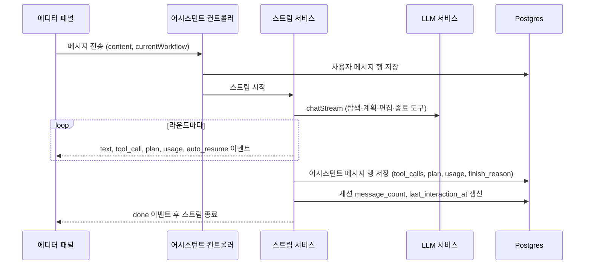

> 구현 상태: 구현됨 · 원문: `spec/3-workflow-editor/4-ai-assistant.md` (§5, §6, Rationale 의 채팅 히스토리 서버 영속화·Stall 자동 복구 UX 메시지 분리), `spec/1-data-model.md` (§2.20, §2.22), `spec/data-flow/11-workflow.md` (§1.3, §2.1, §3.2, §3.3, Rationale 의 Assistant message usage JSONB) · 용어: [용어 사전](../CLE-GLOSSARY.md)

## 개요

[AI 어시스턴트](CLE-WF-ASSIST.md)의 클라이언트·서버 계약을 정한다. 사용자 메시지를 보내고 응답을 SSE(Server-Sent Events)로 받는 스트림 엔드포인트, 세션과 메시지를 다루는 REST API, 대화를 서버에 남기는 두 엔티티가 대상이다.

어시스턴트 세션(`AssistantSession`, `workflow_assistant_session`)은 워크플로우 하나에 묶인 사용자별 대화다. 어시스턴트 메시지(`AssistantMessage`, `workflow_assistant_message`)는 그 세션의 사용자·어시스턴트 메시지 행이며 도구 호출·계획·사용량 정보가 붙는다. 대화 기록을 서버에 두므로 페이지를 새로 고치거나 다시 접속해도 대화를 이어 갈 수 있다.

이 문서가 다루지 않는 내용은 다음과 같다.

- 도구의 인자와 반환 형태는 [AI 어시스턴트 도구](CLE-WF-ASSIST-TOOLS.md)가 정한다.
- 에러 코드의 사용자 안내, 자동 이어서 진행·종료 가드의 발동 조건, 패널 화면은 [AI 어시스턴트](CLE-WF-ASSIST.md)가 정한다.
- LLM 스트리밍 인터페이스와 프로바이더별 구현은 [LLM 클라이언트](../CLE-AI/CLE-AI-LLM.md), 사용량 로그 적재는 [LLM 사용량 기록](../CLE-AI/CLE-AI-USAGE.md)이 정한다.
- 워크플로우·노드·연결선 저장 흐름은 [워크플로우 데이터와 저장 흐름](CLE-WF-DATA.md)이 정한다.

## 메시지 스트림 엔드포인트

| 항목 | 값 |
|------|-----|
| Method | `POST` |
| Path | `/api/workflow-assistant/sessions/{sessionId}/messages` |
| Content-Type | 요청 `application/json`, 응답 `text/event-stream` |
| Auth | JWT (`Authorization: Bearer`) |
| Role | 편집자(`editor`) 이상 |

컨트롤러(`WorkflowAssistantController`)가 HTTP 응답에 `event: …` 를 직접 써서 보낸다. WebSocket 채널은 쓰지 않는다. 연결 유지를 위해 15초마다 `: ping\n\n` 주석 줄을 보낸다.

### 요청 본문

```typescript
interface AssistantMessageRequest {
  content: string;                 // 사용자 메시지
  currentWorkflow: {               // 현재 에디터 스냅샷 (저장하지 않은 변경 포함)
    nodes: Array<{
      id, type, label, position,
      width?: number,              // React Flow 가 잰 폭(px). 처음 그리기 전에는 생략
      height?: number,             // React Flow 가 잰 높이(px). 처음 그리기 전에는 생략
      config, containerId?, toolOwnerId?,
    }>;
    edges: Array<{id, sourceNodeId, sourcePort, targetNodeId, targetPort, type}>;
  };
  llmConfigId?: UUID;              // 생략하면 세션에 저장된 값, 그것도 없으면 워크스페이스 기본 설정
}
```

`currentWorkflow` 는 시스템 프롬프트의 현재 워크플로우 스냅샷으로 들어간다. `width`·`height` 는 시스템 프롬프트의 배치 지침이 쓴다([AI 어시스턴트 §시스템 프롬프트](CLE-WF-ASSIST.md#시스템-프롬프트)).

### 한 턴의 흐름

사용자 메시지를 받으면 서버는 먼저 사용자 행을 저장하고 LLM 스트림을 연다. LLM 이 부른 도구는 서버가 처리하고 결과를 SSE 로 흘려보낸다. 도구 결과는 LLM 컨텍스트 안에서만 다시 조립하고 별도 `tool` 행으로 저장하지 않는다. 턴이 끝나면 어시스턴트 행을 저장하고 세션의 집계 값을 고친 뒤 `done` 을 보낸다.



자동 이어서 진행이 일어나면 어시스턴트 행이 턴 안에서 여러 개로 나뉜다([턴 저장 규칙](#턴-저장-규칙)).

## SSE 이벤트

탐색·편집 도구 호출은 모두 `tool_call` 이벤트 하나로 발행한다. 프론트엔드는 `data.kind`(`explore` 또는 `edit`)로 후처리를 나눈다. `propose_plan` 만은 화면 카드 전용이라 `plan` 이벤트로 따로 발행한다.

```text
event: text
data: {"delta": "안녕하세요..."}

event: tool_call
data: {"id": "call_1", "name": "list_integrations", "arguments": {...}, "result": {...}, "kind": "explore"}

event: tool_call
data: {"id": "call_2", "name": "get_current_workflow", "arguments": {}, "result": {"ok": true, "nodes": [...], "edges": [...]}, "kind": "explore"}

event: plan
data: {"id": "call_3", "planId": "...", "title": "...", "steps": [...]}

event: tool_call
data: {"id": "call_4", "name": "add_node", "arguments": {...}, "result": {"ok": true, "id": "..."}, "kind": "edit", "planStepId": "s1"}

event: auto_resume
data: {"reason": "stall_pending_steps", "attempt": 1, "max": 2}

event: usage
data: {"inputTokens": 1200, "outputTokens": 340, "totalTokens": 1540, "thinkingTokens": 0, "model": "gpt-4o"}

event: done
data: {"finishReason": "stop"}

event: error
data: {"code": "LLM_RATE_LIMIT", "message": "..."}
```

| 이벤트 | 뜻 | 프론트엔드 동작 |
|--------|----|-----------------|
| `text` | 어시스턴트 텍스트 조각(delta) | 현재 어시스턴트 버블에 덧붙인다 |
| `tool_call` | 탐색·편집 도구 호출 결과. `data.kind` 로 후처리를 나눈다 | [`data.kind` 별 동작](#tool_call-데이터) |
| `plan` | `propose_plan` 결과 | 메시지에 계획 카드를 더한다 |
| `auto_resume` | 서버가 자동 이어서 진행에 들어갔다는 알림 | 현재 버블을 `streaming=false` 로 확정하고 `autoResume={reason, attempt, max}` 메타를 단 새 어시스턴트 버블을 추가한다. 뒤이은 `text`·`tool_call` 은 새 버블로 간다. 새 버블 앞에는 자동 이어서 진행 구분선을 그린다 |
| `usage` | 토큰 사용량. 데이터는 `{inputTokens, outputTokens, totalTokens, thinkingTokens?, model}` 이고 메시지 행의 `usage` 와 모양이 같다 | 화면 표시는 선택 |
| `done` | 어시스턴트 턴 종료 | 스트리밍 표시를 끝내고 입력창을 다시 쓸 수 있게 한다 |
| `error` | 실패 | 에러 버블과 재시도 안내를 보인다. 코드별 안내는 [AI 어시스턴트 §에러 처리](CLE-WF-ASSIST.md#에러-처리) |

### `tool_call` 데이터

| 필드 | 타입 | 설명 |
|------|------|------|
| `id` | `string` | LLM 이 만든 tool_call ID. 세션을 다시 불러올 때와 계획 단계 매칭에 쓴다 |
| `name` | `string` | 도구 이름 |
| `arguments` | `object` | LLM 이 만든 인자(파싱을 마친 JSON 객체) |
| `result` | `unknown` | 도구 실행 결과. 편집 도구는 `{ok, id?, ports?, error?, pendingUserConfig?, ...}` 이다. 탐색 도구는 도구마다 모양이 다르다([AI 어시스턴트 도구](CLE-WF-ASSIST-TOOLS.md)) |
| `kind` | `'explore' \| 'edit'` | 후처리를 가르는 값 |
| `planStepId` | `string?` | `kind='edit'` 일 때 LLM 이 맞춘 계획 단계 ID (단일, 옛 단축형) |
| `planStepIds` | `string[]?` | 호출 하나가 여러 계획 단계를 해결할 때 쓴다. 소비자는 `planStepId` 와 `planStepIds` 의 합집합으로 완료 처리해야 한다 |

| `data.kind` | 포함 도구 | 프론트엔드 동작 |
|-------------|-----------|-----------------|
| `explore` | `get_node_schema`, `list_integrations`, `list_workflows`, `get_workflow`, `get_current_workflow`, `list_knowledge_bases`, `get_workflow_executions`, `get_execution_details`, `verify_workflow` | 메시지에 탐색 배지를 더한다 |
| `edit` | `add_node`, `update_node`, `remove_node`, `add_edge`, `remove_edge` | 에디터 스토어에 바로 반영하고 편집 배지를 더한다. `planStepId`·`planStepIds` 가 있으면 그 단계를 체크한다. 없거나 맞는 단계가 없으면 순서상 다음 대기 단계를 체크한다 |

- `finish` 와 `clear_plan` 은 서버 내부 상태를 바꾸는 데만 쓰고 SSE 로 발행하지 않는다. 프론트엔드는 `clear_plan` 직후 계획 카드를 바로 지우지 않는다. 다음 턴 스트림에 계획 이벤트가 오지 않는 것으로 해제를 알아챈다.
- SSE 의 `kind` 는 `explore`·`edit` 두 값뿐이다. 메시지 행에 저장하는 `tool_calls[].kind` 는 `plan` 을 더한 값 집합을 쓴다([어시스턴트 메시지](#어시스턴트-메시지)). SSE 로는 `plan` kind 를 발행하지 않는다.

### `auto_resume` 데이터

| 필드 | 타입 | 설명 |
|------|------|------|
| `reason` | `'stall_pending_steps'` | 발동 사유. 지금은 "활성 계획에 대기 중인 실행 가능 단계가 남았는데 LLM 이 도구 호출 없이 `finishReason: 'stop'` 으로 끝낸 경우" 한 가지다. 나중에 늘릴 수 있게 union 으로 둔다 |
| `attempt` | `number` | 이번 턴 안의 자동 이어서 진행 순번(1부터). `MAX_STALL_ROUNDS` 까지 늘고 넘으면 포기하고 턴을 끝낸다 |
| `max` | `number` | 허용 최대 횟수(현재 2). 프론트엔드가 "N/M" 진행도를 표시한다 |

프론트엔드는 이 이벤트를 받는 즉시 이전 어시스턴트 행을 확정(`streaming: false`)하고 새 어시스턴트 행을 추가한다. 새 행의 `autoResume = {reason, attempt, max}` 메타가 구분선을 그리는 계기다. 세션을 다시 불러올 때도 `autoResumed=true` 행 앞에 구분선을 그린다. 다만 저장된 행에는 `max` 가 없어 순번만 보인다([메시지 응답 필드](#메시지-응답-필드)).

### 응답 중단

| 동작 | 처리 |
|------|------|
| 사용자가 응답 중단(Stop) 버튼을 누른다 | 클라이언트가 `AbortController.abort()` 를 부른다. 백엔드는 요청 종료를 알아채 LLM 스트림을 끊고 `done` 이벤트(`finishReason: 'aborted'`)를 보낸다 |
| 브라우저 탭을 닫는다 | 서버 쪽 LLM 호출은 끝까지 갈 수 있다. 사용량은 사용량 로그에 정상 기록된다 |

## 세션 REST API

| Method | Path | 설명 |
|--------|------|------|
| `GET` | `/api/workflow-assistant/sessions/latest?workflowId={id}` | 패널을 열 때 기본 세션을 고르는 조회. 그 워크플로우에서 요청자의 가장 최근 상호작용 `active` 세션을 돌려주고 없으면 `null` 이다 |
| `GET` | `/api/workflow-assistant/sessions?workflowId={id}` | 요청자의 그 워크플로우 세션 목록. 최근 상호작용 순, 최대 50건 |
| `POST` | `/api/workflow-assistant/sessions` | 세션 생성. 본문 `{workflowId, title?, llmConfigId?}`, 응답은 세션 엔티티 |
| `GET` | `/api/workflow-assistant/sessions/{id}` | 세션 메타데이터와 메시지 전체 |
| `PATCH` | `/api/workflow-assistant/sessions/{id}` | `{title?, llmConfigId?, status?}` 수정. `status: 'archived'` 로 세션을 보관한다 |
| `DELETE` | `/api/workflow-assistant/sessions/{id}` | 세션 삭제. 메시지는 cascade 로 함께 지워진다 |
| `POST` | `/api/workflow-assistant/sessions/{id}/messages` | SSE 스트림. 사용자 메시지를 보내고 응답을 받는다([메시지 스트림 엔드포인트](#메시지-스트림-엔드포인트)) |

- 모든 엔드포인트는 편집자(`editor`) 이상 역할이 필요하다. `workspace_id` 는 JWT 에서 넣는다.
- 세션이 없거나 요청의 워크스페이스 세션이 아니면 404 `ASSISTANT_SESSION_NOT_FOUND`, 같은 워크스페이스의 다른 사용자 세션이면 403 `ASSISTANT_SESSION_NOT_YOURS` 다. 다른 워크스페이스의 세션을 없는 세션과 구분하지 않는다. 사용자 안내는 [AI 어시스턴트 §에러 처리](CLE-WF-ASSIST.md#에러-처리)에서 정한다.
- 보관 전용 `/archive` 엔드포인트는 없다. 보관은 일반 세션 수정으로 `status` 를 바꾼다.
- 생성 본문의 `workflowId` 와 목록 조회(`GET /sessions?workflowId`)의 `workflowId` 는 같은 워크스페이스의 워크플로우만 받는다. 아니면 404 `WORKFLOW_NOT_FOUND` 다. 없는 id 와 다른 워크스페이스의 id 를 구분하지 않는다([데이터 모델 개요 §참조의 소속](../CLE-PLAT/CLE-PLAT-DATA.md#참조의-소속) 의 예외 3). `GET /sessions/latest` 는 이 검사 없이 요청의 워크스페이스로 세션을 찾으므로 다른 워크스페이스의 워크플로우면 세션이 없을 때와 같은 `null` 이다.
- 생성·수정 본문의 `llmConfigId` 는 같은 워크스페이스의 `kind=chat` 모델 설정만 받는다. 아니면 404 `MODEL_CONFIG_NOT_FOUND` 다. 없는 id 와 다른 워크스페이스의 id 를 구분하지 않는다([데이터 모델 개요 §참조의 소속](../CLE-PLAT/CLE-PLAT-DATA.md#참조의-소속)).

### 세션 자동 선택

패널을 처음 열거나 워크플로우를 다시 불러오면 이렇게 고른다.

1. `GET /sessions/latest` 로 그 워크플로우의 `status='active'` 세션 가운데 가장 최근에 상호작용한 세션을 고른다.
2. 없으면 패널을 빈 상태로 보여 주고 사용자가 첫 메시지를 보낼 때 세션을 자동으로 만든다.

### 세션 제목 자동 설정

첫 사용자 메시지의 응답이 끝나면 서버가 첫 메시지를 40자 이내로 잘라 세션 `title` 에 저장한다. 따로 LLM 을 부르지 않는 규칙 기반 잘라 쓰기다. 사용자는 `PATCH` 로 제목을 고칠 수 있다.

### 메시지 응답 필드

`GET /api/workflow-assistant/sessions/{id}` 응답의 `messages[*]` 는 어시스턴트 메시지 엔티티를 그대로 직렬화한다. 다음 필드가 자동 이어서 진행 이력을 남긴다.

| 필드 | 타입 | 뜻 |
|------|------|----|
| `autoResumed` | `boolean` | 자동 이어서 진행으로 새로 시작된 어시스턴트 행이면 `true`. 보통 턴의 행 하나는 기본값 `false` 다. 한 턴이 여러 행으로 나뉘면 이어서 진행 직전까지의 행은 `false`, 이어서 진행 뒤 새로 시작된 행은 `true` 다 |
| `autoResumeReason` | `string \| null` | `autoResumed=true` 행에만 있다. 현재 `'stall_pending_steps'` 한 가지 |
| `autoResumeAttempt` | `number \| null` | 같은 턴 안의 이어서 진행 순번. 1부터 `MAX_STALL_ROUNDS`(현재 2)까지 |
| `finishReason` | `string \| null` | 값 목록은 [어시스턴트 메시지](#어시스턴트-메시지)의 `finish_reason` 을 따른다. 이어서 진행 경계에서 먼저 저장한 중간 행은 `'auto_resume_pending'` 이다 |

- 프론트엔드는 세션을 다시 불러올 때 `autoResumed=true` 행 앞에 구분선을 그려 이어서 진행 경계를 보여 준다.
- 이 필드들이 생기기 전(마이그레이션 전)의 행은 `autoResumed=false`, 나머지 `null` 로 읽혀 호환된다.
- **후보 선택기 복원**: `tool_calls[*].result.pendingUserConfig` 가 서버 응답째로 저장된다. 프론트엔드는 세션을 다시 불러오면 이것을 읽어 편집 버블 아래 후보 선택기를 다시 그린다. 대상 노드의 현재 캔버스 값(`field`)이 이미 채워져 있으면 "✓ 설정됨" 읽기 전용 상태로, 비어 있으면 고를 수 있는 선택기로 보여 준다. 판정은 프론트엔드가 에디터 스토어의 노드 `config` 에서 `field` 를 dot-path 로 읽어 비교하며 서버를 다시 부르지 않는다.

## 엔티티

### 어시스턴트 세션

AI 어시스턴트의 채팅 세션이다. 워크플로우 하나에 종속되며 페이지를 새로 고치거나 다시 접속해도 대화를 이어 갈 수 있다.

| 필드 | 타입 | 설명 |
|------|------|------|
| `id` | UUID | PK |
| `workspace_id` | UUID | FK → Workspace (CASCADE) |
| `workflow_id` | UUID | FK → Workflow (CASCADE, 같은 워크스페이스). 세션은 워크플로우 하나에 종속된다 |
| `user_id` | UUID | FK → User (CASCADE). 세션을 만든 사용자 |
| `title` | String? | 세션 제목(첫 메시지 요약 또는 사용자 수정) |
| `llm_config_id` | UUID? | FK → ModelConfig (SET NULL, 같은 워크스페이스, `kind=chat`). 없으면 워크스페이스 기본 Chat 설정을 쓴다 |
| `status` | Enum | `active` / `archived`. `archived` 는 화면에서 숨긴다 |
| `message_count` | Int | 메시지 수 캐시(비정규화) |
| `last_interaction_at` | Timestamp | 마지막 메시지·도구 호출 시각. 기본값 `now()` |
| `created_at` | Timestamp | 생성 시각 |
| `updated_at` | Timestamp | 수정 시각 |

| 상태 | 들어가는 경로 | 결과 |
|------|---------------|------|
| `active` | 생성(INSERT) | 패널에 보이고 메시지를 더할 수 있다 |
| `archived` | `PATCH` 로 `{status: 'archived'}` | 화면에서 숨긴다. 행은 남는다 |

- 생성할 때 `workspace_id`·`workflow_id`·`user_id` 와 `status='active'`, `message_count=0`, `last_interaction_at`(생성 시각)을 넣는다. `title`·`llm_config_id` 는 요청에 있을 때만 채우고 없으면 null 이다.
- 새 메시지를 저장하면 `message_count`·`last_interaction_at`·`updated_at` 을 함께 갱신한다. 현재 구현은 메시지 INSERT 와 세션 UPDATE(`message_count = message_count + 1`)를 한 트랜잭션에서 한다.
- 인덱스: `(workflow_id, user_id, status, last_interaction_at DESC)` 는 `sessions/latest` 조회용이다. `(workspace_id, user_id, updated_at DESC)` 가 있다(V019). 모델 설정 삭제 때 SET NULL 을 위해 `(llm_config_id)` 부분 인덱스가 있다(V125).

### 어시스턴트 메시지

어시스턴트 세션에 속한 메시지 행이다. 사용자 입력과 어시스턴트 응답을 시간 순서로 남기고 도구 호출 결과는 어시스턴트 행의 `tool_calls[].result` 에 담는다.

| 필드 | 타입 | 설명 |
|------|------|------|
| `id` | UUID | PK |
| `session_id` | UUID | FK → AssistantSession (CASCADE) |
| `role` | Enum | `user` / `assistant` / `tool` / `system`. 실제로 저장하는 값은 `user`·`assistant` 다. `tool` 은 CHECK 가 허용하지만 지금은 행을 쓰지 않는다. `system` 은 감사·디버그용 값이며 프롬프트 빌더가 매 요청 동적으로 조립하므로 보통 저장하지 않는다. 현재 마이그레이션(V019)의 CHECK 는 `user`·`assistant`·`tool` 만 허용해 `system` 행은 저장할 수 없다 |
| `content` | Text? | 사용자·어시스턴트 텍스트 본문 |
| `tool_calls` | JSONB? | `role=assistant` 행과 함께 발행된 tool_call 목록. 항목마다 `{id, name, arguments, kind: 'explore'\|'plan'\|'edit', result, planStepId?}` |
| `tool_call_id` | String? | `role=tool` 행이 어느 tool_call 의 결과인지 가리키는 자리. 지금은 `tool` 행을 쓰지 않아 비어 있다 |
| `plan` | JSONB? | `propose_plan` 발행 시점 스냅샷. `{title, summary, steps[], openQuestions[], approvedAt?}` |
| `usage` | JSONB? | `{inputTokens, outputTokens, totalTokens, thinkingTokens?, model}`. `role=assistant` 의 턴 종료 시점에만 채운다 |
| `finish_reason` | String? | `role=assistant` 에만 있다. 프로바이더 값 `stop` / `tool_calls` / `length` / `content_filter` / `aborted` 와 서버 합성 표시 `error`(턴이 에러로 끝남, 예: 라운드 한도 초과) / `auto_resume_pending`(이어서 진행으로 나뉜 턴의 중간 행) |
| `auto_resumed` | Boolean | 자동 이어서 진행으로 새로 시작된 어시스턴트 행이면 true(기본 false). 이어서 진행 직전까지의 행은 false. 응답 필드 `autoResumed`. V020 |
| `auto_resume_reason` | String? | `auto_resumed=true` 행에만. 현재 `stall_pending_steps` 한 가지 (V020) |
| `auto_resume_attempt` | Integer? | `auto_resumed=true` 행에만. 턴 안의 이어서 진행 순번(1부터) (V020) |
| `created_at` | Timestamp | 생성 시각 |

- `tool_calls[].result` 는 Shadow 검증 결과나 탐색 결과의 축약본을 담는다. 사용자가 기록에서 맥락을 다시 볼 수 있게 하기 위해서다. 큰 원본(예: 50MB 워크플로우)은 요약 형태로만 남긴다.
- 저장되는 한 턴의 정상 순서는 `user` → `assistant`(`tool_calls` 포함)다. 도구 호출 왕복(`tool` × N → 최종 `assistant`)은 LLM 컨텍스트 안에서만 일어난다.
- 턴 끝에 저장하는 최종 행의 `finish_reason` 은 보통 `stop`·`tool_calls`·`error`·`aborted` 다. `aborted` 는 응답 중단 버튼 경로다. LLM 클라이언트가 돌려준 `length`·`content_filter` 도 손대지 않고 그대로 저장될 수 있다.
- 사고 토큰은 별도 컬럼이 아니라 `usage` JSONB 의 선택 키 `thinkingTokens` 로 둔다. `usage` 키는 모두 camelCase 다. 정규화된 `thinking_tokens` 컬럼은 V018 이 사용량 로그에만 더했다([LLM 사용량 기록](../CLE-AI/CLE-AI-USAGE.md)). JSONB 로 둔 이유는 [사용량을 JSONB 한 칸에 둔다](#사용량을-jsonb-한-칸에-둔다)에 있다.
- 인덱스: `(session_id, created_at)` 가 세션 메시지를 시간순으로 읽는 조회용이다(V019).
- 현재 구현의 `appendMessage` 는 엔티티를 만들 때 `role`·`content`·`tool_calls`·`tool_call_id`·`plan`·`usage`·`finish_reason` 만 옮겨 담는다. 그래서 `auto_resumed`·`auto_resume_reason`·`auto_resume_attempt` 는 호출부가 값을 넘겨도 늘 기본값(false·null)으로 저장된다. 세션을 다시 불러올 때 이어서 진행 구분선이 나오지 않는 원인이다.

### 삭제 연쇄

워크스페이스를 지우면 워크플로우가, 워크플로우를 지우면 어시스턴트 세션이, 세션을 지우면 어시스턴트 메시지가 지워진다. 마이그레이션에서 ON DELETE CASCADE FK 로 건다.

## 턴 저장 규칙

보통 턴은 어시스턴트 행 하나로 저장한다. 자동 이어서 진행이 일어나면 행을 나눈다. 이어서 진행의 발동 조건은 [AI 어시스턴트 §자동 이어서 진행](CLE-WF-ASSIST.md#자동-이어서-진행)에서 정한다.

1. 서버가 이어서 진행으로 다음 라운드를 시작하는 순간, 지금까지 쌓인 어시스턴트 텍스트와 도구 호출을 중간 행으로 먼저 저장한다. 이 행은 `finish_reason='auto_resume_pending'`, `auto_resumed=false` 다.
2. 텍스트·도구 호출 누적을 비운다. 다음 라운드는 새 행에 쌓인다.
3. `auto_resume` 이벤트를 보낸다.
4. 턴이 끝나면 최종 행을 저장한다. 이번 턴에 이어서 진행이 한 번이라도 있었으면 `auto_resumed=true`, `auto_resume_reason='stall_pending_steps'` 로 저장하고 `auto_resume_attempt` 에는 이어서 진행 횟수를 넣는다.
5. 계획은 같은 턴에서 처음 발행된 행에만 싣고 뒤이어 나뉜 행은 `plan=null` 로 저장한다.

| 경우 | 저장되는 어시스턴트 행 |
|------|------------------------|
| 이어서 진행 없음 | 1개 |
| 이어서 진행 1회 | 2개(`auto_resume_pending` 중간 행 + 최종 행). 최종 행만 `auto_resumed=true` |
| 이어서 진행 2회 | 3개. 최종 행의 `auto_resume_attempt=2` |
| `MAX_STALL_ROUNDS` 에 걸려 포기 | 마지막 행도 `auto_resumed=true` 로 저장한다. 포기 직전에는 "이어서 진행해줘." 를 넣지 않지만 서버가 이미 행을 나눠 저장했으므로 텍스트가 새 버블로 나뉘는 것은 같다 |

## 구현 위치

- `codebase/backend/src/modules/workflow-assistant/workflow-assistant.controller.ts` (REST·SSE 엔드포인트)
- `codebase/backend/src/modules/workflow-assistant/workflow-assistant-session.service.ts` (세션·메시지 CRUD)
- `codebase/backend/src/modules/workflow-assistant/workflow-assistant-stream.service.ts` (SSE 이벤트 발행)
- `codebase/backend/src/modules/workflow-assistant/tools/assistant-turn-persistence.service.ts` (턴 저장, `makeResumeMeta`)
- `codebase/backend/src/modules/workflow-assistant/entities/*.ts` (세션·메시지 엔티티)
- `codebase/backend/src/modules/workflow-assistant/dto/**/*.ts` (요청·응답 DTO)
- `codebase/frontend/src/lib/api/assistant.ts` (클라이언트, `AssistantSseEvent`)
- `codebase/frontend/src/lib/stores/assistant-store.ts` (SSE 처리, 세션 다시 불러오기 `hydrateMessage`)

## Rationale

### 채팅 기록을 서버에 저장한다

사용자와 합의한 결정이다. 신규 엔티티 두 개(`AssistantSession`, `AssistantMessage`)를 두고 서버에 저장한다. 페이지를 새로 고치거나 다시 접속해도 대화를 이어 가게 하기 위해서다. 스트리밍은 SSE 와 새 메서드 `LLMClient.stream()` 으로 한다([LLM 클라이언트](../CLE-AI/CLE-AI-LLM.md)).

이를 위한 구성은 이렇다.

1. DB 엔티티 두 개와 Flyway 마이그레이션(V019).
2. 세션 REST API 와 SSE 메시지 엔드포인트.
3. 백엔드 서비스: 세션·메시지 CRUD 와 대화 컨텍스트 조립(최근 30턴만 프롬프트에 넣는 규칙).
4. 프론트엔드 스토어: `assistant-store.ts` 가 서버 세션 ID 를 들고 패널을 열면 기존 세션을 불러온다.
5. 삭제 연쇄: 워크스페이스 → 워크플로우 → 세션 → 메시지를 ON DELETE CASCADE FK 로 건다.

보관 기간과 자동 보관 정책은 정하지 않았다. 지금은 "직접 지울 때까지 남긴다" 이며 나중에 워크스페이스별 용량 제한과 묶을 수 있다.

### 사용량을 JSONB 한 칸에 둔다

어시스턴트 메시지의 토큰 수와 모델을 컬럼 여러 개로 나누지 않고 `usage` JSONB 하나에 담는다. 프로바이더마다 사용량 키 구조가 다르기 때문이다. 사고 토큰처럼 중간에 새 필드가 생겨도(V018) 마이그레이션 없이 차차 채울 수 있다. 집계가 필요하면 정규화된 카운트를 따로 담는 [LLM 사용량 기록](../CLE-AI/CLE-AI-USAGE.md)의 사용량 로그를 쓴다.

### 자동 이어서 진행 때 메시지 행을 나눈다

자동 이어서 진행이 발동하면 여러 라운드의 텍스트가 같은 `assistantText` 에 쌓여 어시스턴트 메시지 행 하나로 저장됐다. gpt-oss-120b 는 라운드 끝마다 "계속 진행해도 될까요?" 같은 확인 문구를 되풀이하는 버릇이 있어 이어서 진행 앞뒤 라운드의 같은 문구가 한 버블 안에 두세 번 겹쳤다.

그래서 구조로 풀었다. 서버가 이어서 진행으로 다음 라운드를 시작하는 순간 누적 텍스트를 별도 행으로 먼저 저장하고 커서를 비운다. 프론트엔드에는 `auto_resume` 이벤트로 새 버블로 나누라는 신호를 준다. 메시지 엔티티에 `autoResumed`·`autoResumeReason`·`autoResumeAttempt` 세 필드를 더했고 마이그레이션 `V020__assistant_message_auto_resume.sql` 이 기본값 false·null 로 기존 행과 호환한다.

```ts
// 이어서 진행 블록 안에서
// 1) 지금까지의 어시스턴트 텍스트를 중간 행으로 먼저 저장
await this.turnPersistence.persistAssistantTurn(sessionId, assistantText, pendingToolCalls,
  planPersisted ? null : planForTurn, null, 'auto_resume_pending',
  makeResumeMeta(0)); // 중간 행은 이어서 진행이 아닌 메타
if (planForTurn) planPersisted = true;
// 2) 누적 커서 비우기. 다음 라운드는 새 행
assistantText = ''; pendingToolCalls = [];
// 3) SSE 로 프론트엔드에 신호
yield { event: 'auto_resume', data: { reason, attempt, max } };
// 4) 기존 nudge 주입 뒤 continue
```

- 턴 끝의 최종 저장에는 `makeResumeMeta(totalStallCount)` 를 넘긴다. 즉 `autoResumed: totalStallCount > 0` 이다. 누적 카운터 `totalStallCount` 는 진척이 있는 라운드에서도 0 으로 돌아가지 않아 "이번 턴에 이어서 진행이 한 번이라도 있었는지" 를 정확히 판정한다. `consecutiveStallRounds` 는 진척 때 0 으로 돌아가므로 이 판정에 맞지 않고 루프 상한과 SSE `attempt` 에만 쓴다.
- `persistAssistantTurn` 은 마지막 파라미터로 `resumeMeta` 를 받고 기본값은 `makeResumeMeta(0)`(= `{autoResumed: false, autoResumeReason: null, autoResumeAttempt: null}`)이다. 이 메서드와 `makeResumeMeta`, 사용자 메시지 저장(`persistUserTurn`)은 `AssistantTurnPersistenceService` 가 맡는다. `totalStallCount` 는 스트림 서비스가 들고 있다가 `makeResumeMeta` 로 넘긴다. 상태 없는 협력 객체 경계를 지키기 위해서다.
- 프론트엔드는 `AssistantSseEvent` union 에 `auto_resume` 을, 표시 메시지에 `autoResume?: {reason, attempt, max}` 를 더했다. `sendMessage` 의 이벤트 콜백이 `auto_resume` 을 가로채 현재 스트리밍 메시지 ID 를 새 UUID 로 바꾸고 새 행을 추가한다. `hydrateMessage` 는 서버의 `autoResumed=true` 행을 `autoResume` 메타로 되살린다.

회귀 테스트: `stream.service.spec.ts` 의 "auto-continue on stall with pending plan" 묶음이 `appendMessage` 호출 횟수(이어서 진행 N회 + 최종 1개), 중간 행의 `finishReason='auto_resume_pending'`·`autoResumed=false`, 최종 행의 `autoResumed=true`·`autoResumeReason`·`autoResumeAttempt=N`, `auto_resume` 이벤트 N회와 `attempt` 1..N 증가, 첫 행에만 계획이 실리는 것을 고정한다. `assistant-store.test.ts` 는 `auto_resume` 을 받으면 새 행이 더해지고 스트리밍 메시지 ID 가 바뀌며 `autoResume` 메타가 붙는지 본다.

### 유지보수 점검

- `auto_resume` 이벤트 형태를 바꾸면 backend `AssistantStreamEvent` union 과 frontend `AssistantSseEvent` union 을 함께 고친다. 컨트롤러는 단순히 `JSON.stringify` 하므로 별도 DTO 가 없다. i18n `assistant.autoResumedHint` 의 자리표시자(`{{attempt}}/{{max}}`)가 페이로드 키 이름에 묶여 있어 키 이름을 바꾸면 함께 고친다.
- 어시스턴트 메시지에 필드를 더하면 마이그레이션 SQL 과 엔티티의 nullable·기본값을 맞춘다(`autoResumed` 기본 false, 나머지 null). `appendMessage` 는 `Partial<WorkflowAssistantMessage>` 를 받지만 엔티티를 만들 때 필드를 골라 담는다. 새 필드는 그 목록에도 더해야 저장된다([어시스턴트 메시지](#어시스턴트-메시지)).
