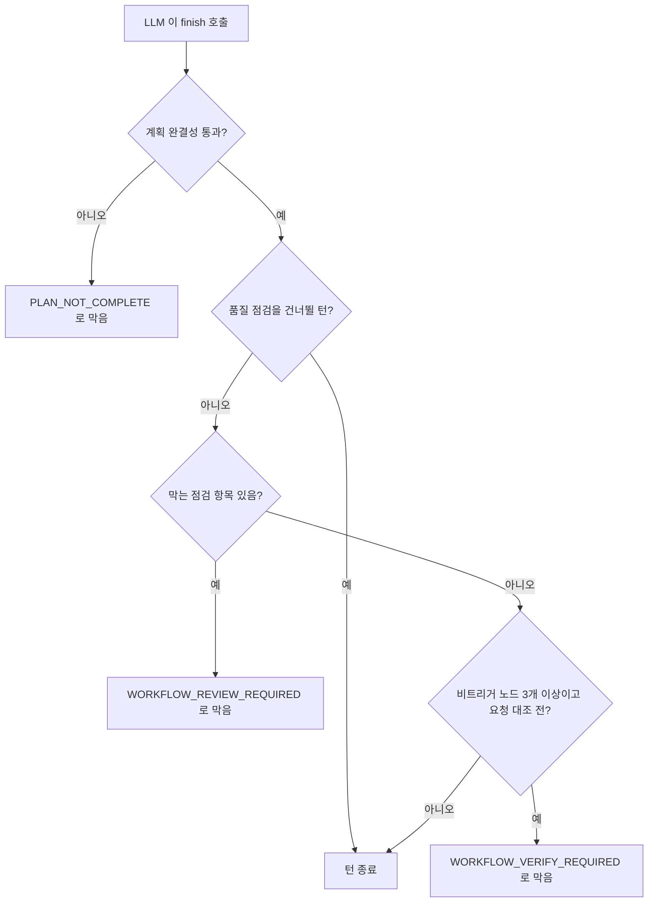

> 구현 상태: 구현됨 (요구사항에 미구현으로 표시한 항목 제외) · 원문: `spec/3-workflow-editor/4-ai-assistant.md` (§1~§3, §7~§13, §15, Rationale), `spec/3-workflow-editor/_product-overview.md` (§10), `spec/4-nodes/3-ai/_product-overview.md` (§3.6) · 용어: [용어 사전](../CLE-GLOSSARY.md)

## 개요

AI 어시스턴트(Workflow AI Assistant, `workflow-assistant`)는 워크플로우 에디터 오른쪽 패널에 들어 있는 대화형 도우미다. 사용자가 자연어로 요구를 말하면 [모델 설정](../CLE-AI/CLE-AI-MODELS.md)에 등록된 모델로 노드와 연결선을 만들고 고친다. "HTTP 헤더 추가" 같은 단순 지시뿐 아니라 "주문 취소 프로세스 추가" 같은 모호하고 큰 요청도 대화로 구체화해 완성한다. AI 에이전트 노드와는 다른 기능이다.

대화는 탐색·계획·편집 단계(Clarify, Plan, Execute)를 오간다. 워크플로우 실행(`Run`)은 사용자가 한다. AI 어시스턴트는 실행 결과(노드별 입출력·에러·타임라인)를 읽기 전용 도구로 조회해 실패 원인을 진단하고 노드 수정을 제안한다.

| 목표 | 설명 |
|------|------|
| 사용자 가치 | 비개발자도 자연어 한 줄로 워크플로우 초안을 얻고 실행 뒤 실패·오동작을 대화로 진단하고 고친다 |
| 제품 차별화 | 질문과 계획 제안을 먼저 하는 planner-first 방식으로 LLM 의 섣부른 편집을 막는다 |
| 기존 자산 재사용 | [모델 설정](../CLE-AI/CLE-AI-MODELS.md), [LLM 클라이언트](../CLE-AI/CLE-AI-LLM.md)의 스트리밍, 에디터 스토어의 되돌리기 스택, [실행 내역](../CLE-EXEC/CLE-EXEC-HISTORY.md) API 를 그대로 쓴다 |

| 설계 목표 | 설명 |
|-----------|------|
| 점진적 구체화 | 모호한 요청("주문 취소 프로세스 추가")도 질문으로 요구를 채워 완성한다 |
| 단일 대화 루프 | 모드를 바꾸지 않고 한 채팅 창에서 대화·계획·편집이 돈다 |
| 되돌릴 수 있는 변경 | 에디터의 되돌리기 스택과 저장 흐름(수동 `Ctrl+S`, 실행 직전 저장)을 재사용한다. 사용자 승인 없이 DB 에 영구 기록하지 않는다 |
| 세션 복원 | 채팅 기록을 서버에 저장해 새로 고침이나 재접속 뒤에도 이어 간다 |

이 문서는 대화 루프, 패널 화면, 에러 처리, 시스템 프롬프트, 성능·비용 가드를 정한다. 다음 내용은 다른 문서가 정한다.

- 도구 정의와 Shadow 검증: [AI 어시스턴트 도구](CLE-WF-ASSIST-TOOLS.md)
- SSE 이벤트, 세션 REST API, 세션·메시지 엔티티: [AI 어시스턴트 스트리밍과 세션 API](CLE-WF-ASSIST-PROTO.md)
- 캔버스 저장 규칙, 컨테이너 규칙, 전체 단축키 목록: [워크플로우 에디터와 캔버스](CLE-WF-EDITOR.md)
- 스트리밍 인터페이스와 프로바이더 구현: [LLM 클라이언트](../CLE-AI/CLE-AI-LLM.md)

## 요구사항

- REQ-ASSIST-001 WHEN 사용자가 에디터 헤더의 AI 어시스턴트 버튼을 누르면 THE SYSTEM SHALL 오른쪽 AI 어시스턴트 패널을 열거나 닫는다. (원본: ED-AI-01)
- REQ-ASSIST-002 WHEN AI 어시스턴트 패널이 열리면 THE SYSTEM SHALL 같은 슬롯의 설정 패널을 닫는다. (원본: ED-AI-02)
- REQ-ASSIST-003 WHEN 노드 클릭 등으로 설정 패널이 필요해지면 THE SYSTEM SHALL AI 어시스턴트 패널을 닫는다. (원본: ED-AI-02)
- REQ-ASSIST-004 WHEN 사용자가 `Ctrl+/` 를 누르면 THE SYSTEM SHALL 다른 단축키와 충돌하지 않는 경우에 한해 AI 어시스턴트 패널을 토글한다. (원본: ED-AI-03)
- REQ-ASSIST-005 WHILE 패널을 보여 주는 동안 THE SYSTEM SHALL 패널 안 문자열을 ko/en i18n 키로 표시한다. (원본: ED-AI-04) (부분 구현)
- REQ-ASSIST-006 WHILE 메시지 목록을 보여 주는 동안 THE SYSTEM SHALL 스트림 조각이 아닌 완결된 메시지만 `aria-live="polite"` 로 스크린 리더에 알린다. (원본: ED-AI-05)
- REQ-ASSIST-007 WHEN 사용자가 패널 상단에서 모델 설정을 고르면 THE SYSTEM SHALL 그 모델 설정으로 어시스턴트 턴을 처리한다. (원본: ED-AI-06)
- REQ-ASSIST-008 IF 요청에 모델 설정이 없으면 THE SYSTEM SHALL 세션에 저장된 모델 설정을 쓰고 그것도 없으면 워크스페이스 기본 설정을 쓴다. (원본: ED-AI-07)
- REQ-ASSIST-009 IF 세션의 모델 설정이 삭제됐거나 워크스페이스 밖이면 THE SYSTEM SHALL 워크스페이스 기본 설정으로 대신하고 토스트로 알린다.
- REQ-ASSIST-010 IF 모델 설정도 워크스페이스 기본 설정도 없으면 THE SYSTEM SHALL `ASSISTANT_NO_LLM_CONFIG` 안내와 설정 화면 딥링크를 보인다. (원본: ED-AI-08)
- REQ-ASSIST-011 WHEN 어시스턴트 턴을 처리하면 THE SYSTEM SHALL OpenAI·Anthropic·Google·Azure OpenAI·Local 프로바이더 모두 스트리밍으로 응답한다. (원본: ED-AI-09)
- REQ-ASSIST-012 IF 스트리밍을 지원하지 않는 프로바이더가 선택되면 THE SYSTEM SHALL `ASSISTANT_STREAMING_UNSUPPORTED` 에러를 낸다. (원본: ED-AI-09) (미구현)
- REQ-ASSIST-013 WHILE 한 대화 창을 쓰는 동안 THE SYSTEM SHALL 모드 전환 없이 탐색·계획·편집 단계를 오가게 한다. (원본: ED-AI-10)
- REQ-ASSIST-014 WHEN 요청이 모호하면 THE SYSTEM SHALL 먼저 질문하거나 계획 카드로 계획을 제시한다. (원본: ED-AI-11)
- REQ-ASSIST-015 WHEN 계획 카드를 제시하면 THE SYSTEM SHALL 단계별 체크리스트와 미답변 질문(`openQuestions`)을 함께 표시한다. (원본: ED-AI-12)
- REQ-ASSIST-016 WHEN 사용자가 "계획대로 진행" 버튼을 누르거나 자연어로 승인하면 THE SYSTEM SHALL 다음 턴에서 편집 단계로 들어간다. (원본: ED-AI-13)
- REQ-ASSIST-017 IF 같은 턴에 `propose_plan` 뒤 편집 도구가 호출되면 THE SYSTEM SHALL 그 호출을 `PLAN_AWAITING_APPROVAL` 로 거부한다. (원본: ED-AI-13)
- REQ-ASSIST-018 WHEN 편집 도구 호출이 성공하면 THE SYSTEM SHALL `planStepId`·`planStepIds` 에 맞는 계획 단계에 체크 표시한다. (원본: ED-AI-14)
- REQ-ASSIST-019 IF 성공한 편집 호출에 맞는 단계 ID 가 없으면 THE SYSTEM SHALL 순서상 다음 대기 단계에 체크 표시한다.
- REQ-ASSIST-020 WHEN 요청이 단일 필드·단일 노드 수정처럼 명확하면 THE SYSTEM SHALL 계획 카드 없이 바로 편집한다. (원본: ED-AI-15)
- REQ-ASSIST-021 WHILE 활성 계획이 있는 동안 THE SYSTEM SHALL 매 턴 활성 계획 컨텍스트를 시스템 프롬프트에 넣는다.
- REQ-ASSIST-022 IF 활성 계획에 `note` 가 아닌 대기 단계가 남았거나 미답변 질문이 있으면 THE SYSTEM SHALL `finish` 를 `PLAN_NOT_COMPLETE` 로 막는다.
- REQ-ASSIST-023 WHEN 편집 턴의 `finish` 가 계획 완결성 검사를 통과하면 THE SYSTEM SHALL 워크플로우 품질 점검을 거친 뒤에 턴을 끝낸다.
- REQ-ASSIST-024 IF 계획 단계가 남은 채 LLM 이 도구 호출 없이 텍스트만 내고 멈추면 THE SYSTEM SHALL 연속 2회까지 자동 이어서 진행한다.
- REQ-ASSIST-025 WHEN 편집 도구 호출이 성공하면 THE SYSTEM SHALL 에디터 메모리 스토어에 바로 반영하고 되돌리기 스택에 넣는다. (원본: ED-AI-16)
- REQ-ASSIST-026 WHILE 어시스턴트가 편집하는 동안 THE SYSTEM SHALL DB 에 직접 쓰지 않고 수동 저장과 실행 직전 저장으로만 영속한다. (원본: ED-AI-17)
- REQ-ASSIST-027 WHEN 사용자가 `Ctrl+Z`·`Ctrl+Y` 를 누르면 THE SYSTEM SHALL 어시스턴트 편집도 되돌리거나 다시 적용한다. (원본: ED-AI-18)
- REQ-ASSIST-028 IF 워크플로우가 실행 중일 때 편집 도구가 호출되면 THE SYSTEM SHALL `ASSISTANT_WORKFLOW_RUNNING` 으로 거부하고 사용자에게 안내한다. (원본: ED-AI-19) (미구현)
- REQ-ASSIST-029 WHEN 편집 도구가 호출되면 THE SYSTEM SHALL 컨테이너·수동 트리거 노드 제약을 Shadow 검증으로 적용한다. (원본: ED-AI-20)
- REQ-ASSIST-030 IF 선택기 위젯 필드(통합·MCP 서버·모델 설정·지식 저장소·다른 워크플로우)가 비어 있으면 THE SYSTEM SHALL LLM 대신 서버가 워크스페이스 후보를 찾아 `pendingUserConfig` 로 싣는다. (원본: ED-AI-39)
- REQ-ASSIST-031 WHEN 후보가 1개 이상이면 THE SYSTEM SHALL 편집 버블 안에 후보 선택기를 보여 주고 사용자가 확인할 때만 에디터 스토어에 반영한다. (원본: ED-AI-39)
- REQ-ASSIST-032 IF 후보가 하나뿐이면 THE SYSTEM SHALL 자동으로 넣지 않고 사용자 확인을 받는다. (원본: ED-AI-39)
- REQ-ASSIST-033 IF 후보가 0개면 THE SYSTEM SHALL 후보 선택기 대신 직접 등록 안내와 설정 화면 링크를 보인다. (원본: ED-AI-39)
- REQ-ASSIST-034 WHEN `add_node`·`update_node` 가 성공하면 THE SYSTEM SHALL 그 노드의 런타임 포트 목록을 결과에 싣는다. (원본: ED-AI-40)
- REQ-ASSIST-035 WHEN `PORT_NOT_FOUND`·`NODE_NOT_FOUND` 실패 배지 바로 뒤에 같은 source·target 의 성공 배지가 오면 THE SYSTEM SHALL 두 배지를 "재시도 후 성공" 배지 하나로 줄인다. (원본: ED-AI-40)
- REQ-ASSIST-036 WHEN 질문을 줄이거나 참고할 정보가 필요하면 THE SYSTEM SHALL 워크스페이스의 통합·지식 저장소·다른 워크플로우를 탐색 도구로 조회하게 한다. (원본: ED-AI-21)
- REQ-ASSIST-037 WHILE 탐색 도구가 조회하는 동안 THE SYSTEM SHALL 세션 워크스페이스 밖의 데이터를 돌려주지 않는다. (원본: ED-AI-22)
- REQ-ASSIST-038 WHEN 탐색 도구가 호출되면 THE SYSTEM SHALL 채팅에 탐색 배지로 표시한다. (원본: ED-AI-23)
- REQ-ASSIST-039 WHEN 어시스턴트가 응답하면 THE SYSTEM SHALL 텍스트와 도구 호출을 SSE 로 스트리밍한다. (원본: ED-AI-24)
- REQ-ASSIST-040 WHEN 사용자가 응답 중단 버튼을 누르면 THE SYSTEM SHALL 스트림을 끊고 이미 적용한 편집은 되돌릴 수 있는 상태로 남긴다. (원본: ED-AI-25)
- REQ-ASSIST-041 IF 네트워크 오류나 요청 한도 초과가 나면 THE SYSTEM SHALL 사용자에게 재시도 안내를 보인다. (원본: ED-AI-26)
- REQ-ASSIST-042 WHEN 페이지를 새로 고치거나 다시 접속하면 THE SYSTEM SHALL 서버에 저장된 대화를 이어서 보여 준다. (원본: ED-AI-27)
- REQ-ASSIST-043 WHEN 패널을 열면 THE SYSTEM SHALL 그 워크플로우의 가장 최근 활성 세션을 자동으로 고른다. (원본: ED-AI-28)
- REQ-ASSIST-044 WHEN 사용자가 새 대화 버튼을 누르면 THE SYSTEM SHALL 확인 다이얼로그 뒤 새 세션을 시작하고 이전 세션을 보존한다. (원본: ED-AI-29)
- REQ-ASSIST-045 WHEN 세션 삭제 API 가 호출되면 THE SYSTEM SHALL 세션과 그 메시지를 함께 지운다. (원본: ED-AI-30)
- REQ-ASSIST-046 WHEN 워크플로우가 삭제되면 THE SYSTEM SHALL 그 세션과 메시지를 cascade 로 지운다. (원본: ED-AI-30)
- REQ-ASSIST-047 WHEN 첫 사용자 메시지의 응답이 끝나면 THE SYSTEM SHALL 첫 메시지를 40자 이내로 잘라 세션 제목으로 저장하고 사용자가 고칠 수 있게 한다. (원본: ED-AI-31)
- REQ-ASSIST-048 IF 어시스턴트 턴의 LLM 호출이 타임아웃 한도를 넘으면 THE SYSTEM SHALL 턴을 끝내고 다시 시도할지 안내한다(한도 값과 스트리밍 적용 여부는 미결 사항). (원본: ED-AI-32)
- REQ-ASSIST-049 IF 한 턴의 도구 호출 수가 어시스턴트 도구 호출 한도를 넘거나 LLM 라운드가 50에 이르면 THE SYSTEM SHALL `ASSISTANT_TOO_MANY_TOOL_CALLS` 로 턴을 끝내고 이어서 진행 안내를 보인다. (원본: ED-AI-33)
- REQ-ASSIST-050 WHEN 어시스턴트가 LLM 을 부르면 THE SYSTEM SHALL `llm_usage_log` 에 `workflow_id`·`workspace_id` 와 함께 사용량을 적는다. (원본: ED-AI-34)
- REQ-ASSIST-051 WHILE 대화 기록을 LLM 에 넘기는 동안 THE SYSTEM SHALL 최근 30턴만 넘기고 그 이전 기록은 서버에만 둔다.
- REQ-ASSIST-052 WHEN 사용자가 실행 결과를 물으면 THE SYSTEM SHALL 실행 목록과 실행별 노드 타임라인을 읽기 전용 도구로 조회하게 한다. (원본: ED-AI-35)
- REQ-ASSIST-053 IF 조회 대상이 현재 세션 워크플로우의 실행도 그 직계 자식 실행도 아니면 THE SYSTEM SHALL `EXECUTION_NOT_IN_SCOPE` 로 거부한다. (원본: ED-AI-36)
- REQ-ASSIST-054 WHEN 실행 상세를 돌려주면 THE SYSTEM SHALL `inputData`·`outputData`·`error` 의 민감 값을 서버에서 가린다. (원본: ED-AI-37)
- REQ-ASSIST-055 WHILE 실행이 진행 중이거나 입력 대기인 동안 THE SYSTEM SHALL 부분 타임라인 조회를 허용한다. (원본: ED-AI-38)
- REQ-ASSIST-056 IF 사용자가 재실행을 요청하면 THE SYSTEM SHALL 재실행을 걸지 않고 실행 상세 페이지에서 직접 걸도록 안내한다.
- REQ-ASSIST-057 WHILE 어시스턴트가 동작하는 동안 THE SYSTEM SHALL 워크플로우 실행 API 를 부르지 않는다.
- REQ-ASSIST-058 WHEN 어시스턴트 메시지를 그리면 THE SYSTEM SHALL raw HTML 을 escape 하는 마크다운 렌더러를 쓴다.
- REQ-ASSIST-059 WHEN 어시스턴트 텍스트에 harmony 제어 토큰이 섞이면 THE SYSTEM SHALL 렌더 전에 걸러 내고 남는 내용이 없으면 버블을 숨긴다.
- REQ-ASSIST-060 IF 턴이 `ASSISTANT_TOO_MANY_TOOL_CALLS` 로 끝나면 THE SYSTEM SHALL 에러 버블에 "이어서 진행" 버튼을 보인다.
- REQ-ASSIST-061 IF 같은 워크플로우에 스트리밍이 진행 중일 때 새 메시지 요청이 오면 THE SYSTEM SHALL 409 로 거부한다. (미구현)

## 대화 루프

AI 어시스턴트는 세 단계를 자유롭게 오간다. 단계는 상태 기계로 강제하지 않고 프롬프트 지침과 도구 접근으로 유도한다.

| 단계 | 목적 | 쓰는 도구 | 캔버스 변경 |
|------|------|-----------|-------------|
| ① 탐색(Clarify) | 요청이 모호할 때 조회와 질문으로 구체화 | 읽기 전용 탐색 도구 | 없음 |
| ② 계획(Plan) | 계획 카드를 제시하고 승인을 요청 | `propose_plan` | 없음 |
| ③ 편집(Execute) | 승인된 계획대로 노드·연결선 편집 | 편집 도구 | 즉시 반영, 되돌리기 가능 |

도구 정의는 [AI 어시스턴트 도구](CLE-WF-ASSIST-TOOLS.md)에 있다.

### 단계 판단 기준

| 요청 성격 | 권장 경로 |
|-----------|-----------|
| 단일 필드·단일 노드 수정 | ① → ③ (계획 카드 생략 가능) |
| 노드 2개 이상 신규 또는 도메인 판단 포함 | ① → ② → (사용자 승인) → ③ |
| 불확실하거나 판단이 어려움 | 보수적으로 ②까지 가고 사용자 승인을 기다림 |

③ 편집 중 예상 못 한 판단이 필요해지면 `finish` 로 턴을 끝내고 ①이나 ②로 돌아갈 수 있다.

### 계획 카드 진행

- ② 단계에서 `propose_plan.steps` 가 체크박스 목록으로 그려진다.
- ③ 단계에서 편집 도구 호출이 도착하면 인자 `planStepId`(단일, 옛 단축형)나 `planStepIds`(배열)와 맞춰 해당 단계를 ✓ 처리한다. 호출 하나가 여러 단계를 한꺼번에 해결할 수 있다. 예를 들어 `add_node` 가 `config` 에 버튼까지 넣어 `update_node` 단계를 대신했다면 `planStepIds: ["s1","s3"]` 로 두 단계를 함께 체크한다.
- 단계 ID 가 없거나 맞는 단계가 없으면 순서상 다음 대기 단계를 ✓ 처리한다.
- 사용자는 진행도(예: 3/7 완료)를 실시간으로 본다.
- **차례대로 진행한다.** LLM 은 단계를 적힌 순서대로 진행한다. 가운데 단계를 건너뛰고 뒤 단계를 먼저 `[x]` 처리하지 않는다. 앞선 호출로 이미 해결된 단계가 있으면 `propose_plan` 을 다시 불러 그 단계를 `{action: 'note'}` 로 표시하거나 합친 새 계획으로 바꾼다. 활성 계획은 새 계획으로 대체된다. 체크하지 않은 채 조용히 남겨 두는 것은 금지다. 사용자가 체크되지 않은 칸을 버그로 오해한다.
- `propose_plan.openQuestions` 가 있으면 계획 카드 안에 질문 목록만 보여 주고 "아래 메시지 입력창에 답변을 적어 보내요." 안내를 함께 표시한다. 답은 아래쪽 일반 입력창으로 받고 LLM 이 이어서 진행한다. 입력창을 두 군데 두지 않기 위한 결정이다.

### 활성 계획 컨텍스트

활성 계획은 서버가 매 턴 대화 기록에서 뽑아 시스템 프롬프트의 `## Active plan context` 절로 넣는다. 사용자의 원 요청, 승인 여부, 단계 체크박스, 미답변 질문 목록이 들어 있어 LLM 이 중간 턴에서도 계획을 잊지 않는다. 상태는 세 가지다.

| 상태 | 뜻 | 프롬프트와 가드 |
|------|----|-----------------|
| `active` | 진행 중(대기 단계나 미답변 질문이 있다) | 상세를 넣고 종료 가드가 발동한다 |
| `cleared` | `clear_plan` 으로 해제됐다 | 다음 턴부터 프롬프트와 가드에서 뺀다 |
| `completed` | 실행 가능한 단계가 모두 끝났고 미답변 질문이 없다 | 짧은 완료 요약 한 줄만 남겨 뒤 대화의 맥락으로 쓴다. 가드는 발동하지 않는다 |

### 승인

| 계기 | 동작 |
|------|------|
| 계획 카드 아래 "계획대로 진행"(Approve & execute) 버튼 | "계획대로 진행해 주세요." 사용자 메시지가 자동으로 전송되고 다음 턴에서 ③으로 들어간다 |
| 자연어 승인(예: "좋아", "진행해줘", "그대로 해줘") | LLM 이 프롬프트 지침에 따라 바로 ③으로 들어간다 |
| 거절이나 수정 요청 | 질문이나 새 정보를 반영해 다시 ②로 돌아간다 |

### 계획 전용 턴

`propose_plan` 을 부른 턴은 계획 발행만으로 끝나야 한다. 같은 턴에 편집 도구를 부르면 서버가 `PLAN_AWAITING_APPROVAL` 로 거부한다([AI 어시스턴트 도구](CLE-WF-ASSIST-TOOLS.md#shadow-검증-규칙)). 그래서 LLM 은 `propose_plan` 직후 따로 문장을 쓰지 않고 바로 `finish` 를 불러 턴을 끝낸다. 계획 카드의 "계획대로 진행" 버튼만으로 사용자 행동을 충분히 이끌 수 있어 한국어 문장을 덧붙이면 오히려 잡음이 된다. 실제 편집은 사용자의 승인 메시지로 시작하는 다음 턴에서 한다. 이 강제로 "계획 제시 → 사용자 승인 → 편집" 흐름이 깨지지 않는다.

`openQuestions` 가 있는 계획은 계획 카드 안에 답변 입력 안내가 따로 보인다. 이때 LLM 은 한국어 문장으로 질문을 다시 묻고 `finish` 를 부르지 않은 채 턴을 끝낸다.

## 패널 화면

### 위치와 크기

| 항목 | 값 |
|------|----|
| 위치 | 에디터 오른쪽. 설정 패널과 같은 슬롯 |
| 너비 | 360px 고정 |
| 여는 방법 | 툴바의 AI 어시스턴트 버튼으로 토글 |
| 설정 패널과의 관계 | 서로 배타적이다. AI 어시스턴트를 열면 설정 패널이 자동으로 닫힌다. 노드 클릭 등으로 설정 패널이 필요하면 AI 어시스턴트가 닫힌다. 설정 패널을 연 채 AI 어시스턴트를 열면 설정 패널이 닫히는 것을 애니메이션으로 알린다 |

### 패널 구성

| 영역 | 위치 | 들어가는 요소 | 동작 |
|------|------|---------------|------|
| 헤더 | 맨 위 | 제목 "AI 어시스턴트", 닫기(✕) | 닫아도 세션은 서버에 남는다 |
| 모델 줄 | 헤더 아래 | 모델 설정 선택기, 새 대화(⟳) 버튼 | 아래 요소 표 참고 |
| 메시지 목록 | 가운데 | 사용자·어시스턴트 메시지, 탐색 배지(예: `list_integrations() → 3 entries`), 계획 카드(제목, 번호 붙은 단계 체크박스, "계획대로 진행" 버튼), 편집 배지(예: `add_node HTTP Request`, `add_edge Manual → HTTP`), 안내 박스, 에러 버블 | 시간순으로 쌓인다 |
| 입력 영역 | 맨 아래 | 입력창("요청을 입력하세요..."), 안내 "Enter: 전송 · Shift+Enter: 줄바꿈", 응답 중단(Stop) 버튼 | 응답 중단 버튼은 스트리밍 중에만 보인다 |

### 요소별 동작

| 요소 | 설명 |
|------|------|
| 헤더 | 제목과 닫기(✕). 닫아도 세션은 서버에 보존된다 |
| 모델 선택 | 모델 설정 선택기. "기본 Provider"(`assistant.modelDefault`)를 고를 수 있다. 값이 비면 워크스페이스 기본 설정을 쓴다. 선택기 라벨은 코드가 지금 내보내는 문자열 `LLM Config` 그대로다(`candidate-lookup.service.ts` 의 대체 라벨, `system-prompt.ts` 의 선택기 설명). 코드 쪽 명칭 통일은 별도 작업이다 |
| 새 대화(⟳) | 확인 다이얼로그를 띄운 뒤 현재 대화를 비운다. 이전 세션은 기록에 남는다 |
| 메시지 목록 | 사용자·어시스턴트 메시지, 도구 호출 배지, 계획 카드, 에러가 시간순으로 쌓인다. 스트리밍 중에는 회색 커서 애니메이션이 보인다. 새 이벤트(텍스트 조각, 도구 호출 배지, 계획 카드, 단계 체크)가 올 때마다 목록이 맨 아래로 자동 스크롤된다 |
| 제어 토큰 거르기 | 일부 모델이 어시스턴트 텍스트에 OpenAI harmony 제어 토큰(`<\|channel\|>...<\|message\|>{...}`)을 흘릴 수 있다. 화면은 그리기 직전에 `sanitizeAssistantText` 로 거르고 거른 결과가 비면 그 버블을 숨긴다. 사용자에게 제어 토큰이나 원시 JSON 이 보이지 않는다 |
| 마크다운 렌더 | 어시스턴트·도구 메시지 본문은 `markdown-renderer.tsx`(react-markdown + `remark-gfm`, `rehype-raw` 미사용이라 raw HTML 은 escape)로 그린다. 제어 토큰 거르기와는 별개의 보안 정책이다. 이 정책을 바꾸면 웹채팅 위젯 렌더러(`safe-html.ts`)와의 보안 동등성이 깨질 수 있으므로 [웹채팅 보안](../CLE-WEBCHAT/CLE-WEBCHAT-SECURITY.md)의 sanitize 정책 매트릭스도 함께 검토한다 |
| 탐색 배지 (🔍 회색) | `list_workflows`, `list_integrations` 같은 탐색 도구 호출. 요약 한 줄을 보이고 접기·펼치기로 전체 결과를 본다 |
| 편집 배지 (✔ 녹색) | `add_node`, `update_node` 등 성공. 인자 요약과 연결된 노드 라벨을 보인다. 서명이 같은 호출이 연달아 오면 `× N` 을 붙인 배지 하나로 줄인다. 서명은 `update_node` 는 patch 필드 집합, `add_node` 는 노드 유형, 나머지는 도구 이름이다. 실패(`ok:false`) 호출은 서명에 `:err` 를 붙여 성공 묶음과 따로 그린다. 에러가 묻히지 않게 하기 위해서다 |
| 재시도 후 성공 배지 (✔ `retried`) | `add_edge` 실패의 에러 코드가 `PORT_NOT_FOUND` 나 `NODE_NOT_FOUND` 이고 같은 `source_id`·`target_id` 의 성공 배지가 곧바로 이어지면 두 배지를 "재시도 후 성공" 하나로 줄인다. 앞선 `NODE_NOT_FOUND` 가 연쇄 실패였으면 같은 source 기준으로 묶는다. 라벨은 성공한 호출 기준에 `retried` 꼬리표를 붙이고 툴팁·hover 에 원래 실패 사유(실패한 포트 값, 에러 코드)와 성공 때의 포트 값을 함께 보인다. i18n `assistant.toolCallBadgeRetryRecovered`. 이 축약은 서버가 `knownPorts` 와 연쇄 실패 FIFO 로 다음 라운드에 자연 복구하도록 설계한 두 코드에만 쓴다. `LABEL_CONFLICT`, `CYCLE_DETECTED` 같은 다른 Shadow 에러는 사용자와 디버깅하는 사람에게 분명히 보여야 하므로 빨간 배지를 유지한다. 성공 배지가 이어지지 않으면 실패 배지를 그대로 둔다 |
| 에러 배지 (⚠ 빨강) | 편집 도구 실패. Shadow 검증 실패 사유를 보인다 |
| 에러 버블 | `error` 이벤트(예: `ASSISTANT_TOO_MANY_TOOL_CALLS`, `ASSISTANT_STREAM_FAILED`)를 토스트가 아닌 해당 어시스턴트 버블 아래 빨간 상자로 그린다. 채팅 맥락에서 왜 멈췄는지와 복구 방법(코드와 메시지)이 그대로 보여 사용자가 다음 행동을 바로 고를 수 있다. 제목은 `assistant.errorBubbleTitle` 이다 |
| 멈춤 안내 | 어시스턴트가 텍스트 없이(content 공백) 정상 종료(`done`)했고 승인된 계획(버튼 승인이나 자연어 승인으로 단계가 1개 이상 끝남)에 실행 가능한 대기 단계가 남아 있으면 프론트엔드가 그 메시지에 `systemHint.kind = 'info'` 로 `assistant.turnStalledHint` 를 넣고 amber 안내 상자로 그린다. 서버 가드가 진척을 추적해 계획이 끝날 때까지 `finish` 를 계속 막으므로 이 안내는 LLM 이 정말 막혔거나 한도가 다 됐을 때만 보인다 |
| 완료 안내 | 턴이 끝날 때 활성 계획의 `note` 가 아닌 단계가 모두 `done` 이고 `openQuestions` 도 비어 있으면 `systemHint.kind = 'success'` 로 `assistant.turnCompletedHint`("작업을 완료했어요 — N개 단계 실행 성공.")를 넣고 체크 아이콘이 있는 emerald 성공 상자로 그린다. 에러가 났으면 에러 버블이 우선이고 성공 안내는 띄우지 않는다. 우선순위는 에러 > 멈춤 > 완료다 |
| 자동 이어서 진행 구분선 | 서버가 자동 이어서 진행으로 다음 라운드를 시작하면 어시스턴트 메시지 행이 나뉘어 새 버블이 생긴다. 경계에는 회전 아이콘과 `assistant.autoResumedHint`("자동으로 이어서 진행했어요 (1/2)")로 구분선을 그린다. 실시간 경로는 `attempt/max` 로 진행도를 보이고 `max` 가 없는 세션 다시 불러오기 경로는 `assistant.autoResumedHintShort` 로 순번("(1번째)")만 보인다. 이 구조 덕분에 gpt-oss-120b 가 이어서 진행 앞뒤 라운드에서 같은 확인 문구를 되풀이해도 다른 버블에 나뉘어 보인다 |
| 후보 선택기 | `add_node`·`update_node` 결과에 `pendingUserConfig` 가 붙고 그 안에 `candidates` 가 1개 이상이면 그 편집 버블의 도구 호출 배지 묶음 바로 아래(에러 버블과 안내 상자보다 위)에 드롭다운 선택기를 그린다. 사용자가 항목을 고르고 Confirm 을 누르면 `editor-store.updateNode(nodeId, { config: { [field]: selectedId } })` 로 바로 반영하고 선택기는 "✓ {label}: {selected} 로 설정됨" 읽기 전용 표시로 바뀐다. LLM 을 다시 부르지 않는다. 프론트엔드 혼자 적용하며 캔버스의 저장 흐름과 되돌리기 스택에 그대로 들어간다. 되돌리기를 해도 선택기 상태는 되돌리지 않는다. 후보가 하나여도 자동으로 넣지 않고 선택지 하나짜리 드롭다운으로 확인을 받는다. `candidates` 가 0개면 선택기 대신 amber 안내 상자(`assistant.candidatePickerEmpty`)와 해당 리소스 등록 화면 딥링크를 그린다. 데이터 구조와 후보 조회 범위는 [AI 어시스턴트 도구](CLE-WF-ASSIST-TOOLS.md#사용자-선택-필드-후보), 세션을 다시 불러올 때의 복원은 [AI 어시스턴트 스트리밍과 세션 API](CLE-WF-ASSIST-PROTO.md#메시지-응답-필드)에 있다 |
| 계획 카드 | [계획 카드 진행](#계획-카드-진행) 참고. 화면 제목은 `assistant.planCardTitle`("실행 계획")이다 |
| 입력창 | 기본 1줄, 최대 6줄까지 자동으로 늘어난다. 응답 중단 버튼은 스트리밍 중에만 보인다 |

### 접근성

| 항목 | 값 |
|------|----|
| 패널 루트 | `role="complementary"`, `aria-label="AI Assistant"` |
| 메시지 목록 | `role="log"`, `aria-live="polite"`. 스트림 텍스트는 조각 단위로 읽지 않고 메시지가 완결될 때만 알린다 |
| 입력창 | `aria-label="Assistant에게 요청 입력"` |
| 계획 카드 | 체크박스는 `role="checkbox"` 와 `aria-checked`, `aria-disabled=true` 다. 사용자가 조작할 수 없고 진행도 표시 전용이다 |
| 후보 선택기 | 컨테이너에 `role="group"`, `aria-label="{field.label} 선택"`. 드롭다운은 네이티브 `<select>` 나 같은 기능의 `role="listbox"` 로 만들고 키보드(↑·↓·Enter)로 조작할 수 있어야 한다. Confirm 버튼의 `aria-disabled` 는 후보 선택 여부에 따라 바뀐다. 확정 뒤에는 선택기 영역이 `role="status"` 로 바뀌어 "✓ 설정됨" 을 알린다 |
| 키보드 | `Ctrl+/` 로 패널 토글(단축키 충돌이 없을 때만) |

### 빈 상태

AI 어시스턴트를 처음 열거나 새 대화를 시작하면 이렇게 보인다.

| 요소 | 내용 |
|------|------|
| 제목 | "무엇을 도와드릴까요?" |
| 설명 | "자연어로 원하는 워크플로우를 설명하면 함께 만들어드려요." |
| 예시 칩 | 누르면 입력창에 들어간다: "주문 취소 프로세스 추가해줘", "HTTP 노드에 Authorization 헤더 추가", "현재 워크플로우를 검토하고 개선점 제안해줘" |

### 키보드 단축키

| 단축키 | 동작 |
|--------|------|
| `Ctrl+/` | AI 어시스턴트 패널 토글 |
| `Enter` (입력창) | 메시지 전송 |
| `Shift+Enter` (입력창) | 줄바꿈 |
| `Esc` (입력창 포커스) | 입력 내용을 비우고 포커스를 뗀다 |
| `Ctrl+Z` (캔버스 포커스) | 기존 되돌리기. AI 어시스턴트 변경도 역순으로 되돌린다 |

에디터 전체 단축키 목록은 [워크플로우 에디터와 캔버스](CLE-WF-EDITOR.md)가 정한다.

## 에러 처리

| 코드 | 상황 | 사용자 안내 |
|------|------|-------------|
| `ASSISTANT_NO_LLM_CONFIG` | 모델 설정도 워크스페이스 기본 설정도 없다. 지정한 설정이 삭제됐거나 워크스페이스 밖인데 기본 설정으로 대신하지도 못하면 이 코드다 | "LLM 설정을 먼저 등록해 주세요." 와 설정 화면 링크 |
| `ASSISTANT_TOO_MANY_TOOL_CALLS` | 한 턴의 [어시스턴트 도구 호출 한도](#어시스턴트-도구-호출-한도)를 넘었다 | "이어서 진행해줘" 같은 후속 메시지 안내. 다음 턴에 남은 단계를 이어서 한다. 에러 버블에 "이어서 진행" 버튼을 보인다 |
| `ASSISTANT_STREAM_FAILED` | 스트리밍 중 LLM 이나 네트워크가 실패했다 | 에러 버블에 사유와 재시도 안내 |
| `LLM_RATE_LIMIT` | 429 ([LLM 클라이언트](../CLE-AI/CLE-AI-LLM.md)의 에러 매핑) | "잠시 후 다시 시도해 주세요." 와 재시도 버튼(정의가 갈린다. [미결 사항](#미결-사항) 참조) |
| `LLM_TIMEOUT` | LLM 호출 타임아웃(정의가 갈린다. [미결 사항](#미결-사항) 참조) | "응답이 늦어지고 있어요. 다시 시도할까요?" |
| `ASSISTANT_TOOL_FAILED` | 편집 도구가 Shadow 검증에 실패했다 | 배지에 구체 사유([AI 어시스턴트 도구](CLE-WF-ASSIST-TOOLS.md#shadow-검증-규칙))를 보이고 LLM 이 다음 라운드에 복구를 시도한다 |
| `ASSISTANT_SESSION_NOT_FOUND` | 세션이 삭제됐다 | "세션이 만료되었어요. 새 대화를 시작할게요." 와 새 세션 자동 생성 |
| `ASSISTANT_SESSION_NOT_YOURS` | 같은 워크스페이스의 다른 사용자 세션이다. 다른 워크스페이스의 세션은 `ASSISTANT_SESSION_NOT_FOUND` 로 온다([AI 어시스턴트 스트리밍과 세션 API](CLE-WF-ASSIST-PROTO.md#세션-rest-api)) | 접근 거부 |

아직 구현하지 않은 에러 코드 두 개가 있다(미구현).

- `ASSISTANT_LLM_CONFIG_INVALID`: 지정한 모델 설정이 삭제됐거나 워크스페이스 밖인 경우. 지금은 별도 코드 없이 워크스페이스 기본 설정으로 대신하고 그것도 없으면 `ASSISTANT_NO_LLM_CONFIG` 로 떨어진다.
- `ASSISTANT_STREAMING_UNSUPPORTED`: 스트리밍을 지원하지 않는 프로바이더가 나중에 추가될 때 쓴다. 지금의 다섯 프로바이더가 모두 스트리밍을 지원해 발동 경로가 없다. LLM 모듈에는 별개의 `LLM_STREAMING_UNSUPPORTED` 가 있지만 AI 어시스턴트 전용 코드는 아니다.

턴이 실패해도 이미 적용된 편집은 에디터 스토어에 남아 있어 `Ctrl+Z` 로 되돌릴 수 있다.

"이어서 진행" 버튼은 `assistant-message.tsx` 의 `RESUMABLE_ERROR_CODES` 에 든 코드에만 붙는다. 지금은 `ASSISTANT_TOO_MANY_TOOL_CALLS` 하나다. `ASSISTANT_NO_LLM_CONFIG`, `ASSISTANT_STREAM_FAILED` 는 이어서 진행으로 복구할 수 없어 버튼이 없다. 버튼은 스토어의 `continueAfterBudget` 동작을 불러 현재 언어에 맞는 "이어서 진행" 메시지를 보낸다.

## 시스템 프롬프트

백엔드 `buildSystemPrompt(nodeDefs, workflowSnapshot, activePlanContext?)` 가 만들어 매 LLM 호출마다 넣는다. 시스템 프롬프트는 [LLM 클라이언트](../CLE-AI/CLE-AI-LLM.md)의 인터페이스를 그대로 따르며 따로 모델 정책을 두지 않는다.

| 절 | 내용 |
|----|------|
| 역할 | AI 어시스턴트는 에디터의 Planner 이자 Builder 다. 모호하면 질문과 계획부터, 명확하면 바로 편집한다 |
| 판단 기준 | [단계 판단 기준](#단계-판단-기준) 표를 자연어로 풀어 쓴다 |
| 활성 계획 컨텍스트 (있을 때만) | 활성 계획이 있으면 넣는다. 사용자의 원 요청, 계획 제목·요약, 승인 여부, 단계 체크박스(`[x]`·`[ ]`), 미답변 질문, 규칙(끝난 단계 다시 하지 않기, 화제가 바뀌면 `clear_plan` 먼저 부르기, 미완 상태에서 `finish` 금지)을 담는다. `cleared` 면 절을 빼고 `completed` 면 완료 요약 한 줄만 남긴다 |
| 노드 카탈로그 | `NodeComponentRegistry.listDefinitions()` 결과 요약(유형, 카테고리, 설명, 주요 설정 필드, 포트). 동적 포트 노드(`isDynamicPorts`)에는 `[dynamic-ports]` 표시를 붙여 설정에 따라 실제 포트가 바뀐다는 점만 알린다. 실제 포트 ID 는 `add_node`·`update_node` 결과의 `result.ports` 로 자동으로 내려오므로 `get_node_schema` 를 먼저 부를 일은 거의 없다 |
| 워크플로우 조립 규칙 | 새 노드는 데이터 경로가 `manual_trigger` 에서 시작하도록 반드시 `add_edge` 로 잇고 고립 노드를 만들지 않는다. `add_edge` 의 포트 값은 직전 성공 응답의 `result.ports.outputs[*].id` 를 그대로 쓴다. ID 자리에는 UUID 만 쓴다(라벨을 넣으면 `NODE_NOT_FOUND` 와 라벨 오인 힌트). `openQuestions` 가 있는 계획은 답을 받기 전에 `finish` 를 부르지 않는다. 동적 포트 노드의 하위 항목에는 안정되고 고유한 ID 를 준다. 세부 규칙과 버튼 ID 자동 부여는 [AI 어시스턴트 도구](CLE-WF-ASSIST-TOOLS.md#런타임-포트-목록)에 있다 |
| 노드 출력 규약 | [노드 출력 규약](../CLE-NODE/CLE-NODE-OUTPUT.md)의 Principle 0, 1.1, 2, 8 요약을 그대로 넣는다 |
| 현재 워크플로우 | `currentWorkflow` 요약 JSON. 앞에 "authoritative snapshot" 지침을 붙여 단순 조회는 프롬프트에서 바로 답하고 편집 뒤 재확인에만 `get_current_workflow` 를 부르게 한다 |
| 배치 지침 | 스냅샷에 노드별 측정값(`width`·`height`, px)이 있으면 그것을 기준으로 `x = predecessor.x + (predecessor.width ?? 250) + 32` 로 놓는다. 분기의 y 간격은 `max(predecessor.height ?? 80, 80) + 24` 다. 측정값이 없는 노드(처음 그리기 전이거나 같은 턴에 방금 추가한 노드)는 250×80 px 로 가정한다. 값을 지어내지 않는다 |
| 참조 표기 | `$node["label"].output.*` 를 쓴다. 라벨은 유일하고 `manual_trigger` 가 진입점이다. 표현식 문법은 [표현식 언어](CLE-WF-EXPR.md)를 따른다 |
| 실행 이슈 진단 패턴 | 사용자가 "실행이 실패했어", "왜 이 결과가 나오지" 같은 질문을 하면 먼저 `get_workflow_executions` 로 최근 실행 목록 요약을 받고 가장 가능성 높은 한 건만 `get_execution_details` 로 깊게 본다. 실패 노드, 에러 메시지, 직전 노드 출력을 읽어 원인을 가정하고 고쳐야 하면 `propose_plan` → 승인 → `update_node` 로 잇는다. 목록 전체를 한 번에 상세 조회하지 않는다(토큰 낭비) |
| 선택기 필드 정책 (통합, MCP 서버, 모델 설정, 지식 저장소, 워크플로우) | 선택기 위젯 필드의 ID 는 LLM 이 채우지 않는다. 추측도 발명도 금지다. 빈 값으로 `add_node`·`update_node` 를 부르면 서버가 후보를 `pendingUserConfig[*].candidates` 로 싣고 프론트엔드가 후보 선택기로 사용자 확인을 받는다([AI 어시스턴트 도구](CLE-WF-ASSIST-TOOLS.md#사용자-선택-필드-후보)). 마무리 메시지 규칙: 후보가 0개인 항목만 한국어 마무리 메시지에서 "해당 통합·LLM·지식 저장소·워크플로우를 설정 패널에서 직접 등록·선택해 주세요" 로 언급한다. 후보가 있으면 선택기가 흐름을 끝내므로 언급은 중복이다. 이 규칙은 품질 점검의 `PENDING_USER_CONFIG_UNMENTIONED` 에도 반영된다. 이 항목의 어휘(`LLM Config` 포함)는 `review-workflow.ts` 의 점검 detail 문자열과 맞춘 것이다 |
| 예시 3개 | ① "HTTP 헤더 추가" → 바로 `update_node`. ② "템플릿·스위치 노드 찾아봐" → 스냅샷만 참고하고 도구는 부르지 않는다. ③ "주문 취소" → 탐색, 질문, 계획, 편집 |

### 5블록 구조

`prompts/system-prompt.ts` 는 프롬프트를 다섯 블록으로 조립한다. 정적 내용을 앞에, 동적 상태를 뒤에 둔다.

1. **ROLE & TURN-OP PROTOCOL**: 역할 한 문장, 도구 호출 규약, 턴 결정표(`Turn type | Emit prose? | finish call? | Further tools | When it applies` 형태의 Markdown 표).
2. **CONTRACTS (MUST)**: 노드 출력 규약(Principle 0/1.1/2/8), Label vs identifier, 진입점 연결, 동적 포트(스키마 우선과 안정 ID), 계획 게이트(`openQuestions`, `planStepId`, 완결성).
3. **EDIT PLAYBOOK**: 턴 마무리(Closing the turn), `pendingUserConfig`, 기존 노드 설정 고치기, 배치 지침, 에러 처리, 흔한 실수, 예시 3개.
4. **REFERENCE**: 노드 카탈로그, 표현식 언어.
5. **DYNAMIC STATE**: 활성 계획 컨텍스트와 현재 워크플로우 스냅샷 JSON. 반드시 프롬프트 끝에 둔다.

블록 1~3 은 모듈 범위 상수(`STATIC_BLOCK_1_*`, `STATIC_BLOCK_2_*`, `STATIC_BLOCK_3_*`)로 빌드 때 한 번만 문자열로 만든다. 동적 값이 필요하면 이 상수에 넣지 않고 `buildSystemPrompt` 본체에서 조립한다. 표현식 참고 문자열도 모듈 범위 변수 `EXPRESSION_REFERENCE_CACHE` 에 한 번만 만든다.

턴 마무리 절은 과거형으로만 쓰게 한다. "진행 중", "차례대로", "다음 단계", "이어서 진행하겠습니다" 같은 미래형 서술을 금지한다. 도구를 부른 뒤에는 반드시 `finish` 를 명시적으로 부르게 한다. 서버의 라운드 이어가기는 대비책일 뿐 기대면 안 된다.

## 보안과 정합성

| 항목 | 내용 |
|------|------|
| 워크스페이스 경계 | 모든 탐색·편집 도구는 `session.workspace_id` 안에서만 동작한다 |
| 감사 로그 | 메시지와 도구 호출은 [감사 로그](../CLE-OBS/CLE-OBS-AUDIT.md) 대상이 아니다. 어시스턴트 메시지 테이블에만 남긴다(MVP) |
| 토큰 사용량 | 각 LLM 호출은 `llm_usage_log` 에 기록되고 `workflow_id`·`workspace_id` 가 자동으로 채워진다([LLM 사용량 기록](../CLE-AI/CLE-AI-USAGE.md)) |
| 편집 결과와 저장 | AI 어시스턴트의 편집은 에디터 스토어에만 반영된다. 영구 저장은 사용자의 `Ctrl+S`·Save 나 실행 직전 저장으로만 일어난다. 그래서 실수로 닫아도 세션 시작 시점의 워크플로우 상태로 돌아갈 수 있다 |
| API 키 | LLM API 키는 백엔드에서만 복호화해 쓴다([LLM 클라이언트](../CLE-AI/CLE-AI-LLM.md) 규칙과 같다) |
| 프롬프트 인젝션 | 시스템 프롬프트는 서버에서만 만든다. 사용자 메시지는 `role: 'user'` 로만 넘긴다. 탐색 도구 결과(예: 다른 워크플로우의 사용자 작성 텍스트)는 `role: 'tool'` 결과로 격리한다. 활성 계획 컨텍스트의 원 요청은 XML 울타리(`<user-request>...</user-request>`)로 감싸 중화한다. 품질 점검 페이로드의 `originalRequest` 는 `truncateReviewOriginalRequest()` 로 `REVIEW_ORIGINAL_REQUEST_MAX_LEN=200` 자까지만 싣는다. 도구 힌트 안의 LLM 제공 문자열 처리는 [AI 어시스턴트 도구](CLE-WF-ASSIST-TOOLS.md#에러-보강-필드)에 있다 |

## 성능과 비용 가드

### LLM 호출 타임아웃

단일 턴 타임아웃은 120초로 적혀 있다. 근거와 적용 범위는 정의가 갈린다. [미결 사항](#미결-사항) 참조.

### 어시스턴트 도구 호출 한도

한 턴에서 부를 수 있는 도구 호출 수의 상한(어시스턴트 도구 호출 한도, `toolCallsBudget`)은 활성 계획 크기에 맞춰 `computeToolCallsBudget` 이 동적으로 정한다.

| 경우 | 한도 |
|------|------|
| 활성 계획 없음 | 48 |
| 활성 계획 있음 | 실행 가능한 단계 수 × 3 + 8 (`note` 단계 제외) |
| 상한 | 200 (폭주 방어용 고정 상한) |

- 같은 턴에 새 `propose_plan` 이 나오면 한도를 늘려 다시 계산한다.
- LLM 라운드 수에는 별도 상한 `MAX_TOOL_LOOP_ROUNDS` = 50 이 있다.
- 넘으면 `ASSISTANT_TOO_MANY_TOOL_CALLS` 에러 이벤트에 "이어서 진행해줘" 같은 후속 메시지 안내를 실어 보낸다. 사용자는 다음 턴에서 남은 단계를 이어 할 수 있다.
- 이 한도는 AI 노드의 도구 호출 한도와 다르다.

### 라운드 이어가기

LLM 스트림이 한 라운드를 끝내면 서버가 다음 라운드를 열지 정한다.

- 도구 결과가 있고 프로바이더가 `finishReason: 'tool_calls'` 로 끝냈으면 이어 간다.
- 도구 결과가 있고 `finish` 가 아직 해결되지 않았고 이번 라운드에 편집이 실제로 성공했으면 `finishReason: 'stop'` 이어도 이어 간다. `propose_plan` 이나 탐색만 있던 라운드는 그대로 끝낸다.
- 이번 턴에 제안한 계획이 아직 승인되지 않았으면 라운드를 이어 가지 않고 `finishReason` 을 `'stop'` 으로 덮어써 한 라운드로 끝낸다. 클라이언트는 승인 대기 화면으로 바뀐다. LLM 이 규칙을 어겨도 서버가 계획 전용 턴을 강제한다.

### 자동 이어서 진행

LLM 이 도구 호출 없이 텍스트만 내고 `finishReason: 'stop'` 으로 끝냈는데 활성 계획에 실행 가능한 대기 단계가 남았으면 서버가 "이어서 진행해줘." 를 사용자 역할 메시지로 넣고 라운드를 하나 더 연다(자동 이어서 진행, `auto_resume`). LLM 은 다음 라운드에서 활성 계획 컨텍스트와 이 메시지를 보고 `[ ]` 대기 단계부터 이어 간다.

발동 조건은 모두 참이어야 한다.

- 이번 턴에 제안한 계획이 승인 대기 중이 아니다.
- `finish` 가 이미 성공하지 않았다.
- 이번 라운드의 도구 결과가 없다(있으면 [라운드 이어가기](#라운드-이어가기)가 다룬다).
- 활성 계획이 `active` 상태이고 `note` 가 아닌 미완료 단계가 있다.

횟수와 저장 규칙은 이렇다.

- 연속 `MAX_STALL_ROUNDS = 2` 번까지 허용한다. 연속 두 번 멈추면 정말 막힌 것으로 보고 턴을 끝낸다. `MAX_TOOL_LOOP_ROUNDS` 에 이르기 전에 빠져나간다.
- 진척이 있는 라운드에서는 `consecutiveStallRounds` 를 0 으로 되돌린다.
- 이어서 진행으로 라운드를 시작할 때 서버는 지금까지의 텍스트를 별도 메시지 행으로 저장하고 `auto_resume` 이벤트를 보낸다. 뒤 라운드의 텍스트는 새 행에 쌓여 한 턴이 여러 버블로 나뉜다. 저장 규칙은 [AI 어시스턴트 스트리밍과 세션 API](CLE-WF-ASSIST-PROTO.md#턴-저장-규칙)에 있다.

### 종료 가드

LLM 이 `finish` 를 부르면 서버는 계획 완결성, 품질 점검, 요청 대조를 차례로 확인한다(종료 가드, finish guard). 어느 단계에서 막히면 `finish` 는 실패 결과를 돌려주고 루프가 이어진다.

**1) 계획 완결성 (`PLAN_NOT_COMPLETE`)**

- 활성 계획(이번 턴의 `propose_plan` 또는 기록의 최근 계획)에 `note` 가 아닌 대기 단계가 남았거나 `openQuestions` 가 비어 있지 않으면 `{ok: false, error: 'PLAN_NOT_COMPLETE', pendingSteps, openQuestions}` 로 막는다.
- 진척을 따진다. 막힌 뒤 LLM 이 편집·계획 도구를 더 성공시키면 가드가 다시 발동해 계획이 끝날 때까지 끌고 간다.
- 막힌 뒤 아무 진척 없이 바로 다시 `finish` 를 부르면 정말 막힌 것으로 보고 안전하게 빠져나가게 한다(`finishReason: 'stop'`).
- 이번 턴에 새로 제안한 미승인 계획이 있으면 가드를 끈다. 편집은 `PLAN_AWAITING_APPROVAL` 로 모두 거부되므로 가드를 켜 두면 승인 전에 편집·`finish` 핑퐁 루프에 빠진다.
- 이번 턴의 편집이 모두 `ok:false` 로 실패했으면 편집이 없었던 것으로 보고 가드를 끈다.
- `planForTurn` 이 없고 이번 턴 편집이 기록 계획의 단계와 맞지 않는 단발성 편집이면 가드가 발동하지 않는다.
- 같은 턴에 `clear_plan` 을 먼저 불렀으면 화제 전환으로 보고 가드가 발동하지 않는다.
- 무한 루프는 어시스턴트 도구 호출 한도와 `MAX_TOOL_LOOP_ROUNDS` 가 막는다.

**2) 품질 점검 (`WORKFLOW_REVIEW_REQUIRED`)**

계획 완결성을 통과한 뒤 편집 턴(성공한 편집이 1건 이상)에 한해 워크플로우 품질을 점검한다. 막는 항목이 있으면 LLM 이 고친 뒤 `finish` 를 다시 부르게 한다. 응답에는 턴 끝 시점의 권위 있는 `currentWorkflow` 스냅샷(redact 적용, `get_current_workflow` 와 같은 직렬화)을 함께 실어 LLM 이 추가 조회 없이 비교하고 고칠 수 있게 한다. 같은 턴에 최대 2회(`reviewRoundCount`)까지 발동하고 그 뒤로는 자동 통과한다.

다음 가운데 하나라도 참이면 점검하지 않는다(`shouldSkipReview`).

- `state.reviewCompleted`
- `state.reviewRoundCount >= 2`
- `state.planClearedThisTurn` (화제 전환)
- 이번 턴 성공 편집이 0건 (편집 턴이 아님)
- 비트리거 노드가 1개 이하 (계획 유무와 상관없는 사소한 편집)

`finishBlockCount > 0` 은 건너뛰는 조건이 아니다. 계획 완결성과 품질 점검은 독립된 층이라 계획 가드가 발동한 뒤에도 품질 점검은 발동한다. 이 조건은 시스템 프롬프트의 자기 검토 절 설명과 반드시 같아야 한다. 어긋나면 LLM 이 혼란스러워한다.

점검 항목(`review-workflow.ts`)은 아래 표와 같다.

| 항목 | 막음 여부 | 판정 |
|------|-----------|------|
| `UNRESOLVED_FAILED_CALLS` | 막음 | `kind === 'edit'` 실패 가운데 같은 라벨(`add_node`), 같은 ID(`update_node`·`remove_node`), 같은 source·target·포트 묶음(`add_edge`, camelCase 인자 포함)으로 뒤에 성공한 흔적이 없는 것. `finish` 와 탐색 계열은 뺀다. 점검 피드백이나 `REDUNDANT_SCHEMA_LOOKUP` 은 실패가 아니다 |
| `ORPHAN_NODES` | 막음 | 트리거 카테고리 노드에서 BFS 로 닿지 않고 컨테이너 `emit` 되돌아오기로 이어진 조상도 닿지 않는 노드. `byId` Map 은 `collectOrphans` 에서 한 번만 만들어 넘긴다(O(N²) → O(N+E)) |
| `DANGLING_OUTPUT_PORTS` | 막음 | `resolveEffectiveOutputPorts` 가 주는 `isUserConfigured=true` 포트 가운데 나가는 연결선이 없는 것. `ORPHAN_NODES` 가 입력 방향 도달성이라면 이 항목은 출력 방향 연결성이다. weak 포트(`error`, `default`, `fallback`, `continue`, 정적 `out` 하나)는 뺀다. 끝 노드는 정상이기 때문이다. `BuildReviewChecklistInput` 으로 `nodeDefs` 가 들어와야 동작하고 빈 배열이면 아무것도 하지 않는다. 상한 `MAX_DANGLING_PORTS=20` |
| `FAKE_STEP_COMPLETION` | 막음 | `planStepId`·`planStepIds` 로 단계에 연결된 호출이 모두 `ok: false` 인 단계 |
| `PENDING_USER_CONFIG_UNMENTIONED` | 막음 | `pendingUserConfig` 가 있는 노드의 라벨이 어시스턴트 텍스트에 없는 경우. 후보가 0개인 항목에만 발동한다. detail 문자열에 노드 라벨과 빠진 선택기 목록을 넣어 LLM 이 다음 라운드 한국어 마무리 메시지를 바로 쓰게 한다. 예: "SendEmail (Integration); AIAgent (LLM Config). In the next round, emit a Korean summary that names each listed node label verbatim..." |
| `REQUEST_COVERAGE_LOW` | 경고만 | 원 요청의 의미 토큰과 노드 라벨이 겹치는 비율이 30% 미만 |

**3) 요청 대조 (`WORKFLOW_VERIFY_REQUIRED`)**

품질 점검의 막는 항목이 모두 통과했어도 비트리거 노드가 `MIN_NONTRIGGER_NODES_FOR_VERIFY`(3개) 이상인 턴이면 `finish` 를 한 번 더 막는다. LLM 이 "사용자 원 요청 ↔ 실제 캔버스" 를 하나씩 대조하게 하기 위해서다. 막는 항목은 비어 있고 `REQUEST_COVERAGE_LOW` 같은 경고 항목만 실릴 수 있다.

- LLM 은 캔버스가 요청을 충실히 반영하면 짧은 "검토 완료" 메시지 뒤 `finish` 를 다시 불러 통과한다. 빠진 것이 있으면 보강한 뒤 `finish` 를 다시 부른다.
- 더 정밀하게 하려면 `verify_workflow` 도구로 검토한 노드·연결선 ID 를 보고한다. 전부 들어 있으면 `ok:true` 가 `reviewCompleted` 를 켠다([AI 어시스턴트 도구](CLE-WF-ASSIST-TOOLS.md#탐색-도구)).
- 한 턴에 한 번만 발동한다(`verifyFiredOnce`).
- 품질 점검·요청 대조·`verify_workflow` 는 `state.reviewCompleted` 플래그를 함께 쓴다. 점검과 대조가 한 번 끝나면 두 번째 `finish` 는 둘 다 건너뛰고 통과한다. 그래서 LLM 이 사용자에게 다음 턴 후속 지시를 받을 기회가 남는다.

화면 영향: `tool-call-badge.tsx` 는 `kind === 'edit' | 'explore'` 만 구독하므로 `finish` 의 실패 결과(`WORKFLOW_REVIEW_REQUIRED` 등)는 빨간 배지로 새지 않는다. 사용자에게는 점검 라운드 중 LLM 이 더 부른 `get_current_workflow`·수정 편집 배지와 한국어 "검토 완료" 문장만 보인다.

### 그 밖의 한도

| 항목 | 기준 |
|------|------|
| 메시지 기록 크기 | 최근 30턴만 LLM 에 넘긴다. 그 이전은 서버에 저장되지만 프롬프트에서 뺀다 |
| 스트리밍 지연 | 첫 텍스트 조각까지 3초 이내를 권장한다. 연결 유지 ping 은 [AI 어시스턴트 스트리밍과 세션 API](CLE-WF-ASSIST-PROTO.md#메시지-스트림-엔드포인트)에 있다 |
| 동시 활성 세션 | 사용자당 제한 없음. 워크플로우당 활성 스트리밍 1건 제한(중복 요청 시 409)은 계획이며 미구현이다. 지금 서버는 동시 스트리밍을 막는 잠금이나 409 가드를 두지 않는다 |

## 스트리밍 프로바이더

| 프로바이더 | v1 스트리밍 |
|------------|-------------|
| OpenAI | ✅ 필수 |
| Anthropic | ✅ 필수 |
| Google (Gemini) | ✅ 필수 |
| Azure OpenAI | ✅ 필수 (`AzureOpenAIClient` 가 OpenAI 스트리밍 경로를 이어받는다) |
| Local (Ollama, vLLM) | ✅ 필수 (OpenAI 호환 엔드포인트. Ollama 11434 와 vLLM OpenAI 호환 모드에서 스트리밍 검증 완료) |

프로바이더별 스트리밍 구현과 인터페이스는 [LLM 클라이언트](../CLE-AI/CLE-AI-LLM.md)가 정한다.

## 다른 기능과의 관계

### 캔버스

- AI 어시스턴트의 편집은 캔버스의 저장 흐름(수동 `Ctrl+S`, 실행 직전 저장)에 그대로 들어간다. 사용자는 AI 어시스턴트가 작업하는 중에도 언제든 수동 저장이나 실행을 할 수 있다. 저장 규칙은 [워크플로우 에디터와 캔버스](CLE-WF-EDITOR.md)가 정한다.
- 컨테이너(Loop, ForEach, Map) 편집은 캔버스의 자동 `containerId` 동기화 규칙을 그대로 따른다([워크플로우 에디터와 캔버스](CLE-WF-EDITOR.md)). AI 어시스턴트는 이 규칙을 시스템 프롬프트로 안다.

### 실행과 디버깅

- AI 어시스턴트는 워크플로우 실행 API 를 부르지 않는다. 실행은 사용자 몫이다.
- 실행 중(실행 결과 드로어가 열린 상태) 편집 도구를 Shadow 단계에서 `ASSISTANT_WORKFLOW_RUNNING` 으로 거부하는 가드는 계획이며 미구현이다. 지금 코드에는 이 에러 코드와 차단 로직이 없어 실행 중에도 편집 도구가 호출될 수 있다.
- 실행 조회 도구(`get_workflow_executions`, `get_execution_details`)는 읽기 전용이라 실행 중에도 부를 수 있고 진행 중인 실행은 지금까지의 부분 타임라인을 돌려준다([AI 어시스턴트 도구](CLE-WF-ASSIST-TOOLS.md#실행-조회-도구)).
- 실행 이슈를 진단할 때는 목록으로 후보를 좁힌 뒤 한 건만 상세 조회하는 2단계 패턴을 따른다. 한 턴에 여러 건을 동시에 상세 조회하면 어시스턴트 도구 호출 한도와 페이로드 크기 양쪽에서 낭비가 생긴다.

### 모델 설정

- 세션의 `llm_config_id` 에 남은 모델 설정이 삭제됐으면 첫 메시지를 보낼 때 서버가 워크스페이스 기본 설정으로 자동 대체하고 토스트로 알린다.
- 사용량은 `llm_usage_log` 에 `workflow_id`·`workspace_id` 와 함께 기록한다([LLM 사용량 기록](../CLE-AI/CLE-AI-USAGE.md)).

## i18n 키

도구 호출 배지는 지금 영문 고정 문자열을 쓴다(`tool-call-badge.tsx` 의 `summarize()`). 아래 `assistant.exploreLookup`·`assistant.exploreExecutionsList`·`assistant.exploreExecutionDetails` 등 탐색 계열 키는 에디터의 다른 화면(안내, 에러 버블)에서 쓰기 위한 약속이다. 배지 라벨을 한국어·영어로 나누려면 `useTranslation` 연결이 필요하며 MVP 범위 밖이다. 다국어 규약은 [다국어와 화면 문구](../CLE-UI/CLE-UI-I18N.md)를 따른다.

| 키 | 한국어 | 영어 |
|----|--------|------|
| `assistant.panelTitle` | AI 어시스턴트 | AI Assistant |
| `assistant.toggleButton` | AI 어시스턴트 열기/닫기 | Toggle AI Assistant |
| `assistant.newSession` | 새 대화 시작 | New session |
| `assistant.modelLabel` | 모델 | Model |
| `assistant.modelDefault` | 기본 Provider | Default provider |
| `assistant.placeholder` | 요청을 입력하세요... | Describe what you want to build... |
| `assistant.sendButton` | 전송 | Send |
| `assistant.stopButton` | 중단 | Stop |
| `assistant.thinking` | 생각 중... | Thinking... |
| `assistant.planCardTitle` | 실행 계획 | Plan |
| `assistant.planApproveButton` | 계획대로 진행 | Approve & execute |
| `assistant.planApproveConfirm` | 계획대로 진행해 주세요. | Please proceed with this plan. |
| `assistant.planQuestionsTitle` | 답변이 필요한 항목 | Questions to answer |
| `assistant.planQuestionsHint` | 아래 메시지 입력창에 답변을 적어 보내요. | Type your answer in the message box below. |
| `assistant.turnStalledHint` | 진행이 중단됐어요. `이어서 진행해줘` 라고 답해 주시면 남은 단계를 계속 실행할게요. | The assistant stopped without a message. Send `Continue` and I'll keep executing the remaining steps. |
| `assistant.turnCompletedHint` | 작업을 완료했어요 — {{count}}개 단계 실행 성공. | Done — {{count}} plan steps completed. |
| `assistant.autoResumedHint` | 자동으로 이어서 진행했어요 ({{attempt}}/{{max}}) | Auto-resumed ({{attempt}}/{{max}}) |
| `assistant.autoResumedHintShort` | 자동으로 이어서 진행했어요 ({{attempt}}번째) | Auto-resumed (attempt {{attempt}}) |
| `assistant.candidatePickerTitle` | {{label}} 선택 | Select {{label}} |
| `assistant.candidatePickerConfirm` | 이 항목으로 설정 | Use this |
| `assistant.candidatePickerSelected` | ✓ {{label}}: {{selected}} 로 설정됨 | ✓ {{label}}: {{selected}} set |
| `assistant.candidatePickerEmpty` | 사용 가능한 {{label}} 이(가) 없어요. Settings 에서 먼저 등록해 주세요. | No {{label}} available yet. Register one in Settings first. |
| `assistant.candidatePickerEmptyLink` | 설정 화면으로 이동 | Open Settings |
| `assistant.toolCallBadgeRetryRecovered` | 재시도 후 성공 | Retried and succeeded |
| `assistant.errorBubbleTitle` | 요청 처리 중 문제가 발생했어요 | Something went wrong with this turn |
| `assistant.emptyTitle` | 무엇을 도와드릴까요? | How can I help? |
| `assistant.emptySubtitle` | 자연어로 원하는 워크플로우를 설명하면 함께 만들어드려요. | Describe the workflow you want and I'll build it with you. |
| `assistant.exampleAddCancelFlow` | 주문 취소 프로세스 추가해줘 | Add an order cancellation flow |
| `assistant.exampleAddHeader` | HTTP 노드에 Authorization 헤더 추가 | Add an Authorization header to the HTTP node |
| `assistant.exampleReview` | 현재 워크플로우를 검토하고 개선점 제안해줘 | Review this workflow and suggest improvements |
| `assistant.errorNoLlmConfig` | LLM 설정을 먼저 등록해요. | Please register an LLM config first. |
| `assistant.errorRateLimit` | 잠시 후 다시 시도해요. | Rate limited. Please retry in a moment. |
| `assistant.errorTimeout` | 응답이 늦어지고 있어요. | Response is taking too long. |
| `assistant.opAdded` | 노드 추가: {{label}} | Added node: {{label}} |
| `assistant.opUpdated` | 노드 수정: {{label}} | Updated node: {{label}} |
| `assistant.opRemoved` | 노드 삭제: {{label}} | Removed node: {{label}} |
| `assistant.edgeAdded` | 연결선 추가 | Edge added |
| `assistant.edgeRemoved` | 연결선 삭제 | Edge removed |
| `assistant.exploreLookup` | {{count}}건 조회됨 | {{count}} found |
| `assistant.exploreExecutionsList` | 실행 이력 {{count}}건 조회 | {{count}} executions found |
| `assistant.exploreExecutionDetails` | 실행 상세 조회 — {{nodeCount}}개 노드 | Execution detail — {{nodeCount}} nodes |
| `assistant.executionNotInScope` | 이 실행은 현재 워크플로우의 것이 아니에요. | This execution does not belong to the current workflow. |

`assistant.planApproveConfirm` 은 안내 상자로는 쓰지 않는다. "계획대로 진행" 버튼(`approveActivePlan`)이 사용자 메시지로 보낼 때 쓴다.

## 범위 밖과 후속 과제

### v1 에서 뺀 것

| 항목 | 이유 |
|------|------|
| 여러 워크플로우를 한꺼번에 편집 | 세션이 워크플로우 하나에 종속된다 |
| AI 어시스턴트가 워크플로우를 직접 실행 | 실행은 사용자가 `Run` 버튼으로 한다 |
| 세션을 다른 멤버와 공유 | 팀 워크스페이스 RBAC 가 먼저 필요하다 |

### 후속 로드맵

- 여러 워크플로우를 한 대화에서 편집
- 세션 공유와 팀 협업(팀 워크스페이스 RBAC 선행)
- 버전 롤백 제안("이 AI 어시스턴트 편집을 한 묶음으로 버전 스냅샷에 넣을까요?")
- 자동 테스트 케이스 생성 제안

### 아직 정하지 않은 UX

- 세션 보관 기간과 자동 보관 정책. 지금은 직접 지울 때까지 남긴다. 나중에 워크스페이스별 용량 제한과 묶을 수 있다.
- 세션 공유·내보내기. v1 범위 밖이며 팀 워크스페이스 RBAC 가 먼저 필요하다.
- 사용자가 계획 카드 단계를 직접 고치거나 체크할 수 있는지. 지금은 조작할 수 없고 진행도 표시 전용이다. 필요하면 별도 RFC 로 다룬다.
- 계획 카드 안에 후보 선택기를 넣는 화면(지금은 편집 버블 전용), 선택기 안에서 통합을 바로 등록하는 폼(지금은 Settings 딥링크).

## 미결 사항

- **LLM 호출 타임아웃의 값과 근거**: 원문은 단일 턴 타임아웃을 "LLM 클라이언트 §6 에 따라 120초" 로 적고 `LLM_TIMEOUT` 에러와 안내 문구를 둔다. 워크플로우 에디터 PRD ED-AI-32 도 NF-AI-01 을 들어 120초로 적는다. 그런데 [LLM 클라이언트](../CLE-AI/CLE-AI-LLM.md#미결-사항)에는 120초 규정이 없고 타임아웃을 `LLM_TIMEOUT` 으로 매핑하지 않는다고 적는다. AI PRD 의 NF-AI-01([AI 노드 공통](../CLE-NODE-AI/CLE-NODE-AI-COMMON.md#미결-사항))은 120초를 "스트리밍 제외" 로 한정하는데 AI 어시스턴트는 스트리밍만 쓴다. 현재 구현의 AI 어시스턴트 모듈에도 120초 타임아웃이 없다. 두 문서의 같은 미결 항목과 함께 정리한다. 스트리밍 턴에 타임아웃을 둘지, 둔다면 값과 에러 코드를 무엇으로 할지 결정 필요.
- **`LLM_RATE_LIMIT` 재시도 버튼**: 에러 처리 표는 `LLM_RATE_LIMIT` 에 재시도 버튼을 약속한다. PRD ED-AI-26 은 재시도 안내만 요구한다. 현재 구현은 에러 버블 버튼(`RESUMABLE_ERROR_CODES`)을 `ASSISTANT_TOO_MANY_TOOL_CALLS` 하나에만 붙인다. 버튼을 둘지 결정 필요.

## 구현 위치

- `codebase/backend/src/modules/workflow-assistant/workflow-assistant-stream.service.ts` (턴 루프, 라운드 이어가기, 자동 이어서 진행)
- `codebase/backend/src/modules/workflow-assistant/tools/assistant-finish-guard.service.ts` (종료 가드)
- `codebase/backend/src/modules/workflow-assistant/tools/review-workflow.ts` (품질 점검 항목)
- `codebase/backend/src/modules/workflow-assistant/tools/active-plan-context.ts` (활성 계획 컨텍스트)
- `codebase/backend/src/modules/workflow-assistant/prompts/system-prompt.ts` (시스템 프롬프트)
- `codebase/frontend/src/components/editor/assistant-panel/*.ts`, `*.tsx` (패널, 메시지, 배지, 후보 선택기)
- `codebase/frontend/src/lib/stores/assistant-store.ts` (대화 상태, 안내 상자, 이어서 진행 버튼)
- `codebase/frontend/src/lib/stores/assistant-editor-bridge.ts` (에디터 스토어 연결)

## Rationale

### 기획 결정 메모

AI 어시스턴트 스펙을 쓸 때 사용자와 합의한 결정이다.

| 항목 | 결정 | 근거 |
|------|------|------|
| 제품 명칭 | Workflow AI Assistant / 워크플로우 AI 어시스턴트 | PRD·스펙·i18n 전 영역에서 같은 이름을 쓴다 |
| 변경 적용 방식 | 즉시 반영과 되돌리기(에디터 스토어 재사용) | 기존 저장 흐름(`Ctrl+S`, 실행 직전 저장)과 맞춘다. DB 영구 기록은 사용자의 저장으로만 한다 |
| v1 스트리밍 프로바이더 | OpenAI, Anthropic, Google, Azure OpenAI, Local 다섯 모두 | 미지원 프로바이더용 `ASSISTANT_STREAMING_UNSUPPORTED` 를 두기로 설계했지만 다섯 프로바이더가 모두 스트리밍을 지원해 발동 경로가 없어 미구현이다 |
| 설정 패널과 동시에 열기 | 서로 배타적 | MVP 단순화. 사용자 피드백에 따라 나중에 나란히 둘 수 있다 |
| 편집 권한 | 편집자(`editor`) 이상 | 기존 RBAC 규약을 재사용한다 |

채팅 기록을 서버에 두고 SSE 로 스트리밍하기로 한 결정은 [AI 어시스턴트 스트리밍과 세션 API](CLE-WF-ASSIST-PROTO.md)의 Rationale 에 있다.

### 스트림 서비스 나누기 (M-3)

`WorkflowAssistantStreamService.streamMessage` 에 섞여 있던 책임을 단계별 상태 없는 협력 객체로 나눴다(리팩터링 백로그 M-3, PR #670·#680·#683). 나눈 뒤 `streamMessage` 는 SSE 조립, 도구 루프, 턴 범위 상태(`assistantText`, `pendingToolCalls`, 멈춤 카운터)만 맡고 나머지는 세 협력 객체에 맡긴다.

| 협력 객체 (`tools/`) | 책임 | 단계 |
|----------------------|------|------|
| `AssistantToolRouter` | 도구 이름 → kind 분류(`classifyKind`)와 탐색 dispatch | 1단계 (#670) |
| `AssistantFinishGuard` | 종료·품질 점검·요청 대조 판정(`evaluateFinishGuard`, `evaluateReviewGuard`, `shouldSkipReview`). `FinishGuardState` 는 호출하는 쪽이 들고 가드는 판정만 한다 | 2단계 (#680) |
| `AssistantTurnPersistenceService` | 세션·메시지 저장(`persistUserTurn`, `persistAssistantTurn`)과 `makeResumeMeta` | 3단계 (#683) |

셋 모두 `@Injectable` 상태 없는 싱글턴이며 메서드를 그대로 옮기고 생성자로 주입했다. 나누는 경계를 종료 가드 단계와 맞춰, 진척에 따른 재발동·점검 최대 2회·대조 턴당 1회·계획 전용 턴 빠른 경로 같은 세부 의미를 협력 객체 단위 테스트로 직접 덮는다. 가드 발동 조건·횟수, SSE 이벤트, 상태 전이, 사용량·재개 메타 적재 같은 행위 계약은 바뀌지 않았다. 순수 구조 리팩터링이다.

### 시스템 프롬프트 5블록 구조

정적 내용을 앞에, 동적 상태를 뒤에 둬 프로바이더 prefix cache 적중률을 높이고 규칙 중복을 없애 LLM 이 매 턴 읽는 부담을 줄이려는 설계다.

- **규칙 단일 위치.** "Call `finish` immediately after `propose_plan`" 문구는 턴 결정표 한 곳에만 있다. 다른 절은 "the decision table above" 로만 가리킨다.
- **표현식 참고 캐시.** 전에는 매 턴 `getAllFunctionNames().sort().join()` 을 다시 돌렸다. 지금은 `EXPRESSION_REFERENCE_CACHE` 에 한 번만 만든다.
- **예시 3개로 줄였다.** Ex1 단순 편집, Ex2 동적 포트와 `pendingUserConfig`(라벨·ID 동시), Ex3 `openQuestions` 가 있는 복합 요청.

`system-prompt.spec.ts` 의 `5-block structural layout (cache-friendly ordering)` 묶음이 구조를 고정한다. 바꿀 때 다음이 깨지면 안 된다.

- `## Expression language` 뒤에 워크플로우 스냅샷 JSON(`"nodes":[`)이 있다.
- `## Expression language` 뒤에 `## Active plan context` 가 있다.
- `Label vs identifier`(CONTRACTS)가 `## Expression language`(REFERENCE)보다 앞에 있다.
- 턴 결정표 머리(`| Turn ... | ... prose ... | ... finish ...`)가 있고 `plan-only`·`execution` 두 턴 종류가 본문에 나온다.
- `Call finish immediately after propose_plan` 정규식 매치가 1회 이하다.

기존 테스트가 정규식으로 보장하는 문구도 깨면 안 된다.

- `[dynamic-ports]` 카탈로그 표시
- P0 가드: `manual_trigger` 진입점, `openQuestions` 상태에서 `finish` 금지, `get_node_schema` MANDATORY
- Label vs identifier 예: `btn_approve`, `승인`, `interaction.data.buttonId`, `interaction.data.email`, `data["승인"]` 금지 사례
- `## Closing the turn ... execution turn` 머리(두 문구가 같은 줄)
- `pendingUserConfig` 와 선택기 네 종: `integration-selector`, `llm-config-selector`, `kb-selector`, `workflow-selector`
- `TODO|placeholder` 금지 가드
- `## Expression language`, `validate()`, `INVALID_EXPRESSION`, `Optional chaining`, `` `??` ``, `Arrow`, `Template literal`
- `Editing an existing node's config`, `shallow-merged`, `[REDACTED]`, `minimum patch`, "keep .* id"
- 활성 계획 표시: `[x] s1 · add_node`, `[ ] s2 · add_edge`, `• [note] ...`, `awaiting approval`, XML 울타리 `<user-request>...</user-request>`

유지보수 때 지킬 것은 다음과 같다.

- 절을 더할 때 블록 경계를 넘지 않는다. 정적 내용은 블록 1~4, 동적 내용은 블록 5 다. 이 규율이 캐시 효과의 바탕이다.
- 새 규칙을 넣기 전에 기존 절에 흡수할 수 있는지 먼저 본다. 규칙을 여러 곳에 반복하면 이 구조의 의미가 사라진다.
- harmony 제어 토큰 경고(`<|channel|>` 등)는 OpenAI gpt-oss 계열을 위한 유산이다. 현재 프로바이더(OpenAI, Anthropic, Google) 모두에서 생기지 않는다고 확인되면 지울 수 있다.

### 2단계 종료 검사 도입

설문조사 같은 복합 워크플로우를 만든 뒤 자체 점검을 하게 하려고 `finish` 뒤에 품질 점검을 넣었다. 계획 완결성만으로는 결과 워크플로우의 품질을 보장하지 못한다.

- **요청 대조를 한 턴에 한 번만 하는 이유.** 막는 항목이 없어 고치라고 강제할 의미가 약하고 반복하면 무한 루프가 된다.
- **`verify_workflow` 를 더한 이유.** 요청 대조는 문장만으로 통과할 수 있어 LLM 이 실제로 모든 노드·연결선을 훑었는지 서버가 확인할 수단이 없었다. `verify_workflow` 는 검토한 ID 를 보고하게 해 누락을 구조적으로 잡는다. 스냅샷은 응답에 싣지 않는다. `WORKFLOW_VERIFY_REQUIRED` 페이로드에 이미 `currentWorkflow` 가 있기 때문이다.
- **원 요청을 200자로 자르는 이유.** 전체 원문은 시스템 프롬프트의 활성 계획 컨텍스트에 XML 울타리로 이미 중화되어 들어가므로 점검 쪽에는 요약만 싣는다.

### 품질 점검은 계획 가드와 따로 발동한다

처음에는 `finishBlockCount > 0` 이면 품질 점검을 건너뛰었다. 그래서 `PLAN_NOT_COMPLETE` 가 한 번 발동한 뒤에는 점검이 돌지 않았다. 복잡한 워크플로우에서 계획 가드를 통과한 뒤에도 고립 노드나 선택 필드 미안내 문제가 남는다는 사용자 보고가 있었다.

그래서 `shouldSkipReview` 에서 그 조건을 지우고 두 가드를 독립된 층으로 운영한다. `PLAN_NOT_COMPLETE` 는 계획 체크박스 충족(단계 ↔ 도구 호출 매핑)을, `WORKFLOW_REVIEW_REQUIRED` 는 워크플로우 품질(고립 노드, 해결 안 된 실패, 선택 필드 안내, 거짓 단계 완료)을 본다. 계획 가드가 발동했다는 것은 LLM 이 한 번 보정했다는 뜻일 뿐 결과 품질을 보장하지 않는다. 두 가드가 모두 발동하는 3~4 라운드가 현실적인 정상 경로다. 남은 건너뛰기 조건은 최소 안전망이다. 사소한 편집(비트리거 노드 1개 이하)을 건너뛰는 것은 효과가 낮기 때문이다.

`PENDING_USER_CONFIG_UNMENTIONED` 를 후보 0개 항목으로 좁힌 것은 후보 선택기(ED-AI-39)가 들어와 후보가 있으면 선택기가 흐름을 끝내기 때문이다.

### 프로바이더 이상동작 대응

**도구 호출 뒤 `finishReason=stop` (gpt-oss-120b).** 오픈소스 서빙 모델이 편집 도구를 부른 뒤에도 `finish` 를 부르지 않고 `finishReason: 'stop'` 으로 라운드를 끝냈다. 텍스트에는 "다음 단계 진행 중" 같은 서술을 남겨 사용자는 멈춘 것으로 느꼈다. 그래서 편집이 실제로 성공한 라운드에서만 라운드를 이어 가게 했다. 계획이나 탐색만 있는 라운드는 이어 가도 얻을 것이 없어 그대로 끝낸다. 프롬프트의 턴 마무리 절에는 과거형 서술만 허용하고(실제로 새어 나온 패턴을 금지 목록에 넣었다) `finish` 를 반드시 부르게 했다.

**harmony 제어 토큰 누출 (gpt-oss).** gpt-oss-120b 가 `<|channel|>final<|message|>...` 같은 내부 제어 토큰을 응답에 드러냈다. OpenAI SDK 의 SSE 파서가 이를 파싱하다 "Failed to parse input at pos 0: ..." 로 예외를 던져 사용자에게 원시 `LLM_CONNECTION_ERROR` 가 보였다. `openai.client.ts` 에서 두 층으로 막았다([LLM 클라이언트](../CLE-AI/CLE-AI-LLM.md)).

1. 스트리밍 중에 `delta.content` 와 tool_call 인자에서 제어 토큰을 지운다. `HARMONY_CHANNEL_PREAMBLE_REGEX = /<\|channel\|>[\s\S]*?<\|message\|>/g` 가 채널 이름을 포함한 preamble 전체를, `HARMONY_STANDALONE_TOKEN_REGEX = /<\|(channel|start|end|message|return|constrain|...)\|>/g` 가 남은 단독 토큰을 지운다.
2. catch 블록에서 에러 메시지가 harmony 패턴과 맞으면 `LLM_OUTPUT_MALFORMED` 로 분류하고 사용자 친화 한국어 안내로 바꾼다. 원시 메시지는 화면에 보이지 않고 로그에만 남는다.

**에러 상자 대비.** 패널 에러 상자가 `text-red-800/200` 의 탁한 색을 써서 11px 작은 글씨가 특히 읽기 어려웠다. `assistant-message.tsx` 의 에러 상자를 안내 상자 패턴에 맞춰 본문은 `text-red-950 dark:text-red-50` 와 `font-medium`, 에러 코드 알약은 별도 배경(red-200, 어두운 모드 red-800)과 테두리로 구분했다. 본문은 10px 에서 11px 로 올리고 긴 영문 메시지를 위해 `break-all` 을 더했다.

**계획 전용 턴의 핑퐁 루프 (gemini-3-flash-preview).** 복합 설문조사 요청에서 gemini-3-flash-preview 가 `propose_plan` 직후 `finish` 를 부르지 않고 같은 턴에 편집 수십 개를 연달아 쐈다. 프로바이더가 `finishReason: 'tool_calls'` 로 끝내 서버가 라운드를 이었고 LLM 은 `PLAN_AWAITING_APPROVAL` 피드백을 보고도 편집을 다시 시도했다. `MAX_TOOL_LOOP_ROUNDS`(50)에 이르자 화면에 "진행이 중단됐어요" 와 빨간 배지 수십 개가 남았다. 그래서 계획을 제안했는데 아직 승인되지 않았으면 서버가 라운드를 잇지 않고 `finishReason` 을 `'stop'` 으로 덮어쓰게 했다. 프롬프트의 계획 전용 턴 규칙을 서버가 실제로 강제하므로 LLM 이 규칙을 어겨도 핑퐁 루프가 생기지 않는다.

정상 경로(`propose_plan` → `finish` 가 한 라운드 안)는 이미 `finishResolved=true`, `finishReason='stop'` 이라 결과가 같다. `clear_plan` 뒤 편집만 하는 턴과 기록에서 불러온 승인된 계획을 실행하는 턴은 `planForTurn=null` 이라 가드가 발동하지 않는다. 회귀 테스트 `stream.service.spec.ts` "does NOT round-trip when a plan was proposed and is pending approval, even if the provider reports finishReason=tool_calls (Gemini-3-flash pattern)" 가 `chatStream` 호출 1회, `finishReason=stop`, 에러 이벤트 없음을 함께 고정한다.

**자동 이어서 진행 (gpt-oss-120b 임의 중단).** gpt-oss-120b 가 대기 단계가 남은 계획 편집 턴에서 도구를 부르지 않고 텍스트만 낸 뒤 `finishReason: 'stop'` 으로 끝냈다. "편집이 성공한 라운드만 이어 가기" 규칙으로는 덮지 못해 턴이 조용히 끝났다. 프론트엔드가 멈춤 안내를 띄워도 사용자가 후속 메시지를 직접 입력해야 했다. 그래서 서버가 "이어서 진행해줘." 를 넣어 자동으로 잇게 했다. 승인 대기 중인 계획 전용 턴, 이미 `finish` 가 성공한 턴, 대기 단계가 없는 턴, 도구 결과가 있는 라운드는 [자동 이어서 진행](#자동-이어서-진행)의 발동 조건에서 빠진다. 회귀 테스트는 `stream.service.spec.ts` "auto-continue on stall with pending plan" 묶음의 세 테스트("auto-nudges LLM when a round ends text-only + stop + plan has pending steps", "gives up after MAX_STALL_ROUNDS (2) consecutive text-only stalls to prevent runaway loops", "does NOT auto-continue when plan has no pending actionable steps")다.

### 계획 전용 턴의 자동 승인 안내를 없앴다

계획 전용 턴이 끝나면 계획 카드와 함께 "계획대로 진행해 주세요." 안내 상자를 넣었다. 카드의 "계획대로 진행" 버튼과 같은 문구가 겹쳐 중복 메시지로 보였다. 버튼이 이미 있으니 안내는 필요 없다는 사용자 피드백을 받아 `assistant-store.ts` 의 `done` 이벤트 안내 분기에서 `planApproveConfirm` 을 넣는 조건을 지웠다. 멈춤 안내와 완료 안내만 남는다. i18n 문자열은 `approveActivePlan` 이 사용자 메시지로 보낼 때 쓰므로 남겼다.

### 에러 버블에 "이어서 진행" 버튼을 더했다

`ASSISTANT_TOO_MANY_TOOL_CALLS` 가 나면 사용자가 입력창에 "이어서 진행해줘" 를 직접 쳐야 복구할 수 있었다. 그래서 `assistant-store.ts` 에 `sendMessage` 를 감싸 현재 언어의 메시지를 보내는 `continueAfterBudget` 동작을 더하고 `assistant-message.tsx` 에 `RESUMABLE_ERROR_CODES` 집합을 두어 에러 버블 아래 버튼을 보이게 했다. `assistant-panel.tsx` 가 `onContinueAfterBudget` 콜백을 `AssistantMessageView` 로 넘겨 스냅샷 결합을 유지한다. 계획 승인 버튼과 같은 패턴이다.

### 후보 선택기 정책 (ED-AI-39)

`integration-selector` 같은 사용자 선택 위젯의 ID 는 LLM 이 추측해 넣을 수 없다(시스템 프롬프트가 금지). 그래서 워크스페이스에 쓸 수 있는 후보(예: SMTP 통합 하나)가 있어도 자동으로 연결되지 않고 사용자에게 수동 설정을 떠넘겼다. 이를 풀려고 메시지 안 선택기를 넣었다.

최종 정책은 "설정할 수 있는 항목이 있으면 사용자에게 명시적으로 확인받은 뒤 넣고 없으면 기존 안내를 유지한다" 이다. 적용 대상은 선택기 위젯 다섯 종(`integration-selector`, `mcp-server-selector`, `llm-config-selector`, `kb-selector`, `workflow-selector`) 전체다.

구현자가 기억할 계약은 다음과 같다.

1. **서버**: `collectPendingUserConfig` 는 스키마를 훑어 빈 선택기 필드를 모으고 위젯별 저장소를 워크스페이스 범위로 조회해 `candidates` 를 채운다. 통합은 요청자에게 보이는 것만 담는다(다른 사용자의 개인 통합 제외, 2026-09-25 부터).
2. **프롬프트**: 전의 "You must NOT fill ... surface them in the closing message" 를 "Leave ids empty; server attaches candidates; mention only when candidates list is empty" 로 바꿔 `STATIC_BLOCK_3_EDIT_PLAYBOOK` 에 넣었다.
3. **품질 점검**: `collectUnmentionedPendingUserConfig` 는 `candidates?.length === 0` 인 항목만 빠진 필드로 센다.
4. **화면**: 확정 뒤 선택기는 "✓ 설정됨" 으로 고정한다. 되돌리기로 선택기 상태를 되돌리지 않는 것은 화면 복잡도에 비해 얻는 것이 적기 때문이다.

범위 밖: 도구 영역 노드의 `toolOwnerId` 는 사용자 선택 위젯이 아니라 이 정책 대상이 아니다. UI 컴포넌트 테스트는 RTL 환경이 없어 넣지 않았다.

### 재시도 후 성공 배지 (ED-AI-40)

`PORT_NOT_FOUND`·`NODE_NOT_FOUND` 는 서버가 다음 라운드에서 복구하는 경로라 기능은 잘 동작했지만 빨간 배지가 찍혀 "실패가 잦다" 는 인상을 줬다. 백엔드가 포트 목록을 돌려주는 변경([AI 어시스턴트 도구](CLE-WF-ASSIST-TOOLS.md))과 함께 프론트엔드도 배지를 줄이기로 했다.

- 묶기는 `tool-call-badge.tsx` 의 `groupToolCalls` 가 한다. 판정 기준은 [요소별 동작](#요소별-동작)의 재시도 후 성공 배지 항목과 같다.
- 회귀 테스트 `tool-call-badge.test.ts`: 같은 source·target 의 `PORT_NOT_FOUND` → 성공이면 배지 1개, `LABEL_CONFLICT` → 성공이면 배지 2개 유지, 연쇄 `NODE_NOT_FOUND` → 최종 성공이면 배지 1개.

### 유지보수 점검

- 품질 점검 건너뛰기 조건을 바꾸면 `prompts/system-prompt.ts` 의 Self-review 절 문구를 함께 고친다. `system-prompt.spec.ts` "teaches the 2-stage finish self-review routine..." 이 고정한다.
- `stripHarmonyTokens` 가 새 제어 토큰을 만나면 `HARMONY_STANDALONE_TOKEN_REGEX` union 에 더한다.
- 에러 상자 스타일을 바꾸면 안내 상자와 일관되게 둔다(밝은·어두운 모드 모두 950/50 대비).
- 계획 전용 가드(`planProposedPendingApproval`)의 조건을 바꾸면 위 세 경우가 회귀 테스트로 고정돼 있는지 확인한다. `finishReason=stop` 을 기대하는 기존 계획 관련 테스트가 이 가드에 영향받지 않아야 한다.
- `MAX_STALL_ROUNDS` 나 멈춤 가드 조건을 바꾸면 "auto-continue on stall with pending plan" 묶음의 세 테스트와 행 분리·`auto_resume` 이벤트 단언을 함께 고친다.
- `RESUMABLE_ERROR_CODES` 에 코드를 더하면 (1) 백엔드가 그 코드를 실제로 내는지, (2) "이어서 진행해줘" 가 의미 있는 복구인지, (3) `continueAfterBudget` 대신 별도 재개 동작이 필요한지 확인한다.
