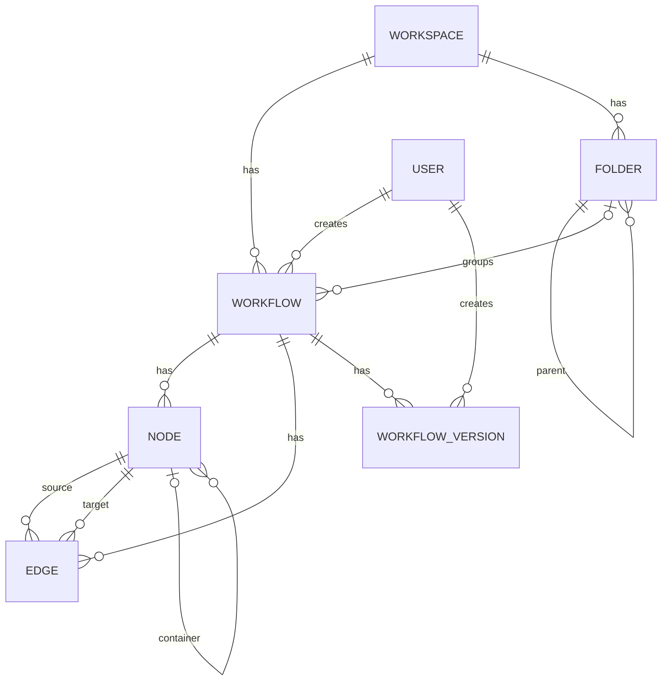
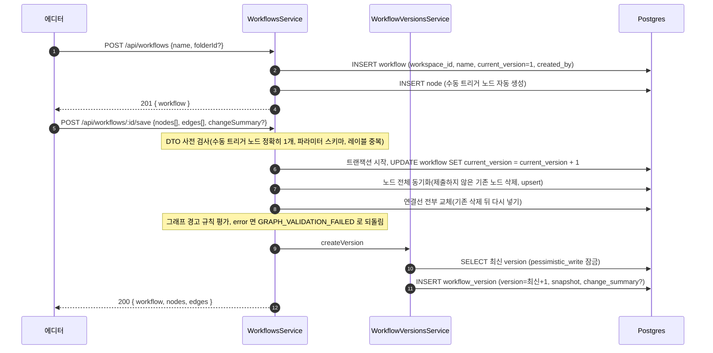
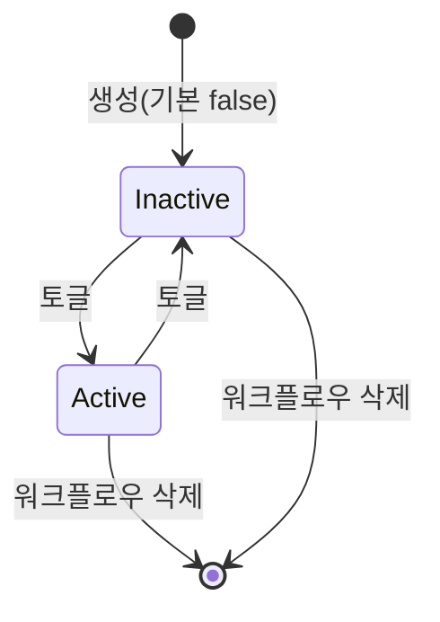

> 구현 상태: 구현됨 · 원문: `spec/data-flow/11-workflow.md`, `spec/1-data-model.md` (§2.4 Workflow, §2.5 Folder, §2.6 Node, §2.7 Edge, §2.15 WorkflowVersion, Rationale "WorkflowVersion.snapshot 구성 서술 정정") · 용어: [용어 사전](../CLE-GLOSSARY.md)

## 개요

워크플로우(Workflow, `workflow`)는 워크스페이스 안에서 사용자가 눈으로 보며 편집하는 자동화 단위다. 노드·연결선·메타 설정·버전 스냅샷을 묶어 한곳에서 관리한다. 이 문서는 워크플로우 작성 영역의 엔티티(Workflow, Folder, Node, Edge, WorkflowVersion)와 **편집 시점**의 데이터 흐름을 정한다. 워크플로우 생성, 캔버스 저장과 버전 스냅샷 생성, 컨테이너 소속 컬럼, 복제·내보내기·가져오기, 활성 상태 전이, 삭제 때의 FK 파급을 다룬다.

범위 밖:

- 실행 데이터와 실행 흐름은 [실행 데이터와 흐름](../CLE-EXEC/CLE-EXEC-DATA.md) 이 정한다.
- AI 어시스턴트 세션·메시지 엔티티와 저장 흐름은 [AI 어시스턴트 스트리밍과 세션 API](CLE-WF-ASSIST-PROTO.md) 가 정한다.
- 공통 컬럼 규칙, FK 삭제 동작 전체 지도, 인덱스 전략은 [데이터 모델 개요](../CLE-PLAT/CLE-PLAT-DATA.md) 가 정한다.
- 화면 동작은 [워크플로우 목록과 폴더](CLE-WF-LIST.md), [워크플로우 에디터와 캔버스](CLE-WF-EDITOR.md), [버전 기록](CLE-WF-VERSION.md) 이 정한다.
- 트리거 삭제 때 외부 자원·비밀을 정리하는 순서는 [트리거 관리](../CLE-TRIG/CLE-TRIG-MANAGE.md) 가 정한다.

## 엔티티 관계

워크스페이스 하나에 워크플로우와 폴더가 여럿 있다. 워크플로우는 폴더 하나에 들 수 있고, 노드·연결선·버전을 여럿 가진다. 연결선은 같은 워크플로우의 두 노드를 잇는다. 노드는 컨테이너 노드를 `container_id` 로 가리킬 수 있다.

## Workflow

| 필드 | 타입 | 설명 |
| --- | --- | --- |
| id | UUID | PK |
| workspace_id | UUID | FK → Workspace(CASCADE) |
| name | String | 워크플로우 이름 |
| description | String? | 설명 |
| is_active | Boolean | 워크플로우 활성 상태(`workflow.is_active`). 기본 `false`. 뜻은 [상태 전이](#상태-전이) 참조 |
| tags | String[] | 태그 목록 |
| folder_id | UUID? | FK → Folder(SET NULL, 같은 워크스페이스, 정리용). 같은 워크스페이스의 폴더만 가리킨다. 저장 전에 거부하고 DB 의 복합 FK 도 막는다([데이터 모델 개요 §참조의 소속](../CLE-PLAT/CLE-PLAT-DATA.md#참조의-소속)) |
| settings | JSONB | 워크플로우 수준 설정. 알려진 키는 `maxConcurrentExecutions: number?` 하나다. 워크플로우당 동시에 `running` 인 실행의 상한이고, 설정하지 않으면 기본 3이다. 동작은 [큐 워커와 동시 실행 제한](../CLE-EXEC/CLE-EXEC-WORKER.md) 이 정한다. 편집은 워크플로우 편집 권한(`PATCH /api/workflows/:id`, `editor` 이상)으로 한다. 모르는 키는 400 으로 거부한다([워크플로우 목록과 폴더](CLE-WF-LIST.md)). |
| current_version | Integer | 현재 버전 번호. 버전 기록의 번호와의 관계는 [미결 사항](#미결-사항) 참조 |
| created_by | UUID | FK → User(NO ACTION) |
| created_at | Timestamp | 생성 시각 |
| updated_at | Timestamp | 수정 시각 |

`(id, workspace_id)` UNIQUE(V135, `uq_workflow_id_workspace_id`)는 트리거 · 알림 규칙 · 어시스턴트 세션 · 테스트 데이터셋 복합 FK 의 참조 대상이다([데이터 모델 개요 「참조의 소속」](../CLE-PLAT/CLE-PLAT-DATA.md#참조의-소속)).

## Folder

| 필드 | 타입 | 설명 |
| --- | --- | --- |
| id | UUID | PK |
| workspace_id | UUID | FK → Workspace(CASCADE) |
| name | String | 폴더 이름 |
| parent_id | UUID? | FK → Folder(CASCADE, 같은 워크스페이스, 중첩 폴더) |
| sort_order | Integer | 정렬 순서(기본 0) |
| created_at | Timestamp | 생성 시각 |
| updated_at | Timestamp | 수정 시각 |

제약:

- `(workspace_id, parent_id, name)` UNIQUE. 같은 위치에 같은 이름을 둘 수 없다.
- 중첩 깊이는 최대 5단계다. 생성과 부모 변경 모두에 적용한다.
- `parent_id` 는 **같은 워크스페이스**의 폴더만 가리킨다. 생성과 부모 변경 모두 저장 전에 거부하고 DB 의 복합 FK `fk_folder_parent_id` 도 막는다([참조의 소속](../CLE-PLAT/CLE-PLAT-DATA.md#참조의-소속)).
- `(id, workspace_id)` UNIQUE(V137, `uq_folder_id_workspace_id`). 워크플로우 `folder_id` · 폴더 `parent_id` 복합 FK 의 참조 대상이다.
- 계층은 **순환하지 않는다**. 폴더는 자기 자신이나 자손을 부모로 가질 수 없다(부모 변경 때 검사).

제약을 어겼을 때의 에러 코드와 검사 순서는 [워크플로우 목록과 폴더](CLE-WF-LIST.md) 의 폴더 API 가 정한다.

## Node

| 필드 | 타입 | 설명 |
| --- | --- | --- |
| id | UUID | PK |
| workflow_id | UUID | FK → Workflow(CASCADE) |
| type | String(`VARCHAR(50)`) | 노드 유형. DB enum 이 아닌 자유 문자열이라 새 유형을 더할 때 enum 마이그레이션이 필요 없다. 허용 값은 아래 [노드 유형 목록](#노드-유형-목록) |
| category | Enum | `trigger` / `logic` / `flow` / `ai` / `integration` / `data` / `presentation` 7종. `trigger` 는 수동 트리거 노드용으로 V003 에서 더했다. |
| label | String | 노드 레이블. 워크플로우 안에서 유일하고 `#` 을 쓸 수 없다([표현식 언어](CLE-WF-EXPR.md)). |
| position_x | Float | 캔버스 X 좌표 |
| position_y | Float | 캔버스 Y 좌표 |
| config | JSONB | 노드별 설정 값 |
| is_disabled | Boolean | 노드 비활성화 여부 |
| description | String? | 메모·설명. 설정 패널의 노드 메모는 `config.notes` 에 저장한다. 두 필드의 관계는 [노드 포트와 설정 패널](CLE-WF-NODEPANEL.md) 의 미결 사항 참조 |
| container_id | UUID? | FK → Node(SET NULL, 같은 워크플로우). 컨테이너(Loop·ForEach·Map) 안에 속한 경우. 연결선을 잇고 지울 때 자동으로 맞춘다([워크플로우 에디터와 캔버스](CLE-WF-EDITOR.md)). [Background 노드](../CLE-NODE-LOGIC/CLE-NODE-BACKGROUND.md) 는 컨테이너 소속을 쓰지 않고 `background` 포트 연결선으로 본문을 알아본다. |
| tool_owner_id | UUID? | FK → Node(SET NULL, 같은 워크플로우). AI 에이전트 노드의 도구 영역에 등록한 경우. 도구 영역 기능은 제거됐고 컬럼만 남았다([AI 에이전트 노드](../CLE-NODE-AI/CLE-NODE-AGENT.md)). |
| created_at | Timestamp | 생성 시각 |
| updated_at | Timestamp | 수정 시각 |

제약:

- `container_id` 와 `tool_owner_id` 는 동시에 값을 가질 수 없다(CHECK 제약 `chk_node_placement`).
- `container_id`·`tool_owner_id` 는 **같은 워크플로우**의 노드만 가리킨다. 저장할 때 거부하고 DB 의 복합 FK(`fk_node_container_id` · `fk_node_tool_owner_id`)도 막는다([참조의 소속](../CLE-PLAT/CLE-PLAT-DATA.md#참조의-소속)). 아래 유형·순환·트리거 자식 검사는 여전히 실행 때 한다.
- `(id, workflow_id)` UNIQUE(V140, `uq_node_id_workflow_id`). 노드 구조 참조와 연결선 끝점 복합 FK 의 참조 대상이다.
- `container_id` 가 가리키는 노드의 유형은 `loop`, `foreach`, `map` 가운데 하나여야 한다.
- `container_id` 체인은 순환하면 안 된다. 실행 때 `CONTAINER_CYCLE` 에러로 거부한다.
- 트리거 카테고리 노드(`manual_trigger` 등)는 `container_id` 를 가질 수 없다. 실행 때 `CONTAINER_INVALID_CHILD` 에러로 거부한다.
- `tool_owner_id` 가 가리키는 노드의 유형은 `ai_agent` 여야 한다.

`chk_node_placement` 와 워크플로우 소속 검사를 빼면 위 제약은 저장 때 검사하지 않는다([컨테이너 소속과 도구 영역 컬럼](#컨테이너-소속과-도구-영역-컬럼)).

### 노드 유형 목록

노드별 동작과 전체 카탈로그는 [노드 시스템 구조와 카탈로그 §전체 노드 카탈로그](../CLE-NODE/CLE-NODE-ARCH.md#전체-노드-카탈로그) 가 정한다. 아래 표는 `node.type` 에 저장되는 값의 목록이다.

| category | type | 설명 |
| --- | --- | --- |
| trigger | `manual_trigger` | 수동 트리거 노드(워크플로우 시작점) |
| logic | `if_else` | 조건 분기 |
| logic | `switch` | 여러 갈래 분기 |
| logic | `loop` | 반복 |
| logic | `variable_declaration` | 변수 선언 |
| logic | `variable_modification` | 변수 수정 |
| logic | `split` | 배열 나누기 |
| logic | `map` | 배열 변환 |
| logic | `filter` | 조건에 따라 배열을 `match`·`unmatched` 두 포트로 나눔([Filter 노드](../CLE-NODE-LOGIC/CLE-NODE-FILTER.md)) |
| logic | `foreach` | 차례로 반복 |
| logic | `parallel` | 병렬 실행 |
| logic | `merge` | 데이터 합치기 |
| logic | `background` | 백그라운드 실행 |
| flow | `workflow` | 서브 워크플로우 호출 |
| ai | `ai_agent` | AI 에이전트 실행 |
| ai | `text_classifier` | 텍스트 분류 |
| ai | `information_extractor` | 정보 추출 |
| integration | `http_request` | 범용 HTTP 요청 |
| integration | `database_query` | 데이터베이스 쿼리 |
| integration | `send_email` | 이메일 발송(SMTP) |
| integration | `cafe24` | Cafe24 Admin API(리소스 × 동작 동적 폼). 같은 통합을 AI 에이전트 노드의 MCP 도구로도 쓴다([Cafe24 노드](../CLE-NODE-INT/CLE-NODE-CAFE24.md)). |
| integration | `makeshop` | MakeShop Shop API(리소스 × 동작 동적 폼, 7개 섹션 REST 161개). cafe24 처럼 AI 에이전트 노드의 MCP 도구로도 쓴다([MakeShop 노드](../CLE-NODE-INT/CLE-NODE-MAKESHOP.md)). makeshop 통합 중복은 통합 테이블의 공통 상점 식별자 partial UNIQUE 인덱스(`idx_integration_workspace_service_mall`, V072)가 `(workspace_id, service_type, mall_id)` 기준으로 막는다([통합 데이터와 흐름](../CLE-INT/CLE-INT-DATA.md)). |
| data | `transform` | 데이터 변환(연산 체인) |
| data | `code` | JavaScript 코드 실행 |
| presentation | `carousel` | 캐러셀(슬라이드) 시각화 |
| presentation | `table` | 테이블 시각화 |
| presentation | `chart` | 차트 시각화 |
| presentation | `form` | 사용자 입력 폼(Human-in-the-loop) |
| presentation | `template` | 템플릿 기반 콘텐츠 생성 |

## Edge

| 필드 | 타입 | 설명 |
| --- | --- | --- |
| id | UUID | PK |
| workflow_id | UUID | FK → Workflow(CASCADE) |
| source_node_id | UUID | FK → Node(CASCADE, 같은 워크플로우, 출력 노드) |
| source_port | String | 출력 포트 ID(예: `true`, `false`, `default`, `out`, `success`). 노드별 포트 ID 는 각 노드 문서가 정한다. |
| target_node_id | UUID | FK → Node(CASCADE, 같은 워크플로우, 입력 노드) |
| target_port | String | 입력 포트 ID(기본 `in`) |
| type | Enum | 연결선 유형: `data`(기본) / `error`(에러 포트 연결선) |
| condition | JSONB? | 연결선 조건(조건부 경로 선택용) |
| created_at | Timestamp | 생성 시각 |

제약:

- `(source_node_id, source_port, target_node_id, target_port)` UNIQUE. 같은 연결을 두 번 만들 수 없다.
- 자기 자신으로 연결할 수 없다(`source_node_id != target_node_id`, `chk_no_self_loop`).
- 출발 노드와 도착 노드는 같은 `workflow_id` 에 속해야 한다. 저장할 때 거부하고 DB 의 복합 FK(`fk_edge_source_node_id` · `fk_edge_target_node_id`)도 막는다([참조의 소속](../CLE-PLAT/CLE-PLAT-DATA.md#참조의-소속)).

에디터는 자기 연결과 중복 연결을 먼저 막고 DB 제약이 마지막 안전망이 된다([연결선](CLE-WF-EDGE.md)).

## WorkflowVersion

| 필드 | 타입 | 설명 |
| --- | --- | --- |
| id | UUID | PK |
| workflow_id | UUID | FK → Workflow(CASCADE) |
| version | Integer | 버전 번호. `(workflow_id, version)` UNIQUE |
| snapshot | JSONB | 워크플로우 캔버스 스냅샷 `{ name, description, nodes, edges }`. **`workflow.settings` 는 담지 않는다.** 버저닝·복원 대상은 캔버스와 이름·설명이다. 소비하는 쪽 타입(`VersionSnapshot`)은 [버전 기록](CLE-WF-VERSION.md) 에 있다. |
| change_summary | String? | 변경 요약. 저장 요청이 보낸 값이나 복원 때의 `Restored from vN` |
| created_by | UUID | FK → User(NO ACTION) |
| created_at | Timestamp | 생성 시각 |

## 생성과 저장 흐름

에디터의 주 편집 경로는 캔버스 전체를 한 번에 맞추는 저장(`POST /:id/save`)이다. 개별 노드·연결선 CRUD 엔드포인트(`POST /:id/nodes`, `POST /:id/edges` 등)도 있지만 에디터는 캔버스 상태 전체를 한 번에 맞춘다. 노드 생성·수정의 `containerId`·`toolOwnerId` 와 연결선 생성의 `sourceNodeId`·`targetNodeId` 도 같은 워크플로우의 노드만 받는다. 아니면 400 `VALIDATION_ERROR` 다([참조의 소속](../CLE-PLAT/CLE-PLAT-DATA.md#참조의-소속)). 서버 쪽 저장은 사용자의 수동 저장과 실행 직전 저장 두 경로로만 일어난다([워크플로우 에디터와 캔버스](CLE-WF-EDITOR.md)).

1. 워크플로우를 만들면 `current_version=1` 로 넣고 수동 트리거 노드를 자동으로 만든다. 버전 행은 만들지 않는다.
2. 저장 요청은 먼저 DTO 단계에서 검사한다.
   - 수동 트리거 노드가 정확히 하나여야 한다. 없거나 둘 이상이면 400 이다.
   - 수동 트리거 노드 파라미터 스키마를 어기면 400 `INVALID_TRIGGER_PARAMETERS` 다. 버전 복원 경로는 `skipLegacyDataGates` 로 이 검사를 건너뛴다.
   - 노드 레이블이 겹치면 거부한다(`DUPLICATE_NODE_LABEL`).
   - `containerId`·`toolOwnerId`·연결선 끝점이 이번 페이로드에 없는 노드를 가리키면 400 `VALIDATION_ERROR` 다(`details[].field` 예: `nodes[2].containerId`). 버전 복원 경로도 이 검사는 건너뛰지 않는다.
3. 트랜잭션 안에서 `current_version` 을 1 올리고, 노드 전체를 동기화하고, 연결선을 전부 교체한다. 노드를 동기화할 때 이 워크플로우에 없는 노드 id 는 새 노드로 본다. 그 id 를 다른 행이 이미 쓰면 400 `VALIDATION_ERROR`(`details[].field` 예: `nodes[1].id`)로 거부하고 그 행을 덮어쓰지 않는다([참조의 소속](../CLE-PLAT/CLE-PLAT-DATA.md#참조의-소속)).
4. 노드 사이 그래프 경고 규칙을 평가한다. 심각도 `error` 가 있으면 `GRAPH_VALIDATION_FAILED` 를 던져 트랜잭션을 되돌린다(저장 차단). 규칙은 [그래프 경고 규칙](CLE-WF-WARN.md) 이 정한다.
5. `createVersion` 이 최신 버전 번호를 `pessimistic_write` 잠금으로 읽고(`ORDER BY version DESC`) 다음 번호로 `workflow_version` 을 넣는다. 이 잠금이 같은 워크플로우의 동시 저장을 차례로 처리한다. 스냅샷은 이름·설명·노드·연결선의 JSONB 이고 `workflow.settings` 는 담지 않는다. 원문은 이 단계를 "같은 트랜잭션 안" 이라고 적는다. 버전 기록 원문과 정의가 갈린다. [미결 사항](#미결-사항) 참조.

버전 행을 만드는 전용 API(`POST /api/workflows/:id/versions`)는 없다. 버전 조회 API 와 복원 흐름(`POST /:id/versions/:versionId/restore` 가 스냅샷을 검사한 뒤 캔버스 저장 경로를 다시 써서 `Restored from vN` 새 버전을 만듦)은 [버전 기록](CLE-WF-VERSION.md) 이 정한다.

저장과 별개로 `GET /api/workflows/:id/graph-warnings` 는 같은 그래프 경고 규칙 평가를 저장 없이 돌려준다. 프론트엔드는 이 API 대신 500ms debounce 로 로컬 평가를 한다([그래프 경고 규칙](CLE-WF-WARN.md)).

## 컨테이너 소속과 도구 영역 컬럼

| 동작 | 노드 컬럼 변화 | 검사 |
| --- | --- | --- |
| Loop·ForEach·Map 안에 자식 노드 배치 | `child.container_id = container.id` | `container.type ∈ {loop, foreach, map}`. 트리거 카테고리 자식 거부(`CONTAINER_INVALID_CHILD`). 순환 거부(`CONTAINER_CYCLE`) |
| AI 에이전트 노드의 도구 영역에 배치(제거된 기능) | `tool.tool_owner_id = aiAgent.id` | `aiAgent.type = 'ai_agent'` |
| 둘 다 설정 | 없음 | CHECK 제약 `chk_node_placement`(V001)가 거부 |
| Background 본문 | `container_id` 를 쓰지 않는다. `background` 포트 연결선으로 알아본다([컨테이너 실행](../CLE-EXEC/CLE-EXEC-CONTAINER.md)). | 없음 |

위 표의 `container.type`·`CONTAINER_INVALID_CHILD`·`CONTAINER_CYCLE` 검사는 **편집·저장 때가 아니다**. (a) 실행 엔진이 실행할 때(`execution-engine.service.ts`)와 (b) AI 어시스턴트의 Shadow 검증(`ShadowWorkflow`)이 한다. 저장 경로(`saveCanvas`·노드 API)가 저장 때 보는 것은 **참조의 소속**뿐이다. `container_id`·`tool_owner_id` 는 같은 워크플로우의 노드여야 한다. 캔버스 저장은 이번 페이로드의 노드여야 한다. 아니면 400 `VALIDATION_ERROR` 다([참조의 소속](../CLE-PLAT/CLE-PLAT-DATA.md#참조의-소속)). DB 가 강제하는 것은 CHECK `chk_node_placement`(둘 다 설정 금지)와 같은 워크플로우 소속(복합 FK, V146)이다. 유형 · 순환 · 트리거 자식은 DB 가 보지 않는다.

## 어시스턴트 편집의 저장 경로

AI 어시스턴트의 편집 도구 호출은 **DB 를 직접 건드리지 않는다**. `workflow-assistant` 모듈은 `NodesService`·`EdgesService` 를 import 하지 않는다. 대신 메모리 복제본인 `ShadowWorkflow`(`codebase/backend/src/modules/workflow-assistant/tools/shadow-workflow.ts`)가 도구 호출을 검사하고 순서를 정한다. 성공한 도구 호출은 프론트엔드 에디터 store 가 먼저 적용하고, Postgres 저장은 사용자가 손으로 편집한 변경과 같은 경로(수동 저장, 실행 직전 저장)로만 일어난다([워크플로우 에디터와 캔버스 §저장](CLE-WF-EDITOR.md#저장)). 타이머 자동 저장은 없고, 에디터의 500ms debounce 는 저장이 아니라 그래프 경고 사전 평가용이다. 변경 결과는 어시스턴트 메시지의 `tool_calls[].result` 에 줄여 저장해 대화 기록에서 다시 볼 수 있다([워크플로우 AI 어시스턴트](CLE-WF-ASSIST.md)).

어시스턴트 세션·메시지 행(`workflow_assistant_session`, `workflow_assistant_message`)을 쓰는 흐름, SSE 이벤트, 세션 상태, 메시지 역할 순서는 [AI 어시스턴트 스트리밍과 세션 API](CLE-WF-ASSIST-PROTO.md) 가 정한다.

## 복제·내보내기·가져오기

| 엔드포인트 | 데이터 흐름 |
| --- | --- |
| `POST /api/workflows/:id/duplicate` | 메타와 **노드·연결선 전체**를 한 트랜잭션으로 복제한다. 이름 끝에 `" (Copy)"` 를 붙이고 `is_active=false` 로 두며 description·tags·folder_id·settings 는 물려받는다. 노드는 새 UUID 로 다시 발급하고 노드 사이 참조(`container_id`, `tool_owner_id`, 연결선 양 끝)도 새 UUID 로 바꾼다. AI 노드의 `llmConfigId` 는 같은 워크스페이스 안 복사라 원래 값을 그대로 둔다(가져오기와 달리 기본 모델 설정을 채우지 않는다). **복제하지 않는 것**: 버전 기록(`workflow_version`, 사본은 `current_version=1` 로 새로 시작), 트리거(`trigger`, 웹훅·스케줄), 테스트 데이터셋(`workflow_test_dataset`), 실행 내역. 내보내기·가져오기와 같은 경계다. |
| `GET /api/workflows/:id/export` | 워크플로우 메타(name, description, tags, settings)와 노드·연결선 전체를 JSON 으로 직렬화한다. 노드 사이 참조(`container_id`, `tool_owner_id`, 연결선 양 끝)는 UUID 대신 **nodes 배열 인덱스**로 바꿔 다른 환경으로 옮길 수 있게 한다. |
| `POST /api/workflows/import` | 내보낸 JSON 을 받아 새 워크플로우·노드·연결선을 한 트랜잭션으로 만든다. 인덱스 참조를 새 UUID 로 바꾸고, AI 노드에 `llmConfigId` 가 없으면 워크스페이스 기본 모델 설정을 채운다. 페이로드 안에 노드 레이블이 겹치면 409(`DUPLICATE_NODE_LABEL`)다. |

파일 형식과 가져오기 검사 순서는 [워크플로우 목록과 폴더](CLE-WF-LIST.md) 가 정한다.

## Postgres 쓰기 매핑

| 테이블 | 흐름 | 읽고 쓰는 컬럼 | 인덱스·제약 |
| --- | --- | --- | --- |
| `workflow` | 생성 | INSERT `workspace_id, name, description?, is_active=false, tags='{}', folder_id?, settings={}, current_version=1, created_by` | `folder_id` 는 같은 워크스페이스 폴더만(저장 전 거부). FK `workspace_id`(CASCADE), 복합 FK `(folder_id, workspace_id)`(SET NULL, `folder_id` 만 비운다). V123 `(folder_id)` partial(폴더 삭제 때 FK SET NULL 용) |
| `workflow` | 복제 | INSERT. 생성과 같은 컬럼이다. `name` 은 원본 + `" (Copy)"`, `is_active=false`, `current_version=1` 고정. description·tags·folder_id·settings 는 원본 값, `created_by` 는 **요청한 사용자** | 같음 |
| `workflow` | 활성 토글 | UPDATE `is_active, updated_at` | 없음 |
| `workflow` | 저장(버전 커밋) | UPDATE `current_version, updated_at` | 없음 |
| `workflow` | 삭제 | DELETE. 자식 행 FK 파급은 [상태 전이](#상태-전이) 참조. 트리거 자원 정리: 외부 자원을 트랜잭션 **전에** 풀고, 삭제 트랜잭션의 첫 호출로 잠금 대기 상한(5초)을 건 뒤 `workflow` 행을 먼저 잠그고(`pessimistic_write`) 그 워크플로우의 트리거 id 를 모은 다음 지운다. 커밋 **뒤** 그 트리거들의 `secret_store` 비밀을 지운다([트리거 관리](../CLE-TRIG/CLE-TRIG-MANAGE.md)). | 행 잠금은 트리거 INSERT 의 FK 검사(`FOR KEY SHARE`)를 막아 모을 때 빠지는 트리거가 없게 한다. |
| `node` | 추가 | INSERT `workflow_id, type, category, label, position_x/y, config={}, container_id?, tool_owner_id?` | CHECK `chk_node_placement`(둘 다 설정 금지). `container_id`·`tool_owner_id` 는 같은 워크플로우 노드만(저장 전 거부, 복합 FK). 캔버스 저장이 새 노드로 싣는 `id` 가 다른 행의 id 면 거부(그 행을 덮어쓰지 않는다) |
| `node` | 복제 | INSERT. 추가와 같은 컬럼이다. `id` 를 새로 발급하고 `container_id`·`tool_owner_id` 를 사본 UUID 로 바꾼다. `config` 는 원본 그대로다(기본값 다시 채우기, 모델 설정 채우기 없음). | 같음. 원본이 이미 통과한 레이블 유일성은 다시 검사하지 않는다. |
| `node` | 이동·설정 변경 | UPDATE `position_x, position_y, config, label, is_disabled` | 없음 |
| `node` | 컨테이너·도구 영역 배치 | UPDATE `container_id` 또는 `tool_owner_id` | 같은 워크플로우 노드만. 저장 전 거부하고 복합 FK 도 막는다([참조의 소속](../CLE-PLAT/CLE-PLAT-DATA.md#참조의-소속)). 순환 검사는 실행 시와 AI 어시스턴트 Shadow 검증에서(`CONTAINER_CYCLE`) |
| `edge` | 추가 | INSERT `workflow_id, source_node_id, source_port, target_node_id, target_port, type IN (data/error), condition?` | 끝점은 같은 워크플로우 노드만(저장 전 거부, 복합 FK). `(source_node_id, source_port, target_node_id, target_port)` UNIQUE, `chk_no_self_loop`, FK CASCADE. V121 `(target_node_id)`(노드 삭제 때 FK CASCADE 용) |
| `edge` | 복제 | INSERT. 추가와 같은 컬럼이다. `source_node_id`·`target_node_id` 를 사본 노드 UUID 로 바꾼다. | 같음 |
| `workflow_version` | 저장(버전 커밋) | INSERT `workflow_id, version, snapshot=JSONB, change_summary?, created_by, created_at` | `(workflow_id, version)` UNIQUE |

## Redis·파일 저장소·외부

| 대상 | 흐름 | 비고 |
| --- | --- | --- |
| Redis | 없음 | 이 영역은 큐에 직접 넣지 않는다. 실행을 시작하면 [실행 데이터와 흐름](../CLE-EXEC/CLE-EXEC-DATA.md) 의 큐로 들어간다. |
| 파일 저장소 | 없음 | 워크플로우 자체는 파일 저장소를 쓰지 않는다. Form 노드 첨부는 [파일 저장소](../CLE-PLAT/CLE-PLAT-STORAGE.md) 가 다룬다. |
| LLM 프로바이더·SSE | AI 어시스턴트 응답 스트리밍 | [AI 어시스턴트 스트리밍과 세션 API](CLE-WF-ASSIST-PROTO.md). 사용량은 `llm_usage_log` 에 쌓는다([LLM 사용량 기록](../CLE-AI/CLE-AI-USAGE.md)). |

## 상태 전이

### 워크플로우 활성 상태

워크플로우는 비활성으로 태어나고 목록의 상태 스위치로 켜고 끈다. 수동 실행은 비활성 워크플로우도 된다. 원문은 스케줄·웹훅 트리거는 활성 워크플로우만 동작한다고 적지만 트리거 흐름과 현재 구현은 이 값을 보지 않는다. 정의가 갈린다. `workflow.is_active` 를 트리거 발사 관문으로 둘지는 [트리거 데이터와 흐름의 미결 사항](../CLE-TRIG/CLE-TRIG-DATA.md#미결-사항) 에서 정한다. 그 전까지 이 문장은 확정된 규칙이 아니다.

### 워크플로우 삭제의 FK 파급

마이그레이션의 `REFERENCES workflow` 를 **모두** 적었다. `trigger` · `alert_rule` · `workflow_assistant_session` · `workflow_test_dataset` 은 V141 부터 `REFERENCES workflow (id, workspace_id)` 복합 FK 다(삭제 동작은 같다). 직접 참조만 적고, 2차 파급은 트리거 동시성 설명이 기대는 `trigger → schedule` 하나만 적는다.

| 테이블 | `ON DELETE` | 마이그레이션 |
| --- | --- | --- |
| `node`, `edge`, `execution`, `workflow_version` | CASCADE | `V001__initial_schema.sql` |
| `trigger` | CASCADE. 이어서 `schedule`(`schedule.trigger_id` CASCADE)까지 2차로 지워진다. **DB 수준이라 트리거 단위 advisory lock 을 거치지 않는다.** 트리거가 쓰던 외부 등록·비밀의 정리는 이 CASCADE 앞뒤로 앱이 한다([트리거 관리](../CLE-TRIG/CLE-TRIG-MANAGE.md)). | `V001__initial_schema.sql` · `V141__composite_fk_scope_workflow_not_valid.sql`(복합 FK) |
| `integration_usage_log` | CASCADE | `V008__integration_usage_log_and_metadata.sql` |
| `llm_usage_log` | **SET NULL**. 사용량 이력은 남는다. | `V014__llm_usage_logs.sql` |
| `alert_rule` | CASCADE | `V016__alert_rules.sql` · `V141__composite_fk_scope_workflow_not_valid.sql`(복합 FK) |
| `workflow_assistant_session` | CASCADE | `V019__workflow_assistant.sql` · `V141__composite_fk_scope_workflow_not_valid.sql`(복합 FK) |
| `workflow_test_dataset` | CASCADE | `V097__workflow_test_dataset.sql` · `V141__composite_fk_scope_workflow_not_valid.sql`(복합 FK) |

## 외부 의존

| 의존 | 방향 | 참고 |
| --- | --- | --- |
| 계정·워크스페이스 | 역할 기반 권한 검사 | `editor` 이상이 CRUD 할 수 있다([워크스페이스와 멤버](../CLE-ACCT/CLE-ACCT-WS.md)). |
| 실행 | 워크플로우 실행 시작 | [실행 데이터와 흐름](../CLE-EXEC/CLE-EXEC-DATA.md) |
| LLM 사용량 | AI 어시스턴트 LLM 호출 | [LLM 사용량 기록](../CLE-AI/CLE-AI-USAGE.md) |
| SSE | AI 어시스턴트 스트리밍 | `WorkflowAssistantController` 의 `text/event-stream` HTTP 응답(WebSocket room 미사용). [AI 어시스턴트 스트리밍과 세션 API](CLE-WF-ASSIST-PROTO.md) |

## 미결 사항

- **저장과 버전 생성이 한 트랜잭션인가**: 이 문서의 원문(데이터 흐름)과 에디터 원문(저장과 버전의 관계)은 `createVersion` 을 캔버스 저장과 같은 트랜잭션 안에서 부른다고 적는다. [버전 기록](CLE-WF-VERSION.md) 의 원문은 캔버스 트랜잭션을 커밋한 직후 버전을 만들고, 버전 생성이 실패하면 캔버스는 저장된 채로 두고 다음 저장에서 따라잡는다고 적는다. 현재 구현(`workflows.service.ts` 의 `saveCanvas`)은 같은 트랜잭션에서 `createVersion` 을 불러 둘 다 커밋하거나 둘 다 되돌린다. 버전 생성 실패 때 저장 전체를 되돌릴지 결정이 필요하다.
- **`current_version` 의 뜻**: 데이터 모델은 `current_version` 을 "현재 버전 번호" 라고 적는다. 그런데 워크플로우는 `current_version=1` 로 버전 행 없이 만들어지고, 저장할 때마다 `current_version` 과 `workflow_version.version`(최신+1)이 따로 오른다. 그래서 현재 구현에서 `current_version` 은 버전 기록의 최신 vN 보다 늘 1 크다(`workflows.service.ts`, `workflow-versions.service.ts`). [버전 기록](CLE-WF-VERSION.md) 은 `current_version` 을 언급하지 않는다. `current_version` 이 저장 횟수 + 1 인지 최신 버전 번호인지 정하고 여기에 적어야 한다.
- **워크플로우 활성 상태가 트리거 실행을 막는가**: 이 문서의 원문(상태 전이 "스케줄·웹훅 트리거는 활성만 동작")과 [워크플로우 목록과 폴더](CLE-WF-LIST.md) 의 원문(비활성이면 트리거·스케줄 중지)은 워크플로우를 끄면 웹훅·스케줄이 멈춘다고 적는다. [트리거 데이터와 흐름](../CLE-TRIG/CLE-TRIG-DATA.md) 의 웹훅·스케줄 흐름은 `trigger.is_active`·`schedule.is_active` 만 본다. 현재 구현(`hooks.service.ts`, schedule runner)도 `workflow.is_active` 를 확인하지 않는다. 실행 게이트로 둘지, 표시용으로 둘지 결정이 필요하다. 결정은 [트리거 데이터와 흐름의 미결 사항](../CLE-TRIG/CLE-TRIG-DATA.md#미결-사항) 에서 한다.

## 구현 위치

- `codebase/backend/src/modules/workflows/workflows.service.ts` (Workflow CRUD, `saveCanvas`, 복제·내보내기·가져오기)
- `codebase/backend/src/modules/nodes/nodes.service.ts` (Node CRUD)
- `codebase/backend/src/modules/edges/edges.service.ts` (Edge CRUD)
- `codebase/backend/src/modules/workflow-versions/workflow-versions.service.ts` (버전 스냅샷)
- `codebase/backend/src/modules/folders/**` (Folder)
- `codebase/backend/migrations/V001__initial_schema.sql` (테이블·CHECK 제약)
- `codebase/backend/migrations/V135__workflow_id_workspace_id_unique_index.sql`, `codebase/backend/migrations/V137__folder_id_workspace_id_unique_index.sql`, `codebase/backend/migrations/V140__node_id_workflow_id_unique_index.sql`, `codebase/backend/migrations/V141__composite_fk_scope_workflow_not_valid.sql`, `codebase/backend/migrations/V143__composite_fk_scope_folder_not_valid.sql`, `codebase/backend/migrations/V146__composite_fk_scope_node_not_valid.sql` (부모 UNIQUE 와 복합 FK)

## Rationale

### 노드 배치 두 축은 함께 설정할 수 없다

`container_id` 와 `tool_owner_id` 는 뜻이 근본적으로 다르다(실행 맥락과 도구 영역 등록). CHECK 제약 `chk_node_placement`(V001)로 둘을 함께 설정하지 못하게 해 잘못된 정의를 DB 에서 막는다. Background 노드는 `container_id` 를 쓰지 않고 `background` 포트 연결선으로 본문을 알아보므로 이 제약과 부딪히지 않는다.

### 버전 스냅샷은 JSONB 한 덩어리다

`workflow_version.snapshot` 은 이름·설명·노드·연결선 스냅샷을 JSONB 하나로 저장한다. `workflow.settings` 는 담지 않는다. 버저닝과 복원의 대상은 캔버스와 이름·설명이다. JSONB 한 덩어리의 장점은 세 가지다. (1) "어느 시점의 캔버스" 를 행 하나로 복원할 수 있다. (2) `node`·`edge` 테이블 스키마가 바뀌어도 지난 버전을 그대로 보존한다. (3) 비교와 차이 계산을 애플리케이션에서 자유롭게 구현할 수 있다. 대신 행이 커질 수 있는데, 버전이 생기는 빈도가 낮아 받아들일 만하다고 판단했다.

`settings` 를 빼는 것은 빠뜨린 것이 아니라 **의도한 설계**다. 데이터 모델 문서의 스냅샷 설명이 한때 "nodes, edges, **settings**" 였지만 구현(`WorkflowsService.buildSnapshot()`)은 `name`·`description`·`nodes`·`edges` 만 돌려주고 `settings` 를 담은 적이 없다. 2026-06-10 명세·코드 전수 감사가 데이터 흐름 문서만 고치고 데이터 모델 문서를 함께 고치지 않아 한곳만 어긋났던 것을 2026-07-31 에 맞췄다. 그대로 두었다면 "버전을 복원하면 settings 도 되돌아온다" 는 오해를 낳았을 것이다. 실제로는 캔버스와 이름·설명만 복원된다.

### 복제는 캔버스 전체를 복사한다

데이터 흐름 문서는 한때 복제를 "워크플로우 메타 행만 복제하고 노드·연결선은 복제하지 않는다" 고 적었다. 그 문장은 제품 결정이 아니었다. 명세·코드 전수 상호 감사(`db496a3c2`) 때 **당시 구현을 보고 그대로 받아 적은 동기화 결과물**이었다. 그 구현(`WorkflowsService.duplicate()`)은 초기 골격 커밋(`8ff4e8564`) 뒤로 한 번도 손대지 않은 미완성 상태였다. 그래서 복제본은 노드가 하나도 없는 **빈 워크플로우**였다. `create()` 가 자동으로 만드는 수동 트리거 노드조차 없어 뒤이은 캔버스 저장이 "수동 트리거 노드 정확히 1개" 사전 검사에 걸렸다.

같은 저장소의 사용자 관점 기준은 한결같이 반대를 말했다. 요구사항 NAV-WF-04 와 워크플로우 목록 화면 명세는 "복사본" 을 약속한다. 테스트 데이터셋 복제 설계도 복제를 선례로 들지만, 그것은 "복제한 뒤 자기 소유" 라는 **소유권 방식**의 선례일 뿐 노드 내용 복사를 직접 말하지는 않는다. 두 서술이 부딪히면 사용자 가치를 적은 쪽을 따르므로 명세를 코드에 맞추지 않고 코드를 고쳤다.

기각한 대안: **명세를 코드에 맞춰 "메타만 복제" 로 확정**. 위 반대 근거가 이미 반대를 말하고 있어 이쪽을 고르면 정합성이 오히려 나빠진다. 무엇보다 사용자에게는 "복제를 눌렀는데 빈 워크플로우가 나온다" 는 결함이 그대로 남는다.

### 복제는 내보내기·가져오기를 다시 쓰지 않는다

`exportWorkflow` 다음 `importWorkflow` 를 안에서 부르면 UUID → 인덱스 → UUID 왕복 직렬화가 낭비다. 무엇보다 가져오기 전용 관문(레이블 중복 409, 예약 변수명 검사, 워크스페이스 기본 모델 설정 채우기, `applyConfigDefaults`)이 사본에 적용돼 **원본과 다른 사본**이 나온다. 특히 기본 모델 설정 채우기는 원본이 일부러 비워 둔 `llmConfigId` 를 채워 복제가 설정을 바꾸게 만든다. 원본은 이미 그 관문을 통과해 저장된 데이터라 다시 검사할 필요도 없다. 그래서 UUID 를 바꿔 넣는 공통 알고리즘만 같은 모양으로 쓰고 관문은 공유하지 않는다.

### 복제는 버전 기록·트리거·테스트 데이터셋을 물려받지 않는다

`workflow_version` 은 "이 워크플로우가 어떻게 바뀌어 왔는가" 의 기록이다. 사본은 복제 시점에 태어난 새 워크플로우다. 원본의 편집 이력을 물려받으면 사본의 v1 스냅샷이 사실은 원본의 과거가 되어 `restoreVersion` 이 사본에 있었던 적 없는 상태를 복원하게 된다. 트리거(웹훅·스케줄)를 물려받으면 같은 이벤트가 두 워크플로우를 동시에 시작시켜 사용자가 뜻하지 않은 중복 실행이 생긴다. 사본이 `is_active=false` 로 시작하는 것과 같은 방향의 안전한 선택이다. `workflow_test_dataset` 은 사용자에게 속한 자원이라 소유권 축이 다르다([에디터 실행과 디버깅](../CLE-EXEC/CLE-EXEC-RUN.md)). 셋 다 가져오기 경로가 만들지 않는 것과 같은 경계라 일관된 선택이다.

기각한 대안: **복제본에도 수동 트리거 노드를 자동 생성**(`create()` 처럼). 원본에 이미 수동 트리거 노드가 있으므로 중복이 되어 "정확히 1개" 불변식을 깬다. 원본이 비어 있을 때만 뜻이 있는데 그 경우는 원본 자체가 비정상이다.
