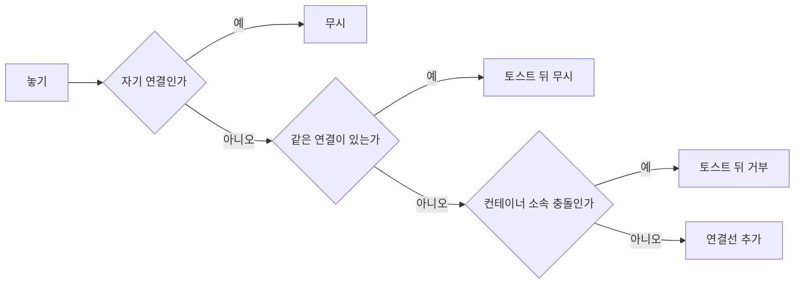

> 구현 상태: 부분 구현 · 원문: `spec/3-workflow-editor/2-edge.md`, `spec/3-workflow-editor/_product-overview.md` (§3.3 ED-EG-01~06) · 용어: [용어 사전](../CLE-GLOSSARY.md)

## 개요

연결선(Edge, `edge`)은 앞 노드의 출력 포트와 뒤 노드의 입력 포트를 잇는 선이다. `type` 값은 `data` 또는 `error` 다. 이 문서는 에디터에서 연결선을 만들고, 다시 잇고, 지우고, 나누는 동작과 연결 유효성 규칙, 연결선의 시각 표현, 데이터 미리보기(Data Flow Preview), 컨테이너 연결선 규칙, 워크플로우를 불러올 때의 연결선 자동 정리(`dropStaleEdges`)를 정한다.

범위 밖:

- 포트 체계와 포트 색은 [노드 포트와 설정 패널](CLE-WF-NODEPANEL.md) 이 정한다. 노드별 포트 ID 는 각 노드 문서가 정한다.
- 컨테이너 소속(`containerId`)을 연결선으로 정하는 규칙과 컨테이너 삭제는 [워크플로우 에디터와 캔버스](CLE-WF-EDITOR.md) 가 정한다.
- `edge` 테이블 컬럼과 DB 제약은 [워크플로우 데이터와 저장 흐름](CLE-WF-DATA.md) 이 정한다.
- 탈출 불가 순환 경고를 포함한 그래프 경고 규칙의 등록과 평가 구조는 [그래프 경고 규칙](CLE-WF-WARN.md) 이 정한다.
- 순환 연결선을 따라 실행하는 방식과 컨테이너 본문 실행은 [실행 엔진 개요와 그래프 순회](../CLE-EXEC/CLE-EXEC-ENGINE.md) 와 [컨테이너 실행](../CLE-EXEC/CLE-EXEC-CONTAINER.md) 이 정한다.

## 요구사항

- REQ-EDGE-001 WHEN 사용자가 노드의 출력 포트를 끌어 다른 노드의 입력 포트에 놓으면 THE SYSTEM SHALL 두 포트를 잇는 연결선을 만든다. (원본: ED-EG-01)
- REQ-EDGE-002 WHILE 연결선을 그리는 동안 THE SYSTEM SHALL target 쪽 끝에 포트 색과 같은 색의 화살표 머리를 그려 데이터 흐름 방향을 보여 준다. (원본: ED-EG-02)
- REQ-EDGE-003 WHEN 사용자가 연결선을 누르면 THE SYSTEM SHALL 그 연결선을 선택한다. (원본: ED-EG-03)
- REQ-EDGE-004 WHEN 사용자가 연결선을 선택한 채 Delete·Backspace 를 누르면 THE SYSTEM SHALL 그 연결선을 지운다. (원본: ED-EG-03)
- REQ-EDGE-005 IF 사용자가 유효하지 않은 연결을 시도하면 THE SYSTEM SHALL 연결할 수 없음을 시각적으로 표시한다. (원본: ED-EG-04)
- REQ-EDGE-006 WHILE 연결선을 그리는 동안 THE SYSTEM SHALL 곡선(Bezier) 스타일로 그린다. (원본: ED-EG-05)
- REQ-EDGE-007 WHEN 실행이 끝난 뒤 사용자가 연결선에 마우스를 올리면 THE SYSTEM SHALL 그 연결선으로 흐른 데이터의 미리보기 툴팁을 보여 준다. (원본: ED-EG-06)
- REQ-EDGE-008 WHILE 사용자가 출력 포트를 끄는 동안 THE SYSTEM SHALL 커서를 따라가는 점선 임시 연결선을 그린다.
- REQ-EDGE-009 IF 사용자가 유효하지 않은 곳에 놓으면 THE SYSTEM SHALL 임시 연결선을 지우고 연결선을 만들지 않는다.
- REQ-EDGE-010 WHEN 사용자가 출력 포트에서 끈 연결선을 빈 영역에 놓으면 THE SYSTEM SHALL 노드 검색 팝업을 열고 고른 노드를 만든 뒤 출발 포트에서 새 노드의 첫 입력 포트로 연결한다.
- REQ-EDGE-011 IF 새 노드에 입력 포트가 없으면 THE SYSTEM SHALL 노드만 만들고 자동 연결을 건너뛴다.
- REQ-EDGE-012 WHEN 사용자가 빈 영역 놓기로 노드와 연결선을 함께 만든 뒤 Ctrl+Z 를 한 번 누르면 THE SYSTEM SHALL 노드와 연결선을 함께 되돌린다.
- REQ-EDGE-013 WHEN 사용자가 입력 포트에서 끌어 출력 포트에 놓으면 THE SYSTEM SHALL 출력에서 입력 방향의 연결선을 만든다.
- REQ-EDGE-014 WHEN 사용자가 기존 연결선의 끝점을 다른 포트로 끌어 놓으면 THE SYSTEM SHALL 연결선 id 를 유지한 채 다시 잇는다.
- REQ-EDGE-015 WHEN 사용자가 기존 연결선의 끝점을 빈 캔버스에 놓으면 THE SYSTEM SHALL 그 연결선을 지운다.
- REQ-EDGE-016 IF 사용자가 끝점을 연결할 수 없는 포트 위에 놓으면 THE SYSTEM SHALL 연결선을 원래대로 둔다.
- REQ-EDGE-017 IF 연결선의 출발 노드와 도착 노드가 같으면 THE SYSTEM SHALL 드래그 중 금지 커서를 보이고 연결선을 만들지 않는다.
- REQ-EDGE-018 IF 출력 포트끼리나 입력 포트끼리 이으려 하면 THE SYSTEM SHALL 금지 커서를 보이고 연결선을 만들지 않는다.
- REQ-EDGE-019 IF 같은 출발 노드·출발 포트·도착 노드·도착 포트의 연결선이 이미 있으면 THE SYSTEM SHALL "already connected" 토스트를 보이고 연결선을 만들지 않는다.
- REQ-EDGE-020 WHEN 사용자가 순환을 만드는 연결선을 그리면 THE SYSTEM SHALL 연결선 생성을 막지 않는다.
- REQ-EDGE-021 IF 되돌아가는 연결선의 출발 노드가 분기 노드가 아니면 THE SYSTEM SHALL 그 노드에 `graph:unescapable-cycle` 경고(`warning`, 노란 배지)를 붙인다.
- REQ-EDGE-022 WHILE 연결선을 그리는 동안 THE SYSTEM SHALL 출발 포트 종류에 따라 데이터는 초록, 에러는 빨강, 시스템은 파랑, 컨테이너 본문 진입은 보라로 칠한다.
- REQ-EDGE-023 WHILE 실행 중에 출발 노드가 완료되고 도착 노드가 실행 중인 동안 THE SYSTEM SHALL 연결선을 흐르는 점선 애니메이션으로 그린다.
- REQ-EDGE-024 WHEN 출발 노드와 도착 노드가 모두 완료되면 THE SYSTEM SHALL 연결선을 잠깐 초록으로 바꿨다가 원래 색으로 돌린다.
- REQ-EDGE-025 WHILE 연결선의 한쪽 노드가 비활성화돼 있는 동안 THE SYSTEM SHALL 연결선을 반투명 점선으로 그리고 실행 상태 스타일을 입히지 않는다.
- REQ-EDGE-026 WHEN 사용자가 노드에 마우스를 올리거나 노드를 고르면 THE SYSTEM SHALL 연결된 연결선을 강조하고 나머지 연결선을 흐리게 한다.
- REQ-EDGE-027 WHEN 사용자가 연결선에 마우스를 올리면 THE SYSTEM SHALL 그 연결선만 강조하고 양 끝 노드에 glow 효과를 준다.
- REQ-EDGE-028 WHEN 사용자가 팔레트의 노드를 연결선 위에 놓으면 THE SYSTEM SHALL 원래 연결선을 지우고 출발 노드에서 새 노드로, 새 노드에서 도착 노드로 가는 연결선 두 개를 만든다.
- REQ-EDGE-029 IF 놓은 노드에 입력 포트나 출력 포트가 없거나 그 노드가 컨테이너이면 THE SYSTEM SHALL 연결선을 나누지 않고 노드만 추가한다.
- REQ-EDGE-030 IF 노드를 놓은 연결선이 `body` 에서 나가거나 `emit` 으로 들어가는 컨테이너 경계 연결선이면 THE SYSTEM SHALL 연결선을 나누지 않고 노드만 추가한다.
- REQ-EDGE-031 WHEN 연결선 분할 뒤 사용자가 Ctrl+Z 를 한 번 누르면 THE SYSTEM SHALL 새 노드와 새 연결선 두 개를 지우고 원래 연결선을 되살린다.
- REQ-EDGE-032 WHEN 사용자가 데이터 미리보기 툴팁의 "전체 데이터 보기" 를 누르면 THE SYSTEM SHALL 줄이지 않은 전체 JSON 을 모달로 보여 준다.
- REQ-EDGE-033 IF 출발 노드에 실행 데이터가 없으면 THE SYSTEM SHALL 데이터 미리보기 툴팁을 그리지 않는다.
- REQ-EDGE-034 WHILE Loop·ForEach·Map 을 실행하는 동안 THE SYSTEM SHALL 본문 자식 가운데 정확히 하나가 컨테이너의 `emit` 포트에 연결돼 있기를 요구한다.
- REQ-EDGE-035 IF `emit` 연결선이 없거나 둘 이상이면 THE SYSTEM SHALL 실행 전에 `CONTAINER_MISSING_EMIT` 또는 `CONTAINER_MULTIPLE_EMIT` 으로 실패시킨다.
- REQ-EDGE-036 WHEN 에디터가 워크플로우를 불러오면 THE SYSTEM SHALL 지금 노드 설정의 포트 집합에 없는 포트에 붙은 연결선을 지운다.
- REQ-EDGE-037 IF 불러올 때 연결선을 하나 이상 지웠으면 THE SYSTEM SHALL 지운 개수를 담은 경고 토스트를 보여 준다.
- REQ-EDGE-038 WHILE 자동 정리한 연결선을 저장하지 않은 동안 THE SYSTEM SHALL 데이터베이스의 연결선을 그대로 둔다.
- REQ-EDGE-039 WHEN 사용자가 연결선을 내부 노드와 외부 노드 사이로 직접 이으면 THE SYSTEM SHALL 연결을 막는다(정의가 갈린다, 미결 사항 참조). (부분 구현)

## 연결선 만들기

### 끌어서 잇기

1. 출력 포트에서 마우스를 누르고 끌기 시작한다.
2. 커서를 따라가는 점선 임시 연결선을 그린다.
3. 유효한 입력 포트 위에서 마우스를 떼면 실선 연결선을 만든다.
4. 유효하지 않은 곳에서 떼면 임시 연결선을 지운다.

### 빈 영역에 놓기

- 출력 포트에서 끌어 빈 영역에 놓으면 노드 검색 팝업을 연다.
- 노드를 고르면 그 노드를 만들고 연결선을 자동으로 잇는다. 출발 쪽 출력 포트에서 새 노드의 첫 입력 포트로 잇는다.
- 새 노드에 입력 포트가 없으면(예: 트리거) 노드만 만들고 자동 연결은 건너뛴다.

현재 구현: `workflow-canvas.tsx` 의 `onConnectEnd` 가 처리한다. React Flow v12 의 `connectionState` 로 출력 포트(`fromHandle.type === 'source'`)를 끌다가 유효한 대상 없이(`isValid !== true`) 빈 영역에 놓았는지 판정한다. 그러면 놓은 자리에 노드 검색 팝업(더블클릭·우클릭 메뉴와 같은 팝업)을 열고 `NodeSearchPopupState.dragSource` 에 출발 포트를 기록한다. 노드를 고르면 `handleAddNodeFromSearch` 가 노드를 만들고(`buildAndAddNode` 가 새 노드 id 를 돌려줌) `onConnect(출발 포트 → 새 노드의 첫 입력 포트)` 로 잇는다. `onConnect` 의 `skipUndo` 옵션으로 "노드는 있고 연결선은 없는" 중간 상태를 따로 undo 스냅샷으로 남기지 않는다. 그래서 Ctrl+Z 한 번에 노드와 연결선을 함께 되돌린다. 판정·조립 순수 헬퍼는 `edge-utils.ts` 의 `connectionDragSource`, `pointerClientPosition`, `buildAutoConnectConnection`, `firstInputHandleId` 다. 입력 포트에서 시작한 역방향 끌기는 [역방향 연결과 다시 잇기](#역방향-연결과-다시-잇기) 가 다루므로 여기서는 뺀다.

### 역방향 연결과 다시 잇기

- 입력 포트에서 끌기 시작하면 역방향으로 연결선을 만든다. 놓을 대상은 출력 포트다.
- 이미 이어진 연결선의 끝점을 끌면 그 연결선을 떼어 다른 포트로 다시 잇는다. 빈 영역에 놓으면 지운다. 이 동작을 연결선 분리(detach)라고 한다. 연결선 분할과 다르다.

**역방향 연결**은 React Flow 의 기본 연결 모드(strict `connectionMode`)가 지원한다. 입력 포트(`target` 핸들)에서 끌어 출력 포트(`source` 핸들)에 놓으면 React Flow 가 Connection 을 핸들 종류 기준으로 정규화한다(source 는 출력 노드, target 은 입력 노드). 핸들에 `isConnectableStart`·`isConnectableEnd` 제약을 두지 않고 `onConnect`·`isValidConnection` 이 정규화된 Connection 을 방향과 상관없이 처리하므로 끈 방향과 관계없이 항상 올바른 방향의 연결선이 생긴다. 별도 코드는 필요 없다.

**다시 잇기**는 `workflow-canvas.tsx` 가 `onReconnect`·`onReconnectEnd` 두 콜백을 연결해 처리한다(로직은 `use-edge-reconnect.ts` 의 `useEdgeReconnect` 훅). React Flow 가 다시 이을 수 있는 연결선의 끝점 앵커를 자동으로 그리므로 끝점을 잡아 다른 포트로 끌면 다시 이어진다.

- store `onReconnect`(`editor-store.ts`)가 `reconnectEdge`(`shouldReplaceId:false`)로 연결선 id 를 유지한 채 갱신한다.
- `onConnect` 와 같은 유효성 검사(자기 연결, 중복, 컨테이너 충돌)를 공용 `evaluateConnection` 으로 적용한다. 중복 검사에서는 다시 잇는 연결선 자신을 뺀다.
- 검사 뒤 포트 색 데이터와 컨테이너 소속을 다시 도출한다.
- 끝점을 **빈 캔버스에 놓으면**(분리) `onReconnectEnd` 가 연결선을 지운다(store `removeEdge`, undo 가능). 분리는 **놓은 위치**로 판정한다. `connectionState.toNode` 가 `null`(어느 노드에도 놓지 않음, pane)일 때만 지운다. 무효한 핸들 위에 놓은 경우(예: 자기 연결이라 유효성 검사가 거부해 다시 잇기가 일어나지 않음)는 지우지 않고 원래대로 둔다.
- 다시 잇기와 지우기는 각각 undo 체크포인트 하나로 처리한다.

## 연결 유효성

### 허용하는 연결

| 규칙 | 설명 |
| --- | --- |
| 출력 → 입력 | 출력 포트에서 입력 포트 방향만 허용한다. |
| 같은 워크플로우 | 같은 워크플로우 안의 노드끼리만 잇는다. |
| 출력 포트 하나 → 입력 포트 여럿 | 출력 하나에서 여러 노드로 나눌 수 있다. |
| 출력 포트 여럿 → 입력 포트 하나 | 여러 노드의 출력이 입력 하나로 모일 수 있다. |

### 막는 연결

구조적으로 뜻이 없는 연결은 **완전히 막는다**. 연결선 자체가 생기지 않는다.

| 규칙 | 시각 피드백 | 구현 |
| --- | --- | --- |
| 자기 자신으로 연결(`source === target`) | 드래그 중 금지 커서(🚫) | 구현됨(`editor-store.ts` 의 `isValidConnection`) |
| 출력 → 출력 | 금지 커서 | 구현됨(React Flow 핸들 종류 강제) |
| 입력 → 입력 | 금지 커서 | 구현됨(React Flow 핸들 종류 강제) |
| 같은 연결 중복(같은 source·sourceHandle·target·targetHandle) | "already connected" 토스트. 영문이 기준이고 표시 계층에서 번역한다. | 구현됨(`editor-store.ts` 의 `onConnect`) |

`isValidConnection` 은 `<ReactFlow>` prop 으로 넘기고, 드래그 중 `source === target` 자기 연결을 `false` 로 판정해 금지 커서로 막는다. 출력에서 입력 방향과 출력↔출력·입력↔입력 금지는 React Flow 핸들 종류(source·target)가 강제한다. `onConnect` 는 놓는 순간 아래 순서로 검사한 뒤에만 `addEdge` 한다.

순수 판정 헬퍼(`isSelfConnection`, `isDuplicateConnection`)는 `edge-utils.ts` 에 있다. 컨테이너 소속 충돌 판정은 `detectContainerConflict` 다.

자기 연결과 같은 연결 중복은 **DB 제약과 같은 불변식**을 캔버스가 먼저 막는 이중 방어다. `edge` 테이블의 `source_node_id != target_node_id` 제약과 `(source_node_id, source_port, target_node_id, target_port)` UNIQUE 가 마지막 안전망이다([워크플로우 데이터와 저장 흐름](CLE-WF-DATA.md)).

순환은 여기서 막지 않는다. 다음 절 참조.

### 순환은 경고만 하고 막지 않는다

캔버스는 순환을 만드는 연결선을 **막지 않는다**. 실행 엔진이 분기 노드(Switch, If/Else 등)의 포트 경로 선택을 통한 되돌아가는 연결선 순환(재시도·폴링 루프)을 정식으로 지원하기 때문이다([실행 엔진 개요와 그래프 순회](../CLE-EXEC/CLE-EXEC-ENGINE.md)). 대신 **탈출할 수 없다고 판정되는 위험한 순환만 경고 배지**로 드러낸다.

- 그래프 전체를 DFS 로 한 번 돌아 되돌아가는 연결선(back-edge)을 찾는다.
- 되돌아가는 연결선의 **출발 노드가 분기 노드가 아니면**(조건이나 케이스로 출력 포트를 고르지 못하는 통과형 노드) 그 순환은 정적으로 탈출할 수 없다고 보고 그 노드에 탈출 불가 순환 경고(`graph:unescapable-cycle`, 심각도 `warning`, 노란 배지)를 붙인다. 출발 노드가 분기 노드면 탈출할 수 있다고 보고 경고하지 않는다.
- **예외(순환으로 보지 않음)**: 컨테이너 반복 구조의 연결선. 컨테이너에서 자식으로 들어가는 연결선(`sourceHandle === 'body'`)과 자식에서 조상 컨테이너의 `emit` 포트로 모으는 연결선(`targetHandle === 'emit'`)은 노드 안의 반복이지 그래프 순환이 아니므로 검사에서 뺀다. 되돌아가는 방향의 기준은 백엔드 `shadow-workflow.ts` 의 `CONTAINER_LOOPBACK_PORTS = {'emit'}` 이다.

구현: 그래프 수준 규칙 `evaluateGraphCycleWarnings`(`@workflow/graph-warning-rules` 의 `rules/cycle.ts`)가 위 판정을 한다. 프론트엔드 캔버스는 `editor-store.ts` 의 `evaluateGraphWarningsLocal` 에서 노드 유형별 규칙 결과와 합쳐 배지로 보여 준다. 백엔드는 `GET /workflows/:id/graph-warnings` 응답(`workflows.service.ts` 의 `getGraphWarnings`)에 같은 결과를 넣어 두 쪽이 일치한다. 심각도가 `warning` 이라 저장을 막지 않는다. 분기 노드 판정은 실행 시 `_selectedPort` 를 정적으로 근사한 것(규칙 파일의 `BRANCH_NODE_TYPES` 집합)이다. 권고 경고라 근사가 조금 틀려도 치명적이지 않다. 규칙 등록과 심각도 정책은 [그래프 경고 규칙](CLE-WF-WARN.md) 에 있다.

## 시각 표현

### 포트 종류별 색

연결선은 출발 포트의 종류에 따라 색을 달리해 흐름을 알아보기 쉽게 한다.

| 포트 종류 | 색 | 뜻 | 예 |
| --- | --- | --- | --- |
| 데이터 포트 | 초록(#22c55e) | 일반 데이터 흐름 | 수동 트리거 노드의 출력, Transform 의 출력 |
| 에러 포트 | 빨강(#ef4444) | 에러 처리 경로 | HTTP Request 의 `error`, AI 에이전트 노드의 `error` |
| 시스템 포트 | 파랑(#3b82f6) | 제어 흐름 | AI 에이전트 노드의 `out`·`user_ended`·`max_turns`, Loop 의 `done` |
| 컨테이너 포트 | 보라(#a855f7) | 컨테이너 본문 진입 | Loop·ForEach·Map 의 `body` |

에러 연결선도 기본 스타일은 실선이다. 점선은 실행 중 흐름 애니메이션과 비활성 노드 연결선에만 쓴다.

### 상태별 스타일

| 상태 | 스타일 | 구현 |
| --- | --- | --- |
| 기본 | 곡선(Bezier) 실선, 포트 종류별 색, 1.5px | 구현됨(`custom-edge.tsx`) |
| 선택됨 | 2.5px, primary 색 | 구현됨(`custom-edge.tsx`) |
| 데이터 흐름(실행 중) | 데이터가 가는 방향으로 움직이는 점선 | 구현됨(`use-edge-execution-state.ts`, globals.css) |
| 실행 완료 | 잠깐 초록으로 바뀐 뒤 원래 색으로 돌아온다. | 구현됨(`use-edge-execution-state.ts`, globals.css) |
| 비활성 노드 연결 | 반투명 점선 | 구현됨(`use-edge-execution-state.ts`, `custom-edge.tsx`) |

현재 구현은 `use-edge-execution-state.ts` 의 `useEdgeExecutionState` 훅이 실행 store(`status`, `nodeStatuses`)와 노드의 `isDisabled` 를 읽어 연결선마다 상태 스타일을 입힌다. 판정 순수 함수는 `edge-utils.ts` 의 `resolveEdgeExecutionState` 다. 세 상태는 서로 겹치지 않고 우선순위는 **비활성 > 데이터 흐름·실행 완료** 다.

- **데이터 흐름(flowing)**: 실행 중(`status==='running'`)에 출발 노드가 `completed` 이고 도착 노드가 `running` 이면 `edge.className='edge-flowing'` 을 준다. globals.css 가 출발에서 도착 방향으로 움직이는 점선(`edge-flow` keyframe)을 그린다.
- **실행 완료(completed)**: 출발·도착 노드가 둘 다 `completed` 면 `edge.className='edge-completed'` 를 준다. globals.css 의 한 번짜리 `edge-complete-flash` keyframe 이 잠깐 초록(#22c55e)으로 보였다가 원래 포트 색으로 돌린다.
- **비활성(inactive)**: 출발이나 도착 노드가 `isDisabled` 면 `edge.data.edgeInactive` 를 켠다. `custom-edge.tsx` 가 반투명(opacity 0.4) 점선으로 그린다. 실행과 관계없는 정적 상태다. 비활성 노드는 실행에 참여하지 않으므로 데이터 흐름·실행 완료를 적용하지 않는다.

실행 상태 스타일은 강조 효과(`useEdgeHighlighting`)보다 **먼저** 합쳐지고(`className` Set 병합) 마우스 올림·선택 강조가 그 위에 얹힌다. 강조 효과의 흐름 애니메이션은 마우스 올림·선택으로 켜지는 것이라 실행 중 데이터 흐름과는 별개 경로다.

### 강조 효과

노드가 많은 워크플로우에서 특정 연결을 찾기 쉽게 한다.

| 계기 | 동작 |
| --- | --- |
| 노드 마우스 올림·선택 | 연결된 연결선을 강조한다(2.5px, 포트 색 유지). 나머지 연결선은 흐리게(opacity 12%) 하고 흐름 방향 애니메이션을 보여 준다. |
| 연결선 마우스 올림 | 그 연결선만 강조하고 출발·도착 노드에 glow 효과를 준다. 나머지는 흐리게 한다. |
| 포커스 해제 | 150ms ease 전환으로 원래 상태로 돌아온다. |

우선순위는 연결선 마우스 올림 > 노드 마우스 올림 > 노드 선택이다.

### 화살표

- 연결선 끝(target 쪽)에 화살표 머리를 그린다.
- 화살표 색은 연결선의 포트 종류 색과 같다.
- 데이터 흐름 방향을 분명히 보여 준다.

## 연결선 조작

| 인터랙션 | 동작 | 구현 |
| --- | --- | --- |
| 클릭 | 연결선 선택 | 구현됨(React Flow 기본) |
| Delete | 선택한 연결선 삭제 | 구현됨(`deleteKeyCode={["Delete","Backspace"]}`) |
| 마우스 올림 | 연결선 강조와, 실행 뒤라면 흐른 데이터의 미리보기 툴팁 | 구현됨(`onEdgeMouseEnter` → `setHoveredEdge`, [데이터 미리보기](#데이터-미리보기)) |
| 연결선 위에 노드 놓기 | 연결선을 **나누고** 가운데에 노드를 넣는다(출발→새 노드, 새 노드→도착). | 구현됨([연결선 분할](#연결선-분할)) |

### 연결선 분할

연결선 분할(edge split)은 팔레트에서 노드를 끌어 **기존 연결선 위에 놓으면** 그 연결선을 나누고 가운데에 노드를 넣는 동작이다. 원래 연결선(출발→도착)을 지우고 `출발→새 노드` 와 `새 노드→도착` 두 연결선을 만든다. 끝점 앵커를 빈 영역에 놓아 연결선을 **지우는** 연결선 분리와는 다른 동작이다.

현재 구현: `workflow-canvas.tsx` 의 `onDrop` 이 놓은 지점의 연결선을 DOM hit-test 로 찾는다(순수 헬퍼 `findEdgeIdAtPoint`, `.react-flow__edge[data-id]`). 뷰포트와 ReactFlow 에 기대는 동작이라 store 밖 캔버스 쪽에 둔다. 순수 헬퍼 `edge-utils.ts` 의 `buildEdgeSplitPlan` 이 새 Connection 두 개를 조립한다.

- **포트 선택**: 새 노드의 **첫 입력 포트**(`firstInputHandleId`, 예약 포트 `emit` 제외)를 `출발→새 노드` 의 target 으로, 새 노드의 **첫 출력 포트**(`firstOutputHandleId`)를 `새 노드→도착` 의 source 로 쓴다. 원래 연결선의 `sourceHandle`·`targetHandle` 은 새 연결선 두 개에 **그대로 남는다**. 출력이 여럿인 If/Else·Switch 나 입력이 여럿인 노드여도 원래 양 끝 핸들은 바뀌지 않는다. **출력이 여럿인 새 노드**(If/Else·Switch)를 넣으면 첫 출력만 도착 노드에 잇고 나머지 분기 포트는 이어지지 않은 채로 남는다. 사용자가 직접 잇는다.
- **적용 범위**: 새 노드에 입력 포트와 출력 포트가 **모두 있을 때만** 나눈다. 입력이 없는 트리거나 출력이 없는 노드를 놓거나(`buildEdgeSplitPlan` 이 `null`), 연결선이 아닌 빈 영역에 놓으면 나누지 않고 그 자리에 노드만 추가한다. 일반 팔레트 놓기와 같은 대체 동작이다.
- **컨테이너 새 노드 제외**: 놓는 노드 **자체가 컨테이너**(Loop·ForEach·Map, `isContainer`)면 나누지 않는다. 컨테이너의 첫 출력은 `body`(본문 진입)라서 `새 노드→도착` 연결선이 도착 노드를 새 컨테이너의 본문 자식으로 끌어들이기 때문이다([Rationale](#rationale) R-3).
- **컨테이너 경계 연결선 제외**: `sourceHandle` 이 `body`(컨테이너 본문 진입)거나 `targetHandle` 이 `emit`(되돌아오는 입력)인 **컨테이너 경계 연결선**은 나누지 않는다. [컨테이너 연결선 규칙](#컨테이너-연결선-규칙) 의 emit 단일성·경계 규칙, 그리고 에디터의 `containerId` 동기화 불변식과 어떻게 맞물리는지 아직 정하지 않았기 때문이다. 컨테이너 본문 종료 출력 `done` 연결선은 제외하지 **않는다**. Parallel 도 이름이 같은 `done` 을 일반 데이터 출력으로 쓰고, `done→새 노드` 분할은 본문 끌어들이기를 일으키지 않아 안전하다.
- **연결과 불변식(원자성)**: 분할 한 번은 원래 연결선 삭제 한 번과 `onConnect` **두 번**(출발→새 노드, 새 노드→도착)을 일으킨다. `onConnect` 에 리스너를 붙이는 쪽은 "놓기 한 번에 두 번" 을 전제해야 한다. 새 연결선 두 개도 빈 영역 놓기·다시 잇기와 같이 표준 `onConnect`(→`evaluateConnection`) 경로를 쓰므로 포트 색 도출과 유효성 검사가 그대로 적용된다. 위 제외 규칙(원래 `body`·`emit` 연결선, 컨테이너 새 노드) 덕분에 두 Connection 은 `detectContainerConflict` 의 유일한 거부 분기(source `body`, target `emit`)에 절대 걸리지 않는다. 새 노드라 자기 연결과 중복도 있을 수 없다. 그래서 `onConnect` 두 번은 **항상 성공**하고, `removeEdge` 뒤 `onConnect` 두 번을 차례로 해도 그래프가 반쪽만 바뀌는 원자성 문제가 구조적으로 생기지 않는다. `buildEdgeSplitPlan` 이 `null` 이 아닌 값을 돌려준다는 것 자체가 분할 안전성의 관문이다. 거부 분기 핸들(`body`·`emit`)은 `edge-utils.ts` 의 공유 상수 `CONTAINER_BODY_HANDLE`·`CONTAINER_EMIT_HANDLE` 로 store 와 묶여 있다.
- **Undo**: 빈 영역 놓기·다시 잇기와 같이 **undo 체크포인트 하나**로 처리한다. 노드를 추가할 때 `pushUndo` 를 한 번 하고, 이어지는 원래 연결선 삭제와 새 연결선 두 개 연결은 `skipUndo` 로 접는다. Ctrl+Z 한 번에 삽입 전체(노드와 연결선 두 개 삭제, 원래 연결선 복원)를 되돌린다.

## 데이터 미리보기

실행이 끝난 뒤 연결선에 마우스를 올리면 툴팁에 그 연결선으로 흐른 데이터를 보여 준다. 툴팁 제목은 "Data Flow Preview" 이고, 줄인 JSON(예: `"items": "[3 items]"`)과 크기(예: `Size: 245 bytes`)를 보여 준다.

- 큰 데이터는 줄여 보여 준다(배열 길이, 객체 필드 수).
- 툴팁의 **"전체 데이터 보기"** 버튼을 누르면 줄이지 않은 전체 데이터를 모달로 보여 준다. 연결선을 누르는 동작은 연결선 선택이므로 모달은 툴팁 버튼으로만 연다.

현재 구현: `edge-data-preview.tsx` 의 `EdgeDataPreviewTooltip`·`EdgeDataModal` 과 `use-edge-hover-preview.ts` 훅이 맡는다.

- 연결선에 마우스를 올리면 `workflow-canvas.tsx` 의 `onEdgeMouseEnter` 가 `useEdgeHoverPreview.show(edge.id, clientX, clientY)` 로 커서 위치에 툴팁을 예약한다.
- 툴팁은 연결선 **출발 노드의 최근 실행 출력**(`findLatestResultByNodeId` → `unwrapNodeOutput().output`)을 줄여 보여 준다. 실행 데이터가 없으면 그리지 않는다.
- 줄이기와 크기 계산은 순수 함수 `lib/utils/edge-data-preview.ts` 의 `summarizeDataForPreview`·`formatBytes` 다.
- 연결선에 들어오면 90ms 기다린 뒤 보여 준다. 노드가 촘촘한 캔버스에서 커서가 여러 연결선을 스쳐 지날 때 머물지 않은 연결선의 툴팁과 직렬화를 건너뛰기 위해서다.
- 연결선에서 벗어나도 200ms 기다린 뒤 숨긴다. 그동안 커서를 툴팁으로 옮겨 "전체 데이터 보기" 를 누를 수 있다.
- 누르면 `EdgeDataModal`(Dialog)이 줄이지 않은 전체 JSON 을 보여 준다. 모달은 마우스 올림 생명주기와 따로 캔버스의 `dataModalEdgeId` 로 연다.
- 크기 표시: 직렬화 결과가 100KB 이하면 `TextEncoder` 로 정확히 인코딩해 잰다. 넘으면 인코딩 할당을 건너뛰고 글자 수로 구한 하한 근사(`bytesApprox`)를 쓰며 크기 앞에 `~` 를 붙인다. 큰 출력에 마우스를 올릴 때 드는 비용의 상한을 두려는 것이다.

## 컨테이너 연결선 규칙

컨테이너(Loop·ForEach·Map) 안 자식 노드 사이의 연결선에 적용하는 규칙이다. [Background 노드](../CLE-NODE-LOGIC/CLE-NODE-BACKGROUND.md)는 컨테이너 박스를 그리지 않고 `background` 포트 연결선으로 본문을 알아보는 평면 모델이다. 그래서 이 절의 컨테이너 규칙은 Background 에 적용하지 않는다.

### 진입과 결과 수집

| 규칙 | 설명 |
| --- | --- |
| 진입 | 컨테이너의 `body` 포트에서 컨테이너 안 첫 자식 노드로 잇는다. |
| 결과 수집(`emit` 포트) | Loop·ForEach·Map 은 본문 자식 가운데 **정확히 하나**가 컨테이너의 `emit` 입력 포트로 이어져야 한다. 반복마다 그 노드의 출력을 모은다. |
| 검사 | `emit` 이 없으면 `CONTAINER_MISSING_EMIT`, 둘 이상이면 `CONTAINER_MULTIPLE_EMIT` 이다. 실행할 때 엔진이 먼저 검사한다. |
| Loop·Map·ForEach | `emit` 출발 노드의 출력을 배열로 모아 `done` 포트로 보낸다. ForEach 는 항목 에러 정책(`errorPolicy`)에 따라 건너뛰거나 계속한 항목 자리에 `{_skipped, error}` 를 넣는다. |
| Background | 컨테이너 모델을 쓰지 않는다. `background` 포트로 본문 시작 노드를 가리키고 본문 노드는 메인 흐름과 같은 캔버스 평면에 놓인다. `emit` 모델도 쓰지 않는다([Background 노드](../CLE-NODE-LOGIC/CLE-NODE-BACKGROUND.md)). |

### 경계 규칙

| 규칙 | 설명 |
| --- | --- |
| 경계 불가침 | 연결선은 컨테이너 경계를 직접 넘을 수 없다. 데이터는 컨테이너의 입출력 포트로만 오간다. |
| 안 → 밖 | 금지. 안쪽 노드에서 바깥 노드로 직접 잇지 못한다. |
| 밖 → 안 | 금지. 바깥 노드에서 안쪽 노드로 직접 잇지 못한다. |
| 중첩 컨테이너 | 중첩된 컨테이너의 안쪽 연결선은 컨테이너 단계마다 따로 검사한다. |

경계 불가침은 원문끼리 정의가 갈린다. 에디터의 연결 거부 분기는 `body`·`emit` 소속 충돌 두 가지뿐이고 체인 전파는 서로 다른 컨테이너 사이 연결선을 거부하지 않는다. [미결 사항](#미결-사항) 참조. 컨테이너 반복 구조의 연결선을 순환 검사에서 빼는 규칙은 [순환은 경고만 하고 막지 않는다](#순환은-경고만-하고-막지-않는다) 에 있다.

## 도구 영역(제거됨)

AI 에이전트 노드 옆 도구 영역(Tool Area)에 노드를 놓아 도구로 등록하던 기능은 제거됐다. 그 기능의 연결선 규칙(도구 노드는 데이터 흐름 연결선으로 잇지 않음, 점선 테두리로 소속만 표시)도 더는 쓰지 않는다. 사유와 새 설계는 [AI 에이전트 노드](../CLE-NODE-AI/CLE-NODE-AGENT.md) 가 정한다.

## 불러올 때 연결선 자동 정리

에디터가 워크플로우를 불러올 때, 저장된 연결선의 핸들(출발·도착 포트)이 **지금 노드 설정의 포트 집합에 없으면** 그 연결선을 자동으로 지운다(`editor-loader.tsx` → `edge-utils.ts` 의 `dropStaleEdges`).

| 규칙 | 설명 |
| --- | --- |
| 생기는 경우 | 저장한 뒤 노드의 동적 포트 구성이 바뀐 경우. 예: AI 에이전트 노드를 `single_turn` 에서 `multi_turn` 으로 바꿔 `out` 포트가 사라짐, 정보 추출기 노드 모드 전환, Switch 케이스나 분류 카테고리 삭제 |
| 판정 | 출발 노드의 유효 출력 포트 집합(`resolveDynamicPorts` 결과)에 `sourceHandle` 이 없거나, 도착 노드의 유효 입력 포트 집합에 `targetHandle` 이 없으면 지운다. 노드 정의를 찾을 수 없는 노드는 검사를 건너뛴다. |
| 사용자 알림 | 하나 이상 지우면 경고 토스트(`editor.autoCleanedEdgesFull`, 지운 개수 포함)를 보여 준다. 조용히 지나가지 않게 하려는 것이다. |
| 영구 반영 시점 | 에디터 상태에 넣기 전에 지우고, **사용자가 저장(`Ctrl+S`·`Save`, 실행 직전 저장)할 때 서버에 확정**한다. 저장하지 않고 닫으면 DB 의 연결선은 그대로다. |

비슷한 예로 캔버스를 불러올 때 `containerId` 를 다시 계산하는 규칙이 [워크플로우 에디터와 캔버스](CLE-WF-EDITOR.md) 에 있다.

## 미결 사항

- **컨테이너 경계를 넘는 연결선을 허용하는가**: 이 문서의 원문과 [실행 엔진 개요와 그래프 순회](../CLE-EXEC/CLE-EXEC-ENGINE.md) 는 안쪽과 바깥쪽 노드 사이 연결선을 금지하거나 존재하지 않는다고 적는다. [워크플로우 에디터와 캔버스](CLE-WF-EDITOR.md) 의 체인 전파 규칙은 서로 다른 컨테이너 노드 사이 연결선을 거부하지 않고 소속만 바꾸지 않는다. 에디터의 연결 거부 분기도 `body`·`emit` 소속 충돌 두 가지뿐이라 지금 캔버스에서는 경계를 넘는 연결선을 만들 수 있다. 에디터에서 막을지, 허용하고 엔진이 어떻게 다룰지 결정이 필요하다.

## 구현 위치

- `codebase/frontend/src/components/editor/canvas/custom-edge.tsx`
- `codebase/frontend/src/components/editor/canvas/use-edge-highlighting.ts`
- `codebase/frontend/src/components/editor/canvas/workflow-canvas.tsx`
- `codebase/frontend/src/components/editor/canvas/use-edge-reconnect.ts`
- `codebase/frontend/src/components/editor/canvas/use-edge-execution-state.ts`
- `codebase/frontend/src/components/editor/canvas/edge-data-preview.tsx`
- `codebase/frontend/src/components/editor/canvas/use-edge-hover-preview.ts`
- `codebase/frontend/src/lib/stores/editor-store.ts`
- `codebase/frontend/src/lib/utils/edge-utils.ts`
- `codebase/frontend/src/lib/utils/edge-data-preview.ts`
- `codebase/frontend/src/app/(editor)/w/[slug]/workflows/[id]/editor-loader.tsx`
- `codebase/backend/src/modules/edges/**`

## Rationale

### R-1. 불러올 때 낡은 연결선을 자동으로 지우고 알린다 (2026-06-10)

저장한 뒤 노드 설정이 바뀌어 포트가 사라진 연결선은 React Flow 가 `Couldn't create edge for source handle id` 경고를 찍고 끊어진 조각으로 그린다. 이를 불러올 때 `dropStaleEdges` 로 한꺼번에 정리한다. 다만 워크플로우를 **말없이 바꾸는** 동작이라 경고 토스트로 반드시 알리고, 영구 반영은 기존 저장 흐름(사용자가 저장할 때)에 맡긴다. 조용한 자동 수정 대신 "정리, 알림, 저장 때 확정" 을 고른 결정이다.

### R-2. 순환은 에디터에서 경고하고 AI 어시스턴트 도구에서 막는다 (2026-07-07)

처음에는 "연결선을 만들 때 DAG 인지 검사하고 순환이면 막는다" 를 계획했지만 구현하지 않은 상태였다. 그 사이 실행 엔진이 **분기 노드(Switch, If/Else 등)의 포트 경로 선택을 통한 되돌아가는 순환**(재시도·폴링 루프)을 정식 지원하게 됐다. 그러자 "모든 순환 차단" 은 정당한 워크플로우를 막게 되어 더는 맞지 않았다. 그래서 **에디터(사람이 그리는 캔버스)는 경고만 하고 막지 않기로** 확정했다. 순환 생성은 허용하고 **분기 노드로 탈출할 수 없는 순환**(통과형 노드에서 되돌아가는 연결선)만 `graph:unescapable-cycle` 경고 배지로 드러낸다.

반면 백엔드 `shadow-workflow.ts`(AI 어시스턴트의 LLM 도구)는 **여전히 순환을 에러로 막는다**. 어긋난 것이 아니라 **표면마다 요구가 다르기 때문**이다. 사람은 분기 노드로 탈출하는 순환을 일부러 그릴 수 있어야 한다(그래서 경고). LLM 이 자동으로 만드는 도구 호출 순서는 결정적인 DAG 로 검사하고 순서를 정해야 안전하다(그래서 차단). 두 판정 모두 **컨테이너 반복의 되돌아오는 연결선(`targetHandle === 'emit'`)을 예외**로 두고 기준(`CONTAINER_LOOPBACK_PORTS = {'emit'}`)을 공유한다. 에디터의 분기 노드 탈출 판정은 실행 시 `_selectedPort` 의 정적 근사라 권고 경고에 그치고 저장을 막지 않는다.

### R-3. 연결선 분할은 일반 데이터 연결선과 입출력이 모두 있는 노드로 한정한다 (2026-07-13)

연결선 분할에 착수하기 전 사전 일관성 검토가, 컨테이너 경계(`body`·`done`·`emit`) 연결선 위에서 나누면 emit 단일성·경계 규칙과 에디터의 `containerId` 동기화 불변식이 **어떻게 맞물리는지 정의되지 않았다**는 점을 드러냈다(검토자 4명의 결론이 일치). 세 가지 대안을 검토했다.

- (a) 모든 연결선 분할 허용: 컨테이너 경계에서 나누면 새 노드가 컨테이너 안과 밖 어디에 속하는지, emit 정확히 하나 불변식을 어떻게 지키는지 정의가 없어 규칙을 말없이 어길 위험이 있다.
- (b) 분할을 store 원자 동작으로 만들어 컨테이너 재계산까지 포함: 새 불변식 설계가 필요해 이 기능 범위를 크게 넘는다.
- (c) **일반(컨테이너 경계가 아닌) 연결선으로 한정하고 경계 연결선은 일반 노드 추가로 대신**: 채택했다. 컨테이너 구조를 건드리지 않아 기존 불변식이 저절로 지켜진다. 새 연결선 두 개는 표준 `onConnect` 를 다시 써서 소속 동기화와 컨테이너 규칙을 그대로 탄다. 컨테이너 경계 분할이 실제로 필요해지면 그때 명시 규칙과 함께 넓힌다.

같은 이유로 입력이나 출력 포트가 없는 노드(트리거, 출력 없는 노드)는 가운데 삽입이 성립하지 않으므로 나누지 않고 노드만 추가한다. 빈 영역 놓기의 자동 연결이 `firstInputHandleId` 가 `null` 이면 연결을 건너뛰는 선례와 맞춘 것이다.

**후속 보강(AI 리뷰 1회차 Critical)**: 처음 구현은 원래 연결선의 경계 핸들만 걸렀고 "**놓는 새 노드 자체가 컨테이너**" 인 경우를 놓쳤다. 컨테이너의 첫 출력이 `body` 라서 `firstOutputHandleId` 가 `body` 를 고르고, `새 노드→도착` 연결선이 `propagateContainerOnConnect` 의 1번 규칙을 발동해 도착 노드를 새 컨테이너 본문 자식으로 말없이 끌어들였다(또는 충돌 거부로 그래프가 반쪽만 바뀌었다). `buildEdgeSplitPlan` 에 `definition.isContainer` 가드를 더해 컨테이너 새 노드는 나누지 않는다(노드만 추가). 이 제외로 새 Connection 두 개가 `detectContainerConflict` 의 `body`·`emit` 거부 분기에 걸릴 경로가 완전히 사라져 "`removeEdge` 뒤 `onConnect` 반쪽 실패" 원자성 우려도 **구조적으로 해소**됐다(별도 store 원자 동작이 필요 없다). 또 경계 판정을 `sourceHandle∈{body,done}` 에서 **`body` 만**으로 좁혔다. Parallel 은 컨테이너가 아닌데도 이름이 같은 `done` 을 일반 데이터 출력으로 쓰므로 `done` 을 한데 묶으면 그 데이터 연결선 분할이 잘못 막힌다. 컨테이너 `done` 연결선 분할은 본문 끌어들이기를 일으키지 않아 안전하다.

**결합 주의**: 위 원자성 보장은 `detectContainerConflict`(`editor-store.ts`)의 거부 분기가 source `body` 와 target `emit` 두 가지뿐이라는 데 기댄다. 두 핸들 값은 `edge-utils.ts` 의 공유 상수 `CONTAINER_BODY_HANDLE`·`CONTAINER_EMIT_HANDLE` 로 `buildEdgeSplitPlan`(분할 제외)과 store 의 `detectContainerConflict`·`propagateContainerOnConnect`(거부·전파)가 함께 import 해 컴파일 시점에 묶여 있다. 다만 그 함수에 **다른 핸들의 거부 분기**가 새로 생기면 `buildEdgeSplitPlan` 의 제외 규칙도 함께 고쳐야 반쪽 그래프가 다시 생기지 않는다. 양쪽 JSDoc 에 서로를 가리키는 주석을 남겼다.

**undo 체크포인트 하나 보강(AI 리뷰 3회차)**: 노드 생성 헬퍼 `buildAndAddNode` 가 스스로 `pushUndo` 를 부르고 그 안에서 `addNode`(store)가 또 `pushUndo` 해, 삽입 한 번에 같은 스냅샷이 두 개 쌓이는 결함을 찾았다(빈 영역 놓기도 같은 헬퍼를 쓴다). `buildAndAddNode` 의 중복 `pushUndo` 를 빼서 `addNode` 의 `pushUndo` 하나만 체크포인트가 되게 고쳤다. store 순서(addNode → removeEdge(skipUndo) → onConnect(skipUndo) 두 번 → undo)가 정확히 스냅샷 하나를 남기고 undo 한 번으로 완전히 되돌아감을 통합 테스트로 고정했다.
