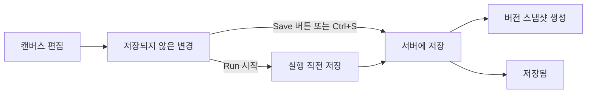

> 구현 상태: 부분 구현 · 원문: `spec/3-workflow-editor/_product-overview.md` (§1~§4, §6 ED-SV-01·02, §9), `spec/3-workflow-editor/0-canvas.md` · 용어: [용어 사전](../CLE-GLOSSARY.md)

## 개요

에디터(workflow editor)는 이 제품의 핵심 화면이다. 사용자는 캔버스(Canvas) 위에 노드를 놓고 연결선으로 이어 자동화 로직을 눈으로 보며 만든다. n8n 과 비슷한 노드 기반 편집 방식을 따르면서 AI 노드와 고급 로직 노드를 더 제공한다.

이 문서는 에디터 레이아웃과 헤더, 캔버스 인터랙션(뷰포트·선택·노드 조작·컨텍스트 메뉴), 노드 팔레트(Palette), 캔버스 위 노드의 시각 표현(설정 요약·미설정 경고·삭제 버튼), 줌과 미니맵, 저장(save, `saveCanvas`) 모델, 수동 트리거 노드의 편집 제약, 키보드 단축키, 컨테이너(container, `containerId`) 편집 UX 를 정한다.

범위 밖:

- 포트 체계와 설정 패널은 [노드 포트와 설정 패널](CLE-WF-NODEPANEL.md) 이 정한다.
- 연결선 생성·유효성·스타일은 [연결선](CLE-WF-EDGE.md) 이 정한다.
- 실행 버튼 동작, 실행 결과 드로어, 캔버스의 실행 진행 표시는 [에디터 실행과 디버깅](../CLE-EXEC/CLE-EXEC-RUN.md) 이 정한다.
- AI 어시스턴트 패널은 [워크플로우 AI 어시스턴트](CLE-WF-ASSIST.md) 가 정한다.
- 버전 기록 패널과 복원은 [버전 기록](CLE-WF-VERSION.md) 이, 저장 요청이 서버에서 처리되는 흐름은 [워크플로우 데이터와 저장 흐름](CLE-WF-DATA.md) 이 정한다.
- 노드 사이 관계를 보는 경고 규칙은 [그래프 경고 규칙](CLE-WF-WARN.md) 이 정한다.
- 컨테이너 본문의 실행 방식은 [컨테이너 실행](../CLE-EXEC/CLE-EXEC-CONTAINER.md) 이 정한다.

## 요구사항

- REQ-EDITOR-001 WHEN 사용자가 워크플로우 목록에서 항목을 누르면 THE SYSTEM SHALL 그 워크플로우의 에디터로 들어간다. (원본: ED-EN-01)
- REQ-EDITOR-002 WHEN 사용자가 새 워크플로우를 만들면 THE SYSTEM SHALL 수동 트리거 노드 하나만 있는 캔버스로 에디터에 들어간다. (원본: ED-EN-02)
- REQ-EDITOR-003 IF 저장하지 않은 변경이 있는 채로 에디터를 나가려 하면 THE SYSTEM SHALL 확인 다이얼로그를 표시한다. (원본: ED-EN-03)
- REQ-EDITOR-004 WHILE 에디터가 열려 있는 동안 THE SYSTEM SHALL 헤더에 워크플로우 이름과 저장·실행 버튼을 표시한다. (원본: ED-EN-04)
- REQ-EDITOR-005 WHILE 에디터가 열려 있는 동안 THE SYSTEM SHALL 크기 제한 없이 넓힐 수 있는 2D 캔버스를 제공한다. (원본: ED-CV-01)
- REQ-EDITOR-006 WHEN 사용자가 캔버스 빈 영역을 끌면 THE SYSTEM SHALL 시점을 옮긴다(패닝). (원본: ED-CV-02)
- REQ-EDITOR-007 WHEN 사용자가 스크롤·핀치·줌 버튼을 쓰면 THE SYSTEM SHALL 25%~200% 범위에서 캔버스를 확대·축소한다. (원본: ED-CV-03)
- REQ-EDITOR-008 WHEN 사용자가 Fit 을 누르면 THE SYSTEM SHALL 모든 노드가 보이도록 뷰포트를 맞춘다. (원본: ED-CV-04)
- REQ-EDITOR-009 WHILE 미니맵이 켜져 있는 동안 THE SYSTEM SHALL 캔버스 오른쪽 아래에 워크플로우 전체 조감도와 현재 뷰포트 사각형을 표시한다. (원본: ED-CV-05)
- REQ-EDITOR-010 WHEN 사용자가 노드를 끌어 옮기면 THE SYSTEM SHALL 노드를 그리드에 맞춰 놓는다(구현 여부가 갈린다, 미결 사항 참조). (원본: ED-CV-06)
- REQ-EDITOR-011 WHEN 사용자가 노드 팔레트의 노드를 캔버스로 끌어 놓으면 THE SYSTEM SHALL 놓은 위치에 새 노드를 추가한다. (원본: ED-ND-01)
- REQ-EDITOR-012 WHEN 사용자가 캔버스 빈 영역을 더블클릭하거나 우클릭 메뉴에서 노드 추가를 고르면 THE SYSTEM SHALL 노드 검색 팝업을 열고 고른 노드를 그 위치에 추가한다. (원본: ED-ND-02)
- REQ-EDITOR-013 WHEN 사용자가 노드를 누르면 THE SYSTEM SHALL 그 노드만 선택한다. (원본: ED-ND-03)
- REQ-EDITOR-014 WHEN 사용자가 Shift 를 누른 채 노드를 누르면 THE SYSTEM SHALL 그 노드를 기존 선택에 넣거나 뺀다. (원본: ED-ND-03)
- REQ-EDITOR-015 WHEN 사용자가 Shift 를 누른 채 빈 영역을 끌면 THE SYSTEM SHALL 영역 안의 노드를 모두 선택한다. (원본: ED-ND-03)
- REQ-EDITOR-016 WHEN 사용자가 선택한 노드를 끌면 THE SYSTEM SHALL 선택한 노드를 모두 함께 옮긴다. (원본: ED-ND-04)
- REQ-EDITOR-017 WHEN 사용자가 Ctrl+C 를 누르면 THE SYSTEM SHALL 선택한 노드와 양 끝이 모두 선택된 연결선을 앱 내부 클립보드에 복사한다. (원본: ED-ND-05)
- REQ-EDITOR-018 WHEN 사용자가 Ctrl+V 를 누르면 THE SYSTEM SHALL 복사한 노드를 원본 대비 (+40, +40) 위치에 겹치지 않는 레이블과 새 연결선 id 로 붙여 넣는다. (원본: ED-ND-05)
- REQ-EDITOR-019 WHEN 사용자가 Ctrl+D 를 누르면 THE SYSTEM SHALL 클립보드를 바꾸지 않고 선택한 노드를 바로 복제한다.
- REQ-EDITOR-020 WHEN 사용자가 Delete·Backspace 키나 우클릭 메뉴로 노드를 지우면 THE SYSTEM SHALL 노드와 그 노드에 연결된 연결선을 함께 지운다. (원본: ED-ND-06)
- REQ-EDITOR-021 WHEN 사용자가 노드를 누르면 THE SYSTEM SHALL 설정 패널을 연다. (원본: ED-ND-07)
- REQ-EDITOR-022 WHILE 노드가 실행 중이거나 성공·실패·건너뜀 상태인 동안 THE SYSTEM SHALL 캔버스의 노드에 그 상태를 시각적으로 표시한다. (원본: ED-ND-08)
- REQ-EDITOR-023 WHEN 사용자가 노드 비활성화를 켜면 THE SYSTEM SHALL 그 노드를 반투명·사선 패턴으로 그리고 실행할 때 건너뛴다. (원본: ED-ND-09)
- REQ-EDITOR-024 IF 노드의 필수 설정이 하나라도 비어 있으면 THE SYSTEM SHALL 노드 헤더에 경고 아이콘을 표시하고 툴팁에 구체적인 누락 항목을 보여 준다. (원본: ED-ND-10)
- REQ-EDITOR-025 WHILE 에디터가 열려 있는 동안 THE SYSTEM SHALL 노드 팔레트에 사용할 수 있는 노드를 카테고리별로 표시한다. (원본: ED-PL-01)
- REQ-EDITOR-026 WHEN 사용자가 노드 팔레트 검색창에 입력하면 THE SYSTEM SHALL 노드 이름으로 목록을 바로 거른다. (원본: ED-PL-02)
- REQ-EDITOR-027 WHEN 사용자가 노드 팔레트 토글 버튼을 누르면 THE SYSTEM SHALL 팔레트를 아이콘 레일로 접거나 다시 펼친다. (원본: ED-PL-03)
- REQ-EDITOR-028 WHILE 이번 편집 세션에서 노드를 추가한 적이 있는 동안 THE SYSTEM SHALL 팔레트 위쪽 Recent 섹션에 최근 쓴 노드 유형을 최대 5개 최신순으로 중복 없이 표시한다. (원본: ED-PL-04)
- REQ-EDITOR-029 WHILE 마켓플레이스에서 설치한 노드가 있는 동안 THE SYSTEM SHALL 팔레트의 Installed 섹션에 그 노드를 표시한다. (원본: ED-PL-05) (미구현)
- REQ-EDITOR-030 WHEN 사용자가 팔레트의 노드를 누르거나 포커스 뒤 Enter·Space 를 누르면 THE SYSTEM SHALL 현재 뷰포트 가운데에 노드를 추가한다.
- REQ-EDITOR-031 WHEN 사용자가 헤더 저장 버튼이나 Ctrl+S 를 누르면 THE SYSTEM SHALL 캔버스 내용을 바로 서버에 저장한다. (원본: ED-SV-01)
- REQ-EDITOR-032 IF 저장하지 않은 변경이 있는 채로 전체 실행·선택 노드부터 실행·단일 노드 실행을 시작하면 THE SYSTEM SHALL 실행 전에 먼저 저장한다. (원본: ED-SV-02)
- REQ-EDITOR-033 WHILE 에디터가 열려 있는 동안 THE SYSTEM SHALL 타이머로 자동 저장하지 않는다. (원본: ED-SV-02)
- REQ-EDITOR-034 IF 저장하지 않은 변경이 없거나 그래프 경고 규칙에 `error` 가 있으면 THE SYSTEM SHALL 저장 버튼을 비활성으로 둔다.
- REQ-EDITOR-035 WHILE 저장 상태가 바뀌는 동안 THE SYSTEM SHALL 헤더에 "저장 중...", "저장되지 않은 변경 사항", "저장됨" 가운데 하나를 표시한다.
- REQ-EDITOR-036 WHEN 사용자가 Ctrl+Z 나 Ctrl+Y(또는 Ctrl+Shift+Z)를 누르면 THE SYSTEM SHALL 마지막 편집을 되돌리거나 다시 적용한다.
- REQ-EDITOR-037 IF 워크플로우에 트리거 카테고리 노드 말고 다른 노드가 없으면 THE SYSTEM SHALL 캔버스 오른쪽 위에 시작 가이드 카드를 표시한다.
- REQ-EDITOR-038 WHEN 트리거가 아닌 첫 노드가 추가되면 THE SYSTEM SHALL 시작 가이드 카드를 300ms 동안 흐리게 하며 숨긴다.
- REQ-EDITOR-039 WHILE 줌이 50% 미만인 동안 THE SYSTEM SHALL 노드의 설정 요약 줄을 숨긴다.
- REQ-EDITOR-040 WHEN 노드 설정이 에디터 상태에 반영되면 THE SYSTEM SHALL 캔버스의 설정 요약을 바로 갱신한다.
- REQ-EDITOR-041 IF 노드가 가리키는 통합이 지워졌으면 THE SYSTEM SHALL 노드에 `⚠ Missing integration` 배지를 표시한다.
- REQ-EDITOR-042 IF 워크플로우 호출 노드가 가리키는 워크플로우가 지워졌으면 THE SYSTEM SHALL 노드에 `⚠ Missing workflow` 배지를 표시한다.
- REQ-EDITOR-043 WHILE 워크플로우가 실행 중인 동안 THE SYSTEM SHALL 노드 삭제 버튼을 숨긴다.
- REQ-EDITOR-044 WHEN 새 워크플로우를 만들면 THE SYSTEM SHALL 서버에서 수동 트리거 노드 하나를 (250, 300) 위치에 자동으로 만든다.
- REQ-EDITOR-045 IF 사용자가 수동 트리거 노드를 지우려 하면 THE SYSTEM SHALL 삭제를 막는다.
- REQ-EDITOR-046 IF 사용자가 팔레트에서 수동 트리거 노드를 하나 더 추가하려 하면 THE SYSTEM SHALL 그 동작을 무시한다.
- REQ-EDITOR-047 WHEN 컨테이너의 `body` 포트에서 노드로 연결선이 생기면 THE SYSTEM SHALL 그 노드의 `containerId` 를 그 컨테이너로 정한다.
- REQ-EDITOR-048 IF 새 `body` 또는 `emit` 연결선의 상대 노드가 이미 다른 컨테이너에 속해 있으면 THE SYSTEM SHALL 연결선을 만들지 않고 토스트 경고를 표시한다.
- REQ-EDITOR-049 WHEN 컨테이너 자식 노드에서 소속 없는 노드로 연결선이 생기면 THE SYSTEM SHALL 그 노드를 같은 컨테이너 소속으로 정한다.
- REQ-EDITOR-050 WHEN 소속을 만든 연결선이나 노드가 지워지면 THE SYSTEM SHALL 모든 노드의 `containerId` 를 다시 계산해 가리킬 곳이 없는 소속을 남기지 않는다.
- REQ-EDITOR-051 WHEN 워크플로우를 불러오면 THE SYSTEM SHALL `containerId` 를 연결선 기준으로 다시 계산하고 바뀐 값이 있으면 저장하지 않은 변경으로 표시한다.
- REQ-EDITOR-052 IF 자식 노드가 있는 컨테이너를 지우려 하면 THE SYSTEM SHALL 그룹 해제와 모두 삭제 가운데 하나를 고르는 확인 다이얼로그를 표시한다.
- REQ-EDITOR-053 IF 자식 노드가 없는 컨테이너를 지우면 THE SYSTEM SHALL 확인 없이 바로 지운다.
- REQ-EDITOR-054 WHEN 사용자가 컨테이너를 다른 컨테이너 안에 두면 THE SYSTEM SHALL 깊이 제한 없이 중첩을 허용한다.
- REQ-EDITOR-055 IF 트리거 카테고리 노드를 컨테이너 자식으로 만들려 하면 THE SYSTEM SHALL 소속 전파를 거부한다.
- REQ-EDITOR-056 WHEN 사용자가 노드를 추가하거나 붙여넣거나 복제하면 THE SYSTEM SHALL 클라이언트에서 새 UUID 를 노드 id 로 발급한다.
- REQ-EDITOR-057 IF 캔버스 저장이 새 노드로 싣는 id 를 다른 워크플로우의 노드가 이미 쓰고 있으면 THE SYSTEM SHALL 저장을 400 `VALIDATION_ERROR` 로 거부하고 그 노드 행을 덮어쓰지 않는다.
- REQ-EDITOR-058 IF 캔버스 저장의 `containerId`·`toolOwnerId`·연결선 끝점이 이번 페이로드에 없는 노드를 가리키면 THE SYSTEM SHALL 저장을 400 `VALIDATION_ERROR` 로 거부하고 틀린 필드를 모두 `details[]` 에 싣는다.

## 화면 레이아웃

| 영역 | 위치 | 들어가는 요소 | 동작 |
| --- | --- | --- | --- |
| 헤더 | 맨 위 | 뒤로가기(←), 브레드크럼 "Workflows / {이름}", AI 어시스턴트 버튼(🤖), Save, Run(드롭다운), Undo·Redo, 더보기(⋮) | [에디터 헤더](#에디터-헤더) 참조 |
| 노드 팔레트 | 왼쪽 | 검색, Recent, 카테고리별 노드 목록 | 끌어 놓거나 눌러 노드 추가 |
| 캔버스 | 가운데 | 노드, 연결선, 시작 가이드 카드(조건부) | 패닝·줌·선택·편집 |
| 오른쪽 패널 | 오른쪽 | 설정 패널 또는 AI 어시스턴트 패널 | 둘 중 하나만 연다. 자세한 내용은 [워크플로우 AI 어시스턴트](CLE-WF-ASSIST.md) |
| 줌 컨트롤 | 캔버스 왼쪽 아래 오버레이 | 줌아웃(−), 줌 슬라이더, 줌인(+), 현재 퍼센트, Fit | [줌 컨트롤과 Undo/Redo](#줌-컨트롤과-undoredo) 참조 |
| 미니맵 | 캔버스 오른쪽 아래 | 워크플로우 조감도, 뷰포트 사각형 | 누르거나 끌어 뷰포트 이동 |
| 실행 결과 드로어 | 캔버스 아래 | 실행 결과 탭(Table·Chart·Template 등) | 실행할 때만 나타난다. 자세한 내용은 [에디터 실행과 디버깅](../CLE-EXEC/CLE-EXEC-RUN.md) |

## 에디터 헤더

| 요소 | 설명 |
| --- | --- |
| 뒤로가기(←) | 워크플로우 목록으로 간다. 저장하지 않은 변경이 있으면 확인한다. |
| 브레드크럼 | "Workflows / {워크플로우 이름}" |
| 워크플로우 이름 | 누르면 텍스트 필드로 바뀌어 바로 고칠 수 있다. |
| AI 어시스턴트 버튼(🤖) | 오른쪽 AI 어시스턴트 패널을 켜고 끈다. 켜져 있으면 강조한다. 패널은 [워크플로우 AI 어시스턴트](CLE-WF-ASSIST.md) 가 정한다. |
| Save 버튼 | 수동 저장(Ctrl+S). 저장하지 않은 변경이 없으면 비활성이다. |
| Run 버튼 | 워크플로우를 실행한다. 드롭다운에서 전체 실행(Run), 입력과 함께 실행(Run with Input), 선택 노드부터 실행(Run from Selected)을 고른다. 각 방식은 [에디터 실행과 디버깅](../CLE-EXEC/CLE-EXEC-RUN.md) 이 정한다. |
| Undo·Redo | 실행 취소·다시 실행. [줌 컨트롤과 Undo/Redo](#줌-컨트롤과-undoredo) 참조 |
| 더보기(⋮) | 설정, 버전 기록, 실행 내역, 내보내기, 가져오기, 삭제. 버전 기록은 [버전 기록](CLE-WF-VERSION.md), 실행 내역 패널은 [에디터 실행과 디버깅](../CLE-EXEC/CLE-EXEC-RUN.md), 내보내기·가져오기는 [워크플로우 목록과 폴더](CLE-WF-LIST.md) 가 정한다. |

## 캔버스 인터랙션

### 뷰포트

| 인터랙션 | 동작 |
| --- | --- |
| 빈 영역 마우스 드래그 | 캔버스 패닝 |
| Space + 드래그 | 캔버스 패닝(대안) |
| 마우스 휠 | 줌 인·아웃. 커서 위치를 중심으로 확대한다. |
| Ctrl + 휠 | 줌 인·아웃(대안) |
| 핀치(트랙패드) | 줌 인·아웃 |
| 줌 버튼 | 왼쪽 아래 오버레이의 줌아웃(−)·줌인(+) 버튼, 줌 슬라이더, 현재 퍼센트 |
| Fit 버튼 | 모든 노드가 보이도록 뷰포트를 맞춘다. |
| 줌 범위 | 최소 25%, 최대 200% |
| 빈 영역 더블클릭 | 노드 검색 팝업을 연다. |

### 선택

| 인터랙션 | 동작 |
| --- | --- |
| 노드 클릭 | 그 노드를 선택하고 이전 선택을 푼다. |
| Shift + 클릭 | 기존 선택에 노드를 넣거나 뺀다. |
| Shift + 빈 영역 드래그 | 선택 영역(Lasso)을 그려 안의 노드를 모두 선택한다. |
| Ctrl + A | 노드를 모두 선택한다. 빈 영역 우클릭 메뉴의 "전체 선택" 과 같다. |
| Escape | 노드 선택을 푼다. 실행 결과 드로어에 포커스가 있으면 캔버스로 포커스를 돌리는 동작이 먼저다([에디터 실행과 디버깅](../CLE-EXEC/CLE-EXEC-RUN.md)). 편집 필드에서는 가로채지 않는다. 전역 `handleKeyDown` 이 드로어 분기를 먼저 처리하고 끝낸다. |
| 빈 영역 클릭 | 선택을 풀고 설정 패널을 닫는다. |

원문은 "빈 영역 드래그" 를 패닝과 영역 선택 두 곳에 함께 적었다. 이 문서는 빈 영역 드래그를 패닝으로, Shift + 빈 영역 드래그를 영역 선택으로 적는다. 현재 구현도 React Flow 기본값(`panOnDrag`, Shift 영역 선택)을 쓴다.

### 노드 조작

| 인터랙션 | 동작 |
| --- | --- |
| 팔레트에서 드래그 | 놓은 위치에 새 노드를 추가한다. |
| 노드 드래그 | 노드를 옮긴다. 그리드 스냅 적용 여부는 [미결 사항](#미결-사항) 참조 |
| 여러 노드 선택 뒤 드래그 | 선택한 노드를 모두 함께 옮긴다. |
| Ctrl + C | 선택한 노드와, 양 끝이 모두 선택된 연결선을 복사한다. 복사한 내용은 앱 내부 클립보드(`editorClipboard`)에 담는다. OS 클립보드가 아니다. |
| Ctrl + V | 복사한 노드를 붙여 넣는다. 원본 대비 (+40, +40) 위치에 놓고, 레이블은 겹치지 않게 바꾸고, 연결선은 새 id 로 다시 잇는다. 우클릭 메뉴의 "붙여넣기" 는 누른 위치에 놓는다. |
| Ctrl + D | 선택한 노드를 바로 복제한다. 클립보드는 바꾸지 않는다. 우클릭 메뉴 "복제" 와 효과가 같다. |
| Delete / Backspace | 선택한 노드를 지운다. 연결된 연결선도 함께 지운다. |
| 노드 더블클릭 또는 클릭 | 설정 패널을 연다. |
| 우클릭 | 노드 컨텍스트 메뉴를 연다. |
| 컨테이너 소속 | 연결선으로 정한다. `body`·`emit`·체인 연결선이 소속을 자동으로 정하고 푼다. 노드를 컨테이너 안으로 끌어 넣는 UX 는 없다. 규칙은 [소속 자동 동기화](#소속-자동-동기화) 참조 |

### 노드 컨텍스트 메뉴

노드를 우클릭하면 나온다.

| 항목 | 단축키 | 설명 |
| --- | --- | --- |
| 설정 열기 | Enter | 설정 패널을 연다. |
| 이 노드 실행 | 없음 | 이 노드만 실행한다(단일 노드 실행). 동작은 [에디터 실행과 디버깅](../CLE-EXEC/CLE-EXEC-RUN.md) 이 정한다. |
| 복제 | Ctrl+D | 노드를 복제한다. |
| 비활성화·활성화 | 없음 | 노드 비활성화(`isDisabled`)를 켜고 끈다. |
| 삭제 | Delete | 노드를 지운다. |

선택 노드부터 실행은 이 메뉴에 없고 헤더 Run 드롭다운에만 있다([에디터 실행과 디버깅](../CLE-EXEC/CLE-EXEC-RUN.md)).

### 캔버스 컨텍스트 메뉴

빈 영역을 우클릭하면 나온다.

| 항목 | 설명 |
| --- | --- |
| 노드 추가 | 노드 검색 팝업을 연다. 고른 노드는 누른 위치에 놓는다. |
| 붙여넣기 | 클립보드의 노드를 누른 위치에 붙여 넣는다. `editorClipboard` 가 비어 있으면 비활성이다. |
| 전체 선택 | 노드를 모두 선택한다. |
| 맞춤 보기 | Fit to View |

### 시작 가이드 카드

새 워크플로우에는 백엔드가 기본 트리거 노드를 하나 자동으로 넣는다. 그래서 캔버스가 완전히 빈 경우는 거의 없다. 대신 트리거 카테고리 노드 말고 다른 노드가 없는 상태를 "빈 워크플로우" 로 본다. 이때 캔버스 오른쪽 위에 시작 가이드 카드(`CanvasEmptyState`)를 띄워 트리거 다음 단계를 알려 준다.

| 요소 | 내용 |
| --- | --- |
| 제목 | "워크플로우를 이어서 완성해봐요" |
| 소제목 | "트리거 다음에 이어 붙일 노드를 추가하면 워크플로우가 완성돼요." |
| 체크리스트 | 3단계: (1) 팔레트에서 다음 노드를 드래그 (2) 트리거 출력 포트에 연결 (3) 실행해서 결과 확인. 항목마다 오른쪽에 "자세히" 링크가 있고 관련 매뉴얼 절로 이동한다. |
| 버튼 | "시작 가이드 열기" 는 `/docs/01-getting-started/first-workflow` 를 새 탭으로 연다. 노드는 팔레트에서 끌어 놓아 추가하므로 카드 안에 추가 버튼을 두지 않는다. |
| 표시 조건 | 노드가 하나도 없거나 트리거 카테고리 노드만 있을 때 표시한다. 트리거가 아닌 첫 노드가 추가되면 300ms 동안 흐려지며 사라진다. |
| 위치·크기 | `top-right` Panel, 너비 340px. 트리거 노드와 겹치지 않도록 오른쪽에 고정한다. |
| 접근성 | `role="region"` 과 `aria-label="시작하기"`. 숨긴 상태에서는 `aria-hidden="true"` 와 `tabIndex={-1}` 로 포커스에서 뺀다. |
| 링크 동작 | 매뉴얼 링크는 새 탭으로 열어 작업 맥락을 지킨다. |

매뉴얼 구조는 [사용자 가이드](../CLE-UI/CLE-UI-GUIDE.md) 가 정한다.

## 노드 팔레트

### 구성

노드 팔레트는 에디터 왼쪽의 노드 목록이다. 위에서부터 검색창, Recent 섹션, 카테고리 섹션이 있다.

| 섹션 | 들어가는 노드(예시) |
| --- | --- |
| 검색 | 노드 이름 검색창 |
| ⏱ Recent | 최근 사용한 노드 유형 |
| Trigger | Manual Trigger |
| Logic | If/Else, Switch, Loop, Variable Declaration, Variable Modification, Split, Map, Filter, ForEach, Parallel, Merge, Background |
| Flow | Workflow |
| AI | AI Agent, Text Classifier, Information Extractor |
| Integration | HTTP Request, Database Query, Send Email, Cafe24, MakeShop |
| Data | Transform, Code |
| Presentation | Carousel, Table, Chart, Form, Template |
| ▼ Installed | 마켓플레이스에서 설치한 노드(미구현) |

카테고리는 일곱 가지다. 전체 노드 목록·카테고리·카테고리 색은 [노드 시스템 구조와 카탈로그](../CLE-NODE/CLE-NODE-ARCH.md) 가 정한다. 원문 PRD 는 카테고리를 다섯 개(Logic·Flow·AI·Integration·Data)로 적었지만 노드 카탈로그 기준으로 Trigger·Presentation 을 더한다.

**Recent 섹션(구현, ED-PL-04)**: 최근 사용한 노드 유형을 팔레트 위쪽에 표시한다(`node-palette.tsx`). 세션 한정(저장하지 않음), 최대 5개, 최신순, 중복 제거이고 `manual_trigger` 는 뺀다. 검색 중에는 숨긴다. 최근 사용은 `editor-store.addNode` 가 `recent-nodes-store` 에 기록한다. 끌어 놓기·팔레트 클릭·노드 검색 팝업·우클릭 복제·AI 어시스턴트가 모두 이 경로를 지난다. `addNode` 를 거치지 않는 일괄 경로(Ctrl+V 붙여넣기, Ctrl+D 복제)는 `recordRecentNodeTypesFrom` 으로 따로 기록한다.

**Installed 섹션(미구현)**: 마켓플레이스 섹션은 아직 그리지 않는다. 마켓플레이스 모듈을 도입할 때 함께 만든다([Rationale](#rationale) R-1).

### 동작

| 동작 | 설명 |
| --- | --- |
| 검색 | 노드 이름으로 바로 거른다. |
| 카테고리 접기·펼치기 | 섹션 헤더를 누른다. |
| 드래그 | 캔버스로 끌어 노드를 추가한다. |
| 클릭 | 현재 뷰포트 가운데에 노드를 추가한다. 여러 번 누르면 겹치지 않도록 조금씩 비껴 놓는다. 항목에 포커스를 두고 Enter·Space 를 눌러도 같다. 캔버스와는 `palette-canvas-bridge` 로 통한다([Rationale](#rationale) R-2). |
| 패널 접기 | 검색 헤더의 토글 버튼으로 팔레트를 아이콘 레일(펼치기 버튼만 있는 좁은 막대)로 접고 펼친다(ED-PL-03). |

### 노드 검색 팝업

캔버스 빈 영역을 더블클릭하면 노드 검색 팝업(node search popup)이 뜬다. 포트에서 끌어 빈 영역에 놓을 때와 빈 영역 우클릭 메뉴의 "노드 추가" 도 같은 팝업을 쓴다. 입력창 "Add node..." 아래에 "If/Else (Logic)" 처럼 노드 이름과 카테고리가 목록으로 나온다.

- 입력하는 즉시 거른다.
- 항목을 누르면 고른 노드를 더블클릭한 위치에 놓는다.
- 키보드: ↑·↓ 로 강조를 옮기고 끝에서는 반대쪽으로 돌아간다. Enter 로 강조한 항목을 고르고 Escape 로 팝업을 닫는다.
- Escape 우선순위: 팝업이 열려 있으면 팝업 닫기가 먼저다. 팝업 입력의 keydown 이 `stopPropagation` 으로 전역 keydown(선택 해제, 드로어 포커스 복귀)보다 먼저 처리한다.

## 노드 시각 표현

### 외형

노드 본체 왼쪽에 입력 포트가, 오른쪽에 출력 포트가 있다. 본체 첫 줄은 아이콘과 노드 유형명, 둘째 줄은 사용자 레이블, 셋째 줄은 설정 요약이다.

| 요소 | 설명 |
| --- | --- |
| 입력 포트(●) | 왼쪽. 회색. 연결할 수 있으면 강조한다. |
| 출력 포트(●) | 오른쪽. 유형에 따라 여러 개이고 라벨을 붙인다. 포트 종류별 색(데이터 초록, 시스템 파랑, 에러 빨강)은 [노드 포트와 설정 패널](CLE-WF-NODEPANEL.md) 이 정한다. |
| 카테고리 색 | 위쪽 바 또는 왼쪽 바. 예: Logic 파랑, Flow 보라, AI 초록. 전체 색은 [노드 시스템 구조와 카탈로그](../CLE-NODE/CLE-NODE-ARCH.md) 가 정한다. |
| 아이콘 | 노드 유형별 아이콘 |
| 이름 | 첫 줄: 노드 유형명 |
| 레이블 | 둘째 줄: 사용자가 붙인 노드 레이블(있을 때) |

### 상태 표시

| 상태 | 시각 효과 |
| --- | --- |
| 기본 | 일반 표시 |
| 선택됨 | 두꺼운 테두리와 그림자 |
| 비활성(Disabled) | 반투명과 사선 패턴 오버레이 |
| 실행 대기 | 변화 없음 |
| 실행 중 | 파란 테두리 펄스 애니메이션 |
| 성공 | 아래쪽 초록 체크 아이콘. 잠시 뒤 흐려진다. |
| 실패 | 빨간 테두리와 에러 아이콘. 누르면 에러 상세를 본다. |
| 건너뜀 | 회색 처리 |
| Presentation 완료 | 노드 오른쪽 아래 👁 배지. 누르면 실행 결과 드로어를 열고 해당 탭을 고른다. |

실행 중 상태 바, 연결선 흐름 애니메이션, 입력 대기 표시 같은 실행 진행 표시는 [에디터 실행과 디버깅](../CLE-EXEC/CLE-EXEC-RUN.md) 이 정한다.

### 설정 요약

설정 요약(configuration summary, `summaryTemplate`)은 노드 본체의 셋째 줄에 보이는 짧은 문구다. 설정 패널을 열지 않고도 노드의 핵심 설정을 캔버스에서 알 수 있다. 예를 들어 HTTP Request 노드는 `GET https://api.example.c...` 처럼 보인다.

| 항목 | 설명 |
| --- | --- |
| 위치 | 노드 본체 셋째 줄(아이콘·유형명 줄과 레이블 줄 아래) |
| 글꼴 | 기본 텍스트보다 작고 흐린(muted) 색 |
| 최대 길이 | 40자. 넘으면 `text-overflow: ellipsis` 로 자른다. 잘림 규칙의 기준은 [노드 시스템 구조와 카탈로그](../CLE-NODE/CLE-NODE-ARCH.md) 에 있다. |
| 툴팁 | 요약이 잘렸으면 마우스를 올릴 때 전체 문구를 보여 준다. |
| 줌 | 줌 50% 미만에서는 요약 줄을 숨기고 아이콘·유형명·레이블만 보인다. |
| 인터랙션 | 표시 전용이다. 누르면 기존처럼 설정 패널이 열린다. |
| 갱신 | 노드 설정이 에디터 상태에 반영되면(설정 패널 `변경 저장`·`JSON 적용`, AI 어시스턴트 편집 등) 바로 갱신한다. |

**노드별 요약 형식**: 각 노드 유형의 요약 형식은 노드 스키마의 `summaryTemplate` 이 정하고 해당 노드 문서의 "설정 요약" 절에 적는다. 이 문서는 노드별 형식 표를 따로 두지 않는다. 스키마에 `summaryTemplate` 이 없는 노드는 요약 줄을 표시하지 않는다. 예를 들어 [AI 에이전트 노드](../CLE-NODE-AI/CLE-NODE-AGENT.md) 와 [정보 추출기 노드](../CLE-NODE-AI/CLE-NODE-EXTRACTOR.md) 는 요약이 아직 없다(미구현). 목표 형식은 AI 노드 공통 문서에 있다([AI 노드 공통](../CLE-NODE-AI/CLE-NODE-AI-COMMON.md)). 수동 트리거 노드도 `summaryTemplate` 이 없어 지금은 요약을 표시하지 않는다. 설정(`config.parameters`)은 있고 요약이 미구현일 뿐이다([수동 트리거 노드 §설정 요약](../CLE-NODE-TRIG/CLE-NODE-MANUAL.md#설정-요약)). 카테고리별 공통 형식은 [Logic 노드 공통](../CLE-NODE-LOGIC/CLE-NODE-LOGIC-COMMON.md), [통합 노드 공통](../CLE-NODE-INT/CLE-NODE-INT-COMMON.md), [Data 노드 공통](../CLE-NODE-DATA/CLE-NODE-DATA-COMMON.md), [Presentation 노드 공통](../CLE-NODE-PRES/CLE-NODE-PRES-COMMON.md) 을 따른다.

**특수한 경우**

| 경우 | 동작 |
| --- | --- |
| 표현식 사용 | 표현식 원문을 그대로 표시한다. 예: `{{ $input.role }}`. 잘림 규칙을 적용한다. |
| 지워진 통합 참조 | `⚠ Missing integration`(앰버색) |
| 지워진 워크플로우 참조 | `⚠ Missing workflow`(앰버색) |
| 커스텀·마켓플레이스 노드 | `configSchema` 의 처음 두 필드를 `key: value` 형태로 표시한다. |
| 사용자 레이블 없음 | 둘째 줄(레이블)이 없으면 요약이 둘째 줄로 올라간다. |

두 `⚠ Missing` 배지는 판정 경로가 다르다. `⚠ Missing integration` 은 렌더러가 직접 판정한다. 노드 경고 규칙(`warningRules`, `warnWhen` DSL)은 노드 자신의 설정만 보므로 통합이 지워졌는지 알 수 없다. 그래서 캔버스 렌더러(`custom-node.tsx`)가 워크스페이스 통합 목록을 조회해 `config.integrationId` 가 아직 있는지 대조한다. 이 배지는 그래프 경고 배지(`AlertTriangle`)와 다른 연결 끊김 아이콘(`Unplug`)을 쓴다([통합 노드 공통](../CLE-NODE-INT/CLE-NODE-INT-COMMON.md)). 반면 `⚠ Missing workflow` 는 저장 시점에 남긴 `workflowName` 을 쓰는 설정 전용 `warnWhen`(`workflowId && !workflowName`, `workflow.schema.ts`)이라 표준 스키마 DSL 경로다.

### 미설정 경고와 경고 배지

미설정 경고(not-configured badge)는 필수 설정이 비었을 때 노드에 붙는 경고다.

| 항목 | 설명 |
| --- | --- |
| 표시 | 노드 헤더 오른쪽의 `AlertTriangle` 아이콘(`text-white/70`, 마우스를 올리면 `text-white`). 마우스를 올리면 툴팁에 **구체적인 누락 항목**을 보여 준다. 일반 노드와 컨테이너 노드 모두 같은 헤더 아이콘을 쓴다. 접근성을 위해 아이콘에 `aria-label="warning"` 을 단다. |
| 조건 | 노드의 필수 설정 필드가 하나라도 비었을 때 |
| 예외 | 수동 트리거 노드는 미설정 경고를 표시하지 않는다. |
| 선택 필드만 있는 노드 | 모든 필드가 선택 항목이면 정상 요약을 표시한다(일반 노드는 본체, 컨테이너는 헤더 텍스트). |

툴팁에 나오는 노드별 누락 메시지는 각 노드 스키마의 노드 경고 규칙(`warningRules`)이 정한다. 이 문서는 노드별 문구 표를 따로 두지 않는다. 문구의 영문 원문은 각 노드 문서가 인용한다. 대개 그 문서의 "에러 코드" 절에 있다(예: [Table 노드 §에러 코드](../CLE-NODE-PRES/CLE-NODE-TABLE.md#에러-코드) 의 `warningRules.table:no-columns`). 노드 사이 관계를 보는 그래프 경고 규칙의 배지(심각도 `error` 는 빨강이고 저장 버튼을 막는다, `warning` 은 노랑)는 [그래프 경고 규칙](CLE-WF-WARN.md) 이 정한다.

### 삭제 버튼

노드 오른쪽 위 바깥에 지름 20px 원형 ✕ 버튼을 둔다(`custom-node.tsx`, 구현됨). 기본 배경은 중립 회색이고 마우스를 올리면 빨간색이 된다. 우클릭 메뉴 "삭제" 와 Delete·Backspace 키(ReactFlow `deleteKeyCode`)에 더한 삭제 수단이다. 누르면 `requestNodeDelete` 로 연결된 연결선까지 함께 지운다. 자식이 있는 컨테이너는 바로 지우지 않고 [컨테이너 삭제](#컨테이너-삭제) 의 확인 다이얼로그를 거친다.

| 조건 | 삭제 버튼 |
| --- | --- |
| 마우스를 올림 | 200ms 동안 나타난다. |
| 마우스를 뗌 | 200ms 동안 사라진다. 노드가 선택돼 있으면 남는다. |
| 노드 선택 상태 | 마우스를 올리지 않아도 항상 보인다. |
| 수동 트리거 노드 | 표시하지 않는다(삭제 불가). |
| 워크플로우 실행 중 | 숨긴다(실행 중 편집 차단). |
| 비활성 노드 | 표시한다(삭제 허용). |
| 여러 노드 선택 | 노드마다 따로 보인다. 누르면 그 노드만 지운다. 선택 전체를 지우려면 Delete 키를 쓴다. |
| 터치 기기 | 탭(선택)하면 보이고, 다른 노드나 캔버스를 탭하면 숨긴다. |

| 동작 | 설명 |
| --- | --- |
| 클릭 | 노드를 바로 지운다. Delete 키와 같이 연결된 연결선도 지운다. 자식 있는 컨테이너는 확인 다이얼로그를 거친다. |
| Undo | Ctrl+Z 로 되돌린다(기존 Undo 와 같다). |
| 우클릭 메뉴 | 기존 "삭제" 항목은 그대로 둔다. |

## 줌 컨트롤과 Undo/Redo

줌 컨트롤(줌아웃 −, 줌 슬라이더, 줌인 +, 현재 퍼센트, Fit)은 캔버스 왼쪽 아래 오버레이(`ZoomControls`, `zoom-controls.tsx`)에 있다. Undo·Redo 는 헤더 툴바(`editor-toolbar.tsx`)에 있다.

| 요소 | 설명 | 상태 |
| --- | --- | --- |
| 줌아웃·줌인 버튼(−/+) | 왼쪽 아래 오버레이 | 구현됨 |
| Fit 버튼 | 전체 맞춤 보기 | 구현됨 |
| 줌 슬라이더 | 25%~200% | 구현됨 |
| 줌 퍼센트 | 현재 줌 표시 | 구현됨 |
| Undo(Ctrl+Z) | 실행 취소. 헤더 툴바에 있다. | 구현됨 |
| Redo(Ctrl+Y) | 다시 실행. 헤더 툴바에 있다. | 구현됨 |
| Undo·Redo 를 왼쪽 아래 오버레이로 합치기 | `[−] 슬라이더 [+] 100% │ [Fit] │ [↩ Undo] [↪ Redo]` 배치 | 미구현(계획) |

## 미니맵

@xyflow `MiniMap` 을 캔버스 오른쪽 아래에 그린다(`canvas-minimap.tsx`, `pannable`·`zoomable`, 구현됨).

- 캔버스 오른쪽 아래에 작은 오버레이로 표시한다.
- 워크플로우 전체를 내려다보는 조감도다.
- 현재 뷰포트 영역을 사각형으로 표시한다.
- 미니맵을 누르거나 끌면 뷰포트가 이동한다.
- 토글 버튼으로 켜고 끈다.

## 저장

캔버스 변경은 에디터 상태(in-memory store)에만 쌓이고 `isDirty` 가 켜진다. 서버에 영구 저장되는 경로는 아래 두 가지뿐이다. 타이머로 주기적으로 저장하는 자동 저장은 없다.

| 항목 | 설명 |
| --- | --- |
| 수동 저장 | 헤더 `Save` 버튼 또는 `Ctrl+S`(Mac 은 `Cmd+S`). 바로 저장한다. 저장하지 않은 변경이 없거나 그래프 경고 규칙에 `error` 가 있으면(`hasError`) 버튼이 비활성이다. |
| 실행 직전 저장 | 전체 실행·선택 노드부터 실행·단일 노드 실행을 시작할 때 `isDirty` 면 실행 전에 먼저 저장한다. 그래서 실행은 항상 최신 캔버스로 한다. |
| 저장 표시 | 헤더 상태 텍스트 "저장 중..." / "저장되지 않은 변경 사항" / "저장됨"(`isSaving`·`isDirty` 기준) |
| 저장 API | store 액션 `saveWorkflow` 가 API client `saveCanvas`(`POST /workflows/:id/save`)를 불러 현재 노드·연결선 전체를 저장한다. 마지막 저장이 서버 상태가 된다. 새 노드 id 는 클라이언트가 발급한 UUID 다. 붙여넣기와 복제도 id 를 새로 발급한다. 다른 워크플로우의 노드가 쓰는 id 를 실으면 저장이 400 이다([데이터 모델 개요 §참조의 소속](../CLE-PLAT/CLE-PLAT-DATA.md#참조의-소속)). 서버 처리 흐름은 [워크플로우 데이터와 저장 흐름](CLE-WF-DATA.md) 에 있다. |

설정 패널의 변경은 `변경 저장`·`JSON 적용` 을 눌러야 에디터 상태에 들어간다([노드 포트와 설정 패널](CLE-WF-NODEPANEL.md)). AI 어시스턴트의 편집도 에디터 상태에 바로 반영되고 위 두 경로로만 저장된다([워크플로우 AI 어시스턴트](CLE-WF-ASSIST.md)).

### 저장과 버전

서버에 저장할 때마다 서버가 버전 스냅샷(`workflow_version`)을 함께 만든다. 타이머 자동 저장이 없으므로 버전 없이 저장만 되는 경우는 없다. 저장과 버전 생성이 한 트랜잭션인지는 원문끼리 정의가 갈린다([버전 기록](CLE-WF-VERSION.md) 의 미결 사항 참조).

| 동작 | 서버 저장 | 버전 생성 |
| --- | --- | --- |
| 캔버스 변경(노드·연결선·설정) | 없음(에디터 상태, `isDirty`) | 없음 |
| 수동 저장(`Ctrl+S`·`Save`) | 있음 | 있음. 저장하지 않은 변경이 있을 때만 생긴다. |
| 실행 직전 저장(Run) | 있음 | 있음. 실행 직전 스냅샷 |
| 버전 복원 | 있음 | 있음. 변경 요약 `Restored from vN` |

버전의 변경 요약(`change_summary`)은 저장 요청이 보낸 값을 그대로 담는다. 에디터의 수동 저장과 실행 직전 저장은 이 값을 보내지 않아 비어 있다. 규칙은 [버전 기록](CLE-WF-VERSION.md) 이 정한다.

## 수동 트리거 노드

[수동 트리거 노드](../CLE-NODE-TRIG/CLE-NODE-MANUAL.md)(`manual_trigger`)는 워크플로우의 시작점이다. 실행할 때의 역할(입력 파라미터 스키마로 입력을 해석·검증)은 그 노드 문서가 정한다. 에디터는 아래 편집 제약만 둔다.

| 항목 | 설명 |
| --- | --- |
| 생성 시점 | 새 워크플로우를 만들 때 서버가 자동으로 만든다. |
| 기본 위치 | `positionX: 250`, `positionY: 300` |
| 노드 유형 | `manual_trigger`(카테고리 `trigger`) |
| 포트 | 입력 포트 없음, 출력 포트 하나. 포트 ID 는 노드 문서가 정한다. |
| 삭제 불가 | 사용자가 지울 수 없다. 삭제 버튼도 표시하지 않는다. |
| 중복 불가 | 워크플로우마다 하나만 있다. 팔레트에서 하나 더 끌어 놓으면 무시한다. 저장 요청도 정확히 하나를 요구한다([워크플로우 데이터와 저장 흐름](CLE-WF-DATA.md)). |

## 키보드 단축키

에디터 전역 단축키의 전체 목록은 이 표가 기준이다. 전역 keydown 핸들러(`workflow-editor.tsx`)가 저장·Undo/Redo·AI 어시스턴트 패널 토글·드로어 토글(Ctrl+Shift+R)과 Ctrl+C·V·D·A, Escape 를 처리한다. 키 조합과 동작의 대응은 순수 함수 `resolveEditorShortcut` 이 정한다. 줌(Ctrl++·−·0·1)과 Space 패닝은 ReactFlow 인스턴스가 필요해 캔버스 컴포넌트(`workflow-canvas.tsx`)가 처리한다. 줌은 로컬 keydown 으로, 패닝은 `panActivationKeyCode="Space"` 로 처리한다. Delete·Backspace 는 ReactFlow `deleteKeyCode` 와 `onBeforeDelete`(컨테이너 삭제 확인)가 처리한다. Ctrl+C·V·D·A, Escape, 줌 단축키는 입력 필드에 포커스가 있으면 가로채지 않는다(`isEditableTarget` 가드). Ctrl+S·Z·Y, Ctrl+/, Ctrl+Shift+R 는 입력 필드에서도 동작한다.

| 단축키 | 동작 | 상태 |
| --- | --- | --- |
| Ctrl + S | 저장 | 구현됨 |
| Ctrl + Z | Undo | 구현됨 |
| Ctrl + Y / Ctrl + Shift + Z | Redo | 구현됨 |
| Ctrl + / | AI 어시스턴트 패널 토글([워크플로우 AI 어시스턴트](CLE-WF-ASSIST.md)). 원문 조건은 "다른 단축키와 충돌하지 않을 때만" 이다(ED-AI-03). 현재 구현(`resolveEditorShortcut`)은 조건 없이 늘 토글한다. | 구현됨 |
| Delete / Backspace | 선택 항목 삭제 | 구현됨(ReactFlow `deleteKeyCode`) |
| Ctrl + C | 선택 노드(와 내부 연결선) 복사(앱 내부 클립보드) | 구현됨 |
| Ctrl + V | 붙여넣기(원본 대비 +40 위치, 겹치지 않는 레이블) | 구현됨 |
| Ctrl + D | 선택 노드 바로 복제 | 구현됨 |
| Ctrl + A | 전체 선택 | 구현됨 |
| Escape | 실행 결과 드로어에 포커스가 있으면 캔버스로 포커스를 돌린다. 그 밖에는 노드 선택을 푼다. | 구현됨 |
| Space + 드래그 | 캔버스 패닝(대안) | 구현됨(ReactFlow `panActivationKeyCode`) |
| Ctrl + + / − | 줌 인·아웃 | 구현됨 |
| Ctrl + 0 | 줌 100% | 구현됨 |
| Ctrl + 1 | Fit to View | 구현됨 |
| Ctrl + Shift + R | 실행 결과 드로어 펼침·접힘 토글([에디터 실행과 디버깅](../CLE-EXEC/CLE-EXEC-RUN.md)) | 구현됨 |

전체 실행 단축키(Ctrl+Enter)는 이 표에 없다. 만들지 여부는 [에디터 실행과 디버깅의 미결 사항](../CLE-EXEC/CLE-EXEC-RUN.md#미결-사항) 에서 정하고 이 표는 그 결정을 따른다.

## 컨테이너

컨테이너는 자식 노드를 반복 실행하는 [Loop 노드](../CLE-NODE-LOGIC/CLE-NODE-LOOP.md), [ForEach 노드](../CLE-NODE-LOGIC/CLE-NODE-FOREACH.md), [Map 노드](../CLE-NODE-LOGIC/CLE-NODE-MAP.md) 세 노드다. 세 노드는 body·emit·done 포트 모델과 emit 기반 결과 수집을 함께 쓴다. `body` 는 컨테이너 본문 진입, `emit` 은 반복 결과를 모으는 입력, `done` 은 모은 배열 출력이다. 반복 실행의 의미는 [컨테이너 실행](../CLE-EXEC/CLE-EXEC-CONTAINER.md) 이 정한다.

[Background 노드](../CLE-NODE-LOGIC/CLE-NODE-BACKGROUND.md)는 컨테이너가 아니다. 노드 요구사항 ND-BG-05 의 대안 구현 결정에 따라 컨테이너 박스를 쓰지 않고 출력 포트가 여러 개인 일반 노드로 평면에 그린다. 본문은 `background` 포트 연결선으로 분기가 드러나고 메인 흐름과 같은 캔버스 그래프 안에 놓인다. [Parallel 노드](../CLE-NODE-LOGIC/CLE-NODE-PARALLEL.md)도 `containerId` 소속을 쓰지 않으므로 이 절의 컨테이너가 아니다.

### 시각 표현

컨테이너는 자식을 감싸는 영역을 그리지 않는다(시각 containment 미사용). 컨테이너는 일반 노드와 같은 크기로 그린다. 자식 노드는 캔버스 어디에나 자유롭게 놓을 수 있고 소속은 데이터 모델의 `containerId` 로만 나타낸다. 자식 노드 헤더 아래에 `in <컨테이너 레이블>` 배지를 달아 어느 컨테이너 소속인지 바로 알 수 있게 한다.

| 요소 | 설명 |
| --- | --- |
| 헤더 바 | 노드 아이콘, 유형명, 사용자 레이블. 카테고리 색 배경 |
| 요약 | 헤더 바의 사용자 레이블 오른쪽에 설정 요약을 표시한다. 예: `🔄 Loop "Process Items"  10x · break`. Background 는 컨테이너 박스가 없으므로 일반 노드 본체의 요약 영역을 쓴다. |
| 입출력 포트 | 왼쪽(입력)과 오른쪽(출력). 일반 노드와 같다. 입력이 `Input`·`Emit` 두 개라 핸들 옆에 라벨을 붙인다. |
| 헤더 드래그 | 컨테이너 노드만 옮긴다. 자식과는 시각적으로 떨어져 있다. |
| 헤더 더블클릭 | 컨테이너 설정 패널을 연다. |
| 실행 중 진행 인덱스 | 이 문서는 정하지 않는다. [Logic 노드 공통](../CLE-NODE-LOGIC/CLE-NODE-LOGIC-COMMON.md) 과 [Loop 노드](../CLE-NODE-LOGIC/CLE-NODE-LOOP.md) 는 실행 중 헤더에 "Iteration 3/10", "Item 2/5" 같은 진행 인덱스를 표시한다고 적는다. 현재 캔버스 구현에는 이 표시가 없다. 캔버스에 정의할지는 [Logic 노드 공통의 미결 사항](../CLE-NODE-LOGIC/CLE-NODE-LOGIC-COMMON.md#미결-사항) 에서 정한다. |

### 소속 자동 동기화

`containerId` 는 현재 연결선만으로 정해지는 순수 함수 값이다. 변경이 있을 때마다 자동으로 다시 계산한다. 설정 패널에는 소속을 직접 고르는 UI 가 없고 모든 소속은 연결선으로 나타낸다.

**전파 규칙**. `onConnect` 때와 워크플로우를 불러올 때 값이 더 바뀌지 않을 때까지 반복한다.

1. **Body 포트(강제)**: `컨테이너.body → X` 연결선을 만들면 X 의 `containerId` 를 그 컨테이너로 **강제로 정한다**. X 가 이미 **다른** 컨테이너에 속해 있으면 연결선을 만들지 않고 토스트로 경고한다. 예: `Cannot connect: "Code" is already a body child of "Loop". Detach it from "Loop" first.`
2. **Emit 포트(강제)**: `Y → 컨테이너.emit` 연결선도 같은 규칙이다. Y 가 다른 컨테이너 소속이면 거부하고 경고한다.
3. **체인 전파**: 컨테이너 자식 A 에서 `A → B` 연결선을 만들 때 B 의 `containerId` 가 비어 있으면 같은 컨테이너로 전파한다. 양 끝이 서로 다른 컨테이너 소속이면 충돌을 피하려고 아무것도 바꾸지 않는다. 이렇게 경계를 넘는 연결선을 허용할지는 정의가 갈린다. [연결선의 미결 사항](CLE-WF-EDGE.md#미결-사항) 과 [실행 엔진 개요와 그래프 순회의 미결 사항](../CLE-EXEC/CLE-EXEC-ENGINE.md#미결-사항) 에서 다룬다.

**지울 때 자동 해제**

- `컨테이너.body → X` 연결선을 지우면 X 의 `containerId` 가 자동으로 `null` 이 된다. 단 `X → 컨테이너.emit` 연결선이 남아 있거나 X 가 체인 중간이면 그 규칙에 따라 소속을 유지한다.
- 컨테이너 노드 삭제, 자식 노드 삭제, 체인 중간 연결선 삭제 모두 **전체를 다시 계산**하므로 가리킬 곳이 없는 `containerId` 가 남지 않는다.

**불러올 때 자동 복구**: 저장된 데이터에 연결선 없이 `containerId` 만 남아 있어도 불러올 때 다시 계산해 정합성을 맞춘다. 실제로 값이 바뀌면 `isDirty=true` 로 표시해 사용자가 저장으로 고정할 수 있게 한다. 불러올 때 지금 설정에 없는 포트의 연결선을 지우는 연결선 자동 정리는 [연결선](CLE-WF-EDGE.md) 에 있다.

### 제약

| 제약 | 동작 |
| --- | --- |
| 같은 워크플로우의 노드만 | `containerId`·`toolOwnerId` 와 연결선 끝점은 이 워크플로우의 노드만 가리킨다. 캔버스 저장은 이번 페이로드에 없는 노드를 가리키면 400 `VALIDATION_ERROR` 다(`details[].field` 예: `nodes[2].containerId`, [데이터 모델 개요 §참조의 소속](../CLE-PLAT/CLE-PLAT-DATA.md#참조의-소속)). 위 연결선 기반 재계산은 늘 페이로드 안의 노드를 가리키므로 정상 편집에서는 걸리지 않는다. |
| 트리거 노드 자식 금지 | 트리거 카테고리 노드는 컨테이너 자식이 될 수 없다. 연결선 자동 전파가 거부하고, 실행 때도 백엔드가 `CONTAINER_INVALID_CHILD` 에러로 실패시킨다. |
| 자기 자신 자식 금지 | 컨테이너는 자기 자신을 `containerId` 로 가질 수 없다. |
| 자손 컨테이너 자식 금지 | A 의 자손 컨테이너 B 를 다시 A 의 부모로 지정하면 순환이다. 실행 때 `CONTAINER_CYCLE` 에러로 거부한다. |
| emit 필수 | 컨테이너를 실행할 때 `emit` 포트에 자식 노드가 정확히 하나 연결돼 있어야 한다(`CONTAINER_MISSING_EMIT`, `CONTAINER_MULTIPLE_EMIT`). emit 연결선은 있지만 출발 노드가 자식이 아니면 에러 메시지에 그 노드 이름과 해결 방법을 넣는다. |
| 본문 안 제약 | 되돌아가는 연결선(순환)과 블로킹 노드(form·buttons·ai_conversation)는 컨테이너 본문 안에서 쓸 수 없다. |

이 제약 가운데 `CONTAINER_*` 검사는 저장 때가 아니라 실행 엔진과 AI 어시스턴트의 Shadow 검증이 한다([워크플로우 데이터와 저장 흐름](CLE-WF-DATA.md)). 저장 때 보는 것은 첫 행의 참조 소속뿐이다.

### 컨테이너 삭제

자식 노드가 있는 컨테이너를 지우려 하면 확인 다이얼로그가 뜬다. 삭제 경로 세 가지가 모두 이 다이얼로그를 거친다. ✕ 버튼과 우클릭 메뉴는 `editor-store.ts` 의 `requestNodeDelete` 로, Delete·Backspace 키는 ReactFlow `onBeforeDelete` 가 컨테이너를 알아채 기본 삭제를 취소하고 다이얼로그를 연다(`workflow-canvas.tsx`). 자식이 없는 컨테이너와 일반 노드는 다이얼로그 없이 바로 지운다.

| 다이얼로그 요소 | 내용 |
| --- | --- |
| 제목 | "Delete Container" |
| 본문 | `"Process Items" (Loop) contains 3 child nodes.` 처럼 컨테이너 이름·유형과 자식 수 |
| 선택지 | "Delete container and all children"(모두 삭제), "Ungroup: keep children, remove container only"(그룹 해제, 기본 선택) |
| 버튼 | Cancel, Delete |

| 선택지 | 동작 |
| --- | --- |
| 모두 삭제(Delete container and all children) | 컨테이너 노드, `containerId` 가 그 컨테이너를 가리키는 자식 노드 전부, 관련 연결선을 함께 지운다. `confirmContainerDelete("deleteAll")` |
| 그룹 해제(Ungroup, 기본) | 컨테이너 노드만 지운다(기존 `removeNode`). 자식 노드는 소속 재계산으로 최상위로 올라간다(`containerId = null`). 자식 노드 사이 연결선은 남긴다. 컨테이너의 `body` 포트에서 자식으로 가는 연결선만 지운다. `confirmContainerDelete("ungroup")` |
| 취소(Cancel) | 아무것도 지우지 않는다. |

그룹 해제는 [소속 자동 동기화](#소속-자동-동기화) 의 재계산을 그대로 쓰고, 모두 삭제만 새로운 cascade 경로다. 자식이 없는 컨테이너는 확인 없이 바로 지운다. 컨테이너의 삭제 버튼(✕)은 헤더 바 오른쪽 위 바깥에 있다.

### 중첩

컨테이너는 다른 컨테이너 안에 `containerId` 체인으로 중첩할 수 있고 실행된다. 실행 엔진은 중첩 스코프를 지원한다(바깥 `$loop`·`$item` 을 저장했다가 되돌림). 실행 의미는 [컨테이너 실행 §중첩 컨테이너 스코프](../CLE-EXEC/CLE-EXEC-CONTAINER.md#중첩-컨테이너-스코프) 가 정한다. 옛 캔버스 원문은 안쪽 컨테이너가 `$parent` 로 바깥 컨텍스트를 참조한다고도 적었다. 표현식에는 `$parent` 가 없다. 반복 변수의 표현식 표면은 [표현식 언어 §`$loop` 속성](CLE-WF-EXPR.md#loop-속성) 이 정한다. 소속은 `containerId` 와 `in <컨테이너>` 배지로만 나타내고 컨테이너를 감싸는 영역은 두지 않는다.

| 항목 | 설명 |
| --- | --- |
| 중첩 허용 | 컨테이너 안에 다른 컨테이너를 둘 수 있다(`containerId` 체인). |
| 깊이 제한 | 없다. 순환만 `CONTAINER_CYCLE` 로 거부한다. |
| 레벨별 시각 구분 | 없다. 시각 containment 를 쓰지 않으므로 배경 틴트나 깊이 표시를 두지 않는다. |

깊이 제한(3)과 레벨별 배경 틴트는 도입하지 않기로 확정했다([Rationale](#rationale) R-4).

## 도구 영역(제거됨)

AI 에이전트 노드 옆에 노드를 놓아 도구로 등록하던 도구 영역(Tool Area, `tool_owner_id`)은 제거됐다. 캔버스는 AI 에이전트 노드 오른쪽 점선 영역과 끌어 놓기 인터랙션을 보여 주지 않는다. 제거 사유와 새 도구 연결 설계는 [AI 에이전트 노드](../CLE-NODE-AI/CLE-NODE-AGENT.md) 가 정한다. DB 컬럼 `tool_owner_id` 는 남아 있다([워크플로우 데이터와 저장 흐름](CLE-WF-DATA.md)).

## UI/UX 원칙

- **직관성**: 개발자가 아닌 사용자도 5분 안에 기본 워크플로우를 만들 수 있어야 한다.
- **생산성**: 키보드 단축키, 빠른 노드 검색, 자동완성으로 개발자의 작업 속도를 높인다.
- **피드백**: 모든 사용자 동작에 바로 시각·인터랙션 피드백을 준다.
- **실수 방지**: Undo/Redo(Ctrl+Z/Y)를 지원하고, 유효하지 않은 연결을 막고, 저장하지 않은 변경을 경고한다.

## 미결 사항

- **그리드 스냅**: 원문 캔버스 명세는 노드를 끌 때 그리드 스냅을 적용한다고 적고 요구사항 ED-CV-06(권장)도 이를 요구한다. 현재 구현(`workflow-canvas.tsx`)에는 `snapToGrid`·`snapGrid` 설정이 없고 프론트엔드 어디에도 없다. 구현할지, 명세를 미구현으로 낮출지 결정이 필요하다.
- **전체 실행 단축키 Ctrl+Enter**: [에디터 실행과 디버깅](../CLE-EXEC/CLE-EXEC-RUN.md) 의 원문은 Run 버튼이나 Ctrl+Enter 로 전체 실행한다고 적는다. 이 문서의 단축키 목록(전역 단축키의 기준)에는 없다. 현재 구현의 `resolveEditorShortcut` 에도 실행 동작이 없다. 결정은 [에디터 실행과 디버깅의 미결 사항](../CLE-EXEC/CLE-EXEC-RUN.md#미결-사항) 에서 하고 이 문서의 단축키 표는 그 결정을 따른다.

## 구현 위치

- `codebase/frontend/src/components/editor/canvas/*.tsx` (`workflow-canvas.tsx`, `custom-node.tsx`, `canvas-minimap.tsx`, `zoom-controls.tsx` 등)
- `codebase/frontend/src/components/editor/canvas/quick-add-nav.ts` (노드 검색 팝업 키보드 이동)
- `codebase/frontend/src/components/editor/palette/node-palette.tsx`
- `codebase/frontend/src/components/editor/toolbar/editor-toolbar.tsx`
- `codebase/frontend/src/components/editor/workflow-editor.tsx` (전역 단축키)
- `codebase/frontend/src/lib/stores/editor-store.ts`
- `codebase/frontend/src/lib/stores/recent-nodes-store.ts`
- `codebase/frontend/src/lib/stores/palette-canvas-bridge.ts`

## Rationale

### R-1. 팔레트 Recent 는 구현하고 Installed 는 미룬다 (2026-07-07)

팔레트의 새 섹션 두 개 가운데 Recent 만 구현하고 Installed(마켓플레이스)는 미룬다. Recent 는 기존 노드 정의(카테고리 목록)만으로 만들 수 있는 순수 프론트엔드 기능이라 먼저 필요한 것이 없다. Installed 는 마켓플레이스에서 설치한 노드 목록을 전제한다. 그런데 마켓플레이스와 플러그인 SDK 자체가 아직 백로그라 보여 줄 데이터 출처가 없다([마켓플레이스 (구상)](../CLE-UI/CLE-UI-MARKET.md)). 데이터 없는 빈 섹션을 미리 그리지 않고 마켓플레이스 모듈을 도입할 때 함께 만든다.

Recent 는 세션 한정(저장하지 않음)으로 둔다. 저장하면 상관없는 다른 워크플로우나 세션에서 쓰던 유형이 새 에디터에 처음 들어갈 때 섞여 나오고, 범위(워크스페이스 단위인지 워크플로우 단위인지)를 정하는 결정이 하나 더 생긴다. 최근 사용 기록은 모든 노드 추가 경로가 지나는 `editor-store.addNode` 한 곳에 두었다. 그래서 끌어 놓기·팔레트 클릭·노드 검색 팝업·복제·AI 어시스턴트가 똑같이 반영된다. 복제와 붙여넣기도 "그 유형을 최근에 썼다" 는 뜻이라 함께 센다.

### R-2. 팔레트에서 캔버스로 노드를 추가할 때는 브리지를 거친다 (2026-07-07)

팔레트 클릭으로 노드를 추가하려면 뷰포트 가운데 좌표(ReactFlow 인스턴스), locale, 기본 모델 설정이 필요하다. 이 셋은 모두 `WorkflowCanvas` 에만 있다. 이 로직을 순수 상태인 `editor-store` 로 옮기면 React Query·ReactFlow 인스턴스·i18n 의존이 store 로 새어 들어가 계층이 무너진다. 그래서 캔버스가 노드 추가 핸들러를 `palette-canvas-bridge`(모듈 레지스트리)에 등록하고 팔레트가 그것을 부른다. 두 쪽이 서로 import 하지 않아 순환을 피한다. `assistant-editor-bridge` 와 같은 방식이다.

### R-3. 저장은 수동 저장과 실행 직전 저장 두 경로만 둔다 (2026-07-08)

한때 명세는 "노드·연결선·설정 변경 뒤 2초 디바운스 자동 저장", "오프라인 로컬 스토리지 임시 저장", "동시 편집 충돌 감지" 를 약속했고, 설정 패널 요구사항 ED-SP-05 는 "설정 변경 즉시 반영(별도 저장 버튼 불필요)" 을 약속했다. 구현에는 셋 다 없었다. 저장은 수동(`Ctrl+S`·`Save`)과 실행 직전 저장 두 경로뿐이다(`saveWorkflow` 호출처는 툴바, `Ctrl+S` 핸들러, Run 직전 세 곳). 설정 패널은 `변경 저장`·`JSON 적용` 을 눌러야 에디터 상태에 반영한다(`node-settings-panel.tsx`, `key={selectedNodeId}` 로 다시 마운트해 저장하지 않은 편집을 버린다). `workflow-editor.tsx` 의 500ms 디바운스는 저장이 아니라 그래프 경고 평가(`evaluateGraphWarningsLocal`)용이다.

명시 저장과 실행 직전 저장은 `Save` 버튼, "저장되지 않은 변경 사항" 상태 텍스트, 실행 전 저장이 서로 맞물린 **의도된 설계**로 판단했다(사용자 확인, 2026-07-08). 그래서 구현을 옛 명세에 맞추지 않고 명세를 현재 동작으로 고쳤다. 사용자 가이드도 이미 현재 동작을 설명한다. 타이머 자동 저장이나 오프라인 초안 복원을 되살릴지는 별도 기획 판단으로 남긴다.

### R-4. 컨테이너 중첩에는 깊이 제한과 레벨별 배경 틴트를 두지 않는다 (2026-07-08)

컨테이너 중첩에 대해 (a) 최대 깊이 3단계 제한과 초과 토스트, (b) 중첩 레벨별 배경 틴트(L1 5%, L2 10%, L3 15%)를 "미구현(계획)" 으로 두었던 것을 **버리고 앞으로도 구현하지 않기로 확정했다**(사용자 결정, 2026-07-08). 중첩 기능 자체는 유지한다. 버린 것은 미구현으로 남아 있던 캔버스 UX 다듬기뿐이다.

근거는 다음과 같다.

1. **중첩 실행은 이미 있는 기능이다.** 명세·백엔드·프론트엔드를 모두 조사한 결과, Loop·ForEach·Map 을 다른 컨테이너 안에 `containerId` 체인으로 중첩하는 것은 데이터 모델이 허용하는 데서 그치지 않는다. 실행 엔진이 중첩 스코프(바깥 `$loop`·`$item` 저장과 복원)를 지원하고, `loop-executor`·`foreach-executor` 의 컨텍스트 저장·복원과 "nested-container safe" 단위 테스트, `editor-store` 의 3단 중첩 삭제 테스트가 이를 검증한다. 그래서 이 절 전체를 버리면 살아 있는 기능의 캔버스 문서가 사라진다. 기능 문서는 남기고 미구현 다듬기만 뺐다.
2. **레벨별 배경 틴트는 시각 containment 미사용 결정과 모순된다.** 컨테이너를 일반 노드 크기로 그리고, 자식은 자유롭게 놓고, 소속은 `containerId` 와 `in <컨테이너>` 배지로만 나타내면 컨테이너가 자식을 감싸는 영역이 없다. 틴트를 칠할 자리가 없다. 틴트를 구현하려면 시각 containment 를 다시 들여와야 하는데 그 방향으로 가지 않기로 했다.
3. **깊이 상한 3은 근거가 없고 실제 동작과도 다르다.** 실행 엔진은 컨테이너 중첩에 깊이 상한을 두지 않고 순환(`CONTAINER_CYCLE`)만 거부한다. "3단계" 라는 숫자에 제품·기술 근거가 없어 임의 상한을 새로 만들지 않고 지금의 무제한(순환만 차단) 동작을 확정했다. Parallel 의 `parallel:nested-depth-exceeded`(깊이 2 이하)는 그래프 구조를 보는 별개 장치로 `containerId` 중첩과 관계없다([그래프 경고 규칙](CLE-WF-WARN.md)). AI 어시스턴트 `shadow-workflow.ts` 의 `MAX_CONTAINER_DEPTH = 64` 는 손상된 `containerId` 체인을 끝없이 따라가지 않도록 막는 순회 상한일 뿐 제품의 중첩 깊이 제한이 아니다.

이 결정에 따라 [그래프 경고 규칙](CLE-WF-WARN.md) 의 향후 확장 항목 "Loop·ForEach 중첩 깊이 정책" 도 미도입으로 확정했다.
