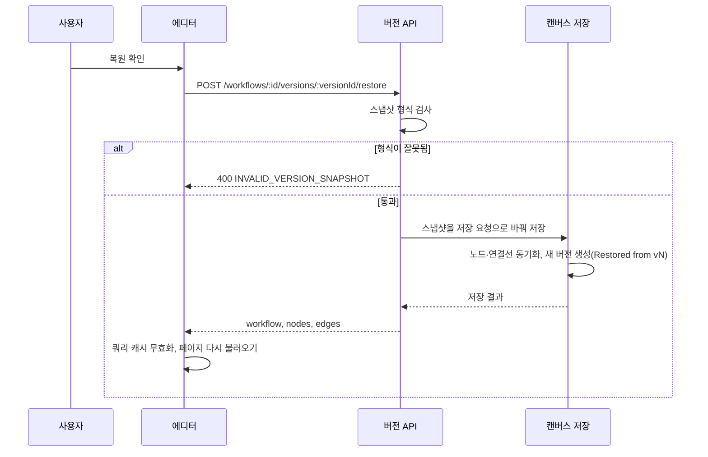

> 구현 상태: 구현됨 · 원문: `spec/3-workflow-editor/5-version-history.md`, `spec/3-workflow-editor/_product-overview.md` (§6 ED-SV-03·04), `spec/3-workflow-editor/0-canvas.md` (§8.1, R-5), `spec/data-flow/11-workflow.md` (§1.1 버전 복원) · 용어: [용어 사전](../CLE-GLOSSARY.md)

## 개요

버전 기록(Version History, `WorkflowVersion`)은 에디터 안에서 캔버스의 변경 이력을 버전 단위로 쌓고 되살리는 기능이다.

- **자동 스냅샷**: 사용자가 캔버스를 저장(`POST /workflows/:id/save`)할 때마다 서버가 `workflow_version` 레코드를 자동으로 만든다. 저장과 버전 생성의 트랜잭션 경계는 원문끼리 정의가 갈린다([미결 사항](#미결-사항) 참조).
- **바뀌지 않는 스냅샷**: 버전마다 저장 시점의 이름·설명·노드·연결선 전체를 `jsonb` 버전 스냅샷(version snapshot, `workflow_version.snapshot`)으로 보관한다. 뒤에 캔버스가 바뀌어도 지난 버전은 그대로다. 워크플로우 설정(`settings`)은 스냅샷에 담지 않는다.
- **복원**: 지난 버전을 골라 현재 상태를 덮어쓸 수 있다. 복원 자체도 새 버전으로 기록되고 변경 요약(`change_summary`)에 "Restored from vN" 이 붙는다. 이력을 되감지 않고 앞으로 쌓는다.

이 문서는 버전 기록 패널, 상세·비교·복원 다이얼로그, 버전 API, 변경 요약 규칙을 정한다.

범위 밖:

- `workflow_version` 테이블 컬럼·제약, 저장 요청이 서버에서 처리되는 순서, 스냅샷을 JSONB 로 둔 이유는 [워크플로우 데이터와 저장 흐름](CLE-WF-DATA.md) 이 정한다.
- 어떤 저장 동작이 일어나는지(수동 저장, 실행 직전 저장)는 [워크플로우 에디터와 캔버스](CLE-WF-EDITOR.md) 가 정한다.

## 요구사항

- REQ-WFVER-001 WHEN 사용자가 캔버스를 저장하면 THE SYSTEM SHALL 그 시점의 워크플로우 스냅샷으로 새 버전을 만든다. (원본: ED-SV-03)
- REQ-WFVER-002 WHEN 사용자가 지난 버전을 복원하면 THE SYSTEM SHALL 현재 캔버스를 그 버전의 스냅샷으로 바꾼다. (원본: ED-SV-04)
- REQ-WFVER-003 WHEN 버전을 복원하면 THE SYSTEM SHALL 복원 결과를 변경 요약 `Restored from vN` 이 붙은 새 버전으로 기록한다.
- REQ-WFVER-004 WHILE 버전이 저장돼 있는 동안 THE SYSTEM SHALL 뒤의 캔버스 변경과 관계없이 그 버전의 스냅샷을 바꾸지 않는다.
- REQ-WFVER-005 WHEN 사용자가 에디터 더보기 메뉴에서 Version History 를 고르면 THE SYSTEM SHALL 오른쪽에 버전 기록 패널을 연다.
- REQ-WFVER-006 WHILE 버전 기록 패널이 열려 있는 동안 THE SYSTEM SHALL 버전을 최신이 위로 오게(`version DESC`) 나열한다.
- REQ-WFVER-007 WHILE 버전 항목을 표시하는 동안 THE SYSTEM SHALL 버전 번호·작성자·생성 시각·변경 요약과 상세·복원 버튼을 보여 준다.
- REQ-WFVER-008 IF 버전이 하나도 없으면 THE SYSTEM SHALL "No versions yet. Save the canvas to create the first version." 을 표시한다.
- REQ-WFVER-009 IF 버전 목록을 불러오지 못하면 THE SYSTEM SHALL "Failed to load versions" 를 표시한다.
- REQ-WFVER-010 WHEN 사용자가 Compare 토글을 켜면 THE SYSTEM SHALL 버전 항목에 체크박스를 보여 준다.
- REQ-WFVER-011 WHEN 사용자가 버전 두 개를 고르고 Diff 를 누르면 THE SYSTEM SHALL 버전 비교 다이얼로그를 연다.
- REQ-WFVER-012 WHEN 사용자가 버전 상세를 누르면 THE SYSTEM SHALL 그 버전의 스냅샷을 읽기 전용 다이얼로그로 보여 준다.
- REQ-WFVER-013 WHEN 버전 두 개를 비교하면 THE SYSTEM SHALL 번호가 낮은 쪽을 before, 높은 쪽을 after 로 두고 클라이언트에서 비교한다.
- REQ-WFVER-014 WHEN 버전 두 개를 비교하면 THE SYSTEM SHALL 이름 변경, 추가·삭제된 노드, 수정된 노드의 바뀐 필드, 추가·삭제된 연결선을 보여 준다.
- REQ-WFVER-015 WHEN 사용자가 복원을 누르면 THE SYSTEM SHALL 복원도 새 버전으로 기록된다는 안내가 든 확인 다이얼로그를 띄운다.
- REQ-WFVER-016 WHEN 복원이 성공하면 THE SYSTEM SHALL `workflow-versions` 쿼리 캐시를 무효화하고 페이지를 다시 불러온다.
- REQ-WFVER-017 WHEN 버전 목록을 요청하면 THE SYSTEM SHALL 스냅샷을 빼고 메타데이터와 작성자만 돌려준다.
- REQ-WFVER-018 WHEN 버전 상세를 요청하면 THE SYSTEM SHALL 스냅샷을 포함해 돌려준다.
- REQ-WFVER-019 IF 복원할 스냅샷에 `nodes`·`edges` 배열이 없는 등 형식이 잘못됐으면 THE SYSTEM SHALL 400 `INVALID_VERSION_SNAPSHOT` 으로 거부한다.
- REQ-WFVER-020 WHEN 형식 검사를 통과한 스냅샷을 복원하면 THE SYSTEM SHALL 캔버스 저장(`saveCanvas`) 경로를 그대로 써서 저장한다.
- REQ-WFVER-021 WHEN 저장 요청에 `changeSummary` 가 있으면 THE SYSTEM SHALL 그 값을 새 버전의 변경 요약에 그대로 담는다.
- REQ-WFVER-022 WHEN 에디터가 수동 저장이나 실행 직전 저장을 하면 THE SYSTEM SHALL 변경 요약을 보내지 않아 비워 둔다.
- REQ-WFVER-023 IF 같은 워크플로우에 저장이 동시에 들어오면 THE SYSTEM SHALL 버전 생성을 차례로 처리해 버전 번호가 겹치지 않게 한다.
- REQ-WFVER-024 WHEN 워크플로우를 지우면 THE SYSTEM SHALL 그 워크플로우의 버전을 모두 함께 지운다.
- REQ-WFVER-025 WHEN 사용자가 캔버스를 저장하면 THE SYSTEM SHALL 캔버스 저장과 버전 생성이 사용자에게 원자적으로 보이게 한다(트랜잭션 경계는 미결 사항 참조).

## 진입점

에디터 오른쪽 위 더보기(⋯) 드롭다운에서 **Version History** 를 누르면 오른쪽에 사이드 패널이 열린다.

| 영역 | 위치 | 들어가는 요소 | 동작 |
| --- | --- | --- | --- |
| 에디터 툴바 | 맨 위 | Save, Run(▾), 더보기(⋯) | 더보기에서 Version History 를 고른다. |
| 노드 팔레트·캔버스 | 왼쪽·가운데 | 평소 에디터 화면 | 그대로 쓴다. |
| 버전 기록 패널 | 오른쪽 | Compare versions 토글, 버전 목록(`v3 · 2026-04-14 ...` 형태) | [사이드 패널](#사이드-패널) 참조 |

## 사이드 패널

| 영역 | 동작 |
| --- | --- |
| 헤더 | 닫기(X) 버튼 |
| Compare 토글 | 켜면 버전 항목에 체크박스가 나온다. 두 개를 고르고 "Diff" 버튼을 누르면 버전 비교 다이얼로그가 열린다. |
| 버전 항목(목록 모드) | 버전 번호, 작성자, 생성 시각, 변경 요약. `상세(Eye)`·`복원(↺)` 버튼 |
| 빈 상태 | "No versions yet. Save the canvas to create the first version." |
| 에러 상태 | "Failed to load versions" |

목록은 `version DESC`(최신이 위) 순서다.

## 상세 다이얼로그

고른 버전의 스냅샷을 다이얼로그 하나에 읽기 전용으로 보여 준다.

- 워크플로우 메타(이름, 설명)
- 노드 목록(레이블, 유형, 좌표, 비활성 여부)
- 연결선 목록(`source:port → target:port`)

## 버전 비교 다이얼로그

버전 비교(version diff)는 두 버전을 동시에 불러와 클라이언트에서 비교한다. 번호가 낮은 버전이 "before", 높은 버전이 "after" 다.

- **이름 변경**: before 와 after 를 강조해 보여 준다.
- **추가된 노드·삭제된 노드**: 노드 id 로 비교한다.
- **수정된 노드**: id 가 같은 노드에서 `label`, `type`, `category`, `positionX`, `positionY`, `config`, `isDisabled`, `description`, `containerId`, `toolOwnerId` 가운데 달라진 필드 이름을 보여 준다.
- **추가된 연결선·삭제된 연결선**: `source:port → target:port` 키로 비교한다.

## 복원 다이얼로그

"복원" 을 누르면 확인 다이얼로그를 띄운다.

> The current canvas will be replaced with the snapshot from vN. The replacement is itself recorded as a new version, so you can always restore back.

확인하면 `POST /workflows/:id/versions/:versionId/restore` 를 부른다. 성공하면 `workflow-versions` 쿼리 캐시를 무효화하고 **페이지를 다시 불러온다**. 에디터의 메모리 상태와 서버 상태가 통째로 바뀌기 때문이다.



## API

버전을 만드는 전용 API(`POST /api/workflows/:id/versions`)는 없다. `WorkflowVersionsController` 는 조회 GET 두 개만 연다. 버전 스냅샷은 `POST /:id/save` 와 `POST /:id/versions/:versionId/restore` 의 처리 안에서 `createVersion` 으로 기록한다. `createVersion` 은 가장 최신 버전 번호를 `pessimistic_write` 잠금으로 읽어 같은 워크플로우의 동시 저장을 차례로 처리한다([워크플로우 데이터와 저장 흐름](CLE-WF-DATA.md)).

### 버전 목록

`GET /workflows/:wfId/versions`

응답은 `WorkflowVersionListItemDto[]`(`version DESC`)다. 메타데이터와 작성자만 담고 `snapshot` 필드는 일부러 뺀다. 목록에서 필요 없는 데이터를 많이 가져오지 않기 위해서다(m-3). `creator` 관계를 포함한다.

| 필드 | 목록 | 상세 |
| --- | --- | --- |
| `id`, `workflowId`, `version`, `changeSummary`, `createdBy`, `createdAt`, `creator` | 포함 | 포함 |
| `snapshot` | **제외** | 포함 |

### 버전 상세

`GET /workflows/:wfId/versions/:versionId`

응답은 `WorkflowVersion` 한 건이고 `snapshot` 을 포함한다. 스냅샷 형식은 아래와 같다.

```ts
interface VersionSnapshot {
  name: string;
  description: string | null;
  nodes: Array<{
    id: string;
    type: string;
    category: string;
    label: string;
    positionX: number;
    positionY: number;
    config: Record<string, unknown>;
    isDisabled: boolean;
    description: string | null;
    containerId: string | null;
    toolOwnerId: string | null;
  }>;
  edges: Array<{
    id: string;
    sourceNodeId: string;
    sourcePort: string;
    targetNodeId: string;
    targetPort: string;
    type: string;
    condition: Record<string, unknown> | null;
  }>;
}
```

`toolOwnerId` 는 제거된 도구 영역 기능의 컬럼을 그대로 옮기는 자리다([AI 에이전트 노드](../CLE-NODE-AI/CLE-NODE-AGENT.md)).

### 복원

`POST /workflows/:id/versions/:versionId/restore`

1. 대상 스냅샷의 형식을 먼저 검사한다. `nodes`·`edges` 배열이 없는 등 형식이 잘못됐으면 400 `INVALID_VERSION_SNAPSHOT` 이다.
2. 통과하면 스냅샷을 `SaveCanvasDto` 로 바꿔 **캔버스 저장(`saveCanvas`) 경로를 그대로 쓴다**. 그래서 복원도 변경 요약 `Restored from vN` 이 붙은 **새 버전**을 만든다. 되감기가 아니라 앞으로 기록하는 것이다.
3. 복원 경로는 저장 사전 검사 가운데 수동 트리거 노드 파라미터 스키마 검사(`INVALID_TRIGGER_PARAMETERS`)를 건너뛴다(`skipLegacyDataGates`).

응답은 `{ workflow, nodes, edges }` 로 캔버스 저장과 같다.

### 저장 요청의 변경 요약

`POST /workflows/:id/save` 본문은 선택 필드 `changeSummary?: string` 을 받는다. 서버는 이 값을 새 버전의 변경 요약에 그대로 담고 버전 기록 패널에 그대로 표시한다. 에디터의 수동 저장과 실행 직전 저장은 이 필드를 보내지 않으므로 비어 있다. 서버가 스스로 채우는 변경 요약은 복원이 만드는 `Restored from vN` 하나다([Rationale](#rationale)).

## 데이터

`workflow_version` 테이블은 `id`, `workflow_id`(워크플로우 FK, `ON DELETE CASCADE`), `version`(`(workflow_id, version)` UNIQUE), `snapshot`(jsonb, 위 형식), `change_summary`(text, NULL 허용), `created_by`(사용자 FK), `created_at` 으로 이뤄진다. 컬럼 정의의 기준은 [워크플로우 데이터와 저장 흐름](CLE-WF-DATA.md) 이다.

## 동작 보장

- 캔버스 저장과 버전 생성은 사용자가 볼 때 **원자적으로 보여야** 한다. 트랜잭션 경계는 [미결 사항](#미결-사항) 참조.
- 워크플로우를 지우면 `ON DELETE CASCADE` 로 버전이 모두 함께 지워진다.
- 복원으로 생기는 새 버전의 변경 요약은 항상 `Restored from vN` 형식이다.
- 버전 기록에 보이는 버전 번호(vN, `workflow_version.version`)와 워크플로우의 `current_version` 은 한 칸 어긋난다. 이 관계는 [워크플로우 데이터와 저장 흐름](CLE-WF-DATA.md) 의 미결 사항에서 다룬다.

## 미결 사항

- **저장과 버전 생성이 한 트랜잭션인가**: 이 문서의 원문은 "저장할 때마다 서버는 동일 트랜잭션 직후 `workflow_version` 레코드를 만든다" 고 적고, 동작 보장에서 "캔버스 트랜잭션을 커밋한 직후 버전을 만들고 버전 생성이 실패하면 캔버스는 이미 저장된 상태라 다음 저장에서 따라잡는다" 고 적는다. 에디터 원문(저장과 버전의 관계)과 [워크플로우 데이터와 저장 흐름](CLE-WF-DATA.md) 의 원문은 같은 트랜잭션 안에서 만든다고 적는다. 현재 구현(`workflows.service.ts` 의 `saveCanvas`)은 같은 트랜잭션에서 `createVersion` 을 불러 둘 다 커밋하거나 둘 다 되돌린다. 버전 생성이 실패하면 저장 전체를 되돌릴지(한 트랜잭션), 캔버스는 남기고 다음 저장에서 따라잡을지 결정이 필요하다.

## 구현 위치

- `codebase/frontend/src/components/editor/version-history/**`
- `codebase/backend/src/modules/workflow-versions/**`

## Rationale

### 변경 요약을 자동으로 만들지 않는다 (2026-09-19)

한때 캔버스 명세는 "버전에는 자동 생성한 `change_summary` 가 들어간다(예: '노드 3개 추가, 연결선 2개 수정')" 고 적었다. **자동 생성은 없다.** 서버가 스스로 채우는 것은 복원의 `Restored from vN` 하나이고, 저장 API 는 요청의 `changeSummary` 를 그대로 담는다. 에디터(수동 저장, 실행 직전 저장)는 그 필드를 보내지 않는다. 명세가 없는 저장 기능을 약속한 경우라 명세를 현재 동작으로 고쳤다. 자동 요약 기능은 만들지 않기로 했다(사용자 결정, 2026-09-19). 사용자 가이드의 "저장 요청에 `changeSummary` 메모를 넣으면" 안내도 같은 때 고쳤다.

### 스냅샷에 워크플로우 설정을 담지 않는다

버저닝과 복원의 대상은 캔버스와 이름·설명이다. 그래서 버전을 복원해도 `settings` 는 되돌아가지 않는다. 스냅샷 구성과 JSONB 로 둔 근거는 [워크플로우 데이터와 저장 흐름](CLE-WF-DATA.md) 의 Rationale 이 정한다.
