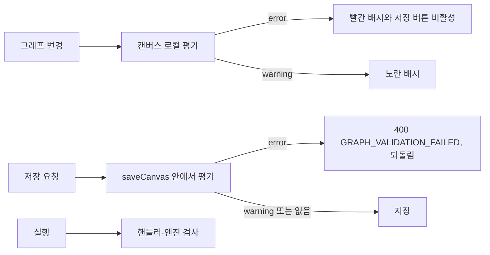

> 구현 상태: 구현됨 · 원문: `spec/conventions/cross-node-warning-rules.md` · 용어: [용어 사전](../CLE-GLOSSARY.md)

## 개요

노드 경고 규칙(`warningRules`)은 노드 하나의 설정만 평가하는 mini-DSL 이다(예: `branchCount < 2 || branchCount > 16`). 문법 정의는 `@workflow/node-summary` 패키지에 있다. 이 방식으로는 부모와 자식을 함께 봐야 하는 조건을 표현할 수 없다. 예를 들어 바깥 Parallel 의 `maxConcurrency` 와 안쪽 Parallel 의 `maxConcurrency` 를 곱한 값, 바깥 Parallel 병렬 분기 본문 안에 또 Parallel 이 있는지 같은 조건이다.

이 규약은 그래프 전체를 함수 인자로 받아 평가하는 그래프 경고 규칙(`graphWarningRules`) 메커니즘을 정한다. Parallel 후속 작업의 결정 D(동시성 상한 조정의 캔버스 사전 경고), 결정 E(중첩 깊이 검사의 3중 가드: 저장 거부, 캔버스 사전 경고, 실행 시 거부), 결정 I(인프라를 별도 계획으로 분리)의 기준이다.

범위 밖:

- 노드 하나의 설정만 보는 노드 경고 규칙과 캔버스의 미설정 경고 표시는 [워크플로우 에디터와 캔버스](CLE-WF-EDITOR.md) 와 각 노드 문서가 정한다.
- 탈출 불가 순환 경고의 에디터 판정 규칙은 [연결선](CLE-WF-EDGE.md) 이 정한다.
- Parallel 의 제한 값과 근거는 [Parallel 노드](../CLE-NODE-LOGIC/CLE-NODE-PARALLEL.md), 도구 정의 크기 예산은 [AI 에이전트 노드](../CLE-NODE-AI/CLE-NODE-AGENT.md) 가 정한다.
- 경고 문구의 한국어 매핑 의무와 자동 가드는 [다국어와 화면 문구](../CLE-UI/CLE-UI-I18N.md) 가 정한다.

## 규칙

1. 노드 하나의 설정만으로 평가할 수 있으면 노드 경고 규칙(`warningRules`)을 먼저 쓴다. 표현이 간결하고 프론트엔드와 백엔드가 같은 평가 엔진을 쓴다는 보장이 있다. 부모·자식·그래프 전역 정보가 필요할 때만 그래프 경고 규칙(`graphWarningRules`)을 쓴다.
2. 그래프 경고 규칙의 타입, 평가 유틸, 규칙 정의는 공유 패키지 `@workflow/graph-warning-rules`(`codebase/packages/graph-warning-rules/`) 한곳에 둔다. 백엔드와 프론트엔드 모두 이 패키지를 import 한다.
3. 패키지는 TypeORM 이나 앱에 기대지 않는 순수 형태(`GraphRuleNode`, `GraphRuleEdge`)로 정의한다. 백엔드는 얇은 어댑터로 엔티티를 이 형태로 바꾸고, 프론트엔드는 store·캔버스의 노드와 연결선을 같은 형태로 바꿔 같은 함수를 실행한다.
4. 결과의 `message` 는 영문이 기준이자 대체 문구다. 노드 레이블이나 수치처럼 동적인 값은 `params` 로 분리해 내보낸다. 새 그래프 경고 규칙을 추가할 때는 `params` 노출과 한국어 템플릿(`GRAPH_WARNING_KO`) 매핑을 같은 PR 에서 한다.
5. 특정 노드 유형에 속한 규칙은 `NodeComponentMetadata.graphWarningRules` 에 두고 패키지의 `GRAPH_WARNING_RULES_BY_TYPE` 맵에 올린다.
6. 특정 노드 유형에 속하지 않고 그래프 전체를 한 번 돌아 평가하는 그래프 수준 규칙은 독립 함수 `(GraphRuleGraph) => GraphWarningRuleResult[]` 로 내보낸다. 호출하는 쪽이 유형별 결과 배열과 펼쳐 합쳐 같은 `GraphWarningRuleResult[]` 로 내보낸다. 이 규칙은 `GRAPH_WARNING_RULES_BY_TYPE` 밖에 있으므로 다국어 가드(P3-C-1)가 그 `ruleId` 를 따로 열거해 매핑을 강제한다.
7. 심각도 `error` 규칙은 저장 요청을 거부하고 캔버스에서 저장 버튼을 막는다. `warning` 규칙은 저장을 통과시키고 캔버스에 노란 배지만 붙인다([심각도 정책](#심각도-정책)).
8. 심각도 `error` 규칙이 지키는 불변식은 저장 요청, 프론트엔드 캔버스, 실행 세 시점에서 모두 지킨다([평가 시점과 3중 가드](#평가-시점과-3중-가드)).
9. 평가에 비동기 외부 조회가 필요한 규칙은 공유 패키지에 넣지 않고 백엔드 전용 규칙으로 둔다. 이때 캔버스 사전 평가는 생략하고 저장 요청 가드와 강한 실행 시 가드를 반드시 함께 둔다.
10. 평가 유틸은 같은 그래프에 늘 같은 결과를 내는 순수 함수다. debounce 와 memoization 은 호출하는 쪽이 책임진다.
11. 메타데이터 API 로 규칙 함수를 직렬화해 프론트엔드에서 eval 하지 않는다(보안).

## 두 메커니즘 비교

| 항목 | 노드 경고 규칙 `warningRules`(mini-DSL) | 그래프 경고 규칙 `graphWarningRules` |
| --- | --- | --- |
| 입력 | `config`(노드 하나) | `(node, { nodes, edges })`(그래프 전체) |
| 표현 | mini-DSL 문자열(`branchCount < 2`) | JS 함수(`evaluate: (node, graph) => result \| null`) |
| 평가 위치 | 프론트엔드 캔버스와 백엔드 `handler.validate`(`@workflow/node-summary` 가 기준) | 워크플로우 저장 요청, 프론트엔드 캔버스, 실행 시(의무) |
| 심각도 | `blocking`, `advisory` | `error`, `warning` |
| 쓰는 곳 | 노드 하나의 설정 위반. 가장 흔한 경우이고 모든 노드의 기본 경로다. | 부모·자식이나 형제 노드 관계 위반(그래프 수준 규칙) |

## 타입 정의

타입, 평가 유틸, Parallel 규칙의 기준은 공유 패키지 `@workflow/graph-warning-rules` 다.

```ts
// @workflow/graph-warning-rules
export interface GraphRuleNode {
  id: string;
  type: string;
  config?: Record<string, unknown>;
  label?: string;
}
export interface GraphRuleEdge {
  source: string;
  sourceHandle?: string | null;
  target: string;
  targetHandle?: string | null;
}

export interface GraphWarningRule {
  id: string;
  severity: 'error' | 'warning';
  evaluate: (
    node: GraphRuleNode,
    graph: { nodes: readonly GraphRuleNode[]; edges: readonly GraphRuleEdge[] },
  ) => { message: string; params?: Record<string, string | number> } | null;
}

export interface GraphWarningRuleResult {
  ruleId: string;
  severity: 'error' | 'warning';
  nodeId: string;
  /** 영문 기준·대체 문구. ko 표시 문자열은 frontend 가 ruleId 로 바꾼다. */
  message: string;
  /** 동적 메시지의 보간 값(노드 레이블·수치 등). frontend 가 GRAPH_WARNING_KO[ruleId] 템플릿의 {{name}} 에 넣는다. */
  params?: Record<string, string | number>;
}
```

- **메시지 번역**: ko 로케일의 캔버스 배지나 저장 거부 안내 같은 사용자 표시 문자열은 프론트엔드 `translateGraphWarning(result, locale)` 가 만든다. `ruleId` 로 한국어 템플릿을 고르고 `params` 를 `{{name}}` 자리에 넣는다. 매핑의 기준·의무·자동 가드는 [다국어와 화면 문구](../CLE-UI/CLE-UI-I18N.md) 가 정한다.
- `NodeComponentMetadata.graphWarningRules?: readonly GraphWarningRule[]` 필드를 둔다. Parallel 노드는 패키지의 `parallelGraphWarningRules` 를 가리킨다.
- 백엔드는 얇은 어댑터(`graph-warning-rule.ts`)가 TypeORM `Node`·`Edge` 엔티티를 `GraphRuleNode`·`GraphRuleEdge` 로 바꾼 뒤(`toRuleNode`, `toRuleEdge`) 패키지 유틸에 넘긴다.
- 프론트엔드는 캔버스·store 의 노드와 연결선을 같은 순수 형태로 바꿔(`mapToRuleGraph`) 패키지 유틸을 **로컬에서 실행**한다.
- 프론트엔드가 규칙을 노드 유형으로 찾도록 패키지가 `GRAPH_WARNING_RULES_BY_TYPE: Readonly<Record<string, readonly GraphWarningRule[]>>` 맵을 내보낸다.
- 그래프 수준 규칙(예: 탈출 불가 순환을 찾는 `evaluateGraphCycleWarnings`, `rules/cycle.ts`)은 [규칙](#규칙) 6번대로 독립 함수로 내보낸다. 호출하는 쪽(백엔드 `getGraphWarnings`, 프론트엔드 `evaluateGraphWarningsLocal`)이 유형별 결과와 합친다. 결과 형태·심각도·번역 규약은 유형별 규칙과 같다.

## 심각도 정책

| 심각도 | 워크플로우 저장 요청 | 프론트엔드 캔버스 | 쓰는 경우 |
| --- | --- | --- | --- |
| `error` | 저장 거부(400, 응답에 규칙 메시지 포함) | 빨간 배지, 저장 버튼 비활성 | 깊이 위반(`parallel:nested-depth-exceeded`), 명백한 불변식 위반. 그래프 수준 탈출 불가 순환(`graph:unescapable-cycle`)은 `error` 가 아니라 `warning` 이다([연결선](CLE-WF-EDGE.md)의 경고만 하고 막지 않는 결정). |
| `warning` | 저장 통과(로그를 남기고 응답에 포함) | 노란 배지, 저장 가능 | 운영 위험은 있지만 실행 시 안전장치가 있는 경우(예: 동시성 상한을 말없이 낮추는 조정) |

## 평가 시점과 3중 가드

같은 불변식을 세 시점에서 지킨다. 특히 심각도 `error` 규칙이 그렇다.

1. **워크플로우 저장 요청**: `WorkflowsService.saveCanvas` 가 노드·연결선 동기화(`syncNodes`, `syncEdges`)와 같은 트랜잭션에서 `evaluateGraphWarnings` 를 부른다. 심각도 `error` 가 있으면 `BadRequestException(GRAPH_VALIDATION_FAILED)` 을 던져 되돌린다. 구현됨.
2. **프론트엔드 캔버스**: 그래프가 바뀔 때마다 `evaluateGraphWarningsLocal` 로 로컬에서 평가해 노드별 배지를 붙이고 저장 버튼을 제어한다. 에디터는 500ms debounce 로 평가한다. 구현됨.
3. **실행 시**: 노드 핸들러나 엔진의 그래프 검사 단계에서 자기 노드를 중심으로 평가한다. 이 규약과 별개로 실행 시 직접 짠 검사(예: `PARALLEL_NESTED_DEPTH_EXCEEDED` 던지기)와 메시지 뜻이 일치해야 한다.



**보조 조회 API**: `GET /workflows/:id/graph-warnings`(REST, `viewer` 이상). `WorkflowsService.getGraphWarnings` 가 저장된 노드와 연결선을 불러 `evaluateGraphWarningRulesForGraph` 로 서버 기준 평가를 하고 `{ results, hasError, hasWarning }` 를 돌려준다(`workflows.controller.ts`, `workflows.service.ts`). 이 API 는 3중 가드에 들지 않는 **조회 전용 보조 API**(디버그, 외부 클라이언트용)다. 프론트엔드 캔버스는 이 API 를 부르지 않고 가드 ②의 로컬 평가만 쓴다. 프론트엔드 API 클라이언트의 `graphWarnings` 메서드는 지금 부르는 곳이 없다.

**예외: 백엔드 전용 비동기 규칙(가드 ② 생략)**: 평가에 **비동기 외부 조회**(예: 통합에 허용된 권한 범위, 지금의 MCP 도구 목록)가 필요한 규칙은 순수·동기이고 프론트엔드와 백엔드가 함께 쓰는 공유 패키지로 표현할 수 없다.

- 이런 규칙은 공유 패키지에 넣지 않는다. 백엔드 `WorkflowsService` 가 `evaluateGraphWarnings` 결과 배열에 **덧붙이는** 백엔드 전용 평가로 둔다.
- 프론트엔드는 비동기 조회를 할 수 없으므로 가드 ②(캔버스 사전 평가)는 구조적으로 **생략**한다. 가드 ①(`saveCanvas`)과 노드별 **실행 시 가드 ③**(자기 노드를 실행할 때 사전 검증 에러를 던짐)이 안전망이다.
- 심각도 `error` 규칙에도 이 예외를 적용할 수 있다. 그때는 반드시 강한 실행 시 가드 ③을 함께 둔다.
- 백엔드 전용 규칙은 평가 시점에 심각도를 계산할 수 있다(예: 환경 변수로 `warning` 을 `error` 로 올림). 고정 `severity` 필드 모델과 달리 `GraphWarningRuleResult` 를 직접 만들기 때문이다.
- 지금 등록된 것은 `ai_agent:tool-payload-budget` 하나다([등록된 규칙](#등록된-규칙)).
- 다국어 동등성: 백엔드 전용 규칙은 `GRAPH_WARNING_RULES_BY_TYPE` 밖이라 P3-C-1 자동 검사에 잡히지 않는다. `backend-labels.test.ts` 의 백엔드 전용 `ruleId` 명시 목록과 `GRAPH_WARNING_KO` 한국어 매핑에 손으로 등록해야 한다.

## 단일 기준 보장

그래프 경고 규칙의 `evaluate` 는 JS 함수라서 프론트엔드와 백엔드가 같은 함수 정의를 실행해야 평가 결과가 일치한다. 그래서 **공유 패키지 `@workflow/graph-warning-rules`** 를 단일 기준으로 골랐다(옵션 A).

- 규칙 정의(타입, 평가 유틸, Parallel 규칙, `GRAPH_WARNING_RULES_BY_TYPE` 맵)가 패키지에 있다. 백엔드와 프론트엔드가 모두 `file:` 의존으로 import 하므로 어긋남이 없다.
- 패키지는 TypeORM 과 백엔드에 기대지 않는 순수 형태(`GraphRuleNode {id,type,config,label}`, `GraphRuleEdge {source,sourceHandle,target,targetHandle}`)로 정의한다. 백엔드는 Edge 엔티티를 이 형태로 바꾸는 얇은 어댑터를, 프론트엔드는 store·캔버스의 노드와 연결선을 바꾸는 매핑을 두고 같은 함수를 실행한다.
- 메타데이터 API 가 규칙 함수를 직렬화하고 프론트엔드에서 eval 하는 안(옵션 B)은 보안 우려로 고르지 않았다.

## 평가 유틸

```ts
// 노드 하나 평가(자기 메타데이터의 규칙을 모두 평가)
evaluateGraphWarningRules(node, graph, rules) → GraphWarningRuleResult[]

// 그래프 전체 평가(resolver 가 node.type → rules 매핑을 제공)
evaluateGraphWarningRulesForGraph(graph, resolver) → GraphWarningRuleResult[]
```

순수 함수라 같은 그래프 스냅샷에 늘 같은 결과를 낸다. 노드 N 개에 규칙 M 개를 평가하므로 debounce 와 memoization 은 호출하는 쪽이 책임진다.

## 등록된 규칙

| 노드 | 규칙 id | 심각도 | 뜻 |
| --- | --- | --- | --- |
| Parallel | `parallel:nested-depth-exceeded` | `error` | 바깥 Parallel 의 병렬 분기 본문에 안쪽 Parallel 이 있고 그 분기 본문에 또 Parallel 이 있으면 깊이 3이라 거부한다(Parallel 후속 결정 3). |
| Parallel | `parallel:nested-concurrency-cap` | `warning` | 바깥 유효 동시성 × 안쪽 유효 동시성이 32를 넘으면 경고한다. 실행 시 말없이 상한을 낮추는 조정이 안전망이다(Parallel 후속 결정 3, D). |
| 그래프 수준 | `graph:unescapable-cycle` | `warning` | 분기 노드 없이 탈출할 수 없는 순환(통과형 노드에서 되돌아가는 연결선)을 그 출발 노드에 경고한다. 컨테이너가 모으는 연결선(`targetHandle==='emit'`)과 컨테이너 진입 연결선(`sourceHandle==='body'`)은 예외다. 에디터는 경고만 하고 막지 않는다([연결선](CLE-WF-EDGE.md)). |
| AI 에이전트 노드(**백엔드 전용**, 예외 규칙) | `ai_agent:tool-payload-budget` | `warning`. `AI_AGENT_TOOL_BUDGET_STRICT_SAVE=true` 면 hard 초과분을 `error` 로 올린다. | 노드의 도구 정의(스키마) payload 가 예산(`AI_AGENT_TOOL_PAYLOAD_SOFT_BYTES`, `_HARD_BYTES`)을 넘는다. 통합 권한 범위를 비동기로 조회해야 해서 백엔드 전용으로 평가한다(가드 ② 생략, 실행 시 `TOOL_DEFINITION_PAYLOAD_EXCEEDED` 가 안전망). `WorkflowsService` 가 `getGraphWarnings`(조회) 결과에 덧붙이고 `saveCanvas`(저장)는 심각도가 `error` 면 막는다. 기준은 [AI 에이전트 노드](../CLE-NODE-AI/CLE-NODE-AGENT.md) 다. |

## 향후 확장

이 규약의 범위 밖이다.

- Loop·ForEach 의 중첩 깊이 정책: **도입하지 않기로 확정했다**(2026-07-08). 컨테이너 중첩은 허용하되 깊이 상한과 레벨별 시각 표시를 두지 않는다([워크플로우 에디터와 캔버스](CLE-WF-EDITOR.md) 의 컨테이너 중첩, Rationale R-4). 순환만 `CONTAINER_CYCLE` 로 거부한다.
- Map·Filter 의 부모 컨테이너 맥락 검사
- 워크플로우 수준 그래프 검사: 순환은 `graph:unescapable-cycle` 로 **구현했다**(에디터는 경고만 하고 막지 않음). 도달할 수 없는 노드 탐지(`unreachable`)는 도입하지 않았다.

## 구현 위치

- `codebase/packages/graph-warning-rules/**`
- `codebase/packages/node-summary/**`
- `codebase/backend/src/nodes/core/graph-warning-rule.ts`
- `codebase/backend/src/nodes/core/node-component.interface.ts`
- `codebase/backend/src/nodes/logic/parallel/parallel.schema.ts`
- `codebase/backend/src/modules/workflows/workflows.service.ts`
- `codebase/backend/src/nodes/ai/ai-agent/tool-payload-save-warning.ts`
- `codebase/frontend/src/components/editor/workflow-editor.tsx`
- `codebase/frontend/src/lib/stores/editor-store.ts`
- `codebase/frontend/src/components/editor/canvas/custom-node.tsx`
- `codebase/frontend/src/components/editor/toolbar/editor-toolbar.tsx`

## Rationale

### 함수형 규칙을 새로 만든 이유

이 메커니즘은 Parallel 후속 작업의 결정 D 와 E 가 노드 사이 평가를 요구해서 만들었다. mini-DSL 을 넓히는 안(옵션 1) 대신 함수형 규칙(옵션 2)을 고른 근거는 다음과 같다.

- **표현력**: 부모 노드 접근자만 더하는 mini-DSL 확장으로는 순환, 형제, 깊이처럼 그래프 구조에 기대는 불변식을 표현하기 어렵다. 함수형은 그래프 전체를 자유롭게 돌 수 있다.
- **확장성**: 앞으로 Loop·ForEach 등에 노드 사이 정책이 더해질 때마다 mini-DSL 표현력을 다시 넓혀야 하는 부담을 피한다.
- **단일 기준 비용**: 옵션 1 도 프론트엔드와 백엔드 양쪽에 같은 평가 엔진이 필요하다(지금은 `@workflow/node-summary` 가 맡는다). 옵션 2 는 함수 정의 자체를 공유 패키지로 빼면 평가 엔진을 중복으로 만들 필요가 없다.

노드 하나를 평가하는 mini-DSL 은 쓰임이 압도적으로 많고 표현이 간결하므로 그대로 둔다. 그래프 경고 규칙은 노드 사이 평가가 필요한 경우에만 쓴다.

### 평가 결과에 `params` 를 더한 이유 (2026-06-02)

규칙 메시지가 `Parallel "${node.label}" ... > cap=${product}` 처럼 노드 레이블과 수치를 실행 시 끼워 넣는 **동적 문자열**이었다. 영문 문자열 전체를 키로 쓰는 기존 `WARNING_KO` 정적 매핑으로는 ko 번역을 할 수 없었다. 끼워 넣은 결과가 매번 달라 키가 성립하지 않는다. 영문 기준 원칙([다국어와 화면 문구](../CLE-UI/CLE-UI-I18N.md))을 지키면서 번역하려면 **표시 문자열과 보간 값을 나누는 것**이 맞는 유일한 방법이다. 그래서 `message` 는 영문 기준·대체 문구로 두고 보간 값을 `params` 로 내보내 프론트엔드가 `ruleId` 별 로케일 템플릿에 끼워 넣게 했다. 백엔드가 `Accept-Language` 로 서버에서 번역하는 안은 응답에 한국어를 박아 영문 기준 원칙을 깨고 사전을 두 벌 만들므로 기각했다. `params` 는 선택 항목이라 기존 정적 메시지 규칙과 호환된다. 정책·매핑 의무·자동 가드의 기준은 다국어 규약에 맡긴다.
