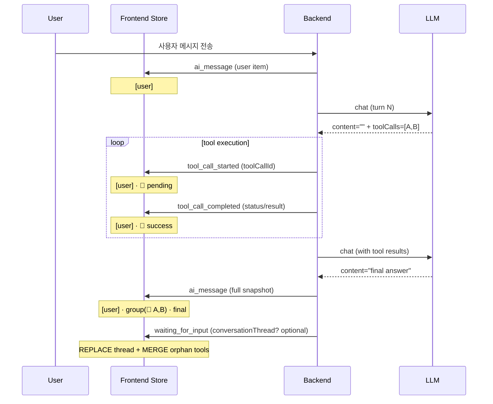

# Conversation Thread (대화 스레드)

> 관련 문서: [Spec 실행 엔진 §6.1](../5-system/4-execution-engine.md#61-컨텍스트-구조) · [Spec AI Agent](../4-nodes/3-ai/1-ai-agent.md) · [Spec AI 공통 §10](../4-nodes/3-ai/0-common.md#10-conversation-context-자동-컨텍스트-주입) · [CONVENTIONS Principle 4.5](./node-output.md#45-interactiondata-payload-규격) · [Spec 표현식 언어 §4.4](../5-system/5-expression-language.md#44-thread-속성)

워크플로우 한 실행 동안 발생하는 사용자 인터랙션과 AI 대화 turn 을 시간순으로 누적하는 1급 컨텍스트. AI Agent 노드가 노드 설정 (`contextScope`) 으로 자동 주입받는다.

---

## 1. 자료구조

### 1.1 ConversationTurnSource

| 값 | 발생원 |
|---|---|
| `presentation_user` | Form / Carousel / Table / Chart / Template 의 `output.interaction.{type}` 가 `form_submitted` / `button_click` / `button_continue` 일 때 |
| `ai_user` | AI Agent multi-turn 의 `output.interaction.type='message_received'` 시점 |
| `ai_assistant` | AI Agent (single·multi) 의 final assistant 응답 |
| `ai_tool` | KB / MCP / condition tool 결과 (opt-in 시 `includeToolTurns: true`) |
| `system` | 명시적으로 push 한 system text (예약, v1 자동 누적 없음). **주의**: AssistantMessage `role: 'system'` 과 무관 — 워크플로우 레벨의 수동 push 전용 (예: 초기 시스템 안내 turn) |

### 1.2 ConversationTurn

| 필드 | 타입 | 설명 |
|---|---|---|
| `seq` | Number | 단조 증가. append 순서 == 시간 순서. thread 내 unique |
| `nodeId` | UUID | turn 을 발생시킨 그래프 노드 |
| `nodeLabel` | String | append 시점의 라벨 snapshot (라벨 변경 후에도 표시 일관성) |
| `nodeType` | String | 예: `form`, `carousel`, `ai_agent` |
| `timestamp` | String (ISO 8601) | 서버 시각 |
| `source` | ConversationTurnSource | §1.1 |
| `text` | String | system_text injection 과 messages 모드의 user/assistant content. **LLM-facing 1차 텍스트** — `[from <nodeLabel>]` prefix 는 builder 단계에서 prepend 되므로 turn.text 에는 박히지 않는다 (§1.5). 사용자-출처 텍스트는 `[user-input]…[/user-input]` 마커로 wrap 되어 저장된다 — prompt injection 방어용 LLM-facing 의무 (§1.6), UI 표시 시 §9.5 의 strip 으로 제거된다. UI 는 §9 의 매핑표를 따라 `source` + `nodeLabel` + `data` 메타로 분기 — `text` 를 raw 로 직접 노출하지 않는다. 빈 문자열 가능 (구조화 데이터만 있는 경우) |
| `data?` | Object | 구조화 원본 — `output.interaction.data` snapshot. `interaction.type` 별 shape 은 [node-output §4.5](./node-output.md#45-interactiondata-payload-규격) 의 단일 정의를 따른다 (drift 회피 위해 본 표에 재열거하지 않음). UI 와 LLM payload builder 는 raw text 파싱 없이 본 메타로 렌더 / 직렬화 — 새 inline marker 도입은 §1.6 를 먼저 개정해야 한다 |
| `toolCalls?` | Array<{id,name,arguments}> | `source='ai_assistant'` 한정. provider 호환성을 위해 messages 모드에서 drop 가능 |
| `toolCallId?` | String | `source='ai_tool'` 한정 |

### 1.3 ConversationThread

| 필드 | 타입 | 설명 |
|---|---|---|
| `id` | String | v1 고정값 `"default"` (multi-thread 는 v2). **port 예약어 `'default'` 와 무관** — namespace 분리. 코드에서 `DEFAULT_THREAD_ID = 'default'` 상수 추출 권장 |
| `nextSeq` | Number | 다음 append 시 부여될 seq (== `turns.length`) |
| `turns` | ConversationTurn[] | 시간순 누적 |
| `totalChars` | Number | append 시 갱신되는 누적 char 길이 캐시 (cap 빠른 경로) |

### 1.4 `text` 변환 규칙

`text` 는 LLM-facing 텍스트 — system_text 모드의 thread-renderer 본문과 messages 모드의 user/assistant content 로 그대로 흐른다. UI 표시는 §9.1 의 매핑표를 우선 적용하며, `text` 의 동사 prefix (`clicked:`, `continued:`) 는 UI 카드 헤더로 분리 표시되어 본문에는 buttonLabel / URL 만 남는다.

| `interaction.type` | text (LLM-facing) | UI 카드 헤더 (참고) | UI 카드 본문 (참고) |
|---|---|---|---|
| `form_submitted` | `name=John, age=30` (key=value 리스트, 200자 cap, value 가 객체/배열이면 JSON 직렬화) | `<nodeLabel> · form submitted` | `data` 자체가 `{ [fieldName]: value }` flat map ([node-output §4.5](./node-output.md#45-interactiondata-payload-규격)) — UI 는 그 key-value 를 표로 렌더 |
| `button_click` | `clicked: <buttonLabel>` (label 미존재 시 `<buttonId>`) | `<nodeLabel> · button clicked` | `data.buttonLabel` (없으면 `data.buttonId`) |
| `button_continue` | `continued: <url>` (url 미존재 시 `continued`) | `<nodeLabel> · link continue` | `data.url` |
| `message_received` (ai_user) | 메시지 본문 그대로 (marker wrap 없음 — `appendAiUserMessage` 가 `renderInteractionText` 를 거치지 않음. ai_user 는 AI Agent multi-turn 의 명시적 사용자 메시지로, presentation 노드를 거친 user-origin 데이터처럼 marker 식별이 필요하지 않다) | (없음 — chat bubble) | `text` |
| `ai_agent` final assistant | `output.result.response` 그대로 (CONVENTIONS Principle 8.2 LLM 응답 텍스트 경로) | (없음 — chat bubble) | `text` (markdown) |
| `text_classifier` final assistant (v2) | single-label: `output.result.category`. Multi-label: `output.result.categories.map(c => c.name).join(', ')` (categories 는 객체 배열이라 raw `.join` 불가). | `<nodeLabel> · classified` | `text` |
| `information_extractor` final assistant (v2) | `output.result.extracted` 를 항상 `JSON.stringify` 직렬화 (`responseFormat` 필드는 `ai_agent` 전용 — extractor 는 항상 구조화 출력). | `<nodeLabel> · extracted` | `text` (JSON pretty) |

### 1.5 LLM payload prefix 컨벤션

`[from <nodeLabel>] ` prefix (messages 모드, §5.1) 와 system_text 모드의 thread-renderer 헤더 (§5.2) 는 **LLM payload builder (`mapTurnsToChatMessages`, `renderThreadAsSystemText`) 의 책임**이다. `ConversationTurn.text` 자체에는 prefix 가 박히지 않는다 — turn 은 다른 provider / formatter 로도 재사용 가능한 raw 본문을 보관한다.

**영속·emit 형태**: prefix 는 한 번 prepend 된 뒤 LLM 호출 messages history 의 일부로 누적되어 `output.result.messages` 에 함께 저장되고, WebSocket `ai_message.messages[]` / `waiting_for_input.conversationConfig.messages[]` 에도 그대로 emit 된다 — LLM 이 다음 turn 에서도 attribution 을 유지하려면 prefix 가 messages history 안에 있어야 하기 때문. 이 emit 메시지에는 `source: 'injected'` 마커 ([Spec WebSocket Protocol §4.4.6](../5-system/6-websocket-protocol.md#446-messagessource-마커)) 가 동봉된다.

**UI 노출 회피**: 미리보기 UI 는 §9.3 D4 에 따라 prefix 가 포함된 emit messages 가 아닌 `conversationThread` snapshot (prefix 미포함 raw turn.text) 을 1차 소스로 사용해 사용자 오인을 차단한다. emit messages 는 LLM debug 패널 (Request / Response / LLM Usage) 전용 — 거기서는 "Raw payload" 토글로 명시적으로 raw 형태를 노출한다.

### 1.6 LLM-facing 보안 마커

`renderInteractionText` ([backend `thread-renderer.ts`](../../codebase/backend/src/shared/conversation-thread/thread-renderer.ts)) 는 prompt injection 방어를 위해 사용자-출처 텍스트 (form 제출값, button 라벨, URL) 를 `[user-input]…[/user-input]` 마커로 감싼다. 마커 안의 마커 토큰 재등장은 zero-width separator 로 escape 한다.

| 항목 | 정책 | 비고 |
|---|---|---|
| `[user-input]…[/user-input]` | **LLM-facing 의무 (presentation_user 한정)** — `renderInteractionText` 가 form/button/URL 값 등 presentation 노드 user-origin 텍스트를 wrap. ai_user 는 multi-turn 명시적 사용자 메시지로, marker wrap 적용 안 함 (§1.4 행 비고) | §5.2 sanitization 의 일부 |
| 마커가 박힌 `turn.text` / `output.result.messages[].content` | 그대로 영속·emit | LLM history 보존이 1차 목적 (D6 단일 경로) |
| UI 노출 | **§9.5 의 strip 정규식으로 사용자에게 노출 전에 제거** | 사용자는 marker 가 시각적으로 보이지 않는다 |
| `[from <nodeLabel>]` 외 임의 inline marker (예: 새 BBCode 풍 `[#…]`) | 추가 도입 금지 | 새 보안 marker 가 필요하면 본 절을 개정한 뒤 도입 |
| 라벨/이벤트/메타 (예: button 라벨, URL) | `turn.data` 의 1급 필드 ([node-output §4.5](./node-output.md#45-interactiondata-payload-규격)) 가 단일 진실 — UI 는 `data` 에서 직접 추출, marker 가 박힌 text 를 파싱하지 않음 | §9.1 카드 본문 렌더 규칙 |

consistency-checker 의 `convention-compliance` 가 다음을 위반 검출한다: (a) backend 가 LLM-facing text 에 marker 없이 사용자-출처 데이터를 박는 경우 (방어 누락), (b) UI 가 emit messages 의 raw `content` 를 conversation Preview 에 그대로 표시하는 경우 (§1.5·§9.4 위반), (c) 본 절에 정의되지 않은 새 inline marker 를 도입하는 경우.

---

## 2. 자동 누적 컨트랙트

### 2.1 Presentation 노드

`status: 'resumed'` 직전, `output.interaction` 빌드 후 엔진이 자동 push:
- form `interaction.type='form_submitted'` → `source: 'presentation_user'`
- carousel/table/chart/template `interaction.type='button_click' | 'button_continue'` → `source: 'presentation_user'`

> 현재 실행 엔진의 presentation resume 코드는 `'submitted' / 'button_click' / 'button_continue'` 의 legacy status 값을 status 필드에 사용한다 (spec [실행 엔진 §1.3](../5-system/4-execution-engine.md#13-블로킹재개-컨트랙트-nodehandleroutput-status) 의 마이그레이션 노트 참조). 통일된 `'resumed'` 값으로의 마이그레이션은 별도 phase (presentation Principle 1.1 재작성) — 본 컨벤션은 status 값과 무관하게 `interaction.{type, data, receivedAt}` payload 가 emit 되는 시점에 push 가 발화함을 정의한다.

### 2.2 AI Agent

| 시점 | source |
|---|---|
| multi-turn user message 도착 (`output.interaction.type='message_received'`) | `ai_user` |
| multi-turn 매 turn 종료 시 final assistant 응답 (`output.result.response`) | `ai_assistant` |
| multi-turn condition route 시 assistant 응답 (`output.result.response`) | `ai_assistant` |
| single-turn `userPrompt` (resolved) | `ai_user` (1회) |
| single-turn 최종 `output.result.response` | `ai_assistant` (1회) |
| tool-loop 중 assistant + tool result | `ai_assistant` / `ai_tool` (opt-in `includeToolTurns: true` 시에만) |

### 2.3 v1 적용 범위 (push vs inject 구분)

| 동작 | v1 적용 범위 | v2 로드맵 |
|---|---|---|
| **Turn push (누적)** | `ai_agent` 만 — multi-turn user/assistant + single-turn final assistant 자동 push | `text_classifier` / `information_extractor` 도 final assistant push 추가 (§1.4 의 v2 표기 행) |
| **자동 주입 (inject — `contextScope` 활성화)** | `ai_agent` 만 | `text_classifier` / `information_extractor` 도 동일 인터페이스 |

> push 와 inject 를 분리해 정의하는 이유: 다른 AI 노드의 final 응답도 후속 AI Agent 가 thread 로 받게 하려는 의도였으나, 분류·추출 노드 핸들러는 final-assistant 의미 있는 시점이 ai_agent 와 다르고 (text_classifier 는 카테고리, information_extractor 는 구조화 데이터), §1.4 의 변환 규칙도 노드별로 갈라진다. v1 출하 기준은 ai_agent 만이며 (handler 코드에 push hook 존재), 다른 두 노드의 push 는 §1.4 의 변환 규칙이 합의된 v2 에서 활성화.

### 2.4 opt-out

각 노드에 공통 boolean config: `excludeFromConversationThread` (default `false`). `true` 면 해당 노드의 모든 push 가 silent skip. UI 그룹은 `Advanced > Conversation`.

---

## 3. 스코프 규칙

| 컨테이너 | 정책 |
|---|---|
| Sub-workflow (`executeInline`) | parent thread 상속·공유 |
| Background | enqueue 시점 turns 배열까지 복사한 snapshot — 격리 |
| Loop / ForEach / Map / Parallel | parent thread 상속·공유 |

### 3.1 Sub-workflow 상속 근거

`Workflow` 노드의 sync `executeInline` 경로는 부모 `ExecutionContext` 를 그대로 재사용한다 (`recursionDepth` 만 증가). 따라서 sub 안의 AI Agent 도 부모의 thread 를 본다. 사용자가 명시적으로 격리하고 싶으면 async mode 로 호출 (별도 Execution → 별도 thread).

### 3.2 Background 격리 근거

`scheduleBackgroundBody` 가 enqueue 시점에 thread 의 **turns 배열까지 함께 복사한 snapshot** 을 만든다 — 최소 `{ ...thread, turns: [...thread.turns] }` 형태. 단순 reference 복사가 아니라 새 array 인스턴스를 만들어, 백그라운드가 새 turn 을 push 해도 메인 thread 의 `turns` 가 변형되지 않음을 보장한다. ConversationTurn 객체 자체는 immutable (한 번 push 되면 수정되지 않음) 이라 깊은 복사까지 필요하지 않다.

→ 메인 흐름이 이후 발생시킨 turn 은 background 가 못 보고, background 안에서 발생한 turn 은 메인 thread 에 영향 없음. PRD 3 §4.11 ND-BG-05 ("백그라운드 실패가 메인 흐름의 Execution 상태에 영향을 주지 않음") 격리 원칙과 정합.

### 3.3 컨테이너 상속 근거

Loop / ForEach / Map / Parallel 컨테이너는 별도 ExecutionContext 를 만들지 않고 같은 context.nodeOutputCache 를 공유한다. thread 도 같은 정책. iteration 메타 (index 등) 는 thread 에 자동 주입하지 않으며, 필요시 사용자가 `{{ $loop.index }}` 등으로 명시.

---

### 2.5 nextSeq 원자성

`nextSeq` 의 단조 증가는 **단일 ExecutionContext 인스턴스 하에 직렬 실행** 보장에
의존한다. v1 의 in-memory + single-instance 환경에서는 한 execution 의 노드
처리가 한 번에 한 노드씩 진행되므로 (engine 의 `executeNode` 가 sequential)
`appendInternal` 의 `seq = thread.nextSeq; thread.nextSeq = seq + 1` 가
race-free.

다음 시나리오에서는 별도 보장이 필요:
- **Parallel 컨테이너**: 분기들이 같은 thread 에 동시 push 가능. v1 은 Parallel
  내부 thread 사용을 정의하지 않음 (관련 spec follow-up). v2 에서 분기별 child
  thread 또는 merge point 재통합 정책 결정.
- **Multi-instance / Redis 분산**: thread 가 Redis 로 옮겨가면 `INCR` 같은
  atomic operation 또는 lock 필요. v1 은 in-memory only.

---

## 4. 영속화

| 단계 | 저장소 | 비고 |
|---|---|---|
| 실행 중 | `ExecutionContext` (실행 엔진 §6.2 정책에 따라 Redis 포함 직렬화) | `ExecutionContextService.createContext` 가 빈 thread (`{ id: 'default', nextSeq: 0, turns: [], totalChars: 0 }`) 로 초기화. TTL 은 실행 타임아웃 × 2 (execution-engine §6.2) |
| 실행 후 | NodeExecution 분산 저장 | `output.interaction` (presentation, `interaction.type` ∈ form_submitted/button_click/button_continue), `output.result.messages` (AI 멀티턴 누적 — waiting/resumed 시. D6 2026-05-17 이후 단일 경로 — [AI Agent §7.4·§7.5](../4-nodes/3-ai/1-ai-agent.md#74-multi-turn-모드--사용자-입력-대기-status-waiting_for_input)), `output.result.response` (AI 최종 응답) 가 SoT. thread 자체는 재구성 가능한 derived view |
| WS payload | `EXECUTION_WAITING_FOR_INPUT` 의 `conversationThread` snapshot 동봉 (선택) | UI 가 라이브 thread 표시 가능 |

**v1 은 신규 DB 컬럼 도입 없음.** 향후 사용자 요구 명확해지면 `Execution.conversation_thread jsonb NULL` 컬럼 마이그레이션 검토.

---

## 5. AI Agent 자동 주입

`spec/4-nodes/3-ai/1-ai-agent.md` §1 의 5 신규 필드:

| 필드 | 타입 | 기본값 |
|---|---|---|
| `contextScope` | `none` / `thread` / `lastN` | `none` |
| `contextScopeN` | Integer | `20` |
| `contextInjectionMode` | `messages` / `system_text` | `messages` |
| `includeToolTurns` | Boolean | `false` |
| `excludeFromConversationThread` | Boolean | `false` |

주입 위치는 `processMultiTurnMessageInner` 의 매 turn `llmService.chat` 직전 (single-turn 은 첫 chat 직전). messages 배열을 매 turn `[system, ...injectedThread, ...selfHistory]` 로 재빌드 — `injectedThread` 에서 자기 노드가 발생시킨 turn 은 `getThreadExcludingNode` 로 제외해 중복 방지.

> **systemPrompt build ordering** (`system_text` 모드 시 prefix→suffix 순): System Context Prefix → 사용자 systemPrompt → KB/condition suffix → thread injection. **ordering 의 단일 SoT 는 [Spec AI 공통 §11.4](../4-nodes/3-ai/0-common.md#114-주입-위치-및-ordering)** — 본 절은 thread injection 단계만 다루며 ordering 재정의는 §11.4 만 참조. `messages` 모드는 thread 가 systemPrompt 본문이 아닌 messages 배열 prepend 이므로 본 ordering 의 thread 단계가 적용되지 않는다.

### 5.1 messages 모드 매핑

| turn.source | role | content prefix |
|---|---|---|
| `presentation_user` | `user` | `[from <nodeLabel>] ` |
| `ai_user` | `user` | (없음) |
| `ai_assistant` | `assistant` | (없음, `toolCalls` 보존 또는 drop) |
| `ai_tool` | `tool` | (없음, `toolCallId` 매칭) |
| `system` | `system` | (없음) — **Anthropic API 비호환**: messages 배열 내 `role: 'system'` 미지원. provider 가 anthropic 이면 `system_text` 모드 또는 별도 분기로 우회 필수. v1 자동 push 없으므로 현재 실질 문제 없음 (수동 push 도입 시 provider 분기 검증 필수). |

> **WebSocket emit 결과의 `source` 마커**: 위 매핑으로 messages 배열에 prepend 된 모든 항목은 emit 시 `source: 'injected'` 를 동봉한다. 한편 AI Agent 핸들러가 `processMultiTurnMessageInner` 등에서 실제 turn 처리 결과로 push 하는 user/assistant/tool 메시지는 `source: 'live'`. 이 마커는 [Spec WebSocket Protocol §4.4.6](../5-system/6-websocket-protocol.md#446-messagessource-마커) 의 WebSocket 페이로드 전용 2값 표식이며, 본 §1.1 의 `ConversationTurnSource` (내부 5값 enum) 와는 구별된다 — emit 단계에서 §4.4.6 의 매핑 표에 따라 축약된다.

### 5.2 system_text 모드

`thread-renderer` 가 헤더 `[#seq · timestamp · label (type) · source]` + text 본문으로 렌더해 `finalSystemPrompt` 끝에 첨부. KB guidance / condition suffix 보다 뒤.

**Sanitization**: `turn.text` 가 사용자 입력 (form 제출, ai_user 메시지) 에서 유래한 경우 prompt injection 방어를 위해 `LlmService` 의 user content sanitizer 와 동일한 방식으로 sanitize 한다.

### 5.3 Cap (v1 — char 기반)

| 상수 | 값 | 동작 |
|---|---|---|
| `MAX_INJECTED_TURNS` | `100` | 초과 시 가장 오래된 turn 부터 drop, `[... N earlier turns omitted ...]` 마커 1줄 prepend |
| `MAX_TURN_TEXT_CHARS` | `4000` | 초과 시 truncate (`...` 접미사) |
| `MAX_INJECTED_CHARS` | `200_000` | 합산 char 추가 안전망 |

`meta.contextInjection: { appliedScope, appliedMode, injectedTurns, droppedTurns, totalInjectedChars }` 디버그 echo. `appliedScope`/`appliedMode` 는 config 값의 echo 가 아니라 **실제 적용 결과** 를 표기 (예: `contextScope='thread'` 더라도 thread 가 비어있으면 `appliedScope='none'`, cap 으로 잘리면 `injectedTurns < turns.length`). Principle 2 (meta = 런타임 측정값) 정합.

---

## 6. Expression 통합

`spec/5-system/5-expression-language.md` §4.4 의 `$thread` 변수:

| 표현식 | 반환 |
|---|---|
| `$thread.turns` | ConversationTurn[] (readonly) |
| `$thread.length` | Number |
| `$thread.text` | String — system_text 렌더 결과 |

자동 주입과 독립적으로 사용자가 명시 참조 가능 (예: 별도 `transform` 노드에서 thread 가공).

---

## 7. v2 로드맵

- **Multi-thread**: 사용자 지정 key 로 한 execution 안에서 여러 thread 운영. presentation 노드가 어느 thread 에 push 할지 명시할 수 있게.
- **Token-aware cap**: 현재 char-based cap (§5.3) 을 provider tokenizer 기반으로 — 모델별 정확한 토큰 budget 고려.
- **`text_classifier` / `information_extractor` 자동 push + 주입**: §1.4 의 변환 규칙이 합의된 후 두 노드 핸들러에 push hook 추가, contextScope 적용 확장.
- **DB 컬럼 신설**: `Execution.conversation_thread jsonb` 컬럼 마이그레이션 검토 — 현재는 NodeExecution 분산 저장이라 cross-node 조회가 N+1.
- **실행 이력 화면의 ConversationThread 크로스노드 뷰**: EH-DETAIL-06 과 함께 v2 UI spec 정의.
- **Parallel 컨테이너 + Thread 정책**: 현재 §2.5 가 "Parallel 내부 thread 사용을 정의하지 않음" 으로 명시. 분기별 child thread 또는 merge point 재통합 정책 결정 필요. 사용 케이스 정의 후 spec write.
- **`$thread.text` lazy 평가**: 현재 `buildExpressionContext` 가 호출마다 전체 thread 를 system_text 로 즉시 렌더 (성능 hot path). 측정 결과 비용이 크면 `Object.defineProperty` lazy getter 또는 `$thread.text` 를 별도 key 로 분리해 명시 요청 시만 렌더.
- **Service 모듈 위치 정리**: 현재 `codebase/backend/src/modules/execution-engine/conversation-thread/` 에 types/renderer/service 가 함께 있음. types/renderer 는 pure 라 향후 `src/shared/` 또는 별도 `@workflow/conversation-thread` 패키지로 분리해 nodes/ai → execution-engine 의 의존 그래프를 단순화 검토.
- **Storage cap evict 정책**: §STORAGE_MAX_TURNS=500 은 LRU style FIFO drop. 향후 사용자 인터랙션 우선 보존 등 정책 옵션 검토.
- **시각 회귀 인프라 (storybook / visual regression)**: §9.10 의 fixture 인프라는 unit 테스트 입력 export 만 제공. 시각 회귀를 자동화하려면 storybook 또는 playwright snapshot 통합이 필요 — 본 v2 로드맵 항목으로 별 PR 검토 (2026-05-19 Rationale 의 storybook 도입 기각 결정 후속).

---

## 8. Rationale

설계 결정의 근거는 [Spec AI Agent §12](../4-nodes/3-ai/1-ai-agent.md#12-rationale) Rationale 섹션에 단일 인라인 — Conversation Thread 도입 동기, 선택지 비교, v1/v2 경계, 옛 `conversationHistory` 필드 제거 사유. 본 문서는 컨벤션의 단일 진실 공급원이며 동기·역사는 AI Agent 본문에 둔다.

### 8.1 Conversation Preview 의 렌더 규칙 분리 (2026-05-18)

**결정**: ConversationTurn 스키마는 그대로 두고, UI 렌더 규칙 (§9) + LLM payload prefix 책임 경계 (§1.5) + 금지된 인라인 마커 (§1.6) 만 명문화.

**대안 비교**:

| 대안 | 채택 여부 | 사유 |
|---|---|---|
| A. `ConversationTurn` 에 `displayKind: 'bubble'/'card'/'tool'/'system'` 필드 신설 | ❌ | `source` enum 으로 이미 1:1 도출 가능 — 중복. source → displayKind 매핑을 spec 한 곳(§9)에 명시하는 것으로 충분 |
| B. UI 가 emit messages 의 raw content 를 그대로 표시 + `source: 'injected'` 만으로 chip 표시 | ❌ | `[from <nodeLabel>]` prefix 와 `[user-input]…[/user-input]` 같은 임의 marker 가 그대로 노출됨. 사용자 오인의 근본 원인 |
| C. (채택) emit messages 와 `conversationThread` snapshot 의 역할 분리 + source 별 시각 매핑 강제 | ✅ | 데이터 모델 무변경. `conversationThread` snapshot 은 [WebSocket §4.4.5](../5-system/6-websocket-protocol.md#445-conversation-thread-snapshot-conversationthread) 에서 이미 emit. source/nodeLabel/data 메타로 raw 파싱 없이 분기 가능 |

**`[from <nodeLabel>]` prefix 를 `turn.text` 에 박지 않는 이유**: LLM payload 표현 (prefix prepended) 과 thread 의 본문 (raw) 은 서로 다른 layer 의 표현. text 에 박으면 ① UI 가 raw 노출 시 사용자 오인 ② thread 가 다른 LLM provider / 다른 formatter 로 가야 할 때 prefix 가 박혀 있으면 후처리 strip 부담 ③ DB 영속 형태도 prefix 가 박혀 retroactive cleanup 어려움. builder 단계에서 prepend 하면 위 3가지 모두 회피.

**`[user-input]…[/user-input]` 마커 — 보안 유지 + UI strip 분리**: 본 marker 는 polyglot prompt injection 방어용 (`renderInteractionText`) — LLM 이 instruction 과 user-origin 데이터를 식별하도록 backend 가 의도적으로 박는다. 마커 자체를 폐기하면 prompt injection 표면이 확장된다. 사용자 오인 문제는 marker 폐기가 아니라 UI 표시 시점의 strip (§9.5) 으로 해결 — backend 는 LLM-facing 보안 유지, UI 는 사용자에게 노출 전 strip. 라벨/이벤트/메타 등 의미 있는 1급 데이터는 별도로 `data.buttonLabel` 격상으로 보장된다 (§1.6 표).

**chip 표시 "권장 → 필수" 격상 이유** ([WebSocket §4.4.6](../5-system/6-websocket-protocol.md#446-messagessource-마커) 의 옛 "권장" → §9.2 의 강제 3중 신호): 사용자 오인 0% 목표는 한 신호 (chip 만) 로는 달성 불가 — 색약·다크모드·소형 화면·스크롤 상태 모두에서 안정적 구분을 위해 ① 아이콘 ② 컨테이너 형식 (bubble vs 회색 카드) ③ chip 3중을 동시 적용해야 한다. `ai-thread-source-mark` plan (2026-05-16, Phase 1 spec 완료) 이 chip 표시를 "Follow-up (별도 PR)" 으로 미뤘으나, 본 작업이 그 Follow-up 을 정식 spec 으로 흡수하며 단일 신호로는 부족하다고 판단, 강제 매핑으로 격상.

**emit messages 를 conversation Preview 에서 격리한 이유** (§9.3 D4 / §9.4 D6): `ai-thread-source-mark` Open Question 의 잠정 결정은 "injection 메시지를 UI conversation timeline 에 보여주되 turn 카운팅에서만 제외" 였다. 본 작업은 이 잠정 결정을 재검토해 **conversation Preview 의 1차 소스를 `conversationThread` snapshot 으로 교체**하고 emit messages 는 LLM debug 패널 (Request/Response/LLM Usage) 전용으로 격리한다. 사유: emit messages 는 LLM 으로 간 페이로드와 1:1 정합이 목적이라 `[from <nodeLabel>]` prefix 가 박혀 있고, 이를 conversation Preview 가 그대로 표시하면 사용자 오인 + raw payload 의 strip 부담이 매 렌더마다 발생. `conversationThread` snapshot 은 source/nodeLabel/data 메타가 라이브로 살아있어 raw 파싱 없이 시각 분기가 자연스럽다.

### 8.2 UI 계약 SoT 격상 (2026-05-19, §9.6 ~ §9.11)

**결정**: 데이터 모델 + LLM context 정책만 spec 화되어 있던 §9 를 **UI 라이프사이클·렌더 계약 SoT** 로 확장. §9.6~§9.11 신설 (tool-call 그룹 시각 정책 / WS 이벤트 → store 변환 계약 / content blank 동치성 / UI Invariants / 회귀 차단 시나리오 / 변환 함수 contract).

**배경**: 2026-05-18 ~ 19 사이 conversation Preview UI 가 4번 회귀 (PR #206 → #208 → #210 → #214). 각 회귀가 동일 영역에서 발생한 공통 원인은 spec 이 "데이터 모델 + LLM context 정책" 만 명세하고 **UI 동적 라이프사이클** 이 결여돼 있어 매 PR 마다 구현자가 추측 의사결정을 내린 것.

**대안 비교**:

| 대안 | 채택 여부 | 사유 |
|---|---|---|
| A. 회귀가 날 때마다 §9.1 표 비고만 미세 추가 | ❌ | 4번 반복으로 효과 없음. §9.1 은 정적 매핑이지 라이프사이클 계약이 아님 |
| B. UI 영역의 별도 spec 파일 신설 (`spec/3-workflow-editor/conversation-ui.md`) | ❌ | conversation-thread 의 데이터 모델과 UI 계약이 동일 도메인 — 분리하면 cross-link 부담 증가, drift 위험 |
| C. (채택) `conversation-thread.md` §9 를 시각 매핑 + UI 계약 양 축으로 확장 | ✅ | 단일 SoT 보존. §9.6~§9.11 이 §9.1~§9.5 와 직접 cross-link. 회귀 발생 시 §9.10 의 회귀 시나리오 표 갱신만으로 추적 가능 |

**storybook 도입 기각**: §9.10 의 fixture 인프라는 unit 테스트 입력 export 만 제공한다. 시각 회귀를 자동화하려면 storybook 또는 playwright snapshot 통합이 필요하지만, 본 PR 의 범위 (spec + fixture + isAssistantContentBlank 위치 이전) 를 초과해 별 인프라 의존이 크다 — §7 v2 로드맵의 "시각 회귀 인프라" 항목으로 이관.

---

## 9. 미리보기 UI 렌더 규칙

AI Agent 노드 run-results 패널의 conversation Preview 탭, 그리고 모든 노드의 conversation timeline 표시 UI 가 따르는 시각 규약. **1차 데이터 소스는 `waiting_for_input.conversationThread.turns` snapshot** ([WebSocket §4.4.5](../5-system/6-websocket-protocol.md#445-conversation-thread-snapshot-conversationthread)) — emit messages (`ai_message.messages[]`) 가 아니다.

본 절은 **시각 매핑** (§9.1~§9.5) 과 **UI 계약** (§9.6~§9.11) 두 축으로 구성된다. §9.1~§9.5 는 source 별 시각 표현, §9.6~§9.11 은 동적 라이프사이클·store 변환·invariants·회귀 차단 시나리오·변환 함수 contract 를 다룬다.

한 multi-turn AI Agent turn 의 timeline phase 전환 (`conversationThread` 는 backend 가 선택적으로 동봉, §4.4.5):



### 9.1 source 별 시각 매핑 (강제)

| ConversationTurnSource | UI 형식 | 헤더 | 본문 |
|---|---|---|---|
| `ai_user` | 👤 user chat bubble (오른쪽 정렬, 강조 배경) | — | `text` |
| `ai_assistant` | 🤖 assistant chat bubble (왼쪽 정렬, 일반 배경). 단 `toolCalls?.length ≥ 1` 이고 `isAssistantContentBlank(text)` (§9.8) 면 §9.6 의 tool-call group **parent** chip 으로 분기 | — | `text` (markdown 렌더) |
| `presentation_user` | 🧩 회색 시스템 카드 (full-width) | `<nodeType-icon> <nodeLabel>` chip + interaction 라벨 (`button clicked` / `form submitted` / `link continue`) | `data` 메타에서 추출 (§1.4 표 참고). `text` 의 동사 prefix (`clicked:` / `continued:`) 는 헤더로 흡수되어 본문에 중복 노출 금지 |
| `ai_tool` | 🔧 도구 호출 카드 (`mcp_*` 카드와 동일 시각). 부모 그룹의 child 위치 또는 standalone 위치 모두 동일 row layout — Inv-1 (§9.9) | tool name + status badge (`pending` / `success` / `error`) — 라이프사이클 phase 와 무관하게 같은 layout, status 만 변한다 | result preview (JSON / text, 토글 가능) |
| `system` | ℹ️ 가운데정렬 system note 라인 (얇은 회색 텍스트) — **v1 자동 push 없음** (§1.1 "예약"). 수동 push 또는 v2 자동 push 도입 시 활성화. UI 는 본 행 형식을 미리 구현해 두기만 한다 | "System note" | `text` |

### 9.2 시각 구분 신호 (3중 강제)

사용자가 진짜 user 메시지와 다른 source 를 혼동하지 않도록 다음 3중 신호를 **동시에** 적용:

1. **아이콘**: 👤 (user) vs 🤖 (assistant) vs 🧩 (presentation) vs 🔧 (tool) vs ℹ️ (system) — 서로 겹치지 않는 글리프.
2. **컨테이너 형식**: chat bubble (둥근 배경, 좌·우 정렬) vs full-width 회색 카드 vs 가운데 라인.
3. **출처 chip**: presentation/tool/system 은 헤더에 `<nodeLabel>` chip 을 노출. chat bubble (user/assistant) 은 chip 없음.

한 신호만으로 구분하지 않는다 (색약·다크모드·소형 화면 환경 고려). [WebSocket §4.4.6](../5-system/6-websocket-protocol.md#446-messagessource-마커) 옛 권장(injected chip) 의 강제 격상 — Rationale 은 §8.1.

### 9.3 데이터 소스 선택

| UI 용도 | 1차 소스 | 비고 |
|---|---|---|
| conversation Preview 탭 (`meta.interactionType: "ai_conversation"`) | `conversationThread.turns` snapshot ([WebSocket §4.4.5](../5-system/6-websocket-protocol.md#445-conversation-thread-snapshot-conversationthread)) | source/nodeLabel/data 메타 직접 활용. 적용 시점·정책의 mutation 계약은 §9.7 |
| LLM Usage / Request / Response 탭 (debug) | `ai_message.messages[]` (emit) | source 마커 (`live`/`injected`) 와 prefix 가 LLM 으로 간 형태 그대로 표시. "Raw payload" 토글로 prefix·marker 가시화 |
| 실행 이력 (`/executions/:id`) 복원 view | NodeExecution 의 `output.result.messages` (DB 영속) + `output.interaction` | 두 경로 (`output.result.messages` = LLM 호출 결과 누적 [D6 단일 경로, §4 영속화 표 참조], `output.interaction` = presentation 인터랙션 1건) 는 별도 SoT — UI 복원 시 두 경로를 합쳐 `conversationThread.turns` 와 동등한 view 를 재구성한다. 상세 복원 규약은 [Spec Execution History §EH-DETAIL-06](../2-navigation/14-execution-history.md) 의 ConversationThread 재구성 정책에 위임. debug 탭만 emit 형태 재구성 |

### 9.4 emit messages 의 raw 노출 금지

conversation Preview 탭과 모든 conversation timeline UI 는 `ai_message.messages[]` 의 `content` 를 raw 로 노출하지 않는다. raw payload 가 필요한 debug 패널 (LLM Request / Response) 만 예외이며, 해당 패널은 "Raw payload" 토글로 명시한다.

### 9.5 LLM-facing 마커의 UI strip

backend 가 §1.6 에 따라 prompt injection 방어용으로 박는 `[user-input]…[/user-input]` 마커는 LLM 페이로드에 의도적으로 포함되며 그대로 emit·영속된다. 미리보기 렌더러는 사용자에게 노출 전에 정규식 `/\[\/?user-input\]/g` 으로 strip 한다 (label 내용은 보존). 적용 진입점:

- `messagesToConversationItems` — emit messages `user`/`assistant` content
- `threadTurnsToConversationItems` — `conversationThread.turns` 5 source 전부
- `parseHistoryMessages` 의 history rebuild 경로
- `mergeOrphanToolItems` — 부모-자식 그룹 재구성 시 prev 의 strip 결과 보존 (§9.11)

raw payload 가 필요한 경우 (LLM Request / Response / LLM Usage 탭) 만 §9.4 의 "Raw payload" 토글로 marker 포함 형태를 노출한다. 신규 inline marker 도입은 §1.6 를 먼저 개정해야 한다.

### 9.6 tool-call 그룹 시각 정책

LLM 호출 1회 = 1 `ai_assistant` turn. 다음 조건을 모두 만족하면 **tool-call group parent** 로 분류:

1. `source === 'ai_assistant'` (wire) 또는 store `type === 'assistant'`
2. `turn.toolCalls?.length >= 1` (wire) 또는 store `item.assistantToolCalls?.length >= 1`
3. `isAssistantContentBlank(text|content)` (§9.8)

같은 turn 의 후행 `ai_tool` turn 들 (또는 store 의 `type: "tool"` 항목들) 중 아직 다른 parent 에 claim 되지 않은 것들을 `toolCalls.length` (store: `assistantToolCalls.length`) 개까지 **children** 으로 흡수한다. parent 가 enumerate 한 child 수만큼 후행 unclaimed tool 을 sequence-claim — `assistantToolCalls` 의 `id` 는 forward-compat 으로 drop 되어 있어 sequence-count 매칭이 SoT.

**Grouping 의 단일 결정 함수 (SoT)**: `groupToolCallItems(items: ConversationItem[]): { claimedToolIndices: Set<number>; childrenByParent: Map<number, number[]> }` 를 `codebase/frontend/src/lib/conversation/conversation-utils.ts` 에서 export. 본 함수가 §9.6 의 분류·sequence-claim 결과를 양 surface 에 동일하게 공급한다 (Inv-5 — §9.9). 그룹 정책 변경은 본 함수의 동작을 단일하게 갱신해 모든 surface 에 자동 전파.

UI 형식:

| 영역 | 시각 |
| --- | --- |
| parent | 미니 chip 헤더: `🤖 AI · 🔧 N개 도구 호출`. chat bubble (둥근 배경, 좌·우 정렬) **아님** — inline-flex chip |
| children container | 좌측 vertical line (`border-l-2`) + `ml-3 pl-3` indent |
| 각 child | §9.1 의 `ai_tool` 라인 형식 그대로 (🔧 + name + status badge + result preview) |

content 가 blank 가 아닌 assistant (LLM 의 thinking text 등) 는 parent 로 분류하지 않고 §9.1 의 표준 `ai_assistant` chat bubble 로 렌더 + ToolCallBadge 를 본문 아래 노출. 자식 row 도 클릭 가능 — `onSelectMessage(childIndex)` 가 그대로 호출돼 SelectedItemDetail 의 ToolDetail 로 진입.

**적용 surface**: 본 정책은 다음 두 timeline surface 에 **동시 적용** 의무:

1. AI Agent 노드 run-results 패널의 **conversation Preview 탭** (`SummaryView` — chat bubble 형 timeline). 미니 chip 헤더 + indented children 시각 그대로.
2. 좌측 **실행 트리 timeline** (`ResultTimeline` — Run Tree 패널의 AI Agent 노드 하위 conversation 항목들). 한 줄 컴팩트 형태에 맞춰 parent 행은 `🤖 AI · 🔧 N개 도구 호출` 한 줄로 표시, children 은 좌측 vertical line + `pl-3` indent 로 nest 한다 — chip vs full-bubble 두 형태가 한 surface 안에 섞이지 않도록 §9.2 의 시각 구분 신호 (아이콘·컨테이너·chip) 동치성을 유지.

두 surface 가 다른 시각을 보이면 사용자가 "어느 쪽이 진짜 호출 결과냐" 의 혼동을 일으키므로 **`groupToolCallItems` 가 도출한 분류 결과는 동일** 해야 한다 (Inv-5). 시각 row 형식 차이 (chip vs 한 줄) 는 허용되지만 그룹 구성·자식 수·sequence-claim 결과는 동일.

### 9.7 WS 이벤트 → store 변환 계약

`useExecutionStore.conversationMessages` 의 mutation 정책. 모든 이벤트는 [WebSocket §4.4](../5-system/6-websocket-protocol.md#44-실행-진행-이벤트) 의 의미를 따른다. 표의 이벤트명은 `execution.` prefix 를 생략한 형태 (정식명 `execution.tool_call_started` 등).

| WS 이벤트 | store mutation | 책임 |
| --- | --- | --- |
| `tool_call_started` | UPSERT by `toolCallId` (status=pending) | live 표시 시작 |
| `tool_call_completed` | UPDATE by `toolCallId` (status / result / durationMs / error) | live 상태 전이 |
| `ai_message` | REPLACE with `messagesToConversationItems(payload.messages, …)` — 단, `toolStatus` / `durationMs` / `error` 는 prev 의 동일 `toolCallId` 항목에서 carry-over | snapshot 정합 |
| `waiting_for_input` (interactionType=ai_conversation) | REPLACE with `threadTurnsToConversationItems(payload.conversationThread.turns)` + **MERGE orphan tools / intermediate assistants** (§9.11). `lastAppliedThreadSeqRef` 로 동일 `nextSeq` 재emit skip | lean thread 보존 |
| `waiting_for_input` (interactionType=form / buttons) | `conversationThread` 가 동봉된 경우에만 위 ai_conversation 행과 동일 정책 — live tool row 보존 의무 동일 (Inv-4) | Form / Buttons 노드 |

REPLACE 는 unconditional 배열 교체가 아니라 **carry-over policy 가 명시된 교체**다 — Inv-1, Inv-4 (§9.9) 를 깨지 않도록 prev 의 일부 상태를 보존한다.

**Carry-over 필드의 스키마 귀속**: `toolStatus` / `durationMs` / `error` 는 store 내부 `ConversationItem` 의 runtime 필드 (`codebase/frontend/src/lib/stores/execution-store.ts`) 이며, ConversationTurn §1.2 wire 스키마 확장이 아니다.

본 계약은 권위적 snapshot 재구성의 conversation UI 레이어 명문화이며, carry-over 항목은 live WS 이벤트 선행 도착 정보를 snapshot 빈 상태가 덮어쓰지 않기 위한 정책이다.

### 9.8 content blank 동치성

`isAssistantContentBlank(content: unknown): boolean` 의 **단일 결정 함수** 정의:

```ts
function isAssistantContentBlank(content: unknown): boolean {
  return typeof content !== "string" || content.trim() === "";
}
```

**구현 위치 의무**: `codebase/frontend/src/lib/conversation/conversation-utils.ts` 에서 export. UI 컴포넌트 (`conversation-inspector.tsx`) 와 변환 함수 (`messagesToConversationItems` / `threadTurnsToConversationItems` / `mergeOrphanToolItems`) 가 동일 함수를 import 해 사용 — 다중 정의 금지.

다음 4가지를 모두 **동치** 로 처리:

- `null`
- `undefined`
- `""` (빈 문자열)
- `" "`, `"\n"`, `"   \t\n"` 등 whitespace-only 문자열

**입력 출처**: `ConversationTurn.text` (§1.2). Anthropic 의 별도 `extended_thinking` content block 은 `turn.text` 로 합쳐지지 않으므로 본 판정 입력에 영향 없음 (extended_thinking 처리는 별 spec 항목).

본 판정의 **사용처 (3곳)**:

1. **그룹 분류** (§9.6): `ai_assistant` 가 parent 인지 결정
2. **헤더 라벨** (SelectedItemDetail): `hasToolCalls && isAssistantContentBlank(content)` → "Tool Call — Turn N", else "AI Response — Turn N"
3. **placeholder** (timeline bubble): content 와 toolCalls 모두 없을 때만 `(empty)` 노출

LLM provider 가 어떤 형태로 content 를 emit 하든 (Anthropic `null`, OpenAI `null`, Google `null`, 혹은 whitespace text block) UI 동작이 **동일** 해야 한다.

### 9.9 UI Invariants

다음 5가지 불변량은 §9 변경 / 구현 변경 시 반드시 유지돼야 한다. `Inv-N` 레이블은 본 §9.9 스코프 한정.

| ID | Invariant |
| --- | --- |
| Inv-1 | tool row 의 시각 (🔧 + name + status badge + result preview) 은 라이프사이클 phase (pending / success / error) 와 무관하게 같은 layout 을 유지. status 만 변한다. |
| Inv-2 | timeline 항목 수는 *그룹 단위* 로만 줄어든다 — parent-child 묶임은 허용. 한 번 표시된 tool row 가 부모 그룹 합쳐짐 외의 이유로 사라지지 않는다. |
| Inv-3 | SummaryView 와 SelectedItemDetail 의 "Tool Call" vs "AI Response" 라벨 판정은 동일한 `isAssistantContentBlank` (§9.8) 에서 도출. |
| Inv-4 | live tool row 는 thread snapshot 이 lean (`includeToolTurns: false`) 이어도 store 에 보존돼야 한다. (§9.7 의 MERGE orphan tools 책임) |
| Inv-5 | tool-call 그룹 분류·sequence-claim 결과는 §9.6 의 단일 결정 함수 `groupToolCallItems` 에서 도출. conversation Preview (`SummaryView`) 와 실행 트리 timeline (`ResultTimeline`) 양 surface 가 동일 결과를 사용 — 행 시각 형식 (chip vs 한 줄) 의 차이는 허용하지만 그룹 구성·자식 수·claim 결과는 동일. |

### 9.10 회귀 차단 시나리오

§9 본 절을 변경하거나 conversation timeline 관련 코드 (`conversation-inspector.tsx`, `conversation-utils.ts`, `use-execution-events.ts`, `result-timeline.tsx`, `conversation-timeline-item.tsx`) 를 수정하는 PR 은 다음 시나리오의 **단위 테스트 통과를 의무**로 한다. 사용자 시각 확인에 의존하지 않는다. `CT-S*` ID 는 본 §9.10 스코프 한정. 양 surface 의 시각 일관성 시나리오 (CT-S8) 도 의무.

| ID | 시나리오 | 검증 | 1차 테스트 파일 |
| --- | --- | --- | --- |
| CT-S1 | LLM 이 whitespace content + tool_use 동시 emit (Anthropic 의 빈 text block) | content blank 동치, parent 그룹으로 분류 | `conversation-utils.test.ts` |
| CT-S2 | `includeToolTurns: false` + 1 tool 호출 | thread lean snapshot 적용 후에도 🔧 tool row 보존 | `use-execution-events.test.ts` |
| CT-S3 | `includeToolTurns: false` + 한 turn 안 2 LLM call × N tools | 각 parent 가 자기 tools 만 흡수, 중복 그룹 없음 | `conversation-inspector.test.tsx` |
| CT-S4 | `includeToolTurns: true` | thread 가 이미 enumerate 한 tool/intermediate 가 중복 추가되지 않음 (`mergeOrphanToolItems` no-op) | `conversation-utils.test.ts` |
| CT-S5 | LLM 이 thinking text + tool_use 동시 emit | parent 그룹 아님 — 본문 + ToolCallBadge 동시 노출 | `conversation-inspector.test.tsx` |
| CT-S6 | multi-turn (turn 1 tool + turn 2 tool) | turn 경계가 parent-child 매칭을 가로지르지 않음 | `conversation-inspector.test.tsx` |
| CT-S7 | `tool_call_completed` 가 `ai_message` 보다 늦게 도착 (out-of-order) | `toolStatus` carry-over 로 success 가 pending 으로 회귀하지 않음 | `use-execution-events.test.ts` |
| CT-S8 | conversation Preview 와 좌측 실행 트리 timeline 두 surface 가 같은 items 입력 받음 | `groupToolCallItems` 결과의 `claimedToolIndices` 와 `childrenByParent` 가 양 surface 에서 동일 (Inv-5) | `conversation-utils.test.ts` + `result-timeline.test.tsx` |

본 시나리오들의 **입력 fixture** 는 `codebase/frontend/src/components/editor/run-results/__tests__/fixtures/conversation-scenarios.ts` 에 단일 export 로 둔다. 새 시나리오 발견 시 본 표 추가 + fixture 추가 + 해당 테스트 작성을 PR review 의 의무로 한다.

**구현 상태** (2026-05-20, PR #214 머지 후): CT-S1 ~ CT-S8 모두 기존 단위 테스트로 충족된다. 1차 매핑:

| ID | 충족 테스트 |
| --- | --- |
| CT-S1 | `conversation-utils.test.ts` (`mergeOrphanToolItems` whitespace 회귀 케이스 + `groupToolCallItems` describe), `conversation-inspector.test.tsx` ("blank intermediate assistant 는 도구 호출 부모 헤더로 묶이고…") |
| CT-S2 | `conversation-utils.test.ts` (`mergeOrphanToolItems` "includeToolTurns:false 시 누락된 tool 아이템을…") |
| CT-S3 | `conversation-utils.test.ts` (`mergeOrphanToolItems` "같은 turn 에 tool 이 여러 개면…"), `conversation-inspector.test.tsx` ("동일 turn 에 intermediate assistant 가 여러 개…") |
| CT-S4 | `conversation-utils.test.ts` (`mergeOrphanToolItems` "thread 가 이미 같은 toolCallId 를 들고 있으면 (includeToolTurns:true) no-op") |
| CT-S5 | `conversation-utils.test.ts` (`mergeOrphanToolItems` "content 가 있는 intermediate assistant…"), `conversation-inspector.test.tsx` ("assistant content + toolCalls 가 둘 다 있으면…") |
| CT-S6 | `conversation-utils.test.ts` (`mergeOrphanToolItems` "multi-turn: 각 turn 의 tool 은 그 turn 의 final assistant 직전에…") |
| CT-S7 | `use-execution-events.test.ts` ("ai_message snapshot preserves toolStatus from prior tool_call_completed events" + "tool_call_completed creates a synthetic item when no started arrived first (out-of-order)") |
| CT-S8 | `conversation-utils.test.ts` (`groupToolCallItems` "CT-S8 — 양 surface 가 같은 items 에서 동일 결과"), `result-timeline.test.tsx` ("live 대화 노드 expand 시 blank intermediate assistant + tool 이 parent-child tree 로 묶인다 (Inv-5)") |

새 시나리오 추가 시 본 표에 충족 테스트도 함께 갱신 의무.

### 9.11 변환 함수 contract

두 1차 변환 함수는 **같은 turn 의 ConversationItem 다중집합으로서 동치** 여야 한다:

```
threadTurnsToConversationItems(turns) ⊆ messagesToConversationItems(messages)
```

- 양변의 차이는 **lean thread 의 `includeToolTurns: false` 케이스에 한정** — thread 는 `ai_tool` + intermediate `ai_assistant` 를 누락할 수 있다. messages 는 항상 full.
- 이 누락은 `mergeOrphanToolItems(threadItems, prev)` 가 보전한다. prev 는 직전 `ai_message` 가 채워둔 messages-base snapshot.
- 두 함수의 **공통 invariant**: 같은 turn 내 항목들의 부분 순서 (user → intermediate assistants → tools → final assistant) 는 보존된다.

세 변환 path 의 책임:

| 함수 | 입력 | 사용처 |
| --- | --- | --- |
| `messagesToConversationItems(messages, opts)` | `ai_message.messages[]` (full chat history) | `handleAiMessage` (live), `parseHistoryMessages` (history rebuild) |
| `threadTurnsToConversationItems(turns)` | `conversationThread.turns` snapshot | `handleWaitingForInput` (live 1차 source), `parseHistoryMessages` (history view 의 thread 재구성 시) |
| `mergeOrphanToolItems(threadItems, prev)` | (threadItems, store prev) → merged items | `handleWaitingForInput` 내부 — REPLACE 직전 |

신규 변환 path 도입 시 본 contract 표 갱신 + §9.11 의 등가성 정의 만족 여부 검토 의무.

---

## 10. CHANGELOG

| 일자 | 변경 |
|---|---|
| 2026-05-14 | 신규 작성 — Conversation Thread 정식 도입 |
| 2026-05-16 | AI Agent 의 옛 `conversationHistory` / `historyCount` schema·UI 메타 제거 (`contextScope` / `contextScopeN` 로 단일화) |
| 2026-05-16 | §5.1 에 emit 레이어 연계 설명 신규 추가 — injection 산출 메시지가 WebSocket emit 시 `source: 'injected'` 마커를 동봉하며, 이는 [Spec WebSocket Protocol §4.4.6](../5-system/6-websocket-protocol.md#446-messagessource-마커) 의 WebSocket 페이로드 전용 2값 표식이다 (내부 `ConversationTurnSource` 5값과 구별). 디버깅 타임라인의 turn 카운팅이 backend `turnCount` 와 일치하기 위한 전제 |
| 2026-05-18 | §1.2 의 `text` / `data` 의미 명확화. §1.5 (LLM payload prefix 컨벤션) · §1.6 (금지된 인라인 마커) · §9 (미리보기 UI 렌더 규칙) 신규. §8.1 Rationale 추가. [Spec WebSocket Protocol §4.4.6](../5-system/6-websocket-protocol.md#446-messagessource-마커) 의 chip "권장" 을 §9.2 의 3중 신호 정규 매핑으로 강제 격상 |
| 2026-05-18 | (구현 단계 발견) §1.5 명확화 — `[from <nodeLabel>]` prefix 가 `output.result.messages` 와 emit messages 에 함께 영속되어 LLM history attribution 을 유지함을 명시 (기존 "prefix 미포함" 진술 정정). §1.6 재정의 — `[user-input]…[/user-input]` 마커는 prompt injection 방어용 LLM-facing 마커로 유지 (옛 "금지" 진술을 "LLM-facing 의무 + UI strip" 으로 정정). §8.1 Rationale 의 "폐기" 항목을 "보안 유지 + UI strip 분리" 로 재기술. §9.5 를 "옛 임의 marker 호환" 에서 "LLM-facing 마커의 UI strip" 로 의미 명확화 |
| 2026-05-18 | (consistency-check 후속) §1.2 `text` 행을 §1.6 와 정합되도록 재진술 (자기 충돌 C-1 해소): "인라인 마커 박지 않는다" → "user 출처 marker 는 §1.6 의무, UI strip 으로 처리". §1.2 `data?` 행에서 node-output §4.5 shape 인라인 재열거 제거 (drift 회피, §4.5 단일 정의에 위임). §1.4 표 구조 4열 확장 (UI 카드 헤더 · 본문 컬럼 추가). §4 영속화 행의 `output.messages` 를 D6 단일 경로 `output.result.messages` 로 정정 |
| 2026-05-19 | §9 확장 — §9.6 (tool-call 그룹 시각 정책), §9.7 (WS 이벤트 → store 변환 계약), §9.8 (content blank 동치성), §9.9 (UI Invariants), §9.10 (회귀 차단 시나리오), §9.11 (변환 함수 contract) 신설. §9 prologue 에 라이프사이클 다이어그램 추가. §9.1 `ai_assistant` 행에 §9.6 parent chip 분기 비고, `ai_tool` 행 status badge 표기를 `pending/success/error` 로 확장. §9.5 진입점 목록에 `mergeOrphanToolItems` 추가. 4건 UI 회귀 (PR #206/#208/#210/#214) 의 spec 결손 보강. fixture 인프라 (`__tests__/fixtures/conversation-scenarios.ts`) 와 `isAssistantContentBlank` 위치 이전을 동일 PR 에 동반 |
| 2026-05-19 | §9.6 보강 — tool-call 그룹 분류의 단일 결정 함수 `groupToolCallItems` 명시 + 적용 surface 표 (conversation Preview + 좌측 실행 트리 timeline) 추가. §9.9 Inv-5 신설 — 두 surface 가 동일 그룹 결과 사용 강제. 좌측 timeline 의 빈 봇 행 + 후행 tool 평면 노출이 conversation Preview 와 시각 차이를 만들어 사용자 혼동 발생 (스크린샷 보고). conversation Preview 의 chip + indent tree 시각을 좌측 timeline 에 동일 정책으로 적용 |
| 2026-05-20 | §9.10 충족 상태 표 추가 (PR #214 머지 후 후속 정리, plan W-4) — CT-S1 ~ CT-S8 의 1차 매핑 테스트 파일·describe·it 명시. 표 변경 없음, 부가 정보. |
