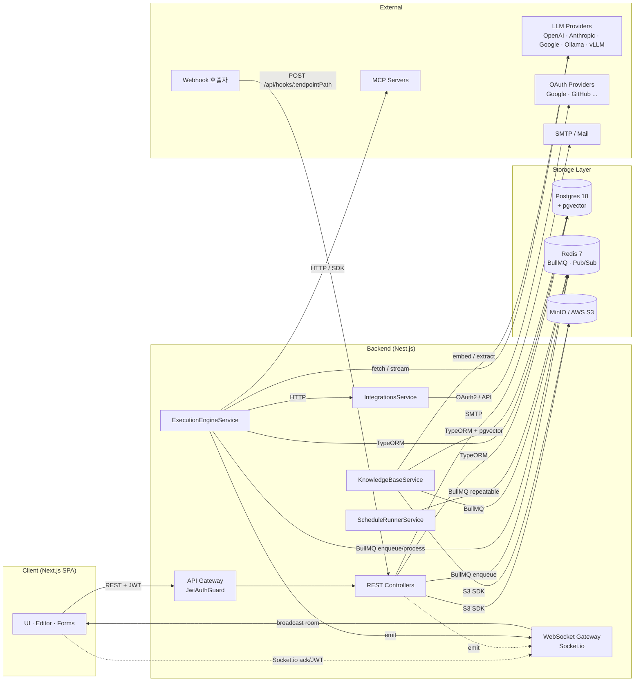

# Spec: Data Flow — 개요

> 관련 문서: [Spec 아키텍처 개요](../0-overview.md) · [데이터 모델](../1-data-model.md) · [시스템 공통](../5-system/_product-overview.md)

---

## Overview (제품 정의)

본 폴더는 Clemvion 전체 시스템의 **데이터 흐름(data flow)** 을 한곳에서 추적하기 위한 진입점이다.
`spec/1-data-model.md` 가 엔티티의 *정의* 에 집중한다면, 본 폴더는 같은 데이터를 *흐름* 의 관점에서
재구성한다:

- "이 API 가 들어오면 어떤 table 의 어떤 column 이 어떤 순서로 갱신되는가"
- "이 비동기 작업은 어느 queue 를 거치고, 어느 sink (Postgres / Redis / S3 / 외부 LLM) 에 닿는가"
- "이 도메인은 어느 외부 의존을 가지며 다른 도메인과 어떻게 cross-reference 하는가"

대상 독자는 ① 새 기능 도입 시 영향 범위를 파악해야 하는 기획자·개발자, ② 운영 중 데이터 정합성·성능
이슈를 추적해야 하는 SRE, ③ 코드 리뷰 시 side-effect 를 검토하는 리뷰어다.

---

## 1. 시스템 수준 데이터 흐름

### 1.1 컴포넌트 토폴로지



### 1.2 핵심 사실

| 항목 | 사실 |
| --- | --- |
| Primary DB | PostgreSQL (`pgvector/pgvector:pg18`), TypeORM 매핑. 마이그레이션은 Flyway (`codebase/backend/migrations/V*.sql`). |
| Queue | Redis 7 + BullMQ. 현재 등록된 큐: `background-execution`, `document-embedding`, `graph-extraction`, `schedule-execution`, `alerts-evaluator`, `integration-expiry`. |
| Object Storage | S3 호환 (개발/셀프 호스팅은 MinIO, SaaS 는 AWS S3). 현재 코드에서 실제 사용처는 KB 문서 파일뿐 (`codebase/backend/src/modules/knowledge-base/knowledge-base.service.ts:723`). Forms / Avatars 는 정의되어 있으나 구현 단계가 다르다. |
| WebSocket | Socket.io. 실행 상태·KB 진행률·AI Assistant 스트리밍 emit. 단일 sink (`WebsocketService`). |
| Auth | JWT access + rotated refresh (`refresh_token` table). Bearer 또는 cookie. |

---

## 2. 도메인 인덱스

다음 13개 도메인 spec 이 본 폴더에 있다. 각 문서는 권장 5요소 (System role · Source→Sink 다이어그램 ·
Schema 매핑 표 · 상태 전이 · 외부 의존) 를 따른다.

| 도메인 | 파일 | 한 줄 요약 |
| --- | --- | --- |
| 인증 | [`auth.md`](./2-auth.md) | 회원가입·로그인·OAuth·refresh token 회전·세션 종료 흐름 |
| 워크스페이스 | [`workspace.md`](./12-workspace.md) | 워크스페이스·멤버·초대 토큰·RBAC 흐름 |
| 워크플로우 | [`workflow.md`](./11-workflow.md) | 워크플로우·노드·엣지 CRUD, 버전 스냅샷, AI Assistant 세션 |
| 실행 | [`execution.md`](./3-execution.md) | 워크플로우 실행 엔진·BullMQ 큐·노드 실행 로그 |
| Knowledge Base | [`knowledge-base.md`](./6-knowledge-base.md) | KB 생성·문서 업로드·임베딩 파이프라인·Graph RAG·RAG 검색 |
| Integration | [`integration.md`](./5-integration.md) | 외부 OAuth credential 암호화 저장·만료 스캔·사용 로그 |
| Trigger | [`triggers.md`](./10-triggers.md) | Webhook·Schedule·Manual trigger 진입과 Execution 연결 |
| LLM Usage | [`llm-usage.md`](./7-llm-usage.md) | LLM Config 해석·LLM 호출·usage_log 적재 |
| File Storage | [`file-storage.md`](./4-file-storage.md) | S3/MinIO 버킷 구조·파일 라이프사이클·실제 사용처 |
| Notifications | [`notifications.md`](./8-notifications.md) | `notification` table·이메일·WebSocket emit 흐름 |
| Audit | [`audit.md`](./1-audit.md) | `audit_log` 와 `login_history` 적재 흐름 |
| Observability | [`observability.md`](./9-observability.md) | Health check·Dashboard·Statistics·Alerts evaluator |

---

## 3. 공통 규약

각 도메인 spec 은 다음 5요소를 갖춘다.

### 3.1 System role

이 도메인이 전체 시스템에서 담당하는 역할 한 단락. 비즈니스 목적·트리거·동작 책임.

### 3.2 Source → Sink 다이어그램

Mermaid `sequenceDiagram` 또는 `flowchart` 로 actor → API → service → storage 의 데이터 흐름을 그린다.
가능한 한 호출 경로의 핵심 파일·메서드 reference 를 함께 표기한다.

### 3.3 Schema 매핑 표

데이터 객체별로 다음 표를 둔다:

| Sink | Table / Key | 갱신 컬럼 / Pattern | 인덱스 / 제약 |
| --- | --- | --- | --- |

- **Postgres**: 테이블명·컬럼명·PK·FK·default·index
- **Redis**: BullMQ 큐 이름·repeat job key·캐시 key 패턴
- **S3**: bucket·prefix·key 패턴

컬럼명·타입·제약조건은 항상 `codebase/backend/src/modules/<domain>/entities/*.entity.ts` 또는
`codebase/backend/migrations/V*.sql` 에서 직접 인용한다. 두 소스가 충돌하면 **migration 이 진실** 이다.

### 3.4 상태 전이 / 흐름 단계

엔티티가 `status` 류 enum 을 가질 때 Mermaid `stateDiagram-v2` 로 전이를 그린다. 단계형 흐름이라면
표 또는 numbered list 로 분해한다.

### 3.5 외부 의존

- 외부 API (LLM provider, OAuth provider, SMTP, MCP server …)
- 다른 BullMQ 큐 (cross-domain enqueue)
- 다른 도메인 spec 의 cross-reference

---

## 4. BullMQ 큐 카탈로그

본 폴더 전체에서 등장하는 큐를 한곳에서 정리.

| 큐 이름 | 등록 모듈 | Producer | Consumer | 작업 단위 |
| --- | --- | --- | --- | --- |
| `execution-continuation` | `execution-engine.module.ts` | `ContinuationBusService.publish` (WS gateway / REST controller 경유) | `ContinuationExecutionProcessor` | 사용자 입력 fan-out (form/button/AI message — [실행 엔진 §7.4/§7.5](../5-system/4-execution-engine.md)) |
| `background-execution` | `execution-engine.module.ts` | `ExecutionEngineService.scheduleBackgroundBody` | `BackgroundExecutionProcessor` | Background 노드의 자식 흐름 |
| `document-embedding` | `knowledge-base.module.ts` | KB 문서 업로드·재임베딩 API | `DocumentEmbeddingProcessor` | 문서 1건 임베딩 |
| `graph-extraction` | `knowledge-base.module.ts` | 임베딩 완료 hook·재추출 API | `GraphExtractionProcessor` | 문서 1건 entity/relation 추출 |
| `schedule-execution` | `schedules.module.ts` | `ScheduleRunnerService` (cron sweep) | `ScheduleRunnerService` (`@Processor`) | 스케줄 1회 실행 트리거 |
| `alerts-evaluator` | `alerts.module.ts` | `AlertsEvaluatorService` (cron sweep) | 동일 service | alert_rule 1건 평가 |
| `integration-expiry` | `integrations.module.ts` | `IntegrationExpiryScanner` (cron sweep) | 동일 module 내 processor | OAuth 만료 후보 1건 처리 |

> 큐가 늘어나면 본 표와 해당 도메인 spec 의 `외부 의존` 섹션 모두 갱신한다.

---

## 5. 다중 인스턴스·동시성 모델

- **Stateless backend**: 모든 controller·service 는 stateless. 인스턴스 간 작업 조정은 Redis (BullMQ 영속 큐 + 보조 Pub/Sub) 가 담당.
- **Continuation bus**: 실행 엔진은 form 제출·button click 같은 비동기 재개 신호를 BullMQ 영속 큐 `execution-continuation` (`ContinuationBusService`) 로 동기화. 옛 Redis pub/sub `execution:continuation` 채널은 폐기 (at-most-once 문제 해소 — `spec/5-system/4-execution-engine.md §7.4 / §7.5 / §Rationale "Durable Continuation"`). 어느 인스턴스가 사용자 입력을 받아도 다른 인스턴스가 BullMQ Worker 로 pick up 해 재개 가능 — 호스팅 인스턴스가 부재하면 §7.5 rehydration 경로로 진입.
- **HNSW 인덱스**: pgvector HNSW 인덱스는 차원별로 분리된 partial index (`V022/V030~V033`) — KB 마다 차원이 다르면 각자 인덱스에 매칭된다.
- **재시도 / 멱등**: BullMQ 의 `attempts` 와 service-level retry (`retryWithBackoff`) 양층. 두 층은 도메인 spec 의 상태 전이에 동기로 반영된다.

---

## Rationale

### 폴더를 분리한 이유

기존 `spec/1-data-model.md` 는 엔티티 *정의* 의 단일 진실로 잘 동작한다. 하지만 새 기능을 검토하거나
운영 이슈를 추적할 때 필요한 정보는 "흐름" — 어느 API 가 어느 큐를 거쳐 어느 컬럼을 갱신하는가 — 이고,
이는 1-data-model 의 테이블 정의만으로는 빠르게 재구성하기 어렵다. `spec/5-system/4-execution-engine.md`
같은 시스템 spec 에 일부 흐름이 있지만 인증·통합·KB 등에 분산되어 있어, "전체 데이터 흐름을 한 화면에서"
요구하는 caller 가 7~8개 문서를 stitch 해야 했다. 본 폴더가 그 stitching 을 한곳에 담는다.

### `spec/1-data-model.md` 와 중복 회피

각 도메인 문서의 *Schema 매핑 표* 는 entity 의 모든 컬럼을 복사하지 않는다. **해당 흐름에서 실제로
read/write 되는 컬럼** 만 발췌하고, 전체 정의는 `1-data-model.md` 의 해당 섹션을 링크한다. 이렇게
하면 entity 정의가 바뀌어도 본 폴더의 표는 흐름 관점에서 그대로 유효하다.

### S3 key 의 코드/spec 불일치 처리

`spec/0-overview.md` §2.7 은 S3 버킷 구조를 `{bucket}/{workspaceId}/knowledge-base/{kbId}/...` 로
기술하지만, 현재 코드 (`knowledge-base.service.ts:723`) 는 `kb/{kbId}/{docId}/{filename}` 으로
업로드한다. data-flow 는 **현재 코드 동작이 진실** 이라는 원칙으로 후자를 기재하고,
`file-storage.md` 의 Rationale 에 이 불일치를 명시했다. spec/0-overview.md §2.7 의 재구성은 본 작업의
범위를 벗어나며, 별도 plan 에서 다룬다.

### Mermaid 사용

GitHub 가 fenced ``` ```mermaid``` 를 직접 렌더링하므로 코드뷰어에서도 즉시 그래프를 볼 수 있다.
custom theme 은 사용하지 않는다.
