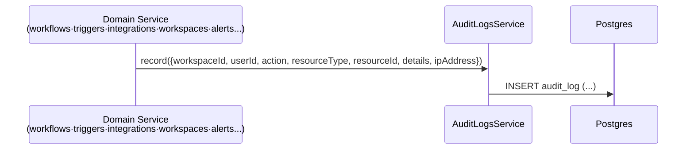
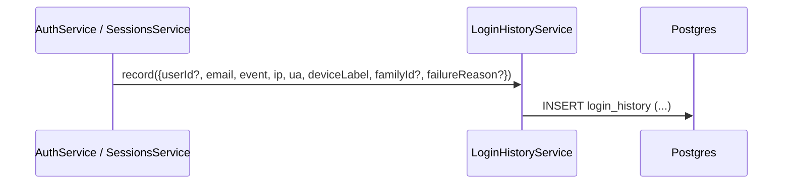

# Data Flow: 감사 로그 (Audit Log · Login History)

> 관련 spec: [Spec 인증 §4](../5-system/1-auth.md) · [데이터 모델 §2.18, §2.18.2](../1-data-model.md) · [data-flow 개요](./0-overview.md)

---

## Overview

### System role

워크스페이스 단위 리소스 변경과 사용자 단위 인증 이벤트를 별도 테이블에 적재한다. 두 테이블은 의도적으로
분리되어 있다 (`audit_log` 는 워크스페이스 컨텍스트가 있는 액션, `login_history` 는 워크스페이스 없는
인증 이벤트).

코드 진입점:

- `backend/src/modules/audit-logs/audit-logs.service.ts` — `record`, `findByWorkspace`
- `backend/src/modules/auth/login-history.service.ts` — `record`, `findMyHistory`
- 호출자: 각 도메인의 service (Workflows / Triggers / Integrations / Workspaces / Alerts 등)

---

## 1. Source → Sink

### 1.1 워크스페이스 액션 → `audit_log`

Action naming: `<resource>.<verb>` (예: `workflow.create`, `workflow.update`, `trigger.delete`,
`integration.connect`, `alert_rule.update`, `workspace.member_role_change`).

### 1.2 인증 이벤트 → `login_history`

`event` 종류: `login_success`, `login_failed`, `totp_failed`, `logout`, `session_revoked`,
`token_reuse_detected` (`backend/src/modules/auth/entities/login-history.entity.ts:12`).

---

## 2. Schema 매핑

### 2.1 Postgres

| Sink (table) | 흐름 | read/write 컬럼 | 인덱스 |
| --- | --- | --- | --- |
| `audit_log` | 모든 도메인 service | INSERT `workspace_id, user_id, action, resource_type, resource_id, details JSONB, ip_address?, created_at` (V001) | V002 `(workspace_id, created_at DESC)` |
| `login_history` | 인증 이벤트 | INSERT `user_id?, email, event, ip_address?, user_agent?, device_label?, family_id?, failure_reason?, created_at` (V040) | V040 `(user_id, created_at DESC)`, `(email, created_at DESC)` |

### 2.2 외부

없음 — 적재만 한다. 외부로 송출은 (도입 시) Alerts evaluator 가 담당.

---

## 3. 보존 정책

| 테이블 | 보존 | 정리 |
| --- | --- | --- |
| `audit_log` | 정책 미정 (`spec/5-system/1-auth.md` 에서 향후 결정) | 현재는 무제한 |
| `login_history` | 180일 | 일일 배치로 자동 삭제 (`spec/1-data-model.md §2.18.2`) |

---

## 4. 외부 의존

| 의존 | 방향 | 참고 |
| --- | --- | --- |
| 모든 도메인 service | upstream | 변경 액션 후 audit_log record 호출 (cross-cutting concern) |
| Auth 도메인 | upstream | login_history 의 단독 source |

---

## Rationale

### 두 테이블을 분리한 이유

- `audit_log` 는 워크스페이스 단위 RBAC 와 직결된 변경 기록 (compliance·dispute resolution). 워크스페이스
  관리자 / 감사관이 조회.
- `login_history` 는 사용자 본인이 자기 계정 보안을 확인하는 용도 (의심스러운 로그인 탐지). 워크스페이스
  컨텍스트 없이 발생 가능 (로그인 실패는 어느 워크스페이스에도 속하지 않음).

두 목적과 조회자가 다르므로 단일 테이블로 합치면 권한 분리·query pattern 모두 복잡해진다. 분리 결정은
`spec/1-data-model.md §2.18` 의 노트로 inline 되어 있다.

### Action / event 의 자유 문자열

`audit_log.action` 과 `login_history.event` 모두 자유 문자열이다 (DB CHECK 없음 — entity 의 literal
type 만). 새 액션 type 추가 시 마이그레이션이 필요 없다는 trade-off 의 반대편은 typo 가 DB 에 들어갈
수 있다는 위험인데, application 단의 type 정의가 일정 수준 막아준다 (`LoginHistoryEvent` union type).
