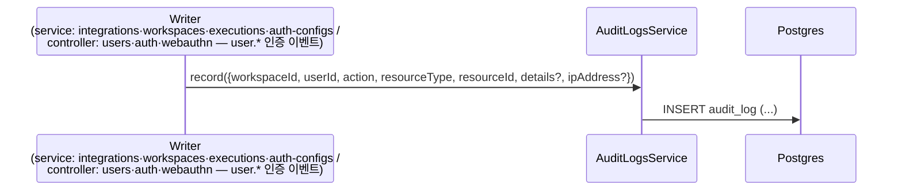
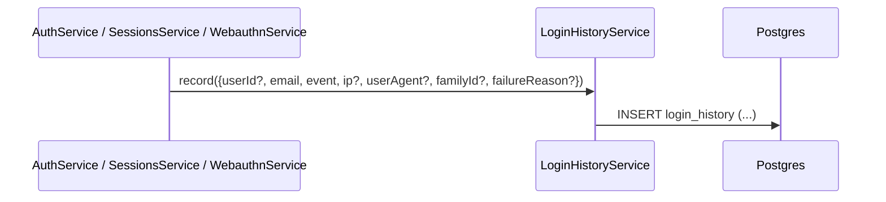

# Data Flow: 감사 로그 (Audit Log · Login History)

> 관련 spec: [Spec 인증 §4](../5-system/1-auth.md) · [데이터 모델 §2.18, §2.18.2](../1-data-model.md) · [data-flow 개요](./0-overview.md)

---

## Overview

### System role

워크스페이스 단위 리소스 변경과 사용자 단위 인증 이벤트를 별도 테이블에 적재한다. 두 테이블은 의도적으로
분리되어 있다 (`audit_log` 는 워크스페이스 컨텍스트가 있는 액션, `login_history` 는 워크스페이스 없는
인증 이벤트).

코드 진입점:

- `codebase/backend/src/modules/audit-logs/audit-logs.service.ts` — `record`, `findAll`
- `codebase/backend/src/modules/auth/login-history.service.ts` — `record`, `findForUser`, `pruneOlderThanRetention`
- `codebase/backend/src/modules/auth/jobs/login-history-pruner.service.ts` — login_history 보존 기간 일일 정리 (BullMQ)

두 `record` 모두 **실패를 삼킨다** (swallow) — 감사 기록 실패가 주 동작(리소스 변경·인증 흐름)을
깨서는 안 된다는 계약. 호출부가 `await` 해도 throw 되지 않으며, 실패는 로그로만 남는다
(`audit-logs.service.ts` 의 `logger.warn`, `login-history.service.ts` 의 `Logger.error` — 둘 다 NestJS `Logger`).

---

## 1. Source → Sink

### 1.1 워크스페이스 액션 → `audit_log`

`AuditLogsService.record` 의 실제 호출자는 **8개 위치(5개 service 모듈 + 3개 auth/user controller)**
다. 워크스페이스·멤버 도메인 CRUD 는 `workspaces.service`·`workspace-invitations.service` 가, `user.*`
인증 이벤트는 세션 workspaceId 가 살아있는 controller 경계가 기록한다(§Rationale 4.1.B). 이 표가 현재
코드에서 실제로 기록되는 action 의 SoT 다:

| Writer module | action | resource_type | 비고 |
| --- | --- | --- | --- |
| `integrations/integrations.service.ts` | `integration.created` | integration | 생성 |
| 〃 | `integration.updated` | integration | 수정 |
| 〃 | `integration.deleted` | integration | 삭제 |
| 〃 | `integration.rotated` | integration | credential 회전 |
| 〃 | `integration.scope_changed` | integration | OAuth scope 변경 |
| 〃 | `integration.reauthorized` | integration | 재인가 — **OAuth provider 없는 통합의 reset 경로 전용** (`details.mode='reset'`). OAuth 통합 재인증은 `oauth/begin` 위임이라 begin·callback 어디서도 미기록 (커버리지 갭, [4-integration §14.3](../2-navigation/4-integration.md)) |
| `workspaces/workspaces.service.ts` | `workspace.transfer_ownership` | workspace | 소유권 이전 |
| 〃 | `workspace.created` | workspace | 팀 워크스페이스 생성 (`createTeam`) |
| 〃 | `workspace.updated` | workspace | 이름/설정 변경 (`renameWorkspace`·`updateWorkspaceSettings`, `details.field`) |
| 〃 | `member.invited` | member | 직접 추가 (`addMemberByEmail`, `details.mode='direct_add'`) |
| 〃 | `member.role_changed` | member | 역할 변경 (`updateMemberRole`, `details.from/to`) |
| 〃 | `member.removed` | member | 멤버 제거/자가 탈퇴 (`removeMember`·`leaveWorkspace`, `details.mode='removed'\|'left'`) |
| `workspaces/workspace-invitations.service.ts` | `member.invited` | member | 초대 발급 (`invite`, `details.mode='invitation'` — raw 이메일 미저장, PII) |
| `executions/executions.service.ts` | `execution.re_run` | execution | 재실행. details 에 `originalExecutionId`·`chainId`·`dryRun`·`inputModified` |
| `auth-configs/auth-configs.service.ts` | `auth_config.create` | auth_config | 생성 |
| 〃 | `auth_config.update` | auth_config | 수정 |
| 〃 | `auth_config.delete` | auth_config | 삭제 |
| 〃 | `auth_config.regenerate` | auth_config | 키/토큰 재발급 |
| 〃 | `auth_config.reveal` | auth_config | 평문 노출 (비밀번호 재확인). auth_config 계열은 모두 `ipAddress` 를 함께 전달 |
| `users/users.controller.ts` | `user.password_changed` | user | 인증 세션 비밀번호 변경 (`POST /users/me/change-password`). 액터 세션 workspaceId 귀속 · `ipAddress` 동반(포렌식) |
| `users/users.controller.ts` | `user.email_changed` | user | 이메일 변경 확인 (`POST /users/me/email-change/verify`, 인증 §1.1.B). 액터 세션 workspaceId 귀속 · `ipAddress` 동반 · **details 에 raw 이메일 미저장**(PII 최소화) |
| `auth/auth.controller.ts` | `user.2fa_enabled` | user | TOTP 활성 (`POST /auth/2fa/verify`). `details.method='totp'` · `ipAddress` 동반(포렌식) |
| 〃 | `user.2fa_disabled` | user | TOTP 비활성 (`POST /auth/2fa/disable`). `details.method='totp'` · `ipAddress` 동반(포렌식) |
| `auth/webauthn/webauthn.controller.ts` | `user.2fa_enabled` | user | WebAuthn credential 등록 (`POST …/webauthn/register/verify`). `details.method='webauthn'`·`credentialId`·`firstCredential` · `ipAddress` 동반(포렌식) |
| 〃 | `user.2fa_disabled` | user | WebAuthn credential 삭제 (`DELETE …/webauthn/credentials/:id`). `details.method='webauthn'`·`credentialId`·`remainingCredentials` · `ipAddress` 동반(포렌식) |

표기 규약과 커버리지에 대한 코드 사실 두 가지:

- **표기 규약은 dot-prefix 기준으로 통일됐다.** action 은 `<resource>.<verb>` 꼴로, resource
  dot-prefix 가 필수다. verb 시제는 도메인 관례를 따른다 — integration 계열은 발생 사건을 기록하므로
  과거분사형(`integration.created`), execution 은 `execution.re_run`. 과거 `re_run_initiated` 가
  dot-prefix 를 이탈했으나 `execution.re_run` 으로 정정됐다(cross-audit G-02). 명명·시제 3분류 규약의
  SoT 는 [`conventions/audit-actions.md`](../conventions/audit-actions.md). `record` 의 `action`
  은 이제 `AuditAction` union (`audit-logs/audit-action.const.ts` 의 `AUDIT_ACTIONS`) 으로 타입
  강제돼 인라인 임의 문자열을 막는다 (cross-audit G-01, → [Rationale](#rationale)).
- **커버리지 갭**: [인증 spec §4.1](../5-system/1-auth.md) 이 기록 대상으로 약속한
  `workflow.*` / `trigger.*` / `schedule.*` /
  `model_config.*`(create/update/delete/set_default — 구 `llm_config.*`/`rerank_config.*` 통합) 액션은
  **여전히 미구현**이다 — workflows / triggers / alerts / schedules 모듈에는 `AuditLogsService` import 가
  전혀 없다. spec §4.1 표는 목표 커버리지, 위 표가 현재 구현이다. (`workspace.created·updated` 와 `member.*`
  는 위 표대로 **구현됨** — 결정4 = B, 2026-07-07. **`workspace.deleted` 는 의도적 미기록** — `audit_log.workspace_id`
  ON DELETE CASCADE 로 삭제 감사 row 가 영속 불가하기 때문이다, [12-workspace §Rationale](./12-workspace.md).)
  인증(`user.password_changed`·`user.2fa_enabled`·`user.2fa_disabled`) 액션은 **구현됐다** —
  **액터의 현재 세션 `workspaceId`** 에 귀속해(모두 인증 세션 발생, schema 변경 없음) controller 경계
  (`users`·`auth`·`webauthn`)에서 기록한다. 무인증 password-reset 은 workspace 없음으로
  `user.password_changed` 대상 제외 ([인증 spec §4.1 / Rationale 4.1.B](../5-system/1-auth.md)).
  이 5개 행은 모두 `ipAddress` 를 함께 전달한다 — auth_config 계열과 동일한 **포렌식·사후 감사**
  목적이며, 추출 경로도 동일하게 `extractClientIp`(`auth/utils/client-ip.ts`, `TRUST_CF_CONNECTING_IP`
  신뢰 정책 — [인증 spec Rationale 2.3.B](../5-system/1-auth.md))를 쓴다(추출 불가 시 `undefined` 생략).
  또한 `user.password_changed` 는 비밀번호 변경 시 **전 세션 revoke + 현재 디바이스 재발급**(인증 spec
  Rationale 2.3.C)을 동반하므로, `login_history` 에 `session_revoked`(bulk, `familyId=null`) 1건이 함께
  적재된다(§1.2).

### 1.2 인증 이벤트 → `login_history`

호출자는 auth 도메인 3개 service:

| Caller | 기록 event |
| --- | --- |
| `auth/auth.service.ts` | `login_success`, `login_failed`, `totp_failed`, `logout`, `token_reuse_detected` |
| `auth/sessions.service.ts` | `session_revoked` (개별 family 강제 종료, `revoke-others` 일괄 종료, **비밀번호 변경 시 전체 family revoke** — 모두 SessionsService 경유) |
| `auth/webauthn/webauthn.service.ts` | `webauthn_failed` (`failure_reason` = `WEBAUTHN_INVALID` / `WEBAUTHN_COUNTER_REGRESSION`) |

`event` 종류 (7종): `login_success`, `login_failed`, `totp_failed`, `webauthn_failed`, `logout`,
`session_revoked`, `token_reuse_detected` (`codebase/backend/src/modules/auth/entities/login-history.entity.ts`
의 `LoginHistoryEvent` union).

- `deviceLabel` 은 입력 인자가 아니라 service 내부에서 `userAgent` 로부터 파생한다
  (`deriveDeviceLabel`, `auth/utils/device-label.ts` — 외부 라이브러리 없이 정규식만, 식별 실패 시 UA
  원문 64자 축약).
- **호출 규약 — `await` 필수**: fire-and-forget(`void`) 으로 호출하면 직후 HTTP 요청
  (예: `/users/me/login-history` 조회) 의 SELECT 가 INSERT 보다 먼저 실행되는 read race 가 생긴다
  (connection pool 이 read/write 를 다른 connection 으로 띄우는 경우). `login-history.service.ts` 의
  `record` doc 주석에 명문화된 계약이며, 실제 호출부 전부 `await` 한다.

---

## 2. Read path (sink 의 소비)

### 2.1 `GET /audit-logs` — 워크스페이스 단위 조회

`audit-logs.controller.ts` → `AuditLogsService.findAll`:

- 스코프: `@WorkspaceId()` (요청의 워크스페이스 컨텍스트) — 워크스페이스 단위로만 조회.
- 필터: `action`(완전 일치), `resourceType`, `userId`(행위자), `startDate`/`endDate` (created_at 범위).
- 페이지네이션: **offset 방식** (`page` 기본 1, `limit` 기본 20). 정렬은 whitelist
  (`created_at`/`action`/`resource_type`, 기본 `created_at DESC`). 응답에 actor `user` join 포함.
- 권한: `@Roles('admin')` — 전역 `RolesGuard` 가 워크스페이스 멤버십과 역할을 함께 검증해
  [인증 spec §4.2](../5-system/1-auth.md) 의 "관리자(Admin+)만 조회" 를 강제한다
  (비멤버의 `X-Workspace-Id` 위조 열람도 차단).

### 2.2 `GET /users/me/login-history` — 본인 단독 조회

`auth/sessions.controller.ts` → `LoginHistoryService.findForUser`:

- 스코프: JWT 의 본인 `userId` 만 — 워크스페이스 관리자에게 노출되지 않는다.
- 페이지네이션: **cursor 방식**. cursor 인코딩은 `<iso>|<id>` (`created_at` 동일 밀리초 충돌의
  tiebreaker 로 `id` 를 묶음). 손상된 cursor 는 무시하고 첫 페이지부터. `limit` 기본 50, 상한 100.
  `limit + 1` 조회로 `hasMore` 판정 후 `nextCursor` 반환.

---

## 3. 보존 정책

| 테이블 | 보존 | 정리 |
| --- | --- | --- |
| `audit_log` | 정책 미정 — 현재 무제한 (pruner 없음) | 없음. [인증 spec §4.2](../5-system/1-auth.md) 의 "최근 90일 보관 (설정 가능)" 은 Planned 이며 미구현 |
| `login_history` | 180일 (`RETENTION_DAYS`) | 일일 배치 자동 삭제 (아래) |

login_history 정리 배치 (`auth/jobs/login-history-pruner.service.ts`):

- BullMQ repeatable scheduler — 큐 `login-history-pruner`, cron `0 3 * * *` **Asia/Seoul**
  (명시적 timezone 으로 서버 로컬 타임존 표류 차단).
- 멀티 인스턴스 단일 실행 — `upsertJobScheduler` 는 idempotent 하게 Redis 중앙 스케줄에 단일 entry 만
  남기고, 워커가 Redis 락으로 잡을 집어가므로 replica 수와 무관하게 전역 1회 실행.
- 삭제는 `LoginHistoryService.pruneOlderThanRetention` 이 배치 루프로 수행 — 1회 호출당
  `PRUNE_BATCH`(1000행) × 최대 `PRUNE_MAX_BATCHES`(50) 까지만 삭제하고 (잠금 경합·WAL 팽창 완화),
  초과분은 다음 cron 에 위임. prune 실패도 swallow (로그만).

---

## 4. Schema 매핑

### 4.1 Postgres

| Sink (table) | 도입 | write 컬럼 | 인덱스·제약 |
| --- | --- | --- | --- |
| `audit_log` | V001 | INSERT `workspace_id, user_id, action VARCHAR(100), resource_type, resource_id, details JSONB, ip_address?, created_at` | V002 `idx_audit_log_workspace_created (workspace_id, created_at DESC)`. `action` 에 DB CHECK 없음 |
| `login_history` | V040 | INSERT `user_id?, email, event, ip_address?, user_agent?, device_label?, family_id?, failure_reason?, created_at` | V040 인덱스 3개: `(user_id, created_at DESC)`, `(email, created_at DESC)`, `(created_at)` 단독 — pruner 의 `created_at < cutoff` 스캔 전용. `chk_login_history_event` CHECK (V040 6종 → V058 에서 DROP+ADD 로 `webauthn_failed` 추가, 7종) |

### 4.2 외부

없음 — 적재만 한다. 두 테이블 모두 외부 시스템으로 송출되지 않는다. Alerts evaluator
(`modules/alerts/alerts-evaluator.service.ts`) 는 이미 구현되어 있으나 audit_log / login_history 를
읽지 않는다 (alerts 모듈 내 AuditLog/LoginHistory 참조 0건).

---

## 5. 외부 의존

| 의존 | 방향 | 참고 |
| --- | --- | --- |
| integrations · workspaces · executions · auth-configs service | upstream | `audit_log` 의 writer 전수 (§1.1). 그 외 도메인은 현재 audit 기록 없음 |
| Auth 도메인 (AuthService · SessionsService · WebauthnService) | upstream | `login_history` 의 단독 source (§1.2) |
| BullMQ (Redis) | infra | `login-history-pruner` repeatable scheduler (§3) |

---

## Rationale

### 두 테이블을 분리한 이유

- `audit_log` 는 워크스페이스 단위 RBAC 와 직결된 변경 기록 (compliance·dispute resolution). 워크스페이스
  관리자 / 감사관이 조회.
- `login_history` 는 사용자 본인이 자기 계정 보안을 확인하는 용도 (의심스러운 로그인 탐지). 워크스페이스
  컨텍스트 없이 발생 가능 (로그인 실패는 어느 워크스페이스에도 속하지 않음).

두 목적과 조회자가 다르므로 단일 테이블로 합치면 권한 분리·query pattern 모두 복잡해진다. 분리 결정은
`spec/1-data-model.md §2.18` 의 노트로 inline 되어 있다. 조회 권한도 비대칭 — audit_log 는 워크스페이스
스코프 offset 페이지네이션, login_history 는 본인 단독 cursor 페이지네이션 (§2).

### Action 은 application union 으로 강제(DB 는 자유 문자열), event 는 DB CHECK 로 고정

`audit_log.action` 은 **DB 레벨에서는** 자유 문자열이다 (DB CHECK 없음 — `VARCHAR(100) NOT NULL`,
V001). 새 액션 type 추가 시 마이그레이션이 필요 없다는 trade-off 의 반대편은 비일관 표기가 DB 에
들어갈 위험인데, 이는 **application 단 타입으로 막는다** — `AuditLogsService.record({ action })` 의
`action` 이 `AuditAction` union (`audit-logs/audit-action.const.ts` 의 `AUDIT_ACTIONS`) 으로 강제돼,
새 action 은 const 에 추가하지 않으면 호출 자체가 컴파일되지 않는다 (cross-audit G-01). DB CHECK 대신
application union 을 택한 이유는 액션 추가가 잦고(도메인 확장마다) DB 마이그레이션 비용을 피하기 위함이다
— DB CHECK 로 고정하는 `login_history.event`(아래)와 대조된다.

> 과거 `re_run_initiated` 가 dot-prefix 를 이탈해 과거분사형 integration 액션과 혼재 적재됐으나,
> cross-audit G-02 에서 `execution.re_run` 으로 정정됐다 (신규 row 부터 적용; 기존 레거시 row 는
> audit 불변 원칙상 그대로 둔다). integration 계열 과거분사형(`integration.created`)은 audit 가 발생
> 사건을 기록한다는 의미상 의도된 표기로 유지하며, naming 규약은 "resource dot-prefix 필수 + verb 는
> 도메인 관례" 로 [인증 spec §4.1](../5-system/1-auth.md) 에 명문화했다.

반면 `login_history.event` 는 DB CHECK 제약(`chk_login_history_event`, V040 도입)으로 enum 값을 고정한다.
따라서 event 종류 추가 시 마이그레이션이 필요하다 — 예: `webauthn_failed` 추가는 V058 에서 CHECK 제약을
DROP + ADD 로 갱신했다. entity 의 `LoginHistoryEvent` union type 과 DB CHECK 가 함께 정합성을 강제한다.

### 기록 실패는 삼키고, 호출은 await 한다

감사 기록은 부수 기록이지 주 동작이 아니다 — INSERT 실패로 리소스 변경이나 로그인이 실패해서는 안
되므로 두 `record` 모두 예외를 삼킨다 (§Overview). 그럼에도 `await` 를 요구하는 이유는 에러 전파가
아니라 **순서 보장** — 직후 조회와의 read race 방지다 (§1.2). "삼키되 await" 조합은 의도된 설계다.

### "모든 도메인 service 가 호출하는 cross-cutting concern" 서술 폐기

과거 본 문서는 audit_log 의 호출자를 "각 도메인의 service (Workflows / Triggers / ... 등) 전체" 로
서술했으나, 실제 writer 는 한정된 위치(워크스페이스 도메인 service + `user.*` 인증 controller)뿐이라
폐기했다 — 정확한 호출자·call site 전수는 §1.1 표가 SoT 다. 인증 spec §4.1 의 액션 카탈로그는
목표 상태이고, 본 문서의 §1.1 표가 구현 현황의 SoT 다 — 커버리지 확장 시 §1.1 표를 함께 갱신해야 한다.
