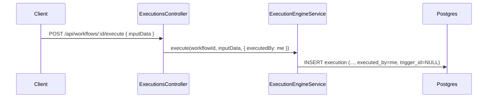
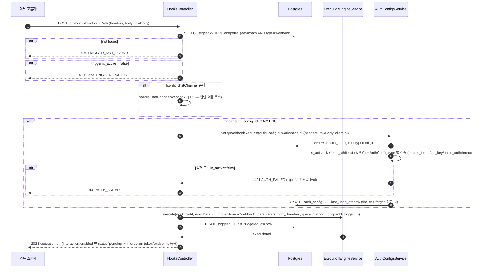
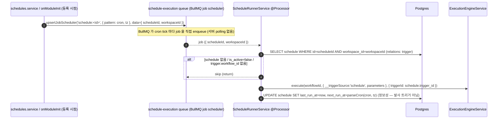

# Data Flow: 트리거 (Webhook · Schedule · Manual)

> 관련 spec: [Spec Webhook](../5-system/12-webhook.md) · [Spec 데이터 모델 §2.8~§2.9](../1-data-model.md) · [Spec 실행 엔진](../5-system/4-execution-engine.md) · [data-flow 개요](./0-overview.md)

---

## Overview

### System role

워크플로우 실행을 시작하는 3가지 진입점을 표준화한다:

- **Manual**: 사용자가 UI 의 Run 버튼으로 즉시 실행 (`POST /api/workflows/:id/execute`)
- **Webhook**: 외부 HTTP 호출이 `/api/hooks/:endpointPath` 로 들어옴. 일반 webhook 과 Chat Channel inbound(Telegram/Slack/Discord) 두 갈래로 분기한다
- **Schedule**: BullMQ **repeatable job (job scheduler)** 으로 cron 표현식에 따라 BullMQ 가 직접 발사한다. 별도의 DB polling/sweep 은 없다

모두 최종적으로 `ExecutionEngineService.execute(workflowId, inputData, triggerId)` 로 수렴해
`execution` row 를 생성한다.

코드 진입점:

- `codebase/backend/src/modules/triggers/triggers.service.ts` — Trigger CRUD
- `codebase/backend/src/modules/schedules/schedules.service.ts` — Schedule CRUD
- `codebase/backend/src/modules/schedules/schedule-runner.service.ts` — `SCHEDULE_QUEUE = 'schedule-execution'` producer + processor
- `codebase/backend/src/modules/hooks/hooks.controller.ts` — `/api/hooks/:endpointPath` 진입

---

## 1. Source → Sink

### 1.1 Manual trigger

### 1.2 Webhook 진입

> webhook 인증·`ip_whitelist`·`last_used_at` 갱신은 모두 `AuthConfigsService.verifyWebhookRequest` 로 위임된다 — `HooksService` 는 호출만 한다. 실패는 type 무관 단일 `401 AUTH_FAILED` (enumeration 차단). `ip_whitelist` 는 `AuthConfig` 종속 ([Spec 데이터 모델 §2.17](../1-data-model.md#217-authconfig)) 이므로 `auth_config_id IS NULL` 이면 ip_whitelist 도 평가 대상이 없다 ("ip_whitelist-only" 경로는 존재하지 않음). 미존재 trigger 는 `404`, 비활성 trigger 는 `410 Gone` 으로 구분된다. 성공 응답 코드는 [Spec Webhook WH-RS-01](../5-system/12-webhook.md#33-응답-및-피드백) 의 `202 Accepted` 와 정합.

### 1.3 Schedule 발사

Schedule 은 **BullMQ repeatable job (job scheduler)** 으로 발사된다. DB polling/sweep 은 존재하지 않는다 — schedule 생성/수정/서버 부팅 시 `queue.upsertJobScheduler('schedule:<id>', { pattern: cron, tz: timezone })` 로 등록되고, BullMQ 가 cron tick 마다 직접 job 을 enqueue 한다.

> `next_run_at` 은 발사를 트리거하지 않는다 — 발사는 전적으로 BullMQ job scheduler 가 담당하며, `next_run_at` 은 process() 가 완료 후 UI 표시용으로 재계산해 저장하는 정보성 컬럼이다. 큐 payload 는 `{ scheduleId, workspaceId }` 이며 processor 는 두 키로 schedule 을 조회한다. process() 는 `trigger.is_active` 를 직접 보지 않고 `schedule.is_active` 만 확인한다 (둘은 §1.4 에서 양방향 동기화).

### 1.4 Schedule ↔ Trigger 동기화

`Schedule` 은 `Trigger` 의 1:1 종속 서브타입이다 (`spec/1-data-model.md §2.9.1`).

| 이벤트 | Schedule | Trigger |
| --- | --- | --- |
| `POST /api/schedules` | INSERT trigger(type='schedule') save **후** INSERT schedule save (순차 — 단일 트랜잭션 아님; 중간 실패 시 고아 trigger 가능). is_active 면 `registerJob` 으로 BullMQ 등록 | 먼저 생성 |
| Schedule 이름 변경 | UPDATE schedule.name → UPDATE trigger.name | — |
| Schedule is_active 토글 | UPDATE schedule.is_active → UPDATE trigger.is_active. active 면 `registerJob`, inactive 면 `removeJob` 으로 BullMQ job 등록/해제 | 역방향 동일 |
| Schedule cron/timezone 변경 | UPDATE schedule + next_run_at 재계산 + `registerJob` 로 job scheduler upsert | — |
| Schedule 삭제 | `removeJob` 으로 BullMQ job 해제 + CASCADE delete trigger | — |
| Trigger(type='schedule') 직접 생성 | — | 금지 (API 단 거부) |

### 1.5 Webhook → Chat Channel inbound 분기

`trigger.config.chatChannel` 이 존재하면 webhook 진입은 `handleChatChannelWebhook` 로 분기해 일반 webhook 흐름(§1.2 의 AuthConfig 인증 / trigger parameter schema 검증)을 **우회**한다. Chat Channel 경로는 provider 별 자체 inbound 서명/시크릿 검증을 쓴다 (Telegram `X-Telegram-Bot-Api-Secret-Token`, Slack `X-Slack-Signature`, Discord `X-Signature-Ed25519`). 상세 모델은 [Chat Channel adapter convention](../conventions/chat-channel-adapter.md) 이 SoT 이며, 여기서는 트리거 진입점으로서의 분기만 기술한다.

| 단계 | 처리 (`hooks.service.ts` `handleChatChannelWebhook`) |
| --- | --- |
| provider adapter 조회 | `channelAdapterRegistry.get(config.provider)` — 미지원이면 400 |
| inbound 인증 | `chatChannelInboundAuthenticator.verify(trigger.id, config, headers, rawBody)` (provider 별 서명) |
| handshake | Slack `url_verification` → challenge 응답 / Discord PING(type=1) → `{ type: 1 }` 응답 (둘 다 execution 없이 즉시 반환) |
| `parseUpdate` null | group/bot/unsupported — `maybeNotifyIgnored` 안내 후 무시 (`{ executionId: 'ignored' }`) |
| 활성 execution + 인터랙션 | `interactionService.interact` in-process forwarding (`text_message`→submit_message, `button_callback`→click_button) |
| native modal | `open_form_modal` / `form_submission` → adapter 가 modal 응답 JSON 반환 (`interactionHttpResponse`, controller 가 `res.json`) |
| 신규 대화 | `execute(workflowId, { __triggerSource:'webhook', chatChannel:{provider, conversationKey, channelUserKey}, ... })` + ChannelConversation upsert |

> 이 경로의 응답 JSON·서명 검증·form modal 세부는 모두 chat-channel adapter convention 을 따른다. data-flow 문서는 "webhook 진입이 chatChannel 유무로 두 갈래로 나뉜다" 는 라우팅 사실만 단일 진실로 둔다.

---

## 2. Schema 매핑

### 2.1 Postgres

| Sink (table) | 흐름 | read/write 컬럼 | 인덱스 / 제약 |
| --- | --- | --- | --- |
| `trigger` | 생성 | INSERT `workspace_id, workflow_id, type IN (webhook/schedule/manual), name, is_active, config, endpoint_path?, auth_config_id?` | `type` CHECK 제약은 V001 (`CHECK (type IN ('webhook','schedule','manual'))`). `(workspace_id, endpoint_path) UNIQUE` + `(workspace_id, type)` 인덱스는 V002. |
| `trigger` | 발사 | UPDATE `last_triggered_at` | — |
| `schedule` | 생성 | INSERT `workspace_id, trigger_id, cron_expression, timezone, is_active, next_run_at, parameter_values={}` (parameter_values 컬럼은 V011) | FK CASCADE on trigger_id |
| `schedule` | 발사 후 | UPDATE `last_run_at, next_run_at` (process() 정보성 재계산; 발사 트리거 아님) | `(next_run_at, is_active)` |
| `auth_config` | 웹훅 인증 (read) | SELECT `type, config (decrypted), ip_whitelist, is_active` | FK from `trigger.auth_config_id` |
| `auth_config` | 검증 성공 (write) | UPDATE `last_used_at` (fire-and-forget, 트랜잭션 외) | — |
| `execution` | 진입 시 | INSERT (자세히는 [`execution.md`](./3-execution.md)) | `trigger_id` FK SET NULL (트리거 삭제 시 실행 이력 보존) |

### 2.2 Redis (BullMQ)

| 큐 | producer | consumer | payload |
| --- | --- | --- | --- |
| `schedule-execution` | BullMQ **job scheduler** (`upsertJobScheduler`, cron pattern+tz) — 서버 sweep 아님 | `ScheduleRunnerService` (`@Processor`) | `{ scheduleId, workspaceId }` |

### 2.3 외부

| Sink | 흐름 |
| --- | --- |
| HTTP 호출자 | webhook 진입 |

---

## 3. 상태 전이

### 3.1 `trigger.is_active`

| 상태 | 의미 |
| --- | --- |
| true | Webhook 라우팅 활성, Schedule 의 BullMQ repeatable job 등록 |
| false | Webhook 호출 시 `410 Gone` (TRIGGER_INACTIVE) — 미존재 trigger 의 `404` 와 구분. Schedule 은 `removeJob` 으로 BullMQ job 해제 |

Schedule 과의 동기화는 양방향 — 둘 중 하나만 변경해도 다른 쪽이 함께 갱신된다. is_active 변경 시 §1.4 대로 BullMQ job 도 register/remove 된다.

### 3.2 `schedule.next_run_at` 계산

`cron-parser` (`CronExpressionParser.parse`) 로 `cron_expression + timezone` 을 해석. 실제 발사 시각은 BullMQ
job scheduler 가 결정하며, `next_run_at` 은 발사 트리거가 아니라 **UI 표시용 정보성 컬럼**이다 — schedule
생성/수정 시(`computeNextRuns`)와 process() 완료 직후(`now` 기준 다음 cron tick) 재계산해 저장한다
(`spec/2-navigation/3-schedule.md` 참조).

---

## 4. 외부 의존

| 의존 | 방향 | 참고 |
| --- | --- | --- |
| Execution 도메인 | cross-ref | 모든 트리거가 최종 진입 — [`execution.md`](./3-execution.md) |
| Auth 도메인 (AuthConfig) | webhook 인증 | API Key / Bearer / Basic / HMAC. credentials 는 AES-256-GCM 암호화. 인증 성공 시 `last_used_at` 갱신 ([Spec 데이터 모델 §2.17](../1-data-model.md#217-authconfig)) |

---

## Rationale

### Schedule 을 Trigger 의 sub-type 으로 둔 이유

Webhook·Manual 과 통일된 "실행 시작점" 모델을 갖기 위해서다. `execution.trigger_id` 한 컬럼으로
모든 진입 경로를 추적할 수 있고, 실행 이력 목록에서 `trigger.type` 만 보면 진입 경로를 파악할 수 있다.
Schedule 의 cron 메타데이터는 별도 row 에 두어 schedule 화면이 직접 다룬다.

### webhook URL 표기

webhook 진입 라우트는 `/api/hooks/:endpointPath` 단일 형태다 (`HooksController`). `/api/webhooks`·workspaceSlug 세그먼트는 존재하지 않으며, webhook 도메인 SoT([Spec Webhook WH-EP-02](../5-system/12-webhook.md)) 와 정합한다.

### Webhook `endpoint_path` 의 UNIQUE 범위

`(workspace_id, endpoint_path)` 가 UNIQUE 이므로 워크스페이스 스코프 안에서는 경로가 유일하다.
다만 실제 라우팅 키는 `endpoint_path` 단독이다 — `HooksController` 가 workspace 필터 없이
`findOne({ endpointPath, type: 'webhook' })` 로 조회한다 (외부 호출이라 workspace 컨텍스트 없음).
충돌 회피는 `endpoint_path` 를 UUID 로 자동 발급(WH-MG-02)해 사실상 전역 고유로 만드는 방식에 의존한다.
공개 URL 형식은 `{base_url}/api/hooks/:endpointPath` 단일 형태다 (`spec/5-system/12-webhook.md` WH-EP-02).
