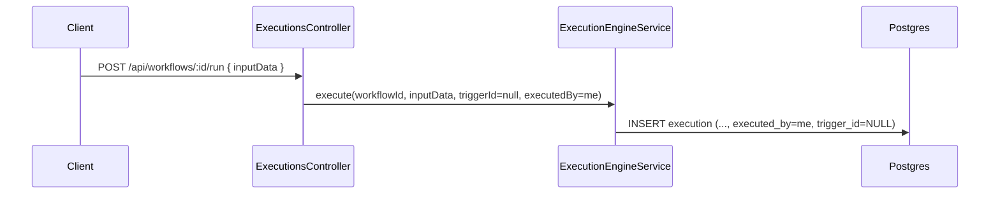
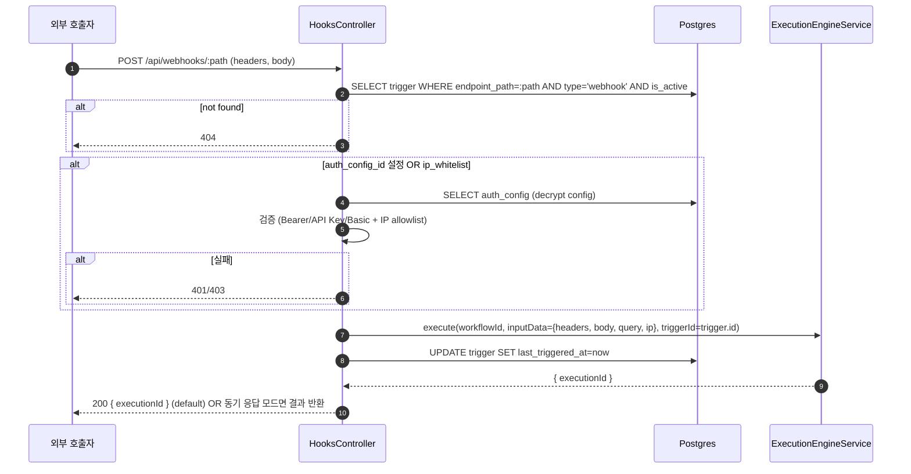
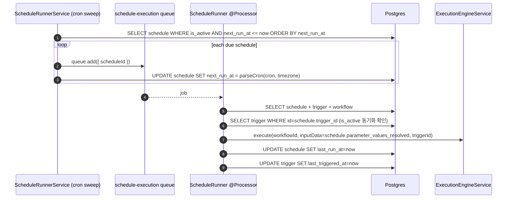

# Data Flow: 트리거 (Webhook · Schedule · Manual)

> 관련 spec: [Spec Webhook](../5-system/12-webhook.md) · [Spec 데이터 모델 §2.8~§2.9](../1-data-model.md) · [Spec 실행 엔진](../5-system/4-execution-engine.md) · [data-flow 개요](./0-overview.md)

---

## Overview

### System role

워크플로우 실행을 시작하는 3가지 진입점을 표준화한다:

- **Manual**: 사용자가 UI 의 Run 버튼으로 즉시 실행
- **Webhook**: 외부 HTTP 호출이 `/api/webhooks/:path` 로 들어옴
- **Schedule**: BullMQ repeatable job 으로 cron 표현식에 따라 발사

모두 최종적으로 `ExecutionEngineService.execute(workflowId, inputData, triggerId)` 로 수렴해
`execution` row 를 생성한다.

코드 진입점:

- `codebase/backend/src/modules/triggers/triggers.service.ts` — Trigger CRUD
- `codebase/backend/src/modules/schedules/schedules.service.ts` — Schedule CRUD
- `codebase/backend/src/modules/schedules/schedule-runner.service.ts` — `SCHEDULE_QUEUE = 'schedule-execution'` producer + processor
- `codebase/backend/src/modules/hooks/hooks.controller.ts` — `/api/webhooks/:path` 진입

---

## 1. Source → Sink

### 1.1 Manual trigger

### 1.2 Webhook 진입

### 1.3 Schedule 발사

### 1.4 Schedule ↔ Trigger 동기화

`Schedule` 은 `Trigger` 의 1:1 종속 서브타입이다 (`spec/1-data-model.md §2.9.1`).

| 이벤트 | Schedule | Trigger |
| --- | --- | --- |
| `POST /api/schedules` | INSERT schedule + INSERT trigger(type='schedule') 한 트랜잭션 | 동일 |
| Schedule 이름 변경 | UPDATE schedule.name → UPDATE trigger.name | — |
| Schedule is_active 토글 | UPDATE schedule.is_active → UPDATE trigger.is_active | 역방향 동일 |
| Schedule 삭제 | CASCADE delete trigger | — |
| Trigger(type='schedule') 직접 생성 | — | 금지 (API 단 거부) |

---

## 2. Schema 매핑

### 2.1 Postgres

| Sink (table) | 흐름 | read/write 컬럼 | 인덱스 / 제약 |
| --- | --- | --- | --- |
| `trigger` | 생성 | INSERT `workspace_id, workflow_id, type IN (webhook/schedule/manual), name, is_active, config, endpoint_path?, auth_config_id?` | `(workspace_id, endpoint_path) UNIQUE`, `(workspace_id, type)`. V003 type checks. |
| `trigger` | 발사 | UPDATE `last_triggered_at` | — |
| `schedule` | 생성 | INSERT `workspace_id, trigger_id, cron_expression, timezone, is_active, next_run_at, parameter_values={}` (V011) | FK CASCADE on trigger_id |
| `schedule` | sweep | UPDATE `next_run_at, last_run_at` | `(next_run_at, is_active)` |
| `auth_config` | 웹훅 인증 | SELECT `type, config (decrypted), ip_whitelist` | FK from `trigger.auth_config_id` |
| `execution` | 진입 시 | INSERT (자세히는 [`execution.md`](./3-execution.md)) | `trigger_id` FK SET NULL (트리거 삭제 시 실행 이력 보존) |

### 2.2 Redis (BullMQ)

| 큐 | producer | consumer | payload |
| --- | --- | --- | --- |
| `schedule-execution` | `ScheduleRunnerService` (1분 간격 sweep) | `ScheduleRunnerService` (`@Processor`) | `{ scheduleId }` |

### 2.3 외부

| Sink | 흐름 |
| --- | --- |
| HTTP 호출자 | webhook 진입 |

---

## 3. 상태 전이

### 3.1 `trigger.is_active`

| 상태 | 의미 |
| --- | --- |
| true | Webhook 라우팅 활성, Schedule sweep 대상 |
| false | Webhook 호출 시 404 처리, Schedule sweep 제외 |

Schedule 과의 동기화는 양방향 — 둘 중 하나만 변경해도 다른 쪽이 함께 갱신된다.

### 3.2 `schedule.next_run_at` 계산

`cron-parser` 로 `cron_expression + timezone` 을 해석. sweep 직후 다음 발사 시각을 계산해 `next_run_at`
에 저장. 시계 skew 방지를 위해 마지막 발사 시각 = `next_run_at` 기준으로 계산하지 않고 sweep 시점의
`now` 기준 다음 cron tick 을 다시 계산한다 (`spec/2-navigation/3-schedules.md` 참조).

---

## 4. 외부 의존

| 의존 | 방향 | 참고 |
| --- | --- | --- |
| Execution 도메인 | cross-ref | 모든 트리거가 최종 진입 — [`execution.md`](./3-execution.md) |
| Auth 도메인 (AuthConfig) | webhook 인증 | API Key / Bearer / Basic. credentials 는 암호화 |

---

## Rationale

### Schedule 을 Trigger 의 sub-type 으로 둔 이유

Webhook·Manual 과 통일된 "실행 시작점" 모델을 갖기 위해서다. `execution.trigger_id` 한 컬럼으로
모든 진입 경로를 추적할 수 있고, 실행 이력 목록에서 `trigger.type` 만 보면 진입 경로를 파악할 수 있다.
Schedule 의 cron 메타데이터는 별도 row 에 두어 schedule 화면이 직접 다룬다.

### Webhook `endpoint_path` 의 UNIQUE 범위

`(workspace_id, endpoint_path)` 가 UNIQUE 이므로 다른 워크스페이스가 같은 경로를 가질 수 있다.
공개 URL 은 `/api/webhooks/:workspaceSlug/:path` 형태로 라우팅되어 충돌이 없다 (`spec/5-system/12-webhook.md`).
