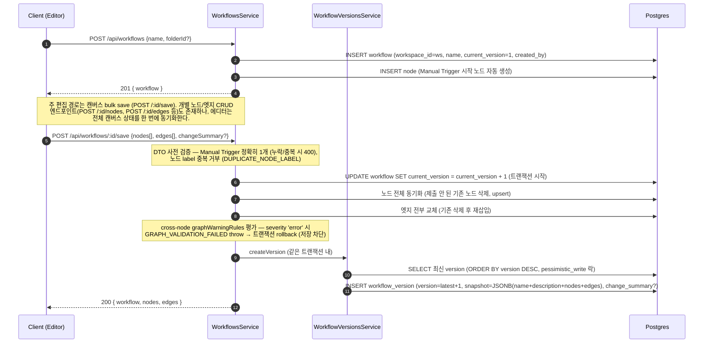
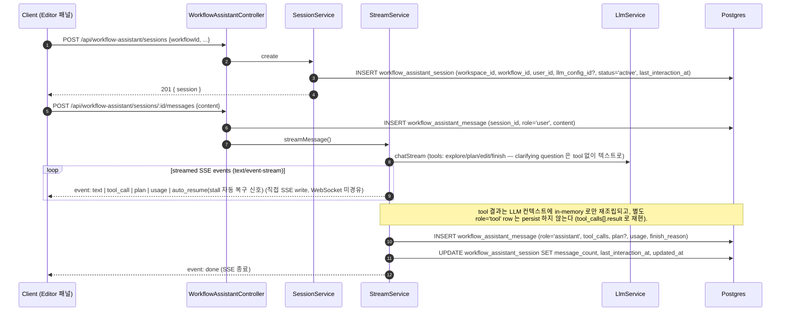
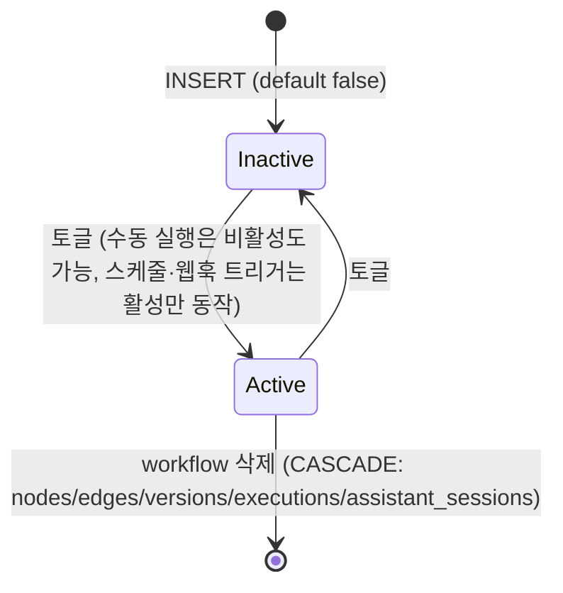

# Data Flow: 워크플로우 (Workflow)

> 관련 spec: [Spec 워크플로우 에디터](../3-workflow-editor/_product-overview.md) · [Spec AI Assistant](../3-workflow-editor/4-ai-assistant.md) · [데이터 모델 §2.4~§2.7, §2.15, §2.20~§2.21](../1-data-model.md) · [data-flow 개요](./0-overview.md)

---

## Overview

### System role

워크스페이스 안에서 사용자가 시각적으로 편집하는 자동화 단위. 노드·엣지·메타 설정·버전 스냅샷·AI
Assistant 채팅 세션을 묶어 단일 진실로 관리한다. 실행 자체는 [`execution.md`](./3-execution.md) 가
담당하고, 본 문서는 *편집 시점* 의 데이터 흐름을 다룬다.

코드 진입점:

- `codebase/backend/src/modules/workflows/workflows.service.ts` — Workflow CRUD
- `codebase/backend/src/modules/nodes/nodes.service.ts` — Node CRUD
- `codebase/backend/src/modules/edges/edges.service.ts` — Edge CRUD
- `codebase/backend/src/modules/workflow-versions/workflow-versions.service.ts` — 버전 스냅샷
- `codebase/backend/src/modules/workflow-assistant/` — AI Assistant 세션·메시지·도구 호출

---

## 1. Source → Sink

### 1.1 워크플로우 생성 + 노드/엣지 편집

> 버전 row 생성 전용 API(`POST /api/workflows/:id/versions`)는 없다.
> `WorkflowVersionsController` 는 조회 GET 2개(`GET /workflows/:wfId/versions`,
> `GET /workflows/:wfId/versions/:versionId`)만 노출하며, 버전 스냅샷은 `POST /:id/save`
> (및 `POST /:id/versions/:versionId/restore`) 의 트랜잭션 내부에서 `createVersion` 으로
> 기록된다 — `createVersion` 이 동일 워크플로우에 대한 동시 저장을 직렬화한다.
> 스냅샷에 `workflow.settings` 는 포함되지 않는다 (캔버스 + name/description 만 버저닝).
>
> **버전 restore**: `POST /:id/versions/:versionId/restore` 는 대상 snapshot 의 형식을 먼저
> 검증하고 (`nodes`/`edges` 배열 누락 등 malformed 시 `INVALID_VERSION_SNAPSHOT` 400),
> 통과하면 snapshot 을 SaveCanvasDto 로 변환해 **`saveCanvas` 경로를 재사용**한다 —
> 즉 restore 도 `Restored from vN` changeSummary 를 단 **새 버전**을 만든다 (롤백이 아닌 forward 기록).
>
> **graph warning 조회**: 저장과 별개로 `GET /api/workflows/:id/graph-warnings` 가 동일한
> graphWarningRules 평가를 저장 없이 반환한다 (frontend 는 500ms debounce 로컬 평가를 병행).
> 규칙 SoT: [`spec/conventions/cross-node-warning-rules.md`](../conventions/cross-node-warning-rules.md).

### 1.2 노드 컨테이너 / Tool Area 배치

| 동작 | 노드 컬럼 변화 | 검증 |
| --- | --- | --- |
| Loop / ForEach / Map 내부에 자식 노드 배치 | `child.container_id = container.id` | `container.type ∈ {loop, foreach, map}`. 트리거 카테고리 자식 거부 (`CONTAINER_INVALID_CHILD`). cycle 거부 (`CONTAINER_CYCLE`). |
| AI Agent 의 Tool Area 에 노드 배치 | `tool.tool_owner_id = aiAgent.id` | `aiAgent.type = 'ai_agent'`. |
| 둘 다 set | — | CHECK 제약 `chk_node_placement` (V001) 가 거부. |
| Background body | `container_id` 사용 안 함 — `background` 포트 엣지로 식별 (`spec/5-system/4-execution-engine.md §3.3`) | — |

> 위 표의 `container.type` / `CONTAINER_INVALID_CHILD` / `CONTAINER_CYCLE` 검증은 **편집·저장
> 시점이 아니다** — (a) 실행 엔진 런타임 (`execution-engine.service.ts`) 과 (b) Assistant 의
> `ShadowWorkflow` 가 수행한다. 저장 경로(`saveCanvas`)는 `container_id`/`tool_owner_id` 를
> 검증 없이 그대로 저장하며, 편집 시점의 DB 단 강제는 CHECK `chk_node_placement` (둘 다 set 금지) 뿐이다.

### 1.3 AI Assistant 세션·메시지

> **세션 조회 (read 경로)**: 패널을 열 때마다 `GET /api/workflow-assistant/sessions/latest?workflowId=…`
> 가 primary lookup 으로 실행돼 기본 선택 세션을 결정한다 (없으면 null) — V019 의
> `(workflow_id, user_id, status, last_interaction_at DESC)` 인덱스가 이 쿼리를 위해 존재한다.
> 그 외 `GET /sessions?workflowId=…` (내 세션 목록, 최근 상호작용 순 최대 50건),
> `GET /sessions/:id` (메시지 포함 단건) 가 있다.

### 1.4 Assistant 가 워크플로우를 편집할 때

Assistant 의 `edit` 류 tool_call 은 **DB 를 직접 건드리지 않는다**. `workflow-assistant` 모듈은
`NodesService` / `EdgesService` 를 import 하지 않으며, 대신 in-memory replica 인 `ShadowWorkflow`
(`codebase/backend/src/modules/workflow-assistant/tools/shadow-workflow.ts`) 가 tool call 을 검증·시퀀싱한다.
성공한 tool call 은 프론트엔드 editor-store 가 optimistic 하게 적용하고, Postgres persist 는 사용자의
**수동 Save** (`POST /:id/save` — toolbar Save 버튼 또는 Cmd/Ctrl+S) 로만 일어난다 — auto-save 는 없으며,
에디터의 500ms debounce 는 저장이 아니라 graph-warning 사전 평가용이다. 직접 손으로 편집한 변경과 동일한 경로다.
변경 결과는 `tool_calls[].result` 에 축약본으로 저장되어 대화 히스토리에서 재현 가능
(`spec/3-workflow-editor/4-ai-assistant.md §9.1`).

### 1.5 복제 · 내보내기 · 가져오기

| 엔드포인트 | 데이터 흐름 |
| --- | --- |
| `POST /api/workflows/:id/duplicate` | workflow **메타 row 만** 복제 — name `"(Copy)"` 접미, `is_active=false`, description/tags/folder_id/settings 승계. **nodes/edges 는 복제하지 않는다.** |
| `GET /api/workflows/:id/export` | workflow 메타(name/description/tags/settings) + 전체 nodes/edges 를 JSON 직렬화. 노드 간 참조(`container_id`/`tool_owner_id`/엣지 endpoint)는 UUID 대신 **nodes 배열 인덱스**로 치환해 환경 간 이식 가능. |
| `POST /api/workflows/import` | export JSON 을 받아 새 workflow·node·edge 를 한 트랜잭션으로 생성. 인덱스 참조를 새 UUID 로 재매핑하고, AI 노드의 `llmConfigId` 미지정 시 워크스페이스 기본 LLM 을 주입. 페이로드 내 노드 label 중복 시 409 (`DUPLICATE_NODE_LABEL`). |

---

## 2. Schema 매핑

### 2.1 Postgres — 편집 흐름

| Sink (table) | 흐름 | read/write 컬럼 | 인덱스 / 제약 |
| --- | --- | --- | --- |
| `workflow` | 생성 | INSERT `workspace_id, name, description?, is_active=false, tags='{}', folder_id?, settings={}, current_version=1, created_by` | FK `workspace_id` (CASCADE), `folder_id` (SET NULL) |
| `workflow` | 활성 토글 | UPDATE `is_active, updated_at` | — |
| `workflow` | 버전 커밋 | UPDATE `current_version, updated_at` | — |
| `node` | 추가 | INSERT `workflow_id, type, category, label, position_x/y, config={}, container_id?, tool_owner_id?` | CHECK `chk_node_placement` (둘 다 set 금지) |
| `node` | 이동 / 설정 변경 | UPDATE `position_x, position_y, config, label, is_disabled` | — |
| `node` | 컨테이너 / Tool Area 배치 | UPDATE `container_id` 또는 `tool_owner_id` | cycle 검사는 런타임·Assistant ShadowWorkflow 에서 (`CONTAINER_CYCLE`, §1.2 각주) |
| `edge` | 추가 | INSERT `workflow_id, source_node_id, source_port, target_node_id, target_port, type IN (data/error), condition?` | `(source_node_id, source_port, target_node_id, target_port) UNIQUE`, `chk_no_self_loop`, FK CASCADE |
| `workflow_version` | 버전 커밋 | INSERT `workflow_id, version, snapshot=JSONB, change_summary?, created_by, created_at` | `(workflow_id, version) UNIQUE` |
| `workflow_assistant_session` | 세션 생성 | INSERT `workspace_id, workflow_id, user_id, title?, llm_config_id?, status='active', message_count=0, last_interaction_at` | `(workflow_id, user_id, status, last_interaction_at DESC)`, `(workspace_id, user_id, updated_at DESC)` (V019) |
| `workflow_assistant_message` | 사용자 메시지 | INSERT `session_id, role='user', content` | `(session_id, created_at)` (V019) |
| `workflow_assistant_message` | assistant 응답 | INSERT `session_id, role='assistant', content, tool_calls, plan?, usage, finish_reason, auto_resumed, auto_resume_reason?, auto_resume_attempt?` (뒤 3개는 V020) | thinking_tokens column 은 V018 에서 `usage` JSONB 안에 inline |
| `workflow_assistant_message` | tool 결과 | (미기록) `role='tool'` 은 V019 CHECK 가 허용하나 현재 코드 경로는 row 를 쓰지 않음. tool 결과는 `assistant.tool_calls[].result` 로 재현 | — |
| `workflow_assistant_session` | 메시지 추가 시 | UPDATE `message_count = message_count + Δ, last_interaction_at, updated_at` | 비정규화 |

### 2.2 Redis · S3 · 외부

| Sink | 흐름 | 비고 |
| --- | --- | --- |
| Redis | — | 본 도메인은 큐를 직접 enqueue 하지 않음. 실행 트리거 시 [`execution.md`](./3-execution.md) 의 큐로 진입. |
| S3 | — | 워크플로우 자체는 S3 를 사용하지 않음. Form 노드 첨부는 [`file-storage.md`](./4-file-storage.md) 가 다룸. |
| LLM provider | Assistant 응답 스트리밍 | `LlmService.chatStream`. 사용량은 `llm_usage_log` 에 적재 ([`llm-usage.md`](./7-llm-usage.md)) |
| SSE (text/event-stream) | Assistant 응답 스트리밍 | `WorkflowAssistantController` 가 `res.write('event: …')` 로 직접 송출 (WebSocket 미경유). 이벤트: `text`/`tool_call`/`plan`/`usage`/`auto_resume`/`done`/`error` (`auto_resume` 은 stall 자동 복구 시 프론트 재개 신호, §3.3) |

---

## 3. 상태 전이

### 3.1 `workflow.is_active`

### 3.2 `workflow_assistant_session.status`

| 상태 | 진입 | 결과 |
| --- | --- | --- |
| `active` | INSERT | UI 사이드 패널에 노출. 메시지 추가 가능. |
| `archived` | PATCH `/api/workflow-assistant/sessions/:id` (`{status: 'archived'}`) | UI 에서 숨김. row 는 보존. 전용 `/archive` 엔드포인트는 없고 일반 세션 update 로 status 를 갱신. |

### 3.3 `workflow_assistant_message` 의 role 시퀀스

**persist 되는** 한 턴의 정상 시퀀스는 `user` → `assistant` (with `tool_calls`) 다. tool 호출의 round-trip
(`tool` × N → `assistant` final) 은 LLM 컨텍스트 안에서 in-memory 로만 일어나고 별도 `tool` row 로 저장되지
않는다 (§2.1 참조). 턴 종료 시 persist 되는 최종 row 의 `finish_reason` 값은 일반적으로 `stop` /
`tool_calls` / `error` / `aborted` 다 (stream 서비스의 `yield {event:'done', data:{finishReason}}`;
`aborted` 는 사용자 Stop 버튼 → `AbortController.abort()` 경로). 단, LLM 클라이언트가 반환하는
`length` / `content_filter` 도 무가공으로 전파돼 그대로 persist 될 수 있다. stall 자동 복구로 추가
라운드를 시작하기 전에 먼저 persist 되는 **중간 row** 는 `auto_resume_pending` 마커를 사용한다.
권위 정의·전이 규칙은 `spec/3-workflow-editor/4-ai-assistant.md` §8. `auto_resumed = true` 는 V020 이후
도입된 "이전 미완료 응답 자동 이어쓰기" flag 로, 복구 사유(`auto_resume_reason`)와 시도 횟수
(`auto_resume_attempt`)를 동반 컬럼으로 갖는다 — 복구 라운드 시작 시 SSE `auto_resume` 이벤트가
프론트에 재개 신호를 보낸다.

---

## 4. 외부 의존

| 의존 | 방향 | 참고 |
| --- | --- | --- |
| Auth / Workspace | RBAC 검사 | editor 이상이 CRUD 가능 |
| Execution 도메인 | 워크플로우 실행 트리거 | [`execution.md`](./3-execution.md) |
| LLM Usage 도메인 | Assistant LLM 호출 | [`llm-usage.md`](./7-llm-usage.md) |
| SSE | Assistant 스트리밍 emit | `WorkflowAssistantController` 의 `text/event-stream` HTTP 응답 (WebSocket room 미사용) |

---

## Rationale

### 노드 배치 두 축의 mutual exclusion

`container_id` 와 `tool_owner_id` 는 의미가 본질적으로 다르다 (실행 컨텍스트 vs. Tool Area 등록).
CHECK 제약 `chk_node_placement` (V001) 로 동시 set 을 거부해 잘못된 정의를 DB 단에서 차단한다.
Background 컨테이너는 `container_id` 를 쓰지 않고 `background` 포트 엣지로 본문을 식별하므로 (실행
엔진 §3.3) 본 제약과 충돌하지 않는다.

### 버전 스냅샷 = JSONB

`workflow_version.snapshot` 은 name + description + nodes + edges 의 스냅샷을 단일 JSONB 로 저장한다
(`workflow.settings` 는 포함하지 않는다 — 버저닝·복원 대상은 캔버스와 이름/설명이다).
이는 (1) "특정 시점의 캔버스" 를 단일 row 로 복원 가능, (2) `node`/`edge` table 의 스키마가 바뀌어도
이전 버전을 그대로 보존, (3) 비교/diff 를 application 단에서 자유롭게 구현할 수 있게 한다는 장점이 있다.
trade-off 는 row 크기가 커질 수 있다는 점이지만, 버전 단위 빈도가 낮아 수용 가능하다고 판단했다.

### Assistant message 의 `usage` JSONB

`prompt_tokens / completion_tokens / total_tokens / thinking_tokens / model` 을 별 컬럼이 아닌
단일 JSONB 로 둔 이유는 provider 마다 키 구조가 다르고, V018 처럼 새 필드(`thinking_tokens`)가
중간에 추가될 때 마이그레이션 없이 점진적으로 채울 수 있기 때문이다. 집계가 필요한 경우 `llm_usage_log`
table 이 정규화된 카운트를 별도로 갖는다 ([`llm-usage.md`](./7-llm-usage.md)).
