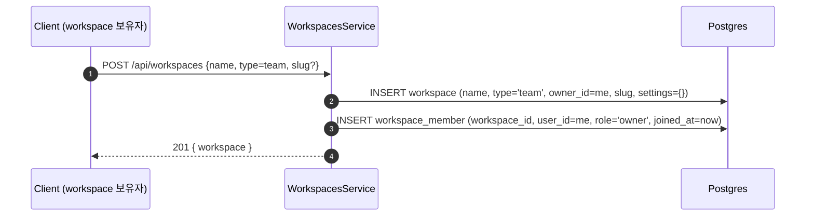
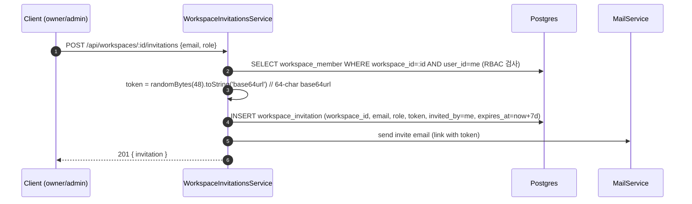
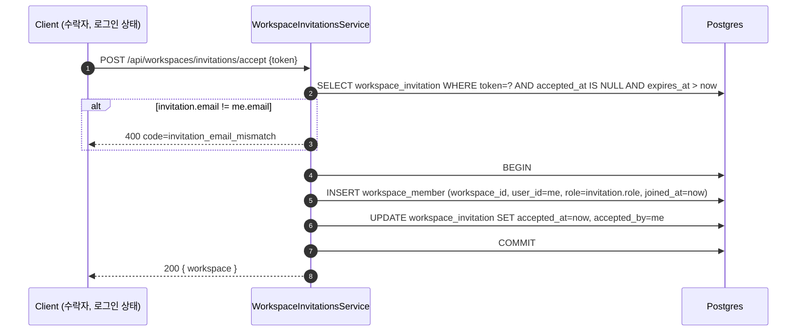
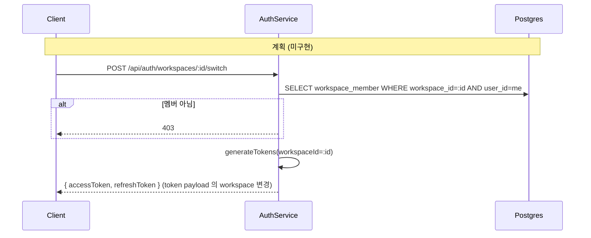
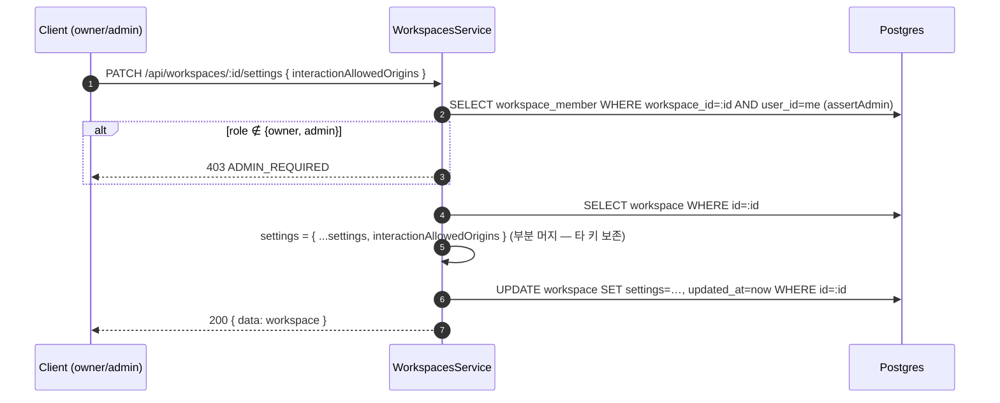
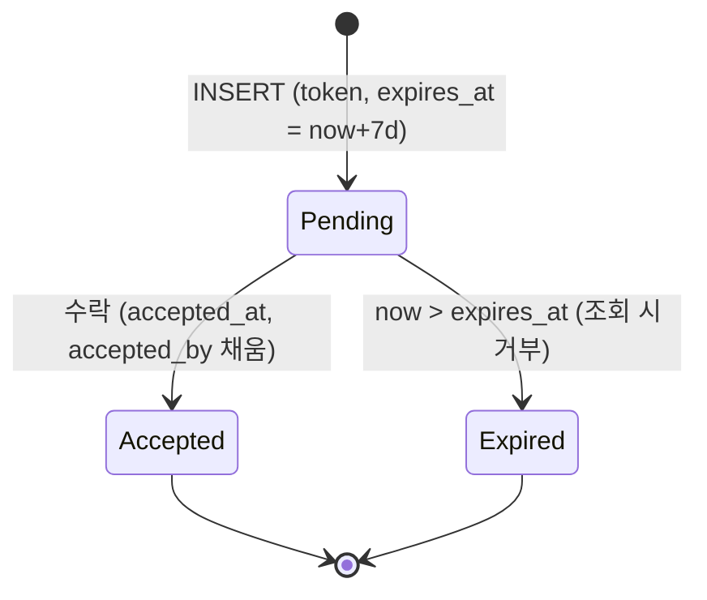

# Data Flow: 워크스페이스 (Workspace)

> 관련 spec: [Spec 인증 §1.5 초대 흐름](../5-system/1-auth.md) · [데이터 모델 §2.2~§2.3](../1-data-model.md) · [data-flow 개요](./0-overview.md)

---

## Overview

### System role

워크스페이스는 모든 리소스(워크플로우·통합·KB·LLM Config 등)의 격리 단위다. 사용자 1명은 1개의
personal workspace 를 가지며, 추가로 N개의 team workspace 에 멤버로 속할 수 있다. 멤버십은
`workspace_member` join 테이블이 N:M 관계를 표현하고, 새 멤버 초대는 토큰 기반 일회용 link 로 진행된다.

코드 진입점:

- `codebase/backend/src/modules/workspaces/workspaces.service.ts` — 워크스페이스 CRUD·멤버 관리
- `codebase/backend/src/modules/workspaces/workspace-invitations.service.ts` — 초대 발급·수락·재발송·취소
- `codebase/backend/src/modules/workspaces/workspaces.controller.ts` — `@Controller('workspaces')`. 생성/멤버/초대 발급·수락(`POST /api/workspaces/invitations/accept`)·전체 워크스페이스 HTTP 엔드포인트
- `codebase/backend/src/modules/workspaces/invitations.controller.ts` — `@Controller('invitations')`. **공개** 토큰 메타 조회(`GET /api/invitations/:token`) 단일 엔드포인트 (가입 페이지 prefill 용)

활성 워크스페이스 식별자는 `WorkspaceId` 데코레이터(`codebase/backend/src/common/decorators/workspace.decorator.ts`)가 결정하며 우선순위는 **`X-Workspace-Id` 헤더 > JWT `workspaceId`** 다. 즉 클라이언트가 보낸 `X-Workspace-Id` 헤더가 있으면 그 값을 우선 사용하고, 없을 때만 access token payload 의 `workspaceId` 로 fallback 한다 (회원가입 시 personal workspace 가 default). 헤더가 JWT 보다 우선한다는 점은 아래 Rationale 참고.

---

## 1. Source → Sink

### 1.1 워크스페이스 생성 (team)

### 1.2 멤버 초대 발급

### 1.3 초대 수락 (이미 가입한 사용자)

### 1.4 초대 수락 (미가입자 - 가입 + 합류)

상세 시퀀스는 `spec/5-system/1-auth.md §1.5.2`. 본 도메인 관점에서는 `auth.service.registerWithInvitation()`
경로가 다음을 단일 트랜잭션으로 수행:

1. `INSERT INTO "user"`
2. `INSERT INTO workspace_member` (초대된 team workspace, `role=invitation.role`) — `invitationsService.consumeForRegistration()` 가 멤버십 삽입 + 초대 수락(accepted_at/by) 을 함께 수행
3. `UPDATE workspace_invitation SET accepted_at, accepted_by` (위 consume 단계에 포함)

> **personal workspace 는 이 경로에서 생성하지 않는다.** 초대받은 team workspace 가 가입 시 active workspace 의 진실원이며, JWT `workspaceId` 도 그 team 으로 발급된다 (`auth.service.ts` `resolveWorkspaceForToken`: "invitationToken sign-ups must NOT trigger a personal workspace"). personal workspace 는 일반(비초대) 가입 경로에서만 자동 생성된다.

### 1.5 워크스페이스 전환 — 미구현 (Planned)

> **현재 미구현.** auth 모듈에 워크스페이스 switch 엔드포인트·서비스(`switchWorkspace`)·프론트 호출이 모두 부재하며, JWT payload 의 워크스페이스 클레임 필드명은 `activeWorkspaceId` 가 아니라 `workspaceId` 다 (`current-user.decorator.ts` `JwtPayload`). 아래 시퀀스는 **계획**이다. 토큰 재발급 기반 전환이 구현되기 전까지, 다른 워크스페이스 대상 요청은 `X-Workspace-Id` 헤더로 컨텍스트를 지정한다(§Overview / Rationale).

### 1.6 역할 변경 / 소유권 이전

| 액션 | 권한 | 동작 |
| --- | --- | --- |
| `PATCH /api/workspaces/:id/members/:memberId` `{role}` | owner / admin | `UPDATE workspace_member.role`. **대상 멤버의 현재 role 이 owner 이거나 부여하려는 role 이 owner 면 무조건 차단**(`OWNER_ROLE_PROTECTED`). owner 부여/박탈은 별도 transfer-ownership 흐름으로만. |
| `POST /api/workspaces/:id/transfer-ownership {newOwnerMemberId}` | owner (`@Roles('owner')` 가드 + service 재검증) | 단일 트랜잭션으로 (1) 현 owner.role='admin', (2) 대상 member.role='owner', (3) `workspace.owner_id = 대상.userId`. 본인 지정 시 `TARGET_IS_SELF`(400), 대상이 이미 owner 면 `TARGET_ALREADY_OWNER`(409), personal 워크스페이스는 이양 불가. `newOwnerMemberId` 는 user id 가 아니라 **member id**. |
| `DELETE /api/workspaces/:id/members/:memberId` | owner / admin | `DELETE workspace_member`. owner 는 제거 불가. 본인 제거는 자가 탈퇴(`leaveWorkspace`)로 위임. |

### 1.7 워크스페이스 설정 변경 (`settings`)

- 현 단계 `settings` 부분 키는 `interactionAllowedOrigins` 만(`timezone` 등은 본 엔드포인트 비대상). 각 origin
  `http(s)://host[:port]`(path/query 불가) 검증 + 후행 슬래시 정규화. **빈 배열 = 추가 origin 없음**(secure-by-default
  유지 — [7-channel-web-chat 보안 §2](../7-channel-web-chat/4-security.md), EIA §8.5). RBAC: [9-user-profile §4.3](../2-navigation/9-user-profile.md).
- **Schema 매핑(§2.1)**: `workspace.settings`(JSONB) — 설정 변경은 `UPDATE workspace SET settings = settings || :patch`(부분 머지) 형태.

---

## 2. Schema 매핑

### 2.1 Postgres

| Sink (table) | 흐름 | read/write 컬럼 | 인덱스 / 제약 |
| --- | --- | --- | --- |
| `workspace` | 생성 | INSERT `name, type IN (personal/team), owner_id, slug, settings={}, created_at` | `slug UNIQUE` (V001 컬럼 제약). personal 유일성(owner 당 1개)은 **앱 레이어**(`findOrCreatePersonalWorkspace`)로 보장 — team 다중 소유 허용이라 broad `(owner_id, type)` UNIQUE 는 두지 않음 (아래 Rationale 참고) |
| `workspace` | 소유권 이전 | UPDATE `owner_id` | — |
| `workspace_member` | 가입·초대 수락 | INSERT `workspace_id, user_id, role IN (owner/admin/editor/viewer), invited_at, joined_at` | `(workspace_id, user_id) UNIQUE` |
| `workspace_member` | 역할 변경 | UPDATE `role` | — |
| `workspace_invitation` | 발급 | INSERT `workspace_id, email, role IN (admin/editor/viewer), token, invited_by, expires_at = now+7d, created_at` | `token UNIQUE` (V017), `(email)` idx, `(workspace_id)` idx, 부분 UNIQUE `(workspace_id, email) WHERE accepted_at IS NULL` (대기 초대 중복 방지). owner 는 초대 role 로 불가 |
| `workspace_invitation` | 수락 | UPDATE `accepted_at, accepted_by` | — |

### 2.2 외부

| Sink | 흐름 | 비고 |
| --- | --- | --- |
| SMTP | 초대 메일 발송 | `MailService.sendInvitationEmail`. SMTP 설정은 시스템 전역 (`spec/5-system/1-auth.md` Rationale 1.5.B) |

---

## 3. 상태 전이

### 3.1 `workspace_invitation.accepted_at`

### 3.2 RBAC 매트릭스 (요약)

| Role | 워크스페이스 설정 | 멤버 관리 | 워크플로우 CRUD | 실행 | LLM Config / Integration |
| --- | --- | --- | --- | --- | --- |
| owner | ✓ | ✓ (자기 외) | ✓ | ✓ | ✓ |
| admin | ✓ | ✓ (owner 제외) | ✓ | ✓ | ✓ |
| editor | ✗ | ✗ | ✓ | ✓ | view |
| viewer | ✗ | ✗ | view | ✓ (수동 실행 only) | view |

> 정식 권한 매트릭스는 `spec/5-system/1-auth.md §3.2`. 본 표는 데이터 변경 권한 관점의 요약이다.

---

## 4. 외부 의존

| 의존 | 방향 | 참고 |
| --- | --- | --- |
| Auth 도메인 | cross-ref | 일반(비초대) 회원가입 시 personal workspace 자동 생성(초대 가입은 미생성, §1.4). token payload 의 활성 워크스페이스 필드는 `workspaceId`. [`auth.md`](./2-auth.md) |
| Mail 도메인 | 내부 → 외부 | 초대 메일 SMTP |
| Audit 도메인 | cross-ref | 현재 `audit_log` 에 적재되는 워크스페이스 액션은 `workspace.transfer_ownership` **1건뿐**이다 (`workspaces.service.ts` `transferOwnership`). create/delete/rename/member 변경 등은 아직 미적재. [`audit.md`](./1-audit.md) |

---

## Rationale

### `X-Workspace-Id` 헤더 우선 정책

현재 구현은 `WorkspaceId` 데코레이터에서 **`X-Workspace-Id` 헤더를 JWT `workspaceId` 보다 우선** 수용한다
(`workspace.decorator.ts`: "Priority: X-Workspace-Id header > JWT workspaceId"). 헤더가 있으면 그 값을
활성 워크스페이스로 쓰고, 없을 때만 token payload 의 `workspaceId` 로 fallback 한다. 즉 클라이언트가 보낸
헤더 값으로 워크스페이스 컨텍스트를 지정할 수 있다.

> **주의**: 토큰 재발급 기반 전환(§1.5)이 아직 미구현이라, 헤더로 다른 워크스페이스를 지정하는 것이 현재 유일한
> 전환 수단이다. 헤더 우선 수용은 해당 워크스페이스 멤버십 RBAC 가 각 핸들러/서비스에서 검증된다는 전제에
> 의존한다. 토큰 단일 진실(payload `workspaceId` 만 신뢰, 전환=재발급) 모델은 §1.5 가 구현될 때의 **계획**이다.

### `workspace_invitation.email` 일치 강제

수락 시 token 만 알면 누구나 수락할 수 있으면 안 된다. 수락자의 인증된 이메일이 초대 이메일과 일치해야
멤버로 합류한다 (§1.3, 불일치 시 `400 BadRequest` code=`invitation_email_mismatch`). 초대받지 않은
다른 사용자가 token 을 가로채도 이메일이 다르면 거부된다.

### personal 워크스페이스 유일성 (owner 당 1개)

의도된 invariant 는 "한 사용자가 personal 워크스페이스를 2개 이상 가질 수 없다" 뿐이다. **team 워크스페이스는
한 사용자가 다수 보유 가능**하다.

따라서 과거의 broad `@Unique(['ownerId', 'type'])` 엔티티 데코레이터는 **의미상 부정확**했다 — (owner_id,
type) 전체 UNIQUE 는 team 다중 소유까지 금지하기 때문이다. 게다가 대응 마이그레이션이 없어(엔티티
synchronize 비활성) DB 레벨에서 강제되지도 않는 미적용 선언이었다. 이 데코레이터는 제거했다.

현재 personal 유일성은 **앱 레이어**(`WorkspacesService.findOrCreatePersonalWorkspace` — find-or-create +
catch-refind 폴백)로 보장한다. DB 레벨 강제(defense-in-depth)가 필요하면 broad UNIQUE 가 아니라 **부분
유니크 인덱스** `CREATE UNIQUE INDEX ... ON workspace (owner_id) WHERE type = 'personal'` 로 도입한다
(team 다중 소유는 유지). 부분 인덱스 도입 시 기존 데이터의 owner 당 중복 personal 정리(dedup)가 선행돼야
하므로, 동시 요청 TOCTOU race 까지 막는 DB 레벨 강제는 **별도 hardening 마이그레이션**으로 분리한다.
