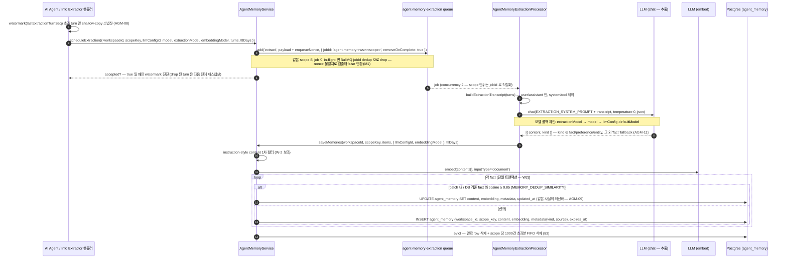
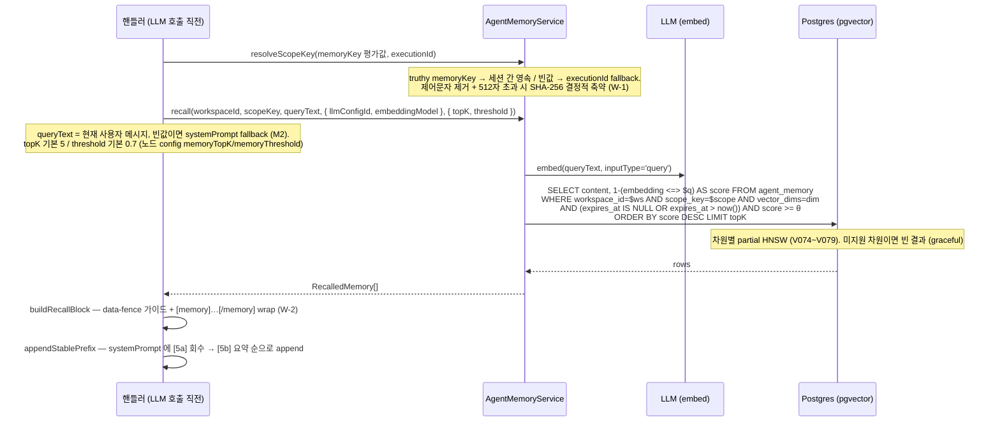
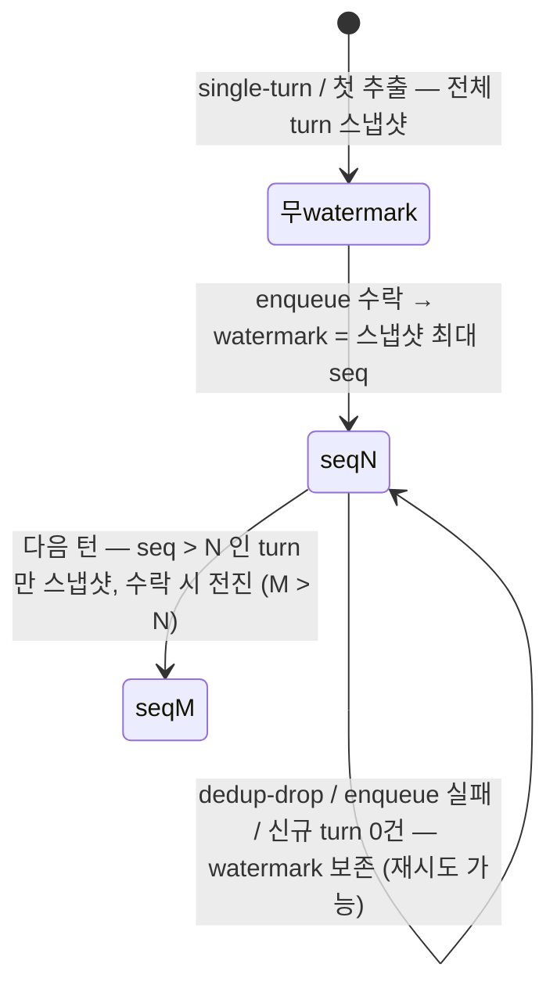

# Data Flow: Agent Memory

> 관련 spec: [Spec Agent Memory](../5-system/17-agent-memory.md) · [AI Agent 노드 §6.1](../4-nodes/3-ai/1-ai-agent.md) · [Information Extractor 노드](../4-nodes/3-ai/3-information-extractor.md) · [AI 노드 공통 §11.4](../4-nodes/3-ai/0-common.md) · [Conversation Thread 규약](../conventions/conversation-thread.md) · [데이터 모델 §2.23](../1-data-model.md) · [data-flow 개요](./0-overview.md)

---

## Overview

### System role

AI Agent / Information Extractor 노드의 `memoryStrategy: 'persistent'` 가 만드는 **세션 간
영속 메모리** 파이프라인. 멀티턴 대화의 턴 경계마다 turn 스냅샷을 전용 BullMQ 큐
(`agent-memory-extraction`) 로 비동기 발행하고, worker 가 LLM 으로 사용자 사실·선호를
추출·분류(kind)·임베딩해 `agent_memory` 테이블에 의미기반 dedup 으로 적재한다. 다음
실행에서는 노드가 LLM 호출 **직전 동기로** 같은 scope 의 메모리를 vector 검색(recall)해
시스템 프롬프트의 안정 프리픽스로 주입한다. SoT 는
[Spec Agent Memory](../5-system/17-agent-memory.md) — 본 문서는 "어떤 큐를 거쳐 어떤 row 가
생기고 어디로 회수되는가" 의 흐름 스티칭만 다룬다.

핵심 불변식 (코드 기준):

- **hot path 비차단** — 핸들러는 큐 enqueue 까지만 await 하고, 추출 LLM 콜은 worker 에서
  일어난다. enqueue 실패는 삼켜져 대화를 계속한다.
- **네임스페이스 = `(workspace_id, scope_key)`** — `scopeKey` 는 노드 `memoryKey` 평가값
  (truthy, 세션 간 영속) 또는 `executionId` fallback (세션 단위 격리). `workspace_id` 는
  항상 별도 SQL 필터로 강제된다.
- **`manual` / `summary_buffer` 전략은 본 파이프라인을 전혀 타지 않는다** — `persistent`
  에서만 enqueue/recall 이 발생한다 (회귀 금지 불변식). 롤링 요약(summary_buffer)은
  `agent_memory` 가 아니라 thread 의 `runningSummary` 에 저장된다 —
  [Conversation Thread 규약](../conventions/conversation-thread.md).

코드 진입점:

- `codebase/backend/src/modules/agent-memory/agent-memory.service.ts` — recall / saveMemories(의미 dedup) / scheduleExtraction(enqueue) / admin 조회·삭제
- `codebase/backend/src/modules/agent-memory/queues/agent-memory-extraction.queue.ts` — 큐 이름·payload·추출 프롬프트·응답 파서 (순수 함수)
- `codebase/backend/src/modules/agent-memory/queues/agent-memory-extraction.processor.ts` — 추출 worker (concurrency 2)
- `codebase/backend/src/modules/agent-memory/agent-memory.controller.ts` — admin REST surface (`/api/agent-memories`)
- `codebase/backend/src/nodes/ai/shared/agent-memory-injection.ts` — 공유 헬퍼: `scheduleMemoryExtraction` (producer 측) + `buildRecallBlock` (data-fence 주입)
- `codebase/backend/src/nodes/ai/ai-agent/ai-agent.handler.ts` · `codebase/backend/src/nodes/ai/information-extractor/information-extractor.handler.ts` — recall + 턴 경계 enqueue 호출부
- `codebase/frontend/src/app/(main)/agent-memory/page.tsx` + `codebase/frontend/src/lib/api/agent-memories.ts` — admin 화면

---

## 1. Source → Sink

### 1.1 턴 경계 추출 — 대화 turn → 큐 → LLM 추출 → embed → `agent_memory` INSERT/UPDATE

`persistent` 전략에서 single-turn 최종 응답 후 / multi-turn 매 turn 종료 후 (= assistant
turn push 직후), 핸들러가 공유 헬퍼 `scheduleMemoryExtraction` 을 호출한다.

- **증분 추출 watermark (AGM-08)**: 멀티턴 resume state 의 `lastExtractionTurnSeq` 초과
  turn 만 스냅샷한다. enqueue 가 **실제 수락된 경우에만** watermark 를 전진시킨다 —
  dedup-drop / 에러 시 보존해 해당 turn 들이 다음 턴에 다시 추출 대상이 된다
  (`agent-memory-injection.ts` `scheduleMemoryExtraction`).
- **scope 단위 직렬화**: jobId 를 `agent-memory:<workspaceId>:<scopeKey>` 로 고정해 같은
  scope 의 추출이 동시 실행되지 않는다 (findSimilarFact→INSERT 의 TOCTOU 중복 방지).
  완료 job 은 즉시 제거(`removeOnComplete: true`) — 완료 job 이 남으면 다음 enqueue 가
  영구 dedup-drop 되는 livelock 이 생기기 때문 (`agent-memory.service.ts`
  `scheduleExtraction` 주석).
- **TTL**: 노드 config `memoryTtlDays` 양수면 `expires_at = now() + ttlDays` 를 파라미터
  바인딩으로 채운다 (AGM-10). 미설정/0/음수 = 무만료(NULL). dedup UPDATE 시 ttl 미지정이면
  기존 `expires_at` 을 보존한다 (W1).
- 추출 결과가 빈 배열이거나 transcript 가 비면 no-op. 추출 LLM 콜 실패는 throw → BullMQ
  기본 재시도 — hot path 와 분리된 경로라 응답 latency 에 영향 없다.

### 1.2 Recall — 노드 실행 시 vector 검색 → 안정 프리픽스 주입

`persistent` 전략의 노드가 LLM 호출 **직전 동기로** 수행한다 (ai-agent.handler.ts
`injectMemoryContext` / information-extractor.handler.ts 동형 경로).

- **주입 ordering** 은 [AI 노드 공통 §11.4](../4-nodes/3-ai/0-common.md) — `[5a]` recall
  블록 → `[5b]` 롤링 요약 블록 → `[6]` 휘발성 꼬리. recall/요약 블록은 prompt-cache 안정
  프리픽스로 systemPrompt 에 붙는다.
- **Indirect prompt-injection 방어 (W-2)**: 회수 content 는 과거 대화에서 추출된 untrusted
  데이터이므로 data-fence 가이드 문구 + per-item `[memory]…[/memory]` 마커(내부 재등장
  토큰은 zero-width escape)로 감싼다 —
  [Conversation Thread 규약 §1.6](../conventions/conversation-thread.md) 철학 계승. 저장
  단계의 instruction-style 필터(§1.1)는 보조 방어다.
- **임베딩 출처 일치**: 회수(query)와 저장(document)이 같은 노드 config
  `(llmConfigId, embeddingModel)` 을 쓰므로 차원·endpoint 가 일치한다. 미지정 시
  워크스페이스 기본 LLMConfig → 최후 하드코딩 기본(`text-embedding-3-small`) 폴백.
  비대칭 임베딩 모델은 `inputType` 으로 query/document 를 구분한다 —
  [Knowledge Base data-flow](./6-knowledge-base.md) 와 동일 `LlmService.embed` 경로.
- recall 실패는 모든 레이어에서 graceful (빈 배열) — 회수 실패가 응답 경로를 깨지 않는다.

### 1.3 Admin surface — scope 목록·행 조회·삭제

`/api/agent-memories` (agent-memory.controller.ts, AGM-12/13). frontend 는 사이드바
`/agent-memory` 페이지가 소비한다.

| 메서드 | 라우트 | 권한 | 동작 |
| --- | --- | --- | --- |
| GET | `/api/agent-memories/scopes?q&limit&offset` | viewer | 워크스페이스의 distinct `scope_key` 목록 + 건수·최신 갱신 시각 (단일 CTE 쿼리, `COUNT(*) OVER()` total). `q` 는 ILIKE 부분일치 |
| GET | `/api/agent-memories?scopeKey&kind&limit&offset` | viewer | 한 scope 의 행 조회 (created_at 내림차순). `kind`(fact/preference/entity) 필터. **embedding 은 절대 SELECT 하지 않음**. kind 결손 시 `'fact'` 표기 (AGM-11) |
| DELETE | `/api/agent-memories/:id` | editor | 단건 hard delete. `WHERE id AND workspace_id` — 교차 워크스페이스 id 는 affected=0 → 404 |
| DELETE | `/api/agent-memories?scopeKey=` | editor | scope 전체 hard delete (대상 없으면 0건 삭제로 204) |

모든 라우트는 `@WorkspaceId()` (인증 컨텍스트) 에서만 workspaceId 를 얻는다 — 쿼리/바디로
받지 않는다 (격리 의무, [Spec Agent Memory §5/§6](../5-system/17-agent-memory.md)).

---

## 2. Schema 매핑

### 2.1 Postgres

| Sink (table) | 흐름 | 핵심 컬럼 | 인덱스 / 제약 |
| --- | --- | --- | --- |
| `agent_memory` | 추출 적재 (V073) | `workspace_id (FK CASCADE), scope_key TEXT, content TEXT, embedding vector(가변 차원), metadata JSONB ({kind, source: 'turn_boundary_extraction'})` | `idx_agent_memory_scope (workspace_id, scope_key, created_at)` — 회수 필터 + FIFO evict ORDER BY 가속 |
| `agent_memory` | 유사도 검색 (recall / dedup) | `embedding` — `1 - (embedding <=> $q)` cosine | 차원별 partial HNSW: V074(384) / V075(512) / V076(768) / V077(1024) / V078(1536) / V079(3072 — halfvec). 지원 차원 집합은 KB 와 공유 (`SUPPORTED_EMBEDDING_DIMS`) |
| `agent_memory` | TTL (V080) | `expires_at TIMESTAMPTZ NULL` — NULL=무만료. recall/dedup 은 만료 row 제외 | partial index `idx_agent_memory_expires_at (expires_at) WHERE expires_at IS NOT NULL` — 만료 스캔 가속 |
| `agent_memory` | dedup 갱신 | UPDATE `content, embedding, metadata, updated_at` (+ ttl 지정 시 `expires_at`) — cosine ≥ 0.85 인 기존 row 최신화 | — |
| `agent_memory` | forgetting | DELETE — ① `expires_at < now()` ② scope 당 `created_at` 최신 1000건(`AGENT_MEMORY_MAX_PER_SCOPE`) 초과분 | saveMemories 트랜잭션 말미에 실행 (§3) |

> KnowledgeBase 의 `document_chunk` 와 pgvector 인프라(untyped vector 컬럼 + 차원별 partial
> HNSW)를 동일 패턴으로 재사용하지만 **별도 테이블** 이다 — 생명주기·forgetting 정책이 다르다
> ([Spec Agent Memory Rationale](../5-system/17-agent-memory.md)).

### 2.2 Redis (BullMQ)

| 큐 | producer | consumer | payload |
| --- | --- | --- | --- |
| `agent-memory-extraction` | `AgentMemoryService.scheduleExtraction` (AI Agent / Info Extractor 핸들러가 턴 경계에 호출) | `AgentMemoryExtractionProcessor` (concurrency 2) | `{ workspaceId, scopeKey, llmConfigId?, model?, extractionModel?, embeddingModel?, turns[{source,text,nodeLabel}], ttlDays?, enqueueNonce }` — jobId `agent-memory:<ws>:<scope>` 고정 (scope 직렬화 + in-flight dedup), `removeOnComplete: true` |

`agent-memory.module.ts` 가 등록한다. `document-embedding` 과 분리된 전용 큐 — 추출(LLM
chat, 느림)이 임베딩/회수 경로 동시성에 간섭하지 않게 한다. 전체 큐 카탈로그:
[data-flow 개요 §4](./0-overview.md).

### 2.3 외부

| Sink | 흐름 | 비고 |
| --- | --- | --- |
| LLM provider (chat) | 턴 경계 추출 콜 (worker) | `LlmService.chat`, 모델 폴백 `extractionModel → model → llmConfig 기본`, temperature 0 / JSON. 사용량 → [`llm-usage.md`](./7-llm-usage.md) |
| LLM provider (embed) | 저장 임베딩 (`document`) / recall query 임베딩 (`query`) | `LlmService.embed` — KB 와 동일 경로. 노드 config `embeddingModel` → ws 기본 → 하드코딩 기본 폴백 |

---

## 3. 상태 / 라이프사이클

`agent_memory` row 에는 상태 컬럼이 없다 — 라이프사이클은 ① 추출 watermark, ② row 의
생성/갱신/소멸 두 축으로 본다.

### 3.1 추출 watermark (`lastExtractionTurnSeq`, AGM-08)

watermark 는 멀티턴 `_resumeState` 로 영속한다 (Redis 직렬화 — 신규 DB 컬럼 없음).

### 3.2 row 생애

| 단계 | 트리거 | 동작 |
| --- | --- | --- |
| 생성 | 추출된 신규 fact (유사 기존 row 없음) | INSERT (`metadata.kind`, ttl 시 `expires_at`) |
| 갱신 | 신규 fact 가 기존 row 와 cosine ≥ 0.85 (AGM-09) | 그 row UPDATE — 같은 사실의 최신화. ttl 미지정 시 기존 `expires_at` 보존 (W1) |
| 만료 소멸 | `expires_at < now()` (AGM-10) | recall/dedup 에서 즉시 제외(쿼리 필터), 물리 삭제는 다음 saveMemories 의 evict 에서 |
| 용량 소멸 | scope 당 1000건 초과 | `created_at` 오래된 순 FIFO 삭제 (saveMemories evict) |
| 수동 소멸 | admin DELETE (단건/scope 전체, §1.3) | hard delete — 복구 보장 없음 |

> 별도 cron sweeper 는 없다 — 만료/초과분 정리는 같은 scope 에 새 저장이 일어나는 시점
> (saveMemories 트랜잭션 말미) 과 admin 삭제로만 수행된다. 쿼리 필터가 만료 row 를 항상
> 제외하므로 물리 삭제 지연이 회수 정확성에 영향을 주지 않는다.

---

## 4. 외부 의존

| 의존 | 방향 | 참고 |
| --- | --- | --- |
| LLM 도메인 | 외부 | 추출 chat + 저장/회수 embed — `llm_config_id` 해석 (`LlmService.resolveConfig`) |
| LLM Usage | cross-ref | 모든 LLM 호출은 `llm_usage_log` 적재 — [`llm-usage.md`](./7-llm-usage.md) |
| Execution 도메인 | cross-ref | AI Agent / Info Extractor 핸들러가 recall·enqueue 호출부. 멀티턴 resume state 가 watermark 운반 — [`execution.md`](./3-execution.md) |
| Conversation Thread | cross-ref | 추출 입력 turn 의 출처 (frozen turn 의 shallow-copy 스냅샷). 요약(summary_buffer)은 thread 측 저장 — [conversation-thread 규약](../conventions/conversation-thread.md) |
| Knowledge Base | cross-ref | pgvector 인프라 패턴(가변 차원 vector + 차원별 partial HNSW + `LlmService.embed`)을 미러 — [`knowledge-base.md`](./6-knowledge-base.md). 테이블·큐는 완전 분리 |

---

## Rationale

### KB 와 같은 인프라, 다른 테이블·큐

`agent_memory` 는 `document_chunk` 의 pgvector 패턴(untyped vector + 차원별 partial HNSW +
`SUPPORTED_EMBEDDING_DIMS` 공유)을 그대로 미러하지만 테이블과 큐를 분리했다. 회수 대상
(문서 청크 vs 추출된 사용자 사실), 생명주기 (불변 적재 vs dedup-UPDATE·TTL·FIFO evict),
부하 특성 (throughput 큰 embed vs rate-limit 빡빡한 chat 추출) 이 모두 달라 정책을 독립
운용해야 하기 때문이다 — V073 주석 및
[Spec Agent Memory Rationale](../5-system/17-agent-memory.md).

### 고정 jobId + 완료 즉시 제거의 짝

scope 단위 고정 jobId 는 동시 추출의 TOCTOU 중복 INSERT 를 막는 직렬화 장치지만, BullMQ 의
jobId dedup 은 완료-보존 job 에도 발동한다. 완료 job 을 retain 하면 같은 scope 의 모든 후속
enqueue 가 영구 dedup-drop 되어 watermark 가 전진하지 못하는 livelock 이 생기므로
`removeOnComplete: true` 와 반드시 짝으로 둔다. dedup-drop 자체는 `enqueueNonce` 비교로
결정적으로 검출해 watermark 를 보존한다 (`agent-memory.service.ts` `scheduleExtraction`).

### 일괄 재임베딩 경로가 없는 이유

KB 와 달리 `agent_memory` 에는 재임베딩 API 가 없다. 메모리 row 는 dedup-UPDATE 로 계속
최신 임베딩으로 갱신되고 TTL/FIFO 로 자연 소멸하므로, 임베딩 모델 변경 시에도 신규 저장분이
새 차원으로 쌓이며 (recall 은 query 임베딩과 같은 차원 row 만 보므로) 구 차원 row 는 조용히
회수 대상에서 빠진 채 evict 된다 — [Spec Agent Memory §7/Rationale](../5-system/17-agent-memory.md).

### data-flow 관점의 경계

노드 config 필드 계약 (`memoryKey`/`memoryTopK`/`memoryThreshold`/`memoryTtlDays`/
`extractionModel`/`embeddingModel`), 주입 ordering 상세, 요약 buffer 와의 상호작용은
[AI Agent 노드](../4-nodes/3-ai/1-ai-agent.md)·[AI 노드 공통](../4-nodes/3-ai/0-common.md)
이 SoT 다. 본 문서는 큐·테이블·회수 SQL 의 source→sink 만 고정한다.
