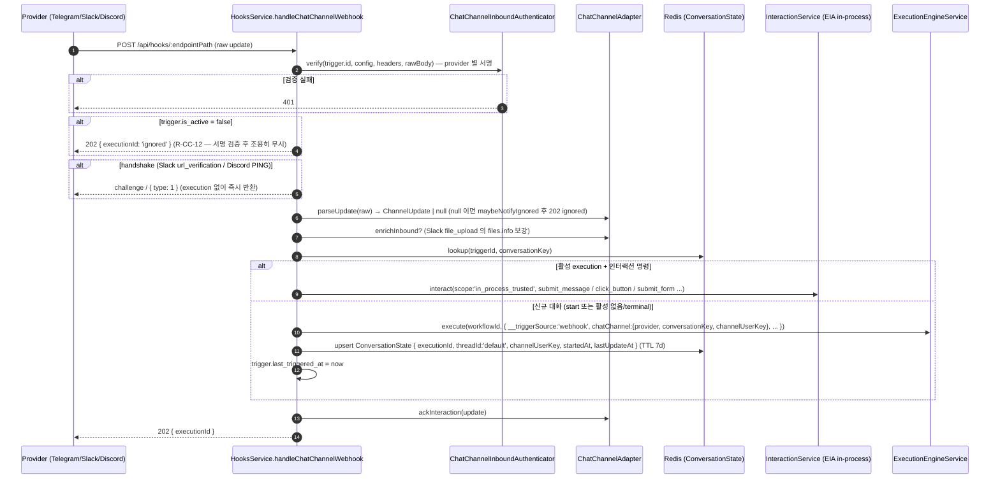
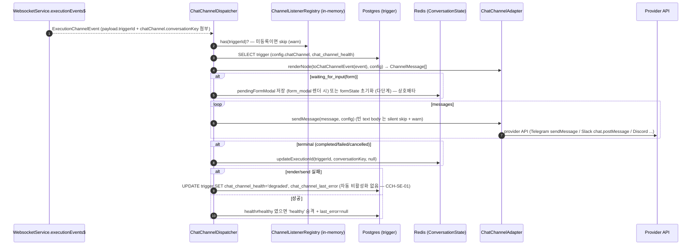

# Data Flow: Chat Channel (대화 상태 · outbound 발송 · bot token 회전 · web-chat 경로)

> 관련 spec: [Spec Chat Channel](../5-system/15-chat-channel.md) · [Convention Chat Channel Adapter](../conventions/chat-channel-adapter.md) · [Convention Secret Store](../conventions/secret-store.md) · [Spec EIA](../5-system/14-external-interaction-api.md) · [Spec 웹채팅 아키텍처](../7-channel-web-chat/0-architecture.md) · [data-flow 개요](./0-overview.md)

---

## Overview

### System role

외부 chat 플랫폼(Telegram/Slack/Discord)의 inbound update 가 **대화 상태(Redis ConversationState)** 를 거쳐
워크플로우 실행 시작 또는 진행 중 execution 의 인터랙션 재개로 이어지고, 실행 이벤트가 역방향으로
**adapter 렌더링 → provider API 발송**되며, bot token 이 **회전 → 24h grace → 정리**되는 흐름을 다룬다.
webhook 진입의 chatChannel 분기 자체는 [트리거 data-flow](./10-triggers.md) §1.5 가 진입점이고, 본 문서는
그 분기 이후의 source→sink 를 단일 진실로 둔다. provider 별 응답 JSON·서명 알고리즘·form modal 세부 계약은
[chat-channel adapter convention](../conventions/chat-channel-adapter.md) 이 SoT.

**중요한 저장 모델 사실**: 대화 상태(ChannelConversation)는 Postgres 테이블이 아니라 **Redis 키-값**
(`chat-channel:{triggerId}:{conversationKey}`, TTL 7일)이다 — Redis 미가용 시 graceful degradation
(lookup null / upsert noop → 매 update 가 새 execution). 영속 컬럼은 `trigger` 테이블의
`chat_channel_*` 5개 컬럼과 `trigger.config.chatChannel` JSON 뿐이다 (§2).

코드 진입점:

- `codebase/backend/src/modules/hooks/hooks.service.ts` — `handleChatChannelWebhook` (inbound 전체 오케스트레이션)
- `codebase/backend/src/modules/chat-channel/channel-conversation.service.ts` — Redis ConversationState CRUD + form-submit lock
- `codebase/backend/src/modules/chat-channel/chat-channel.dispatcher.ts` — outbound subscription (`WebsocketService.executionEvents$`)
- `codebase/backend/src/modules/chat-channel/chat-channel-token-rotator.service.ts` — `chat-channel-token-rotator` 큐 (매시간 cleanup)
- `codebase/backend/src/modules/triggers/triggers.service.ts` — `setupChatChannel` / `rotateBotToken` / `cleanupRotatedChatChannelTokens`
- `codebase/backend/src/modules/web-chat-cors/web-chat-cors-origin.resolver.ts` + `codebase/backend/src/modules/hooks/embed-config.service.ts` — web-chat 경로 (§1.4)

---

## 1. Source → Sink

### 1.1 Inbound update → 인증 → conversation 분기 → execution 시작/재개

진입 라우팅(`trigger.config.chatChannel` 존재 시 일반 webhook 흐름 우회)은
[트리거 data-flow](./10-triggers.md) §1.5 참조. 분기 이후의 처리:



`ChannelUpdate.command` 종류별 sink 분기 (`hooks.service.ts`):

| command | 처리 → sink |
| --- | --- |
| `text_message` `/help` | conversation 조회 전 정적 안내 `adapter.sendMessage` → `202 ignored` (execution 없음) |
| `cancel` | 활성 execution 있으면 `executionsService.stop` + ConversationState 의 `executionId=null` 갱신 |
| `text_message` / `button_callback` / `contact_share` / `file_upload` (활성 execution) | `formState` 진행 중이면 다단계 form step 처리, 아니면 `InteractionService.interact` in-process forwarding (EIA-AU-08 — token 검증 우회 scope) |
| `open_form_modal` | ConversationState 의 `pendingFormModal.fields` + provider openContext 로 `adapter.openFormModal` — Discord 는 webhook HTTP 응답 body 로 modal 반환. `channelUserKey` 불일치 시 거부 (group 내 가로채기 방어) |
| `form_submission` | per-conversation Redis lock (`SET NX EX 30`) 획득 → 필드 allowlist 필터 + client-side 검증 → `interact(submit_form)` → 성공 시 `pendingFormModal` clear. 실패 시 "양식 작성하기" 버튼 재노출 (pendingFormModal 유지) |
| 신규 대화 (위 외) | `execute()` + ConversationState upsert (위 다이어그램) |

> **구현 갭 — inbound rate limit**: `config.chatChannel.rateLimitPerMinute` (CCH-NF-03, default 60) 는
> DTO·타입 필드로만 존재하며 (`chat-channel/types.ts`, `triggers/dto/chat-channel-config.dto.ts`),
> inbound hot path 에 이를 적용하는 코드는 없다. 공개 webhook IP rate-limit
> (`PublicWebhookThrottleGuard`) 과도 별개다 — chatChannel 트리거는 inbound 서명 인증을 쓰므로
> 해당 가드의 공개(auth 없음) 조건에 의존할 수 없다.

### 1.2 Outbound — 실행 이벤트 → adapter 렌더링 → provider API 발송

`ChatChannelDispatcher` 는 `WebsocketService.executionEvents$` Subject 를 `onModuleInit` 에서 직접
subscribe 한다 (R8 단일 sink — [Spec Chat Channel §3.1](../5-system/15-chat-channel.md) CCH-AD-05).
구독 이벤트는 EIA outbound 5종 (`execution.waiting_for_input` / `ai_message` / `completed` / `failed` /
`cancelled`) + chat-channel-internal `execution.node.completed` (presentation 노드
`carousel`/`table`/`chart`/`template` 비-blocking 완료 한정 sub-filter — CCH-AD-07).



- **라우팅 키**: event payload 의 `triggerId` + `chatChannel.conversationKey` — `HooksService` 가
  `execute()` input 에 주입한 값이 WebsocketService 의 routing context registry 를 거쳐 fanout
  envelope 에 자동 첨부된다. 둘 중 하나라도 없으면 outbound skip (수동 실행 execution 은 채널 대상 아님).
- **per-trigger listener registry**: `setupChatChannel` 성공 시 `register`, process 재시작 시
  `chat-channel.module.ts` 의 `onApplicationBootstrap` 이 active + chatChannel 트리거를 DB 에서
  일괄 복원 (`bulkRegister`). 미등록 트리거의 이벤트는 DB round-trip 없이 skip.

### 1.3 Bot token 라이프사이클 — setup → rotate → 24h grace → cleanup

plaintext bot token 은 DB `trigger.config` 에 저장되지 않고 secret store ref 로만 참조된다
(SS-SE-01 — [Convention Secret Store](../conventions/secret-store.md)).

| 단계 | 흐름 (`triggers.service.ts`) | sink |
| --- | --- | --- |
| 최초 setup | 트리거 create/update 시 `setupChatChannel`: plaintext (`botToken`, provider-issued `inboundSigningPlaintext`) → secret store UPSERT → `adapter.setupChannel(config, callbackUrl)` (Telegram 은 server-issued `issuedInboundSigning` 을 돌려줘 추가 저장) → config 에 `botTokenRef`/`inboundSigningRef`/`botIdentity` 머지 | `secret_store` rows + UPDATE `trigger.config`, `chat_channel_setup_at`, `chat_channel_health='healthy'` + listener registry register |
| 회전 | `POST /api/triggers/:id/chat-channel/rotate-bot-token` → `rotateBotToken` 6단계: ① 기존 token resolve (없으면 백업 skip) ② v2 ref (`secret://triggers/{id}/bot-token.v2`) 에 백업 ③ primary ref 에 새 token UPSERT ④ 새 token 으로 `setupChannel` 재호출 (inbound-signing 재발급) ⑤ issuedInboundSigning 저장 ⑥ trigger 컬럼 갱신 | UPDATE `chat_channel_token_v2`(=v2 ref), `chat_channel_rotated_at`, `chat_channel_health='healthy'` |
| grace 종료 cleanup | BullMQ `chat-channel-token-rotator` 큐의 repeatable job (`0 * * * *`, `upsertJobScheduler` — 멀티 인스턴스에서 전역 1회) → `cleanupRotatedChatChannelTokens`: `chat_channel_token_v2 IS NOT NULL AND chat_channel_rotated_at <= now-24h` 후보별로 provider `revokeBotToken?` best-effort (Slack `auth.revoke` 만 — Telegram/Discord 는 revocation API 미지원) → `secrets.delete(v2Ref)` | `secret_store` v2 row DELETE + UPDATE `chat_channel_token_v2=NULL`, `chat_channel_rotated_at=NULL` |

> 회전 실패 분기: `setupChannel` 의 외부 API 401/403 은 `BOT_TOKEN_INVALID` 400, 그 외는
> `CHAT_CHANNEL_SETUP_FAILED` 로 변환 ([Spec Chat Channel §5.4](../5-system/15-chat-channel.md) 에러 표).
> bot token 변경은 rotate API 단일 경로다 (R-CC-10 — config PATCH 로 변경 불가).

### 1.4 web-chat 경로 — 위젯은 chat-channel 모듈을 거치지 않는다

웹채팅 위젯([spec/7-channel-web-chat](../7-channel-web-chat/0-architecture.md))은 provider adapter 가 아니라
**EIA 의 순수 external HTTP consumer** 다 (R2 — chat-channel 의 inbound/outbound 어댑터 경로 비경유).
data-flow 관점의 단계:

| 단계 | Source → Sink |
| --- | --- |
| ① 위젯 부팅 | iframe SPA (`codebase/channel-web-chat`) → `GET /api/hooks/:endpointPath/embed-config` (공개 엔드포인트, 실행 트리거 아님). `EmbedConfigService.resolve`: 공개(`auth_config_id IS NULL`) webhook trigger → `workspace.settings.interactionAllowedOrigins` 조회. 미설정/trigger 미존재/오류 시 allow-all degrade (위젯 fail-open) |
| ② 대화 시작 | `POST /api/hooks/:endpointPath` — **일반 webhook 경로** ([트리거 data-flow](./10-triggers.md) §1.2; chatChannel 분기 아님). `interaction.enabled` 트리거면 202 응답에 interaction token + endpoints 동봉 |
| ③ 실시간 수신 | `GET /api/external/executions/:id/stream` (SSE) + `POST .../interact` — execution token 라이프사이클·SSE fan-out 은 [External Interaction data-flow](./15-external-interaction.md) 가 SoT |
| ④ CORS | `main.ts` 의 경로-스코프 CORS delegate: `/api/hooks/*` 무제한, `/api/external/*` 는 `WebChatCorsOriginResolver` 가 execution → workflow → `workspace.settings.interactionAllowedOrigins` 를 60s TTL in-memory 캐시로 해석, 그 외 frontend allowlist. SoT: [Spec 웹채팅 보안](../7-channel-web-chat/4-security.md) §2 |

embed allowlist(①)와 SSE CORS allowlist(④)는 **같은 키** (`workspace.settings.interactionAllowedOrigins`,
[워크스페이스 data-flow](./12-workspace.md) 참조) 를 재사용한다 — 단일 진실.

---

## 2. Schema 매핑

### 2.1 Postgres

| Sink (table) | 흐름 | read/write 컬럼 |
| --- | --- | --- |
| `trigger` | setup / config | `config.chatChannel` JSON — `provider`, `botTokenRef`, `inboundSigningRef`, `botIdentity`, `uiMapping`, `rateLimitPerMinute`, `languageLocale`, `languageHints` (plaintext secret 필드는 저장 전 strip — SS-SE-01). 상세 필드 계약 SoT: [Spec Chat Channel §4.1](../5-system/15-chat-channel.md) |
| `trigger` | setup 완료 | UPDATE `chat_channel_setup_at` |
| `trigger` | outbound 건강 상태 | UPDATE `chat_channel_health` (`healthy`/`degraded`), `chat_channel_last_error` (1024자 절단) |
| `trigger` | token 회전 | UPDATE `chat_channel_token_v2` (text — **v2 secret ref 문자열**, token 자체 아님), `chat_channel_rotated_at`. cleanup 시 둘 다 NULL |
| `trigger` | inbound 발사 | UPDATE `last_triggered_at` (신규 execution 시작 시) |
| `secret_store` | setup / rotate / cleanup | `secret://triggers/{id}/bot-token` (primary), `.../bot-token.v2` (grace 백업), `.../inbound-signing` (서명 검증 자료) — [Convention Secret Store](../conventions/secret-store.md) |
| `execution` | 신규 대화 | INSERT ([실행 data-flow](./3-execution.md)) — input 에 `chatChannel:{provider, conversationKey, channelUserKey}` 스탬핑 |

### 2.2 Redis

| key / 큐 | producer | consumer | 내용 |
| --- | --- | --- | --- |
| `chat-channel:{triggerId}:{conversationKey}` | `HooksService` (upsert) / `ChatChannelDispatcher` (pendingFormModal·executionId 갱신) | 양쪽 lookup | `ChannelConversationState` JSON — `executionId`, `threadId('default')`, `channelUserKey`, `startedAt`, `lastUpdateAt`, `formState?`, `pendingFormModal?`. **TTL 7일** (매 upsert 갱신 — 이탈 시 자동 만료). 미가용 시 graceful degradation |
| `chat-channel-lock:{triggerId}:{conversationKey}:formsubmit` | `form_submission` 처리 (`SET NX EX 30`) | 동일 | native modal 중복 제출 방지 lock — Lua 소유권 확인 후 해제, Redis 미가용 시 fail-open |
| `chat-channel-token-rotator` (BullMQ) | repeatable job scheduler (`0 * * * *`) | `ChatChannelTokenRotatorService` | payload 없음 — 매시간 cleanup sweep (§1.3) |

### 2.3 외부

| Sink | 흐름 |
| --- | --- |
| Telegram Bot API | `setWebhook` (setup) / `sendMessage` 등 (outbound) — inbound 검증은 `X-Telegram-Bot-Api-Secret-Token` 동일성 |
| Slack API | `auth.test`·`views.open`·`chat.postMessage` (outbound/modal) / `auth.revoke` (token cleanup) — inbound 검증은 `X-Slack-Signature` HMAC |
| Discord API | application metadata / modal 은 webhook HTTP 응답 body 로 반환 — inbound 검증은 `X-Signature-Ed25519` |

---

## 3. 상태 전이

### 3.1 ConversationState (Redis)

| 전이 | 트리거 |
| --- | --- |
| (없음) → 활성 | 신규 대화: `execute()` 직후 upsert (`executionId` set) |
| `executionId` → null | terminal 이벤트 (completed/failed/cancelled) 도착 시 dispatcher 가 비움 / `/cancel` 처리 시 |
| `formState` ↔ `pendingFormModal` | 상호배타 — `waiting_for_input(form)` 렌더 결과가 `form_modal` 이면 pendingFormModal 저장 + formState 제거, 다단계(`form_prompt`)면 formState 초기화 + pendingFormModal 제거 |
| 소멸 | TTL 7일 만료 (사용자 이탈) 또는 명시적 `clear` |

state 가 남아 있는 한 동일 `conversationKey` 의 후속 update 는 같은 execution 의 continuation
(in-process `interact`) 으로 흐르고, 만료/비활성 후에는 새 execution 이 시작된다 — 멀티턴 대화의
park/resume 연결 고리. execution 쪽 대기·재개 모델은 [실행 data-flow](./3-execution.md) 참조.

### 3.2 Bot token 회전

```text
primary(bot-token) 만 존재
   │ rotate API (§1.3)
   ▼
primary=새 token + v2(bot-token.v2)=구 token  ← chat_channel_token_v2/rotated_at set (24h grace — 구 token 으로 들어오는 in-flight 호출 허용)
   │ 매시간 sweep, rotated_at ≤ now-24h
   ▼
v2 secret row 삭제 + provider revoke (best-effort) + 컬럼 NULL    (멱등 — v2 NULL 이면 no-op)
```

### 3.3 `chat_channel_health`

| 상태 | 전이 |
| --- | --- |
| `healthy` | setup/rotate 성공 시, 또는 outbound 첫 성공 시 승격 (`chat_channel_last_error=null`) |
| `degraded` | `renderNode`/`sendMessage` 실패 시 — **자동 비활성화는 하지 않는다** (CCH-SE-01). 다음 성공에서 다시 healthy |

---

## 4. 외부 의존

| 의존 | 방향 | 참고 |
| --- | --- | --- |
| 트리거 도메인 | inbound 진입 | webhook 분기 — [트리거 data-flow](./10-triggers.md) §1.5 |
| Execution 도메인 | 양방향 | 신규 대화의 `execute()` 진입 + 실행 이벤트 outbound — [실행 data-flow](./3-execution.md) |
| EIA (InteractionService) | inbound continuation | `scope:'in_process_trusted'` in-process forwarding (token 검증 우회, EIA-AU-08). execution token·SSE·notification webhook 흐름은 [External Interaction data-flow](./15-external-interaction.md) |
| Secret Store | token 보관 | `secret://triggers/{id}/...` 3종 ref ([Convention Secret Store](../conventions/secret-store.md)) |
| Workspace 도메인 | web-chat allowlist | `workspace.settings.interactionAllowedOrigins` ([워크스페이스 data-flow](./12-workspace.md)) |
| Telegram / Slack / Discord API | outbound + setup/revoke | §2.3 |

---

## Rationale

### 대화 상태를 Redis 단독으로 두는 이유

ConversationState 는 "지금 이 채팅방이 어느 execution 에 연결돼 있는가" 라는 휘발성 라우팅 정보다.
TTL 7일이 곧 이탈 정리 정책이고, Redis 미가용 시에도 워크플로우 실행 자체는 차단하지 않는다
(매 update 가 새 execution 으로 fallback — 의도된 graceful degradation). 영속이 필요한 것은
채널 설정·token ref·health 뿐이라 `trigger` 컬럼으로 충분하다. SoT:
[Spec Chat Channel §4.3](../5-system/15-chat-channel.md).

### `chat_channel_token_v2` 가 token 이 아니라 ref 인 이유

컬럼에는 secret store ref 문자열만 저장된다 — plaintext 가 DB 에 닿지 않게 하는 SS-SE-01 의 일관 적용.
24h grace 는 회전 직후 구 token 으로 도착하는 provider 측 in-flight 호출/캐시를 위한 안전 창이며,
grace 종료를 별도 cron 프로세스가 아닌 BullMQ repeatable job 으로 둔 것은 schedule 발사(트리거
data-flow §1.3)·notification secret rotator 와 동일한 "Redis 중앙 등록 + 멀티 인스턴스 전역 1회" 패턴
재사용이다.

### web-chat 을 chat-channel 모듈 밖에 두는 이유

위젯은 서버사이드 어댑터(봇 토큰·서명 검증·provider API)가 필요 없는 브라우저 클라이언트라서,
chat-channel 의 adapter 인터페이스 대신 EIA 표면(webhook 202 의 interaction token + interact/SSE)을
그대로 소비한다 ([Spec Chat Channel](../5-system/15-chat-channel.md) R2 — Chat Channel 을 EIA consumer 로만
위치시키는 결정과 대칭). 따라서 web-chat 의 서버측 footprint 는 embed-config 공개 조회와 CORS delegate
(web-chat-cors 모듈) 뿐이고, 둘 다 동일한 워크스페이스 allowlist 키를 읽는 read-only 경로다.
