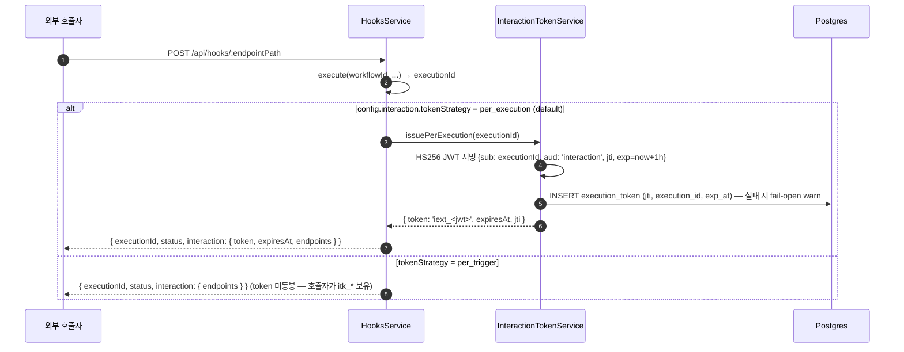
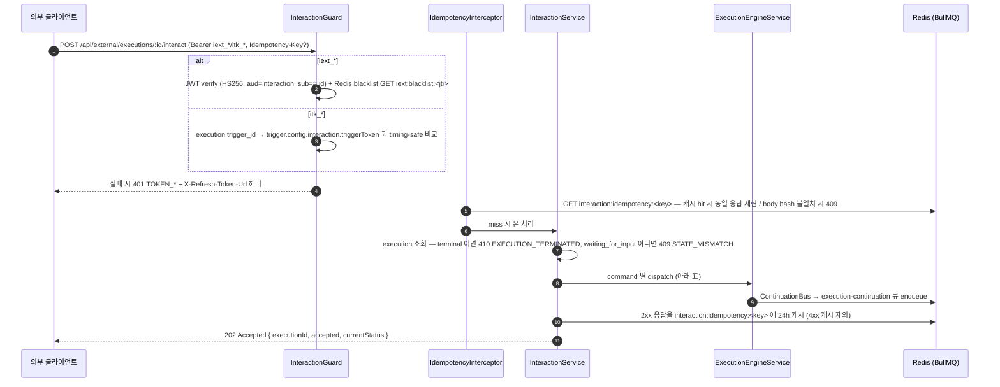
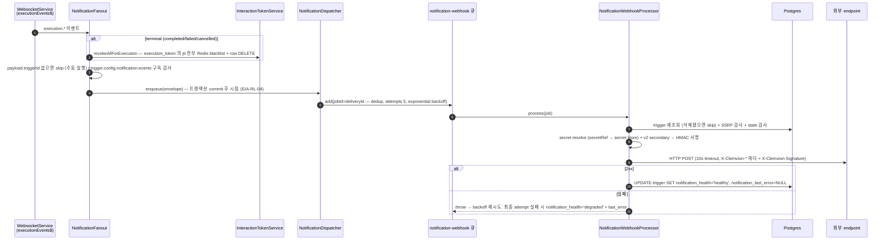
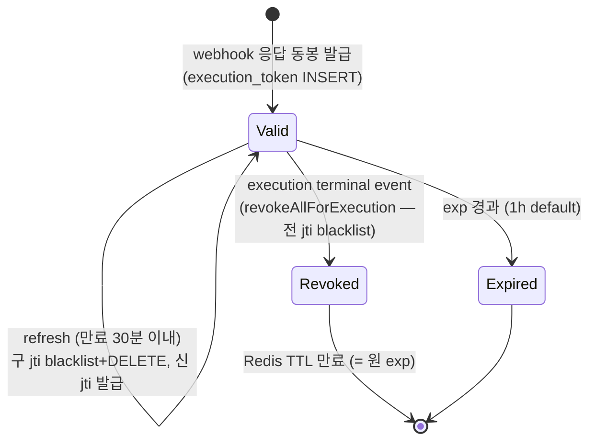

# Data Flow: External Interaction API (외부 인터랙션)

> 관련 spec: [Spec EIA (External Interaction API)](../5-system/14-external-interaction-api.md) · [Trigger data-flow](./10-triggers.md) · [실행 data-flow](./3-execution.md) · [data-flow 개요](./0-overview.md)

---

## Overview

### System role

워크플로우 실행을 **외부 시스템·외부 사용자**에게 노출하는 경계 레이어. 데이터 흐름은 세 갈래다:

1. **Inbound interaction** — webhook 으로 시작된 execution 의 `waiting_for_input` 노드에 외부
   사용자가 응답(`interact`/`cancel`)을 제출 → continuation 으로 실행 재개.
2. **SSE 스트림** — execution 의 라이브 이벤트(`execution.*`)를 외부 클라이언트(web-chat 위젯 등)에
   Server-Sent Events 로 push.
3. **Outbound notification webhook** — execution 이벤트를 외부 endpoint 로 HMAC 서명된 HTTP POST 로
   발송 (BullMQ `notification-webhook` 큐 경유).

세 갈래 모두 인증의 근간은 **interaction 토큰** (`iext_*` per-execution JWT / `itk_*` per-trigger
opaque) 이며, `iext_*` 의 jti 는 `execution_token` 테이블 (V060) 로 영속 추적되어 execution 종료
시 즉시 무효화된다. API 필드 계약·페이로드 shape 의 단일 진실은
[`spec/5-system/14-external-interaction-api.md`](../5-system/14-external-interaction-api.md) — 본 문서는
"데이터가 어디서 생겨 어디로 흐르는가" 만 다룬다.

코드 진입점 (`codebase/backend/src/modules/external-interaction/`):

- `interaction-token.service.ts` — 두 토큰 family 발급·검증·revoke (`InteractionTokenService`)
- `entities/execution-token.entity.ts` — `execution_token` 테이블 (iext jti 추적)
- `interaction.guard.ts` / `interaction.controller.ts` / `interaction.service.ts` — `/api/external/executions/:executionId/*` REST (interact / cancel / refresh-token / 상태 조회)
- `idempotency.interceptor.ts` — `Idempotency-Key` 24h Redis 캐시
- `interaction-stream.controller.ts` + `sse-adapter.service.ts` — SSE 스트림 + 5분 replay buffer
- `notification-fanout.service.ts` → `notification-dispatcher.service.ts` → `notification-webhook.processor.ts` — outbound webhook 발송 파이프라인 (+ `notification-signature.util.ts` HMAC)
- 발급 측 진입: `codebase/backend/src/modules/hooks/hooks.service.ts` (`buildInteractionResponse`) · `codebase/backend/src/modules/triggers/triggers.service.ts` (secret rotation / itk 재발급)

---

## 1. Source → Sink

### 1.1 토큰 발급 — webhook 호출 응답에 동봉

`trigger.config.interaction.enabled === true` 인 webhook trigger 가 호출되면, webhook 진입 흐름
([Trigger data-flow](./10-triggers.md) §1.1) 의 끝에서 `HooksService.buildInteractionResponse` 가
응답에 interaction 블록을 동봉한다.



- `endpoints` 는 `stream` / `submit` / `status` / `cancel` / `refresh` 5개의
  `/api/external/executions/:executionId/*` 경로 (`hooks.service.ts` `buildInteractionResponse`).
- `itk_*` (per_trigger, 32-byte random hex) 의 발급·재발급은 **단일 endpoint**
  `POST /api/triggers/:id/interaction/revoke-token` (`TriggersService.revokePerTriggerToken`) —
  새 토큰이 `trigger.config.interaction.triggerToken` (JSONB) 에 저장되며 평문은 응답에 1회만
  표시된다. 교체 즉시 이전 토큰은 무효 (Guard 가 config 의 현재 값과만 비교).

### 1.2 Inbound — interact / cancel → continuation 재개



dispatch 매핑 (`interaction.service.ts`):

| command | 위임 대상 | 비고 |
| --- | --- | --- |
| `submit_form` | `ExecutionEngineService.continueExecution(executionId, data)` | `nodeId`·`data` 필수 |
| `click_button` | `ExecutionEngineService.continueButtonClick(executionId, buttonId)` | `buttonId` 필수 |
| `submit_message` | `ExecutionEngineService.continueAiConversation(executionId, message)` | 멀티턴 AI 대화 |
| `end_conversation` | `ExecutionEngineService.endAiConversation(executionId)` | — |
| `cancel` (또는 `POST /:id/cancel` alias) | `ExecutionsService.stop(executionId)` | waiting 상태 불요 |

- 모든 continuation 은 영속 큐 `execution-continuation` 으로 enqueue 된다 (publisher =
  `ContinuationBusService`, [실행 data-flow](./3-execution.md) 가 큐·worker 의 단일 진실).
  publisher 측 사전 검증이 throw 하는 `InvalidExecutionStateError` 는 409 `STATE_MISMATCH` 로 매핑.
- **In-process trusted 경로**: Chat Channel inbound (`hooks.service.ts` `handleChatChannelWebhook`)
  는 HTTP 를 거치지 않고 `scope: 'in_process_trusted'` ctx 를 직접 합성해 같은 dispatch 를 호출한다
  — 토큰 검증 우회는 서버 내부 모듈만 가능 (타입 union 으로 컴파일러 강제,
  `interaction.guard.ts` EIA-AU-08/09). 흐름 자체는 [Chat Channel data-flow](./14-chat-channel.md) 참조.
- **refresh-token**: `POST /:id/refresh-token` 은 `iext_*` 만 대상 (`itk_*` 는 403). 만료 30분
  이내(`IEXT_REFRESH_WINDOW_SEC`)에만 신규 발급 — 구 jti 는 즉시 Redis blacklist + `execution_token`
  row DELETE 후 새 jti 가 INSERT 된다. terminal execution 은 410.
- **단발 상태 조회**: `GET /:id` 는 `execution` row 의 status/result/error 만 반환하는 SSE 보정용
  read-only 경로 (`seq` 는 0 placeholder — 클라이언트는 SSE `Last-Event-Id` 로 보정).

### 1.3 SSE 스트림 — 노드 이벤트 push

Source 는 실행 엔진이 emit 하는 WebSocket 이벤트 단일 sink (`WebsocketService`, [Spec EIA §R10]) 다.
SSE 는 그 스트림의 **adapter** 일 뿐 자체 이벤트를 만들지 않는다.

```text
ExecutionEngine → WebsocketService.emitExecutionEvent/emitNodeEvent
  (seq = Redis INCR exec:seq:<executionId> — ExecutionSeqAllocator)
  → executionEvents$ (in-process RxJS Subject)
      ├─ SseAdapter: execution 별 in-memory ring buffer (5분 retention, 최대 1000건) + 활성 구독자 push
      └─ NotificationFanout (§1.4)

GET /api/external/executions/:id/stream  (InteractionGuard — EventSource 호환 위해 ?token= 쿼리 허용)
  → 동시 구독 3개 초과 시 429 TOO_MANY_CONNECTIONS
  → Last-Event-Id 헤더(또는 ?lastEventId=) 이후 seq 를 buffer 에서 replay → live 합류
  → frame: `event: <eventType>` / `id: <seq>` / `data: <JSON payload>` + 15s heartbeat comment
  → terminal event (execution.completed/failed/cancelled) 발송 후 자동 종료
```

- SSE 의 `id:` 와 outbound notification 의 `seq` 는 **같은 카운터** (Redis `exec:seq:<id>`) 를 공유
  한다 ([Spec EIA §R7]) — 클라이언트가 두 채널의 이벤트를 단일 순서로 정렬 가능.
- v1 은 single-instance in-memory buffer — 분산 fan-out 은 follow-up (`sse-adapter.service.ts` 주석).
- 대표 소비자는 web-chat 위젯 (`codebase/channel-web-chat/src/lib/eia-client.ts` — EventSource 로
  본 경로 구독). 위젯 부팅·CORS allowlist(`WebChatCorsOriginResolver` —
  execution → workspace.settings.interactionAllowedOrigins 해석, 60s 캐시) 를 포함한 web-chat 경로는
  [Chat Channel data-flow](./14-chat-channel.md) 와
  [`spec/7-channel-web-chat/0-architecture.md`](../7-channel-web-chat/0-architecture.md) 가 다룬다.

### 1.4 Outbound — notification webhook 발송



단계별 사실 (`notification-fanout.service.ts` / `notification-webhook.processor.ts`):

- **fanout 대상 이벤트 5종**: `execution.waiting_for_input` / `completed` / `failed` / `cancelled` /
  `ai_message`. terminal 시의 jti revoke 는 **notification config 유무와 독립** — interaction-only
  트리거도 종료 시 토큰 무효화된다 (EIA-AU-04).
- **stale 차단**: in-flight 성격의 `waiting_for_input` / `ai_message` 는 발송 직전 execution 상태를
  재확인해 이미 terminal 이면 skip (재시도 무의미).
- **SSRF**: 등록 시(`TriggersService.assertNotificationUrlSafe`) + 발송 직전(`checkSsrfSafeUrl`)
  이중 검증. DNS rebinding 가드는 `NOTIFICATION_ENFORCE_DNS_REBIND_GUARD=1` 일 때만 (default OFF).
- **서명**: Stripe-style `X-Clemvion-Signature: t=<unix>,v1=<hex>[,v1=<v2hex>]`
  (`notification-signature.util.ts`). canonical form `{timestamp}.{rawBody}`, 알고리즘
  `hmac-sha256` (default) / `hmac-sha512`. secret 미설정·resolve 실패 시 **unsigned 발송하지 않고**
  degraded 처리. rotation grace 중에는 `notification_secret_v2` 로도 서명해 `v1=` 두 개 동봉.
- **실패 정책**: 최종 실패 시에도 trigger 자체는 비활성화하지 않는다 ([Spec EIA §R6]) —
  `notification_health` / `notification_last_error` (500자 truncate) 갱신만. BullMQ
  `removeOnComplete` 24h / `removeOnFail` 7d.

### 1.5 Notification signing secret 회전

```text
POST /api/triggers/:id/notification/rotate-secret 류 API (TriggersService.rotateNotificationSecret)
  → 새 secret `wsk_<64hex>` 생성 → trigger.notification_secret_v2 (평문 컬럼) + notification_rotated_at=NOW()
  → 응답에 평문 1회 반환 (호출자가 외부 검증자에 배포)
  → 24h grace: NotificationWebhookProcessor 가 primary + v2 두 서명 동봉 (§1.4)
  → BullMQ `notification-secret-rotator` 큐 (매시 0분 repeatable scheduler)
      → TriggersService.promoteRotatedNotificationSecrets:
        rotated_at ≤ now-24h 인 trigger 의 v2 를 secret store canonical ref
        (secret://triggers/<id>/notification-signing) 내용으로 회전(rotate) + signing.secretRef 연결
        + notification_secret_v2 / notification_rotated_at NULL 클리어
```

> **승격 경로** (2026-06-10 C3 갭 해소) — 승격은 평문을 `config` 에 쓰지 않는다.
> `secrets.rotate(canonical ref, v2)` 로 secret store 내용을 교체하고 `signing.secretRef` 를
> canonical ref 로 정렬하며, legacy `signing.secret` 평문 키는 제거한다
> (`normalizeNotificationSecretRef` 와 동일 ref 규약). 발송 측 `resolveSigningSecret`
> (`notification-webhook.processor.ts`) 의 `secretRef` 우선 정책과 정합 — 승격 즉시 새 secret 으로
> primary 서명이 전환된다. notification config 자체가 없는 trigger 는 승격을 skip 한다
> (서명 대상 부재 — v2 는 다음 rotate 호출 시 덮어써짐).

---

## 2. Schema 매핑

### 2.1 Postgres

| Sink (table) | 흐름 | read/write 컬럼 | 비고 |
| --- | --- | --- | --- |
| `execution_token` (V060) | iext 발급 | INSERT `(jti PK, execution_id FK→execution ON DELETE CASCADE, issued_at, exp_at)` | 한 execution 이 refresh 로 여러 jti 보유 가능. INSERT 실패는 fail-open (warn) |
| `execution_token` | refresh / terminal revoke | DELETE `WHERE jti=?` (refresh) / `WHERE execution_id=?` (terminal bulk) | `idx_execution_token_execution_id` 단일 lookup — iext 미발급 execution 은 no-op |
| `trigger.config` (JSONB) | interaction 설정 | `interaction.enabled` · `interaction.tokenStrategy` (`per_execution`\|`per_trigger`) · `interaction.triggerToken` (itk 평문) | 1급 컬럼 아님 — [Spec EIA §7.1] |
| `trigger.config` (JSONB) | notification 설정 | `notification.url` · `notification.events[]` · `notification.signing.{algorithm,secretRef,secret(legacy)}` | plaintext `signing.secret` 입력은 create/update 시 secret store 로 마이그레이션 (`normalizeNotificationSecretRef`) |
| `trigger` | webhook 발송 health | UPDATE `notification_health ('healthy'\|'degraded')`, `notification_last_error` | processor 가 성공/최종 실패 시 |
| `trigger` | secret rotation | UPDATE `notification_secret_v2` (평문), `notification_rotated_at` — 승격 시 NULL 클리어 | §1.5 |
| `execution` | inbound 검증 | SELECT `status` (terminal/waiting 검사, itk 의 `trigger_id` 매칭) — interact 자체는 execution row 를 직접 쓰지 않음 (continuation worker 가 갱신, [실행 data-flow](./3-execution.md)) | — |

### 2.2 Redis / BullMQ

| Sink | key / queue | 흐름 | TTL·정책 |
| --- | --- | --- | --- |
| Redis | `iext:blacklist:<jti>` | terminal event / refresh 시 SET | TTL = 원 JWT exp 까지. Redis 미가용 시 fail-open (검증도 fail-open + warn) |
| Redis | `interaction:idempotency:<key>` | 2xx 응답 캐시 (`{bodyHash, responseJson, statusCode}`) | 24h. 같은 키+다른 body → 409. 4xx (`VALIDATION_FAILED` 등) 캐시 제외 ([Spec EIA §R8]) |
| Redis | `exec:seq:<executionId>` | `INCR` — SSE `id:`/notification `seq` 공용 카운터 | terminal event 후 해제 ([`spec/5-system/6-websocket-protocol.md`](../5-system/6-websocket-protocol.md)) |
| BullMQ | `notification-webhook` | `NotificationDispatcher.enqueue` → `NotificationWebhookProcessor` | jobId=deliveryId dedup, attempts 5 exponential backoff, removeOnComplete 24h / removeOnFail 7d |
| BullMQ | `notification-secret-rotator` | hourly repeatable (`0 * * * *`) → v2 승격 | upsertJobScheduler 멱등 — 멀티 인스턴스 전역 1회 |
| BullMQ | `execution-continuation` | interact dispatch 의 sink (publisher = ContinuationBus) | 큐 자체의 단일 진실은 [실행 data-flow](./3-execution.md) |
| in-memory | `SseAdapter.buffers` | execution 별 ring buffer | 5분 retention · 최대 1000건 — single-instance 한정 |

---

## 3. 상태 전이

### 3.1 `iext_*` (per_execution JWT)



- 검증 실패 사유 → 401 코드 매핑: `expired→TOKEN_EXPIRED`, `blacklisted→TOKEN_REVOKED`,
  `scope_mismatch→TOKEN_SCOPE_MISMATCH`, `audience_mismatch→TOKEN_AUDIENCE_MISMATCH`, 그 외
  `TOKEN_INVALID` (`interaction.guard.ts`).
- Redis 미가용 환경에서는 blacklist 가 동작하지 않는 **fail-open** — exp 자연 만료로만 보호
  (보안 trade-off 는 `interaction-token.service.ts` 클래스 주석 / [Spec EIA §8.3]).

### 3.2 `itk_*` (per_trigger opaque)

발급(첫 `revoke-token` 호출) → `config.interaction.triggerToken` 교체 시 즉시 구 토큰 무효 →
trigger 삭제 시 소멸 (config 와 함께). TTL·refresh 개념 없음 — Guard 가 매 요청 현재 config 값과
timing-safe 비교 (SHA-256 후 `timingSafeEqual`, 길이 leak 차단).

### 3.3 Notification signing secret

`primary 단독` → (rotate API) → `grace: primary+v2 이중 서명 (24h)` → (hourly cron) →
`v2 승격·클리어`.

---

## 4. 외부 의존

| 의존 | 방향 | 참고 |
| --- | --- | --- |
| 외부 webhook endpoint | 내부 → 외부 HTTP POST | 2xx 만 성공. 10s timeout. SSRF 이중 검증. 검증 측 헬퍼 `verifySignatureHeader` (±5분 tolerance) 는 SDK/e2e 재사용용 export |
| 외부 클라이언트 (EventSource / fetch) | 외부 → 내부 | web-chat 위젯 (`channel-web-chat`) 이 대표 소비자 — [Chat Channel data-flow](./14-chat-channel.md) |
| Redis | 내부 | blacklist · idempotency · seq · BullMQ. 전 경로 fail-open (warn) — 가용성 우선 |
| Telegram/Slack/Discord 등 chat provider | 간접 | in-process trusted 경로의 상류 — [Chat Channel data-flow](./14-chat-channel.md) |

---

## Rationale

### 별도 data-flow 문서로 분리한 이유

external-interaction 모듈은 inbound REST·SSE·outbound webhook 세 흐름이 **하나의 토큰·이벤트
라이프사이클**을 공유한다 (terminal event 가 SSE 종료·token revoke·notification 발송을 동시에
구동). [실행 data-flow](./3-execution.md) 에 흡수하면 실행 엔진 내부 흐름과 경계 레이어 흐름이
섞이고, [알림 data-flow](./8-notifications.md) 는 in-app `notification` 테이블 도메인이라 외부
webhook 발송과 어휘만 겹칠 뿐 sink 가 전혀 다르다. 모듈 응집도를 따라 단일 문서로 둔다.

### 단일 sink (R10) 를 그대로 따르는 서술

본 문서의 SSE(§1.3)·notification(§1.4) 흐름이 모두 `WebsocketService.executionEvents$` 에서
출발하는 것은 구현 사실이자 [Spec EIA §R10] 의 설계 결정이다 — ExecutionEngine 은 여전히
WebsocketService 만 호출하고, SSE adapter 와 NotificationFanout 은 그 Subject 의 구독자로 격리된다.
data-flow 관점에서 이 구조는 "이벤트의 원천이 하나" 임을 보장하므로, seq 공유 (§R7) 와 terminal
시 일괄 후처리 (token revoke) 가 자연스럽게 같은 지점에 묶인다.

### Fail-open 정책의 일관 표기

토큰 blacklist·idempotency·jti 추적·notification enqueue 모두 Redis/DB 미가용 시 **fail-open**
(기능 저하 + warn 로그) 이다. 이는 "interaction/notification 은 워크플로우 실행의 부수 채널이며,
인프라 장애가 실행 자체를 멈추면 안 된다" 는 모듈 전반의 결정 (`interaction-token.service.ts` ·
`notification-dispatcher.service.ts` 주석) 으로, 본 문서는 각 표에 해당 정책을 명시해 운영자가
저하 모드의 잔여 위험 (blacklist 미적용 = exp 까지 토큰 유효 등) 을 추적할 수 있게 했다.

### §1.5 구현 갭 — 해소 이력 (C3 fix)

secret 승격 경로의 `secretRef` 우선순위 충돌(코드 주석·시스템 spec 의 의도 "v2 → secretRef 승격" 과
실제 코드가 갈라졌던 지점)은 `promoteRotatedNotificationSecrets` 수정으로 해소됐다 — 승격 시
평문 기록 대신 secret store 의 canonical ref 를 `secrets.rotate` 로 회전해 `resolveSigningSecret`
의 `secretRef` 우선 로직과 일치한다 (현행 동작은 §1.5 "승격 경로" note 가 SoT). 갭이 존재하던 동안
본문 callout 으로 가시화했던 이유: 의도와의 불일치가 보안 운영(회전한 secret 이 실제로 쓰이는가)에
직접 영향하기 때문이다.
