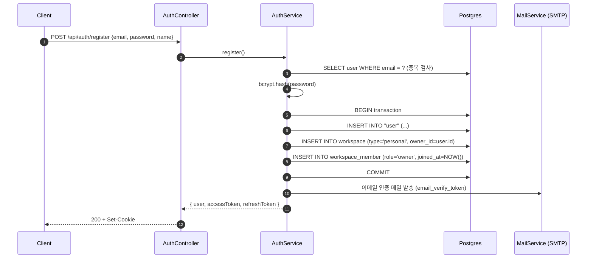
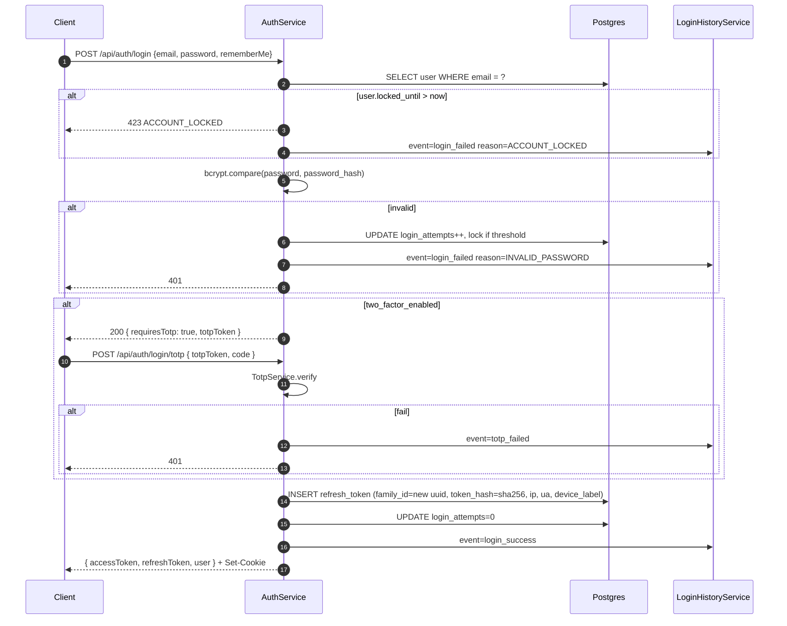
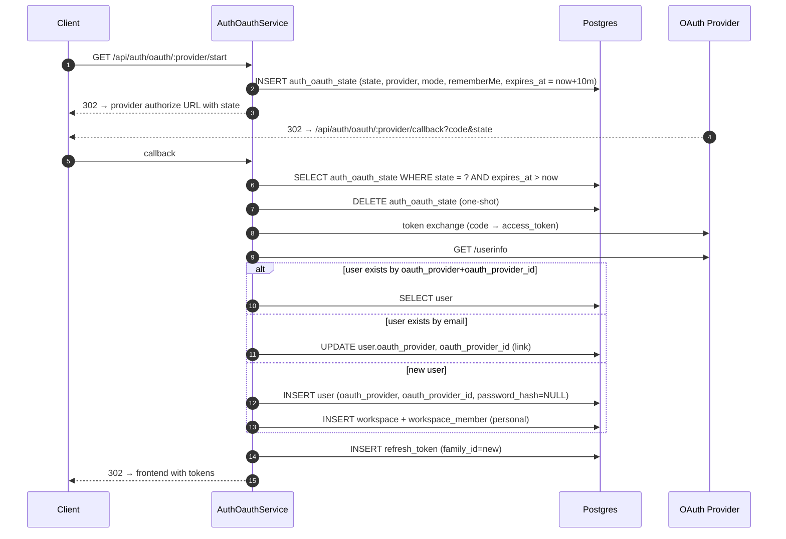
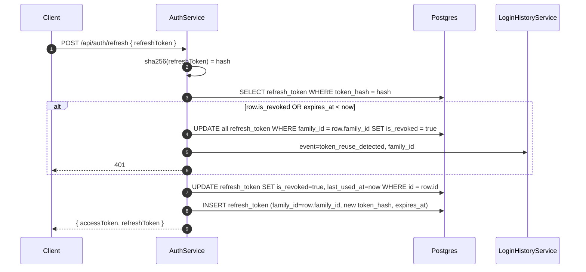
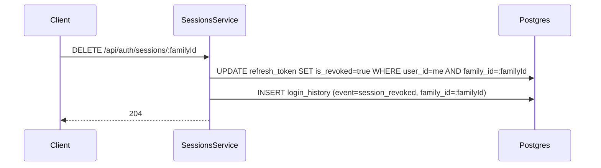
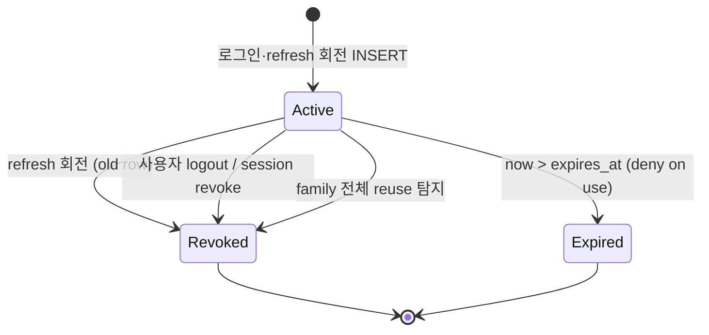

# Data Flow: 인증 (Auth)

> 관련 spec: [Spec 인증](../5-system/1-auth.md) · [데이터 모델 §2.1, §2.18.1, §2.18.2](../1-data-model.md) · [data-flow 개요](./0-overview.md)

---

## Overview

### System role

사용자 신원 확인과 세션 발급을 책임진다. 로컬 이메일/비밀번호, OAuth 소셜 로그인, 2FA(TOTP),
초대 토큰 가입을 단일 진입점으로 통합한다. JWT access token + 회전 가능한 refresh token (`family_id`
단위 세션) 모델을 사용하며, 모든 인증 이벤트는 `login_history` 에 시간순으로 기록된다.

코드 진입점:

- `backend/src/modules/auth/auth.controller.ts` — `/api/auth/*` REST 진입
- `backend/src/modules/auth/auth.service.ts` — register / login / refresh / logout
- `backend/src/modules/auth/auth-oauth.service.ts` — OAuth state 발급·콜백
- `backend/src/modules/auth/sessions.service.ts` — 활성 세션 목록·revoke
- `backend/src/modules/auth/login-history.service.ts` — 이벤트 적재

---

## 1. Source → Sink

### 1.1 회원가입 (로컬)

### 1.2 로그인 (Local + TOTP)

### 1.3 OAuth 소셜 로그인

### 1.4 Refresh token 회전

### 1.5 세션 revoke (사용자 본인)

---

## 2. Schema 매핑

> 컬럼 정의의 단일 진실은 `spec/1-data-model.md` 와 `backend/src/modules/users/entities/user.entity.ts`,
> `backend/src/modules/auth/entities/*.entity.ts`. 본 표는 흐름에서 read/write 되는 컬럼만 발췌.

### 2.1 Postgres

| Sink (table) | 흐름 | read/write 컬럼 | 인덱스 / 제약 |
| --- | --- | --- | --- |
| `user` | 회원가입 | INSERT `email, password_hash, name, locale, theme, email_verify_token, email_verify_expires_at, created_at` | `email UNIQUE` (V001) |
| `user` | 로그인 실패 카운트 | UPDATE `login_attempts, locked_until` | — |
| `user` | OAuth 첫 연결 | UPDATE `oauth_provider, oauth_provider_id` | — |
| `user` | 2FA on/off | UPDATE `two_factor_enabled, two_factor_secret, totp_recovery_codes` | — |
| `refresh_token` | 로그인·refresh | INSERT `user_id, token_hash, family_id, is_revoked=false, expires_at, device_label, user_agent, ip_address` | `token_hash UNIQUE`, `(user_id, family_id) WHERE is_revoked=false` (V040 metadata) |
| `refresh_token` | refresh 회전 | UPDATE `is_revoked=true, last_used_at, last_used_ip` (old row) + INSERT new row | — |
| `refresh_token` | reuse 탐지 | UPDATE `is_revoked=true` for entire `family_id` | — |
| `auth_oauth_state` | OAuth start | INSERT `state, provider, mode, remember_me, expires_at = now+10m` | `state UNIQUE` (V013) |
| `auth_oauth_state` | OAuth callback | DELETE WHERE `state=?` (one-shot) | — |
| `login_history` | 모든 이벤트 | INSERT `user_id, email, event, ip_address, user_agent, device_label, family_id, failure_reason, created_at` | `(user_id, created_at DESC)`, `(email, created_at DESC)` (V040) |
| `workspace` | 회원가입 | INSERT `name, type='personal', owner_id, slug` | `slug UNIQUE`, `(owner_id, type) UNIQUE` |
| `workspace_member` | 회원가입 | INSERT `workspace_id, user_id, role='owner', joined_at` | `(workspace_id, user_id) UNIQUE` |

### 2.2 Redis

Auth 도메인은 BullMQ 큐를 사용하지 않는다. 단, Login rate limit 은 (구현 시) Redis 카운터를 사용할 후보다.

### 2.3 외부

| Sink | 흐름 | 비고 |
| --- | --- | --- |
| SMTP (MailService) | 이메일 인증·비밀번호 reset·초대 메일 | `backend/src/modules/mail/mail.service.ts` |
| OAuth provider | authorize / token / userinfo | Google·GitHub. 셀프 호스팅은 LDAP/SAML 추가 가능 (`spec/5-system/1-auth.md §1.3`) |

---

## 3. 상태 전이

### 3.1 `refresh_token.is_revoked`

### 3.2 `user.locked_until` (계정 잠금)

| 조건 | 동작 |
| --- | --- |
| 연속 로그인 실패 N회 (`login_attempts` 임계) | `locked_until = now + Δ` |
| `locked_until > now` 인 상태에서 로그인 시도 | 423 `ACCOUNT_LOCKED` + `login_history.event=login_failed reason=ACCOUNT_LOCKED` |
| 로그인 성공 | `login_attempts = 0`, `locked_until = NULL` |

### 3.3 OAuth state TTL

| 단계 | 동작 |
| --- | --- |
| `/start` | INSERT `expires_at = now + 10m`. one-shot. |
| `/callback` | SELECT + DELETE 한 트랜잭션. `expires_at < now` 면 거부. |
| TTL 경과 (배치) | (정리 배치 도입 시) 만료 row 정기 정리 — 현재는 next callback 시점에 자연 거부. |

---

## 4. 외부 의존

| 의존 | 방향 | 참고 |
| --- | --- | --- |
| OAuth provider (Google·GitHub 등) | 외부 → 내부 (callback) | `auth-oauth.service.ts` |
| SMTP | 내부 → 외부 | 이메일 인증·비밀번호 reset·초대 메일 |
| Workspace 도메인 | 내부 cross-ref | 신규 가입 시 personal workspace 자동 생성. 상세: [`workspace.md`](./12-workspace.md) |
| Audit 도메인 | 내부 cross-ref | 워크스페이스 컨텍스트가 있는 인증 액션은 `audit_log`, 사용자 컨텍스트만 있는 이벤트는 `login_history`. 상세: [`audit.md`](./1-audit.md) |

---

## Rationale

### Refresh token 의 `family_id` 단위 세션

`refresh_token.family_id` 는 회전 시에도 유지되어 "디바이스 세션" 을 식별한다. 사용자에게 노출되는
활성 세션 목록은 family 단위로 가장 최신 row 의 메타데이터를 보인다. 회전 중 reuse 가 감지되면 family
전체를 revoke 해 도난 토큰의 영향 범위를 family 로 한정한다.

### `login_history` 와 `audit_log` 분리

`audit_log` 는 워크스페이스 컨텍스트가 있는 리소스 변경을 기록한다. 로그인·로그아웃·2FA 실패는 워크스페이스
없이도 발생하므로 별도 `login_history` 에 보관해 사용자 본인이 직접 조회한다 (180일 보존).

### OAuth state 의 one-shot DELETE

CSRF 와 replay 방지를 위해 `auth_oauth_state` 는 callback 한 번에 DELETE 된다. 별도 TTL 배치를 두지
않고 `expires_at < now` 만으로 거부하는 이유는 row 수가 매우 적고 (10분 TTL × 동시 OAuth 시도 수)
세션 종료 후엔 즉시 의미가 없기 때문이다.
