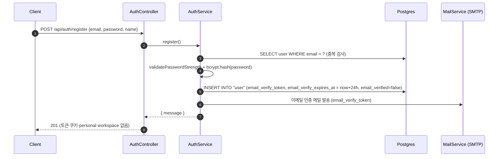
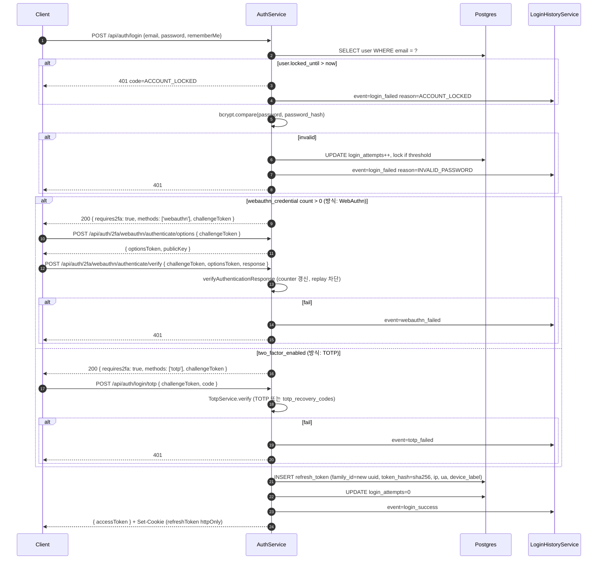
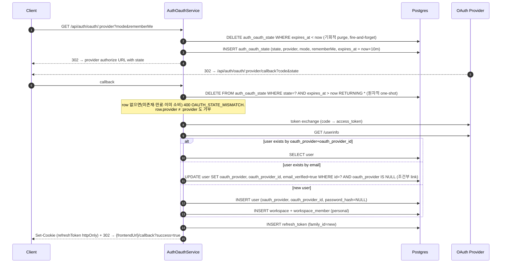
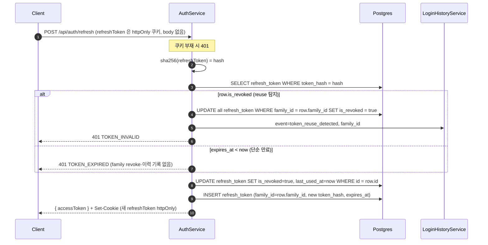
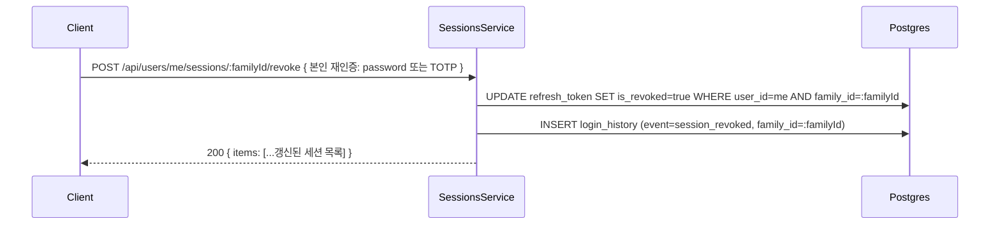
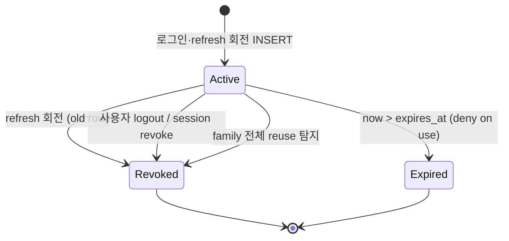

# Data Flow: 인증 (Auth)

> 관련 spec: [Spec 인증](../5-system/1-auth.md) · [데이터 모델 §2.1, §2.18.1, §2.18.2](../1-data-model.md) · [data-flow 개요](./0-overview.md)

---

## Overview

### System role

사용자 신원 확인과 세션 발급을 책임진다. 로컬 이메일/비밀번호, OAuth 소셜 로그인, 2FA(WebAuthn 우선·TOTP fallback),
초대 토큰 가입을 단일 진입점으로 통합한다. JWT access token + 회전 가능한 refresh token (`family_id`
단위 세션) 모델을 사용하며, 모든 인증 이벤트는 `login_history` 에 시간순으로 기록된다.

코드 진입점:

- `codebase/backend/src/modules/auth/auth.controller.ts` — `/api/auth/*` REST 진입
- `codebase/backend/src/modules/auth/auth.service.ts` — register / login / refresh / logout
- `codebase/backend/src/modules/auth/auth-oauth.service.ts` — OAuth state 발급·콜백
- `codebase/backend/src/modules/auth/sessions.service.ts` — 활성 세션 목록·revoke
- `codebase/backend/src/modules/auth/login-history.service.ts` — 이벤트 적재
- `codebase/backend/src/modules/auth/webauthn/webauthn.controller.ts` — WebAuthn 2FA 등록·인증·복구 코드
- `codebase/backend/src/modules/auth/jobs/login-history-pruner.service.ts` — login_history 보존 배치 (§2.2)

---

## 1. Source → Sink

### 1.1 회원가입 (로컬)

> 로컬 회원가입은 2단계다 — `register` 는 user row + 인증 메일만 만들고 토큰을 발급하지 않는다.
> personal workspace 생성과 토큰·`Set-Cookie` 는 이후 `POST /api/auth/verify-email` 단계에서 일어난다
> (`auth.service.ts` `verifyEmail` 트랜잭션이 `createPersonalWorkspace` 호출 + `generateTokens`).
> 예외: `invitationToken` 동봉 가입은 인증 메일 없이 한 트랜잭션에서 user + workspace_member(초대된 팀) 를
> 만들고 자동 로그인 — 응답은 `{ message, accessToken }` + Refresh Token 쿠키이며 personal workspace 는
> 만들지 않는다.

### 1.2 로그인 (Local + 2FA: WebAuthn 우선 / TOTP)

응답 필드: 성공 응답 body 는 `{ accessToken }` 뿐이다 — refresh token 은 httpOnly 쿠키로만 내려가고 `user` 객체는 포함되지 않는다 (`auth.controller.ts` `login`). 2FA 활성 계정의 challenge 단계 응답은 `{ requires2fa, methods, challengeToken }` 이며, 클라이언트는 `requires2fa=true` 이면 challenge 단계로 보고 `methods[0]` 으로 WebAuthn / TOTP 화면을 분기. 상세 분기 규칙은 [auth spec §1.4.2](../5-system/1-auth.md#142-로그인-시-인증-방식-선택--webauthn-우선-totp-fallback-자동-금지).

> WebAuthn 인증기를 쓸 수 없는 사용자는 `POST /api/auth/2fa/webauthn/recovery` 로 등록 시 발급된
> 복구 코드를 제출해 2FA 를 통과한다 (`webauthn/webauthn.controller.ts`). verify 단계에서 authenticator
> counter 역행(clone 징후)이 감지되면 해당 credential row 를 즉시 삭제하고 `login_history.event=webauthn_failed`
> 를 기록한다 (`webauthn/webauthn.service.ts` `verifyAuthentication`).

### 1.3 OAuth 소셜 로그인

> OAuth 콜백은 access token 을 URL 에 싣지 않는다 (history/Referer/프록시 로그 노출 방지, decision A 2026-05-31). refresh token 만 httpOnly 쿠키로 설정하고 프론트 `/callback` 페이지가 `POST /api/auth/refresh` 로 access token 을 발급받는다. 실패 시 `{frontendUrl}/callback?error={code}` 로 리다이렉트.
>
> email 매칭 link 는 `oauth_provider IS NULL` 조건부 UPDATE 라 이미 다른 provider 에 바인딩된 계정을 덮어쓰지 않으며, link 시 `email_verified=true` 와 avatarUrl 도 함께 세팅한다 (`auth-oauth.service.ts` `resolveUser`). 신규 user 경로는 동시 첫 callback 이 unique index 에 충돌(23505)하면 승자가 만든 row 를 재조회해 복구한다. (참고, infra-trivial) `OAUTH_STUB_MODE` — dev/test 한정으로 provider token/userinfo 호출을 스텁으로 대체한다.

### 1.4 Refresh token 회전

> reuse 탐지(family 전체 revoke + `token_reuse_detected` 기록)는 `is_revoked=true` 토큰의 재사용 시에만
> 발동한다. 단순 만료는 부작용 없이 401 `TOKEN_EXPIRED` 만 반환 (`auth.service.ts` `refresh`).

### 1.5 세션 revoke (사용자 본인)

> revoke 는 `SessionsController` (`@Controller('users/me')`) 의 `POST sessions/:familyId/revoke` 다 — DELETE 대신 POST 를 쓰는 이유는 일부 CDN/프록시가 DELETE 바디(재인증 자격)를 제거하기 때문 (`sessions.controller.ts`). 응답은 204 가 아니라 200 + 갱신된 세션 목록. 같은 컨트롤러에 `POST sessions/revoke-others` (다른 세션 일괄 종료) 도 있다.
>
> 세부 규칙 (`sessions.service.ts`): 현재 요청의 refreshToken 쿠키와 매칭되는 family 는 self-revoke 차단
> (400 `CANNOT_REVOKE_CURRENT_SESSION` — 로그아웃 사용 유도). 재인증 수단이 전혀 없는 사용자
> (OAuth-only: password_hash 없음 + 2FA 미설정) 는 403 `REAUTH_NOT_AVAILABLE`. 타인/미존재 family 는
> 동일하게 404 (정보 누출 방지).
>
> 읽기 경로: 같은 컨트롤러의 `GET /api/users/me/sessions` 가 활성 세션을 family 단위로 반환하며 요청
> 쿠키와 매칭되는 family 에 `isCurrent=true` 를 표시한다. `GET /api/users/me/login-history` 는 본인의
> 인증 이벤트를 시간 역순으로 커서 페이징(`timestamp|id`) 반환한다 (보존 180일, §2.2 pruner 참조).

### 1.6 로그아웃

`POST /api/auth/logout` (`auth.controller.ts` `logout` → `auth.service.ts` `logout`):

1. 요청의 refreshToken 쿠키를 sha256 으로 조회. 쿠키가 없어도 200 (idempotent).
2. row 가 있으면 단일 토큰이 아니라 **family 전체** 를 `is_revoked=true` 로 revoke.
3. `login_history.event=logout` (family_id 포함) 기록.
4. 응답에서 refreshToken 쿠키 제거 (`clearRefreshTokenCookie`).

### 1.7 비밀번호 재설정 · 이메일 보조 엔드포인트

`auth.controller.ts` / `auth.service.ts` (`forgotPassword` / `resetPassword` / `resendVerification` / `checkEmail`):

1. `POST /api/auth/forgot-password` (IP 당 5 req/min) — user 가 존재하면 reset 토큰(30분 유효) 을 발급해
   `password_reset_token` (sha256 해시) 으로 저장하고 SMTP 로 발송. **DB/메일 오류 포함 모든 실패를
   swallow** 하고 존재 여부와 무관하게 동일 응답을 반환한다 (enumeration 방지).
2. `POST /api/auth/reset-password` — 토큰 검증 + 비밀번호 강도 검증 후 `password_hash` 갱신, reset 토큰
   필드 무효화, **해당 사용자의 refresh_token 전체 revoke** (모든 세션 강제 로그아웃).
3. `POST /api/auth/resend-verification` (5 req/min) — 미인증 계정에 24h 유효 인증 토큰을 재발급·재발송.
   forgot-password 와 동일한 enumeration 방지 정책 (항상 동일 응답).
4. `POST /api/auth/check-email` (5 req/min) — 가입 전 이메일 사용 가능 여부 `{ available }` 반환.

---

## 2. Schema 매핑

> 컬럼 정의의 단일 진실은 `spec/1-data-model.md` 와 `codebase/backend/src/modules/users/entities/user.entity.ts`,
> `codebase/backend/src/modules/auth/entities/*.entity.ts`. 본 표는 흐름에서 read/write 되는 컬럼만 발췌.

### 2.1 Postgres

| Sink (table) | 흐름 | read/write 컬럼 | 인덱스 / 제약 |
| --- | --- | --- | --- |
| `user` | 회원가입 | INSERT `email, password_hash, name, locale, theme, email_verify_token, email_verify_expires_at, created_at` | `email UNIQUE` (V001) |
| `user` | 로그인 실패 카운트 | UPDATE `login_attempts, locked_until` | — |
| `user` | OAuth 첫 연결 | UPDATE `oauth_provider, oauth_provider_id` | — |
| `user` | TOTP 2FA on/off | UPDATE `two_factor_enabled, two_factor_secret, totp_recovery_codes` | — |
| `user` | WebAuthn 복구 코드 발급/소진/재발급 | UPDATE `webauthn_recovery_codes` | — |
| `webauthn_credential` | Passkey 등록 / 이름 수정 / 삭제 / 인증 | INSERT(register/verify), UPDATE counter/last_used_at/device_name, DELETE(개별) | `credential_id UNIQUE`, `(user_id)` |
| `refresh_token` | 로그인·refresh | INSERT `user_id, token_hash, family_id, is_revoked=false, expires_at, device_label, user_agent, ip_address` | `token_hash UNIQUE`, `(user_id, family_id) WHERE is_revoked=false` (V040 metadata) |
| `refresh_token` | refresh 회전 | UPDATE `is_revoked=true, last_used_at, last_used_ip` (old row) + INSERT new row | — |
| `refresh_token` | reuse 탐지 | UPDATE `is_revoked=true` for entire `family_id` | — |
| `auth_oauth_state` | OAuth start | INSERT `state, provider, mode, remember_me, expires_at = now+10m` | `state UNIQUE` (V013) |
| `auth_oauth_state` | OAuth callback | DELETE WHERE `state=? AND expires_at > now` RETURNING (원자적 one-shot) | — |
| `login_history` | 모든 이벤트 | INSERT `user_id, email, event, ip_address, user_agent, device_label, family_id, failure_reason, created_at` | `(user_id, created_at DESC)`, `(email, created_at DESC)` (V040) |
| `workspace` | 회원가입 (이메일 검증 단계) | INSERT `name, type='personal', owner_id, slug` | `slug UNIQUE` (V001) |
| `workspace_member` | 회원가입 | INSERT `workspace_id, user_id, role='owner', joined_at` | `(workspace_id, user_id) UNIQUE` |

### 2.2 Redis

Auth 도메인은 BullMQ repeatable scheduler 큐 **`login-history-pruner`** 1개를 등록·구동한다
(`auth.module.ts` `BullModule.registerQueue`, `jobs/login-history-pruner.service.ts`):

- 매일 03:00 Asia/Seoul (`upsertJobScheduler` pattern `0 3 * * *`, 명시적 tz) 에 180일을 넘긴
  `login_history` 행을 배치 루프로 삭제 (`login-history.service.ts` `pruneOlderThanRetention`, `RETENTION_DAYS=180`).
- 옛 `@Cron` 인메모리 타이머는 replica 마다 독립 발화해 중복 실행됐기에 BullMQ Redis 중앙 스케줄로
  이관 — 멀티 인스턴스에서도 전역 1회만 실행된다.

Login rate limit 은 Redis 가 아니라 `@nestjs/throttler` **in-memory** 카운터로 이미 구현돼 있다:

| 범위 | 한도 | 위치 |
| --- | --- | --- |
| 전역 (모든 API) | IP 당 100 req/min (`NODE_ENV=test` 만 skip) | `app.module.ts` `ThrottlerModule.forRoot` |
| `register` · `login` | IP 당 10 req/min (W-47) | `auth.controller.ts` `@Throttle` |
| `forgot-password` · `resend-verification` · `check-email` | IP 당 5 req/min | `auth.controller.ts` |
| `sessions/:familyId/revoke` / `sessions/revoke-others` | IP 당 10 / 5 req/min | `sessions.controller.ts` |

IP 단위 throttle 은 계정 잠금(5회 실패 → 10분, §3.2)과 별개의 이중 방어다 — 한 IP 가 여러 계정을
순회하는 credential stuffing 은 throttle 이 먼저 막고, 분산 IP 의 단일 계정 공격은 계정 잠금이 막는다.

### 2.3 외부

| Sink | 흐름 | 비고 |
| --- | --- | --- |
| SMTP (MailService) | 이메일 인증·비밀번호 reset·초대 메일 | `codebase/backend/src/modules/mail/mail.service.ts` |
| OAuth provider | authorize / token / userinfo | Google·GitHub. 셀프 호스팅은 LDAP/SAML 추가 가능 (`spec/5-system/1-auth.md §1.3`) |

---

## 3. 상태 전이

### 3.1 `refresh_token.is_revoked`

### 3.2 `user.locked_until` (계정 잠금)

| 조건 | 동작 |
| --- | --- |
| 연속 로그인 실패 5회 (`login_attempts >= 5`) | `locked_until = now + 10m` (`users.service.ts`) |
| `locked_until > now` 인 상태에서 로그인 시도 | 401 (`UnauthorizedException`) code=`ACCOUNT_LOCKED` + `login_history.event=login_failed reason=ACCOUNT_LOCKED` |
| 로그인 성공 | `login_attempts = 0`, `locked_until = NULL` |

### 3.3 OAuth state TTL

| 단계 | 동작 |
| --- | --- |
| `/start` | INSERT `expires_at = now + 10m`. one-shot. 매 호출마다 만료 row 를 fire-and-forget `purgeExpired()` 로 기회적 삭제. |
| `/callback` | 단일 원자 쿼리 `DELETE ... WHERE state=? AND expires_at > now RETURNING *` — 만료·이미 소비된 state 는 같은 쿼리에서 거부되고, 동시 callback 은 한쪽만 row 를 얻는다. |
| TTL 경과 | 별도 정기 배치 없음 — next `/start` 의 기회적 purge 또는 callback 시점 거부로 정리. |

---

## 4. 외부 의존

| 의존 | 방향 | 참고 |
| --- | --- | --- |
| OAuth provider (Google·GitHub 등) | 외부 → 내부 (callback) | `auth-oauth.service.ts` |
| SMTP | 내부 → 외부 | 이메일 인증·비밀번호 reset·초대 메일 |
| Workspace 도메인 | 내부 cross-ref | 신규 가입 시 personal workspace 자동 생성. 상세: [`workspace.md`](./12-workspace.md) |
| Audit 도메인 | 내부 cross-ref | 워크스페이스 컨텍스트가 있는 인증 액션은 `audit_log`, 사용자 컨텍스트만 있는 이벤트는 `login_history`. 상세: [`audit.md`](./1-audit.md) |

---

## Rationale

### Refresh token 의 `family_id` 단위 세션

`refresh_token.family_id` 는 회전 시에도 유지되어 "디바이스 세션" 을 식별한다. 사용자에게 노출되는
활성 세션 목록은 family 단위로 가장 최신 row 의 메타데이터를 보인다. 회전 중 reuse 가 감지되면 family
전체를 revoke 해 도난 토큰의 영향 범위를 family 로 한정한다.

### `login_history` 와 `audit_log` 분리

`audit_log` 는 워크스페이스 컨텍스트가 있는 리소스 변경을 기록한다. 로그인·로그아웃·2FA 실패는 워크스페이스
없이도 발생하므로 별도 `login_history` 에 보관해 사용자 본인이 직접 조회한다 (180일 보존).

### OAuth state 의 one-shot DELETE

CSRF 와 replay 방지를 위해 `auth_oauth_state` 는 callback 한 번에 소비된다 — 두 쿼리 트랜잭션이 아닌
단일 원자 쿼리(`DELETE ... RETURNING`)를 쓰는 이유는 동시 callback 경합에서도 정확히 한 요청만 state 를
얻게 하기 위해서다. 별도 정기 TTL 배치를 두지 않는 이유는 row 수가 매우 적고 (10분 TTL × 동시 OAuth
시도 수) 매 `/start` 의 기회적 purge 만으로 충분하기 때문이다.
