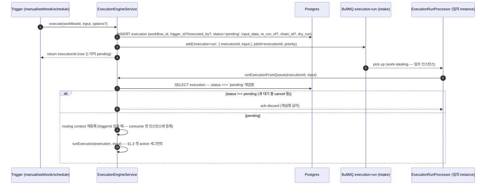
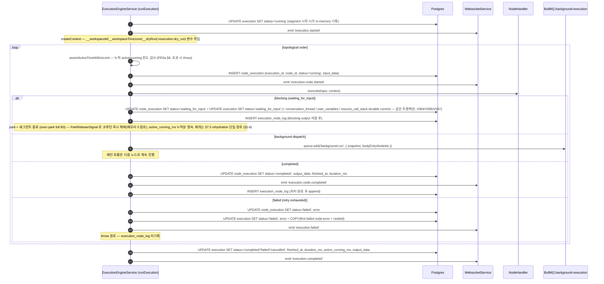
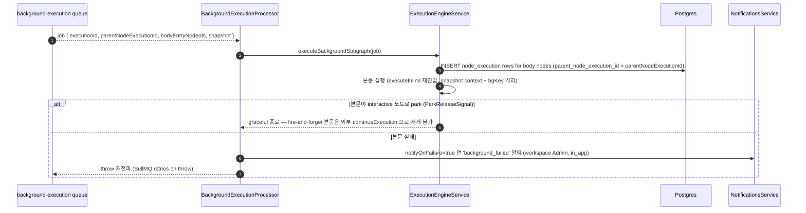
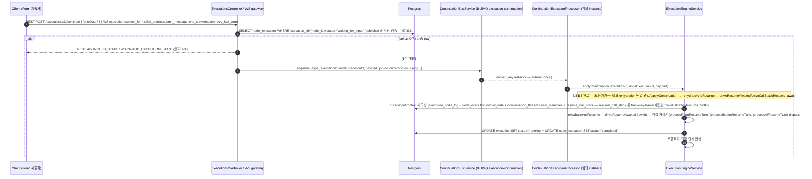
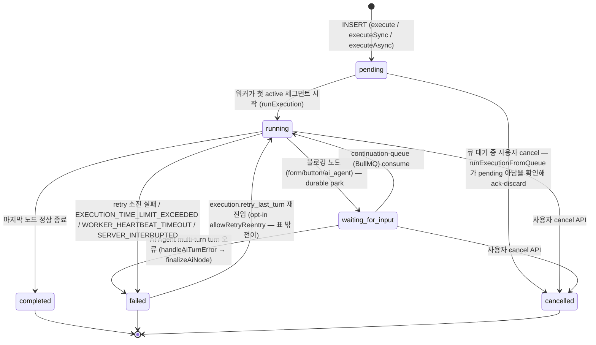
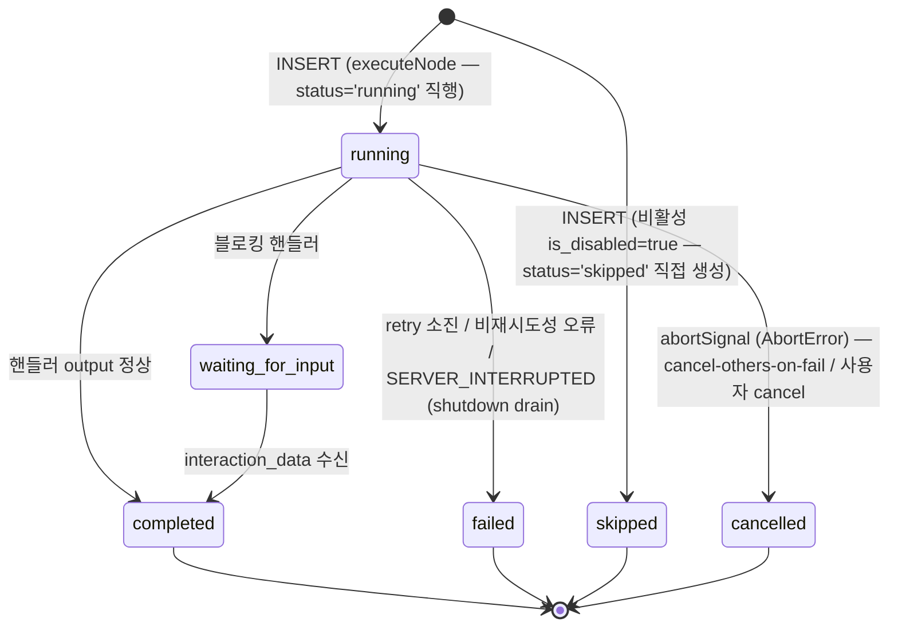

# Data Flow: 실행 엔진 (Execution)

> 관련 spec: [Spec 실행 엔진](../5-system/4-execution-engine.md) · [Spec 표현식 언어](../5-system/5-expression-language.md) · [데이터 모델 §2.13~§2.14](../1-data-model.md) · [data-flow 개요](./0-overview.md)

---

## Overview

### System role

워크플로우 한 번의 실행을 오케스트레이션한다. 트리거 (수동·웹훅·스케줄) 로부터 시작되어
`execution-run` intake 큐 (BullMQ) 를 거쳐 임의 인스턴스의 워커가 노드 그래프를 토폴로지 순서로
순회하면서, 각 노드 핸들러를 invoke 하고 결과를 Postgres / Redis / WebSocket 에 반영한다.
Background 노드 본문과 폼·버튼 재개 신호는 별도 BullMQ 큐로 분리된다.

코드 진입점:

- `codebase/backend/src/modules/execution-engine/execution-engine.service.ts` — `execute / runExecutionFromQueue / runExecution / executeInline / executeSync / executeAsync`
- `codebase/backend/src/modules/execution-engine/queues/execution-run.queue.ts` — `EXECUTION_RUN_QUEUE` (intake 큐 — [Spec 실행 엔진 §4](../5-system/4-execution-engine.md#4-worker-모델))
- `codebase/backend/src/modules/execution-engine/queues/execution-run.processor.ts` — intake 큐 consumer (`runExecutionFromQueue` 위임)
- `codebase/backend/src/modules/execution-engine/queues/background-execution.queue.ts` — `BACKGROUND_EXECUTION_QUEUE`
- `codebase/backend/src/modules/execution-engine/queues/background-execution.processor.ts` — 큐 consumer (본문 실행 + 실패 알림 발송)
- `codebase/backend/src/modules/execution-engine/continuation/continuation-bus.service.ts` — 폼·버튼 인터랙션 깨우기 (BullMQ `execution-continuation` 큐 — [Spec 실행 엔진 §7.4 / §7.5](../5-system/4-execution-engine.md#74-분산-실행-multi-instance))
- `codebase/backend/src/modules/execution-engine/state/state-machine.ts` — Execution 상태 전이 (`ALLOWED_TRANSITIONS` — NodeExecution 전이 표는 별도 코드 없음)
- `codebase/backend/src/modules/execution-engine/shutdown/shutdown-state.service.ts` — graceful shutdown drain (`SERVER_INTERRUPTED` 마킹)

---

## 1. Source → Sink

### 1.1 실행 시작 — `execution-run` intake 큐

`execute()` 는 실행을 **직접 시작하지 않는다**. Execution row 를 `pending` 으로 저장하고
intake 큐에 job 을 발행한 뒤 executionId 를 즉시 반환한다 (타이밍 계약 — 반환 직후 실행이
곧바로 시작된다는 보장 없음). 첫 active 세그먼트는 임의 인스턴스의 워커가 work-stealing 으로
처리한다 ([Spec 실행 엔진 §4.1~4.3](../5-system/4-execution-engine.md#41-아키텍처-target--execution-level-intake-큐)).

- **jobId = executionId** — Execution 생성당 정확히 1회 enqueue 이므로 BullMQ 가 동일 jobId 중복 add 를 자동 dedup 한다 (`buildExecutionRunJobId`).
- **priority** — `manual(1) > webhook(2) > schedule(3)` (`EXECUTION_RUN_PRIORITY`). 단 현재 `ExecuteOptions` 가 trigger type 을 싣지 않아 실제로는 manual > 그 외 이분 (schedule 도 webhook 우선순위 — 의도된 임시 처리, PR2 triggerType threading 후속).
- **attempts: 1, maxStalledCount: 0** — crash-retry 미도입 (PR1). stalled 재배달이 비멱등 노드를 이중 실행하지 않도록 차단하며, crash 로 orphan 된 RUNNING row 는 §3.3 회수가 담당.
- 워커는 park 가 세그먼트를 종료하므로 첫 active 세그먼트 (시작 → 첫 BLOCK/완료) 만 await 한다 — BullMQ job 이 park 내내 점유되지 않는다.

### 1.2 첫 active 세그먼트 — `runExecution` 토폴로지 루프

- **`execution_node_log` 는 진입 로그가 아니라 처리 완료 로그다** — `appendExecutionPath` 호출 지점은 핸들러 실행이 끝난 뒤 (COMPLETED 마감 또는 blocking output 저장 후) 단 한 곳이며, 노드가 throw 해 catch 로 빠지면 기록되지 않는다. §1.4 rehydration 이 이 로그를 "실행된 노드 집합" 으로 재생하는 의미론과 정합.
- **누적 active-running 타임아웃 (PR2a)** — `updateExecutionStatus` 가 RUNNING 진입/이탈마다 세그먼트 시간을 `execution.active_running_ms` 에 적산하고, dispatch loop 가 노드 사이마다 `assertActiveTimeWithinLimit` 를 호출한다. 누적 (영속분 + 진행 중 세그먼트 경과분) 이 한도 (`EXECUTION_MAX_ACTIVE_RUNNING_MS`, 기본 30분, `0`=무제한 — `execution-limits.ts`) 이상이면 `ExecutionTimeLimitError` throw → `error.code='EXECUTION_TIME_LIMIT_EXCEEDED'` 로 failed 마감. `waiting_for_input` park 시간은 RUNNING 이 아니므로 누적에서 자연 제외 (불변식).
- 각 NodeExecution 은 try 첫 줄에서 `ShutdownStateService.registerInFlight` 로 등록되고 finally 에서 해제된다 — SIGTERM drain 의 추적 대상 (§3.3).
- 비활성 (`is_disabled`) 노드는 status='skipped' 로 **직접 INSERT** 된다 (running 경유 없음 — §3.2).

### 1.3 Background 본문 실행 (별도 큐 consumer)

- `background_failed` 알림 발송 주체는 엔진이 아니라 **`BackgroundExecutionProcessor.process` 의 catch** 다 (`dispatchFailureNotification` — sanitize 된 error message 포함). 본문 실패는 메인 Execution status 를 바꾸지 않는다 (격리).
- Processor 는 `background:run:<id>` WS 채널로 `execution.background_run.started / completed` 이벤트도 발행한다 (모니터링 — [Background 노드 §8.5](../4-nodes/1-logic/12-background.md)).

### 1.4 폼·버튼 인터랙션으로 재개

> 재개 진입 surface 는 두 가지다: (1) REST `POST /executions/:id/continue` — body `{ formData? }` 만 받으며, waiting 아님이면 동기 422 `INVALID_STATE` (`executions.controller.ts` `continueExecution`); (2) WebSocket 메시지 `execution.submit_form` / `execution.click_button` / `execution.submit_message` / `execution.end_conversation` / `execution.retry_last_turn` (각 `<event>.ack` 응답, `websocket.gateway.ts`). `type` / `nodeExecutionId` / `payload` 는 클라이언트가 직접 보내는 필드가 아니라 publisher 가 `node_execution` lookup 후 구성해 `execution-continuation` 큐에 싣는 내부 ContinuationMessage 필드다.
> Publisher 측 사전 검증 (REST 422 `INVALID_STATE` / WS `INVALID_EXECUTION_STATE` 동기 ack) 의 상세 분류는 [실행 엔진 §7.5.1](../5-system/4-execution-engine.md#751-publisher-측-사전-검증--invalid_execution_state) 참조. rehydration 슬로우 패스의 실패 (`RESUME_CHECKPOINT_MISSING` / `RESUME_INCOMPATIBLE_STATE` / `RESUME_FAILED`) 는 후행 `EXECUTION_CANCELLED` 이벤트로 surface.

### 1.5 Sub-workflow 호출 (Workflow 노드 = flow.workflow)

| 모드 | 구현 |
| --- | --- |
| **동기** (`executeSync`) | 자식 Execution row 를 `pending` 으로 INSERT (`parent_execution_id = parent.id`, `recursion_depth = parent + 1`) 한 뒤 **`runExecution` 을 직접 await** — intake 큐를 타지 않는다. `timeoutMs` (기본 300초, `0`=무제한) 와 `Promise.race`. timeout 후 reload → 상태 비교로 TOCTOU 보호. |
| **비동기** (`executeAsync` — fire-and-forget) | 부모는 즉시 다음 노드로. 자식 row INSERT 후 **`runExecution` 을 자체 promise 로 실행** (`.catch` 로그만). 결과는 별도 row 로 관찰 가능. `MAX_RECURSION_DEPTH` 가드. |
| **인라인** (`executeInline`) | sub-workflow 를 **부모 executionId / context 를 공유**해 같은 history timeline 안에서 실행하는 별도 진입점 — Background 본문 (§1.3) 도 이 경로를 재사용한다. 중첩 인라인 안에서 park 하면 호출 체인이 `resume_call_stack` frame 으로 영속되어 §1.4 rehydration 이 frame-by-frame 재진입한다. |

> 메인 워크플로우와 sub-workflow 의 실제 실행 본체는 모두 `runExecution` 이다. `executeInline` 은 "부모 실행 안에서의 인라인 실행" 전용이며 메인 실행 경로의 이름이 아니다.

---

## 2. Schema 매핑

### 2.1 Postgres

| Sink (table) | 흐름 | read/write 컬럼 | 인덱스 / 제약 |
| --- | --- | --- | --- |
| `execution` | 실행 진입 | INSERT `workflow_id, trigger_id?, status='pending', input_data, started_at, executed_by?, parent_execution_id?, recursion_depth, re_run_of?, chain_id?, dry_run` — re_run_of/chain_id 는 re-run chain (decision F2, [Replay/Re-run §9.1](../5-system/13-replay-rerun.md)), dry_run 은 context 변수 `__dryRun` 으로 핸들러에 주입 (V068) | `(workflow_id, started_at DESC)`, `(status)` |
| `execution` | 상태 전이 | UPDATE `status, finished_at, duration_ms, output_data, error, active_running_ms` — active_running_ms 는 RUNNING 이탈마다 적산 (PR2a §8). error 는 최초 failed NodeExecution.error + nodeId 복사 | — |
| `execution` | park 진입 (durable resume) | UPDATE `conversation_thread, user_variables, resume_call_stack` — waiting_for_input 전이와 같은 트랜잭션 commit (V084/V085/V087) | — |
| `node_execution` | 노드 실행 시작 | INSERT `execution_id, node_id, status='running', started_at, input_data, retry_count=0, parent_node_execution_id?` (V006/V012) — skipped 는 status='skipped' 로 직접 INSERT | `(execution_id)`, V034 `(execution_id, node_id, started_at DESC)` composite |
| `node_execution` | 노드 완료 | UPDATE `status, finished_at, duration_ms, output_data, error, retry_count, interaction_data` (V004) | — |
| `execution_node_log` | 노드 **처리 완료 시** | INSERT `execution_id, node_id, created_at` (append-only) — COMPLETED 마감 또는 blocking output 저장 후 기록. throw 경로 미기록 (§1.2) | `(execution_id, id)` (V035). bigserial PK 가 인스턴스 간 결정적 순서 보장 |
| `execution` (legacy column) | — | V001 의 `execution_path UUID[]` 컬럼은 V036 에서 DROP. 현재는 `execution_node_log` 가 진실 | — |

### 2.2 Redis (BullMQ)

| 큐 | producer | consumer | payload 핵심 필드 |
| --- | --- | --- | --- |
| `execution-run` | `ExecutionEngineService.execute` (Execution row `pending` 저장 후 발행) | `ExecutionRunProcessor` → `runExecutionFromQueue` (work-stealing) | `{executionId, input?}` — jobId = executionId (1:1 enqueue dedup), priority manual > 트리거, `attempts:1` / `maxStalledCount:0` / `removeOnFail:false` (`execution-run.queue.ts`). [실행 엔진 §4.1~4.3](../5-system/4-execution-engine.md#41-아키텍처-target--execution-level-intake-큐) |
| `execution-continuation` | `ContinuationBusService.publish` (WS gateway / REST controller 경유) | `ContinuationExecutionProcessor` | `{type, executionId, nodeExecutionId, payload}` — jobId = `${executionId}:${nodeExecutionId}:${seq}` (Redis INCR per executionId — idempotency key). 자세한 라이프사이클은 [Spec 실행 엔진 §7.4 / §7.5](../5-system/4-execution-engine.md#74-분산-실행-multi-instance) |
| `background-execution` | `ExecutionEngineService.scheduleBackgroundBody` | `BackgroundExecutionProcessor` | `executionId, parentNodeExecutionId, backgroundRunId?, workspaceId, workflowId, bodyEntryNodeIds[], input, variables, nodeOutputCache, expressionContext, conversationThread?, config{notifyOnFailure, maxDurationMs}` (`background-execution.queue.ts`). `backgroundRunId?`/`conversationThread?` 는 후방호환용 optional — legacy 큐 메시지엔 부재 |

> **DLQ 모니터**: `execution-continuation` 은 `removeOnFail:false` 라 attempts (`RESUME_BULLMQ_ATTEMPTS`, 기본 3) 소진 job 이 failed (dead-letter) 로 누적된다. `ContinuationDlqMonitorService` (`continuation/continuation-dlq-monitor.service.ts`) 가 failed/delayed depth 를 주기 관측해 임계 초과 시 structured `logger.error` 알람을 cooldown 단위로 발생시킨다 (별도 메트릭 SDK 없이 로그 기반 — 운영 신호).

### 2.3 Redis (보조 키 — 분산 lock & seq)

| 키 패턴 | 용도 | TTL |
| --- | --- | --- |
| `exec:recover:lock` | 부팅 시 `recoverStuckExecutions` 단일 인스턴스 가드 (전역 lock — [실행 엔진 §7.4 / §9.2](../5-system/4-execution-engine.md#74-분산-실행-multi-instance)) | 60초 |
| `exec:cont:seq:<executionId>` | continuation publish 의 monotonic seq (Redis INCR) — BullMQ jobId 의 idempotency 보장 | sliding-window TTL — `CONTINUATION_SEQ_TTL_SECONDS` (기본 24시간), 매 publish 갱신 → executionId 종결 후 자연 소멸 ([실행 엔진 §9.2](../5-system/4-execution-engine.md#92-용도별-키-정의-및-ttl)) |

> Continuation 신호는 BullMQ 큐 `execution-continuation` 로 전달된다 (이전 Redis pub/sub 채널 `execution:<executionId>` 는 폐기). 결정 근거는 [실행 엔진 §Rationale "Durable Continuation"](../5-system/4-execution-engine.md#rationale).

### 2.4 WebSocket

| Event | 발행 시점 | 구독 room |
| --- | --- | --- |
| `execution.started/completed/failed/cancelled` | execution 상태 전이 | `workflow:<id>` 또는 `execution:<id>` |
| `execution.node.started/completed/failed/cancelled/skipped`, `execution.waiting_for_input` | node_execution 상태 전이 | 동일 |
| `execution.snapshot` | client connect 시 server push | 동일 |
| `execution.background_run.started/completed` | Background 본문 시작/종료 (§1.3) | `background:run:<id>` |

> 이벤트 이름의 정본은 `spec/5-system/6-websocket-protocol.md §Server → Client 이벤트 매핑` 표 (dot 표기). 위는 요약이며 충돌 시 그 표가 우선한다. Room 이름(`workflow:<id>`/`execution:<id>`)은 socket.io room 네임스페이스로 이벤트명과 별개다.
> Emit 은 모두 `WebsocketService` (단일 sink) 를 거친다 (`spec/5-system/4-execution-engine.md §4.4`).

---

## 3. 상태 전이

### 3.1 `execution.status`

`running → failed` 의 사유별 `error.code`:

| error.code | 발생 경로 |
| --- | --- |
| (노드 오류 복사) | 어떤 노드든 retry 소진 실패 — 최초 failed NodeExecution.error + nodeId 복사 (§1.2) |
| `EXECUTION_TIME_LIMIT_EXCEEDED` | PR2a 누적 active-running 타임아웃 — 노드 사이 `assertActiveTimeWithinLimit` 검사 (§1.2) |
| `WORKER_HEARTBEAT_TIMEOUT` | 부팅 시 stale RUNNING 회수 (§3.3) |
| `SERVER_INTERRUPTED` | SIGTERM graceful shutdown grace 초과 (§3.3) |

상세 가드는 `spec/5-system/4-execution-engine.md §1` 및 `state-machine.ts` (`ALLOWED_TRANSITIONS` — `PENDING → CANCELLED` 포함). `failed → running` 은 일반 표에 없고 `applyRetryLastTurn` 경로의 `allowRetryReentry` opt-in 으로만 허용된다 (`state-machine.ts` `canTransition`).

### 3.2 `node_execution.status`

> `pending` 은 엔티티 default 값일 뿐 어떤 엔진 경로도 사용하지 않는다 — 엔진은 node_execution 을 처음부터 `status='running'` (또는 skip 시 `'skipped'`) 으로 INSERT 한다 (`createNodeExecution` 호출부). NodeExecution 에는 Execution 의 `ALLOWED_TRANSITIONS` 같은 코드 레벨 전이 표가 없으며, 위 다이어그램은 엔진 코드 경로의 관찰 요약이다.

### 3.3 비정상 종료 회수 — stale heartbeat + graceful shutdown

비정상 종료된 실행을 `failed` 로 마감하는 소스는 두 가지다. 둘 다 `WAITING_FOR_INPUT` 은 절대 건드리지 않는다 — 사용자 입력은 며칠 후 도착할 수 있고 노드별 `formConfig.timeout` 이 별도 적용되며, 입력 도착 시 §1.4 rehydration 으로 자연 재개된다.

| 소스 | 시점 | 대상 | 마킹 |
| --- | --- | --- | --- |
| `recoverStuckExecutions` | `onApplicationBootstrap` 1회 (`exec:recover:lock` 단일 인스턴스 가드) | `status='running' AND started_at < now() - 30분` (`STUCK_RECOVERY_STALE_MS` — worker heartbeat timeout). 다른 인스턴스가 정상 처리 중인 신규 running 은 보존 | 단일 atomic UPDATE — `failed` + `error.code='WORKER_HEARTBEAT_TIMEOUT'`. **node_execution 정리는 수행하지 않는다** |
| `ShutdownStateService.onApplicationShutdown` | SIGTERM 수신 시 | `registerInFlight` 로 **본 인스턴스가 추적 중인** NodeExecution/Execution 만 (`WHERE id IN (...)`) — grace (`SIGTERM_GRACE_MS`, 기본 30초) 동안 drain 대기 후 잔여분 | NodeExecution + Execution 각각 atomic UPDATE — `failed` + `error.code='SERVER_INTERRUPTED'`. shutdown 중 신규 실행은 503 + Retry-After 거부 |

---

## 4. 외부 의존

| 의존 | 방향 | 참고 |
| --- | --- | --- |
| Trigger 도메인 | 진입 | [`triggers.md`](./10-triggers.md) — webhook / schedule / manual |
| LLM Usage 도메인 | AI 노드 호출 시 | LLM 호출 후 `llm_usage_log` 적재. [`llm-usage.md`](./7-llm-usage.md) |
| Integration 도메인 | http_request / database_query / send_email 노드 | credentials 해석. [`integration.md`](./5-integration.md) |
| Knowledge Base 도메인 | AI Agent 의 KB 도구 호출 | RAG 검색 진입. [`knowledge-base.md`](./6-knowledge-base.md) |
| Notifications 도메인 | execution_failed / background_failed | [`notifications.md`](./8-notifications.md) |
| WebSocket | 모든 상태 전이 emit | 단일 sink |

---

## Rationale

### fire-and-forget in-process 시작 → `execution-run` intake 큐 (PR1)

본 문서 초기 버전은 `execute()` 가 같은 인스턴스에서 곧바로 실행 루프에 진입하는 fire-and-forget
in-process 모델을 그렸다. 이 모델은 웹훅 버스트 시 backpressure 가 없고, 실행이 항상 요청을 받은
인스턴스에 핀 고정되어 수평 확장이 안 되는 문제가 있었다. PR1 (`impl-exec-intake-queue`) 에서
`execute()` 는 row 를 `pending` 으로 저장 + `execution-run` 큐 발행 + 즉시 반환으로 바뀌었고,
첫 active 세그먼트는 임의 인스턴스가 work-stealing 으로 처리한다 (§1.1). per-node task queue 를
채택하지 않고 execution-level 세그먼트 단위로 운반하는 결정의 전체 근거는
[실행 엔진 §Rationale "per-node task queue → execution-level intake 큐"](../5-system/4-execution-engine.md#rationale) 참조.
단, sub-workflow 의 `executeSync`/`executeAsync` 는 여전히 intake 큐를 타지 않는다 — 부모 세그먼트
안에서의 동기 await / 자체 promise 로 충분하고, 큐 hop 은 부모 세그먼트의 latency 만 늘리기 때문 (§1.5).

### `execution.execution_path` 의 DROP (V036)

V001 은 `execution.execution_path UUID[]` 로 노드 실행 순서를 저장했다. 다중 인스턴스 환경에서 이는
read-modify-write 가 직렬화되어야 했고 (배열 append), 충돌과 성능 모두 문제였다. V035 에서 별도
`execution_node_log` 테이블 (`bigserial` PK 가 PostgreSQL sequence 로 단조 증가) 을 도입해
append-only 로 바꿨고 V036 에서 옛 컬럼을 drop 했다. 응답 시 `executionPath: string[]` 필드는
`(execution_id, id) ASC` 정렬 쿼리로 채워진다 (`execution.entity.ts` 주석).

### Background 의 snapshot context

Background 가 실행되는 동안 메인 흐름이 변수를 바꿔도 영향을 주지 않도록, enqueue 시점에 메인의
`variables / nodeOutputCache / expressionContext` 를 얕은 복사로 떠서 페이로드에 담는다
(`background-execution.queue.ts` 주석). consumer 는 이 snapshot 으로 재구성된 context 위에서
`executeBackgroundSubgraph` 를 호출한다.

### Continuation queue = BullMQ 영속 큐

폼 제출·버튼 클릭·AI 메시지 응답은 어느 인스턴스로 들어올지 모른다. 대기 중인 execution 을 깨우려면 인스턴스 간 신호 전달이 필요하다. **BullMQ 영속 큐 `execution-continuation`** 으로 통일한 이유는 at-least-once 의미론 + jobId idempotency key + dead-letter 가 모두 내장이기 때문이다. 인-메모리 resolver 만 쓰던 방식은 k8s 재배포로 컨테이너가 죽으면 fan-out 의 어느 수신자도 resolve 하지 못해 사용자 입력이 silent drop 되는 문제가 있었다. 신호가 영속화되므로 인스턴스가 죽었다가 살아나도 다음 인스턴스가 [Spec 실행 엔진 §7.5](../5-system/4-execution-engine.md#75-resume-after-restart-rehydration) 의 rehydration 경로로 재구성 후 재개한다. 결정 근거 전체는 [실행 엔진 §Rationale "Durable Continuation & Graceful Shutdown"](../5-system/4-execution-engine.md#rationale) 참조.

### 폐기된 서술 (본 문서 이전 버전)

- **"§1.1 메인 워크플로우 실행 (executeInline 경로)"** — 메인 실행 본체는 `runExecution` 이고 `executeInline` 은 부모 context 공유 인라인 실행 전용이다 (§1.5). 용어 정정과 함께 폐기.
- **"recoverStuckExecutions 가 running 잔류 execution 을 발견하면 failed 로 마감하고 stuck node 들도 정리한다"** — 실제 대상은 30분 stale heartbeat row 만이고 node_execution 정리는 수행하지 않는다 (§3.3). 과대 서술 폐기.
- **"execution_node_log: 노드 진입마다 INSERT"** — 처리 완료 시 append 다 (§1.2). rehydration 재생 의미론과 충돌해 폐기.
- **node_execution `[*] → pending → running` 전이** — 엔진은 처음부터 `running` 으로 INSERT 한다. `pending` 은 엔티티 default 전용 (§3.2).
