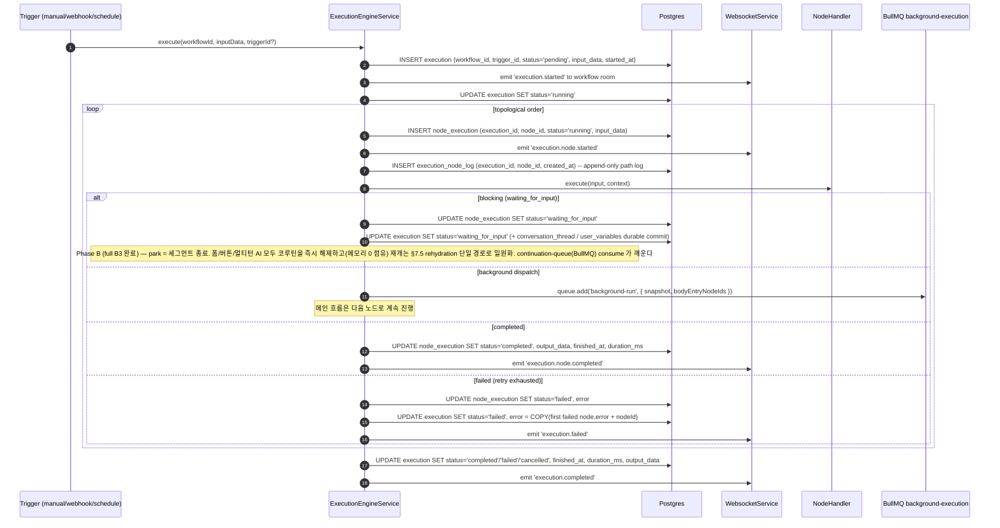
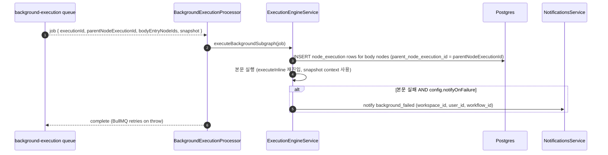
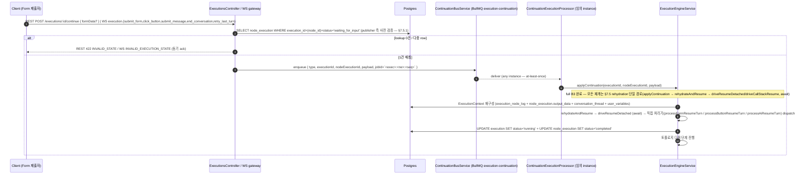
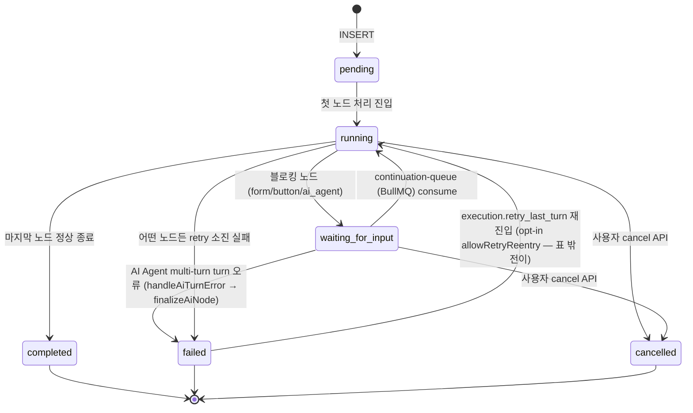
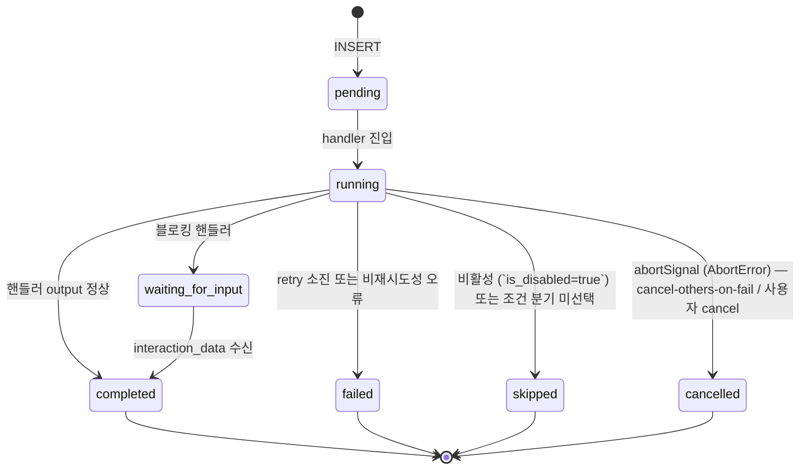

# Data Flow: 실행 엔진 (Execution)

> 관련 spec: [Spec 실행 엔진](../5-system/4-execution-engine.md) · [Spec 표현식 언어](../5-system/5-expression-language.md) · [데이터 모델 §2.13~§2.14](../1-data-model.md) · [data-flow 개요](./0-overview.md)

---

## Overview

### System role

워크플로우 한 번의 실행을 오케스트레이션한다. 트리거 (수동·웹훅·스케줄) 로부터 시작되어 노드 그래프를
토폴로지 순서로 순회하면서, 각 노드 핸들러를 invoke 하고 결과를 Postgres / Redis / WebSocket 에
반영한다. Background 노드와 sub-workflow 호출은 별도 BullMQ 큐로 분리된다.

코드 진입점:

- `codebase/backend/src/modules/execution-engine/execution-engine.service.ts` — `execute / executeInline / executeSync / executeAsync / runExecution`
- `codebase/backend/src/modules/execution-engine/queues/background-execution.queue.ts` — `BACKGROUND_EXECUTION_QUEUE`
- `codebase/backend/src/modules/execution-engine/queues/background-execution.processor.ts` — 큐 consumer
- `codebase/backend/src/modules/execution-engine/continuation/continuation-bus.service.ts` — 폼·버튼 인터랙션 깨우기 (BullMQ `execution-continuation` 큐 — [Spec 실행 엔진 §7.4 / §7.5](../5-system/4-execution-engine.md#74-분산-실행-multi-instance))
- `codebase/backend/src/modules/execution-engine/state/state-machine.ts` — Execution / NodeExecution 상태 전이

---

## 1. Source → Sink

### 1.1 메인 워크플로우 실행 (executeInline 경로)

### 1.2 Background 본문 실행 (별도 큐 consumer)

### 1.3 폼·버튼 인터랙션으로 재개

> 재개 진입 surface 는 두 가지다: (1) REST `POST /executions/:id/continue` — body `{ formData? }` 만 받으며, waiting 아님이면 동기 422 `INVALID_STATE` (`executions.controller.ts` `continueExecution`); (2) WebSocket 메시지 `execution.submit_form` / `execution.click_button` / `execution.submit_message` / `execution.end_conversation` / `execution.retry_last_turn` (각 `<event>.ack` 응답, `websocket.gateway.ts`). `type` / `nodeExecutionId` / `payload` 는 클라이언트가 직접 보내는 필드가 아니라 publisher 가 `node_execution` lookup 후 구성해 `execution-continuation` 큐에 싣는 내부 ContinuationMessage 필드다.
> Publisher 측 사전 검증 (REST 422 `INVALID_STATE` / WS `INVALID_EXECUTION_STATE` 동기 ack) 의 상세 분류는 [실행 엔진 §7.5.1](../5-system/4-execution-engine.md#751-publisher-측-사전-검증--invalid_execution_state) 참조. rehydration 슬로우 패스의 실패 (`RESUME_CHECKPOINT_MISSING` / `RESUME_INCOMPATIBLE_STATE` / `RESUME_FAILED`) 는 후행 `EXECUTION_CANCELLED` 이벤트로 surface.

### 1.4 Sub-workflow 호출 (Workflow 노드 = flow.workflow)

| 모드 | 구현 |
| --- | --- |
| **동기** (`executeSync`) | 부모 실행이 차일드 완료를 await. 차일드 `execution.parent_execution_id = parent.id`, `recursion_depth = parent + 1`. 같은 노드 처리 루프 안에서 동작. |
| **비동기** (`executeAsync` — fire-and-forget) | 부모는 즉시 다음 노드로. 차일드는 같은 `executeInline` 진입점을 자체 promise 로 실행. 결과는 별도 row 로 관찰 가능. |

---

## 2. Schema 매핑

### 2.1 Postgres

| Sink (table) | 흐름 | read/write 컬럼 | 인덱스 / 제약 |
| --- | --- | --- | --- |
| `execution` | 실행 진입 | INSERT `workflow_id, trigger_id?, status='pending', input_data, started_at, executed_by?, parent_execution_id?, recursion_depth` | `(workflow_id, started_at DESC)`, `(status)` |
| `execution` | 상태 전이 | UPDATE `status, finished_at, duration_ms, output_data, error` | error 는 최초 failed NodeExecution.error + nodeId 복사 |
| `node_execution` | 노드 실행 시작 | INSERT `execution_id, node_id, status='running', started_at, input_data, retry_count=0, parent_node_execution_id?` (V006/V012) | `(execution_id)`, V034 `(execution_id, node_id, started_at DESC)` composite |
| `node_execution` | 노드 완료 | UPDATE `status, finished_at, duration_ms, output_data, error, retry_count, interaction_data` (V004) | — |
| `execution_node_log` | 노드 진입마다 | INSERT `execution_id, node_id, created_at` (append-only) | `(execution_id, id)` (V035). bigserial PK 가 인스턴스 간 결정적 순서 보장 |
| `execution` (legacy column) | — | V001 의 `execution_path UUID[]` 컬럼은 V036 에서 DROP. 현재는 `execution_node_log` 가 진실 | — |

### 2.2 Redis (BullMQ)

| 큐 | producer | consumer | payload 핵심 필드 |
| --- | --- | --- | --- |
| `execution-continuation` | `ContinuationBusService.publish` (WS gateway / REST controller 경유) | `ContinuationExecutionProcessor` | `{type, executionId, nodeExecutionId, payload}` — jobId = `${executionId}:${nodeExecutionId}:${seq}` (Redis INCR per executionId — idempotency key). 자세한 라이프사이클은 [Spec 실행 엔진 §7.4 / §7.5](../5-system/4-execution-engine.md#74-분산-실행-multi-instance) |
| `background-execution` | `ExecutionEngineService.scheduleBackgroundBody` | `BackgroundExecutionProcessor` | `executionId, parentNodeExecutionId, backgroundRunId?, workspaceId, workflowId, bodyEntryNodeIds[], input, variables, nodeOutputCache, expressionContext, conversationThread?, config{notifyOnFailure, maxDurationMs}` (`background-execution.queue.ts`). `backgroundRunId?`/`conversationThread?` 는 후방호환용 optional — legacy 큐 메시지엔 부재 |

### 2.3 Redis (보조 키 — 분산 lock & seq)

| 키 패턴 | 용도 | TTL |
| --- | --- | --- |
| `exec:recover:lock` | 부팅 시 `recoverStuckExecutions` 단일 인스턴스 가드 (전역 lock — [실행 엔진 §7.4 / §9.2](../5-system/4-execution-engine.md#74-분산-실행-multi-instance)) | 60초 |
| `exec:cont:seq:<executionId>` | continuation publish 의 monotonic seq (Redis INCR) — BullMQ jobId 의 idempotency 보장 | sliding-window TTL — `CONTINUATION_SEQ_TTL_SECONDS` (기본 24시간), 매 publish 갱신 → executionId 종결 후 자연 소멸 ([실행 엔진 §9.2](../5-system/4-execution-engine.md#92-용도별-키-정의-및-ttl)) |

> Continuation 신호는 BullMQ 큐 `execution-continuation` 로 전달된다 (이전 Redis pub/sub 채널 `execution:<executionId>` 는 폐기). 결정 근거는 [실행 엔진 §Rationale "Durable Continuation"](../5-system/4-execution-engine.md#rationale).

### 2.4 WebSocket

| Event | 발행 시점 | 구독 room |
| --- | --- | --- |
| `execution.started/completed/failed/cancelled` | execution 상태 전이 | `workflow:<id>` 또는 `execution:<id>` |
| `execution.node.started/completed/failed/cancelled/skipped`, `execution.waiting_for_input` | node_execution 상태 전이 | 동일 |
| `execution.snapshot` | client connect 시 server push | 동일 |

> 이벤트 이름의 정본은 `spec/5-system/6-websocket-protocol.md §Server → Client 이벤트 매핑` 표 (dot 표기). 위는 요약이며 충돌 시 그 표가 우선한다. Room 이름(`workflow:<id>`/`execution:<id>`)은 socket.io room 네임스페이스로 이벤트명과 별개다.
> Emit 은 모두 `WebsocketService` (단일 sink) 를 거친다 (`spec/5-system/4-execution-engine.md §4.4`).

---

## 3. 상태 전이

### 3.1 `execution.status`

상세 가드는 `spec/5-system/4-execution-engine.md §1` 및 `state-machine.ts`. `failed → running` 은 일반 `ALLOWED_TRANSITIONS` 표에 없고 `applyRetryLastTurn` 경로의 `allowRetryReentry` opt-in 으로만 허용된다 (`state-machine.ts` `canTransition`).

### 3.2 `node_execution.status`

### 3.3 Stuck 회수

`ExecutionEngineService.recoverStuckExecutions()` 가 onApplicationBootstrap 에서 1회 실행. 인스턴스
재시작으로 `running` 으로 남은 execution 을 발견하면 `failed` 로 마감하고 stuck node 들도 정리한다.

---

## 4. 외부 의존

| 의존 | 방향 | 참고 |
| --- | --- | --- |
| Trigger 도메인 | 진입 | [`triggers.md`](./10-triggers.md) — webhook / schedule / manual |
| LLM Usage 도메인 | AI 노드 호출 시 | LLM 호출 후 `llm_usage_log` 적재. [`llm-usage.md`](./7-llm-usage.md) |
| Integration 도메인 | http_request / database_query / send_email 노드 | credentials 해석. [`integration.md`](./5-integration.md) |
| Knowledge Base 도메인 | AI Agent 의 KB 도구 호출 | RAG 검색 진입. [`knowledge-base.md`](./6-knowledge-base.md) |
| Notifications 도메인 | execution_failed / background_failed | [`notifications.md`](./8-notifications.md) |
| WebSocket | 모든 상태 전이 emit | 단일 sink |

---

## Rationale

### `execution.execution_path` 의 DROP (V036)

V001 은 `execution.execution_path UUID[]` 로 노드 실행 순서를 저장했다. 다중 인스턴스 환경에서 이는
read-modify-write 가 직렬화되어야 했고 (배열 append), 충돌과 성능 모두 문제였다. V035 에서 별도
`execution_node_log` 테이블 (`bigserial` PK 가 PostgreSQL sequence 로 단조 증가) 을 도입해
append-only 로 바꿨고 V036 에서 옛 컬럼을 drop 했다. 응답 시 `executionPath: string[]` 필드는
`(execution_id, id) ASC` 정렬 쿼리로 채워진다 (`execution.entity.ts:97` 주석).

### Background 의 snapshot context

Background 가 실행되는 동안 메인 흐름이 변수를 바꿔도 영향을 주지 않도록, enqueue 시점에 메인의
`variables / nodeOutputCache / expressionContext` 를 얕은 복사로 떠서 페이로드에 담는다
(`background-execution.queue.ts` 주석). consumer 는 이 snapshot 으로 재구성된 context 위에서
`executeBackgroundSubgraph` 를 호출한다.

### Continuation queue = BullMQ 영속 큐

폼 제출·버튼 클릭·AI 메시지 응답은 어느 인스턴스로 들어올지 모른다. 대기 중인 execution 을 깨우려면 인스턴스 간 신호 전달이 필요하다. **BullMQ 영속 큐 `execution-continuation`** 으로 통일한 이유는 at-least-once 의미론 + jobId idempotency key + dead-letter 가 모두 내장이기 때문이다. 인-메모리 resolver 만 쓰던 방식은 k8s 재배포로 컨테이너가 죽으면 fan-out 의 어느 수신자도 resolve 하지 못해 사용자 입력이 silent drop 되는 문제가 있었다. 신호가 영속화되므로 인스턴스가 죽었다가 살아나도 다음 인스턴스가 [Spec 실행 엔진 §7.5](../5-system/4-execution-engine.md#75-resume-after-restart-rehydration) 의 rehydration 경로로 재구성 후 재개한다. 결정 근거 전체는 [실행 엔진 §Rationale "Durable Continuation & Graceful Shutdown"](../5-system/4-execution-engine.md#rationale) 참조.
