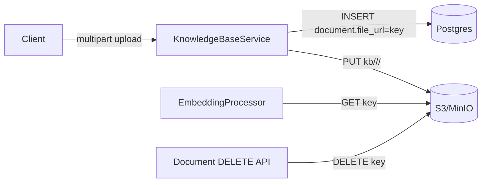

# Data Flow: 파일 저장소 (S3 / MinIO)

> 관련 spec: [Spec 아키텍처 §2.7](../0-overview.md) · [Spec 임베딩 파이프라인](../5-system/8-embedding-pipeline.md) · [data-flow 개요](./0-overview.md)

---

## Overview

### System role

바이너리 / 텍스트 원본 파일을 저장하는 단일 객체 저장소. 개발/셀프 호스팅은 MinIO (docker-compose),
SaaS 는 AWS S3 를 사용한다. 두 환경은 S3 API 호환이라 코드는 동일하다.

코드 진입점:

- `codebase/backend/src/common/services/s3.service.ts` — `upload(key, body, contentType)`, `download(key)`, `delete(key)`
- ConfigService 키: `s3.bucket`, `s3.endpoint`, `s3.region`, `s3.accessKey`, `s3.secretKey`

---

## 1. Source → Sink — 실제 사용처

> 본 절은 **현재 코드 기준** 의 실제 사용처만 기재한다.

### 1.1 KB 문서 업로드 (현재 유일한 production 사용처)

코드 위치: `codebase/backend/src/modules/knowledge-base/knowledge-base.service.ts:723, 756`, `embedding.service.ts:163`.

| 동작 | 키 | 호출 |
| --- | --- | --- |
| 업로드 | `kb/<kbId>/<docId>/<originalFilename>` | `s3Service.upload(s3Key, file.buffer, contentType)` |
| 파싱 단계 (worker) | 동일 키로 GET | `s3Service.download(doc.fileUrl)` |
| 문서 삭제 | 동일 키 DELETE | `s3Service.delete(doc.fileUrl)` (실패 시 warn 만 — DB row 는 삭제 진행) |

### 1.2 (Spec 상 정의되지만 미구현) Form 첨부 / Avatar

`spec/0-overview.md §2.7` 의 버킷 구조 (`{workspaceId}/forms/{executionId}/{fileId}_{filename}`,
`{workspaceId}/avatars/{userId}.{ext}`) 는 현재 `codebase/backend/` 코드에서 `s3Service.upload` 를 호출하는
경로가 없다. Form 노드와 Avatar 기능이 도입될 때 본 문서를 갱신한다.

---

## 2. Schema 매핑

### 2.1 S3 / MinIO

| Prefix / Key 패턴 | 흐름 | 사용 |
| --- | --- | --- |
| `kb/<kbId>/<docId>/<filename>` | KB 문서 | 현재 사용 |
| `<workspaceId>/forms/<executionId>/...` | Form 첨부 | spec 정의, 미구현 |
| `<workspaceId>/avatars/<userId>.<ext>` | 프로필 이미지 | spec 정의, 미구현 |

### 2.2 Postgres (참조 컬럼)

| Table | 컬럼 | 의미 |
| --- | --- | --- |
| `document` | `file_url VARCHAR(500)` | S3 key (URL 이 아닌 raw key) |
| `user` | `avatar_url VARCHAR(500)` | 현재는 외부 URL 또는 빈 값. S3 직접 업로드 도입 시 prefix 정의 필요 |

### 2.3 ConfigService

| 키 | env 변수 | 의미 |
| --- | --- | --- |
| `s3.bucket` | `S3_BUCKET` | 버킷 이름 |
| `s3.endpoint` | `S3_ENDPOINT` | MinIO 는 `http://minio:9000`, AWS 는 `https://s3.<region>.amazonaws.com` |
| `s3.region` | `S3_REGION` | default `us-east-1` |
| `s3.accessKey`, `s3.secretKey` | `S3_ACCESS_KEY`, `S3_SECRET_KEY` | IAM 자격증명 또는 MinIO 사용자 |

---

## 3. 라이프사이클

KB 도메인 외에는 라이프사이클이 정의되어 있지 않다. KB 의 라이프사이클은 다음과 같다:

| 이벤트 | S3 | Postgres |
| --- | --- | --- |
| 문서 업로드 | PUT key | INSERT `document.file_url=key` |
| 문서 재임베딩 | (key 동일 — 재 GET 만) | UPDATE `embedding_status, chunk_*` |
| 문서 삭제 | DELETE key (실패해도 진행) | DELETE document (CASCADE chunks) |
| KB 삭제 | (현재는 S3 에 orphan 가능) | DELETE knowledge_base (CASCADE documents) |

> KB 삭제 시 S3 객체 cleanup 은 코드 상 명시되어 있지 않다 — 추후 cleanup batch 도입 필요 (file-storage Rationale 참고).

---

## 4. 외부 의존

| 의존 | 방향 |
| --- | --- |
| AWS S3 / MinIO | 내부 → 외부 (PUT/GET/DELETE) |

---

## Rationale

### S3 key 패턴: workspace prefix 를 두지 않는 이유

KB 원본 문서의 S3 key 는 `kb/<kbId>/<docId>/<filename>` 으로, 워크스페이스 prefix 를 두지 않는다.
`spec/0-overview.md §2.7` 의 키 패턴 표·Rationale 가 단일 진실이며, 실제 코드
(`knowledge-base.service.ts:723`) 와 본 문서 모두 동일 패턴으로 정합돼 있다 (과거 `{workspaceId}/knowledge-base/...`
제안은 §2.7 에서 코드 기준으로 일원화됨 — 옵션 1 채택).

워크스페이스 prefix 가 없으므로 S3 정책 (`s3:GetObject` IAM condition) 의 키 prefix 만으로는 workspace 단위
격리를 강제하지 않는다. 대신 workspace 격리는 **DB 권한 검증 + presigned URL** 로 보장한다 (키 prefix 격리는
비채택 — 근거는 [`spec/0-overview.md` Rationale § S3 객체 키 prefix 설계](../0-overview.md#s3-객체-키-prefix-설계--kb-원본-키에서-workspaceid-제외-27)).

### `s3Service.delete` 실패가 warn 처리인 이유

문서 row 가 DB 에서 사라진 뒤 S3 객체만 남는 것은 storage cost 누수일 뿐 데이터 정합성 깨짐은 아니다.
역순 (S3 객체는 사라졌는데 DB row 가 남아 worker 가 404 로 fail) 이 훨씬 더 큰 UX 문제이므로 S3
삭제는 best-effort 로 둔다 (`knowledge-base.service.ts:757`). 누적된 orphan 은 정기 GC batch 로 정리할
계획.
