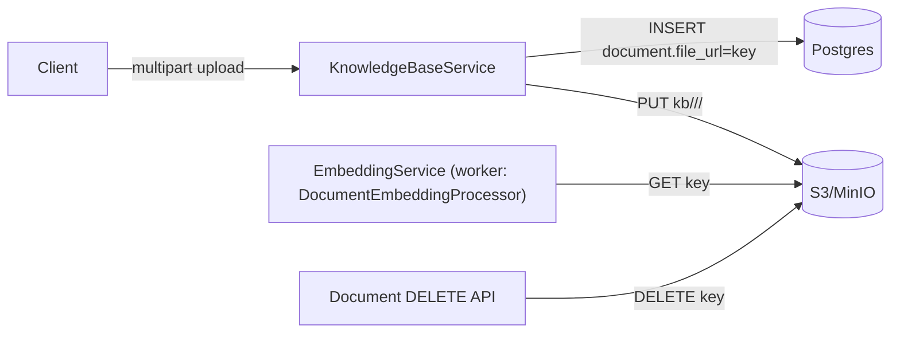

# Data Flow: 파일 저장소 (S3 / MinIO)

> 관련 spec: [Spec 아키텍처 §2.7](../0-overview.md) · [Spec 임베딩 파이프라인](../5-system/8-embedding-pipeline.md) · [data-flow 개요](./0-overview.md)

---

## Overview

### System role

바이너리 / 텍스트 원본 파일을 저장하는 단일 객체 저장소. 개발/셀프 호스팅은 MinIO (docker-compose),
SaaS 는 AWS S3 를 사용한다. 두 환경은 S3 API 호환이라 코드는 동일하다.
dev/e2e 환경에서는 docker-compose(`docker-compose.yml`/`docker-compose.e2e.yml`) 의 `createbuckets` mc job 이
기본 버킷 `workflow-storage` 를 자동 생성한다 (`mc mb --ignore-existing`) — "두 환경 코드 동일" 의 운영 전제.

코드 진입점:

- `codebase/backend/src/common/services/s3.service.ts` — `upload(key, body, contentType)`, `download(key)`, `delete(key)`, `deleteMany(keys)` (DeleteObjects 배치 — KB 삭제 cleanup 전용)
- ConfigService 키: `s3.bucket`, `s3.endpoint`, `s3.region`, `s3.accessKey`, `s3.secretKey`, `s3.publicBaseUrl`

---

## 1. Source → Sink — 실제 사용처

> 본 절은 **현재 코드 기준** 의 실제 사용처만 기재한다.

### 1.1 KB 문서 업로드 (현재 유일한 production 사용처)

```mermaid
flowchart LR
  C[Client] -->|multipart upload| KB[KnowledgeBaseService]
  KB -->|PUT kb/<kbId>/<docId>/<filename>| S3[(S3/MinIO)]
  KB -->|INSERT document.file_url=key| PG[(Postgres)]
  EP["EmbeddingService (worker: DocumentEmbeddingProcessor)"] -->|GET key| S3
  Del[Document DELETE API] -->|DELETE key| S3
```

코드 위치: `codebase/backend/src/modules/knowledge-base/knowledge-base.service.ts` (`uploadDocument` / `removeDocument`),
`codebase/backend/src/modules/knowledge-base/embedding/embedding.service.ts` (`s3Service.download`).
S3 GET 은 `EmbeddingService` 가 수행하고, 이를 호출하는 worker 는 `DocumentEmbeddingProcessor`
(`queues/document-embedding.processor.ts`) 다. 같은 큐 계열의 `GraphExtractionProcessor` 는 S3 를 직접 읽지 않는다.

| 동작 | 키 | 호출 |
| --- | --- | --- |
| 업로드 | `kb/<kbId>/<docId>/<sanitizedFilename>` (filename 은 `path.basename` 으로 traversal 방지 sanitize) | `s3Service.upload(s3Key, file.buffer, contentType)` |
| 파싱 단계 (worker) | 동일 키로 GET | `s3Service.download(doc.fileUrl)` |
| 문서 삭제 | 동일 키 DELETE | `s3Service.delete(doc.fileUrl)` (실패 시 warn 만 — DB row 는 삭제 진행) |

**업로드 시점 검증 게이트** (`uploadDocument` 가 S3 PUT 전에 수행 — S3 에 무엇이 들어갈 수 있는지를 정의):

1. `decodeMulterFilename` — multer 가 latin1 로 디코딩한 `originalname` 을 UTF-8 로 재해석 + NFC 정규화 (멀티바이트/한글 파일명 복원). `path.basename` sanitize 는 이 디코딩 **이후** 적용된다.
2. 확장자 화이트리스트 `ALLOWED_FILE_TYPES` (`txt`/`md`/`pdf`/`csv`) — 불일치 시 `INVALID_FILE_TYPE` 400 으로 거부. 제품 요구사항은 [KB 문서 관리 KB-DC-02](../4-nodes/3-ai/_product-overview.md) 참조.
3. `CONTENT_TYPE_MAP` 으로 확장자별 Content-Type 결정 (미등록 확장자 fallback `application/octet-stream`) 후 `s3Service.upload` 에 전달.

### 1.2 (Spec 상 정의되지만 미구현) Form 첨부

`spec/0-overview.md §2.7` 의 버킷 구조 (`{workspaceId}/forms/{executionId}/{fileId}_{filename}`) 는
현재 `codebase/backend/` 코드에서 `s3Service.upload` 를 호출하는 경로가 없다. Form 노드 기능이
도입될 때 본 문서를 갱신한다.

### 1.3 아바타 업로드 (구현됨)

진입점 `POST /api/users/me/avatar` ([프로필 §6.1](../2-navigation/9-user-profile.md)).
`multipart/form-data` 의 `file` 필드, multer `limits.fileSize` 2MB.

1. 확장자 화이트리스트 `png`/`jpg`/`jpeg`/`webp`/`gif` — 불일치 시 `INVALID_FILE_TYPE` 400,
   파일 부재·빈 내용은 `FILE_REQUIRED` 400. **SVG 는 의도적 제외** — 스크립트를 품을 수 있는
   유일한 이미지 포맷이라, 공개 URL 로 서빙하면 저장형 XSS 표면이 된다.
2. `Content-Type` 은 **확장자에서 파생**한다. 클라이언트가 보내는 `mimetype` 을 믿고 쓰면
   `text/html` 이 저장돼 같은 오리진에서 실행될 수 있다.
3. 키는 `avatars/{userId}/{uuid}.{ext}` (§2.1). 응답 `avatarUrl` 은 `s3.publicBaseUrl` (§2.3)
   기준의 **공개 URL** 이다 — 브라우저가 버킷에서 직접 익명 `GetObject` 한다.
4. 교체 시 옛 객체를 **DB 저장 뒤에** best-effort 로 지운다. 순서를 뒤집으면 저장이 실패했을
   때 사용자에게 **이미 지워진** 아바타를 가리키는 URL 이 남는다 — 고아 객체보다 나쁘다.

`PATCH /api/users/me` 의 `avatarUrl` 로 **외부 URL 을 넣는 경로도** 함께 유지된다. 두 경로가
같은 컬럼을 공유한다(§2.2).

---

## 2. Schema 매핑

### 2.1 S3 / MinIO

| Prefix / Key 패턴 | 흐름 | 사용 |
| --- | --- | --- |
| `kb/<kbId>/<docId>/<filename>` | KB 문서 | 현재 사용 |
| `<workspaceId>/forms/<executionId>/...` | Form 첨부 | spec 정의, 미구현 |
| `avatars/<userId>/<uuid>.<ext>` | 프로필 이미지 | **현재 사용 (공개 읽기)** |

### 2.2 Postgres (참조 컬럼)

| Table | 컬럼 | 의미 |
| --- | --- | --- |
| `document` | `file_url VARCHAR(500)` | S3 key (URL 이 아닌 raw key) |
| `user` | `avatar_url VARCHAR(500)` | 외부 URL(OAuth 제공자 사진 등) **또는** 자체 업로드 아바타의 공개 URL. 두 경로가 같은 컬럼을 공유하며, 자체 업로드 여부는 `avatars/{userId}/` 접두 포함으로 판별한다 |

### 2.3 ConfigService

| 키 | env 변수 | 의미 |
| --- | --- | --- |
| `s3.bucket` | `S3_BUCKET` | 버킷 이름 |
| `s3.endpoint` | `S3_ENDPOINT` | MinIO 는 `http://minio:9000`, AWS 는 `https://s3.<region>.amazonaws.com` |
| `s3.region` | `S3_REGION` | default `us-east-1` |
| `s3.accessKey`, `s3.secretKey` | `S3_ACCESS_KEY`, `S3_SECRET_KEY` | IAM 자격증명 또는 MinIO 사용자 |
| `s3.publicBaseUrl` | `S3_PUBLIC_BASE_URL` | 공개 오브젝트(아바타)를 **브라우저**가 가져갈 base URL. `s3.endpoint` 는 백엔드가 SDK 로 쓰는 내부 주소라 브라우저가 도달하지 못한다. 미설정 시 `S3_ENDPOINT` → `http://localhost:9000` 순 폴백(`resolvePublicBaseUrl`) |

> ⚠️ **근접 명명 주의**: `s3.publicBaseUrl` 은 **S3 전용**이며, webhook `callbackUrl` 조립에
> 쓰면 안 되는 `app.publicBaseUrl`/bare `publicBaseUrl` 과 무관하다. 후자는 실제 장애(Telegram
> webhook 거부)를 낸 적이 있어 회귀 테스트가 사용을 금지한다(`triggers.service.spec.ts`) —
> canonical 키는 `app.url` 이다. leaf 이름이 같으므로 grep 조사 시 네임스페이스를 함께 본다.

---

## 3. 라이프사이클

KB 도메인 외에는 라이프사이클이 정의되어 있지 않다. KB 의 라이프사이클은 다음과 같다:

| 이벤트 | S3 | Postgres |
| --- | --- | --- |
| 문서 업로드 | PUT key | INSERT `document.file_url=key` |
| 문서 재임베딩 | (key 동일 — 재 GET 만) | UPDATE `embedding_status, chunk_*` |
| 문서 삭제 | DELETE key (실패해도 진행) | DELETE document (CASCADE chunks) |
| KB 삭제 | 소속 document 전체 조회 후 `DeleteObjects` 배치 삭제 (1000키/요청 청크; best-effort, 부분 실패 warn) | DELETE knowledge_base (CASCADE documents) |

> KB 삭제 시 S3 객체 cleanup 은 `remove(id, workspaceId)` 가 소속 document 를 조회해 `s3Service.deleteMany(keys)` 를
> 호출하여 수행한다 (`knowledge-base.service.ts` `remove` — `DeleteObjectsCommand` 1000키/요청 청크 배치). best-effort
> 의미론은 동일: 부분 실패는 응답 `Errors[].Key` 를 일괄 warn, 명령 단위 실패(네트워크 등)도 warn 후 KB row 삭제 진행.
> 다만 삭제 시점에 warn 으로 스킵된 객체의 잔여 orphan 정리는 별도 GC batch 로 보강할 계획 (file-storage Rationale 참고).

---

## 4. 외부 의존

| 의존 | 방향 |
| --- | --- |
| AWS S3 / MinIO | 내부 → 외부 (PUT/GET/DELETE) |

---

## Rationale

### S3 key 패턴: workspace prefix 를 두지 않는 이유

KB 원본 문서의 S3 key 는 `kb/<kbId>/<docId>/<filename>` 으로, 워크스페이스 prefix 를 두지 않는다.
`spec/0-overview.md §2.7` 의 키 패턴 표·Rationale 가 단일 진실이며, 실제 코드
(`knowledge-base.service.ts` `uploadDocument` 의 `s3Key` 생성) 와 본 문서 모두 동일 패턴으로 정합돼 있다 (과거 `{workspaceId}/knowledge-base/...`
제안은 §2.7 에서 코드 기준으로 일원화됨 — 옵션 1 채택).

워크스페이스 prefix 가 없으므로 S3 정책 (`s3:GetObject` IAM condition) 의 키 prefix 만으로는 workspace 단위
격리를 강제하지 않는다. **두 영역의 사정이 다르다**:

- **KB 원본 문서** — 격리가 **필요하되** 키 prefix 로 하지 않는다. workspace 격리는
  **DB 권한 검증** 으로 보장한다 (키 prefix 격리는 비채택).
- **Avatar** — **격리 대상이 아니다.** 공개 읽기가 제품 결정이라(§1.3,
  [프로필 §6.1](../2-navigation/9-user-profile.md)) 워크스페이스 단위로 감출 것이 없다.
  접근 통제는 키의 UUID 추측 불가능성과 `ListBucket` 차단이 함께 담당한다.

두 근거 모두 [`spec/0-overview.md` Rationale § S3 객체 키 prefix 설계](../0-overview.md#s3-객체-키-prefix-설계--kb-원본과-avatar-키에서-workspaceid-제외-27) 가 단일 진실이다.

> 현재 코드에는 클라이언트용 다운로드 엔드포인트나 presigned URL(`getSignedUrl`/presigner) 사용처가 없다 —
> **인증이 필요한 오브젝트의** S3 GET 은 worker 임베딩 단계의 서버사이드 `s3Service.download` 뿐이다.
> **아바타는 예외다**: 공개 버킷 정책으로 브라우저가 직접 익명 `GetObject` 하며, 그래서 presigned URL 도
> 다운로드 엔드포인트도 필요 없다(§1.3). 인증 오브젝트에 대한 presigned URL 클라이언트 직접 다운로드는
> **미구현 (Planned)** 이며, 도입 시 워크스페이스 격리는 DB 권한 검증과 결합해 보강한다.

### `s3Service.delete` 실패가 warn 처리인 이유

문서 row 가 DB 에서 사라진 뒤 S3 객체만 남는 것은 storage cost 누수일 뿐 데이터 정합성 깨짐은 아니다.
역순 (S3 객체는 사라졌는데 DB row 가 남아 worker 가 404 로 fail) 이 훨씬 더 큰 UX 문제이므로 S3
삭제는 best-effort 로 둔다 (`knowledge-base.service.ts` 의 문서 삭제 `removeDocument` 와 KB 삭제 `remove` 가
동일 정책). 단건 경로(`removeDocument`)는 try/catch warn, 배치 경로(`remove` 의 `deleteMany`)는 응답
`Errors[].Key` 를 일괄 warn — 둘 다 동일한 best-effort 의미론이다 (비실존 키는 S3 멱등 의미론상 `Deleted` 로
반환되므로 warn 대상이 아니다). warn 으로 스킵돼 누적된 orphan 은 정기 GC batch 로 정리할 계획.
