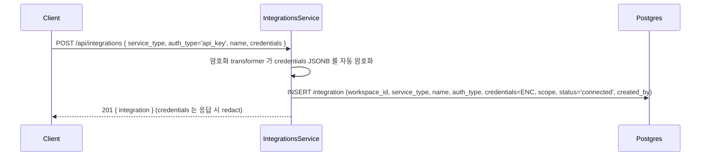
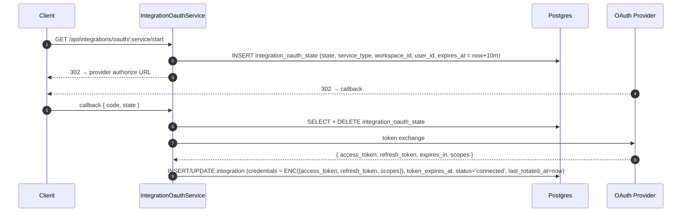
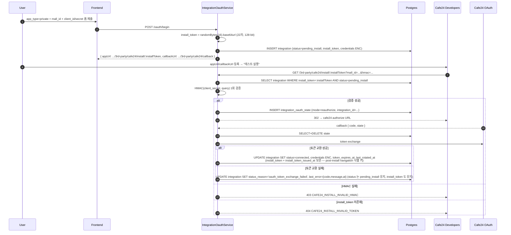
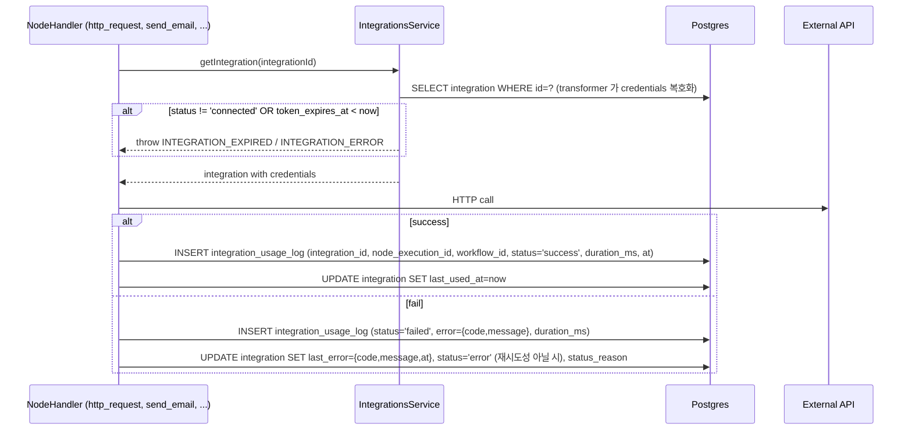
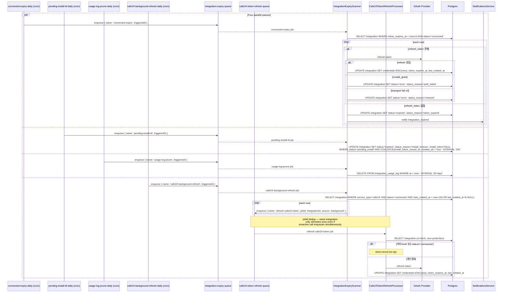
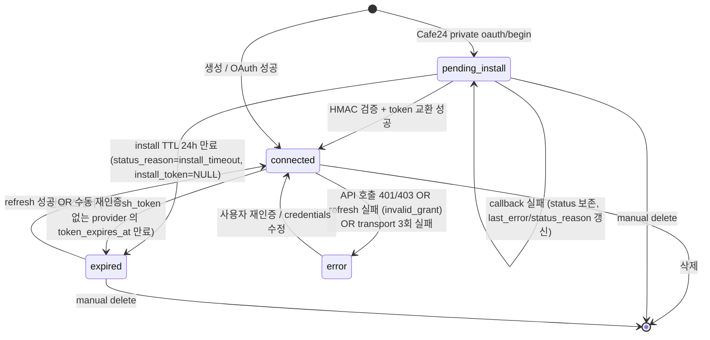

# Data Flow: 외부 통합 (Integration)

> 관련 spec: [Spec 통합 화면](../2-navigation/4-integration.md) · [데이터 모델 §2.10, §2.10.1](../1-data-model.md) · [data-flow 개요](./0-overview.md)

---

## Overview

### System role

외부 SaaS (Google·GitHub 등) 와 통신하기 위한 인증 정보·연결 상태를 저장한다. 노드 실행 시점에 해당
integration 의 credentials 를 가져와 외부 API 호출에 사용하고, 호출 결과는 `integration_usage_log`
에 기록한다. OAuth 토큰은 별도 만료 스캐너가 주기적으로 점검해 `expired` 로 마킹하거나 refresh 한다.

코드 진입점:

- `codebase/backend/src/modules/integrations/integrations.service.ts` — CRUD
- `codebase/backend/src/modules/integrations/integration-oauth.service.ts` — OAuth start / callback
- `codebase/backend/src/modules/integrations/integration-expiry-scanner.service.ts` — 만료 스캐너
- `codebase/backend/src/modules/integrations/services/credentials-transformer.ts` — `credentials` JSONB 의 AES 암호화 (entity column transformer)

---

## 1. Source → Sink

### 1.1 Integration 생성 (API Key)

### 1.2 OAuth 연결

> Cafe24 Private 앱의 install_token 기반 흐름은 [§1.2.1](#121-cafe24-private-앱--install_token-기반-흐름) 참고 (`POST /oauth/begin` → App URL 등록 → "테스트 실행" → callback). 부모 다이어그램의 `GET /oauth/:service/start` 는 일반 OAuth 의 표현이며 Cafe24 Private 는 별도 시작 흐름을 가진다.

#### 1.2.1 Cafe24 Private 앱 — install_token 기반 흐름

`pending_install` 행은 일일 만료 스캐너 (`integration-expiry` 큐) 가 동일하게 처리한다 — `COALESCE(install_token_issued_at, created_at) < now - 24h AND status='pending_install'` 인 행을 `status='expired', status_reason='install_timeout', install_token=NULL` 로 전이. 재사용 시 (변경 3, `createPrivatePendingIntegration` 의 기존 row 갱신 분기) `install_token_issued_at` 이 재발급 시점으로 갱신되므로 `created_at` 만 기준으로 했을 때 발생하던 "토큰 발급 직후 조기 만료" 회귀를 막는다. V044 이전 행은 `install_token_issued_at` NULL → `created_at` fallback 으로 옛 의미를 유지한다.

### 1.3 노드 실행에서 호출

### 1.4 OAuth 만료 스캐너 (BullMQ `integration-expiry`)

`integration-expiry` 큐 위에 **네 개의 독립 BullMQ 스케줄러**가 매일 00:00 UTC 에 각자 job 을 enqueue 한다 (2026-05-16 갱신 — 옛 3개에서 `cafe24-background-refresh` 추가). 각 job 은 자체 retry 정책 (`attempts: 3`, exponential backoff 60s)으로 BullMQ 가 재시도하며, 실패는 큐 메트릭에 그대로 노출된다.

| Job name | Scheduler id | 역할 |
| --- | --- | --- |
| `connected-expiry` | `connected-expiry-daily` | `status='connected' AND token_expires_at < now+Δ` 행을 refresh 시도. **(2026-05-16 갱신)** refresh 실패 시 `refresh_token invalid_grant` → `error(auth_failed)`, transport 3회 실패 → `error(network)` 로 전이 (옛 `expired(refresh_failed)` 분기 폐기 — REQ HIGH-2). refresh_token 없는 provider (예: GitHub) 는 여전히 `expired(token_expired)`. |
| `pending-install-ttl` | `pending-install-ttl-daily` | `status='pending_install' AND COALESCE(install_token_issued_at, created_at) < now-24h` 행을 `expired(install_timeout) + install_token=NULL` 로 전이 (Cafe24 Private 한정). TTL 기준은 V044 의 `install_token_issued_at` 으로 — 재사용 시 토큰 재발급 시점에 갱신되어 조기 만료 회귀를 막는다. NULL 인 V044 이전 행은 `created_at` fallback. |
| `usage-log-prune` | `usage-log-prune-daily` | `integration_usage_log` 90일 보존 외 행 삭제 |
| `cafe24-background-refresh` | `cafe24-background-refresh-daily` | **(2026-05-16 신규)** `status='connected' AND service_type='cafe24' AND (last_rotated_at < now-10d OR last_rotated_at IS NULL)` 행을 `cafe24-token-refresh` 큐 (jobId=integrationId dedup) 로 enqueue. enqueuer 역할만 — 실제 refresh 는 큐의 worker (`Cafe24TokenRefreshProcessor`) 수행. 14일 idle cafe24 통합의 refresh_token 자동 갱신. 임계 근거: refresh_token 14일 - 4일 안전 마진. |

**격리 정책**: 각 job 은 별도 BullMQ 단위라 한 job 실패가 다른 job 의 실행을 막지 않는다. `process(job)` 핸들러는 `job.name` 으로 분기만 하며 에러는 그대로 throw — BullMQ 가 `attempts=3` 까지 retry 한 뒤 실패 처리. 영구 실패한 job 은 큐의 failed 리스트에 남아 30일간 보존되어 alerting 으로 픽업 가능. **마이그레이션**: 옛 단일 `integration-expiry-daily` 스케줄러는 `onModuleInit` 에서 `removeJobScheduler` 로 제거된다 (idempotent).

---

## 2. Schema 매핑

### 2.1 Postgres

| Sink (table) | 흐름 | read/write 컬럼 | 인덱스 / 제약 |
| --- | --- | --- | --- |
| `integration` | 생성·갱신 | `workspace_id, service_type, name, auth_type, credentials (encrypted JSONB), scope, status, status_reason, install_token (Cafe24 private 전용), install_token_issued_at (TTL 기준), mall_id (Cafe24 전용, plain), token_expires_at, last_used_at, last_rotated_at, last_error, created_by` | `(workspace_id, name) UNIQUE` (V008/V001), `(workspace_id, status)` 배지 카운트 + pending_install TTL 스캐너 조회 겸용, `(workspace_id, service_type)`, `(token_expires_at)` 스캐너용 (V009). `install_token` 컬럼 V042 + partial UNIQUE V043. `install_token_issued_at` V044 (TTL 기준 분리), `mall_id` plain 컬럼 V045 + 부분 UNIQUE `(workspace_id, mall_id) WHERE service_type='cafe24' AND mall_id IS NOT NULL` V046 (CONCURRENTLY 라 분리). |
| `integration_usage_log` | 노드 실행 후 | INSERT `integration_id, node_execution_id, workflow_id, status, error?, duration_ms, at` | V008 `(integration_id, at DESC)`. 보존 90일 일일 배치 정리 |
| `integration_oauth_state` | OAuth start | INSERT `state, service_type, workspace_id, user_id, integration_id (reauthorize/private install 시), mode, requested_scopes, provider_meta (encrypted JSONB), expires_at = now+10m` | one-shot DELETE on callback. `state UNIQUE` (V009). `integration_id` FK → integration ON DELETE CASCADE (V009). `provider_meta` 컬럼 V041 추가 — cafe24 private 의 mall_id/client_id/client_secret 을 callback 까지 캐리. |

### 2.2 Redis

| 큐 | producer | consumer | payload | dedup |
| --- | --- | --- | --- | --- |
| `integration-expiry` | `IntegrationExpiryScanner` 의 4개 일일 스케줄러 (`connected-expiry-daily` / `pending-install-ttl-daily` / `usage-log-prune-daily` / `cafe24-background-refresh-daily`) | 동일 module 내 processor — `job.name` 으로 분기 | `{ triggeredAt: ISO }` (per-job 단일 data shape) | — |
| `cafe24-token-refresh` (2026-05-16 신규) | `Cafe24ApiClient` proactive (API 호출 직전) + `cafe24-background-refresh` 잡 (일일 idle 스캐너) | `Cafe24TokenRefreshProcessor` worker (`Cafe24Module` 소속) | `{ integrationId: UUID, source: 'background' \| 'proactive' }` | `jobId = integrationId` — 클러스터 전체에서 같은 통합의 refresh 가 단일 worker 실행으로 모임. 보존: `removeOnComplete: { age: 60 }`, `removeOnFail: { age: 300 }`. `attempts: 1` (refresh 실패는 거의 terminal — invalid_grant). |

### 2.3 외부

| Sink | 흐름 |
| --- | --- |
| OAuth provider | authorize / token / refresh |
| Service API | 노드 실행 본체 호출 (Google API, GitHub API, HTTP, ...) |

---

## 3. 상태 전이

### 3.1 `integration.status`

> **(2026-05-16 갱신)**: 옛 `connected --> expired: 만료 스캐너 OR refresh 실패` 화살표에서 "refresh 실패" 분기를 `connected --> error` 로 이동 (REQ HIGH-2). refresh 실패의 status_reason 은 `auth_failed` (invalid_grant) 또는 `network` (transport 3회 연속). `expired` 는 이제 (a) refresh_token 없는 provider 의 `token_expires_at` 만료 또는 (b) `pending_install` 24h TTL 의 두 경로만 유발.

### 3.2 `status_reason` 매핑

| status | status_reason 후보 |
| --- | --- |
| `error` | `insufficient_scope`, `auth_failed` (401/403 또는 refresh `invalid_grant`), `network` (transport 3회 연속 실패 — V049 `consecutive_network_failures` 카운터), `unknown`, `credentials_unreadable` |
| `expired` | `token_expired` (refresh_token 없는 provider 의 token_expires_at 만료), `install_timeout` (Cafe24 Private 24h TTL). **(2026-05-16 갱신)** 옛 `refresh_failed` 제거 — refresh 실패는 이제 `error(auth_failed)` 로 분류 (REQ HIGH-2). |
| `pending_install` | callback 실패 분기 코드: `oauth_token_exchange_failed`, `oauth_state_mismatch`, `oauth_state_expired` (모두 snake_case — DB 저장 표기. 동일 의미의 API 에러 코드는 `spec/2-navigation/4-integration.md §10.4` 의 `OAUTH_*` UPPER_SNAKE_CASE) — status 는 보존되지만 사용자가 진단 단서를 볼 수 있도록 채워짐. `resource_not_found` 는 row 자체가 사라진 케이스라 DB 갱신 불가 → 후보값에서 제외 |
| `connected` | NULL |

---

## 4. 외부 의존

| 의존 | 방향 | 참고 |
| --- | --- | --- |
| Execution 도메인 | cross-ref | 노드 실행 진입점 — `http_request`, `database_query`, `send_email` |
| Notifications | cross-ref | `integration_expired` 알림 |
| Audit | cross-ref | `integration.create/update/delete` 액션 |

---

## Rationale

### `credentials` JSONB AES 암호화

평문 저장 시 DB dump / replica 가 노출되면 외부 시스템 자격증명이 통째로 새어 나간다. TypeORM
`transformer` (`credentials-transformer.ts`) 를 column 단에서 적용해 ORM 경계에서 자동으로 암호화/복호화한다.
응답 직렬화 시 controller / DTO 단에서 `credentials` 필드를 redact 한다.

### `last_error` 도 암호화

OAuth 응답 본문에 token 일부가 포함될 수 있어 `last_error` 도 동일 transformer 로 암호화한다
(`integration.entity.ts:71~77`).

### `integration_usage_log` 보존 90일

상세 페이지의 "Recent activity" 는 최근 30~90일 데이터만 의미가 있다. 90일 이상 누적되면 row 수가
폭증하고 검색 성능이 떨어지므로 일일 배치로 정리한다 (`spec/1-data-model.md §2.10.1`).
